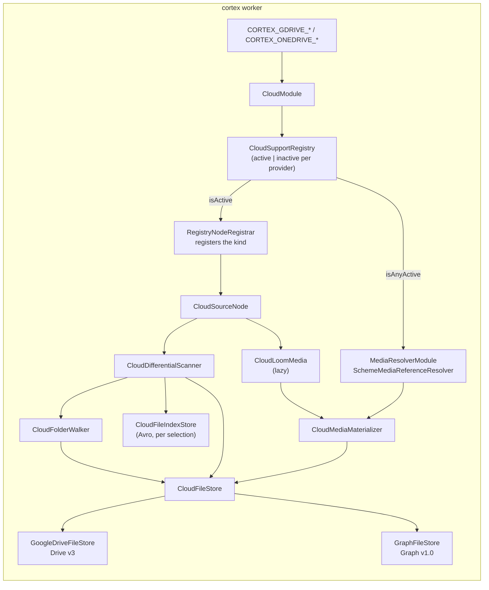

# Cloud Drive Source Nodes (`gdrive-source`, `onedrive-source`) — Google Drive and OneDrive Ingest

> **Status**: 🟢 **Built and shipping.** Two kinds, one node module
> [cortex/nodes/cloud-source/](../../../../cortex/nodes/cloud-source/) (flat, no `core/` submodule),
> package `io.metaloom.cortex.node.source.cloud`, on the shared provider seam
> [cortex/cloud-common/](../../../../cortex/cloud-common/). 89 + 129 + 17 + 7 unit tests and 10
> integration tests, none of which touch a network or a credential. Both contracts are in the
> generated `node-descriptors.json`, kept honest by `NodeSpecGoldenTest`.
> **Scope**: the two source kinds and the `cortex/cloud-common` module they stand on — enumeration,
> change detection, the persisted scan index, the `gdrive://` / `onedrive://` reference and the lazy
> materializer that turns one back into bytes.
> **Audience**: AI coding agents and humans working on
> [cortex/nodes/cloud-source/](../../../../cortex/nodes/cloud-source/) or
> [cortex/cloud-common/](../../../../cortex/cloud-common/).

**Out of scope, and where it lives instead:**

| Not here | There |
|---|---|
| The node system, lifecycle, registration, source-node contract | [../NODES.md](../NODES.md) §4, §3.4 |
| Port content types and cardinality across all nodes | [../../pipeline/NODE_DATA_TYPES.md](../../pipeline/NODE_DATA_TYPES.md) §4 |
| Rules for adding a node at all | [../../../guidelines/NEW_NODE.md](../../../guidelines/NEW_NODE.md) |
| The full `CORTEX_GDRIVE_*` / `CORTEX_ONEDRIVE_*` tables | [../../../cortex/CONFIGURATION.md](../../../cortex/CONFIGURATION.md) §2.3, §2.4, §6.2 |
| The S3 source, its three scan strategies and its shading hazard | [../s3-source/NODE_S3SOURCE.md](../s3-source/NODE_S3SOURCE.md) |
| How ingested files become assets at all | [../../../workflows/WORKFLOW_UPLOAD.md](../../../workflows/WORKFLOW_UPLOAD.md) |
| Bulk migration of an existing library | [../../../workflows/WORKFLOW_INGEST_MIGRATION.md](../../../workflows/WORKFLOW_INGEST_MIGRATION.md) |
| The two customer-facing pages and their screenshots | [../../../website/WEBSITE.md](../../../website/WEBSITE.md) § Node pages |

---

## 0. Executive Summary

| Question | Short answer |
|---|---|
| **What do they do?** | Enumerate a Google Drive or OneDrive/SharePoint folder subtree and emit one media handle per changed file |
| **How many node classes?** | Three: `CloudSourceNode` holds all behaviour, `GDriveSourceNode` and `OneDriveSourceNode` are empty subclasses that exist only to carry a second `@NodeSpec` (§2.1) |
| **Why two kinds and not one `cloud-source`?** | A kind is advertised **only when the worker holds that provider's credentials**. One kind could not express "Google yes, Microsoft no" (§2.2) |
| **Is SharePoint a third kind?** | No. A SharePoint document library *is* a Graph drive — `onedrive-source` reads it by drive id. There is no `sharepoint-source` |
| **Does the source download anything?** | No. It emits `gdrive://` / `onedrive://` references; bytes are fetched by whichever worker later runs a node task (§5) |
| **Is a rename detectable?** | Yes, and this is the one thing S3 cannot do — cloud file ids survive a rename and a re-parent (§4.1) |
| **Where does the scan state live?** | One Avro file per selection, under `<meta-path>/gdrive-index` / `onedrive-index`, keyed by **file id** (§4.3) |
| **Can credentials be node options?** | Never. `ParameterType` has no `SECRET` and a definition is stored in Postgres and rendered in the editor (§6) |

```
(no inputs)  ──▶  gdrive-source    ──▶  media : media/*  ONE   (gdrive://<driveId>/<fileId>/<name>)
(no inputs)  ──▶  onedrive-source  ──▶  media : media/*  ONE   (onedrive://<driveId>/<fileId>/<name>)
```



---

## 1. Why the nodes exist

Before them, media had to be on a mount (`filesystem-source`), in a bucket (`s3-source`), or already
an asset (`asset-source`). A large share of real libraries live in Google Drive and OneDrive, and the
only way to reach one was to sync it somewhere else first — which defeats differential scanning and
reintroduces the shared-mount requirement `s3-source` had just removed.

Cloud drives are in one respect a **better** fit than object storage: they have stable file ids and a
real change feed, so a re-run is one API call and a rename is genuinely distinguishable from a delete
plus an add.

---

## 2. Two kinds, one implementation

| Module | Contains |
|---|---|
| [cortex/cloud-common/](../../../../cortex/cloud-common/) | `CloudFileStore` (the provider seam), `GoogleDriveFileStore`, `GraphFileStore`, four OAuth token sources, `CloudHttp`, `CloudUri`, `CloudFileRef`, `CloudMediaMaterializer`, `CloudLoomMedia`, `CloudMediaReferenceResolver`, `CloudSupport`/`CloudSupportRegistry`, `CloudProviderId`, `CloudContentTypes` |
| [cortex/nodes/cloud-source/](../../../../cortex/nodes/cloud-source/) (flat) | `CloudSourceNode` + the two contract subclasses, `CloudDifferentialScanner`, `CloudFolderWalker`, `CloudFileIndex`/`CloudFileIndexStore`, `CloudScanResult`, `CloudSelection`, three options classes, `CloudSourceNodeModule` |
| `cortex/core` | `CloudModule` (builds the per-provider support values), `MediaResolverModule` (the composite reference resolver) |

`cloud-common` sits **beside** the node module rather than inside it, for the same reason
`s3-common` does: the materializer and the reference resolver must be on the classpath of *every*
worker that resolves a `gdrive://` reference, including workers whose kind whitelist excludes the
source kind. Materialization is lazy and happens wherever a node task lands, not where the scan ran.

### 2.1 Three classes, and why the plan's "one class" is wrong

The scanning, indexing and emission are provider-agnostic and live entirely in `CloudSourceNode`.
But the two node **contracts** are not the same object: they differ in name, icon, description, the
prose on seven of their nine shared parameters, and one option Google has that OneDrive refuses. A
class can carry only one `@NodeSpec`.

So `GDriveSourceNode` and `OneDriveSourceNode` are near-empty subclasses that add **no behaviour** —
they exist to carry their own annotation. The alternative, making `@NodeSpec` repeatable, would cost
`harvest(Class)` its single answer. `CloudSourceNode.create(...)` ends in a `switch (provider)` that
picks the subclass.

`OneDriveSourceNode`'s annotation is mostly `@ParamOverride`, because the fields live on the shared
`CloudSourceNodeOptions` whose `@ParamDoc` prose speaks Google: a "shared drive" is a "document
library", "trashed" files are "deleted" ones, and a Drive folder id comes from its URL while a
OneDrive one does not.

> ⚠️ **An override replaces the whole parameter.** `emitStates`' choice list has to be restated in the
> override; it is not inherited from the `@ParamDoc` being overridden. And note the deliberate absence
> of `order` on every override — the shared options class declares none, so declaration order is the
> contract, and ordering one parameter would force ordering all nine (an un-ordered parameter sorts
> behind every ordered one).

### 2.2 🔴 The kinds are advertised only when credentials are configured

`RegistryNodeRegistrar.registerAll()` loops `CloudProviderId.values()` and registers
`provider.kind()` **only** when `CloudSupportRegistry.get(provider).isActive()`; otherwise it logs
`"<Provider> is not configured on this worker; the '<kind>' kind is not advertised"`.

This is the whole reason there are two kinds instead of one with a `provider` parameter. A single
generic `cloud-source` kind could not express "this worker can serve Google but not Microsoft", and
Loom would dispatch a run that dies mid-flight instead of rejecting it up front. Seven
`NodeRegistrarTest` cases pin both directions per provider, including
`testConfiguringOnlyGoogleDoesNotAdvertiseOneDrive` — the case a generic kind could not express — and
`testS3AndCloudCanBeAdvertisedTogether`.

Activation itself is `CloudModule`: `isConfigured()` on the client options decides, and a
**half-filled** credential set is a hard boot failure naming the missing flag
(`partialConfigurationReason()`), never a silent `inactive()`. Turning a typo into a missing
capability produces exactly the dead-run failure mode the kinds are separate to avoid. A malformed
service-account key is likewise an `IllegalStateException` at boot, not a quiet inactive provider.

### 2.3 Dagger wiring — what is deliberately *absent*

`CloudSourceNodeModule` has **no** `@Binds @IntoSet FilesystemNode` and **no**
`@Binds @IntoMap @StringKey` binding. These are pipeline-level `MediaSourceNode`s, not
`FilesystemNode`s, so they are not part of the CLI's node set and not part of the executable-kind
multibinding — `filesystem-source`, `asset-source` and `s3-source` are registered by hand the same
way. The module provides only the two options beans and their
`CortexNodeOptionDeserializerInfo` entries.

---

## 3. The provider seam (`cortex/cloud-common`)

`CloudFileStore` is deliberately **one level deep**: an implementation lists the direct children of a
folder and never recurses. Recursion lives in `CloudFolderWalker`, which keeps both stores small,
makes `FakeCloudFileStore` trivial, and means depth limits and cycle guards are written and tested
once.

| Concern | Google Drive v3 | Microsoft Graph v1.0 | How the seam models it |
|---|---|---|---|
| Drive selection | absent drive id = My Drive | app-only has no `/me`; a drive id is required | `resolveDriveId(String)`; `CloudUri.MY_DRIVE = "my"` keeps every reference three-segment |
| Listing | `files.list?q='<id>' in parents` + `pageToken` | `/children` + `@odata.nextLink` | opaque `nextPageToken`; Graph stores the whole link in it |
| Delta | `changes.getStartPageToken` + `changes.list` | `/root/delta`, token inside `@odata.deltaLink` | `startDeltaToken` + `delta`; **both feeds are drive-wide** |
| Expired cursor | `404` on the page token | `410 Gone` + `resyncRequired` | `CloudDelta.tokenExpired` — a value, not an exception |
| Change token | `md5Checksum` else `version` | `cTag` else `eTag` | `changeToken()`, prefixed `md5:` / `v:` / `ctag:` / `etag:` |
| Native documents | Docs/Sheets/Slides have no bytes and no size | every item has bytes | `exportMimeType()`, non-null only on Google; `requiresExport()` |

Both clients are hand-rolled `java.net.http` against the REST APIs. No SDKs: the surface used is five
endpoints, and `google-api-services-drive` / `microsoft-graph` would drag Guava, the Google HTTP
stack, Azure Identity and `ServiceLoader` transports into the shaded cortex jar. A useful side effect
is that the shading hazard recorded in
[../s3-source/NODE_S3SOURCE.md](../s3-source/NODE_S3SOURCE.md) does not apply here at all.

### 3.1 `CloudHttp` — the retry policy, and Google's 403

* `429` and `5xx` retry up to `maxRetries` with capped exponential backoff plus jitter, honouring
  `Retry-After`.
* 🔴 **`403` is the trap.** Google reports throttling as `403` with a `rateLimitExceeded` /
  `userRateLimitExceeded` *reason*, not `429`. `CloudApiException.isRetryable()` parses the error body
  for exactly those reasons; a genuine permission error still fails immediately. Missing this makes
  Drive throttling read as a permission denial and kills the run.
* `401` retries exactly **once**, after invalidating the cached token — the only re-entrant path here,
  so it is capped separately rather than folded into the retry counter.

### 3.2 Token sources

`AbstractCachingTokenSource` is a `volatile` hot path plus a locked double-check, so N concurrent
tasks make one token request (pinned under 32 concurrent callers). Four concrete sources:
`GoogleServiceAccountTokenSource` (signed JWT assertion, optional domain-wide impersonation),
`GoogleRefreshTokenSource`, `MicrosoftClientCredentialsTokenSource` (app-only),
`MicrosoftRefreshTokenSource` (delegated). Both refresh-token paths are development-only; see §6.

Every token URL and API base URL is a **configurable option**, which is what lets the whole OAuth and
client surface be driven against an in-process stub server. Do not hard-code an endpoint in a store.

---

## 4. Change detection

Two modes, not S3's three. `startAfter` is deliberately **not** ported: it exists only because S3
keys are lexicographically ordered and append-only, and neither Drive nor Graph has an ordered key
space to resume from.

| Mode | Mechanism |
|---|---|
| `FULL_WALK` | Walk the selected subtree and diff it against the index. The delta cursor is taken **before** the walk, so a change made during a long walk is caught next run rather than falling between the two |
| `DELTA` | Read the change feed since the stored cursor. One request for a drive of any size |

`chooseMode`: never walked → `FULL_WALK`; reconcile due → `FULL_WALK`; `useDelta` off →
`FULL_WALK`; no stored cursor → `FULL_WALK`; else `DELTA`. A `tokenExpired` response returns `null`
from the delta path and the scan re-runs as a full walk, **once** — which is the entire point of
reporting expiry as a value rather than throwing.

### 4.1 🔴 `MOVED` is real here, and not on S3

`classify()`: no index entry → `NEW`; change token or size differs → `MODIFIED` (content wins over
position); parent or name differs → `MOVED`; else `PRESENT`. A cloud file id survives a rename and a
re-parent and the index records both the name and the parent, so `CloudFileRef.movedFrom()` yields a
genuine move. Object storage has no stable identity, so a rename there is indistinguishable from a
delete plus an add — which is why `s3-source` omits the state rather than inventing renames from
colliding ETags.

Two selection-scoped refinements that are easy to get wrong:

* a file that **left** the subtree is `DELETED`, not `MOVED` — from the pipeline's point of view it is
  gone;
* a file that **entered** it is `NEW`, even though its id existed elsewhere in the drive all along.

Both kinds therefore advertise the full `[NEW, MODIFIED, MOVED, PRESENT, DELETED]` list and default
to `[NEW, MODIFIED, MOVED]` — matching `filesystem-source` (which has inodes), not `s3-source`.

> ⚠️ **`MOVED` depends on a content-stable change token.** Google's `md5Checksum` is one and is
> present for every uploaded binary file; the `version` fallback is not — Drive bumps it on every
> change, metadata included — so an item with no checksum (native documents, shortcuts) reports a
> rename as `MODIFIED`. That errs toward over-reporting, the safe direction, and it does not affect
> media. Microsoft's `cTag` is content-stable, which is why it is preferred over `eTag`.

`differsFrom()` degrades gracefully: a null token on either side compares **size alone**, so a
provider that withheld a token does not report every file as modified on every run.

### 4.2 The one genuine approximation

Both change feeds are **drive-wide**, and a delta entry names only the item's immediate parent.
Deciding whether a changed file lies inside the selected folder means walking up the parent chain,
which `CloudDifferentialScanner` does for at most `PARENT_LOOKUP_DEPTH` (**8**) hops, answered from
the index where possible and memoised per scan. An unresolvable chain is treated as **outside** — the
conservative direction, which can delay a file but never invent one.

That, and only that, is why `reconcileIntervalMs` survives. It defaults to **24 h** rather than S3's
6 h, because a delta feed is a provider guarantee about content, unlike a bucket notification that
can simply be lost. Setting it to `0` disables the forced walk entirely.

### 4.3 The index

Apache Avro, like `S3ObjectIndexStore`, keyed by **file id** — which is what makes `MOVED` possible
at all. Folders are indexed alongside files, because subtree membership is decided by asking whether
a parent is a known folder. Per-file Avro metadata carries `lastFullScanMillis`, `deltaToken` and
`accountId`; a credential change **discards** the index rather than reporting another account's files
as deleted.

Index path: `<indexBaseDir>/sha256(scheme/account/drive/folder/recursive/maxDepth).avro`.

* The credential is in the key for the same reason an S3 endpoint is — two credentials see different
  subsets of one drive, so sharing an index between them corrupts both.
* `recursive` / `maxDepth` are in the key because a shallow index is a **strict subset**: reusing it
  for a deeper selection would report the whole subtree as `PRESENT` and emit nothing.

A full walk **rebuilds** the index rather than merging into it — an index that kept stale entries
would keep reporting files that have left the selection. The index tracks everything the selection
contains regardless of what is emitted, so a file filtered out by `emitStates` today does not look
brand new tomorrow.

---

## 5. Media addressing

References are `<scheme>://<driveId>/<fileId>/<fileName>`. `CloudUri` is a record over a `String`,
never a `Path`: `Paths.get("gdrive://d/f/x.mp4")` collapses the double slash.

The file name is in the reference because two independent consumers need an extension and a cloud
file id has none: cortex detects media type from the path (`FilterHelper.isVideo(path())`), and
Loom's `DaoAssetSink` derives both the asset filename and its MIME type from
`Paths.get(reference).getFileName()`. The `fileId` segment is what identifies the file, so the name
segment is addressing decoration — it is **sanitized** (Drive names may legitimately contain `/`) and
the true name lives in the index. Percent-encoding was rejected: `%2F` would leak into the asset
filename.

### 5.1 🔴 Two deliberate deviations from `S3LoomMedia`

Both exist because a Google native document is a file with **no size** — a case object storage never
presents:

* **`size()` never materializes.** `S3LoomMedia.size()` falls back to downloading when the size is
  unknown, which is safe there because an S3 listing always reports one. `SourceTaskRunner` asks every
  enumerated item for its size inside a `catch` that would hide the cost, so that fallback here would
  download every Google Doc during enumeration. `-1` is a legal answer the runner already tolerates.
  (`CloudLoomMediaTest.testSizeIsMinusOneForANativeDocRatherThanDownloading`)
* **`exists()` reads an explicit `present` flag**, not `size >= 0`. `AbstractMediaNode` asks every item
  whether it exists before doing any work, so the question must stay free.
  (`CloudLoomMediaTest.testExistsIsTrueForANativeDocWithNoSize`)

### 5.2 The materializer

`CloudMediaMaterializer` downloads lazily into
`<cacheRoot>/<first 4 hex of sha256(provider/drive/file)>/<sha256>-<changeToken><ext>`, writing to a
partial file and moving it into place. The **change token is in the cache path**, so an edited file
gets a new cache entry rather than serving stale bytes. Eviction is LRU-by-mtime down to 90 % of
`maxCacheBytes` once the budget is exceeded; `0` disables it.

> 🔴 **The change token is opaque provenance, never a hash and never a dedup key.** `md5:` happens to
> be one for Google binaries; `v:`, `ctag:` and `etag:` are not. The Avro schema doc says so in the
> file itself.

### 5.3 The reference resolver became a composite

`MediaReferenceResolver` used to be provided by a single `if/else` in `S3Module` — honest while
`s3://` was the only remote scheme, untenable with three. It moved to `MediaResolverModule` as a
`SchemeMediaReferenceResolver` holding one branch per active remote, falling back to a local path.

A worker with nothing remote configured still gets **literally** `new MediaReferenceResolver(loader)`
— the same object as before any of this existed; the composite appears only when there is something
to compose. `S3MediaReferenceResolver` gained only an `implements` clause and a three-line `handles`,
and its seven existing tests pass unedited. `CloudMediaReferenceResolver.handles()` is
`providerOf(reference) != null && registry.isActive(provider)`, so a reference to a cloud this worker
cannot reach falls through rather than failing inside the branch.

---

## 6. Configuration

Worker-level only. **Credentials must never be node options**: a pipeline definition is stored in
Postgres and rendered verbatim in the editor, and `ParameterType` has no `SECRET`.

**Auth modes, and they are not equal:**

| Provider | Production | Development only |
|---|---|---|
| Google | service-account key, optionally with domain-wide impersonation | OAuth refresh token — expires after 7 days for an app in Google's "Testing" publishing status |
| Microsoft | app-only client credentials (a concrete tenant + client id + secret) | delegated refresh token — Microsoft rotates it on every use and a stateless worker cannot persist the replacement |

Both refresh-token paths log a WARN on first use saying so.

### 6.1 Environment variables

The exhaustive tables (18 `CORTEX_GDRIVE_*`, 15 `CORTEX_ONEDRIVE_*`) are in
[../../../cortex/CONFIGURATION.md](../../../cortex/CONFIGURATION.md) §2.3 and §2.4. The shape both
providers share, from `CloudClientOptions`:

| Variable (`<P>` = `GDRIVE` \| `ONEDRIVE`) | Default | Meaning |
|---|---|---|
| `CORTEX_<P>_DEFAULT_DRIVE_ID` | — | Drive used when a node names none. Effectively required for Microsoft app-only |
| `CORTEX_<P>_CACHE_PATH` | `<meta-path>/gdrive_bin` · `onedrive_bin` | Where materialized files land |
| `CORTEX_<P>_INDEX_PATH` | `<meta-path>/gdrive-index` · `onedrive-index` | Where scan indexes land |
| `CORTEX_<P>_MAX_CACHE_BYTES` | `53687091200` (50 GiB) | Cache budget; `0` disables eviction |
| `CORTEX_<P>_MAX_OBJECT_SIZE` | `0` | Largest file to materialize; `0` = unbounded |
| `CORTEX_<P>_RECONCILE_INTERVAL_MS` | `86400000` (24 h) | How long the change feed may be trusted before a full walk is forced (§4.2); `0` disables |
| `CORTEX_<P>_REQUEST_TIMEOUT_MS` | `60000` | Per-request timeout |
| `CORTEX_<P>_MAX_RETRIES` | `5` | Retries for a throttled or 5xx request |
| `CORTEX_<P>_API_BASE_URL` | `https://www.googleapis.com` · `https://graph.microsoft.com/v1.0` | Overridable so the client can be pointed at a stub server |

Credential variables, per provider: `CORTEX_GDRIVE_SERVICE_ACCOUNT_JSON` / `_FILE` /
`_IMPERSONATE_SUBJECT`, or `CORTEX_GDRIVE_CLIENT_ID` + `_CLIENT_SECRET` + `_REFRESH_TOKEN`;
`CORTEX_ONEDRIVE_TENANT_ID` + `_CLIENT_ID` + `_CLIENT_SECRET`, or the same pair plus
`_REFRESH_TOKEN`. Plus `CORTEX_GDRIVE_EXPORT_NATIVE_DOCS` (worker default for the node option) and
`CORTEX_GDRIVE_SCOPES` / `CORTEX_GDRIVE_TOKEN_URL` / `CORTEX_ONEDRIVE_SCOPES` /
`CORTEX_ONEDRIVE_AUTHORITY_URL`.

### 6.2 Node options

Nine shared, plus one Google-only. All are `gdrive-source.*` / `onedrive-source.*` YAML defaults and
per-node JSON fields; the JSON value wins, then the configured default, then the hard-coded one.

| Option | Type | Default | Notes |
|---|---|---|---|
| `driveId` | `STRING` | — | Resolves definition → node defaults → `CORTEX_<P>_DEFAULT_DRIVE_ID`, then through `store.resolveDriveId()`. Google: unset = My Drive. Microsoft app-only: required, and the failure names the setting |
| `folderId` | `STRING` | — | Empty scans the whole drive |
| `recursive` | `BOOLEAN` | `true` | Descend below the selected folder |
| `maxDepth` | `INTEGER` | `0` | `0` = unlimited |
| `suffixes` | `STRING` | — | Comma-separated, e.g. `mp4,mkv,jpg`; a leading dot is stripped |
| `mimeTypes` | `STRING` | — | Comma-separated **prefixes**, e.g. `video/,image/`. A cloud item carries a real MIME type, so this catches an extension-less video and rejects a `.mp4` that is not one |
| `emitStates` | `ENUM_SET` | `[NEW, MODIFIED, MOVED]` | Choices `NEW, MODIFIED, MOVED, PRESENT, DELETED` |
| `useDelta` | `BOOLEAN` | `true` | Use the change feed instead of walking |
| `includeTrashed` | `BOOLEAN` | `false` | Keep trashed / recycled items |
| `exportNativeDocs` | `BOOLEAN` | `false` | 🔴 **`gdrive-source` only.** On `onedrive-source` it is a `@ParamOverride(hidden = true)` and setting it is a **validation error**, not a silent no-op |
| `enabled` | `BOOLEAN` | `true` | Standard, from `AbstractNodeOptions` |
| `processIncomplete`, `retryFailed` | | | `@ParamOverride(hidden = true)` on both kinds — no source descriptor has ever advertised them; they are media-processing knobs |

`validate()` rejects a negative `maxDepth`, a `driveId` or `folderId` containing `/` (an id, not a
path), and an unknown `emitStates` entry; `validateProviderSpecific()` is the hook OneDrive uses for
`exportNativeDocs`. Validation runs in the registrar **before** the node is built, so a bad option
surfaces at pipeline start rather than per item.

---

## 7. Key Classes Reference

| Class | Module · package | Purpose |
|---|---|---|
| `CloudSourceNode` | `nodes/cloud-source` · `…node.source.cloud` | All behaviour for both kinds; cold `stream()`, emits `reference()`, `lastState()` |
| `GDriveSourceNode` / `OneDriveSourceNode` | same | Contract-only subclasses carrying `@NodeSpec` (§2.1) |
| `CloudSourceNodeOptions<T>` | same | The nine shared options, `validate()`, `DEFAULT_EMIT_STATES` |
| `GDriveSourceNodeOptions` / `OneDriveSourceNodeOptions` | same | `KEY = "gdrive-source"` / `"onedrive-source"`; `exportNativeDocs` and its refusal |
| `CloudSourceNodeModule` | same | Dagger: two options beans + two deserializer infos. **No `@StringKey` binding** (§2.3) |
| `CloudDifferentialScanner` | same | Full walk vs delta, `MOVED` classification, subtree filtering, index path derivation |
| `CloudFolderWalker` | same | The only recursion in the design; depth limit + cycle guard |
| `CloudFileIndex` / `CloudFileIndexStore` | same | The Avro index, keyed by file id; `accountId`, `deltaToken`, `lastFullScanMillis` |
| `CloudSelection` | same | What one node instance points at; `accepts()`, `emits()`, `mayDescend()`, the CSV parsers |
| `CloudScanResult` | same | Emitted refs + their states + the mode that produced them |
| `CloudFileStore` | `cloud-common` · `…cortex.cloud` | The provider seam; one level deep by design |
| `GoogleDriveFileStore` / `GraphFileStore` | same (`.gdrive` / `.graph`) | Drive v3 / Graph v1.0 over `java.net.http` |
| `GoogleDriveJson` / `GraphJson` | same | Wire→`CloudFileRef` mapping, including the change-token prefixes |
| `CloudHttp` / `CloudApiException` | same `.http` | Bearer injection, retry incl. Google's 403, one-shot 401 refresh, streaming download |
| `AbstractCachingTokenSource` | same `.auth` | `volatile` hot path + locked double-check: N tasks, one token request |
| `GoogleServiceAccountTokenSource`, `GoogleRefreshTokenSource`, `MicrosoftClientCredentialsTokenSource`, `MicrosoftRefreshTokenSource` | same `.auth` | The four grants |
| `CloudUri` / `CloudFileRef` | same | The three-segment reference; the item record with `differsFrom` / `movedFrom` |
| `CloudMediaMaterializer` / `CloudLoomMedia` | same | Lazy download keyed on the change token; `size()`/`exists()` never fetch |
| `CloudMediaReferenceResolver` | same | The `gdrive://` / `onedrive://` branch of the composite resolver |
| `CloudSupport` / `CloudSupportRegistry` | same | "Is this cloud configured" as a value, never a nullable binding |
| `CloudProviderId` | same | scheme · kind · display name · cache dir · index dir, and the two lookups |
| `CloudModule` / `MediaResolverModule` | `cortex/core` · `…cli.dagger` | Per-provider support values; the composite resolver |
| `RegistryNodeRegistrar` | `cortex/cli` · `…cli.dagger` | The conditional advertisement and the JSON→node builder (§2.2) |

---

## 8. Conventions and Gotchas

* 🔴 **Never put a credential on a node option.** `ParameterType` has no `SECRET`; definitions are
  stored in Postgres and rendered in the editor.
* 🔴 **The change token is not a hash.** Never dedup on it. `md5:` is a checksum by accident of
  Google's API; `v:`, `ctag:` and `etag:` are not.
* 🔴 **Do not hard-code provider endpoints in a store.** Every base and token URL is an option — that
  is what makes the whole client surface testable against `StubHttpServer`.
* **Four strings must match** for a kind to be reachable: the options `KEY`, the `@NodeSpec` `nodeId`,
  the descriptor `kind`, and the string `RegistryNodeRegistrar` registers (`CloudProviderId.kind()`).
* **`size()` may legitimately be `-1`** and `exists()` may be true anyway. Anything consuming a
  `CloudLoomMedia` must tolerate both (§5.1).
* **Changing `recursive` or `maxDepth` starts a new index**, by design — it is in the index key.
  Expect a full re-emit after such an edit.
* **A shallow selection cannot reuse a deep index and vice versa**; that is the same rule stated from
  the other side.
* ⚠️ **`lastStates` is per-JVM.** When the source's own NODE_TASK lands on a different worker than the
  one that ran the SOURCE_TASK, `lastState()` reads `UNKNOWN`. Inherited from both other sources; it
  matters slightly more here because `MOVED` is a state this source can actually produce.
* ⚠️ **No asset appears in Loom without a hash node.** `DaoAssetSink` keys on `HASH_SHA512`, so any
  working example reads `gdrive-source → sha512 → …`.
* **Regenerating the descriptors**: install the node module *before* harvesting, or the harvest reads a
  stale jar. See [../../../guidelines/NEW_NODE.md](../../../guidelines/NEW_NODE.md).

---

## 9. Progress Assessment

### Done

- [x] `cortex/cloud-common`: the `CloudFileStore` seam, both hand-rolled clients, `CloudHttp`, the four
      OAuth grants, `CloudUri`/`CloudFileRef`, the lazy materializer and `CloudLoomMedia`
- [x] `cortex/nodes/cloud-source`: `CloudSourceNode` + the two contract subclasses, scanner, walker,
      Avro index store, selection, three options classes, Dagger module
- [x] Both kinds in `node-descriptors.json` with one `media : media/*` `ONE` output port and no inputs;
      pinned by `NodeSpecGoldenTest`
- [x] Conditional advertisement per provider in `RegistryNodeRegistrar`, with a boot failure on a
      half-filled credential set and seven `NodeRegistrarTest` cases pinning both directions
- [x] Two scan modes, cursor-before-walk, one-shot fallback on an expired cursor, bounded parent-chain
      resolution, forced reconcile walk
- [x] `MOVED` / `DELETED` refinements scoped to the selection; index keyed by file id, discarded on a
      credential change
- [x] `MediaResolverModule` composite resolver; a worker with nothing remote still gets the plain
      `MediaReferenceResolver`
- [x] 18 `CORTEX_GDRIVE_*` and 15 `CORTEX_ONEDRIVE_*` variables through `CortexEnvOptions`
- [x] 242 unit tests across the four modules (129 + 89 + 17 + 7) + 10 integration tests, with no
      credential and no network
- [x] Customer docs pages `website/content/english/docs/nodes/gdrive-source/` and
      `…/onedrive-source/`, each with `config.png` and `debug.png`
- [x] loom-ui node fixtures for both kinds

### Follow-ups these nodes create

- [ ] **No resumable download.** An interrupted large transfer restarts from zero. Same property as the
      S3 materializer; both providers support `Range`, so this is a real follow-up for large-video
      archives.
- [ ] **`lastStates` is per-JVM**, so a cross-worker dispatch loses the diff state. Shared with
      `filesystem-source` and `s3-source`; fixing it means carrying the state on the task rather than
      in the node instance.
- [ ] **Google Docs export is off by default and capped at 10 MB** of output by Google. The seam
      (`exportMimeType`) exists so the decision is reversible without an index migration.
- [ ] **The parent-chain budget is fixed at 8 hops** (`PARENT_LOOKUP_DEPTH`) and is not configurable. A
      deeper hierarchy silently defers files to the reconcile walk.

### Deliberately not built

- [ ] **No demo pipeline.** `DemoDatabaseInitializer` is untouched: a Google or Microsoft tenant
      credential cannot exist in the demo image, so a seeded `gdrive-source` pipeline could only fail —
      the precedent [../../../guidelines/NEW_NODE.md](../../../guidelines/NEW_NODE.md) §4 records for
      the GPU sidecar nodes.
- [ ] **No `sharepoint-source` kind.** A SharePoint document library is a Graph drive; `onedrive-source`
      reads it by drive id and its descriptor says so. A third kind would advertise a capability that is
      not separately configurable.
- [ ] **No S3-style `startAfter` resume.** Neither provider has an ordered key space, and delta is
      strictly better (§4).
- [ ] **No write path.** These are sources; `s3-sink` is the only sink in the tree.

---

## 10. Test Setup

No credentials and no network anywhere in the suite.

```bash
# The provider seam, both clients, the grants, the materializer (129)
./mvnw -o -pl cortex/cloud-common test

# Node, scanner, walker, index store, selection, options (89)
./mvnw -o -pl cortex/nodes/cloud-source test

# CloudModule activation and paths + the composite resolver in all four configurations (17)
./mvnw -o -pl cortex/core test -Dtest='CloudModuleTest+MediaResolverModuleTest'

# The capability gate, both directions, per provider (7 of them)
./mvnw -o -pl cortex/cli test -Dtest=NodeRegistrarTest

# The generated contract equals the annotated nodes
./mvnw -o -pl integration-test test -Dtest=NodeSpecGoldenTest

# End to end against an in-process Loom + pooled Postgres (10)
./setup-pool.sh
./mvnw -o -pl integration-test test -Dtest=CloudSourceNodeIntegrationTest
```

Two fakes carry the suite, both in the `cloud-common` **test-jar**:

* **`FakeCloudFileStore`** — an in-memory store whose change feed is *real*: every mutation appends to
  a monotonic log and `delta()` replays it. A canned change list would pass whether or not the scanner
  handled moves and removals correctly.
* **`StubHttpServer`** — a scriptable `com.sun.net.httpserver`. Because every token URL and API base
  URL is an option, the OAuth grants and both provider clients are driven against it end to end.

| Test | What it guards against |
|---|---|
| `CloudDifferentialScannerTest` (20) | The wrong mode chosen; a cursor taken after the walk; an expired cursor throwing instead of falling back; a file that left the subtree reported `MOVED`; a file that entered it reported anything but `NEW`; an unbounded parent-chain walk; a credential change reporting another account's files as deleted |
| `CloudSourceNodeTest` (28) | A hot `stream()` that does not re-scan; enumeration downloading; `absolutePath()` emitted instead of `reference()`; defaults not falling through from the worker config; the wrong subclass built for a provider |
| `CloudSelectionTest` (14) | Suffix/MIME filters accepting folders or trashed items; depth arithmetic off by one; unknown state names throwing |
| `CloudFileIndexStoreTest` (7) · `CloudFolderWalkerTest` (7) | Avro round-trip loss; a folder cycle looping forever; a depth limit not honoured |
| `CloudSourceNodeOptionsTest` (13) | A path accepted where an id is required; a negative depth; `exportNativeDocs` silently ignored on OneDrive |
| `GoogleDriveFileStoreTest` (18) · `GraphFileStoreTest` (13) | Real URL shapes, pagination cursors, delta-link parsing, `410 Gone`/`404` mapped to `tokenExpired`, export routing |
| `CloudHttpTest` (14) | Google's `403 rateLimitExceeded` treated as a permission error; an un-honoured `Retry-After`; a 401 refresh loop |
| `CachingTokenSourceTest` (6) · `TokenSourceTest` (10) | N concurrent callers making N token requests; a malformed assertion |
| `CloudLoomMediaTest` (11) | The two §5.1 guards, by name |
| `NodeRegistrarTest` (7 cloud cases) | A kind advertised without credentials, or missing with them; Google-only advertising OneDrive too |
| `CloudSourceNodeIntegrationTest` (10) | The **real** Drive client against `StubDriveApiServer` — real URLs, real JSON mapping, real signed assertion, real materializer — ending in a SHA-512 that reaches an `asset` row over REST |

> `StubDriveApiServer` models Drive faithfully enough to matter: it returns `md5Checksum`, and the
> first version of it did not — which made a rename read as `MODIFIED` and is what surfaced the
> change-token nuance in §4.1.

---

## 11. Where do I find …?

| Need | Path |
|---|---|
| The node and its two contracts | [cortex/nodes/cloud-source/…/CloudSourceNode.java](../../../../cortex/nodes/cloud-source/src/main/java/io/metaloom/cortex/node/source/cloud/CloudSourceNode.java) · `GDriveSourceNode.java` · `OneDriveSourceNode.java` |
| The options + `validate()` | `…/source/cloud/CloudSourceNodeOptions.java` and the two subclasses |
| Change detection | `…/source/cloud/CloudDifferentialScanner.java` |
| The persisted index and its schema | `…/source/cloud/CloudFileIndexStore.java` · [cloud-file-index.avsc](../../../../cortex/nodes/cloud-source/src/main/avro/cloud-file-index.avsc) |
| The provider seam | [cortex/cloud-common/…/CloudFileStore.java](../../../../cortex/cloud-common/src/main/java/io/metaloom/cortex/cloud/CloudFileStore.java) |
| The two clients | `…/cortex/cloud/gdrive/GoogleDriveFileStore.java` · `…/cortex/cloud/graph/GraphFileStore.java` |
| HTTP, retry and Google's 403 | `…/cortex/cloud/http/CloudHttp.java` |
| The four OAuth grants | `…/cortex/cloud/auth/` |
| The reference format | `…/cortex/cloud/CloudUri.java` |
| Lazy media and the cache | `…/cortex/cloud/CloudMediaMaterializer.java` · `CloudLoomMedia.java` |
| Where a kind gets advertised | [cortex/cli/…/RegistryNodeRegistrar.java](../../../../cortex/cli/src/main/java/io/metaloom/cortex/cli/dagger/RegistryNodeRegistrar.java) |
| Where support is built from config | [cortex/core/…/CloudModule.java](../../../../cortex/core/src/main/java/io/metaloom/cortex/cli/dagger/CloudModule.java) · `MediaResolverModule.java` |
| The tests | `cortex/cloud-common/src/test/…` · `cortex/nodes/cloud-source/src/test/…` |
| The integration test and its Drive stub | `integration-test/…/node/CloudSourceNodeIntegrationTest.java` · `StubDriveApiServer.java` |
| The docs fixture recipe | `integration-test/…/node/docs/SourceRecipes.java` (`driveSource`) |
| The customer pages | [website/content/english/docs/nodes/gdrive-source/index.adoc](../../../../website/content/english/docs/nodes/gdrive-source/index.adoc) · [onedrive-source/index.adoc](../../../../website/content/english/docs/nodes/onedrive-source/index.adoc) |
| The env-var tables | [../../../cortex/CONFIGURATION.md](../../../cortex/CONFIGURATION.md) §2.3, §2.4, §6.2 |
| The node system as a whole | [../NODES.md](../NODES.md) |
| The port/content-type model | [../../pipeline/NODE_DATA_TYPES.md](../../pipeline/NODE_DATA_TYPES.md) |
| Rules for building the next node | [../../../guidelines/NEW_NODE.md](../../../guidelines/NEW_NODE.md) |
| How ingest reaches an asset | [../../../workflows/WORKFLOW_UPLOAD.md](../../../workflows/WORKFLOW_UPLOAD.md) · [WORKFLOW_INGEST_MIGRATION.md](../../../workflows/WORKFLOW_INGEST_MIGRATION.md) |

---

_Git HEAD revision: `8c153347`_
_Last updated: 2026-08-11_
