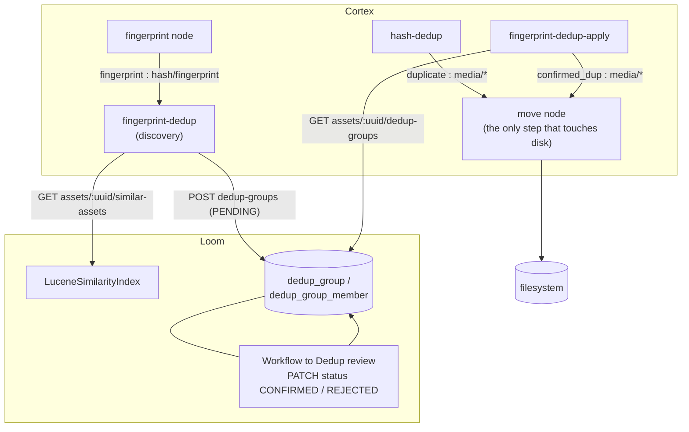

# Dedup Nodes (`hash-dedup`, `fingerprint-dedup`, `fingerprint-dedup-apply`) — Find Duplicates, Decide Nothing

> **Status**: 🟢 **Built and shipping.** Three kinds plus one alias, module
> [cortex/nodes/dedup/](../../../../cortex/nodes/dedup/), package `io.metaloom.cortex.node.dedup`.
> 28 module tests, `DedupGroupEndpointTest` (14), `DedupGroupDaoTest` (7), and 35 loom-ui tests.
> No model, no sidecar, no environment variables. Contracts in the generated `node-descriptors.json`,
> kept honest by `NodeSpecGoldenTest`.
> **Scope**: the three nodes — their ports, options, algorithm, safeguards and what they write back to
> Loom. The review model's schema and REST surface appear here only as far as the nodes touch them.
> **Audience**: AI coding agents and humans working on
> [cortex/nodes/dedup/](../../../../cortex/nodes/dedup/).

**Out of scope, and where it lives instead:**

| Not here | There |
|---|---|
| The human review step — screen, keystrokes, test ids, optimistic rollback | [../../../workflows/WORKFLOW_DEDUP.md](../../../workflows/WORKFLOW_DEDUP.md) |
| The node system, lifecycle, registration, kind counts | [../NODES.md](../NODES.md) |
| Port content types and cardinality across all nodes | [../../pipeline/NODE_DATA_TYPES.md](../../pipeline/NODE_DATA_TYPES.md) §4.6 |
| Rules for adding a node at all | [../../../guidelines/NEW_NODE.md](../../../guidelines/NEW_NODE.md) |
| `dedup_group` / `dedup_group_member` as domain entities | [../../../loom/DOMAIN.md](../../../loom/DOMAIN.md) |
| The similarity index discovery queries | [SEARCH_LUCENE.md](../../../loom/SEARCH_LUCENE.md) |
| The `READ/CREATE/UPDATE/DELETE_DEDUP` permission model and how to grant it in tests | [../../permissions/PERMISSIONS.md](../../permissions/PERMISSIONS.md) |
| Actually relocating a duplicate on disk | `move` — [../NODES.md](../NODES.md) §3 |
| The reference algorithm these nodes were ported from | `xdb-clean/FPDEDUP_PROCESS.md` |

---

## 0. Executive Summary

| Question | Short answer |
|---|---|
| **What do they do?** | Identify redundant copies — exactly (`hash-dedup`) or perceptually (`fingerprint-dedup`) |
| **Do they move files?** | 🔴 **No. Not one of the three.** They report findings on selective output ports; a downstream `move` node acts (§1) |
| **Why three kinds?** | Near-duplication is a judgement call, so it is split: discover → a human decides → apply (§2) |
| **Which one writes to the schema?** | Only `fingerprint-dedup`, and only `dedup_group` rows. The other two are ledger-only (§5) |
| **How is a keeper chosen?** | Largest **complete** candidate; the group is abandoned outright if any duplicate is larger (§3) |
| **What stops a stale decision?** | Apply re-verifies the keeper live — existence, completeness, size, exclude-folder **and content** (§4) |
| **Is the review UI real?** | 🟢 Yes. `DeduplicationMode` in `WorkflowView.tsx` against the live routes — the "mock" claim is stale |
| **Environment variables?** | None in this module. The only gate is `LOOM_SIMILARITY_ENABLED` on the Loom side (§6) |

```
hash : hash/*             ──▶  hash-dedup              ──▶  duplicate     : media/*      (selective)
                                                       ──▶  original      : scalar/string

fingerprint : hash/fingerprint ──▶ fingerprint-dedup    ──▶  (no output ports — writes a PENDING group)

hash : hash/*             ──▶  fingerprint-dedup-apply ──▶  confirmed_dup : media/*      (selective)
                                                       ──▶  keep_path     : scalar/string
```

---

## 1. 🔴 These nodes decide; they do not act

The single most important fact about this family, and the one most likely to be mis-remembered:
**`hash-dedup` and `fingerprint-dedup-apply` used to move files themselves** into a `dupFolder`
option, and no longer do. `dupFolder` is gone from `DedupNodeOptions` entirely.

The reason is visibility. A `dupFolder` set in worker YAML made the destination, the conflict policy
and whether the original survived invisible to whoever drew the pipeline. Wiring `duplicate` /
`confirmed_dup` into a `move` node makes all three properties of the graph instead. Idempotency moved
with it: a `move` node knows its own destination and skips an item already inside it, which a dedup
node could only ever answer for one hard-coded folder.

> ⚠️ **A `cortex.yml` that still carries `dupFolder` boots fine and silently does nothing.**
> `CortexOptionsLoader` sets `FAIL_ON_UNKNOWN_PROPERTIES = false`. An operator who upgrades without
> re-wiring their pipeline will find duplicates stop being moved with nothing in the log to say why.
> This belongs in release notes, not just here.

**Both media ports are selective**: silence is the "nothing to do" signal, exactly as a filter's
bucket ports work ([../../pipeline/NODE_DATA_TYPES.md](../../pipeline/NODE_DATA_TYPES.md) §4.6). A
node that emits nothing on a run has not failed.

---

## 2. The three kinds

| Kind | Class | Processable when | What it decides |
|---|---|---|---|
| `hash-dedup` (alias `sha512-dedup`) | `HashDedupNode` | `media.getSHA512() != null` | Loom already knows this exact content at a different live path |
| `fingerprint-dedup` | `FingerprintDedupNode` | `media().isVideo()` | These N videos look like the same footage — *proposed*, for a human |
| `fingerprint-dedup-apply` | `FingerprintDedupApplyNode` | `media.getSHA512() != null` | A reviewer confirmed this item is redundant **and** its keeper is still intact |

All three are `category = OUTPUT`, `defaultMode = SEQUENTIAL`, `defaultConcurrency = 1`, and hide
`processIncomplete` / `retryFailed` via `@ParamOverride` — the dedup descriptors have only ever
advertised `enabled` of the three common knobs.

### 2.1 ⚠️ `hash-dedup` and `sha512-dedup` are one class under two ids

`DedupNodeModule` binds `HashDedupNode` twice:

```java
@Binds @IntoMap @StringKey("sha512-dedup")  abstract FilesystemNode<?, ?> kindHashDedup(HashDedupNode node);
@Binds @IntoMap @StringKey("hash-dedup")    abstract FilesystemNode<?, ?> kindHashDedupAlias(HashDedupNode node);
```

`@NodeSpec` carries a single `nodeId`, and it declares **`hash-dedup`** — so that is the kind in
`node-descriptors.json` and the one placeable from the editor palette. But `name()` returns
**`sha512-dedup`**, so ledger rows say `sha512-dedup` whichever id was placed. `sha512-dedup` is a
pure alias kept so older pipeline definitions still resolve; it is runnable with no descriptor, which
is why [../../pipeline/NODE_DATA_TYPES.md](../../pipeline/NODE_DATA_TYPES.md) §3.3 counts it among the
two such kinds. **Do not "fix" this by renaming.**

---

## 3. `fingerprint-dedup` — discovery

Never reads, moves or alters a file. Its whole output is a `PENDING` row in Loom.

1. **Gate.** Skip when offline, when `client() == null`, when the asset is unknown to Loom, or when
   `asset.getFingerprint().getFingerprintV1()` is null.
2. **Query.** `listSimilarAssets(uuid, algorithm, topK, scoreThreshold)` — the Lucene HNSW k-NN over
   256-dim fingerprints ([SEARCH_LUCENE.md](../../../loom/SEARCH_LUCENE.md)). A thrown
   query is a `failure`; an empty result is a `skip`.
3. **Candidate set** = the query asset at score `1.0`, plus each hit **self-excluded by uuid**, each
   re-loaded with `loadAsset` for its `size` and `zeroChunkCount`. Fewer than two candidates skips.
4. **KEEP = the largest *complete* candidate**, where complete means `zeroChunkCount` is null or `0`.
   If none is complete the group is skipped — unless `allowPartial`, in which case the largest overall
   wins.
5. 🔴 **Abort on a larger duplicate.** With `abortOnLargerDup` (the default), if *any* candidate is
   larger than the KEEP the **whole group is abandoned**, not just that member. A duplicate bigger
   than the keeper means the keep selection is wrong, not that one member is odd.
6. **Propose.** `createDedupGroup` with `status = PENDING`, one `KEEP` member and N `DUP` members, and
   a group `score` of the **minimum** member score.
7. **Ledger.** `recordNodeResult(SUCCESS, "<n> duplicate candidate(s)", algorithm,
   resultRef("dedup_group", uuid))`.

### 3.1 ⚠️ A `200` from `POST /dedup-groups` is not a discovery

Idempotency is entirely **server-side**, in `DedupGroupEndpointService.createDedupGroup`, in two
halves:

* **PENDING upsert** — `findPendingByKeep(keep, algorithm)`, then delete and recreate.
* **Decided-set guard** — `listDecidedByAssets(memberUuids, algorithm)`. On an exact member-set match
  nothing is written and the decided group is returned with **`200`**; a fresh proposal answers
  **`201`**.

`FingerprintDedupNode` reads the returned `status` and reports `skipped` rather than recording a
SUCCESS ledger row for a no-op. **A node that ignores the status reports a phantom find on every
run.** Do not add a client-side idempotency key.

Two deliberate choices inside the guard, both pinned by tests:

* **The comparison is on the whole member set**, not "this asset appears in a decided group" — the
  latter would suppress a genuinely new duplicate of an already-reviewed file.
* **Roles are ignored.** After a KEEP reassignment the same two files can come back with roles
  swapped; that is still the same decision.

---

## 4. `fingerprint-dedup-apply` — the gate on confirmed decisions

For each group `listAssetDedupGroups(uuid)` returns, it continues unless **`status == CONFIRMED`**
*and* this asset is a member with `role = DUP`. Then it loads the KEEP and re-verifies it against the
live filesystem. Only when all five safeguards pass does it write `confirmed_dup` and `keep_path` and
record a ledger row.

| # | Safeguard | Why |
|---|---|---|
| 1 | The KEEP exists on disk | The review record may be months old |
| 2 | The KEEP is complete (`zeroChunkCount` null or `0`) | Never discard the more-complete file |
| 3 | `keep.size >= dup.size` | Never discard the larger file |
| 4 | The KEEP is not inside `keepExcludeFolder` | The residue of `dupFolder`, §4.2 |
| 5 | 🔴 The KEEP still hashes to what Loom recorded | §4.1 |

> 🔴 **The `size` / `zero_chunk_count` columns on `dedup_group_member` are discovery-time snapshots**
> — hints for the review UI, not authority. Apply re-checks all five against the live file regardless.

The node is otherwise deliberately quiet: an asset in no group, in only PENDING/REJECTED groups, or
whose keeper fails a safeguard produces `skipped` and silence on both ports.

### 4.1 The content check trusts the xattr, and is not an unconditional re-hash

Existence, size and completeness say nothing about *content*: a file replaced in place between
discovery and apply passes all three while no longer being the duplicate's counterpart. Deleting the
other copy at that point loses the only remaining original.

`hashOf()` goes through `LoomMediaImpl.getSHA512()`, which reads the `loom_sha512` xattr (and the
legacy `sha512sum` key) and digests only when neither is present — writing it back for next time. Two
non-failures by design:

* **An asset with no *recorded* hash passes.** There is nothing to compare a fresh digest against.
* **A filesystem with no user-xattr support falls back to a direct digest** rather than blocking every
  decision on the storage backend.

Neither of those is a mismatch. A hash that *is* recorded and *does* differ blocks the decision and
logs both values at `warn`.

### 4.2 `keepExcludeFolder` is the one safeguard that could not move downstream

It asks a question about the **KEEP**, and a `move` node only ever sees the duplicate. An operator who
trashes duplicates into `/data/trash` should set this to the same folder, so a keeper that has itself
already been trashed can never be used to justify discarding another file. Containment is
`PathContainment.isInside`, so a sibling folder with a matching name prefix is not a match
(`testASiblingFolderWithAMatchingPrefixIsNotTheExcludeFolder`).

Empty by default, i.e. **off**.

> ⚠️ `keepExcludeFolder` lives on the shared `DedupNodeOptions`, so it appears in the **`hash-dedup`
> descriptor too** — where `HashDedupNode` never reads it. Setting it there does nothing.

---

## 5. `hash-dedup` — exact duplicates

If Loom already knows an asset for this SHA-512, and its recorded file exists at a *different* path,
and re-hashing that path confirms the same content, then the local copy is the duplicate: emit
`duplicate` (this path) and `original` (the known path), plus a ledger row.

Every other branch is an `info` or a `skip`: no recorded path, the recorded path is gone, it is the
same file, either side has vanished, or the hashes differ.

### 5.1 🔴 Never put an interactive read in a worker node

`HashDedupNode` *used to* call `System.in.read()` on a size mismatch between the local file and the
database record — hanging a headless worker forever on a condition needing a human. It now logs both
paths at `error` and returns `skipped`. `HashDedupNodeTest`'s
`testASizeMismatchIsSkippedRatherThanBlockingForInput` carries a `@Timeout` and **fails by hanging**
if that ever comes back.

---

## 6. Persistence, permissions and configuration

| Kind | Writes | Ledger |
|---|---|---|
| `fingerprint-dedup` | `dedup_group` + `dedup_group_member` via `POST /api/v1/dedup-groups` | `result_ref = dedup_group:<uuid>` |
| `fingerprint-dedup-apply` | nothing | ledger only, `"fpdup of <keepPath>"` |
| `hash-dedup` | nothing | ledger only, `"duplicate of <path>"` |

Schema: `V2.61__add_dedup_group.sql` (the `dedup_status` enum, both tables, three indexes, the role
CHECK, `UNIQUE (group_uuid, asset_uuid)`) and `V2.62__add_dedup_permission.sql`
(`READ/CREATE/UPDATE/DELETE_DEDUP`). Entity detail is in
[../../../loom/DOMAIN.md](../../../loom/DOMAIN.md); the routes are in
[../../../workflows/WORKFLOW_DEDUP.md](../../../workflows/WORKFLOW_DEDUP.md).

The nodes need `CREATE_DEDUP` (discovery) and `READ_DEDUP` (apply). `creator_uuid` / `editor_uuid` are
nullable because a Cortex worker is not a user.

### 6.1 Options

All are node options, all descriptor parameters — set them in the pipeline editor or in YAML
([../NODES.md](../NODES.md) §7). Every one inherits `enabled`, `processIncomplete`, `retryFailed` and
`timeoutMs` from `AbstractNodeOptions`; `CortexOptions` sets a per-node timeout default of `60000` ms
for the `dedup` key.

| Options key | Option | Type | Default | Meaning |
|---|---|---|---|---|
| `dedup` (`hash-dedup`) | `keepExcludeFolder` | `STRING` (Path) | *(empty)* | Advertised but **unread by this node** — §4.2 |
| `fingerprint-dedup-apply` | `keepExcludeFolder` | `STRING` (Path) | *(empty)* | Never act when the keeper itself lives here |
| `fingerprint-dedup` | `algorithm` | `STRING` | `metaloom-multisector-v1` | Must match what the upstream fingerprint node produced; must be non-blank |
| | `scoreThreshold` | `NUMBER` | `0.10` | k-NN cutoff; must be `>= 0` |
| | `topK` | `INTEGER` | `10` | Neighbours examined per item; must be `> 0` |
| | `allowPartial` | `BOOLEAN` | `false` | Form a group when no member is known complete |
| | `abortOnLargerDup` | `BOOLEAN` | `true` | Abandon the group if any duplicate is larger than the keeper |

⚠️ `hash-dedup` and `fingerprint-dedup-apply` share the `DedupNodeOptions` **class** but are
configured under **different keys** (`dedup` and `fingerprint-dedup-apply`) — three
`CortexNodeOptionDeserializerInfo` registrations for two classes.

### 6.2 Environment variables

**The dedup module reads none.** The only variable that gates this feature end to end is on the Loom
side:

| Variable | Default | Effect |
|---|---|---|
| `LOOM_SIMILARITY_ENABLED` | see [SEARCH_LUCENE.md](../../../loom/SEARCH_LUCENE.md) | When false, `NoopSimilarityIndex` is bound and the similarity routes answer **503** — deliberately not an empty list, so `fingerprint-dedup` fails loudly rather than silently finding nothing |

---

## 7. Architecture



---

## 8. Conventions and Gotchas

| Area | Gotcha |
|---|---|
| **Nothing here moves a file** | 🔴 All three nodes report on ports. `dupFolder` is gone. A pipeline without a downstream `move` node finds duplicates and changes nothing — which is the intended default (§1) |
| **Stale `dupFolder` in YAML is silent** | ⚠️ Unknown properties do not fail the loader, so an un-migrated worker boots happily and quietly stops moving duplicates (§1) |
| **Two lifecycles** | 🔴 Discovery writes review items; apply acts on human decisions. Never let discovery write a port, and never let apply act on `PENDING` or `REJECTED` |
| **Snapshots are not authority** | 🔴 `size` / `zero_chunk_count` on a member row are discovery-time hints for the UI. Apply re-checks the live file — all five safeguards (§4) |
| **Trust the xattr, do not re-hash** | ⚠️ The content check reads `loom_sha512` and digests only when no attribute exists. A missing *recorded* hash passes; a missing xattr *layer* falls back to a direct digest. Neither is a mismatch (§4.1) |
| **A larger DUP aborts the whole group** | ⚠️ Not "drop that member". A duplicate bigger than the keeper means the keep selection is wrong |
| **Idempotency is server-side** | ⚠️ Both halves live in `DedupGroupEndpointService.createDedupGroup`. Not in the node. Do not add a client-side key (§3.1) |
| **`200` from POST is not a discovery** | ⚠️ `201` means proposed, `200` means already decided and nothing written. Ignore the status and you log a phantom find every run (§3.1) |
| **`hash-dedup` vs `sha512-dedup`** | ⚠️ Two `@StringKey`s onto one class. Descriptor says `hash-dedup`; `name()` says `sha512-dedup`, so that is what lands in the ledger either way. Deliberate alias (§2.1) |
| **`keepExcludeFolder` on `hash-dedup`** | ⚠️ Advertised through the shared options class and **never read** by that node (§4.2) |
| **`keepAssetUuid` vs `role`** | 🔴 `updateStatus` writes only the denormalised pointer, so a reviewer's KEEP reassignment leaves the member roles describing the machine's original choice. **Readers must prefer `keepAssetUuid` when set** |
| **No in-memory DAO** | ⚠️ `loom/db/memory` does not mirror `DedupGroupDao`, following the `AssetNodeResultDao` precedent. The jOOQ impl is exercised against the pooled database |
| **First asset-to-asset relation** | 🔴 Respect the cascade split: `SET NULL` on `keep_asset_uuid` (deleting the kept asset must not erase the review record), `CASCADE` on members (a membership without its asset is meaningless) |
| **Offline mode** | ⚠️ Both fingerprint nodes are no-ops when `client() == null` or offline. The workflow needs Loom **and** an enabled similarity index |
| **Failure handling is split** | ⚠️ Apply uses `ctx.failure(...).abort()` and reports its cause; discovery uses `ctx.failure(...).next()`, where `NodeContextImpl.next()` reads `skipReason` but not `failureCause` — so the message is dropped and the state reports SUCCESS. See the node-wide list in [../NODES.md](../NODES.md) |
| **Test package is not the main package** | ⚠️ The three node tests live in `io.metaloom.loom.cortex.dedup`, the option tests in `io.metaloom.cortex.node.dedup`. Grepping only the main package finds half of them |
| **Thumbnail safeguard dropped** | ⚠️ `xdb-clean` compares generated thumbnails before declaring a near-duplicate. MetaLoom gates on fingerprint score plus size/completeness only — a deliberate gap, recorded so it is not rediscovered as a bug |

---

## 9. Key Classes Reference

| Class | Package / module | Purpose |
|---|---|---|
| `FingerprintDedupNode` | `io.metaloom.cortex.node.dedup` (`cortex/nodes/dedup/core`) | Discovery — similarity query to PENDING group; the private `Candidate` record carries size/completeness/score |
| `FingerprintDedupApplyNode` | same | The gate on CONFIRMED groups; the five live safeguards |
| `HashDedupNode` | same | Exact-hash duplicates; emits `duplicate` / `original` |
| `FingerprintDedupDiscoverOptions` | same | Key `fingerprint-dedup`; the five discovery knobs + `validate()` |
| `DedupNodeOptions` | same | `keepExcludeFolder`; registered under **both** `dedup` and `fingerprint-dedup-apply` |
| `DedupNodeModule` | same | Dagger — 3 `@IntoSet` binds, **4** `@StringKey` kind binds, 3 option deserializers |
| `PathContainment` | `io.metaloom.cortex.fs` | `isInside` — prefix-safe folder containment |
| `LoomMediaImpl` | `io.metaloom.cortex.common.media.impl` | Owns the `loom_sha512` xattr precedence the content check relies on |
| `DedupGroupDao` / `DedupGroup` / `DedupGroupMember` | `io.metaloom.loom.db.model.dedup` (`loom/db/api`) | Review-record contract — `findPendingByKeep`, `listDecidedByAssets`, keyset `loadPage` |
| `DedupGroupDaoImpl` | `io.metaloom.loom.db.jooq.dao.dedup` | jOOQ impl (no memory impl) |
| `DedupGroupEndpointService` | `io.metaloom.loom.rest.service.impl` | Both halves of the server-side idempotency (§3.1) |
| `DedupGroupResponse`, `DedupGroupMemberModel` | `io.metaloom.loom.rest.model.dedup` | DTOs; `STATUS_*` and `ROLE_KEEP` / `ROLE_DUP` constants the nodes compare against |
| `DedupGroupMethods` | `io.metaloom.loom.client.common.method` | Client interface (6 methods) |
| `LuceneSimilarityIndex` | `io.metaloom.loom.similarity.lucene` | HNSW k-NN over `MultiSectorFingerprint` vectors |
| `AbstractMediaNode` | `io.metaloom.cortex.common.node` | Lifecycle + `recordNodeResult` / `resultRef` |

---

## 10. Progress Assessment

### Done

- [x] Module, three node classes, two options classes, `DedupNodeModule`, kind bindings in `NodeCollectionModule`
- [x] Four `@StringKey` bindings including the `hash-dedup` ↔ `sha512-dedup` alias; asserted by `NodeRegistrarTest`
- [x] Three annotation-generated descriptors in `node-descriptors.json`, pinned by `NodeSpecGoldenTest`
- [x] 🟢 **The port supersede**: no node moves files, `dupFolder` removed, `keepExcludeFolder` introduced, selective media ports on both acting nodes
- [x] All five discovery options exposed as descriptor parameters — reachable from the pipeline editor, not YAML-only
- [x] Discovery: self-exclusion, largest-complete KEEP, `allowPartial`, `abortOnLargerDup`, min-score group, `dedup_group` result ref
- [x] Server-side idempotency: PENDING upsert **and** decided-set guard; the node reports a `200` as `skipped`
- [x] Apply: CONFIRMED-only gating plus all five live safeguards including the content check
- [x] `HashDedupNode` logs and skips a size mismatch instead of blocking on `System.in.read()`
- [x] `V2.61` / `V2.62`, `DedupGroupDao` + jOOQ impl, six REST routes with keyset paging, DTOs, Java + Python clients
- [x] 28 module tests, `DedupGroupEndpointTest` (14), `DedupGroupDaoTest` (7) incl. both delete cascades
- [x] 🟢 Review UI is **real**, not a mock — `DeduplicationMode` in `WorkflowView.tsx` against the live routes, with optimistic write and rollback ([../../../workflows/WORKFLOW_DEDUP.md](../../../workflows/WORKFLOW_DEDUP.md))
- [x] Demo data: `DemoDatabaseInitializer.seedDemoDedupGroup` seeds one PENDING group over `city-traffic.mp4` and its 720p re-encode — both real files from `demo-content/videos/`, so the proposal is over footage a hasher would genuinely pair, and `seedFingerprintComps` seeds the fingerprints that pair would have been discovered from — one bit apart, which is the `0.5` the group records ([../../../loom/SEARCH_LUCENE.md](../../../loom/SEARCH_LUCENE.md) §4.2)
- [x] Customer docs `website/content/english/docs/nodes/dedup/index.adoc` with `nodeviz`, plus the review screen in `docs/ui/index.adoc`

### Open

- [ ] 🔴 **`PATCH keepAssetUuid` does not rewrite `dedup_group_member.role`.** `DedupGroupDaoImpl.updateStatus` sets only the denormalised pointer, so pointer and roles diverge after a reviewer reassigns the keeper. Rewriting the roles server-side is the real fix
- [ ] **No per-node E2E.** Nothing under `integration-test/` or `e2e-test/` exercises the dedup runtime; `NodeSpecGoldenTest` only spot-checks that `fingerprint-dedup` is present in the harvest. Target: two near-identical demo videos → fingerprinted → discovery proposes a PENDING group → `PATCH` CONFIRMED → apply emits `confirmed_dup` → a `move` node relocates it → re-running is a no-op
- [ ] **`toResponse` is N+1** — one `loadMembers` query per group. Bounded by the page size, but still a join waiting to be written
- [ ] **`keepExcludeFolder` is advertised on `hash-dedup` and never read there** (§4.2). Either split the options classes or hide the parameter on that descriptor
- [ ] **Discovery still uses `ctx.failure(...).next()`** on both its failure paths, so the cause is dropped and the state reports SUCCESS. Apply already uses `.abort()`
- [ ] **Dead move-era imports** in `HashDedupNode` and `FingerprintDedupApplyNode` (`FileUtils`, `Files`, `Path`, `FileAlreadyExistsException`) survived the supersede

### Deliberately not built

- [ ] **No thumbnail dominant-colour safeguard.** `xdb-clean` compares generated thumbnails before declaring a near-duplicate; this family gates on fingerprint score plus size/completeness only
- [ ] **No multi-partial ranking.** MetaLoom has a single `is_complete` / `zero_chunk_count` signal, not `xdb-clean`'s multi-partial ordering
- [ ] **No delta / incremental sync.** Apply does an idempotent per-asset fetch every run. When corpus size makes that expensive, add a worker-side processed-group index (the `S3DifferentialScanner` Avro pattern) plus `GET /api/v1/dedup-groups?confirmedAfter=`
- [ ] **No in-memory `DedupGroupDao`**, following the `AssetNodeResultDao` precedent

---

## 11. Test Setup

```bash
# 28 module tests - no Loom, no database; LoomClient is a Mockito seam
./mvnw -o -pl cortex/nodes/dedup/core -am test

# The generated contract equals the annotated nodes
./mvnw -o -pl integration-test test -Dtest=NodeSpecGoldenTest

# All four kinds resolve in the Dagger graph
./mvnw -o -pl cortex/cli test -Dtest=NodeRegistrarTest

# DAO + endpoint - pooled Postgres required
./setup-pool.sh
./mvnw -o -pl loom/db/jooq test -Dtest=DedupGroupDaoTest
./mvnw -o -pl loom/core   test -Dtest=DedupGroupEndpointTest
```

| Test | Count | What it guards against |
|---|---|---|
| `FingerprintDedupNodeTest` | 3 | A wrong KEEP/DUP split; a group proposed when a duplicate is larger than the keeper; a decided candidate set writing a phantom SUCCESS ledger row |
| `FingerprintDedupApplyNodeTest` | 12 | PENDING or REJECTED acted on; the KEEP itself emitted; a missing, incomplete, smaller or **content-changed** keeper slipping through; a keeper with no recorded hash wrongly blocked; a keeper inside the exclude folder acted on; a sibling folder with a matching name prefix wrongly treated as the exclude folder |
| `HashDedupNodeTest` | 4 | A known-elsewhere copy not reported; **a size mismatch blocking on stdin** (the `@Timeout` is the real assertion); a file reported as its own duplicate; an unknown file acted on |
| `DedupNodeOptionsValidationTest` | 5 | `keepExcludeFolder` wrongly required; common-option validation lost |
| `FingerprintDedupDiscoverOptionsValidationTest` | 4 | Blank `algorithm`, `topK <= 0`, negative `scoreThreshold` reaching the runtime instead of failing at pipeline start |
| `DedupGroupDaoTest` | 7 | Store/load, `listByStatus`, `listByAsset`, `findPendingByKeep` + `updateStatus`, `listDecidedByAssets` (PENDING and other algorithms excluded), invalid-role acceptance, 🔴 group-delete cascade, 🔴 asset-delete removing memberships and nulling `keep_asset_uuid` |
| `DedupGroupEndpointTest` | 14 | Create + load, PENDING idempotency, decided sets answering 200 and writing nothing, a different set still answering 201, keyset paging, confirm/reject, list-by-asset, delete, invalid status, empty members, 404, every route's `403`, `READ_DEDUP` not granting `UPDATE` |
| `NodeRegistrarTest` | — | `sha512-dedup`, `fingerprint-dedup`, `fingerprint-dedup-apply` missing from the kind map |
| loom-ui | 12 + 17 + 6 | `dedup.test.ts`, `dedupGroups.test.ts`, `workflow-dedup-mocked.spec.ts` — see [../../../workflows/WORKFLOW_DEDUP.md](../../../workflows/WORKFLOW_DEDUP.md) |

🔴 Run `./setup-pool.sh` before any DAO or endpoint test, and again **after** any Flyway change —
install `loom/db/flyway` first or the pool silently skips the new migration. Regenerate jOOQ with
`loom/db/jooq/generate.sh` after a schema change. Grant test permissions via **group + role**, never a
direct `user_permission` grant.

---

## 12. Where do I find …?

| Need | Path |
|---|---|
| The three node classes | [cortex/nodes/dedup/core/…/node/dedup/](../../../../cortex/nodes/dedup/core/src/main/java/io/metaloom/cortex/node/dedup/) |
| The options + `validate()` | `…/dedup/DedupNodeOptions.java` · `…/dedup/FingerprintDedupDiscoverOptions.java` |
| Kind registration | `…/dedup/DedupNodeModule.java` + `cortex/cli/…/dagger/NodeCollectionModule.java` |
| The generated contracts | `loom-shared/node-model/src/main/resources/node-descriptors.json` (kinds `hash-dedup`, `fingerprint-dedup`, `fingerprint-dedup-apply`) |
| Node tests | `cortex/nodes/dedup/core/src/test/java/io/metaloom/loom/cortex/dedup/` (nodes) and `…/io/metaloom/cortex/node/dedup/` (options) |
| Schema + permissions | `loom/db/flyway/…/V2.61__add_dedup_group.sql` · `V2.62__add_dedup_permission.sql` |
| Asset completeness fields | `loom/db/flyway/…/V2.46__asset_identity.sql` |
| The routes and the idempotency logic | `loom/services/rest/…/service/impl/DedupGroupEndpointService.java` |
| The DAO contract | `loom/db/api/…/db/model/dedup/DedupGroupDao.java` |
| The human review step | [../../../workflows/WORKFLOW_DEDUP.md](../../../workflows/WORKFLOW_DEDUP.md) · `loom-ui/src/features/workflow/WorkflowView.tsx` |
| The customer page | [website/content/english/docs/nodes/dedup/index.adoc](../../../../website/content/english/docs/nodes/dedup/index.adoc) |
| The similarity index this depends on | [SEARCH_LUCENE.md](../../../loom/SEARCH_LUCENE.md) |
| The reference algorithm and its safeguards | `xdb-clean/FPDEDUP_PROCESS.md` |
| Port ids and content types | [../../pipeline/NODE_DATA_TYPES.md](../../pipeline/NODE_DATA_TYPES.md) §4.6 |
| The node system as a whole | [../NODES.md](../NODES.md) |
| Rules for building the next node | [../../../guidelines/NEW_NODE.md](../../../guidelines/NEW_NODE.md) |
| REST / DAO conventions, definition of done | [../../../guidelines/CODING.md](../../../guidelines/CODING.md) · [../../../loom/RESTAPI.md](../../../loom/RESTAPI.md) · [../../../loom/PERSISTENCE.md](../../../loom/PERSISTENCE.md) |

---

_Git HEAD revision: `0b8fe39a`_
_Last updated: 2026-08-12 (the demo dedup pair now carries the fingerprints it would have been discovered from)_
