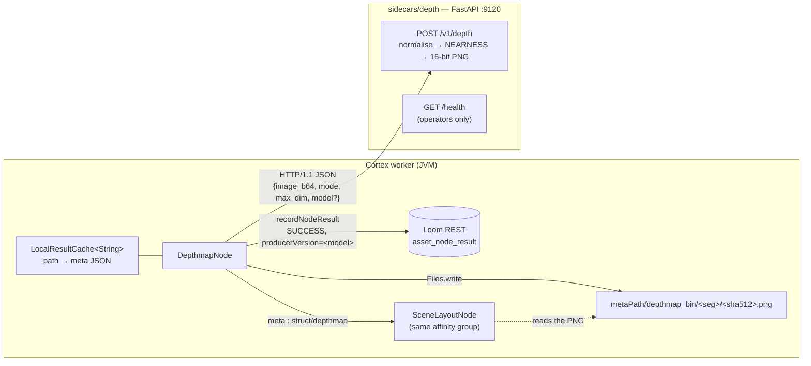

# Depth Map Node (`depthmap`) — Monocular Depth Estimation for a Single Image

> **Status**: 🟢 **Built and shipping.** Kind `depthmap`, module
> [cortex/nodes/depthmap/](../../../../cortex/nodes/depthmap/), package `io.metaloom.cortex.node.depthmap`.
> 29 unit tests + 1 integration test; inference in the FastAPI depth sidecar
> [sidecars/depth/](../../../../sidecars/depth/) on port 9120. Contract in the generated
> `node-descriptors.json`, kept honest by `NodeSpecGoldenTest`.
> **Scope**: the `depthmap` node — from the image asset's bytes to the 16-bit PNG under
> `metaPath/depthmap_bin/` and the `asset_node_result` ledger row.
> **Audience**: AI coding agents and humans working on
> [cortex/nodes/depthmap/](../../../../cortex/nodes/depthmap/).

**Out of scope, and where it lives instead:**

| Not here | There |
|---|---|
| The Python server, its HTTP contract, error codes, env and deployment | [../../../sidecars/DEPTH_SIDECAR.md](../../../sidecars/DEPTH_SIDECAR.md) |
| The node system, lifecycle, registration, caching layers | [../NODES.md](../NODES.md) |
| Port content types and cardinality across all nodes | [../../pipeline/NODE_DATA_TYPES.md](../../pipeline/NODE_DATA_TYPES.md) §4 |
| Rules for adding a node at all | [../../../guidelines/NEW_NODE.md](../../../guidelines/NEW_NODE.md) |
| Where node options come from (worker YAML vs. node definition) | [../../../cortex/CONFIGURATION.md](../../../cortex/CONFIGURATION.md) |
| The consumer that turns the map into spatial relations | `scene-layout` — [NODE_SCENE_LAYOUT.md](../scene-layout/NODE_SCENE_LAYOUT.md) |
| The sibling ledger-only sidecar nodes | `tts`, `imagegen`, `videogen`, `watermark`, `sam2` — [../NODES.md](../NODES.md) §2.1 |
| Per-pixel shape rather than per-pixel distance | [../sam2/NODE_SAM2.md](../sam2/NODE_SAM2.md) |
| The customer-facing page and its three screenshots | [../../../website/WEBSITE.md](../../../website/WEBSITE.md) § Node pages |

---

## 0. Executive Summary

| Question | Short answer |
|---|---|
| **What does it do?** | Estimates how far every pixel of a still image is from the camera, from that one image |
| **What comes out?** | A 16-bit greyscale PNG on the worker, plus a small JSON description of it |
| **Which way is "close"?** | 🔴 **NEARNESS** — bigger is nearer, `65535` is nearest. Normalised in the sidecar, once (§2) |
| **Video?** | No. `isProcessable` refuses it by design — per-keyframe depth needs a storage shape nobody has decided (§10) |
| **Where do the bytes go?** | `metaPath/depthmap_bin/<segment>/<sha512>.png` on the worker — ledger only, never uploaded (§4) |
| **Does it write to the schema?** | No. One `asset_node_result` row, `result_ref == null`, `producer_version` = the checkpoint id |
| **Does it need a GPU?** | No. The default is a 25M-param ViT-S and CPU inference is viable; metric mode really wants a card |
| **Where is the inference?** | The sidecar. This module's `core/pom.xml` declares **zero** dependencies (§12) |

```
media : media/image  ONE   ──▶  depthmap  ──▶  meta : struct/depthmap   ONE
                                          ──▶  map  : artifact/image    ONE
                                          ──▶  flag : scalar/string     ONE
```

---

## 1. Why the node exists

Every geometry in the Loom schema is flat — axis-aligned rectangles in image space. Two boxes that
overlap tell you nothing about which object is in front. Depth is the missing third axis, and
`scene-layout` is the node that consumes it to answer "the person is standing *in front of* the car"
rather than "the person's box overlaps the car's box".

The node is deliberately a thin HTTP client. Everything model-shaped — checkpoint routing, the
normalisation, the 16-bit encode — lives in `sidecars/depth`, so swapping a checkpoint never touches
Java, and the worker jar carries no ML runtime.

---

## 2. 🔴 The NEARNESS convention

> **`[0,1]`, 1 = nearest to the camera**, encoded as a 16-bit greyscale PNG where `65535` is nearest.

Raw monocular-depth output is *not* consistent between model families. Depth Anything and MiDaS
predict a disparity-like value where **bigger is nearer**; ZoeDepth predicts metres, where **bigger is
farther**. Shipping that ambiguity downstream would guarantee an inverted-ordering bug in every
consumer — one that reports `SUCCESS` while silently claiming the background is in front of the
subject.

So the sidecar normalises both families to the one convention before anything reaches Java
(`_normalize`, [../../../sidecars/DEPTH_SIDECAR.md](../../../sidecars/DEPTH_SIDECAR.md) §8): relative
models get a plain min-max; metric models get min-max **and an inversion**, with the real metre range
reported separately in `metric.min_m` / `metric.max_m`.

`DepthmapNode` **hard-validates** the response's `convention` field against the string `NEARNESS` and
throws otherwise (`DepthmapNode.CONVENTION_NEARNESS`). Refusing beats guessing: the failure mode of a
wrong guess is a map that looks plausible and orders everything backwards.

**16 bits rather than 8** because 256 levels collapse two similarly-distant objects into one bucket,
at which point the downstream relation degrades to "same depth" and the whole feature stops being
useful.

---

## 3. The decisions worth keeping

### 3.1 🔴 Two dimension pairs, both in `meta`

The image is downscaled to `maxDim` before inference, so the map is **not** the size of the source
image. `buildMeta` therefore reports both pairs:

| Keys | Describe |
|---|---|
| `width` / `height` | the **map** — the sidecar's response dimensions, post-downscale |
| `imageWidth` / `imageHeight` | the **source image**, read off the decoded `BufferedImage` |

A consumer that projects an image-space bounding box onto the map without rescaling gets no
exception — just wrong samples. Both pairs exist precisely so that is fixable;
`SceneLayoutNode`'s `DepthMap.projectFromImage` is the reference reader.

⚠️ The map dimensions come from the **response**, not from the posted image: the sidecar clamps
`max_dim` to its own `DEPTH_MAX_DIM`, and whether `transformers` interpolates the prediction back to
the input size is version-dependent. Never assume map size equals posted size.

### 3.2 PNG on the wire, not JPEG

`DepthImages` encodes PNG deliberately. JPEG's blocking artifacts become spurious depth
discontinuities exactly along object edges — which is exactly where consumers sample. Do **not**
"reuse" the VLM node's `VlmImages` helper here; the forty lines of duplicated ImageIO are the cheaper
trade than a JPEG path or a cross-node jar dependency.

Images carrying an alpha channel are flattened onto **white** before encoding, so a transparent
background reaches the model as a white surface rather than as an arbitrary colour.

### 3.3 The metadata JSON is the product; the PNG is an artifact it points at

`meta` is the port a consumer wires. It carries:

```jsonc
{"model":"depth-anything/Depth-Anything-V2-Small-hf",
 "convention":"NEARNESS","source":"RELATIVE",
 "width":600,"height":750,             // the MAP
 "imageWidth":600,"imageHeight":750,   // the SOURCE image
 "path":"…/depthmap_bin/0bf7/<sha512>.png",
 "stats":{"p05":0.106783,"p50":0.427279,"p95":0.902449},
 "metric":{"min_m":1.2,"max_m":14.7}}  // METRIC mode only
```

`stats` and `metric` are copied through only when the sidecar sent them. `source` echoes the
requested mode — it is a label, not a verification of what the checkpoint actually is.

### 3.4 The cache holds the metadata and re-checks the artifact

`LocalResultCache<String>` (10 000 entries) keyed on `media.absolutePath()` holds the encoded `meta`
JSON. A hit re-stats `Files.exists(meta.path)` and **falls through to recompute** when the artifact
is gone — the metadata outlives the file if someone cleared `metaPath` underneath the worker.

A hit re-emits the three ports and returns `ctx.origin(LOCAL).next()` **without re-recording the
ledger row**: the row already exists in Loom from the run that populated the cache.

⚠️ 🔴 **The cache key is the media path only.** `mode`, `model` and `maxDim` are *not* in it, so
within one worker's lifetime a re-run with changed options is served the old map
([../NODES.md](../NODES.md) §4 lists this node under "everything else | `absolutePath` only").
`dominant-color` and `sam2` are the models to copy. Tracked in §10.

### 3.5 🔴 The failure path returns `.next()`, and that is a defect

```java
ctx.output(OUT_FLAG, "FAILED");
recordNodeResult(asset, ctx, ResultState.FAILED, e.getMessage(), model, null);
return ctx.failure(e.getMessage()).next();
```

`NodeContextImpl.next()` reads `skipReason` but **not** `failureCause`, so the returned `NodeResult`
reports `SUCCESS` and the message is dropped. The `FAILED` ledger row and the `FAILED` flag are
recorded explicitly just above, which is why `DepthmapNodePersistenceTest` still passes — the defect
is invisible to the tests that exist. `Sam2Node` uses `.abort()` and is the correct shape; see
[../sam2/NODE_SAM2.md](../sam2/NODE_SAM2.md) §3.8 and the nineteen-node list in
[../NODES.md](../NODES.md). Tracked in §10.

⚠️ On the failure path only `flag` is emitted. `meta` and `map` are declared `required` `ONE` ports
and deliver nothing, so a downstream consumer sees the item simply not arrive.

---

## 4. Persistence: ledger only

| What | Where |
|---|---|
| The 16-bit PNG | `metaPath/depthmap_bin/<segment>/<sha512>.png` on the worker (`HashUtils.segmentPath`) |
| The record that this node ran | one `asset_node_result` row, `result_ref == null` |
| Which checkpoint produced it | `producerVersion` = the sidecar's `model` string |

No migration, no schema change. Loom has no byte-ingest endpoint for produced derivatives, so the
bytes stay worker-local — the same shape as `thumbnail`, `tts`, `imagegen`, `videogen`, `watermark`
and `sam2` ([../NODES.md](../NODES.md) §2.1).

⚠️ **Ledger-only does not mean no `producerVersion`.** `resultRef` is null, but the model id is not:
which checkpoint produced which numbers materially changes them. `imagegen` passes both as null — do
not copy that here. `DepthmapNodePersistenceTest.testRecordsLedgerWithModelOnSuccess` and the
integration test both pin it.

> 🔴 **The map is worker-local.** Any node consuming `meta` — in practice `scene-layout` — must run on
> the same worker. Pin both into one **affinity group** in the pipeline definition:
> `{"id":"depthmap","type":"depthmap","affinity":"vision"}` and the same `affinity` on the consumer.
> `AffinityValidator` warns about an *unplaceable* segment but cannot warn about a group you forgot
> to declare; that failure surfaces as a plain "depth map not found" on another worker.

---

## 5. The flag port

| Value | Meaning |
|---|---|
| `DONE` | The map was written and all three ports carry values |
| `FAILED` | The sidecar call, the convention check or the write failed |

Two values only — unlike `sam2`, this node has no "nothing found" or "truncated" outcome. A
degenerate flat map (a blank wall, or a broken model) still returns `DONE`; the only signal is
`stats` collapsing to `p05 == p50 == p95 == 0.5`, and nothing in Java inspects it.

---

## 6. The sidecar, from the node's side

FastAPI, `sidecars/depth`, port **9120** — 9100 is TTS, 9110 sentiment, 9130 sam2. Full contract,
error codes and known rough edges: [../../../sidecars/DEPTH_SIDECAR.md](../../../sidecars/DEPTH_SIDECAR.md).
What matters on the Java side:

* `DepthmapClient` builds a fresh `java.net.http.HttpClient` per call and **forces `Version.HTTP_1_1`**
  — FastAPI rejects the JDK client's default HTTP/2 upgrade attempt. Every sidecar client in this tree
  carries the same line.
* It POSTs `{image_b64, mode, max_dim, model?}` and returns the response as a `JsonObject`. `model` is
  sent only when the option is non-blank.
* Any non-2xx becomes `RuntimeException("Depth request failed (HTTP …): <body>")`; transport failures
  become `RuntimeException("Depth request to <uri> failed", cause)`. ⚠️ The method declares
  `IOException` but transport failures arrive **unchecked** — `compute` catches `Exception`, so both
  end as a `FAILED` ledger row either way.
* 🔴 **Nothing in Java calls `/health`.** A cold sidecar pays the Hub download and model load inside
  the node's `timeoutMs`; warm it before enabling the node.
* 🔴 **`mode` decides the normalisation direction, `model` does not.** Pointing `model` at a metric
  checkpoint while leaving `mode=RELATIVE` (or the reverse) yields a silently inverted map that still
  says `NEARNESS` and still reports success. `validate()` does not check the pair. Only override
  `model` within the same family as `mode`.

---

## 7. Configuration

### 7.1 Node options (`nodes.depthmap.*` → `DepthmapNodeOptions`, `KEY = "depthmap"`)

| Option | Type | Default | Notes |
|---|---|---|---|
| `depthHost` | `STRING` | `localhost` | Sidecar host |
| `depthPort` | `INTEGER` | `9120` | Sidecar port |
| `mode` | `ENUM` | `RELATIVE` | `RELATIVE` \| `METRIC` — METRIC adds `metric.min_m`/`max_m` |
| `model` | `STRING` | `null` | Checkpoint override; `null` uses the sidecar's default for the mode |
| `maxDim` | `INTEGER` | `1024` | Longest side posted; **also the size of the produced map** |
| `timeoutMs` | `INTEGER` | `120000` | **Inherited** from `AbstractNodeOptions`; the 120 s default is set in this node's constructor and re-advertised via `@ParamOverride` because the framework default of 0 would be useless for CPU inference |
| `enabled`, `processIncomplete`, `retryFailed` | | `true`/`false`/`false` | Standard, from `AbstractNodeOptions` |

`validate()` rejects a blank `depthHost`, a non-positive `depthPort` / `maxDim` / `timeoutMs`, and a
null `mode`, on top of `validateCommon()`.

⚠️ **The Java module reads no environment variables at all.** Options come from the worker YAML
(`CortexOptions.getNodes().get("depthmap")`) — this node is **not** a `PipelineConfigurable`, so two
`depthmap` instances in one graph necessarily share one configuration, and the `DepthmapClient` Dagger
provider is built from those worker-scoped `depthHost`/`depthPort`/`timeoutMs` values.

### 7.2 Sidecar environment variables

Reproduced here for convenience; the authority is
[../../../sidecars/DEPTH_SIDECAR.md](../../../sidecars/DEPTH_SIDECAR.md) §5.

| Variable | Default | Read by | Meaning |
|---|---|---|---|
| `DEPTH_MODEL` | `depth-anything/Depth-Anything-V2-Small-hf` | `server.py` | Checkpoint for `RELATIVE` |
| `DEPTH_MODEL_METRIC` | `Intel/zoedepth-nyu-kitti` | `server.py` | Checkpoint for `METRIC` |
| `DEPTH_MAX_DIM` | `1024` | `server.py` | Hard server cap on the longest side |
| `DEVICE` | `cuda` if available, else `cpu` | `server.py` | torch device |
| `DEPTH_HOST` | `0.0.0.0` | ⚠️ **`run.sh` only** | uvicorn bind address — not application config |
| `DEPTH_PORT` | `9120` | ⚠️ **`run.sh` only** | uvicorn port — not application config |
| `PYTHON` | `python3` | `setup.sh` only | Interpreter used to create `.venv` |
| `CUDA_VISIBLE_DEVICES` | — | torch | Pin a GPU |
| `HF_HOME` | — | huggingface_hub | Checkpoint cache location |

---

## 8. Architecture



---

## 9. Models and licensing

| Mode | Default checkpoint | Licence |
|---|---|---|
| `RELATIVE` (default) | `depth-anything/Depth-Anything-V2-Small-hf` (~25M ViT-S, CPU-viable) | **Apache-2.0** |
| `METRIC` (opt-in) | `Intel/zoedepth-nyu-kitti` | MIT |
| Documented permissive upgrade path, not wired | `Intel/dpt-large` (MiDaS 3.0) | permissive |

🔴 **Never point `DEPTH_MODEL` at Depth-Anything-V2 Base or Large** — those are **CC-BY-NC-4.0**
(non-commercial). Small is the only permissive member of that family, which is exactly why it is the
default. The warning is duplicated in `sidecars/depth/README.md` and printed by `setup.sh`. Apple
Depth Pro is research-only; Marigold is diffusion-based and far too slow for batch. Both defaults are
ungated — no `HF_TOKEN` needed.

⚠️ The customer page links to `docs/legal/model-licenses/`, which **has no depth row yet** (§10).

---

## 10. Progress Assessment

### Done

- [x] Module `cortex/nodes/depthmap/` (aggregator + `core`), `cortex/nodes/pom.xml`, `cortex/processor/pom.xml` and `integration-test/pom.xml` entries
- [x] `DepthmapNode`, `DepthmapNodeOptions`, `DepthMode`, `DepthmapClient`, `DepthImages`, `DepthmapNodeModule`
- [x] `@Binds @IntoSet` + `@Binds @IntoMap @StringKey("depthmap")`, `NodeCollectionModule.includes`, `NodeSpecCatalog.BUILT_IN_NODE_CLASSES`
- [x] Typed ports `media` → `meta`, `map`, `flag`; `ContentTypeRegistry.STRUCT_DEPTHMAP` + its `all()` entry
- [x] Contract generated from `@NodeSpec`/`@PortDoc`/`@ParamDoc` into the committed `node-descriptors.json`; pinned by `NodeSpecGoldenTest`, kind listed in `NodeDescriptorServiceLoaderTest`
- [x] Sidecar `sidecars/depth/` (`server.py`, `requirements.txt`, `setup.sh`, `run.sh`, `README.md`) + the port row in `sidecars/README.md`
- [x] NEARNESS implemented once, in the sidecar, for both families; the node hard-validates it
- [x] Both dimension pairs in `meta`; cache falls through when the artifact was deleted; a failure does not poison the cache
- [x] Ledger row carries the checkpoint as `producerVersion`
- [x] 29 unit tests + `DepthmapNodeIntegrationTest`
- [x] **Run against a real checkpoint.** `SidecarRecipes.depthmap()` drives the live sidecar; `loom-ui/scripts/fixtures/nodes/depthmap/fixture.json` records `"backend":"real"` against `http://127.0.0.1:9120/health` with genuine model output
- [x] Customer docs page `website/content/english/docs/nodes/depthmap/` with `nodeviz`, `config.png`, `debug.png` and `debug-detail.png` from that real run

### Follow-ups this node creates

- [ ] 🔴 **Cache-key hygiene.** `LocalResultCache` is keyed on the media path only, so a re-run with a
      changed `mode` / `model` / `maxDim` is served the old map within a worker's lifetime (§3.4).
      Copy `dominant-color`'s digest key.
- [ ] 🔴 **`ctx.failure(msg).next()` reports SUCCESS.** Switch the failure path to `.abort()` (§3.5).
- [ ] 🔴 **`mode` / `model` family mismatch is unvalidated** and produces a silently inverted map (§6).
      Either detect the family from the checkpoint or reject a disagreeing override in `validate()`.
- [ ] **Model-licence page entry.** `website/content/english/docs/legal/model-licenses/index.adoc` has
      no depth row while the node's page links to it. Add Depth-Anything-V2-Small (Apache-2.0) and
      ZoeDepth (MIT), re-verified against the live model cards.
- [ ] **`sidecars/depth/Dockerfile`** (+ compose/Helm wiring). Copy `sidecars/ideogram-sidecar/Dockerfile`'s
      `nvidia/cuda:*-runtime` pattern and `EXPOSE 9120`.
- [ ] **Depth queryable in Loom.** Nothing can ask "assets whose foreground occupies more than 30%".
      An `asset_json_comp` row (`schemaType="depthmap"`) carrying `stats` plus a coarse downsampled
      grid would fix that *and* remove the affinity constraint for low-resolution consumers.
      **Weighed and dropped for v1** in favour of the simpler ledger-only shape.
- [ ] **Byte-ingest endpoint for derivatives** — the whole-family fix for
      `thumbnail`/`tts`/`imagegen`/`videogen`/`watermark`/`sam2`/`depthmap`. Tracked outside this spec.
- [ ] **The degenerate flat map is indistinguishable from success** (§5). Surface it as a flag value or
      a confidence signal rather than leaving it in `stats` that nothing reads.
- [ ] **No demo data.** `DemoDatabaseInitializer` holds no per-node Cortex config, following the
      explicit `imagegen`/`tts`/`videogen`/`sam2` precedent: the demo container has no sidecar.

### Deliberately not built

- [ ] **Video / per-keyframe depth.** `isProcessable` refuses video. Blocked on a storage-shape
      decision — one PNG per keyframe with a `frameNumber` in the filename, versus a strip.
- [ ] ~~In-JVM inference (ONNX / DJL)~~ — rejected; the sidecar is the house style.
- [ ] ~~Segmentation masks / stereo / multi-view~~ — this node produces a dense map only. Segmentation
      shipped separately as [../sam2/NODE_SAM2.md](../sam2/NODE_SAM2.md).
- [ ] ~~Metric depth by default~~ — single-view metric depth is meaningfully less reliable; opt in via
      `mode=METRIC`.
- [ ] **No confidence / reliability signal.** Monocular depth is unreliable on flat texture, mirrors,
      glass and sky, and no model here exports an uncertainty map. Consumers must treat small depth
      differences as noise — which is exactly what `scene-layout`'s `z`-threshold does.

---

## 11. Test Setup

Every Java test stubs the model by **subclassing `DepthmapClient`** — no GPU, no network, no download.

```bash
# 29 unit tests - no sidecar needed
./mvnw -o -pl cortex/nodes/depthmap/core -am test

# The generated contract equals the annotated node
./mvnw -o -pl integration-test test -Dtest=NodeSpecGoldenTest

# The kind is advertised by the ServiceLoader
./mvnw -o -pl loom-shared/node-model test

# End to end against an in-process Loom + pooled Postgres
./setup-pool.sh
./mvnw -o -pl integration-test test -Dtest=DepthmapNodeIntegrationTest

# Regenerate the docs fixture and screenshots (needs the sidecar up)
mvn -o -pl integration-test test -Dtest=DocsFixtureGenerator \
    -Dloom.regenerateDocsFixtures=true -Dloom.docsFixtureKinds=depthmap
```

| Test | What it guards against |
|---|---|
| `DepthmapNodeTest` (12) | The map not written or a port not emitted; `meta` missing a dimension pair; the artifact not decoding as `TYPE_USHORT_GRAY`; options not reaching the client; a `model` override sent when unset; the image not downscaled before inference; **an unexpected `convention` accepted**; a second run re-inferring; a cache hit serving a deleted artifact; a failure poisoning the cache; a non-image or a disabled node not self-skipping |
| `DepthmapNodePersistenceTest` (3) | The ledger row missing or losing the checkpoint; no `FAILED` row when the sidecar throws or when the convention is rejected |
| `DepthmapNodePipelineTest` (6) | `extends AbstractNodeChainTest` — adapter integration, completion and tracking events, `meta` reaching a downstream consumer, disabled + dry-run skip |
| `DepthmapOptionsValidationTest` (8) | Every out-of-range option surfacing at pipeline start rather than per item; the 120 s timeout default being lost; `METRIC` wrongly rejected |
| `DepthmapNodeIntegrationTest` (1) | The PNG not landing under `metaPath/depthmap_bin`, its bytes differing, it not decoding as `TYPE_USHORT_GRAY`, or the ledger row not reaching Postgres with its `producerVersion` |
| `DepthmapTestFixtures` | The de-facto contract snapshot: a **real** 16-bit PNG (left half nearness 0.9, right half 0.1) plus the canned sidecar response |

Live smoke test:

```bash
cd sidecars/depth && ./setup.sh && ./run.sh    # :9120
curl -s localhost:9120/health                  # expect convention:"NEARNESS"
```

🔴 **The acceptance check is visual: the foreground must be BRIGHT.** Re-run it after any model,
`transformers` or `_normalize` change — no automated test can catch an inverted normalisation.

⚠️ There is **no Python test of any kind** for the sidecar, so its code is exercised by nothing in CI.

---

## 12. Conventions and Gotchas

| Area | Gotcha |
|---|---|
| **NEARNESS** | 🔴 **Larger is closer.** Every ordering bug in this feature traces back to getting it backwards. The node throws on any other `convention` rather than guessing. |
| **Affinity** | 🔴 **Mandatory** for any consumer. The PNG is worker-local; `AffinityValidator` cannot warn about a group you never declared (§4). |
| **Two dimension pairs** | 🔴 `width`/`height` are the **map's**, `imageWidth`/`imageHeight` the **source image's**. Mixing them throws nothing and samples the wrong pixels (§3.1). |
| **Cache key** | 🔴 Path only — changing `mode`/`model`/`maxDim` does not invalidate it within a worker's lifetime (§3.4). |
| **Failure path** | 🔴 `ctx.failure(msg).next()` reports `SUCCESS` and drops the message; only the explicit `FAILED` ledger row and flag survive (§3.5). |
| **PNG, not JPEG** | ⚠️ `DepthImages` encodes PNG deliberately. Do not "reuse" `VlmImages` here (§3.2). |
| **16-bit round trip** | Written Python-side with `cv2.imencode` on a `uint16` array — PIL's `I;16` mode is version-dependent. Java reads `BufferedImage.TYPE_USHORT_GRAY` and samples `raster.getSample(x,y,0)` in `0..65535`. |
| **HTTP/1.1** | ⚠️ Force `Version.HTTP_1_1`; FastAPI rejects the JDK client's default HTTP/2 upgrade. |
| **Keep the client non-final** | Unit tests, the integration test *and* the docs fixture recipe stub `DepthmapClient` by subclassing. A `final` class or method breaks all three. |
| **`ImageIO`, not OpenCV** | This module's `core/pom.xml` declares **zero** dependencies on purpose — pulling in the video4j/OpenCV native runtime would fatten every worker that only makes an HTTP call. |
| **Ledger-only, but versioned** | `resultRef` is null; the model id is **not**. Do not copy `imagegen`, which nulls both (§4). |
| **Worker-scoped options** | The node is not a `PipelineConfigurable`: options come from the worker YAML, so two `depthmap` nodes in one graph share one config and one sidecar address (§7.1). |
| **No `<Kind>DescriptorProvider`** | ⚠️ The hand-written provider and `META-INF/services` entry are **gone**. The contract is declared once on the node with `@NodeSpec`/`@PortDoc`/`@ParamDoc`, harvested into the committed `node-descriptors.json`, and pinned by `NodeSpecGoldenTest`. `NodePortConformanceTest` no longer exists either. |
| **Registration** | Five touch-points, not four: `cortex/nodes/pom.xml`, `cortex/processor/pom.xml`, `NodeCollectionModule.includes`, `NodeSpecCatalog.BUILT_IN_NODE_CLASSES`, `integration-test/pom.xml`. Adding it to `PipelineNodeFactoryModule` is the **old** way and is wrong. See [../../../guidelines/NEW_NODE.md](../../../guidelines/NEW_NODE.md) §2. |
| **Rebuilds** | ⚠️ Install `cortex/processor` before a `-pl cortex/cli` build, and clean-rebuild `loom/core` after a `NodeCollectionModule` change — a stale Dagger component surfaces as `NoSuchMethodError`. |
| **No `ICON_MAP`** | The editor palette is descriptor-driven; `@NodeSpec(icon = "layers")` is the only place an icon is chosen. `PipelineEditor.tsx` has no icon map. |

---

## 13. Where do I find …?

| Need | Path |
|---|---|
| The node | [cortex/nodes/depthmap/core/…/DepthmapNode.java](../../../../cortex/nodes/depthmap/core/src/main/java/io/metaloom/cortex/node/depthmap/DepthmapNode.java) |
| The options + `validate()` | `…/depthmap/DepthmapNodeOptions.java` |
| The sidecar client and the wire shapes | `…/depthmap/DepthmapClient.java` |
| Image read / downscale / base64-PNG | `…/depthmap/DepthImages.java` |
| The Dagger bindings | `…/depthmap/DepthmapNodeModule.java` |
| The tests | `cortex/nodes/depthmap/core/src/test/…` |
| The canned sidecar response (contract snapshot) | `…/depthmap/DepthmapTestFixtures.java` |
| The sidecar | [sidecars/depth/](../../../../sidecars/depth/) — and [../../../sidecars/DEPTH_SIDECAR.md](../../../sidecars/DEPTH_SIDECAR.md) |
| The NEARNESS normalisation itself | `sidecars/depth/server.py` → `_normalize`, `_encode_png16` |
| The downstream reader | `cortex/nodes/scene-layout/core/…/DepthMap.java` (`projectFromImage`) |
| The generated contract | `loom-shared/node-model/src/main/resources/node-descriptors.json` (kind `depthmap`) |
| The docs fixture recipe | `integration-test/…/node/docs/SidecarRecipes.java` (`depthmap()`) |
| The customer page | [website/content/english/docs/nodes/depthmap/index.adoc](../../../../website/content/english/docs/nodes/depthmap/index.adoc) |
| The hash-segmented output path | `HashUtils.segmentPath`; `ThumbnailNode.resolveThumbnailPath` |
| Affinity / segmentation | `loom/pipeline/…/graph/{PipelineSegmenter,AffinityValidator,PipelineGraphNode}.java` |
| The node system as a whole | [../NODES.md](../NODES.md) |
| The port/content-type model | [../../pipeline/NODE_DATA_TYPES.md](../../pipeline/NODE_DATA_TYPES.md) |
| Rules for building the next node | [../../../guidelines/NEW_NODE.md](../../../guidelines/NEW_NODE.md) |
| Cortex config precedence | [../../../cortex/CONFIGURATION.md](../../../cortex/CONFIGURATION.md) |
| Definition of done for a code change | [../../../guidelines/CODING.md](../../../guidelines/CODING.md) |

---

_Git HEAD revision: `8c153347`_
_Last updated: 2026-08-11_
