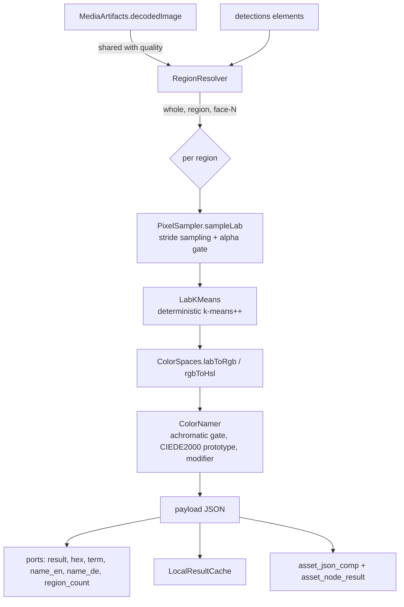

# Dominant Colour Node (`dominant-color`) — CIELAB Clustering and Bilingual Colour Naming

> **Status**: 🟢 **Built and shipping.** Kind `dominant-color`, module
> [cortex/nodes/dominant-color/](../../../../cortex/nodes/dominant-color/), package
> `io.metaloom.cortex.node.color`. 93 unit tests + 1 integration test. **No model, no sidecar, no
> GPU** — all of it is arithmetic. Contract in the generated `node-descriptors.json`, kept honest by
> `NodeSpecGoldenTest`.
> **Scope**: the `dominant-color` node — everything from the decoded `BufferedImage` to the
> `asset_json_comp` row and the `asset_node_result` ledger entry.
> **Audience**: AI coding agents and humans working on
> [cortex/nodes/dominant-color/](../../../../cortex/nodes/dominant-color/).

**Out of scope, and where it lives instead:**

| Not here | There |
|---|---|
| The node system, lifecycle, registration, caching layers | [../NODES.md](../NODES.md) |
| Port content types and cardinality across all nodes | [../NODE_DATA_TYPES.md](../NODE_DATA_TYPES.md) §2, §4 |
| Rules for adding a node at all | [../../../guidelines/NEW_NODE.md](../../../guidelines/NEW_NODE.md) |
| Where the detection boxes come from | `facedetect`, `objectdetect` — [../NODES.md](../NODES.md) §3.1 |
| How node options are set per pipeline-node instance | [../NODES.md](../NODES.md) §7 |
| The cortex image-processing worker as a whole | [../../../cortex/SERVICE_IMAGE.md](../../../cortex/SERVICE_IMAGE.md) |
| The customer-facing page and its two screenshots | [../../../website/WEBSITE.md](../../../website/WEBSITE.md) § Node pages |
| The other consumer of the shared decoded image, and the `ArtifactCache` itself | `quality` — [../NODES.md](../NODES.md), [../../pipeline/PIPELINE.md](../../pipeline/PIPELINE.md) §7.4 |

---

## 0. Executive Summary

| Question | Short answer |
|---|---|
| **What does it do?** | Clusters an image's pixels in CIELAB and reports the colours it finds as HEX, RGB, HSL, CIELAB/LCh plus a readable name in English **and** German |
| **What does it measure?** | Up to three region sources, **merged not ranked**: the whole frame, one statically configured region, and every upstream detection box (§2) |
| **Does it need a GPU or a sidecar?** | No. `defaultConcurrency = 4`, milliseconds per image |
| **Media types** | 🟢 Images only. `isProcessable` gates on `ctx.media().isImage()` — video is not built (§8) |
| **Where does the result go?** | One `asset_json_comp` row, `schemaType = "dominant-color"`, `variant = ""`, plus one `asset_node_result` ledger row (§5) |
| **Is the result reproducible?** | Yes, and that is a hard requirement — three independent mechanisms, all load-bearing (§4) |
| **Is the colour queryable?** | 🔵 **No.** The payload is JSONB with no read path; `asset_image_comp.image_dominant_color` is still never written by the pipeline (§5.1) |

```
media      : media/image        ──▶  dominant-color  ──▶  result       : struct/color
detections : detection/* MANY ┈┈▶  (optional)          ──▶  hex          : scalar/string
                                                       ──▶  term         : scalar/string
                                                       ──▶  name_en      : scalar/string
                                                       ──▶  name_de      : scalar/string
                                                       ──▶  region_count : scalar/integer
```

Inside one `compute()`:



---

## 1. Why the node exists

Colour is the first thing a person notices about a picture and one of the last things a media system
can search on. The node closes that gap by producing **both** halves of the answer at once: an exact
value (`#E2711D`) for design tooling, and a word a human would use (`vivid orange` / `kräftiges
Orange`) for facets, captions and search boxes.

It is also the cheapest analysis node in the tree — no model, no download, no GPU — which makes it
the one node that can be enabled on every worker without a capacity conversation.

---

## 2. Three region sources, merged

`RegionResolver` turns configuration plus the wired detection elements into an **ordered** list of
regions. There is no precedence between the sources; they answer different questions and a consumer
may legitimately want all three at once.

| Source | `id` | `source` | `kind` | Enabled by |
|---|---|---|---|---|
| The whole decoded frame | `whole` | `image` | `IMAGE` | `includeWholeImage` (default true) |
| One fixed rectangle | `region` | `config` | `CONFIG` | a positive `regionW` **and** `regionH` |
| Each upstream box | `<label>-<index>` | `detections` | `DETECTION` | `useDetections` (default true) **and** a wired `detections` port |

Emission order is part of the contract: whole frame, then the configured region, then detections in
`ctx.inputs(IN_DETECTIONS)` sequence order.

> ⚠️ **The cap re-sorts.** When more than `maxRegions` detection boxes survive, `RegionResolver`
> sorts them **largest-area first** and keeps the top `maxRegions` — so under the cap the detection
> block is no longer in sequence order. Keeping the biggest boxes is deliberate (a cap that dropped
> the subject of the photo would be worse than no cap), but a consumer relying on sequence order gets
> a different answer above and below the cap. `RegionResolverTest.testTheCapKeepsTheLargestBoxesAndReportsTheRemainder`.

The whole-image and configured regions **never** count against `maxRegions`.

### 2.1 The upstream detection contract

`IN_DETECTIONS` is read **by port**, not by upstream node id, and accepts one element per box in the
shape `FacedetectNode` emits — the node has no compile-time dependency on any detector:

```json
{"index":0,"type":"face","label":"face","frame":0,
 "bbox":{"x":20,"y":20,"w":100,"h":100},"confidence":1.0,
 "coordinates":"ABSOLUTE_PIXELS","imageWidth":400,"imageHeight":200}
```

| Case | Handling |
|---|---|
| `coordinates = NORMALIZED` | Scaled by the **decoded image's** dimensions; the payload's dimensions are ignored entirely |
| `coordinates = ABSOLUTE_PIXELS`, payload dims match the decoded image | Used as-is |
| `ABSOLUTE_PIXELS`, payload dims differ | Rescaled by `(imgW/payloadW, imgH/payloadH)` with an `log.info` naming both sizes |
| `ABSOLUTE_PIXELS`, payload dims absent or zero | Assumed to be the decoded image's pixel space |
| `coordinates` absent or unknown | Treated as `ABSOLUTE_PIXELS` and `log.warn`-ed rather than guessed silently |
| Box straddling the edge | `Box.clampTo(w, h)` — clamped, not dropped |
| Box entirely outside, or below `minRegionPixels` | Dropped and **counted** into `truncated.dropped` |
| `frame != 0` | Dropped and counted — in an image-only pipeline that can only be a mis-wired video detector |
| Element is not JSON, or has no `bbox` | Warned and counted, never thrown |

Region ids are `label + "-" + index`, falling back to the element's sequence position when the
payload carries no `index`, and to `type` (then `"object"`) when it carries no `label`.

> ⚠️ **Stale javadoc.** `RegionSource`'s `@param source` still says "or the upstream node id". Since
> the typed-port migration there is no node id involved — every detection region records the constant
> `"detections"` (`RegionResolver.DETECTIONS_SOURCE`).

---

## 3. Ports and the emitted payload

Declared on `DominantColorNode` with `@PortDoc`; the generated contract in
`loom-shared/node-model/src/main/resources/node-descriptors.json` is harvested from those
annotations (§7).

| Port | Direction | Content type | Cardinality | Required |
|---|---|---|---|---|
| `media` | in | `media/image` | ONE | yes |
| `detections` | in | `detection/*` | **MANY** | no |
| `result` | out | `struct/color` | ONE | — |
| `hex` | out | `scalar/string` | ONE | — |
| `term` | out | `scalar/string` | ONE | — |
| `name_en` | out | `scalar/string` | ONE | — |
| `name_de` | out | `scalar/string` | ONE | — |
| `region_count` | out | `scalar/integer` | ONE | — |

`detections` is `MANY` because one image has many boxes, and optional because measuring the whole
frame is a perfectly good configuration on its own. `struct/color` is registered in
`ContentTypeRegistry.STRUCT_COLOR` — see [../NODE_DATA_TYPES.md](../NODE_DATA_TYPES.md) §2.

### 3.1 The payload

```json
{
  "image":    { "width": 1920, "height": 1080 },
  "sampling": { "maxSamples": 40000, "clusterCount": 5, "seed": 42, "alphaThreshold": 128 },
  "regions": [
    { "id": "whole", "source": "image", "kind": "IMAGE",
      "bbox": { "x": 0, "y": 0, "w": 1920, "h": 1080 },
      "pixels": 39204, "converged": true,
      "dominant": { "...": "same shape as a palette entry" },
      "palette": [
        { "share": 0.4712, "hex": "#E2711D",
          "rgb": { "r": 226, "g": 113, "b": 29 },
          "hsl": { "h": 25.6, "s": 77.3, "l": 50.0 },
          "lab": { "l": 60.12, "a": 34.55, "b": 62.01 },
          "lch": { "c": 71.0, "h": 60.9 },
          "name": { "term": "orange", "lightness": "MEDIUM", "chroma": "VIVID",
                    "en": "vivid orange", "de": "kräftiges Orange", "distance": 7.41 } }
      ] }
  ],
  "truncated": { "regions": 0, "dropped": 0 }
}
```

* `dominant` **duplicates** `palette[0]` on purpose — nine consumers out of ten want only the
  dominant colour, and `regions[0].dominant.hex` reads better than `regions[0].palette[0].hex`.
* Detection regions additionally carry `label`, `type`, `frame` and `confidence` when the upstream
  element supplied them.
* `truncated.regions` counts boxes lost to the `maxRegions` cap; `truncated.dropped` counts boxes
  lost to any other reason (§2.1). Both are reported rather than silently omitted —
  `DominantColorNodeTest.testDroppedDetectionsAreReportedRatherThanSilentlyOmitted`.
* `lch.h` is `null` for an achromatic colour, never `0` (§6).

### 3.2 ⚠️ The scalar ports describe `regions[0]`, not necessarily the whole frame

`emit()` reads `regions.getJsonObject(0)`. With the default `includeWholeImage = true` that *is* the
whole frame, which is what the `@PortDoc` texts say. Turn `includeWholeImage` off and `hex`, `term`,
`name_en` and `name_de` describe the configured region or the first detection box instead, while
their descriptions in the editor still say "of the whole frame". The port docs are the divergence,
not the code.

---

## 4. Why the result is reproducible (do not break this)

The same image and options must always yield the same palette; a colour that changed between runs
would make every downstream facet and every cached result unstable. **All three** mechanisms are
load-bearing:

| Mechanism | Why it is not sufficient alone |
|---|---|
| `new Random(seed)`, `seed` defaulting to 42 | `java.util.Random` is bit-for-bit specified by the JLS, but k-means++ *walks the point array* — a reordered array selects different seeds |
| Stride sampling in fixed raster order (`PixelSampler`) | Fixes the point order the seeder walks |
| Deterministic empty-cluster re-seeding (furthest point, ties to the lowest index) | A random re-seed reintroduces nondeterminism mid-run; dropping the cluster would silently change `k` |

Ranking is by share descending, tie-broken deterministically — never left to map iteration order.
`k` is capped by the **distinct-colour count** before seeding, so a two-tone image never asks for
five clusters and lets k-means++ pick duplicate centres.

Pinned by `DominantColorNodeTest.testTheResultIsReproducibleAcrossFreshNodeInstances`,
`LabKMeansTest.testTheSameInputAndSeedProducesTheIdenticalResult` and
`testADifferentSeedFindsTheSamePartition`.

---

## 5. Persistence

| What | Where |
|---|---|
| The palette for every region of one asset | one `asset_json_comp` row — `nodeKind = "dominant-color"`, `schemaType = "dominant-color"`, `variant = ""` |
| The record that this node ran | one `asset_node_result` row, `resultRef = {table: "asset_json_comp", uuids: [...]}` |
| Which codebook produced the names | `producerVersion = DominantColorNode.ALGORITHM_VERSION` = `"dominant-color/1"` |

One row per asset — every region lives inside `data.regions`. `variant` is deliberately the empty
string, reserved for a frame number if video ever lands (§8).

Persistence is **best-effort**: `persist()` returns immediately when `asset == null` or
`client() == null`, so an offline run still succeeds and still emits its ports. A component write
that throws records a `FAILED` ledger row rather than failing the item.

The component is written **before** the ledger row, so a ledger row can never point at a component
that does not exist — `DominantColorNodePersistenceTest.testTheLedgerFollowsTheComponent`.

### 5.1 🔵 The colour is written but not queryable

`asset_image_comp.image_dominant_color` and its `dominantColor` GraphQL field have existed since
`V2.8`, and **nothing in the pipeline writes them**. Only the REST ingest paths
(`AssetComponentEndpointService`, `AssetEndpointService`) set the column, from a user-supplied
`ImageInfo`. This node's output therefore lands in JSONB with a read path but no query path — you can
read an asset's palette, you cannot ask "which assets are mostly blue".

Bump this to a task rather than a code change on sight: `ReplaceValidatorTest` asserts
`dominantColor` is **not** a replaceable field, so a write path has to reckon with that first.

---

## 6. The colour science

Split into pure, image-free classes so the maths is testable without a `BufferedImage`.

### 6.1 Two distance functions, and the split is a correctness requirement

| Where | Function | Why |
|---|---|---|
| `LabKMeans` (per pixel, per iteration) | **squared Euclidean ΔE76²** | Lloyd's algorithm terminates only because each step lowers the within-cluster sum of squares, which needs the arithmetic mean to be the distance's centroid. True for ΔE76², **false** for CIEDE2000 — it violates the triangle inequality and is not a Bregman divergence, so clustering under it could oscillate forever |
| `ColorNamer` (once per emitted colour, per prototype) | **CIEDE2000** | Accuracy where it is affordable |

### 6.2 Naming: an ISCC-NBS-shaped scheme

A **basic colour term** chosen by nearest prototype, plus a **modifier** composed from the colour's
lightness and chroma bands. Both languages are generated from the same two bands, so they cannot
drift apart.

* **11 Berlin & Kay terms**, EN/DE: `red Rot`, `orange Orange`, `yellow Gelb`, `green Grün`,
  `blue Blau`, `purple Violett`, `pink Rosa`, `brown Braun`, `black Schwarz`, `grey Grau`,
  `white Weiß`.
* **45 Lab prototypes across the 8 chromatic terms** (`ColorTerms`), stored as hex strings and
  converted in a static initialiser. The three achromatic terms have **no** prototypes — they are
  decided by a chroma threshold, because a hue angle is meaningless for them.
* **`Lightness`**: `VERY_DARK` <20, `DARK` <40, `MEDIUM` <65, `LIGHT` <85, `VERY_LIGHT`.
* **`Chroma`**: `ACHROMATIC` below `achromaticChroma`, `GREYISH` <25, `MUTED` <45, `STRONG` <70,
  `VIVID`.
* **17 modifier cells** in each language (`VERY_DARK` collapses all four chroma bands into one), plus
  three achromatic grey bands and the flat `black` / `white` answers. Pinned cell by cell by
  `ColorNamerTest.testEveryModifierCellComposesInBothLanguages`.

### 6.3 The achromatic gate

Below `achromaticChroma` the namer decides on **lightness alone** — no prototype lookup, no chroma
modifier — which makes `greyish grey` impossible by construction rather than by luck. The default is
`12.0` rather than `10.0` because `#708090` slategray has `C* = 10.79` and is plainly grey.

---

## 7. The contract is generated, not hand-written

The node's contract is declared **once**, on the node class itself: `@NodeSpec` (id, name, icon
`palette`, category `ANALYSIS`, `defaultConcurrency = 4`), `@PortDoc` per port, `@ParamDoc` per
option field. `loom-shared` cannot depend on `cortex/`, so a build-time harvest writes
`loom-shared/node-model/src/main/resources/node-descriptors.json` and that file is committed.

`NodeSpecGoldenTest` re-harvests every annotated node and fails when the committed resource differs.
Regenerate after any annotation edit:

```bash
mvn -o -pl integration-test test -Dtest=NodeSpecGoldenTest -Dloom.regenerateNodeDescriptors=true
```

> ⚠️ **There is no `DominantColorDescriptorProvider`** and no `NodePortConformanceTest`. The
> hand-written descriptor providers were deleted when the annotations became the single declaration;
> `NodeSpecGoldenTest` explicitly subsumes the conformance test, which existed only because ports
> used to be declared twice. `website/static/pipeline-editor/node-descriptors.json` is a **separate,
> differently-shaped editor snapshot** — not the ground truth.

Declaration order of the option fields is the order the editor renders them, because the harvester
emits parameters in field order. The descriptor carries **22 parameters**: the three inherited
`AbstractNodeOptions` ones plus the 19 in §9.

---

## 8. Deliberately not built

| Not built | Why |
|---|---|
| **Video** | `isProcessable` gates on `isImage()`. Per-frame colour needs a frame-extraction path *and* a `variant` scheme to hold per-frame rows — separate work. `variant = ""` is reserved for exactly that |
| **A 12th `turquoise`/`Türkis` term** | `#00FFFF` and `#008080` are `blue` prototypes and name as *blue* — correct within Berlin & Kay 11, wrong to a human. `ColorTerms`' javadoc records why *teal*/*mauve*/*petrol* were rejected: no one-word equivalent in both languages |
| **A colour filter node** | `term` was made a stable, language-neutral facet key precisely so a future filter could key on it. No such node exists |
| **Metrics** | The node records nothing through `CortexMetrics` — in particular its `LocalResultCache` hit is not counted, unlike the sidecar-backed nodes' `recordAiCacheHit(...)` |

---

## 9. Options

All are `dominant-color.*` node options ([../NODES.md](../NODES.md) §7 for how they are set).

| Option | Type | Default | Notes |
|---|---|---|---|
| `clusterCount` | `INTEGER` | `5` | k, capped by the distinct-colour count before seeding. `[1, 16]` |
| `maxSamples` | `INTEGER` | `40000` | Sample budget per region; the stride is derived from it. `[256, 1000000]` |
| `maxIterations` | `INTEGER` | `30` | Lloyd iteration cap. `[1, 500]` |
| `convergenceEpsilon` | `NUMBER` | `0.5` | Largest centroid shift that still counts as settled; 0.5 Lab units is about a JND. Must be positive |
| `seed` | `INTEGER` | `42` | k-means++ seed — part of the reproducibility contract (§4) |
| `alphaThreshold` | `INTEGER` | `128` | Pixels below this alpha are **skipped**, never flattened. `[0, 255]` |
| `includeWholeImage` | `BOOLEAN` | `true` | Measure the whole frame. ⚠️ §3.2 |
| `useDetections` | `BOOLEAN` | `true` | Measure every element on the `detections` port |
| `regionX` / `regionY` | `NUMBER` | `0.0` | Fixed region origin |
| `regionW` / `regionH` | `NUMBER` | `0.0` | Fixed region size; `0` disables it entirely |
| `regionCoordinates` | `ENUM` | `NORMALIZED` | `NORMALIZED` \| `ABSOLUTE_PIXELS` — how the four above are read |
| `minRegionPixels` | `INTEGER` | `64` | Drop threshold, applied both geometrically **and** after the alpha gate |
| `maxRegions` | `INTEGER` | `32` | Cap on **detection** regions only; ⚠️ re-sorts largest-first (§2) |
| `emitPalette` | `BOOLEAN` | `true` | Emit the ranked palette rather than only `dominant` |
| `achromaticChroma` | `NUMBER` | `12.0` | Below this C*, hue is ignored entirely (§6.3). `[0, 60]` |
| `blackLightness` | `NUMBER` | `20.0` | Achromatic L* band floor; must be below `whiteLightness` |
| `whiteLightness` | `NUMBER` | `85.0` | Achromatic L* band ceiling; at most 100 |
| `enabled`, `processIncomplete`, `retryFailed` | | `true`/`false`/`false` | Standard, from `AbstractNodeOptions` |

`validate()` additionally rejects a **half-specified** static region (a typo, not a disabled region),
a `NORMALIZED` region that does not fit inside the unit square, and a configuration with **no** region
source enabled at all — the last would otherwise read as a broken pipeline (every asset skipped)
rather than as a broken configuration.

### Environment variables

The node has **none of its own**. Relevant existing ones:

| Variable | Default | Relevance |
|---|---|---|
| `CORTEX_NODE_WHITELIST` | all registered kinds | Omit `dominant-color` to keep the kind off a worker |
| `CORTEX_NODE_BLACKLIST` | — | Naming `dominant-color` disables the kind outright; blacklist beats whitelist |
| `CORTEX_CONF_FILENAME` | `cortex.yml` | A `nodes.dominant-color` block supplies worker-level defaults |

---

## 10. Conventions and Gotchas

| Rule | Why |
|---|---|
| **Bump `ALGORITHM_VERSION` whenever `ColorTerms` or `ColorNamer` changes** | The codebook and the modifier table decide every emitted name, and a retune changes results for already-processed assets. `DominantColorNodePersistenceTest.testTheAlgorithmVersionIsRecordedAsTheProducerVersion` asserts the exact string, so a silent retune fails the build |
| **Do not weaken `ColorDistanceTest`** | Roughly half of published CIEDE2000 implementations get hue-averaging or the `Rt` rotation branch wrong, invisibly on ordinary colours. All 34 Sharma/Wu/Dalal reference pairs are pinned to `1e-4` |
| **A grey image is the most common degenerate input** | `cBar == 0` and `cBarP == 0` both divide zero by zero to `NaN`. Both guards are explicit in `ColorDistance.ciede2000`, pinned by `testGreyAgainstGreyIsZeroNotNaN` |
| **Several Lab prototypes per term, never one anchor** | With one anchor, lightness is counted twice: `#000080` navy and `#191970` midnightblue name as *purple*, `#00FF00` as *yellow* by 0.1 ΔE. Thin the codebook and `ColorNamerTest.testTheColorsThatMotivatedTheMultiPrototypeCodebook` fails first |
| **Prototypes are hex strings converted in a static initialiser** | Hex is auditable by eye and the conversion is already tested; hand-typed Lab triples carry transcription risk |
| **The term table is Java, not a resource** | ~60 strings keyed on the `Lightness`/`Chroma` enums, compile-checked, and immune to an encoding slip turning `Weiß` into a replacement character on a non-UTF-8 platform |
| **The German nouns are neuter and capitalised** | `Rot Orange Gelb Grün Blau Violett Rosa Braun Schwarz Grau Weiß` — that is what makes the strong-declension `-es` adjective correct for all eleven with no article and no gender table. `Orange`/`Rosa` are indeclinable as German *adjectives*, which is why noun-plus-adjective is used |
| **`Lab.hue()` returns `null`, not 0, below `HUE_EPSILON`** | `atan2(0,0)` is 0, and a caller taking that at face value reports pure grey as *red*. `HUE_EPSILON` is `1e-4` rather than 0 because the D65 white point is not exactly consistent with the sRGB primary matrix (residual chroma ~`2e-5`) |
| **Stride sampling, never bilinear downscaling** | Interpolation invents colours that are not in the image (a red/blue striped flag downscales to purple) and bleeds the RGB of fully transparent pixels into their neighbours before the alpha gate can discard them. A deliberate divergence from `DepthImages.downscale` |
| **Transparent pixels are skipped, never flattened** | `DepthImages.toOpaque` flattens onto white, correct for a depth map; here it would make every logo on a transparent background come back *white*. `testFullyTransparentPixelsAreSkippedRatherThanFlattened` writes blue *behind* zero alpha so any blend is detectable |
| **The decode is shared, not repeated** | `MediaArtifacts.decodedImage(ctx)` puts the `BufferedImage` in the segment's `ArtifactCache`, so `quality` and this node read one decode. Decoding here again would be a duplicate nobody could see |
| **An undecodable image FAILS; an empty result SKIPS** | A fully transparent PNG, or a detector that found nothing, is a normal outcome; failing it would block downstream nodes and pollute the run summary |
| **A failure path ends in `abort()`, never `failure(...).next()`** | `NodeContextImpl.next()` ignores `failureCause` and returns SUCCESS, so `failure(...).next()` reports a green node for a broken file. Many other nodes still have that bug — see [../NODES.md](../NODES.md) |
| **The cache key covers upstream payloads and options, not just the path** | `cacheKey(ctx)` is `absolutePath + "|" + hash(every wired detection element + every result-affecting option)`. Keying on the path alone (as `scene-layout` does) returns the first detector's answer when the file is re-run behind a different detector — a stale result that never surfaces as an error. `testChangedUpstreamDetectionsMissTheCache` pins it. ⚠️ The hash is `Objects.hash(...)`, a 32-bit int, not a digest |
| **A cache hit re-emits but does not re-persist** | `testACachedRunDoesNotWriteAgain`. The cache is in-heap and non-durable; the durable copy lives in Loom |
| **Fixtures are PNG, and their filenames end `.png`** | JPEG chroma subsampling puts colours into the decoded image that were never written; and `FilterHelper.isImage` decides the media type from the **extension alone**, so a wrongly-named fixture makes every test pass vacuously |
| **CMYK JPEGs fail** | `ImageIO.read` returns `null` for them — same as `facedetect` and `quality` |

---

## 11. Key Classes Reference

| Class | Package / module | Purpose |
|---|---|---|
| `DominantColorNode` | `io.metaloom.cortex.node.color` (cortex/nodes/dominant-color/core) | The node: `@NodeSpec`, ports, region loop, payload, persistence, cache key |
| `DominantColorNodeOptions` | same | The 19 options + `validate()`; `KEY = "dominant-color"` |
| `DominantColorNodeModule` | same | Dagger `@Binds @IntoSet` + `@Binds @IntoMap @StringKey("dominant-color")`, options provider, deserializer info |
| `ColorSpaces` | same | sRGB ↔ linear ↔ XYZ(D65) ↔ CIELAB, LCh, HSL, hex, packed-int |
| `ColorDistance` | same | CIEDE2000 (naming) + squared Euclidean (clustering), with both zero-chroma guards |
| `ColorTerms` | same | 11 bilingual terms + the 45-entry chromatic Lab codebook |
| `ColorNamer` | same | Achromatic gate, nearest prototype, 17-cell modifier composition |
| `Lightness` / `Chroma` / `ColorName` | same | The two modifier bands and the named result |
| `LabKMeans` | same | Deterministic k-means++ / Lloyd over a flat Lab array; `Cluster`, `Result` |
| `PixelSampler` | same | Stride sampling of an already-decoded image, alpha gate, distinct-colour count |
| `RegionResolver` | same | Configuration + upstream boxes → ordered `Resolution(regions, dropped, truncated)` |
| `RegionSource` / `RegionKind` / `Box` | same | One region with its provenance; `IMAGE`/`CONFIG`/`DETECTION`; the clamped rectangle |
| `ColorResult` · `ColorEntry` · `Rgb` / `Lab` / `Hsl` | same | One region's ranked palette and the colour value records |
| `ContentTypeRegistry.STRUCT_COLOR` | `io.metaloom.loom.nodes.spec` (loom-shared/node-model) | `struct/color` |
| `AbstractMediaNode` | `io.metaloom.cortex.common.node` | **reused** — lifecycle, `recordNodeResult`, `resultRef` |
| `MediaArtifacts` | `io.metaloom.cortex.common.artifact` | **reused** — the shared `DECODED_IMAGE` artifact |
| `LocalResultCache` | `io.metaloom.cortex.common.cache` | **reused** — the in-heap 10 000-entry skip cache |

---

## 12. Progress Assessment

### Done

- [x] Module `cortex/nodes/dominant-color` (parent + `core`), listed in `cortex/nodes/pom.xml`,
      `cortex/processor/pom.xml`, `integration-test/pom.xml`
- [x] Node, options, `validate()`, Dagger `@StringKey("dominant-color")`, included from
      `cortex/cli/…/dagger/NodeCollectionModule.java`
- [x] Typed ports incl. the optional MANY `detections` input; `struct/color` content type
- [x] Colour science — CIEDE2000 pinned to the full Sharma/Wu/Dalal reference dataset; exact
      rational sRGB transfer constants
- [x] Bilingual naming — 11 terms, 45-prototype codebook, achromatic gate, 17-cell modifier table
      in EN and DE
- [x] Deterministic k-means++ (fixed seed, deterministic empty-cluster re-seed, stable ranking)
- [x] Three region sources merged, the full coordinate-handling matrix, explicit drop/truncate
      accounting
- [x] `asset_json_comp` + ledger with a hand-bumped `ALGORITHM_VERSION` asserted by a test
- [x] 93 unit tests + `DominantColorNodeIntegrationTest`; contract pinned by `NodeSpecGoldenTest`
- [x] Customer docs page `website/content/english/docs/nodes/dominant-color/` with `nodeviz`,
      `config.png` and `debug.png`; offline docs-fixture recipe in `DocsFixtureGenerator`
- [x] Demo data — `DemoDatabaseInitializer.createDominantColorComp` on the first demo image

### Follow-ups this node creates

- [ ] 🔵 **The colour is not queryable** (§5.1). `asset_image_comp.image_dominant_color` is never
      written by the pipeline, so the payload is JSONB with a read path and no query path.
      `ReplaceValidatorTest` asserts `dominantColor` is not replaceable — reckon with that first.
- [ ] 🔵 **No colour filter node.** `term` was made a stable facet key precisely so a `filter`
      strategy could key on it; nothing does.
- [ ] **No metrics.** Nothing goes through `CortexMetrics`, so the `LocalResultCache` hit rate is
      invisible. Decide whether a non-AI node reports on the AI counters or gets its own.
- [ ] ⚠️ **The scalar ports say "whole frame" and mean `regions[0]`** (§3.2). Either re-word the four
      `@PortDoc` strings or make the scalars select the `IMAGE`-kind region explicitly.
- [ ] ⚠️ **`RegionSource`'s javadoc still names an upstream node id** as the `source` value; the
      typed-port migration replaced it with the constant `"detections"`.
- [ ] **The cap silently re-orders the detection block** (§2). Document it on the descriptor or keep
      sequence order after selecting the largest boxes.
- [ ] **Naming thresholds are unvalidated against human judgement.** The `Lightness` and `Chroma`
      band edges are hand-tuned, and the only evidence they are right is the 16 hand-picked CSS
      colours in `ColorNamerTest.testWellKnownColorsGetTheExpectedNames`. A labelled set would turn
      that spot check into a real regression metric.

### Deliberately not built

- [ ] **Video** — needs a frame-extraction path and a `variant` scheme (§8)
- [ ] **A 12th `turquoise`/`Türkis` term** — one row in `ColorTerms` plus moving three prototypes;
      the architecture already supports it (§8)

---

## 13. Test Setup

No database is needed for anything but the integration test; no sidecar is needed at all.

```bash
# 93 unit tests, pure JVM
./mvnw -o -pl cortex/nodes/dominant-color/core test

# The generated contract equals the annotated node
./mvnw -o -pl integration-test test -Dtest=NodeSpecGoldenTest

# The kind must be advertised by the registrar
./mvnw -o -pl cortex/cli test -Dtest=NodeRegistrarTest

# End to end against an in-process Loom + pooled Postgres
./setup-pool.sh
./mvnw -o -pl integration-test test -Dtest=DominantColorNodeIntegrationTest
```

| Test | Count | What it guards against |
|---|---|---|
| `DominantColorNodeTest` | 20 | A colour that is not exactly the pixel's; the alpha gate flattening instead of skipping; a path-only cache key; a cache miss not taken; an undecodable image reported as SUCCESS; a malformed upstream payload throwing; dropped detections silently omitted; shares not summing to one |
| `RegionResolverTest` | 17 | Every row of the coordinate-handling matrix (§2.1); a clamped box dropped; the cap dropping the whole image or the configured region; provenance lost |
| `DominantColorOptionsValidationTest` | 10 | Every out-of-range option surfacing per item instead of at pipeline start; a half-specified region silently ignored; a configuration with no region source at all |
| `ColorSpacesTest` | 9 | Rounded EPS/KAPPA constants — round-trips all 216 web-safe colours and 40 dark greys exactly; a non-null hue on grey; out-of-gamut Lab wrapping instead of clamping |
| `LabKMeansTest` | 9 | Nondeterminism, division by zero, unstable ranking, more clusters than points, an exhausted iteration budget |
| `ColorNamerTest` | 8 | A thinned prototype codebook; `greyish grey`; a German string drifting from its English counterpart; a lower-case or non-neuter German noun |
| `DominantColorNodePersistenceTest` | 8 | Component-then-ledger ordering; the algorithm version; a re-persist on a cache hit; silence on skip; a FAILED row when the write throws |
| `DominantColorNodePipelineTest` | 7 | Adapter integration, completion and tracking events, the result reaching a downstream consumer, disabled + dry-run skip, the German name surviving the pipeline |
| `ColorDistanceTest` | 5 | A wrong CIEDE2000 branch, invisible on ordinary colours; the grey `NaN`; asymmetry |
| `DominantColorNodeIntegrationTest` | 1 | The German name reading back byte-for-byte through Jackson, JSONB, Postgres and REST — the only place UTF-8 survival across the whole persistence chain is asserted |

`DominantColorFixtures` builds the synthetic PNGs; `assertj/DominantColorNodeAssertions` and
`DominantColorOptionsAssert` are the custom assertions.

---

## 14. Where do I find …?

| Need | Path |
|---|---|
| The node | [cortex/nodes/dominant-color/core/…/DominantColorNode.java](../../../../cortex/nodes/dominant-color/core/src/main/java/io/metaloom/cortex/node/color/DominantColorNode.java) |
| Typed port constants and `ALGORITHM_VERSION` | same file, top of the class |
| The options + `validate()` | `…/color/DominantColorNodeOptions.java` |
| The colour-space maths | `…/color/ColorSpaces.java` |
| CIEDE2000 and its two zero-chroma guards | `…/color/ColorDistance.java` |
| The bilingual term table and the Lab codebook | `…/color/ColorTerms.java` |
| The achromatic gate and the modifier table | `…/color/ColorNamer.java` |
| k-means, seeding, empty-cluster re-seed | `…/color/LabKMeans.java` |
| Stride sampling and the alpha gate | `…/color/PixelSampler.java` |
| The coordinate-handling matrix | `…/color/RegionResolver.java` |
| The Sharma reference dataset | `…/core/src/test/java/io/metaloom/cortex/node/color/ColorDistanceTest.java` |
| Synthetic PNG fixtures | `…/core/src/test/java/io/metaloom/cortex/node/color/DominantColorFixtures.java` |
| The generated contract (ground truth) | `loom-shared/node-model/src/main/resources/node-descriptors.json` |
| The test that keeps it honest | `integration-test/…/node/NodeSpecGoldenTest.java` |
| The `struct/color` content type | `loom-shared/node-model/…/spec/ContentTypeRegistry.java` |
| Kind registration | `cortex/cli/src/main/java/io/metaloom/cortex/cli/dagger/NodeCollectionModule.java` |
| The docs fixture recipe | `integration-test/…/node/docs/DocsFixtureGenerator.java` (`dominant-color`, offline) |
| Demo data | `loom/core/…/core/boot/DemoDatabaseInitializer.java` (`createDominantColorComp`) |
| Customer-facing page | [website/content/english/docs/nodes/dominant-color/index.adoc](../../../../website/content/english/docs/nodes/dominant-color/index.adoc) |
| The node system as a whole | [../NODES.md](../NODES.md) |
| The port/content-type model | [../NODE_DATA_TYPES.md](../NODE_DATA_TYPES.md) |
| Rules for building the next node | [../../../guidelines/NEW_NODE.md](../../../guidelines/NEW_NODE.md) |

---

_Git HEAD revision: `8c153347`_
_Last updated: 2026-08-11_
