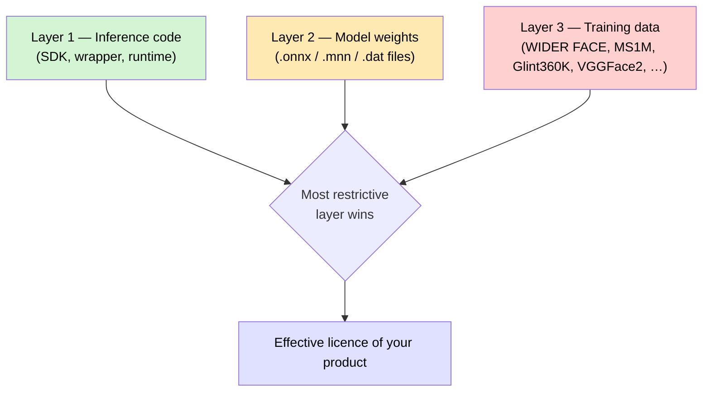
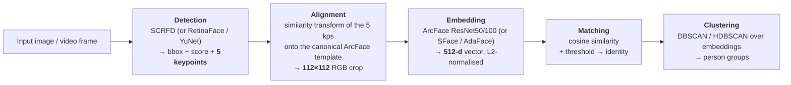
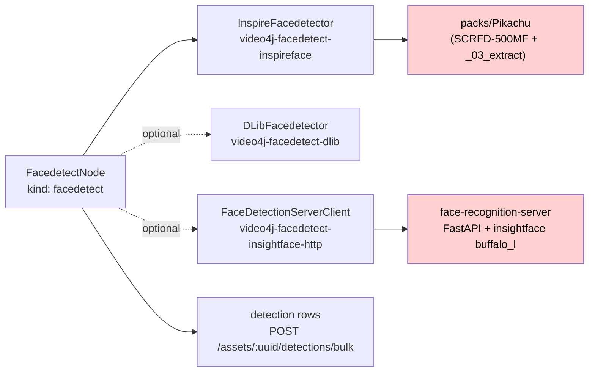

# Face Detection & Recognition — Model, Licensing and Packaging Overview

> **Status**: 🟢 Reference document (research + verified facts), not a build plan.
> **Scope**: which face models exist, which ones may be used **commercially**, how the
> **InspireFace model packs** are actually built, and what the **de-facto standard** pipeline is.
> **Audience**: AI coding agents and humans working on [cortex/nodes/facedetect/](../../../../cortex/nodes/facedetect/).

Related specs: [features/nodes/NODES.md](../NODES.md) (node reference,
`facedetect` row) · [guidelines/NEW_NODE.md](../../../guidelines/NEW_NODE.md) ·
[features/pipeline/NODE_DATA_TYPES.md](../../pipeline/NODE_DATA_TYPES.md) (typed ports).

> **The end-to-end identity workflow lives elsewhere.** This file is about *which model runs and under
> what licence*. How a detected face becomes a confirmed person — detect → embed → cluster → confirm —
> is [features/facedetection/FACE_WORKFLOW.md](../../facedetection/FACE_WORKFLOW.md).
> 🔴 Only the first of those four stages is implemented: **no face embedding is ever persisted**, so
> the DBSCAN pipeline described in §5 below is the *standard*, not what MetaLoom does.

> ⚠️ **This is engineering research, not legal advice.** Every licence claim below is sourced and
> dated; verify against the upstream `LICENSE` file before shipping. Licences change.

---

## 0. Executive Summary

| Question | Short answer |
|----------|--------------|
| **Is InspireFace commercially usable?** | **The C/C++ SDK code: yes.** The bundled model packs (`Pikachu`, `Megatron`, `Gundam_*`): **no.** They inherit InsightFace's "non-commercial research only" model licence. |
| **Is there a free InspireFace pack?** | **No.** Upstream publishes no permissively-licensed pack. But the pack format is **plain tar + a YAML manifest**, so a *self-built* pack made from permissively-licensed models is technically possible (§3.5). |
| **Any InsightFace model free for commercial use?** | **No.** InsightFace *code* is MIT; **all** model-zoo weights (`buffalo_*`, `antelopev2`, SCRFD, ArcFace) are non-commercial. |
| **What is commercially usable?** | Detection: **YuNet** (MIT), **MediaPipe BlazeFace** (Apache-2.0). Recognition: **SFace** (Apache-2.0, via OpenCV Zoo), **dlib ResNet** (Boost) — both with a training-data caveat (§4.4). |
| **What is the de-facto standard?** | Detection **SCRFD** (RetinaFace's successor) + 5-point landmarks → **ArcFace 112×112 aligned crop** → **512-d embedding** → **cosine similarity**. `insightface` `buffalo_l` is the reference implementation (§5). |
| **What does MetaLoom use today?** | InspireFace `Pikachu` pack via [inspireface4j](../../../../../inspireface4j/) — i.e. **currently on a non-commercial model licence** (§6). |

---

## 1. The Three-Layer Licensing Model

The single most common mistake in this space is treating "the repo is MIT" as "I can ship it".
There are **three independent layers**, and the most restrictive one wins:



| Layer | Typical licence | Who tells you |
|-------|-----------------|---------------|
| **1. Code** | MIT / Apache-2.0 / Boost — almost always permissive | repo `LICENSE` |
| **2. Weights** | **Frequently non-commercial** even when the code is MIT | model-zoo README, model card, a separate `LICENSE` next to the file |
| **3. Training data** | Academic-only for nearly every public face dataset | dataset terms-of-use page |

Layer 3 is where even "clean" models get murky: an MIT-licensed weight file trained on a research-only
dataset is a licence the trainer may not have had the right to grant. Practitioners generally treat the
distributor's stated licence as controlling; that is a *risk position*, not a *guarantee*. §4.4 lists
where this bites.

---

## 2. InsightFace / InspireFace — the licence chain

### 2.1 Upstream statements (verified 2026-08-02)

**[deepinsight/insightface](https://github.com/deepinsight/insightface) README §License:**

> The code of InsightFace is released under the MIT License. There is no limitation for both academic
> and commercial usage.
>
> The training data containing the annotation (and the models trained with these data) are available
> for **non-commercial research purposes only**.
>
> Both manual-downloading models from our github repo **and** auto-downloading models with our
> python-library follow the above license policy.

**[insightface/model_zoo/README.md](https://github.com/deepinsight/insightface/tree/master/model_zoo)**, first line:

> 🔔 **ALL models are available for non-commercial research purposes only.**

Their 2025-11-24 update splits commercial contacts three ways:

| What you want to license | Contact |
|---|---|
| inswapper face-swap models | `contact@insightface.ai` |
| Open-sourced recognition packs (`buffalo_l`, …) | `recognition-oss-pack@insightface.ai` |
| **InspireFace SDK + models** | `contact@insightface.ai` |

**[HyperInspire/InspireFace](https://github.com/HyperInspire/InspireFace) README §License:**

> The licensing of the open-source models employed by InspireFace adheres to the same requirements as
> InsightFace, specifying their use **solely for academic purposes** and explicitly **prohibiting
> commercial applications**.

Our own wrapper [inspireface4j/README.md](../../../../../inspireface4j/README.md) already repeats this
warning — the Java binding code is Apache-2.0, the packs are not redistributable for commercial use
(and are correctly `.gitignore`d: `/packs`).

### 2.2 What the model packs contain, by dataset

| Pack slot | Pikachu model | Megatron model | Underlying dataset |
|---|---|---|---|
| Detection | SCRFD-500MF | SCRFD-2.5GF | **WIDER FACE** — academic/non-commercial |
| Recognition | MobileFaceNet-class (`_03_extract`) | ResNet-18 @ **Glint360K** | **Glint360K** — non-commercial |
| Attribute | FairFace | FairFace | FairFace (CC-BY-4.0 dataset, but the shipped weights carry the pack licence) |

> **Correction (2026-08-02, verified by download):** an earlier revision of this file repeated
> insightface's model-zoo table in listing `buffalo_l` and `antelopev2` as using **RetinaFace-10GF**.
> They do not. Both ship **SCRFD-10GF** — and in fact the *same* SCRFD-10GF: `buffalo_l/det_10g.onnx`
> and `antelopev2/scrfd_10g_bnkps.onnx` are byte-identical
> (`sha256 5838f7fe053675b1…`, 16,923,827 bytes). The upstream table's "RetinaFace-10GF" label is
> wrong; antelopev2's own filename says SCRFD. Consequence: buffalo_l and antelopev2 differ **only**
> in the embedder (`w600k_r50` vs `glintr100` R100), not in detection.

So the restriction is *structural*, not a formality: SCRFD is trained on WIDER FACE (academic only),
and the Megatron embedder is explicitly a Glint360K model.

### 2.3 Is there a "free" InspireFace variant?

**No pack shipped by upstream is commercially licensed.** All four families —
`Pikachu`, `Megatron`, `Megatron_TRT`, `Gundam_*` (RK NPU variants) — come from the same release page
under the same clause. There is no "community/permissive" pack, and no upstream issue promising one.

The realistic options are, in order of cost:

1. **Don't use InspireFace for commercial deployment** — swap in a permissive stack (§4).
2. **Buy a licence** from `contact@insightface.ai` (this also unlocks their higher-accuracy models).
3. **Build your own pack** from permissively-licensed models — the format is open, see §3.5.
   You keep the InspireFace SDK (which is fine to use) and replace only the weights.

---

## 3. How an InspireFace model pack is actually packaged

This section was **verified by unpacking the local packs**
(`inspireface4j/packs/Pikachu`, `.../Megatron`) on 2026-08-02.

### 3.1 The container: it's just a tar

A "pack" is an **extension-less GNU/PAX tar archive** (created on macOS — note the stray `.DS_Store`).
Not encrypted, not signed, not compressed.

```bash
file packs/Pikachu          # -> POSIX tar archive
tar -tvf packs/Pikachu      # lists the members
tar -xf  packs/Pikachu -C /tmp/pack   # extracts flat, no top-level dir
```

| Pack | Size | Members |
|------|------|---------|
| `Pikachu` | 15.8 MB | 14 (12 models + `__inspire__` + `.DS_Store`) |
| `Megatron` | 60.2 MB | 14 (12 models + `__inspire__` + `.DS_Store`) |

### 3.2 The manifest: `__inspire__`

`__inspire__` is a **plain-text YAML file** (~6.5 KB). It is the pack's schema: a header plus one
block per *functional slot*. Each block names a model file and everything the MNN runtime needs to
drive it.

```yaml
tag: Pikachu
version: 3.1
major: t3.1  # 't3.1' Update landmark model
release: 2025-02-19

# Recommended parameter values based on experience
similarity_converter:
  threshold: 0.48        # cosine threshold for "same person"
  middle_score: 0.6
  steepness: 8.0
  output_min: 0.01
  output_max: 1.0

face_detect_640:
  name: _00_scrfd_500m_bnkps_shape640x640_fp16
  fullname: _00_scrfd_500m_bnkps_shape640x640_fp16.mnn
  model_type: MNN
  infer_engine: MNN
  infer_backend: CPU
  input_channel: 3
  nchw: true
  swap_color: false
  input_tensor_type: float32
  output_tensor_type: float32
  threads: 1
  input_layer: input.1
  outputs_layers: [score_8, score_16, score_32,
                   bbox_8,  bbox_16,  bbox_32,
                   kps_8,   kps_16,   kps_32]     # SCRFD's 3-stride head
  input_size: [640, 640]
  mean: [127.5, 127.5, 127.5]
  norm: [0.0078125, 0.0078125, 0.0078125]         # = 1/128
```

Everything about the model is **data**, not code: input layer name, output tensor names, NCHW flag,
BGR/RGB swap, mean/scale normalisation, thread count, backend. That is exactly why swapping models is
feasible (§3.5).

### 3.3 The slot table (this is the "different purposes" you noticed)

Both packs implement **the same 11 slots**. A pack is a *whole face-analysis pipeline*, not a single
model — this is the part that is not obvious from the outside.

| Manifest slot | Purpose | Input | Pikachu (edge/CPU) | Megatron (server) |
|---|---|---|---|---|
| `face_detect_160` | Detection, low-res tier | 160×160 | `_00_scrfd_500m_bnkps_…160` | `_00_scrfd_2.5g_bnkps_…160` |
| `face_detect_320` | Detection, mid tier | 320×320 | `_00_scrfd_500m_…320` | `_00_scrfd_2.5g_…320` |
| `face_detect_640` | Detection, high tier | 640×640 | `_00_scrfd_500m_…640` | `_00_scrfd_2.5g_…640` |
| `landmark` | Dense facial landmarks | 112×112 | `_01_hyplmkv2_0.25_112x_fp16` | *same file* |
| `refine_net` | Track/box refinement (is this still a face?) | 24×24 | `_04_refine_net` | *same file* |
| `pose_quality` | Head pose (yaw/pitch/roll) + quality | 96×96 | `_07_pose_q_fp16` | *same file* |
| **`feature`** | **Recognition embedding** | 112×112 | `_03_extract` (4.8 MB, MobileFaceNet-class) | `_03_r18_Glint360K_fixed` (48 MB, ResNet-18 @ Glint360K) |
| `mask_detect` | Mask on/off | 96×96 | `_05_mask` | *same file* |
| `rgb_anti_spoofing` | RGB liveness / presentation attack | 112×112 | `_06_msafa27` (MiniFASNet family) | *same file* |
| `face_attribute` | Age / gender / race | 112×112 | `_08_fairface_fp16` | *same file* |
| `blink_predict` | Eye blink (face interaction) | 64×64 | `_09_blink_crop` | *same file* |

**Key insight**: Pikachu and Megatron differ in exactly **two** slots — the detector backbone
(SCRFD-500MF vs SCRFD-2.5GF) and the embedder (`_03_extract` vs `r18@Glint360K`).
**Nine of eleven models are byte-identical between the packs.** The 44 MB size gap is essentially the
ResNet-18 embedder.

The `similarity_converter.threshold` also differs, because the embedders differ:

| Pack | threshold | steepness | output_min |
|---|---|---|---|
| Pikachu | 0.48 | 8.0 | 0.01 |
| Megatron | **0.32** | 10.0 | 0.02 |

⚠️ **Embeddings from different packs are not comparable.** Changing the pack invalidates every stored
embedding and every clustering result.

### 3.4 Model file format

The model files are **MNN** (Alibaba's inference engine) binaries, mostly `_fp16` quantised. The
`.mnn` extension is stripped inside the archive — `name` is the archive member, `fullname` is the
logical name. The `Gundam_*` packs contain **RKNN** binaries instead (Rockchip NPU), and
`Megatron_TRT` contains TensorRT engines — same manifest structure, different `model_type`.

> `_02_pose_fp16` ships inside both packs but **is not referenced by any manifest slot** — a leftover
> from before `_07_pose_q_fp16` replaced it. Don't be confused by the file count.

### 3.5 Building your own pack (the escape hatch)

Because the manifest is plain YAML and the container is plain tar, a permissively-licensed pack is
mechanically achievable:

```bash
# 1. Convert your ONNX models to MNN
MNNConvert -f ONNX --modelFile yunet.onnx --MNNModel _00_yunet_640.mnn --bizCode biz

# 2. Author __inspire__ describing each slot (copy Pikachu's and edit
#    name/fullname/input_layer/outputs_layers/input_size/mean/norm)

# 3. Repack — flat, no top-level directory
tar -cf MyPack _00_yunet_640 _01_landmark … __inspire__
```

**What makes this hard is not the packaging, it is the head contract.** InspireFace's C++ decoder
expects SCRFD's exact 9-output head (`score_{8,16,32}`, `bbox_{8,16,32}`, `kps_{8,16,32}`).
YuNet's head is shaped differently, so a drop-in swap of the *detector* requires patching the SDK's
post-processing — the manifest can describe the tensors but not reinterpret them. Swapping the
**`feature` slot** is far easier: any 112×112 → 512-d embedder with a single output tensor fits the
existing contract, so **replacing only the recognition model with SFace/AdaFace is the cheapest
licence-clean path** if you stay on InspireFace.

---

## 4. What is actually free for commercial use

### 4.1 Detection — genuinely permissive options exist

| Model | Code/weights licence | Verified | Notes |
|---|---|---|---|
| **YuNet** ([opencv_zoo](https://github.com/opencv/opencv_zoo/tree/main/models/face_detection_yunet)) | **MIT** (© Shiqi Yu) — `LICENSE` in the model dir | ✅ raw file fetched | ~0.88/0.87/0.75 AP on WIDER easy/med/hard. Detects faces ~10×10 to 300×300 px. Ships **inside OpenCV** as `cv::FaceDetectorYN`. 5 landmarks. |
| **MediaPipe BlazeFace** | **Apache-2.0** (framework + weights) | ✅ | Very fast, mobile-tuned; 6 keypoints; weaker on small/crowded faces. |
| **RetinaFace** ([serengil/retinaface](https://github.com/serengil/retinaface)) | **MIT** repo-wide | ✅ raw `LICENSE` fetched | ⚠️ Weights descend from InsightFace's original RetinaFace via a TF2 re-implementation. The distributor states MIT; the provenance chain is the risk (§4.4). |
| **SCRFD** (insightface) | ❌ **non-commercial** | ✅ | The accuracy leader, but licence-blocked. |
| YOLO-face (ultralytics) | ❌ **AGPL-3.0** or paid | — | AGPL is a network-copyleft trap for a DAM server. Avoid unless you buy the Ultralytics licence. |

**Recommendation for detection: YuNet.** MIT, small, fast, already in OpenCV (which MetaLoom links
via [video4j](../../../../../video4j/)/[opencv-ffm](../../../../../opencv-ffm/)), emits the 5 landmarks the
ArcFace alignment needs.

### 4.2 Recognition — this is the hard one

| Model | Distributor licence | Verified | Notes |
|---|---|---|---|
| **SFace** ([opencv_zoo](https://github.com/opencv/opencv_zoo/tree/main/models/face_recognition_sface)) | **Apache-2.0** (`LICENSE` in the model dir) | ✅ raw file fetched | MobileFaceNet trained with SFace loss. 112×112 → **128-d**. 0.9940 on the zoo's eval. Ships as `cv::FaceRecognizerSF`. **The most defensible commercially-usable embedder available.** ⚠️ paper trains on CASIA-WebFace/VGGFace2/MS-Celeb-1M (§4.4). |
| **dlib** `dlib_face_recognition_resnet_model_v1` | **Boost Software License** (dlib-wide) | ✅ README read | ResNet-29, 128-d, 0.9938 LFW. Davis King **explicitly flags** `shape_predictor_68_face_landmarks` as *non-commercial* (300-W dataset) but attaches **no such warning** to the recognition model — trained on FaceScrub + VGG + own scrape. The absence of a warning where he wrote warnings elsewhere is meaningful, if not dispositive. |
| **GhostFaceNets** | MIT (repo) | ✅ | SOTA-lightweight; weights trained on MS1MV2/MS1MV3 → dataset layer is research-only. |
| **AdaFace** | MIT (repo) | ✅ | Excellent accuracy; official weights are MS1MV2/MS1MV3/WebFace4M → research-only data. |
| **FaceNet** (davidsandberg / facenet-pytorch) | MIT (code) | — | Weights trained on VGGFace2 / CASIA-WebFace → research-only data. |
| **EdgeFace** (Idiap) | research-restricted | — | Do not assume commercial use. |
| **ArcFace / buffalo_\* / antelopev2** | ❌ **non-commercial** | ✅ | The accuracy leaders, licence-blocked. |

### 4.3 Landmarks, attributes, liveness

| Purpose | Commercially usable | Blocked |
|---|---|---|
| 5-point landmarks | Comes free from **YuNet** and BlazeFace output | insightface 2d106/3d68 |
| 68-point landmarks | MediaPipe Face Mesh (Apache-2.0) | ❌ dlib `shape_predictor_68_*` (explicitly non-commercial — 300-W) |
| Age / gender | dlib `dnn_age_predictor_v1`, `dnn_gender_classifier_v1` — **CC0** (Cydral Technology) | insightface genderage, FairFace-in-pack |
| Anti-spoofing / liveness | **Nothing clean and good.** Silent-Face-Anti-Spoofing (MiniFASNet) is Apache-2.0 code but the weights' data provenance is unclear | InspireFace `_06_msafa27` |

### 4.4 The training-data caveat, stated plainly

Almost every strong public face model was trained on a dataset whose terms say *academic,
non-commercial*:

| Dataset | Used by | Terms |
|---|---|---|
| **WIDER FACE** | SCRFD, YuNet, RetinaFace, most detectors | "released for academic research only … free to researchers from educational or research institutions for non-commercial purposes" |
| **MS-Celeb-1M / MS1MV2 / MS1MV3** | ArcFace, GhostFaceNets, AdaFace | Research only (and formally retracted by Microsoft) |
| **Glint360K** | Megatron's `_03_r18_Glint360K` | Research only |
| **WebFace260M / WebFace600K** | buffalo_l/m/s | Research only |
| **CASIA-WebFace, VGGFace2** | SFace, FaceNet | Research only |
| **300-W** | dlib 68-pt landmarks | Non-commercial (creator asked for an explicit note) |

**Consequence: YuNet's MIT licence and SFace's Apache-2.0 licence are the distributor's grants, made
over weights derived from research-only data.** In practice OpenCV ships both inside a
commercially-used library and the industry treats them as usable — that is the pragmatic bar most
products clear. It is a *materially different* risk from InsightFace, where the distributor
**affirmatively forbids** commercial use. Don't conflate "unclear upstream data" with "explicitly
prohibited".

If you need zero data-provenance risk, the only real answers are: buy a commercial SDK
(InsightFace, Paravision, or similar), or train on licensed/synthetic data yourself.

---

## 5. The de-facto standard pipeline

Independent of licensing, there is a clear industry-standard shape. Anything interoperable follows it.



### 5.1 The pieces, and why they are the standard

| Stage | The standard | Why |
|---|---|---|
| **Detection** | **SCRFD** (2021, insightface). **RetinaFace** (2019) is the predecessor and still the most *cited* name. | SCRFD gets RetinaFace-level WIDER accuracy at a fraction of the FLOPs, and crucially emits the **5 keypoints** alignment needs. Everything downstream assumes those 5 points exist. |
| **Alignment** | **ArcFace 112×112 canonical 5-point template** — a fixed similarity transform | This is the real interop contract. Feed an embedder a differently-aligned crop and accuracy collapses silently. Every mainstream embedder expects this crop. |
| **Embedding** | **ArcFace** (additive angular margin softmax), ResNet-50/100 backbone, **512-d**, L2-normalised | ArcFace loss won the field ~2019 and never lost it. AdaFace/SFace/CosFace are refinements of the same margin-softmax idea against the same crop and output shape. |
| **Matching** | **Cosine similarity** on normalised vectors; threshold ~0.28–0.40 for ResNet ArcFace | On L2-normalised vectors cosine == dot product == monotone in Euclidean distance. Threshold is model-specific (see InspireFace's own 0.48 vs 0.32 split). |
| **Clustering** | **DBSCAN / HDBSCAN** on cosine distance | Density-based, no *k* needed, produces a noise class — right shape for "who appears in this library". Matches MetaLoom's existing `faceClusterEPS` / `faceClusterMinimum` options. |

### 5.2 Reference implementations, ranked by adoption

| Rank | Stack | Detection + Recognition | Commercial? |
|---|---|---|---|
| 1 | **insightface `buffalo_l`** (ONNX, `pip install insightface`) | SCRFD-10GF + ResNet50@WebFace600K | ❌ |
| 2 | **InspireFace** (C++/MNN, cross-platform, NPU) | SCRFD + ArcFace-family | ❌ |
| 3 | **DeepFace** (Python, pluggable) | many backends; wraps everything above | mixed — per-model |
| 4 | **OpenCV `FaceDetectorYN` + `FaceRecognizerSF`** | YuNet + SFace | ✅ **the permissive standard** |
| 5 | **dlib** | HOG/MMOD + ResNet-29 | ✅ (Boost) |

If someone says "the standard face recognition pipeline" with no further qualification, they mean
**#1**. If they say "the standard pipeline I can actually ship", they mean **#4**.

### 5.3 Accuracy ordering (approximate, for expectation-setting)

```
buffalo_l / antelopev2  (ArcFace R50-R100, 512-d)   ██████████  best
Megatron  (R18 @ Glint360K, InspireFace)            ████████
AdaFace / GhostFaceNets (MS1MV3)                    ████████
SFace     (MobileFaceNet, 128-d, opencv_zoo)        ██████      ← best permissive
dlib ResNet-29 (128-d)                              █████
Pikachu   (MobileFaceNet-class, InspireFace)        █████
```

The permissive tier costs roughly one accuracy generation. For a DAM use case ("group photos by
person, let a human confirm") that is usually acceptable. For access control or 1:N over millions of
identities it is not.

---

## 6. Where MetaLoom stands today

### 6.1 Current wiring



| Path | Model | Licence status |
|---|---|---|
| `INSPIREFACE` capability (**default**) | InspireFace `packs/Pikachu` | 🔴 **non-commercial** |
| `DLIB` capability (opt-in) | dlib detector + ResNet embedder | 🔴 **see below** — not the clean "🟢 Boost" it looks like |
| `insightface-http` (`face-recognition-server`, `MODEL_ID=buffalo_l`) | insightface `buffalo_l` | 🔴 **non-commercial** |

> **Correction (2026-08-02):** the `DLIB` row previously read "🟢 Boost, permissive". That is wrong
> as the capability is actually wired. `jdlib` drives the recogniser through
> `shape_predictor_68_face_landmarks.dat`, which is the **only** landmark model in
> `cortex/nodes/facedetect/core/dlib/` — and §4.3 of this document records that Davis King marks it
> **explicitly non-commercial** (the 300-W dataset). So the dlib path as configured is prohibited,
> even though the *recogniser* (`dlib_face_recognition_resnet_model_v1.dat`) carries no such warning
> and is Boost-licensed. **Fix:** swap in `shape_predictor_5_face_landmarks.dat`, which has no
> commercial restriction — and which is the 5-point set ArcFace-style alignment wants anyway. It is
> not currently on disk; `face-eval/tools/fetch-data.sh` downloads it.

> 🔴 **Live memory-safety bug in `inspireface4j` (found 2026-08-02).**
> `FaceDetections.releaseData()` passes its `HFMultipleFaceData` to
> `InspirefaceLib.releaseFaceFeature(...)`, whose C shim calls `HFReleaseFaceFeature(*feature)` —
> a detection-results struct handed to the face-*feature* deallocator. This is a type-confused free
> and it **segfaults the JVM** (`SIGSEGV … HFReleaseFaceFeature+0x18`), reproduced on the first
> embedding call with the Pikachu pack under SDK 1.2.3. It is very likely the cause of the
> long-standing SIGSEGVs in this node. Not calling `releaseData()` is both the workaround and the
> correct behaviour: `HFMultipleFaceData` from `HFExecuteFaceTrack` points into session-owned memory
> and is not the caller's to free. Separately, the C shim leaks a `new HFFaceFeature()` and an
> `HFImageStream` on every embedding call. See
> `face-eval/engines/inspireface/.../InspirefaceEngine.java#releaseLast`.

The default capability set is `Set.of(FacedetectNodeCapabilities.INSPIREFACE)` and the default pack
path is `packs/Pikachu` — see
[FacedetectNodeOptions.java](../../../../cortex/nodes/facedetect/core/src/main/java/io/metaloom/cortex/node/facedetect/FacedetectNodeOptions.java).

### 6.2 The exposure, stated concretely

MetaLoom's **default, out-of-the-box** face pipeline runs on models that their authors state are for
academic use only. That is fine for development and evaluation. It is **not** fine for a shipped
commercial DAM product or a hosted service (cf. the `metaloom-saas` checkout). This is a
**shipping blocker to resolve before any commercial release**, not a code defect.

### 6.3 The three ways out

| Option | Effort | Accuracy | Licence |
|---|---|---|---|
| **A. Buy an InsightFace/InspireFace commercial licence** | € + email | best | 🟢 clean, contractual |
| **B. Add a permissive capability: YuNet + SFace via OpenCV** | Medium — OpenCV already linked; `cv::FaceDetectorYN`/`cv::FaceRecognizerSF` are in the OpenCV DNN module; needs a new `video4j-facedetect-opencv` backend + a `FacedetectNodeCapabilities.OPENCV` value | ~1 generation lower | 🟢 MIT + Apache-2.0 |
| **C. Self-built InspireFace pack** (§3.5) | High — detector head contract must be patched, or swap only the `feature` slot | varies | 🟡 depends on chosen weights |

**Recommendation: B**, with A as the paid upgrade path. B keeps MetaLoom shippable by default and
turns InspireFace into an *opt-in, licence-gated* capability. The existing capability enum
(`INSPIREFACE`, `DLIB`) is already the right seam for this — adding `OPENCV` fits the design.

⚠️ Whichever is chosen: **switching the embedder invalidates every stored embedding and every face
cluster.** Embeddings must be versioned by (model, pack, dimensionality) and re-extraction must be
schedulable. See [features/search/SEMANTIC_SEARCH.md](../../search/SEMANTIC_SEARCH.md) for the
(not-yet-built) vector-search side of this.

---

## 7. Progress Assessment

Research/documentation items:

- [x] Establish InsightFace model-zoo licence (non-commercial, verified against upstream README)
- [x] Establish InspireFace pack licence (inherits InsightFace, verified against upstream README)
- [x] Reverse-engineer the InspireFace pack format (tar + `__inspire__` YAML, verified by extraction)
- [x] Map all 11 pack slots and diff Pikachu vs Megatron
- [x] Identify commercially usable detection models (YuNet MIT, BlazeFace Apache-2.0)
- [x] Identify commercially usable recognition models (SFace Apache-2.0, dlib Boost)
- [x] Document the training-data caveat and which datasets are research-only
- [x] Document the de-facto standard pipeline (SCRFD → 5-pt align → 112×112 → ArcFace 512-d → cosine)
- [x] Audit MetaLoom's current facedetect wiring against the above

Engineering items (**none started**):

- [ ] Decide between option A / B / C (§6.3) — **product decision, blocks commercial release**
- [ ] Add `FacedetectNodeCapabilities.OPENCV` (YuNet + SFace) backend — the enum is still `{INSPIREFACE, DLIB}`
- [x] ~~Add a `video4j-facedetect-opencv` module~~ — **it exists**: `video4j/facedetect/opencv/`
      (`CVFacedetectorImpl`, with `detectEmbeddings`/`extractEmbeddings` implemented). Only the
      metaloom-side capability value and wiring are missing. Verified 2026-08-06.
- [ ] Version stored embeddings by (model, pack, dim) so a backend switch is detectable
- [ ] Add a re-extraction path for embeddings after a model change
- [ ] Make the default capability set licence-safe (currently `INSPIREFACE`)
- [ ] Document the licence choice on the customer-facing website
  ([website/WEBSITE.md](../../../website/WEBSITE.md) rules apply)
- [ ] Add a `NOTICE`/third-party-licences file enumerating the shipped model licences

---

## 8. Key Classes Reference

| Class / file | Package or path | Purpose |
|---|---|---|
| `FacedetectNode` | `io.metaloom.cortex.node.facedetect` | The `facedetect` node; runs detection, persists `detection` rows |
| `FacedetectNodeOptions` | `io.metaloom.cortex.node.facedetect` | `KEY = "facedetection"`; pack path, chop rate, cluster EPS/min, capabilities |
| `FacedetectNodeCapabilities` | `io.metaloom.cortex.node.facedetect` | Enum `{ INSPIREFACE, DLIB }` — the backend seam; add `OPENCV` here |
| `FacedetectNodeModule` | `io.metaloom.cortex.node.facedetect` | Dagger module; constructs `InspireFacedetector`, `DLibFacedetector`, `FaceDetectionServerClient` |
| `VideoFaceScanner` | `io.metaloom.cortex.node.facedetect.video` | Frame-sampling + tracking across video |
| `FacedetectDescriptorProvider` | `io.metaloom.loom.nodes.spec` (`loom-shared/node-model`) | Declares the node kind + ports to the palette |
| `InspireFacedetector` | `video4j-facedetect-inspireface` (external) | Wraps inspireface4j |
| `DLibFacedetector` / `DLibFacedetectorImpl` | `video4j-facedetect-dlib` (external) | dlib backend |
| `FaceDetectionServerClient` | `video4j-facedetect-insightface-http` (external) | HTTP client for `face-recognition-server` |
| `InspirefaceSession` | `io.metaloom.inspireface4j` (`../../../../../inspireface4j/`) | FFM binding; `session(packPath, size, recognition, attributes)` |
| `main.py` | `../../../../../face-recognition-server/` | FastAPI wrapper over insightface `buffalo_l` |
| `FacedetectNodeIntegrationTest` | `integration-test/.../node` | End-to-end node IT |

---

## 9. Environment / Configuration

The node is configured through pipeline node options, not env vars. Relevant knobs
(`FacedetectNodeOptions`):

| Option | Default | Meaning |
|---|---|---|
| `inspirefacePackPath` | `packs/Pikachu` | Path to the InspireFace pack (tar). Changing it changes the embedder → invalidates embeddings |
| `capabilities` | `{ INSPIREFACE }` | Which backends to construct. A backend not listed is provided as `null` |
| `videoChopRate` | `5` | Process every nth video frame |
| `videoScaleSize` | `384` | Frames upscaled to this size before detection |
| `minFaceHeightFactor` | `0.05` | Faces smaller than this fraction of frame height are dropped |
| `faceClusterEPS` | `0.6` | DBSCAN epsilon over embeddings |
| `faceClusterMinimum` | `2` | DBSCAN minimum cluster size |

Detector input tier is hard-coded to **640** in `FacedetectNodeModule.inspirefaceDetector()`
(`InspireFacedetector.create(packPath, 640, true, true, true)`) — the pack also carries 160 and 320
tiers that are currently unreachable via options.

The `face-recognition-server` sidecar reads `MODEL_ID` (default `buffalo_l`) and is currently
addressed by a constant base URL in `FacedetectNodeModule`.

---

## 10. Conventions and Gotchas

| # | Gotcha |
|---|---|
| 1 | **"MIT repo" ≠ "MIT model".** InsightFace is the canonical example: MIT code, non-commercial weights. Always read the model-zoo README, not just the root `LICENSE`. |
| 2 | **A pack is a pipeline, not a model.** 11 slots. "Switching packs" swaps detection *and* recognition *and* the similarity threshold at once. |
| 3 | **Packs are unencrypted tar.** `tar -tvf packs/Pikachu` inspects them; `__inspire__` is readable YAML. Use this to audit what you are actually shipping. |
| 4 | **Cross-pack embeddings are incomparable.** Pikachu's threshold is 0.48, Megatron's is 0.32 — different embedders, different geometry. Never mix. |
| 5 | **`_02_pose_fp16` is dead weight** — present in both packs, referenced by no manifest slot. |
| 6 | **9 of 11 models are identical between Pikachu and Megatron.** Only the detector backbone and the embedder differ. Size difference ≈ the ResNet-18. |
| 7 | **Alignment is the silent killer.** The 112×112 ArcFace 5-point template is the interop contract. A detector whose keypoints don't match it will produce plausible-looking but badly degraded embeddings — no error, just worse results. |
| 8 | **Swapping the InspireFace `feature` slot is easy; swapping the detector is not.** The SDK hard-codes SCRFD's 9-tensor head; the manifest can rename tensors but not restructure decoding. |
| 9 | **Ultralytics YOLO-face is AGPL-3.0.** Network copyleft. Do not pull it into a server product without the commercial licence. |
| 10 | **dlib's 68-point shape predictor is explicitly non-commercial** (300-W), while dlib's *recognition* model carries no such warning. Don't treat "dlib" as one licence. |
| 11 | **`packs/` is gitignored** in inspireface4j — packs are downloaded, never committed. Don't "fix" a missing pack by committing one. |
| 12 | **The default capability set is the non-commercial one.** Any licence remediation must change `FacedetectNodeOptions.capabilities`' default, not just add an option. |

---

## 11. Test Setup

There is no test for licence posture (nor should there be), but the model plumbing is covered:

| Test | Location | Covers |
|---|---|---|
| `InspirefaceTest` | `cortex/nodes/facedetect/core/src/test/java/io/metaloom/loom/cortex/node/facedetect/` | Raw InspireFace binding — **requires a pack on disk** |
| `FacedetectNodeDetectionsTest` | `.../io/metaloom/cortex/node/facedetect/` | Detection → `detection` row mapping |
| `FacedetectNodePipelineTest` | same | Node inside the pipeline |
| `FacedetectNodeOptionsValidationTest` | same | Option validation |
| `VideoFaceScannerTest` | `.../io/metaloom/loom/cortex/node/facedetect/` | Frame sampling / tracking |
| `FacedetectNodeIntegrationTest` | `integration-test/src/test/java/io/metaloom/loom/test/integration/node/` | End-to-end |

To run anything touching InspireFace you need the pack:

```bash
cd ../inspireface4j
mkdir -p packs && cd packs
wget https://github.com/HyperInspire/InspireFace/releases/download/v1.x/Pikachu
wget https://github.com/HyperInspire/InspireFace/releases/download/v1.x/Megatron
```

Loom-side tests additionally need the DB pool — run `./setup-pool.sh` (see
[.claude/CLAUDE.md](../../../../.claude/CLAUDE.md)).

⚠️ There is a **known native ABI hazard** here: inspireface4j links OpenCV 4.10 while video4j loads
OpenCV 5.1, which has produced SIGSEGVs in facedetect. Check before blaming the model layer.

---

## 12. Where do I find …?

| I want … | Look at |
|---|---|
| The node implementation | [cortex/nodes/facedetect/core/src/main/java/io/metaloom/cortex/node/facedetect/](../../../../cortex/nodes/facedetect/core/src/main/java/io/metaloom/cortex/node/facedetect/) |
| The backend seam (which model runs) | `FacedetectNodeCapabilities` + `FacedetectNodeModule` |
| Default pack path / thresholds | `FacedetectNodeOptions` |
| The Java↔InspireFace FFM binding | `../../../../../inspireface4j/` |
| The pack files themselves | `../../../../../inspireface4j/packs/` (gitignored, downloaded) |
| What's inside a pack | `tar -tvf packs/Pikachu` then read `__inspire__` |
| The insightface HTTP sidecar | `../../../../../face-recognition-server/` |
| The node's row in the node table | [features/nodes/NODES.md](../NODES.md) §3 |
| How a face becomes a confirmed person | [features/facedetection/FACE_WORKFLOW.md](../../facedetection/FACE_WORKFLOW.md) |
| Where detections are persisted | `POST /assets/:uuid/detections/bulk` → `detection` table |
| Rules for adding a new backend as a node kind | [guidelines/NEW_NODE.md](../../../guidelines/NEW_NODE.md) |
| Customer-facing face docs | [website/content/english/docs/nodes/facedetect/](../../../../website/content/english/docs/nodes/facedetect/) |

---

## 13. Sources

Licensing (all fetched and read on 2026-08-02):

- [deepinsight/insightface — README §License](https://github.com/deepinsight/insightface)
- [insightface/model_zoo/README.md](https://github.com/deepinsight/insightface/tree/master/model_zoo)
- [InsightFace enterprise licensing](https://www.insightface.ai/solutions/face-recognition-licensing)
- [HyperInspire/InspireFace — README §License](https://github.com/HyperInspire/InspireFace)
- [opencv_zoo — YuNet LICENSE (MIT)](https://github.com/opencv/opencv_zoo/blob/main/models/face_detection_yunet/LICENSE)
- [opencv_zoo — SFace LICENSE (Apache-2.0)](https://github.com/opencv/opencv_zoo/blob/main/models/face_recognition_sface/LICENSE)
- [opencv_zoo — YuNet README (accuracy, provenance)](https://github.com/opencv/opencv_zoo/blob/main/models/face_detection_yunet/README.md)
- [opencv_zoo — SFace README](https://github.com/opencv/opencv_zoo/blob/main/models/face_recognition_sface/README.md)
- [serengil/retinaface — LICENSE (MIT) + README acknowledgements](https://github.com/serengil/retinaface)
- [serengil/deepface — README §Licence (per-model licence table)](https://github.com/serengil/deepface)
- [davisking/dlib-models — README (per-model licence notes)](https://github.com/davisking/dlib-models)
- [HamadYA/GhostFaceNets — LICENSE (MIT)](https://github.com/HamadYA/GhostFaceNets/blob/main/LICENSE)
- [google-ai-edge/mediapipe — LICENSE (Apache-2.0)](https://github.com/google-ai-edge/mediapipe/blob/master/LICENSE)
- [WIDER FACE benchmark](http://shuoyang1213.me/WIDERFACE/) ·
  [WIDER challenge terms](https://wider-challenge.org/terms_and_conditions_2018.html)
- [SFace paper (training databases)](https://arxiv.org/abs/2205.12010) ·
  [zhongyy/SFace](https://github.com/zhongyy/SFace)

Pack format: **verified locally** by extracting `inspireface4j/packs/{Pikachu,Megatron}` and reading
their `__inspire__` manifests. Not taken from documentation — upstream does not document the format.

---

**GIT HEAD**: `1e12f39eaf2d27d461338c89c1d8dc3fee6bebee` (master, 2026-08-06)
**Verified**: 2026-08-02 (licensing research) · 2026-08-06 (cross-links + the OpenCV correction in §7)
**Method**: upstream `LICENSE`/README files fetched directly; InspireFace pack internals extracted and
read from the local `inspireface4j` checkout; MetaLoom wiring read from
`cortex/nodes/facedetect/core`.
**2026-08-06 changes**: added the pointer to the new
[features/facedetection/FACE_WORKFLOW.md](../../facedetection/FACE_WORKFLOW.md) (which owns the
detect → embed → cluster → confirm loop, and records that only stage 1 is implemented); fixed two
stale `features/pipeline-nodes/` links to `features/nodes/`; corrected the §7 claim that
`video4j-facedetect-opencv` does not exist — it does.
