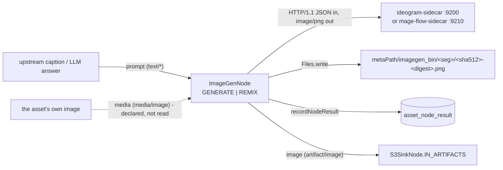

# Image Generation Node (`imagegen`) — Text-to-Image and Prompted Remix

> **Status**: 🟢 **Built and shipping.** Kind `imagegen`, module
> [cortex/nodes/image-generation/](../../../../cortex/nodes/image-generation/), package
> `io.metaloom.cortex.node.imagegen`. 22 unit tests + 1 integration test + a docs-fixture recipe;
> inference runs in one of **two interchangeable FastAPI sidecars** —
> [sidecars/ideogram-sidecar/](../../../../sidecars/ideogram-sidecar/) on port 9200 and
> [sidecars/mage-flow-sidecar/](../../../../sidecars/mage-flow-sidecar/) on port 9210. The contract is
> generated from the node's own annotations into `node-descriptors.json` and kept honest by
> `NodeSpecGoldenTest`.
> **Scope**: the `imagegen` node — from the prompt it is given to the PNG under `imagegen_bin` and the
> `asset_node_result` ledger row.
> **Audience**: AI coding agents and humans working on
> [cortex/nodes/image-generation/](../../../../cortex/nodes/image-generation/).

**Out of scope, and where it lives instead:**

| Not here | There |
|---|---|
| The node system, lifecycle, registration, caching layers | [../NODES.md](../NODES.md) |
| Port content types and cardinality across all nodes | [../NODE_DATA_TYPES.md](../NODE_DATA_TYPES.md) |
| Rules for adding a node at all | [../../../guidelines/NEW_NODE.md](../../../guidelines/NEW_NODE.md) |
| The open work items on this node | [../../../tasks/IMAGEGEN_NODE.md](../../../tasks/IMAGEGEN_NODE.md) |
| The sidecar fleet, its port bands and shared operational rules | [../../../sidecars/SIDECARS.md](../../../sidecars/SIDECARS.md) |
| Each sidecar's internals, models and VRAM behaviour | [../../../sidecars/IDEOGRAM_SIDECAR.md](../../../sidecars/IDEOGRAM_SIDECAR.md) · [../../../sidecars/MAGE_FLOW_SIDECAR.md](../../../sidecars/MAGE_FLOW_SIDECAR.md) |
| Why generated bytes cannot be pushed into Loom | [../../rest/REST_BINARY_HANDLING.md](../../rest/REST_BINARY_HANDLING.md) |
| Getting the bytes off the worker | `s3-sink`, [../NODES.md](../NODES.md) §2.1 |
| The customer-facing page and its three screenshots | [../../../website/WEBSITE.md](../../../website/WEBSITE.md) § Node pages |
| The video sibling built from the same shape | `videogen` (`cortex/nodes/video-generation`), [../../../sidecars/LTX2_SIDECAR.md](../../../sidecars/LTX2_SIDECAR.md) |
| The unrelated `loom-service-image` orphan | [../../../cortex/SERVICE_IMAGE.md](../../../cortex/SERVICE_IMAGE.md) |

---

## 0. Executive Summary

| Question | Short answer |
|---|---|
| **What does it do?** | Produces a *new* image rather than describing an existing one — the tree's first generative node |
| **What are the four modes?** | `GENERATE` text-to-image · `REMIX` image-to-image · `EDIT` several images and an optional region mask · `MASK` a binary mask of a named region (§2) |
| **How is the mode chosen?** | An explicit `mode` **option**, never from which ports happen to be wired |
| **Where does the prompt come from?** | The wired `prompt` port if there is one, otherwise the `prompt` option — the edge always wins (§3.1) |
| **Where does the image go?** | `metaPath/imagegen_bin/<segment>/<sha512>-<digest>.png` on the worker — ledger only; wire `image` into `s3-sink` to keep it |
| **Does it need a GPU?** | For usable latency, yes. `defaultConcurrency = 1` says one request at a time |
| **Does it write to the schema?** | No. One `asset_node_result` row, `result_ref == null`. `producer_version` now carries the model id when the sidecar sends one (§4) |
| **Which sidecar does it talk to?** | Whichever the `port` option names — three now. `EDIT`/`MASK` need `9230` (§6) |
| **How is a region masked?** | The mask is an **image**, not a parameter: `MASK` produces one, `EDIT` consumes one (§2.1) |

```
prompt     : text/*          ONE  optional ┈┈▶
media      : media/image     ONE  optional ┈┈▶   imagegen  ──▶  image : artifact/image  ONE
references : artifact/image  MANY optional ┈┈▶             ──▶  flag  : scalar/string  ONE
mask       : artifact/image  ONE  optional ┈┈▶
```



---

## 1. Why the node exists

Every other analysis node answers a question *about* the media: what is in it, how deep it is, what it
says. `imagegen` is the first node whose output is a new picture, and that single difference is what
shapes everything below it — there is no column to write a generated image into, no read path for one,
and no ingest endpoint to send its bytes to. So the node produces a **file on the worker** and a
**ledger row in Loom**, and the pipeline author decides what happens to the file.

It is also the node that proves the sidecar contract is genuinely model-agnostic: two independently
built Python servers, different model families, different licences, the same three endpoints, selected
by changing one integer.

---

## 2. The four modes

`mode` selects one. `isProcessable` is `ctx.media().isImage()`, so the node only ever sees image
assets — including in `GENERATE`, where the image it was given is never looked at.

| Mode | Source pixels | Sidecar path | What it produces |
|---|---|---|---|
| `GENERATE` (default) | **ignored** | `/generate` | A `width` × `height` image from the prompt alone |
| `REMIX` | read from `ctx.media().file()` | `/remix` | A variation of the asset's image, steered by the prompt |
| `EDIT` | the asset's image **plus** the `references` port | `/edit` | One image combining them, optionally confined to a region |
| `MASK` | read from `ctx.media().file()` | `/mask` | A binary mask, white over the region `maskPrompt` names |

⚠️ **`EDIT` and `MASK` only work against `qwen-image-sidecar` (port 9230).** Ideogram (9200) and
mage-flow (9210) do not serve those two endpoints, and the item fails with their 404. The node cannot
check in advance because it never calls `/health`.

`REMIX` is the mode that does something to the media in front of it, which is why it — not the shipped
default — is what the customer page photographs (`SidecarRecipes.imagegen()` pins `REMIX`, `strength`
0.55, `steps` 6 and `seed` 7 so a regenerated page produces the same picture rather than a different
one that is equally true).

---

### 2.1 🔴 A mask is an image, not a parameter

This is the one thing to understand about `EDIT`. `QwenImage21Pipeline.__call__` has **no
`mask_image` argument** — the only channel into the model is `image=`, which takes a PIL image or a
flat list of them. Masking is nevertheless a trained capability: the model card names three ways to
mark a region (coloured circles, painted annotations, "the original image and a separate mask as two
inputs") and all three are the same mechanism, **an extra condition image**.

Two consequences follow, and the node's shape comes from them:

* **`MASK` is a mode, not a flag.** Its output is a mask on the ordinary `image` port, so the
  two-step flow is two instances of this node wired together. That also makes the intermediate mask a
  real artifact you can look at — which matters, because a wrong mask produces a completely
  plausible edit in entirely the wrong place, and the output image will not reveal it.
* **The mask reaches the sidecar as `mask_b64`, not as a condition image**, even though that is where
  it ends up: the sidecar has to binarize it first (the model draws a *picture of* a mask, with
  anti-aliased edges and "white" around 250). See
  [../../../sidecars/QWEN_IMAGE_SIDECAR.md](../../../sidecars/QWEN_IMAGE_SIDECAR.md) §2.

```
asset ──▶ imagegen#mask   (MASK, maskPrompt "the boy's hair")
             │ image : artifact/image
             ▼
          imagegen#edit   (EDIT, prompt "dark brown hair", mask port wired)
             │ image
             ▼
           s3-sink
```

### 2.2 The two new ports carry `artifact/image`, not `media/image`

`references` and `mask` are `InputPort<String>` typed `artifact/image`, and that is forced rather
than chosen. `ValueCoercer` coerces every `media`, `text`, `hash` and `artifact` value to a
**String**, so an `InputPort<LoomMedia>` typed `media/image` throws `ValueCoercionException` on
`ctx.input()` — which is exactly why the older `media` port is advertised and never read (§3.2).
`S3SinkNode.IN_ARTIFACTS` was the only working precedent in the tree for consuming an upstream
artifact path; these two follow it.

It also means these ports take **produced** images — another node's output — while the asset's own
picture arrives through `ctx.media()`. Content-type families never cross, so one port could not
accept both.

`references` is **MANY** so several upstream images arrive in one invocation. A `ONE` input fed by a
`MANY` output runs the node once per element, which would be several unrelated pictures rather than
one picture combining them. It is capped at nine: the model takes ten condition images, one is the
asset and one may be the mask.

🔴 **An artifact path is worker-local.** A `references` or `mask` edge only works when the producing
node ran on the same worker — pin them into one affinity group. The node says so in the failure
message, because "could not read image" sends people to the file system instead.

## 3. The decisions worth keeping

### 3.1 A wired prompt beats the configured one

```java
String prompt = ctx.optionalInput(IN_PROMPT).orElseGet(o::getPrompt);
```

The option is the default for a node standing on its own; the edge is what a pipeline author
explicitly connected. This is what makes caption chaining work — `captioning` or `llm` upstream,
`imagegen` downstream — **without any templating**, and without a `sourceNodeId`-shaped option of the
kind [../NODES.md](../NODES.md) §6.4 forbids.

`validate()` still rejects a blank `prompt` even when the port is wired: options are validated once at
pipeline start, where nothing knows yet what the graph looks like.

### 3.2 🟢 `media` is declared and advertised, but never read — and that is the convention

`IN_MEDIA` appears on the node, in the descriptor and in the pipeline editor's palette. `REMIX` does
not use it — it loads pixels straight from `ctx.media().file()`. `NodeSpecGoldenTest` compares the
generated contract with the annotations, so it cannot notice a port nothing consumes.

This was filed as a defect of this node and it is not one: it is the house convention. Twelve nodes
— `videogen`, `captioning`, `facedetect`, `objectdetect`, `ocr`, `vlm`, `depthmap`,
`dominant-color`, `sam2`, `guard`, `image-manipulation` and this one — declare a `media/*` port for
the descriptor and then read `ctx.media()`, because §2.2's coercion rule means such a port
*cannot* be read any other way. The port names the item, it does not name an edge.

What genuinely was missing was a way to feed the node someone else's image, and that is what
`references` and `mask` now are. `IN_MEDIA` is left exactly as it is: removing an advertised port
breaks saved pipelines, and it would break eleven other nodes' convention for no gain.

### 3.3 🟢 The output path carries an option digest (fixed 2026-08-20)

```java
String fileName = hash + "-" + digest + ".png";   // digest = sha256(mode|prompt|WxH|strength|seed|steps)[0:12]
```

The file is named after the source asset's SHA-512 **plus** a digest of everything that changes the
produced image — the *effective* prompt (a wired `prompt` port wins over the configured one) and
mode, size, strength, seed and steps — following the `sam2` / `image-manipulation` pattern. The
in-heap `LocalResultCache` key carries the same digest. Two `imagegen` nodes in one graph write two
files and never serve each other's cache entries.

The node is also `PipelineConfigurable` now: `prompt`, `mode`, `width`, `height`, `strength`,
`seed` and `steps` can be set per node instance, and `nodeId()` returns the graph-local id so the
two instances keep two `asset_node_result` rows. The per-instance overrides are held on the node
rather than written into the options object, which may be the worker-shared YAML instance
(the `FacedetectNode` reasoning). Environmental options (`host`, `port`, endpoints, timeout) stay
worker-scoped.

### 3.4 🟢 `ctx.failure(msg).abort()` (fixed 2026-08-18)

`NodeContextImpl.next()` read `skipReason` but **not** `failureCause`, so until 2026-08-18 the failure
branch reported `SUCCESS` and dropped the message. The `FAILED` ledger row and the `FAILED` value on
the `flag` port were both written correctly first — pinned by `ImageGenNodePersistenceTest` — so the
failure *was* recorded even though the returned state was wrong, which is precisely why no test caught
it. That test now also asserts the returned state and the cause. `sam2` aborted all along.

### 3.5 The client is a plain `java.net.http` client forced to HTTP/1.1

FastAPI rejects the JDK client's default HTTP/2 upgrade attempt — `DepthmapClient`'s lesson, repeated
in every sidecar client in the tree. `ImageGenClient` builds a fresh `HttpClient` per request rather
than holding one, and it is a **non-final class with non-final methods** on purpose: subclassing it is
how every test replaces the sidecar.

### 3.6 A cache hit does not re-persist

On a hit the node emits the cached path with `ctx.origin(LOCAL)` and returns without calling
`recordNodeResult` — the ledger row from the run that filled the cache already exists. It still counts
the hit through `metrics.recordAiCacheHit("imagegen")`.

---

## 4. Persistence: ledger only

| What | Where |
|---|---|
| The generated PNG | `metaPath/imagegen_bin/<segment>/<sha512>-<digest>.png` on the worker |
| The record that this node ran | one `asset_node_result` row, `result_ref == null` |
| Which model produced it | the sidecar's `X-Model-Id`, when it sends one — only the qwen sidecar does |

No typed component, no migration, no DAO, no REST endpoint of its own. The reason is not
node-specific: Loom has no raw byte-ingest endpoint for produced media, only
`AttachmentMethods.uploadAttachment`, so `thumbnail`, `depthmap`, `tts`, `videogen`, `script` and
`imagegen` all stop at the ledger. See [../../rest/REST_BINARY_HANDLING.md](../../rest/REST_BINARY_HANDLING.md).

> 🔴 **The PNG is a path on *that* worker.** Anything consuming `image` must run on the same worker —
> pin them into one affinity group. Wiring `image` into `s3-sink`'s `artifacts` port
> (`artifact/*`, MANY) is the only supported way to get the bytes off the worker, and it is a
> workaround rather than a fix.

The node used to record **no `producerVersion`**, which mattered more than it sounds: the backend is
selected by a port number alone, so a row could not reconstruct which model drew the picture. The
qwen sidecar returns `X-Model-Id` on every image response and `ImageGenClient` threads it through
`ImageGenResult`, so rows produced against 9230 now name their model. Ideogram and mage-flow
send no such header and their rows are `null` as before — recording the string `"null"` would be
worse than recording nothing.

The model id travels **in the response**, not on the client: `ImageGenClient` is a Dagger-provided
singleton shared by every `imagegen` instance on the worker, so a `lastModelId()` accessor would be
read by one node after another node's request had overwritten it.

---

## 5. The flag port

`flag` is the node's own verdict, checked independently of the result state — which matters here,
because §3.4 means the result state can disagree with it.

| Value | Meaning |
|---|---|
| `DONE` | An image was generated, or a cached one re-emitted |
| `FAILED` | The sidecar call or the file write failed |

There is no `NONE`: a generation request either produces an image or fails.

---

## 6. The sidecar contract — one shape, three backends

All three servers expose the same model-agnostic HTTP contract, so switching backends is **one option
change**. There is no backend enum; the `port` is the selector.

They are not equal in what they serve, though. `/generate` and `/remix` are answered by all three;
`/edit` and `/mask` **only** by the qwen sidecar, so `EDIT` and `MASK` against 9200 or 9210 fail the
item with that sidecar's 404.

| Method | Path | Request | Response |
|---|---|---|---|
| `GET` | `/health` | — | JSON status, model, device |
| `POST` | `/generate` | `{prompt, width, height, steps, seed?}` | `image/png` bytes |
| `POST` | `/remix` | `{image_b64, prompt, strength, steps, seed?}` | `image/png` bytes |
| `POST` | `/edit` | `{prompt, images_b64[], mask_b64?, mask_prompt?, output_resolution, composite, steps, seed?}` | `image/png` bytes |
| `POST` | `/mask` | `{image_b64, prompt, steps, seed?, output_resolution}` | `image/png` bytes, 8-bit, `{0,255}` |

The source image is sent as a **base64 PNG** (`ImageIO.write(img, "png", …)` — note that video4j's
`ImageUtils` has a JPG writer only). A non-2xx response becomes a `RuntimeException` carrying the
status and body.

| | `ideogram-sidecar` (**:9200**, the option default) | `mage-flow-sidecar` (**:9210**) | `qwen-image-sidecar` (**:9230**) |
|---|---|---|---|
| Default model | SDXL-Turbo (ungated); Ideogram-4 nf4 opt-in | Mage-Flow 4B | Qwen-Image-2.1 (7B DiT + Qwen3-VL); 33 GB of weights, **46 GB resident at 1K / 66 GB at 2K** |
| Weight licence | non-commercial (Ideogram-4 also gated) | **MIT** — code *and* checkpoints | **Qwen RESEARCH LICENSE** — non-commercial |
| `/remix` semantics | true img2img denoise | instruction-edit model: accepts and **ignores** `strength` | instruction-edit model: accepts and **ignores** `strength` |
| `/edit`, `/mask` | — | — | **yes** — the only backend that serves them |
| `X-Model-Id` | — | — | **yes** — which is why `producerVersion` is non-null only here |
| Extras | `gen_ideogram.py` for the gated path | additional `POST /v1/generate` returning JSON + base64 images and timings — a superset the node does not call | `qwen_smoke.py` bring-up client; 27 Python tests |

Mage-Flow is what makes a commercially deployable `imagegen` possible at all, and it is the only one
of the three whose weights allow it — so it stays the documented default for shipping deployments.
Qwen is the capability backend: everything `EDIT` and `MASK` can do is research-only. Model details,
VRAM behaviour and start-up procedure live in
[../../../sidecars/IDEOGRAM_SIDECAR.md](../../../sidecars/IDEOGRAM_SIDECAR.md),
[../../../sidecars/MAGE_FLOW_SIDECAR.md](../../../sidecars/MAGE_FLOW_SIDECAR.md) and
[../../../sidecars/QWEN_IMAGE_SIDECAR.md](../../../sidecars/QWEN_IMAGE_SIDECAR.md).

---

## 7. Options

All are `imagegen.*` node options ([../NODES.md](../NODES.md) §6 for how they are set), which act as
the worker-wide defaults. Since 2026-08-20 the node is `PipelineConfigurable` (§3.3): the
result-affecting options — `mode`, `prompt`, `width`, `height`, `strength`, `seed`, `steps` — can be
overridden per pipeline node instance (held on the node, never written back into the shared options
object). The environmental options (`host`, `port`, endpoints, `timeoutMs`) stay worker-scoped.

| Option | Type | Default | Notes |
|---|---|---|---|
| `mode` | `ENUM` | `GENERATE` | `GENERATE` \| `REMIX` \| `EDIT` \| `MASK` — §2 |
| `prompt` | `STRING` | `""` | **Required by `validate()`** even when the `prompt` port is wired (§3.1) |
| `host` | `STRING` | `localhost` | Sidecar host |
| `port` | `INTEGER` | `9200` | Sidecar port — `9210` selects mage-flow. The backend selector |
| `generateEndpoint` | `STRING` | `/generate` | Path called in `GENERATE` |
| `remixEndpoint` | `STRING` | `/remix` | Path called in `REMIX` |
| `editEndpoint` | `STRING` | `/edit` | Path called in `EDIT` |
| `maskEndpoint` | `STRING` | `/mask` | Path called in `MASK` |
| `maskPrompt` | `STRING` | `""` | The region, in words. **Required by `validate()` in `MASK` mode**; in `EDIT` it is used only when the `mask` port is unwired |
| `negativePrompt` | `STRING` | `""` | Inert unless `trueCfgScale > 1` — not even transmitted below that |
| `trueCfgScale` | `NUMBER` | `1.0` | `[1, 10]`. At 1.0 the negative branch is not evaluated at all |
| `outputResolution` | `INTEGER` | `1024` | `[256, 2752]`. What the model renders at, and what an edit's size is derived from. 2048 is native 2K at ~4x the cost |
| `composite` | `BOOLEAN` | `false` | Blend the edit back through the mask so nothing outside the region moves. Off by default — the mask-as-condition-image is usually enough, and compositing costs a rescale |
| `width` / `height` | `INTEGER` | `1024` | `GENERATE` output size |
| `strength` | `NUMBER` | `0.6` | `REMIX` denoise strength, `(0, 1]`. **Inert against mage-flow** |
| `steps` | `INTEGER` | `30` | Always transmitted, so a sidecar's own per-variant default never applies to node traffic — turbo models want `4` |
| `seed` | `INTEGER` | `null` | Omitted from the request when null, so the sidecar picks one per item |
| `timeoutMs` | `INTEGER` | `120000` | Set in the options constructor and re-advertised last in the form via `@ParamOverride` |
| `enabled`, `processIncomplete`, `retryFailed` | | `true`/`false`/`false` | Standard, from `AbstractNodeOptions` |

`validate()` rejects: a null `mode`; a blank `prompt` or `host`; a non-positive `port`, `width`,
`height` or `steps`; a `strength` outside `(0, 1]`; a blank `maskPrompt` **when `mode` is `MASK`**; a
`trueCfgScale` outside `[1, 10]`; and an `outputResolution` outside `[256, 2752]` — plus everything
`validateCommon()` checks.

🔴 **Every new result-affecting option must join `ImageGenNode.digest(...)`**, which now also
covers the wired `references` paths and the `mask` path. The artifact file name and the cache key
both derive from that digest, so an option left out of it means two differently configured instances
write to one file and serve each other's picture — the exact bug the digest was introduced to fix.

### Environment variables

Cortex side: `CORTEX_META_PATH` is the parent of `imagegen_bin/`; `CORTEX_NODE_WHITELIST` /
`CORTEX_NODE_BLACKLIST` restrict the kind per worker ([../NODES.md](../NODES.md) §7).

Sidecar side — read by the Python, not by the node:

| Sidecar | Variable | Default | Meaning |
|---|---|---|---|
| ideogram | `IMAGEGEN_MODEL` | `stabilityai/sdxl-turbo` | HF repo id or local path |
| ideogram | `IMAGEGEN_DEVICE` | `cuda` if available | torch device |
| ideogram | `IMAGEGEN_DTYPE` | `float16` on cuda, else `float32` | precision |
| ideogram | `IMAGEGEN_STEPS` | `4` | Server-side default — overridden by the node, which always sends `steps` |
| ideogram | `IMAGEGEN_GUIDANCE` | `0.0` | `none` / `default` / `""` fall back to the pipeline default |
| ideogram | `IMAGEGEN_CPU_OFFLOAD` | `0` | Model CPU offload for big models on small VRAM |
| ideogram | `HF_TOKEN` | — | Gated weights (Ideogram-4) only |
| mage-flow | `MAGEFLOW_MODEL` | `microsoft/Mage-Flow-Turbo` | txt2img checkpoint |
| mage-flow | `MAGEFLOW_EDIT_MODEL` | `microsoft/Mage-Flow-Edit-Turbo` | `/remix` checkpoint |
| mage-flow | `MAGEFLOW_DEVICE` | `cuda` if available | torch device |
| mage-flow | `MAGEFLOW_ATTN` | `auto` | Attention backend |
| mage-flow | `MAGEFLOW_STEPS` / `MAGEFLOW_CFG` | per variant | Server-side defaults |
| mage-flow | `MAGEFLOW_MAX_BATCH` | `4` | Batch cap |
| mage-flow | `MAGEFLOW_HOST` / `MAGEFLOW_PORT` | `0.0.0.0` / `9210` | Read by `run.sh` only — launching `server.py` directly ignores them |
| qwen | `QWENIMAGE_MODEL` | `Qwen/Qwen-Image-2.1` | HF repo id or local path |
| qwen | `QWENIMAGE_DTYPE` | `bfloat16` | `float16` gives NaN latents on long prompts |
| qwen | `QWENIMAGE_OFFLOAD` | `0` | `1` for cards under ~48 GB. Measured need is 46 GB at 1K, 66 GB at 2K |
| qwen | `QWENIMAGE_OUTPUT_RESOLUTION` | `1024` | Overridden per request by the node |
| qwen | `QWENIMAGE_MAX_IMAGES` | `10` | The model's own condition-image cap |
| all | `CUDA_VISIBLE_DEVICES` | — | Pin a card |

⚠️ `ideogram-sidecar` has **no** host/port variable at all: its port exists only in the uvicorn command
line.

---

## 8. Conventions and Gotchas

- **`ImageUtils` has no PNG writer** (JPG only). Use `ImageIO.write(img, "png", os)` — both the client's
  base64 encoder and the node's output do.
- **Ledger-only persistence**: pass `resultRef = null` and `producerVersion = null`. The base class
  no-ops when `asset == null || client() == null`, so offline runs and docs fixtures stay clean — the
  docs recipe constructs the node with a `null` `LoomClient` for exactly that reason.
- **`steps` is always sent**, so a sidecar's env-side default never reaches node traffic. Turbo models
  want `steps: 4`; set it on the **node**, not in the sidecar's environment.
- **`negativePrompt` and `trueCfgScale` are *not* always sent** — unlike `steps`, they are omitted
  entirely at `trueCfgScale` 1.0, because the negative branch is not evaluated there and a sidecar log
  showing the field would imply it took effect.
- **A mask is a condition image, not a parameter** (§2.1). There is no `mask_image` in the pipeline.
- **`references` order is significant**: the asset's own image goes first and the sidecar edits that
  one. A wrong order is a plausible picture of the wrong thing, which no output check catches.
- **Look at the mask before trusting a masked edit.** `qwen_smoke.py edit --dump-mask` saves it. A
  wrong mask produces a completely plausible edit in entirely the wrong place.
- **A `MASK` instance honours a wired `prompt` port over `maskPrompt`** — in that mode the prompt
  names a *region*, not a picture, so an upstream LLM answering "which part do you mean" is the useful
  thing to connect.
- **A masked edit runs two diffusion passes** in the sidecar, so it takes roughly twice as long. The
  120 s default `timeoutMs` is tight for 2K work; raise it or lower `outputResolution`.
- **`strength` is inert against mage-flow** — an instruction-edit model, not a denoise img2img. The
  option is still accepted and validated, so nothing warns you.
- **Ideogram-4 nf4 on a 12 GB card works only at `guidance_scale = 1.0` (no CFG).** Any CFG, or
  per-step transformer CPU↔GPU swapping, collapses the 4-bit model into a grey *"Image blocked by
  safety filter"* card. That is a **quantization artifact, not a moderation filter** — the real
  Ideogram filter is external Hive API calls absent from the diffusers path.
- **Previews need asking for.** The runtime builds the card's picture from an `artifact/image` port
  only when the run requested previews; without that the card names a PNG and shows nothing of it.
- **The descriptor is generated, not hand-written.** There is no `ImageGenDescriptorProvider` any more:
  `@NodeSpec` / `@ParamDoc` / `@PortDoc` on the node and its options are harvested at build time into
  `loom-shared/node-model/src/main/resources/node-descriptors.json`. After any annotation edit,
  regenerate (§10) or `NodeSpecGoldenTest` fails.
- **Registration is four strings and one binding**: `@NodeSpec(nodeId = "imagegen")`, `name()`,
  `@StringKey("imagegen")` and `ImageGenNodeOptions.KEY` — all repeated literals, with no `KIND`
  constant of the kind `ScriptNode` and `S3SinkNode` use.
- **No demo data**, deliberately and in line with `tts` / `depthmap` / `videogen` / `sam2`: the demo
  container has no sidecar, and a demo pipeline that cannot run is worse than an absent one.
- **After a `NodeCollectionModule` or constructor change, clean-rebuild `loom/core` before
  `./setup-pool.sh`** — a stale jar shows up as `NoSuchMethodError`.

---

## 9. Key Classes Reference

| Class | Package (`io.metaloom.cortex.node.imagegen`) | Purpose |
|---|---|---|
| `ImageGenNode` | — | Kind `imagegen`; the four ports, mode dispatch, PNG write, metrics, ledger row |
| `ImageGenNodeOptions` | — | `KEY = "imagegen"`, the eleven options plus the inherited three, `validate()` |
| `ImageGenMode` | — | `GENERATE` \| `REMIX` \| `EDIT` \| `MASK` |
| `ImageGenResult` | — | The sidecar's PNG bytes plus its `X-Model-Id`. A record rather than client state, because the client is shared (§4) |
| `ImageGenClient` | — | HTTP/1.1 client for `/generate`, `/remix`, `/edit` and `/mask`. **The seam the tests replace** — override `post()` to cover all four at once |
| `ImageGenNodeModule` | — | Dagger `@Binds @IntoSet`, `@Binds @IntoMap @StringKey("imagegen")`, `optionInfo()`, `options()`, `@Provides ImageGenClient` |
| `AbstractMediaNode` | `io.metaloom.cortex.common.node` | Lifecycle, `recordNodeResult`, the injected `CortexMetrics metrics` |
| `LocalResultCache` | `io.metaloom.cortex.common.cache` | **reused** — the 10 000-entry in-heap path cache, keyed on the media path (§3.3) |
| `ContentTypeRegistry` | `io.metaloom.loom.nodes.spec` | `TEXT_ANY`, `MEDIA_IMAGE`, `ARTIFACT_IMAGE`, `SCALAR_STRING` |
| `NodeCollectionModule` | `io.metaloom.cortex.cli.dagger` | Aggregates node modules — the one central edit |
| `S3SinkNode` | `io.metaloom.cortex.node.sink.s3` | `artifacts` (`artifact/*`, MANY) — the outlet for the generated bytes, and the precedent for the two new input ports (§2.2) |
| `GenerateImageTool` | `io.metaloom.loom.mcp.tool.impl` | The MCP twin of this node. Calls the sidecar from **inside Loom** and ingests the result as an asset, because a node's bytes stay on the worker |
| `HashUtils` | `io.metaloom.utils.hash` | `segmentPath(base, sha512)` for the output directory |

---

## 10. Progress Assessment

### Done

- [x] Module, node, `ImageGenMode`, options + `validate()`, `ImageGenClient`, Dagger module
- [x] `@Binds @IntoMap @StringKey("imagegen")` + `NodeCollectionModule.includes` — the kind is executable
- [x] Typed ports `prompt` / `media` / `image` / `flag`; contract generated from the annotations and
      pinned by `NodeSpecGoldenTest`
- [x] A wired `prompt` port overriding `options.prompt` — caption and LLM chaining with no templating
- [x] `metrics.recordAiCall` on both the success and the exception path, `recordAiCacheHit` on a hit
- [x] Local PNG cache under `metaPath/imagegen_bin` + `asset_node_result` ledger row
- [x] 22 unit tests, `ImageGenNodeIntegrationTest`, and a `SidecarRecipes.imagegen()` docs fixture
- [x] `ideogram-sidecar` (`:9200`, SDXL-Turbo / Ideogram-4) and `mage-flow-sidecar` (`:9210`, MIT) —
      one contract, selected by the `port` option
- [x] `image` consumable by `S3SinkNode`'s `artifacts` port
- [x] **`EDIT` and `MASK` modes** with the `references` (MANY) and `mask` (ONE) `artifact/image`
      input ports — multi-image composition and region-confined editing (§2.1, §2.2)
- [x] `qwen-image-sidecar` (`:9230`, Qwen-Image-2.1) as a third backend on the same contract
- [x] `negativePrompt` / `trueCfgScale` / `outputResolution` / `composite` / `maskPrompt` options,
      all in the digest material
- [x] `producerVersion` on the ledger row, from the sidecar's `X-Model-Id` (§4)
- [x] 40 unit tests (was 22)
- [x] Customer page `website/content/english/docs/nodes/imagegen/` with `config.png`, `debug.png` and
      `debug-detail.png` from a real `REMIX` run against the sidecar

### Open

Work items are tracked in [../../../tasks/IMAGEGEN_NODE.md](../../../tasks/IMAGEGEN_NODE.md) rather
than restated here. The three that are properties of *this node's code* rather than of its ecosystem:

> Four items previously listed here were already fixed in the code and are now removed rather than
> restated: the options digest (§3.3, fixed 2026-08-20), `.abort()` on the failure branch (§3.4,
> fixed 2026-08-18), the `KIND` constant (it exists), and `producerVersion` (§4, 2026-09-23). The
> `media` port is not a defect either — see the rewritten §3.2.

- [x] ~~`EDIT` and `MASK` have never run against live weights~~ - run 2026-09-23. `EDIT` works very
      well, for both single-image instruction edits and three-image composition.
- [ ] 🔴 **`MASK` returns the wrong region** and should not be recommended (§2). Not blocking:
      `EDIT` alone covers the case it was built for.
- [ ] **No capability check before the call.** `EDIT`/`MASK` against 9200 or 9210 fail with a 404
      from the sidecar rather than a readable "this backend cannot do that". `/health` advertises
      `capabilities`; nothing reads it.
- [ ] **`"imagegen"` is still a literal in four places** despite `KIND` existing: `@NodeSpec(nodeId)`,
      `name()`, `@StringKey` and `ImageGenNodeOptions.KEY`.
- [ ] **The docs fixture and screenshots still show `REMIX`.** The customer page does not picture
      either new mode.

### Deliberately not built

- [ ] **No prompt templating.** Placeholder substitution inside `options.prompt` (e.g. `${caption}`) is
      not implemented; the `prompt` port covers chaining, which is the case that mattered.
- [ ] **No demo data**, for the reason in §8.
- [ ] **No live-GPU assertion in CI.** Everything below the sidecar boundary is covered with stubbed
      clients; a real run is a manual step (§11).

---

## 11. Test Setup

```bash
# A sidecar, if you want a real picture. Pick one - the node only ever receives a PNG
cd sidecars/ideogram-sidecar && CUDA_VISIBLE_DEVICES=1 ./venv/bin/uvicorn server:app --port 9200
cd sidecars/mage-flow-sidecar && CUDA_VISIBLE_DEVICES=1 ./run.sh          # :9210, use steps 4
cd sidecars/qwen-image-sidecar && CUDA_VISIBLE_DEVICES=1 ./run.sh         # :9230, the only EDIT/MASK backend

# 40 unit tests - no GPU, no sidecar, ImageGenClient is stubbed
mvn -o -pl cortex/nodes/image-generation/core -am test

# The generated contract equals the annotated node, and the kind is advertised
mvn -o -pl integration-test test -Dtest=NodeSpecGoldenTest
# ... and to rewrite the committed resource after an annotation edit:
mvn -o -pl integration-test test -Dtest=NodeSpecGoldenTest -Dloom.regenerateNodeDescriptors=true

# End to end against an in-process Loom + pooled Postgres
./setup-pool.sh
mvn -o -pl integration-test test -Dtest=ImageGenNodeIntegrationTest

# Regenerate the docs fixture and both screenshots (needs a sidecar up on 9200)
mvn -o -pl integration-test test -Dtest=DocsFixtureGenerator \
    -Dloom.regenerateDocsFixtures=true -Dloom.docsFixtureKinds=imagegen
cd loom-ui && node scripts/capture-node-config-screenshots.mjs imagegen \
           && node scripts/capture-node-screenshots.mjs imagegen
```

The sidecar seam is replaced by **subclassing `ImageGenClient`** (the integration test and the docs
recipe) or by mocking it (`ImageGenNodeTest`, `ImageGenNodePersistenceTest`, the latter also mocking
`LoomHttpClient`). The integration test overrides the protected `post()` rather than the four public
methods, so it covers every mode in one place — including ones added after it was written.

The sidecar has **32 Python tests of its own** (`test_mask_ops.py`, `test_routes.py`,
`test_packaging.py`), the first in
`sidecars/`. They need no GPU, no weights and no torch, and what they pin is the condition-list
assembly — see [../../../sidecars/QWEN_IMAGE_SIDECAR.md](../../../sidecars/QWEN_IMAGE_SIDECAR.md) §10.
There are no REST or DAO tests: the node adds no endpoint and no DAO, reusing the `asset_node_result`
ledger path.

| Test | What it guards against |
|---|---|
| `ImageGenNodeTest` (14) | `GENERATE` not writing the PNG it was handed; `REMIX` calling the generate endpoint; a non-image asset being processed; a second run re-generating instead of serving the local cache. Then for the new modes: **the condition list arriving in the wrong order** (the asset's image must be element 0), a wired `mask` losing to the configured `maskPrompt` or both being sent at once, `MASK` ignoring a wired prompt port, two different reference sets colliding on one artifact path, and a cross-worker reference failing without naming affinity |
| `ImageGenNodePipelineTest` (6) | Adapter integration, completion and tracking events, output-key propagation to a downstream node, a disabled node running, a dry run producing files |
| `ImageGenNodePersistenceTest` (3) | The ledger row missing or carrying a `resultRef`; no `FAILED` row when the sidecar throws; `producerVersion` missing when the sidecar sent `X-Model-Id`, or fabricated when it did not |
| `ImageGenOptionsValidationTest` (17) | Every out-of-range option surfacing per item instead of at pipeline start: blank prompt or host, non-positive port/width/steps, `strength` outside `(0, 1]`, negative timeout, a blank `maskPrompt` in `MASK` mode (and *not* in the others), `trueCfgScale` outside `[1, 10]`, `outputResolution` outside `[256, 2752]` |
| `ImageGenNodeIntegrationTest` | The PNG not reaching `imagegen_bin`, or the `imagegen` ledger row not being readable back over REST from real Postgres |
| `NodeSpecGoldenTest` | The committed descriptor snapshot drifting from the node's annotations |

---

## 12. Where do I find …?

| Need | Path |
|---|---|
| The node and its port constants | [cortex/nodes/image-generation/core/…/ImageGenNode.java](../../../../cortex/nodes/image-generation/core/src/main/java/io/metaloom/cortex/node/imagegen/ImageGenNode.java) |
| The options + `validate()` | `…/imagegen/ImageGenNodeOptions.java` |
| The sidecar client and the wire shapes | `…/imagegen/ImageGenClient.java` |
| Where the kind becomes executable | `…/imagegen/ImageGenNodeModule.java` + `cortex/cli/…/dagger/NodeCollectionModule.java` |
| The generated contract | `loom-shared/node-model/src/main/resources/node-descriptors.json` (kind `imagegen`) |
| The unit tests | `cortex/nodes/image-generation/core/src/test/…` |
| The integration test | `integration-test/…/node/ImageGenNodeIntegrationTest.java` |
| The docs fixture recipe | `integration-test/…/node/docs/SidecarRecipes.java` (`imagegen()`) |
| Sidecar A (SDXL-Turbo / Ideogram-4) | [sidecars/ideogram-sidecar/](../../../../sidecars/ideogram-sidecar/) · [../../../sidecars/IDEOGRAM_SIDECAR.md](../../../sidecars/IDEOGRAM_SIDECAR.md) |
| Sidecar B (Mage-Flow, MIT) | [sidecars/mage-flow-sidecar/](../../../../sidecars/mage-flow-sidecar/) · [../../../sidecars/MAGE_FLOW_SIDECAR.md](../../../sidecars/MAGE_FLOW_SIDECAR.md) |
| The customer page | [website/content/english/docs/nodes/imagegen/index.adoc](../../../../website/content/english/docs/nodes/imagegen/index.adoc) |
| Model licensing | `website/content/english/docs/legal/model-licenses/index.adoc` |
| Open work on this node | [../../../tasks/IMAGEGEN_NODE.md](../../../tasks/IMAGEGEN_NODE.md) |
| The byte-ingest gap | [../../rest/REST_BINARY_HANDLING.md](../../rest/REST_BINARY_HANDLING.md) |
| The node system as a whole | [../NODES.md](../NODES.md) |
| The port/content-type model | [../NODE_DATA_TYPES.md](../NODE_DATA_TYPES.md) |
| Rules for building the next node | [../../../guidelines/NEW_NODE.md](../../../guidelines/NEW_NODE.md) |
| The sibling built from this shape | `cortex/nodes/video-generation/` (`videogen`), [../../../sidecars/LTX2_SIDECAR.md](../../../sidecars/LTX2_SIDECAR.md) |
| A sibling with the same ledger-only artifact story | [../sam2/NODE_SAM2.md](../sam2/NODE_SAM2.md) |

---

_Git HEAD revision: `6653bbe8`_
_Last updated: 2026-09-23 (EDIT and MASK modes, the `references` and `mask` ports, the qwen-image sidecar as a third backend, `producerVersion` from `X-Model-Id`; §3.2 rewritten — the `media` port is the house convention, not a defect; four already-fixed items removed from §10). Earlier: 2026-08-18 (§3.4 — the failure path aborts, with a `FailurePathGuardTest` build guard)_
