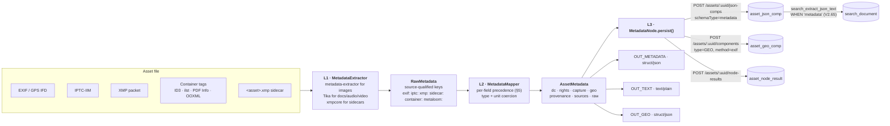

# Asset Metadata Node (`metadata`) — Dublin Core / EXIF / XMP / IPTC Ingest

> **Status**: 🟢 **Built and shipping.** Phase 1 is complete; §11 lists what is not.
> **Scope**: the `metadata` node — reading the metadata already **inside** an asset file, normalising
> it onto Dublin Core, and persisting it. Everything from the file's bytes to
> `asset_json_comp` / `asset_geo_comp` / `search_document`.
> **Audience**: AI coding agents and humans working on
> [cortex/nodes/metadata/](../../../../cortex/nodes/metadata/).

**Out of scope, and where it lives instead:**

| Not here | There |
|---|---|
| The node system, lifecycle, registration, caching layers | [../NODES.md](../NODES.md) |
| Port content types and cardinality across all nodes | [../NODE_DATA_TYPES.md](../NODE_DATA_TYPES.md) §4.3 |
| Rules for adding a node at all | [../../../guidelines/NEW_NODE.md](../../../guidelines/NEW_NODE.md) |
| Document **body text** extraction | [../SERVICE_TIKA.md](../SERVICE_TIKA.md) — the `tika` node |
| **Measured** media properties (real fps, frame count, bitrate) | the `quality` node, [../NODES.md](../NODES.md) §3.1 |
| Component tables and their identity contract | [../../../loom/DOMAIN.md](../../../loom/DOMAIN.md) |
| The search index this feeds | [../../search/SEARCH.md](../../search/SEARCH.md) |
| **Writing** metadata back into files | [../../../concept/ASSET_METADATA_WRITE.md](../../../concept/ASSET_METADATA_WRITE.md) — 🔵 concept. §5 below is the half of its contract that lives here |

---

## 0. Executive Summary

| Question | Short answer |
|---|---|
| **What does it read?** | EXIF (incl. the GPS IFD), IPTC-IIM, XMP (embedded and `.xmp` sidecar), PDF Info, OOXML/ODF properties, ID3, MP4 `ilst` |
| **What does it produce?** | One canonical Dublin-Core-shaped envelope per asset (§6), plus one position row per reading |
| **Where does it persist?** | `asset_json_comp` (`schemaType=metadata`) + `asset_geo_comp` + the `asset_node_result` ledger (§7) |
| **Does it need a model or GPU?** | **No.** Pure CPU, no sidecar, no external service |
| **Does it extract document text?** | **No.** That is `tika`. The two are complements and coexist on one asset |
| **Why not just extend `tika`?** | Independently schedulable, its own ports and options, and — decisively — Tika's image path destroys the source distinction the precedence rules need (§4.1) |
| **Where does the design actually live?** | `MetadataMapper` and `MetadataMapperTest`. The precedence table (§5) is a decision, and the test states it one case per rule |
| **What is the riskiest thing about it?** | It ingests PII by design — an EXIF GPS tag is frequently a home address (§10) |

---

## 1. What It Does, and What It Deliberately Does Not

**Does:**

- Reads authored metadata out of images, documents, audio and video.
- Normalises it onto **one** vocabulary — the fifteen Dublin Core elements — with types and units
  coerced (§6).
- Records **which raw field won each canonical value** (`provenance`), so a mapping bug is fixable by
  re-normalising rather than by re-reading every file in the library.
- Writes coordinates into `asset_geo_comp`, keyed by the **source** they came from.
- Emits the authored prose on a `text/plain` port so `translate`, `sentiment` and `llm` can consume
  an ingested caption without knowing what EXIF is.

**Does not:**

| Not done | Why, and by whom instead |
|---|---|
| **Body text extraction** | `tika` and its `content` port. This node reads the `Metadata`, not the document |
| **Container/stream probing** | `quality` measures fps, frame count and real bitrate from the decoder. This node reports only what a file *claims*, and containers lie: rotation flags, truncated durations, VBR files quoting a nominal figure. The two write two rows and never overwrite each other |
| **Reverse geocoding** | A coordinate is not a place name. `geo_alias` is filled **only** when the file itself named the location (IPTC `City`/`Country`). Turning a coordinate into a name needs a gazetteer and belongs to a future `geocode` node consuming `OUT_GEO` |
| **Language detection** | `dc.language` is reported when the file states it and is otherwise null. Never a guess |
| **Licence inference from free text** | Only a recognised licence **URL** yields a `licenseId` (§5.3) |
| **Metadata write-back** | [../../../concept/ASSET_METADATA_WRITE.md](../../../concept/ASSET_METADATA_WRITE.md) |

---

## 2. Architecture — Three Layers



**Why three layers and not two.** `raw` alone is unqueryable — thousands of vendor keys, no types.
Canonical alone is lossy and irreversible: when a mapping turns out wrong you want the source values
still there. Keeping both, with `provenance` naming which raw key won each canonical field, is what
makes a mapping bug a re-normalisation instead of a re-parse of the whole library.

---

## 3. The Standards Landscape

You cannot ingest "metadata" — you ingest half a dozen incompatible standards that overlap and
contradict each other. This is the map.

| Standard | Where it lives | What it is good for | Read by |
|---|---|---|---|
| **Dublin Core (DCMES)** | XMP `dc:`, ODF, EPUB, `<meta>` tags, plain `DcXMLParser` files | **The lingua franca.** 15 elements: `title` `creator` `subject` `description` `publisher` `contributor` `date` `type` `format` `identifier` `source` `language` `relation` `coverage` `rights` | both readers |
| **DCMI Terms** | `dcterms:` namespace | The refinement layer (~55 properties incl. `created`, `license`, `rightsHolder`) | XMP path |
| **EXIF** | JPEG APP1, TIFF IFD, HEIC, RAW | Camera truth: make/model/lens, exposure, ISO, orientation, `DateTimeOriginal`, GPS IFD | metadata-extractor |
| **IPTC-IIM** | JPEG APP13 (Photoshop IRB) | Newsroom fields: headline, caption, byline, credit, source, copyright notice, city/country, keywords | metadata-extractor |
| **XMP** | RDF/XML packet in almost any format, or a `.xmp` sidecar | The modern superset. Embeds `dc:`, `photoshop:`, `Iptc4xmpCore:`, `xmpRights:`, `xmpDM:`, `cc:` | metadata-extractor (embedded) · xmpcore (sidecar) |
| **ID3 / Vorbis / MP4 ilst** | Audio containers | Artist, album, track, year, genre, BPM | Tika (normalised into `xmpDM:`) |
| **PDF Info + XMP** | PDF | Author/Title/Subject/Keywords/Producer/Creator tool, page count | Tika |
| **OOXML / ODF properties** | Office documents | Core (title/creator/revision) + extended (application, company, word count) | Tika |
| **Creative Commons REL** | XMP `cc:` | `cc:license`, `cc:attributionName` | metadata-extractor / xmpcore |

**How many Dublin Core elements are there?** **15** in the legacy `dc:` element set; ~**55**
properties in `dcterms:` once refinements are included. 15 is the number the envelope is designed
against; the rest land in `raw`.

---

## 4. Layer 1 — Extraction (`MetadataExtractor`)

### 4.1 Two readers, and why that is not an accident

| File is… | Read by | Rationale |
|---|---|---|
| an image | **`com.drewnoakes:metadata-extractor`**, directly | Directory identity survives: `ExifIFD0Directory`, `ExifSubIFDDirectory`, `GpsDirectory`, `IptcDirectory`, `XmpDirectory` stay distinguishable |
| anything else | **Apache Tika** `AutoDetectParser` | Tika normalises PDF Info, OOXML/ODF, ID3 and MP4 `ilst` into one vocabulary. Reimplementing that would be pointless |
| a `.xmp` sidecar | **`com.adobe.internal.xmp` (xmpcore)** | Neither image reader parses a standalone XMP document |

🔴 **Do not "simplify" this into one Tika parser list.** Tika's own
`org.apache.tika.parser.image.ImageMetadataExtractor` runs its directory handlers in sequence and each
one **overwrites** the shared `Metadata`: `IptcHandler` sets `TikaCoreProperties.TITLE` after
`ExifHandler` already did. By the time you read `dc:title` you cannot tell which standard supplied it
— which makes every rule in §5 unstateable. This is the single most important design constraint in
the node.

Neither library is a new dependency: both arrive transitively through
`tika-parsers-standard-package` and are now version-pinned in `bom/pom.xml`
(`metadata.extractor.version` 2.19.0, `xmpcore.version` 6.1.11) so a Tika bump cannot move them
silently.

### 4.2 `RawMetadata` — the seam

Layer 1's output is `Map<qualifiedKey, List<value>>` where every key is `<source>:<key>`:

```
exif:DateTimeOriginal   exif:GPSLatitude     exif:Make
iptc:ObjectName         iptc:Caption-Abstract
xmp:dc:title            xmp:cc:license       xmp:xmpRights:Marked
sidecar:dc:title
container:Title         container:Author     container:ContentType
metaloom:dc:title
tag:Exif SubIFD/Lens Serial Number      ← the unmapped diagnostic dump
```

- **Values are ordered and repeatable** — `xmp:dc:subject` is a bag, so a single-value map would keep
  only the last keyword.
- **Blank is dropped, never stored.** An empty EXIF field must not outrank a populated XMP one.
- **`put` vs `putQuiet`**: `put` also records that the source *contributed* (that set becomes
  `envelope.sources`). `putQuiet` is for bookkeeping that says nothing about the content — the
  detected MIME type, Tika's `X-TIKA:*` keys, the `tag:` dump.
- **`tag:` can never collide** with a canonical key: the dump always contains a `/`, and the mapper
  never reads that namespace.

This is deliberately the boundary the tests are written against: `MetadataMapperTest` builds
`RawMetadata` by hand and needs **no fixtures at all**.

---

## 5. Layer 2 — The Precedence Table (`MetadataMapper`)

A JPEG out of a modern editor routinely carries its caption three times, in three standards, with two
different values. Which one wins is a **design decision, written down**, not "whichever parser ran
last". The rules follow the Metadata Working Group guidelines.

| Canonical field | Precedence — first non-empty wins |
|---|---|
| `dc.title` | XMP `dc:title` → IPTC `ObjectName` → IPTC `Title` → EXIF `ImageDescription` → container `Title` |
| `dc.description` | XMP `dc:description` → IPTC `Caption-Abstract` → EXIF `UserComment` → container `Subject` |
| `dc.creator` | XMP `dc:creator` → IPTC `By-line` → EXIF `Artist` → container `Author` |
| `dc.subject` | XMP `dc:subject` (bag) → IPTC `Keywords` → container `Keywords` (split on `;`/`,`) |
| `dc.date` | **EXIF `DateTimeOriginal`** → XMP `photoshop:DateCreated` → XMP `xmp:CreateDate` → container `CreateDate` → *(opt-in)* file mtime |
| `dc.rights` / `rights.statement` | XMP `dc:rights` → IPTC `CopyrightNotice` → EXIF `Copyright` → container `Rights` |
| `rights.licenseUrl` | XMP `cc:license` → XMP `xmpRights:WebStatement` → a URL found inside the rights statement |
| `rights.marked` | XMP `xmpRights:Marked` → a non-empty rights statement ⇒ `true` |
| `geo.*` | EXIF GPS IFD → XMP `exif:GPS*` → sidecar. **Never** IPTC `City`, which is a *name* |
| `capture.*` | EXIF → XMP `exif:`/`tiff:` mirror |
| `dc.language` | XMP `dc:language` → container language → `null` (**never** a guess) |

Three rules that are not obvious from the table:

1. **EXIF beats XMP for dates and camera data; XMP beats EXIF for authored text.** The asymmetry is
   the point. The camera wrote the EXIF date once; every editor that touched the file has rewritten
   its own XMP copy — while EXIF's text fields are ASCII-limited and mangle every non-Latin script.
2. **A `sidecar:` value ranks immediately below the equivalent embedded `xmp:` one.** Same standard,
   different place; in a Lightroom-style workflow the sidecar is frequently where the edits live.
   `MetadataMapper.expand()` does this automatically for every `xmp:` key.
3. **`metaloom:` ranks last, always.** A field carrying MetaLoom's own write-back marker is ingested
   at the **lowest** rank. Without that rule the write → re-ingest → re-write loop promotes a machine
   guess to authored ground truth and the catalogue degrades a little on every pass. This is the half
   of [ASSET_METADATA_WRITE.md](../../../concept/ASSET_METADATA_WRITE.md)'s contract that this node
   owns. `expand()` appends the `metaloom:` counterpart of every key after the whole authored list.

Whichever key wins is recorded in `provenance` (`"dc.title": "xmp:dc:title"`).

### 5.1 Coercion

Units are normalised, not passed through — anything a downstream filter would re-parse defeats the
point:

| Field | In the file | In the envelope |
|---|---|---|
| `capture.exposureTime` | `1/250` (a `Rational`) | `0.004` (seconds, number) |
| `capture.fNumber` | `f/8.0` or `80/10` | `8.0` |
| `capture.focalLength` | `35 mm` | `35.0` |
| `capture.flash` | a bit field, or a description string | `true` / `false` / `null` — bit 0, or the description; anything unrecognised is null, never a guess |
| `geo.lat` / `geo.lon` | three rationals + an N/S/E/W reference tag | signed decimal degrees |
| `dc.date` | `2019:04:03 05:12:44` | `2019-04-03T05:12:44` (+ offset **only** if the file stated one) |

🔴 **Timezones.** EXIF `DateTimeOriginal` carries no zone. When `OffsetTimeOriginal` (EXIF 2.31+) is
present the offset is appended; otherwise the value stays a **local** time with no offset. Assuming
UTC would shift an evening photo into the next day and quietly corrupt every date-range query.

### 5.2 GPS handling

One reading per still. The model is a **list** because `asset_geo_comp` is keyed
`(asset, node_kind, method, time_from)` precisely so a moving camera can contribute one row per
sample; `gpsTrackMaxSamples` decimates evenly (keeping first and last) rather than truncating — a
two-hour flight truncated to its first N samples is a map pin on the runway. See §11 for the
extractor gap.

### 5.3 Rights and licence

`rights.licenseId` is set **only** when `licenseUrl` matched a well-known licence URL exactly
(`LicenseResolver`: the six CC variants × five versions, CC0, the Public Domain Mark). A wrong
`CC-BY` on an all-rights-reserved photo is materially worse than a null — the null sends someone to
read the rights statement, the wrong value does not.

Queryable through the `asset_json_comp` GIN index:

```sql
SELECT asset_uuid FROM asset_json_comp
WHERE schema_type = 'metadata' AND data @> '{"rights":{"licenseId":"CC-BY-4.0"}}';
```

That answers "find everything I may republish". It is **not** enough for a rights-clearance workflow
(expiry dates, model releases, territory restrictions) — that needs a typed `asset_rights_comp`, §11.

🟡 `asset_location.license` (from `V2.10`, commented `/* unclear */`) is **not** this. A licence
belongs to the content, not to where a copy happens to sit. Deciding or dropping that column is §11.

---

## 6. The Canonical Envelope

The payload of the `metadata` JSON component, and the `OUT_METADATA` port value.

```json
{
  "v": 1,
  "dc": {
    "title": "Sunrise over Fuji",
    "creator": ["Jane Doe"],
    "subject": ["sunrise", "mountain", "japan"],
    "description": "Taken from the fifth station.",
    "contributor": [], "relation": [],
    "date": "2019-04-03T05:12:44+09:00",
    "type": "StillImage", "format": "image/jpeg",
    "language": "en",
    "coverage": "Fujinomiya, Shizuoka, JP",
    "rights": "© 2019 Jane Doe"
  },
  "rights": {
    "statement": "© 2019 Jane Doe", "holder": "Jane Doe",
    "licenseUrl": "https://creativecommons.org/licenses/by/4.0/",
    "licenseId": "CC-BY-4.0",
    "credit": "Jane Doe / MetaLoom", "marked": true
  },
  "capture": {
    "make": "SONY", "model": "ILCE-7M3", "lens": "FE 24-70mm F2.8 GM",
    "software": "Lightroom 12.3", "dateTimeOriginal": "2019-04-03T05:12:44+09:00",
    "exposureTime": 0.004, "fNumber": 8.0, "iso": 100,
    "focalLength": 35.0, "flash": false, "orientation": 1, "colorSpace": "sRGB"
  },
  "geo": {
    "lat": 35.360833, "lon": 138.727500, "method": "exif",
    "altitudeM": 2305.0, "directionDeg": 271.5,
    "place": { "city": "Fujinomiya", "state": "Shizuoka", "country": "JP" }
  },
  "provenance": {
    "dc.title": "xmp:dc:title",
    "dc.date":  "exif:DateTimeOriginal",
    "geo.lat":  "exif:GPSLatitude"
  },
  "sources": ["exif", "xmp", "iptc"],
  "raw": { "exif:Make": "SONY", "…": "…" }
}
```

**The contract** — a consumer may rely on all of this:

- **`v` is mandatory** and bumps when the *meaning* of a field changes, never for an added one. A
  reader must tolerate unknown keys and missing blocks.
- **Absent ≠ empty.** A field the file did not carry is omitted; never `""`, never `0`. "This photo
  has no position" and "this photo was taken at the equator" are distinguishable.
- **`dc.creator`, `dc.subject`, `dc.contributor`, `dc.relation` are always arrays**, possibly empty.
  Everything else in `dc` is scalar. This is the single most common source of downstream
  `ClassCastException`s, so it is guaranteed rather than incidental.
- **`geo` carries the representative reading**, plus `method` (the source it came from) and, for a
  track, `sampleCount`. The remaining samples are rows in `asset_geo_comp`, not envelope bloat.
- **`raw` is opt-in and capped.** Maker notes alone can run to tens of thousands of keys; the dump
  ends with a `"..."` marker naming what was dropped, because silent truncation reads as "this is
  everything the file carried".

`OUT_TEXT` is derived from the same serialised envelope (`AssetMetadata.textFrom`): title,
description, keywords, creator, place — newline-joined, nothing numeric. Deriving the ports from the
object on a fresh run and from the encoded copy on a cache hit is how the two quietly drift apart, so
both go through one method.

---

## 7. Persistence

Follows the template in [NEW_NODE.md §1.2](../../../guidelines/NEW_NODE.md): typed component where a
query needs it, JSON component otherwise, ledger row always. All of it is guarded by
`asset != null && client() != null`, so offline is a clean no-op.

### 7.1 `asset_json_comp` — the envelope

```
nodeKind        = "metadata"
schemaType      = "metadata"        // NEVER change once shipped — see §14
variant         = ""                // one envelope per asset per node kind
producerVersion = "metadata/1"
data            = the §6 envelope
```

Unique key `(asset_uuid, node_kind, schema_type, variant)` makes a re-run an in-place replace.

### 7.2 `asset_geo_comp` — coordinates

| Column | Value |
|---|---|
| `node_kind` | `metadata` |
| `node_id` | the graph-local node id, so two configured instances do not collide |
| `method` | `exif` · `xmp` · `sidecar` — **the source, exactly as the column comment prescribes** |
| `time_from` | `0` for stills; the sample offset in ms for a track |
| `geo_lon` / `geo_lat` | signed decimal degrees, `decimal(9,6)`/`decimal(8,6)` — ~11 cm |
| `geo_alias` | the IPTC place name, or null. **Never** derived from the coordinate |
| `accuracy_m` | EXIF `GPSHPositioningError` when present |
| `confidence` | `null` — a coordinate read from a file is a recorded value, not a probabilistic estimate. Scoring it `1.0` would be a lie of a different kind |
| `meta` | `{"altitudeM":…, "directionDeg":…, "gpsTimestamp":…}` |

### 7.3 The endpoint this needed (landed with the node)

`metadata` is the **only node that writes a typed component through the generic
`POST /assets/:uuid/components` endpoint**, and making that possible was half the work:

| Was | Now |
|---|---|
| `AssetComponentEndpointService.create()` called `storeGeoComp` — a plain INSERT. A second pipeline run violated `asset_geo_comp_unique_key` | Every branch routes through `compDao.upsert*Comp(...)`. The route description says "upsert" |
| `AssetComponentCreateRequest` could not express any discriminator | Carries `method`, `timeFrom`, `streamIndex`, `pageNumber`, plus shared `nodeId` / `producerVersion` / `confidence` / `meta` |
| The `*Info` models were strict subsets of their tables | `accuracyM` (Geo); `orientation`/`bitDepth`/`encoding` (Image); `fps`/`frameCount`/`rotation` (Video); `lang`/`trackTitle`/`isDefault` (Audio); `pageCount`/`textLang` (Document); `variant` (Json) |
| `AssetComponentResponse` returned none of it | Returns the discriminators and provenance, so they round-trip |

No client signature change was needed: `createAssetComponent(uuid, AssetComponentCreateRequest)`
already took the model.

### 7.4 Ledger

`recordNodeResult(asset, ctx, SUCCESS, null, "metadata/1", resultRef("asset_json_comp", compUuid))`
on success; a FAILED row with the message otherwise. Best-effort — a ledger failure never fails the
node. `result_ref` points at the envelope; the geo rows are discoverable from
`asset_geo_comp WHERE node_kind = 'metadata'`.

### 7.5 Search

`V2.65__search_metadata_json_comp.sql` adds `WHEN 'metadata'` to `search_extract_json_text`,
concatenating title, description, publisher, coverage, rights, the `creator`/`contributor`/`subject`
**arrays** (via `jsonb_path_query`, which a naive `->>` would silently drop), the rights holder and
credit, and the IPTC place.

Camera settings, coordinates and the `raw` block are deliberately **excluded**: they are numbers and
vendor tokens that would dilute the tsvector without anyone ever typing them into a search box.

---

## 8. Ports, Descriptor and Cache Key

### 8.1 Ports

| Port | Dir | Id | Content type | Card. | Java type | Purpose |
|---|---|---|---|---|---|---|
| `IN_MEDIA` | in | `media` | `media/*` | ONE | `LoomMedia` | The asset |
| `OUT_METADATA` | out | `metadata` | `struct/json` | ONE | `String` | The §6 envelope, serialised |
| `OUT_TEXT` | out | `text` | `text/plain` | ONE | `String` | Title + description + keywords + creator + place. Feeds `translate`, `sentiment`, `llm`, `filter` |
| `OUT_GEO` | out | `geo` | `struct/json` | ONE | `String` | `{lat, lon, altitudeM, accuracyM}`. **Written only when a coordinate was found** |

⚠️ `OUT_GEO` is declared `one`, not optional: `OutputPort` has `one` and `many` and nothing else.
Optionality is expressed by **not writing the port**, exactly as `watermark` branches between `image`
and `video`. The descriptor matches, so `NodePortConformanceTest` passes.

There is deliberately **no `OUT_FLAGS`**. `tika`'s flags port carries `"DONE"`/`"FAILED"` and
duplicates the node result; [SERVICE_TIKA.md §7](../SERVICE_TIKA.md) already logs the mismatch
between it and its descriptor. Do not copy it.

### 8.2 Descriptor

`MetadataDescriptorProvider`: `kind=metadata`, name "Asset Metadata", category `ANALYSIS`, icon
`info`, `defaultConcurrency = 4`, `defaultMode = PARALLEL`. Registered in
`META-INF/services/io.metaloom.loom.nodes.spec.NodeDescriptorProvider`.

### 8.3 Cache key

```java
media.absolutePath() + ":" + options().digest()
```

The options digest is **required**, not decorative: `gpsPolicy`, `includeRaw` and the rest change the
output, and two differently configured instances legitimately coexist in one graph — a public branch
rounding coordinates and an archive branch keeping them. A path-only key would serve the first one's
envelope to the second. `MetadataNodeOptions.digest()` covers every option that changes the result;
`MetadataNodeOptionsValidationTest` pins that.

A cache hit re-emits from the cached envelope and skips re-persisting — the durable copy is already
in Loom — and returns `ResultOrigin.LOCAL`, which is SUCCESS, not SKIPPED.

---

## 9. Configuration

### 9.1 Options (`MetadataNodeOptions`, `KEY = "metadata"`)

⚠️ These are read from the **pipeline node definition**, not the worker YAML. `MetadataNode`
implements `PipelineConfigurable` and is therefore **not** `@Singleton` and overrides `nodeId()`.
See [NODES.md §6.5](../NODES.md).

| Key | Type | Default | Effect |
|---|---|---|---|
| `enabled` | boolean | `true` | inherited; `false` ⇒ `ctx.skipped("Disabled")` |
| `processIncomplete` / `retryFailed` | boolean | `false` | inherited, read by the pipeline |
| `timeoutMs` | long | `0` | inherited (`getDefaultTimeoutMs` applies when omitted) |
| `includeRaw` | boolean | `false` | write the `raw` block |
| `rawMaxKeys` | int | `500` | cap on `raw` entries |
| `rawMaxValueBytes` | int | `4096` | per-value cap; longer values truncated with `…` |
| `readXmpSidecar` | boolean | `true` | parse `<asset>.xmp` / `<asset>.<ext>.xmp` when present |
| `writeGeoComponent` | boolean | `true` | persist `asset_geo_comp` rows |
| `gpsTrackMaxSamples` | int | `1000` | decimation cap for GPS tracks |
| `gpsPolicy` | enum | `KEEP` | `KEEP` · `ROUND` (to `gpsRoundDecimals`) · `DROP` (§10) |
| `gpsRoundDecimals` | int | `2` | 0–6. Two places ≈ 1.1 km at the equator |
| `emitText` | boolean | `true` | emit `OUT_TEXT` |
| `licenseDetection` | boolean | `true` | URL → `licenseId` mapping (§5.3) |
| `dateFallback` | enum | `NONE` | `NONE` · `FILESYSTEM` (file mtime as `dc.date` of last resort) |
| `excludeKeys` | list | `[]` | fully qualified raw keys to drop **before anything reads them**, including before `raw` |

`configure(JsonObject)` validates and throws `IllegalStateException` on an invalid definition —
that surfaces as a task failure naming the node, which beats a node that silently ingests nothing
for every item in the run.

### 9.2 Environment variables

**This node reads none.** Cortex node configuration is YAML + pipeline definition, never env —
consistent with every other node ([../../../cortex/CONFIGURATION.md](../../../cortex/CONFIGURATION.md)).
The worker-level variables that affect whether and where it runs are the standard set:

| Variable | Default | Effect on this node |
|---|---|---|
| `LOOM_HOST` / `LOOM_PORT` / `LOOM_TOKEN` | — | Without a reachable Loom the node computes and emits its ports but persists nothing (offline mode is a clean no-op) |
| `CORTEX_NODE_WHITELIST` | unset | Include `metadata` to pin the kind to particular workers |
| `CORTEX_NODE_BLACKLIST` | unset | Takes precedence over the whitelist |

---

## 10. Privacy — This Node Ingests PII by Design

An EXIF GPS tag is frequently a home address. A `dc:creator` is a named person. Maker notes have
carried serial numbers and, in some camera generations, owner names. Treat this as a feature with a
safety catch, not as a neutral data flow.

- **`gpsPolicy` is a first-class option**, not a footnote: `KEEP` (default — a DAM's job is to keep
  what the file says), `ROUND` to `gpsRoundDecimals`, `DROP`.
- **The policy belongs on the pipeline**, so a "public library" pipeline can round while the internal
  archive keeps full precision. This is the main reason the node is `PipelineConfigurable`.
- **`includeRaw` defaults to `false`.** Maker notes are the least predictable surface in the whole
  format zoo; opting in should be a decision.
- 🔴 **Ingest is not publication, and `ROUND` is not a compliance control.** Rounding on ingest
  destroys data irreversibly, in the database, for everyone — including the people entitled to the
  precise value. The durable answer is full precision stored plus redaction on **export**, which is
  write-back ([ASSET_METADATA_WRITE.md](../../../concept/ASSET_METADATA_WRITE.md)). The customer docs
  say so explicitly; keep it that way.
- **Deletion already works**: every component table is `ON DELETE CASCADE` from `asset`.

---

## 11. Progress Assessment

### Built (phase 1)

- [x] `cortex/nodes/metadata/core` module, registered at all five touch-points
- [x] `MetadataExtractor` — metadata-extractor for images, Tika for the rest, xmpcore for sidecars, a discarding content handler, `StandardWriteFilter` caps
- [x] `MetadataMapper` + the §5 precedence table + `MetadataMapperTest` (34 cases, one per rule, no fixtures)
- [x] `AssetMetadata` envelope, `v: 1`, with `DcBlock` / `RightsBlock` / `CaptureBlock` / `GeoBlock`
- [x] `LicenseResolver` for the well-known CC/PD URLs
- [x] `MetadataNodeOptions`; `MetadataNode implements PipelineConfigurable`, **not** `@Singleton`, with an overridden `nodeId()`
- [x] Ports `media` → `metadata` / `text` / `geo`; options-aware `LocalResultCache`
- [x] `asset_json_comp` (`schemaType=metadata`, `producerVersion=metadata/1`) + ledger row
- [x] `asset_geo_comp` rows with `method` = the source, and the decimation cap
- [x] Component endpoint upserts; discriminators and provenance on the request and the response (§7.3)
- [x] `V2.65__search_metadata_json_comp.sql` — ingested titles, descriptions, keywords and creators are searchable
- [x] Descriptor + guard counts (28 providers / 38 kinds)
- [x] The full test set in §13 — 88 tests, all green
- [x] Website page `website/content/english/docs/nodes/metadata/index.adoc` + the three `_index.adoc` edits
- [x] `DemoDatabaseInitializer` — `metadata` is in the medium ingest pipeline

### Phase 2 — typed components, breadth, UI

- [ ] **`writeTypedComponents`**: image/video/audio/doc rows per the table below, never overwriting a
      measured value. Blocked on nothing now that the `*Info` models carry the fields (§7.3)

      | Table | Fields this node may fill | Fields it must **not** touch |
      |---|---|---|
      | `asset_image_comp` | `media_width/height`, `orientation`, `bit_depth`, `image_encoding` | `blurriness`, `image_dominant_color` |
      | `asset_video_comp` | `media_width/height`, `media_duration`, `video_encoding`, `video_bitrate`, `rotation` | `fps`, `frame_count`, `blurriness` |
      | `asset_audio_comp` | `lang`, `track_title`, `is_default`, `audio_*`, `media_duration` | — |
      | `asset_doc_comp` | `page_count`, `text_lang` (page 0) | `doc_plain_text`, `doc_word_count` |

- [ ] 🔴 **Read-side coalescing across producers.** `asset_video_comp`'s column comment already
      anticipates "two producers … the read side coalesces them by producer precedence" — **that read
      side does not exist.** Until it does, the UI must show the producer next to any coalesced value
      or it will look like a bug (§14)
- [ ] **A GPS track extractor.** The write path is complete and unit-tested against a synthetic
      track, but nothing produces more than one sample: neither Tika nor metadata-extractor exposes
      GPMF or `gpsd` boxes. This is the only place the node advertises a shape it cannot yet fill
- [ ] **Format coverage**: Matroska/WebM tags, AVCHD sidecars, some RAW dialects
- [ ] **UI**: an asset metadata panel + a map pin for `asset_geo_comp` —
      [../../../loom/ui/TASK_UI_ASSETS_MEDIA.md](../../../loom/ui/TASK_UI_ASSETS_MEDIA.md)
- [ ] **Settle `asset_location.license`** (§5.3): drop it, or document it as the licence of a
      *delivery copy*
- [ ] A `geocode` node consuming `OUT_GEO` and filling `geo_alias`

### Phase 3 — rights and write-back

- [ ] `asset_rights_comp` for a real clearance workflow — expiry, model releases, territories (§5.3)
- [ ] A redaction-on-export node (strip GPS and maker notes from a derivative) — the genuinely useful
      near-term half of [ASSET_METADATA_WRITE.md](../../../concept/ASSET_METADATA_WRITE.md)
- [ ] General metadata write-back, if still wanted after redaction ships

### Follow-on this node unblocks (owned by [SERVICE_TIKA.md](../SERVICE_TIKA.md))

- [ ] Delete the `System.out.println` metadata dump from `MediaTikaParser` — this node makes it
      redundant
- [ ] Decide `JpegParser` in `MediaTikaParser`: moot for metadata now, so the only question left is
      whether `tika` should report JPEG dimensions

---

## 12. Key Classes Reference

| Class | Package / module | Role |
|---|---|---|
| `MetadataNode` | `io.metaloom.cortex.node.metadata` · `cortex/nodes/metadata/core` | The node: lifecycle, ports, cache, persistence |
| `MetadataExtractor` | same | L1 — file → `RawMetadata`. Owns the two-reader split (§4.1) |
| `RawMetadata` | same | L1 output: source-qualified keys. **The seam the tests are written against** |
| `MetadataMapper` | same | L2 — `RawMetadata` → `AssetMetadata`. **Owns the §5 precedence table** |
| `AssetMetadata` | same | The envelope; `toJson()`, `textFrom()`, `geoPortFrom()` |
| `DcBlock` · `RightsBlock` · `CaptureBlock` · `GeoBlock` | same | The envelope's blocks |
| `Envelopes` | same | Serialisation helpers that enforce "absent ≠ empty" |
| `LicenseResolver` | same | `licenseUrl` → SPDX-style `licenseId`; never guesses |
| `MetadataNodeOptions` · `GpsPolicy` · `DateFallback` | same | Options, enums, `digest()` for the cache key |
| `MetadataNodeModule` | same | Dagger bindings — `@IntoSet` + `@IntoMap @StringKey("metadata")`, **no `@Singleton`** |
| `ExifJpegFixture` · `XmpFixture` | `…metadata.fixture` (test-jar) | Byte-level EXIF/GPS/XMP writers (§13) |
| `MetadataDescriptorProvider` | `io.metaloom.loom.nodes.spec` · `loom-shared/node-model` | Descriptor + ServiceLoader entry |
| `AbstractMediaNode` | `io.metaloom.cortex.common.node` | `process()`, `client()`, `recordNodeResult()`, `resultRef()`, `nodeId()` |
| `PipelineConfigurable` | same | Per-instance config contract |
| `LocalResultCache` | `io.metaloom.cortex.common.cache` | The skip cache |
| `AssetComponentEndpointService` | `io.metaloom.loom.rest.service.impl` | `POST /assets/:uuid/components` — now an upsert (§7.3) |
| `AssetComponentDao` / `…DaoImpl` | `io.metaloom.loom.db.model.asset` / `…db.jooq.dao.asset.comp` | `upsertGeoComp` and friends |
| `AssetComponentCreateRequest` / `Response`, `GeoLocationInfo`, `ImageInfo`, `VideoInfo`, `AudioInfo`, `DocumentInfo`, `JsonComponentInfo` | `io.metaloom.loom.rest.model.asset[.info]` | The extended request/response models |

---

## 13. Test Setup

Run `./setup-pool.sh` before anything that touches the database, and again after any Flyway change.

```bash
mvn -pl cortex/nodes/metadata/core -am install -DskipTests -o   # deps, once
mvn -pl cortex/nodes/metadata/core test -o                      # 74 tests
mvn -pl cortex/cli -am compile -o                               # the Dagger graph still resolves
mvn -pl integration-test test -Dtest=MetadataNodeIntegrationTest,NodePortConformanceTest -o
```

| Test | Module | Kind | Asserts |
|---|---|---|---|
| `MetadataMapperTest` (34) | `cortex/nodes/metadata/core` | Pure unit, **no fixtures** | The §5 precedence table, one case per rule; coercion; the envelope contract; the `metaloom:` lowest-rank rule. **The highest-value test in the set — it is where the design lives** |
| `MetadataNodeTest` (16) | same | Unit, real bytes | Reads real EXIF/GPS/XMP; southern-hemisphere signs; XMP beats the EXIF caption; sidecar; a metadata-free file is SUCCESS with an empty envelope; an unparsable file is FAILED via `.abort()`; a cache hit re-emits; the options digest keeps two configurations apart |
| `MetadataNodePersistenceTest` (10) | same | Mocked `LoomHttpClient` | Exactly one `asset_json_comp` POST with `schemaType=metadata`; one geo POST with `method=exif` when the fixture has GPS and **none** when it does not; `confidence == null`; one ledger row with the right `nodeKind`/`state`/`producerVersion`; a FAILED row when persistence throws; a second run persists nothing again; `nodeId` discriminates two instances |
| `MetadataNodeOptionsValidationTest` (8) | same | Plain JUnit | Defaults valid; each invalid field reported; **`digest()` changes for every option that changes the output** |
| `MetadataNodePipelineTest` (6) | same | `AbstractNodeChainTest` | Completion/tracking events, `OUT_TEXT` chaining into a `CapturingNode`, disabled + dry-run skip |
| `MetadataNodeIntegrationTest` (3) | `integration-test` | E2E, real Loom + pooled DB | Reads the envelope back through REST and asserts it is **non-empty and correct** (title, date, make, lat); the geo component with `method=exif`; a re-run replaces its rows; a metadata-free file still records an envelope |
| `NodePortConformanceTest` | `integration-test` | Reflection | `map("io.metaloom.cortex.node.metadata.MetadataNode", "metadata")` |
| `NodeDescriptorServiceLoaderTest` | `loom-shared/node-model` | Reflection | 28 providers / 38 kinds; `metadata` in the kind list |
| `AssetComponentEndpointTest` (+6) | `loom/core` | Endpoint + permission | Discriminators and provenance round-trip; a repeated POST **upserts**; a different `method` is a different row; typed media fields round-trip; `READ_ASSET`/`UPDATE_ASSET` enforced (403), granted via **group + role** |
| `AssetComponentKeyTest` (+2) | `loom/db/jooq` | DAO | `upsertGeoComp` replaces in place on `(asset, node_kind, method, time_from)`; two sources coexist. Cascade is covered by `AssetCascadeTest` |
| `SearchDocumentSourceTest` (+2) | `loom/db/jooq` | Real Postgres FTS | An ingested title, description, **keyword array** and creator are findable; camera settings are **not** indexed |

### Fixtures are generated, not committed

🔴 `loom-test-env`'s corpus lives at `/opt/metaloom/loom-testdata` — **an unversioned directory
outside the repo**, whose images are Pexels downloads with EXIF stripped. A fixture "added" there is
one nobody else has.

So `ExifJpegFixture` writes a real JPEG byte by byte: SOI · EXIF APP1 (IFD0 + Exif SubIFD + GPS IFD)
· XMP APP1 · EOI. No pixel data — every metadata reader stops at the start-of-scan marker. It is
published as a **test-jar** so `integration-test` reuses it instead of growing a second EXIF encoder.

```java
ExifJpegFixture.builder()
    .make("SONY").model("ILCE-7M3")
    .dateTimeOriginal("2019:04:03 05:12:44").offsetTimeOriginal("+09:00")
    .gps(35.360833, 138.727500).altitude(2305)
    .xmp(XmpFixture.titled("Sunrise over Fuji", "…", "Jane Doe"))
    .build();
```

A test needing "a photo shot in the southern hemisphere with no lens tag" writes exactly that.

---

## 14. Conventions and Gotchas

| Rule | Why |
|---|---|
| **Never change the `schemaType` string** | `search_extract_json_text` is a SQL `CASE` with **no default branch** — a renamed type is silently skipped, not an error. The same trap `tika` sits in |
| **`method` is the source, not the format** | `exif`, `xmp`, `sidecar`, `gps-track` — as the `asset_geo_comp.method` column comment prescribes. Writing `jpeg` there destroys the key's meaning: an EXIF reading and an XMP reading of one photo would collide |
| **Failure is always `.abort()`** | This node always did. `ctx.failure(msg).next()` used to report SUCCESS tree-wide; fixed 2026-08-18, and `FailurePathGuardTest` (`cortex/api`) now fails the build on the shape |
| **An empty envelope is SUCCESS** | SKIPPED means "this item did not need processing". A JPEG with no EXIF *was* processed; that it says nothing is the result |
| **A parse *error* is a failure** | A file that carries nothing → SUCCESS. A file that cannot be read → FAILED, loudly. Do not conflate them |
| **The kind string appears five times** | `MetadataNodeOptions.KEY`, the `@StringKey`, `name()`, the descriptor `kind`, the YAML key — all must read `metadata` |
| **Do not flatten the sources in layer 1** | §4.1. This is the constraint the whole design rests on |
| **Do not reuse `TikaNode`'s cache shape** | Keying on the path alone is its bug, and worse here because the options participate (§8.3) |
| **Adding or renaming a port requires editing the descriptor in the same change** | `NodePortConformanceTest` fails the build otherwise. That failure is the tripwire working |
| **Clean-rebuild `cortex/core` after a node constructor change** | Otherwise `setup-pool`/tests fail with `NoSuchMethodError` against a stale Dagger factory |
| **Rebuild the shaded jars after a `rest-model` change** | `loom-container-server` and `metaloom-cli` bundle a copy; `integration-test` compiles against theirs and will not see a new field until they are reinstalled |
| **Dublin Core is a vocabulary, not a schema** | `dc:type` is a DCMI Type term (`StillImage`, `MovingImage`, `Sound`, `Text`); `dc:format` is the MIME type. Getting these backwards is the classic DC mistake — the derivation lives in one method, `MetadataMapper.dcmiType` |
| **Declared ≠ measured** | Never overwrite a `quality` measurement with a container claim. That is why the two node kinds write two rows (§11) |
| **`grep` treats several files here as binary** | Use `rg` or `grep -a` |

---

## 15. Where do I find …?

| I need … | Path |
|---|---|
| The node | `cortex/nodes/metadata/core/src/main/java/io/metaloom/cortex/node/metadata/` |
| **The precedence rules** | `MetadataMapper.java` — and `src/test/.../MetadataMapperTest.java`, which states them |
| The two-reader split and its reasoning | `MetadataExtractor.java` (class javadoc) |
| The EXIF/XMP fixture writers | `src/test/.../metadata/fixture/ExifJpegFixture.java`, `XmpFixture.java` |
| The search extraction branch | `loom/db/flyway/src/main/resources/db/migration/V2.65__search_metadata_json_comp.sql` |
| The component endpoint / service | `loom/services/rest/.../endpoint/impl/AssetComponentEndpoint.java`, `.../service/impl/AssetComponentEndpointService.java` |
| The component DAO (incl. `upsert*Comp`) | `loom/db/jooq/.../dao/asset/comp/AssetComponentDaoImpl.java` |
| The component tables | `loom/db/flyway/.../V2.38__rework_asset_components.sql`, `V2.40__rework_asset_json_comp.sql` |
| Request/response models | `loom-shared/rest-model/.../rest/model/asset/` (+ `info/`) |
| The descriptor | `loom-shared/node-model/.../spec/MetadataDescriptorProvider.java` |
| Node registration list | `cortex/cli/.../dagger/NodeCollectionModule.java`, `cortex/nodes/pom.xml`, `cortex/processor/pom.xml` |
| Customer-facing docs | `website/content/english/docs/nodes/metadata/index.adoc` |
| Demo pipeline wiring | `loom/core/.../boot/DemoDatabaseInitializer.java` → `mediumDefinition()` |
| Tika version / library pins | `bom/pom.xml` → `tika.version`, `metadata.extractor.version`, `xmpcore.version` |
| Test DB pool setup | `./setup-pool.sh` (mandatory before DB tests **and** after any migration) |
| Dublin Core reference | <https://www.dublincore.org/specifications/dublin-core/dcmi-terms/> |

---

**GIT HEAD**: `9a41819442c3031f621d514d30b857f4297b4743` (master)
**Last updated**: 2026-08-18 — the Conventions row on `ctx.failure(msg).next()` is historical: the
defect is fixed tree-wide and `FailurePathGuardTest` (`cortex/api`) fails the build on the shape. This
node always aborted.

**Previously**: 2026-08-03 17:37 UTC — written when the node shipped, replacing the pre-build concept
`spec/concept/ASSET_METADATA_INGEST.md`. Every "today" claim above was read from this checkout; the
standards summary in §3 is external reference material.
