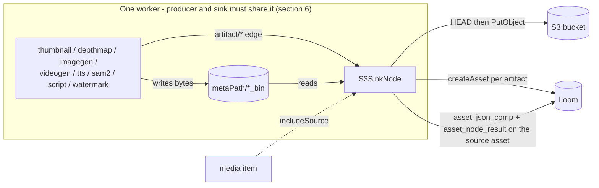

# S3 Sink Node (`s3-sink`) — Getting Produced Bytes Off the Worker

> **Status**: 🟢 **Built and shipping.** Kind `s3-sink`, module
> [cortex/nodes/s3-sink/](../../../../cortex/nodes/s3-sink/) (aggregator + `core/`), package
> `io.metaloom.cortex.node.sink.s3`. Bound unconditionally into the kind map by
> `S3SinkNodeModule`. 89 unit tests + 7 integration tests against a real MinIO container, a
> customer-facing page and three demo pipelines. Contract in the generated
> `node-descriptors.json`, kept honest by `NodeSpecGoldenTest`.
> **Scope**: the `s3-sink` node — from the files its `artifacts` port names, through the object
> key and the `PutObject`, to the asset per artifact and the two rows it writes on the source
> asset.
> **Audience**: AI coding agents and humans working on
> [cortex/nodes/s3-sink/](../../../../cortex/nodes/s3-sink/).

**Out of scope, and where it lives instead:**

| Not here | There |
|---|---|
| The node system, lifecycle, registration, the persistence matrix | [../NODES.md](../NODES.md) |
| Port content types, cardinality, the `artifact/*` family | [../NODE_DATA_TYPES.md](../NODE_DATA_TYPES.md) §2, §4.6 |
| Rules for adding a node at all | [../../../guidelines/NEW_NODE.md](../../../guidelines/NEW_NODE.md) |
| The shared `cortex/s3-common` client, credential and caching model | [../s3-source/NODE_S3SOURCE.md](../s3-source/NODE_S3SOURCE.md) |
| Every `CORTEX_S3_*` flag and where worker options come from | [../../../cortex/CONFIGURATION.md](../../../cortex/CONFIGURATION.md) §2.2 |
| Loom's own byte endpoints, pools and `BinaryStorageResolver` | [../../rest/REST_BINARY_HANDLING.md](../../rest/REST_BINARY_HANDLING.md) |
| Raw-byte ingest into Loom storage — the general gap this node substitutes for | [../../../concept/REST_CORTEX_METADATA_BINARY_HANDLING_PLAN.md](../../../concept/REST_CORTEX_METADATA_BINARY_HANDLING_PLAN.md) |
| Whether an asset is cleared for export at all | [../../../workflows/WORKFLOW_RIGHTS_RELEASE.md](../../../workflows/WORKFLOW_RIGHTS_RELEASE.md) — 🔴 the sink does **not** check it today (§10) |

---

## 0. Executive Summary

| Question | Short answer |
|---|---|
| **What does it do?** | Uploads the files upstream nodes produced into an S3 bucket and registers each one in Loom as its own asset |
| **What does it upload?** | Every element of its `artifacts` `MANY` port, in sequence order, plus the media item when `includeSource` is on (§2) |
| **How is the key built?** | A template, content-addressed on the **artifact's** SHA-512, sharded at 4 hex like the local `*_bin` layout (§3) |
| **Is a re-run expensive?** | No. `IF_DIFFERENT` HEADs the key and skips when the size matches (§4) |
| **What does it write to Loom?** | One `asset` per uploaded artifact, plus one `asset_json_comp` and one `asset_node_result` on the **source** asset (§5) |
| **Biggest operational constraint?** | 🔴 It reads local files, so it must run on the same worker as the producer (§6) |
| **Biggest key surprise?** | `{sourceNode}` and `{sourceKey}` both render the literal `artifacts` — the port id, not the producing node (§3) |

```
artifacts : artifact/*  MANY  ──▶  s3-sink  ──▶  result : struct/json
(media item, ambient, only with                ──▶  count  : scalar/integer
 includeSource)                                ──▶  flag   : scalar/string
```

---

## 1. Why the node exists

Nine node kinds produce **new bytes** and write them to a worker-local
`metaPath/<name>_bin/<segment>/<sha512>.<ext>` directory with a ledger row that has no
`result_ref` ([../NODES.md](../NODES.md) §2.1). Loom has **no byte-ingest endpoint for produced
media**, so those files exist only on the machine that made them: the UI cannot render them, a
re-run elsewhere recomputes them, and replacing a worker loses them.

`s3-sink` is the one supported way out. It uploads with the **worker's** credentials to a bucket
named on the node definition, and registers each uploaded file as its own Loom asset whose
`origin` is the `s3://` URI — a value the `asset.initial_origin` column comment explicitly
sanctions.

🔴 **This is not the same thing as raw-byte ingest into Loom's binary storage.** The general fix —
a node handing bytes to Loom so they land in whichever backend the target library uses — is
specified in
[../../../concept/REST_CORTEX_METADATA_BINARY_HANDLING_PLAN.md](../../../concept/REST_CORTEX_METADATA_BINARY_HANDLING_PLAN.md).
Do not restate it here.

---

## 2. What gets uploaded



`ArtifactSelector.select(...)` turns the port contents into an ordered `List<SinkArtifact>`:

* **Every element of `artifacts`**, in sequence order. An edge into a typed `artifact/*` port is
  what says "this file, from that node" — the node-id string option this replaced is forbidden by
  [../NODES.md](../NODES.md) §6.4.
* **The media item last**, and only when `includeSource` is set — which is what makes
  `filesystem-source → s3-sink` an archiver. Dropped again by `dropAlreadyRemoteMedia` when
  `media.reference()` is already an `s3://` URI, so an `s3-source` run does not round-trip bytes
  it fetched a moment ago.

**Resolution rules.** Blank or unparseable → ignored with a WARN. Relative → resolved against
`cortexOption().getMetaPath()`. Duplicates on the normalised absolute path are collapsed, first
wins (including the media item when it is also on the port). `maxArtifacts` (default 64) exceeded
→ the node **fails**, never truncates: a producer emitting thousands of files is a bug, and a
truncating sink hides it.

🔴 **Presence is recorded, not filtered.** An element naming a file that is not on this worker is
still selected, marked `present = false`, and becomes a `MISSING` artifact that fails the node
with a message naming the path and the affinity fix. A sink that quietly uploads nothing looks
like success, which is the failure mode this node works hardest to avoid.

---

## 3. The key template

`S3KeyTemplate` is pure — no S3, no filesystem, no clock. Parsed once per configured instance
(`configure(...)`), rendered per artifact.

| Placeholder | Value |
|---|---|
| `{sha512}` | hex SHA-512 of the **artifact** |
| `{sha512:N}` | its first N hex chars, `N` in 1..128; `{sha512:4}` matches `HashUtils.segmentPath` |
| `{sourceSha512}` / `{sourceSha512:N}` | the same for the source media |
| `{nodeId}` | this sink instance's graph-local id |
| `{sourceNode}` / `{sourceKey}` | ⚠️ see below |
| `{ext}` | extension **including** the dot, or empty for an extension-less file |
| `{filename}` / `{basename}` | local file name with and without extension |
| `{assetUuid}` | the source asset's uuid |
| `{index}` | position within a multi-valued port, `0` otherwise |
| `{indexSuffix}` | `""` when single-valued, `-<n>` when not |

```
Default: cortex/{sourceNode}/{sourceKey}/{sha512:4}/{sha512}{ext}
Renders: cortex/artifacts/artifacts/e7c2/<sha512>.thumb
```

⚠️ **`{sourceNode}` and `{sourceKey}` are the port id, not the producing node.** `SinkArtifact`
records `SinkArtifact.ARTIFACTS_PORT` (`"artifacts"`) for both when a file arrives on the port,
and `SinkArtifact.SOURCE_MEDIA` (`"media"`) for the media item. Since the typed-port migration the
selector genuinely cannot know which node filled the port, and recording the port is honest where
guessing a node name was not. Pinned by
`ArtifactSelectorTest.testProvenanceNamesThePortRatherThanAnUpstreamNode` and by the integration
test's exact-key assertion. Keys stay content-addressed, so nothing about the skip behaviour
changes — but a bucket layout that expects `cortex/thumbnail/...` will not be there.

**Rejected at parse** (`IllegalArgumentException`, naming the placeholder): an unknown name, a
`:N` on a non-hash placeholder, `N` outside 1..128, an empty template. **Rejected at render**
(`IllegalStateException`): an empty key, a key ending in `/`, a `.` or `..` segment, a control
character, more than 1024 UTF-8 bytes. **Normalised**: `//` collapsed, leading `/` stripped.

🔴 **An unresolvable placeholder fails that artifact — it is never substituted.** A key containing
the literal `null` would collide every asset onto one object.

The `Content-Type` on the object and the `mimeType` on the created asset both come from
`S3ContentTypes.of(path)` — extension-based, never `Files.probeContentType`.

---

## 4. Overwrite policy

`OverwritePolicy` decides what happens when an object already sits at the rendered key. Unless the
policy is `ALWAYS`, the node issues one `HEAD` before the `PUT` — a cheap round trip against a
multi-megabyte upload, and what turns a re-run over an already-published corpus into N head
requests.

| Policy | Behaviour |
|---|---|
| `NEVER` | An object at that key is left alone, whatever its size |
| `IF_DIFFERENT` (default) | Skipped when the existing object has the **same size**; otherwise re-uploaded |
| `ALWAYS` | No HEAD, always `PUT` |

⚠️ `IF_DIFFERENT` compares **key + size**, not content. An ETag is not a content hash — a
multipart upload reports an md5-of-md5s — so comparing a local MD5 against it is wrong. With the
default content-addressed template, "same key, same size" is already a strong statement that the
identical bytes are there.

A skipped object reports `State.PRESENT`, which still counts as stored (`isStored()`), still
creates the asset, and still allows `deleteAfterUpload` to run.

---

## 5. What it persists

Three writes, all best-effort in the sense that a Loom outage never loses the bytes.

| What | Where | Notes |
|---|---|---|
| One `asset` **per uploaded artifact** | `createAsset` | `origin` = the `s3://` URI, `sha512` = the artifact's own hash, `meta` = `producedBy`/`sinkNodeId`/`sourceNode`/`sourceKey`/`sourceAssetUuid`. Skipped entirely when `createAssets = false` |
| One `asset_json_comp` on the **source** asset | `createAssetJsonComp` | `nodeKind = s3-sink`, `schemaType = s3-artifact`, `variant = <graph-local node id>`, `producerVersion = <bucket>`; payload `{bucket, nodeId, count, uploaded, artifacts[]}` |
| One `asset_node_result` ledger row on the source asset | `recordNodeResult` | `producerVersion = <bucket>`, `nodeId = nodeId()`, `resultRef` → the json comp uuid |

**Ordering matters.** `asset.sha512sum` is `NOT NULL UNIQUE` (`V2.46`), so an asset cannot exist
before its bytes are hashed: the node SHA-512s the local file, uploads, *then* creates the asset.
A re-published artifact resolves to the existing row via `loadAsset(hash)` rather than conflicting
— the same bytes are the same asset.

**The graph-local node id is the discriminator.** `asset_node_result` is
`UNIQUE (asset_uuid, node_kind, node_id)` and `AbstractMediaNode.nodeId()` defaults to `""`;
`S3SinkNode` overrides it with `nodeDef.id`, and uses the same value as the component `variant`.
That is what lets two sinks writing to different buckets coexist on one asset without overwriting
each other. Pinned by `S3SinkNodePersistenceTest.testTwoSinkInstancesWrite{DistinctLedgerRows,DistinctComponents}`
and by the integration test.

**Per-artifact outcome** (`UploadedArtifact.State`), recorded in the component payload:

| State | Meaning | Counts as stored |
|---|---|---|
| `UPLOADED` | Bytes transferred in this run | yes |
| `PRESENT` | An object was already at that key and the policy said skip | yes |
| `FAILED` | The upload, the hash, the render or the size cap failed | no |
| `MISSING` | The port named a file that is not on this worker (§6) | no |

The node's own state: `flag = DONE` when nothing failed, `PARTIAL` when some artifacts stored,
`FAILED` when none did. `failOnPartial` (default true) turns any non-empty failure list into
`ctx.failure(reason).abort()`.

---

## 6. 🔴 The same-worker constraint

The sink reads files a producer wrote **on the same worker**. Dispatched elsewhere it sees
nothing. There is no affinity mechanism today ([../NODES.md](../NODES.md) §10), so the working
configurations are a single-worker deployment or a `CORTEX_NODE_WHITELIST` that co-locates
producer and sink.

The design mitigates it by making the failure loud, and by distinguishing two cases:

* **Nothing on the port at all** → `ctx.skipped("no artifacts").next()`. Legitimate: a sink
  downstream of a `depthmap` that skipped a video must not redden every video in the run.
* **A path on the port whose file is not here** → `MISSING`, and the node fails with a message
  that names the file, the port and the fix ("pin both into one affinity group or one node
  whitelist"). Pinned by `S3SinkNodeTest.testMissingArtifactFileFailsWithTheAffinityHint` and by
  `S3SinkNodeIntegrationTest.testAMissingArtifactFailsWithTheAffinityHint`.

---

## 7. Options and configuration

### 7.1 Node options (per pipeline instance)

Every option describes **the work**, so all of them are read from the node definition through
`PipelineConfigurable.configure(nodeDef)`; the worker YAML values act as fleet-wide defaults a
definition layers over ([../NODES.md](../NODES.md) §6.5). Connection settings are deliberately
**not** here — see §7.2.

| Option | Type | Default | Notes |
|---|---|---|---|
| `bucket` | `STRING` | — | Required in `configure(...)`, **not** in `validate()` (§8) |
| `keyTemplate` | `STRING` | `cortex/{sourceNode}/{sourceKey}/{sha512:4}/{sha512}{ext}` | §3. Blank resets to the default |
| `includeSource` | `BOOLEAN` | `false` | Also upload the media item; skipped when it is already `s3://` |
| `createAssets` | `BOOLEAN` | `true` | Off = pure uploader, no Loom asset per artifact |
| `overwrite` | `ENUM` | `IF_DIFFERENT` | `NEVER` \| `IF_DIFFERENT` \| `ALWAYS` — §4 |
| `deleteAfterUpload` | `BOOLEAN` | `false` | 🔴 must stay off by default — see below |
| `maxArtifacts` | `INTEGER` | `64` | Exceeded → fail, never truncate |
| `maxArtifactBytes` | `INTEGER` | `0` | Per-file cap in bytes; `0` = unbounded |
| `failOnPartial` | `BOOLEAN` | `true` | A partial run reports FAILED |
| `enabled` | `BOOLEAN` | `true` | Standard. `processIncomplete` / `retryFailed` are hidden via `@ParamOverride` — a sink at the end of a branch never advertised them |

🔴 **`deleteAfterUpload` defaults to `false` and must stay that way.** `SceneLayoutNode` reads
`depthmap_path` from the **same worker's** `depthmap_bin` cache; a sink that deleted by default
would break that chain, and it would surface as `scene-layout` skipping with "depth map not found"
— which looks like a depthmap bug and is not. When enabled the node deletes only artifacts
confirmed stored, **never** the media item, and only files under `metaPath`; an `IOException` is
WARN-logged and never fails the node, because the bytes are already safe.

### 7.2 Worker environment

Credentials and endpoint are worker-level because a pipeline definition is stored in Postgres and
rendered verbatim in the editor, and `ParameterType` has no `SECRET` value. The full 16-flag
`CORTEX_S3_*` table lives in
[../../../cortex/CONFIGURATION.md](../../../cortex/CONFIGURATION.md) §2.2 and the client model in
[../s3-source/NODE_S3SOURCE.md](../s3-source/NODE_S3SOURCE.md); the sink's upload path touches
only these:

| Variable | Default | Meaning for the sink |
|---|---|---|
| `CORTEX_S3_ENDPOINT` | — | Endpoint override (e.g. `http://minio:9000`); unset = real AWS. Setting this **or** the access key is what makes `S3Support.isActive()` true |
| `CORTEX_S3_REGION` | `us-east-1` | S3 region |
| `CORTEX_S3_ACCESS_KEY` | — | Unset = the AWS default credentials chain |
| `CORTEX_S3_SECRET_KEY` | — | Secret key |
| `CORTEX_S3_PATH_STYLE` | `true` when an endpoint is set | MinIO and most gateways need path-style addressing |
| `CORTEX_META_PATH` | `~/.cache/metaloom/cortex/meta` | Where relative artifact paths resolve, and the only tree `deleteAfterUpload` will touch |
| `CORTEX_NODE_WHITELIST` | — | The only tool today for co-locating a sink with its producer (§6) |

The `s3_bin` cache, the `s3-index` directory and the event flags belong to `s3-source`; the sink
neither reads nor writes them.

---

## 8. Conventions and Gotchas

| Gotcha | Detail |
|---|---|
| `ctx.failure(msg).abort()`, **never** `.next()` | `NodeContextImpl.next()` used to ignore a recorded failure cause and report SUCCESS ([../NODES.md](../NODES.md)); fixed 2026-08-18, and the shape now fails the build via `FailurePathGuardTest`. This node was already correct. For a sink, "green node, empty bucket" is the worst possible outcome |
| 🔴 `validate()` deliberately does **not** require `bucket` | `RegistryNodeRegistrar.adapt` validates the *worker's* options for every node it builds, so a bucket-required `validate()` would make every `s3-sink` in every pipeline fail to build with a misleading message. `validate()` checks shape; `configure(nodeDef)` requires the effective bucket and throws. Same split `ScriptNode` uses for its script. `S3SinkOptionsValidationTest.testDefaultsDoNotRequireABucket` is the guard |
| 🔴 S3 inactive on this worker → **fail, not skip** | The kind binding is unconditional (unlike `s3-source`, which has no `@IntoSet FilesystemNode` binding at all), so a worker with no S3 configuration still advertises `s3-sink`. Skipping would be silent data loss on a green run; the message names `CORTEX_NODE_WHITELIST` as the fix |
| `ctx.abort()` returns an empty output map | `NodeContextImpl.abort()` passes `Collections.emptyMap()`, so a FAILED sink cannot report per-artifact detail through its ports. The detail still reaches Loom via the `asset_json_comp`, which is written **before** the node returns — but `result` is only observable on a successful or `failOnPartial=false` run |
| Zero artifacts is a skip, not a failure | §6 |
| ⚠️ A failed `createAsset` does **not** fail the artifact | `createArtifactAsset` swallows its own exception, WARN-logs and returns null, so the artifact stays `UPLOADED`/`PRESENT` with no `assetUuid`. `UploadedArtifact.State.FAILED`'s javadoc claims otherwise |
| `{sourceNode}`/`{sourceKey}` are the port id | §3 — `artifacts` for anything on the port, `media` for the media item |
| Do **not** compare a local MD5 to the ETag | Multipart ETags are `<md5-of-md5s>-<partcount>`; `IF_DIFFERENT` compares key + size |
| A key ending in `/` is invisible to `s3-source` | `AwsS3ObjectStore.list` filters directory placeholders out, so `normalize` rejects it outright |
| `.thumb` is a JPEG | `PreviewGenerator.save` → `ImageUtils.saveJPG` in video4j. If that changes, `S3ContentTypes` silently lies |
| Never `Files.probeContentType` | Platform-dependent and commonly null in slim containers, so the stored type would differ between a laptop and production |
| `JsonCompCreateRequest.setData` takes a `JsonObject` | The column is `jsonb NOT NULL`, so the payload must be an object wrapping the array, never a bare array |
| The node takes `@Nullable LoomClient` | Offline mode provides a null client, and Dagger refuses to inject a `@Nullable`-provided binding into a non-annotated parameter. Offline = upload only, no asset, no comp, no ledger |
| **Not** `@Singleton` | It is `PipelineConfigurable` and `configure(...)` mutates it. `PipelineConfigurableTest.testTwoS3SinkNodesGetIndependentInstances` is the guard |
| The descriptor is **generated**, not hand-written | `@NodeSpec` / `@PortDoc` / `@ParamDoc` on `S3SinkNode` and `S3SinkNodeOptions` are the source; `node-descriptors.json` is the ground truth artefact and `NodeSpecGoldenTest` fails when they diverge. There is no `S3SinkDescriptorProvider` class |
| `upload(...)` returns the stored `S3ObjectRef` | Taking the etag from `PutObjectResponse.eTag()` avoids an extra HEAD per artifact |
| Concurrency is 1 | The descriptor reports `defaultConcurrency: 1`; the `UrlConnectionHttpClient` is a worker-wide singleton shared with `s3-source` listing and materialization, so raising it competes with source downloads |
| `./setup-pool.sh` before any integration test | And again after any Flyway change |

---

## 9. Key Classes Reference

| Class | Package / module | Purpose |
|---|---|---|
| `S3SinkNode` | `io.metaloom.cortex.node.sink.s3` (`cortex/nodes/s3-sink/core`) | `AbstractMediaNode<S3SinkNodeOptions>` + `PipelineConfigurable`; `KIND = "s3-sink"`, `SCHEMA_TYPE = "s3-artifact"`; overrides `nodeId()` |
| `S3SinkNodeOptions` | same | `KEY = "s3-sink"`; the nine per-instance options + `validate()` |
| `S3SinkNodeModule` | same | `@Binds @IntoSet FilesystemNode` + `@Binds @IntoMap @StringKey(S3SinkNode.KIND)` + the options provider |
| `ArtifactSelector` | same | Port elements (+ optionally the media item) → ordered, deduplicated `List<SinkArtifact>` |
| `SinkArtifact` | same | Record: provenance, sequence index, multi-valued flag, absolute file, presence; `ARTIFACTS_PORT` / `SOURCE_MEDIA` markers |
| `UploadedArtifact` | same | Per-artifact outcome + `toJson()`; `State` = `UPLOADED`/`PRESENT`/`FAILED`/`MISSING` |
| `S3KeyTemplate` | same | Parse + render + normalise; pure, no IO |
| `OverwritePolicy` | same | `NEVER` \| `IF_DIFFERENT` \| `ALWAYS`, with a lenient `parse` |
| `S3Support` | `io.metaloom.cortex.s3` (`cortex/s3-common`) | The always-injectable "can this worker talk to S3" value — `isActive()`, `store()` |
| `S3ObjectStore` / `AwsS3ObjectStore` | same | `head(bucket,key)` and `upload(bucket,key,file,contentType)` returning `S3ObjectRef` |
| `S3ContentTypes` / `S3Uri` | same | Extension → MIME; `isS3(reference)` for the already-remote check |
| `FakeS3ObjectStore` | same, **test-jar** | In-memory store + assertion accessors; keeps the 89 unit tests MinIO-free |
| `AbstractMediaNode` | `io.metaloom.cortex.common.node` (`cortex/common`) | The `nodeId()` seam `recordNodeResult` reads |
| `NodeCollectionModule` | `io.metaloom.cortex.cli.dagger` (`cortex/cli`) | Where `S3SinkNodeModule` is collected into the worker graph |

---

## 10. Progress Assessment

### Done

- [x] Module `cortex/nodes/s3-sink` + `core`, registered in `cortex/nodes/pom.xml` and `cortex/processor/pom.xml`
- [x] Node, options, `validate()`, Dagger module, kind binding in `NodeCollectionModule`
- [x] Typed port model — `artifacts : artifact/*` **MANY** in; `result` / `count` / `flag` out. The old `artifacts` (`nodeId:outputKey`) option and the `autoDiscover` flag are deleted
- [x] `PipelineConfigurable.configure(nodeDef)` — per-instance bucket, template, flags and graph-local `nodeId`
- [x] `AbstractMediaNode.nodeId()` seam, so two sink instances no longer overwrite each other's ledger row
- [x] Key template: parse, render, normalise, and the "never substitute a missing placeholder" rule
- [x] `HEAD`-based idempotency with three policies; content-addressed default key
- [x] Asset per artifact, `s3-artifact` json comp and ledger row on the source asset
- [x] Loud `MISSING` handling for the affinity failure; skip-on-empty; `abort()` on failure
- [x] Safe `deleteAfterUpload` (stored-only, never the media, `metaPath` only, never fatal)
- [x] 89 unit tests across five classes; 7 integration tests against a real MinIO container
- [x] Generated descriptor in `node-descriptors.json`, pinned by `NodeSpecGoldenTest`
- [x] Customer page `website/content/english/docs/nodes/s3-sink/` with `nodeviz`, `config.png`, `debug.png`; three demo pipelines in `DemoDatabaseInitializer`; the `start-minio.sh` recipe

### Follow-ups this node creates

- [ ] 🔴 **No rights-release gate.** [../../../workflows/WORKFLOW_RIGHTS_RELEASE.md](../../../workflows/WORKFLOW_RIGHTS_RELEASE.md)
      names `s3-sink` as a byte-carrying exit that "would need the check", and the node performs
      none: any asset reachable by the pipeline leaves the system. The `ExportGateTest` that suite
      names as its critical guard does not exist yet.
- [ ] 🔴 **No `poolUuid` / `poolName` option.** The sink uploads to its own bucket with worker
      credentials and records the location in `asset.initial_origin`. Loom now models "a pool that
      lives in S3" (`asset_pool`, `library.pool_uuid`, `BinaryStorageResolver` —
      [../../rest/REST_BINARY_HANDLING.md](../../rest/REST_BINARY_HANDLING.md)) and nothing connects
      the two. Wiring them raises the same question `s3-source` has: whose endpoint wins, the pool
      row's or the worker's?
- [ ] 🔴 **Loom cannot serve these bytes.** No presigned URL and no Loom proxy route, so the UI
      still cannot render an S3-hosted thumbnail even though the asset exists.
- [ ] **A failed `createAsset` is invisible in the result state** (§8). Either surface it as its own
      state or correct the `State.FAILED` javadoc.
- [ ] **An asset per artifact multiplies asset count.** A 10k-video library with thumbnails and
      depth maps triples it. They *are* distinct binaries, but list/search should learn to filter
      derived assets — an argument for the `attachment` derivation edge (`V2.44` already has
      `node_kind` / `node_id` / `producer_version` / `variant` / `run_uuid`, invisible to REST).
- [ ] **`IF_DIFFERENT` compares key + size only.** The clean upgrade is writing the SHA-512 as
      object metadata on `PUT` and comparing on `HEAD`; deferred because `S3ObjectRef` has no
      metadata field.
- [ ] **No `*NodePipelineTest`** — [../NODES.md](../NODES.md) §10 lists `s3-sink` among the kinds
      missing one, so adapter integration and event emission are unpinned for this kind.
- [ ] **`ScriptNode` still does not override `nodeId()`**, so two script instances on one asset
      still collide in `asset_node_result`. Deferred: it has persistence tests asserting the current
      shape and existing rows need a decision.

### Deliberately not built

- [ ] **No server-side copy.** Cross-bucket archiving of media that is already `s3://` would want
      `CopyObject`; today the media item is simply dropped from the selection.
- [ ] **No upload concurrency above 1.** Raising it competes with `s3-source` downloads over the
      shared HTTP client. Revisit with numbers.
- [ ] **No `LocalResultCache`.** The node is built per task, so a local cache would dedupe within a
      batch only. The `HEAD` is what makes re-runs cheap.
- [ ] **No general upload endpoint in Loom, no presigned-URL layer, no removal of the local
      `*_bin` caches by default** — the first two are Loom's work, the third would break
      `scene-layout` (§7.1).

---

## 11. Test Setup

```bash
# The pure pieces and the node - no MinIO, FakeS3ObjectStore stands in (89 tests)
./mvnw -o -pl cortex/s3-common test
./mvnw -o -pl cortex/nodes/s3-sink/core test

# The kind is schedulable, the definition reaches the node, instances stay independent
./mvnw -o -pl cortex/cli test -Dtest=PipelineConfigurableTest

# The generated contract equals the annotated node
./mvnw -o -pl integration-test test -Dtest=NodeSpecGoldenTest

# End to end: real MinIO container + in-process Loom + pooled Postgres (7 tests)
./setup-pool.sh
./mvnw -o -pl integration-test verify -Dtest=S3SinkNodeIntegrationTest

# Regression on everything the recordNodeResult / nodeId() seam touches
./mvnw -o -pl cortex/nodes/depthmap/core,cortex/nodes/script/core,cortex/nodes/thumbnail/core test
```

| Test | Count | What it guards against |
|---|---|---|
| `S3KeyTemplateTest` | 19 | An unknown placeholder reaching render; a truncation on a non-hash placeholder; a key with `..`, a trailing `/`, a leading `/` or over 1024 bytes; a missing value silently rendering `null`; the shard level drifting from `HashUtils.segmentPath` |
| `ArtifactSelectorTest` | 16 | A missing file being filtered instead of reported; duplicates uploaded twice; sequence order lost; the media item slipping in without `includeSource`, or being uploaded twice when it is also on the port; provenance claiming a node name it cannot know |
| `S3SinkOptionsValidationTest` | 13 | `validate()` regaining a `bucket` requirement and breaking every pipeline build; a bad bucket name or key template passing; `deleteAfterUpload` defaulting on; non-positive limits accepted |
| `S3SinkNodeTest` | 30 | A green node with an empty bucket; a partial run not surfacing; zero artifacts failing instead of skipping; inactive S3 skipping instead of failing; a missing file losing the affinity hint; `maxArtifacts` truncating; `deleteAfterUpload` touching the media item, a file outside `metaPath` or a failed upload; two instances sharing an id |
| `S3SinkNodePersistenceTest` | 11 | The artifact asset carrying the source's hash instead of its own, or losing its provenance meta; the json comp or ledger row missing, or two instances overwriting each other's; a failed artifact not recorded; anything persisted on an empty run |
| `S3SinkNodeIntegrationTest` | 7 | Against real MinIO: the object present with the right `Content-Type`; the exact content-addressed key; an asset created and loadable by its SHA-512 with `origin` = the `s3://` URI; a second run uploading nothing; two sink instances both persisting without collision; `includeSource` archiving the media; the affinity failure; `deleteAfterUpload` |
| `PipelineConfigurableTest` | 4 cases | Someone marking the node `@Singleton`; the kind not being registered; a definition without a bucket building anyway |

Manual smoke test: `./start-minio.sh`, export the `CORTEX_S3_*` variables, build
`filesystem-source → sha512 → thumbnail → s3-sink` (`id=archive`, `bucket=media`), run it, then

```bash
mc stat metaloom-dev/media/cortex/artifacts/artifacts/<shard>/<sha512>.thumb
#   -> Content-Type: image/jpeg   (octet-stream here means S3ContentTypes regressed)
```

Re-run and confirm `Last Modified` is unchanged (the `IF_DIFFERENT` skip);
`GET /api/v1/assets/<artifactSha512>` returns the thumbnail's **own** asset; and a second sink
(`id=archive2, bucket=media2`) yields **two** `asset_node_result` rows for `node_kind='s3-sink'`.

---

## 12. Where do I find …?

| Need | Path |
|---|---|
| The node | [cortex/nodes/s3-sink/core/…/S3SinkNode.java](../../../../cortex/nodes/s3-sink/core/src/main/java/io/metaloom/cortex/node/sink/s3/S3SinkNode.java) |
| What gets uploaded | `…/sink/s3/ArtifactSelector.java` · `SinkArtifact.java` |
| The key template rules | `…/sink/s3/S3KeyTemplate.java` |
| Per-artifact outcome JSON | `…/sink/s3/UploadedArtifact.java` |
| Options + `validate()` | `…/sink/s3/S3SinkNodeOptions.java` |
| Dagger wiring | `…/sink/s3/S3SinkNodeModule.java`, collected in `cortex/cli/…/dagger/NodeCollectionModule.java` |
| The unit tests | `cortex/nodes/s3-sink/core/src/test/…` |
| The integration test | `integration-test/src/test/java/io/metaloom/loom/test/integration/node/S3SinkNodeIntegrationTest.java` (container: `…/test/container/MinioContainer.java`) |
| Upload seam, MIME mapping, the S3 URI check | [cortex/s3-common/…/s3/](../../../../cortex/s3-common/src/main/java/io/metaloom/cortex/s3/) — `S3ObjectStore`, `AwsS3ObjectStore`, `S3ContentTypes`, `S3Support`, `S3Uri` |
| The in-memory store the unit tests use | `cortex/s3-common/src/test/…/FakeS3ObjectStore.java` |
| The ledger `nodeId()` seam | `cortex/common/…/node/AbstractMediaNode.java` |
| The generated descriptor | `loom-shared/node-model/src/main/resources/node-descriptors.json` (entry `s3-sink`) |
| Demo pipelines | `loom/core/…/boot/DemoDatabaseInitializer.java` (three definitions use the kind) |
| Customer-facing page | [website/content/english/docs/nodes/s3-sink/index.adoc](../../../../website/content/english/docs/nodes/s3-sink/index.adoc) |
| The `CORTEX_S3_*` flags | [../../../cortex/CONFIGURATION.md](../../../cortex/CONFIGURATION.md) §2.2 |
| The shared S3 client and credential model | [../s3-source/NODE_S3SOURCE.md](../s3-source/NODE_S3SOURCE.md) |
| The `artifact/*` family and MANY ports | [../NODE_DATA_TYPES.md](../NODE_DATA_TYPES.md) §2, §4.6 |
| Loom's byte endpoints and pool model | [../../rest/REST_BINARY_HANDLING.md](../../rest/REST_BINARY_HANDLING.md) |
| The real fix this node substitutes for | [../../../concept/REST_CORTEX_METADATA_BINARY_HANDLING_PLAN.md](../../../concept/REST_CORTEX_METADATA_BINARY_HANDLING_PLAN.md) |
| Rules for building the next node | [../../../guidelines/NEW_NODE.md](../../../guidelines/NEW_NODE.md) |
| The node system as a whole | [../NODES.md](../NODES.md) |

---

_Git HEAD revision: `d4e9134f`_
_Last updated: 2026-08-18 (§8 — the `ctx.failure(...).next()` gotcha it warned about is fixed tree-wide). Earlier: 2026-08-11_
