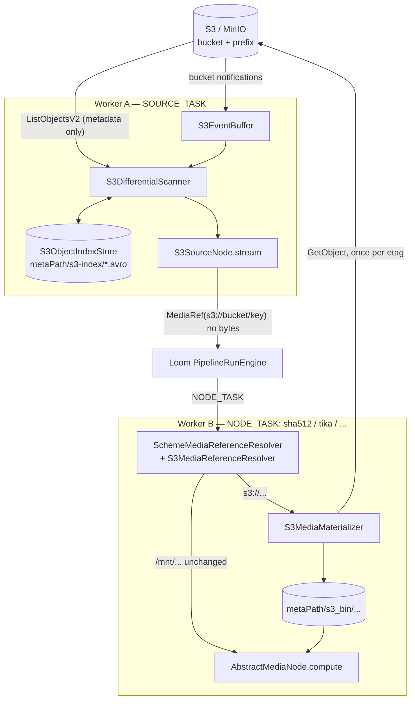

# S3 Source Node (`s3-source`) — Differential Object-Storage Ingest

> **Status**: 🟢 **Built and shipping.** Kind `s3-source`, flat module
> [cortex/nodes/s3-source/](../../../../cortex/nodes/s3-source/), package
> `io.metaloom.cortex.node.source.s3`, plus the shared module
> [cortex/s3-common/](../../../../cortex/s3-common/) (`io.metaloom.cortex.s3`).
> 47 node unit tests, 78 `s3-common` unit tests, 9 integration tests against a real MinIO container.
> Contract in the generated `node-descriptors.json`.
> **Scope**: the `s3-source` node **and** `cortex/s3-common` — the `s3://` addressing seam, the
> per-worker materialization cache, the object-store abstraction and the bucket-notification path.
> `cortex/s3-common` has no spec file of its own; it is specified here by convention.
> **Audience**: AI coding agents and humans working on
> [cortex/nodes/s3-source/](../../../../cortex/nodes/s3-source/) or
> [cortex/s3-common/](../../../../cortex/s3-common/).

**Out of scope, and where it lives instead:**

| Not here | There |
|---|---|
| The node system, lifecycle, registration, the source-node capability matrix | [../NODES.md](../NODES.md) |
| Port content types and cardinality across all nodes | [../NODE_DATA_TYPES.md](../NODE_DATA_TYPES.md) |
| Rules for adding a node at all | [../../../guidelines/NEW_NODE.md](../../../guidelines/NEW_NODE.md) |
| The egress half — uploads, key templates, `OverwritePolicy`, artifact assets | `s3-sink`, [../NODES.md](../NODES.md) §3 |
| Every `CORTEX_S3_*` flag in one authoritative table | [../../../cortex/CONFIGURATION.md](../../../cortex/CONFIGURATION.md) |
| How ingested media reaches an `asset` row at all | [../../../workflows/WORKFLOW_UPLOAD.md](../../../workflows/WORKFLOW_UPLOAD.md) |
| Bulk migration of an existing archive | [../../../workflows/WORKFLOW_INGEST_MIGRATION.md](../../../workflows/WORKFLOW_INGEST_MIGRATION.md) |
| The monitoring server that hosts the webhook route | [../../ops/MONITORING.md](../../ops/MONITORING.md) |
| The Helm secret carrying the credentials | [../../helm/HELM_CORTEX.md](../../helm/HELM_CORTEX.md) |
| **Loom's own, unrelated S3 backend** (`loom/services/s3`, `S3BinaryStorage`, `asset_pool`) | [../../rest/REST_BINARY_HANDLING.md](../../rest/REST_BINARY_HANDLING.md) |
| The customer-facing page and its two screenshots | [../../../website/WEBSITE.md](../../../website/WEBSITE.md) § Node pages |

> ⚠️ `cortex/s3-common` is **Cortex-side only**. Loom's `loom/services/s3` is a separate
> implementation and the two deliberately share no code — a `loom-service-s3 → cortex-s3-common`
> dependency would tie the server's build to the worker's.

---

## 0. Executive Summary

| Question | Short answer |
|---|---|
| **What does it do?** | Enumerates objects in an S3 bucket/prefix and feeds each changed one into the graph |
| **Does it download anything?** | **No.** It emits `s3://bucket/key` references; bytes are fetched later, by whichever worker runs a node task against them (§3.1) |
| **Why does that matter?** | It removes the shared-media-mount prerequisite. Two workers sharing nothing but bucket access can process the same object |
| **How does a re-run stay cheap?** | A local Avro index per `(endpoint, bucket, prefix)`; three scan paths, only one of which is correct on its own (§3.2) |
| **What does it emit?** | Exactly one port, `media : media/* ONE`. Bucket, key and diff state are read-side only via `lastState()` (§2) |
| **Where do credentials live?** | Worker-level `CORTEX_S3_*` only — never in a pipeline definition (§5) |
| **Is the kind always available?** | No. `RegistryNodeRegistrar` advertises it **only when `s3Support.isActive()`** (§4) |

```
(no inputs — root of the DAG)   ──▶  s3-source  ──▶  media : media/*  ONE
```

---

## 1. Why the node exists

`filesystem-source` requires every worker in a pipeline to see the same mount. That is a real
deployment constraint — recorded in `MediaRef`'s Javadoc — and it is what kept object storage out of
the ingest path. This node removes it, by separating **enumeration** from **fetching**: the scan
produces references, and materialization happens per worker, lazily, at the moment a node actually
needs the bytes.

Three separable pieces follow from that, and they are worth keeping apart when reading the code:

1. **Media addressing** (§3.1) — `MediaRef`, `ProcessableMedia.reference()`, the resolver chain.
   Nothing in it is S3-specific; `gdrive-source`/`onedrive-source` reuse the same seam.
2. **The node** (§3.2) — differential scanning over a persisted index.
3. **Worker configuration** (§5) — connection settings, cache and event transports.

---

## 2. Ports and what the node emits

| Port | Direction | Content type | Cardinality | Notes |
|---|---|---|---|---|
| `media` | out | `media/*` | ONE | One item per emitted object, carrying its `s3://bucket/key` reference |

Named `media` exactly as `filesystem-source`, `asset-source` and the cloud-drive sources name theirs,
so a downstream node stays wired when the source is swapped. Typed `media/*` because the concrete
kind is only known once the object is fetched — see
[../NODE_DATA_TYPES.md](../NODE_DATA_TYPES.md).

🔴 **`process()` emits the `media` port and nothing else.** The typed port model replaced the older
`uri` / `bucket` / `key` / `source` / `state` output keys. Bucket, key and diff state are scan
bookkeeping rather than pipeline data and are read back in-process through
`S3SourceNode.lastState(reference)`.

`stream()` is **cold**: the bucket is scanned on subscription, so one registered node instance
re-scans on every run and picks up whatever appeared since the last one.

---

## 3. The decisions worth keeping

### 3.1 `s3://` references and lazy, per-worker materialization

`Paths.get("s3://bucket/key")` yields **`s3:/bucket/key`** — `java.nio.file.Path` collapses the
duplicate slash, so a `Path` cannot carry a URI. That single fact is why `MediaResolver` takes a
`MediaRef` rather than a `Path`, why `ProcessableMedia.reference()` exists, and why
`SourceTaskRunner.toRef` uses `media.reference()` — **which is what stops enumeration from
downloading anything**.

`S3LoomMedia` is a `LoomMedia` whose `reference()` is the URI and whose `path()` / `file()` /
`open()` materialize on first use. It is used at **both** ends: the node builds it from a listing
entry, the resolver builds it from a URI. One class, one materialization path.

**Cache layout** (`S3MediaMaterializer`):

```
<cacheRoot>/<first 4 hex of sha256(bucket + "/" + key)>/<sha256(bucket + "/" + key)>-<etag><ext>
```

* **The key's file extension is preserved.** Media-type detection is extension-driven
  (`LoomMediaImpl.isVideo()` delegates to `FilterHelper.isVideo(path())`), so an object materialized
  as `.bin` would be invisible to every media node. Non-obvious and load-bearing.
* **The ETag is in the file name**, so a modified object lands at a different path and a stale copy
  can never be served. `S3ObjectRef.normalizeEtag` strips the surrounding quotes; the file name is
  further sanitized to letters, digits, `-` and `_`.
* `HashUtils.segmentPath` takes a SHA-512, unknown before the download, so the 4-hex sharding is
  reimplemented over the **key** hash. The shape still matches the `*_bin` convention used by
  `thumbnail`, `tts` and `imagegen`.
* **Atomic**: download to `<name>.part`, then `Files.move(…, ATOMIC_MOVE)`. `AtomicMoveNotSupported`
  falls back to a plain move and a lost race is treated as a win — the path is etag-addressed, so a
  racing writer produced identical bytes.
* **Guards**: `maxObjectSize` is checked against the **listed** size before any transfer;
  `maxCacheBytes` triggers an mtime-ordered LRU sweep after each download, down to 90 % of budget so
  eviction is not immediately re-triggered.
* `AbstractFilesystemMedia` caches SHA-512 in the `loom_sha512` xattr, so a re-materialized object
  (same etag → same path) keeps its hash for free.

**Consequence:** *every* worker running a node against S3 media needs S3 credentials, not just the
one running `s3-source`. `S3Module` is therefore wired for every worker, not only whitelisted ones.

The resolver is split in two: `SchemeMediaReferenceResolver` (`cortex/common`) is the composite that
routes a reference to whichever branch claims its scheme and falls back to a local path;
`S3MediaReferenceResolver` (`cortex/s3-common`) is the `s3://` branch. `MediaResolverModule`
(`cortex/core`) assembles them — and a worker with nothing remote configured gets literally
`new MediaReferenceResolver(mediaLoader)`, the same object as before any of this existed.

### 3.2 Change detection — three tiers, one of them correct

The index file is `indexBaseDir.resolve(sha256Hex(endpoint + "/" + bucket + "/" + prefix) + ".avro")`.
Including the endpoint is what stops the same bucket name on two different MinIO servers from
sharing — and corrupting — one index.

| Tier | Mechanism | Cost per run | Correct alone? |
|---|---|---|---|
| `FULL_LIST` | `ListObjectsV2` paginated, diffed against the persisted index | `ceil(N/1000)` requests, no bytes | yes |
| `RESUME` | `ListObjectsV2.startAfter(lastSeenKey)` | only the tail | no — misses edits to older keys |
| `EVENTS` | Bucket notifications → `S3EventBuffer`, then one `HeadObject` per hint | one HEAD per changed object | no — notifications can be lost |

The two fast tiers are **accelerators over the correct one**. `chooseMode` gates both on a full
listing having run within `reconcileIntervalMs` (default 6 h); a never-scanned or overdue selection
forces `FULL_LIST`. That single check is what makes a lost notification and `startAfter`'s blind spot
survivable: they may skip work, but never for longer than the reconcile interval. A degraded event
buffer also forces a full listing. S3 Inventory would be a fourth tier; it is AWS-only and out of
scope.

Classification is `NEW` when the key is unknown, `MODIFIED` when `differsFrom(etag, size)` is true,
`PRESENT` otherwise. **The index records what the bucket holds regardless of what is emitted** —
recording only emitted objects would make a suffix-filtered object look `NEW` forever. A full listing
additionally treats anything indexed but absent as `DELETED`, stamps `lastFullScanMillis`, and clears
the buffer's degraded flag.

States reuse `io.metaloom.fs.FileState` from the `differential-filesystem-scanner` artifact rather
than a parallel enum, so `emitStates` has an identical shape and shared UI `ENUM_SET` values across
both differential source nodes. Default `[NEW, MODIFIED]`.

🔴 **`MOVED` is never emitted.** S3 has no inode, so a rename is `DELETED` + `NEW`. It could be
inferred by matching `(etag, size)`, but ETags collide across genuinely identical objects — very
common in media archives with duplicate uploads — so the inference would invent renames. The value
stays accepted in `emitStates` for symmetry with `filesystem-source` and is simply never produced.

### 3.3 Events make a run cheap; they do not start one

Loom's scheduler still starts pipeline runs, so the practical result is "a scheduled run whose scan
is nearly free". Keeping it that way is what leaves `stream()` a cold, finite `Flowable` and the
SOURCE_TASK contract untouched. A true watch mode is a Loom scheduling feature and remains out of
scope.

`S3EventBuffer` is a worker-wide `@Singleton`: transports fill it continuously while each run drains
what it needs, so every `s3-source` instance must share the one instance. Overflow past
`maxBufferedKeys` marks the bucket **degraded** and stops accepting hints for it rather than dropping
them silently — a degraded bucket forces the next run onto a full listing, which is correct. Draining
happens at the start of a run, not after it succeeds, so a crash mid-run loses the hints and the
reconcile listing recovers them: the same at-least-once bargain the rest of the pipeline makes.

The webhook route refuses to register itself when events are enabled but no shared secret is set,
rather than exposing an unauthenticated endpoint that lets anyone who can reach the monitoring port
inject work into pipelines. The token comparison is constant-time. An authorized request always
answers `200`, including for zero hints — MinIO retries on failure, and a test event is not a failure.

### 3.4 The kind is capability-gated

`RegistryNodeRegistrar` registers the `s3-source` factory **only when `s3Support.isActive()`**;
otherwise it logs that the kind is not advertised. Announcing a kind the worker cannot serve turns a
missing capability into a dead run. `NodeRegistrarTest` pins both directions.

"S3 is not configured" is modelled as a **value**, not `null`: Dagger rejects a `null` from
`@Provides` without `@Nullable`, and `S3Support.isActive()` gives callers one honest question instead
of several null checks that can disagree. A worker counts as configured when it has an endpoint **or**
an explicit access key — a region alone is not enough, since it has a default.

---

## 4. Architecture



---

## 5. Configuration

### 5.1 Per-instance node options

`S3SourceNodeOptions`, `KEY = "s3-source"` — settable in the pipeline definition and in the `nodes`
section of the Cortex configuration, where they act as defaults for a definition that omits them.
The descriptor lists seven parameters; `processIncomplete` and `retryFailed` are hidden via
`@ParamOverride` because no source descriptor has ever advertised them.

| Option | Type | Default | Notes |
|---|---|---|---|
| `enabled` | `BOOLEAN` | `true` | Standard, from `AbstractNodeOptions` |
| `bucket` | `STRING` | — | Required. `validate()` rejects a value containing `/` |
| `prefix` | `STRING` | — | Empty scans the whole bucket |
| `suffixes` | `STRING` | — | Comma-separated, e.g. `mp4,mkv,jpg`. Empty accepts everything |
| `emitStates` | `ENUM_SET` | `[NEW, MODIFIED]` | `NEW` · `MODIFIED` · `PRESENT` · `DELETED` (§3.2) |
| `useEvents` | `BOOLEAN` | `false` | Requires events enabled on the worker |
| `startAfter` | `BOOLEAN` | `false` | Only correct for append-only, lexicographically ordered keys |

`validate()` runs at pipeline-build time in `RegistryNodeRegistrar.s3Source`, so a blank bucket or an
unknown state name surfaces once, at pipeline start, rather than per item.

### 5.2 Worker-level connection settings

🔴 **All connection settings are worker-level, never in the pipeline definition.** A definition is
stored in Postgres and rendered verbatim in the editor, and `ParameterType` has no `SECRET` value —
so a credential placed there would be persisted and displayed. It also means every worker resolving
`s3://` media is configured once, rather than per pipeline.

Authoritative table: [../../../cortex/CONFIGURATION.md](../../../cortex/CONFIGURATION.md).

| CLI flag | Env | Default |
|---|---|---|
| `--s3-endpoint` | `CORTEX_S3_ENDPOINT` | — (real AWS) |
| `--s3-region` | `CORTEX_S3_REGION` | `us-east-1` |
| `--s3-access-key` | `CORTEX_S3_ACCESS_KEY` | — → AWS default credentials chain |
| `--s3-secret-key` | `CORTEX_S3_SECRET_KEY` | — → AWS default credentials chain |
| `--s3-path-style` | `CORTEX_S3_PATH_STYLE` | `true` when an endpoint is set (MinIO needs it) |
| `--s3-cache-path` | `CORTEX_S3_CACHE_PATH` | `<meta-path>/s3_bin` |
| `--s3-index-path` | `CORTEX_S3_INDEX_PATH` | `<meta-path>/s3-index` |
| `--s3-max-cache-bytes` | `CORTEX_S3_MAX_CACHE_BYTES` | `53687091200` (50 GiB); `0` disables eviction |
| `--s3-max-object-size` | `CORTEX_S3_MAX_OBJECT_SIZE` | `0` (unbounded) |
| `--s3-reconcile-interval-ms` | `CORTEX_S3_RECONCILE_INTERVAL_MS` | `21600000` (6 h) |
| `--s3-events-enabled` | `CORTEX_S3_EVENTS_ENABLED` | `false` |
| `--s3-events-mode` | `CORTEX_S3_EVENTS_MODE` | `WEBHOOK` \| `SQS` |
| `--s3-events-webhook-path` | `CORTEX_S3_EVENTS_WEBHOOK_PATH` | `/s3-events` |
| `--s3-events-webhook-secret` | `CORTEX_S3_EVENTS_WEBHOOK_SECRET` | — (required when webhook events are on; header `X-Cortex-S3-Token`) |
| `--s3-events-queue-url` | `CORTEX_S3_EVENTS_QUEUE_URL` | — (SQS mode) |
| `--s3-events-max-buffered-keys` | `CORTEX_S3_EVENTS_MAX_BUFFERED_KEYS` | `50000`; overflow sets `degraded` |

The webhook route is `POST /s3-events` on the **monitoring** router (port `8093` by default) — see
[../../ops/MONITORING.md](../../ops/MONITORING.md). In Kubernetes the credentials arrive through
`helm/cortex/templates/s3-secret.yaml`, [../../helm/HELM_CORTEX.md](../../helm/HELM_CORTEX.md).

MinIO webhook wiring:

```bash
mc admin config set local notify_webhook:cortex \
    endpoint="http://cortex:8093/s3-events" auth_token="<secret>"
mc admin service restart local
mc event add local/media arn:minio:sqs::cortex:webhook --event put,delete
```

---

## 6. Key Classes Reference

| Class | Package / module | Purpose |
|---|---|---|
| `S3SourceNode` | `io.metaloom.cortex.node.source.s3` (`cortex/nodes/s3-source`) | `MediaSourceNode`; cold `stream()`, single `OUT_MEDIA` port, `lastState()`, static `create(...)` factory |
| `S3SourceNodeOptions` | same | `KEY = "s3-source"`, seven parameters, `validate()` |
| `S3SourceNodeModule` | same | Dagger `@Provides` for the options plus `CortexNodeOptionDeserializerInfo`. **No `@Binds @IntoSet FilesystemNode`** |
| `S3DifferentialScanner` | same | `chooseMode` + full-list / resume / event paths; `indexFileFor` |
| `S3Selection` | same | Record: bucket, prefix, suffixes, emit states, `startAfter`, `useEvents`; `accepts`, `emits`, parsers |
| `S3ScanResult` | same | Emitted objects + per-key states + the `ScanMode` that produced them |
| `S3ObjectIndex`, `S3ObjectIndexStore` | same | In-memory index + Avro persistence (`src/main/avro/s3-object-index.avsc`) |
| `S3Uri` | `io.metaloom.cortex.s3` (`cortex/s3-common`) | Record; `s3://bucket/key` parse/format, `fileName()`, `extension()`, `isS3()` |
| `S3ObjectRef` | same | Listing entry: bucket, key, etag, size, mtime; `normalizeEtag`, `differsFrom` |
| `S3ObjectStore`, `AwsS3ObjectStore` | same | Client seam (`list`, `head`, `download`, `upload`) + AWS SDK v2 implementation |
| `S3Support` | same | The always-present "is S3 configured" value; `isActive()`, `store()`, `materializer()`, `indexBaseDir()` |
| `S3MediaMaterializer` | same | URI → local cache file; cache layout, atomic move, size guard, LRU sweep |
| `S3LoomMedia` | same | `LoomMedia` whose `reference()` is the URI and whose `path()` materializes on first use |
| `S3MediaReferenceResolver` | same | The `s3://` branch; also a `SchemeMediaReferenceResolver.SchemeResolver` |
| `S3ContentTypes` | same | Extension → MIME; also used by `s3-sink` |
| `S3EventBuffer` | `io.metaloom.cortex.s3.event` | Worker-scoped `@Singleton` hint buffer; `record`, `hasHints`, `drain`, degraded flag |
| `S3ChangeHint`, `S3EventParser`, `S3EventSource` | same | Hint record, MinIO/AWS envelope parser, transport interface |
| `WebhookS3EventSource`, `SqsS3EventSource` | same | The two transports |
| `MediaReferenceResolver`, `SchemeMediaReferenceResolver` | `io.metaloom.cortex.common.media` (`cortex/common`) | The plain path resolver and the scheme-routing composite |
| `S3ClientOptions`, `S3EventOptions` | `io.metaloom.cortex.api.option` (`cortex/api`) | Worker-level config. **Must** live in `api`, not `s3-common` (§7) |
| `S3Module` | `io.metaloom.cortex.cli.dagger` (`cortex/core`) | Provides `S3Support`, the buffer and both event sources; `CACHE_DIR`/`INDEX_DIR` |
| `MediaResolverModule` | same | Assembles the resolver composite from the S3 and cloud branches |
| `RegistryNodeRegistrar` | `io.metaloom.cortex.cli.dagger` (`cortex/cli`) | Conditional kind registration + the `s3Source(...)` builder |
| `CortexBootstrapInitializer` | `io.metaloom.cortex.impl.boot` (`cortex/core`) | Starts the SQS poller after the monitoring server (which hosts the webhook route) |
| `MinioContainer` | `io.metaloom.loom.test.container` (`integration-test`) | Hand-rolled MinIO testcontainer |
| `FakeS3ObjectStore` | `io.metaloom.cortex.s3` (`cortex/s3-common` test) | In-memory store — the seam every unit test runs against |

---

## 7. Conventions and Gotchas

🔴 **Shading silently breaks the AWS SDK.** AWS SDK v2 picks its HTTP implementation via
`ServiceLoader` on `META-INF/services/software.amazon.awssdk.http.SdkHttpService`. Without a
`ServicesResourceTransformer` in the shade config those files overwrite each other last-wins and the
client dies at runtime with *"Unable to load an HTTP implementation from any provider in the chain"*.
The transformer is present in `cortex/cli/pom.xml`, `cli/pom.xml`, `loom/containers/demo/pom.xml`
and `loom/containers/server/pom.xml`, and `url-connection-client` is pinned in
`cortex/s3-common/pom.xml` (and in `bom/pom.xml`) so Netty stays out of the shaded jar. **This class
of regression passes every unit and in-process integration test** and fails only in a shaded
container — which is exactly the test that does not exist (§8).

| Gotcha | Detail |
|---|---|
| `Paths.get("s3://b/k")` → `s3:/b/k` | Duplicate slashes are collapsed. A `Path` cannot carry a URI — this is why `MediaResolver` takes a `MediaRef` |
| Media type is extension-driven | The materialized cache file **must** keep the object key's extension, or `isVideo()` is false and every media node skips it |
| ETag is not a content hash | A multipart ETag is `<md5-of-md5s>-<partcount>`. Opaque change token only — never MD5, never dedup |
| Event keys are URL-encoded | `s3.object.key` must be URL-decoded. MinIO and AWS emit the same envelope shape; a malformed record is skipped, not fatal |
| MinIO needs path-style access | `pathStyleAccess` defaults to `true` whenever an endpoint is set. Forcing it `false` breaks addressing |
| `S3ClientOptions` lives in `cortex-api` | `CortexOptions` references it and `s3-common` depends on `api`; putting it in `s3-common` inverts the dependency |
| "S3 not configured" is a value, not `null` | Dagger rejects a `null` from `@Provides` without `@Nullable`. `S3Support.isActive()` is the honest shape |
| The kind is capability-gated | `RegistryNodeRegistrar` advertises `s3-source` only when `s3Support.isActive()`; `NodeRegistrarTest` pins both directions |
| Every worker needs the credentials | Not just the one running the source. `S3Module` is wired unconditionally for exactly this reason |
| The event buffer must be a singleton | A per-node instance would silently lose hints. `@Singleton` in both `S3EventBuffer` and `S3Module` |
| A webhook without a secret registers no route | Deliberate refusal, logged at `error`. An open route on the monitoring port injects work into pipelines |
| Source nodes get no `@Binds @IntoSet FilesystemNode` | They are pipeline-level, matching `FilesystemSourceNodeModule` |
| The index store is `new`-ed, not injected | `FilesystemSourceNode` does the same with `AvroFileIndexStore` |
| `lastStates` is per-JVM | When the source's own NODE_TASK lands on another worker, `lastState()` reads `UNKNOWN`. Pre-existing in `filesystem-source`; recorded in [../NODES.md](../NODES.md) |
| A crash between scan and persist re-emits | At-least-once, which the rest of the pipeline already assumes (nodes upsert on natural keys) |
| `versionId` is reserved and unused | It is in the Avro schema; versioned buckets and delete markers are not handled |
| `setup-pool.sh` before any IT | And again after any Flyway change — see [../../../../.claude/CLAUDE.md](../../../../.claude/CLAUDE.md) |

---

## 8. Progress Assessment

### Done

- [x] `cortex/s3-common` — `S3Uri`, `S3ObjectRef`, `S3ObjectStore`/`AwsS3ObjectStore`, `S3Support`,
      `S3MediaMaterializer`, `S3LoomMedia`, `S3MediaReferenceResolver`, `S3ContentTypes` (78 tests)
- [x] Shade fix — `ServicesResourceTransformer` in all four shaded poms + pinned `url-connection-client`
- [x] Media-addressing seam — `ProcessableMedia.reference()`, `MediaResolver.resolve(MediaRef)`,
      `SourceTaskRunner.toRef`, `SchemeMediaReferenceResolver` + `MediaResolverModule`. No behaviour
      change when nothing remote is configured
- [x] `CortexOptions.getS3()` + `S3ClientOptions`/`S3EventOptions`, 16 CLI flags and env vars
- [x] The node — Avro schema, index store, differential scanner, options, Dagger module (47 tests)
- [x] Conditional kind registration + `NodeRegistrarTest` pinning both directions
- [x] Descriptor generated from `@NodeSpec`/`@ParamDoc`/`@PortDoc` into `node-descriptors.json`
      (7 parameters, icon `cloud`, `SOURCE`, one `media` output)
- [x] Event path — buffer with visible overflow, parser, webhook route on the monitoring router,
      SQS poller started at boot, and the fast-path + reconcile branch in the scanner
- [x] `MinioContainer`, `start-minio.sh`, `S3SourceNodeIntegrationTest` (9 tests)
- [x] Docs & demo — `website/content/english/docs/nodes/s3-source/` (`index.adoc`, `config.png`,
      `debug.png`), a demo pipeline in `DemoDatabaseInitializer`, Helm `s3-secret.yaml`

### Open

- [ ] 🔴 **No container E2E.** `S3PipelineContainerExecutionIntegrationTest` was designed and never
      written, and the shared test context has no MinIO service — `MinioContainer` is used by exactly
      two per-node ITs. Two workers with **no shared media volume** (`Set.of("s3-source")` and
      `Set.of("sha512")`) is the only test that proves the lazy-materialization architecture *and* the
      only test that would catch a shading regression in the `metaloom/cortex-server` image. Model it
      on `PipelineContainerExecutionIntegrationTest`.
- [ ] **`asset_pool.s3_*` stays unused by this node.** Bucket and prefix come from the pipeline
      definition. Linking to a configured pool row is follow-up work and interacts with
      [../../rest/REST_BINARY_HANDLING.md](../../rest/REST_BINARY_HANDLING.md)'s `library.pool_uuid`
      model and with `s3-sink`'s identical question.
- [ ] **Watch mode.** Events make a run cheap but do not *start* one; a worker-initiated run trigger
      is a Loom scheduling feature (§3.3).
- [ ] **Versioned buckets / delete markers.** `versionId` is reserved in the Avro schema and unused.
- [ ] **No per-instance `maxObjectSize` override.** The worker-level guard is the only one.

### Deliberately not built

- [ ] **`MOVED` is never emitted** (§3.2) — inferring renames from colliding ETags would invent them.
- [ ] **`lastStates` is per-JVM** — inherited from `filesystem-source`, recorded in
      [../NODES.md](../NODES.md) rather than worked around here.
- [ ] **No S3 Inventory tier.** AWS-only, and the three existing tiers already bound the cost.

---

## 9. Test Setup

```bash
mvn -q -pl cortex/s3-common,cortex/nodes/s3-source,cortex/node-runtime,cortex/core,cortex/cli -am test
mvn -q -pl loom-shared/node-model test          # the generated descriptor snapshot

./setup-pool.sh                                  # mandatory before any IT
mvn verify -pl integration-test -Dtest='S3*IntegrationTest'
```

| Test | What it guards against |
|---|---|
| `S3SourceNodeTest` (21) | A first scan not emitting everything as `NEW`; an unchanged re-run emitting anything; a changed ETag not reading `MODIFIED`; `DELETED` leaking when it is not in `emitStates`; the stream not being cold |
| `S3DifferentialScannerTest` (14) | `startAfter` resume skipping too much; an expired `reconcileIntervalMs` not forcing a full pass; the event fast path running without a recent full listing; a degraded buffer not falling back |
| `S3SourceNodeOptionsTest` (12) | A blank bucket, a bucket that is a path, or an unknown state name surfacing per item instead of at pipeline start |
| `S3UriTest` (7), `S3ObjectRefTest` (6) | URI round-trips and extension extraction; ETag normalization; `differsFrom` on size as well as etag |
| `S3MediaMaterializerTest` (15) | A cache hit downloading; an ETag change not re-downloading; a leftover `.part`; **a lost file extension**; `maxObjectSize` not rejecting before transfer; eviction ordering |
| `S3LoomMediaTest` (11), `S3MediaReferenceResolverTest` (7) | Enumeration accidentally fetching bytes; the resolver not being a pure passthrough for non-S3 references |
| `S3EventParserTest` (9), `S3EventBufferTest` (10) | Real MinIO **and** AWS payloads; URL-decoded keys; a malformed record failing the batch; overflow not setting `degraded` |
| `S3ContentTypesTest` (6), `FakeS3ObjectStoreUploadTest` (7) | Extension → MIME mapping; the fake store staying faithful to the interface contract |
| `NodeRegistrarTest` | The kind being advertised without S3 configured, or missing with it |
| `S3SourceNodeIntegrationTest` (9) | The full loop against real MinIO: first run sees everything and a re-run sees nothing; a new object picked up on its own; an overwrite reported `MODIFIED`; a delete reported when requested; **enumeration downloading nothing**; a materialized `.mp4` keeping its extension; a second resolution reusing the cache; the event fast path avoiding listing; the SHA-512 reaching the `asset` row over REST |

Manual smoke test:

```bash
./start-minio.sh
mc alias set dev http://localhost:9000 minioadmin minioadmin
mc mb dev/media && mc cp /path/to/sample.mp4 dev/media/2026/07/

export CORTEX_S3_ENDPOINT=http://localhost:9000 CORTEX_S3_REGION=us-east-1 \
       CORTEX_S3_ACCESS_KEY=minioadmin CORTEX_S3_SECRET_KEY=minioadmin CORTEX_S3_PATH_STYLE=true
./start-server.sh & ./start-cortex.sh &
```

Build `s3-source(bucket=media, prefix=2026/) → sha512 → tika` and check: run 1 processes the object;
run 2 emits nothing; a fresh `mc cp` makes run 3 process exactly one item;
`~/.cache/metaloom/cortex/meta/s3_bin/**` holds the file **with its `.mp4` extension**; and
`…/meta/s3-index/*.avro` holds the persisted index.

---

## 10. Where do I find …?

| Need | Path |
|---|---|
| The node | [cortex/nodes/s3-source/…/S3SourceNode.java](../../../../cortex/nodes/s3-source/src/main/java/io/metaloom/cortex/node/source/s3/S3SourceNode.java) |
| The options + `validate()` | `…/source/s3/S3SourceNodeOptions.java` |
| The diff engine | `…/source/s3/S3DifferentialScanner.java` |
| The Avro schema | `cortex/nodes/s3-source/src/main/avro/s3-object-index.avsc` |
| Everything shared with `s3-sink` | [cortex/s3-common/src/main/java/io/metaloom/cortex/s3/](../../../../cortex/s3-common/src/main/java/io/metaloom/cortex/s3/) |
| The `s3://` cache layout | `…/cortex/s3/S3MediaMaterializer.java` |
| The lazily-materializing media handle | `…/cortex/s3/S3LoomMedia.java` |
| The resolver composite | `cortex/common/…/media/SchemeMediaReferenceResolver.java` · `cortex/core/…/dagger/MediaResolverModule.java` |
| The webhook route | `cortex/s3-common/…/s3/event/WebhookS3EventSource.java` |
| Conditional kind registration | `cortex/cli/…/dagger/RegistryNodeRegistrar.java` (`s3Source`) |
| `S3Support` provisioning | `cortex/core/…/cli/dagger/S3Module.java` |
| Worker options + env mapping | `cortex/api/…/option/S3ClientOptions.java` · `cortex/common/…/option/CortexEnvOptions.java` |
| The generated descriptor | `loom-shared/node-model/src/main/resources/node-descriptors.json` (`kind: s3-source`) |
| The template source node | `cortex/nodes/filesystem-source/…/FilesystemSourceNode.java` |
| The unit-test fake store | `cortex/s3-common/src/test/…/s3/FakeS3ObjectStore.java` |
| MinIO testcontainer + dev script | `integration-test/…/test/container/MinioContainer.java` · `start-minio.sh` |
| Helm secret | `helm/cortex/templates/s3-secret.yaml` |
| The customer page | [website/content/english/docs/nodes/s3-source/index.adoc](../../../../website/content/english/docs/nodes/s3-source/index.adoc) |
| Loom's *own* S3 backend (unrelated code) | `loom/services/s3/…/S3BinaryStorage.java` · `loom/services/rest/…/BinaryStorageResolver.java` |
| All `CORTEX_S3_*` flags in one table | [../../../cortex/CONFIGURATION.md](../../../cortex/CONFIGURATION.md) |
| The node system as a whole | [../NODES.md](../NODES.md) |
| The port/content-type model | [../NODE_DATA_TYPES.md](../NODE_DATA_TYPES.md) |
| Rules for building the next node | [../../../guidelines/NEW_NODE.md](../../../guidelines/NEW_NODE.md) |

---

_Git HEAD revision: `8c153347`_
_Last updated: 2026-08-11_
