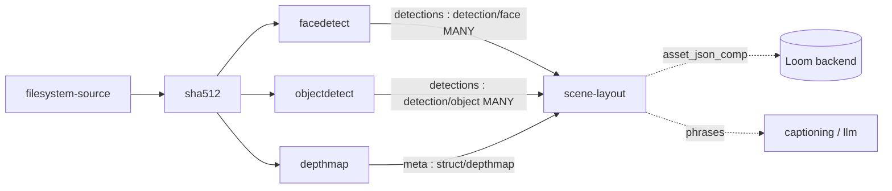

# Scene Layout Node (`scene-layout`) — Depth Bands and Pairwise Spatial Relations

> **Status**: 🟢 **Built and shipping.** Kind `scene-layout`, module
> [cortex/nodes/scene-layout/](../../../../cortex/nodes/scene-layout/), package
> `io.metaloom.cortex.node.scenelayout`. 59 unit tests across six classes plus
> `SceneLayoutNodeIntegrationTest`. **No model, no sidecar, no network** — the node is arithmetic
> over bounding boxes and a depth PNG. Contract in the generated `node-descriptors.json`, kept
> honest by `NodeSpecGoldenTest`.
> **Scope**: the `scene-layout` node — from the two wired input ports to the `asset_json_comp` row
> and the `asset_node_result` ledger entry.
> **Audience**: AI coding agents and humans working on
> [cortex/nodes/scene-layout/](../../../../cortex/nodes/scene-layout/).

⚠️ **`scene-layout` is not `scene-detection`.** The latter cuts video at shot boundaries and shares
nothing with this node but four letters. See [../../../cortex/SERVICE_VIDEO.md](../../../cortex/SERVICE_VIDEO.md).

**Out of scope, and where it lives instead:**

| Not here | There |
|---|---|
| The node system, lifecycle, registration, caching layers | [../NODES.md](../NODES.md) |
| Port content types and cardinality across all nodes | [../../pipeline/NODE_DATA_TYPES.md](../../pipeline/NODE_DATA_TYPES.md) §4 |
| Rules for adding a node at all | [../../../guidelines/NEW_NODE.md](../../../guidelines/NEW_NODE.md) |
| The depth map this node consumes, and the sidecar behind it | [../depthmap/NODE_DEPTHMAP.md](../depthmap/NODE_DEPTHMAP.md), [../../../sidecars/DEPTH_SIDECAR.md](../../../sidecars/DEPTH_SIDECAR.md) |
| Where the boxes come from, and the `detection` table they also land in | [../../../workflows/WORKFLOW_OBJECT_DETECT.md](../../../workflows/WORKFLOW_OBJECT_DETECT.md), [../facedetect/FACEDETECTION_OVERVIEW.md](../facedetect/FACEDETECTION_OVERVIEW.md) |
| Per-pixel shape rather than rectangles | `sam2` — [../sam2/NODE_SAM2.md](../sam2/NODE_SAM2.md) |
| Pipeline segmentation and affinity groups | [../../pipeline/PIPELINE.md](../../pipeline/PIPELINE.md) |
| The search document that these phrases do **not** yet reach | [../../search/SEARCH.md](../../search/SEARCH.md) |

---

## 0. Executive Summary

| Question | Short answer |
|---|---|
| **What does it do?** | Joins detector boxes to a depth map and answers "what is in front of what" |
| **What does it emit?** | A depth **band** per object (`FOREGROUND` / `MIDGROUND` / `BACKGROUND`) and **pairwise relations** over 11 emitted predicates, each with numeric evidence, plus plain-English `phrases[]` |
| **Which detectors feed it?** | **Any.** `detections` binds on `detection/*`, so `facedetect` (`detection/face`) and `objectdetect` (`detection/object`) both fit, together or apart (§3.1) |
| **Does it need a GPU?** | No. No model, no sidecar, no network. `defaultConcurrency = 4` says so |
| **Does it write to the schema?** | One `asset_json_comp` row, `schemaType = scene-layout`, plus a ledger row pointing at it (§4) |
| **Video?** | No. `isProcessable` is image-only — per-frame layout is blocked on per-keyframe depth |
| **The one production failure to expect** | 🔴 The depth PNG is worker-local. Without a shared **affinity group** the node skips with "depth map file not found" (§6) |

```
depth      : struct/depthmap  ONE   ──▶                ──▶  result         : struct/scene-layout
detections : detection/*      MANY  ──▶  scene-layout  ──▶  object_count   : scalar/integer
                                                       ──▶  relation_count : scalar/integer
```

Both inputs are `required = true` in the descriptor. When `detections` delivers nothing the node
falls back to `listAssetDetections` over REST — see §3.5 for why that path is the worse one.

---

## 1. Why the node exists

A detector answers *what* and *where in the frame*. It cannot answer *how these things relate*,
because the answer is not in the frame: two overlapping boxes are a person standing in front of a
car, or a person seen through the car's window, and flat 2D geometry cannot tell those apart.

Everything interesting therefore needs a second source of truth — the monocular depth map from
`depthmap`. This node is the join. It creates no boxes and runs no model; it takes boxes others
produced, samples the depth under each, and derives relations that are **deterministic and
explainable**: every assertion carries the numbers that produced it.

That explainability is why a learned scene-graph-generation model was rejected. "Why did it say
behind?" has to be answerable from the stored payload without re-running anything, and a geometric
solver is also unlicensed, dependency-free and CPU-cheap.

---

## 2. What it computes

`isProcessable` = `options().isEnabled() && ctx.media().isImage()`. Then `compute`:

1. **Skip cache.** `LocalResultCache<String>` (10 000 entries, keyed on `media().absolutePath()`) —
   a hit re-emits the three ports and returns `origin(LOCAL)`. ⚠️ It does **not** re-persist, and the
   key ignores every input (§7).
2. **Depth metadata** from `IN_DEPTH`. It must parse and carry a `path`; otherwise skip `"no depth map"`.
3. **Convention gate.** `convention` must be exactly `NEARNESS`; otherwise skip
   `"unsupported depth convention '<x>'"`. The node refuses to guess which direction "closer" runs.
4. **The map file must exist on this worker.** Missing → a `log.warn` naming affinity as the likely
   cause, then skip `"depth map file not found"`.
5. **Detections**, one per element of `ctx.inputs(IN_DETECTIONS)`, or the Loom fallback (both §3.5).
   `< 1` → skip `"no detections"`; `< 2` → skip `"only one detection - nothing to relate"`.
6. **Decode.** `DepthMap.read(mapFile, imageWidth, imageHeight)` — 16-bit grayscale PNG divided by
   65535 into `[0,1]` nearness. An 8-bit map is accepted and divided by 255 instead, so a downgraded
   artifact degrades rather than fails.
7. **Cap.** More than `maxObjects` boxes are sorted by **area descending** and truncated — a cap that
   dropped the subject would be worse than useless. Relations are O(n²).
8. **Sample.** Per object `map.projectFromImage(box)` then
   `DepthSampler.sample(map, mapBox, coreInset, minCorePixels)`. Unsampleable objects are dropped and
   counted; fewer than two survivors → skip `"fewer than two measurable detections"`.
9. **Solve.** `RelationSolver.assignBands(objects, map)` → `.solve(objects)` → optionally `.phrases(...)`.
10. **Emit** all three ports, cache the payload, `persist(...)`, return `origin(COMPUTED)`.

### 2.1 The relation table

`RelationSolver.relate(a, b, out)` runs over every **ordered** pair.

| Predicate | Condition |
|---|---|
| `IN_FRONT_OF` / `BEHIND` | `z = (near(a) − near(b)) / ((spread(a)+spread(b))/2 + 1e-6)`; `z ≥ depthZThreshold` / `z ≤ −t` |
| `SAME_DEPTH` | otherwise — emitted **once per unordered pair**, gated on `id.compareTo(...) < 0` |
| `CONTAINS` | `intersection / area(b) ≥ containmentRatio` |
| `OCCLUDES` + `OCCLUDED_BY` | overlap **and** `IN_FRONT_OF`; emitted as an inverse pair |
| `LEFT_OF` / `RIGHT_OF` | boxes do **not** `overlapsX`; ordered by `centerX` |
| `ABOVE` / `BELOW` | else, boxes do not `overlapsY`; ordered by `centerY` |
| `NEXT_TO` | `SAME_DEPTH` **and** `gapRatio ≤ nextToMaxGap`; once per unordered pair |

Results are sorted **confidence-descending** and then truncated to `maxRelations`, so a cut keeps the
assertions worth keeping. `RelationPredicate` declares a twelfth constant, `INSIDE`, which is
**never emitted** (§9).

Bands come from **whole-scene** depth quantiles (`map.sceneQuantile`), not from the objects' own
range: banding should describe where an object sits *in the picture*. Quantiles rather than k-means,
because clustering two points always yields two clusters, which is always the wrong answer.

---

## 3. The decisions worth keeping

### 3.1 🔴 The detector is a wiring choice, not an option

`IN_DETECTIONS` binds on `ContentTypeRegistry.DETECTION_ANY` (`detection/*`) and `IN_DEPTH` on
`struct/depthmap`. Neither names a producer.

This node once carried `depthNodeId` (default `"depthmap"`) and `detectionSources` (default
`["facedetect"]`). **Both are deleted and must not come back** — renaming a node in the editor turned
this one into a permanent "no depth map" skip, which reads like a depth-node problem and is not.
[../NODES.md](../NODES.md) §6.4 records the retirement of that whole anti-pattern.

The payoff is concrete: `objectdetect` (`detection/object`, from `ObjectDetectNode`) plugged into this
node with **zero changes here**, because a port binds on a content type rather than on an upstream id.

> ⚠️ **There is no "faces-only" constraint, and there never was one in this node.** A stale claim that
> `objectdetect` is faces-only sat in [../../../METALOOM_CONTEXT.md](../../../METALOOM_CONTEXT.md) §7
> and was corrected on 2026-08-07; the correction is flagged from
> [../../../workflows/WORKFLOW_OBJECT_DETECT.md](../../../workflows/WORKFLOW_OBJECT_DETECT.md) §7.
> `YoloObjectDetector` loads an arbitrary ONNX model plus a labels file, and `ObjectDetectNode` emits
> `detections : detection/object` **MANY** in the element format `FacedetectNode` uses. Wire either
> detector, or both, into `detections`. "Person is behind car" is reachable today.

### 3.2 🔴 Sample the core, not the box

`DepthSampler` insets each box by `coreInset` (0.25) per side, keeping the middle 50% by width and
height. A bounding box is a rectangle drawn around a thing that is not rectangular, so its corners
are background. Including them pulls a foreground person's median toward the wall behind them, and
for two people at similar distance that is enough to **flip their ordering**.

`near` = p50, `spread` = p75 − p25, and cores under `minCorePixels` are rejected outright — the
statistic would be noise. This single detail decides whether the node is right or merely
plausible-looking.

### 3.3 Score with `z`, not with a raw delta

A nearness gap of 0.05 between two flat, confidently-measured objects is real. The same 0.05 between
two objects whose own depth varies by 0.3 is noise. Dividing the gap by the pooled interquartile
spread says exactly that, and it is what stops the node asserting confident nonsense about slanted
surfaces, motion blur and sky. The epsilon in the denominator keeps two perfectly flat objects from
producing an infinite `z`.

The visible consequence is that the node says `SAME_DEPTH` more often than a naive comparator would.
That is the feature. `depthZThreshold` makes it bolder or more cautious.

### 3.4 🔴 Occlusion needs depth as well as overlap

`OCCLUDES` fires only when the boxes intersect **and** the depth predicate is already `IN_FRONT_OF`.
Two overlapping boxes at the same depth are adjacent, not occluding — calling that occlusion is
precisely the 2D-only mistake this node exists to avoid. Pinned by
`RelationSolverTest.testOverlapAtSameDepthIsNotOcclusion`.

### 3.5 One element per detection, and the fallback is the worse path

`IN_DETECTIONS` is a **MANY** port and `readElement` is called **once per element**, reading a
top-level `bbox {x,y,w,h}`. A batch wrapper `{"detections":[…]}` parses to `null` and silently
disappears. Optional per-element fields: `coordinates:"NORMALIZED"` plus `imageWidth`/`imageHeight`
(then scaled to pixels), `type`, `label`, `index`, `confidence`. The object id is
`label + "-" + index`, falling back to the element's sequence number.

The REST fallback (`allowLoomFallback`, default true) reads `client().listAssetDetections(uuid)` and
has to **guess** the coordinate convention, because nothing in the schema states it:

* `V2.43__rework_detection_embedding.sql` comments `bbox_*` as "normalized 0-1, the single geometry
  convention";
* `FacedetectNode.persist` writes **absolute pixels**;
* `DetectionModelValidator` validates nothing;
* no source image dimensions are stored anywhere.

So the node applies one heuristic — **any bbox component above 1.0 means the row is in pixels** — logs
which branch it took, and **refuses normalized-looking rows outright** rather than rescaling them
against dimensions it does not have. `DetectionResponse` also omits `nodeKind` and `detectionIndex`,
so this path cannot tell two producers of one `type` apart, nor recover a row's ordinal. Prefer the
wired path, which states its own convention.

### 3.6 A missing input is a skip, not a failure

No depth map, an unsupported convention, a missing artifact, no boxes, fewer than two measurable
boxes — all `ctx.skipped(reason)`. A photo with nothing in it is a normal outcome; a `FAILED` result
blocks downstream nodes and pollutes the run summary for something that is not wrong.

### 3.7 `ImageIO`, not OpenCV — and no dependency on the depthmap module

`cortex/nodes/scene-layout/core/pom.xml` declares **zero** module dependencies on purpose, including
none on `cortex-depthmap-node`. The PNG is read with plain `ImageIO` so a worker that only needs
arithmetic never pulls the video4j native runtime. The coupling to `depthmap` is the `struct/depthmap`
payload shape, not a jar.

### 3.8 The pure classes are the testable ones

`DepthSampler` and `RelationSolver` do no I/O, touch no node and know nothing about Loom. That is why
the primary correctness suite drives synthetic depth gradients and hand-placed boxes on plain arrays,
and the expected predicates are exact rather than plausible. `DepthMap` is the only class that reads a
file, and `SceneLayoutNode` is the only one that talks to Loom.

---

## 4. Persistence

| What | Where |
|---|---|
| The layout payload | one `asset_json_comp` row — `nodeKind` = `schemaType` = `scene-layout`, `variant = ""` |
| The record that the node ran | one `asset_node_result` row, `resultRef.table = "asset_json_comp"` pointing at the component |
| Which depth produced it | `producerVersion` = the **depth model id** from the incoming metadata |

The natural key `(asset_uuid, node_kind, schema_type, variant)` makes a re-run an upsert. `variant` is
`""` in v1 and is reserved for a frame number once video lands. `producerVersion` carries the depth
model rather than a version of this node because the layout is only as good as the depth that produced
it — which is what makes an invalidation sweep after a depth-model change possible.

Persistence is **best-effort**: with no `AssetResponse` or no `LoomClient` (offline, or a docs
fixture) the node still emits its ports and returns `SUCCESS`, writing nothing. A component write that
throws records a `FAILED` ledger row rather than failing the item.

### 4.1 The payload

```jsonc
{
  "image": { "width": 1920, "height": 1080 },
  "depth": { "model": "…", "convention": "NEARNESS", "source": "RELATIVE",
             "mapWidth": 1024, "mapHeight": 576,
             "sceneQuantiles": { "background": 0.21, "foreground": 0.54 } },
  "objects":   [ { "id": "face-0", "label": "face", "type": "face", "source": "detections",
                   "bbox": { "x": 40, "y": 40, "w": 80, "h": 80 }, "confidence": 1.0,
                   "depth": { "near": 0.82, "p25": 0.79, "p75": 0.85, "spread": 0.06,
                              "pixels": 1600, "band": "FOREGROUND" } } ],
  "relations": [ { "subject": "face-0", "predicate": "IN_FRONT_OF", "object": "face-1",
                   "confidence": 0.91, "evidence": { "deltaNear": 0.38, "z": 5.4 } } ],
  "phrases":   [ "face-0 is in the foreground", "face-0 is in front of face-1" ],
  "truncated": { "objects": 0, "unsampled": 0, "relations": 0 }
}
```

* **Boxes are reported in image space**, not map space — pinned by
  `SceneLayoutNodeTest.testBoxesAreReportedInImageSpaceNotMapSpace`. Both dimension pairs are in the
  payload (`image.width/height` and `depth.mapWidth/mapHeight`) so a consumer never has to guess.
* **`evidence` is not decoration.** These predicates come from thresholds over noisy monocular depth,
  so "why did it say behind?" gets asked, and it must be answerable from the stored row.
* **`truncated` is explicit** because a silently shortened result reads as "these are all the
  relations". ⚠️ `relations` is currently hardcoded to `0` while `RelationSolver.solve` really does
  truncate — a live defect, §9.
* There is **no** `SceneLayout` or `LayoutRegion` class. `SceneLayoutNode.buildPayload()` builds a raw
  `JsonObject`. Every double is rounded to six decimals.
* Relations stay inside a JSON component rather than becoming first-class rows because nothing queries
  them yet — the promotion policy stated in `V2.40__rework_asset_json_comp.sql`'s own comment.

---

## 5. Configuration

All are `scene-layout.*` node options ([../NODES.md](../NODES.md) §7 for how they are set).

| Option | Type | Default | Validation | Meaning |
|---|---|---|---|---|
| `allowLoomFallback` | `BOOLEAN` | `true` | — | Read boxes back from Loom when `detections` delivers nothing (§3.5) |
| `coreInset` | `NUMBER` | `0.25` | `[0, 0.5)` | Fraction inset per side before sampling depth |
| `minCorePixels` | `INTEGER` | `16` | `> 0` | Smaller cores are dropped and logged. ⚠️ `@ParamDoc(hidden = true)` — **absent from the descriptor**, so YAML only |
| `depthZThreshold` | `NUMBER` | `1.0` | `> 0` | \|z\| above which a depth ordering is asserted |
| `occlusionMinOverlap` | `NUMBER` | `0.05` | `[0, 1]` | Overlap ÷ smaller-box area needed to call occlusion |
| `containmentRatio` | `NUMBER` | `0.85` | `(0, 1]` | Intersection ÷ area(B) needed for `CONTAINS` |
| `nextToMaxGap` | `NUMBER` | `0.5` | `> 0` | Gap ÷ mean box size below which `NEXT_TO` fires |
| `foregroundQuantile` | `NUMBER` | `0.66` | `(0, 1]`, **must exceed** background | Scene quantile at/above which an object is `FOREGROUND` |
| `backgroundQuantile` | `NUMBER` | `0.33` | `[0, 1)` | Scene quantile at/below which an object is `BACKGROUND` |
| `maxObjects` | `INTEGER` | `40` | `> 0` | Largest-first cap; relations are O(n²) |
| `maxRelations` | `INTEGER` | `200` | `> 0` | Output cap, strongest kept first |
| `emitPhrases` | `BOOLEAN` | `true` | — | Emit the readable `phrases[]` array |
| `enabled`, `processIncomplete`, `retryFailed`, `timeoutMs` | | `true`/`false`/`false`/`0` | `validateCommon()` | Standard, from `AbstractNodeOptions` |

🔴 **Deleted, do not reintroduce**: `depthNodeId`, `detectionSources` (§3.1).

`validate()` runs at pipeline start, so a bad threshold surfaces once rather than per item. The
cross-field constraint `backgroundQuantile < foregroundQuantile` is the one that cannot be expressed
as a descriptor `min`/`max`.

### Environment variables

**None.** This node has no sidecar, no external service and no host/port pair — everything is node
configuration from the pipeline definition under the options key `scene-layout`. Cortex-wide
variables (`CORTEX_META_PATH`, `CORTEX_NODE_WHITELIST`, …) are in
[../../../cortex/CONFIGURATION.md](../../../cortex/CONFIGURATION.md); the depth sidecar's own
variables are in [../../../sidecars/DEPTH_SIDECAR.md](../../../sidecars/DEPTH_SIDECAR.md).

---

## 6. Pipeline placement and affinity



🔴 **`depthmap` and `scene-layout` must share an affinity group.** The depth PNG lives only on the
worker that produced it:

```jsonc
{ "id": "facedetect",   "type": "facedetect",   "affinity": "vision" },
{ "id": "depthmap",     "type": "depthmap",     "affinity": "vision" },
{ "id": "scene-layout", "type": "scene-layout", "affinity": "vision" }
```

`AffinityValidator` warns when a segment is *unplaceable* or a declared group got *split*, but it
cannot warn about a group you never declared. That failure surfaces instead as a
`"depth map file not found"` skip on a different worker — which looks like a depth-node problem and is
not. ⚠️ There is no affinity column in any migration and the editor's affinity channel is consumed by
nothing; working configurations today are a single worker, or a `CORTEX_NODE_WHITELIST` that
co-locates the pair ([../NODES.md](../NODES.md)).

Relatedly, `s3-sink`'s "delete after upload" is **off by default and must stay that way** — it deletes
the same worker-local files this node reads. `S3SinkNodeOptions` carries the comment;
`S3SinkNodeTest.testLocalFileIsKeptByDefault` and `testFailedUploadDoesNotDeleteTheLocalFile` pin it,
the first naming this node in its own comment.

---

## 7. Conventions and Gotchas

| Area | Gotcha |
|---|---|
| **Affinity is mandatory** | 🔴 The depth PNG is worker-local (§6). The most likely production failure, and it does not announce itself |
| **NEARNESS means larger = closer** | 🔴 `65535` is nearest. Invert it and every relation is backwards while the node reports `SUCCESS`. The node refuses any other `convention` rather than guessing |
| **Two coordinate spaces** | 🔴 `depth.mapWidth/mapHeight` are the map's dimensions after the depth node's `maxDim` downscale; `imageWidth`/`imageHeight` are the image's. `DepthMap.projectFromImage` exists for this. Skip it and there is no exception, just wrong samples |
| **Sample the core, not the box** | 🔴 Corners are background (§3.2) |
| **Occlusion needs depth** | ⚠️ Overlapping boxes at the same depth are adjacent (§3.4) |
| **One element per detection** | 🔴 `IN_DETECTIONS` is `MANY`; `readElement` reads a top-level `bbox` from *each* element. A batch wrapper silently parses to nothing (§3.5) |
| **Detection geometry is inconsistent tree-wide** | 🔴 The migration says normalized 0–1, `FacedetectNode` writes pixels, nothing validates, no source dimensions recorded. Prefer the port payload with its explicit `coordinates` marker; on the REST fallback only the ">1.0 ⇒ pixels" branch works and normalized rows are **refused** |
| **A missing input is a skip** | ⚠️ Six distinct skip reasons, no failures (§3.6) |
| **🔴 `ctx.failure(msg).next()` reports SUCCESS** | `NodeContextImpl.next()` reads `skipReason` but **not** `failureCause`, so the catch block at `SceneLayoutNode:218` drops the message and returns `SUCCESS`. The ledger row is correctly `FAILED`; the pipeline sees green. `.abort()` is the fix — 19 nodes share this bug ([../NODES.md](../NODES.md)) |
| **Cache key ignores every input** | ⚠️ `LocalResultCache` is keyed on `absolutePath` alone, so rewiring the depth map, swapping detectors or changing any threshold re-serves a stale layout. `dominant-color` is the model to copy: path + a digest of the wired payloads and every result-affecting option |
| **A cache hit does not re-persist** | ⚠️ The `LOCAL` path emits the ports and returns. Deleting the `asset_json_comp` row and re-running on the same worker will not recreate it until the JVM restarts |
| **`truncated.relations` lies** | 🔴 Hardcoded to `0` (§9). `objects` and `unsampled` are correct |
| **`INSIDE` is declared but never emitted** | 🔴 `CONTAINS` has no inverse partner, unlike `OCCLUDES`/`OCCLUDED_BY` (§9) |
| **`phrases[]` are not searchable** | 🔴 `search_extract_json_text` (V2.58, replaced by V2.65) has no `WHEN 'scene-layout'` branch, so the payload contributes nothing to the search document (§9) |
| **`ImageIO`, not OpenCV** | The core module declares zero dependencies deliberately (§3.7) |
| **`scene-layout` ≠ `scene-detection`** | ⚠️ Temporal video cuts are a different node. The similar names are unfortunate |
| **No `ICON_MAP` in the UI** | ⚠️ `PipelineEditor.tsx` has no icon map — `@NodeSpec(icon = "schema")` on the node class is the only place an icon is chosen |
| **Registration is annotation-first** | The kind comes from `@Binds @IntoMap @StringKey("scene-layout")` in `SceneLayoutNodeModule` plus `NodeCollectionModule.includes`; the descriptor comes from `@NodeSpec`/`@PortDoc`/`@ParamDoc` harvested into `node-descriptors.json`, with the class listed in `NodeSpecCatalog`. `PipelineNodeFactoryModule` is the **old** way and is wrong |
| **No demo data** | `DemoDatabaseInitializer` holds no per-node Cortex config, and no shipped example pipeline uses this kind |

---

## 8. Key Classes Reference

| Class | Package / module | Purpose |
|---|---|---|
| `SceneLayoutNode` | `io.metaloom.cortex.node.scenelayout` (`cortex/nodes/scene-layout/core`) | Kind `scene-layout`; ports, input gathering, projection, payload, persistence |
| `RelationSolver` | same | **Pure**: objects → bands, relations, phrases |
| `DepthSampler` | same | **Pure**: box → core inset → p25/p50/p75 + pixel count |
| `DepthMap` | same | Decoded 16-bit PNG; `projectFromImage`, `nearnessAt`, `sceneQuantile`, `samplesIn` |
| `BoxF` | same | Float box record; `core(inset)`, `intersectionArea`, `overlapsX/Y`, `gap`, `scale` |
| `LayoutObject` / `SpatialRelation` / `DepthStats` | same | Value records; `SpatialRelation.toJson()` is the persisted relation shape |
| `RelationPredicate` / `DepthBand` | same | 12 declared predicates (11 emitted), each with an English `phrase()` / 3 bands |
| `SceneLayoutNodeOptions` | same | `KEY = "scene-layout"`, twelve node options, `validate()` |
| `SceneLayoutNodeModule` | same | Dagger `@Binds @IntoSet` + `@Binds @IntoMap @StringKey("scene-layout")`, options + deserializer info |
| `ContentTypeRegistry` | `io.metaloom.loom.nodes.spec` (`loom-shared/node-model`) | `STRUCT_SCENE_LAYOUT`, `STRUCT_DEPTHMAP`, `DETECTION_ANY`, `SCALAR_INTEGER` |
| `NodeSpecCatalog` | `io.metaloom.cortex.api.node.spec` | Lists `SceneLayoutNode` for the descriptor harvest |
| `NodeCollectionModule` | `io.metaloom.cortex.cli.dagger` | Aggregates node modules — the one central Dagger edit |
| `AbstractMediaNode` | `io.metaloom.cortex.common.node` | Lifecycle, `recordNodeResult`, `resultRef` |
| `LocalResultCache` | `io.metaloom.cortex.common.cache` | **reused** — in-heap worker-lifetime LRU skip cache |
| `DepthmapNode` | `io.metaloom.cortex.node.depthmap` | Upstream producer of `struct/depthmap`; `buildMeta` defines the payload keys |
| `FacedetectNode` / `ObjectDetectNode` | `io.metaloom.cortex.node.facedetect` / `…objectdetect` | Upstream producers of `detections` elements |
| `DetectionMethods` | `io.metaloom.loom.client.common.method` | `listAssetDetections` — the REST fallback |
| `JsonCompCreateRequest` | `io.metaloom.loom.rest.model.jsoncomp` | `nodeKind`/`schemaType`/`variant`/`producerVersion`/`data` |
| `AffinityValidator` | `io.metaloom.loom.pipeline.graph` | Warns about split or unplaceable affinity groups |

---

## 9. Progress Assessment

### Done

- [x] Module `cortex/nodes/scene-layout/` (aggregator + `core`), wired into `cortex/nodes/pom.xml`,
      `cortex/processor/pom.xml` and `integration-test/pom.xml`
- [x] `SceneLayoutNode`, `SceneLayoutNodeOptions` (+ `validate()`), `SceneLayoutNodeModule`
- [x] Pure logic: `RelationSolver`, `DepthSampler`, `DepthMap`, `BoxF`, `LayoutObject`,
      `SpatialRelation`, `DepthStats`, `RelationPredicate`, `DepthBand`
- [x] `@Binds @IntoMap @StringKey("scene-layout")` + `NodeCollectionModule.includes`, guarded by
      `NodeRegistrarTest`
- [x] Typed ports `depth` ONE / `detections` MANY → `result`, `object_count`, `relation_count`;
      `ContentTypeRegistry.STRUCT_SCENE_LAYOUT` and its `all()` entry
- [x] `@NodeSpec` / `@PortDoc` / `@ParamDoc` descriptor in `node-descriptors.json` (14 parameters,
      `defaultConcurrency = 4`, `PARALLEL`, icon `schema`), listed in `NodeSpecCatalog`, pinned by
      `NodeSpecGoldenTest`
- [x] Persistence: `asset_json_comp` (`schemaType = scene-layout`, `producerVersion` = the depth
      model) plus the ledger `resultRef`
- [x] Upstream producers built and emitting the element shape this node parses: `depthmap`,
      `facedetect`, `objectdetect`
- [x] 59 unit tests across six classes + `SceneLayoutFixtures` + assertj helpers
- [x] `SceneLayoutNodeIntegrationTest` — real 16-bit PNG, real one-element-per-detection payload,
      real `LoomHttpClient`, component and ledger read back through REST
- [x] Docs fixture recipe `SidecarRecipes.sceneLayout(...)` — runs the real depth sidecar and the real
      face detector over one extracted frame
- [x] Customer page `website/content/english/docs/nodes/scene-layout/` with `config.png` and `debug.png`

### Open

- [ ] 🔴 **`truncated.relations` is hardcoded to `0`** — `SceneLayoutNode.buildPayload()` writes
      `.put("relations", 0)` unconditionally while `RelationSolver.solve()` truncates at
      `maxRelations`. The block's stated purpose is defeated for the relation axis
- [ ] 🔴 **`RelationPredicate.INSIDE` is dead** — declared, documented as the inverse of `CONTAINS`,
      and advertised in the website's relation table, but never emitted. Either emit it alongside
      `CONTAINS` (as `OCCLUDES`/`OCCLUDED_BY` already are) or remove the constant and the doc row
- [ ] 🔴 **`phrases[]` are not searchable** — `search_extract_json_text` handles `ocr`, `tika`,
      `caption`, `video-caption`, `face-description`, `metadata`, `llm` and `vlm`; `scene-layout` is
      absent. Both the code comment ("the primary consumers are LLM prompts and text search") and the
      website ("drop it straight into a search index") over-claim until a `WHEN 'scene-layout'` branch
      lands. See [../../search/SEARCH.md](../../search/SEARCH.md)
- [ ] 🔴 **`ctx.failure(...).next()` reports `SUCCESS`** — switch the catch block to `.abort()` (§7)
- [ ] **Cache key ignores the wired inputs and every threshold** (§7)
- [ ] **The customer page still says "faces today"** — `website/.../scene-layout/index.adoc` closes with
      "At present that means the node relates faces to faces; once object detection is available…".
      `objectdetect` shipped and its own page already links here (§3.1)
- [ ] **`minCorePixels` is not reachable from the pipeline editor** — `@ParamDoc(hidden = true)`.
      Surfacing it changes the golden descriptor and belongs in its own reviewed commit
- [ ] **A stale `java.util.Map` import** at `SceneLayoutNodeIntegrationTest:11`
- [ ] **Three stale doc comments inside the module** — `SceneLayoutNodeOptions.minCorePixels` cites a
      `SceneLayoutDescriptorProvider` that does not exist (the golden contract is
      `node-descriptors.json` plus `NodeSpecGoldenTest`); `SceneLayoutNode.readFromLoom`'s javadoc says
      `DetectionResponse` omits `label`, which it no longer does; and `core/pom.xml` says the node
      consumes the depth output "by key … not by type", which is the opposite of the content-type port
      binding it actually uses (§3.1)
- [ ] **`DetectionResponse` gains `nodeKind` / `detectionIndex`** — `label` landed with `objectdetect`;
      the remaining two carry the same endpoint-test obligation per
      [../../../guidelines/CODING.md](../../../guidelines/CODING.md). Until then the REST fallback
      cannot separate two producers of one `type`
- [ ] **Repair the `detection` geometry convention tree-wide** (§3.5). Its own task — quietly changing
      what a shared table means would break whatever reads it later
- [ ] **Video / per-frame layout** — one result per keyframe keyed by `variant = frameNumber`. Blocked
      on the `depthmap` node's own video support
- [ ] **No example pipeline uses `scene-layout`** anywhere under `examples/`, `helm/` or `e2e-test/`,
      and there is no demo data
- [ ] **Feed `phrases[]` into captioning** — `CaptioningNode` could take the layout as prompt context
      for spatially grounded captions

### Deliberately not built

- [ ] **A learned scene-graph model.** Geometry is deterministic, explainable ("why behind?" → a
      number), unlicensed and CPU-cheap
- [ ] **3D reconstruction, camera pose, world coordinates.** Relative ordering and image-plane
      relations only
- [ ] **Relations as first-class DB rows.** `asset_json_comp` until something actually queries them —
      the promotion policy in that table's own migration comment
- [ ] **Detection of any kind.** This node creates no boxes; it relates boxes others produced

---

## 10. Test Setup

```bash
# 59 unit tests - no sidecar, no GPU, no database; synthetic PNGs on a temp dir
./mvnw -o -pl cortex/nodes/scene-layout/core -am test

# The element shape this node consumes, from both producers
./mvnw -o -pl cortex/nodes/facedetect/core   test -Dtest=FacedetectNodeDetectionsTest
./mvnw -o -pl cortex/nodes/objectdetect/core test -Dtest=ObjectDetectNodeDetectionsTest

# The generated contract equals the annotated node, and the kind is advertised
./mvnw -o -pl integration-test test -Dtest=NodeSpecGoldenTest
./mvnw -o -pl cortex/cli       test -Dtest=NodeRegistrarTest

# End to end against an in-process Loom + pooled Postgres
./setup-pool.sh
./mvnw -o -pl integration-test test -Dtest=SceneLayoutNodeIntegrationTest
```

🔴 Run `./setup-pool.sh` before the integration test, and clean-rebuild `loom/core` after any
`NodeCollectionModule` or endpoint-constructor change — a stale Dagger component surfaces as
`NoSuchMethodError`.

The fixture that makes this node cheap to test is a synthetic depth map — no sidecar required:

```java
// left half near (nearness 0.9), right half far (nearness 0.1)
BufferedImage map = new BufferedImage(200, 100, BufferedImage.TYPE_USHORT_GRAY);
WritableRaster r = map.getRaster();
for (int y = 0; y < 100; y++)
    for (int x = 0; x < 200; x++)
        r.setSample(x, y, 0, x < 100 ? (int) (0.9 * 65535) : (int) (0.1 * 65535));
ImageIO.write(map, "png", pngFile);
```

| Test | What it guards against |
|---|---|
| `RelationSolverTest` (15) — the primary correctness suite | A clear depth gap not producing front/behind; `SAME_DEPTH` emitted twice; a noisy spread failing to suppress a marginal ordering, or a tight one failing to permit it; overlap plus a depth gap not yielding occlusion; **overlap at equal depth wrongly yielding it**; containment, left/right, above/below and `NEXT_TO`; evidence missing from a relation; a cap dropping the strongest; bands taken from the objects instead of the whole scene; phrases that do not read as English |
| `DepthSamplerTest` (9) | 16-bit values misread as nearness; coordinates outside the map not clamped; a box sampled without projection; the whole box sampled instead of its core; wrong quartiles or spread; a tiny or fully-outside box accepted; scene quantiles out of order; a `coreInset` that collapses the box |
| `SceneLayoutNodeTest` (15) | The full node against a real synthetic PNG — skips for no depth, a missing artifact, an unknown convention, no detections, a single detection, a non-image and a disabled node; a second run not served from cache; `maxObjects` not capped largest-first; boxes reported in map space; depth provenance missing from the payload; a malformed upstream payload throwing |
| `SceneLayoutNodePersistenceTest` (7) | The component or ledger row missing on success; no `FAILED` row when the component write throws; a skipped run writing anything; the Loom fallback not firing, or firing when upstream boxes exist, or firing when disabled; **normalized Loom rows being rescaled instead of refused** |
| `SceneLayoutNodePipelineTest` (6) | `extends AbstractNodeChainTest` — adapter integration, completion and tracking events, the result reaching a downstream consumer, disabled and dry-run |
| `SceneLayoutOptionsValidationTest` (7) | An out-of-range option surfacing per item instead of at pipeline start; a `coreInset` that leaves no core; equal or inverted quantiles; non-positive thresholds and caps |
| `SceneLayoutNodeIntegrationTest` | The component or ledger row not reaching Postgres, losing its `producerVersion`, or the banding and predicates not surviving the REST round trip |

---

## 11. Where do I find …?

| Need | Path |
|---|---|
| The node | [cortex/nodes/scene-layout/core/…/SceneLayoutNode.java](../../../../cortex/nodes/scene-layout/core/src/main/java/io/metaloom/cortex/node/scenelayout/SceneLayoutNode.java) |
| The relation algorithm | `…/scenelayout/RelationSolver.java` |
| The depth sampling and the map decode | `…/scenelayout/DepthSampler.java` · `…/scenelayout/DepthMap.java` |
| The options + `validate()` | `…/scenelayout/SceneLayoutNodeOptions.java` |
| The Dagger bindings | `…/scenelayout/SceneLayoutNodeModule.java` |
| The tests and fixtures | `cortex/nodes/scene-layout/core/src/test/…` |
| The integration test | `integration-test/…/node/SceneLayoutNodeIntegrationTest.java` |
| The docs fixture recipe | `integration-test/…/node/docs/SidecarRecipes.java` (`sceneLayout(...)`) |
| The depth metadata payload keys | `DepthmapNode.buildMeta` — [../depthmap/NODE_DEPTHMAP.md](../depthmap/NODE_DEPTHMAP.md) |
| How boxes are produced and persisted | `FacedetectNode` · `ObjectDetectNode` — [../../../workflows/WORKFLOW_OBJECT_DETECT.md](../../../workflows/WORKFLOW_OBJECT_DETECT.md) |
| The detection schema and its bbox comment | `loom/db/flyway/…/V2.43__rework_detection_embedding.sql` |
| The `asset_json_comp` schema and promotion policy | `loom/db/flyway/…/V2.40__rework_asset_json_comp.sql` |
| The search extractor missing this schema type | `loom/db/flyway/…/V2.65__search_metadata_json_comp.sql` |
| Port ids, content types, cardinality | [../../pipeline/NODE_DATA_TYPES.md](../../pipeline/NODE_DATA_TYPES.md) §4 |
| Why `depthNodeId` / `detectionSources` are gone | [../NODES.md](../NODES.md) §6.4 |
| Where a node registers as a runnable kind | its `*NodeModule` (`@StringKey`) + `NodeCollectionModule.includes` |
| Where a node registers for the UI | `@NodeSpec` on the node class + `NodeSpecCatalog` + `node-descriptors.json` |
| Affinity and segmentation | `loom/pipeline/…/graph/{PipelineSegmenter,AffinityValidator,PipelineGraphNode}.java` |
| The customer page | [website/content/english/docs/nodes/scene-layout/index.adoc](../../../../website/content/english/docs/nodes/scene-layout/index.adoc) |
| Cortex config precedence | [../../../cortex/CONFIGURATION.md](../../../cortex/CONFIGURATION.md) |
| How to add a node at all | [../../../guidelines/NEW_NODE.md](../../../guidelines/NEW_NODE.md) |
| Definition of done for a code change | [../../../guidelines/CODING.md](../../../guidelines/CODING.md) |

---

_Git HEAD revision: `8c153347`_
_Last updated: 2026-08-11_
