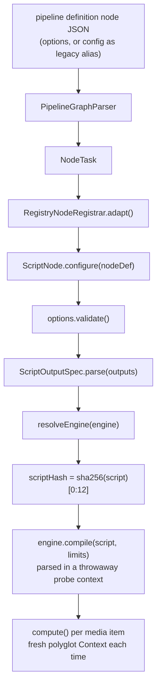
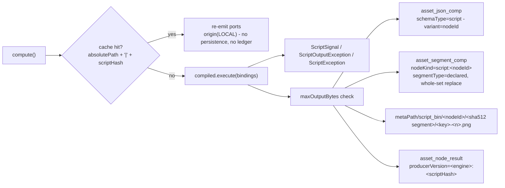

# Script Node (`script`) — User-Supplied Code as a Pipeline Step

> **Status**: 🟢 **Built and shipping.** Kind `script`, module
> [cortex/nodes/script/](../../../../cortex/nodes/script/) (artifactId `cortex-script-node`), package
> `io.metaloom.cortex.node.script`. JavaScript on **GraalJS / GraalVM polyglot 25.0.0**, in-process,
> no sidecar. 50 unit tests + 2 integration tests, plus the seam and resolver tests in §11.
> Contract in the generated `node-descriptors.json`, kept honest by `NodeSpecGoldenTest`.
> **Scope**: the `script` node, its engine SPI, the script-facing binding contract, the sandbox and
> the resource envelope — from the pipeline definition's `script` string to the
> `asset_json_comp` row and the `script_bin` directory.
> **Audience**: AI coding agents and humans working on
> [cortex/nodes/script/](../../../../cortex/nodes/script/).

**Out of scope, and where it lives instead:**

| Not here | There |
|---|---|
| The node system, lifecycle, registration, caching layers | [../NODES.md](../NODES.md) |
| Port content types and cardinality across all nodes | [../NODE_DATA_TYPES.md](../NODE_DATA_TYPES.md) |
| The engine that schedules nodes, and true item fan-out | [../../pipeline/PIPELINE.md](../../pipeline/PIPELINE.md) |
| Rules for adding a node at all | [../../../guidelines/NEW_NODE.md](../../../guidelines/NEW_NODE.md) |
| Who may author a pipeline definition (`MANAGE_PIPELINE`) | [../../permissions/PERMISSIONS.md](../../permissions/PERMISSIONS.md) |
| Worker configuration layering and the YAML gap | [../../../cortex/CONFIGURATION.md](../../../cortex/CONFIGURATION.md) |
| Getting produced bytes off the worker | `s3-sink`, [../../rest/REST_BINARY_HANDLING.md](../../rest/REST_BINARY_HANDLING.md) |
| A Java node with a model, a native library or a GPU | [../../../guidelines/NEW_NODE.md](../../../guidelines/NEW_NODE.md) — that is still a Maven module |

---

## 0. Executive Summary

| Question | Short answer |
|---|---|
| **What does it do?** | Runs a JavaScript body the pipeline author wrote, once per media item, and emits the outputs that body's node instance **declared** |
| **Why does it exist?** | The node catalogue is a closed set of compiled kinds. Glue smaller than a Maven module — a threshold, chapter marks from a transcript, reshaping an LLM answer — had no home |
| **Where does the script live?** | Inline in the pipeline definition, so it is versioned with the pipeline. There is no `script` entity in Loom |
| **What can a script reach?** | Six bindings and nothing else: `media`, `data`, `params`, `out`, `log`, `ctx` (§5) |
| **Is it sandboxed?** | **Not by default.** `trusted = true` builds a context with `allowAllAccess(true)`. `trusted = false` is a real capability sandbox (§6) |
| **What is always enforced?** | Wall-clock `timeoutMs`, `statementLimit`, `maxLogLines`, and `maxOutputBytes` over the JSON payload — in **both** trust modes |
| **What is not enforced?** | **Memory.** And `allowNetwork` / `allowFilesystem` are dead options (§6.3) |
| **How are output handles drawn before it runs?** | `dynamicPorts = true` plus `ScriptPortResolver`, which reads the same `outputs` option the node parses (§4) |

```
media : media/*     ONE opt  ──▶                 ──▶ declared key : scalar/string   ONE
data  : struct/json ONE opt  ──▶  script         ──▶ declared key : text/plain      ONE | MANY
text  : text/*      ONE opt  ──▶                 ──▶ declared key : struct/segments ONE
                                                 ──▶ declared key : artifact/image  ONE | MANY
                                                 ──▶ ... one port per `outputs` entry
```

---

## 1. Why the node exists, and what it deliberately is not

Every other node encodes one fixed capability. This one encodes none. `ScriptNode`'s own javadoc puts
the case: a piece of glue "does not require a new Maven module and a Cortex release".

Three things it is **not**, and they are settled:

* **Not item fan-out.** A script emits many *values* across many *ports* from one item. Turning one
  media item into *N* downstream pipeline items is a `PipelineRunEngine` / `RunStateStore` change and
  belongs in [../../pipeline/PIPELINE.md](../../pipeline/PIPELINE.md), never smuggled in behind a node.
  A `MANY` declaration is the closest thing available: it emits one element per list entry, so a
  downstream `ONE` input runs once per element.
* **Not a plugin system.** A node needing a model, a native library or a GPU stays a Java node with a
  sidecar. `examples/cortex-custom-node/` already covers "I want Java".
* **Not untrusted multi-tenant execution.** Permission to edit a pipeline is permission to run code on
  a worker (§6).

---

## 2. Lifecycle: configure once, execute many

`ScriptNode` implements `io.metaloom.cortex.common.node.PipelineConfigurable`, the per-node-instance
configuration seam invoked from `RegistryNodeRegistrar.adapt()` (`wrapped instanceof PipelineConfigurable`).



`configure(JsonObject nodeDef)` reads `id`, `engine`, `script`, `outputs`, `params`, `trusted`,
`allowNetwork`, `allowFilesystem`, `timeoutMs`, `statementLimit`, `maxOutputBytes`, `maxLogLines` —
each only if the key is present, so the worker's YAML defaults survive an unset field.

Two properties follow, and both are load-bearing:

* **Compilation happens in `configure`, never in `compute`.** A run processes many items with one
  script; a per-item compile turns a 2 ms script into a 200 ms one. It also means a syntax error fails
  the task once with a clear message rather than identically for every file. `GraalJsScriptEngine.compile`
  parses in a throwaway probe `Context`, because building a `Source` does not parse it — GraalJS parses
  lazily on first eval.
* **`isProcessable` returns false when `compiled == null`.** An unconfigured script node has nothing to
  run, so it reports `SKIPPED` rather than succeeding silently.

### 2.1 🟢 A fresh polyglot `Context` per execution, a fresh node per task

Reusing one `Context` across media items would be faster, but a script could stash state in a global
and leak it from one asset to the next. `GraalJsCompiledScript.execute` builds and closes a context per
run; the `Source` is parsed once, so the repeated cost is context setup, not parsing.

At the Dagger level the same rule applies one level up: **`ScriptNode` must never be `@Singleton`**,
because `configure(...)` mutates it. The kind map holds a `Provider`, which yields a fresh node per
task. Pinned by `ScriptNodeTest.shouldGiveEachProviderCallItsOwnInstance` (which also asserts the
annotation's absence reflectively) and by
`PipelineConfigurableTest.testTwoScriptNodesGetIndependentInstances`.

---

## 3. Ports

Three static inputs, all optional, all `ONE`. No static outputs at all.

| Port | Content type | Card. | Notes |
|---|---|---|---|
| `media` | `media/*` | ONE | The item the script runs over. Leave unwired for a script that only reshapes upstream data |
| `data` | `struct/json` | ONE | Decoded field by field into the `data` binding |
| `text` | `text/*` | ONE | Arrives as `data.text`, added with `putIfAbsent` so a genuine `text` field of the JSON payload wins |
| *(outputs)* | — | — | None declared. `dynamicPorts = true`; §4 |

**There is no `requiredInputs` option.** It existed and was removed: `data` is an optional port, so
"skip when the input is missing" is now expressed by the graph plus the script's own `ctx.skip()`.
`ScriptNodeTest.shouldSkipWhenARequiredInputIsMissing` documents the replacement idiom.

---

## 4. Declared outputs

Outputs are **configuration, not discovery**. The editor has to draw handles and validate edges before
the script has ever run; a node whose ports only existed after execution would be unconnectable.

`outputs` is a JSON array of `{"key": ..., "type": ..., "segmentType"?: ...}`. Keys must match
`^[a-z0-9][a-z0-9_]{0,62}$` — they *are* port ids.

| Type | Content type | Cardinality | Where the value lands |
|---|---|---|---|
| `STRING` | `scalar/string` | ONE | JSON comp field |
| `TEXT` | `text/plain` | ONE | JSON comp field |
| `INTEGER` | `scalar/integer` | ONE | JSON comp field |
| `NUMBER` | `scalar/number` | ONE | JSON comp field |
| `BOOLEAN` | `scalar/boolean` | ONE | JSON comp field |
| `JSON` | `struct/json` | ONE | JSON comp field |
| `TEXT_LIST` | `text/plain` | **MANY** | JSON comp field |
| `TIMEFRAMES` | `struct/segments` | ONE | `asset_segment_comp` rows under the declared `segmentType` |
| `IMAGE` | `artifact/image` | ONE | Bytes → `script_bin`; only the path is emitted, ledger only |
| `IMAGE_LIST` | `artifact/image` | **MANY** | Bytes → `script_bin`; ledger only |
| `PATH` | `artifact/file` | ONE | JSON comp field |

Three states, and the third is the point:

* **Declared and set** → coerced to the declared type, validated, emitted.
* **Declared and not set** → omitted. Downstream sees nothing; that is normal.
* **Not declared but set** → **hard failure**, `ScriptOutputException`, the node aborts. A silently
  dropped typo would make the drawn graph lie about what flows down an edge.

Setting a declared key to `null` is also an error — "omit the call instead to leave it unset".

### 4.1 🟡 The type table exists three times and nothing compares them

| Copy | File |
|---|---|
| Cortex (`ScriptValueType`) | `cortex/nodes/script/core/.../script/ScriptValueType.java` |
| Editor-side Java (`ScriptPortResolver.ScriptOutputType`, package-private) | `loom-shared/node-model/.../spec/ScriptPortResolver.java` |
| TypeScript (`SCRIPT_OUTPUT_TYPES`) | `loom-ui/src/features/pipeline/portResolvers.ts` |

They are hand-mirrored on purpose — `cortex/nodes/script` depends on `node-model`, not the other way
round — and they currently agree. Nothing mechanically enforces that. Both Java files' javadoc still
points at a conformance test to keep them in step — `ScriptValueType` names `NodePortConformanceTest`,
`ScriptPortResolver` says "the conformance test in `integration-test/`" without naming it — and
**that test no longer exists** (removed with the hand-written descriptor providers in the `d9bbc2dc`
refactor — see [../NODES.md](../NODES.md) §5.2). `NodeSpecGoldenTest`'s javadoc claims to subsume it,
but it only diffs the harvested descriptor against the committed resource; it never looks at either
type table (the `script` descriptor's `outputPorts` is `[]`, since the ports are dynamic).
`portResolvers.test.ts` restates the Java expectations by hand rather than consuming a generated
fixture. Tracked in §10.

### 4.2 `ScriptPortResolver` must never throw

It runs inside the editor's port resolution over half-typed JSON. A malformed entry, an unknown type
name, a duplicate key or a key failing `PortSpec.ID_PATTERN` is **skipped**, never fatal — a resolver
that threw would take out the whole descriptor listing. It is registered in
`META-INF/services/io.metaloom.loom.nodes.spec.NodePortResolver` alongside `FilterPortResolver`,
`LlmPortResolver` and `VlmPortResolver`; a kind with `dynamicPorts = true` and no resolver draws no
output handles at all.

---

## 5. The script-facing binding contract

This is the **public API of the node**. Pipeline authors write against it, so change it only additively.
Installed in `GraalJsCompiledScript.install(...)` — these six members are the entire surface.

| Binding | Shape |
|---|---|
| `media` | `{ path, absolutePath, isVideo, isImage, isAudio, isDocument, size, sha512 }` — a flattened read-only snapshot, **not** the `LoomMedia` handle (which would expose `file()` / `open()` and defeat the sandbox). `size` and `sha512` are read defensively; a vanished file yields `-1` / `null` rather than a stack trace |
| `data` | The decoded `struct/json` input, plus `data.text` from the `text` port |
| `params` | Free-form JSON object from the `params` option, so one script serves several node instances |
| `out` | `out.set` `out.text` `out.string` `out.integer` `out.number` `out.bool` `out.json` `out.list` `out.timeframes` `out.image` `out.path` — the **only** way to produce results |
| `log` | `log.info/warn/error(msg)` → node logger, prefixed `[<nodeId>]`, capped at `maxLogLines` |
| `ctx` | `ctx.skip(reason)` → `SKIPPED`, `ctx.fail(reason)` → `FAILED`; both stop the script immediately |

> 🔵 **`media` carries no `mimeType`.** Use the `isVideo` / `isImage` / `isAudio` / `isDocument` flags.

Notes that bite:

* **The typed `out.*` helpers check the declaration.** `out.timeframes(k, v)` on a `TEXT` output fails
  naming both types, rather than producing a confusing coercion error. `out.set(k, v)` skips that check
  and coerces to whatever was declared.
* **Whole numbers stay whole.** `fromGuest` returns a `Long` when a JS number fits one, so `3` does not
  surface as `"3.0"` in a text output.
* **Host maps and lists are wrapped in `ProxyObject` / `ProxyArray`**, never handed over raw — a raw
  `java.util.Map` would expose its whole Java API the moment host access widened.
* **`ctx.skip` / `ctx.fail` throw a `ScriptSignal`**, which arrives wrapped in a `PolyglotException` and
  is unwrapped in `translate(...)`. Without that unwrapping, `ctx.skip()` would surface as a failure
  with a JavaScript stack attached.
* **`out.image` accepts raw bytes, a base64 string, or a path.** A path is passed through untouched.

---

## 6. Trust, sandbox and the resource envelope

> 🟡 **Permission to edit a pipeline is permission to execute code on a worker.** That is the honest
> statement of the model, and it is what the customer-facing page says. `MANAGE_PIPELINE`
> ([../../permissions/PERMISSIONS.md](../../permissions/PERMISSIONS.md)) is the gate; the operational
> kill switch is `CORTEX_NODE_BLACKLIST=script`, and Loom rejects a run with **503** when no online
> worker accepts a kind in the graph, so a fleet-wide blacklist produces a clear error rather than a
> stalled run.

### 6.1 What the two trust modes actually build

`GraalJsCompiledScript.newContext()` — this is the whole of it, and there is nothing else.

| | `trusted = true` (**the default**) | `trusted = false` |
|---|---|---|
| Host access | `allowAllAccess(true)` | `HostAccess.EXPLICIT` |
| Class lookup | unrestricted (`Java.type('java.lang.System')` works) | `allowHostClassLookup(c -> false)` |
| I/O | unrestricted | `allowIO(null)` |
| Threads | allowed | `allowCreateThread(false)` |
| Processes | allowed | `allowCreateProcess(false)` |
| Native access | allowed | `allowNativeAccess(false)` |
| Environment | readable | `EnvironmentAccess.NONE` |

`HostAccess.EXPLICIT` means only `@HostAccess`-annotated members are reachable, and the bindings
annotate none — so the six installed proxies are the entire surface in sandboxed mode.
`ScriptNodeTest.shouldDenyHostClassLookupWhenNotTrusted` and `shouldAllowHostAccessWhenTrusted` pin
both halves.

The default is `true` deliberately: scripts are authored by whoever may already edit a pipeline, so
defaulting to a sandbox would add friction without adding a trust boundary. Set it false for defence
in depth.

### 6.2 What is enforced in **both** modes

A trusted script is trusted not to be malicious; it is not trusted to be free of infinite loops.

| Guard | Where | Reality |
|---|---|---|
| `statementLimit` | `ResourceLimits.newBuilder().statementLimit(...)`, applied before the trust branch | Deterministic tight-loop guard, and portable — unlike CPU-time limits it works on the fallback interpreter |
| `timeoutMs` watchdog | One shared daemon thread `script-node-watchdog`; fires `context.close(true)` | Catches what the statement counter cannot, including a script blocked in a host call. `close(true)` interrupts the guest thread; a plain close would block on it |
| `maxLogLines` | `ScriptLogger` | One final "budget exhausted" line, then further calls are dropped |
| `maxOutputBytes` | `ScriptNode.compute`, after execution | See the caveat below |
| Media handle withheld | `ScriptBindings.snapshot(...)` | The script never receives `LoomMedia`, in either mode |

> 🟡 **`maxOutputBytes` covers less than its name suggests.** It is measured on
> `toJsonPayload(values).encode()` — the JSON-component subset, which by construction **excludes
> `TIMEFRAMES` and both image types**. A script emitting a huge timeframe list is not capped by it. It
> is also a post-hoc check: the script has already finished and the bytes are already in heap when it
> fires.

> 🟡 **Memory is not bounded, and this must not be claimed otherwise.** Heap and CPU-time
> `ResourceLimits` need the optimized Truffle runtime, which a stock JDK does not provide.
> `statementLimit` and the wall clock are the only runtime guards.

### 6.3 🟡 `allowNetwork` and `allowFilesystem` are dead options

They exist on `ScriptNodeOptions`, are read by `configure(...)`, are threaded into the `ScriptLimits`
record, are documented on that record as "expose the `http` binding" / "expose the read-only `fs`
binding", and are **rendered as editable checkboxes in the pipeline editor** via the generated
descriptor.

Nothing reads them. `newContext()` never consults `limits.allowNetwork()` or
`limits.allowFilesystem()`, and `install()` installs only `media`, `data`, `params`, `out`, `log`,
`ctx`. A script asking for `http` or `fs` gets `undefined` — and a *trusted* script reaches the network
and the filesystem anyway through `allowAllAccess(true)`, with both toggles off. The controls are
therefore misleading in both directions. Tracked in §10.

### 6.4 Why GraalJS, and why one engine

`SecurityManager` was removed in JDK 24, so every JVM-native scripting language can only be constrained
by a best-effort AST allow-list. GraalJS's `Context.Builder` is an actual capability model. The
`ScriptEngine` SPI exists as insurance, not as a queue: a second engine whose sandbox did not hold
would make the `trusted` switch mean different things per engine. GraalPy (startup + memory),
expression languages (cannot express the output model), in-memory Java (no isolation) and WASM (wrong
ergonomics for six lines of glue) were surveyed and rejected.

---

## 7. Options

Config key `script`. Set **per pipeline-node instance**; the worker's YAML `nodes.script` block supplies
defaults the definition layers over. ⚠️ The YAML layer is not read on the server path — see
[../../../cortex/CONFIGURATION.md](../../../cortex/CONFIGURATION.md).

| Option | Type | Default | Notes |
|---|---|---|---|
| `engine` | `STRING` | `js` | Engine id. Must exist in the `Map<String, Provider<ScriptEngine>>` |
| `script` | `CODE` (`language=javascript`, `rows=16`) | — | The script body. **Required.** The advertised `defaultValue` is a runnable example, so a new node opens with something that works |
| `outputs` | `JSON` (`rows=6`) | `[]` | Declared outputs, §4. Must have at least one entry |
| `params` | `JSON` (`rows=4`) | `{}` | Constants handed to the script as `params` |
| `trusted` | `BOOLEAN` | `true` | §6.1 |
| `allowNetwork` | `BOOLEAN` | `false` | **Inert**, §6.3 |
| `allowFilesystem` | `BOOLEAN` | `false` | **Inert**, §6.3 |
| `timeoutMs` | `INTEGER` | `10000` | Wall-clock budget per item. Inherited from `AbstractNodeOptions` (which defaults to `0` = no timeout); re-defaulted here and `0` is **rejected**. Re-documented in the descriptor via `@ParamOverride`, because the inherited field is hidden by default |
| `statementLimit` | `INTEGER` | `10000000` | Guest-statement budget |
| `maxOutputBytes` | `INTEGER` | `1048576` | Cap on the encoded JSON payload, §6.2 |
| `maxLogLines` | `INTEGER` | `200` | Cap on `log.*` calls per item. `0` is legal |
| `enabled` / `processIncomplete` / `retryFailed` | `BOOLEAN` | `true`/`false`/`false` | Standard, from `AbstractNodeOptions` |

`validate()` rejects: a blank `engine`, a blank `script`, an empty `outputs`, and anything
`ScriptOutputSpec.parse` rejects (a non-object entry, a malformed key, an unknown type, a duplicate key,
a `segmentType` the database would not accept, two `TIMEFRAMES` outputs sharing a segment type), plus
non-positive `timeoutMs` / `statementLimit` / `maxOutputBytes` and a negative `maxLogLines`.

> 🔵 **A `segmentType` on a non-`TIMEFRAMES` output is *not* rejected through this path.** The
> `ScriptOutputSpec` constructor throws for it, but `parse(JsonArray)` only reads the `segmentType`
> field when the entry's type is `TIMEFRAMES`, so from the `outputs` option it is silently dropped.
> `ScriptOptionsValidationTest.shouldRejectASegmentTypeOnANonTimeframeOutput` asserts both halves.

> 🔵 **An unknown engine id is not a `validate()` error.** It surfaces from `resolveEngine(...)` during
> `configure(...)` as an `IllegalStateException` listing the available ids —
> `ScriptNodeTest.shouldRejectAnUnknownEngine`. A syntax error surfaces the same way, from `compile`.

### Environment variables

The node introduces none. These existing ones are what matter to it:

| Variable | Default | Relevance to `script` |
|---|---|---|
| `CORTEX_META_PATH` | — | Parent of `script_bin/`, where `IMAGE` / `IMAGE_LIST` bytes are written |
| `CORTEX_NODE_BLACKLIST` | — | A worker refuses the kind outright — **the operational kill switch**; blacklist beats whitelist |
| `CORTEX_NODE_WHITELIST` | all registered kinds | Omit `script` to confine scripting to dedicated workers |
| `CORTEX_CONF_FILENAME` | `cortex.yml` | A `nodes.script` block gives worker-level defaults |

---

## 8. Execution and persistence



Persistence is guarded by `asset != null && client() != null`, so an offline run is a clean no-op, and
it is best-effort: a failure is logged and recorded as a `FAILED` ledger row, never thrown.

Three things the schema forced on the design, all load-bearing:

1. **`segmentType` cannot be the output key.** `asset_segment_comp` CHECK-constrains `segment_type` to
   `SCENE | SILENCE | SHOT | CHAPTER` (migration `V2.42`), so an arbitrary key is rejected by the
   database as a 500, not at compile time. A `TIMEFRAMES` output declares its own `segmentType`
   (default `CHAPTER`), validated up front.
2. **Segment rows are scoped `script:<nodeId>`.** The replace-set key is
   `(asset, node_kind, segment_type)`; under a plain `script` kind a second script node writing
   CHAPTER marks would delete the first node's. The JSON component and the ledger still use the plain
   `script` kind — only the segment rows carry the scoped one. Segment `producerVersion` is
   `<engine>:<hash>;unit=ms`, because `SegmentEntry`'s bounds are unit-agnostic
   (`SceneDetectionNode` stores frame indices in them) and a script declares milliseconds.
3. **`timeoutMs` is the inherited option, not a new one** — re-defaulted to 10 s with `0` rejected,
   because a script node must never run unbounded.

> 🟢 **The ledger row is scoped per node instance** (fixed 2026-08-20). `ScriptNode.nodeId()`
> returns the configured instance id, so two script nodes on one asset write two
> `asset_node_result` rows instead of the second silently overwriting the first on the
> `(asset_uuid, node_kind, node_id)` upsert key. The JSON component was never affected — it keys on
> `variant = nodeId` — which is exactly why the collision went unnoticed;
> `ScriptNodeIntegrationTest.testTwoScriptNodesCoexistOnOneAsset` now asserts the ledger half too.

**No Flyway migration was needed**, so `./setup-pool.sh` is only the normal pre-test step.

### 8.1 The producer version is a per-script version

`producerVersion = "<engineId>:<sha256(script)[0:12]>"`. A changed script is visibly a different
producer in the ledger — the per-producer versioning [../NODES.md](../NODES.md) §10 lists as missing
everywhere else in the node system.

### 8.2 Result states

| Outcome | State | Path |
|---|---|---|
| Values emitted | `SUCCESS` | `ctx.origin(COMPUTED).next()`, after `persist(...)` |
| Cache hit | `SUCCESS` | `ctx.origin(LOCAL).next()` — ports re-emitted, **nothing persisted** |
| Not enabled, or never configured | `SKIPPED` | `isProcessable` returns false |
| `ctx.skip(reason)` | `SKIPPED` | `ctx.skipped(msg).next()` |
| `ctx.fail(reason)` | `FAILED` | ledger row, then `ctx.failure(msg).abort()` |
| Undeclared key, coercion failure, guest error | `FAILED` | ledger row, then `.abort()` |
| Payload over `maxOutputBytes` | `FAILED` | ledger row, then `.abort()` |

---

## 9. Key Classes Reference

| Class | Package / module | Purpose |
|---|---|---|
| `ScriptNode` | `io.metaloom.cortex.node.script` (cortex/nodes/script) | The node. `AbstractMediaNode<ScriptNodeOptions>` + `PipelineConfigurable`; `KIND`, `SCHEMA_TYPE`, `BIN_DIR`, input ports, cache key, persistence |
| `ScriptNodeOptions` | same | `KEY = "script"`, the twelve options, `validate()` (§7) |
| `ScriptNodeModule` | same | Dagger `@Binds @IntoSet`, `@Binds @IntoMap @StringKey("script")`, the `js` engine binding, `CortexNodeOptionDeserializerInfo` |
| `ScriptValueType` | same | The 11 declared types: content type, cardinality, `binary`, `isJsonPayload()`, `parse()` |
| `ScriptOutputSpec` | same | `record(key, type, segmentType)`; `KEY_PATTERN`, `SEGMENT_TYPES`, `parse(JsonArray)`, `port()` |
| `ScriptEngine` / `CompiledScript` | `…node.script.engine` | Engine SPI (+ `ScriptException`, `ScriptOutputException`) |
| `ScriptBindings` | same | The engine-agnostic carrier; flattens `LoomMedia` into a snapshot map |
| `ScriptOutputCollector` | same | The `out` binding: declaration check, coercion, `BinarySink` for image bytes |
| `ScriptLogger` / `ScriptSignal` / `ScriptLimits` | same | Log cap, skip/fail signals, the resource envelope record |
| `GraalJsScriptEngine` | `…node.script.engine.js` | `ID = "js"`, `@Singleton`; parses in a probe context so syntax errors surface at configure time |
| `GraalJsCompiledScript` | same | Context construction, the sandbox, the watchdog, binding installation, guest/host value conversion |
| `PipelineConfigurable` | `io.metaloom.cortex.common.node` | The per-instance configuration seam |
| `RegistryNodeRegistrar` | `io.metaloom.cortex.cli.dagger` | `adapt()` — where the seam is invoked |
| `LocalResultCache` | `io.metaloom.cortex.common.cache` | **reused** — 10 000-entry in-heap skip cache |
| `ScriptPortResolver` | `io.metaloom.loom.nodes.spec` (loom-shared/node-model) | Dynamic output ports from the `outputs` option; never throws |
| `PipelineGraphParser` | `io.metaloom.loom.pipeline.graph` | Reads `options`, falling back to `config` as a legacy alias |
| `portResolvers.ts` | `loom-ui/src/features/pipeline` | The TypeScript mirror the editor draws handles from |
| `JsonCompCreateRequest` / `SegmentCompCreateRequest` | `io.metaloom.loom.rest.model.*` | The two persistence payloads |

---

## 10. Progress Assessment

### Done

- [x] Module, node, options + `validate()`, Dagger `@IntoSet` + `@IntoMap @StringKey("script")`, included from `cortex/cli/.../dagger/NodeCollectionModule.java`
- [x] Non-singleton proven reflectively and behaviourally (`ScriptNodeTest`, `PipelineConfigurableTest`)
- [x] `ScriptEngine` SPI + `@IntoMap @StringKey("js")` engine registry; polyglot + `js-community` **25.0.0** pinned in `core/pom.xml` and verified on a stock JDK 25
- [x] Bindings `media` / `data` / `params` / `out` / `log` / `ctx`; compile in `configure(...)`, fresh `Context` per item
- [x] Declared-output coercion for all 11 types; undeclared key and `null` value are hard failures
- [x] Three static optional inputs + **dynamic output ports** from the `outputs` option, with `TEXT_LIST` / `IMAGE_LIST` → `MANY`
- [x] `ScriptPortResolver` registered via ServiceLoader, plus the TypeScript mirror and its vitest contract test
- [x] Persistence: `asset_json_comp` (`variant = nodeId`), `asset_segment_comp` per `TIMEFRAMES` scoped `script:<nodeId>`, `script_bin` bytes, ledger with the script-digest producer version
- [x] `LocalResultCache` keyed by path **and** script hash
- [x] `trusted = false` sandbox: `HostAccess.EXPLICIT`, no class lookup, no IO, no threads, no processes, no native access, no environment
- [x] Watchdog (`Context.close(true)`) + `ResourceLimits.statementLimit` in both trust modes, both verified by running
- [x] `.abort()` on failure, never `.next()`
- [x] `requiredInputs` retired in favour of the optional `data` port + `ctx.skip()`
- [x] Options path end to end: editor emits `options`, `PipelineGraphParser` accepts `config` as a legacy alias, `PipelineConfigurable` invoked from `RegistryNodeRegistrar.adapt()`, `ParameterType.CODE` + `JSON` rendered
- [x] Descriptor generated from `@NodeSpec` / `@PortDoc` / `@ParamDoc`, pinned by `NodeSpecGoldenTest`
- [x] Customer page `website/content/english/docs/nodes/script/` with `nodeviz`, `config.png` and `debug.png`; the documented bindings match the code
- [x] Demo pipeline **"Reading Time (Script)"** (`filesystem-source → tika → script`), whose seeded script body is executed by `ScriptNodeTest.shouldRunTheDemoReadingTimeScript`

### Open

- [ ] 🟡 **`allowNetwork` / `allowFilesystem` are inert but editable.** Both are carried, validated and
      rendered as descriptor checkboxes, and nothing reads them (§6.3). Either implement the `http` /
      `fs` bindings behind them, or remove them from the options and the descriptor. Leaving a security
      control that does nothing on the node's configuration form is the worst of the three states.
- [x] 🟢 **`nodeId()` override — fixed 2026-08-20.** `ScriptNode.nodeId()` returns the configured
      instance id, and `ScriptNodeIntegrationTest.testTwoScriptNodesCoexistOnOneAsset` asserts two
      ledger rows beside the two JSON comps (§8).
- [ ] 🟡 **`maxOutputBytes` does not cover `TIMEFRAMES` or image outputs** (§6.2), and is checked only
      after the script has already built the bag in heap. Either cap the whole collected bag, or rename
      the option to say what it measures.
- [ ] 🟡 **Memory is unbounded.** No heap `ResourceLimits` on a stock JDK. Do not claim a memory bound;
      if one is wanted it needs the optimized Truffle runtime or an out-of-process engine.
- [ ] **Nothing keeps the three copies of the output-type table in step** (§4.1). Generate the TS table
      from the Java enum, or add a test that diffs all three.
- [ ] **Stale javadoc pointing at deleted tests.** `ScriptValueType` cites `NodePortConformanceTest`
      and `ScriptPortResolver` cites "the conformance test in `integration-test/`" — neither exists
      any more; `ScriptNode` and `ScriptNodeModule` both cite a
      `ScriptNodeSingletonTest` that never existed — the real guards are
      `ScriptNodeTest.shouldGiveEachProviderCallItsOwnInstance` and
      `PipelineConfigurableTest.testTwoScriptNodesGetIndependentInstances`.
- [ ] **No metrics.** `ScriptNode` makes no `CortexMetrics` call, so its cache hits and execution times
      are invisible. `ImageGenNode` / `WhisperNode` are the instrumentation pattern.
- [ ] **No previews.** The node calls `ctx.print("DONE", n)` and never `ctx.preview(...)`, so a debug run
      shows no thumbnail for an `IMAGE` output and no rendering of a `TIMEFRAMES` result. `sam2` is the
      pattern.
- [ ] **No e2e coverage of the `CODE` parameter field.** Dynamic connectors are covered by
      `loom-ui/e2e/pipeline-ports-mocked.spec.ts`, but nothing exercises the script-body editor, and the
      parameter inputs in `PipelineEditor.tsx` carry no `data-testid` to hook onto.
- [ ] **The polyglot artifact-size cost was never measured.** `polyglot` + `js-community` is the largest
      dependency the worker takes on; record the shaded `cortex/cli` jar and container image delta.

### Deliberately not built

- [ ] **True item fan-out** — a `PipelineRunEngine` / `RunStateStore` change; specify it in
      [../../pipeline/PIPELINE.md](../../pipeline/PIPELINE.md), never behind a node. A `MANY` output port
      is the available approximation.
- [ ] **A Loom-stored, versioned script entity** — inline-in-the-definition was chosen so the script is
      versioned with the pipeline. Revisit if reuse across pipelines becomes real; the
      `skill` / `skill_version` pair is the model to copy.
- [ ] **A second engine** — the SPI is insurance, not a queue (§6.4).

---

## 11. Test Setup

```bash
# 50 unit tests, real GraalJS against a temp file, no Loom
mvn -T 8 -o test -pl cortex/nodes/script -am

# The per-instance configuration seam
mvn -o test -pl cortex/cli -Dtest=PipelineConfigurableTest

# The editor-side resolver
mvn -o test -pl loom-shared/node-model -Dtest=NodePortResolverTest

# The generated contract equals the annotated node
mvn -o test -pl integration-test -Dtest=NodeSpecGoldenTest

# End to end against an in-process Loom + pooled Postgres
./setup-pool.sh
mvn -o test -pl integration-test -Dtest=ScriptNodeIntegrationTest

# The TypeScript mirror and the editor's dynamic handles
cd loom-ui && ./node_modules/.bin/vitest run src/features/pipeline/portResolvers.test.ts
cd loom-ui && npm run test:e2e -- pipeline-ports-mocked
```

| Test | What it guards against |
|---|---|
| `ScriptNodeTest` (23) | An undeclared key silently dropped; a value coerced against its declaration; `ctx.skip` reported as a failure and `ctx.fail` as a success; an infinite loop surviving `timeoutMs` or `statementLimit`; `Java.type` reachable at `trusted=false` (and unreachable at `trusted=true`); a syntax error surfacing per item instead of at configure time; an edited script served from the cache; the producer version losing the script digest; image bytes not reaching `script_bin`; an unconfigured node reporting success; two `Provider.get()` calls sharing one instance; the demo "Reading Time" script breaking |
| `ScriptOptionsValidationTest` (15) | Every malformed declaration surfacing per item instead of at pipeline start; `timeoutMs` falling back to the inherited `0`; a `segmentType` the database would reject; two timeframe outputs wiping each other; a `ScriptValueType` added without a parser or a content type |
| `ScriptNodePipelineTest` (7) | Adapter integration, completion and tracking events, output chaining, the media facade inside a real DAG, disabled + dry-run skip |
| `ScriptNodePersistenceTest` (5) | The JSON comp losing its `variant`; segment comps missing per `TIMEFRAMES` key; a JSON comp written when every output has its own landing zone; no `FAILED` ledger row when the script fails; images persisted beyond the ledger. ⚠️ Do **not** pass a null client — that silently skips all write-back coverage |
| `ScriptNodeIntegrationTest` (2) | The JSON comp, segment comps and ledger row not reaching Postgres; two script nodes on one asset overwriting each other's **JSON component** — it asserts one comp per `variant` and says nothing about the ledger, which does collide (§8) |
| `PipelineConfigurableTest` | Options not surviving editor JSON → `PipelineGraphParser` (incl. the `config` alias) → `NodeTask` → `configure(...)`; the kind not being executable; two instances sharing a script; an invalid or script-less definition being accepted |
| `NodePortResolverTest` / `portResolvers.test.ts` | Java and TS disagreeing on the 11 output types or the `MANY` cardinalities; raw-JSON options, case-insensitivity and graceful degradation |
| `pipeline-ports-mocked.spec.ts` | A script's handles not coming from its `outputs` option, `data-cardinality=MANY` missing for `TEXT_LIST`, the option not surviving a save |
| `NodeSpecGoldenTest` | The committed `node-descriptors.json` drifting from the annotated node — **regenerate it after touching any `@ParamDoc` or `@PortDoc`** |

**Manual E2E** (nothing substitutes for it): `./start-demo.sh`, build a `filesystem-source → tika →
script` pipeline in the editor, run it, confirm the outputs land on the asset.

---

## 12. Conventions and Gotchas

| Area | Gotcha |
|---|---|
| **The cache key must include the script** | Every other node keys `LocalResultCache` by `media.absolutePath()`. This one keys `absolutePath + "\|" + scriptHash`; without it, editing a script re-emits stale results for the worker's lifetime with no invalidation short of a restart |
| **A cache hit persists nothing** | It re-emits the ports and returns `origin(LOCAL)`. No JSON comp, no segment rows, no ledger entry — a second run over the same file in the same worker leaves no trace |
| **`ScriptNode` must never be `@Singleton`** | `configure(...)` mutates it. `NodeTaskRunner` creates one per task via `Provider.get()`; a singleton would let two concurrent script nodes overwrite each other's script |
| **`PipelineNode.timeoutMs()` is enforced by nothing** | It is parsed by `adapt()`, stored on `AbstractPipelineNode`, and never read back. That is why `configure(...)` reads the same `timeoutMs` key into the node's own option — the node owns its wall clock |
| **`ctx.failure(cause).next()` returns SUCCESS** | Only `.abort()` reads `failureCause`. Every failure test written against `.next()` passes while asserting the wrong thing. This node uses `.abort()`; nineteen others still do not ([../NODES.md](../NODES.md) §10) |
| **`nodeId()` is overridden** | 🟢 Since 2026-08-20 the private `nodeId` field reaches all three sinks: the JSON comp's `variant`, the segment kind *and* the ledger's `node_id` — two script nodes keep two `asset_node_result` rows (§8) |
| **Compile once, execute many** | Compile in `configure(...)`, never in `compute(...)` |
| **Undeclared output = hard failure** | Deliberate: a silently dropped typo would make the graph lie about what flows down an edge |
| **`out.image` bytes stay on the worker** | There is no Loom byte-ingest endpoint for produced media. Downstream consumers get a **path meaningful only on that worker** — pin such graphs into one affinity group, or wire the port into `s3-sink`. See [../../rest/REST_BINARY_HANDLING.md](../../rest/REST_BINARY_HANDLING.md) |
| **`looksBase64` is a heuristic** | `text.length() > 256 && text.indexOf('/') < 0 \|\| text.endsWith("==")` parses as `(a && b) \|\| c`, so a *path* ending in `==` is decoded as base64 instead of passed through |
| **Segment outputs are whole-set replace** | Correct for re-runs (a shorter re-run deletes the surplus), but two `TIMEFRAMES` outputs must not share a `segmentType` — validation rejects that up front |
| **`data.text` uses `putIfAbsent`** | The `text` port is merged *after* the `data` payload, so a genuine `text` field in the wired JSON is not overwritten |
| **`SecurityManager` is unavailable** | Removed in JDK 24. Never propose a policy-file sandbox for any JVM engine |
| **GraalJS is interpreted here** | No Graal JIT on a stock JDK — Truffle fallback interpreter, with `engine.WarnInterpreterOnly=false` so the notice does not drown the worker log. Glue logic only; do not ship per-frame processing as a script |
| **`ScriptPortResolver` must never throw** | It runs over half-typed JSON in the editor. Malformed entries are skipped, and `parseOption` also tolerates the option being raw JSON *text*, which is how the parameter editor holds it |
| **`PipelineEditor.tsx` contains NUL bytes** | Plain `grep` finds nothing in it; use `grep -a` |
| **Regenerate the descriptor after an annotation change** | `mvn -o -pl integration-test test -Dtest=NodeSpecGoldenTest -Dloom.regenerateNodeDescriptors=true`, and install the node module first — a stale jar is harvested otherwise |

---

## 13. Where do I find …?

| Need | Path |
|---|---|
| The node and its input ports | [cortex/nodes/script/core/…/ScriptNode.java](../../../../cortex/nodes/script/core/src/main/java/io/metaloom/cortex/node/script/ScriptNode.java) |
| The options and `validate()` | `…/script/ScriptNodeOptions.java` |
| The output type table (cortex) | `…/script/ScriptValueType.java` · `ScriptOutputSpec.java` |
| The GraalJS context, sandbox and watchdog | `…/script/engine/js/GraalJsCompiledScript.java` |
| The installed bindings and the media snapshot | `…/script/engine/ScriptBindings.java` + `install()` in `GraalJsCompiledScript` |
| Output coercion and the image sink | `…/script/engine/ScriptOutputCollector.java` |
| The output type table (Java, editor side) | [loom-shared/node-model/…/ScriptPortResolver.java](../../../../loom-shared/node-model/src/main/java/io/metaloom/loom/nodes/spec/ScriptPortResolver.java) |
| The output type table (TypeScript) | `loom-ui/src/features/pipeline/portResolvers.ts` + `portResolvers.test.ts` |
| The committed descriptor contract | `loom-shared/node-model/src/main/resources/node-descriptors.json` |
| The resolver ServiceLoader registration | `loom-shared/node-model/src/main/resources/META-INF/services/io.metaloom.loom.nodes.spec.NodePortResolver` |
| Where the kind becomes executable | `ScriptNodeModule` (`@StringKey`) + `cortex/cli/.../dagger/NodeCollectionModule.java` |
| Where per-instance options reach the node | `RegistryNodeRegistrar.adapt()` → `PipelineConfigurable.configure(...)` |
| Where node options are parsed on the Loom side | `loom/pipeline/.../graph/PipelineGraphParser.java` |
| The tests | `cortex/nodes/script/core/src/test/…` · `integration-test/.../node/ScriptNodeIntegrationTest.java` |
| The docs fixture recipe | `integration-test/.../node/docs/DocsFixtureGenerator.java` |
| The demo pipeline and its script body | `loom/core/.../core/boot/DemoDatabaseInitializer.java` (`DEMO_PIPELINE_SCRIPT`, `scriptDefinition()`) |
| The customer page | [website/content/english/docs/nodes/script/index.adoc](../../../../website/content/english/docs/nodes/script/index.adoc) |
| The pipeline editor | `loom-ui/src/features/pipeline/PipelineEditor.tsx` (⚠️ `grep -a`) |
| The kill switch | [../NODES.md](../NODES.md) §11, `CORTEX_NODE_BLACKLIST` |
| A reference node to copy for options + JSON comp | `cortex/nodes/sentiment/` |
| A node that writes timeframes / produced bytes | `cortex/nodes/scene-detection/` · `cortex/nodes/image-generation/` |
| The node system as a whole | [../NODES.md](../NODES.md) |
| The port/content-type model | [../NODE_DATA_TYPES.md](../NODE_DATA_TYPES.md) |
| Rules for building the next node | [../../../guidelines/NEW_NODE.md](../../../guidelines/NEW_NODE.md) |

---

_Git HEAD revision: `8c153347`_
_Last updated: 2026-08-11_
