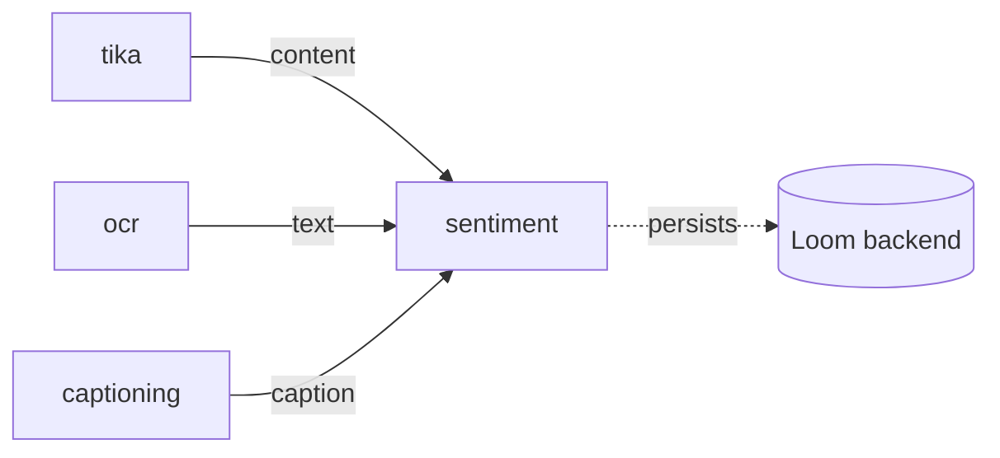

# Sentiment Node (`sentiment`) — Polarity Scoring for Upstream Text

> **Status**: 🟢 **Built and shipping.** Kind `sentiment`, module
> [cortex/nodes/sentiment/](../../../../cortex/nodes/sentiment/), package
> `io.metaloom.cortex.node.sentiment`. 25 unit tests + 1 integration test; classification runs in the
> FastAPI sidecar [sidecars/sentiment/](../../../../sidecars/sentiment/) on port 9110. Contract in the
> generated `node-descriptors.json`, kept honest by `NodeSpecGoldenTest`.
> **Scope**: the `sentiment` node — the `text` port, the sidecar call, the three outputs, the
> `asset_json_comp` row and the ledger entry.
> **Audience**: AI coding agents and humans working on
> [cortex/nodes/sentiment/](../../../../cortex/nodes/sentiment/).

**Out of scope, and where it lives instead:**

| Not here | There |
|---|---|
| The Python process: HTTP contract, chunking internals, label aliases, deployment | [../../../sidecars/SENTIMENT_SIDECAR.md](../../../sidecars/SENTIMENT_SIDECAR.md) |
| The node system, lifecycle, registration, caching layers | [../NODES.md](../NODES.md) |
| Port content types and cardinality across all nodes | [../../pipeline/NODE_DATA_TYPES.md](../../pipeline/NODE_DATA_TYPES.md) |
| Rules for adding a node at all | [../../../guidelines/NEW_NODE.md](../../../guidelines/NEW_NODE.md) |
| Sidecar index, port allocation, cross-sidecar env collisions | [../../../sidecars/SIDECARS.md](../../../sidecars/SIDECARS.md) |
| Where the text comes from | `tika`, `ocr`, `captioning`, `vlm`, `llm` — [../NODES.md](../NODES.md) §3 |
| Why sentiment is not searchable yet | [../../search/SEARCH.md](../../search/SEARCH.md) |
| The customer-facing page and its two screenshots | [../../../website/WEBSITE.md](../../../website/WEBSITE.md) § Node pages |

---

## 0. Executive Summary

| Question | Short answer |
|---|---|
| **What does it do?** | Labels text `POSITIVE` / `NEUTRAL` / `NEGATIVE` with a confidence and a signed polarity |
| **Where does the text come from?** | An **edge**. One `text` input port, `text/*`, `ONE` — the graph decides (§2.1) |
| **Does it look at the media?** | No. Like `tts` and `translate` it ignores the media type entirely; `isProcessable` is "is the text port carrying something" |
| **Where does the model run?** | The sidecar. The node is a pure HTTP client and loads nothing (§5) |
| **Which language?** | German and English by dedicated checkpoints, everything else by a multilingual fallback; `language=auto` lets the sidecar detect |
| **Where does the result go?** | One `asset_json_comp` row per asset, `schemaType="sentiment"`, `variant=""` (§4) |
| **Is `score` the polarity?** | 🟡 **No — it is the winning label's confidence in [0, 1].** The signed polarity is inside `result` (§2.3) |

```
text : text/*  ONE  ──▶  sentiment  ──▶  label  : scalar/string  ONE
                                    ──▶  score  : scalar/number  ONE
                                    ──▶  result : struct/json    ONE
```

---

## 1. Why the node exists

Every text-producing node in the tree — `tika` content, `ocr` text, a `captioning` caption, a `vlm`
or `llm` answer, a `whisper` transcript — produces prose that nothing then judges. Sentiment is the
cheapest useful judgement over that prose: a 3-class encoder under 135M parameters, CPU-viable, no
prompt engineering and no generation.

The commercial constraint shaped the model choice more than accuracy did (§5.1). All three shipped
checkpoints are permissively licensed and share one output space, so swapping one is configuration
rather than code.

---

## 2. The decisions worth keeping

### 2.1 🟢 The source is a port, never an option

The node once carried a `textSources` option: an ordered list of `nodeId:outputKey` strings it walked
looking for the first non-blank hit. Its defaults named outputs that did not exist — `llm:llm_result`
and `vlm:vlm_result` were never written by those nodes — so the option's real behaviour was "score the
Tika content or nothing".

It is gone. `IN_TEXT` is a declared `text/*` `ONE` input port, the edge is drawn by the pipeline author
and validated by the graph analyzer. See [../NODES.md](../NODES.md) § the `nodeId:outputKey` retirement
and [../../pipeline/NODE_DATA_TYPES.md](../../pipeline/NODE_DATA_TYPES.md) for the family/subtype rules
that make `text/transcript` and `text/plain` both acceptable here.

Never reintroduce source-picking inside a node.

### 2.2 🟢 `variant` is `""` — one sentiment row per asset

The natural key of `asset_json_comp` is `(asset, node_kind, schema_type, variant)`. The variant used to
carry the upstream output key, which only worked while the node picked its own source. Now the edge
decides, so the variant carries nothing and **a second wired text source overwrites the first**.
Scoring both a document body and its caption means **two `sentiment` node instances** in the graph, not
one node with two edges. `SentimentNodeIntegrationTest` pins the empty variant.

### 2.3 🟡 `OUT_SCORE` is confidence, not polarity

The node emits `payload.getDouble("score")`, which the sidecar defines as the aggregated probability of
the winning label — a number in `[0, 1]` that is never negative. The signed
`polarity = p(positive) - p(negative)` in `[-1, 1]` exists only inside `OUT_RESULT` and inside the
persisted payload.

The `@PortDoc` on `OUT_SCORE` still reads *"Polarity in [-1, 1]; its sign agrees with the label"*, and
because the descriptor is harvested from that annotation the wrong text is what the pipeline editor
shows. Recorded in §8 as an open item; do not fix it by changing the node to emit polarity, because
`result` already carries polarity and downstream consumers read `score` as a confidence.

### 2.4 🟢 The skip cache is keyed by path only, and a hit does not re-persist

`LocalResultCache<String>` holds 10 000 encoded payloads keyed by `ctx.media().absolutePath()`. On a hit
the node re-emits the cached payload, reports `ResultOrigin.LOCAL` and **skips persistence** — the
durable copy is already in Loom.

The consequence is that within one worker lifetime a re-run with a *different* wired text source re-uses
the first score for that file, because the wired text is not part of the key.
[../NODES.md](../NODES.md) records the same shape for the other in-heap caches.

### 2.5 🟡 `ctx.failure(msg).next()` reports SUCCESS

On a sidecar error the node records a `FAILED` ledger row and then returns `ctx.failure(e.getMessage()).next()`.
`NodeContextImpl.next()` inspects only `skipReason`; the recorded `failureCause` is dropped and only
`abort()` yields `ResultState.FAILED`. So the observable outcome is: no outputs, nothing cached, a
`FAILED` **ledger** row, and a `SUCCESS` node result.

This node follows the repo-wide idiom rather than being the lone exception — the fix touches roughly
nineteen nodes and is not a sentiment change. `SentimentNodeTest.testEmitsNoOutputAndDoesNotCacheWhenSidecarThrows`
documents it in a comment and asserts what *is* observable: nothing emitted, cache not poisoned.

### 2.6 🟢 A persistence failure is swallowed

`persist(...)` catches its own exception, logs a warning and records a `FAILED` ledger row; the node
still returns `COMPUTED`/`SUCCESS`. An offline run (no `LoomClient`) or an asset Loom does not know
about is a silent no-op, not an error. `SentimentNodePersistenceTest` covers both.

---

## 3. Data flow

```mermaid
sequenceDiagram
    participant P as Pipeline
    participant N as SentimentNode
    participant S as sentiment sidecar<br/>(FastAPI :9110)
    participant L as LoomClient

    P->>N: process(ctx) with the text port wired
    N->>N: isProcessable - enabled AND ctx.input(IN_TEXT) non-blank
    N->>N: truncate to maxChars
    N->>N: LocalResultCache.get(path) - hit? re-emit, ResultOrigin.LOCAL, skip persist
    N->>S: POST /v1/sentiment {texts:[text], lang, models?}
    S->>S: detect language -> pick checkpoint -> chunk -> classify -> length-weighted aggregate
    S-->>N: {label, score, polarity, scores, lang, model, chunks, truncated}
    N->>N: payload = response + textChars; ctx.output(label/score/result); cache.put
    N->>L: createAssetJsonComp(schemaType="sentiment", variant="")
    N->>L: recordNodeResult(SUCCESS, resultRef("asset_json_comp", uuid))
```

Placement is an edge, so anything producing `text/*` can feed it:



---

## 4. Persistence

| What | Where |
|---|---|
| The scored payload | `asset_json_comp`, `nodeKind="sentiment"`, `schemaType="sentiment"`, `variant=""` |
| Which checkpoint produced it | `producerVersion` = the model id from the sidecar response |
| The record that this node ran | one `asset_node_result` row, `resultRef("asset_json_comp", <uuid>)` |

No Flyway migration and no jOOQ regeneration were needed — `asset_json_comp` already existed. Persisted
payload:

```jsonc
{ "label": "NEGATIVE", "score": 0.927632, "polarity": -0.901223,
  "scores": { "positive": 0.026409, "neutral": 0.045959, "negative": 0.927632 },
  "lang": "de", "model": "oliverguhr/german-sentiment-bert",
  "chunks": 1, "truncated": false, "textChars": 147 }
```

`textChars` is the node's own addition — how much text it actually sent, after `maxChars` truncation.
Everything else comes back verbatim from the sidecar.

🔵 **Sentiment stays out of the `search_extract_json_text` whitelist**
([../../search/SEARCH.md](../../search/SEARCH.md)) — it is a label plus numbers, and full-text
indexing "NEGATIVE" helps nobody. Range-filtering on `polarity` is the trigger both for adding it and
for promoting sentiment out of `asset_json_comp` into a typed table.

---

## 5. The sidecar

FastAPI, [sidecars/sentiment/](../../../../sidecars/sentiment/), port **9110** — 9100 is TTS, 9120
depth, 9130 sam2. `SentimentClient` is a plain `java.net.http` client that **forces HTTP/1.1**, because
FastAPI rejects the JDK client's default HTTP/2 upgrade attempt.

| Endpoint | Request | Response |
|---|---|---|
| `POST /v1/sentiment` | `{texts:[t], lang, models?}` | a bare JSON **array**, one object per input text |
| `GET /health` | — | `{status, device, models{de,en,fallback}, loaded[]}` — an ops probe; nothing in Java calls it |

`analyze(text, lang, modelOverride)` sends exactly one text and reads `results.getJsonObject(0)`; any
non-2xx or an empty array raises. Timeouts are 30 s connect, 120 s request. The full wire contract,
the error table and the chunking algorithm are in
[../../../sidecars/SENTIMENT_SIDECAR.md](../../../sidecars/SENTIMENT_SIDECAR.md) — do not restate them
here.

### 5.1 Models and licensing

The constraint was **commercial usability**, not raw accuracy. All three are ≤135M-parameter 3-class
encoders that normalise onto one label schema and run on CPU.

| Role | Model | Licence | Note |
|---|---|---|---|
| DE default | `oliverguhr/german-sentiment-bert` | **MIT** | F1 0.9639 over 1.834M German samples (model-card claim) |
| EN default | `cardiffnlp/twitter-roberta-base-sentiment-latest` | **CC-BY-4.0** | Commercial use allowed, **attribution required** — the model id is recorded in every payload and named on the website page |
| Fallback / attribution-free swap | `lxyuan/distilbert-base-multilingual-cased-sentiments-student` | **Apache-2.0** | 12 languages incl. DE + EN; set `SENTIMENT_MODEL_EN`/`modelEn` to this when attribution cannot be carried |

**Rejected, and why it still matters:** `tabularisai/multilingual-sentiment-analysis` is the top hit for
"multilingual sentiment" and is **CC-BY-NC-4.0** — never adopt it or its forks.
`siebert/sentiment-roberta-large-english` and `cardiffnlp/twitter-xlm-roberta-base-sentiment` state
**no licence**. `distilbert-base-uncased-finetuned-sst-2-english` and
`clapAI/modernBERT-*-multilingual-sentiment` are clean but **binary** (no neutral), so they cannot share
the schema. `nlptown/bert-base-multilingual-uncased-sentiment` emits **1–5 stars**, a different output
space. `scherrmann/GermanFinBert_SC_Sentiment` is a viable per-deployment `modelDe` override for German
financial text only.

🟡 The accuracy figures are **model-card claims** — none has been measured on this corpus (§8).

---

## 6. Options and environment variables

### Node options

All are `sentiment.*` node options ([../NODES.md](../NODES.md) §7 for how they are set); the defaults
below are the ones harvested into `node-descriptors.json`.

| Option | Type | Default | Notes |
|---|---|---|---|
| `sentimentHost` | `STRING` | `localhost` | Sidecar host |
| `sentimentPort` | `INTEGER` | `9110` | Sidecar port — 9100 is the TTS sidecar |
| `language` | `STRING` | `auto` | `de`, `en`, or `auto` to let the sidecar detect it |
| `modelDe` | `STRING` | `null` | Per-request override of the sidecar's German checkpoint |
| `modelEn` | `STRING` | `null` | Per-request override of the sidecar's English checkpoint |
| `maxChars` | `INTEGER` | `200000` | Text is truncated to this **before** the request |
| `enabled`, `processIncomplete`, `retryFailed` | | `true`/`false`/`false` | Standard, from `AbstractNodeOptions` |

`validate()` rejects a blank `sentimentHost`, a non-positive `sentimentPort`, a blank `language` and a
non-positive `maxChars`, on top of `validateCommon()`. `modelDe`/`modelEn` are unvalidated free text —
an unknown checkpoint id surfaces as a sidecar 500, not as a validation error.

`modelOverride()` sends only the keys that are set, and the sidecar matches them against the
**detected** language: with `lang="auto"` on French text neither override applies and the fallback
checkpoint is used.

### Sidecar environment variables

Read by `server.py` at **import time** — changing one requires a restart:

| Variable | Default | Meaning |
|---|---|---|
| `SENTIMENT_MODEL_DE` | `oliverguhr/german-sentiment-bert` | German checkpoint (MIT) |
| `SENTIMENT_MODEL_EN` | `cardiffnlp/twitter-roberta-base-sentiment-latest` | English checkpoint (CC-BY-4.0) |
| `SENTIMENT_MODEL_FALLBACK` | `lxyuan/distilbert-base-multilingual-cased-sentiments-student` | Any other detected language (Apache-2.0) |
| `SENTIMENT_LANGS` | `de,en` | Languages the auto-detector is constrained to (comma-separated ISO-639-1) |
| `MAX_CHUNK_TOKENS` | `400` | Word-piece budget per chunk (headroom under the 512 encoder limit) |
| `MAX_CHUNKS` | `64` | Chunks per text; the tail beyond this is dropped and reported as `truncated:true` |
| `DEVICE` | `cuda` if available, else `cpu` | torch device; shared verbatim with the `tts` and `depth` sidecars |

Read by the shell scripts only, **not** by `server.py`:

| Variable | Default | Meaning |
|---|---|---|
| `SENTIMENT_HOST` | `0.0.0.0` | uvicorn bind address (`run.sh`) |
| `SENTIMENT_PORT` | `9110` | uvicorn port (`run.sh`) |
| `PYTHON` | `python3` | Interpreter `setup.sh` creates `.venv` with |

There is no `PORT` variable — launching `server.py` directly ignores the port entirely and binds
uvicorn's default. Dependencies: `fastapi`, `uvicorn`, `pydantic`, `transformers`, `torch`,
`lingua-language-detector`. No gated repos, no `HF_TOKEN`.

---

## 7. Key Classes Reference

| Class | Package / module | Purpose |
|---|---|---|
| `SentimentNode` | `io.metaloom.cortex.node.sentiment` (`cortex/nodes/sentiment/core`) | Kind `sentiment`; reads `IN_TEXT`, calls the sidecar, emits three ports, persists |
| `SentimentNodeOptions` | same | `KEY = "sentiment"`, the six options, `validate()` |
| `SentimentClient` | same | HTTP client for `/v1/sentiment`. **The seam the tests replace** — non-final class and method |
| `SentimentNodeModule` | same | Dagger `@Binds @IntoSet` + `@Binds @IntoMap @StringKey("sentiment")`, option info, client provider |
| `AbstractMediaNode` | `io.metaloom.cortex.common.node` (`cortex/common`) | Lifecycle + `recordNodeResult` / `resultRef` |
| `LocalResultCache` | `io.metaloom.cortex.common.cache` (`cortex/common`) | **reused** — in-heap, worker-lifetime skip cache |
| `InputPort` / `OutputPort` | `io.metaloom.cortex.api.node` (`cortex/api`) | Typed port declarations (`one(...)`) |
| `NodeSpec` / `PortDoc` / `ParamDoc` | `io.metaloom.cortex.api.node.spec` (`cortex/api`) | The annotations the descriptor is harvested from |
| `ContentTypeRegistry` | `io.metaloom.loom.nodes.spec` (`loom-shared/node-model`) | `TEXT_ANY`, `SCALAR_STRING`, `SCALAR_NUMBER`, `STRUCT_JSON` |
| `JsonCompCreateRequest` | `io.metaloom.loom.rest.model.jsoncomp` (`loom-shared/rest-model`) | The `asset_json_comp` payload |
| `NodeResultCreateRequest` | `io.metaloom.loom.rest.model.noderesult` (`loom-shared/rest-model`) | The ledger payload |

---

## 8. Progress Assessment

### Done

- [x] Module, node, options, Dagger module, `@StringKey("sentiment")` map binding, entry in `NodeCollectionModule`
- [x] Typed `text` input port replacing the deleted `textSources` option; `label` / `score` / `result` outputs
- [x] `LocalResultCache` skip cache + `recordAiCall` / `recordAiCacheHit` metrics
- [x] `asset_json_comp` persistence with `variant=""` + ledger row, `producerVersion` = model id
- [x] Contract harvested into `node-descriptors.json`; `sentiment` is in `NodeSpecGoldenTest.MUST_BE_PRESENT`
- [x] Sidecar `sidecars/sentiment` (`server.py`, `requirements.txt`, `setup.sh`, `run.sh`, `README.md`) on 9110
- [x] Language routing `de`/`en`/fallback, `auto` via `lingua`, sentence-boundary chunking, label normalisation, per-request `models` overrides, `GET /health`
- [x] Model licensing settled: MIT / CC-BY-4.0 / Apache-2.0, the CC-BY-NC candidate rejected
- [x] 25 unit tests + `SentimentNodeIntegrationTest` against real Loom + pooled Postgres
- [x] `.venv` created and the German checkpoint really loaded — `DocsFixtureGenerator` captured a `backend: "real"` run against a live sidecar (German transcript, `NEGATIVE` 0.927632, routed to `german-sentiment-bert` from `language=auto`)
- [x] Customer docs page `website/content/english/docs/nodes/sentiment/` with `nodeviz`, `config.png` and `debug.png`

### Open

- [ ] 🟡 **`OUT_SCORE`'s `@PortDoc` says polarity, the node emits confidence** (§2.3). Fix the annotation
      and regenerate `node-descriptors.json` — the wrong text is what the pipeline editor shows.
- [ ] 🟡 **The website page and the sidecar README still say "one row per wired text source"** and the
      page's JSON sample still shows a `source` block. The node writes `variant=""` and no `source`
      (§2.2).
- [ ] 🔵 **Only the German checkpoint has ever been loaded.** The English and fallback checkpoints are not
      in the HF cache, so the CC-BY-4.0 and Apache-2.0 paths are still unproven end to end.
- [ ] 🔵 **Chunking is unproven on long text.** Every real run so far scored a single chunk; the
      `MAX_CHUNK_TOKENS` budget has not been checked against a real word-piece tokenizer on a document-
      sized input, and `truncated:true` has never been observed.
- [ ] 🔵 **Accuracy has never been validated on this corpus.** §5.1's numbers are model-card claims. A
      small labelled German/English sample would confirm the language-routed choice beats the single
      multilingual fallback — the premise the whole recommendation rests on.
- [ ] 🔵 **`truncated` is carried but never acted on.** It reaches `asset_json_comp.data` and no Java code
      branches on it; nothing warns the pipeline that the tail of a document was dropped.

### Deliberately not built

- [ ] **No demo data**, following the `imagegen` / `tts` / `depthmap` precedent: the demo container has
      no sidecar, and a demo pipeline that cannot run is worse than an absent one.
- [ ] **Whisper transcripts are type-legal but not useful yet.** `whisper`'s `transcript` port is
      `text/transcript`, which the analyzer accepts into `text/*`, but the value is transcript **JSON** —
      wiring it directly scores the JSON syntax. The docs fixture feeds plain text instead. Needs a
      segment-to-plain-text flattening step before the edge means what it looks like.
- [ ] **No per-segment sentiment timeline.** One label per Whisper segment needs either a nested array in
      the JSON payload or `asset_segment_comp` with a new `segment_type`, which is a CHECK-constraint
      migration plus `./setup-pool.sh` and `loom/db/jooq/generate.sh`.
- [ ] **No search / range-filter integration on `polarity`** (§4) — also the trigger for promoting
      sentiment out of `asset_json_comp` into a typed table.
- [ ] **No aspect-based sentiment** (sentiment *per entity*, e.g. `yangheng/deberta-v3-base-absa`). That
      is a different node, not an option on this one.

---

## 9. Test Setup

```bash
# The sidecar, once. PYTHON=python3.13 matters: torch has no 3.14 wheels
cd sidecars/sentiment && PYTHON=python3.13 ./setup.sh
./run.sh                                  # :9110; CPU is enough for a 135M encoder

curl -s localhost:9110/health
curl -s localhost:9110/v1/sentiment -H 'Content-Type: application/json' \
  -d '{"texts":["Der Kundenservice war eine Katastrophe."],"lang":"auto"}'

# 25 unit tests - no sidecar needed, SentimentClient is stubbed
./mvnw -o -pl cortex/nodes/sentiment/core test

# The generated contract equals the annotated node, and the kind is advertised
./mvnw -o -pl integration-test test -Dtest=NodeSpecGoldenTest

# End to end against an in-process Loom + pooled Postgres
./setup-pool.sh
./mvnw -o -pl integration-test test -Dtest=SentimentNodeIntegrationTest

# Regenerate the docs fixture and both screenshots (needs the sidecar up)
mvn -o -pl integration-test test -Dtest=DocsFixtureGenerator \
    -Dloom.regenerateDocsFixtures=true -Dloom.docsFixtureKinds=sentiment
cd loom-ui && node scripts/capture-node-config-screenshots.mjs sentiment \
           && node scripts/capture-node-screenshots.mjs sentiment
```

| Test | What it guards against |
|---|---|
| `SentimentNodeTest` (8) | Blank or absent port text being classified instead of skipped; `maxChars` not applied before the request; `modelDe`/`modelEn` not reaching the sidecar; a second run re-classifying instead of hitting the cache; a sidecar failure emitting outputs or poisoning the cache; a disabled node running |
| `SentimentNodePipelineTest` (6) | Adapter integration, completion and tracking events, the three outputs chaining downstream, disabled + dry-run skip |
| `SentimentOptionsValidationTest` (8) | An empty host, a non-positive port, an empty language, a non-positive `maxChars` or a negative timeout being accepted at pipeline start instead of per item |
| `SentimentNodePersistenceTest` (3) | The `asset_json_comp` row or the ledger entry missing on success; no `FAILED` ledger row when the sidecar throws; no `FAILED` ledger row when the component write itself fails |
| `SentimentNodeIntegrationTest` | The component or the ledger row not reaching Postgres, a non-empty `variant`, a lost `producerVersion`, a missing `textChars` — all read back through REST |
| `NodeSpecGoldenTest` | The harvested contract drifting from `node-descriptors.json`; `sentiment` disappearing from the harvest entirely |
| `NodeRegistrarTest` (`cortex/cli`) | The `@StringKey` map binding being dropped, which would leave the node present but never schedulable |

Java test conventions and the definition of done:
[../../../guidelines/CODING.md](../../../guidelines/CODING.md).

---

## 10. Conventions and Gotchas

- **Nodes bind by port, not by upstream node id.** The deleted `textSources` option named node ids that
  those nodes never wrote. Never reintroduce source-picking inside a node (§2.1).
- **`variant` is `""` — one sentiment row per asset.** Two text sources means two `sentiment` nodes, not
  two edges into one (§2.2).
- **`OUT_SCORE` is confidence, not polarity.** Signed polarity lives inside `OUT_RESULT` (§2.3).
- **The `@Binds @IntoMap @StringKey` binding is mandatory.** `RegistryNodeRegistrar` builds the
  executable-kind registry from that map alone; without it the node exists but is never schedulable.
- **Adding the import is not adding the module.** `@Module(includes = { … })` needs the `.class` entry;
  an import alone compiles and silently leaves the node out of the graph. This bit this node once.
- **The descriptor is generated, not hand-written.** There is no `SentimentDescriptorProvider` any more —
  `@NodeSpec` / `@PortDoc` / `@ParamDoc` on the node and options are harvested into
  `loom-shared/node-model/src/main/resources/node-descriptors.json`, and `NodeSpecGoldenTest` fails the
  build on drift. Regenerate with `-Dloom.regenerateNodeDescriptors=true`.
- **Force HTTP/1.1 in the client.** FastAPI rejects the JDK `HttpClient`'s HTTP/2 upgrade.
  `SentimentClient` also builds a **new `HttpClient` per call** — no pooling.
- **Use `AbstractMediaNode.recordNodeResult(...)`**, not `WhisperNode`'s older private copy.
- **On a `LocalResultCache` hit, skip persistence too** — the durable copy is already in Loom (§2.4).
- **The cache is keyed by path only**, so a re-run with a different wired text source re-uses the first
  score within a worker lifetime (§2.4).
- **Batching is dead code.** The sidecar's `texts` is a list and it loops, but `SentimentClient` always
  sends exactly one text and reads only element 0.
- **`models` overrides are matched against the *detected* language**, so `modelEn` is ignored when
  `auto` detects anything other than English.
- **Sidecar config is import-time.** Every `os.environ.get(...)` runs at module load; an env change needs
  a restart. `DEVICE`, `MAX_CHUNKS` and `MAX_CHUNK_TOKENS` are unprefixed and `DEVICE` is shared with the
  `tts` and `depth` sidecars.
- **`lingua` 2.x moved its enum into a Rust extension type.** Iterate `Language.all()`, never
  `for lang in Language` — the latter raises `TypeError: 'type' object is not iterable` and every
  `lang="auto"` request answers 500. Already fixed in `server.py`; do not reintroduce it.
- **Port 9110.** 9100 is TTS, 9120 depth, 9130 sam2, 9200/9210 imagegen, 9220 videogen. Do not reuse.
- **Never adopt CC-BY-NC checkpoints** (§5.1).
- **The code is the source of truth.** Where this document and `cortex/` disagree, the code wins — fix
  this file in the same change ([../../../guidelines/SPEC_RULES.md](../../../guidelines/SPEC_RULES.md)).

---

## 11. Where do I find …?

| Need | Path |
|---|---|
| The node | [cortex/nodes/sentiment/core/…/SentimentNode.java](../../../../cortex/nodes/sentiment/core/src/main/java/io/metaloom/cortex/node/sentiment/SentimentNode.java) |
| The options + `validate()` | `…/sentiment/SentimentNodeOptions.java` |
| The sidecar client and the wire shape | `…/sentiment/SentimentClient.java` |
| The Dagger bindings | `…/sentiment/SentimentNodeModule.java` |
| The tests | `cortex/nodes/sentiment/core/src/test/java/io/metaloom/cortex/node/sentiment/` |
| The integration test | `integration-test/src/test/java/io/metaloom/loom/test/integration/node/SentimentNodeIntegrationTest.java` |
| The generated contract | `loom-shared/node-model/src/main/resources/node-descriptors.json` (`nodeId: "sentiment"`) |
| Module registration in the CLI graph | [cortex/cli/…/NodeCollectionModule.java](../../../../cortex/cli/src/main/java/io/metaloom/cortex/cli/dagger/NodeCollectionModule.java) |
| The sidecar | [sidecars/sentiment/](../../../../sidecars/sentiment/) — `server.py`, `setup.sh`, `run.sh`, `README.md` |
| The sidecar spec | [../../../sidecars/SENTIMENT_SIDECAR.md](../../../sidecars/SENTIMENT_SIDECAR.md) |
| The docs fixture recipe | `integration-test/…/node/docs/SidecarRecipes.java` (`sentiment()`) |
| The captured fixture | `loom-ui/scripts/fixtures/nodes/sentiment/fixture.json` |
| The customer page | [website/content/english/docs/nodes/sentiment/index.adoc](../../../../website/content/english/docs/nodes/sentiment/index.adoc) |
| The node system as a whole | [../NODES.md](../NODES.md) |
| The port / content-type model | [../../pipeline/NODE_DATA_TYPES.md](../../pipeline/NODE_DATA_TYPES.md) |
| Rules for building the next node | [../../../guidelines/NEW_NODE.md](../../../guidelines/NEW_NODE.md) |
| Sidecar index + port allocation | [../../../sidecars/SIDECARS.md](../../../sidecars/SIDECARS.md) |
| A sibling node spec of the same shape | [../sam2/NODE_SAM2.md](../sam2/NODE_SAM2.md) |

---

_Git HEAD revision: `8c153347`_
_Last updated: 2026-08-11_
