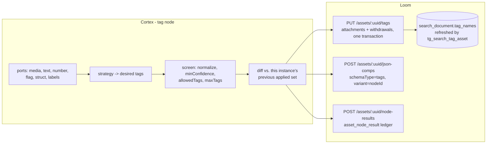

# Tag Node (`tag`) — Rule-Driven Tagging and Provenance-Guarded Withdrawal

> **Status**: 🟢 **Built and shipping.** Kind `tag`, module
> [cortex/nodes/tag/](../../../../cortex/nodes/tag/), package `io.metaloom.cortex.node.tag`.
> 52 unit tests + 3 integration tests, plus the Loom-side DAO and endpoint suites that guard the write
> path it depends on. No model, no sidecar, no native library. Contract in the generated
> `node-descriptors.json`, kept honest by `NodeSpecGoldenTest`.
> **Scope**: the `tag` node and the Loom write path it uses — from the wired input ports to the
> `tag_asset` placement, the `tags` JSON component and the `asset_node_result` ledger row.
> **Audience**: AI coding agents and humans working on
> [cortex/nodes/tag/](../../../../cortex/nodes/tag/) or on `TagEndpointService` / `TagDaoImpl`.

**Out of scope, and where it lives instead:**

| Not here | There |
|---|---|
| The node system, lifecycle, registration, caching layers | [../NODES.md](../NODES.md) |
| The one-paragraph current-state summary of this node | [../NODES.md](../NODES.md) §3.4 — **do not duplicate it here** |
| Port content types and cardinality across all nodes | [../NODE_DATA_TYPES.md](../NODE_DATA_TYPES.md) §4.6 |
| Rules for adding a node at all | [../../../guidelines/NEW_NODE.md](../../../guidelines/NEW_NODE.md) |
| The full REST surface of `/assets/:uuid/tags` | [../../../loom/RESTAPI.md](../../../loom/RESTAPI.md) §4.4 |
| Why a tag is searchable at all | [../../search/SEARCH.md](../../search/SEARCH.md) |
| Granting `TAG_ASSET` / `UNTAG_ASSET` | [../../permissions/PERMISSIONS.md](../../permissions/PERMISSIONS.md) |
| The recorded `tag_asset` schema defects | [../../db/DB_SCHEMA_FEEDBACK.md](../../db/DB_SCHEMA_FEEDBACK.md) §5 |
| The human side of coining and curating tags | [../../../workflows/WORKFLOW_MANUAL_SORT.md](../../../workflows/WORKFLOW_MANUAL_SORT.md) |
| Marking assets for disposal with a `trash` tag | [../../../workflows/WORKFLOW_TRASH.md](../../../workflows/WORKFLOW_TRASH.md) |
| The customer-facing page and its two screenshots | [../../../website/WEBSITE.md](../../../website/WEBSITE.md) § Node pages |

---

## 0. Executive Summary

| Question | Short answer |
|---|---|
| **What does it do?** | Attaches tags to an asset from declarative rules over the values other nodes wired into it |
| **Why does it exist?** | `sentiment`, `dominant-color`, `filter`, `quality` and `script` persist to `asset_json_comp`, which no query reaches. A `tag_asset` row is folded into `search_document.tag_names` by a trigger the moment it lands |
| **How does it extend?** | A `tagBy` strategy seam, the same shape as `FilterBy`. `RULES` and `LABELS` ship; `LLM`/`VLM` would be strategies, never new kinds (§2) |
| **Where does the data come from?** | Wired input ports only, addressed by **port id**. Never a `nodeId:outputKey` option (§3.1) |
| **What does it write?** | The tag placements via `PUT /assets/:uuid/tags`, a `tags` JSON component recording what it applied, and the `asset_node_result` ledger row (§5) |
| **Can it delete a tag?** | Only one it can prove it wrote, and only with `removeWithdrawn` on. Two independent guards, client and server (§5.2) |
| **Does it need a GPU or a sidecar?** | No. `RULES` is a handful of comparisons and is reproducible from the pipeline definition alone |

```
media  : media/*                    ──▶  tag  ──▶  applied : struct/json
text   : text/*          (opt)  ┈┈▶                count   : scalar/integer
number : scalar/number   (opt)  ┈┈▶
flag   : scalar/boolean  (opt)  ┈┈▶
struct : struct/*        (opt)  ┈┈▶
labels : scalar/string   (opt, MANY) ┈▶
```

---

## 1. Why the node exists

Everything the palette computes that *looks* like a tag ends up somewhere search cannot see it.
`sentiment` emits a polarity label, `dominant-color` emits colour names, `filter` emits a bucket,
`script` emits declared strings, `quality` emits blurriness and dimensions — and all of them persist to
`asset_json_comp`, a JSONB blob no query reaches. This node is the missing terminal for all of them:
one edge turns a computed value into a GIN-indexed facet, because `tag_asset` is already wired into
`search_document.tag_names` by `tg_search_tag_asset`, and a rename fans out to every carrying asset
via `tg_search_tag_fanout`. No new plumbing, no new index, no new content type.

The cost of that reach is the reason most of this document is about restraint: **a tag is a global,
shared object.** `(name, collection)` is unique across the whole instance, so a node that invents
names writes into a namespace it shares with every person using the catalog.

---

## 2. Two strategies, one kind

`tagBy` selects a `TagStrategy` from a `Map<TagBy, Provider<TagStrategy>>` Dagger multibinding keyed
by the `@TagByKey` enum map key.

| `tagBy` | Strategy | What it does |
|---|---|---|
| `RULES` (default) | `RulesTagStrategy` | Evaluates the configured rule rows against the wired ports. No model, no network, same answer on any worker |
| `LABELS` | `LabelsTagStrategy` | Every element on the MANY `labels` port becomes a tag. The terminal for nodes that already emit tag-shaped strings |

Adding a way of tagging is **a strategy class, a Dagger binding line and an enum value — never an edit
to `TagNode`**. That is deliberate: this palette already carried eight `filter-*` kinds that could
never run ([../NODES.md](../NODES.md) §3.3), and `tag-color` / `tag-llm` / `tag-rules` would be that
mistake a second time.

A strategy answers with **names only**. Normalisation, the allow-list, the cap, the minimum
confidence, the diff against the previous run and every write to Loom belong to `TagNode.screen` and
`TagNode.write`, so a future non-deterministic strategy inherits all of that safety without having to
remember it.

The map key is an enum rather than a `@StringKey`, so a strategy bound to a value that does not exist
is a compile error instead of a node that silently tags nothing for a whole run.

---

## 3. The decisions worth keeping

### 3.1 🔴 A rule addresses a port id, never an upstream node

`TagCondition.input` is one of `text`, `number`, `flag`, `struct`, `labels` — the set is
`TagInputs.PORT_IDS` and `TagCondition.validate()` rejects anything else. A `rules[].source` naming a
node would be the deleted `"nodeId:outputKey"` option wearing a disguise
([../../../guidelines/NEW_NODE.md](../../../guidelines/NEW_NODE.md) §5). Where the data comes from is
an edge the pipeline author drew.

This is also why `struct` is `ONE`. A graph that must combine a `quality` struct *and* a
`dominant-color` struct uses **two tag nodes**, one per source — the same answer `filter` gives. A
MANY `struct` port whose rules picked their source by `Element.origin.nodeId` would smuggle node ids
back into the options through a JSON field.

### 3.2 🔴 No `MANY` output port, on purpose

A `tags : scalar/string` MANY output is the obvious design and is rejected **on the declaration**: a
node that runs `PER_ELEMENT` may not declare a `MANY` output
([../NODE_DATA_TYPES.md](../NODE_DATA_TYPES.md) §6.4), so declaring one would
bar this node from ever sitting downstream of a fan-out such as `facedetect`. The applied set travels
as one `struct/json` value on `applied`, and `count` carries the number for cheap wiring into a
`filter`.

No new content type either. `scalar/string` MANY is what `sentiment.label`, `filter.bucket` and
`script` string outputs already emit, so the node is wireable to the existing palette on day one.

### 3.3 `rules` is declared `ParameterType.JSON`, not `PORT_LIST`

`PORT_LIST`'s editor always emits a structurally valid array, which is tempting, but its contract is
*"each row's id becomes an output port"* — false here — and its row editor is three flat text columns,
which cannot express a rule's nested `when` array at all. Declaring the wrong widget to get a nicer
form would make the contract lie about what the value is. A dedicated rule editor is the right fix and
this parameter is the reason to build one; see §10.

### 3.4 An unwired port is a configuration, not an error

`TagInputs` snapshots the ports once per item; an unwired port is `null`, `TagOp.test` returns false
for a null subject (except `NEQ`, where "the language is not German" is true of an item with no
language), and `RulesTagStrategy` reports the rule in `skippedRules` rather than failing the item.
Same reasoning as `filter`'s optional `text` port: a node that visibly tags nothing is far easier to
diagnose than one that refuses to start. The skipped list is written onto the asset, so a rule that
never fires is *visible* rather than merely absent.

The `struct` port carries an encoded JSON string (every `struct/*` output in the palette is an
`OutputPort<String>`), parsed once in `TagInputs.parse`. A payload that is not a JSON object is
treated as an unwired port and logged, not escalated.

### 3.5 🔴 Four vocabulary guards, none optional

Because `(name, collection)` is unique instance-wide and a tag row outlives the run that created it,
`TagNode.screen` applies all four in this order:

1. **`normalize`** first — an untrimmed `"blurry "` and `"blurry"` would be two permanent rows.
   Applied to `allowedTags` too, so the comparison is meaningful.
2. **`minConfidence`** — for strategies that produce one. The deterministic strategies report `1.0`.
3. **`allowedTags`** — a controlled vocabulary. A name outside a non-empty list is dropped and
   recorded as `rejected`. Mandatory in practice for any `tagTemplate` or model-driven rule.
4. **`maxTags`** — a template over a gathered MANY port has no natural bound. Names beyond the cap are
   recorded as `rejected` rather than silently lost.

`collection` is the fifth, structural guard: it is the only axis a UI can group or hide machine tags
by, and it is what makes §5.2's withdrawal rule meaningful.

### 3.6 🔴 Failure is `.abort()`, never `.next()`

`NodeContextImpl.next()` ignores `failureCause` and reports `SUCCESS` with the message dropped. Both
failure paths in `TagNode.compute` — the strategy throwing and the write throwing — record a `FAILED`
ledger row and then `ctx.failure(msg).abort()`. Several older nodes get this wrong; do not copy them.

### 3.7 `PipelineConfigurable`, therefore never `@Singleton`

The rules live in the pipeline definition, so `configure(JsonObject)` mutates the instance per task. A
`@Singleton` binding would let two tag nodes in one graph overwrite each other's configuration.
`TagNodeSingletonTest` pins it. `nodeId()` returns `"tag:" + <pipeline node id>` so the two instances
do not collide on `asset_node_result`'s `UNIQUE (asset_uuid, node_kind, node_id)`, and the `tags`
component's `variant` is the same pipeline node id so each instance reads back its own verdict.

`configure` **throws** on an unknown `tagBy`, an unknown `normalize`, or a `validate()` failure. The
task fails naming the node, which beats a node that quietly tags nothing — or worse, the wrong thing —
for a whole run. An unconfigured instance is not processable (`isProcessable` returns `configured`),
so it skips visibly instead of looking like it is working.

---

## 4. The rule model

One JSON array; each row is independent and **several may fire for one item**, which is the difference
between tagging and `filter`'s single bucket.

```jsonc
"rules": [
  {
    "id": "blurry",                     // stable id, recorded on every applied tag
    "tag": "blurry",                    // a fixed name, or "tagTemplate" inside a forEach
    "collection": "quality",            // optional; falls back to the node's `collection`
    "match": "ALL",                     // ALL (default) | ANY
    "when": [ { "input": "struct", "path": "blurriness", "op": "GT", "value": 0.6 } ]
  },
  {
    "id": "colour",
    "tagTemplate": "${value}",          // ${value} is the element being iterated
    "collection": "colour",
    "forEach": "labels",                // only `labels` may be iterated (TagInputs.MANY_PORT_IDS)
    "when": [ { "op": "NOT_BLANK" } ]   // no `input`: the subject is the current element
  }
]
```

**Condition** = `{input, path?, op, value?}`.

| Field | Meaning |
|---|---|
| `input` | A port id. Omitted inside a `forEach` rule, where the subject is the current element |
| `path` | Dot path into the `struct` value (`"image.width"`, `"colors.0.name"` — a numeric segment indexes an array). Ignored for the scalar ports |
| `op` | `EQ` `NEQ` `GT` `GTE` `LT` `LTE` `CONTAINS` `STARTS_WITH` `MATCHES` `IN` `EXISTS` `NOT_BLANK` |
| `value` | The literal. Required for every op except `EXISTS` / `NOT_BLANK`; must be an array for `IN` |

Operator semantics worth knowing (`TagOp`):

* **Numeric coercion is deliberate.** `3` and `3.0` are the same threshold, and a numeric *string*
  counts as a number — a JSON document does not distinguish them reliably.
* **`CONTAINS` / `STARTS_WITH` are case-insensitive**, which is what a person writing a rule expects.
* **`MATCHES` is a Java regex matched anywhere** in the subject's string form. Compiled patterns are
  memoised in a `ConcurrentHashMap` keyed by the expression, because a rule is evaluated once per item
  and recompiling would dominate the cost of a node that otherwise does a handful of comparisons.
* **Ordering falls back to string comparison** for non-numbers, so ISO dates and versions sort
  correctly.
* **A condition naming `labels` without iterating it** tests the joined list, so
  `{"input":"labels","op":"CONTAINS","value":"dog"}` means what it looks like.

**Why not a JS predicate?** GraalJS exists in the `script` node and would be strictly more expressive.
It is rejected: the engine would have to be extracted into a shared module, it re-imports sandbox
limits and timeouts into a node that should be trivial, and a JS predicate cannot be rendered as a
form or checked at save time. The escape hatch already exists — compute the value in a `script` node
and wire its output into `number` or `flag`.

Validation is split on purpose. `TagNodeOptions.validate()` **reports** every malformed row (called
from `configure`, before the run starts); `TagNodeOptions.rules()` **drops** malformed rows at
evaluation time, because refusing to run nineteen good rows because the twentieth is half-typed helps
nobody once the author has already saved.

---

## 5. What the node writes



Three writes, all guarded by `asset != null && client() != null`, so an offline worker evaluates rules
and writes nothing — a clean no-op, not a failure.

1. **The placements** — one `bulkTagAsset` call carrying every attachment *and* every withdrawal. An
   item that matched no rule and has nothing to take back makes **no call at all**. The request states
   `nodeKind`, `nodeId` and `producerVersion` once at the request level, and the response's tag uuids
   are carried back into the record — losing them would quietly disable reconciliation, because a
   later run can only withdraw a tag whose uuid it wrote down.
2. **The `tags` component** — `schemaType = "tags"`, `variant = <pipeline node id>`, upserted on
   `(asset, node_kind, schema_type, variant)` so it is always this instance's latest verdict for this
   asset. This same object is what the `applied` output port carries:
   ```json
   { "tagBy": "RULES", "collection": "quality", "dryRun": false,
     "applied":  [ {"tag":"blurry","collection":"quality","ruleId":"blurry","confidence":1.0,"uuid":"…"} ],
     "withdrawn":[ {"tag":"sharp","collection":"quality","ruleId":"sharp"} ],
     "rejected": [ {"tag":"chartreuse","reason":"not in allowedTags"} ],
     "skippedRules": ["negative-review: input number not wired"] }
   ```
3. **The ledger** — `recordNodeResult(..., SUCCESS, ..., resultRef("asset_json_comp", compUuid))`, and
   a `FAILED` row on either failure path.

Note the ordering: `dryRun` suppresses step 1 only. The component and the ledger row are still
written, which is what makes a dry run the way to try a rule set against a real library.

### 5.1 One request per item, not per tag

The node writes through `PUT /assets/:uuid/tags`
([../../../loom/RESTAPI.md](../../../loom/RESTAPI.md) §4.4). Five tags over a 100k-asset run through
the single-tag `POST` route was 500k requests and 500k transactions.

⚠️ Because the bulk request is applied whole or not at all, **a rejected withdrawal fails the item**
rather than being logged and skipped — there is no half-applied state left to report as a success. A
worker whose token may tag but not untag must run with `removeWithdrawn` off.

⚠️ The batching removed the round trips, not the refreshes. `tg_search_tag_asset` is a `FOR EACH ROW`
trigger, so five tags still rebuild the same search document five times *inside* the one transaction.
Only a statement-level trigger with a transition table would change that, and it belongs to the search
schema (§10).

### 5.2 🔴 The safety property: withdrawal is provenance-guarded twice

With `removeWithdrawn` off (the default) nothing is ever deleted, and the previous verdict is not even
read back — one less request per item.

With it on, a tag may be withdrawn only when **all** of these hold (`TagNode.toWithdraw`):

* it appears in **this node instance's** previous `applied` list, read back from the `tags` component
  matching this instance's `variant`;
* its collection is one this instance writes into (the `collection` option plus any `rules[].collection`);
* it carries a uuid from that earlier write;
* and it is not in the current applied set.

A failed read-back withdraws **nothing** — failing closed is the only safe direction when the
alternative is deleting somebody else's tags.

The server enforces the same restraint independently. Since `V2.71` the join row carries `node_id`, and
`TagDaoImpl.bulkTagAsset` scopes the delete to `TAG_ASSET.NODE_ID = <caller's node id>`; a caller with
no node id — a person — removes every placement, which is what an untag means from a human. The
request also **names uuids** and removes exactly those, never "everything not in the set", so no
reading of the desired set can turn into a mass delete.

The redundancy is deliberate. A bug here silently destroys human curation.
[../../../workflows/WORKFLOW_TRASH.md](../../../workflows/WORKFLOW_TRASH.md) depends on exactly this
property: a person's `trash` tag can never be withdrawn by a node.

---

## 6. The Loom write path this node stands on

The node needed the tag write path fixed before it could exist at all. The current behaviour:

| Route | Permission | Behaviour |
|---|---|---|
| `POST /assets/:uuid/tags` | `TAG_ASSET` | **Resolves** the tag on `(name, collection)` and creates the placement |
| `PUT /assets/:uuid/tags` | `TAG_ASSET`, plus `UNTAG_ASSET` when `withdraw` is non-empty | The whole set in one transaction. What the node uses |
| `DELETE /assets/:uuid/tags/:tagUuid` | `UNTAG_ASSET` | Removes **every** placement of that tag on the asset |
| `DELETE /assets/:uuid/tag-placements/:placementUuid` | `UNTAG_ASSET` | Removes **one** placement; 404 when it belongs to another asset |

**`TagDao.resolveOrCreateAssetTag`** is an `INSERT … ON CONFLICT (name, collection) DO UPDATE …
RETURNING uuid`. The update set is `coalesce(excluded.<col>, tag.<col>)` over `meta`, `rating` and
`color` **only** — deliberately not a whole-record upsert, because jOOQ's `newRecord(table, pojo)`
marks every mapped field as changed, nulls included, so writing the record back would wipe the meta,
rating and colour of a tag a person curated the moment a worker attached it. The creator and creation
timestamp survive too.

**`TagDaoImpl.attach`** upserts on `tag_asset_placement_key` —
`(tag_uuid, asset_uuid, time_from, time_to, areaStartX, areaStartY)` with `UNIQUE NULLS NOT
DISTINCT`, which needs **PostgreSQL 15+**. `NULLS NOT DISTINCT` is load-bearing: an asset-level tag is
all-NULL in the region columns, and under default semantics those rows never conflict, so re-tagging
would append forever. `areaWidth`/`areaHeight` sit outside the key, so resizing a box updates the
placement while moving it creates one.

🔴 **The first author keeps the row.** That upsert carries
`WHERE tag_asset.node_id IS NOT DISTINCT FROM excluded.node_id`, so a node attaching a tag a person
already placed leaves that row alone — it stays `node_kind = 'manual'` and keeps its timestamps. Without
the guard, tagging would quietly transfer authorship and the node's own reconcile would then delete
somebody's curation. When the update is suppressed the DAO reads the existing placement back rather
than returning a half-populated pojo: the tag *is* on the asset, which is what the caller asked for.

**`TAG_ASSET` implies creating the tag row when the name is new.** Requiring `CREATE_TAG` as well would
mean a principal allowed to tag cannot introduce a tag — the ordinary case in a catalog — and would
fail halfway through a pipeline run rather than at configuration time.
[../../permissions/PERMISSIONS.md](../../permissions/PERMISSIONS.md): grant the worker token
`TAG_ASSET` (+ `UNTAG_ASSET` for reconciliation) via group+role, never a direct user grant.

⚠️ **`listTags()` takes no filter parameter**, so a worker cannot look a tag up by name over REST. The
resolve must stay server-side; a client-side "list, search, else create" would be a full-table fetch
per item *and* a race.

---

## 7. Options

All per-instance, arriving **flattened onto the node object** in the pipeline definition — the node is
a `PipelineConfigurable`, so two tag nodes in one graph tag by different rules and any worker can serve
any rule set. Nothing model-shaped is worker-scoped, which is what keeps this node runnable everywhere
including the demo container.

| Option | Type | Default | Notes |
|---|---|---|---|
| `tagBy` | `ENUM` | `RULES` | `RULES` \| `LABELS` — §2 |
| `rules` | `JSON` | `[]` | §4. Required when `tagBy` is `RULES`; an empty set fails `validate()` |
| `collection` | `STRING` | `auto` | Default collection, and the collection this instance may withdraw from (§5.2) |
| `allowedTags` | `JSON` | `[]` | Controlled vocabulary. Empty = no gating |
| `maxTags` | `INTEGER` | `20` | Hard cap per item; `min = 1` |
| `normalize` | `ENUM` | `TRIM_LOWER` | `NONE` \| `TRIM` \| `TRIM_LOWER`. Applied before the allow-list |
| `removeWithdrawn` | `BOOLEAN` | `false` | 🔴 Reconcile. Off by default — deleting is not a default |
| `dryRun` | `BOOLEAN` | `false` | Compute and record, attach nothing |
| `minConfidence` | `NUMBER` | `0.0` | `0.0`–`1.0`. Ignored by the deterministic strategies, which report `1.0` |
| `enabled`, `processIncomplete`, `retryFailed` | `BOOLEAN` | `true`/`false`/`false` | Standard, from `AbstractNodeOptions` |

`validate()` reports: an unset `tagBy` or `normalize`, a blank `collection`, `maxTags <= 0`,
`minConfidence` outside `0..1`, `RULES` with no rules, a non-object rule row, a duplicate rule id, and
every per-rule problem (`TagRule.validate` / `TagCondition.validate` / `TagOp.validate`) — a missing
id, both `tag` and `tagTemplate`, a `tagTemplate` without a `forEach`, a `forEach` over a port that is
not `labels`, a rule with no conditions, an unknown `op`, an unknown `input`, an op missing its value,
a bad regex, and `IN` without an array.

### Caching and versioning

| Concern | Value |
|---|---|
| Cache | `LocalResultCache<String>`, 50 000 entries, key `media.absolutePath() + "\|" + configHash`. A hit re-emits both ports and returns `ctx.origin(LOCAL).next()` — SUCCESS, **not** SKIPPED |
| `configHash` | First 12 hex chars of SHA-256 over `tagBy + rules + collection + allowedTags + normalize + maxTags` |
| `producerVersion()` | `"tag/1:" + tagBy + ":" + configHash` — changes whenever the meaning of the answer changes |
| `nodeId()` | `"tag:" + <pipeline node id>` |

🔴 The config hash is in the cache key because **two tag nodes over one asset on one worker are the
normal case** and must not share a verdict.

---

## 8. Configuration

**This node adds no environment variables.** Rules are pipeline configuration, not worker
configuration. The existing variables that decide whether it can write at all:

| Variable | Default | Relevance |
|---|---|---|
| `LOOM_HOST` / `LOOM_PORT` | — / `8092` | Presence of `LOOM_HOST` selects online mode. Offline the node evaluates rules, emits both ports and writes nothing |
| `LOOM_TOKEN` | — | 🔴 Must carry `TAG_ASSET`, plus `UNTAG_ASSET` when any instance runs with `removeWithdrawn` on, or every write is a 403 |
| `CORTEX_NODE_WHITELIST` / `CORTEX_NODE_BLACKLIST` | — | Enable or disable the kind per worker |
| `LOOM_SEARCH_ENABLED` | off | Tags reach `search_document` via triggers regardless, but the search **routes** answer 503 while this is off — the payoff is invisible |

---

## 9. Key Classes Reference

| Class / file | Package or path | Purpose |
|---|---|---|
| `TagNode` | `io.metaloom.cortex.node.tag` | Kind `tag`, category `OUTPUT`; ports, `screen`, `write`, `toWithdraw`, config-hash cache, ledger |
| `TagNodeOptions` | ″ | `KEY = "tag"`, the ten options, `normalize()`, `rules()`, `allowedTags()`, `validate()` |
| `TagNodeModule` | ″ | `@Binds @IntoSet` + `@Binds @IntoMap @StringKey("tag")`, plus one `@TagByKey` binding per strategy |
| `TagBy` / `TagByKey` | ″ | The strategy seam and its enum Dagger map key |
| `TagStrategy` | ″ | `compute(TagInputs, TagNodeOptions) -> Outcome`; `DesiredTag`, `Outcome` records |
| `RulesTagStrategy` / `LabelsTagStrategy` | ″ | The two shipping strategies |
| `TagRule` / `TagCondition` / `TagOp` | ″ | The rule model, its predicates and the closed operator set |
| `TagInputs` | ″ | Per-item snapshot of the wired ports; `PORT_IDS`, `MANY_PORT_IDS`, `isWired`, dot-path `resolve` |
| `AppliedTag` | ″ | One applied tag as recorded in the `tags` component; the uuid is filled in after the write |
| `AbstractMediaNode` / `PipelineConfigurable` / `LocalResultCache` | `io.metaloom.cortex.common.…` | **Reused** — `process()`, `recordNodeResult`, `resultRef`, per-task `configure`, the skip cache |
| `TagEndpointService` | `io.metaloom.loom.rest.service.impl` | `tagAsset` (resolves), `bulkTagAsset`, `untagAsset`, `removeTagPlacement`, `applyProvenance` |
| `AssetEndpoint` | `io.metaloom.loom.rest.endpoint.impl` | The four asset-scoped tag routes |
| `TagDao` / `TagDaoImpl` | `io.metaloom.loom.db.model.tag` / `…db.jooq.dao.tag` | `resolveOrCreateAssetTag`, `tagAsset`, `bulkTagAsset`, `attach`, `assetTagsByNode` |
| `AssetTagBulkRequest` / `AssetTagBulkResponse` / `TagCreateRequest` / `TagReference` | `io.metaloom.loom.rest.model.tag`, `…model.annotation` | The wire model; `TagReference` carries `placementUuid`, `nodeKind`, `nodeId`, `confidence`, `attached`, `attachedBy` |
| `TagMethods` | `io.metaloom.loom.client.common.method` | `tagAsset`, `bulkTagAsset`, `untagAsset` on `LoomClient`; mirrored in `clients/python/loom_client/methods/tag.py` |
| `V2.2__add_tag.sql` · `V2.71__tag_asset_placements.sql` · `V2.72__tag_asset_cascade.sql` | `loom/db/flyway/src/main/resources/db/migration/` | `UNIQUE (name, collection)`; the placement key + provenance columns; the delete cascade |
| `V2.58__add_search_document.sql` · `V2.59__add_search_triggers.sql` | ″ | `tag_names` + `tg_search_tag_asset` — why a tag is searchable |
| `NodeCollectionModule` | `io.metaloom.cortex.cli.dagger` | Registers `TagNodeModule` in the CLI graph |
| `DemoDatabaseInitializer` | `io.metaloom.loom.core.boot` | Seeds two `tag` nodes into demo pipelines (`pn6` metadata-driven, `pn5`/`pn6` review-driven) |

---

## 10. Progress Assessment

### Done

- [x] Module, node, options, Dagger module, `@StringKey` kind binding in `NodeCollectionModule`
- [x] `TagBy` seam with `RULES` and `LABELS`, enum-keyed multibinding; adding a strategy needs no edit to `TagNode`
- [x] Six input ports and two `ONE` outputs; no `MANY` output, no new content type
- [x] The rule model — twelve operators, `ALL`/`ANY`, `forEach` over `labels`, `${value}` templates, dot paths into `struct`
- [x] Four vocabulary guards in `screen()`, applied for every strategy including future ones
- [x] `abort()` on failure, not `next()`; `FAILED` ledger row on both failure paths
- [x] Config-hash cache key; `producerVersion` and `nodeId` scoped per pipeline node id; not `@Singleton`
- [x] `POST /assets/:uuid/tags` resolves rather than inserts; the join insert upserts; resolving never overwrites a curated tag
- [x] `PUT /assets/:uuid/tags` — the whole set in one transaction, withdrawals by uuid, request-level provenance
- [x] `V2.71` placement identity + provenance; first-author-wins upsert; server-side `node_id`-scoped withdrawal
- [x] Provenance-guarded reconciliation behind `removeWithdrawn`, default off, failing closed on a read-back error
- [x] 52 unit tests, 3 integration tests, 18 endpoint tests, 18 DAO tests; descriptor pinned by `NodeSpecGoldenTest`
- [x] Java and Python client methods; `TagReference` carries the provenance to the UI
- [x] Two `tag` nodes seeded into the demo pipelines
- [x] Customer docs page `website/content/english/docs/nodes/tag/` with `nodeviz`, `config.png` and `debug.png`

### Follow-ups this node creates

- [ ] **Retire the client-side read-back.** `TagDao.assetTagsByNode` exists and is tested but nothing
      calls it in production: the node still reads its own `tags` component back to learn what it
      applied. The *safety* half already landed server-side, so what remains is replacing the
      component read with a server query. Files: `TagNode.previouslyApplied`, `TagDaoImpl.assetTagsByNode`
- [ ] **Grant the Cortex token `TAG_ASSET` / `UNTAG_ASSET` via group+role** in the deployment docs.
      The endpoint tests cover the 403s; the deployment side is undocumented
- [ ] **Statement-level `tg_search_tag_asset`** so a five-tag write rebuilds the search document once
      (§5.1). Belongs to the search schema, not to this node
- [ ] 🔴 **A rule editor for the `rules` parameter.** It is a raw `JSON` box today (§3.3);
      `BucketListEditor` exists in `loom-ui` but nothing mounts it, and no parameter form is rendered
      for this node at all
- [ ] **Machine tags shown distinctly in the UI** and a tag facet in search. `TagReference` already
      carries `nodeKind` / `nodeId` / `confidence`; `AssetDetail.tsx` does not use them
- [ ] **Region tags from the node.** Unblocked by `V2.71` — the REST surface and the DAO already place
      them (`TagAssetEndpointTest.testTagTwoFacesOfOneAssetWithOneTag`). What is missing is a `tagBy`
      strategy fed by `detections`, plus the absolute-int ↔ normalized-real conversion
      ([../../db/DB_SCHEMA_FEEDBACK.md](../../db/DB_SCHEMA_FEEDBACK.md) §5.2)
- [ ] **`tagBy: LLM` / `VLM`** via `cortex/llm-common`, only ever behind `allowedTags` + `minConfidence`
- [ ] **`ScriptValueType.TAGS`** on the `script` node over the same bulk route — a power-user path, not
      a replacement for this node
- [ ] **Loom-side retroactive "smart tags"** — a saved rule evaluated over the catalog. Complementary:
      it is the only way to tag existing assets, but it can only see persisted data and Loom has no
      scheduler. The reconciliation model of §5.2 is reusable verbatim
- [ ] **Decide `TagsPayload`'s fate.** `cortex/api/.../node/payload/TagsPayload.java` was written in
      anticipation of this node and still has zero producers and zero consumers. Use it or delete it

### Deliberately not built

- [ ] **No JS predicates in a rule** (§4). The escape hatch is a `script` node wired into `number`/`flag`
- [ ] **No MANY `struct` port** (§3.1). Two structured sources means two tag nodes
- [ ] **No `tag` content type** (§3.2). `scalar/string` MANY is what the palette already emits; a
      `struct/tags` type is only worth adding when a producer needs to carry confidences *between* nodes
- [ ] **No desired-set semantics on the bulk route.** "These are the tags now, delete the rest" reads
      better and would delete human curation; withdrawal names uuids instead

---

## 11. Test Setup

🔴 `./setup-pool.sh` before any Loom-side test, and again after any Flyway change.

```bash
# 52 node unit tests - no Loom, no database; the client is mocked
./mvnw -o -pl cortex/nodes/tag/core test

# The DAO and endpoint suites that guard the write path
./setup-pool.sh
./mvnw -o -pl loom/db/jooq test -Dtest='TagDaoTest,TagPlacementDaoTest'
./mvnw -o -pl loom/core  test -Dtest=TagAssetEndpointTest

# The generated contract equals the annotated node, and the kind is advertised
./mvnw -o -pl integration-test test -Dtest=NodeSpecGoldenTest

# End to end against an in-process Loom + pooled Postgres
./mvnw -o -pl integration-test test -Dtest=TagNodeIntegrationTest
```

| Test | What it guards against |
|---|---|
| `TagNodeTest` (17) | Every operator against every port type; an unwired port throwing instead of evaluating false; `ALL` vs `ANY`; `forEach` over a gathered MANY port; `maxTags` / `allowedTags` / `normalize` not gating; a second run recomputing instead of hitting the cache; two configurations sharing a cache key |
| `TagOptionsValidationTest` (15) | Every misconfiguration surfacing per item instead of at pipeline start — empty `rules`, unknown `tagBy`, unknown `op`, unknown `input`, duplicate rule id, bad regex, `maxTags <= 0`, out-of-range `minConfidence` |
| `TagNodePersistenceTest` (12) | The bulk call not carrying the provenance; the component missing or losing its `schemaType`/`variant`; the ledger row missing or losing its `producerVersion`; no `FAILED` row when a write throws; `dryRun` attaching anything; 🔴 **anything being withdrawn that is not in this instance's own previous applied set** |
| `TagNodePipelineTest` (6) | Adapter integration, completion events, `applied` and `count` chaining into a downstream node, disabled + dry-run skip |
| `TagNodeSingletonTest` (2) | The node becoming a `@Singleton`, which would let two instances overwrite each other's configuration |
| `TagDaoTest` (10) | 🔴 `testStoreCannotShareATagName` pins the old defect so nothing goes back to `store()`; resolve reusing the existing row, scoped by collection, and **not** overwriting it; the join upsert being idempotent; the bulk call rolling back as a whole |
| `TagPlacementDaoTest` (8) | The same tag placed twice; provenance recorded and defaulting to `manual`; 🔴 a node **not** taking over a human placement; one placement removed without the others; `assetTagsByNode` |
| `TagAssetEndpointTest` (18) | Two assets sharing one tag name; the same asset tagged twice; a curated tag surviving a bare tagging call; the bulk route's request-dependent permission set; 🔴 a withdrawal leaving a human placement of the same tag; the asset response reporting who attached each tag; both delete-cascade directions |
| `TagNodeIntegrationTest` (3) | The tag not reaching Postgres or not becoming searchable; two assets not sharing one tag row; 🔴 a run withdrawing a hand-typed tag instead of only its own |

⚠️ A test class much past twenty methods exhausts the test-DB pool; split rather than fight it.

---

## 12. Conventions and Gotchas

- 🔴 **`POST /assets/:uuid/tags` resolves, it does not insert.** Never go back to `store()` for a tag
  that is about to be attached — `UNIQUE (name, collection)` makes the second asset fail, and
  `TagDaoTest.testStoreCannotShareATagName` is there to catch it.
- ⚠️ **Resolving must never overwrite the tag it resolved.** jOOQ's `newRecord(table, pojo)` marks
  every mapped field as changed, nulls included, so a whole-record upsert silently wipes a curated
  tag's meta, rating and colour. The update set is `coalesce(excluded, current)` over three columns.
- 🔴 **Never delete a tag you cannot prove you wrote.** Two independent guards: the node withdraws only
  what is *both* in its own previous applied set *and* in its own collection, and the server deletes
  only placements carrying the caller's `node_id`. A bug here silently destroys human curation, which
  is why the redundancy is deliberate.
- 🔴 **The first author keeps the placement row.** The join upsert's
  `WHERE node_id IS NOT DISTINCT FROM excluded.node_id` is what stops a node from taking authorship of
  a tag a person placed — and reconciliation deletes by `node_id`.
- 🔴 **Tags are global.** `(name, collection)` is unique instance-wide, so a `tagTemplate` rule without
  `allowedTags` lets one bad regex litter the shared namespace permanently.
- 🔴 **No `MANY` output port.** A `PER_ELEMENT` node declaring one is rejected *on the declaration*
  ([../NODE_DATA_TYPES.md](../NODE_DATA_TYPES.md) §6.4), which would bar this
  node from ever sitting downstream of `facedetect`.
- 🔴 **Failure is `.abort()`, never `.next()`.** `NodeContextImpl.next()` ignores `failureCause` and
  reports SUCCESS. Several older nodes get this wrong; do not copy them.
- 🔴 **`PipelineConfigurable` implies not `@Singleton`**, and `nodeId()` must stay scoped per pipeline
  node id or two tag nodes collide on `asset_node_result`'s `UNIQUE (asset_uuid, node_kind, node_id)`.
- ⚠️ **No `nodeId:outputKey` options, ever** — including disguised as a `rules[].source` field. Data
  arrives on a declared port over an edge the author drew.
- ⚠️ **An unwired optional port is a configuration, not an error.** Conditions on it are false and the
  node says so in `skippedRules`.
- ⚠️ **`UNIQUE NULLS NOT DISTINCT` needs PostgreSQL 15+.** Without it an asset-level tag would be
  re-appended on every run, because NULLs compare as distinct by default.
- ⚠️ **`tag_asset` boxes are absolute ints; `detection` boxes are normalized reals**
  ([../../db/DB_SCHEMA_FEEDBACK.md](../../db/DB_SCHEMA_FEEDBACK.md) §5.2). Any future region tag must
  convert.
- ⚠️ **Every `tag_asset` row refreshes the asset's search document.** The bulk route removed the round
  trips, not the refreshes — `tg_search_tag_asset` is `FOR EACH ROW`.
- ⚠️ **`listTags()` has no filter parameter**, so a worker cannot resolve a tag by name over REST. The
  resolve must stay server-side.
- ⚠️ **A rejected withdrawal fails the item**, because the bulk request is all-or-nothing. A token that
  may tag but not untag must run with `removeWithdrawn` off.
- ⚠️ **Count, never quote.** Kind and content-type counts belong in the guard tests and the generated
  snapshot, not in prose.
- ⚠️ **After any migration**: `mvn -pl loom/db/flyway install`, then `loom/db/jooq/generate.sh`, then
  `./setup-pool.sh`. A stale pool fails in ways that look like code bugs.

---

## 13. Where do I find …?

| Need | Path |
|---|---|
| The node | [cortex/nodes/tag/core/…/TagNode.java](../../../../cortex/nodes/tag/core/src/main/java/io/metaloom/cortex/node/tag/TagNode.java) |
| The options + `validate()` | `…/tag/TagNodeOptions.java` |
| The strategy seam | `…/tag/TagBy.java` · `TagByKey.java` · `TagStrategy.java` · `RulesTagStrategy.java` · `LabelsTagStrategy.java` |
| The rule model and the operators | `…/tag/TagRule.java` · `TagCondition.java` · `TagOp.java` |
| What the ports carry for one item | `…/tag/TagInputs.java` |
| The node tests | `cortex/nodes/tag/core/src/test/…` |
| The REST handlers | `loom/services/rest/…/service/impl/TagEndpointService.java`; routes in `…/endpoint/impl/AssetEndpoint.java` |
| The DAO | `loom/db/jooq/…/dao/tag/TagDaoImpl.java`; interface in `loom/db/api/…/model/tag/TagDao.java` |
| The tag tables and the placement key | `loom/db/flyway/src/main/resources/db/migration/V2.2__add_tag.sql`, `V2.71__tag_asset_placements.sql` |
| How a tag becomes searchable | `V2.58__add_search_document.sql`, `V2.59__add_search_triggers.sql`, [../../search/SEARCH.md](../../search/SEARCH.md) |
| The client methods | `loom-client/common/…/method/TagMethods.java` · `clients/python/loom_client/methods/tag.py` |
| The descriptor entry | `loom-shared/node-model/src/main/resources/node-descriptors.json` (kind `tag`) |
| The seeded demo pipelines | `loom/core/…/boot/DemoDatabaseInitializer.java` |
| The customer page | [website/content/english/docs/nodes/tag/index.adoc](../../../../website/content/english/docs/nodes/tag/index.adoc) |
| The one-paragraph summary in the node system | [../NODES.md](../NODES.md) §3.4 |
| Port cardinality, fan-out, the validation rules | [../NODE_DATA_TYPES.md](../NODE_DATA_TYPES.md) §4.6, §6, §8 |
| Rules for building the next node | [../../../guidelines/NEW_NODE.md](../../../guidelines/NEW_NODE.md) |
| The human tagging workflow this node writes alongside | [../../../workflows/WORKFLOW_MANUAL_SORT.md](../../../workflows/WORKFLOW_MANUAL_SORT.md) |
| The disposal workflow that depends on the withdrawal rule | [../../../workflows/WORKFLOW_TRASH.md](../../../workflows/WORKFLOW_TRASH.md) |

---

_Git HEAD revision: `8c153347`_
_Last updated: 2026-08-11_
