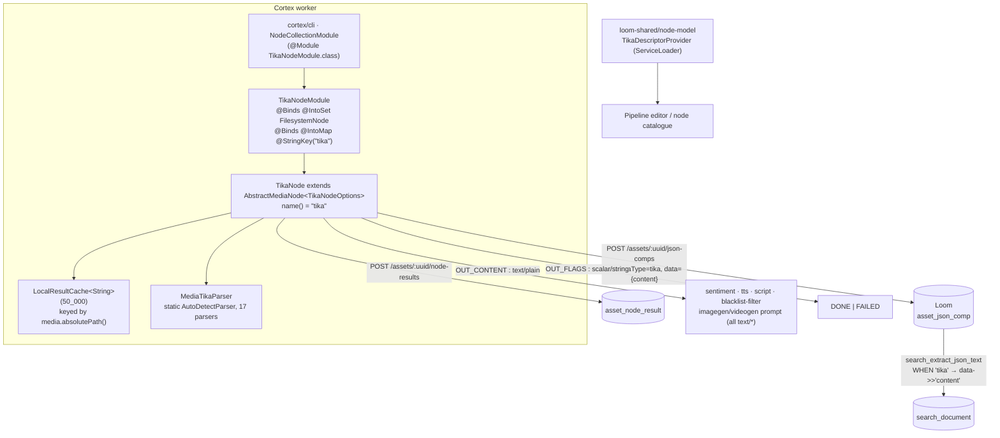

# Apache Tika in MetaLoom — `loom/services/tika` and `cortex/nodes/tika`

Status: 🔴 **The extraction is non-functional.** `MediaTikaParser.parse()` unconditionally returns
`null` and dumps metadata to `System.out`. Everything downstream (JSON component, search index,
`content` port) receives an empty string. See §7.

## 1. Scope — which module does what

Two modules carry the name "tika". They are **not** related; neither depends on the other.

| Module | Artifact | Reality |
|---|---|---|
| `loom/services/tika` | `loom-service-tika` | 🔴 **Empty stub.** One class with an empty body, no Tika dependency, zero consumers. §2 |
| `cortex/nodes/tika/core` | `cortex-tika-node` | 🟡 The only place Apache Tika is actually on the classpath. Wired, tested, persisting — but extracts nothing. §3–§7 |

Adjacent specs — do not duplicate them:
- [NODES.md](NODES.md) — the Cortex node system, the per-node table (`tika` row §164), and the open
  work items that already name `TikaNodeOptions`.
- [../NODE_DATA_TYPES.md](../NODE_DATA_TYPES.md) — the port/content-type model.
- [../../cortex/CONFIGURATION.md](../../cortex/CONFIGURATION.md) — §5 registered YAML keys, §5.1
  common option fields, §3.1 default timeouts, and §1.1/§4 on why `CortexOptions.nodes` is never
  populated.
- [../../guidelines/NEW_NODE.md](../../guidelines/NEW_NODE.md) — the checklist a node must satisfy.
- [../../loom/LOOM.md](../../loom/LOOM.md) — §13.7 lists "No spec for `services/tika`" (this file).

---

## 2. `loom/services/tika` — verified empty

```
loom/services/tika/
├── pom.xml     # artifactId loom-service-tika, parent loom-services. NO <dependencies> block.
├── README.md   # a single "# Loom - Tika Service" heading
└── src/main/java/io/metaloom/loom/tika/TikaProcessorImpl.java   # `public class TikaProcessorImpl {}`
```

Verified by grep, not assumed:
- **No Tika dependency.** The pom declares none; it inherits only `loom-api`, `loom-db-api` and
  `dagger` from `loom/services/pom.xml`.
- **No Dagger module, no `@Inject`, no bindings, no interface.** There is no `TikaProcessor`
  interface anywhere in the repo — `TikaProcessorImpl` implements nothing.
- **No `src/test`.**
- **Zero consumers.** The only references to `loom-service-tika` / `io.metaloom.loom.tika` outside
  the module itself are `loom/services/pom.xml` (`<module>tika</module>`) and
  `loom/.idea/compiler.xml`. Nothing imports the class.
- **Reads no environment variables.**

It builds, ships an empty jar, and is dead weight. Either delete it, or move the Cortex
implementation behind a real service SPI here.

---

## 3. `cortex/nodes/tika` — architecture



### 3.1 Ports

| Port | Direction | Id | Content type | Cardinality | Java type |
|---|---|---|---|---|---|
| `IN_MEDIA` | in | `media` | `media/*` (`MEDIA_ANY`) | ONE | `LoomMedia` |
| `OUT_CONTENT` | out | `content` | `text/plain` (`TEXT_PLAIN`) | ONE | `String` |
| `OUT_FLAGS` | out | `flags` | `scalar/string` (`SCALAR_STRING`) | ONE | `String` |

`text/plain` is inside the `text/*` family, so any node with a `TEXT_ANY` input can bind
`OUT_CONTENT`: `SentimentNode.IN_TEXT`, `TtsNode.IN_TEXT`, `ScriptNode.IN_TEXT`,
`BlacklistFilterNode.IN_TEXT` (MANY), `ImageGenNode.IN_PROMPT`, `VideoGenNode.IN_PROMPT`. Nodes bind
by port and content type, never by upstream node id — see
[../NODE_DATA_TYPES.md](../NODE_DATA_TYPES.md).

### 3.2 Control flow

`AbstractMediaNode.process()` runs first: skips when `!options().isEnabled()`, aborts when the file
is missing, skips `unprocessable`, fetches the `AssetResponse` (null when offline), then calls
`compute()`.

`TikaNode.isProcessable()` accepts `isImage() || isAudio() || isVideo() || isDocument()`.

`TikaNode.compute()`:
1. Cache hit on `media.absolutePath()` → emit `OUT_FLAGS="DONE"`, emit `OUT_CONTENT` only when the
   cached value is non-null, return `origin(LOCAL).next()`.
2. Otherwise `MediaTikaParser.parse(media)` → `OUT_FLAGS="DONE"`, `OUT_CONTENT` when non-null, cache
   the result, `persist(...)`, return `origin(COMPUTED).next()`.
3. Any exception → log, `OUT_FLAGS="FAILED"`, `ctx.failure("failed processing").next()`.

`persist()` is best-effort and a no-op when `asset == null || client() == null`. It writes
`JsonCompCreateRequest{nodeKind="tika", schemaType="tika", variant="", data={"content": content ?: ""}}`
then `recordNodeResult(SUCCESS, resultRef("asset_json_comp", compUuid))`; on failure it records
`ResultState.FAILED` but does not fail the node.

---

## 4. Tika version and parser configuration

| Item | Value | Source |
|---|---|---|
| Tika version | **3.2.2** | `bom/pom.xml` `<tika.version>` |
| Dependencies | `tika-parsers-standard-package` (excluding `xml-apis`), `tika-core` | `cortex/nodes/tika/core/pom.xml` |

`MediaTikaParser` builds a fixed parser list rather than using Tika's service-loader defaults.
**17 parsers**, grouped in source order:

- Documents: `JSoupParser`, `PDFParser`, `TXTParser`, `OfficeParser`, `OldExcelParser`,
  the decorated `OOXMLParser` (below), `OpenDocumentParser`, `IWorkPackageParser`, `DcXMLParser`,
  `EpubParser`
- Audio: `AudioParser`, `Mp3Parser`
- Video: `FLVParser`, `MP4Parser`
- Images: `ImageParser`, `WebPParser`
- Ogg: `org.gagravarr.tika.OggParser`

Commented out in the source: `RTFParser` and `JpegParser` — so **RTF and JPEG EXIF are not parsed**
(JPEG still resolves to `ImageParser`). No comment explains why.

**OOXML configuration:** `OOXMLParser` with `setUseSAXDocxExtractor(true)` and
`setUseSAXPptxExtractor(true)`, wrapped in `ParserDecorator.withoutTypes(EXCLUDES)`.
`EXCLUDES` is a 7-element array that dedupes to **6** MediaTypes (`vnd.ms-visio.drawing` appears
twice): the Visio drawing / stencil / template types and their `.macroenabled.12` variants.

**Detector customization: none.** The code builds
`PARSER_INSTANCE = new AutoDetectParser(PARSERS)` and then
`TIKA_INSTANCE = new AutoDetectParser(PARSER_INSTANCE.getDetector(), PARSER_INSTANCE)`.
The second constructor re-uses the *default* detector taken off the first instance, so the double
wrap is a no-op layer, not a customization.

**Metadata field mapping: none.** `parse()` collects a `Metadata` object and then does
`System.out.println(name + " " + metadata.get(name))` for every key. No field is mapped to any Loom
column or JSON key. The claim in `TikaDescriptorProvider` ("Extract metadata and text content") is
aspirational.

---

## 5. Environment variables and options

**Neither module reads any environment variable or system property.** Verified: no `System.getenv`
or `System.getProperty` in `cortex/nodes/tika` or `loom/services/tika`. Configuration is
`TikaNodeOptions`, obtained via `AbstractNodeModule.nodeOptions(cortexOptions, "tika", new TikaNodeOptions())`.

`TikaNodeOptions` **declares no fields of its own**. Only the inherited `AbstractNodeOptions` fields
exist:

| YAML key (`nodes: tika:`) | Type | Default | Effect |
|---|---|---|---|
| `enabled` | boolean | `true` | `false` → `ctx.skipped("Disabled")` |
| `processIncomplete` | boolean | `false` | Read by the pipeline, not by `TikaNode` |
| `retryFailed` | boolean | `false` | Read by the pipeline, not by `TikaNode` |
| `timeoutMs` | long | `0` (no timeout) | `validateCommon()` rejects negatives |

The node's *default* timeout when a pipeline definition omits `timeoutMs` is **120000 ms**, from
`CortexOptions.getDefaultTimeoutMs("tika")` — see
[../../cortex/CONFIGURATION.md](../../cortex/CONFIGURATION.md) §3.1.

⚠️ `CortexOptions.nodes` is **never populated** — `cortex.yml` deserialization is registered but not
wired (CONFIGURATION.md §1.1/§4), and `TikaNode` does not implement `PipelineConfigurable`. In
practice the node always runs on `new TikaNodeOptions()` defaults and **cannot be configured at all**.

The `enabled` / `processIncomplete` / `retryFailed` parameters are re-declared by hand in
`TikaDescriptorProvider` for the editor; `defaultConcurrency = 4`, `defaultMode = PARALLEL`.

---

## 6. Consumers (verified by grep)

| Consumer | Path | What it uses |
|---|---|---|
| Cortex CLI | `cortex/cli/.../dagger/NodeCollectionModule.java` | `TikaNodeModule.class` in the `@Module` list |
| Example worker | `examples/cortex-custom/.../dagger/NodeCollectionModule.java` | same |
| Processor assembly | `cortex/processor/pom.xml` | `cortex-tika-node` dependency |
| Node descriptor | `loom-shared/node-model/.../TikaDescriptorProvider.java` | ServiceLoader descriptor `kind=tika`, category `ANALYSIS`, icon `description` |
| Loom search | `loom/db/flyway/.../V2.58__add_search_document.sql` | `search_extract_json_text`: `WHEN 'tika' THEN p_data ->> 'content'` |
| Demo data | `loom/core/.../DemoDatabaseInitializer.java` | demo pipeline node `pn2` "Tika" |
| Integration tests | `integration-test/.../node/TikaNodeIntegrationTest.java`, `NodePortConformanceTest.java` | end-to-end persistence; port/descriptor drift |
| Unit tests | `cortex/nodes/tika/core/src/test/...` | §8 |

**`loom/services/tika` has no consumers whatsoever.**

---

## 7. Suspected bugs

1. 🔴 **`MediaTikaParser.parse()` returns `null` on every path.** The `BodyContentHandler` is never
   read; the method falls out of the `try` block and returns the literal `null`. Consequences:
   `OUT_CONTENT` is never emitted, the `tika` JSON component always stores `{"content": ""}`, and the
   `search_document` row derived from it is always empty. The node reports `SUCCESS` regardless.
2. 🔴 **`System.out.println` debug dump** of every metadata key in a production parse path — no
   logger, no formatting, no rate limiting.
3. 🟡 **`OUT_FLAGS` carries only `"DONE"`/`"FAILED"`**, while `TikaDescriptorProvider` documents it as
   "Processing markers recording which parsers Tika ended up using". Descriptor text and code disagree.
4. 🟡 **`TikaNodeIntegrationTest` cannot see bug 1.** It asserts `comp.getData()` is not null, which
   holds vacuously for `{"content": ""}`. It never asserts the content is non-empty.
5. 🟡 **`TikaNodeOptions.validate()` is a redundant override** that calls `validateCommon()` twice and
   behaves identically to the inherited `AbstractNodeOptions.validate()`. NODES.md already tracks
   "`TikaNodeOptions` declares no fields — either give them meaning or drop the class".
6. 🟡 **Ledger/result divergence.** When `persist()` throws, it records `ResultState.FAILED` in
   `asset_node_result` while `compute()` still returns `origin(COMPUTED).next()` (success). Documented
   as best-effort, but a queryable ledger row contradicts the node result.
7. ⚠️ *Unverified against this checkout:* `new BodyContentHandler()` uses Tika's default
   write limit (documented as 100 000 characters) and throws once exceeded. If bug 1 is fixed, large
   PDFs would take the catch branch and emit `OUT_FLAGS="FAILED"`. Use `new BodyContentHandler(-1)`
   or an explicit limit when fixing.

---

## 8. Test Setup

| Test | Module | Kind | Needs |
|---|---|---|---|
| `TikaNodeOptionsValidationTest` | `cortex/nodes/tika/core` | Plain JUnit, no fixtures | — |
| `TikaNodeTest` | `cortex/nodes/tika/core` | Unit, `extends AbstractMediaTest` | test-env media, `LoomClientMock` |
| `TikaNodeIntegrationTest` | `integration-test` | E2E, `extends AbstractNodeIntegrationTest` | Loom server + test DB pool |
| `NodePortConformanceTest` | `integration-test` | Reflection only | both jars on the classpath |

- **`AbstractMediaTest`** (`cortex/common/src/test/.../node/media/`) calls
  `TestEnvHelper.prepareTestdata("node-test")` in `@BeforeEach`, creating
  `target/test-env-node-test/` with the shared media corpus (`sample.docx`, `sample.pdf`,
  `sample.odt`, `sample.epub`, mp4/jpeg/mp3 fixtures), plus a temp `metaPath` deleted in
  `@AfterEach`. Fixture accessors come from the `DocData` / `ImageData` / `VideoData` / `AudioData`
  / `OtherData` interfaces in `loom-test-env`.
- **`TikaNodeTest`** builds the node manually — `new TikaNode(LoomClientMock.mockClient(), new CortexOptions(), new TikaNodeOptions())`
  — runs it against `mediaVideo1()` and asserts only `isSuccess()` and `hasOutput(OUT_FLAGS)`. It
  deliberately does **not** assert `OUT_CONTENT`, which is why bug 1 is green.
- **Assertions**: `TikaNodeAssertions` (extends `NodeAssertions`) is the single static import;
  `TikaNodeOptionsAssert` extends `AbstractCortexNodeOptionsAssert`. `hasError(...)` matches by
  substring, so `"timeoutMs must be non-negative"` passes against the real message
  `"timeoutMs must be non-negative, got -1"`.
- **`TikaNodeIntegrationTest`** goes through `withLoom(...)`: create/lookup the asset for
  `docDOCX()`, run `node.process(NodeContext.create(media(docDOCX())))`, then read the `tika`
  component back via `client.listAssetJsonComps(...)`. `AbstractIntegrationTest` registers
  `LoomProviderExtension` — **run `./setup-pool.sh` first**, and again after any Flyway change.
- **Do not** add a `@RegisterExtension LoomCoreTestExtension` in a subclass; configure the inherited
  field.
- There are **no unit tests at all** for `MediaTikaParser`, and no `TikaNodePipelineTest` — both are
  already listed as open items in [NODES.md](NODES.md).

---

## 9. Conventions and Gotchas

- **Two "tika" modules, one real.** Never add code to `loom/services/tika` expecting it to run — it
  has no Tika on the classpath and nothing loads it.
- **`MediaTikaParser` state is `static final`.** `TIKA_INSTANCE` is shared across every thread and
  every node instance. `AutoDetectParser` is thread-safe, but the parser list cannot be varied per
  node, per pipeline, or per media type. Any per-instance configuration requires restructuring.
- **`LocalResultCache` is keyed by absolute path, not SHA-512.** A moved or renamed file re-parses; a
  path reused for different content returns a stale hit. Non-durable — the durable copy lives in Loom.
- **`resultCache.put(path, null)` is legal.** `has()` uses `containsKey`, so a null result is a real
  cache entry and the second pass takes the `LOCAL` branch.
- **Adding or renaming a port requires editing `TikaDescriptorProvider` in the same change**, or
  `NodePortConformanceTest` fails the build.
- **The YAML key, the descriptor kind, the Dagger `@StringKey` and `name()` are all `"tika"`** — they
  are not required to match in general (see CONFIGURATION.md §5) but they do here; keep it that way.
- **`schemaType` is the search contract.** Changing `"tika"` in `persist()` silently unhooks the node
  from `search_extract_json_text` — the SQL `CASE` has no default branch, unknown types are skipped.
- **Grep with `rg` or `/usr/bin/grep`.** Several files in this repo (e.g.
  `AbstractNodeIntegrationTest.java`) are treated as binary by plain `grep`, which then prints only
  "binary file matches" — use `grep -a`.

---

## 10. Progress Assessment

- [x] Module registered in the Cortex reactor and wired via Dagger (`TikaNodeModule`)
- [x] Ports declared and matched by a `NodeDescriptor` (`NodePortConformanceTest` green)
- [x] Persistence template followed: `asset_json_comp` + `asset_node_result` ledger
- [x] Search integration exists (`V2.58` maps `tika` → `content`)
- [x] Options validation test, node smoke test, and an E2E integration test exist
- [x] Local skip cache (`LocalResultCache`)
- [ ] 🔴 **Make `MediaTikaParser.parse()` return the extracted body** (`handler.toString()`), with an
      explicit `BodyContentHandler` write limit
- [ ] 🔴 **Remove the `System.out.println` metadata dump**; route through SLF4J or drop it
- [x] ~~**Map Tika `Metadata` to something.**~~ **Answered by the `metadata` node**
      ([metadata/METADATA_OVERVIEW.md](metadata/METADATA_OVERVIEW.md)): a separate kind reads
      EXIF/IPTC/XMP/container properties, normalises them onto Dublin Core, and writes
      `asset_json_comp` (`schemaType=metadata`) plus `asset_geo_comp`. `tika` keeps the body text and
      stops trying to own metadata as well
- [ ] Tighten `TikaNodeIntegrationTest` to assert non-empty `content`
- [ ] Add a `MediaTikaParser` unit test per format family (pdf, docx, odt, epub, mp3, mp4, image)
- [ ] Add a `TikaNodePipelineTest`
- [ ] Give `OUT_FLAGS` the meaning its descriptor claims, or fix the descriptor text
- [ ] Give `TikaNodeOptions` real fields (parser selection, write limit, OCR toggle) or delete the
      class — tracked in [NODES.md](NODES.md)
- [ ] Decide `RTFParser` / `JpegParser`: re-enable or delete the commented-out lines. `JpegParser`
      is now moot for metadata — the `metadata` node reads image EXIF with `metadata-extractor`
      directly — so the only question left is whether `tika` should report JPEG dimensions
- [ ] Deduplicate the `EXCLUDES` array (`vnd.ms-visio.drawing` listed twice)
- [ ] **Delete `loom/services/tika`**, or give it a real `TikaProcessor` SPI that the Cortex node
      implements

---

## 11. Where do I find ...?

| I need … | Path |
|---|---|
| The empty Loom stub | `loom/services/tika/src/main/java/io/metaloom/loom/tika/TikaProcessorImpl.java` |
| The node itself | `cortex/nodes/tika/core/src/main/java/io/metaloom/cortex/node/tika/TikaNode.java` |
| Parser list, excludes, detector | `.../io/metaloom/cortex/node/tika/MediaTikaParser.java` |
| Dagger bindings / YAML key | `.../io/metaloom/cortex/node/tika/TikaNodeModule.java` |
| Options | `.../io/metaloom/cortex/node/tika/TikaNodeOptions.java` |
| Tika version | `bom/pom.xml` → `<tika.version>` |
| Tika dependencies | `cortex/nodes/tika/core/pom.xml` |
| Node descriptor (editor metadata) | `loom-shared/node-model/src/main/java/io/metaloom/loom/nodes/spec/TikaDescriptorProvider.java` |
| Content type constants | `loom-shared/node-model/.../ContentTypeRegistry.java` |
| Where the node is registered | `cortex/cli/src/main/java/io/metaloom/cortex/cli/dagger/NodeCollectionModule.java` |
| Search extraction SQL | `loom/db/flyway/src/main/resources/db/migration/V2.58__add_search_document.sql` (~line 163) |
| Default timeout table | `CortexOptions.getDefaultTimeoutMs`, documented in [../../cortex/CONFIGURATION.md](../../cortex/CONFIGURATION.md) §3.1 |
| Base class (`process`, `persist`, ledger) | `cortex/common/src/main/java/io/metaloom/cortex/common/node/AbstractMediaNode.java` |
| Skip cache | `cortex/common/src/main/java/io/metaloom/cortex/common/cache/LocalResultCache.java` |
| Unit tests | `cortex/nodes/tika/core/src/test/java/` |
| Integration test | `integration-test/src/test/java/io/metaloom/loom/test/integration/node/TikaNodeIntegrationTest.java` |
| Test media fixtures | `loom-test-env/src/main/java/io/metaloom/loom/test/data/DocData.java` |

---

_Last updated: 2026-08-02 — git HEAD `d930e222`_
