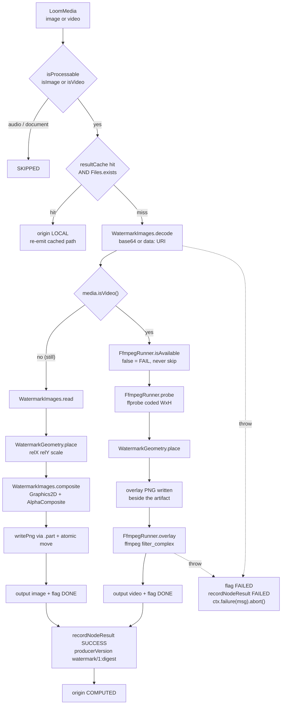

# Watermark Node (`watermark`) — Compositing an Overlay onto Stills and Video

> **Status**: 🟢 **Built and shipping.** Kind `watermark`, module
> [cortex/nodes/watermark/](../../../../cortex/nodes/watermark/), package
> `io.metaloom.cortex.node.watermark`.
> 51 unit tests + 2 integration tests; no model, no sidecar — plain ImageIO/`Graphics2D` for stills
> and an `ffmpeg` subprocess for video. Contract in the generated `node-descriptors.json`, kept
> honest by `NodeSpecGoldenTest`.
> **Scope**: the `watermark` node — everything from the source file's bytes to the `watermark_bin`
> artifact cache and the `asset_node_result` ledger row.
> **Audience**: AI coding agents and humans working on
> [cortex/nodes/watermark/](../../../../cortex/nodes/watermark/).

> 🔴 **It *applies* a watermark. It does not detect one.** The node is `TRANSFORM`: it composites a
> configured overlay onto the asset's own pixels and emits a marked copy. There is no watermark
> *detection* anywhere in the tree — no classifier, no model, no detection output port. Any spec text
> calling this "watermark detection" is wrong (§0.1).

**Out of scope, and where it lives instead:**

| Not here | There |
|---|---|
| The node system, lifecycle, registration, caching layers | [../NODES.md](../NODES.md) |
| Port content types and cardinality across all nodes | [../../pipeline/NODE_DATA_TYPES.md](../../pipeline/NODE_DATA_TYPES.md) §4 |
| Rules for adding a node at all | [../../../guidelines/NEW_NODE.md](../../../guidelines/NEW_NODE.md) |
| Worker configuration, `CORTEX_META_PATH`, container mounts | [../../../cortex/CONFIGURATION.md](../../../cortex/CONFIGURATION.md) |
| Getting the marked bytes off the worker | `s3-sink`, [../NODES.md](../NODES.md) §2.1 |
| Why produced media has no byte-ingest endpoint | [../../../concept/REST_CORTEX_METADATA_BINARY_HANDLING_PLAN.md](../../../concept/REST_CORTEX_METADATA_BINARY_HANDLING_PLAN.md), [../../rest/REST_BINARY_HANDLING.md](../../rest/REST_BINARY_HANDLING.md) |
| The customer-facing page and its three screenshots | [../../../website/WEBSITE.md](../../../website/WEBSITE.md) § Node pages |
| Other image/video node routing | [../../../cortex/SERVICE_IMAGE.md](../../../cortex/SERVICE_IMAGE.md), [../../../cortex/SERVICE_VIDEO.md](../../../cortex/SERVICE_VIDEO.md) |
| The other producers of new bytes | `thumbnail`, `imagegen`, `videogen`, `depthmap`, `sam2`, `image-manipulation` |

---

## 0. Executive Summary

| Question | Short answer |
|---|---|
| **What does it do?** | Composites a configured overlay image onto the asset — logo, copyright mark, preview badge |
| **Apply or detect?** | **Apply.** Category `TRANSFORM`. Nothing in the tree detects watermarks (§0.1) |
| **What media?** | Images and video. Audio and documents are skipped by `isProcessable` |
| **How?** | Stills: `Graphics2D` in-process. Video: the `ffmpeg` `overlay` filter — video re-encoded, **audio stream-copied** |
| **Is the source modified?** | **Never.** A marked copy is written; the archive file is byte-identical afterwards |
| **Where do the bytes go?** | `metaPath/watermark_bin/<segment>/<sha512>-<optionsDigest>.<ext>` on the worker |
| **Does it write to the schema?** | No. One `asset_node_result` row, `result_ref == null` (§4) |
| **Does it need anything installed?** | Images: nothing. **Video: `ffmpeg` *and* `ffprobe` on the worker** — missing, it fails, it does not skip |
| **Which output port fires?** | Exactly one of `image` / `video` per item, decided by the media kind (§3.1) |

### 0.1 The apply-vs-detect discrepancy

The descriptor, the node class, the tests and the customer page all agree: this node **applies** a
watermark. `WatermarkNode` is `@NodeSpec(… category = NodeCategory.TRANSFORM)`, its outputs are
`artifact/image` and `artifact/video`, and its whole implementation is a composite plus an encode.

[../../../cortex/SERVICE_VIDEO.md](../../../cortex/SERVICE_VIDEO.md) §2 routes "Watermark detection"
to `cortex/nodes/watermark/core`. That row is **wrong on both halves**: there is no watermark
detection in the repository, and if there were it would not be this node.
[../../../cortex/SERVICE_IMAGE.md](../../../cortex/SERVICE_IMAGE.md)'s "Depth maps, watermarks" row is
correct but points at the deleted concept plan. Both need repointing at this file.

```
media : media/*  ──▶  watermark  ──▶  image : artifact/image   (image items only)
                                 ──▶  video : artifact/video   (video items only)
                                 ──▶  flag  : scalar/string    (DONE | FAILED)
```

---

## 1. Architecture



The module is **pure JDK plus one external binary**. It pulls in neither OpenCV/video4j nor an HTTP
client, which is why its tests run anywhere.

---

## 2. The two media paths

| | Image path | Video path |
|---|---|---|
| Engine | `Graphics2D` / ImageIO, in-process | `ffmpeg` subprocess |
| Frame size from | `BufferedImage.getWidth/Height` | `ffprobe`, **coded** dimensions (§3.6) |
| Output format | **Always PNG** | The **source container** — `.mkv` in, `.mkv` out |
| Audio | n/a | **Stream-copied**, `-c:a copy`; a silent clip is fine |
| Output port | `image` | `video` |
| External requirement | none | `ffmpeg` + `ffprobe` |

The scaled overlay is produced by `Graphics2D` on **both** paths — `WatermarkNode.scaleForVideo`
renders the overlay at the resolved placement size before handing the PNG to ffmpeg, so a video
artifact's mark is resampled identically to an image artifact's.

The exact filter graph:

```
ffmpeg -nostdin -hide_banner -loglevel error -y -i <in> -i <overlay.png> \
  -filter_complex "[1:v]scale=W:H,format=rgba,colorchannelmixer=aa=OP[wm];[0:v][wm]overlay=X:Y[v]" \
  -map "[v]" -map "0:a?" \
  -c:v <videoCodec> -crf <videoCrf> -preset <videoPreset> -c:a copy \
  -movflags +faststart <target>.part.<ext>
```

---

## 3. The decisions worth keeping

### 3.1 Two output ports express a branch

Exactly one of `OUT_IMAGE` / `OUT_VIDEO` is written per item; a node wired to the other one simply
receives nothing for that item. That is how an image-only and a video-only downstream branch are
expressed **without a filter node** — the idiom [../NODES.md](../NODES.md) §"Two outputs express a
branch" generalises from here, and [../../pipeline/NODE_DATA_TYPES.md](../../pipeline/NODE_DATA_TYPES.md)
§ port routing records that a downstream port fed by both delivers when *either* fires.

### 3.2 🔴 Relative X/Y address the inset box, not the frame

The obvious `x = mediaW * relX` places the overlay's **left edge** at that fraction, so `relX = 1.0`
pushes the logo out of the picture and `0.5` centres its left edge rather than the logo. Instead
`WatermarkGeometry.place` computes:

```
targetW = scale > 0 ? round(mediaW * scale) : sourceW   // scale is relative to the MEDIA width
targetH = round(targetW * sourceH / sourceW)            // aspect preserved
x       = round((mediaW - targetW) * clamp(relX))
y       = round((mediaH - targetH) * clamp(relY))
```

`0.0` is flush left/top, `1.0` flush right/bottom, `0.5` exactly centred, and the overlay **can never
leave the frame** for any factor. Defaults `relX = relY = 0.95` give bottom-right with a margin.

`scale` is relative to the **media**, not absolute pixels, because a logo sized in pixels is correct
on exactly one resolution. Two clamps sit behind it: the width is capped at the frame width, and a
wide-and-short frame whose aspect-preserved height would overflow **gives up the requested width
rather than the aspect ratio** — a smaller logo is more obviously right than a squashed one.
Out-of-range factors are clamped rather than honoured; validation rejects them, but a node
constructed programmatically bypasses validation and silently placing the mark off-frame is worse.

### 3.3 `ffprobe`, not video4j

The video path needs only the frame size. `VideoFile.width()/height()` would answer it but drags the
**OpenCV native runtime** into the module. `ffprobe` ships with the `ffmpeg` the node already
requires, so the module stays pure JDK plus one binary and both paths share one `WatermarkGeometry`.
Resolving geometry in Java also keeps `scale2ref` — deprecated in ffmpeg 7 — out of the filter graph:
it only ever sees integers.

### 3.4 🔴 The options digest is in the *file name*, not only the cache key

`resolveArtifactPath` names the artifact `<sha512>-<optionsHash>.<ext>`. Two `watermark` nodes in one
graph (a logo bottom-right, a rating badge top-left) key on the same media SHA-512 and would
otherwise write to the same path and each serve the other's output. The 12-hex digest covers the
watermark **by content** — `WatermarkImages.strip`ped base64, not its length — plus `relX`, `relY`,
`scale`, `opacity` and the three video encode settings.

The video extension is not cosmetic either: ffmpeg picks its muxer from it, and `FilterHelper.isVideo`
— which decides whether a downstream node sees a video at all — looks at nothing else.

### 3.5 The cache hit re-checks the file

`resultCache` is an in-heap `LocalResultCache` of 10 000 entries keyed on
`absolutePath + "|" + optionsHash`. A hit is only honoured when `Files.exists` on the cached path
still holds — an artifact deleted from the cache directory between runs would otherwise be handed
downstream as a path that no longer resolves.

### 3.6 ⚠️ `ffprobe` reports *coded* dimensions

A clip carrying rotation side-data or a non-square sample aspect ratio **displays** at different
dimensions, and the overlay is then placed against coded rather than displayed geometry. Known,
documented in `FfmpegRunner.probe`, unhandled.

### 3.7 🔴 `ctx.failure(msg).abort()`, never `.next()`

`NodeContextImpl.next()` ignores a recorded failure cause and builds the result as `SUCCESS`
([../NODES.md](../NODES.md)). Here that would report an **un-watermarked** item as done. This node
aborts, after writing `FAILED` to the flag port and a `FAILED` ledger row.

### 3.8 ⚠️ A missing ffmpeg fails, it does not skip

A skip reads as "this clip needed no watermarking", which would quietly ship unmarked video. The
`IOException` names the `ffmpegPath` option so the operator knows which knob to turn.

### 3.9 The subprocess is drained on a separate daemon thread

Draining *after* `waitFor` deadlocks on a full pipe, and draining on the calling thread makes
`readLine` block until the child closes the pipe — so the wall clock, the one failure mode the
timeout exists to bound, could never fire. `FfmpegRunner.run` therefore starts a daemon drain thread
that retains only the trailing **20** lines, joins it with a 5 s bound, and redirects stdin from the
null device on top of `-nostdin` (a worker started from a terminal would otherwise hand the child its
controlling tty).

### 3.10 Reproducibility lives in `producerVersion`

`producerVersion = "watermark/1:" + sha256(strip(watermarkBase64))[0..12]`. A changed logo is visibly
a different producer in the ledger, so the row records **which** mark was burned in rather than only
that some watermark node ran. `ALGORITHM_VERSION` is bumped when the compositing itself changes
meaning.

---

## 4. Persistence: ledger only

| What | Where |
|---|---|
| The marked PNG or clip | `metaPath/watermark_bin/<segment>/<sha512>-<optionsDigest>.<ext>` on the worker |
| The record that this node ran | one `asset_node_result` row, `result_ref == null` |
| Which mark produced it | `producerVersion = watermark/1:<logo digest>` |

No migration, no component table, no schema risk — the same contract as
`thumbnail`/`imagegen`/`depthmap`/`sam2` ([../NODES.md](../NODES.md) §persistence). There is no
byte-ingest endpoint for produced media, so nothing durable holds the pixels.

> 🔴 **The artifact is worker-local.** Any node consuming it must run on the same worker. Wiring
> `image`/`video` into **`s3-sink`** is the only supported way to get the bytes off the machine —
> `artifact/image` and `artifact/video` both satisfy its `artifact/*` input through the family
> wildcard.

---

## 5. The flag port

| Value | Meaning |
|---|---|
| `DONE` | The marked artifact was written (or re-emitted from the local cache) |
| `FAILED` | Decode, probe, encode or write failed; the node also aborts with the cause |

There is no `NONE`: an image or video that reached `compute` always has an overlay to receive.
Non-media items never get a flag at all — they are skipped by `isProcessable`.

---

## 6. Options

All are `watermark.*` node options, per pipeline instance ([../NODES.md](../NODES.md) §7 for how they
are set). The node has **no worker-level configuration** of its own beyond `metaPath`.

| Option | Type | Default | Notes |
|---|---|---|---|
| `watermarkBase64` | `CODE` | `""` | **Required.** Bare base64 or a full `data:image/png;base64,…` URI. Carried in the definition so any worker can run the node without shared storage |
| `relX` | `NUMBER` | `0.95` | `[0,1]`. Fraction of the **inset box**, not the frame (§3.2) |
| `relY` | `NUMBER` | `0.95` | `[0,1]` |
| `scale` | `NUMBER` | `0.20` | `[0,1]`. Fraction of the **media** width, aspect preserved; `0` keeps the overlay's native size |
| `opacity` | `NUMBER` | `1.0` | `(0,1]`. **Scales** the overlay's existing alpha — a transparent pixel stays transparent at any opacity |
| `videoCodec` | `STRING` | `libx264` | Video path only |
| `videoCrf` | `INTEGER` | `23` | `[0,51]`, lower is better. Video path only |
| `videoPreset` | `STRING` | `medium` | Video path only |
| `ffmpegPath` | `STRING` | `ffmpeg` | Resolved on `PATH` when a bare name; named in the failure message when missing |
| `ffprobePath` | `STRING` | `ffprobe` | |
| `timeoutMs` | `INTEGER` | `600000` | Inherited from `AbstractNodeOptions`, **re-documented via `@ParamOverride`** because a CPU re-encode needs a far larger budget than an API call. Wall clock per invocation |
| `enabled`, `processIncomplete`, `retryFailed` | `BOOLEAN` | `true`/`false`/`false` | Standard, from `AbstractNodeOptions` |

`validate()` runs at node construction (`RegistryNodeRegistrar`), so a misconfiguration surfaces when
the pipeline starts rather than once per item — including **base64 decodability**, by far the
likeliest mistake in a pasted blob. Every problem is reported together, not just the first.

### Environment variables

The node reads no environment variable of its own. One inherited setting decides where its artifacts
land:

| Variable | Default | Meaning |
|---|---|---|
| `CORTEX_META_PATH` | `${user.home}/.cache/metaloom/cortex/meta` | Base of the artifact cache; the node writes under `<metaPath>/watermark_bin`. See [../../../cortex/CONFIGURATION.md](../../../cortex/CONFIGURATION.md) |

`ffmpeg` and `ffprobe` are located by the two options above, i.e. by `PATH` unless overridden — there
is no `FFMPEG_PATH` env var.

---

## 7. Conventions and Gotchas

🔴 **A `.part` temp file must keep the target's extension last.** ffmpeg picks its output muxer from
the file name, so `clip.mp4.part` fails with *"Unable to choose an output format"*.
`AtomicFiles.partFor` produces `clip.part.mp4`. Real bug; pinned twice, by
`WatermarkImagesTest.testPartFileKeepsTheTargetsExtensionLast` and by `cortex/fs`'s own
`AtomicFilesTest`.

🔴 **`AtomicFiles` lives in `cortex/fs`, not in this module.** It was duplicated verbatim here and in
`image-manipulation` and was hoisted into `io.metaloom.cortex.fs` when the `move`/`assign` kinds
landed. Do not re-add a local copy.

🔴 **The descriptor is generated, not hand-written.** The ports, the 14 parameters, the icon and the
category all come from `@NodeSpec` / `@PortDoc` / `@ParamDoc` on `WatermarkNode` and
`WatermarkNodeOptions`, harvested into
`loom-shared/node-model/src/main/resources/node-descriptors.json`. There is **no**
`WatermarkDescriptorProvider` any more, and `NodePortConformanceTest` is gone — `NodeSpecGoldenTest`
subsumed both. Regenerate with
`-Dtest=NodeSpecGoldenTest -Dloom.regenerateNodeDescriptors=true` after any annotation edit.

🔴 **`timeoutMs` is advertised but inherited.** The node reads `options().getTimeoutMs()` when
building `FfmpegRunner`. If a refactor moves that field off `AbstractNodeOptions`, the descriptor
parameter silently becomes a no-op — nothing binds the two.

⚠️ **`%.4f` with `Locale.ROOT` for the opacity.** A comma decimal separator splits the filter
argument and ffmpeg rejects the whole graph — on a German-locale worker only.

⚠️ **The video overlay PNG is written next to the artifact**, not into a shared temp directory, so
two concurrent watermark nodes with different logos cannot clobber each other mid-encode. It is
deleted in a `finally`.

⚠️ **The composite always copies into a fresh `TYPE_INT_ARGB` raster.** `ImageIO.read` may hand back
a read-only or indexed raster, and compositing onto an indexed palette silently quantises the overlay.

⚠️ **Image output is always PNG**, whatever went in. PNG is alpha-safe and byte-deterministic, which
is what lets the tests assert individual pixels.

⚠️ **`NodeResult` carries no origin.** `ctx.origin(LOCAL)` is set but not observable, so the tests
prove a cache hit by overwriting the artifact with a sentinel and checking it survives.

⚠️ **`defaultConcurrency = 1`** — the `@NodeSpec` default, and the right one here: ffmpeg is already
internally threaded and a re-encode saturates a machine on its own.

---

## 8. Key Classes Reference

| Class | Package / module | Purpose |
|---|---|---|
| `WatermarkNode` | `io.metaloom.cortex.node.watermark` (`cortex/nodes/watermark/core`) | Kind `watermark`; ports `IN_MEDIA`, `OUT_IMAGE`, `OUT_VIDEO`, `OUT_FLAG`; cache key, artifact path, ledger, `@NodeSpec` contract |
| `WatermarkNodeOptions` | same | `KEY = "watermark"`, the ten own options + `@ParamOverride` on `timeoutMs`, `validate()` |
| `WatermarkNodeModule` | same | Dagger `@Binds @IntoSet` + `@Binds @IntoMap @StringKey("watermark")`, option deserializer info |
| `WatermarkGeometry` | same | **Pure** relative→absolute placement; `record Placement(x, y, width, height)`. No ImageIO, no ffmpeg |
| `WatermarkImages` | same | base64/`data:` decode, `strip`, `read`, `Graphics2D` composite, atomic PNG write |
| `FfmpegRunner` | same | The only class that starts a process: `isAvailable()`, `probe()`, `overlay()`; `record VideoDimensions(width, height)` |
| `AtomicFiles` | `io.metaloom.cortex.fs` (`cortex/fs`) | **shared** — the `.part` naming rule and the replacing atomic move |
| `LocalResultCache` | `io.metaloom.cortex.common.cache` | **reused** — the in-heap artifact-path skip cache |
| `NodeCollectionModule` | `io.metaloom.cortex.cli.dagger` (`cortex/cli`) | Includes `WatermarkNodeModule.class`; where the kind reaches the worker |
| `ContentTypeRegistry` | `io.metaloom.loom.nodes.spec` (`loom-shared/node-model`) | `ARTIFACT_IMAGE`, `ARTIFACT_VIDEO`, `MEDIA_ANY`, `SCALAR_STRING` |

---

## 9. Progress Assessment

### Done

- [x] Module, node, options, Dagger module, kind binding via `WatermarkNodeModule` in `NodeCollectionModule`
- [x] Image path — ImageIO/`Graphics2D`, no OpenCV, atomic PNG write through `AtomicFiles`
- [x] Video path — `ffmpeg` overlay filter, audio stream-copied, source container preserved,
      wall-clocked subprocess with bounded output capture and forcible termination
- [x] Pure `WatermarkGeometry` shared by both paths, including both overflow clamps
- [x] `artifact/video` content type in `ContentTypeRegistry`; satisfies `s3-sink`'s `artifact/*`
      input through the family wildcard
- [x] Annotation-declared descriptor: 1 input + 3 output ports, 14 parameters, `TRANSFORM`, icon
      `branding_watermark`; pinned by `NodeSpecGoldenTest`
- [x] Options digest in the artifact **file name**; cache hit re-checks `Files.exists`
- [x] `abort()` on failure, not `next()`; `FAILED` on the flag port and in the ledger before aborting
- [x] 51 unit tests (6 classes + `WatermarkFixtures` + two AssertJ helpers) + 2 integration tests
- [x] Docs fixture recipe (`DocsFixtureGenerator`, `Requirement.offline()`) and the customer page
      `website/content/english/docs/nodes/watermark/` with `nodeviz`, `config.png`, `debug.png`,
      `debug-detail.png`

### Follow-ups this node creates

- [ ] 🔴 **The artifact is durable only via `s3-sink`, which must share a worker with this node.**
      The general raw-byte-ingest gap is owned by
      [../../../concept/REST_CORTEX_METADATA_BINARY_HANDLING_PLAN.md](../../../concept/REST_CORTEX_METADATA_BINARY_HANDLING_PLAN.md);
      the affinity half is [../NODES.md](../NODES.md). Nothing to solve inside this node.
- [ ] 🔴 **The descriptor icon is never rendered.** `branding_watermark` appears nowhere under
      `loom-ui/src`; `NodeDescriptor.icon` is declared in `loom-ui/src/types/nodeDescriptors.ts` and
      read by nothing. A UI-wide gap, not a watermark one.
- [ ] **No demo data.** `DemoDatabaseInitializer` has no `watermark` node in any demo pipeline, so the
      node is invisible in a fresh demo instance. Required by
      [../../../guidelines/CODING.md](../../../guidelines/CODING.md).
- [ ] **Rotation/SAR is not handled** (§3.6). A rotated clip gets its mark against coded geometry.
- [ ] **No test binds `timeoutMs` to the descriptor**, so moving the inherited field would silently
      make the advertised parameter a no-op.

### Deliberately not built

- [ ] **The watermark cannot come from upstream.** An optional `watermark : artifact/image` input port
      would let `imagegen` or `script` supply the overlay, following `imagegen`'s
      wired-port-beats-configured-option idiom. `WatermarkNode` declares only `IN_MEDIA`.
- [ ] **No `watermarkPath` option.** A large logo must be inlined into the pipeline JSON, which is
      stored in Postgres and rendered in the editor.
- [ ] **PNG output only** for images. PNG is alpha-safe and byte-deterministic, which the pixel
      assertions rely on; a JPEG + quality option is unimplemented.
- [ ] **No tiling, rotation or text watermarks.** One overlay, one position.
- [ ] **No watermark *detection*.** Reading a mark out of an asset is a different job needing a model;
      nothing in the tree does it (§0.1).

---

## 10. Test Setup

```bash
# The node and all its helpers - 51 tests, no model and no sidecar.
# The video suite generates its own clip and self-skips without ffmpeg.
./mvnw -o -pl cortex/nodes/watermark/core test

# The generated contract equals the annotated node
./mvnw -o -pl integration-test test -Dtest=NodeSpecGoldenTest
# ... and to regenerate it after an annotation edit:
./mvnw -o -pl integration-test test -Dtest=NodeSpecGoldenTest -Dloom.regenerateNodeDescriptors=true

# The kind is advertised by the worker and by the descriptor registry
./mvnw -o -pl cortex/cli test -Dtest=NodeRegistrarTest
./mvnw -o -pl loom-shared/node-model test -Dtest=NodeDescriptorServiceLoaderTest

# End to end against an in-process Loom + pooled Postgres (2 tests)
./setup-pool.sh
./mvnw -o -pl integration-test test -Dtest=WatermarkNodeIntegrationTest

# Regenerate the docs fixture and both card screenshots (offline - no sidecar needed)
mvn -o -pl integration-test test -Dtest=DocsFixtureGenerator \
    -Dloom.regenerateDocsFixtures=true -Dloom.docsFixtureKinds=watermark
cd loom-ui && node scripts/capture-node-config-screenshots.mjs watermark \
           && node scripts/capture-node-screenshots.mjs watermark
```

| Test | Count | What it guards against |
|---|---|---|
| `WatermarkGeometryTest` | 10 | Off-frame at `1.0`; left-edge-not-centre at `0.5`; a lost aspect ratio; an overlay wider than the frame; a tall overlay on a short frame squashed instead of shrunk; zero-pixel overlays; out-of-range factors placing off-frame |
| `WatermarkImagesTest` | 10 | Undecodable base64 or a `data:` URI reaching ImageIO; whitespace in a hand-edited payload; compositing off by a pixel; the arguments being mutated; opacity not blending; a partial file left behind; the `.part`/muxer trap |
| `WatermarkNodeTest` | 11 | The wrong corner; the **source file being modified**; a stale artifact shared between two differently-configured nodes; a cache hit serving a deleted file; audio/documents not skipped; an undecodable watermark succeeding with no artifact |
| `WatermarkNodeVideoTest` | 6 | The real ffmpeg contract — coded dimensions read correctly, dimensions preserved, **audio copied**, no temp files left behind, a cache hit, and a missing binary failing rather than skipping |
| `WatermarkOptionsValidationTest` | 8 | A misconfiguration surfacing per item instead of at pipeline start; `opacity = 0` accepted or `scale = 0` wrongly rejected; only the first error being reported |
| `WatermarkNodePipelineTest` | 6 | The adapter, completion and tracking events, the artifact chaining into a downstream consumer, disabled + dry-run skip |
| `WatermarkNodeIntegrationTest` | 2 | The ledger row not reaching Postgres or losing its `producerVersion`; the video port filled for an image asset; a **failed** run not being recorded at all |

---

## 11. Where do I find …?

| Need | Path |
|---|---|
| The node | [cortex/nodes/watermark/core/…/WatermarkNode.java](../../../../cortex/nodes/watermark/core/src/main/java/io/metaloom/cortex/node/watermark/WatermarkNode.java) |
| The placement arithmetic | `…/watermark/WatermarkGeometry.java` |
| base64 decode + compositing | `…/watermark/WatermarkImages.java` |
| Every subprocess call | `…/watermark/FfmpegRunner.java` |
| Options + `validate()` | `…/watermark/WatermarkNodeOptions.java` |
| The `.part` naming rule and the atomic move | [cortex/fs/…/AtomicFiles.java](../../../../cortex/fs/src/main/java/io/metaloom/cortex/fs/AtomicFiles.java) |
| Synthetic image fixtures + AssertJ helpers | `cortex/nodes/watermark/core/src/test/…/WatermarkFixtures.java`, `…/assertj/` |
| The generated descriptor entry | `loom-shared/node-model/src/main/resources/node-descriptors.json` (`"nodeId": "watermark"`) |
| The `artifact/video` content type | `loom-shared/node-model/…/spec/ContentTypeRegistry.java` |
| Kind binding | `cortex/cli/src/main/java/io/metaloom/cortex/cli/dagger/NodeCollectionModule.java` |
| The docs fixture recipe | `integration-test/…/node/docs/DocsFixtureGenerator.java` (`simple("watermark", …)`) |
| The customer page | [website/content/english/docs/nodes/watermark/index.adoc](../../../../website/content/english/docs/nodes/watermark/index.adoc) |
| The node system as a whole | [../NODES.md](../NODES.md) |
| The port/content-type model | [../../pipeline/NODE_DATA_TYPES.md](../../pipeline/NODE_DATA_TYPES.md) |
| Rules for building the next node like this one | [../../../guidelines/NEW_NODE.md](../../../guidelines/NEW_NODE.md) |
| Where the bytes should eventually go | [../../../concept/REST_CORTEX_METADATA_BINARY_HANDLING_PLAN.md](../../../concept/REST_CORTEX_METADATA_BINARY_HANDLING_PLAN.md) |

---

_Git HEAD revision: `8c153347`_
_Last updated: 2026-08-11_
