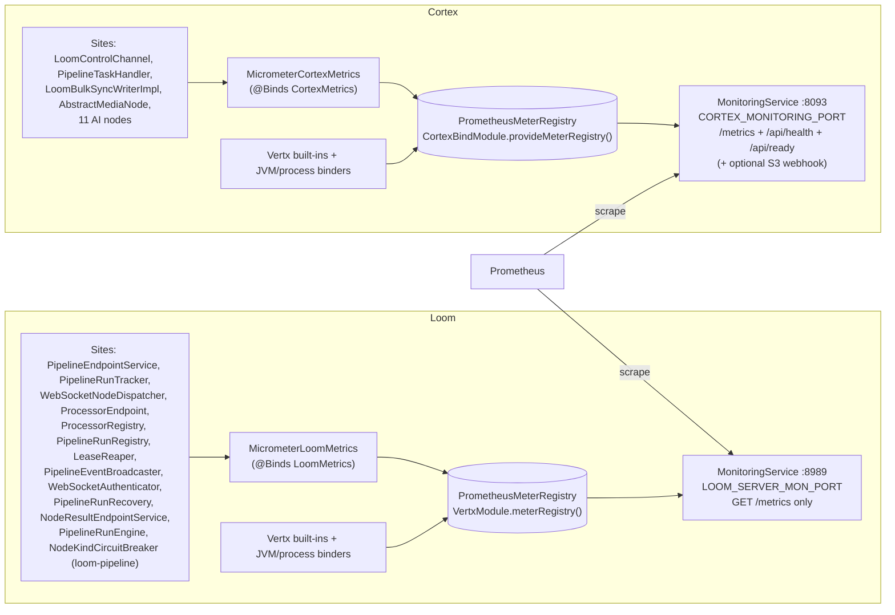

# MetaLoom — Metrics & Prometheus Specification

> **Audience: AI coding agents.** How Loom and Cortex expose Prometheus metrics on their
> **monitoring** ports.
>
> ⚠️ **Status: PARTIALLY IMPLEMENTED.** The transport (registry, `/metrics` routes, both catalogs) is
> built and test-covered. **12 meters listed in earlier revisions of this file did not exist or were
> never recorded** — they were segregated into §5 "Declared but never recorded / not implemented".
> **Five of those are now live** (plus four new meters they needed to be readable — see §3.1);
> **seven remain** in §5, which is still the gap list.
> Do not treat §3/§4 tables as a wish list: only rows there are live — and
> `MetricsCatalogScrapeTest` now enforces that in both directions, so a row in the wrong section
> fails the build rather than misleading a dashboard.
>
> **The source of truth is the code** — if this contradicts it, the code wins and this file is fixed
> in the same change.
>
> Related: [MONITORING.md](MONITORING.md) (health/readiness + the monitoring servers themselves — the
> companion of this file), [../../cortex/CORTEX.md](../../cortex/CORTEX.md),
> [../../loom/LOOM.md](../../loom/LOOM.md), [../../loom/RESTAPI.md](../../loom/RESTAPI.md).

---

## 1. TL;DR

- Each component exposes a **Prometheus scrape endpoint** at `GET /metrics` on its **monitoring
  port**, never on the public REST/gRPC/MCP port.
  - **Cortex** — `MetricsEndpoint` mounted on the existing `MonitoringService` router. Port **8093**
    (`CORTEX_MONITORING_PORT`), shared with `/api/health` + `/api/ready` (see
    [MONITORING.md](MONITORING.md)).
  - **Loom** — a dedicated `MonitoringService` binds `LOOM_SERVER_MON_PORT` (default **8989**) and
    serves **only** `/metrics`. Loom's health check lives elsewhere, on the REST port.
- Backend is **Micrometer** with a single shared `PrometheusMeterRegistry` per process, created
  **before** `Vertx` and handed to it via `MicrometerMetricsFactory`, so Vert.x HTTP / event-bus /
  pool families appear alongside the custom domain meters. JVM + process binders are attached
  explicitly at registry-construction time (`setJvmMetricsEnabled(false)` on the Vert.x options
  avoids double registration).
- Each component has a **catalog interface** — `LoomMetrics` (`loom-common`) / `CortexMetrics`
  (`cortex-common`) — with a Micrometer impl bound downstream and a `Noop*` for tests and offline
  paths. Instrumentation sites inject the interface; they never touch Micrometer directly.
- `/metrics` is **unauthenticated** — it lives on the internal monitoring port. Restrict at the
  network layer.
- **`GET /api/v1/metrics` is a different route** and not a second scrape endpoint: an authenticated
  JSON read of the `loom_*` catalog on the app REST port, gated by `READ_METRIC`, for callers that
  cannot reach the monitoring port — the web UI above all. It serves the **same registry** and the
  **same series names**, and carries **no history**. See §3.2.

---

## 2. Architecture

**Ordering invariant.** `Vertx` must be built *after* the registry, so both Dagger modules express it
as a provider parameter: `Vertx provideVertx(PrometheusMeterRegistry registry)`.

---

## 3. Loom Metrics (`loom_*`) — live

Every row below has a verified registration **and** an increment/bind call site.

| Metric | Type | Labels | Call site |
|---|---|---|---|
| `loom_pipeline_runs_started_total` | counter | — | `PipelineEndpointService:388` |
| `loom_pipeline_runs_completed_total` | counter | `status` | `PipelineRunTracker:190` |
| `loom_pipeline_run_duration_seconds` | timer | `status` | `PipelineRunTracker:190` (same call) |
| `loom_pipeline_runs_rejected_total` | counter | `reason`=invalid_graph\|no_processor | `PipelineEndpointService:357,370` |
| `loom_pipeline_runs_recovered_total` | counter | — | `PipelineRunRecovery:119` |
| `loom_node_tasks_dispatched_total` | counter | `kind` (+ literal `segment`) | `WebSocketNodeDispatcher:72,98` |
| `loom_node_tasks_dispatch_failed_total` | counter | `reason`=no_processor\|socket_gone | `WebSocketNodeDispatcher:59,68,87,94` |
| `loom_node_task_latency_seconds` | timer | `kind`, `state`=completed\|failed\|skipped | `PipelineRunEngine.recordLatency` (from `record`) |
| `loom_node_tasks_retried_total` | counter | `kind` | `PipelineRunEngine.scheduleRetry` |
| `loom_node_tasks_deadlettered_total` | counter | `kind` | `PipelineRunEngine.onNodeTaskLost` (budget exhausted) |
| `loom_node_tasks_inflight` | gauge | — | `PipelineRunRegistry` (`bindGauge`, summed over live runs) |
| `loom_node_tasks_inflight_ceiling` | gauge | — | `PipelineRunRegistry` (`bindGauge`, summed `getMaxInFlight`) |
| `loom_pipeline_runs_active` | gauge | — | `PipelineRunRegistry` (`bindGauge`, `activeRunCount`) |
| `loom_node_circuit_breaker_state` | gauge | `kind` — 0 closed, 1 half_open, 2 open | `NodeKindCircuitBreaker.statsFor` (bound on first sight of a kind) |
| `loom_node_circuit_breaker_trips_total` | counter | `kind` | `NodeKindCircuitBreaker.trip` |
| `loom_node_results_received_total` | counter | `kind`, `state` | `ProcessorEndpoint:521` |
| `loom_source_items_received_total` | counter | — | `ProcessorEndpoint:413` |
| `loom_asset_node_results_written_total` | counter | `kind`, `state` | `NodeResultEndpointService:72` |
| `loom_tasks_returned_total` | counter | `node` (nodeId, `unknown` if null) | `ProcessorEndpoint:582` |
| `loom_leases_reclaimed_total` | counter | — | `LeaseReaper:138` |
| `loom_orphans_deadlettered_total` | counter | — | `LeaseReaper:185` |
| `loom_processors_connected` | gauge | — | `ProcessorRegistry:86` (`bindGauge`, `processors::size`) |
| `loom_processors_by_state` | gauge | `state`=starting\|online\|offline\|paused\|terminating | `ProcessorRegistry` ctor (one `bindGauge` per enum constant) |
| `loom_processor_registrations_total` | counter | — | `ProcessorRegistry:141` |
| `loom_processor_disconnects_total` | counter | — | `ProcessorRegistry:194` |
| `loom_processor_heartbeats_total` | counter | — | `ProcessorRegistry:239` |
| `loom_pipeline_event_subscribers` | gauge | — | `PipelineEventBroadcaster:51` (`bindGauge`, `subscribers::size`) |
| `loom_pipeline_events_broadcast_total` | counter | — | `PipelineEventBroadcaster:136` |
| `loom_pipeline_events_dropped_total` | counter | — | `PipelineEventBroadcaster:132` (backpressure) |
| `loom_auth_failures_total` | counter | `type` — **only `ws` is ever emitted** | `WebSocketAuthenticator:79,94` |
| `vertx_http_server_*`, `vertx_pool_*`, `vertx_eventbus_*` | auto | — | Vert.x built-ins on the shared registry. No prefix is configured on `MicrometerMetricsOptions`, so these are **not** `loom_*` — an earlier revision of this row said they were |
| `jvm_*`, `process_cpu_usage`, `process_uptime_seconds` | auto | — | `ClassLoader`/`JvmMemory`/`JvmGc`/`JvmThread`/`Processor`/`Uptime` binders in `VertxModule.meterRegistry()` |

**`loom_tasks_returned_total` vs `loom_leases_reclaimed_total`** — the same recovery, but paid for at
announcement rather than after a lease interval. A fleet that scales down often and shows reclaims
instead of returns has workers dying rather than draining.

### 3.1 The four fleet-health signals

`loom_node_tasks_dispatched_total` rises identically whether the fleet is fast or wedged. These four
are what tell those apart, and none of them existed before:

- **`loom_node_task_latency_seconds`** — dispatch to result, the only meter that closes the loop
  dispatch counters open. Silent for a dispatch **no worker took**: the engine starts the clock only
  after the dispatcher returns a worker id, so a fleet at zero capacity shows
  `loom_node_tasks_dispatch_failed_total` rather than a suspiciously fast p99. A retried attempt is
  likewise not timed — it never settles; it is counted by `loom_node_tasks_retried_total`. On the
  **segment** path every member's clock starts at the one dispatch, so a member's latency includes
  the time its predecessors in the segment ran.
- **`loom_node_tasks_inflight` vs `loom_node_tasks_inflight_ceiling`** — depth alone cannot
  distinguish busy from saturated, and it is saturation that decides whether adding workers helps.
  Both are summed **across live runs** by `PipelineRunRegistry`, never labelled per run: a run is a
  UUID, and that is the cardinality rule. Divide by `loom_pipeline_runs_active` for a per-run mean.
  A run configured as unlimited contributes 0 to the ceiling.
- **`loom_node_circuit_breaker_state{kind}`** — a parked kind produces no dispatches, no failures
  and no errors; throughput simply goes flat. Encoded by severity (0 closed, 1 half_open, 2 open),
  deliberately *not* `State.ordinal()`, so `max()` across kinds reads as "how bad". Pair it with
  `loom_node_circuit_breaker_trips_total{kind}`: the gauge says whether a kind is parked *now*, the
  counter separates one bad deployment from a kind that has been flapping all afternoon (each failed
  probe counts a further trip).
- **`loom_processors_by_state{state}`** — attached is not the same as usable; only `ONLINE` workers
  are placeable. A rolling restart that leaves the fleet in `TERMINATING` reads perfectly healthy on
  `loom_processors_connected` alone while no work moves. One series per enum constant, bound at
  construction, so a state with no workers reads 0 rather than vanishing.

### 3.2 `GET /api/v1/metrics` — the JSON read of the same catalog

The scrape endpoint is on the monitoring port and unauthenticated (§1), so a browser cannot use it
and must not be able to. The web UI's monitoring screen therefore reads the catalog through an
ordinary app route instead:

| | Prometheus scrape | REST snapshot |
|---|---|---|
| Path | `GET /metrics` | `GET /api/v1/metrics` |
| Port | monitoring, **8989** | REST, **8092** |
| Auth | none (network-gated) | JWT + `READ_METRIC` |
| Body | Prometheus text exposition | `MetricsResponse` JSON |
| Scope | everything on the registry | `loom_*` only |
| Consumer | Prometheus | `loom-ui`, `loom-client`, `clients/python` |

**Same registry, same names.** `MetricsSnapshot` (`loom/services/rest`, `…rest.service.impl`)
projects `PrometheusMeterRegistry.getMeters()` and applies the suffix convention of §8 itself, so a
counter registered as `loom_pipeline_runs_started` is served as `loom_pipeline_runs_started_total`,
exactly as in a scrape. `MetricsSnapshotCatalogTest` asserts that in three directions: every §3 name
is served, no §5 name is, and every served name appears verbatim in a real scrape of the same
registry. A projection that forgot a suffix would otherwise serve a dashboard a series no PromQL
query can name, and nothing would notice.

**One instant, no history.** Loom has no time-series store. The response carries a `timestamp` and
the current reading of every series; a caller wanting a rate samples twice and differences the
counters (`loom-ui` polls every 5s and keeps a five-minute window), and a caller wanting weeks wants
a Prometheus. Nothing in the payload is interpolated.

| Field | Meaning |
|---|---|
| `timestamp` | Server time of the snapshot (ISO 8601 instant) — the interval a rate divides by |
| `metrics[].name` | The **scraped** name, suffixes included |
| `metrics[].type` | `COUNTER` \| `GAUGE` \| `TIMER` \| `SUMMARY` \| `OTHER` |
| `metrics[].tags` | The label set; one entry per name+tag series, as in a scrape |
| `metrics[].value` | Counter total or gauge reading; `null` for a timer |
| `metrics[].count` / `sumSeconds` / `maxSeconds` / `meanSeconds` | Timer only |

`?prefix=` narrows by name prefix (`loom_node_tasks_`). A prefix outside the `loom_` namespace is a
**400**, not an empty list — a caller must never be able to read a 200 as "`jvm_memory_used_bytes`
is zero here".

A gauge whose supplier reports `NaN` is served as `null`. `NaN` is not valid JSON and would take the
whole response down with it, and "no reading" is the honest translation.

---

## 4. Cortex Metrics (`cortex_*`) — live

| Metric | Type | Labels | Call site |
|---|---|---|---|
| `cortex_loom_connected` | gauge | — | `LoomControlChannel:230` |
| `cortex_loom_registered` | gauge | — | `LoomControlChannel:231` |
| `cortex_loom_reconnect_attempts` | gauge | — | `LoomControlChannel:232` |
| `cortex_loom_reconnects_total` | counter | — | `LoomControlChannel:372` (`scheduleReconnect`) |
| `cortex_loom_messages_received_total` | counter | `type` = lowercased `MessageType` | `LoomControlChannel:481` |
| `cortex_tasks_received_total` | counter | `type`=node\|segment\|source | `PipelineTaskHandler:145,299,365` |
| `cortex_tasks_completed_total` | counter | `type`, `state` | `PipelineTaskHandler:324,336,401` |
| `cortex_task_duration_seconds` | timer | `type` | `PipelineTaskHandler:337` |
| `cortex_tasks_returned_total` | counter | `reason`=refused\|unfinished | `PipelineTaskHandler:263,371` |
| `cortex_node_operations_total` | counter | `node_kind`, `state` | `PipelineTaskHandler:327,338` |
| `cortex_node_operation_duration_seconds` | timer | `node_kind` | same call (`recordNodeOperation`) |
| `cortex_files_missing_total` | counter | — | `AbstractMediaNode:57` (**only** site) |
| `cortex_bulk_sync_assets_total` | counter | `outcome`=synced\|failed\|dropped_offline\|skipped_no_hash | `LoomBulkSyncWriterImpl:66,85,99,103` |
| `cortex_source_items_enumerated_total` | counter | — | `PipelineTaskHandler:400` |
| `cortex_ai_calls_total` | counter | `provider`, `outcome`=success\|failure | 11 AI nodes — see below |
| `cortex_ai_call_duration_seconds` | timer | `provider` | same calls |
| `cortex_ai_cache_hits_total` | counter | `provider` | same nodes, in-heap skip caches |
| `cortex_memory_used_bytes` | gauge | — | `LoomControlChannel:233` |
| `cortex_memory_max_bytes` | gauge | — | `LoomControlChannel:234` |
| `cortex_cpu_load` | gauge | — | `LoomControlChannel:238` (`SystemLoadProbe`, 0 when unknown) |
| `cortex_io_load` | gauge | — | `LoomControlChannel:242` (busiest disk `%util`, 0 when unknown) |
| `cortex_disk_used_bytes` / `cortex_disk_total_bytes` | gauge | — | `LoomControlChannel:246,247` |
| `jvm_*`, `process_cpu_usage`, `vertx_*` | auto | — | `CortexBindModule.provideMeterRegistry()` + Vert.x built-ins |

### 4.1 `provider` label values actually emitted

| Provider | Node |
|---|---|
| `llm` | `LLMNode` |
| `smolvlm`, `video-vlm` | `CaptioningNode` |
| `vlm` | `VlmNode` (`METRICS_PROVIDER` constant) |
| `whisper` | `WhisperNode` |
| `tesseract` | `OCRNode` |
| `tts` | `TtsNode` |
| `sentiment` | `SentimentNode` |
| `imagegen` | `ImageGenNode` |
| `videogen` | `VideoGenNode` |
| `depthmap` | `DepthmapNode` |

Each node follows the same shape: `recordAiCacheHit(provider)` on the skip-cache path, then
`recordAiCall(provider, success, System.currentTimeMillis() - aiStart)` on both the success and the
failure branch. **AI-provider instrumentation stays on the Cortex node side** — the providers
(`OpenAILLMProvider`, `SmolVLMClient`, …) live in the separate **genai-utils** repo, so wrap the call
in the node rather than editing genai-utils.

---

## 5. Declared but never recorded / not implemented

**This is the gap list. Anything here must not be documented to customers or used in a dashboard.**

### 5.1 Registered in the Micrometer impl, but the catalog method has zero callers

The meter exists in `MicrometerCortexMetrics` and would work — nothing ever calls it, so the series
never appears in a scrape.

| Metric | Catalog method | Notes |
|---|---|---|
| `cortex_results_sent_total` | `CortexMetrics.recordResultsBatchSent(int)` | Intended site `ResultBatcher` (`cortex/node-runtime`) has **no** `CortexMetrics` dependency. |
| `cortex_results_batches_sent_total` | `CortexMetrics.recordResultsBatchSent(int)` | Same call — both counters are dead together. |
| `cortex_source_ack_timeouts_total` | `CortexMetrics.recordSourceAckTimeout()` | Intended site `SourceTaskRunner` never calls it. |

### 5.2 No registration and no catalog method — pure documentation fiction

| Metric | Component | Reality |
|---|---|---|
| `loom_result_store_flush_batch_size` | Loom | No summary is registered; `DaoRunStateStore` is uninstrumented. The catalog has no distribution-summary helper yet — adding one is part of this row. |
| `loom_processor_cpu_load` | Loom | `ProcessorRegistry` stores `SystemStatusInfo` but binds no gauge from it. Unlike `loom_processors_by_state`, this cannot use a fixed set of series: it would be labelled per `node_id`, bound and unbound as workers come and go, and `bindGauge` has no unbind. |
| `loom_processor_memory_used_bytes` | Loom | idem |
| `cortex_results_pending` | Cortex | No `bindGauge("cortex_results_pending", …)` anywhere; `ResultBatcher.pendingFor()` is not bound. |

The structural blocker this section named — *"`loom/pipeline` has zero metrics instrumentation;
`PipelineRunEngine` never sees `LoomMetrics`"* — is gone. `loom-pipeline` now depends on
`loom-common` for the catalog **interface only** (no Micrometer), and the engine takes it through
`setMetrics`, alongside the circuit breaker and the retry scheduler, so the several thousand lines
of evaluation semantics stay constructible from nothing but a graph and a dispatcher. The
`ban-cortex-dependencies` enforcer is untouched: the orchestrator still must not see the worker.

### 5.3 Partially dead labels

- `loom_auth_failures_total{type}` — **only `ws`** is emitted. `jwt` and `permission` are documented
  intent; no REST 401/403 path (`LoomRestException`) calls `recordAuthFailure`.

### 5.4 Never covered

- **c3p0 DB pool.** The jOOQ layer uses a c3p0 `ComboPooledDataSource` (`JooqModule`); Vert.x pool
  metrics (`loom_pool_*`) do **not** cover it. Busy/idle/pending connections are unmonitored.

---

## 6. Ports & Environment Variables

| Setting | Default | Env | Serves `/metrics`? |
|---|---|---|---|
| Cortex monitoring port | `8093` (`CortexOptions.monitoringPort` default) | `CORTEX_MONITORING_PORT` | ✅ shared with health/ready |
| Loom monitoring port | `8989` (`ServerOptions.DEFAULT_MONITORING_PORT`) | `LOOM_SERVER_MON_PORT` | ✅ dedicated server, `/metrics` only |
| Loom REST port | `8092` | `LOOM_SERVER_REST_PORT` | ❌ app surface |
| Loom MCP port | `4041` | `LOOM_SERVER_MCP_PORT` | ❌ |
| Loom gRPC port | `8091` | `LOOM_SERVER_GRPC_PORT` | ❌ |

- No new environment variables are introduced — the monitoring ports already existed.
- `ServerOptions.validate()` calls `checkDistinct(..., "monitoringPort", …)`, so 8989 cannot silently
  collide with another Loom server.
- **Test-mode port coupling:** `MonitoringService.start()` uses
  `restPort == 0 ? 0 : monitoringPort`. Setting `LOOM_SERVER_REST_PORT=0` therefore also moves the
  metrics server to an OS-assigned port — `LOOM_SERVER_MON_PORT` is ignored in that case.
- Dependency versions (managed in `bom/pom.xml`, consumers declare them **without** a version):
  `io.micrometer:micrometer-registry-prometheus` **1.14.6**, `io.vertx:vertx-micrometer-metrics`
  **${vertx.version} = 5.0.11**.

---

## 7. Key Classes Reference

| Class | Package / Module | Purpose |
|---|---|---|
| `LoomMetrics` | `loom/common` · `io.metaloom.loom.common.metrics` | Loom catalog **interface** (22 typed helpers + two `bindGauge` overloads). No Micrometer dependency. Depended on by `loom-pipeline` for the interface alone. |
| `MicrometerLoomMetrics` | `loom/services/monitoring` · `io.metaloom.loom.monitoring` | Micrometer impl; the only place `loom_*` meter names are written. |
| `NoopLoomMetrics` | `loom/common` · `…common.metrics` | No-op for tests / manual construction. |
| `MonitoringService` (Loom) | `loom/services/monitoring` · `io.metaloom.loom.monitoring` | Own `HttpServer`; registers `GET /metrics` via `PrometheusScrapingHandler`. Mirrors `MCPService`. |
| `MetricsSnapshot` | `loom/services/rest` · `…rest.service.impl` | Projects the registry onto the `loom_*` catalog as `MetricRecord`s, applying the scrape suffix convention. The only place the REST names are computed. |
| `MetricsEndpointService` / `MetricsEndpoint` | `loom/services/rest` · `…rest.service.impl` / `…rest.endpoint.impl` | `GET /api/v1/metrics`, gated by `READ_METRIC`, `?prefix=` filter. |
| `MonitoringModule` | `loom/services/monitoring` · `…monitoring.dagger` | **Only** `@Binds LoomMetrics ← MicrometerLoomMetrics`. It does *not* provide the registry. |
| `VertxModule` | `loom/common` · `io.metaloom.loom.common.dagger` | `@Provides PrometheusMeterRegistry` + JVM/process binders, and `Vertx vertx(registry)`. |
| `BootstrapInitializer` | `loom/core` · `io.metaloom.loom.core.boot` | `monitoringService.start()` (:139) / `.stop()` (:173). |
| `CortexMetrics` | `cortex/common` · `io.metaloom.cortex.common.metrics` | Cortex catalog **interface**. |
| `MicrometerCortexMetrics` | `cortex/core` · `io.metaloom.cortex.impl.monitoring` | Micrometer impl; the only place `cortex_*` names are written. |
| `NoopCortexMetrics` | `cortex/common` · `…common.metrics` | `INSTANCE` default for offline/CLI paths and `AbstractMediaNode`. |
| `MetricsEndpoint` | `cortex/core` · `io.metaloom.cortex.impl.monitoring` | Registers `GET /metrics` on the monitoring router. |
| `CortexBindModule` | `cortex/core` · `io.metaloom.cortex.cli.dagger` | `provideMeterRegistry()` (+ binders), `provideVertx(registry)`, `@Binds CortexMetrics`. |
| `AbstractMediaNode` | `cortex/common` · `…common.node` | Field-injected `protected CortexMetrics metrics = NoopCortexMetrics.INSTANCE` (:44) — how AI nodes get the catalog without constructor churn. |
| `PipelineTaskHandler` | `cortex/core` · `io.metaloom.cortex.impl.loom` | The single choke point for task/node-op counters. |

---

## 8. Conventions & Gotchas

- **Meter names omit `_total` / `_seconds`.** Code registers `cortex_node_operations`; Prometheus
  exports `cortex_node_operations_total`. Timers named `cortex_task_duration` export
  `cortex_task_duration_seconds_*`. The tables above list the **scraped** names.
- **Metrics are on the monitoring port, never the REST port.** Conversely, Loom's monitoring server
  serves *only* `/metrics` — `GET /api/v1/health` on 8989 **404s** (asserted by
  `MonitoringServiceTest.shouldNotServeRestPaths`).
- **Registry-before-Vertx ordering.** Express it as a Dagger provider parameter. Keep
  `setJvmMetricsEnabled(false)` on `MicrometerMetricsOptions` — the JVM binders are attached
  explicitly at registry construction and would otherwise be registered twice.
- **Scrape the registry directly.** Both endpoints use `PrometheusScrapingHandler.create(registry)`,
  not the no-arg overload, so the route does not depend on Vert.x's global backend-registry lookup.
- **Bounded label cardinality.** Label by node kind, status, message type, provider, or a stable
  `node_id`. **Never** by asset UUID, file path, user, or run UUID.
  ⚠️ Two existing labels are only *conditionally* bounded: `loom_tasks_returned_total{node}` is the
  worker node id, and on the **segment** path `cortex_node_operations{node_kind}` is filled from
  `nodeResult.getNodeId()` (`PipelineTaskHandler:327`) rather than a node *kind*.
- **Go through the catalog.** Inject `LoomMetrics` / `CortexMetrics`; do not scatter
  `Counter.builder(...)` calls. Adding a meter means: interface method → Micrometer impl → `Noop`
  impl → call site → row in §3/§4 here.
- **A meter is not "implemented" until something calls it.** §5 exists because three catalog methods
  were shipped with no caller. When adding a helper, add the call site in the same change or list it
  in §5.
- **Node operations are counted once, in `PipelineTaskHandler`** (the online task-driven choke
  point). `AbstractMediaNode.process()` records only `cortex_files_missing`. The pure offline CLI
  path is **not** node-op-counted — the primary deployment is the online daemon.
- **`bindGauge` is idempotent per name** and uses `strongReference(true)`, so the supplier's captured
  state is not collected. Bind gauges to existing live state rather than mirroring it into a counter.
  The four-argument overload adds one label and is idempotent per `(name, tag)` — Micrometer keys a
  meter by name *and* tags and keeps the first registration, which is what makes it safe to call from
  a lookup path that runs on every dispatch (`NodeKindCircuitBreaker.statsFor`). Use it only for a
  **bounded** value set: an enum, a node kind. There is no unbind, so it is the wrong tool for
  anything keyed by a worker that comes and goes.
- **A gauge supplier must not take a lock the hot path holds.** It runs on the scrape thread. The
  breaker's state gauge reads a `volatile` field rather than calling its own `synchronized`
  `stateOf`, so a Prometheus scrape can never queue behind a run that is busy dispatching. For the
  same reason a gauge should not walk per-item state: `loom_node_tasks_inflight` sums a counter each
  engine already maintains, not `nodeProgressSnapshot()`, which is O(items × nodes).
- **Interface upstream, impl downstream.** The catalog interface sits in `*-common` (no Micrometer
  dependency), reachable by every layer; the Micrometer impl and its dependency stay in the service /
  core module and are wired with `@Binds`.
- **`/metrics` is unauthenticated by design.** Front the monitoring port with network policy; do not
  add per-request auth here.

---

## 9. Test Setup

| Test | Module | Covers |
|---|---|---|
| `MetricsEndpointTest` | `cortex/core` (`…impl.monitoring`) | Boots a router with `MetricsEndpoint` on port 0, records `cortex_node_operations` + `cortex_files_missing`, asserts a 200 scrape containing both plus `jvm_memory_used_bytes`. |
| `MonitoringServiceTest` | `loom/services/monitoring` | Starts `MonitoringService` with `restPort=0`; asserts `/metrics` → 200 containing `loom_pipeline_runs_completed_total` + `jvm_memory_used_bytes`, and `/api/v1/health` on the monitoring port → **404**. |
| `MicrometerLoomMetricsTest` | `loom/services/monitoring` | Per-helper `registry.scrape()` assertions for the new meters, plus tagged-gauge behaviour: one series per tag value, and re-binding the same `(name, tag)` does not duplicate it. |
| `MetricsCatalogScrapeTest` | `loom/services/rest` | **Parses this file.** Every `loom_*` name in a §3 table must appear in a real scrape; every `loom_*` name in a §5 table must not. Gauges are published by constructing the production sites (`ProcessorRegistry`, `PipelineRunRegistry`, `PipelineEventBroadcaster`, `NodeKindCircuitBreaker`) and running a `PipelineRunEngine`, not by binding names in the test. |
| `MetricsSnapshotCatalogTest` | `loom/services/rest` | **Also parses this file.** Exercises the same production sites, then asserts the REST projection against §3/§5 *and* against the scrape text — every served name must appear verbatim in a real scrape, so the two surfaces cannot drift apart on naming. |
| `MetricsEndpointTest` | `loom/core` | The route: shape, `?prefix=` narrowing, a 400 for a foreign namespace, and the permission cases — permissionless 403, `READ_METRIC` alone 200, the neighbouring `READ_CORTEX_INSTANCE` still 403, anonymous 401. |
| `PipelineRunEngineMetricsTest` | `loom/pipeline` | The engine's call sites: latency by kind and state, no latency for a dispatch no worker took, retry vs dead-letter counters, in-flight against its ceiling. |
| `NodeKindCircuitBreakerMetricsTest` | `loom/pipeline` | State gauge per kind through closed → open → half-open → closed, trip counting including failed probes, and reset. |

None of these need a database, so `./setup-pool.sh` is not required for them (it *is* required for
any Loom REST/DAO test you add alongside). No Flyway migration is involved, so no jOOQ regeneration.

`RecordingLoomMetrics` (`loom/pipeline` test scope) extends `NoopLoomMetrics` and remembers what it
was told, including tagged gauges keyed as `name{key=value}` — use it rather than a mock when
asserting an engine-side instrumentation site.

**Gaps in test coverage:**
- No test asserts the **REST** port 404s on `/metrics` (only the mirror-image assertion exists).
- `MetricsCatalogScrapeTest` covers the `loom_*` catalog only. There is no equivalent for §4's
  `cortex_*` names, which is why the three §5.1 rows are still discoverable by reading rather than
  by a failing build.

---

## 10. Where do I find …?

| I want to … | Look at |
|---|---|
| The list of Loom meter names | `loom/services/monitoring/src/main/java/io/metaloom/loom/monitoring/MicrometerLoomMetrics.java` |
| The list of Cortex meter names | `cortex/core/src/main/java/io/metaloom/cortex/impl/monitoring/MicrometerCortexMetrics.java` |
| The Loom catalog contract | `loom/common/src/main/java/io/metaloom/loom/common/metrics/LoomMetrics.java` |
| The Cortex catalog contract | `cortex/common/src/main/java/io/metaloom/cortex/common/metrics/CortexMetrics.java` |
| Where the registry + JVM binders are created (Loom) | `loom/common/src/main/java/io/metaloom/loom/common/dagger/VertxModule.java` |
| Where the registry + JVM binders are created (Cortex) | `cortex/core/src/main/java/io/metaloom/cortex/cli/dagger/CortexBindModule.java` |
| The Loom `/metrics` route | `loom/services/monitoring/src/main/java/io/metaloom/loom/monitoring/MonitoringService.java` |
| The JSON read of the catalog on the REST port | `loom/services/rest/src/main/java/io/metaloom/loom/rest/service/impl/MetricsSnapshot.java` (§3.2) |
| What the monitoring screen draws from which series | `loom-ui/src/features/monitoring/metricsPanels.ts` |
| The Cortex `/metrics` route | `cortex/core/src/main/java/io/metaloom/cortex/impl/monitoring/MetricsEndpoint.java` |
| The engine's own meters (latency, retries, dead-letters) | `loom/pipeline/src/main/java/io/metaloom/loom/pipeline/engine/PipelineRunEngine.java` — `recordLatency`, `scheduleRetry`, `onNodeTaskLost`; installed via `setMetrics` |
| Circuit-breaker state + trips | `loom/pipeline/src/main/java/io/metaloom/loom/pipeline/engine/NodeKindCircuitBreaker.java` — `statsFor` binds, `trip` counts |
| Fleet in-flight depth and its ceiling | `loom/services/rest/src/main/java/io/metaloom/loom/rest/service/impl/PipelineRunRegistry.java` |
| Most Cortex task/node-op instrumentation | `cortex/core/src/main/java/io/metaloom/cortex/impl/loom/PipelineTaskHandler.java` |
| Cortex resource gauges | `cortex/core/src/main/java/io/metaloom/cortex/impl/loom/LoomControlChannel.java` (:230-247) |
| How an AI node instruments a provider call | `cortex/nodes/llm/core/.../LLMNode.java` (:106-130) — the reference shape |
| Port defaults / validation | `loom-shared/api/.../options/ServerOptions.java`, `cortex/api/.../option/CortexOptions.java` |
| Health & readiness (not metrics) | [MONITORING.md](MONITORING.md) |
| Customer-facing metric catalogs | `website/content/english/docs/loom/metrics/index.adoc`, `website/content/english/docs/cortex/metrics/index.adoc` |

---

## 11. Progress Assessment

**Transport — done**

- [x] Shared `PrometheusMeterRegistry` + JVM/process binders (Loom `VertxModule`, Cortex `CortexBindModule`)
- [x] Vert.x built-in metrics on both `Vertx` instances via `MicrometerMetricsFactory`
- [x] Cortex `GET /metrics` (`MetricsEndpoint`) on the monitoring server (8093)
- [x] Loom `MonitoringService` binding `LOOM_SERVER_MON_PORT` (8989), wired via `MonitoringModule` + `BootstrapInitializer`
- [x] `LoomMetrics` / `CortexMetrics` catalogs with Micrometer + Noop implementations
- [x] Smoke tests: `MetricsEndpointTest`, `MonitoringServiceTest`
- [x] Customer-facing metric catalogs on the website (`docs/loom/metrics/`, `docs/cortex/metrics/`)
- [x] `GET /api/v1/metrics` — the authenticated JSON read of the `loom_*` catalog for callers that
      cannot reach the monitoring port, with the `READ_METRIC` permission (V2.84), the Java and
      Python clients, and `MetricsSnapshotCatalogTest` pinning its names to §3 (§3.2)

**Instrumentation — partial**

- [x] Loom: pipeline runs, dispatch, results ingestion, workers, leases, event broadcast, recovery
- [x] Loom pipeline engine: dispatch→result latency, retries, dead-letters, in-flight depth against
      its ceiling, per-kind circuit-breaker state and trips (`loom-pipeline` now sees `LoomMetrics`)
- [x] Loom workers: per-state gauges alongside the connection count
- [x] Cortex: control channel, tasks, node ops, missing files, bulk sync, source enumeration, AI calls (11 nodes), resource gauges

**Open work items (each corresponds to a row in §5)**

- [ ] Wire `recordResultsBatchSent` into `ResultBatcher` (`cortex/node-runtime`) — unblocks
      `cortex_results_sent_total` + `cortex_results_batches_sent_total`
- [ ] Wire `recordSourceAckTimeout` into `SourceTaskRunner` — unblocks `cortex_source_ack_timeouts_total`
- [ ] Bind `cortex_results_pending` to `ResultBatcher.pendingFor()`
- [ ] `loom_result_store_flush_batch_size` summary in `DaoRunStateStore` — needs a
      distribution-summary helper on `LoomMetrics` first; the catalog has counters, timers and gauges only
- [ ] `loom_processor_cpu_load`, `loom_processor_memory_used_bytes` from `ProcessorRegistry`'s stored
      `SystemStatusInfo` — these are per `node_id` and workers come and go, so they need an unbind
      (or a single multi-gauge rebuilt on presence change), which `bindGauge` does not offer
- [ ] Emit `loom_auth_failures_total{type=jwt|permission}` from the REST 401/403 path
- [ ] c3p0 DB-pool gauges (`JooqModule`) — Vert.x pool metrics do not cover it
- [x] Per-helper unit tests asserting `registry.scrape()` output, so a helper cannot ship without a
      caller (`MicrometerLoomMetricsTest`), plus `MetricsCatalogScrapeTest` checking this file
      against a real scrape in both directions
- [ ] The same catalogue-vs-scrape check for `cortex_*`, which would turn §5.1 into a build failure
- [ ] **Customer-facing doc leak:** `website/content/english/docs/cortex/metrics/index.adoc` documents
      three §5.1 meters as if live — `cortex_results_sent_total` (:83), `cortex_results_batches_sent_total`
      (:84), `cortex_source_ack_timeouts_total` (:87) — and its PromQL example (:90) compares
      `rate(cortex_results_sent_total)` against `rate(cortex_node_operations_total)`, which always
      reads zero. Remove them or land the wiring above. `docs/loom/metrics/index.adoc` is clean.

---

_Git HEAD revision: `566a2cf3`_
_Last updated: 2026-08-09 (§3.2: `GET /api/v1/metrics`, the JSON read of the catalog behind
`READ_METRIC`, checked against §3/§5 and against the scrape by `MetricsSnapshotCatalogTest`; the
Vert.x built-in family names in §3 corrected from `loom_*` to `vertx_*`)_
