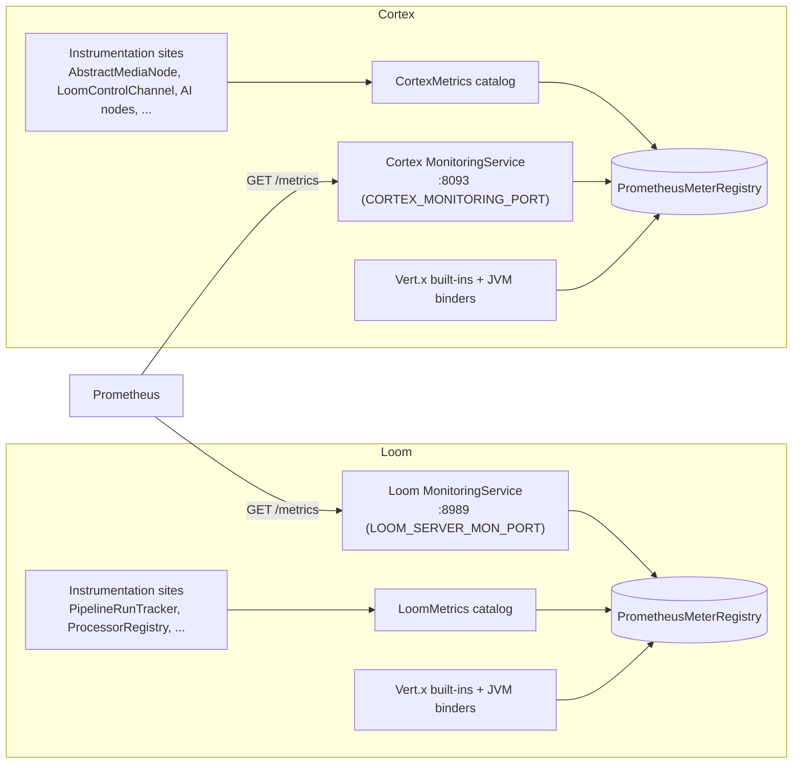

# MetaLoom — Metrics & Prometheus Specification

> **Audience: AI coding agents.** How Loom and Cortex expose Prometheus metrics from a central
> metrics service on their **monitoring** ports.
>
> ✅ **Status: IMPLEMENTED.** The `/metrics` endpoints and the `LoomMetrics` / `CortexMetrics`
> catalogs described here are built and covered by tests (`MetricsEndpointTest`,
> `MonitoringServiceTest`). **The source of truth is the code** — if this contradicts it, the code
> wins and this file is fixed in the same change.
>
> Related: [MONITORING.md](MONITORING.md) (health/readiness — the companion of this file),
> [../../cortex/CORTEX.md](../../cortex/CORTEX.md), [../../loom/LOOM.md](../../loom/LOOM.md),
> [../../loom/RESTAPI.md](../../loom/RESTAPI.md).

---

## 1. TL;DR

- Each component exposes a **Prometheus scrape endpoint** at `GET /metrics` on its **monitoring
  port**, never on the public REST API port.
  - **Cortex** — `/metrics` added to the existing `MonitoringService` HTTP server. Port **8093**
    (`CORTEX_MONITORING_PORT`). Shares the router with `/api/health` + `/api/ready`.
  - **Loom** — a new `MonitoringService` binds `LOOM_SERVER_MON_PORT` (default **8989**), which was
    previously configured but bound to nothing. Serves only `/metrics`.
- Backend is **Micrometer** with a single shared `PrometheusMeterRegistry` per process. **Vert.x
  built-in metrics are enabled** (the registry is handed to `VertxOptions`), so HTTP, event-bus,
  pool and JVM families appear automatically alongside the custom domain meters.
- Each component has a **central catalog class** — `LoomMetrics` / `CortexMetrics` — that owns the
  registry and declares every domain meter in one place. Instrumentation sites inject the catalog and
  call typed helpers; they never touch Micrometer directly.
- `/metrics` is **unauthenticated** — it lives on the internal monitoring port. Restrict access at
  the network layer. (Consistent with the already-open Cortex health endpoints.)

---

## 2. Architecture

- The REST API port (Loom `8092`) and gRPC/MCP ports serve **no** metrics — a scrape there returns
  404. This is intentional isolation between the operator/monitoring surface and the app surface.
- The registry must be constructed **before** the `Vertx` instance so it can be passed to
  `MicrometerMetricsOptions`. In Dagger this is expressed as a provider dependency (the `Vertx`
  provider takes the `PrometheusMeterRegistry` as a parameter). See §6 Conventions.

---

## 3. Loom Metrics (`loom_*`)

Prometheus conventions: `_total` suffix on counters, base units (`_seconds`, `_bytes`), bounded
label cardinality (status / kind / message-type — **never** asset UUIDs, paths, or user ids).

| Metric | Type | Labels | Source call site |
|---|---|---|---|
| `loom_pipeline_runs_started_total` | counter | — | `PipelineEndpointService.dispatchRun()` |
| `loom_pipeline_runs_completed_total` | counter | `status`=success\|partial\|failed\|cancelled | `PipelineRunTracker.apply()` |
| `loom_pipeline_run_duration_seconds` | timer | `status` | `PipelineRunTracker.apply()` (durationMs) |
| `loom_pipeline_runs_rejected_total` | counter | `reason`=no_processor\|invalid_graph | `PipelineEndpointService.dispatchRun()` (503/400 paths) |
| `loom_pipeline_runs_recovered_total` | counter | — | `PipelineRunRecovery.recoverAll()` |
| `loom_node_tasks_dispatched_total` | counter | `kind` | `WebSocketNodeDispatcher.dispatch()` |
| `loom_node_tasks_dispatch_failed_total` | counter | `reason`=no_processor\|socket_gone | `WebSocketNodeDispatcher.dispatch()` (returns `null`) |
| `loom_node_tasks_inflight` | gauge | — | `PipelineRunEngine` in-flight count |
| `loom_node_tasks_retried_total` | counter | — | `PipelineRunEngine.onNodeTaskLost()` |
| `loom_node_tasks_deadlettered_total` | counter | — | `PipelineRunEngine` dead-letter path |
| `loom_node_circuit_breaker_trips_total` | counter | `kind` | `NodeKindCircuitBreaker` |
| `loom_node_results_received_total` | counter | `kind`, `state`=success\|failed\|skipped | `ProcessorEndpoint.handleNodeTaskResult*` / `RunStatsAggregator.NodeCounters` |
| `loom_source_items_received_total` | counter | — | `ProcessorEndpoint.handleSourceItems()` |
| `loom_asset_node_results_written_total` | counter | `kind`, `state` | `NodeResultEndpointService.createAssetNodeResult()` |
| `loom_result_store_flush_batch_size` | summary | — | `DaoRunStateStore` flush |
| `loom_processors_connected` | gauge | — | `ProcessorRegistry.processors.size()` |
| `loom_processors_by_state` | gauge | `state`=online\|offline | `ProcessorRegistry` |
| `loom_processor_registrations_total` | counter | — | `ProcessorRegistry.register()` |
| `loom_processor_disconnects_total` | counter | — | `ProcessorRegistry.unregister()` |
| `loom_processor_heartbeats_total` | counter | — | `ProcessorRegistry.heartbeat()` |
| `loom_processor_cpu_load` | gauge | `node_id` | `ProcessorRegistry` `SystemStatusInfo` (worker-reported) |
| `loom_processor_memory_used_bytes` | gauge | `node_id` | `ProcessorRegistry` `SystemStatusInfo` |
| `loom_leases_reclaimed_total` | counter | — | `LeaseReaper.sweep()` |
| `loom_orphans_deadlettered_total` | counter | — | `LeaseReaper.releaseOrphan()` |
| `loom_pipeline_event_subscribers` | gauge | — | `PipelineEventBroadcaster.subscriberCount()` |
| `loom_pipeline_events_broadcast_total` | counter | — | `PipelineEventBroadcaster.broadcast()` |
| `loom_pipeline_events_dropped_total` | counter | — | `PipelineEventBroadcaster.Subscriber` (backpressure drops) |
| `loom_auth_failures_total` | counter | `type`=jwt\|ws\|permission | `WebSocketAuthenticator` / `LoomRestException` 401/403 |
| `loom_http_server_*`, `loom_pool_*`, `vertx_*` | (auto) | — | Vert.x built-in metrics (shared registry) |
| `jvm_memory_used_bytes`, `jvm_gc_*`, `jvm_threads_*`, `process_cpu_usage` | (auto) | — | Micrometer JVM/process binders |

> **DB pool gap:** the jOOQ layer uses a **c3p0** `ComboPooledDataSource` (`JooqModule`), which
> Vert.x pool metrics do **not** cover. Either register a small gauge set bound to c3p0's pooled
> datasource (busy / idle / pending connections) in `LoomMetrics`, or accept JVM + Vert.x-only pool
> coverage for v1. Track this as an explicit item rather than leaving it silently uncovered.

---

## 4. Cortex Metrics (`cortex_*`)

| Metric | Type | Labels | Source call site |
|---|---|---|---|
| `cortex_loom_connected` | gauge | — | `LoomControlChannel.connected` |
| `cortex_loom_registered` | gauge | — | `LoomControlChannel.registered` |
| `cortex_loom_reconnect_attempts` | gauge | — | `LoomControlChannel.reconnectAttempts` |
| `cortex_loom_reconnects_total` | counter | — | `LoomControlChannel.scheduleReconnect()` |
| `cortex_loom_messages_received_total` | counter | `type`=registered\|heartbeat_ack\|node_task\|segment_task\|source_task\|error | `LoomControlChannel.handleIncomingMessage()` |
| `cortex_tasks_received_total` | counter | `type`=node\|segment\|source | `PipelineTaskHandler.handle*` |
| `cortex_tasks_completed_total` | counter | `type`, `state`=success\|failed\|skipped | `PipelineTaskHandler` / task runners |
| `cortex_task_duration_seconds` | timer | `type` | `NodeTaskRunner.run()` (already times each task) |
| `cortex_node_operations_total` | counter | `node_kind`, `state`=success\|skipped\|failed | `AbstractMediaNode.process()` / `recordNodeResult()` |
| `cortex_node_operation_duration_seconds` | timer | `node_kind` | `AbstractMediaNode` (`ctx.duration()`) |
| `cortex_files_missing_total` | counter | — | `AbstractMediaNode.process()` (`!media.exists()`) + `FilesystemMediaScanner` |
| `cortex_results_sent_total` | counter | — | `ResultBatcher.flushExpired()` |
| `cortex_results_batches_sent_total` | counter | — | `ResultBatcher.flushExpired()` |
| `cortex_results_pending` | gauge | — | `ResultBatcher.pendingFor()` |
| `cortex_bulk_sync_assets_total` | counter | `outcome`=synced\|failed\|dropped_offline\|skipped_no_hash | `LoomBulkSyncWriterImpl` / `DefaultLoomBulkSyncCollector` |
| `cortex_source_items_enumerated_total` | counter | — | `SourceTaskRunner` |
| `cortex_source_ack_timeouts_total` | counter | — | `SourceTaskRunner` |
| `cortex_ai_calls_total` | counter | `provider`=ollama\|smolvlm\|whisper\|tesseract, `outcome`=success\|failure | `LLMNode` / `CaptioningNode` / `WhisperNode` / `OCRNode` (call sites) |
| `cortex_ai_call_duration_seconds` | timer | `provider` | same call sites |
| `cortex_ai_cache_hits_total` | counter | `provider` | `LLMNode` / `CaptioningNode` in-heap skip caches |
| `cortex_memory_used_bytes` | gauge | — | reuse `LoomControlChannel.collectSystemStatus()` |
| `cortex_cpu_load` | gauge | — | `collectSystemStatus()` (`OperatingSystemMXBean`) |
| `cortex_disk_used_bytes` / `cortex_disk_total_bytes` | gauge | — | `collectSystemStatus()` (`Files.getFileStore`) |
| `jvm_*`, `process_cpu_usage`, `vertx_*` | (auto) | — | Micrometer binders + Vert.x built-ins |

> **AI-provider instrumentation stays on the Cortex node side.** `OllamaLLMProvider` /
> `SmolVLMClient` live in the separate **genai-utils** repo — wrap the provider call inside the
> Cortex node (`LLMNode.compute()`, `OCRNode.compute()`, `CaptioningNode.compute()`,
> `WhisperMediaProcessor.process()`) rather than editing genai-utils, so no cross-repo change is
> needed.

---

## 5. Ports & Environment Variables

| Setting | Default | Env | Serves `/metrics`? |
|---|---|---|---|
| Cortex monitoring port | `8093` | `CORTEX_MONITORING_PORT` | ✅ (shared with health/ready) |
| Loom monitoring port | `8989` | `LOOM_SERVER_MON_PORT` | ✅ (new dedicated server) |
| Loom REST port | `8092` | `LOOM_SERVER_REST_PORT` | ❌ (app surface — 404 on `/metrics`) |
| Loom MCP port | `4041` | `LOOM_SERVER_MCP_PORT` | ❌ |
| Loom gRPC port | `8091` | `LOOM_SERVER_GRPC_PORT` | ❌ |

`ServerOptions.validate()` already enforces distinct ports across grpc/rest/monitoring/mcp, so a
monitoring server on 8989 cannot silently collide with another Loom server.

No new environment variables are introduced — the monitoring ports already exist. When
`LOOM_SERVER_REST_PORT == 0` (test mode) the Loom monitoring server also binds `0` (OS-assigned),
mirroring `MCPService.start()`.

---

## 6. Key Classes Reference

| Class | Package / Module | Purpose |
|---|---|---|
| `LoomMetrics` | `loom/services/monitoring` · `io.metaloom.loom.monitoring` | Central Loom meter catalog; owns the registry, exposes typed record helpers. |
| `MonitoringService` (Loom) | `loom/services/monitoring` · `io.metaloom.loom.monitoring` | Binds `LOOM_SERVER_MON_PORT`, serves `/metrics`. Mirrors `MCPService`. |
| `MonitoringModule` | `loom/services/monitoring` · `…monitoring.dagger` | `@Provides` `PrometheusMeterRegistry` (+ JVM binders). Added to `LoomCoreComponent`. |
| `CortexMetrics` | `cortex/core` · `io.metaloom.cortex.impl.monitoring` | Central Cortex meter catalog. |
| `MetricsEndpoint` (Cortex) | `cortex/core` · `io.metaloom.cortex.impl.monitoring` | Registers `GET /metrics` on the existing monitoring router. Mirrors `HealthEndpoint`. |
| `MonitoringService` (Cortex) | `cortex/core` · `io.metaloom.cortex.impl.monitoring` | Existing server; now also mounts `MetricsEndpoint.register(router)`. |
| `PrometheusMeterRegistry` | `io.micrometer:micrometer-registry-prometheus` (BOM 1.14.6) | The shared registry both scrape endpoints read via `scrape()`. |
| `PrometheusScrapingHandler` | `io.vertx:vertx-micrometer-metrics` (BOM 5.0.11) | Vert.x route handler that renders the registry at `/metrics`. |

Both dependencies are already managed in `bom/pom.xml` ("Metrics" block) — consuming modules declare
them **without a version**.

---

## 7. Conventions & Gotchas

- **Metrics are on the monitoring port, never the REST port.** A `/metrics` request to `8092`/`4041`
  must 404. This keeps the operator surface isolated from the authenticated app surface.
- **Registry-before-Vertx ordering.** `MicrometerMetricsOptions.setMicrometerRegistry(reg)` requires
  the registry to exist first. Express it as a Dagger provider dependency:
  `@Provides Vertx provideVertx(PrometheusMeterRegistry reg)`. Set `setJvmMetricsEnabled(false)` on
  the Vert.x options because the JVM binders are registered explicitly (avoid double registration).
- **Bounded label cardinality.** Label by node kind, status, message type, provider, or a stable
  `node_id`. **Never** label by asset UUID, file path, user, or run UUID — that explodes series count.
- **Go through the catalog.** Instrumentation sites inject `LoomMetrics` / `CortexMetrics` and call
  typed helpers; do not create ad-hoc `Counter.builder(...)` calls scattered across the codebase.
- **Open endpoint.** `/metrics` is unauthenticated by design. If a monitoring port is ever exposed
  beyond the cluster, front it with network policy — do not add per-request auth here.
- **c3p0 pool is not auto-covered** (see §3 note). Do not assume Vert.x pool metrics reflect the jOOQ
  connection pool.
- **Reuse existing state.** Cortex resource gauges are bound in `LoomControlChannel` (same values as
  `collectSystemStatus()`); the Loom worker-count gauge is bound in `ProcessorRegistry`. Prefer
  binding a gauge to existing state over adding a parallel counter.
- **Interface upstream, impl downstream.** The catalog is an interface — `CortexMetrics` in
  `cortex-common`, `LoomMetrics` in `loom-common` — reachable by every layer with **no** Micrometer
  dependency. The Micrometer implementation (`MicrometerCortexMetrics` in `cortex-core`,
  `MicrometerLoomMetrics` in `loom-service-monitoring`) is bound via Dagger `@Binds`. A
  `NoopCortexMetrics` / `NoopLoomMetrics` backs manual/test construction and the test-only convenience
  constructors added to `ProcessorRegistry`, `LeaseReaper`, `PipelineRunTracker`, etc.
- **Meter names omit `_total` / `_seconds`.** Code registers `cortex_node_operations`; Prometheus
  exports `cortex_node_operations_total`. Timers named `cortex_task_duration` export
  `cortex_task_duration_seconds_*`. The tables above list the **scraped** names.
- **Node operations are counted once, at `PipelineTaskHandler`** (the online task-driven choke point),
  keyed by `NodeTask.getNodeKind()`. `AbstractMediaNode.process()` records only `cortex_files_missing`
  (single authoritative not-found point). The pure offline CLI path is not node-op-counted — the
  primary deployment is the online daemon.
- **AI nodes use field injection.** `AbstractMediaNode` holds a Dagger field-injected `CortexMetrics`
  (defaulting to no-op), so the four AI nodes wrap their provider calls without constructor churn.

---

## 8. Test Setup

- **Cortex** (mirror the existing monitoring endpoint test): boot `MonitoringService.init(0)`, read
  `actualMonitoringPort()`, then `GET /metrics` → **200** with `Content-Type: text/plain`. Assert the
  body contains a `cortex_` family and `jvm_memory_used_bytes`. Push a fake node outcome through
  `CortexMetrics` and assert the counter line appears/increments in a subsequent scrape.
- **Loom** (REST endpoint test infra, leased DB): start with `restPort = 0` so the monitoring server
  binds an ephemeral port; `GET /metrics` on that port → 200 and contains a `loom_` family. Assert a
  `GET /metrics` on the **REST** port returns 404 (isolation).
- **Unit** (`LoomMetrics` / `CortexMetrics`): increment a helper, then assert
  `registry.scrape()` contains the expected metric line + labels.
- Run `./setup-pool.sh` before Loom/DB-touching tests. No Flyway migration is involved here, so no
  jOOQ regeneration is required.

---

## 9. Progress Assessment

- [x] Shared `PrometheusMeterRegistry` provider + JVM binders (Loom `VertxModule`, Cortex `CortexBindModule`)
- [x] Vert.x built-in metrics enabled on both `Vertx` instances (shared registry via `MicrometerMetricsFactory`)
- [x] Cortex `/metrics` route (`MetricsEndpoint`) on the existing monitoring server (8093)
- [x] Loom `MonitoringService` built out in `loom/services/monitoring`, binding `LOOM_SERVER_MON_PORT`
      (8989), wired into `LoomCoreComponent` + `BootstrapInitializer`
- [x] `LoomMetrics` catalog + Loom instrumentation sites (pipeline runs, dispatch, results, workers,
      leases, broadcast, recovery, auth)
- [x] `CortexMetrics` catalog + Cortex instrumentation sites (control channel, tasks, node ops,
      missing files, result egress, AI calls, resources)
- [x] Tests: Cortex `/metrics` (`MetricsEndpointTest`), Loom `/metrics` + REST-port 404 (`MonitoringServiceTest`)
- [x] `MONITORING.md` updated (ports table, gotchas, §9 checkboxes)
- [x] Customer-facing website monitoring page documents the scrape endpoints
- [x] Customer-facing metric catalogs on the website: `docs/loom/metrics/` (`loom_*`) and
      `docs/cortex/metrics/` (`cortex_*`) — endpoint, ports, per-meter tables, PromQL examples
- [ ] c3p0 DB-pool gauges on Loom (Vert.x pool metrics do not cover the jOOQ c3p0 pool) — follow-up
- [ ] `loom_node_tasks_inflight` / retry / circuit-breaker gauges from `PipelineRunEngine` (per-run
      engines make a process-wide gauge non-trivial) — follow-up
- [ ] Confirm `/api/v1/health` auth-exemption for probes (tracked in [MONITORING.md](MONITORING.md))

---

_GIT HEAD: `bbeb9677b9ceccd7174ee676a68b092e9a6a582b`_
_Generated: 2026-07-25 (UTC) — implemented and test-covered_
</content>
</invoke>
