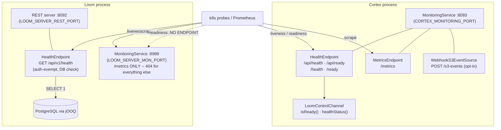

# MetaLoom — Monitoring & Health Specification

> **Audience: AI coding agents.** The two monitoring HTTP servers, and the health / readiness
> surface on each component. **Source of truth is the code** — if this contradicts it, the code wins
> and fix this file in the same change.
>
> **Scope split:** this file owns the *servers* and the *health/readiness* routes. Meter names,
> catalogs and instrumentation sites live in [METRICS.md](METRICS.md) and are **not** repeated here.
>
> Related: [METRICS.md](METRICS.md), [../../cortex/CORTEX.md](../../cortex/CORTEX.md),
> [../../loom/RESTAPI.md](../../loom/RESTAPI.md), [../../loom/CONFIGURATION.md](../../loom/CONFIGURATION.md).

---

## 1. TL;DR

The two components are **not symmetric** — this is the single most common wrong assumption:

| | Cortex | Loom |
|---|---|---|
| Monitoring server | ✅ `MonitoringService` on **8093** | ✅ `MonitoringService` on **8989** |
| Liveness | ✅ `GET /api/health` (+ `/health`) on 8093 | ✅ `GET /api/v1/health` on the **REST** port 8092 |
| Readiness | ✅ `GET /api/ready` (+ `/ready`) on 8093 | ❌ **none exists** |
| `/metrics` | ✅ on 8093 | ✅ on 8989 |
| Health on the monitoring port | ✅ | ❌ 404 — the Loom monitoring server serves **only** `/metrics` |
| Other routes on the monitoring port | optional S3 webhook (§2.3) | none |

---

## 2. Cortex — monitoring server

Package `io.metaloom.cortex.impl.monitoring`.

### 2.1 Wiring

- `MonitoringService` (`@Singleton`) creates a Vert.x `HttpServer`, mounts a `Router`, and registers
  **three** things in order: `HealthEndpoint`, `MetricsEndpoint`, `WebhookS3EventSource`.
- Started by `CortexBootstrapInitializer` during `cortex.run()`. `init()` defaults to `8093`
  (`CortexOptions.monitoringPort` default); `CORTEX_MONITORING_PORT` overrides it.
- `actualMonitoringPort()` returns the bound port, or **`null`** when the server has not started
  (useful with `init(0)` in tests).
- `deinit()` closes the server on shutdown.

### 2.2 Health & readiness (`HealthEndpoint`)

| Method / Path | Code | Body | Semantics |
|---|---|---|---|
| `GET /api/health` | always `200` | `{ "status": "up", "loom": <status> }` | **Liveness** — the process is running. |
| `GET /api/ready` | `200` / `503` | `{ "status": "ready"\|"not_ready", "loom": <status> }` | **Readiness** — `LoomControlChannel.isReady()`. |
| `GET /health` | = `/api/health` | — | Legacy alias for existing probes. |
| `GET /ready` | = `/api/ready` | — | Legacy alias. |

Both responses set `Content-Type: application/json`.

**Readiness definition** — `LoomControlChannel.isReady()` returns
`endpointConfigured && connected && registered`. A worker is *ready* only once it has connected to
Loom **and** completed registration. In offline mode (`endpointConfigured == false`) liveness stays
`up` while readiness stays `not_ready` (503) forever — expected, not a fault.

**The `loom` status object** (`LoomControlChannel.healthStatus()`), embedded in *both* responses:

```json
{ "configured": true, "connected": true, "registered": true,
  "host": "loom.internal", "port": 8092, "reconnectAttempts": 0,
  "lastConnectedAt": <epochMs|null>, "lastMessageAt": <epochMs|null>,
  "lastHeartbeatAckAt": <epochMs|null>, "error": <string|null> }
```

`reconnectAttempts`, `lastHeartbeatAckAt` and `error` are the useful signals for a worker that is up
but not processing (e.g. registered but heartbeats stalled). The same three values are also exported
as gauges — see [METRICS.md](METRICS.md) §4.

### 2.3 The S3 webhook shares this router

`WebhookS3EventSource.register(router)` runs on the **same** monitoring router, so the monitoring
port can carry a work-injecting route. It self-disables unless *all* of the following hold, so a
default deployment exposes nothing extra:

| Guard | Effect when unmet |
|---|---|
| `S3EventOptions.isEnabled()` | route not registered |
| `mode == WEBHOOK` | route not registered |
| `webhookSecret` set (`CORTEX_S3_EVENTS_WEBHOOK_SECRET`) | route **refused** + `log.error` |

Registered path: `POST` `S3EventOptions.getWebhookPath()`, default **`/s3-events`**.
⚠️ Operational consequence: when S3 webhook ingest is enabled, port 8093 is no longer read-only.
Network policy on the monitoring port matters more than the "it's just health checks" intuition
suggests.

---

## 3. Loom — health check and monitoring server

### 3.1 `GET /api/v1/health` (REST port, **not** the monitoring port)

`io.metaloom.loom.rest.endpoint.impl.HealthEndpoint` is a regular `AbstractEndpoint`
(`basePath() = API_V1_PATH + "/health"`) registered on the normal REST router, so it shares Loom's
REST port (`8092`, `LOOM_SERVER_REST_PORT`).

| Field | Values | Notes |
|---|---|---|
| `status` | `UP` \| `DEGRADED` | `DEGRADED` when the DB check fails. |
| `version` | `LoomVersion.VERSION` | e.g. `1.0.0-SNAPSHOT`. |
| `database` | `UP` \| `DOWN` | `checkDatabase()` runs `SELECT 1` through the jOOQ `DSLContext` on `vertx.executeBlocking`. |
| `timestamp` | ISO-8601 | `Instant.now().toString()`. |

✅ **It is auth-exempt.** `HealthEndpointIntegrationTest.testHealthEndpoint` calls it with an
unauthenticated `LoomHttpClient` and gets `200 / UP`; `testHealthEndpointWithAuth` proves an
authenticated call behaves identically. Probes need no token.

### 3.2 Monitoring server (`loom/services/monitoring`)

`io.metaloom.loom.monitoring.MonitoringService` extends `AbstractService`, owns its own `HttpServer`
(mirroring `MCPService`) and registers exactly one route: `GET /metrics`. It is started by
`BootstrapInitializer.start()` and stopped by its shutdown path.

⚠️ **There is no readiness endpoint on Loom at all**, and no health route on 8989. A k8s
`readinessProbe` for Loom currently has nothing correct to point at; using `/api/v1/health` on 8092
is the only option and it reports `UP` before the server is necessarily able to serve traffic. See
§8.

---

## 4. Architecture



---

## 5. Ports & Environment Variables

| Setting | Default | Env | Constant | What it serves |
|---|---|---|---|---|
| Cortex monitoring port | `8093` | `CORTEX_MONITORING_PORT` | `CortexOptions.monitoringPort` | health + ready + `/metrics` (+ optional S3 webhook) |
| Loom monitoring port | `8989` | `LOOM_SERVER_MON_PORT` | `ServerOptions.DEFAULT_MONITORING_PORT` | `/metrics` only |
| Loom REST port | `8092` | `LOOM_SERVER_REST_PORT` | — | `/api/v1/health` + the whole REST API |
| Loom MCP port | `4041` | `LOOM_SERVER_MCP_PORT` | — | MCP (not monitoring) |
| Loom gRPC port | `8091` | `LOOM_SERVER_GRPC_PORT` | — | gRPC (not monitoring) |
| S3 webhook path | `/s3-events` | `--s3-events-webhook-path` | `S3EventOptions.DEFAULT_WEBHOOK_PATH` | mounted on the Cortex monitoring router |
| S3 webhook secret | *(unset)* | `CORTEX_S3_EVENTS_WEBHOOK_SECRET` | — | required, else the route is refused |

`ServerOptions.validate()` runs `checkDistinct(..., "monitoringPort", …)` across grpc/rest/monitoring/mcp,
so a Loom monitoring server cannot silently collide with another Loom server.

---

## 6. Key Classes Reference

| Class | Package / Module | Purpose |
|---|---|---|
| `MonitoringService` (Cortex) | `cortex/core` · `io.metaloom.cortex.impl.monitoring` | Starts/stops the Cortex monitoring HTTP server; mounts health + metrics + S3 webhook. |
| `HealthEndpoint` (Cortex) | `cortex/core` · `io.metaloom.cortex.impl.monitoring` | Registers `/api/health`, `/api/ready` and the two legacy aliases. |
| `MetricsEndpoint` (Cortex) | `cortex/core` · `io.metaloom.cortex.impl.monitoring` | `GET /metrics` — see [METRICS.md](METRICS.md). |
| `LoomControlChannel` | `cortex/core` · `io.metaloom.cortex.impl.loom` | `isReady()` / `healthStatus()` backing both routes. |
| `CortexBootstrapInitializer` | `cortex/core` · `io.metaloom.cortex.impl.boot` | Calls `monitoringService.init(port)` on startup. |
| `WebhookS3EventSource` | `cortex/s3-common` · `io.metaloom.cortex.s3.event` | Opt-in `POST /s3-events` on the monitoring router. |
| `S3EventOptions` | `cortex/api` · `io.metaloom.cortex.api.option` | `DEFAULT_WEBHOOK_PATH`, enable flags, secret. |
| `HealthEndpoint` (Loom) | `loom/services/rest` · `io.metaloom.loom.rest.endpoint.impl` | `GET /api/v1/health` + `SELECT 1` DB check. |
| `HealthCheckResponse` | `loom-shared/rest-model` · `…rest.model.health` | Loom health DTO. |
| `MonitoringService` (Loom) | `loom/services/monitoring` · `io.metaloom.loom.monitoring` | Binds `LOOM_SERVER_MON_PORT`, serves `/metrics` only. |
| `BootstrapInitializer` | `loom/core` · `io.metaloom.loom.core.boot` | `monitoringService.start()` / `.stop()`. |
| `ServerOptions` | `loom-shared/api` · `…api.options` | Port defaults, `LOOM_SERVER_MON_PORT`, `validate()`. |

---

## 7. Conventions & Gotchas

- **Liveness and readiness are different endpoints — on Cortex only.** Point the k8s `livenessProbe`
  at `/api/health` and the `readinessProbe` at `/api/ready`. Using `/api/health` for readiness would
  keep an unregistered worker "ready". **Loom has no readiness endpoint** — do not invent one in a
  manifest.
- **A Cortex worker can be *live* but not *ready* indefinitely** (offline mode, or Loom unreachable).
  That is by design; `not_ready` is not a crash.
- **The Loom monitoring port is not a health port.** `GET /api/v1/health` on 8989 returns **404** —
  asserted by `MonitoringServiceTest.shouldNotServeRestPaths`. Loom health is on the REST port.
- **Test-mode port coupling.** `MonitoringService.start()` uses `restPort == 0 ? 0 : monitoringPort`.
  Setting `LOOM_SERVER_REST_PORT=0` silently moves the metrics server to an OS-assigned port and
  ignores `LOOM_SERVER_MON_PORT`.
- **Case differs between components.** Cortex serves `"up"` / `"ready"` (lowercase); Loom serves
  `"UP"` / `"DEGRADED"` (uppercase). There is no shared schema — do not write a probe or dashboard
  that assumes one.
- **`actualMonitoringPort()` returns `null`, not `-1`,** before start on Cortex; Loom's `actualPort()`
  returns **`-1`**. Different sentinels for the same idea.
- **Loom health touches the DB on every call.** Each request runs `SELECT 1` on a worker thread.
  Keep probe intervals sane; a 1s liveness probe is a continuous DB query.
- **`DEGRADED` is still HTTP 200.** The Loom health endpoint never returns a non-2xx status — a probe
  configured only on status code will not notice a dead database. Parse the body.
- **The Cortex monitoring port is not necessarily read-only** — see §2.3.

---

## 8. Test Setup

| Test | Module | Covers |
|---|---|---|
| `HealthEndpointIntegrationTest` | `integration-test` | Loom `/api/v1/health` returns `UP` / `database=UP`, both **without** and with authentication (proves auth exemption). |
| `MonitoringServiceTest` | `loom/services/monitoring` | Loom monitoring server: `/metrics` 200, `/api/v1/health` **404**. See [METRICS.md](METRICS.md) §9. |
| `MetricsEndpointTest` | `cortex/core` | Cortex `/metrics` 200 with `cortex_*` + `jvm_*`. See [METRICS.md](METRICS.md) §9. |

**Gap — Cortex `HealthEndpoint` has no test.** `cortex/core/src/test/java/io/metaloom/cortex/impl/monitoring/`
contains only `MetricsEndpointTest`. The shape to add:

1. `Router router = Router.router(vertx); new HealthEndpoint(mockChannel).register(router);`
   listen on port `0`, read `actualPort()`.
2. Offline channel (`endpointConfigured=false`) → `GET /api/health` = **200** `{"status":"up"}`,
   `GET /api/ready` = **503** `{"status":"not_ready"}`.
3. Connected + registered channel → `/api/ready` = **200** `{"status":"ready"}`.
4. Assert `/health` and `/ready` behave identically to the `/api/*` pair (the aliases are untested and
   trivially breakable).
5. Assert the embedded `loom` object carries `reconnectAttempts` / `lastHeartbeatAckAt` / `error`.

No database is involved for the Cortex tests. `./setup-pool.sh` **is** required for
`HealthEndpointIntegrationTest` and anything else on the Loom REST/DAO path.

---

## 9. Where do I find …?

| I want to … | Look at |
|---|---|
| Cortex health/ready routes | `cortex/core/src/main/java/io/metaloom/cortex/impl/monitoring/HealthEndpoint.java` |
| Cortex monitoring server start/stop | `.../impl/monitoring/MonitoringService.java`, `.../impl/boot/CortexBootstrapInitializer.java` |
| Cortex readiness logic + `loom` status object | `cortex/core/.../impl/loom/LoomControlChannel.java` (`isReady()`, `healthStatus()`) |
| The S3 webhook on the monitoring router | `cortex/s3-common/.../s3/event/WebhookS3EventSource.java`, `cortex/api/.../option/S3EventOptions.java` |
| Loom health endpoint + DB check | `loom/services/rest/src/main/java/io/metaloom/loom/rest/endpoint/impl/HealthEndpoint.java` |
| Loom health DTO | `loom-shared/rest-model/.../rest/model/health/HealthCheckResponse.java` |
| Loom monitoring server | `loom/services/monitoring/src/main/java/io/metaloom/loom/monitoring/MonitoringService.java` |
| Loom monitoring start/stop wiring | `loom/core/src/main/java/io/metaloom/loom/core/boot/BootstrapInitializer.java` |
| Port defaults & validation | `loom-shared/api/.../options/ServerOptions.java`, `cortex/api/.../option/CortexOptions.java` |
| Meter names / catalogs / instrumentation | [METRICS.md](METRICS.md) |
| Customer-facing doc (health/ready) | `website/content/english/docs/cortex/monitoring/index.adoc` |

---

## 10. Progress Assessment

- [x] Cortex liveness (`/api/health`) + readiness (`/api/ready`) with legacy `/health` and `/ready` aliases
- [x] Readiness reflects `configured && connected && registered`; rich `loom` diagnostic object on both routes
- [x] Loom `GET /api/v1/health` with version + `SELECT 1` DB connectivity check
- [x] Loom `/api/v1/health` confirmed **auth-exempt** for probes (`HealthEndpointIntegrationTest`)
- [x] Loom monitoring server (`loom/services/monitoring`) built out and bound to `LOOM_SERVER_MON_PORT`
- [x] Prometheus `/metrics` on both monitoring ports — see [METRICS.md](METRICS.md)
- [x] Website monitoring page documents the health/ready endpoints and ports
- [ ] **Cortex `HealthEndpoint` has no test** — add the test described in §8 (routes, aliases and the
      offline `not_ready` case are entirely uncovered)
- [ ] **Loom has no readiness endpoint.** Decide: add `GET /api/v1/ready` (or a `/ready` route on the
      8989 monitoring server) reflecting DB reachability + REST router readiness, or document that
      Loom deployments must use `/api/v1/health` as both probes.
- [ ] Loom health returns **200 even when `DEGRADED`** — either map `DEGRADED` to 503 or document that
      probes must parse the body
- [ ] Reconcile the two response schemas (`up`/`ready` lowercase vs `UP`/`DEGRADED` uppercase) or state
      explicitly that they are independent contracts
- [ ] Document the operational impact of the opt-in S3 webhook sharing the Cortex monitoring port on
      the customer-facing monitoring page

---

_Git HEAD revision: `499f71f7`_
_Last updated: 2026-08-01 (corrected the Loom/Cortex asymmetry: no Loom readiness endpoint, no health route on 8989, and the S3 webhook shares the Cortex monitoring router)_
