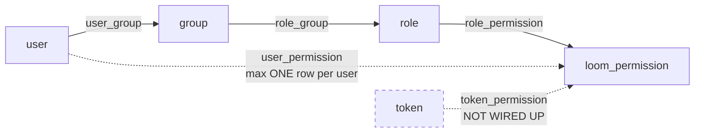

# MetaLoom // Loom Permission System

> **Authorization** in the Loom backend: the permission vocabulary, the grant
> data model, and where the decision is actually made. Picks up *after* the
> caller is authenticated.
>
> **Scope split with the sibling specs — read those first, do not duplicate them here:**
>
> | Topic | Owner |
> |---|---|
> | Enforcement funnel (REST + GraphQL), permission-denied test contract | [../rbac/RBAC.md](../rbac/RBAC.md) |
> | Authentication (JWT, login, OAuth2 BFF, API tokens), endpoint inventory | [../../loom/RESTAPI.md](../../loom/RESTAPI.md) |
> | DAO / jOOQ / Flyway mechanics | [../../loom/PERSISTENCE.md](../../loom/PERSISTENCE.md) |
> | MCP tool surface | [../../loom/MCP.md](../../loom/MCP.md) |
> | Non-authorizing transports | [../../loom/WEBSOCKET.md](../../loom/WEBSOCKET.md), [../../loom/GRPC.md](../../loom/GRPC.md) |
>
> **RBAC.md and this file overlap heavily and should be merged** (see §10).
> Until then: RBAC.md is authoritative for *how a request is checked*; this file
> is authoritative for *what the permissions are, how they are stored, and where
> the model is broken*.

---

## 1. Model

- A **Permission** is a flat enum constant, `<VERB>_<ENTITY>` — `READ_ASSET`, `CREATE_PIPELINE`.
- A **Role** holds permissions; a **Group** holds roles; a **User** holds groups.
- Effective permissions = union of (all permissions of all roles of all groups the user is in)
  ∪ (direct `user_permission` rows).



Two properties diverge from what the schema suggests:

1. **There is no `user_role` table.** Roles attach to *groups* only.
2. **Permissions are global, not per-object.** `user_permission` and
   `token_permission` still carry a `resource` column; it is discarded before the
   decision (§5.1). `role_permission` no longer has one at all (V2.64).
   `READ_ASSET` means "read every asset".

---

## 2. Permission Taxonomy

Three layers must stay in sync:

| Layer | Type | Location |
|---|---|---|
| Java | `enum Permission` — **139** constants | `loom/db/api/src/main/java/io/metaloom/loom/db/model/perm/Permission.java` |
| Postgres | `loom_permission` enum — **140** values | `V2.1__add_acl.sql` + later `ALTER TYPE` migrations |
| Generated | `enum JooqLoomPermission` — **140** | `loom/db/jooq/src/jooq/java/.../enums/JooqLoomPermission.java` |

`PermissionDaoImpl` bridges with `JooqLoomPermission.valueOf(perm.name())`, so a
Java constant without a Postgres value throws `IllegalArgumentException` at grant time.

**`Permission.java` is self-documenting and is the source of truth.** Every constant
carries an inline audit comment — `doc:` (has an `admin.roles.permission.<NAME>` i18n
description), `ui:` (offered by the ACL matrix), `test:` (which test covers it), and
`[unused: no code checks it]`. Read the enum rather than trusting any list here.

### 2.1 Entity coverage

Full CRUD quad (`CREATE`/`READ`/`UPDATE`/`DELETE`) unless noted — 28 entities:

`ANNOTATION`, `ASSET`, `ASSET_BINARY`, `ASSET_LOCATION` (legacy), `ATTACHMENT`,
`USER`, `ROLE`, `GROUP`, `SPACE`, `CLUSTER`, `COLLECTION`, `COMMENT`, `EMBEDDING`,
`REACTION`, `TASK`, `TAG`, `TOKEN`, `LIBRARY`, `ASSET_POOL`, `BLACKLIST`, `PERSON`,
`DETECTION`, `CHAT`, `SKILL`, `CHAT_SESSION`, `MEMORY`, `MEMORY_DENY_RULE`, `DEDUP`.

Non-CRUD and partial-quad constants:

| Constant(s) | Note |
|---|---|
| `TAG_ASSET`, `UNTAG_ASSET` | Relationship verbs. `UNTAG_ASSET` also guards `DELETE /assets/:uuid/tag-placements/:placementUuid`, which removes one placement of a tag rather than all of them (`V2.71`) |
| `CREATE/READ/UPDATE/DELETE_PIPELINE_RUN` | Run lifecycle; `UPDATE_PIPELINE_RUN` governs pause/resume/cancel |
| `READ_PIPELINE_VERSION`, `RESTORE_PIPELINE_VERSION` | No `CREATE`/`UPDATE`/`DELETE` on the Java side |
| `READ_SKILL_VERSION`, `RESTORE_SKILL_VERSION` | Same shape |
| `MANAGE_CORTEX_INSTANCE`, `READ_CORTEX_INSTANCE` | Processor registration |
| `READ_SEARCH` | Wholesale gate on `/api/v1/search/*`; the endpoint then narrows per-entity via the `READ_*` predicate (§5.2) |
| `READ_SEARCH_INDEX` | Reading the state of every search index on `GET /api/v1/search-indices` (`V2.85`) — sizes, backlogs, producing embedding model, job history. Changes nothing |
| `MANAGE_SEARCH_INDEX` | Starting a reindex, delta sync or drop (`V2.85`). Split from the read on purpose, and deliberately **not** folded into `UPDATE_ASSET`, which is what used to gate a rebuild: being able to retag a photo should not imply being able to empty the face index. See [../search/SEARCH_INDEX_ADMIN.md](../search/SEARCH_INDEX_ADMIN.md) |
| `READ_METRIC` | The JSON read of the `loom_*` metric catalog on `GET /api/v1/metrics` (`V2.84`). Separate from `READ_CORTEX_INSTANCE`: that one says *which workers are attached*, this one says *how the instance is performing* — pipeline throughput, task latency, circuit-breaker state, authentication failure counts. The Prometheus scrape on the monitoring port is network-gated and never consults this |
| `READ_DB_INTEGRITY` | The database integrity report on `GET /api/v1/db-integrity` and its `/checks` catalogue (`V2.87`). Read only - the report is computed per request and repairs nothing, so there is one constant rather than four. Separate from `READ_METRIC`: metrics are aggregate counters about a running instance, while this names the uuids of specific rows that are wrong, which is a read of the catalogue itself. See [../db/DB_INTEGRITY.md](../db/DB_INTEGRITY.md) |
| `CREATE/UPDATE/VALIDATE_MCP_PIPELINE` | Pipeline authoring **through an agent** (the MCP tools `create_pipeline`, `update_pipeline`, `validate_pipeline`). Separate from the `*_PIPELINE` quad because letting an agent write a pipeline is a different trust decision from letting a person draw one, and an admin must be able to grant one without the other. The two write tools declare the base permission **and** the MCP one, and MCP requires all declared permissions — so an MCP permission alone can never widen what a user may do. `VALIDATE_` is its own value because the dry run stores nothing (`V2.76`, [../../loom/MCP.md §6.0a](../../loom/MCP.md)) |
| `READ/UPDATE/DELETE_NOTIFICATION` | The per-user inbox. **No `CREATE`** — notifications are raised by `NotificationDispatcher`, never posted, so the constant would be dead the day it was added. These gate the *feature*, not the row: holding `READ_NOTIFICATION` reads **your** inbox, and `NotificationEndpointService.loadOwn` answers **404 (not 403)** for a foreign entry, so a permitted caller still cannot enumerate somebody else's |

**No `LIST` permission exists** — list routes reuse the entity's `READ_*`.

### 2.2 Java ↔ DB drift (1 value)

Exactly one DB-only value remains: **`CREATE_PIPELINE_VERSION`** (added by
`V2.30__add_pipeline_version.sql`). It cannot be granted (`DatabaseInitializer`
loops over `Permission.values()`) and cannot be checked (`requirePerm` takes a
Java `Permission`) — dead vocabulary. Pipeline **run** permissions, previously
DB-only, now exist in Java and *are* enforced by `PipelineEndpointService`.

Verify the drift with:

```bash
grep -oE '^[[:space:]]+[A-Z_]+[,;]' loom/db/api/src/main/java/io/metaloom/loom/db/model/perm/Permission.java | tr -d ' \t,;' | sort -u > /tmp/j
grep -oE '^[[:space:]]+[A-Z_]+\('  loom/db/jooq/src/jooq/java/io/metaloom/loom/db/jooq/enums/JooqLoomPermission.java | tr -d ' \t(' | sort -u > /tmp/d
diff /tmp/j /tmp/d
```

### 2.3 Migration history quirks

- `V2.22` renamed `*_PROJECT` → `*_SPACE` in place (`ALTER TYPE … RENAME VALUE`),
  so ordinals and existing rows survived. **The tables did not follow**: the
  `project` / `project_library` / `project_collection` tables still exist and are
  guarded by `READ_SPACE`.
- `V2.55__remove_webhook.sql` dropped the four `*_WEBHOOK` values. Postgres cannot
  drop a single enum value, so the migration rebuilds `loom_permission` from scratch
  and retypes all three permission columns. **Any future value removal must follow
  that pattern.**
- All other enum migrations use `ALTER TYPE … ADD VALUE IF NOT EXISTS` except
  `V2.19`, which omits `IF NOT EXISTS`.

### 2.4 Sub-resources are guarded by their parent

**Rule: a table that only exists as a detail of another entity gets no permission
values of its own.** `V2.31` states it in the migration text; the asset component
tables added in `V2.38`–`V2.45` follow it:

| Table group | Guarded by |
|---|---|
| `asset_{geo,doc,image,video,audio,transcript,json,fingerprint,segment}_comp` | `READ_ASSET` / `UPDATE_ASSET` |
| `asset_node_result` | `READ_ASSET` / `UPDATE_ASSET` |
| `pipeline_run_item`, run sub-tables | `READ_PIPELINE_RUN` / `UPDATE_PIPELINE_RUN` |

`detection` and `embedding` keep dedicated permissions — they are first-class REST
resources with existing grants in the wild. Do **not** add `*_ASSET_COMPONENT`
values speculatively: an unused value still costs three-layer sync (§2).
Tables and identity contract: [../db/DATABASE_TASKS.md](../db/DATABASE_TASKS.md) §4.

### 2.5 The REST mirror enum `RolePermission`

`loom-shared/rest-model/.../role/RolePermission.java` is a **literal mirror** of
`Permission`: same 139 constants, same names. It exists because `loom-rest-model` must
not depend on `loom-db-api`; `RoleEndpointService` bridges the two with
`Permission.valueOf(restPerm.name())`.

The two are kept in lock-step by
`loom/services/rest/src/test/java/io/metaloom/loom/rest/perm/RolePermissionParityTest.java`,
which fails on any drift in either direction. When adding a permission the order is:
`Permission` (source of truth, carries the audit comments) → `RolePermission` →
Postgres `loom_permission` value in a Flyway migration.

It used to be an inert 4-value enum whose contents `RoleEndpointService` never read;
permissions posted to `/api/v1/roles` were accepted and dropped. Both halves are wired
up now (§4.4).

---

## 3. Database Schema

All RBAC tables come from `loom/db/flyway/src/main/resources/db/migration/V2.1__add_acl.sql`.
`V2.64__fix_role_permission_key.sql` is the only later migration that alters their
structure — it drops `role_permission.resource` and the redundant unique index.

```sql
role_permission  (role_uuid, permission loom_permission)                             PK (role_uuid, permission)
user_permission  (user_uuid, resource varchar NOT NULL, permission loom_permission)  PK (user_uuid)
token_permission (token_uuid, resource varchar NOT NULL, permission loom_permission) PK (token_uuid)
user_group  (user_uuid, group_uuid)  PK (user_uuid, group_uuid)
role_group  (group_uuid, role_uuid)  PK (group_uuid, role_uuid)
```

`role` and `group` are structurally identical: `uuid` PK, `name varchar UNIQUE NOT NULL`,
`meta jsonb`, standard audit quad.

### 3.1 Live schema defects

| Table | Declared PK | Defect |
|---|---|---|
| `user_permission` | `(user_uuid)` | **A user can hold at most one direct permission row, ever.** A second `grantUserPermission` for the same user raises a PK violation. |
| `token_permission` | `(token_uuid)` | Same one-row ceiling. |
| `role_permission` | `(role_uuid, permission)` | **Fixed** by V2.64 — `resource` and the redundant unique index are gone, so the key now *is* the intended grain. |

`user_permission` and `token_permission` still carry
`CREATE UNIQUE INDEX (x_uuid, resource, permission)` — dead weight, since the PK is a
subset of the indexed triple. The index shows resource-scoped grants were *intended*;
the PK prevents them. `role_permission` had the same pair; V2.64 resolved it by
dropping the column rather than widening the key, because nothing on the authorization
path ever reads `resource` (§5.1) — keeping a column that looks like a scope but scopes
nothing invites grants that appear narrower than they are.

`token_permission`'s FK to `token` lacks `ON DELETE CASCADE`, so deleting a token
that has a permission row fails on FK violation. `user_permission` and
`role_permission` do cascade.

### 3.2 Cascade behaviour (verified)

`AclCascadeTest` (`loom/db/jooq/src/test/java/io/metaloom/loom/db/jooq/dao/AclCascadeTest.java`)
asserts the real semantics:

| Action | Effect |
|---|---|
| Delete a role | `role_permission` + `role_group` rows cascade; group and users survive; members lose the derived permission |
| Delete a group | `user_group` + `role_group` cascade; users and roles survive; members lose the derived permission |
| **Soft**-delete a user | Grants and memberships **survive**; `userDao().load()` filters the user out |
| **Hard**-delete a user | `user_permission` + `user_group` cascade; the group survives |

### 3.3 Index direction

Forward traversal (user → group → role → permission) is indexed at every hop.
**Reverse traversal is not** — `role_group` PK is `(group_uuid, role_uuid)`,
`user_group` PK is `(user_uuid, group_uuid)` — so "which users are in this group?"
falls back to a sequential scan. That is the direction membership-admin screens need.

---

## 4. Granting

The entire grant API is `PermissionDao`:

```java
void grantUserPermission(UUID userUuid, Permission perm);                   // ALWAYS throws NPE
void grantUserPermission(UUID userUuid, Permission perm, String resource);
void grantRolePermission(UUID roleUuid, Permission perm);                   // idempotent
ResourcePermissionSet loadPermissionsForUser(UUID userUuid);
```

Role grants are also reachable through `RoleDao`, which is what the REST layer uses:

```java
Set<Permission> loadPermissions(UUID roleUuid);
void setPermissions(UUID roleUuid, Set<Permission> permissions);   // replace semantics
```

`PermissionDaoImpl` notes:

- The **two-arg user overload delegates with `resource = null`** into a delegate
  that starts with `Objects.requireNonNull(resource, …)` — it always throws. Only
  the three-arg form is usable.
- The **role** grant is `INSERT … ON CONFLICT DO NOTHING`, so re-granting is a no-op.
  The **user** grant is still a plain `INSERT` — re-granting raises a PK violation.
- `PermissionDao` has **no revoke method** and no `grantTokenPermission`. Revoking a
  *role* grant goes through `RoleDao.setPermissions` (§4.4); revoking a *user* grant
  still means direct SQL, or deleting the role/group (§3.2).
- `loadPermissionsForToken` exists on the impl but **not on the interface**, has zero
  call sites, and its body (`fetchOneInto(ResourcePermissionSet.class)` against a
  `HashSet` subclass) is broken with the working version commented out beneath it.

### 4.1 Who calls it

Besides the REST path of §4.4, these callers grant at bootstrap and in tests:

| Caller | Grants |
|---|---|
| `DatabaseInitializer` | all `Permission.values()` → role `admin-role` |
| `DemoDatabaseInitializer` | curated editor / viewer sets (§4.3) |
| `TestFixtureProvider` | all perms → `test-role`, plus one direct `READ_USER` grant to `joedoe` |
| `*EndpointTest` | per-test role+group grants (§8.2) |

### 4.2 Bootstrap

`loom/core/src/main/java/io/metaloom/loom/core/boot/DatabaseInitializer.java` runs at
startup, idempotently (each step guarded by a load-first check), and establishes
exactly one privileged path:

```
user "admin" → group "admins" → role "admin-role" → all 139 permissions
```

Constants: `DatabaseInitializer.GROUP_NAME = "admins"`, `ROLE_NAME = "admin-role"`,
`UserDao.ADMIN_USER_NAME = "admin"`. The initial password comes from
`LOOM_INITIAL_PASSWORD`; if unset a random 8-char string is generated and printed to
stdout on first boot.

**There is no superuser flag.** The `user` table has `enabled`, `deleted` and `sso` —
no `admin` column — and `requirePerm` has no bypass. Renaming or unbinding
`admin-role` locks out administration with no override.

### 4.3 Demo roles

`DemoDatabaseInitializer` creates groups `Editors` and `Viewers` with matching roles —
the closest thing to a documented standard role set, and a reasonable template:

- **editor** — full CRUD on asset, library, tag, task, collection, comment, annotation,
  blacklist, chat; `TAG_ASSET`/`UNTAG_ASSET`; read-only on user, group, role, space,
  pipeline, asset pool.
- **viewer** — read-only on asset, tag, collection, task, comment, annotation,
  blacklist, chat, user, group, role, space, library, pipeline, asset pool.

Neither set has been extended with the newer entities (skill, memory, chat session,
dedup, search) — demo editors/viewers cannot use those features.

### 4.4 The REST grant path (`/api/v1/roles`)

`RoleCreateRequest` / `RoleUpdateRequest` carry `List<RolePermission> permissions`, and
since the fix that list is load-bearing in both directions:

| Request field | Meaning |
|---|---|
| absent / `null` | leave the role's grants unchanged — this is what a rename-only update sends |
| `[]` | revoke **every** grant the role holds |
| non-empty | **replace** the grant set with exactly this list |

`RoleEndpointService.applyPermissions` maps the REST enum onto `Permission` by name and
calls `RoleDao.setPermissions`, which deletes the surplus rows and inserts the missing
ones in one transaction. `RoleModelBuilder.toResponse` populates `RoleResponse.permissions`
from `RoleDao.loadPermissions`, sorted by name, and reports an empty list (never `null`)
for a role that grants nothing.

**Every write to `role_permission` must be followed by `PermissionCache.invalidateAll()`.**
The cache has no expiry (§5.4), so a grant that is not followed by an invalidation is
invisible to every already-authenticated session — the write would persist and change
nothing, which is the failure mode the whole fix was about. Per-user invalidation is not
usable here: resolving "which users does this role reach" means traversing `role_group`
and `user_group` backwards, and neither index supports that direction (§3.3). Role edits
are rare administrative actions, so the whole cache is dropped.
`RoleEndpointService.delete` revokes explicitly before deleting so the invalidation
cannot be beaten by a refresh that still sees the (about to cascade) grants.

The admin ACL matrix (`loom-ui/src/features/admin/AdminArea.tsx`) always sends the full
desired state on toggle, which is why replace — not append — is the required semantics.

---

## 5. Enforcement — what is specific to permissions

The funnel itself (`*EndpointService` → `AbstractCRUDEndpointService` → `checkPerm` →
`requirePerm` → `PermissionBasedAuthorization.match`, plus the GraphQL field-level
checker) is documented in [../rbac/RBAC.md](../rbac/RBAC.md) §3–§4. Only the facts
that belong to *this* subsystem are recorded here.

### 5.1 The `resource` dimension is discarded

The single most important behavioural fact in this document.
`LoomAuthorizationProvider.getAuthorizations` builds the Vert.x set from the
permission **name only**:

```java
for (ResourcePermission perm : cachedPerms) {
    authorizationSet.add(PermissionBasedAuthorization.create(perm.getPermission()));
}
```

`ResourcePermission.getResource()` is never called on the authorization path — repo-wide
its only callers are `toString()` and a commented-out block in `PermissionDaoImpl`.
Therefore `"all"` is **not a wildcard**, a grant with `resource = "test"` confers exactly
the same authority, and enforcement is **global per permission type**. Treat `resource`
as a persisted forward-compatibility placeholder; do not build on it.

This is why V2.64 **dropped** `role_permission.resource` instead of widening the key to
`(role_uuid, resource, permission)`: widening would have made it possible to write rows
that read as scoped and are not. Role grants now load with a null resource — probe them
by permission alone. `user_permission` and `token_permission` still carry the column.

### 5.2 The two decision helpers

| Method | Shape | Use |
|---|---|---|
| `LoomRoutingContext.requirePerm(Permission…)` (`:147`) | all-or-nothing `Future`, fails on the first missing perm | the normal path (via `AbstractEndpointService.checkPerm`, `:44`) |
| `LoomRoutingContext.permissions()` (`:141`) | resolves once, returns a `Predicate<Permission>` | cross-entity endpoints that must *silently drop* what the caller may not see — `SearchEndpointService` is the only user |
| `LoomRoutingContext.permissionChecker()` (`:124`) | same, typed as `GraphQLPermissionChecker` | injected into the GraphQL execution context |

`checkPerm` takes a **single** `Permission`, so the varargs form of `requirePerm` is
never exercised with more than one.

### 5.3 Denial responses and their two caveats

| Condition | Status | Body / header |
|---|---|---|
| Missing or invalid JWT | **401** | `WWW-Authenticate: Bearer`, body `"Unauthorized"` |
| Missing permission (REST) | **403** | `GenericMessageResponse`, code `MISSING_PERM` |
| Missing checker (GraphQL) | error code `UNAUTHENTICATED` | — |
| Missing permission (GraphQL) | error code `FORBIDDEN` | `permission` extension names the perm |

1. **403 is overloaded.** `AbstractEndpointService.checkPerm` throws from
   `Future.onFailure`, which fires both for "user lacks permission" and "the
   authorization lookup threw" — a DB outage surfaces as 403, not 500. The in-place
   `// TODO this should be 500 error` acknowledges it.
2. **The `throw` happens inside a `Future` callback.** It reaches the router only
   because `getAuthorizations` is currently fully synchronous (blocking jOOQ +
   `Future.succeededFuture`), so the callback runs on the route handler's own stack.
   If permission loading ever becomes genuinely async, the exception escapes to the
   Vert.x context handler and **the client gets no response at all**. Any move to
   async persistence must rewrite this to `RoutingContext.fail()`.

### 5.4 Coverage by transport

| Transport | Authenticates | Authorizes | Notes |
|---|---|---|---|
| REST | Yes | Yes | `requirePerm` / `checkPerm` |
| GraphQL | Yes (via REST) | Yes | field-level, read-only schema |
| MCP | Optional | **Partial** | see below |
| gRPC | Yes | **No** | `GrpcAuthenticator.authenticate` calls `authHandler.authenticateToken` only; no `Permission` anywhere in the module |
| WebSocket | Opt-in | **No** | `WebSocketAuthenticator` authenticates post-upgrade; strict rejection only with `LOOM_WS_STRICT_AUTH=true` |

**MCP** (`MCPToolRegistry.dispatch`) is a parallel implementation:

- It gates on `if (user != null && requiredPermissions != null && !requiredPermissions.isEmpty())`.
  **A null user skips the permission check entirely and dispatches the tool.**
  `MCPAuthenticationHandler` returns a null user when auth is disabled *or* in lenient
  mode with no credentials — so at the defaults (`LOOM_MCP_AUTH_ENABLED=false`,
  `LOOM_MCP_AUTH_STRICT_MODE=false`) an unauthenticated caller can execute every tool.
  Only `descriptor.requiresIdentity()` tools are refused.
- Its `checkPermissions` uses `.recover(err -> false)` — it **fails closed**, the
  opposite of REST's conflation, and the more correct choice.
- Required permissions are free-form `String`s from `MCPToolDescriptor.requiredPermissions()`,
  not the `Permission` enum, so a typo silently becomes an unsatisfiable permission
  with no compile-time error.
- **All** declared permissions must match — the check is an AND, which is what lets the
  pipeline authoring tools require `CREATE_PIPELINE` *and* `CREATE_MCP_PIPELINE`.
- `listDescriptorsFor(User)` applies the same predicate to the **tool listing**, so an
  agent loop advertises only what the caller may invoke. That is a prompt-hygiene measure,
  not a control: `dispatch` remains the gate, and a caller can still name a hidden tool by
  hand. Both halves are covered by `MCPPipelineAuthoringTest`.

### 5.5 Caching

`PermissionCache` is a Caffeine cache keyed by user UUID, `maximumSize = 10_000`,
**no TTL and no invalidation API** — the class exposes only `get`. A permission or
group-membership change does not take effect for an already-cached user until eviction
under size pressure, or a restart. **Any feature that mutates grants at runtime must
add invalidation here first.**

`ResourcePermission` defines no `equals`/`hashCode` yet `ResourcePermissionSet extends
HashSet<ResourcePermission>`. The set uses identity semantics and does not deduplicate;
its `size()` is meaningless as a metric, and membership can only be probed by iterating
(see the `hasPermission` helper in `PermissionDaoTest`).

---

## 6. Coverage gaps

### 6.1 Permissions nothing checks

Six constants can be granted but change nothing (they carry `[unused: no code checks it]`
in the enum):

`CREATE_ASSET_LOCATION`, `UPDATE_ASSET_LOCATION`, `DELETE_ASSET_LOCATION` (legacy;
only `READ_ASSET_LOCATION` is used, by GraphQL), `CREATE_PIPELINE_RUN`,
`DELETE_PIPELINE_RUN` (runs are created by the scheduler, not by a guarded route),
`READ_CORTEX_INSTANCE` (`ProcessorEndpoint` list/load routes are `secure()`d but check
no permission; only the restriction/delete routes require `MANAGE_CORTEX_INSTANCE`).

Regenerate the list with:

```bash
grep -oE '^[[:space:]]+[A-Z_]+[,;]' loom/db/api/src/main/java/io/metaloom/loom/db/model/perm/Permission.java | tr -d ' \t,;' \
 | while read p; do n=$(grep -rIl --include=*.java "\b$p\b" loom/ cortex/ | grep -v target | grep -v 'perm/Permission.java' | grep -v /src/test/ | wc -l); [ "$n" = 0 ] && echo "UNUSED $p"; done
```

### 6.2 Partial runtime permission administration

Role grants **are** administrable at runtime: `POST /api/v1/roles` and
`POST /api/v1/roles/:uuid` carry the role's full permission list (§4.4), which is what
the admin ACL matrix at `/admin/permissions` drives. What still does **not** exist:

- No `/api/v1/permissions` endpoint and no `permission/` REST model package.
- **No membership routes** — nothing to add a user to a group or attach a role to a
  group, although `GroupDao.addUserToGroup` / `addRoleToGroup` exist and are used by
  bootstrap and tests. A role created over REST therefore still has to be wired to a
  group out-of-band before its grants reach anyone.
- No grant / revoke route for **direct user** grants (`user_permission`) or tokens.
- GraphQL exposes `User.groups`, `Group.users`, `Group.roles` and `Role` as **read-only**
  types with no permission field; gRPC has no RBAC protos.

The matrix's hard-coded `PERMISSION_GROUPS` list covers 20 of the 28 entities — the
newer ones (skill, memory, chat session, search, person, detection) cannot be granted
from the admin area, only over REST. **Dedup was added on 2026-08-08** when its review
screen shipped; note that adding a group is only half the job — the four
`admin.roles.permission.<NAME>` strings have to go into **both** locale files at the same
time, or the matrix renders rows with no description at all (the DEDUP constants were
annotated `doc:yes` while having no i18n entries). Its stale `*_PROJECT` entries (renamed to
`*_SPACE` in `V2.22`) were corrected: they are not valid `RolePermission` constants, so
a request carrying one is now rejected outright and would have taken the whole matrix
down with it.

> Because membership routes are missing, a change to a *group's* membership made outside
> the REST layer is not accompanied by a `PermissionCache` invalidation. Should those
> routes be added, they must invalidate exactly as §4.4 requires.

### 6.3 Endpoints with no permission check

| Endpoint | `secure()` | Permission | Note |
|---|---|---|---|
| `NodeDescriptorEndpoint` (`/api/v1/pipeline/node-descriptors`, `/pipeline/content-types`) | **none** | **none** | Fully public — leaks the node/content-type catalogue to anonymous callers |
| `PipelineEventEndpoint` (`/api/v1/pipelines/events/ws`) | none (order `-1000` beats wildcard auth) | none | Post-upgrade token auth only; no authorization |
| `ProcessorEndpoint` list / load | yes | none | `READ_CORTEX_INSTANCE` is not checked here. It *is* checked by `NodeDescriptorEndpoint.mayNameWorkers`, which is why the constant is not dead — but the routes that actually list workers do not consult it |
| `MeEndpoint`, `LoginEndpoint`, `OAuth2Endpoint`, `HealthEndpoint`, `RESTInfoEndpoint` | varies | none | Correct by design (identity/liveness, not resources) |

### 6.4 Session and account state are not re-checked

`user.enabled` is **never consulted** — not by `AuthenticationServiceImpl.login`
(which only matches the password hash) and not on any request. `user.deleted` is only
honoured indirectly, by `UserDao.load()` filtering soft-deleted rows. A disabled user's
existing JWT keeps working, and the JWT auth handler re-issues a fresh cookie on every
request, so sessions renew indefinitely. **There is no revocation mechanism.**

### 6.5 Token permissions are dead code

`token_permission` has a table, a generated jOOQ class, and no reachable code path
(§4). API-key auth resolves a token to its owning user and mints a principal with that
user's UUID, so **API keys inherit the full permission set of their owner** and cannot
be attenuated.

---

## 7. Configuration

Permission behaviour itself is not configurable. The adjacent settings that affect it
(`loom-shared/api/src/main/java/io/metaloom/loom/api/options/AuthenticationOptions.java`):

| Environment variable | Default | Purpose |
|---|---|---|
| `LOOM_INITIAL_PASSWORD` | *(random 8 chars, printed to stdout)* | Initial `admin` password |
| `LOOM_TOKEN_EXPIRATION_TIME` | `3600` | JWT lifetime in seconds |
| `LOOM_MCP_AUTH_ENABLED` | `false` | Enable auth on MCP endpoints |
| `LOOM_MCP_AUTH_STRICT_MODE` | `false` | Require auth on all MCP endpoints (no lenient mode) |
| `LOOM_MCP_AUTH_ALLOWED_ORIGINS` | `*` | CORS origins for the MCP SSE endpoint |
| `LOOM_WS_STRICT_AUTH` | `false` | Reject WebSocket upgrades without a valid token |

The two MCP defaults are what make §5.4's unauthenticated-tool-dispatch path reachable
out of the box. Constants: `AuthenticationOptions.TOKEN_COOKIE_KEY = "__Host-loom_token"`,
`DEFAULT_TOKEN_EXPIRATION_TIME = 3600`.

---

## 8. Test Setup

### 8.1 DAO level

`loom/db/jooq/src/test/java/io/metaloom/loom/db/perm/PermissionDaoTest.java` covers
direct grants, role-via-group inheritance, the negative (a role grant that reaches no
user without the join chain), and cross-user isolation. `AclCascadeTest`
(`…/db/jooq/dao/AclCascadeTest.java`) covers grant removal by cascade (§3.2).

Rules for adding cases:

1. Extend `AbstractJooqTest`; use the inherited `permissionDao()` / `userDao()` /
   `roleDao()` / `groupDao()` accessors and the fixture accessors (`adminUser()`,
   `dummyUser()`) over creating data.
2. Grant with the **three-arg** overloads only (§4).
3. Respect the PK ceilings: one `user_permission` row per user; one
   `(role, permission)` pair per role regardless of resource.
4. Probe the result by iterating — `ResourcePermission` has no `equals` (§5.5).

```bash
mvn -pl loom/db/jooq -am test -Dtest=PermissionDaoTest
```

`PermissionDaoTest` still lives in the outlier package `io.metaloom.loom.db.perm`
(every sibling DAO test is in `io.metaloom.loom.db.jooq.dao`), and `RoleDaoTest` is
**still an empty class body with zero tests** — `GroupDaoTest` (via the
`CRUDDaoTestcases` mixin) is the template.

### 8.2 Endpoint level

Permission-denied coverage is now **compiler-enforced** for CRUD resources:
`CRUDEndpointTestcases` declares `testCreate/Read/List/DeleteRequiresPermission`, and
`AbstractCRUDEndpointTest` implements them generically — log in via
`AbstractEndpointTest.loginPermissionlessClient()` (a fresh enabled user with no grants)
and `expect(403, "Forbidden", …)`. **18** `*EndpointTest` classes inherit this. Details
and the GraphQL equivalent (`GraphQLSecurityTestcases`): [../rbac/RBAC.md](../rbac/RBAC.md) §6.

To give a test user a *specific* permission set, grant via **role + group** — never a
direct user grant, which allows only one row (§3.1). `SkillEndpointTest` is the
reference pattern; it is reproduced in [../rbac/RBAC.md](../rbac/RBAC.md) §6 and
required by [../../guidelines/CODING.md](../../guidelines/CODING.md).
`AbstractEndpointTest.loginClientWith(username, Permission…)` now packages that
provisioning — a fresh user, role and group in one call — for the case a permissionless
client cannot express: a route whose *required set depends on the request*, where the
caller must hold one permission and lack the other.

`PUT /assets/:uuid/tags` is the first such route. It needs `TAG_ASSET`, and
`UNTAG_ASSET` additionally when the request withdraws anything, via
`AbstractEndpointService.checkPerms(lrc, action, Permission…)` — the all-or-nothing
variant. `TagAssetEndpointTest.testBulkWithdrawRequiresTheUntagPermission` asserts the
caller holding only `TAG_ASSET` is refused **the whole call**, which matters because the
route is one transaction: serving the attachments and denying the removals would leave
the asset in a state neither side asked for.

**The generic contract covers create / read / list / delete only — there is no generic
RBAC case for `update`**, which is why most `UPDATE_*` constants read `test:none`.

Non-CRUD tests carrying their own permission assertions: `SearchEndpointTest`,
`DedupGroupEndpointTest`, `MemoryEndpointTest`, `MemoryDenyRuleEndpointTest`,
`PipelineRun{Pause,Cancel,Item,Stats,Dispatch}EndpointTest`, `PipelineVersionEndpointTest`
(403 on `READ_PIPELINE_VERSION` for both version reads, and on `RESTORE_PIPELINE_VERSION`
for the restore — asserted against a caller who holds the *read* permission, since reading
the history and rewriting the pipeline from it are different acts),
`AssetBinaryDataEndpointTest`, `SimilarAssetsEndpointTest`, `TagAssetEndpointTest` (403 on
`TAG_ASSET` and `UNTAG_ASSET`, both of which read `test:none` until then, plus the
request-dependent case above), `DetectionEndpointTest` (403 on `UPDATE_DETECTION` for
`/confirm`, `/reject` and `/review-bulk` against a caller holding only `READ_DETECTION`,
plus the mirror case proving the grant is what unblocks it).

⚠️ The mirror case has to be its **own** `@Test`. `PermissionCache` is keyed by user with
no expiry and is only invalidated by the role endpoint, so a grant written straight to the
DAO after a check has already run stays invisible for the rest of that test. A fresh test
gets a cold cache.

Non-CRUD tests with **no** permission assertion at all (open work):
`TranscriptEndpointTest`, `AssetComponentEndpointTest`,
`JsonCompEndpointTest`, `NodeResultEndpointTest`, `AssetTaskEndpointTest`,
`AnnotationTaskEndpointTest`, `ProcessorEndpointTest`,
`PipelineRunCompletionEndpointTest`, `ChatStreamEndpointTest`, `GraphQLEndpointTest`.
Entities with no endpoint test at all: collection, comment, reaction, token, blacklist.

### 8.3 Test database

Tests lease a pre-filled database from the external **testdatabase-provider** pool
(`localhost:7543`, pool id `loom-dev`), not Testcontainers. Run `./setup-pool.sh`
before the suite and again after **any** Flyway change — a new `ALTER TYPE` migration
otherwise leaves the pooled databases missing the enum value and every grant fails.
Full procedure: [../../loom/PERSISTENCE.md](../../loom/PERSISTENCE.md) and
[../../guidelines/CODING.md](../../guidelines/CODING.md) § DAO.

Fixture topology (`loom/fixture/.../TestFixtureProvider.java`, stable UUID constants
`ADMIN_UUID`, `USER_UUID`, `GROUP_UUID`, `ROLE_UUID`, `TOKEN_UUID`, password `finger`):

```
admin  → group "test-group" → role "test-role" → ALL permissions (resource "test")
joedoe → (no group)         → user_permission: READ_USER (resource "test")   ← exactly one, by PK
```

---

## 9. Conventions and Gotchas

- **Adding an entity means touching two enums.** Add the CRUD quad to `Permission.java`
  *and* an `ALTER TYPE "loom_permission" ADD VALUE IF NOT EXISTS …` migration. Missing
  the Java side leaves the value unreachable (§2.2); missing the SQL side makes grants
  throw `IllegalArgumentException` at runtime. Then regenerate jOOQ
  (`loom/db/jooq/generate.sh`) and re-run `./setup-pool.sh`.
- **Keep the enum's audit comments current.** `doc:` / `ui:` / `test:` /
  `[unused: …]` on each constant is the taxonomy's real documentation; a new constant
  without them is unfinished.
- **`ALTER TYPE … ADD VALUE` cannot run inside a transaction block** on older Postgres,
  and the new value is unusable in the same transaction. Keep enum additions in their
  own migration, separate from DDL that uses them.
- **Removing an enum value requires a full type rebuild** — follow `V2.55`.
- **`resource` is stored but never enforced** (§5.1), and **`"all"` is not a wildcard**.
- **The two-arg `grantUserPermission` always throws NPE.** Use the three-arg form.
- **No revoke, no upsert** — re-granting raises a PK violation.
- **Roles bind to groups, not users.** There is no `user_role` table.
- **One direct `user_permission` row per user** — grant test permissions via group+role.
- **The permission cache never invalidates** (§5.5).
- **403 is overloaded** — it also means "the permission lookup failed" (§5.3).
- **`READ_SPACE` guards the `project` table** (§2.3).
- **A sub-resource gets no permission of its own** — it inherits its parent's (§2.4).
- **Don't add a new `secure()`-less endpoint.** `NodeDescriptorEndpoint` is a bug, not
  a precedent (§6.3).

---

## 10. Overlap with RBAC.md — merge recommendation

`spec/features/rbac/RBAC.md` and this file describe the same subsystem, and
`spec/CONTEXT.md` splits them inconsistently ("model + enforcement" vs
"taxonomy + known gaps", while both files cover all four). **They should be merged into
one file** — `spec/features/permissions/PERMISSIONS.md` — with RBAC.md's §3 (REST funnel),
§4 (GraphQL field-level checks) and §6 (test contract) folded in as sections here, and
`RBAC.md` reduced to a stub pointer. Until that happens, every cross-reference should
name both, and a fact must be stated in exactly one of them.

Unique to RBAC.md today: the GraphQL enforcement path (`GraphQLPermissionChecker`,
`AbstractDomainWiring.requirePermission`, `UNAUTHENTICATED` / `FORBIDDEN` codes) and the
403-before-404 ordering note. Unique to this file: everything in §2, §3, §4, §6 and §9.

---

## 11. Key Classes Reference

| Class | Package / module | Purpose |
|---|---|---|
| `Permission` | `io.metaloom.loom.db.model.perm` (loom-db-api) | The 139-value enum — Java source of truth, with per-constant audit comments |
| `PermissionDao` / `PermissionDaoImpl` | `…db.model.perm` / `…db.jooq.dao.perm` | Grant + load API; performs the group→role join |
| `ResourcePermission` / `ResourcePermissionSet` | `io.metaloom.loom.db.model.perm` | `(permission, resource)` pair with **no** `equals`/`hashCode`; `HashSet` subclass |
| `JooqLoomPermission` | `io.metaloom.loom.db.jooq.enums` (generated) | 138-value enum generated from Postgres |
| `LoomAuthorizationProvider` | `io.metaloom.loom.auth` (auth-common) | Loads perms into Vert.x authorizations; **drops `resource`** |
| `PermissionCache` | `io.metaloom.loom.auth` (auth-common) | Caffeine, 10k entries, no TTL / no invalidation |
| `LoomRoutingContext` | `io.metaloom.loom.rest` (loom-rest) | `requirePerm` (`:147`), `permissions()` (`:141`), `permissionChecker()` (`:124`) |
| `AbstractEndpointService` | `io.metaloom.loom.rest.service` | `checkPerm` (`:44`); throws 403 `MISSING_PERM` |
| `AbstractCRUDEndpointService` | `io.metaloom.loom.rest.service` | Generic guarded create/load/list/update/delete |
| `GraphQLPermissionChecker` / `AbstractDomainWiring` | `io.metaloom.loom.graphql` | Field-level GraphQL checks (see RBAC.md §4) |
| `MCPToolRegistry` | `io.metaloom.loom.mcp.tool` (loom-mcp) | Parallel, string-based permission check; skips it on a null user |
| `MCPAuthenticationHandler` | `io.metaloom.loom.auth` (auth-common) | Produces the null user that §5.4 hinges on |
| `GrpcAuthenticator` / `WebSocketAuthenticator` | `…server.grpc` / `…rest.service.impl` | Authenticate only — never authorize |
| `DatabaseInitializer` / `DemoDatabaseInitializer` | `io.metaloom.loom.core.boot` (loom-core) | Admin bootstrap grants / demo editor+viewer roles |
| `TestFixtureProvider` | `io.metaloom.loom.test.fixture` (loom-fixture) | Test RBAC graph with stable UUIDs |
| `AbstractCRUDEndpointTest` / `CRUDEndpointTestcases` | `io.metaloom.loom.core.endpoint` (test) | Compiler-enforced 403 cases |
| `PermissionDaoTest` / `AclCascadeTest` | `io.metaloom.loom.db.perm` / `…db.jooq.dao` (test) | Grant resolution / cascade semantics |
| `RolePermission` | `io.metaloom.loom.rest.model.role` (rest-model) | REST mirror of `Permission`, 137 constants, parity-tested (§2.5) |

---

## 12. Where do I find ...?

| I want to ... | Look at |
|---|---|
| See the full permission list with per-constant coverage notes | `loom/db/api/src/main/java/io/metaloom/loom/db/model/perm/Permission.java` |
| Add a new permission constant | Same file + a new Flyway `ALTER TYPE` migration, then `loom/db/jooq/generate.sh` and `./setup-pool.sh` |
| See the DDL for the RBAC tables | `loom/db/flyway/src/main/resources/db/migration/V2.1__add_acl.sql` |
| Trace the enum's history | `grep -l loom_permission loom/db/flyway/src/main/resources/db/migration/*.sql` |
| Remove an enum value | `V2.55__remove_webhook.sql` (full type rebuild) |
| Change how a permission is checked | `loom/services/rest/src/main/java/io/metaloom/loom/rest/LoomRoutingContext.java:147` |
| Change the denial status code | `loom/services/rest/src/main/java/io/metaloom/loom/rest/service/AbstractEndpointService.java:44` |
| See how perms are loaded / the user→group→role join | `loom/db/jooq/src/main/java/io/metaloom/loom/db/jooq/dao/perm/PermissionDaoImpl.java` |
| Add cache invalidation | `loom/services/auth/auth-common/src/main/java/io/metaloom/loom/auth/PermissionCache.java` |
| Find which permission guards an endpoint | `grep -rn "checkPerm\|requirePerm" loom/services/rest/src/main/java/io/metaloom/loom/rest/service/impl/ loom/agent/*/src/main/java/**/rest/` |
| Find endpoints without `secure()` | `grep -Lr "secure(" loom/services/rest/src/main/java/io/metaloom/loom/rest/endpoint/impl/` |
| Change bootstrap roles/permissions | `loom/core/src/main/java/io/metaloom/loom/core/boot/DatabaseInitializer.java` |
| Change demo editor/viewer grants | `loom/core/src/main/java/io/metaloom/loom/core/boot/DemoDatabaseInitializer.java` (~`:378`) |
| Adjust the test RBAC fixture | `loom/fixture/src/main/java/io/metaloom/loom/test/fixture/TestFixtureProvider.java:308` |
| See MCP's separate check | `loom/services/mcp/src/main/java/io/metaloom/loom/mcp/tool/MCPToolRegistry.java:140` |
| See the (non-functional) ACL matrix UI | `loom-ui/src/features/admin/AdminArea.tsx` (`PERMISSION_GROUPS`, ~`:909`) |

---

## 13. Progress Assessment

### 13.1 Implemented

- [x] `loom_permission` Postgres enum (138 values) and Java `Permission` (137)
- [x] `role_permission`, `user_permission`, `token_permission` tables
- [x] `user_group` / `role_group` join tables with cascade
- [x] `PermissionDao` grant + load API
- [x] Transitive resolution user → group → role → permission
- [x] Direct per-user grants (single row — see defects)
- [x] `LoomAuthorizationProvider` bridging DB perms to Vert.x authorizations
- [x] Caffeine-backed `PermissionCache`
- [x] `requirePerm` / `checkPerm` enforcement on REST CRUD endpoints
- [x] `permissions()` predicate for cross-entity narrowing (search)
- [x] Field-level GraphQL enforcement via `GraphQLPermissionChecker`
- [x] Pipeline run permissions wired end to end (`READ_/UPDATE_PIPELINE_RUN`)
- [x] MCP pipeline authoring permissions (`CREATE_/UPDATE_/VALIDATE_MCP_PIPELINE`, `V2.76`), enforced on dispatch and on the tool listing
- [x] 403 `MISSING_PERM` denial response
- [x] Bootstrap admin user/group/role with full grants
- [x] Demo editor/viewer roles
- [x] MCP tool-level permission declarations and checks
- [x] Compiler-enforced 403 test cases for all CRUD endpoints (18 classes)
- [x] `PermissionDaoTest` asserting resolution contents; `AclCascadeTest` asserting cascade
- [x] Role permissions administrable over REST — persisted, returned and enforced (§4.4)
- [x] `RolePermission` mirrors `Permission`, guarded by `RolePermissionParityTest`

### 13.2 Schema defects to fix

- [ ] `user_permission` PK is `(user_uuid)` — should be `(user_uuid, resource, permission)`
- [ ] `token_permission` PK is `(token_uuid)` — same fix
- [x] `role_permission` PK vs `resource` — resolved by `V2.64` (column dropped)
- [ ] `token_permission` FK lacks `ON DELETE CASCADE`
- [ ] Redundant unique indexes on `user_permission` and `token_permission`
- [ ] No reverse index on `user_group` / `role_group` for membership queries

### 13.3 Correctness and security gaps

- [ ] `resource` is persisted but discarded on `user_permission` / `token_permission` — no
      per-object scoping (§5.1); `role_permission` no longer carries it
- [ ] `grantUserPermission(uuid, perm)` two-arg overload always throws NPE
- [ ] No revoke API for **user** grants; the user grant insert is still not idempotent
      (role grants have both, §4.4)
- [ ] Permission cache has no TTL; it is invalidated explicitly on role-permission writes
      only (§4.4), so any future membership route must invalidate too (§5.5)
- [ ] 403 conflates "lacks permission" with "lookup failed" (§5.3)
- [ ] `checkPerm`'s throw-from-callback breaks if persistence becomes async (§5.3)
- [ ] `user.enabled` never checked at login or on request; no revocation (§6.4)
- [ ] MCP dispatches tools with **no** permission check when the user is null (§5.4)
- [ ] MCP required permissions are free-form strings, not the enum (§5.4)
- [ ] gRPC performs no authorization (§5.4)
- [ ] WebSocket performs no authorization; strict auth is opt-in (§5.4)
- [ ] `ResourcePermission` lacks `equals`/`hashCode` despite `HashSet` use (§5.5)
- [ ] `NodeDescriptorEndpoint` has no `secure()` and no permission — fully public (§6.3)
- [ ] `PipelineEventEndpoint` WS route bypasses the auth handler by route order (§6.3)
- [ ] `ProcessorEndpoint` list/load check no permission (§6.3)

### 13.4 Missing functionality

- [ ] `CREATE_PIPELINE_VERSION` is DB-only and unreachable from Java (§2.2)
- [ ] 6 permissions are granted but never checked (§6.1)
- [ ] `token_permission` entirely unwired; API keys inherit full owner authority (§6.5)
- [ ] No REST/GraphQL/gRPC surface for granting or revoking **user or token** permissions (§6.2)
- [ ] No membership routes (add user to group, attach role to group) (§6.2)
- [ ] UI ACL matrix covers 20 of 28 entities — the newer ones are REST-only (§6.2)
- [ ] Demo editor/viewer roles do not cover skill, memory, chat-session, dedup or search

### 13.5 Test gaps

- [ ] No generic RBAC case for `update` — most `UPDATE_*` constants still read `test:none`. Where the
      update is a distinct act rather than a field write, the endpoint test carries its own case;
      `DetectionEndpointTest` is the pattern to copy (§8.2)
- [ ] 10 non-CRUD `*EndpointTest` classes assert no permission behaviour (§8.2)
- [ ] No endpoint test for collection, comment, reaction, token or blacklist
- [ ] No test covers group-membership changes affecting effective permissions
      (masked by the cache being invalidated only on role-permission writes, §4.4)
- [ ] `PermissionDaoTest` lives in the outlier package `io.metaloom.loom.db.perm`

_Git HEAD revision: `43ada5a8`_
_Last updated: 2026-08-09 (`READ_DB_INTEGRITY` added by `V2.87` for `GET /api/v1/db-integrity` - the database integrity report; `ui:yes`, in `PERMISSION_GROUPS` under "Database integrity" and both locale files, four RBAC cases in `DbIntegrityEndpointTest`. Earlier the same day: `READ_SEARCH_INDEX` / `MANAGE_SEARCH_INDEX` added by `V2.85` for `/api/v1/search-indices`, granted to the existing admin role by `V2.86` — `ui:yes`, in `PERMISSION_GROUPS` and both locale files, 403 cases in `SearchIndexEndpointTest`; enum counts 137/138 → 139/140. Earlier the same day: `READ_METRIC` added by `V2.84` for `GET /api/v1/metrics`. Earlier: 2026-08-08 (the four `DEDUP` permissions became `ui:yes`). Earlier: 2026-08-06 (`READ_PIPELINE_VERSION`, `RESTORE_PIPELINE_VERSION` and `DELETE_PIPELINE` now carry 403 cases). Earlier: `CREATE_/UPDATE_/VALIDATE_MCP_PIPELINE` added by `V2.76`; `TAG_ASSET`/`UNTAG_ASSET` 403 cases; role permissions persisted, returned and enforced over REST; `V2.64` dropped `role_permission.resource`)_
