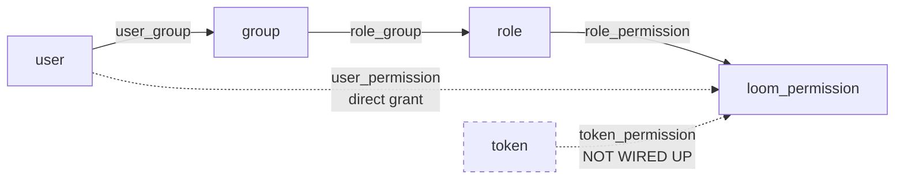
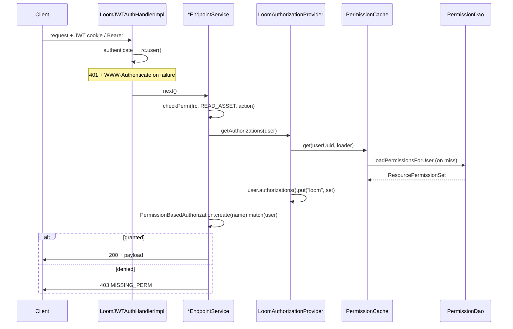

# MetaLoom // Loom Permission System

> This document specifies the **authorization** subsystem of the Loom backend:
> the RBAC data model, the permission taxonomy, how permissions are granted,
> and how they are enforced at request time.
>
> Scope delineation with sibling specs:
>
> - [RESTAPI.md](RESTAPI.md) — **authentication** (JWT, login, OAuth2 BFF, API
>   tokens) and the endpoint inventory. This document picks up *after* a user
>   is authenticated.
> - [PERSISTENCE.md](PERSISTENCE.md) — the general DAO/jOOQ/Flyway layer. This
>   document covers only the permission-specific tables and DAO.
> - [MCP.md](MCP.md) — the MCP tool surface. Its permission checks are a
>   *separate implementation*; the differences are documented in §6.3 here.
> - [WEBSOCKET.md](WEBSOCKET.md), [GRPC.md](GRPC.md) — those transports
>   authenticate but do **not** authorize; see §6.4.

---

## 1. Overview

Loom implements a **role-based access control (RBAC)** system with a
group-mediated role assignment and a coarse, global permission grain.

The essential shape:

- A **Permission** is a flat enum constant naming a verb+entity pair, e.g.
  `READ_ASSET`, `CREATE_PIPELINE`.
- A **Role** holds a set of permissions.
- A **Group** holds a set of roles.
- A **User** holds a set of groups.
- A user's effective permissions are the union of all permissions reachable
  through their groups' roles, plus any direct per-user grants.

Two properties are worth internalizing up front, because they diverge from
what the schema superficially suggests:

1. **There is no `user_role` table.** Roles attach to *groups*, never directly
   to users. To give a user a role you must put them in a group that has it.
2. **Permissions are global, not per-object.** The tables carry a `resource`
   column, but it is discarded before the authorization decision is made
   (§6.2). `READ_ASSET` means "read every asset", not "read asset X".

### 1.1 Authorization model at a glance



Solid edges are the live path. `user_permission` works but is crippled by a
schema bug (§3.2). `token_permission` exists as a table and generated jOOQ
class but has no reachable code path at all (§7.2).

---

## 2. Permission Taxonomy

Permissions are declared in **two places that must be kept in sync**:

| Layer | Type | Location |
|---|---|---|
| Java | `enum Permission` | `loom/db/api/src/main/java/io/metaloom/loom/db/model/perm/Permission.java` |
| Postgres | `loom_permission` enum type | `loom/db/flyway/.../V2.1__add_acl.sql` + later `ALTER TYPE` migrations |
| Generated | `enum JooqLoomPermission` | `loom/db/jooq/src/jooq/java/.../enums/JooqLoomPermission.java` (regenerated from the DB) |

`PermissionDaoImpl` bridges the two with `JooqLoomPermission.valueOf(perm.name())`,
so **every Java `Permission` constant must exist as a Postgres enum value** or
grants throw `IllegalArgumentException` at runtime.

### 2.1 Naming convention

Almost all permissions follow `<VERB>_<ENTITY>` with the verb drawn from
`CREATE` / `READ` / `UPDATE` / `DELETE`. Entities covered (each with the full
CRUD quad unless noted):

`ANNOTATION`, `ASSET`, `ASSET_BINARY`, `ASSET_LOCATION` (legacy), `ATTACHMENT`,
`USER`, `ROLE`, `GROUP`, `SPACE`, `CLUSTER`, `COLLECTION`, `COMMENT`,
`EMBEDDING`, `REACTION`, `TASK`, `TAG`, `TOKEN`, `WEBHOOK`, `LIBRARY`,
`PIPELINE`, `ASSET_POOL`, `BLACKLIST`, `PERSON`, `DETECTION`, `CHAT`.

Exceptions to the CRUD pattern:

| Permission | Note |
|---|---|
| `TAG_ASSET`, `UNTAG_ASSET` | Relationship verbs, not CRUD |
| `READ_PIPELINE_VERSION` | Version history read |
| `RESTORE_PIPELINE_VERSION` | Restore verb; no `UPDATE`/`DELETE` counterpart |

### 2.2 Counts and the Java↔DB drift

As of migration `V2.30`:

- Postgres `loom_permission`: **109** values
- Java `Permission`: **104** values

The **5 DB-only values are unreachable dead vocabulary** — they cannot be
granted (`DatabaseInitializer` loops over the Java enum) and cannot be checked
(`requirePerm` takes a Java `Permission`):

| DB-only value | Added by |
|---|---|
| `CREATE_PIPELINE_RUN` | `V2.29__add_pipeline_run.sql` |
| `READ_PIPELINE_RUN` | `V2.29` |
| `UPDATE_PIPELINE_RUN` | `V2.29` |
| `DELETE_PIPELINE_RUN` | `V2.29` |
| `CREATE_PIPELINE_VERSION` | `V2.30__add_pipeline_version.sql` |

Consequence: the pipeline-run REST endpoints are **unguarded** — `PipelineEndpointService`
has no `checkPerm` call for any run operation, because no Java constant exists
to pass. Adding the constants to `Permission.java` is the fix; see §11.

### 2.3 The `PROJECT` → `SPACE` rename

`V2.22__rename_project_permissions_to_space.sql` uses `ALTER TYPE ... RENAME VALUE`
to turn `*_PROJECT` into `*_SPACE`. Because this is an in-place rename, enum
ordinals are preserved and existing rows migrate implicitly — no data migration
was needed.

**Gotcha:** the *permission* vocabulary moved to "space" but the *tables* did
not. `project`, `project_library` and `project_collection` still exist. The
permission guarding a row in the `project` table is called `READ_SPACE`.

### 2.4 A second, unrelated `RolePermission` enum

`loom-shared/rest-model/.../role/RolePermission.java` is a **different** enum
with only four values (`READ_USER`, `CREATE_USER`, `DELETE_USER`, `UPDATE_USER`).
It is used by `RoleCreateRequest`, `RoleUpdateRequest` and `RoleResponse`.

It is **inert**. `RoleEndpointService` never reads `RoleCreateRequest.getPermissions()`
and never populates `RoleResponse.setPermissions()`; the only `Permission`
constants it references are the four guarding its own CRUD routes. Permissions
sent to `POST /api/v1/roles` are silently accepted and dropped. See §7.3.

### 2.5 Sub-resources are guarded by their parent

**Rule: a table that only exists as a detail of another entity gets no
permission values of its own. It is guarded by its parent's.**

The precedent is `V2.31`, which states it in the migration itself: *"No new
permissions are introduced: both tables are sub-resources of a run and are
guarded by the existing `READ_PIPELINE_RUN` / `UPDATE_PIPELINE_RUN`."*

Applied to the asset result tables added in `V2.38`–`V2.45`:

| Table | Guarded by | Rationale |
|---|---|---|
| `asset_geo_comp`, `asset_doc_comp`, `asset_image_comp`, `asset_video_comp`, `asset_audio_comp`, `asset_transcript_comp` | `READ_ASSET` / `UPDATE_ASSET` | Typed component of one asset; meaningless without it |
| `asset_json_comp` | `READ_ASSET` / `UPDATE_ASSET` | Generic component of one asset |
| `asset_fingerprint_comp`, `asset_segment_comp` | `READ_ASSET` / `UPDATE_ASSET` | Same |
| `asset_node_result` | `READ_ASSET` / `UPDATE_ASSET` | Per-asset processing state |

`detection` and `embedding` keep their existing dedicated permissions. They are
the exception, not a contradiction: both are exposed as first-class REST
resources with their own endpoints, their grants already exist in the wild, and
removing them would be a breaking change for no gain.

Add `*_ASSET_COMPONENT` values **only** if the UI ever needs to grant component
access independently of asset access. An unused enum value still has to be kept
in sync across three layers (§2), so do not add one speculatively.

See [../db/DATABASE_TASKS.md](../db/DATABASE_TASKS.md) §4 for the tables and
their identity contract.

---

## 3. Database Schema

All RBAC tables are created in a single migration:
`loom/db/flyway/src/main/resources/db/migration/V2.1__add_acl.sql`. No later
migration alters them — subsequent migrations only `ALTER TYPE` the enum.

### 3.1 Tables

```sql
CREATE TABLE "role_permission" (
  "role_uuid"  uuid,
  "resource"   varchar NOT NULL,
  "permission" loom_permission NOT NULL,
  PRIMARY KEY ("role_uuid", "permission")
);
ALTER TABLE "role_permission" ADD FOREIGN KEY ("role_uuid")
  REFERENCES "role" ("uuid") ON DELETE CASCADE;

CREATE TABLE "user_permission" (
  "user_uuid"  uuid,
  "resource"   varchar NOT NULL,
  "permission" loom_permission NOT NULL,
  PRIMARY KEY ("user_uuid")
);
ALTER TABLE "user_permission" ADD FOREIGN KEY ("user_uuid")
  REFERENCES "user" ("uuid") ON DELETE CASCADE;

CREATE TABLE "token_permission" (
  "token_uuid" uuid,
  "resource"   varchar NOT NULL,
  "permission" loom_permission NOT NULL,
  PRIMARY KEY ("token_uuid")
);
ALTER TABLE "token_permission" ADD FOREIGN KEY ("token_uuid")
  REFERENCES "token" ("uuid");   -- note: no ON DELETE CASCADE
```

Join tables (both clean composite-PK links with cascade on both sides):

```sql
CREATE TABLE "user_group" (
  "user_uuid" uuid NOT NULL, "group_uuid" uuid NOT NULL,
  PRIMARY KEY ("user_uuid", "group_uuid"));

CREATE TABLE "role_group" (
  "group_uuid" uuid NOT NULL, "role_uuid" uuid NOT NULL,
  PRIMARY KEY ("group_uuid", "role_uuid"));
```

`role` and `group` are structurally identical: `uuid` PK, `name varchar UNIQUE NOT NULL`,
`meta jsonb`, and the standard audit quad (`created`/`creator_uuid`/`edited`/`editor_uuid`).

### 3.2 Known schema defects

These are live in the shipped schema (confirmed against generated
`Keys.java`), not merely SQL sloppiness. Document them before "fixing" any
behaviour that depends on them.

| Table | Declared PK | Defect |
|---|---|---|
| `user_permission` | `(user_uuid)` | A user can hold **at most one** direct permission row, ever. A second `grantUserPermission` for the same user raises a PK violation. |
| `token_permission` | `(token_uuid)` | Same one-row-per-token ceiling. |
| `role_permission` | `(role_uuid, permission)` | `resource` is not part of the key, so a role cannot hold the same permission on two different resources. |

Each table also carries a `CREATE UNIQUE INDEX ON (x_uuid, resource, permission)`
that is dead weight — the PK is a subset of the indexed triple in every case.
The presence of that index shows resource-scoped grants were *intended*; the PK
prevents them.

Additionally, `token_permission`'s FK lacks `ON DELETE CASCADE`, so deleting a
token that has a permission row fails on FK violation.

### 3.3 Indexes

Forward traversal (user → group → role → permission) is indexed at every hop.
**Reverse traversal is not**: `role_group`'s PK is `(group_uuid, role_uuid)`
and `user_group`'s is `(user_uuid, group_uuid)`, so "which users are in this
group?" and "which groups have this role?" fall back to sequential scans. This
is the direction membership-admin screens need — relevant if those views are
built out.

### 3.4 `resource` column

`varchar NOT NULL`, no default, no length limit, no FK, no CHECK constraint.
Nothing at the DB level ties the string to an entity, and **no sentinel value
is reserved for "all resources"**. Any such convention is application-level
only — and, per §6.2, is not honoured anyway.

---

## 4. Granting Permissions

The whole grant API is `PermissionDao`
(`loom/db/api/src/main/java/io/metaloom/loom/db/model/perm/PermissionDao.java`):

```java
public interface PermissionDao {
    void grantUserPermission(UUID userUuid, Permission perm);
    void grantUserPermission(UUID userUuid, Permission perm, String resource);
    void grantRolePermission(UUID roleUuid, Permission perm);
    void grantRolePermission(UUID roleUuid, Permission perm, String resource);
    ResourcePermissionSet loadPermissionsForUser(UUID userUuid);
}
```

Notes on the implementation (`PermissionDaoImpl`):

- `grantRolePermission(roleUuid, perm)` defaults `resource` to the literal
  string `"all"`.
- `grantUserPermission(userUuid, perm)` delegates with `resource = null`, and
  the delegate immediately does `Objects.requireNonNull(resource, ...)`. **The
  two-arg user overload therefore always throws `NullPointerException`.** Only
  the three-arg form is usable.
- There is **no revoke method** and no `grantTokenPermission`. Removing a
  permission requires direct SQL or deleting the role.
- Inserts are plain `INSERT` with no upsert, so re-granting an existing
  permission raises a PK violation rather than being idempotent.

### 4.1 Who calls the grant API

Only bootstrap and test code — there is no runtime/administrative grant path:

| Caller | Purpose |
|---|---|
| `DatabaseInitializer:99` | Grants **all** `Permission.values()` to `admin-role` |
| `DemoDatabaseInitializer:279,293` | Grants curated editor / viewer sets |
| `TestFixtureProvider:320,332` | Grants all perms to `test-role` (resource `"test"`), plus one direct user grant |

---

## 5. Bootstrap and Default Roles

`loom/core/src/main/java/io/metaloom/loom/core/boot/DatabaseInitializer.java`
runs at startup and is idempotent (each step is guarded by a load-first check).

It establishes exactly one privileged path:

```
user "admin"  →  group "admins"  →  role "admin-role"  →  all 104 permissions
```

Constants: `DatabaseInitializer.GROUP_NAME = "admins"`,
`DatabaseInitializer.ROLE_NAME = "admin-role"`, `UserDao.ADMIN_USER_NAME = "admin"`.

The initial admin password comes from `LOOM_INITIAL_PASSWORD`; if unset, a
random 8-character string is generated and **printed to stdout** at first boot.

### 5.1 Demo roles

`DemoDatabaseInitializer` additionally creates `Editors` and `Viewers` groups
with corresponding roles:

- **editor** — full CRUD on asset, library, tag, task, collection, comment,
  annotation, blacklist, chat; `TAG_ASSET`/`UNTAG_ASSET`; read-only on user,
  group, role, space, pipeline, asset pool.
- **viewer** — read-only across asset, tag, collection, task, comment,
  annotation, blacklist, chat, user, group, role, space, library, pipeline,
  asset pool.

These are the closest thing to a documented "standard role set" and are a
reasonable template when defining real roles.

### 5.2 There is no superuser flag

The `user` table has `enabled`, `deleted` and `sso` — **no `admin` column** —
and `requirePerm` contains no early-return bypass. Admin status is entirely
data-driven via the grants above. Renaming or unbinding `admin-role` will lock
out administration with no override.

---

## 6. Runtime Enforcement

### 6.1 Request lifecycle



There is exactly **one** authorization decision function,
`LoomRoutingContext.requirePerm` (`loom/services/rest/.../LoomRoutingContext.java:95`):

```java
public Future<LoomRoutingContext> requirePerm(Permission... perms) {
    User user = user();
    LoomRoutingContext context = this;
    return authorizationProvider.getAuthorizations(user).flatMap(e -> {
        for (Permission perm : perms) {
            boolean hasPerm = PermissionBasedAuthorization.create(perm.name()).match(user);
            if (!hasPerm) {
                return Future.failedFuture("Missing permission " + perm.name());
            }
        }
        return Future.succeededFuture(context);
    });
}
```

Endpoint services call it through the `checkPerm` wrapper in
`AbstractEndpointService:44`, which takes a **single** `Permission` — so the
varargs form is never exercised with more than one.

Most endpoint services declare **no** `checkPerm` call of their own; they pass
a `Permission` constant into the five generic CRUD methods of
`AbstractCRUDEndpointService` (`delete`, `list`, `load`, `create`, `update`).
Services with additional bespoke checks: `TranscriptEndpointService`,
`AssetComponentEndpointService`, `DetectionEndpointService`,
`TagEndpointService`, `AssetEndpointService`, `ReactionEndpointService`,
`PipelineEndpointService`.

### 6.2 The `resource` dimension is discarded

This is the single most important behavioural fact in this document.

`LoomAuthorizationProvider.getAuthorizations` builds the Vert.x authorization
set like this:

```java
for (ResourcePermission perm : cachedPerms) {
    authorizationSet.add(PermissionBasedAuthorization.create(perm.getPermission()));
}
```

`perm.getResource()` is **never called** anywhere in the authorization path —
repo-wide, the only callers of `getResource()` are `ResourcePermission.toString()`
and a commented-out block in `PermissionDaoImpl`.

Therefore:

- `"all"` is **not a wildcard**; it is merely the default string written at
  grant time. It has no special meaning.
- A grant with `resource = "test"` (as the test fixtures use) confers exactly
  the same authority as `resource = "all"`.
- Enforcement is **global per permission type**. There is no per-object,
  per-space, or per-library scoping anywhere in the runtime path.

Treat `resource` as a forward-compatibility placeholder that is persisted but
not interpreted. Do not write code that assumes it scopes anything.

### 6.3 Denial responses

| Condition | Status | Body / header |
|---|---|---|
| Missing or invalid JWT | **401** | `WWW-Authenticate: Bearer`, body `"Unauthorized"` |
| Missing permission | **403** | `GenericMessageResponse`, code `MISSING_PERM` |

The 403 is produced in `AbstractEndpointService:50`:

```java
.onFailure(e -> {
    // TODO this should be 500 error
    log.error("Failed to check perms", e);
    throw new LoomRestException(403, LoomRestErrorCode.MISSING_PERM, "Invalid permissions");
});
```

Two caveats an agent touching this code must know:

1. **The handler cannot distinguish "user lacks permission" from "the
   authorization lookup threw"** — a DB outage surfaces to the client as 403,
   not 500. The in-place `TODO` acknowledges this.
2. **The `throw` happens inside a `Future.onFailure` callback.** It reaches the
   router only because `getAuthorizations` is currently fully synchronous
   (blocking jOOQ + `Future.succeededFuture`), so the callback runs on the
   route handler's own stack. If that DAO call is ever made genuinely async,
   the exception escapes to the Vert.x context exception handler and **the
   client receives no response at all**. Any move to async persistence must
   rewrite this to complete the `RoutingContext` explicitly via `fail()`.

### 6.4 Coverage by transport

| Transport | Authenticates | Authorizes | Notes |
|---|---|---|---|
| REST | Yes | Yes | `requirePerm` / `checkPerm` |
| MCP | Optional | Partial | See below |
| gRPC | Yes | **No** | `GrpcAuthenticator:54` calls `authenticateToken` only |
| WebSocket | Yes | **No** | `WebSocketAuthenticator:84`, same |

gRPC and WebSocket verify identity but never consult `LoomAuthorizationProvider`
or any `Permission`. Any operation exposed exclusively over those transports is
effectively unauthorized.

**MCP** (`MCPToolRegistry.dispatch`) is a parallel implementation:

- It gates on `if (user != null && requiredPermissions != null && !requiredPermissions.isEmpty())`.
  A **null user skips the permission check entirely and dispatches the tool.**
  `MCPAuthenticationHandler` returns a null user when auth is disabled or in
  lenient mode with no credentials — so with `LOOM_MCP_AUTH_ENABLED=false` (the
  default) or `LOOM_MCP_AUTH_STRICT_MODE=false`, an unauthenticated caller can
  execute every tool.
- Its `checkPermissions` uses `.recover(err -> false)`, i.e. it **fails closed**
  — the opposite of the REST layer's conflation, and the more correct choice.
- Required permissions are free-form `String`s from
  `MCPToolDescriptor.requiredPermissions()`, not the `Permission` enum, so a
  typo silently becomes an unsatisfiable permission with no compile-time error.

### 6.5 Caching

`PermissionCache` (`loom/services/auth/auth-common/.../PermissionCache.java`) is
a Caffeine cache keyed by user UUID, `maximumSize = 10_000`.

It has **no TTL and no invalidation API** — the class exposes only `get`. A
permission or group-membership change therefore does not take effect for an
already-cached user until eviction under size pressure, or a restart. Any
feature that mutates grants at runtime must add invalidation here first.

Related: `ResourcePermission` defines **no `equals`/`hashCode`**, yet
`ResourcePermissionSet extends HashSet<ResourcePermission>`. The set uses
identity semantics and does not deduplicate. This is harmless today (duplicates
collapse into the same `PermissionBasedAuthorization`) but makes the set's size
meaningless as a metric.

---

## 7. Known Gaps

### 7.1 Session and account state are not re-checked

`user.enabled` and `user.deleted` are **never consulted during authentication or
authorization**. A disabled or soft-deleted user's existing JWT keeps working,
and `LoomJWTAuthHandlerImpl.refreshTokenCookie` silently re-issues a fresh token
on every request, so sessions renew indefinitely. There is no revocation
mechanism.

### 7.2 Token permissions are dead code

- `loadPermissionsForToken` is **not declared on the `PermissionDao` interface**
  and has **zero call sites**.
- Its body looks broken independently: `fetchOneInto(ResourcePermissionSet.class)`
  against a `HashSet` subclass, with the working implementation commented out
  beneath it.
- No `grantTokenPermission` exists.
- API-key auth resolves a token to its owning user and mints a principal with
  that user's UUID, so **API keys inherit the full permission set of their
  owner**. Tokens cannot be attenuated.

### 7.3 No runtime permission administration

The RBAC REST surface is CRUD over the *entities* only. `UserEndpoint`,
`RoleEndpoint` and `GroupEndpoint` (bound in `EndpointModule:50-53`) each
expose the identical five routes, all under `secure(basePath() + "*")`:

| Method | Path | Permission |
|---|---|---|
| POST | `/api/v1/{roles,groups,users}` | `CREATE_*` |
| POST | `/api/v1/{...}/:uuid` | `UPDATE_*` |
| DELETE | `/api/v1/{...}/:uuid` | `DELETE_*` |
| GET | `/api/v1/{...}` | `READ_*` |
| GET | `/api/v1/{...}/:uuid` | `READ_*` |

What does **not** exist:

- No `/api/v1/permissions` endpoint, and no `permission/` REST model package.
- No membership routes — nothing to add a user to a group or attach a role to
  a group, even though `GroupDao.addUserToGroup` and `addRoleToGroup` exist at
  the DAO layer.
- No grant/revoke route.
- No RBAC types in GraphQL (`loom.graphqls` covers only assets) or gRPC (the
  protos are `asset`, `health`, `reflection` only).

Combined with §2.4 — the `permissions` field on role requests is discarded on
write and never populated on read by `RoleModelBuilder.toResponse` — the UI's
"permission matrix" at `/admin/permissions` has no backend to talk to.
Permission assignment today is **bootstrap-time only**, reachable exclusively
through Java DAO calls.

### 7.4 Commented-out enforcement

`AssetBinaryEndpointService:124-146` — the entire `listAssetBinarys` method,
including its `checkPerm(lrc, READ_ASSET_BINARY, ...)`, is commented out.

---

## 8. Configuration

Permission behaviour itself is not configurable. The adjacent auth settings
that affect it (`loom-shared/api/.../AuthenticationOptions.java`):

| Environment variable | Default | Purpose |
|---|---|---|
| `LOOM_INITIAL_PASSWORD` | *(random, printed to stdout)* | Initial `admin` account password |
| `LOOM_TOKEN_EXPIRATION_TIME` | `3600` | JWT lifetime in seconds |
| `LOOM_MCP_AUTH_ENABLED` | `false` | Enable auth on MCP endpoints |
| `LOOM_MCP_AUTH_STRICT_MODE` | `false` | Require auth on all MCP endpoints (no lenient mode) |
| `LOOM_MCP_AUTH_ALLOWED_ORIGINS` | `*` | CORS origins for the MCP SSE endpoint |

The two MCP defaults are what make §6.4's unauthenticated-tool-dispatch path
reachable out of the box.

Constants: `AuthenticationOptions.TOKEN_COOKIE_KEY = "__Host-loom_token"`,
`DEFAULT_TOKEN_EXPIRATION_TIME = 3600`.

---

## 9. Test Setup

### 9.1 Existing coverage

`loom/db/jooq/src/test/java/io/metaloom/loom/db/perm/PermissionDaoTest.java` is
the only dedicated test. It is close to a smoke test — it loads the admin
user's permissions, asserts the set is non-null, and prints each entry:

```java
public class PermissionDaoTest extends AbstractJooqTest {
    @Test
    public void testLoadUserPerms() {
        User user = userDao().loadByUsername("admin");
        ResourcePermissionSet perms = permissionDao().loadPermissionsForUser(user.getUuid());
        assertNotNull(perms);
        for (ResourcePermission perm : perms) {
            System.out.println(perm);
        }
    }
}
```

It asserts nothing about *which* permissions are returned, so it would still
pass if the group→role join silently returned zero rows.
`LoomAuthorizationProviderTest` covers the provider side.

Two further quality notes:

- The class mixes JUnit 4 and 5 — `org.junit.Assert.assertNotNull` with
  `org.junit.jupiter.api.Test`. Use `org.junit.jupiter.api.Assertions`.
- It lives in package `io.metaloom.loom.db.perm`, an outlier; every sibling DAO
  test is in `io.metaloom.loom.db.jooq.dao`.

`RoleDaoTest` (`.../db/jooq/dao/RoleDaoTest.java`) is an **empty class body with
zero tests**, while `GroupDaoTest` in the same package is fully implemented via
the `CRUDDaoTestcases` mixin — use the latter as the template.

### 9.2 Fixture topology

`loom/fixture/src/main/java/io/metaloom/loom/test/fixture/TestFixtureProvider.java`
builds this graph, with stable UUID constants (`ADMIN_UUID`, `USER_UUID`,
`GROUP_UUID`, `ROLE_UUID`, `TOKEN_UUID`):

```
admin   → group "test-group" → role "test-role" → ALL permissions (resource "test")
joedoe  → (no group)         → user_permission: READ_USER (resource "test")
```

Both users have password `finger`. Note `joedoe` gets exactly **one** direct
permission — adding a second would violate the `user_permission` PK (§3.2).

### 9.3 How the test database is provisioned

**Not Testcontainers at test runtime.** Tests lease a pre-filled database from
an external **testdatabase-provider** pool:

- `AbstractJooqTest` registers `JooqTestContext` as a JUnit 5 extension.
- `JooqTestContext.beforeEach` calls `LoomProviderExtension.create()`, which
  connects to a pool provider on **`localhost:7543`** (pool id `loom-dev`),
  leases a database, and builds a Dagger `TestComponent` from the resulting
  `DatabaseOptions` (`loom-test-env/.../TestEnvHelper.java:37-49`).

Testcontainers *is* used, but only at **build time** — a `groovy-maven-plugin`
step in `loom/db/jooq/pom.xml` spins up Postgres for Flyway migration and jOOQ
codegen.

Prerequisites (per the root `README.md`):

```bash
# 1. Start the pool provider + database
cd test-database && podman-compose up -d

# 2. Initialise the pool once
#    run io.metaloom.loom.test.PoolSetupRunner from the loom-fixture module
```

**Gotcha:** `JooqTestContext.afterEach` is entirely commented out, so leased
databases are never returned to the pool. Long test sessions can exhaust it;
re-running `PoolSetupRunner` resets it.

### 9.4 Writing a new permission test

1. Extend `AbstractJooqTest` (which also implements `DatabaseTest` and
   `FixtureElementProvider`).
2. Access DAOs via the inherited `DaoProvider` defaults — `permissionDao()`,
   `userDao()`, `roleDao()`, `groupDao()`.
3. Prefer the fixture accessors (`adminUser()`, `dummyUser()`) over creating
   data; they resolve the fixed UUIDs seeded into the pool template.
4. Grant with the **three-arg** overloads only; `grantUserPermission(uuid, perm)`
   throws NPE (§4).
5. Respect the PK ceilings: one `user_permission` row per user; one
   `(role, permission)` pair per role regardless of resource.
6. To test the full user→group→role→permission resolution, assert on the
   *contents* of `loadPermissionsForUser`, not just non-nullity — that is the
   gap in the current test.

Run it with:

```bash
mvn -pl loom/db/jooq -am test -Dtest=PermissionDaoTest
mvn -pl loom/db/jooq test -Dtest=PermissionDaoTest#testLoadUserPerms
```

### 9.5 Suggested cases not yet covered

- Effective permissions resolve transitively through group → role.
- A user in no group with no direct grant resolves to an empty set.
- Removing a user from a group removes the derived permissions
  (currently masked by the cache having no invalidation, §6.5).
- `requirePerm` returns 403 with `MISSING_PERM` for an unprivileged user.
- Cascade behaviour: deleting a role removes its `role_permission` rows.

---

## 10. Conventions and Gotchas

- **Adding a new entity means touching two enums.** Add
  `CREATE/READ/UPDATE/DELETE_<ENTITY>` to `Permission.java` *and* an
  `ALTER TYPE "loom_permission" ADD VALUE IF NOT EXISTS ...` migration. Missing
  the Java side leaves the value unreachable (§2.2); missing the SQL side makes
  grants throw at runtime.
- **Use `IF NOT EXISTS` in enum migrations.** All migrations do except `V2.19`.
- **`ALTER TYPE ... ADD VALUE` cannot run inside a transaction block** in older
  Postgres, and the new value is not usable in the same transaction. Keep enum
  additions in their own migration, separate from table DDL that uses them.
- **`resource` is stored but never enforced** (§6.2). Do not build features on
  the assumption that it scopes access.
- **`"all"` is not a wildcard** — just a default string.
- **The two-arg `grantUserPermission` always throws.** Use the three-arg form.
- **There is no revoke and no upsert.** Re-granting raises a PK violation.
- **Roles bind to groups, not users.** There is no `user_role` table.
- **The permission cache never invalidates** (§6.5). Grants made after a user is
  cached do not take effect until restart.
- **403 is overloaded** — it also means "the permission lookup failed" (§6.3).
- **Regenerate jOOQ after enum changes:** `mvn -Dgenerate generate-sources -pl loom/db/jooq`.
  Otherwise `JooqLoomPermission` lacks the new value and `valueOf` fails.
- **`READ_SPACE` guards the `project` table** (§2.3).

---

## 11. Key Classes Reference

| Class | Package / module | Purpose |
|---|---|---|
| `Permission` | `io.metaloom.loom.db.model.perm` (loom-db-api) | The 104-value permission enum — the source of truth for Java |
| `PermissionDao` | `io.metaloom.loom.db.model.perm` (loom-db-api) | Grant + load interface |
| `PermissionDaoImpl` | `io.metaloom.loom.db.jooq.dao.perm` (loom-db-jooq) | jOOQ implementation; performs the group→role join |
| `ResourcePermission` | `io.metaloom.loom.db.model.perm` (loom-db-api) | `(permission, resource)` pair; no equals/hashCode |
| `ResourcePermissionSet` | `io.metaloom.loom.db.model.perm` (loom-db-api) | `HashSet<ResourcePermission>` |
| `JooqLoomPermission` | `io.metaloom.loom.db.jooq.enums` (generated) | 109-value enum generated from Postgres |
| `LoomAuthorizationProvider` | `io.metaloom.loom.auth` (auth-common) | Loads perms, populates Vert.x authorizations; **drops `resource`** |
| `PermissionCache` | `io.metaloom.loom.auth` (auth-common) | Caffeine cache, 10k entries, no TTL/invalidation |
| `LoomRoutingContext` | `io.metaloom.loom.rest` (loom-rest) | `requirePerm(Permission...)` — the sole decision point |
| `AbstractEndpointService` | `io.metaloom.loom.rest.service` (loom-rest) | `checkPerm(...)` wrapper; throws 403 `MISSING_PERM` |
| `AbstractCRUDEndpointService` | `io.metaloom.loom.rest.service` (loom-rest) | Generic guarded create/read/update/delete/list |
| `LoomJWTAuthHandlerImpl` | `io.metaloom.loom.auth.jwt` (auth-jwt) | JWT authentication handler; refreshes cookie |
| `MCPToolRegistry` | `io.metaloom.loom.mcp.tool` (loom-mcp) | Parallel permission check for MCP tools |
| `DatabaseInitializer` | `io.metaloom.loom.core.boot` (loom-core) | Creates admin user/group/role, grants all perms |
| `DemoDatabaseInitializer` | `io.metaloom.loom.core.boot` (loom-core) | Editor / viewer demo roles |
| `TestFixtureProvider` | `io.metaloom.loom.test.fixture` (loom-fixture) | Test RBAC graph |
| `RolePermission` | `io.metaloom.loom.rest.model.role` (rest-model) | Unused 4-value REST enum (§2.4) |

---

## 12. Where do I find ...?

| I want to ... | Look at |
|---|---|
| Add a new permission constant | `loom/db/api/src/main/java/io/metaloom/loom/db/model/perm/Permission.java` + a new Flyway `ALTER TYPE` migration |
| See the DDL for the RBAC tables | `loom/db/flyway/src/main/resources/db/migration/V2.1__add_acl.sql` |
| Trace the permission enum's history | `grep -l loom_permission loom/db/flyway/src/main/resources/db/migration/*.sql` |
| Change how a permission is checked | `loom/services/rest/src/main/java/io/metaloom/loom/rest/LoomRoutingContext.java:95` |
| Change the denial status code | `loom/services/rest/src/main/java/io/metaloom/loom/rest/service/AbstractEndpointService.java:44` |
| See how perms are loaded from the DB | `loom/db/jooq/src/main/java/io/metaloom/loom/db/jooq/dao/perm/PermissionDaoImpl.java:35` |
| Understand the user→group→role join | Same file, `loadPermissionsForUser` |
| Add cache invalidation | `loom/services/auth/auth-common/src/main/java/io/metaloom/loom/auth/PermissionCache.java` |
| Find which permission guards an endpoint | `grep -rn "checkPerm\|Permission\." loom/services/rest/src/main/java/io/metaloom/loom/rest/service/impl/` |
| Change bootstrap roles/permissions | `loom/core/src/main/java/io/metaloom/loom/core/boot/DatabaseInitializer.java` |
| Adjust the test RBAC fixture | `loom/fixture/src/main/java/io/metaloom/loom/test/fixture/TestFixtureProvider.java:308` |
| See MCP's separate check | `loom/services/mcp/src/main/java/io/metaloom/loom/mcp/tool/MCPToolRegistry.java:111` |

---

## 13. Progress Assessment

### 13.1 Implemented

- [x] `loom_permission` Postgres enum with 109 values
- [x] Java `Permission` enum with 104 values
- [x] `role_permission`, `user_permission`, `token_permission` tables
- [x] `user_group` and `role_group` join tables with cascade
- [x] `PermissionDao` grant + load API
- [x] Transitive resolution user → group → role → permission
- [x] Direct per-user permission grants (single row, see defects)
- [x] `LoomAuthorizationProvider` bridging DB perms to Vert.x authorizations
- [x] Caffeine-backed `PermissionCache`
- [x] `requirePerm` / `checkPerm` enforcement on REST CRUD endpoints
- [x] 403 `MISSING_PERM` denial response
- [x] Bootstrap admin user/group/role with full grants
- [x] Demo editor/viewer roles
- [x] MCP tool-level permission declarations and checks
- [x] Test fixture RBAC graph with stable UUIDs

### 13.2 Schema defects to fix

- [ ] `user_permission` PK is `(user_uuid)` — should be `(user_uuid, resource, permission)`
- [ ] `token_permission` PK is `(token_uuid)` — same fix needed
- [ ] `role_permission` PK omits `resource`
- [ ] `token_permission` FK lacks `ON DELETE CASCADE`
- [ ] Redundant unique indexes on all three permission tables
- [ ] No reverse index on `user_group` / `role_group` for membership queries

### 13.3 Correctness and security gaps

- [ ] `resource` is persisted but discarded — no per-object scoping (§6.2)
- [ ] `grantUserPermission(uuid, perm)` two-arg overload always throws NPE
- [ ] No revoke API; no idempotent upsert on grant
- [ ] Permission cache has no TTL and no invalidation (§6.5)
- [ ] 403 conflates "lacks permission" with "lookup failed" (§6.3)
- [ ] `checkPerm`'s throw-from-callback breaks if persistence becomes async (§6.3)
- [ ] `user.enabled` / `user.deleted` never checked during auth (§7.1)
- [ ] No token revocation; JWTs self-renew indefinitely (§7.1)
- [ ] MCP dispatches tools with **no** permission check when user is null (§6.4)
- [ ] gRPC transport performs no authorization (§6.4)
- [ ] WebSocket transport performs no authorization (§6.4)
- [ ] `ResourcePermission` lacks `equals`/`hashCode` despite `HashSet` use
- [ ] `AssetBinaryEndpointService.listAssetBinarys` and its check are commented out (§7.4)

### 13.4 Missing functionality

- [ ] 5 DB-only enum values unreachable from Java; pipeline-run endpoints unguarded (§2.2)
- [ ] `token_permission` entirely unwired; API keys inherit full owner authority (§7.2)
- [ ] No REST/GraphQL/gRPC surface for granting or revoking permissions (§7.3)
- [ ] `RoleCreateRequest.permissions` accepted and silently dropped (§2.4)
- [ ] `RolePermission` REST enum has 4 values vs 104 in the domain enum (§2.4)
- [ ] No endpoints for group membership or role assignment
- [ ] UI permission matrix at `/admin/permissions` has no functional backend
- [ ] No membership routes (add user to group, attach role to group) (§7.3)
- [ ] No RBAC types in the GraphQL schema or the gRPC protos (§7.3)

### 13.5 Test gaps

- [ ] `PermissionDaoTest` asserts non-nullity only; nothing on resolved contents (§9.1)
- [ ] `PermissionDaoTest` mixes JUnit 4 assertions with JUnit 5 annotations
- [ ] `RoleDaoTest` is an empty class with zero tests
- [ ] `JooqTestContext.afterEach` is commented out — leased test DBs are never released (§9.3)
- [ ] No test asserts a denied request yields 403 `MISSING_PERM`
- [ ] No test covers group-membership changes affecting effective permissions
