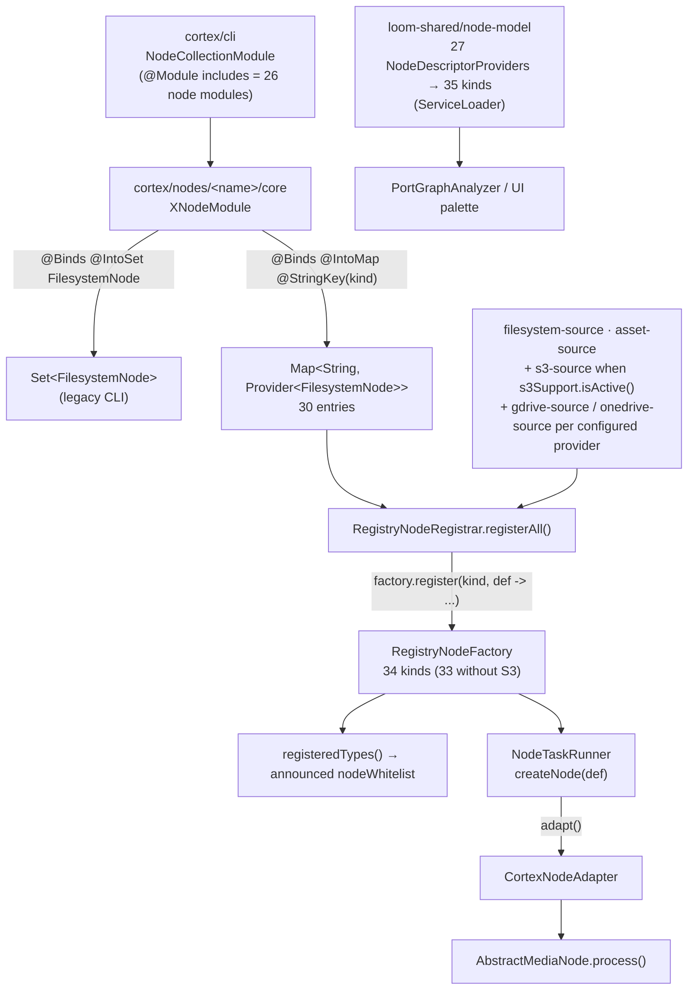

# Cortex Node System Specification

> **What this file owns**: what a Cortex node *is*, its lifecycle, how it persists results, how it is
> configured and registered, and a per-node reference for every node in the tree.
>
> **What it does not own** — do not duplicate these, link to them:
>
> | Topic | Spec |
> |---|---|
> | Ports, content types, cardinality, fan-out/gather, per-kind port table | [../pipeline/NODE_DATA_TYPES.md](../pipeline/NODE_DATA_TYPES.md) |
> | DAG execution, task dispatch, pipeline JSON, Loom↔Cortex protocol | [../pipeline/PIPELINE.md](../pipeline/PIPELINE.md) |
> | Cortex module map, startup, Dagger assembly, monitoring, env vars | [../../cortex/CORTEX.md](../../cortex/CORTEX.md) |
> | **Definition of done for a new node** (rules, not background) | [../../guidelines/NEW_NODE.md](../../guidelines/NEW_NODE.md) |
>
> **Source of truth is the code under `cortex/`.** Where this file and the code disagree, the code
> wins — fix this file in the same change.

---

## 1. Anatomy and Lifecycle

### 1.1 Two hierarchies

| Hierarchy | Interface | Base class | Role |
|---|---|---|---|
| **Cortex-level** | `CortexNode<I,T>` → `FilesystemNode<I,T>` | `AbstractCortexNode` → `AbstractFilesystemNode` → `AbstractMediaNode<T>` | Every processing node. 30 of them |
| **Pipeline-level** | `PipelineNode` | `AbstractPipelineNode` | Sources, filters, and the adapter |

`CortexNodeAdapter` (pipeline-core) wraps a `FilesystemNode` as a `PipelineNode`, re-stamping the
result with the pipeline node id and elapsed time (`NodeResult.withNode(id, ms)`). Nothing is
converted — both trees use the same `io.metaloom.cortex.api.node.NodeResult`.

`PipelineNode.process(LoomMedia, NodeInputs)` is the **only** execution entry point.
`isSource()`, `mode()`, `blocking()`, `concurrency()`, `timeoutMs()` are declarative.

### 1.2 `AbstractMediaNode.process()`

```
enabled? ──no──> ctx.skipped("Disabled").next()
file exists? ──no──> ctx.failure("File not found").abort()
isProcessable(ctx)? ──no──> ctx.skipped(...).next()
fetchAsset()  (null when offline — LoomClient absent)
compute(ctx, asset)
```

Return contract (see [NEW_NODE.md §1.1](../../guidelines/NEW_NODE.md)):

| Outcome | Return | State |
|---|---|---|
| computed | `ctx.origin(COMPUTED).next()` | SUCCESS |
| served from `LocalResultCache` | `ctx.origin(LOCAL).next()` — **re-emit the outputs** | SUCCESS |
| nothing to do | `ctx.skipped(reason).next()` | SKIPPED |
| failure | `ctx.failure(msg).abort()` | FAILED |

🔴 **`ctx.failure(msg).next()` reports SUCCESS.** `NodeContextImpl.next()` reads only `skipReason`
and ignores `failureCause`. See §9 for the exact list of nodes still doing it.

A cache hit is **SUCCESS with `ResultOrigin.LOCAL`, never SKIPPED** — a SKIPPED node's outputs are
treated as absent by the engine, which starves every node bound to that port. This was a real bug in
`FingerprintNode` (it bailed in `isProcessable()` and emitted nothing); resolved 2026-08-01, recorded
in [NODE_DATA_TYPES.md §11](../pipeline/NODE_DATA_TYPES.md).

### 1.3 Ports, not node ids

Nodes exchange values over **typed ports** declared as `public static final` constants and read via
`ctx.input(PORT)` / `ctx.optionalInput(PORT)` / `ctx.inputs(PORT)`, emitted via
`ctx.output(PORT, v)` / `ctx.outputElement(PORT, v)`.

**`NodeOutputKey` and `ctx.upstreamOutput(nodeId, key)` are deleted** — only javadoc mentions them.
The whole model (content-type lattice, cardinality, `PortGroup`, dynamic ports, per-kind port table)
lives in [NODE_DATA_TYPES.md](../pipeline/NODE_DATA_TYPES.md). Do not restate it here.

### 1.4 What was removed

The **media-decorator pattern is gone**: no `MetaStorage`, `LoomMetaKey`, `MediaType.wrap()`,
`HashMedia`, `FacedetectMedia` — verified zero references. `LoomMedia` is a pure file handle carrying
only the SHA-512 identity. Domain results live in Loom (§2) and the in-heap cache (§4).

Also deleted (zero live references; only javadoc mentions remain): `PipelineExecutor`,
`ReactivePipelineExecutor`, `DefaultPipeline`, `PipelineManager`, `LoomPipelineLoader`,
`StubPipelineNode`, `LoomNode`. The DAG executor now lives Loom-side as
`io.metaloom.loom.pipeline.engine.PipelineRunEngine`; Cortex only runs `NodeTaskRunner` /
`SourceTaskRunner` / `SegmentTaskRunner`.

🔴 `RegistryNodeFactory.createNode()` returns **`null`** for an unregistered kind — there is no stub
fallback any more, so the task fails. (Its log line still says "falling back to stub"; the message is
stale, the behaviour is not.)

`cortex/core-media` now holds only value types (`WhisperResult`, `TranscriptionSegment`, `Scene`,
`SceneDetectionResult`) plus the AssertJ/test bases.

---

## 2. Persistence

Every persisting node does two things inside `compute()`, guarded by `asset != null && client() != null`
(a clean no-op offline):

1. **Typed payload** → a per-asset REST sub-resource that **upserts** on its natural key.
2. **Ledger** → `AbstractMediaNode.recordNodeResult(asset, ctx, state, reason, producerVersion, resultRef)`
   → `POST /api/v1/assets/:uuid/node-results` → `asset_node_result`, **UNIQUE (asset_uuid, node_kind, node_id)**.
   Best-effort: a ledger failure never fails the node.

All 30 node classes call `recordNodeResult`. ⚠️ `WhisperNode` declares a **private overload** that
shadows the base method — do not copy it.

| Node(s) | Typed payload → table | Client method |
|---|---|---|
| `md5`, `sha256`, `chunk-hash` | `assets/:uuid` update → `asset` hash columns | `updateAsset` |
| `sha512` | **ledger only** — the SHA-512 *is* the asset identity, nothing to write back | — |
| `consistency` | `assets/:uuid` update → `asset` consistency block | `updateAsset` |
| `fingerprint` | `assets/:uuid/fingerprints` → `asset_fingerprint_comp` (sector 0) | `createAssetFingerprintComp` |
| `facedetect` | `assets/:uuid/detections/bulk` → `detection` (upsert) | `bulkCreateAssetDetections` |
| `whisper` | `assets/:uuid/transcripts` → `asset_transcript_comp` (`streamIndex 0`) | `createAssetTranscript` |
| `scene-detection` | `assets/:uuid/segments` → `asset_segment_comp` (whole-set **replace**) | `createAssetSegmentComps` |
| `ocr`, `tika`, `quality`, `llm`, `vlm`, `captioning`, `facedescription`, `sentiment`, `translate`, `scene-layout`, `dominant-color` | `assets/:uuid/json-comps` → `asset_json_comp`, distinct `schemaType` | `createAssetJsonComp` |
| `script` | `asset_json_comp` (`variant` = node id) **+** `asset_segment_comp` for `TIMEFRAMES` outputs | `createAssetJsonComp`, `createAssetSegmentComps` |
| `s3-sink` | one `asset` **per uploaded artifact** (`origin` = the `s3://` URI) + `asset_json_comp` (`schemaType=s3-artifact`, `variant` = node id) on the source asset | `createAsset`, `createAssetJsonComp` |
| `fingerprint-dedup` | `dedup-groups` → `dedup_group` + `dedup_group_member` | `createDedupGroup` |
| `thumbnail`, `tts`, `imagegen`, `videogen`, `depthmap`, `watermark`, `sha512-dedup`, `fingerprint-dedup-apply` | **ledger only** | — |

`schemaType` values in use: `caption`, `video-caption`, `face-description`, `llm`, `vlm`, `ocr`,
`quality`, `tika`, `sentiment`, `translation`, `scene-layout`, `dominant-color`, `script`, `s3-artifact`.

### 2.1 Ledger-only nodes and produced bytes

Nodes that produce **new bytes** write them to `metaPath/<name>_bin/<segment>/<sha512>.<ext>`
(`HashUtils.segmentPath`) and record the ledger with **no `result_ref`**. Live artifact directories:
`thumbnail_bin`, `tts_bin`, `imagegen_bin`, `videogen_bin`, `depthmap_bin`, `watermark_bin`,
`script_bin` (plus `s3_bin`, `gdrive_bin` and `onedrive_bin` — the remote materializers' download
caches, which hold fetched inputs rather than produced outputs).

Loom has **no byte-ingest endpoint for produced media**. Wiring the artifact output port into
`s3-sink` is the only way to keep the bytes off the worker. 🔴 The sink must run on the **same
worker** as the producer and nothing enforces that (§10).

---

## 3. Node Reference

**29 modules** under `cortex/nodes/` (per `cortex/nodes/pom.xml`). `cortex/nodes/loom/` is a stale
leftover directory with no `pom.xml` and is not a module — do not list or resurrect it.

Layout is `cortex/nodes/<name>/core/` except `filesystem-source`, `s3-source` and `cloud-source`,
which are flat.

### 3.1 Processing nodes (`AbstractMediaNode`)

Port ids only; content types and cardinality are in
[NODE_DATA_TYPES.md §4](../pipeline/NODE_DATA_TYPES.md).

| Kind | Class · module | Processes | In → Out ports | Persists | Runtime dep |
|---|---|---|---|---|---|
| `md5` | `MD5Node` · hash | any, if `md5` option | `media` → `hash` | `asset` cols | — |
| `sha256` | `SHA256Node` · hash | any, if `sha256` | `media` → `hash` | `asset` cols | — |
| `sha512` | `SHA512Node` · hash | any, if `sha512` | `media` → `hash` | ledger only | — |
| `chunk-hash` | `ChunkHashNode` · hash | any, if `chunkHash` | `media` → `hash` | `asset` cols | — |
| `consistency` | `ConsistencyNode` · consistency | video, audio | `media` → `zero_chunk_count`, `is_complete` | `asset` block | video4j |
| `fingerprint` | `FingerprintNode` · fingerprint | video (+`is_complete` gate) | `media`, `is_complete` → `fingerprint` | `asset_fingerprint_comp` | video4j |
| `thumbnail` | `ThumbnailNode` · thumbnail | video (+`is_complete` gate) | `media`, `is_complete` → `thumbnail`, `flag` | ledger only | video4j |
| `quality` | `QualityNode` · quality | video, image | `media` → `metrics`, `blurriness`, `width`, `height`, `fps`, `frame_count`, `flag` | `asset_json_comp` | video4j |
| `scene-detection` | `SceneDetectionNode` · scene-detection | video | `media` → `scenes` | `asset_segment_comp` (replace) | video4j |
| `facedetect` | `FacedetectNode` · facedetect | video, image | `image` \| `video` → `face_count`, `flag`, `detections` (MANY) | `detection` (upsert) | InspireFace |
| `facedescription` | `FacedescriptionNode` · facedetect | video, image | `detections` (MANY) → `descriptions` (MANY) | `asset_json_comp` | LLM |
| `ocr` | `OCRNode` · ocr | image | `media` → `text` | `asset_json_comp` | Tesseract |
| `tika` | `TikaNode` · tika | image, audio, video, document | `media` → `content`, `flags` | `asset_json_comp` | — |
| `whisper` | `WhisperNode` · whisper | video, audio | `audio` \| `video` → `transcript` | `asset_transcript_comp` | whisper.cpp |
| `llm` | `LLMNode` · llm | any (filename-driven) | `media` → **dynamic** per prompt | `asset_json_comp`/prompt | OpenAI-compatible |
| `vlm` | `VlmNode` · vlm | image | `media` → **dynamic** per prompt | `asset_json_comp`/prompt | OpenAI-compat VLM |
| `captioning` | `CaptioningNode` · captioning | image, video | `image` \| `video` → `caption` | `asset_json_comp` | SmolVLM / Qwen2.5-VL |
| `sentiment` | `SentimentNode` · sentiment | any with `text` wired | `text` → `label`, `score`, `result` | `asset_json_comp` | sidecar `9110` |
| `translate` | `TranslateNode` · translate | any with `text` wired | `text` → `translation`, `language`, `result` | `asset_json_comp` (`variant` = target language) | OpenAI-compatible |
| `tts` | `TtsNode` · tts | any with `text` wired | `text` → `audio`, `flag` | ledger only | sidecar `9100` |
| `depthmap` | `DepthmapNode` · depthmap | image | `media` → `map`, `meta`, `flag` | ledger only | sidecar `9120` |
| `scene-layout` | `SceneLayoutNode` · scene-layout | image | `depth`, `detections` (MANY) → `result`, `object_count`, `relation_count` | `asset_json_comp` | **none** (geometry) |
| `dominant-color` | `DominantColorNode` · dominant-color | image | `media`, `detections` (MANY, opt) → `result`, `hex`, `term`, `name_en`, `name_de`, `region_count` | `asset_json_comp` | **none** (arithmetic) |
| `imagegen` | `ImageGenNode` · image-generation | image | `prompt`, `media` → `image`, `flag` | ledger only | sidecar `9200`/`9210` |
| `videogen` | `VideoGenNode` · video-generation | image | `prompt`, `media` → `video`, `flag` | ledger only | sidecar `9220` |
| `watermark` | `WatermarkNode` · watermark | image, video | `media` → `image` \| `video`, `flag` | ledger only | **`ffmpeg`/`ffprobe`** |
| `script` | `ScriptNode` · script | any with a compiled script | `media`, `data`, `text` (all opt) → **declared per instance** | `asset_json_comp` + `asset_segment_comp` | GraalJS (in-process) |
| `sha512-dedup` | `HashDedupNode` · dedup | any with SHA-512 | — (side effect: moves files) | ledger only | — |
| `fingerprint-dedup` | `FingerprintDedupNode` · dedup | video | — | `dedup_group` | — |
| `fingerprint-dedup-apply` | `FingerprintDedupApplyNode` · dedup | any with SHA-512 | — (moves files) | ledger only | — |
| `s3-sink` | `S3SinkNode` · s3-sink | any (`artifacts` edge is what matters) | `artifacts` (MANY) → `result`, `count`, `flag` | asset/artifact + `asset_json_comp` | S3 |

Notes worth knowing:

- **`watermark` branches by two outputs.** It writes `image` *or* `video` per item; the unwritten
  port simply delivers nothing downstream. No filter node needed.
- **`llm` / `vlm` / `script` have dynamic ports** derived from their own options
  (`LlmPortResolver`, `VlmPortResolver`, `ScriptOutputSpec`). They are exempt from
  `NodePortConformanceTest` via `DYNAMIC_KINDS`.
- **`scene-layout` and `depthmap` must share an affinity group** — the depth PNG is worker-local.
  Same for `s3-sink` and whatever produced its artifacts.
- **`captioning`'s `videoStrategy`**: `WHOLE` (N frames → one prompt), `SCENE` (optical-flow
  segmentation → per-scene timeline, `schemaType=video-caption`), `NATIVE` (`video_url`, vLLM only).
- **`sentiment` / `tts` / `translate` ignore media type entirely** — `isProcessable` is "is the
  `text` port non-blank". They are the three nodes that can attach to any asset.
- **`translate` is one language per instance.** The target language is the `asset_json_comp`
  `variant`, so two translate nodes in one graph write two rows on the same asset rather than
  overwriting each other. It shares its LLM plumbing with `llm` via `cortex/llm-common`, but not its
  shape: `llm` reads `media` and prompts from the filename, so no transcript can reach it.
  `translate` chunks input larger than `maxChunkChars` on paragraph then sentence boundaries and
  rejoins the answers — one model call per chunk.
- **Two sidecars serve `imagegen`**: `ideogram-sidecar` (`9200`, SDXL-Turbo, non-commercial weights)
  and `mage-flow-sidecar` (`9210`, MIT weights). Same HTTP contract; pick via the `port` option.

### 3.2 Source nodes (`AbstractPipelineNode implements MediaSourceNode`)

Sources are **not** `FilesystemNode`s. Their Dagger modules carry no `@IntoSet`/`@StringKey`; they
are constructed directly by `RegistryNodeRegistrar` (§5).

| Kind | Class · module | Emits | Notes |
|---|---|---|---|
| `filesystem-source` | `FilesystemSourceNode` · nodes/filesystem-source (flat) | `media` | Root mode = differential scan (`LinuxFilesystemScanner` + Avro `FileIndexStore` under `indexPath`); glob mode re-enumerates every match and **wins** when both are set. `emitStates` default `[NEW, MODIFIED, MOVED]` |
| `s3-source` | `S3SourceNode` · nodes/s3-source (flat) | `media` (`s3://` refs) | Differential on `(key, etag, size)`; Avro index per `sha256(endpoint/bucket/prefix)`. **`MOVED` is never emitted** — ETags collide across identical objects, so inferring renames would invent them. Three scan paths (full list / `startAfter` resume / buffered bucket events), both fast paths gated on a full listing within `reconcileIntervalMs` (default 6h). Registered **only when S3 is configured** |
| `gdrive-source` | `CloudSourceNode` · nodes/cloud-source (flat) | `media` (`gdrive://` refs) | Differential on `(changeToken, size)` with `parentId`+`name` for moves; Avro index per `sha256(scheme/account/drive/folder/recursion/depth)`, keyed by **file id**. **`MOVED` is genuinely emitted** — a cloud file id survives a rename and a re-parent, which no S3 ETag can. Two scan paths (full folder walk / `changes.list` delta), the fast path gated on a full walk within `reconcileIntervalMs` (default 24h). Registered **only when Google credentials are configured** |
| `onedrive-source` | `CloudSourceNode` · nodes/cloud-source (flat) | `media` (`onedrive://` refs) | Same implementation and semantics as `gdrive-source` over Microsoft Graph `/root/delta`. Separate kind so a worker advertises only the cloud it holds credentials for. Registered **only when Microsoft credentials are configured** |
| `asset-source` | `AssetSourceNode` · pipeline-core | one configured `LoomMedia` | Built from the node def's `path`, which Loom fills from the asset's stored location. **No descriptor** — pipeline JSON can select it but the editor palette cannot offer it |

`stream()` must return a **cold** `Flowable`: no filesystem or network work before subscription, and
every subscription re-enumerates. That is what lets a registered source pick up files added since the
previous run. Neither source touches `LoomClient` or writes a ledger row; misconfiguration throws at
construction.

**Media addressing**: `ProcessableMedia.reference()` (default `absolutePath()`) is the stable
location-independent identity. `NodeTaskRunner.MediaResolver` takes a `MediaRef`, not a `Path` — a
`java.nio.file.Path` cannot hold a URI (`Paths.get("s3://b/k")` collapses to `s3:/b/k`).
`S3MediaMaterializer` downloads to `metaPath/s3_bin/<4-hex>/<sha256(bucket/key)>-<etag><ext>`
atomically, **preserving the extension** (otherwise `isVideo()` — which delegates to
`FilterHelper.isVideo(path())` — goes blind). The etag is an opaque change token, never MD5.
⚠️ Every worker touching S3 media needs the S3 settings, not only the one running the source.

### 3.3 The filter node (`cortex/nodes/filter`)

`FilterNode extends AbstractMediaNode<FilterNodeOptions> implements PipelineConfigurable`, kind
`filter`, **not `@Singleton`** (`configure` mutates it per task). It routes each item onto exactly one
of its dynamic bucket ports — the port *is* the branch, see
[NODE_DATA_TYPES.md §4.5 and §8.6](../pipeline/NODE_DATA_TYPES.md).

`filterBy` picks a `FilterStrategy` from a `Map<FilterBy, Provider<FilterStrategy>>` multibinding.
Today only `LANGUAGE`, which classifies the wired `text` through the shared `LLMProvider`
(`cortex/llm-common`). Adding a way of filtering is a strategy class plus a `@FilterByKey` binding
plus an enum value in the descriptor — never an edit to `FilterNode`.

This **replaced eight `filter-*` kinds and nine classes** in `cortex/pipeline-core/.../node/filter/`
(`AbstractFilterNode` and its subclasses). They extended `AbstractPipelineNode` rather than
`FilesystemNode<?,?>`, so they could not go through the `@StringKey` multibinding at all: a graph
using one saved, validated, dispatched, and then failed at the worker with
`RegistryNodeFactory.createNode() == null`. All nine classes and their ten tests are deleted.

🔴 **MIME, size and date bucketing regressed with them.** The strategy seam exists and each is ~30
lines, but only `LANGUAGE` is implemented today.

---

## 4. Caching

Two independent layers — confusing them is a classic mistake.

| Layer | Where | Lifetime | Purpose |
|---|---|---|---|
| `LocalResultCache<V>` | `cortex/common/.../cache/`, one per node instance | Worker process | Skip recompute **and** re-persist; a hit re-emits and returns `LOCAL` |
| `ArtifactCache` | `cortex/api/.../node/artifact/`, one per segment execution | One `run()` over one item | Share an expensive **intermediate** (decoded frames, extracted audio) between nodes of one segment. Never persisted. `MediaArtifacts.DECODED_IMAGE` is shared by `quality` and `dominant-color`. See [../pipeline/PIPELINE.md](../pipeline/PIPELINE.md) §7.4 |

`LocalResultCache` is a bounded, thread-safe, access-order LRU (100k for hash/fingerprint, 50k and
10k elsewhere). It is **non-durable by design** — the durable copy is what Loom got on the first pass.

🔴 **Cache-key hygiene is uneven.** Only four nodes include anything beyond the media path:

| Node | Key |
|---|---|
| `dominant-color` | `absolutePath \| sha256(wired detection payloads + every result-affecting option)` — **the model to copy** |
| `watermark` | `absolutePath \| sha256(watermark bytes, relX/relY, scale, opacity, codec, crf, preset)`, re-checked with `Files.exists` |
| `script` | `absolutePath \| scriptHash` |
| `translate` | `absolutePath \| hash(input text, target/source language, model, prompt template, chunk size)` |
| everything else | `absolutePath` **only** |

The consequence is concrete: `sentiment` re-uses the first score for a file even when a different
upstream text is wired; `depthmap` ignores `mode`/`model`/`maxDim`; `tts` ignores `voice`/`language`;
`scene-layout` ignores the wired depth map and detections. `depthmap` and `watermark` at least
re-check the artifact still exists on disk.

`s3-source`, `gdrive-source`, `onedrive-source`, `filesystem-source` and `s3-sink` hold no
`LocalResultCache`; the sources keep durable
Avro indexes instead and `s3-sink` dedups remotely via `OverwritePolicy`.

---

## 5. Registration and Wiring



### 5.1 Executable kinds — the exact numbers

- **32** `@Binds @IntoMap @StringKey` bindings into `Map<String, Provider<FilesystemNode<?,?>>>`:
  `sha512`, `sha256`, `md5`, `chunk-hash`, `sha512-dedup`, `hash-dedup`, `fingerprint-dedup`,
  `fingerprint-dedup-apply`, `thumbnail`, `fingerprint`, `ocr`, `facedetect`, `tika`, `llm`, `vlm`,
  `scene-detection`, `quality`, `captioning`, `imagegen`, `videogen`, `consistency`, `whisper`,
  `tts`, `sentiment`, `translate`, `script`, `depthmap`, `scene-layout`, `dominant-color`,
  `watermark`, `filter`, `s3-sink`.
  All aggregated by `cortex/cli/.../dagger/NodeCollectionModule.java` (28 module classes).
- **+3** source kinds registered directly in `RegistryNodeRegistrar.registerAll()`:
  `filesystem-source` and `asset-source` always, `s3-source` **only when `s3Support.isActive()`**,
  and `gdrive-source` / `onedrive-source` **per provider**, only when that cloud's credentials are
  configured. The gate is per provider rather than per module, which is the reason the two clouds
  are two kinds sharing one implementation rather than one kind with a `provider` parameter.
- **Total runnable: 35 with S3 configured, 34 without.**

`hash-dedup` and `sha512-dedup` are two `@StringKey`s onto the same `HashDedupNode` — the descriptor
advertises `hash-dedup`, the class's `name()` returns `sha512-dedup`, and the alias is what keeps the
two from disagreeing. `facedescription` deliberately has **no** map binding.

The `Provider` keeps a node uninstantiated until a task of its kind arrives — several pull heavy
native transitive deps, so merely booting a worker must not construct them.

### 5.2 Descriptors

`NodeDescriptorProvider` (ServiceLoader, `loom-shared/node-model`): **27 providers declare 37 kinds.**
The two cloud kinds live in the existing `SourceDescriptorProvider`, so the provider count is
unchanged — only the kind count moves.
`NodeDescriptorServiceLoaderTest` asserts both literals — that test failing after you add a node is
the intended tripwire, not a regression.

Reconciling the two registries:

| Set | Count | Members |
|---|---|---|
| Descriptor **and** runnable | 34 | the 31 kind bindings minus `sha512-dedup`, plus `filesystem-source`, `s3-source`, `gdrive-source` and `onedrive-source` |
| Descriptor only — **not runnable** | 2 | `facedescription`, `loom-fetch` |
| Runnable only — **no descriptor** | 2 | `sha512-dedup` (alias), `asset-source` |

🔴 The descriptor is an enforced contract, not decoration: `PortGraphAnalyzer` validates every edge
against it at save time and at run start. `NodePortConformanceTest` (24 `NODE_KINDS` entries) compares
port constants against `PortSpec`s in both directions; `script`/`llm`/`vlm`/`filter` are exempt on the
**output** side via `DYNAMIC_KINDS` (inputs are still compared).

---

## 6. Configuration

### 6.1 Common

`CortexOptions`: `nodes` (`Map<String, CortexNodeOptions>` keyed by the options `KEY`), `loom`,
`dryrun`, `metaPath`, `monitoringPort` (8093), `s3` (`S3ClientOptions`, env `CORTEX_S3_*`).

`AbstractNodeOptions<T>` gives every node `enabled` (true), `processIncomplete`, `retryFailed`,
`timeoutMs`, and `validateCommon()`.

### 6.2 The options `KEY` per node

⚠️ **The `KEY` is not always the kind.** Two real mismatches:

| Kind | Options `KEY` |
|---|---|
| `facedetect` | **`facedetection`** |
| `scene-detection` | **`scene-detector`** |

Everything else matches its kind, except the four hash kinds which share `KEY = "hash"` and the two
`dedup` classes which share `DedupNodeOptions`. Full set: `hash`, `thumbnail`, `fingerprint` (no
fields), `consistency` (no fields), `ocr`, `tika` (no fields), `whisper`, `facedetection`, `quality`,
`scene-detector` (no fields), `captioning`, `llm`, `vlm`, `sentiment`, `tts`, `depthmap`,
`scene-layout`, `dominant-color`, `imagegen`, `videogen`, `watermark`, `translate`, `script`,
`s3-sink`, `s3-source`, `filesystem-source`, `gdrive-source`, `onedrive-source`.

### 6.3 Per-node option defaults

| `KEY` | Fields (default) |
|---|---|
| `hash` | `md5`/`sha256`/`sha512`/`chunkHash` (all true) |
| `thumbnail` | `cols`, `rows`, `tileSize` |
| `ocr` | `tessDataPath` (`/usr/share/tesseract-ocr/5/tessdata`), `language` (`eng`) |
| `whisper` | `modelPath` (`models/ggml-large-v3-turbo.bin`), `temperature` (0.0), `temperatureInc` (0.2), `language`, `useGpu` (true), `gpuDevice` (0) |
| `facedetection` | `videoChopRate` (5), `videoScaleSize` (384), `minFaceHeightFactor` (0.05), `inspirefacePackPath`, `capabilities` (`{INSPIREFACE}`), `faceClusterMinimum`, `faceClusterEPS` |
| `quality` | `checkBlurriness`, `checkResolution`, `checkVideoBitrate`, `checkAudioBitrate` (all true) |
| `captioning` | `smolVLMHost` (`localhost`), `smolVLMPort` (8000), `videoStrategy` (`WHOLE`), `videoEndpointUrl` (`http://localhost:8000`), `videoModel` (`qwen25vl-awq`), `videoApiKey` (``), `frameCount` (8), `targetFrameSize` (512), `maxScenes` (32), `maxTokens` (256), `temperature` (0.2), `videoPrompt` |
| `llm` | `openaiUrl` (`http://127.0.0.1:8080/v1`), `contextWindow` (2048), `prompts` (`Map<String, LLMNodePrompt>`) |
| `vlm` | `endpointUrl`, `apiKey`, `prompts` (`Map<String, VlmNodePrompt>`: `model`, `prompt`, `responseFormat`, `maxImageDim`, `maxTokens`, `temperature`, `retryOnRotation`) |
| `sentiment` | `sentimentHost` (`localhost`), `sentimentPort` (9110), `language` (`auto`), `modelDe`/`modelEn` (null), `maxChars` (200000) |
| `translate` | `targetLanguage` (`en`), `sourceLanguage` (`auto`), `model` (`google/gemma-2-27b-it`), `openaiUrl` (`http://127.0.0.1:8080/v1`), `contextWindow` (2048), `promptTemplate` (must contain `${text}`), `maxChunkChars` (8000), `maxChars` (200000) |
| `tts` | `ttsHost` (`localhost`), `ttsPort` (9100), `language` (`de`), `voice` (`Jakob`) |
| `depthmap` | `depthHost` (`localhost`), `depthPort` (9120), `mode` (`RELATIVE`\|`METRIC`), `model` (null), `maxDim` (1024), `timeoutMs` (120000) |
| `scene-layout` | `allowLoomFallback` (true), `coreInset` (0.25), `minCorePixels` (16), `depthZThreshold` (1.0), `occlusionMinOverlap` (0.05), `containmentRatio` (0.85), `nextToMaxGap` (0.5), `foregroundQuantile` (0.66), `backgroundQuantile` (0.33), `maxObjects` (40), `maxRelations` (200), `emitPhrases` (true) |
| `dominant-color` | `clusterCount` (5), `maxSamples` (40000), `maxIterations` (30), `convergenceEpsilon` (0.5), `seed` (42), `alphaThreshold` (128), `minRegionPixels` (64), `maxRegions` (32), `includeWholeImage` (true), `useDetections` (true), `regionX/Y/W/H` (0.0), `regionCoordinates` (`NORMALIZED`), `achromaticChroma` (12.0), `blackLightness` (20.0), `whiteLightness` (85.0), `emitPalette` (true) |
| `imagegen` | `mode` (`GENERATE`\|`REMIX`), `prompt` (``), `host` (`localhost`), `port` (9200), `generateEndpoint` (`/generate`), `remixEndpoint` (`/remix`), `width`/`height` (1024), `strength` (0.6), `seed` (null), `steps` (30), `timeoutMs` (120000) |
| `videogen` | `mode` (`GENERATE`\|`ANIMATE`), `prompt`, `negativePrompt`, `host` (`localhost`), `port` (9220), `generateEndpoint` (`/generate`), `animateEndpoint` (`/animate`), `width` (768), `height` (512), `numFrames` (49), `fps` (24), `steps` (40), `guidance` (4.0), `seed` (null), `timeoutMs` (1800000) |
| `watermark` | `watermarkBase64` (``), `relX`/`relY` (0.95), `scale` (0.20), `opacity` (1.0), `videoCodec` (`libx264`), `videoCrf` (23), `videoPreset` (`medium`), `ffmpegPath`/`ffprobePath`, `timeoutMs` (600000) |
| `script` | `engine` (`js`), `script` (null), `outputs` (`[]` — declared `{key,type[,segmentType]}`), `params` (`{}`), `trusted` (true), `allowNetwork`/`allowFilesystem` (false), `statementLimit` (10_000_000), `maxOutputBytes` (1048576), `maxLogLines` (200), `timeoutMs` (10000), `requiredInputs` ⚠️ |
| `s3-sink` | `bucket` (required), `keyTemplate` (`cortex/{sourceNode}/{sourceKey}/{sha512:4}/{sha512}{ext}`), `includeSource` (false), `createAssets` (true), `overwrite` (`IF_DIFFERENT`), `deleteAfterUpload` (false), `maxArtifacts` (64), `maxArtifactBytes` (0), `failOnPartial` (true), `artifacts` ⚠️ |
| `filesystem-source` | `path` (null), `pathGlobs` (`[]`, wins over `path`), `emitStates` (`[NEW, MODIFIED, MOVED]`), `indexPath` (null) |
| `s3-source` | `bucket`, `prefix`, `suffixes`, `emitStates` (`[NEW, MODIFIED]`), `startAfter` (false), `useEvents` (false). ⚠️ **Connection settings are not here** — endpoint/region/credentials/cache live on `CortexOptions.getS3()` because they describe the worker and a pipeline definition is stored in Postgres and rendered in the editor |
| `gdrive-source` | `driveId`, `folderId`, `recursive` (true), `maxDepth` (0 = unlimited), `suffixes`, `mimeTypes`, `emitStates` (`[NEW, MODIFIED, MOVED]`), `useDelta` (true), `includeTrashed` (false), `exportNativeDocs` (false). ⚠️ **Credentials are not here** — they live on `CortexOptions.getGdrive()` for the same reason as S3's, and `ParameterType` has no `SECRET` |
| `onedrive-source` | The same set **minus `exportNativeDocs`**, which is Google-only; setting it is a validation error rather than a silent no-op, because every OneDrive item has downloadable bytes. Credentials live on `CortexOptions.getOnedrive()` |
| `dedup` | `dupFolder`; discovery adds `algorithm`, `scoreThreshold`, `topK`, `allowPartial` (false), `abortOnLargerDup` (true) |

### 6.4 🔴 Node-id string options are being deleted

Six option families existed only to name an upstream node and one of its output keys. Each is
replaced by a declared input port plus an edge the pipeline author draws. **Never add another.**

| Option | Node(s) | Replacement port | State |
|---|---|---|---|
| `textSources` | `sentiment` | `text : text/* ONE` | deleted |
| `sourceNodeId` + `sourceOutputKey` | `tts` | `text : text/* ONE` | deleted |
| `detectionSources` | `scene-layout`, `dominant-color` | `detections : detection/* MANY` | deleted |
| `depthNodeId` | `scene-layout` | `depth : struct/depthmap ONE` | deleted |
| `requiredInputs` | `script` | an unwired optional port **is** the gate | ⚠️ still live |
| `artifacts` | `s3-sink` | `artifacts : artifact/* MANY` | ⚠️ still live |

The defaults were part of the problem, not just the indirection: `sentiment`'s `llm:llm_result` could
never match, because `llm` emits `llm_result_<promptId>`. Deriving ports from the same `prompts`
option the node reads (`LlmPortResolver`/`VlmPortResolver`) closes that class of mismatch for good.

### 6.5 Per-instance configuration (`PipelineConfigurable`)

Everything above is read from `CortexOptions.getNodes().get(name())` — **per worker**. That is right
for a model path or a sidecar address and wrong for a node whose configuration *is* the work: two
`script` nodes in one graph must run two different scripts.

```java
public interface PipelineConfigurable { void configure(JsonObject nodeDef); }
```

`RegistryNodeRegistrar.adapt(...)` calls it **only** for implementors — today `ScriptNode` and
`S3SinkNode`. Their options arrive **flattened** onto the top level of the node definition, alongside
the adapter fields it also reads there:

| Field | Default |
|---|---|
| `id` | `wrapped.name()` |
| `mode` | `PARALLEL` |
| `blocking` | `true` |
| `concurrency` | `1` (must be > 0) |
| `syncToLoom` | `false` |
| `timeoutMs` | `0` → `cortexOptions.getDefaultTimeoutMs(type)` (must be ≥ 0) |

⚠️ **An implementor must never be `@Singleton`** — `configure` mutates the node and `NodeTaskRunner`
builds one per task through the `Provider`. Pinned by
`ScriptNodeTest.shouldGiveEachProviderCallItsOwnInstance` and `PipelineConfigurableTest`. Such a node
should also override `nodeId()` so its ledger rows do not collide.

`adapt()` also validates the node's `CortexNodeOptions` and throws on an invalid configuration.

---

## 7. Node Restriction (worker whitelist / blacklist)

A worker need not run every kind. Restriction is announced, persisted and reconciled:

| Field | Meaning |
|---|---|
| `nodeWhitelist` | Kinds this worker will run. Null/empty = **anything** (so a pre-whitelist worker keeps receiving work). Defaults to `factory.registeredTypes()` |
| `nodeBlacklist` | Kinds it refuses. **Takes precedence** over the whitelist. Null/empty = refuse nothing |

`CORTEX_NODE_WHITELIST` / `CORTEX_NODE_BLACKLIST`.
Persisted in `cortex_instance` + `cortex_instance_node_kind (instance_uuid, node_kind, list)` — a
queryable child table rather than a JSONB blob. On first registration the announced lists are the
**DEFAULT** and are seeded; on reconnect the persisted lists are the **OVERRIDE** and win, so an admin
edit survives a worker restart. Persistence failures never take a worker offline.

Unrelated to `SegmentTask.getNodeKinds()` / `PipelineSegment.getNodeKinds()`, which mean "the kinds
contained in a segment". Schema and permissions
(`MANAGE_CORTEX_INSTANCE` / `READ_CORTEX_INSTANCE`): [../../loom/DOMAIN.md](../../loom/DOMAIN.md).

---

## 8. Test Setup

Some suites need the pooled test DB — run `./setup-pool.sh` first (and again after any Flyway change).

| Layer | Where | What it proves |
|---|---|---|
| `XNodeTest` | `cortex/nodes/<name>/core/src/test` | happy path emits the ports, non-processable self-skips, failure is FAILED, second run served from cache (mock hit **once**) |
| `XNodePersistenceTest` | same | exactly one `asset_node_result` row with the right `nodeKind`/`state`/`origin` (and `resultRef == null` for ledger-only), plus a FAILED row when the work throws |
| `XOptionsValidationTest` | same | `validate()`: defaults valid, each invalid field reported. Uses the generated `assertj` helpers |
| `XNodePipelineTest extends AbstractNodeChainTest` | same | adapter integration: completion/tracking events, output chaining into `CapturingNode`, disabled + dry-run skip |
| `*NodeIntegrationTest` | `integration-test/.../node/` | real in-process Loom (REST + pooled DB), real file, real `LoomHttpClient`, payload readable back via REST |
| `NodePortConformanceTest` | `integration-test/.../node/` | port constants ↔ descriptor `PortSpec`s, both directions |
| `NodeDescriptorServiceLoaderTest` | `loom-shared/node-model` | the 27/37 literals + no duplicate kinds |

`AbstractNodeChainTest` lives in the **`cortex/pipeline-core` test-jar** (`io.metaloom.cortex.pipeline.test`)
along with `StubLoomMedia`, `StubFilesystemNode`, `CapturingNode`, `FixedOutputNode`,
`PipelineAssertions`, `PipelineResultAssert`, `PipelineNodeResultAssert`. **18 subclasses** today:
17 `*NodePipelineTest` (hash ×3, depthmap, dominant-color, facedetect, fingerprint, imagegen, llm,
scene-layout, script, sentiment, thumbnail, tts, videogen, watermark, whisper) plus
`AbstractFilterNodeTest`.

⚠️ **There are no edges in that harness** — a node's input port is filled from whatever earlier node
emitted an output port **of the same id**. The real engine resolves inputs from the wired graph. A
test whose producer and consumer port ids differ must build its `NodeInputs` explicitly.

The older `AbstractBasicNodeTest` / `AbstractNodeTest` / `NodeTestcases` live in the
`cortex/core-media` test-jar, together with `NodeAssertions` and `NodeResultAssert`.

Run a node's tests with `mvn -pl cortex/nodes/<name>/core test -o` (install deps once with
`-am -DskipTests`), then `mvn -pl cortex/cli -am compile -o` to prove the Dagger graph still resolves.

---

## 9. Conventions and Gotchas

| Rule | Why |
|---|---|
| **Failure is always `.abort()`** | `ctx.failure(msg).next()` builds a SUCCESS result. Only 4 of 30 nodes get this right today (§10) |
| **A cache hit is SUCCESS + `ResultOrigin.LOCAL`, and must re-emit** | SKIPPED means "produced nothing", which starves every downstream node bound to that port |
| **Put the options hash in the cache key** | Path-only keys serve stale results when an option or an upstream payload changes. `dominant-color` is the model |
| **`KEY` ≠ kind, sometimes** | `facedetect`/`facedetection` and `scene-detection`/`scene-detector` really do differ. The `@StringKey`, `name()` and descriptor `kind` must all agree; only the options `KEY` may lag |
| **Never add a `"nodeId:outputKey"` option** | Node ids are author-chosen; renaming a node in the editor silently returned null. Declare an input port |
| **Cardinality is behaviour, not decoration** | A `ONE` input fed by a `MANY` output runs the node once **per element**; a `MANY` input gathers the branch and runs once. Neither needs configuration |
| **Two outputs express a branch** | `watermark` writes `image` *or* `video`; the unwritten port delivers nothing. No filter node needed |
| **Fail, don't skip, when the worker cannot do the job** | Missing `ffmpeg`, unreachable sidecar. A skip reads as "this item did not need processing" |
| **A rename is a real state on a cloud drive, and only there** | `filesystem-source` has inodes and `gdrive-source`/`onedrive-source` have stable file ids, so both emit `MOVED`. `s3-source` has neither and deliberately omits it rather than inventing renames from colliding ETags |
| **A drive-wide change feed is not a subtree feed** | Both cloud providers' delta APIs report the whole drive. `CloudDifferentialScanner` filters back to the selected folder by walking the parent chain (bounded, memoised); the reconcile walk exists to repair what that bound can miss |
| **Force HTTP/1.1 in every sidecar client** | FastAPI rejects HTTP/2 |
| **A `PipelineConfigurable` must not be `@Singleton`** | `configure` mutates the instance; two concurrent script nodes would overwrite each other |
| **Clean-rebuild `cortex/core` after a node constructor change** | Otherwise `setup-pool`/tests fail with `NoSuchMethodError` against the stale Dagger factory |
| **A ledger-only node's bytes are worker-local** | Only `s3-sink` gets them off the box, and it must share the worker |
| **Adding a descriptor breaks `NodeDescriptorServiceLoaderTest` on purpose** | Bump both literals; that is the tripwire working |

---

## 10. Progress Assessment

### Architecture

- [x] **One `NodeResult`, one `ResultState`** — `io.metaloom.cortex.pipeline.api.NodeResult` and
      `NodeState` deleted; the unified type carries `state`, optional `nodeId`, `durationMs`,
      `message`, the port-keyed output map and typed `OutputPort` accessors.
- [x] **Typed ports replace `NodeOutputKey`/`upstreamOutput`** — both are gone from live code;
      `NodeContextImpl` coerces on both boundaries and enforces `port.valueType()`. Outputs survive a
      SKIPPED or FAILED result.
- [x] **Media-decorator pattern removed** — no `MetaStorage`, `MediaType.wrap()`, `HashMedia`,
      `FacedetectMedia`. `cortex/core-media` is value types + test helpers only.
- [x] **In-Cortex DAG executor removed** — `PipelineExecutor`, `ReactivePipelineExecutor`,
      `DefaultPipeline`, `PipelineManager`, `LoomPipelineLoader`, `StubPipelineNode`, `LoomNode` all
      deleted; execution is Loom-side (`PipelineRunEngine`) + `NodeTaskRunner`.
- [x] **Cross-tree port conformance test exists** — `NodePortConformanceTest`, 23 kinds,
      `DYNAMIC_KINDS` exempting `script`/`llm`/`vlm`.
- [x] **`cortex/pipeline-common` caches** — deleted 2026-08-02. `NodeCacheProvider`, its five impls
      and `PipelineNode.cacheProvider()` are gone; they were never consulted by any runtime path.
      The two caches that remain do different jobs: `LocalResultCache` (result, across items) and
      `ArtifactCache` (intermediate, one segment).
- [ ] **Two node-id options survive** — `ScriptNodeOptions.requiredInputs` and
      `S3SinkNodeOptions.artifacts` (§6.4). Delete the field, accessors, validation, `nodeDef` parsing
      and tests together.

### Correctness

- [ ] 🔴 **`ctx.failure(cause).next()` reports SUCCESS in 15 of 30 node classes** (18 call sites):
      `FingerprintNode`, `ThumbnailNode`, `QualityNode` (×2), `TikaNode`, `FacedetectNode`,
      `WhisperNode`, `TtsNode`, `SentimentNode`, `DepthmapNode`, `SceneLayoutNode`, `ImageGenNode`,
      `VideoGenNode`, `HashDedupNode`, `FingerprintDedupNode` (×2), `FingerprintDedupApplyNode` (×2).
      A failed run is reported to the pipeline as a green node with no outputs, so `nodeFailedCounts`,
      blocking-dependency skipping and the UI status all see a success — while the
      `asset_node_result` ledger correctly records FAILED.
      Only `WatermarkNode`, `S3SinkNode`, `ScriptNode` and `DominantColorNode` use `.abort()`; the last
      two carry a comment explaining exactly why. Fixing the rest is 18 one-word edits, **or** a change
      to `next()` so it honours a recorded failure cause — the latter is smaller but silently changes
      what `next()` means for every caller, so it needs its own review.
- [ ] 🔴 **Path-only cache keys** — every node except `dominant-color`, `watermark` and `script` keys
      its `LocalResultCache` on `media.absolutePath()` alone, so a changed option or a different
      wired upstream payload serves a stale result (§4).
- [ ] 🔴 **A sink must share a worker with its producer, and nothing enforces it** — `s3-sink` reads
      files its upstream wrote to local disk, exactly as `scene-layout` reads the depth PNG. There is
      no affinity column in any migration and the editor's affinity channel is consumed by nothing.
      Working configurations today: single-worker, or a `CORTEX_NODE_WHITELIST` that co-locates the
      pair. `s3-sink` fails loudly on a missing file, which is the only mitigation.
- [ ] **`PipelineNode.timeoutMs()` is parsed but never enforced** — `RegistryNodeRegistrar.adapt()`
      reads and stores it; nothing reads it back, and `NodeTaskRunner` does not time out. A hung LLM
      call blocks its slot indefinitely. `ScriptNode` enforces its own wall clock instead.
- [ ] **`retryFailed` is declared but never checked.** No retry mechanism exists.
- [ ] **`RegistryNodeFactory.createNode()` logs "falling back to stub"** but returns `null` — the
      message is a leftover from the deleted stub path and should be corrected.

### Coverage and registration gaps

- [ ] **`facedescription` has a descriptor but no `@IntoMap` binding** — not runnable in a pipeline.
      It is also image-only; per-frame video description is stubbed.
- [ ] **`loom-fetch` has a descriptor but no runtime** — `LoomFetchNode` exists in `pipeline-core`,
      no producer is registered, and it is not a `MediaSourceNode`, so it cannot drive a run.
- [x] **The 8 `filter-*` descriptor kinds have no runtime registration** — resolved: they are deleted
      and replaced by the one runnable `filter` kind (§3.3).
- [ ] **`asset-source` has no descriptor** — selectable from pipeline JSON, invisible to the palette.
- [x] **Filter code ↔ descriptor mismatch** — resolved by the consolidation; both sides are now one
      kind. 🔴 But MIME/size/date bucketing is not implemented on the new strategy seam yet.
- [ ] **`QualityNode` has no test that runs the node** — only `QualityNodeOptionsValidationTest` and
      the assertj helpers.
- [ ] **`HashDedupNodeTest` is a 5-line empty stub**, and `FingerprintDedupApplyNode` has no unit
      test at all — its move safeguards are covered only by reading. `HashDedupNode` also still
      contains a `System.in.read()` in an error path, which would block a worker on an inconsistent
      file, plus commented-out path-storage code.
- [ ] **No `*NodePipelineTest`** for `captioning`, `consistency`, `ocr`, `quality`, `s3-sink`,
      `scene-detection`, `tika`, `vlm` or the dedup family.
- [ ] **`ConsistencyNodeOptions`, `TikaNodeOptions`, `FingerprintNodeOptions` and
      `SceneDetectionOptions` declare no fields** — either give them meaning or drop the class.

### Media components

- [ ] **Component tables are not yet split per node.** `stream_index`, `sector_index`, `seq` and
      `frame_number` discriminators exist, but `whisper` hard-writes `streamIndex = 0` and
      `fingerprint` writes `sectorIndex = 0`. Only `scene-detection` emits a genuine multi-row set;
      `facedetect` rows are frame-indexed. Multi-track / multi-stream extraction is open.

### Ops

- [ ] **No node-level dry-run** (only the global pipeline flag), **no node health/status endpoint**,
      **no exported node metrics** (`nodeProcessedCounts`/`nodeFailedCounts` are internal).
- [ ] **No node versioning, except `script`** — it records
      `producerVersion = "<engine>:<sha256(script)[0..12]>"` and includes the script hash in its cache
      key, so a changed script is visibly a different producer. `watermark` (`watermark/1:<logo digest>`)
      and `dominant-color` (`dominant-color/1`) do the same by hand. That shape is the model for doing
      it generally.
- [ ] **No virtual threads** — I/O-bound nodes (whisper, OCR, LLM, facedetect) would benefit.
- [ ] **`loom/doc/src/main/docs/cortex/nodes/index.adoc` is not kept in sync with the code**, and node
      options/outputs lack Javadoc.

---

## 11. Key Classes Reference

| Class | Package / module | Purpose |
|---|---|---|
| `AbstractMediaNode<T>` | `cortex/common` · `io.metaloom.cortex.common.node` | The node base: lifecycle, `recordNodeResult`, `resultRef`, `nodeId` |
| `AbstractFilesystemNode` | `cortex/common` | Progress tracking (`set`, `print`, `error`) |
| `AbstractPipelineNode` | `cortex/pipeline-core` · `…pipeline.core.node` | Pipeline-level base: id, mode, blocking, concurrency, timeout |
| `FilterNode` / `FilterStrategy` | `cortex/nodes/filter/core` · `…node.filter` | Routes onto dynamic bucket ports; `LanguageFilterStrategy` classifies through the shared `LLMProvider` |
| `CortexNodeAdapter` | `cortex/pipeline-core` · `…core.node` | Wraps a `FilesystemNode` as a `PipelineNode` |
| `NodeContextImpl` | `cortex/api` · `…node.context.impl` | `next()` / `abort()` / `skipped()` semantics; port coercion |
| `InputPort` / `OutputPort` / `Element` / `NodeInputs` | `cortex/api` · `io.metaloom.cortex.api.node` | The port model |
| `NodeResult` / `ResultState` / `ResultOrigin` / `PortOutput` | `cortex/api` · `io.metaloom.cortex.api.node` | The single result type |
| `AbstractNodeOptions<T>` | `cortex/api` · `…option.node` | `enabled`/`processIncomplete`/`retryFailed`/`timeoutMs`, `validateCommon()` |
| `PipelineConfigurable` | `cortex/common` · `…common.node` | Per-instance `configure(JsonObject)` |
| `LocalResultCache<V>` | `cortex/common` · `…common.cache` | Bounded access-order LRU skip cache |
| `RegistryNodeRegistrar` | `cortex/cli` · `…cli.dagger` | Builds the kind registry from the multibinding + the 3 source kinds; `adapt()` |
| `RegistryNodeFactory` | `cortex/pipeline-core` · `…pipeline.loader` | `createNode(JsonObject)` — **returns null on an unknown kind** |
| `NodeCollectionModule` | `cortex/cli` · `…cli.dagger` | `@Module(includes = …)` aggregating all 26 node modules |
| `AbstractNodeModule` | `cortex/common` | `nodeOptions(options, KEY, default)` helper for node modules |
| `NodeDescriptor` / `PortSpec` / `PortGroup` / `NodeParameter` / `NodeCategory` | `loom-shared/node-model` · `io.metaloom.loom.nodes.spec` | Descriptor model |
| `NodeDescriptorRegistry` / `NodePortResolver` | `loom-shared/node-model` | ServiceLoader registry; `resolvePorts(kind, options)` for dynamic ports |
| `MediaSourceNode` | `cortex/pipeline-api` | `Flowable<LoomMedia> stream()` — cold, re-enumerating |
| `MediaReferenceResolver` / `SchemeMediaReferenceResolver` | `cortex/common` | `MediaRef` → handle. The composite routes by URI scheme and falls back to a local path; a worker with nothing remote configured still gets the plain resolver |
| `S3MediaMaterializer` / `CloudMediaMaterializer` | `cortex/s3-common`, `cortex/cloud-common` | Lazy download + local cache, keyed on an opaque change token so a modified object lands at a new path |
| `CloudFileStore` (`GoogleDriveFileStore`, `GraphFileStore`) | `cortex/cloud-common` | The provider seam: one-level listing, metadata read, delta feed, download. Hand-rolled `java.net.http`, no SDKs |
| `CloudDifferentialScanner` / `CloudFileIndex` | `cortex/nodes/cloud-source` | Full walk vs delta, MOVED classification, subtree filtering over a drive-wide feed |
| `LlmInvoker` / `TextChunker` / `AbstractLlmNodeOptions` | `cortex/llm-common` · `…cortex.llm` | One model call with its metrics; structural chunking; the shared endpoint options |
| `AbstractNodeChainTest` / `CapturingNode` / `StubLoomMedia` | `cortex/pipeline-core` **test-jar** · `…pipeline.test` | Node-chain harness and assertions |

---

## 12. Where do I find …?

| Concept | Path |
|---|---|
| A node's implementation | `cortex/nodes/<module>/core/src/main/java/io/metaloom/cortex/node/<pkg>/` |
| Shared LLM plumbing (`llm`, `translate`) | `cortex/llm-common/.../cortex/llm/` — `LLMProviderModule` (the one `LLMProvider` binding), `AbstractLlmNodeOptions`, `LlmInvoker`, `TextChunker` |
| The lifecycle + ledger helper | `cortex/common/.../node/AbstractMediaNode.java` |
| `next()`/`abort()`/`skipped()` semantics | `cortex/api/.../node/context/impl/NodeContextImpl.java` |
| The kind multibinding for a node | `cortex/nodes/<module>/core/.../<X>NodeModule.java` |
| Where kinds become runnable | `cortex/cli/.../dagger/RegistryNodeRegistrar.java` |
| Module aggregation (the file you must edit) | `cortex/cli/.../dagger/NodeCollectionModule.java` |
| Descriptors + their ServiceLoader file | `loom-shared/node-model/.../spec/` · `src/main/resources/META-INF/services/io.metaloom.loom.nodes.spec.NodeDescriptorProvider` |
| Descriptor count guard | `loom-shared/node-model/.../NodeDescriptorServiceLoaderTest.java` |
| Port ↔ descriptor conformance | `integration-test/.../node/NodePortConformanceTest.java` |
| Per-node end-to-end ITs | `integration-test/src/test/java/io/metaloom/loom/test/integration/node/` |
| Test scaffolding | `cortex/pipeline-core/src/test/java/io/metaloom/cortex/pipeline/test/` |
| Sidecars + the port table | `sidecars/README.md` (`tts` 9100, `sentiment` 9110, `depthmap` 9120, `imagegen` 9200/9210, `videogen` 9220) |
| Ledger endpoint + its tests | `loom/services/rest/.../AssetEndpoint.java` · `loom/core/.../endpoint/test/NodeResultEndpointTest.java` |
| Customer-facing node docs | `website/content/english/docs/nodes/<kind>/index.adoc` |
| Per-node design plans | `spec/features/pipeline-nodes/NODE_*_PLAN.md` |

---

_Git HEAD revision: `4dc0390a`_
_Last updated: 2026-08-03 (`ollamaUrl`/`providerType` replaced by `openaiUrl` on the `llm`, `translate` and `filter` nodes)_
