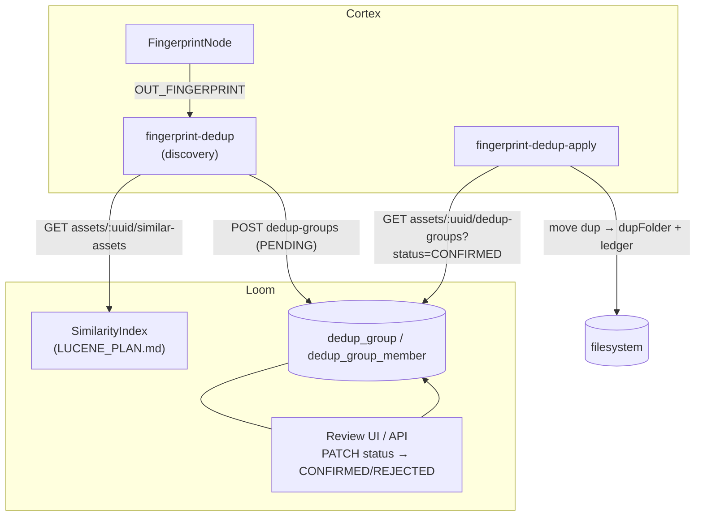

# Fingerprint Deduplication Nodes — Technical Specification

> **Audience: AI coding agents.** This document specifies two Cortex nodes that bring the
> `xdb-clean` perceptual-fingerprint deduplication workflow into MetaLoom, with a
> **human-in-the-loop** review step instead of an interactive terminal:
>
> 1. **Discovery** (`fingerprint-dedup`) — finds near-duplicate videos via fingerprint similarity
>    and **reports candidate groups** to Loom for review (no file changes).
> 2. **Apply** (`fingerprint-dedup-apply`) — reads the **confirmed** groups and moves/marks the
>    duplicate files.
>
> **Status: BUILT** (except demo data, website docs and the per-node E2E). Done and tested:
> the Flyway migration (`dedup_group` / `dedup_group_member` / `dedup_status`, V2.61) + permissions
> (V2.62), the `DedupGroupDao` (api + jOOQ, cascade tests green), the REST endpoints
> (`/api/v1/dedup-groups` ×5 and `GET /api/v1/assets/:uuid/dedup-groups`) with
> endpoint + permission tests, the DTOs + `DedupGroupMethods` client, and **both Cortex nodes** —
> `FingerprintDedupNode` (discovery, fills the old stub) and `FingerprintDedupApplyNode` — with
> options, descriptors, Dagger kind bindings and unit tests.
> The prerequisite similarity index ([../search/LUCENE_PLAN.md](../search/LUCENE_PLAN.md)) is built too.
> Test counts: `DedupGroupDaoTest` 6, `DedupGroupEndpointTest` 11, cortex dedup module 11. See §13.
>
> **Reference behaviour**: `xdb-clean/FPDEDUP_PROCESS.md` documents the original algorithm and its
> safeguards; this spec maps those onto Loom/Cortex. General node conventions: [NODES.md](NODES.md).

---

## 1. Background & the shape of the change

`xdb-clean`'s `fpdedup` command: builds a Lucene index of fingerprints from a central DB, streams a
local filesystem scan, queries the index for similar media, applies safeguards, presents best-vs-dups
to a human in the terminal, records `dup → keep` decisions in a JSONL ledger, and a *separate* action
later moves the confirmed dups to an `fpdups` folder.

MetaLoom already has the pieces to reproduce this, distributed across Loom and Cortex:

| xdb-clean concept | MetaLoom equivalent |
|---|---|
| Lucene fingerprint index | `SimilarityIndex` in Loom ([../search/LUCENE_PLAN.md](../search/LUCENE_PLAN.md)) |
| `MediaFileEntry` (size, zeroChunkCount, path) | `AssetResponse` + consistency fields (`is_complete`, `zero_chunk_count` from `V2.46`) |
| Interactive confirm/deny in the terminal | **New `dedup_group` review records** + confirm/deny via REST/UI |
| JSONL `dup → keep` ledger | `dedup_group` (status) + `dedup_group_member` (role KEEP/DUP) |
| `FpDedupIndexAction` (moves dups to `fpdups`) | **Apply node** reusing `HashDedupNode.moveMedia` |

**Two nodes, two lifecycles.** Discovery writes review items; apply consumes human decisions. Keeping
them separate means each is independently schedulable and the risky file-moving step only ever runs on
human-confirmed data.

### 1.1 What already exists (reuse, don't reinvent)

| Thing | Location | Reuse |
|---|---|---|
| `FingerprintDedupNode` **stub** | `cortex/nodes/dedup/core/.../FingerprintDedupNode.java` | becomes the **discovery** node |
| `HashDedupNode` | `cortex/nodes/dedup/core/.../HashDedupNode.java` | `moveMedia(...)` + safeguards template for **apply** |
| `DedupNodeOptions` (`dupFolder`) | `cortex/nodes/dedup/core/.../DedupNodeOptions.java` | apply node options (key `fingerprint-dedup-apply`) |
| `DedupNodeModule` | `cortex/nodes/dedup/core/.../DedupNodeModule.java` | add the two kind bindings |
| `DedupDescriptorProvider` | `loom-shared/node-model/.../spec/DedupDescriptorProvider.java` | descriptors already list `fingerprint-dedup` |
| `WhisperNode` two-step persistence | `cortex/nodes/whisper/core/.../WhisperNode.java` | write-back pattern (typed payload + `recordNodeResult`) |
| `AbstractMediaNode.recordNodeResult / resultRef` | `cortex/common/.../node/AbstractMediaNode.java` | ledger boilerplate |
| `FileUtils.autoRotate / moveFile` | `cortex` common utils (used by `HashDedupNode`) | file move |
| Consistency fields on the asset | `loom/db/flyway/.../V2.46__asset_identity.sql` | `is_complete`, `zero_chunk_count` for safeguards |

---

## 2. Loom schema — the dedup review model

🔴 **There is no asset-to-asset relation table today.** The closest existing thing (`task` + `asset_task`)
cannot express keep-vs-dup roles or per-member similarity scores. A purpose-built, queryable model is
added instead.

Flyway migration **`V2.61__add_dedup_group.sql`** (as built; the permissions follow in
**`V2.62__add_dedup_permission.sql`**), `loom/db/flyway/src/main/resources/db/migration/`:

```sql
CREATE TYPE "dedup_status" AS ENUM ('PENDING', 'CONFIRMED', 'REJECTED');

CREATE TABLE "dedup_group" (
    "uuid"            uuid PRIMARY KEY,
    "algorithm"       varchar NOT NULL,                 -- e.g. metaloom-multisector-v1
    "status"          "dedup_status" NOT NULL DEFAULT 'PENDING',
    "keep_asset_uuid" uuid REFERENCES "asset" ("uuid") ON DELETE SET NULL,
    "score"           real,                             -- representative (min member) similarity
    "meta"            jsonb,
    "created"         timestamp NOT NULL DEFAULT now(),
    "creator_uuid"    uuid REFERENCES "user" ("uuid"),  -- NULL = machine-created (discovery node)
    "edited"          timestamp,
    "editor_uuid"     uuid REFERENCES "user" ("uuid")
);

CREATE TABLE "dedup_group_member" (
    "uuid"             uuid PRIMARY KEY,
    "group_uuid"       uuid NOT NULL REFERENCES "dedup_group" ("uuid") ON DELETE CASCADE,
    "asset_uuid"       uuid NOT NULL REFERENCES "asset" ("uuid") ON DELETE CASCADE,
    "role"             varchar NOT NULL,                -- 'KEEP' | 'DUP'
    "score"            real,                            -- similarity of this member to the keep
    "size"            bigint,                           -- snapshot for safeguards & UI
    "zero_chunk_count" bigint,                          -- snapshot (completeness)
    UNIQUE ("group_uuid", "asset_uuid")
);

CREATE INDEX "idx_dedup_group_status"        ON "dedup_group" ("status");
CREATE INDEX "idx_dedup_group_member_asset"  ON "dedup_group_member" ("asset_uuid");
CREATE INDEX "idx_dedup_group_member_group"  ON "dedup_group_member" ("group_uuid");
```

**Modelling notes**
- One `dedup_group` == one candidate duplicate set (one KEEP + one-or-more DUP members). This mirrors
  xdb-clean's best-vs-dups result, and generalises the pair case.
- `keep_asset_uuid` is denormalised for convenience; the authoritative KEEP is the member with
  `role='KEEP'`. Keep them consistent in the DAO.
- `ON DELETE SET NULL` on `keep_asset_uuid` but `ON DELETE CASCADE` on the member — deleting the kept
  asset should not silently delete the whole review record, but a member row is meaningless without its
  asset.
- Snapshots (`size`, `zero_chunk_count`) are recorded at discovery time so the review UI and the apply
  node's safeguards do not have to re-read every asset; the apply node still re-verifies against the
  live file before moving anything.

**DAO** — `DedupGroupDao` in `loom/db/api` (`io.metaloom.loom.db.model.dedup`), jOOQ impl in
`loom/db/jooq`. As built: `createGroup`, `storeGroup`, `addMember`, `loadGroup`, `loadMembers`,
`listByStatus`, `listByAsset`, `findPendingByKeep` (the idempotency lookup), `updateStatus`,
`deleteGroup`.
⚠️ **No in-memory impl.** `loom/db/memory` does not mirror every DAO (`AssetNodeResultDao` has none
either); the jOOQ impl is exercised against the real pooled database instead.
🔴 **Delete-cascade tests** (per [../../guidelines/CODING.md](../../guidelines/CODING.md)): deleting a
group removes exactly its members; deleting an asset removes its memberships and nulls `keep_asset_uuid`,
and removes nothing else.

🔴 After adding the migration: `./setup-pool.sh`, then regenerate jOOQ (`loom/db/jooq/generate.sh` —
see the project memory note on codegen) so `JooqDedupGroup*` types exist.

### 2.1 REST + client

Per [../../guidelines/CODING.md](../../guidelines/CODING.md) (plural paths, endpoint + permission tests):

| Method & path | Purpose | Permission |
|---|---|---|
| `GET /api/v1/dedup-groups?status=PENDING` | List candidate groups (review queue) | `READ_DEDUP` |
| `GET /api/v1/dedup-groups/:uuid` | One group + members | `READ_DEDUP` |
| `POST /api/v1/dedup-groups` | Create (used by the discovery node; upsert-on-member-set) | `CREATE_DEDUP` |
| `PATCH /api/v1/dedup-groups/:uuid` | Confirm/deny → set `status` CONFIRMED/REJECTED, set KEEP | `UPDATE_DEDUP` |
| `DELETE /api/v1/dedup-groups/:uuid` | Remove a group | `DELETE_DEDUP` |
| `GET /api/v1/assets/:uuid/dedup-groups` | Groups involving one asset (apply node uses this) | `READ_DEDUP` |

New permissions `READ_DEDUP` / `CREATE_DEDUP` / `UPDATE_DEDUP` / `DELETE_DEDUP` (see
[../permissions/PERMISSIONS.md](../permissions/PERMISSIONS.md); grant test perms via group+role, not
direct user grants — a known pitfall). Client: `DedupGroupMethods` in `loom-client/common` aggregated
into `ClientMethods`; impl in `loom-client/rest`; DTOs in `loom-shared/rest-model`
(`DedupGroupCreateRequest`, `DedupGroupResponse`, `DedupGroupListResponse`, `DedupGroupUpdateRequest`).

---

## 3. Node A — Discovery (`fingerprint-dedup`)

Repurpose the stub `FingerprintDedupNode extends AbstractMediaNode<FingerprintDedupDiscoverOptions>`.

- `name()` = `"fingerprint-dedup"` (descriptor already exists in `DedupDescriptorProvider`).
- **Ports**: input `IN_FINGERPRINT = InputPort.one("fingerprint", ContentTypeRegistry.HASH_FINGERPRINT, String.class)`
  (matches the descriptor's declared port), wired from `FingerprintNode.OUT_FINGERPRINT`. Optional output
  `OUT_DEDUP_GROUP = OutputPort.one("dedup_group", struct/json, String.class)` carrying the group uuid for
  any downstream consumer. (Ports must equal the descriptor ids — [NODES.md](NODES.md) §1.)
- `isProcessable(ctx)` = `ctx.media().isVideo()` and a fingerprint is available.
- `compute(ctx, asset)` — guarded by `asset != null && client() != null` (no-op offline):
  1. Resolve the query fingerprint (from `IN_FINGERPRINT`, else `asset` fingerprint comp).
  2. `client().listSimilarAssets(asset.getUuid(), algorithm, topK, threshold)` — the
     [../search/LUCENE_PLAN.md](../search/LUCENE_PLAN.md) endpoint.
  3. Build the candidate set from the hits (load each `AssetResponse`), then apply the safeguards that
     map cleanly from `xdb-clean/FPDEDUP_PROCESS.md` §5 (see §5 below).
  4. If a valid group survives (≥1 DUP): `client().createDedupGroup(...)` — upsert a `dedup_group`
     (`status=PENDING`, algorithm, `score`) with members (one KEEP + N DUP, each with role, score, size,
     zero-chunk snapshot). Idempotency: upsert keyed on the KEEP asset + algorithm (re-running discovery
     over the same content updates the same PENDING group rather than duplicating it; never touch a
     CONFIRMED/REJECTED group).
  5. `recordNodeResult(asset, ctx, SUCCESS, reason, algorithm, resultRef("dedup_group", groupUuid))`.
  6. **No file is moved or altered.**
- **Event emission** (the "emit events or gather a list" requirement): the `dedup_group` rows *are* the
  gathered list. Optionally also publish a `dedup.candidate` event onto the pipeline-events WebSocket
  (via the existing `PipelineEventBroadcaster` path — see [../../loom/WEBSOCKET.md](../../loom/WEBSOCKET.md),
  [../../loom/EVENTBUS.md](../../loom/EVENTBUS.md)) so a review UI updates live. Secondary; the durable
  record is the table.
- **Dagger**: add `@Binds @IntoMap @StringKey("fingerprint-dedup")` in `DedupNodeModule` (the stub
  deliberately omits this today). Add `CortexNodeOptionDeserializerInfo(FingerprintDedupDiscoverOptions.class, "fingerprint-dedup")`
  and a `@Provides` options method.

`FingerprintDedupDiscoverOptions extends AbstractNodeOptions` (key `fingerprint-dedup`):
`algorithm` (default `metaloom-multisector-v1`), `scoreThreshold` (default 0.10), `topK` (default 10),
`allowPartial` (default false), `abortOnLargerDup` (default true). `validate()` calls `validateCommon()`.

---

## 4. Node B — Apply (`fingerprint-dedup-apply`)

New `FingerprintDedupApplyNode extends AbstractMediaNode<DedupNodeOptions>` (reuse `DedupNodeOptions`;
`dupFolder`), `name()` = `"fingerprint-dedup-apply"`.

- `isProcessable(ctx)` = has SHA-512 (any media that could be a member).
- `compute(ctx, asset)` — guarded, no-op offline:
  1. `client().listAssetDedupGroups(asset.getUuid())`, filter to `status=CONFIRMED`. (**No delta sync** —
     deferred; see §7. This is a simple per-asset fetch each run.)
  2. If the current asset is a member with `role='DUP'` in a confirmed group, and the group's **KEEP**
     asset:
     - exists on disk, re-hashes to its recorded SHA-512 (the existing `databaseConsistencyFilter`
       equivalent), is **complete** (`zero_chunk_count == 0`), is **≥** the dup's size, and is **not**
       itself inside a dups/trash folder — mirroring `FpDedupIndexAction`'s safeguards
       (`xdb-clean/FPDEDUP_PROCESS.md` §8) —
     - then move/mark the current (dup) file into `options().getDupFolder()` via **reused**
       `HashDedupNode.moveMedia(...)` (`FileUtils.autoRotate` + `moveFile`, guarded by `isDryrun()`).
  3. `recordNodeResult(asset, ctx, SUCCESS, "fpdup of " + keepPath, null, null)` (ledger-only, like
     `HashDedupNode`).
  4. **Idempotent**: if the dup file is already in the dups folder / already moved, skip cleanly.
- **Descriptor**: add a `fingerprint-dedup-apply` descriptor to `DedupDescriptorProvider`
  (`category=OUTPUT`, `defaultConcurrency(1)`, `defaultMode(SEQUENTIAL)`, input port `one("hash", HASH_ANY)`
  or `fingerprint`, params `dupFolder` + `enabled`).
- **Dagger**: `@Binds @IntoSet` + `@Binds @IntoMap @StringKey("fingerprint-dedup-apply")` +
  option deserializer info + `@Provides` in `DedupNodeModule`.

---

## 5. Safeguard mapping (from `xdb-clean/FPDEDUP_PROCESS.md`)

| xdb-clean safeguard | Where in MetaLoom | Carried over? |
|---|---|---|
| Exclude the processed file from its own dup set | discovery (filter self by uuid/hash) | ✅ |
| Skip already-dedupped media | discovery (skip assets already in a CONFIRMED/REJECTED group) | ✅ |
| KEEP = largest **complete** asset | discovery (sort by size desc among `zero_chunk_count==0`) | ✅ |
| Abort if any DUP is larger than KEEP | discovery (`abortOnLargerDup`) | ✅ |
| KEEP must be complete (never discard the more-complete file) | discovery + apply re-check | ✅ |
| KEEP exists on disk & re-hashes correctly before any move | apply (live re-verify) | ✅ |
| KEEP not in a `trash`/`crap`/`fpdups` folder | apply (path check) | ✅ |
| Consistency filter (DB path exists & hash matches) | apply (`databaseConsistencyFilter` equivalent) | ✅ |
| **Thumbnail dominant-colour similarity** check | — | 🔴 **Not carried over** (open item §8). xdb-clean compares generated thumbnails; MetaLoom would need asset thumbnails available to the node. Documented as a deliberate gap. |
| Partial-file protection logic | discovery (`allowPartial` off by default; partial handling simplified) | ⚠️ Simplified — MetaLoom's completeness is a single `is_complete`/`zero_chunk_count`, not xdb's multi-partial ranking |

---

## 6. Architecture



---

## 7. Deferred scope (documented, not built now)

- **Delta/incremental sync** of the confirmed list on the Cortex worker (the `S3DifferentialScanner`
  Avro-index pattern) and a Loom "changed-since" endpoint. For now the apply node does an idempotent
  per-asset fetch each run. When corpus size makes that expensive, add a persisted processed-group index
  on the worker + a `GET /api/v1/dedup-groups?confirmedAfter=` endpoint.
- **Review UI** (list PENDING groups with thumbnails/sizes, confirm/deny, choose KEEP). Noted here and in
  the relevant `TASK_UI_*` file ([../../loom/ui/TASK_UI_AI_ML.md](../../loom/ui/TASK_UI_AI_ML.md) or a new
  section); not designed in this spec.
- **Thumbnail dominant-colour safeguard** (see §5).

---

## 8. Related cleanup (flag)

⚠️ **Kind-id mismatch on the existing hash dedup node.** `DedupDescriptorProvider` declares kind
`"hash-dedup"`, but `HashDedupNode.name()` and its Dagger `@StringKey` are `"sha512-dedup"`. The
descriptor (palette/validation via `PortGraphAnalyzer`) and the executable kind map disagree, so a
`hash-dedup` node placed in the editor has no runnable kind. Fix in this change (align on one id) or file
a tracked follow-up — do not let the two new fingerprint kinds inherit the same inconsistency.

---

## 9. Key Classes Reference

> Nothing below exists yet except the reused/stub classes noted.

| Class | Package / module | Purpose |
|---|---|---|
| `FingerprintDedupNode` | `io.metaloom.cortex.node.dedup` (`cortex/nodes/dedup`) | **stub → discovery** node |
| `FingerprintDedupApplyNode` | `io.metaloom.cortex.node.dedup` | new apply node |
| `FingerprintDedupDiscoverOptions` | `io.metaloom.cortex.node.dedup` | discovery options (key `fingerprint-dedup`) |
| `DedupNodeOptions` | `io.metaloom.cortex.node.dedup` | reused apply options (`dupFolder`) |
| `DedupNodeModule` | `io.metaloom.cortex.node.dedup` | add the two kind bindings |
| `DedupDescriptorProvider` | `io.metaloom.loom.nodes.spec` (`loom-shared/node-model`) | add `fingerprint-dedup-apply` descriptor |
| `HashDedupNode` | `io.metaloom.cortex.node.dedup` | `moveMedia` + safeguard template (reused) |
| `DedupGroupDao` | `io.metaloom.loom.db.model.dedup` (`loom/db/api`, `-jooq`, `-memory`) | review-record persistence |
| `DedupGroupMethods` | `io.metaloom.loom.client.common.method` (`loom-client/common`) | client |
| `DedupGroup*Request/Response` | `loom-shared/rest-model` | REST DTOs |
| `SimilarityMethods.listSimilarAssets` | `loom-client/common` | similarity query ([../search/LUCENE_PLAN.md](../search/LUCENE_PLAN.md)) |
| `AbstractMediaNode` (`recordNodeResult`, `resultRef`) | `cortex/common` | ledger write-back |

---

## 10. Test Setup

- **Node unit tests** (mocked `LoomClient`), per [NODES.md](NODES.md) conventions:
  - discovery: given mocked `listSimilarAssets` hits, asserts the correct KEEP/DUP split, that a group is
    created with the right members/roles, that a larger-than-keep dup aborts the group, and that an
    incomplete keep aborts.
  - apply: given a CONFIRMED group, asserts the dup file is moved (and dryrun does not move); asserts the
    keep-in-trash / keep-smaller / keep-missing safeguards each block the move; asserts idempotent skip.
- **Persistence test**: discovery against a mocked client records both the `dedup_group` (+members) and
  the `asset_node_result` ledger row.
- **Options `validate()` test** for `FingerprintDedupDiscoverOptions`.
- **DAO tests** incl. 🔴 **delete-cascade** (§2). Contract tests in `loom/db/api-test`, impl tests in
  `loom/db/jooq/src/test`.
- **Endpoint + permission tests** for every `dedup-groups` route (§2.1) — grant perms via group+role.
- **Per-node E2E** in `integration-test` extending `AbstractNodeIntegrationTest` (rebuild the shaded
  `cortex/cli` jar + container image first — a known gotcha): two near-identical demo videos →
  fingerprinted → discovery produces a PENDING group → PATCH CONFIRMED → apply moves the DUP into
  `dupFolder` and writes a ledger row → re-run apply is a no-op.
- **Demo data**: `DemoDatabaseInitializer` seeds two near-identical demo videos and one PENDING
  `dedup_group` over them (shared with [../search/LUCENE_PLAN.md](../search/LUCENE_PLAN.md) §8).
- 🔴 `./setup-pool.sh` after the migration; verify `loom/db/jooq/generate.sh` still succeeds.
- **Customer-facing docs**: `website/content/english/docs` — a "find and review duplicate videos" page
  (customer tone, no class names) per [../../guidelines/CODING.md](../../guidelines/CODING.md).

---

## 11. Conventions and Gotchas

| Area | Gotcha |
|---|---|
| **Two lifecycles** | 🔴 Discovery writes review items; apply acts on human decisions. Never let discovery move files, and never let apply act on `PENDING`/`REJECTED` groups. |
| **Live re-verification** | 🔴 The apply node must re-check the KEEP against the live file (exists, re-hashes, complete, ≥ dup size, not in trash/dups) — the discovery-time snapshots are hints, not authority. |
| **Idempotency** | ⚠️ Both nodes must be safe to re-run. Discovery upserts the same PENDING group; apply skips already-moved dups. |
| **Stub → kind binding** | ⚠️ The discovery node only becomes runnable when `@Binds @IntoMap @StringKey("fingerprint-dedup")` is added — the stub omits it today, so Loom currently never dispatches it (kind map = source of truth, [NODES.md](NODES.md) §8). |
| **Kind-id mismatch** | ⚠️ Existing `hash-dedup` (descriptor) vs `sha512-dedup` (node) — §8. Don't replicate it. |
| **No relation table before** | 🔴 `dedup_group`/`dedup_group_member` is the *first* asset-to-asset relation in the schema; follow the `V2.46` "intrinsic vs component" placement rule and cascade rules. |
| **Thumbnail safeguard dropped** | ⚠️ The xdb-clean dominant-colour thumbnail check is not carried over (§5) — near-duplicates are gated by fingerprint score + size/completeness only. |
| **Offline mode** | ⚠️ Both nodes are no-ops when `client()==null`/offline — the whole workflow requires Loom. |

---

## 12. Where do I find …?

| Need | Look here |
|---|---|
| The reference algorithm & safeguards | `xdb-clean/FPDEDUP_PROCESS.md` |
| The similarity query this depends on | [../search/LUCENE_PLAN.md](../search/LUCENE_PLAN.md) |
| The stub to fill (discovery) | `cortex/nodes/dedup/core/.../FingerprintDedupNode.java` |
| The move/safeguard template (apply) | `cortex/nodes/dedup/core/.../HashDedupNode.java` |
| Node write-back pattern | [NODES.md](NODES.md) §2; `cortex/nodes/whisper/core/.../WhisperNode.java` |
| Descriptors / kind registration | `loom-shared/node-model/.../DedupDescriptorProvider.java`; `DedupNodeModule` |
| Asset completeness fields | `loom/db/flyway/.../V2.46__asset_identity.sql` |
| Permissions model | [../permissions/PERMISSIONS.md](../permissions/PERMISSIONS.md) |
| REST/DAO conventions | [../../guidelines/CODING.md](../../guidelines/CODING.md); [../../loom/RESTAPI.md](../../loom/RESTAPI.md); [../../loom/PERSISTENCE.md](../../loom/PERSISTENCE.md) |
| Migration + codegen flow | project memory notes (setup-pool, jOOQ regen); [../../loom/PERSISTENCE.md](../../loom/PERSISTENCE.md) |

---

## 13. Progress Assessment

Nothing is implemented.

**Design decisions closed**
- [x] Two nodes: discovery (`fingerprint-dedup`, fills the stub) + apply (`fingerprint-dedup-apply`) (§3, §4)
- [x] Candidate groups stored in new typed `dedup_group` / `dedup_group_member` tables (§2)
- [x] Similarity via the Loom `SimilarityIndex` ([../search/LUCENE_PLAN.md](../search/LUCENE_PLAN.md))
- [x] Delta sync deferred; apply does idempotent per-asset fetch (§7)

**Prerequisite**
- [x] Fingerprint similarity index ([../search/LUCENE_PLAN.md](../search/LUCENE_PLAN.md)) — built end to end (SPI, Lucene impl, Dagger binding, comp hooks, REST + client, 15 tests)

**Loom backend**
- [x] Migration: `dedup_status`, `dedup_group`, `dedup_group_member` (V2.61) (§2)
- [x] `DedupGroupDao` (api + jooq) + delete-cascade tests (6 tests green). Memory impl skipped — follows the `AssetNodeResultDao` precedent (no memory impl) (§2, §10)
- [x] `/api/v1/dedup-groups` (POST/GET/GET-one/PATCH/DELETE) + `/api/v1/assets/:uuid/dedup-groups` endpoints; `DedupGroupEndpointTest` covers the happy path, validation, RBAC (incl. READ_DEDUP not granting UPDATE) and the asset-delete cascade through the API (§2.1)
- [x] `READ/CREATE/UPDATE/DELETE_DEDUP` permissions (V2.62 + `Permission` enum) (§2.1)
- [x] `DedupGroupMethods` client + DTOs (`DedupGroup{Create,Update}Request`, `DedupGroupResponse`, `DedupGroupListResponse`, `DedupGroupMemberModel`) (§2.1)
- [x] `./setup-pool.sh` + jOOQ regen; build unaffected, `JooqDedupGroup*`/`JooqDedupStatus`/`JooqLoomPermission` generated

**Cortex nodes**
- [x] Discovery: filled `FingerprintDedupNode`, added `FingerprintDedupDiscoverOptions`, kind binding (§3)
- [x] Apply: `FingerprintDedupApplyNode`, descriptor, kind binding, replicated `moveMedia` + live re-verify safeguards (§4)
- [x] Node unit + options tests (discovery KEEP/DUP split + larger-dup abort; both options validators) — 11 tests green (§10)
- [ ] Per-node E2E in `integration-test` (§10)

**Cross-cutting**
- [ ] Update [NODES.md](NODES.md): FingerprintDedupNode no longer a stub; add `fingerprint-dedup-apply`; add dedup persistence targets to §2 table
- [x] Update [../../CONTEXT.md](../../CONTEXT.md) §2 index + "which file" table with this file and [../search/LUCENE_PLAN.md](../search/LUCENE_PLAN.md)
- [x] Fix the `hash-dedup`/`sha512-dedup` id mismatch (§8) — bound both kind ids to `HashDedupNode` (alias), so a `hash-dedup` node is runnable without breaking existing `sha512-dedup` references
- [ ] Demo data + customer-facing docs (§10)

**Known gaps / open items**
- [ ] Thumbnail dominant-colour safeguard not carried over (§5)
- [ ] Partial-file handling simplified vs xdb-clean's multi-partial ranking (§5)
- [ ] Grouping/dedup-key strategy for re-running discovery (upsert key on KEEP+algorithm) needs validation at scale (§3)

---

_Git HEAD: `3ba0a6ffb92e31cf68fb6ed20744e0066b30a209` (branch `master`)_
_Last updated: 2026-07-30_
