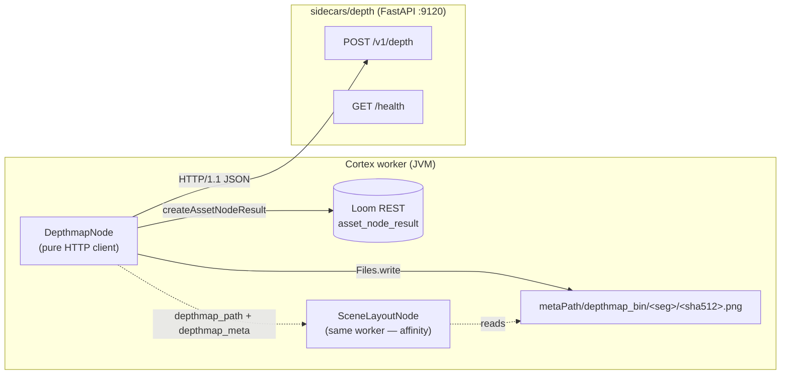
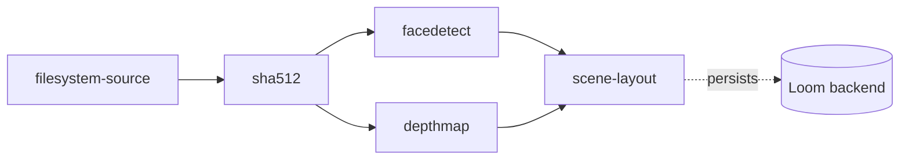

# Depth Map Node — Design & Implementation Plan

> **Status: implemented.** The node, the sidecar and the wiring are built; 29 unit tests and one
> integration test pass. Not yet run against a real model — the live GPU smoke test in §9 is the
> one open item.
>
> **Three things landed differently from the design below**, each recorded in place:
>
> 1. **`timeoutMs` is an inherited option**, not a new one — `AbstractNodeOptions` already declares
>    it as a `long`. The node sets the 120 s default in its constructor, as `ImageGenNodeOptions`
>    does.
> 2. **Image handling is a local `DepthImages` helper, not `VlmImages`.** Reusing the VLM node's
>    copy would have made `cortex-depthmap-node` depend on `cortex-vlm-node` for two static methods.
>    `DepthImages` also encodes PNG rather than JPEG: JPEG blocking artifacts become spurious depth
>    discontinuities exactly along object edges, which is where the consumer samples.
> 3. **`depthmap_meta` carries the source image's dimensions too** (`imageWidth`/`imageHeight`),
>    not just the map's. Without both pairs a consumer cannot project image-space boxes onto the
>    map, which made the §11 gotcha unactionable as originally written.
>
> **Node kind**: `depthmap` · **Module**: `cortex/nodes/depthmap` ·
> **Package**: `io.metaloom.cortex.node.depthmap` · **Sidecar**: `sidecars/depth` (port 9120)
>
> **Scope of this spec**: the Cortex-level `depthmap` node and its HTTP client to the depth-model
> sidecar. The node system as a whole is specified in [NODES.md](NODES.md); the persistence model
> (typed component + ledger) is §2 there and is not duplicated here.
>
> **Companion spec**: [NODE_SCENE_LAYOUT_PLAN.md](NODE_SCENE_LAYOUT_PLAN.md) — the `scene-layout`
> node is the primary consumer of this node's output. The two were designed together and the
> output convention in §4 exists for its benefit.
>
> The source of truth is the code under `cortex/`.

---

## 1. Motivation

Cortex sees images as flat. Every spatial signal it produces today is 2D: `FacedetectNode` writes
`bbox_x/y/width/height` into the `detection` table, `QualityNode` measures resolution and blur,
`CaptioningNode` writes prose. Nothing recovers the **third dimension**, so nothing downstream can
tell whether two detected things are next to each other or metres apart, or which one is nearer the
camera.

Monocular depth estimation closes that gap from a single still image. A `depthmap` node gives us:

| Consumer | What depth buys it |
|---|---|
| [`scene-layout`](NODE_SCENE_LAYOUT_PLAN.md) | The whole node. Foreground/background banding and `IN_FRONT_OF` / `BEHIND` / `OCCLUDES` relations between detections |
| A future `objectdetect` | Distance-aware filtering — "only the subjects in the foreground" |
| Captioning / LLM | Grounded spatial phrasing instead of guessed prepositions |
| Search (see [../search/SEARCH.md](../search/SEARCH.md)) | "photos with a person in the foreground" becomes a queryable fact |
| Editorial / DAM workflows | Depth-aware crop, background separation, subject isolation |

### Non-goals

- **Not a segmentation node.** It produces a dense depth map, not object masks.
- **Not metric by default.** The default model returns *relative* depth. Absolute metres are an
  opt-in mode (§3) and are still only as good as a single-view estimate.
- **Not video, in v1.** Images only. Per-keyframe depth is a documented follow-up (§10).
- **Not a stereo/multi-view reconstruction.** Single-image inference only.

---

## 2. What already exists (verified against code at `29cadb66`)

| Concern | Reference | Notes |
|---|---|---|
| HTTP-client-to-sidecar node | `cortex/nodes/sentiment/core/…/SentimentNode.java`, `SentimentClient.java`, `SentimentNodeModule.java` | The template. Injectable client provided by the module; node stays a thin HTTP client |
| Binary output → local `*_bin` + ledger-only | `cortex/nodes/image-generation/core/…/ImageGenNode.java`, `cortex/nodes/tts/core/…/TtsNode.java` | Closest analog: writes bytes to `metaPath/<node>_bin/<seg>/<hash>.<ext>`, records `asset_node_result` only |
| Hash-segmented path helper | `ThumbnailNode.resolveThumbnailPath`, `io.metaloom.utils.hash.HashUtils.segmentPath` (hash-utils, line 194) | `metaPath/<dir>` → `segmentPath(base, sha512)` (a single 4-char level) → `<hash>.<ext>` |
| Base node + ledger helpers | `cortex/common/…/node/AbstractMediaNode.java` | `process()` template at L51; `compute(...)` at L102; `recordNodeResult(asset, ctx, state, reason, producerVersion, resultRef)` at L120; `resultRef(table, uuids…)` at L151. Both helpers no-op when `asset == null \|\| client() == null` |
| In-heap skip cache | `cortex/common/…/cache/LocalResultCache.java` | Bounded access-order LRU keyed by `media.absolutePath()`; non-durable by design |
| Plain-ImageIO image handling | `cortex/nodes/vlm/core/…/VlmImages.java` | `read`, `downscale(img, maxDim)`, `toBase64Jpeg`, `toJpegDataUri` — deliberately free of the OpenCV native runtime |
| Executable-kind registration | any `*NodeModule` | `@Binds @IntoMap @StringKey("<kind>")` → `NodeRegistrar` → worker `nodeWhitelist`. Central touch-point: `cortex/cli/…/dagger/NodeCollectionModule.java` `includes` |
| UI/validation descriptors | `loom-shared/node-model/…/spec/*DescriptorProvider.java` + one `META-INF/services` file | **Not** in the node module — the 17 `cortex/nodes/*-api` modules were merged here on 2026-07-18 |
| Sidecar pattern | `sidecars/sentiment/` (`setup.sh`, `run.sh`, `server.py`, `requirements.txt`, `README.md`) | The clean template. `sidecars/ideogram-sidecar/` is an older PoC shape — do not copy it |

### Four constraints that shape the design

1. **Loom has no raw-byte ingest for derivatives.** There is no endpoint that accepts a generated
   file. So the depth PNG stays in a local `depthmap_bin` cache and only the ledger marker reaches
   Loom — identical to `thumbnail` / `tts` / `imagegen`. **This is a deliberate, accepted decision**,
   and it has a consequence the next constraint spells out.

2. **Ledger-only storage forces worker affinity.** Because the map exists only on the worker's
   filesystem, any node that consumes it must run on **the same worker**. The mechanism is the node
   JSON's `"affinity": "<group>"` field (`PipelineGraphNode.DEFAULT_AFFINITY = "default"`, L20):
   `PipelineSegmenter` turns a connected same-affinity set into one dispatch unit, and
   `AffinityValidator` warns when no single worker is permitted to run all its kinds. **A pipeline
   pairing `depthmap` with `scene-layout` must put both in one affinity group.** See §11.

3. **`AbstractMediaNode` is asset-centric.** `isProcessable(ctx)` → `compute(ctx, asset)`, with the
   asset fetched by SHA-512. The node keeps that standard lifecycle, which also gives it the
   SHA-512-keyed output path and the ledger row for free.

4. **Node output values are strings after a cache round-trip.** `XAttrNodeCache.serializeOutputMap`
   writes `key=value.toString()` per line and deserializes every value back as a `String`. Any
   structured output must be an explicitly JSON-encoded `NodeOutputKey<String>` and re-parsed
   downstream. This is why `depthmap_meta` (§5) is a JSON string and not a typed object.

---

## 3. Model options — commercially usable monocular depth

> **Status: researched, licences to be re-verified at implementation time.** Model licences on the
> Hugging Face Hub change. Confirm each licence against the model card before shipping, and record
> the outcome in `website/content/english/docs/legal/model-licenses/`.

Monocular depth models fall into two families, and the split matters more than accuracy does:

- **Relative (affine-invariant) depth** — the output is defined up to an unknown scale and shift.
  Usually *disparity-like*: **larger value = closer to the camera**. Good enough for ordering
  objects, which is all `scene-layout` needs.
- **Metric depth** — output is in metres. Needed only if someone wants absolute distances; single-view
  metric depth is meaningfully less reliable, and the models are heavier.

### Recommended

| Model | Licence | Family | Why |
|---|---|---|---|
| **`depth-anything/Depth-Anything-V2-Small-hf`** | **Apache-2.0** | relative | **The default.** ~25M params (ViT-S), fast on CPU, strong quality for its size, permissive licence, plain `transformers` support |
| `Intel/dpt-large`, `Intel/dpt-hybrid-midas` | permissive (MIT / Apache-2.0 — verify) | relative | MiDaS 3.0. Older but well understood and permissive at full size; the quality alternative when a GPU is available |
| `Intel/zoedepth-nyu-kitti` | MIT | **metric** | The opt-in `METRIC` mode. Only reach for it when metres are genuinely required |

### Evaluated and rejected — and why

| Model | Reason |
|---|---|
| `Depth-Anything-V2-Base-hf` / `-Large-hf` | **CC-BY-NC-4.0** — non-commercial. The Small variant is the only Apache-2.0 member of the family, which is exactly why it is the default |
| Apple **Depth Pro** | `apple-ascl` — research-only terms. Excellent metric quality, unusable licence for this product |
| **Marigold** (`prs-eth/marigold-depth-*`) | Apache-2.0 and high quality, but diffusion-based: many denoising steps per image. Far too slow for a batch DAM pipeline |
| Running depth **in the JVM** (ONNX Runtime / DJL) | Would drag a native ML runtime into the worker. The sidecar pattern already solves this and is what `tts` / `sentiment` / `imagegen` do |

### Recommendation

Ship with `Depth-Anything-V2-Small-hf` and make the checkpoint an env var on the sidecar plus an
optional per-node override, so swapping models never touches Java. The model id travels back in
every response and is recorded as the ledger's `producerVersion` — which map produced which numbers
is not something to leave implicit.

---

## 4. Architecture

> **Status: designed.**

### Why a sidecar

Same reasoning as `sentiment` and `tts`: the model needs PyTorch, `transformers` and optionally CUDA.
Keeping that out of the JVM means the worker image stays slim, the model can be pinned to a specific
GPU, and swapping checkpoints is a config change rather than a rebuild.



### The output convention — the single most important decision

`scene-layout`'s correctness rests entirely on knowing which direction "closer" is. Raw model output
is inconsistent: Depth Anything and MiDaS emit disparity (bigger = nearer), ZoeDepth emits metres
(bigger = **farther**). Leaving that ambiguity in the pipeline would guarantee an inverted-relation
bug that nobody notices until a caption says the background is in front.

So the **sidecar always normalizes**, and there is exactly one convention on the wire:

> **NEARNESS.** A `[0, 1]` value where **1 = nearest to the camera**, 0 = farthest. Encoded as a
> 16-bit grayscale PNG where `65535` = nearest.

Metric models are converted (`nearness = 1 − (d − min) / (max − min)`) and additionally report
`metric.min_m` / `metric.max_m` so metres remain recoverable by the consumer. Doing the conversion
in Python keeps the mess in one place, out of Java, and out of every future consumer.

16 bits, not 8: an 8-bit map quantizes to 256 levels, which is coarse enough that two objects at
similar distance land in the same bucket and the relation collapses to `SAME_DEPTH`.

### Endpoint contract

| Method | Path | Body | Response |
|---|---|---|---|
| `GET` | `/health` | — | `{status, model, device, convention}` |
| `POST` | `/v1/depth` | `{image_b64, model?, max_dim?}` | `application/json` (below) |

```jsonc
{
  "model": "depth-anything/Depth-Anything-V2-Small-hf",
  "convention": "NEARNESS",          // always; the only value the node accepts
  "source": "RELATIVE",              // RELATIVE | METRIC — what the model natively produced
  "width": 1024, "height": 683,      // dimensions of the RETURNED MAP, not the source image
  "png_b64": "iVBORw0KGgo…",         // 16-bit grayscale PNG, 65535 = nearest
  "stats": { "p05": 0.11, "p50": 0.38, "p95": 0.82 },
  "metric": { "min_m": 1.2, "max_m": 14.7 }   // present only when source == METRIC
}
```

**Why JSON with an embedded base64 PNG, rather than a raw `image/png` body as `imagegen` uses?**
Because the metadata is not optional here — a bare PNG cannot say which model produced it, which
convention it follows, or what the metric range was, and the consumer needs all three. One
round trip carrying both beats a second `/meta` call that can disagree with the pixels.

---

## 5. Node data flow

> **Status: designed.**

```mermaid
sequenceDiagram
    participant P as Pipeline
    participant N as DepthmapNode
    participant S as depth sidecar<br/>(FastAPI :9120)
    participant FS as metaPath/depthmap_bin
    participant L as LoomClient

    P->>N: process(ctx[image asset])
    N->>N: isProcessable → media.isImage()
    alt LocalResultCache hit
        N->>N: re-emit depthmap_path + depthmap_meta
        N-->>P: origin LOCAL (no HTTP, no re-persist)
    else compute
        N->>N: VlmImages.read(file) → downscale(maxDim) → base64
        N->>S: POST /v1/depth {image_b64, model?, max_dim}
        S->>S: infer → normalize to NEARNESS → encode 16-bit PNG
        S-->>N: {model, convention, width, height, png_b64, stats, metric?}
        N->>FS: Files.write(metaPath/depthmap_bin/seg/sha512.png)
        N->>N: ctx.output(depthmap_flag / _path / _meta); cache.put(path, meta)
        N->>L: recordNodeResult(SUCCESS, producerVersion=model, resultRef=null)
        N-->>P: origin COMPUTED
    end
```

Pipeline placement — `depthmap` needs only pixels, so it can sit directly under the hash node, in
parallel with the detector it will later be joined with:



⚠️ `depthmap` and `scene-layout` must share an affinity group — see §11.

---

## 6. Sidecar — `sidecars/depth/`

> **Status: not built.** Follow `sidecars/sentiment/` exactly; do **not** copy
> `sidecars/ideogram-sidecar/` (older PoC shape: no `setup.sh`/`run.sh`, checked-in `venv/` and probe
> artifacts).

```
sidecars/depth/
├── README.md          # model table + licences, why a sidecar, setup, run, curl test, env-var table
├── requirements.txt   # fastapi, uvicorn, pydantic, transformers, torch, pillow, numpy, opencv-python-headless
├── setup.sh           # set -euo pipefail; cd "$(dirname "$0")"; python -m venv .venv; pip install -r …
├── run.sh             # set -euo pipefail; cd "$(dirname "$0")"; exec ./.venv/bin/uvicorn server:app --host $DEPTH_HOST --port $DEPTH_PORT
└── server.py
```

`server.py` structure, mirroring `sidecars/sentiment/server.py`:

1. Module docstring stating the endpoint, the models, their licences, and the NEARNESS convention.
2. Env-var block (§6, below).
3. Lazy, cached model loading — `_pipeline(model_id)` memoized in a dict, so the first request pays
   the download/load and later ones do not, and an unused checkpoint is never loaded.
4. `_normalize(raw, source)` — the one function that implements §4's convention. Relative models:
   min-max normalize the disparity directly (already "bigger = nearer"). Metric models: min-max
   normalize then **invert**, and report the metre range.
5. `_encode_png16(nearness)` — `(nearness * 65535).astype(np.uint16)` → `cv2.imencode(".png", …)` →
   base64.
6. `class DepthRequest(BaseModel): image_b64: str; model: Optional[str] = None; max_dim: Optional[int] = None`
7. `app = FastAPI(title="Cortex depth sidecar")`, `@app.get("/health")`, `@app.post("/v1/depth")`.

### Environment variables

| Var | Default | Meaning |
|---|---|---|
| `DEPTH_HOST` | `0.0.0.0` | Listener bind address |
| `DEPTH_PORT` | `9120` | Listener port (tts 9100, sentiment 9110, **depth 9120**, imagegen 9200) |
| `DEPTH_MODEL` | `depth-anything/Depth-Anything-V2-Small-hf` | Default checkpoint (Apache-2.0) |
| `DEPTH_MODEL_METRIC` | `Intel/zoedepth-nyu-kitti` | Checkpoint used when the request asks for metric depth |
| `DEPTH_MAX_DIM` | `1024` | Server-side cap on the longest side, applied even if the client asks for more |
| `DEVICE` | `cuda` if available else `cpu` | torch device |
| `CUDA_VISIBLE_DEVICES` | — | Pin a GPU |
| `HF_HOME` | — | Model cache location |

---

## 7. Implementation outline — `cortex/nodes/depthmap/core/`

> **Status: not implemented.**

New Maven module `cortex/nodes/depthmap/` (aggregator `pom` + `core` jar — copy
`cortex/nodes/sentiment/`, whose `core/pom.xml` carries **zero** `<dependencies>` because everything
is inherited from `cortex/nodes/pom.xml`). Java package `io.metaloom.cortex.node.depthmap`:

- **`DepthMode`** — `enum { RELATIVE, METRIC }`.

- **`DepthmapNodeOptions extends AbstractNodeOptions<DepthmapNodeOptions>`** — `KEY = "depthmap"`;
  fields per §8; `validate()` calls `validateCommon()` then per-field checks, returning
  `ValidationResult.valid()` / `.invalid(errors)` (mirror `SentimentNodeOptions`).

- **`DepthmapClient`** — plain class, JDK `java.net.http.HttpClient`. One method:
  ```java
  public JsonObject depth(BufferedImage image, String modelOverride, int maxDim)
  ```
  **Force `Version.HTTP_1_1`** — FastAPI rejects the JDK client's default HTTP/2 upgrade attempt.
  This bit every prior sidecar client; both `SentimentClient` and `ImageGenClient` carry the same
  comment. Non-`final` class and method **on purpose**, so tests subclass it as a stub.

- **`DepthmapNode extends AbstractMediaNode<DepthmapNodeOptions>`**:
  ```java
  public static final NodeOutputKey<String> OUTPUT_DEPTHMAP_FLAG = NodeOutputKey.of("depthmap_flag", String.class);
  public static final NodeOutputKey<String> OUTPUT_DEPTHMAP_PATH = NodeOutputKey.of("depthmap_path", String.class);
  public static final NodeOutputKey<String> OUTPUT_DEPTHMAP_META = NodeOutputKey.of("depthmap_meta", String.class);
  ```
  - `name()` → `"depthmap"`; `isProcessable(ctx)` → `options().isEnabled() && ctx.media().isImage()`.
  - Holds `private final CortexOptions cortexOptions` (needed for `getMetaPath()`) and
    `LocalResultCache<String> resultCache` sized `10_000`, keyed on `media.absolutePath()`.
  - **Cache value is the `depthmap_meta` JSON, which embeds `path`** — one entry restores all three
    output keys, so a hit needs no filesystem probe beyond an existence check.
  - `compute(ctx, asset)`: cache check → `metrics.recordAiCacheHit("depthmap")` + re-emit +
    `ctx.origin(LOCAL).next()`; otherwise read + downscale via `VlmImages`, call the client wrapped
    in `metrics.recordAiCall("depthmap", ok, ms)`, decode `png_b64`, `Files.createDirectories` +
    `Files.write`, emit the three keys, `resultCache.put(...)`, then
    `recordNodeResult(asset, ctx, SUCCESS, null, model, null)` and `ctx.origin(COMPUTED).next()`.
  - On exception: `ctx.output(OUTPUT_DEPTHMAP_FLAG, "FAILED")`,
    `recordNodeResult(asset, ctx, FAILED, e.getMessage(), model, null)`, `ctx.failure(...).next()`.
  - `resolveDepthmapPath(media)` — the canonical three-liner:
    ```java
    SHA512 hash = media.getSHA512();
    Path basePath = cortexOptions.getMetaPath().resolve("depthmap_bin");
    return HashUtils.segmentPath(basePath, hash).resolve(hash + ".png");
    ```

- **`DepthmapNodeModule extends AbstractNodeModule`** — the four bindings:
  `@Binds @IntoSet`, `@Binds @IntoMap @StringKey("depthmap")`, `@IntoSet @Provides optionInfo()`
  returning `new CortexNodeOptionDeserializerInfo(DepthmapNodeOptions.class, DepthmapNodeOptions.KEY)`,
  `@Provides options(CortexOptions)` via `nodeOptions(options, KEY, new DepthmapNodeOptions())`, and
  `@Provides DepthmapClient` built from the options.

### Wiring that is easy to forget

| # | File | Change |
|---|---|---|
| 1 | `cortex/nodes/pom.xml` | `<module>depthmap</module>` |
| 2 | `cortex/processor/pom.xml` | `cortex-depthmap-node` dependency (this is what puts the jar on the runtime classpath) |
| 3 | `integration-test/pom.xml` | same artifact, `${loom.cortex.version}` |
| 4 | `cortex/cli/…/dagger/NodeCollectionModule.java` | import + `DepthmapNodeModule.class` in `includes` |
| 5 | `cortex/cli/src/test/…/dagger/NodeRegistrarTest.java` | add `"depthmap"` to the expected-kinds assertion |
| 6 | `loom-shared/node-model/…/spec/DepthmapDescriptorProvider.java` | **new** — see below |
| 7 | `loom-shared/node-model/src/main/resources/META-INF/services/io.metaloom.loom.nodes.spec.NodeDescriptorProvider` | add the FQCN |
| 8 | `loom-shared/node-model/src/test/…/NodeDescriptorServiceLoaderTest.java` | 🔴 **bump both hard-coded counts** (`19` providers, `32` descriptors at `29cadb66`) and the expected-kind array |
| 9 | `loom-shared/node-model/…/spec/ContentTypes.java` | add `DATA_DEPTHMAP = "data/depthmap"` constant **and** its `all()` entry |
| 10 | `loom-ui/src/features/pipeline/PipelineEditor.tsx` | add `layers` to `ICON_MAP` (+ the MUI import) |
| 11 | `sidecars/README.md` | sidecar table row |
| 12 | `website/content/english/docs/nodes/depthmap/index.adoc` + `nodes/_index.adoc` (3 spots) | customer docs |
| 13 | [NODES.md](NODES.md) | four tables: §2 persistence, §3 node catalogue, §5 options, §12 capability matrix + IT-coverage prose |

Descriptor sketch (`DepthmapDescriptorProvider`, mirroring `SentimentDescriptorProvider`):

```java
new NodeDescriptor()
  .setKind("depthmap").setName("Depth Map")
  .setDescription("Estimate a per-pixel depth map from a single image using a monocular depth model.")
  .setIcon("layers").setCategory(ANALYSIS)
  .setInputs(List.of(new NodeInput("media", MEDIA_IMAGE, true)))
  .setOutputs(List.of(
      new NodeOutput("depthmap_flag", DATA_STRING),
      new NodeOutput("depthmap_path", DATA_PATH),
      new NodeOutput("depthmap_meta", DATA_DEPTHMAP)))
  .setParameters(List.of(commonEnabled(), commonProcessIncomplete(), commonRetryFailed(),
      /* depthHost, depthPort, model, mode, maxDim, timeoutMs */))
  .setDefaultConcurrency(1).setDefaultMode(PARALLEL).setEvents(STANDARD_EVENTS)
```

> ⚠️ `imagegen` shipped **without** a descriptor provider, so it is invisible to the UI palette and
> to pipeline validation. Do not repeat that here — items 6–9 are not optional.

`defaultConcurrency = 1`: the sidecar holds one model on one device, so parallel calls from a single
worker queue behind each other anyway and only inflate memory.

---

## 8. Configuration

> **Status: designed.**

Node options (from the pipeline node config, deserialized into `DepthmapNodeOptions`):

| Option | Type | Default | Meaning |
|---|---|---|---|
| `enabled` | boolean | `true` | inherited from `AbstractNodeOptions` |
| `processIncomplete` | boolean | — | inherited |
| `retryFailed` | boolean | — | inherited |
| `depthHost` | String | `localhost` | Sidecar host |
| `depthPort` | int | `9120` | Sidecar port |
| `model` | String | `null` | Per-node checkpoint override; `null` = the sidecar's own default |
| `mode` | `DepthMode` | `RELATIVE` | `RELATIVE` (default model) or `METRIC` (ZoeDepth; adds `metric.min_m/max_m`) |
| `maxDim` | int | `1024` | Longest side sent to the sidecar. Bounds inference cost; the returned map has these dimensions |
| `timeoutMs` | int | `120000` | HTTP request timeout |

Sidecar environment variables: §6.

---

## 9. Testing & verification

> **Status: not written.**

The model client is stubbed by **subclassing `DepthmapClient`** and returning a canned response — no
GPU, no network, no model download. `LoomClient` is `null` in the offline unit tests.

| Test | What it covers |
|---|---|
| `DepthmapNodeTest` | Happy path (`SUCCESS`, all three output keys, PNG written under `metaPath/depthmap_bin/…` with the canned bytes); non-image skipped; disabled skipped; **second run served from `LocalResultCache`** (`verify(client, times(1))`); a failure does not poison the cache |
| `DepthmapNodePersistenceTest` | Mockito `LoomHttpClient`; `verify` the `createAssetNodeResult` ledger row — `nodeKind="depthmap"`, `SUCCESS`, `COMPUTED`, **`producerVersion` = the model id**, `resultRef == null` (ledger-only). Failure path records `FAILED` with the reason |
| `DepthmapNodePipelineTest` | `extends AbstractNodeChainTest`; `spy` + `doAnswer`, `adapt(node)`, assert output-key propagation via `PipelineAssertions.hasNodeOutput` and `CapturingNode`; disabled / dry-run |
| `DepthmapOptionsValidationTest` (+ `assertj/DepthmapNodeAssertions`, `assertj/DepthmapOptionsAssert`) | Option validation |
| `integration-test/…/node/DepthmapNodeIntegrationTest` | Mirrors `ImageGenNodeIntegrationTest` (the ledger-only exemplar): real in-process Loom, real `LoomHttpClient`, pre-created image asset, stubbed client. Asserts `SUCCESS`, that `Files.exists(depthmap_path)` under the temp `metaPath`, that the bytes match, and that a `depthmap` row comes back from `listAssetNodeResults` over REST |

Build / run:

```bash
mvn -pl cortex/nodes/depthmap/core -am test
mvn -pl loom-shared/node-model test                       # the ServiceLoader count guard
mvn -pl cortex/cli test -Dtest=NodeRegistrarTest          # the kind-registration guard
mvn -pl integration-test -Dtest=DepthmapNodeIntegrationTest test
```

🔴 Run `./setup-pool.sh` before the integration test, and clean-rebuild `loom/core` after the
`NodeCollectionModule` change — a stale Dagger component surfaces as `NoSuchMethodError`.

Live smoke test (needs a GPU or patience on CPU):

```bash
cd sidecars/depth && ./setup.sh && ./run.sh          # :9120
curl -s localhost:9120/health
# expected: {"status":"ok","model":"depth-anything/Depth-Anything-V2-Small-hf",…,"convention":"NEARNESS"}
python - <<'PY'
import base64, json, urllib.request
b64 = base64.b64encode(open("some.jpg","rb").read()).decode()
req = urllib.request.Request("http://localhost:9120/v1/depth",
    data=json.dumps({"image_b64": b64, "max_dim": 1024}).encode(),
    headers={"Content-Type": "application/json"})
r = json.load(urllib.request.urlopen(req))
print(r["model"], r["convention"], r["width"], r["height"], r["stats"])
open("depth.png","wb").write(base64.b64decode(r["png_b64"]))
PY
```

Then point a node's `depthHost`/`depthPort` at it, run the pipeline, and confirm a PNG under
`metaPath/depthmap_bin/…` plus an `asset_node_result` row with `node_kind="depthmap"`.

**Sanity check the convention, every time the model changes**: open the PNG and confirm the
*foreground* is bright. A dark foreground means the normalization inverted, and every downstream
relation will be backwards.

---

## 10. Open decisions & follow-ups

- [ ] **Video support.** Per-keyframe depth, reusing the scene boundaries from `SceneDetectionNode`
      and writing one PNG per keyframe with a `frameNumber` in the filename. Deferred: the storage
      shape (one file per frame vs. a strip) needs its own decision.
- [ ] **Depth in Loom.** Today only the ledger reaches Loom, so nothing can query "assets whose
      foreground occupies more than 30%". A small `asset_json_comp` row (`schemaType="depthmap"`)
      carrying `stats` plus a coarse downsampled grid would make depth queryable and would remove
      the affinity constraint in §11 for consumers that can work at low resolution. **Deliberately
      not in v1** — it was weighed and dropped in favour of the simpler ledger-only shape.
- [ ] **Byte-ingest endpoint.** The real fix for the whole `thumbnail`/`tts`/`imagegen`/`depthmap`
      family: an endpoint that accepts derivative bytes so artifacts stop being worker-local. Tracked
      outside this spec.
- [ ] **Confidence / reliability.** Monocular depth is unreliable on flat textures, mirrors, glass
      and sky. No model here exports an uncertainty map. Consumers should treat small depth
      differences as noise, which is exactly what `scene-layout`'s `z`-threshold does.
- [ ] **Sidecar container image.** `sidecars/depth/Dockerfile` for the Helm deployment, following
      `sidecars/ideogram-sidecar/Dockerfile` (`nvidia/cuda:*-runtime`, `EXPOSE 9120`).

---

## 11. Conventions and Gotchas

- 🔴 **Affinity is mandatory.** The depth PNG is worker-local. Any pipeline pairing `depthmap` with
  a consumer must put both nodes in the same affinity group, or the consumer lands on a worker where
  the file does not exist:
  ```jsonc
  { "id": "depthmap",     "type": "depthmap",     "affinity": "depth" },
  { "id": "scene-layout", "type": "scene-layout", "affinity": "depth" }
  ```
  `AffinityValidator` warns about an *unplaceable* segment (no worker runs all the kinds), but it
  cannot warn about a *missing* affinity group — that failure looks like a plain "file not found".

- 🔴 **NEARNESS, not depth. Larger = closer.** Stated once here and once in the sidecar docstring.
  Every ordering bug in this feature will trace back to getting this backwards.

- 🔴 **`width`/`height` in `depthmap_meta` are the *map's* dimensions, not the source image's.**
  The image is downscaled to `maxDim` before inference. A consumer that maps detection boxes onto
  the map without rescaling gets silently wrong samples — no exception, just wrong answers.

- **16-bit PNG round trip.** Write it from Python with `cv2.imencode` on a `uint16` array; PIL's
  `I;16` mode is fussy and version-dependent. Java reads it as `BufferedImage.TYPE_USHORT_GRAY` and
  samples with `raster.getSample(x, y, 0)` returning `0..65535`.

- **Force HTTP/1.1 in the client.** FastAPI rejects the JDK `HttpClient`'s default HTTP/2 upgrade.

- **Keep the client non-final.** Both the unit tests and the integration test stub it by subclassing
  rather than mocking; a `final` class or method breaks that.

- **`ImageIO`, not OpenCV.** Reuse `VlmImages` (`cortex/nodes/vlm`), which exists specifically so a
  node can do image work "free of the OpenCV native runtime that the video4j-backed nodes need".

- **Ledger-only means `resultRef = null`**, but *not* `producerVersion = null`. `imagegen` passes
  both as null; here the model id matters and belongs on the ledger row.

- **Registration is three strings and one binding** in `DepthmapNodeModule` (`@StringKey`,
  `CortexNodeOptionDeserializerInfo`, `nodeOptions(...)`) plus `@Binds @IntoSet` — then the module
  goes into `NodeCollectionModule.includes`. Adding it to `PipelineNodeFactoryModule` is the **old**
  way and is wrong.

- **No demo data needed.** `DemoDatabaseInitializer` holds no per-node Cortex config.

---

## 12. Key Classes Reference

| Class | Package | Purpose |
|---|---|---|
| `DepthmapNode` | `io.metaloom.cortex.node.depthmap` | The node; calls the sidecar, writes the PNG, records the ledger |
| `DepthmapNodeOptions` | `io.metaloom.cortex.node.depthmap` | Config incl. sidecar host/port, `model`, `mode`, `maxDim`; `KEY="depthmap"` |
| `DepthMode` | `io.metaloom.cortex.node.depthmap` | `RELATIVE` \| `METRIC` |
| `DepthmapClient` | `io.metaloom.cortex.node.depthmap` | HTTP/1.1 client → sidecar `POST /v1/depth`, returns `JsonObject` |
| `DepthmapNodeModule` | `io.metaloom.cortex.node.depthmap` | Dagger bindings incl. `@StringKey("depthmap")` |
| `DepthmapDescriptorProvider` | `io.metaloom.loom.nodes.spec` | UI palette + pipeline-validation descriptor |
| `AbstractMediaNode` | `io.metaloom.cortex.common.node` | Lifecycle + `recordNodeResult` / `resultRef` |
| `LocalResultCache` | `io.metaloom.cortex.common.cache` | In-heap worker-lifetime LRU skip cache |
| `NodeCollectionModule` | `io.metaloom.cortex.cli.dagger` | Aggregates node modules (the one central Dagger edit) |
| `VlmImages` | `io.metaloom.cortex.node.vlm` | `read` / `downscale(maxDim)` / base64 — plain ImageIO |
| `HashUtils` | `io.metaloom.utils.hash` | `segmentPath(base, sha512)` |
| `PipelineGraphNode` | `io.metaloom.loom.pipeline.graph` | Carries `affinity`; `DEFAULT_AFFINITY = "default"` |
| `AffinityValidator` | `io.metaloom.loom.pipeline.graph` | Warns about split / unplaceable affinity groups |

---

## 13. Where do I find …?

| I want to … | Look at |
|---|---|
| The sidecar-client node pattern | `cortex/nodes/sentiment/core/.../SentimentNode.java` + `SentimentClient.java` |
| Writing generated bytes + ledger-only | `cortex/nodes/image-generation/core/.../ImageGenNode.java`, `cortex/nodes/tts/.../TtsNode.java` |
| The hash-segmented output path | `ThumbnailNode.resolveThumbnailPath`, `HashUtils.segmentPath` |
| The ledger write helpers | `AbstractMediaNode.recordNodeResult` / `resultRef` |
| Image load / downscale / base64 without OpenCV | `cortex/nodes/vlm/core/.../VlmImages.java` |
| Where a node registers as a runnable kind | its `*NodeModule` (`@StringKey`) + `NodeCollectionModule.includes` |
| Where a node registers for the UI | `loom-shared/node-model/.../spec/` + the `META-INF/services` file |
| The UI icon map | `loom-ui/src/features/pipeline/PipelineEditor.tsx` (`ICON_MAP`, ~L82) |
| Affinity / segmentation | `loom/pipeline/.../graph/{PipelineSegmenter,AffinityValidator,PipelineGraphNode}.java` |
| Test exemplars | `cortex/nodes/sentiment/core/src/test/.../Sentiment*Test`, `integration-test/.../node/ImageGenNodeIntegrationTest.java` |
| The sidecar template | `sidecars/sentiment/` (**not** `sidecars/ideogram-sidecar/`) |
| Customer docs pattern | `website/content/english/docs/nodes/sentiment/index.adoc` + `nodes/_index.adoc` |
| Model licence records | `website/content/english/docs/legal/model-licenses/` |

---

## 14. Progress Assessment

### Research
- [x] Model survey with licences; default chosen (`Depth-Anything-V2-Small-hf`, Apache-2.0)
- [x] Output convention decided (NEARNESS, 16-bit PNG, 1 = nearest)
- [x] Storage decided (local `depthmap_bin` PNG, ledger-only) and its affinity consequence recorded
- [ ] Licences re-verified against the live model cards at implementation time

### Sidecar
- [x] `sidecars/depth/{server.py,requirements.txt,setup.sh,run.sh,README.md}`
- [x] `GET /health` + `POST /v1/depth` implemented; NEARNESS normalization for both families
- [x] `sidecars/README.md` table row
- [ ] Manual curl smoke test against a live model; foreground-is-bright sanity check (needs a GPU box)
- [ ] `Dockerfile` for Helm deployment (follow-up, §10)

### Node
- [x] Module `cortex/nodes/depthmap/` (aggregator + core poms); `cortex/nodes/pom.xml` module entry
- [x] `DepthMode`, `DepthmapNodeOptions` (+ `validate()`), `DepthmapClient`, `DepthmapNode`, `DepthmapNodeModule`
- [x] `cortex/processor/pom.xml` + `integration-test/pom.xml` dependencies
- [x] `DepthmapNodeModule.class` in `NodeCollectionModule.includes`
- [x] `NodeRegistrarTest` expected-kinds assertion updated

### UI / descriptors
- [x] `DepthmapDescriptorProvider` + `META-INF/services` entry
- [x] `NodeDescriptorServiceLoaderTest` counts and expected-kind array bumped
- [x] `ContentTypes.DATA_DEPTHMAP` constant **and** `all()` entry
- [x] `ICON_MAP` gains `layers` in `PipelineEditor.tsx`

### Tests
- [x] `DepthmapNodeTest`, `DepthmapNodePersistenceTest`, `DepthmapNodePipelineTest`, `DepthmapOptionsValidationTest` (+ assertj helpers) — 29 tests green
- [x] `integration-test/.../node/DepthmapNodeIntegrationTest`

### Docs
- [x] [NODES.md](NODES.md) — §2 persistence table, §3 node catalogue, §5 options, §12 capability matrix + IT-coverage prose
- [x] `website/content/english/docs/nodes/depthmap/index.adoc` + `nodes/_index.adoc` (3 spots)
- [ ] `website/content/english/docs/legal/model-licenses/` entry for the depth model
- [x] [../../CONTEXT.md](../../CONTEXT.md) §2 spec-tree entry

### Deliberately not built
- [ ] ~~Depth stats/grid persisted to `asset_json_comp`~~ — considered and dropped for v1 (§10)
- [ ] ~~Video / per-keyframe depth~~ — follow-up (§10)
- [ ] ~~In-JVM inference (ONNX/DJL)~~ — rejected; the sidecar pattern is the house style (§3)

---

## 15. References

- [NODES.md](NODES.md) — node system, persistence model (§2), capability matrix (§12)
- [NODE_SCENE_LAYOUT_PLAN.md](NODE_SCENE_LAYOUT_PLAN.md) — the consumer node, designed alongside this one
- [NODE_SENTIMENT_PLAN.md](NODE_SENTIMENT_PLAN.md) — sibling sidecar-backed node; the sidecar template
- [NODE_IMAGEGEN_PLAN.md](NODE_IMAGEGEN_PLAN.md) — sibling ledger-only binary-artifact node
- [../pipeline/PIPELINE.md](../pipeline/PIPELINE.md) — pipeline engine, segmentation, affinity
- [../../guidelines/CODING.md](../../guidelines/CODING.md), [../../guidelines/NEW_NODE.md](../../guidelines/NEW_NODE.md), [../../SPEC_RULES.md](../../SPEC_RULES.md)
- [../../cortex/CONFIGURATION.md](../../cortex/CONFIGURATION.md) — Cortex config precedence
- `sidecars/README.md`

---

_Git HEAD revision: `29cadb66`_
_Last updated: 2026-07-28 (implemented: sidecar, node, wiring, descriptors, tests and docs. 29 unit
tests + 1 integration test green. Three documented deviations from the original design are listed in
the header. Open: the live GPU smoke test against a real model, the model-licence page entry, and the
sidecar Dockerfile)_
