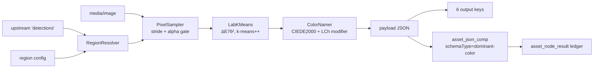

# Dominant Colour Node — Design and Implementation

> **Status: built and shipped.** The node, its Dagger wiring, its descriptor, 95 unit tests and one
> end-to-end integration test are all in the tree. See §9 for the progress assessment.
>
> **Scope.** This file owns the *design rationale* of the `dominant-color` node — why the colour
> science is shaped the way it is, and which of its choices are load-bearing. It does **not**
> duplicate:
> - node lifecycle, persistence model, the node catalogue → [NODES.md](NODES.md)
> - output keys, content types, the type-safety audit → [../pipeline/NODE_DATA_TYPES.md](../pipeline/NODE_DATA_TYPES.md)
> - engine, dispatch, affinity → [../pipeline/PIPELINE.md](../pipeline/PIPELINE.md)
>
> **Source of truth is the code.** Where this file and the code disagree, the code wins — fix this
> file in the same change ([../../guidelines/CODING.md](../../guidelines/CODING.md)).

---

## 1. What it does

Answers "what colour is this picture?" — and, given upstream bounding boxes, "what colour is *that
part* of this picture?".

For every region it measures, it reports the dominant colour and the ranked palette behind it as:

| Representation | Example |
|---|---|
| HEX | `#3B6EA5` |
| RGB | `{r: 59, g: 110, b: 165}` |
| HSL | `{h: 211.3, s: 47.3, l: 43.9}` |
| CIELAB + LCh | `{l: 45.35, a: -3.0, b: -34.5}` / `{c: 34.66, h: 271.1}` |
| Name (EN) | `muted blue` |
| Name (DE) | `gedämpftes Blau` |
| Machine term | `blue` |

Three region sources are **merged, not ranked** — they answer different questions and a consumer may
want all three:

1. the whole frame (`includeWholeImage`, default on),
2. a fixed configured region (`regionX/Y/W/H`, off by default),
3. every box from an upstream detector (`detectionSources`, default `["facedetect"]`).

The Loom schema has carried an `asset_image_comp.image_dominant_color` column since `V2.8`, exposed
as `dominantColor` in GraphQL, and **nothing has ever written it**. This node does not write it
either — it persists the far richer payload to `asset_json_comp` like every other analysis node.
Back-filling the typed column from that payload is open work (§9).



---

## 2. The four decisions that matter

Everything else in the node is mechanical. These four are where a plausible-looking alternative is
wrong, so each is recorded with the evidence.

### 2.1 Cluster in CIELAB with squared Euclidean — name with CIEDE2000

Two different distance functions, and the split is a correctness requirement rather than a
performance tuning:

Lloyd's algorithm terminates **only** because each step provably lowers the within-cluster sum of
squared distances, and that proof needs the arithmetic mean to be the distance's centroid. That
holds for squared Euclidean (ΔE76²). It does **not** hold for CIEDE2000, which violates the triangle
inequality and is not a Bregman divergence — clustering under it has no monotone-decrease guarantee
and can oscillate indefinitely.

CIEDE2000 therefore runs exactly once per emitted colour per prototype, inside `ColorNamer`, where
its extra accuracy costs nothing.

> ⚠️ **CIEDE2000 is a well-known source of silent bugs.** Roughly half of published implementations
> get the hue-averaging or the `Rt` rotation branch wrong, and the error is invisible on ordinary
> colours. `ColorDistanceTest` pins all **34 pairs of the Sharma/Wu/Dalal reference dataset** to
> `1e-4`. Do not weaken that test.
>
> The specific failure that will actually hit this node is `NaN`: `cBar == 0` and `cBarP == 0` both
> divide zero by zero, and a **grey image is the most common degenerate input**. Both guards are
> explicit in `ColorDistance.ciede2000` and pinned by `testGreyAgainstGreyIsZeroNotNaN`.

### 2.2 Several Lab prototypes per term, not one anchor

A single Lab anchor per basic colour term is the obvious design and it is measurably wrong. Under
nearest-CIEDE2000 against one anchor, lightness gets counted twice — once when choosing the term and
again when the modifier is composed — so dark and light members of a hue drift onto neighbouring
terms:

| Colour | Single anchor gives | Correct |
|---|---|---|
| `#000080` navy | purple | blue |
| `#191970` midnightblue | purple | blue |
| `#00FF00` pure green | yellow (by 0.1 ΔE) | green |

The fix keeps the algorithm and thickens the codebook: each of the eight chromatic terms gets 4–8
prototypes spread along its own lightness range, and the term of the nearest prototype wins.
Validated against 39 CSS named colours — 37 correct, 2 defensible.

The three regressions above are pinned by
`ColorNamerTest.testTheColorsThatMotivatedTheMultiPrototypeCodebook`. **If someone thins the
codebook, that test fails first.**

Prototypes are stored as **hex strings** and converted once in a static initialiser, never as
hand-typed Lab triples: hex is auditable by eye and the conversion is already tested, so there is no
transcription risk.

### 2.3 Achromatic colours bypass hue entirely

Below `achromaticChroma` (default 12.0) the hue angle carries no information. The namer returns
black, grey or white on lightness alone — no prototype lookup, and **no chroma modifier is ever
composed**. This makes `greyish grey` impossible by construction rather than by luck, which
`testAchromaticColorsNeverReceiveAChromaModifier` asserts directly.

12.0 rather than 10.0 because `#708090` slategray has `C* = 10.79` and is unambiguously grey to a
human.

Relatedly, `Lab.hue()` returns **`null`**, not 0, below `HUE_EPSILON`. `atan2(0, 0)` is 0, and a
caller taking that at face value would report pure grey as "hue 0", i.e. red. `HUE_EPSILON` is `1e-4`
rather than 0 because the D65 white-point constants are not exactly consistent with the sRGB primary
matrix, so a neutral grey converts to a residual chroma of about `2e-5`.

### 2.4 Stride sampling, not bilinear downscaling

A deliberate divergence from the `DepthImages.downscale` pattern the other ImageIO-based nodes use:

- **Interpolation invents colours that are not in the image.** A red-and-blue striped flag
  downscaled bilinearly is purple, and the node would confidently report purple as dominant.
  Averaging is right for a depth map and wrong for a colour histogram.
- **It destroys the alpha gate.** Interpolating over `TYPE_INT_ARGB` bleeds the RGB of fully
  transparent pixels — usually black or white — into their opaque neighbours before anything can
  discard them.

Transparent pixels are **skipped**, never flattened onto a background. `DepthImages.toOpaque`
flattens onto white, correctly for its own purpose; doing that here would make every logo on a
transparent background come back "white". `testFullyTransparentPixelsAreSkippedRatherThanFlattened`
is the guard: its fixture writes blue into the RGB channels *behind* zero alpha, so any flattening or
interpolation produces a blend instead of pure red.

---

## 3. Reproducibility

The same image and options must always produce the same palette. This is a hard requirement, not a
nicety: a colour that changed between runs would make every downstream facet and every cached result
unstable.

Three things are load-bearing, and **all three** are needed:

| Mechanism | Why it is not sufficient alone |
|---|---|
| `new Random(seed)`, seed default 42 | `java.util.Random` is bit-for-bit specified by the JLS, but k-means++ *walks the point array* — a reordered array selects different seeds |
| Stride sampling in fixed raster order | Fixes the point order that the seeder walks |
| Deterministic empty-cluster re-seeding (furthest point, ties → lowest index) | A random re-seed would reintroduce nondeterminism mid-run; dropping the cluster instead would silently change `k` |

Ranking is by share descending, tie-broken by `L*` then `a*` then `b*` — never left to map iteration
order, which would let two equal-share clusters swap between runs and defeat the fixed seed.

`k` is capped by the distinct colour count *before* seeding, so a two-tone image never asks for five
clusters and lets k-means++ pick duplicate centres.

---

## 4. Region resolution

Input contract is exactly what `FacedetectNode` emits and `SceneLayoutNode` parses:

```json
{ "imageWidth": 1920, "imageHeight": 1080, "coordinates": "ABSOLUTE_PIXELS",
  "detections": [ { "index": 0, "type": "face", "label": "face", "frame": 0,
                    "bbox": {"x": 100, "y": 50, "w": 80, "h": 80}, "confidence": 1.0 } ] }
```

Emission order is part of the contract: `whole` → `region` → detections (in configured source order,
within a source in payload `index` order). Detection ids are `label + "-" + index`, prefixed with the
node id when more than one source is configured so two detectors cannot collide on `face-0`.

| Case | Handling |
|---|---|
| `NORMALIZED` | Scale by the **decoded image's** dimensions, never the payload's. 🔴 `SceneLayoutNode` multiplies by the payload dims and skips the box when they are absent — same result when they match, wrong when they do not. **Do not copy that.** |
| `ABSOLUTE_PIXELS`, payload dims match | Use as-is |
| `ABSOLUTE_PIXELS`, payload dims differ | Rescale by `(imgW/payloadW, imgH/payloadH)` and `log.info`, naming both sizes. Silently mis-cropping every face is worse than a log line |
| `ABSOLUTE_PIXELS`, payload dims absent | The facedetect *video* path emits this shape (`VideoFile` exposes no frame size). Assume the decoded image's pixel space — safe because `isProcessable` gates on `isImage()` |
| `coordinates` absent or unknown | Treat as `ABSOLUTE_PIXELS` (today's on-the-wire default) and `log.warn` |
| `frame != 0` | Dropped and counted. In an image pipeline this can only be a mis-wired graph |
| Malformed JSON | Warned and ignored — never thrown |

Boxes are floored at the origin and ceiled at the far edge (`Box.ofBounds`) so a sub-pixel box cannot
collapse through double truncation, then clamped to the image.

Two drop paths, both counted into `truncated.dropped`: geometric (`w*h < minRegionPixels`, in
`RegionResolver`) and post-alpha (`usablePixels < minRegionPixels`, in the node — it cannot be known
before sampling). Detection regions above `maxRegions` are kept largest-first and reported in
`truncated.regions`; the whole-image and configured regions are exempt from the cap, because a cap
that dropped the subject of the photo would be worse than no cap.

---

## 5. Persistence and versioning

Standard two-step, per [NODES.md](NODES.md) §2:

1. `createAssetJsonComp` → `asset_json_comp`, `schemaType="dominant-color"`, `variant=""` (one row
   per asset; every region lives inside the payload — `variant` is reserved for a frame number once
   video lands).
2. `recordNodeResult(..., resultRef("asset_json_comp", compUuid))` → the ledger.

`producerVersion` is `DominantColorNode.ALGORITHM_VERSION` (`"dominant-color/1"`). There is no model
to name, but the term codebook and the modifier table decide every emitted name, and a retune of
either changes results for already-processed assets. **Bump it whenever `ColorTerms` or `ColorNamer`
changes** — `DominantColorNodePersistenceTest.testTheAlgorithmVersionIsRecordedAsTheProducerVersion`
asserts the exact string, so a silent retune fails the build.

---

## 6. Conventions and Gotchas

| Rule | Why |
|---|---|
| **A failure path ends in `abort()`, never `failure(...).next()`** | `NodeContextImpl.next()` ignores `failureCause` and returns SUCCESS. A corrupt image reported with `failure(msg).next()` shows green in the run summary. This node is the first written against that knowledge; eleven others still have the bug ([NODES.md](NODES.md) §10) |
| **The cache key covers upstream payloads and options, not just the path** | `SceneLayoutNode` keys `LocalResultCache` on `absolutePath()` alone, so re-running the same file behind a different detector returns the first detector's answer — a stale-result bug that never surfaces as an error. `testChangedUpstreamDetectionsMissTheCache` pins the fix |
| **An undecodable image FAILS; an empty result SKIPS** | A file that claims to be an image and cannot be decoded is a real problem. A fully transparent PNG, or a detector that found nothing, is a normal outcome — failing it would block downstream nodes and pollute the run summary |
| **Fixtures are PNG, never JPEG** | JPEG chroma subsampling and DCT ringing put colours into the decoded image that were never written, forcing every expected value to become an approximation. With PNG the expected hex is exact |
| **Fixture filenames end `.png`** | `FilterHelper.isImage` decides the media type from the extension alone, so a fixture the node refuses to process would make every test pass vacuously. Same reason `AbstractNodeIntegrationTest.createUniqueAsset` gained a `suffix` overload |
| **The German nouns are neuter and capitalised** | `Rot Orange Gelb Grün Blau Violett Rosa Braun Schwarz Grau Weiß`. That is what makes the strong-declension `-es` adjective correct for all eleven with no article and no gender table. `Orange`/`Rosa` are indeclinable German *adjectives* — which is precisely why they are used as *nouns* here, where they are entirely regular |
| **The term table is Java, not a resource** | ~60 strings keyed on the `Lightness`/`Chroma` enums, so it can never be edited independently of them. In Java it is compile-checked and cannot acquire the failure mode a bundled resource would: an encoding slip that turns `Weiß` into a replacement character on a non-UTF-8 platform |
| **`dominant` duplicates `palette[0]`** | Not an index. Nine consumers out of ten want only the dominant colour, and `regions[0].dominant.hex` reads better than `regions[0].palette[0].hex` |
| **CMYK JPEGs fail** | `ImageIO.read` returns `null` for them. Same behaviour as `FacedetectNode` and `QualityNode`, so it is at least consistent |

### Known naming gaps, documented not fixed

`#00FFFF` cyan and `#008080` teal name as **blue**. Correct within the Berlin & Kay 11, but German
speakers say *Türkis* and English speakers *turquoise*. Both are 12th-term candidates in the B&K
sequence. Adding a `turquoise`/`Türkis` term is one row in `ColorTerms` plus moving three prototypes
onto it — the architecture already supports it.

---

## 7. Key Classes Reference

| Class | Package / module | Purpose |
|---|---|---|
| `DominantColorNode` | `io.metaloom.cortex.node.color` (cortex/nodes/dominant-color) | The node. Lifecycle, region loop, payload, persistence, cache key |
| `DominantColorNodeOptions` | same | Options + `validate()`; `KEY = "dominant-color"` |
| `DominantColorNodeModule` | same | Dagger `@Binds @IntoSet` + `@StringKey("dominant-color")` |
| `ColorSpaces` | same | sRGB ↔ linear ↔ XYZ(D65) ↔ CIELAB, LCh, HSL, hex |
| `ColorDistance` | same | CIEDE2000 (naming) + squared Euclidean (clustering) |
| `ColorTerms` | same | The 11 bilingual terms + the chromatic Lab codebook |
| `ColorNamer` | same | Achromatic gate, nearest prototype, modifier composition |
| `Lightness` / `Chroma` / `ColorName` | same | The two modifier bands and the named result |
| `LabKMeans` | same | Deterministic k-means++ / Lloyd over a flat Lab array |
| `PixelSampler` | same | ImageIO decode, stride sampling, alpha gate, distinct-colour count |
| `RegionResolver` / `RegionSource` / `RegionKind` / `Box` | same | Configuration + upstream boxes → ordered regions |
| `ColorResult` | same | One region's ranked palette |
| `Rgb` / `Lab` / `Hsl` | same | Colour value records |
| `DominantColorDescriptorProvider` | `io.metaloom.loom.nodes.spec` (loom-shared/node-model) | Palette entry, connectors, 21 form parameters |
| `ContentTypes.DATA_COLOR` | same | `data/color` |

---

## 8. Test Setup

No database is needed for anything but the integration test.

```bash
# The node and all its pure helpers - 95 tests
./mvnw -pl cortex/nodes/dominant-color/core test

# Descriptor + content-type model, SPI discovery (asserts the provider/kind counts)
./mvnw -pl loom-shared/node-model test

# Kind registration: the worker must advertise 'dominant-color'
./mvnw -pl cortex/cli test -Dtest=NodeRegistrarTest

# End to end against a real in-process Loom + pooled DB
./setup-pool.sh
./mvnw -pl integration-test test -Dtest=DominantColorNodeIntegrationTest
```

**What the tests pin, and why each earns its keep:**

| Test | Guards against |
|---|---|
| `ColorDistanceTest` (34 Sharma pairs + the NaN guard) | A wrong CIEDE2000 branch, invisible on ordinary colours |
| `ColorSpacesTest` (round-trips all 216 web-safe colours + 40 dark greys exactly) | Rounded EPS/KAPPA constants, whose discontinuity shows up only on near-black colours |
| `ColorNamerTest` (17 modifier cells × 2 languages, 3 codebook regressions, the achromatic invariant) | A thinned prototype codebook; `greyish grey`; a German string drifting from its English counterpart |
| `LabKMeansTest` (determinism, degenerate inputs, share ranking) | Nondeterminism, division by zero on empty input, unstable ordering |
| `RegionResolverTest` (18 cases) | The coordinate-handling matrix in §4 |
| `DominantColorNodeTest` (20 cases) | The alpha gate, the cache key, fail-vs-skip, exact colours end to end |
| `DominantColorNodePersistenceTest` (8 cases) | Component-then-ledger ordering, the algorithm version, silence on skip |
| `DominantColorNodeIntegrationTest` | **The German name reading back byte-for-byte through JSONB and REST** — the only place UTF-8 survival across the whole persistence chain is asserted |

---

## 9. Progress Assessment

### Done

- [x] **Module, node, options, Dagger wiring** — `cortex/nodes/dominant-color`, registered in
      `NodeCollectionModule`, `cortex/processor` and `integration-test`.
- [x] **Colour science** — sRGB↔CIELAB with exact rational transfer constants, LCh, HSL, CIEDE2000
      pinned to the full Sharma reference dataset.
- [x] **Bilingual naming** — 11 basic terms, multi-prototype codebook, achromatic gate, 17-cell
      modifier table in EN and DE.
- [x] **Deterministic k-means** — k-means++ with a fixed seed, deterministic empty-cluster re-seed,
      stable ranking, distinct-colour cap on `k`.
- [x] **Three region sources merged** — whole frame, configured region, upstream detections, with
      the full coordinate-handling matrix and explicit drop/truncate accounting.
- [x] **Persistence** — `asset_json_comp` (`schemaType="dominant-color"`) + ledger, with a
      hand-bumped `ALGORITHM_VERSION` asserted by a test.
- [x] **Descriptor + `data/color` content type + UI icon** — visible and configurable in the palette.
- [x] **95 unit tests + 1 integration test**, all green.
- [x] **Demo data** — a seeded `dominant-color` component on the first demo image.

### Open

- [ ] **`asset_image_comp.image_dominant_color` is still never written.** The column and its
      `dominantColor` GraphQL field have existed since `V2.8`. Back-filling the top hex from this
      node's payload would make colour *queryable* rather than only readable. Note
      `ReplaceValidatorTest` currently asserts `dominantColor` is not a replaceable field — check
      that before wiring a write path.
- [ ] **No colour filter node.** `dominant_color_term` was emitted as a stable facet key precisely so
      a `filter-color` node could key on it; that node does not exist yet.
- [ ] **Video is out of scope.** Per-frame colour needs a frame-extraction path and a `variant`
      scheme to hold per-frame rows. `isProcessable` gates on `isImage()`.
- [ ] **No 12th `turquoise`/`Türkis` term** — see §6.
- [ ] **`SceneLayoutNode` still has the two bugs this node avoided**: a path-only cache key, and
      `NORMALIZED` boxes scaled by the payload dimensions. Neither is in scope here, but both are
      now documented in [../pipeline/NODE_DATA_TYPES.md](../pipeline/NODE_DATA_TYPES.md) §10.
- [ ] **Naming is only as good as its thresholds.** The modifier bands are hand-tuned and have never
      been validated against human judgements. A small labelled set would turn §2.2's "37 of 39 CSS
      colours" into a real regression metric.

---

## 10. Where do I find …?

| Need | Path |
|---|---|
| The node | `cortex/nodes/dominant-color/core/src/main/java/io/metaloom/cortex/node/color/DominantColorNode.java` |
| The colour-space maths | `.../color/ColorSpaces.java` |
| CIEDE2000 + its two zero-chroma guards | `.../color/ColorDistance.java` |
| The bilingual term table and the Lab codebook | `.../color/ColorTerms.java` |
| The achromatic gate and the modifier table | `.../color/ColorNamer.java` |
| k-means, seeding, empty-cluster re-seed | `.../color/LabKMeans.java` |
| Stride sampling and the alpha gate | `.../color/PixelSampler.java` |
| The coordinate-handling matrix | `.../color/RegionResolver.java` |
| The Sharma reference dataset | `.../src/test/java/io/metaloom/cortex/node/color/ColorDistanceTest.java` |
| Synthetic PNG fixtures | `.../src/test/java/io/metaloom/cortex/node/color/DominantColorFixtures.java` |
| The descriptor and its 21 form parameters | `loom-shared/node-model/src/main/java/io/metaloom/loom/nodes/spec/DominantColorDescriptorProvider.java` |
| Kind registration | `cortex/cli/src/main/java/io/metaloom/cortex/cli/dagger/NodeCollectionModule.java` |
| The UI icon mapping | `loom-ui/src/features/pipeline/PipelineEditor.tsx` (`ICON_MAP`, key `palette`) |
| Demo data | `loom/core/src/main/java/io/metaloom/loom/core/boot/DemoDatabaseInitializer.java` (`createDominantColorComp`) |
| Customer-facing docs | `website/content/english/docs/nodes/dominant-color/index.adoc` |

---

_Git HEAD revision: `5ac79b6d`_
_Last updated: 2026-07-28 (new file — records the design of the `dominant-color` node as built:
the two-distance split between clustering and naming, the multi-prototype term codebook and the
three colours that forced it, the achromatic gate, stride-versus-bilinear sampling, the three
mechanisms that together make the result reproducible, and the coordinate-handling matrix where it
deliberately diverges from `SceneLayoutNode`.)_
