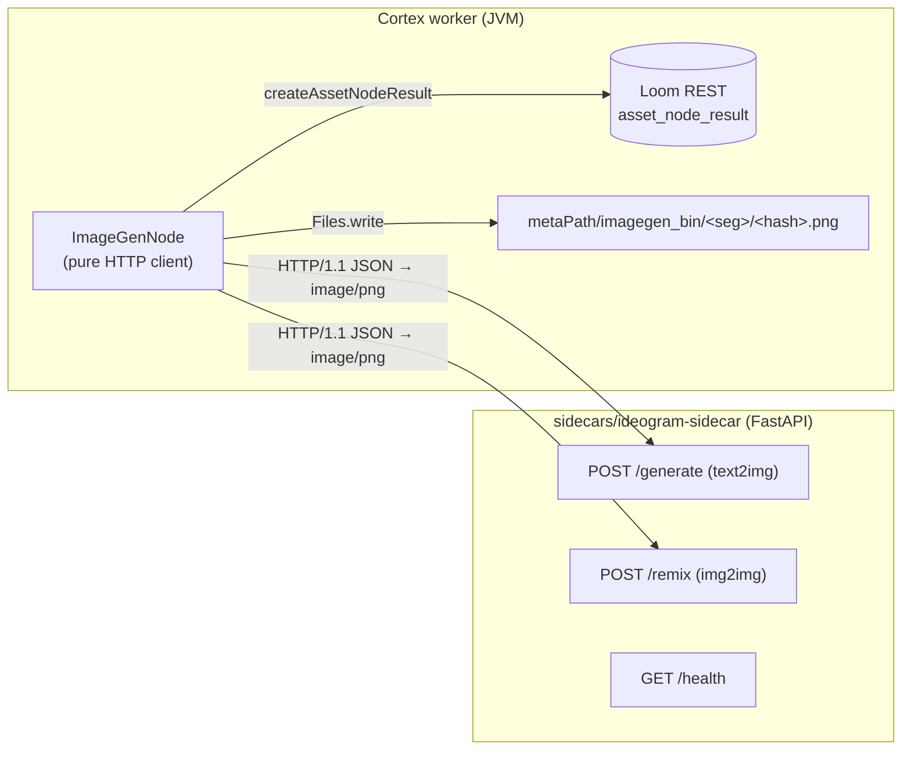
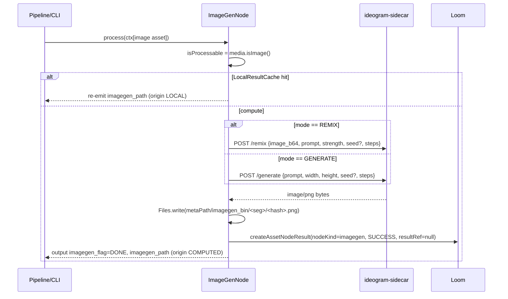

# Image Generation Node — Design & Implementation Plan

> Status: **proposed** — the backing Python sidecar exists and is verified; the
> Java `imagegen` Cortex node is not yet implemented.
>
> **Scope of this spec**: the Cortex-level `imagegen` node and its HTTP client to
> the model sidecar. The node system as a whole is specified in
> [NODES.md](NODES.md); the persistence model (typed component + ledger) is
> §2 there and is not duplicated here.

---

## 1. Motivation

Cortex has no image-generation capability. We want an `imagegen` node that, for an
image asset in a pipeline, calls a self-hosted diffusion model over HTTP to
produce an image — either **text-to-image** from a configured prompt or
**image-to-image / remix** from the asset's own pixels — stores the PNG to a
local meta-path cache, and records a node-result ledger entry so the run is
traceable. This mirrors the existing generative node `TtsNode` (bytes stay local,
ledger-only) and the sidecar-client pattern of `CaptioningNode`.

## 2. What already exists (verified against code)

| Concern | Reference | Notes |
|---|---|---|
| HTTP-client-to-sidecar node | `cortex/nodes/captioning/core/…/CaptioningNode.java`, `SmolVLMClient.java`, `CaptioningNodeModule.java` | Injectable client provided by the module; node stays a thin HTTP client. |
| Generative bytes → local `*_bin` + ledger-only | `cortex/nodes/tts/core/…/TtsNode.java` | Closest analog: writes produced bytes to `metaPath/tts_bin/<seg>/<hash>.wav`, records `asset_node_result` only. |
| Hash-segmented path helper | `ThumbnailNode.resolveThumbnailPath`, `io.metaloom.utils.hash.HashUtils.segmentPath` | `metaPath/<dir>` → `segmentPath(base, sha512)` → `<hash>.<ext>`. |
| Base node + ledger helpers | `cortex/common/…/node/AbstractMediaNode.java` | `recordNodeResult(asset, ctx, state, reason, producerVersion, resultRef)` / `resultRef(table, uuids…)`; both no-op when `asset==null || client()==null`. |
| Executable-kind registration | any `*NodeModule` | `@Binds @IntoMap @StringKey("<kind>")` in the node's own module → `NodeRegistrar` → worker `nodeWhitelist`. Central touch-point: `cortex/cli/…/dagger/NodeCollectionModule.java` `includes`. |
| Model sidecar (built, verified) | `sidecars/ideogram-sidecar/` | FastAPI, model-agnostic contract; default SDXL-Turbo, optional gated Ideogram-4. |
| Image load | `io.metaloom.video4j.utils.ImageUtils.load(File)` | REMIX path only. No PNG **writer** in `ImageUtils` (JPG only) — use `javax.imageio.ImageIO.write(img, "png", …)`. |

**Two constraints that shape the design**

1. **Loom has no raw byte upload** (`AttachmentMethods.uploadAttachment` aside).
   So the generated PNG stays in a local `imagegen_bin` cache and only the ledger
   marker is written — identical to Thumbnail/TTS. Pushing the derivative into the
   asset-binary subsystem is a tracked follow-up.
2. **`AbstractMediaNode` is asset-centric** (`isProcessable` → `compute(ctx, asset)`).
   The node runs on an image asset even in GENERATE mode, which keeps the standard
   lifecycle, the SHA-512-keyed output path, and the ledger row.

## 3. Design decisions

- **Two modes via an option**: `mode = GENERATE | REMIX` (default **GENERATE**).
  GENERATE creates a new image from the prompt (source pixels ignored); REMIX
  feeds the asset's image + prompt to the sidecar `/remix`.
- **Prompt is node configuration**: a `prompt` field on `ImageGenNodeOptions`,
  set in the pipeline node's config and passed to the sidecar per invocation.
  (Placeholder templating and chaining off an upstream `captioning` caption are
  documented follow-ups, not v1.)
- **Ledger-only persistence** (no typed component), matching Thumbnail/TTS.
- **Model-agnostic HTTP contract** so the node is not coupled to any one model.

## 4. Architecture



## 5. Node data flow



## 6. Implementation outline

New Maven module `cortex/nodes/image-generation/` (parent `pom` + `core` jar,
copy `cortex/nodes/captioning/`); add `<module>image-generation</module>` to
`cortex/nodes/pom.xml`. Java package `io.metaloom.cortex.node.imagegen`:

- **`ImageGenMode`** — `enum { GENERATE, REMIX }`.
- **`ImageGenNodeOptions`** `extends AbstractNodeOptions<…>` — `KEY="imagegen"`;
  fields `mode`, `prompt`, `host`, `port`, `generateEndpoint`, `remixEndpoint`,
  `width`, `height`, `strength`, `seed`, `steps`, `timeoutMs`; `validate()`
  mirrors `CaptioningNodeOptions`.
- **`ImageGenClient`** — plain class, `java.net.http.HttpClient` (HTTP/1.1),
  `generate(...)` and `remix(BufferedImage, …)` returning `byte[]` (PNG). Direct
  analog of `SmolVLMClient`.
- **`ImageGenNode`** `extends AbstractMediaNode<ImageGenNodeOptions>` — `name()="imagegen"`,
  `isProcessable = media.isImage()`, `LocalResultCache<String>` on media path,
  `compute` picks the mode, writes bytes to `imagegen_bin`, outputs
  `imagegen_flag`/`imagegen_path`, records ledger-only (`resultRef=null`;
  `producerVersion=null` as Captioning/Thumbnail do), FAILED on exception.
- **`ImageGenNodeModule`** `extends AbstractNodeModule` — copy `TtsNodeModule`:
  `@Binds @IntoSet`, `@Binds @IntoMap @StringKey("imagegen")`, `optionInfo()`,
  `options()`, `@Provides ImageGenClient`.
- **Central edit**: add `ImageGenNodeModule.class` to `NodeCollectionModule.includes`.

## 7. The sidecar (`sidecars/ideogram-sidecar/`)

Already built and verified. Model-agnostic HTTP contract the node targets:

| Method | Path | Body | Response |
|---|---|---|---|
| GET | `/health` | — | `{status, model, device, remix_mode}` |
| POST | `/generate` | `{prompt, width?, height?, seed?, steps?}` | `image/png` |
| POST | `/remix` | `{image_b64, prompt, strength?, seed?, steps?}` | `image/png` |

Default model **SDXL-Turbo** (ungated, fast, real img2img). Ideogram-4 is
opt-in via `IMAGEGEN_MODEL` + `HF_TOKEN`; run it via `gen_ideogram.py` (see
Conventions & Gotchas).

## 8. Configuration / Environment

Node options (from the pipeline node config, deserialized into `ImageGenNodeOptions`):

| Option | Default | Meaning |
|---|---|---|
| `enabled` | `true` | inherited from `AbstractNodeOptions` |
| `mode` | `GENERATE` | `GENERATE` (text2img) or `REMIX` (img2img) |
| `prompt` | `""` | generation prompt (required) |
| `host` | `localhost` | sidecar host |
| `port` | `9200` | sidecar port |
| `generateEndpoint` | `/generate` | text2img path |
| `remixEndpoint` | `/remix` | img2img path |
| `width` / `height` | `1024` | GENERATE output size |
| `strength` | `0.6` | REMIX denoise strength (0–1] |
| `seed` | `null` | optional RNG seed |
| `steps` | `30` | inference steps |
| `timeoutMs` | `120000` | HTTP timeout |

Sidecar environment (documented in `sidecars/ideogram-sidecar/README.md`):

| Var | Default | Meaning |
|---|---|---|
| `IMAGEGEN_MODEL` | `stabilityai/sdxl-turbo` | HF repo / local path |
| `IMAGEGEN_DEVICE` | `cuda` if available | torch device |
| `IMAGEGEN_CPU_OFFLOAD` | `0` | model CPU offload for big models on small VRAM |
| `CUDA_VISIBLE_DEVICES` | — | pin a GPU |
| `HF_TOKEN` | — | only for gated models (Ideogram) |

## 9. Testing & Verification

Mirror the whisper/captioning suites (model client **stubbed by subclassing
`ImageGenClient`** to return canned PNG bytes — no GPU; `LoomClient` null offline):

- `ImageGenNodeTest` — both modes; assert `SUCCESS`, `imagegen_path` file exists
  with the canned bytes, and second run served from `LocalResultCache` (client
  called once).
- `ImageGenNodePipelineTest` — `spy`+`doAnswer`, `adapt(node)`, assert output-key
  propagation (`PipelineAssertions.hasNodeOutput`, `CapturingNode`); disabled /
  dry-run / non-image skip.
- `ImageGenNodePersistenceTest` — Mockito `LoomHttpClient`; `verify` the
  `createAssetNodeResult` ledger row (`nodeKind=imagegen`, `SUCCESS`, `COMPUTED`,
  `resultRef==null`); failure path records `FAILED`.
- `ImageGenOptionsValidationTest` (+ `assertj/ImageGenNodeAssertions`).
- `integration-test/…/node/ImageGenNodeIntegrationTest` — mirror
  `ThumbnailNodeIntegrationTest` (ledger-only): in-process Loom, pre-created image
  asset, stub client, assert `SUCCESS` + PNG artifact under `metaPath/imagegen_bin/…`.

No REST/DAO tests: the node adds no REST endpoint or DAO (reuses the existing
`asset_node_result` ledger path).

Build/run:
```bash
mvn -pl cortex/nodes/image-generation/core -am test
mvn -pl integration-test -Dtest=ImageGenNodeIntegrationTest test
# clean-rebuild loom/core after the NodeCollectionModule/constructor change
# (known NoSuchMethodError pitfall) before setup-pool/tests.
```
Live smoke (GPU): `cd sidecars/ideogram-sidecar && CUDA_VISIBLE_DEVICES=1 ./venv/bin/uvicorn server:app --port 9200`, point the node's `host/port` at it, run GENERATE, confirm a PNG under `metaPath/imagegen_bin/…` + an `asset_node_result` row with `node_kind="imagegen"`.

## 10. Key Classes Reference

| Class | Package | Purpose |
|---|---|---|
| `ImageGenNode` | `io.metaloom.cortex.node.imagegen` | The node; `compute` calls the sidecar, writes PNG, records ledger |
| `ImageGenNodeOptions` | `io.metaloom.cortex.node.imagegen` | Config incl. `mode`, `prompt`, sidecar host/port, `KEY="imagegen"` |
| `ImageGenMode` | `io.metaloom.cortex.node.imagegen` | `GENERATE` \| `REMIX` |
| `ImageGenClient` | `io.metaloom.cortex.node.imagegen` | HTTP/1.1 client → sidecar `/generate` `/remix`, returns `byte[]` |
| `ImageGenNodeModule` | `io.metaloom.cortex.node.imagegen` | Dagger bindings incl. `@StringKey("imagegen")` |
| `AbstractMediaNode` | `io.metaloom.cortex.common.node` | Lifecycle + `recordNodeResult`/`resultRef` |
| `NodeCollectionModule` | `io.metaloom.cortex.cli.dagger` | Aggregates node modules (the one central edit) |
| `HashUtils` | `io.metaloom.utils.hash` | `segmentPath(base, sha512)` |
| `ImageUtils` | `io.metaloom.video4j.utils` | `load(File)` (REMIX source) |

## 11. Conventions and Gotchas

- **`ImageUtils` has no PNG writer** (JPG only) — use `ImageIO.write(img, "png", os)`.
- **Ledger-only**: pass `resultRef=null` to `recordNodeResult`; the base no-ops
  when `asset==null || client()==null` (clean offline behaviour).
- **Registration is three strings + one binding** in `ImageGenNodeModule`
  (`@StringKey`, `CortexNodeOptionDeserializerInfo`, `nodeOptions(...)`) plus
  `@Binds @IntoSet`; then add the module to `NodeCollectionModule.includes`.
- **Sidecar is model-agnostic**: default SDXL-Turbo needs no token and does true
  img2img. Ideogram-4 weights are **non-commercial licensed** and gated.
- **Ideogram-4 nf4 on a 12 GB GPU only works at `guidance_scale=1.0` (no CFG)**;
  any CFG or per-step transformer CPU↔GPU swapping collapses the 4-bit model to a
  gray *"Image blocked by safety filter"* card — a quantization/CFG artifact, **not**
  a moderation filter (the real Ideogram filter is external Hive API calls in
  their CLI, absent from the diffusers path). Full-quality CFG needs the fp8/bf16
  build on a 24 GB GPU. See `sidecars/ideogram-sidecar/gen_ideogram.py`.
- **No demo data needed**: `DemoDatabaseInitializer` holds no per-node Cortex
  config; node kinds in pipeline JSON are cosmetic UI labels.

## 12. Where do I find …?

| I want to … | Look at |
|---|---|
| The sidecar-client node pattern | `cortex/nodes/captioning/core/.../CaptioningNode.java` + `SmolVLMClient` |
| Writing generated bytes + ledger-only | `cortex/nodes/tts/core/.../TtsNode.java` |
| The hash-segmented output path | `ThumbnailNode.resolveThumbnailPath`, `HashUtils.segmentPath` |
| The ledger write helpers | `AbstractMediaNode.recordNodeResult` / `resultRef` |
| Where a node registers as a runnable kind | its `*NodeModule` (`@StringKey`) + `NodeCollectionModule.includes` |
| Test exemplars | `whisper/core/src/test/.../Whisper*Test`, `captioning/.../CaptioningNodeTest` |
| Integration-test exemplar (ledger-only) | `integration-test/.../node/ThumbnailNodeIntegrationTest.java` |
| The model server | `sidecars/ideogram-sidecar/` (`server.py`, `README.md`, `gen_ideogram.py`) |
| Customer docs pattern | `website/content/english/docs/nodes/vlm/index.adoc` + `nodes/_index.adoc` |

## 13. Progress Assessment

- [x] Module `cortex/nodes/image-generation/` (parent + core poms) created; registered in `cortex/nodes/pom.xml`, `cortex/processor/pom.xml`, `integration-test/pom.xml`
- [x] `ImageGenMode`, `ImageGenNodeOptions` (+ `validate()`), `ImageGenClient`, `ImageGenNode`, `ImageGenNodeModule`
- [x] `ImageGenNodeModule.class` added to `NodeCollectionModule.includes` (cortex/cli compiles → Dagger `imagegen` kind registered)
- [x] Unit tests: `ImageGenNodeTest`, `ImageGenNodePipelineTest`, `ImageGenNodePersistenceTest`, `ImageGenOptionsValidationTest` (+ assertj) — 22 tests green
- [x] Integration test: `ImageGenNodeIntegrationTest` — passes (SUCCESS + PNG under `imagegen_bin` + `imagegen` ledger row via REST)
- [x] `NODES.md` updated (§2, §3, §5, §12, IT-coverage list)
- [x] Website docs: `nodes/imagegen/index.adoc` + `nodes/_index.adoc` (table row, requirements, capability note)
- [ ] Live GPU smoke test against `sidecars/ideogram-sidecar` (optional; needs a running sidecar + GPU)
- [x] Model sidecar built and verified (`sidecars/ideogram-sidecar`, `/generate` + `/remix`)

## 14. References

- [NODES.md](NODES.md) — node system, persistence model (§2), capability matrix (§12)
- [NODE_VIDEO_CAPTIONING_PLAN.md](NODE_VIDEO_CAPTIONING_PLAN.md) — sibling sidecar-backed node design
- [../../guidelines/CODING.md](../../guidelines/CODING.md), [../../guidelines/NEW_NODE.md](../../guidelines/NEW_NODE.md), [../../SPEC_RULES.md](../../SPEC_RULES.md)
- `sidecars/ideogram-sidecar/README.md`

---

_Git HEAD revision: `ff0b64e2`_
_Last updated: 2026-07-27_
