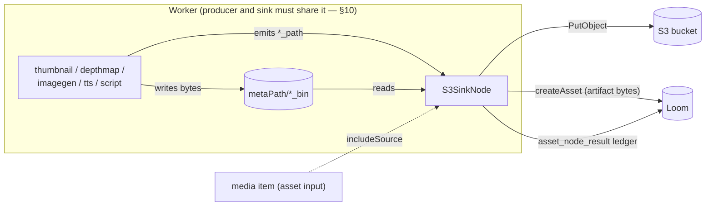

# S3 Sink Node — Design & Implementation Plan

> Design document for a new Cortex pipeline node (`s3-sink`) that writes files produced by
> upstream nodes — thumbnails, depth maps, generated images, speech audio — into an
> S3 bucket, and **creates the corresponding binaries in Loom** so they become
> first-class, retrievable content rather than files on one worker's disk.
>
> Read alongside [NODES.md](NODES.md) (the node system),
> [NODE_S3SOURCE_PLAN.md](NODE_S3SOURCE_PLAN.md) (the ingest half, already implemented —
> this node reuses its `cortex/s3-common` module) and
> [../pipeline/NODE_DATA_TYPES.md](../pipeline/NODE_DATA_TYPES.md) (the type reference).
> The source of truth is the code; this is a plan, not a record.
>
> **Status: phase 1 implemented.** Node kind `s3-sink`; code in
> [cortex/nodes/s3-sink](../../../cortex/nodes/s3-sink). 93 node tests and 7 integration tests
> against a real MinIO container pass. Phases 2 and 3 (structured binary location and the
> `attachment` derivation edge) are Loom-side work and remain open — §13.

---

## 1. Motivation

Five nodes produce bytes today and none of them can put those bytes anywhere durable. Each
writes into a worker-local cache and records a ledger row saying "this happened":

| Node | cache | path output | persists |
|---|---|---|---|
| `ThumbnailNode` | `metaPath/thumbnail_bin` | `thumbnail_path` | ledger only |
| `DepthmapNode` | `metaPath/depthmap_bin` | `depthmap_path` | ledger only |
| `ImageGenNode` | `metaPath/imagegen_bin` | `imagegen_path` | ledger only |
| `TtsNode` | `metaPath/tts_bin` | `tts_path` | ledger only |
| `ScriptNode` | `metaPath/script_bin/<nodeId>` | declared per instance | `asset_json_comp` + ledger |

`DepthmapNode`'s own class javadoc states the gap plainly:

> the PNG is written to a local cache under `metaPath/depthmap_bin` and only the
> `asset_node_result` ledger entry is recorded in Loom — **the bytes stay local (there is no
> byte-ingest endpoint for produced media yet)**.

And `DaoAssetSink` — Loom's pipeline→asset sink — names the same wall from the server side:

> *"Only hashes have somewhere to go today. **Thumbnails**, embeddings, OCR text and transcripts
> are computed and still land nowhere, and this is the seam where mapping them belongs."*

The consequences compound. A thumbnail exists only on the worker that made it, so the UI cannot
show it; a re-run on a different worker recomputes it; `SceneLayoutNode` can only consume
`depthmap_path` by being pinned to the same machine; and nothing survives the worker being
replaced.

`s3-sink` closes this: it uploads the artifacts to a bucket **and registers them in Loom as
assets**, which is what makes them retrievable by anything other than the process that made them.

### Non-goals

- **A general upload endpoint in Loom.** `AssetUploadEndpointService` already moves multipart
  bytes to a local upload directory. This node writes to object storage directly and tells Loom
  *where*, which is a different problem.
- **Presigned URLs / a Loom read proxy for S3 objects.** Needed before the UI can render an
  S3-hosted thumbnail; tracked in §16, not built here.
- **Replacing the local `*_bin` caches.** They stay — see §9 for why deleting them by default
  would break `scene-layout`.

---

## 2. Decisions

> **Status: agreed with the user before design.**

| # | Decision | Choice | Why |
|---|---|---|---|
| 1 | What Loom records | **Create binaries/assets in Loom**, not just a component row | The user's requirement. A derived artifact that is not an asset is not retrievable, which was the whole point |
| 2 | What gets uploaded | Whatever binary data the sink receives on its input | The type system is acknowledged as a mess and is being cleaned separately — do not over-engineer selection now |
| 3 | Local file | Kept by default; `deleteAfterUpload` is opt-in | `SceneLayoutNode` reads `depthmap_path` off the same worker's disk |
| 4 | Source media | The sink **also accepts the asset itself** as input, so `filesystem-source → s3-sink` archives originals | The user's requirement |

Decision 2 has a direct consequence worth stating: this plan deliberately keeps artifact
selection simple (§6) and does **not** invent a typed artifact contract. When
[../pipeline/NODE_DATA_TYPES_PLAN.md](../pipeline/NODE_DATA_TYPES_PLAN.md) lands, the selector is
the one place that should change.

---

## 3. Architecture



Three things happen per artifact, in this order, and the order matters:

1. **SHA-512 the local file.** Loom's `asset.sha512sum` is `NOT NULL UNIQUE` — the identity rule
   in `V2.46__asset_identity.sql` means *an asset cannot exist before its bytes are hashed*. The
   sink has the bytes locally, so this is cheap and unavoidable.
2. **Upload to S3**, at a deterministic key (§7).
3. **Create the asset in Loom** for the artifact, with `origin` = the `s3://` URI, plus the
   `asset_node_result` ledger on the *source* asset recording that this sink ran.

---

## 4. What Loom actually supports today — verified

This section exists because the obvious design does not work, and the reasons are not guessable.

| Assumption | Reality |
|---|---|
| `AssetCreateRequest` can say where the bytes live | **No.** It has `file` (`FileInfo`), `hashes`, and metadata. The only location-ish slot is the free-text `FileInfo.origin` → column `asset.initial_origin`, whose own comment sanctions *"first filepath encountered, **first s3 path**, url, hash"* |
| An asset can be attached to an `asset_pool` | **Not from code.** The schema hop `asset → asset_location.pool_uuid → asset_pool` exists (`V2.20`), but `AssetBinary` (the live model), `AssetBinaryCreateRequest` and the `/binaries` endpoint all omit `poolUuid`. **Nothing in the codebase ever writes that column.** The demo initializer even creates an S3 pool and links no binary to it |
| `AssetBinaryEndpointService` can record an S3 binary | **No.** Three branches (`create`, `update`, `createForAsset`) do `log.error("S3 support has not yet been implemented"); lrc.error(...)` |
| `AssetUpdateRequest.s3` sets the S3 location | **No — it silently discards.** It writes `AssetImpl.s3BucketName`/`s3ObjectPath`, in-memory fields whose DB columns `V2.46` dropped |
| There is a derived/parent asset relation | **No.** `asset_remix` is undirected, unlabelled, and has no DAO or endpoint. **`attachment` is the sanctioned mechanism** — see below |
| The `/locations` client methods work | **No.** `LoomHttpClientImpl` has them; no server route registers `/locations` |

### `attachment` is the sanctioned home for derived binaries

`V2.44__attachment_provenance.sql` was written for precisely this use case, and says so:

> `-- Make attachment the sink for node-produced derived binaries.`
> `-- ThumbnailNode produces contact sheets and had nowhere to record them […] Derived binaries`
> `-- are a general category - proxies, waveforms, extracted audio - and every one of them would`
> `-- have hit the same wall.`

It adds `node_kind`, `node_id`, `producer_version`, `variant`, `run_uuid`, `task_uuid`, the
attachment types `CONTACT_SHEET` / `POSTER_FRAME` / `WAVEFORM` / `PROXY` / `EXTRACTED_AUDIO`, a
partial unique index `(asset_uuid, type, node_kind, variant)` for idempotency, and `ON DELETE
CASCADE` from `asset`.

**But `attachment_binary` is `(sha512sum, size)` only — it has no path, no pool, no location.**
So `attachment` can express *"this asset has a contact sheet produced by node X with hash H"* and
cannot express *where those bytes are*. That is the missing piece for S3, on both the asset and
the attachment side.

### What this means for the design

Creating a full, structurally-located binary record is a **Loom-side project**, not a node change.
So the work is phased (§8): phase 1 gets real, queryable assets into Loom using only what exists
today; phases 2 and 3 add the structure. The node's contract does not change between phases.

---

## 5. Module layout

New module `cortex/nodes/s3-sink` (aggregator pom + `core/`, mirroring `cortex/nodes/depthmap`),
artifact `cortex-s3-sink-node`, package `io.metaloom.cortex.node.sink.s3`.

| Class | Responsibility |
|---|---|
| `S3SinkNode` | `AbstractMediaNode<S3SinkNodeOptions>` implements `PipelineConfigurable`. **Not `@Singleton`** |
| `S3SinkNodeOptions` | `KEY = "s3-sink"`; per-instance config + `validate()` |
| `S3SinkNodeModule` | Dagger: `@Binds @IntoSet` + `@Binds @IntoMap @StringKey("s3-sink")` + options |
| `ArtifactSelector` | upstream outputs (+ optionally the media item) → ordered `List<SinkArtifact>` |
| `SinkArtifact` | `record(sourceNode, sourceKey, index, multiValued, Path file)` |
| `UploadedArtifact` | per-artifact outcome + `toJson()` |
| `S3KeyTemplate` | parse + render; pure, no IO |
| `OverwritePolicy` | `NEVER` \| `IF_DIFFERENT` \| `ALWAYS` |

Additions to existing modules:

| File | Change |
|---|---|
| `cortex/s3-common/.../S3ObjectStore.java` | add `upload(...)` |
| `cortex/s3-common/.../AwsS3ObjectStore.java` | implement it |
| `cortex/s3-common/.../S3ContentTypes.java` | **new** — extension → content type |
| `cortex/s3-common/src/test/.../FakeS3ObjectStore.java` | implement `upload` + assertion accessors |
| `cortex/common/.../AbstractMediaNode.java` | `nodeId()` seam (§8.3) |
| `loom-shared/node-model/.../S3SinkDescriptorProvider.java` | **new** |

The node depends on `S3ObjectStore`, never on the AWS SDK — which is what keeps its unit tests
free of MinIO.

---

## 6. What gets uploaded

### 6.1 Sources

Three, in this precedence:

1. **Explicit `artifacts`** — ordered `List<String>` of `nodeId:outputKey`, the shape
   `SentimentNodeOptions.textSources` uses, but **all** entries are uploaded rather than
   first-match-wins. When non-empty this is authoritative and auto-discovery is off (merging the
   two would make it impossible to *exclude* something).
2. **Auto-discovery** (`autoDiscover`, default `true`, used when `artifacts` is empty) — every
   upstream output whose key ends in `_path` and resolves to an existing regular file. This
   covers `thumbnail_path`, `depthmap_path`, `imagegen_path`, `tts_path` and correctly excludes
   `depthmap_meta` (JSON) and every `*_flag`.
3. **`includeSource`** (default `false`) — also upload `ctx.media().file()`, the media item
   itself. This is what makes `filesystem-source → s3-sink` an archiver. When the media is
   *already* an `s3://` reference (an `s3-source` run) the sink **skips it** rather than
   round-tripping bytes it fetched a moment ago; a server-side copy for cross-bucket archiving is
   follow-up work (§16).

⚠️ `ScriptNode` image outputs do **not** end in `_path` — output keys are author-chosen — so a
script's images need an explicit `artifacts` entry. Say so in the descriptor description.

### 6.2 Multi-valued outputs

`ScriptNode` emits `IMAGE` as a `String` and `IMAGE_LIST` as a `List<String>` — **but on a
`LocalResultCache` hit it re-emits through `new JsonObject(cached)`, so the same output arrives as
a `JsonArray`.** The selector must accept `String`, `List<?>` and `JsonArray`, preserving the
element index. Anything else is debug-logged and ignored.

### 6.3 Resolution rules

1. Blank/null → not an artifact.
2. Relative path → resolve against `cortexOptions.getMetaPath()`.
3. **Output present but the file missing on disk → `MISSING` → fail the node** with a message
   naming the producer. This is the affinity failure (§10) and it must never be quiet.
4. Dedup on the normalised absolute path, first wins.
5. `maxArtifacts` (default 64) exceeded → fail, do not truncate. A script emitting 5000 images is
   a bug, and a truncating sink hides it.
6. `maxArtifactBytes` (default 0 = unbounded) exceeded → that artifact fails with its size.

---

## 7. Key template and content type

### 7.1 Placeholders

`{sha512}` (of the **artifact**, not the source — see §8.1), `{sha512:N}` (first N hex chars;
`{sha512:4}` matches `HashUtils.segmentPath`), `{sourceSha512}` / `{sourceSha512:N}` (the source
media), `{nodeId}`, `{sourceNode}`, `{sourceKey}`, `{ext}` (with the dot), `{filename}`,
`{basename}`, `{assetUuid}`, `{index}`, `{indexSuffix}` (`""` when single-valued, `-<n>` when not).

**Default:**

```
cortex/{sourceNode}/{sourceKey}/{sha512:4}/{sha512}{ext}
```

Content-addressed on the artifact's own hash, so the same bytes always land at the same key — which
is what makes the idempotency skip (§11) meaningful and makes re-uploads free. Sharded at the same
4-hex level as the local `*_bin` layout. `{indexSuffix}` is unnecessary in the default because the
artifact hash already distinguishes list elements; it exists for templates that key on the source.

### 7.2 Validation

Reject at parse: unknown placeholder, `{sha512:0}`, `{sha512:129}`. Reject at render: a key that is
empty, ends in `/` (`AwsS3ObjectStore.list` filters those out as directory placeholders, so the
object would be invisible to `s3-source`), contains a `.`/`..` segment or a control character, or
exceeds 1024 bytes UTF-8. Normalise: collapse `//`, strip a leading `/`.

**An unresolvable placeholder fails the artifact — never substitute.** A key containing the literal
string `null` is the worst outcome: every asset collides onto it.

### 7.3 `S3ContentTypes`

There is **no reusable MIME helper anywhere** in the workspace — `io.metaloom.utils.fs` has none,
`loom-shared` has none, and the mapping exists twice as private switches (`DaoAssetSink.mimeTypeOf`,
`SessionFsEndpointService`). So `cortex/s3-common` gets a small public one, and it is also what
stamps `mimeType` on the created asset (§8).

Two load-bearing points:

- **`.thumb` → `image/jpeg`.** `ThumbnailNode` writes a JPEG under a `.thumb` name
  (`PreviewGenerator.save` → `ImageUtils.saveJPG`). Left as `application/octet-stream` every
  browser downloads the object instead of rendering it, and the asset's `mime_type` would be wrong.
- **Do not use `Files.probeContentType`** — platform-dependent, commonly null in slim containers,
  so the stored type would differ between a laptop and production.

---

## 8. Persistence — creating binaries in Loom

### 8.1 Phase 1 — the artifact becomes a real asset (no Loom changes)

Per uploaded artifact:

```java
// 1. Identity. asset.sha512sum is NOT NULL UNIQUE, so this must come first.
SHA512 artifactHash = HashUtils.computeSHA512(artifact.file());

// 2. The asset may already exist - the same thumbnail bytes for the same input are
//    the same asset. Mirror AbstractNodeIntegrationTest.getOrCreateAsset.
AssetResponse existing = tryLoad(artifactHash);
if (existing == null) {
    AssetCreateRequest request = new AssetCreateRequest();
    request.setFile(new FileInfo()
        .setFilename(artifact.file().getFileName().toString())
        .setMimeType(S3ContentTypes.of(artifact.file()))
        .setOrigin(uri)                       // "s3://bucket/key" - sanctioned by the
                                              // asset.initial_origin column comment
        .setSize(Files.size(artifact.file()))
        .setFirstSeen(Instant.now()));
    request.setHashes(new HashInfo().setSHA512(artifactHash));
    request.setMeta(provenance);              // sourceAsset, sourceNode, sourceKey, bucket, key, etag
    existing = client().createAsset(request).sync().body();
}
```

This works today with **zero Loom changes** and delivers the user's requirement: the thumbnail is a
first-class, queryable Loom asset whose `origin` records exactly where its bytes are.

The **source** asset separately gets:
- an `asset_json_comp` (`schemaType = "s3-artifact"`, `variant = nodeId`) listing every artifact
  with `{uri, bucket, key, etag, size, artifactAssetUuid, sourceNode, sourceKey, state}` — this is
  the queryable index of "what did this sink publish for this asset", and it is what a later phase
  turns into real `attachment` rows;
- the `asset_node_result` ledger row (`producerVersion = bucket`).

⚠️ `JsonCompCreateRequest.setData` takes a `JsonObject` and the column is `jsonb NOT NULL` — the
payload must be an object wrapping the array, not a bare array.

### 8.2 Phase 2 — structured location (Loom change)

Make the location a real record rather than a string in `origin`:

- add `poolUuid` to `AssetBinary` / `AssetBinaryCreateRequest` / `AssetBinaryUpdateRequest`
  (the `asset_location.pool_uuid` column already exists and **nothing writes it**);
- implement the three `request.getS3()` branches of `AssetBinaryEndpointService` that currently
  `log.error("S3 support has not yet been implemented")`, using the existing `AssetS3Meta`
  (`{bucket, objectPath}`);
- the sink gains an optional `poolName`/`poolUuid` option and posts a binary after creating the
  asset.

Blocking question for that phase: `AssetBinaryDao.loadByAssetUuid` returns a **single** row, and
`V2.48` already relaxed the unique constraint to `(library_uuid, path)`. The cardinality question
("can an asset have several locations?") must be answered before this is built.

### 8.3 Phase 3 — the derivation edge (Loom change)

Expose `attachment`'s provenance columns (`type`, `node_kind`, `node_id`, `producer_version`,
`variant`, `run_uuid`) through `AttachmentModel`/`AttachmentResponse` and the client — they exist in
the DB since `V2.44` and are invisible to REST. Then the sink also writes an `attachment` on the
**source** asset (`type = CONTACT_SHEET` for thumbnails, `POSTER_FRAME`, `WAVEFORM`, `PROXY`,
`EXTRACTED_AUDIO`), giving "this thumbnail came from that video" — which no other mechanism
provides.

### 8.4 The ledger `nodeId` collision — fix, don't document

`AbstractMediaNode.recordNodeResult` hard-codes `ledger.setNodeId("")`, while `asset_node_result`
is `UNIQUE (asset_uuid, node_kind, node_id)`. **Two `s3-sink` instances in one graph** — say a
thumbnails bucket and an archive bucket — **would overwrite each other's ledger row.** `ScriptNode`
has the same latent bug.

Add a `protected String nodeId()` seam defaulting to `""`, and use it in `recordNodeResult`.
Blast radius is nil: 24 node classes and 62 call sites keep the identical 6-arg signature and keep
writing `node_id = ''`; the wire, DAO and DB sides are already fully plumbed
(`NodeResultCreateRequest.nodeId` exists, the endpoint normalises null→`""`, `upsert` keys on it).
Only `S3SinkNode` overrides it. **Do not migrate `ScriptNode` in this change** — it has persistence
tests asserting the current shape; file it as the immediate follow-up.

---

## 9. Options

```java
public static final String DEFAULT_KEY_TEMPLATE =
    "cortex/{sourceNode}/{sourceKey}/{sha512:4}/{sha512}{ext}";

private String bucket;
private String keyTemplate = DEFAULT_KEY_TEMPLATE;
private List<String> artifacts = new ArrayList<>();
private boolean autoDiscover = true;
private boolean includeSource = false;
private boolean createAssets = true;          // phase 1 asset creation; off = upload only
private OverwritePolicy overwrite = OverwritePolicy.IF_DIFFERENT;
private boolean deleteAfterUpload = false;
private int maxArtifacts = 64;
private long maxArtifactBytes = 0;
private boolean failOnPartial = true;
```

All of these are **per pipeline instance** (`configure(nodeDef)`). Connection settings —
`endpoint`, `region`, `accessKey`, `secretKey`, `pathStyleAccess` — stay worker-level on
`CortexOptions.getS3()` / `CORTEX_S3_*`, because a pipeline definition is stored in Postgres and
rendered verbatim in the editor, and `ParameterType` has no `SECRET` value.

⚠️ **`validate()` must not require `bucket`.** `RegistryNodeRegistrar.adapt` validates the
*worker's* options for every node it builds, and the bucket belongs on the node definition — a
`bucket`-required `validate()` would make every `s3-sink` in every pipeline fail to build with a
misleading message. `validate()` checks shape; `configure(nodeDef)` requires the effective bucket
and throws, which `adapt` reports as `Node 'x' configuration failed: …`. Same split `ScriptNode`
uses for its script.

### `deleteAfterUpload`

🔴 **Default `false`, and the reason belongs in the javadoc, the descriptor and NODES.md:**
`SceneLayoutNode` reads `depthmap_path` from the **same worker's** `depthmap_bin` cache. A sink
that deleted by default would break that chain, and it would surface as `scene-layout` skipping
with "depth map not found" — which looks like a depthmap bug and is not.

When enabled: delete only artifacts confirmed present in S3; **never** `ctx.media().file()`; only
files under `cortexOptions.getMetaPath()` (an `artifacts` entry or a script `PATH` output can name
any string); failures are WARN-logged and never fail the node, because the bytes are already safe.

---

## 10. 🔴 The same-worker constraint

The sink reads files a producer wrote **on the same worker**. Dispatched elsewhere it sees nothing.

And there is no mechanism to prevent that today: `NodeTaskRunner`'s javadoc says affinity groups
"**will later** let Loom dispatch a whole subgraph"; the pipeline editor has an affinity channel
nothing consumes; no migration has an affinity column. The working configurations are a
single-worker deployment, or a `CORTEX_NODE_WHITELIST` (NODES.md §11) that co-locates producer and
sink. This is the constraint `depthmap`→`scene-layout` already carries — but worse here, because a
sink that silently uploads nothing looks like success.

**Mitigation, built into the design:** distinguish "upstream output absent" (→ skip, legitimate —
the producer did not run for this media type) from "output present but the file is not on this
worker" (→ **fail**, with `"artifact <path> from <node>:<key> is not present on this worker;
s3-sink must run on the same worker as its producer"`). This is the single highest-value defensive
detail in the plan.

---

## 11. Idempotency and failure

**Idempotency:** `overwrite = IF_DIFFERENT` by default — `head(bucket, key)` before each PUT, skip
when an object exists at that key with the same size. One small round trip versus a multi-megabyte
PUT; on a re-run over an already-published corpus this turns N PUTs per asset into N HEADs. Because
the default key is the artifact's own SHA-512, "same key, same size" is a strong statement that the
identical bytes are already there. **Do not compare local MD5 to the ETag** — multipart ETags are
`<md5-of-md5s>-<partcount>`, as `S3ObjectRef`'s javadoc records.

**Failure:** use `ctx.failure(msg).abort()`, never `.next()`. NODES.md §10 records that
`NodeContextImpl.next()` ignores a recorded failure cause and reports SUCCESS — eleven nodes are on
the wrong side of that. For a sink, "green node, nothing in the bucket" is the worst possible
outcome. Do not make it the twelfth.

- Every artifact is attempted; one failure never abandons the rest.
- The json comp is written with all artifacts tagged `UPLOADED` / `PRESENT` / `FAILED` / `MISSING`,
  so a partial result is diagnosable from Loom rather than a log grep, and the retry is cheap.
- Ledger `FAILED` with `reason = "uploaded 3 of 5 artifacts; first failure: …"`.
- **Zero artifacts resolved → `ctx.skipped("no artifacts").next()`**, not a failure. A sink
  downstream of a `depthmap` that skipped a video must not redden every video in the run.
- **S3 inactive on this worker → fail, not skip.** Skipping would be silent data loss on a green
  run. `RegistryNodeRegistrar` refuses to advertise `s3-source` when S3 is inactive, but that move
  is unavailable for a processing node (the kind map is static), so the message must name the
  operational fix: restrict `s3-sink` via `CORTEX_NODE_WHITELIST`.

Runtime outputs: `s3_sink_flag` (`DONE`/`PARTIAL`/`FAILED`), `s3_sink_count` (Integer),
`s3_sink_result` (String JSON).

---

## 12. Descriptor, registration, testing

**Descriptor:** new `S3SinkDescriptorProvider`, kind `s3-sink`, `NodeCategory.OUTPUT` (it exists;
`LoomNodeDescriptorProvider` is the precedent), icon `cloud_upload`, inputs `media : media/*` +
`data : data/path`, `setOutputs(List.of())`, `setDefaultBlocking(false)`.

**Registration:** `cortex/nodes/pom.xml`, `cortex/processor/pom.xml`,
`NodeCollectionModule.java`, `integration-test/pom.xml`, the SPI services file, and **two
hard-coded counts** in `NodeDescriptorServiceLoaderTest` (`21→22` providers, `35→36` kinds) plus
the expected-kinds array.

**Tests** — the four-file node convention (`S3SinkNodeTest`, `S3SinkNodePersistenceTest`,
`S3SinkNodePipelineTest`, `S3SinkOptionsValidationTest`) plus `S3KeyTemplateTest`,
`ArtifactSelectorTest`, `S3ContentTypesTest`. Unit tests run against `FakeS3ObjectStore`; MinIO
stays confined to the integration test.

`S3SinkNodeIntegrationTest` (real `MinioContainer` + in-process Loom, as `S3SourceNodeIntegrationTest`
does) asserts: the object is in the bucket with the expected key and `Content-Type: image/jpeg` for
a `.thumb`; **an asset was created for the artifact** and is loadable by its SHA-512 with
`origin` = the `s3://` URI; the source asset's json comp and ledger rows are readable over REST; a
second run uploads nothing (idempotency); two sink instances with different ids both persist without
overwriting each other's comp **or ledger** row (the §8.4 fix, proven end to end); and
`includeSource` uploads the media itself.

Add `testTwoS3SinkNodesGetIndependentInstances` to `PipelineConfigurableTest` — the guard against
someone marking the node `@Singleton`.

---

## 13. Progress Assessment

- [x] **Upload seam** — `S3ObjectStore.upload`, `AwsS3ObjectStore.upload`, `S3ContentTypes` +
      test, `FakeS3ObjectStore.upload` + accessors
- [x] **`AbstractMediaNode.nodeId()` seam** (§8.4) — additive, zero behaviour change
- [x] **Module skeleton** — `cortex/nodes/s3-sink` + `core`, registered in `cortex/nodes/pom.xml`
- [x] **Pure pieces, test-first** — `OverwritePolicy`, `S3KeyTemplate`, `SinkArtifact`,
      `UploadedArtifact`, `ArtifactSelector`, `S3SinkNodeOptions` + validation
- [x] **The node** — `S3SinkNode` (upload → SHA-512 → createAsset → comp + ledger),
      `S3SinkNodeModule`, the four node tests
- [x] **CLI wiring** — `NodeCollectionModule`, `cortex/processor/pom.xml`,
      `PipelineConfigurableTest` case
- [x] **Descriptor + registration** — provider, services file, both counts, expected-kinds array
- [x] **Integration test** — `S3SinkNodeIntegrationTest` + `integration-test/pom.xml`
- [x] **Docs & demo** — `website/content/english/docs/nodes/s3-sink/`, a demo pipeline in
      `DemoDatabaseInitializer`, NODES.md (§2 payload table, §3 node table, §5 options, §5.1
      "ScriptNode is no longer the only `PipelineConfigurable`", §10, §12 matrix), `start-minio.sh`
      recipe
- [ ] **Phase 2 (Loom)** — `poolUuid` through `AssetBinary`/REST + the S3 branch of
      `AssetBinaryEndpointService`; answer the location-cardinality question first
- [ ] **Phase 3 (Loom)** — expose `attachment` provenance through REST; sink writes the
      derivation edge
- [ ] **Follow-up** — migrate `ScriptNode` onto `nodeId()` and decide what to do with its existing
      `node_id = ''` rows

---

## 14. Verification

```bash
cd /home/defaultuser/workspaces/metaloom/metaloom

mvn -pl cortex/s3-common test
mvn -pl cortex/common test
mvn -pl cortex/nodes/s3-sink/core test
mvn -pl cortex/cli test -Dtest=PipelineConfigurableTest
mvn -pl loom-shared/node-model test -Dtest=NodeDescriptorServiceLoaderTest

# regression on everything the recordNodeResult seam touches
mvn -pl cortex/nodes/depthmap/core,cortex/nodes/script/core,cortex/nodes/sentiment/core,cortex/nodes/thumbnail/core test

./setup-pool.sh
mvn -pl integration-test verify -Dtest=S3SinkNodeIntegrationTest
mvn -pl integration-test verify -Dtest=S3SourceNodeIntegrationTest   # the seam change touches its store
```

Manual smoke test:

```bash
./start-minio.sh
export CORTEX_S3_ENDPOINT=http://localhost:9000 CORTEX_S3_REGION=us-east-1 \
       CORTEX_S3_ACCESS_KEY=minioadmin CORTEX_S3_SECRET_KEY=minioadmin CORTEX_S3_PATH_STYLE=true
./start-postgres.sh && ./start-server.sh && ./start-cortex.sh
```

Build `filesystem-source → sha512 → thumbnail → s3-sink` (sink `id=archive`, `bucket=media`), run it, then:

```bash
mc ls --recursive metaloom-dev/media/cortex/
mc stat metaloom-dev/media/cortex/thumbnail/thumbnail_path/<shard>/<sha512>.thumb
#   -> Content-Type: image/jpeg   (octet-stream here means S3ContentTypes regressed)
```

- Re-run and confirm `Last Modified` is unchanged — the `IF_DIFFERENT` skip.
- `GET /api/v1/assets/<artifactSha512>` returns the **thumbnail's own asset**, `origin` = the `s3://` URI.
- `GET /api/v1/assets/<sourceUuid>/json-comps | jq '.data[] | select(.schemaType=="s3-artifact")'`.
- Add a second sink `id=archive2, bucket=media2` and confirm **two** `asset_node_result` rows for
  `node_kind='s3-sink'` — the §8.4 fix, visible end to end.

---

## 15. Conventions and Gotchas

| Gotcha | Detail |
|---|---|
| An asset cannot exist before its bytes are hashed | `asset.sha512sum` is `NOT NULL UNIQUE` (`V2.46`). SHA-512 the artifact before `createAsset`, and handle "already exists" — the same bytes are the same asset |
| `AssetUpdateRequest.s3` silently discards | Its setters target in-memory-only fields whose columns `V2.46` dropped. Never use it |
| `asset_pool` is unreachable from code | The `asset_location.pool_uuid` column exists and nothing writes it. Phase 2 |
| `attachment_binary` has no location | `(sha512sum, size)` only. It says a binary exists, not where |
| `.thumb` is a JPEG | `PreviewGenerator.save` → `ImageUtils.saveJPG` in video4j. If that changes, `S3ContentTypes` silently lies — pin the assumption in a comment |
| `ScriptNode` list outputs arrive as `JsonArray` on a cache hit | Not `List<String>`. Handle both |
| A key ending in `/` is invisible to `s3-source` | `AwsS3ObjectStore.list` filters directory placeholders out |
| `LocalResultCache` on a `PipelineConfigurable` node is task-scoped | The node is built per task, not per worker, so the cache dedupes within a batch, not across runs. The HEAD is what makes re-runs cheap |
| `setup-pool.sh` before any IT | And again after any Flyway change |

---

## 16. Risks and Open Questions

| Risk | Assessment |
|---|---|
| 🔴 **Same-worker affinity, with no affinity mechanism** | §10. Mitigated by failing loudly on a missing artifact file, but the real fix is affinity groups, which do not exist |
| **Loom cannot serve these bytes yet** | The UI cannot render an S3-hosted thumbnail without presigned URLs or a Loom proxy route. Phase 2/3 territory |
| **Asset-location cardinality is unanswered** | `AssetBinaryDao.loadByAssetUuid` returns one row; an asset with a thumbnail *and* a depth map *and* a wav does not fit. Must be settled before phase 2 |
| **`asset_pool.s3_*` duplicates the sink's `bucket`** | Loom already models "a pool that lives in S3" and nothing populates it. Should the sink take a `poolUuid` instead? Recommend not yet — it would couple a node to a table nothing writes, and the pool's endpoint would fight the worker-level `S3ClientOptions.endpoint` |
| **Creating an asset per artifact multiplies asset count** | A 10k-video library with thumbnails + depth maps triples it. Acceptable — they *are* distinct binaries — but list/search UX should probably learn to filter derived assets, which is another argument for the phase 3 `attachment` edge |
| **ETag is not a content hash** | The `IF_DIFFERENT` check is key + size. The clean upgrade is writing the SHA-512 as object metadata on PUT and comparing on HEAD; deferred because `S3ObjectRef` has no metadata field |
| **`{sha512}` of the artifact requires reading the file twice** | Once to hash, once to upload. Unavoidable without streaming both at once; artifacts are small |
| **Concurrency starts at 1** | The `UrlConnectionHttpClient` is a worker-wide singleton shared with `s3-source` listing and materialization; raising sink concurrency competes with source downloads. Revisit with numbers |

---

## 17. What changed against this design

1. **`validate()` deliberately does not require `bucket`.** Anticipated in §9 and confirmed in
   practice: `RegistryNodeRegistrar.adapt` validates the *worker's* options for every node it
   builds, so a `bucket`-required `validate()` breaks every `s3-sink` in every pipeline.
   `configure(...)` enforces it instead.

2. **`ctx.abort()` returns an empty output map**, so a FAILED sink cannot report its per-artifact
   detail through node outputs — `NodeContextImpl.abort()` passes `Collections.emptyMap()`. The
   detail still reaches Loom through the `asset_json_comp`, which is written before the node
   returns, so nothing is lost; but `s3_sink_result` is only observable on a successful or
   `failOnPartial=false` run. Worth knowing when debugging.

3. **`upload(...)` returns `S3ObjectRef` rather than `void`.** The plan's `void` signature would
   have cost an extra HEAD per artifact just to learn the etag; returning the stored object takes
   it from `PutObjectResponse.eTag()` instead.

4. **The node takes `@Nullable LoomClient`.** Offline mode provides a null client, and Dagger
   refuses to inject a `@Nullable`-provided binding into a non-annotated parameter.

5. **`S3ContentTypes` lives in `cortex/s3-common`, not the node.** It stamps both the object's
   `Content-Type` and the created asset's `mimeType`, and `s3-source` will want it too.

_Git HEAD revision: `5ac79b6d`_
_Last updated: 2026-07-28 (phase 1 implemented — `s3-sink` uploads node-produced artifacts to an S3
bucket and creates a Loom asset per artifact, with a content-addressed key template, an
`IF_DIFFERENT` skip that makes re-runs nearly free, and a loud failure when an artifact is not on
this worker. Also added the `AbstractMediaNode.nodeId()` seam so two sink instances stop
overwriting each other's ledger row. §4 records what Loom does and does not support today, verified
against the schema and REST layer; phases 2 and 3 remain open. §17 records what changed on contact
with the code.)_
