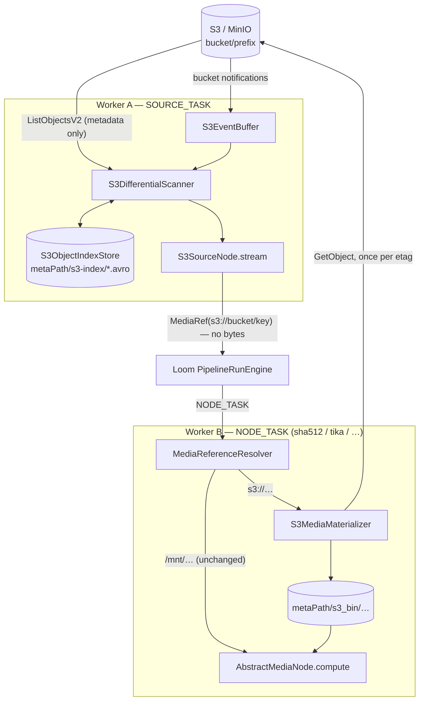

# S3 Source Node — Design Record

> ## 🟢 Status: BUILT and shipped
>
> Kind `s3-source`, flat module `cortex/nodes/s3-source`, package
> `io.metaloom.cortex.node.source.s3`, plus the shared module `cortex/s3-common`
> (`io.metaloom.cortex.s3`). 47 node tests, 78 `s3-common` tests, 9 integration tests against a real
> MinIO container.
>
> **Corrections to earlier revisions of this file, verified against the code:**
>
> 1. 🔴 **The container E2E test never landed.** `S3PipelineContainerExecutionIntegrationTest` does
>    not exist and `MetaLoomTestContext` has no MinIO service. `MinioContainer` is used by exactly
>    two per-node ITs. The central claim of decision #3 — *two workers, no shared media volume* —
>    is therefore **unproven end to end**. See §8.
> 2. 🔴 **`process()` emits only the `media` port.** The typed port model replaced the old
>    `uri`/`bucket`/`key`/`source`/`state` output keys; diff state is now read-side only via
>    `S3SourceNode.lastState(reference)`.
> 3. The resolver split in two: `MediaReferenceResolver` (`cortex/common`, the composite) and
>    `S3MediaReferenceResolver` (`cortex/s3-common`, the S3 branch).
>
> **This file is now a design record, not a plan.** The code is the source of truth.

Read alongside [NODES.md](NODES.md) (the node system, the capability matrix, kind registration),
[../pipeline/NODE_DATA_TYPES.md](../pipeline/NODE_DATA_TYPES.md) (the port/content-type model),
[../../cortex/CONFIGURATION.md](../../cortex/CONFIGURATION.md) (all `CORTEX_S3_*` flags) and
[NODE_S3SINK_PLAN.md](NODE_S3SINK_PLAN.md) (the egress half, which reuses `cortex/s3-common`).

---

## 1. Already implemented

| Item | Where it lives |
|---|---|
| The node — cold `stream()`, `process()`, `lastState()` | `cortex/nodes/s3-source/…/S3SourceNode.java` (`DEFAULT_ID = "s3-source"`, `OUT_MEDIA`) |
| Options + `validate()` | `…/S3SourceNodeOptions.java` (`KEY = "s3-source"`) |
| Selection + scan result value types | `…/S3Selection.java`, `…/S3ScanResult.java` |
| Diff engine: full list / `startAfter` resume / event fast path / reconcile | `…/S3DifferentialScanner.java` |
| Avro index + persistence | `…/S3ObjectIndex.java`, `…/S3ObjectIndexStore.java`, `src/main/avro/s3-object-index.avsc` |
| Dagger module + option deserializer info | `…/S3SourceNodeModule.java` |
| 🔴 **Conditional** kind registration — only when `s3Support.isActive()` | `cortex/cli/…/dagger/RegistryNodeRegistrar.java` (`s3Source(...)` builder) |
| Dagger module collection | `cortex/cli/…/dagger/NodeCollectionModule.java` |
| S3 wiring / `S3Support` provider | `cortex/core/…/cli/dagger/S3Module.java` |
| Worker-level options (16 flags) | `cortex/api/…/option/S3ClientOptions.java`, `…/S3EventOptions.java` |
| CLI flags + env mapping | `cortex/core/…/cli/CortexCLI.java`, `…/cli/EnvDefaultProvider.java` |
| Descriptor (7 parameters, icon `cloud`, `SOURCE`, one `media` output) | `loom-shared/node-model/…/spec/SourceDescriptorProvider.java` |
| Event sources started at boot | `cortex/core/…/impl/boot/CortexBootstrapInitializer.java` |
| Webhook route `POST /s3-events` on the monitoring router (port 8093) | `cortex/s3-common/…/s3/event/WebhookS3EventSource.java` — see [../ops/MONITORING.md](../ops/MONITORING.md) |
| Helm secret for `CORTEX_S3_*` | `helm/cortex/templates/s3-secret.yaml` — see [../helm/HELM_CORTEX.md](../helm/HELM_CORTEX.md) |
| Dev script | `start-minio.sh` |
| Integration test (9 tests, real MinIO) | `integration-test/…/integration/node/S3SourceNodeIntegrationTest.java` + `…/container/MinioContainer.java` |
| Demo pipeline using `s3-source` | `loom/core/…/boot/DemoDatabaseInitializer.java` |
| Customer-facing docs | `website/content/english/docs/nodes/s3-source/index.adoc` |

---

## 2. Scope — this file owns `cortex/s3-common`

No other spec file documents `cortex/s3-common`'s design. `CORTEX.md` and `BUILD.md` list it in
their module maps, `MONITORING.md` covers the webhook route, `HELM_CORTEX.md` covers the secret, and
`METALOOM_ARCHITECTURE.md` names `S3MediaMaterializer` — but the cache layout, the URI seam, the
event buffer semantics and the object-store abstraction are specified **here**. Keep it that way, or
give the module its own file and cross-reference it.

> ⚠️ `cortex/s3-common` is Cortex-side only. Loom's own S3 backend (`loom/services/s3`,
> `S3BinaryStorage`, `asset_pool` + `library.pool_uuid`, `BinaryStorageResolver`) is a **separate
> implementation** owned by [../rest/REST_BINARY_HANDLING.md](../rest/REST_BINARY_HANDLING.md).
> The two do not share code, deliberately — a `loom-service-s3 → cortex-s3-common` dependency would
> tie the server's build to the worker's.

---

## 3. Architecture



Three separable pieces: **media addressing** (§4.1, nothing S3-specific), **the node** (§4.2), and
**worker configuration** (§5).

---

## 4. The decisions worth keeping

### 4.1 `s3://` references and lazy, per-worker materialization

`Paths.get("s3://bucket/key")` yields **`s3:/bucket/key`** — the duplicate slash is collapsed — so a
`java.nio.file.Path` cannot carry a URI. That is why `MediaResolver` takes a `MediaRef` rather than a
`Path`, why `ProcessableMedia.reference()` exists, and why `SourceTaskRunner.toRef` uses
`media.reference()` — **which is what stops enumeration from downloading anything**.

`S3LoomMedia` is a `LoomMedia` whose `reference()` is the URI and whose `path()`/`file()`/`open()`
materialize on first use. It is used at **both** ends: the node builds it from a listing entry, the
resolver builds it from a URI. One class, one materialization path.

Cache layout:

```
metaPath/s3_bin/<first 4 hex of sha256(bucket + "/" + key)>/<sha256(bucket+"/"+key)>-<etag>.<ext>
```

- **The key's file extension is preserved.** `LoomMediaImpl.isVideo()` delegates to
  `FilterHelper.isVideo(path())` — media-type detection is extension-driven, so an object
  materialized as `.bin` would be invisible to every media node. Non-obvious and load-bearing.
- **ETag is in the filename**, so a modified object lands at a different path and a stale copy is
  never served. Strip the surrounding `"` quotes.
- `HashUtils.segmentPath` takes a `SHA512`, unknown before download, so the 4-hex sharding is
  reimplemented over the *key* hash. Shape still matches the `*_bin` convention.
- **Atomic**: download to `<name>.part`, then `Files.move(…, ATOMIC_MOVE)`.
- Guards: `maxObjectSize` checked against the **listed** size before downloading; `maxCacheBytes`
  with an mtime-ordered LRU sweep after each materialization.
- `AbstractFilesystemMedia` caches SHA-512 in the `loom_sha512` xattr, so a re-materialized object
  (same etag → same path) keeps its hash for free.

**This is what removes the shared-storage prerequisite** — each worker's `s3_bin` is its own.
**Consequence:** *every* worker running a node against S3 media needs S3 credentials, not just the
one running `s3-source`.

### 4.2 Change detection — three tiers, one of them correct

Index file: `indexBaseDir.resolve(sha256Hex(endpoint + "/" + bucket + "/" + prefix) + ".avro")` under
`metaPath/s3-index`. Including the endpoint means the same bucket name on two MinIO instances does
not collide.

| Tier | Mechanism | Cost per run | Correct alone? |
|---|---|---|---|
| Baseline | `ListObjectsV2` paginated, diffed against the local index | `N/1000` requests, no bytes | ✅ yes |
| Resume | `ListObjectsV2.startAfter(lastSeenKey)` | only the tail | ❌ misses edits to older keys |
| Push | Bucket notifications → `S3EventBuffer`, then one `HeadObject` per hint | one HEAD per changed object | ❌ notifications can be lost |

The two fast tiers are **accelerators over the correct one**; a mandatory periodic full reconcile
(`reconcileIntervalMs`, default 6h) is what makes the combination correct. Both fast paths are gated
on a full listing having run within that window. S3 Inventory would be a fourth tier; it is AWS-only
and out of scope.

States reuse `io.metaloom.fs.FileState` from the `differential-filesystem-scanner` artifact rather
than a parallel enum, so `emitStates` has an identical shape and shared UI `ENUM_SET` values across
both source nodes. Default `[NEW, MODIFIED]`.

**`MOVED` is never emitted.** S3 has no inode, so a rename is `DELETED` + `NEW`. It could be inferred
by matching `(etag, size)`, but ETag collides across genuinely identical objects — very common in
media archives with duplicate uploads — so the inference invents renames. The value is accepted for
symmetry and never produced.

### 4.3 Events make a run cheap; they do not start one

Loom's scheduler still starts pipeline runs, so the practical result is "scheduled run whose scan is
nearly free". A true watch mode is a Loom scheduling feature and remains out of scope.

---

## 5. Configuration

All connection settings are **worker-level**, never in the pipeline definition: a definition is
stored in Postgres and rendered verbatim in the editor, and `ParameterType` has no `SECRET` value.
Full flag reference: [../../cortex/CONFIGURATION.md](../../cortex/CONFIGURATION.md).

| CLI flag | Env | Default |
|---|---|---|
| `--s3-endpoint` | `CORTEX_S3_ENDPOINT` | — (real AWS) |
| `--s3-region` | `CORTEX_S3_REGION` | `us-east-1` |
| `--s3-access-key` | `CORTEX_S3_ACCESS_KEY` | — → AWS default chain |
| `--s3-secret-key` | `CORTEX_S3_SECRET_KEY` | — → AWS default chain |
| `--s3-path-style` | `CORTEX_S3_PATH_STYLE` | `true` when an endpoint is set (MinIO needs it) |
| `--s3-cache-path` | `CORTEX_S3_CACHE_PATH` | `<meta-path>/s3_bin` |
| `--s3-index-path` | `CORTEX_S3_INDEX_PATH` | `<meta-path>/s3-index` |
| `--s3-max-cache-bytes` | `CORTEX_S3_MAX_CACHE_BYTES` | `53687091200` (50 GiB); `0` disables eviction |
| `--s3-max-object-size` | `CORTEX_S3_MAX_OBJECT_SIZE` | `0` (unbounded) |
| `--s3-reconcile-interval-ms` | `CORTEX_S3_RECONCILE_INTERVAL_MS` | `21600000` (6h) |
| `--s3-events-enabled` | `CORTEX_S3_EVENTS_ENABLED` | `false` |
| `--s3-events-mode` | `CORTEX_S3_EVENTS_MODE` | `WEBHOOK` \| `SQS` |
| `--s3-events-webhook-path` | `CORTEX_S3_EVENTS_WEBHOOK_PATH` | `/s3-events` |
| `--s3-events-webhook-secret` | `CORTEX_S3_EVENTS_WEBHOOK_SECRET` | — (required when enabled; header `X-Cortex-S3-Token`) |
| `--s3-events-queue-url` | `CORTEX_S3_EVENTS_QUEUE_URL` | — (SQS mode) |
| `--s3-events-max-buffered-keys` | `CORTEX_S3_EVENTS_MAX_BUFFERED_KEYS` | `50000`; overflow sets `degraded` |

**Per-instance options** (`S3SourceNodeOptions`, `KEY = "s3-source"`): `bucket`, `prefix`,
`suffixes` (e.g. `mp4,mkv,jpg`), `emitStates`, `startAfter`, `useEvents`. The descriptor adds the
standard `enabled`.

MinIO webhook wiring:

```bash
mc admin config set local notify_webhook:cortex \
    endpoint="http://cortex:8093/s3-events" auth_token="<secret>"
mc admin service restart local
mc event add local/media arn:minio:sqs::cortex:webhook --event put,delete
```

---

## 6. Key Classes Reference

| Class | Package / module | Purpose |
|---|---|---|
| `S3SourceNode` | `io.metaloom.cortex.node.source.s3` (`cortex/nodes/s3-source`) | `MediaSourceNode`; cold `stream()`, single `OUT_MEDIA` port, `lastState()` |
| `S3SourceNodeOptions` | same | `KEY = "s3-source"`, `validate()` |
| `S3SourceNodeModule` | same | Dagger; options + `CortexNodeOptionDeserializerInfo` |
| `S3DifferentialScanner` | same | Full-list / resume / event fast path / reconcile |
| `S3Selection`, `S3ScanResult` | same | Scan input (bucket/prefix/suffixes/emitStates) and output (objects + states + mode) |
| `S3ObjectIndex`, `S3ObjectIndexStore` | same | In-memory index + Avro persistence |
| `S3Uri`, `S3ObjectRef` | `io.metaloom.cortex.s3` (`cortex/s3-common`) | `s3://bucket/key` parsing; listing-entry record |
| `S3ObjectStore`, `AwsS3ObjectStore` | same | Client seam + AWS SDK v2 implementation (`list`, `head`, `download`, `upload`) |
| `S3Support` | same | The always-present "is S3 configured" value; `isActive()`, `store()`, `indexBaseDir()` |
| `S3MediaMaterializer`, `S3LoomMedia` | same | URI → local cache file; lazily-materializing `LoomMedia` |
| `S3MediaReferenceResolver` | same | The `s3://` branch of the composite resolver |
| `S3ContentTypes` | same | Extension → MIME; also used by `s3-sink` |
| `S3EventBuffer`, `S3ChangeHint`, `S3EventParser`, `S3EventSource` | `io.metaloom.cortex.s3.event` | Push-path plumbing; the buffer is `@Singleton` and worker-scoped |
| `WebhookS3EventSource`, `SqsS3EventSource` | same | The two event transports |
| `MediaReferenceResolver` | `io.metaloom.cortex.common.media` (`cortex/common`) | Composite: `s3://` → materializer, else `LoomMediaLoader` |
| `S3ClientOptions`, `S3EventOptions` | `io.metaloom.cortex.api.option` (`cortex/api`) | Worker-level config; **must** live in `api`, not `s3-common` (§7) |
| `S3Module` | `io.metaloom.cortex.cli.dagger` (`cortex/core`) | Provides `S3Support` and the event source |
| `MinioContainer` | `io.metaloom.loom.test.container` (`integration-test`) | Hand-rolled MinIO testcontainer |

---

## 7. Conventions and Gotchas

🔴 **Shading silently breaks the AWS SDK.** AWS SDK v2 picks its HTTP implementation via
`ServiceLoader` on `META-INF/services/software.amazon.awssdk.http.SdkHttpService`. Without a
`ServicesResourceTransformer` in the shade config those files overwrite each other last-wins and the
client dies at runtime with *"Unable to load an HTTP implementation from any provider in the
chain"*. Fixed in `cortex/cli/pom.xml`, and `url-connection-client` is pinned so Netty stays out of
the shaded jar. **This passes every unit and in-process integration test** and fails only in the
shaded container — which is exactly the test that does not exist (§8). `cli/pom.xml`,
`loom/containers/demo/pom.xml` and `loom/containers/server/pom.xml` still share the missing
transformer; latent, not exercised.

| Gotcha | Detail |
|---|---|
| `Paths.get("s3://b/k")` → `s3:/b/k` | Duplicate slashes are collapsed. A `Path` cannot carry a URI — this is why `MediaResolver` takes a `MediaRef` |
| Media type is extension-driven | The materialized cache file **must** keep the object key's extension, or `isVideo()` is false |
| ETag is not a content hash | Multipart ETags are `<md5-of-md5s>-<partcount>`. Opaque change token only — never MD5, never dedup |
| Event keys are URL-encoded | `s3.object.key` must be URL-decoded. MinIO and AWS emit the same envelope shape |
| MinIO needs path-style access | `pathStyleAccess` defaults to `true` whenever `endpoint` is set |
| `S3ClientOptions` lives in `cortex-api` | `CortexOptions` references it and `s3-common` depends on `api`; putting it in `s3-common` inverts the dependency |
| "S3 not configured" is a value, not `null` | Dagger rejects a `null` from `@Provides` without `@Nullable`. `S3Support.isActive()` is the honest shape |
| The kind is capability-gated | `RegistryNodeRegistrar` advertises `s3-source` **only** when `s3Support.isActive()` — announcing a kind the worker cannot serve turns a missing capability into a dead run. `NodeRegistrarTest` pins both directions |
| Source nodes get no `@Binds @IntoSet FilesystemNode` | They are pipeline-level, matching `FilesystemSourceNodeModule` |
| The index store is `new`-ed, not injected | `FilesystemSourceNode` does the same with `AvroFileIndexStore` |
| `lastStates` is per-JVM | When the source's own NODE_TASK lands on another worker, `lastState()` reads `UNKNOWN`. Pre-existing in `filesystem-source`; recorded in [NODES.md](NODES.md) |
| A crash between scan and persist re-emits | At-least-once, which the rest of the pipeline already assumes (nodes upsert on natural keys) |
| `setup-pool.sh` before any IT | And again after any Flyway change — see [../../../.claude/CLAUDE.md](../../../.claude/CLAUDE.md) |

---

## 8. Progress Assessment

### Done

- [x] `cortex/s3-common` — `S3Uri`, `S3ObjectRef`, `S3ObjectStore`/`AwsS3ObjectStore`, `S3Support`,
      `S3MediaMaterializer`, `S3LoomMedia`, `S3MediaReferenceResolver`, `S3ContentTypes` (78 tests)
- [x] Shade fix — `ServicesResourceTransformer` + pinned `url-connection-client` in `cortex/cli`
- [x] Media-addressing seam — `ProcessableMedia.reference()`, `MediaResolver.resolve(MediaRef)`,
      `SourceTaskRunner.toRef`, `MediaReferenceResolver`. No behaviour change when S3 is unconfigured
- [x] `CortexOptions.getS3()` + `S3ClientOptions`/`S3EventOptions` + 16 CLI flags and env vars
- [x] The node — Avro schema, index store, differential scanner, options, Dagger module (47 tests)
- [x] Conditional kind registration + `NodeRegistrarTest` pinning both directions
- [x] Descriptor in `SourceDescriptorProvider` (+ the `filesystem-source` descriptor fix), SPI test
- [x] Event path — buffer, parser, webhook route on the monitoring router, SQS poller, and the
      fast-path + reconcile branch in the scanner
- [x] `MinioContainer`, `start-minio.sh`, `S3SourceNodeIntegrationTest` (9 tests)
- [x] Docs & demo — `website/content/english/docs/nodes/s3-source/`, a demo pipeline in
      `DemoDatabaseInitializer`, [NODES.md](NODES.md), Helm `s3-secret.yaml`

### Open

- [ ] 🔴 **No container E2E.** `S3PipelineContainerExecutionIntegrationTest` was designed and never
      written, and `MetaLoomTestContext` has no MinIO service. Two workers with **no shared media
      volume** (`Set.of("s3-source")` and `Set.of("sha512")`) is the only test that proves the
      lazy-materialization architecture *and* the only test that would catch a shading regression in
      the `metaloom/cortex-server` image. Model it on `PipelineContainerExecutionIntegrationTest`.
- [ ] **`asset_pool.s3_*` stays unused by this node.** Bucket and prefix come from the pipeline
      definition. Linking to a configured pool row is follow-up work, and it interacts with
      [../rest/REST_BINARY_HANDLING.md](../rest/REST_BINARY_HANDLING.md)'s `library.pool_uuid` model
      and with the sink's identical question ([NODE_S3SINK_PLAN.md](NODE_S3SINK_PLAN.md)).
- [ ] **Watch mode.** Events make a run cheap but do not *start* one. A worker-initiated run trigger
      is a Loom scheduling feature.
- [ ] **`MOVED` is never emitted** (§4.2) and **`lastStates` is per-JVM** — both by design, both
      inherited by/from `filesystem-source`.
- [ ] **Versioned buckets / delete markers.** `versionId` is reserved in the Avro schema and unused.
- [ ] **No per-instance `maxObjectSize` override.** The worker-level guard is the only one.
- [ ] **`cortex/s3-common` has no spec file of its own** — it is documented here by convention (§2).

---

## 9. Test Setup

```bash
mvn -q -pl cortex/s3-common,cortex/nodes/s3-source,cortex/node-runtime,cortex/core,cortex/cli -am test
mvn -q -pl loom-shared/node-model test          # descriptors: 26 providers / 41 kinds

./setup-pool.sh                                  # mandatory before any IT
mvn verify -pl integration-test -Dtest='S3*IntegrationTest'
```

| Test | What it guards against |
|---|---|
| `S3SourceNodeTest` | First scan not emitting everything as `NEW`; an unchanged re-run emitting anything; a changed ETag not reading `MODIFIED`; `DELETED` leaking when it is not in `emitStates`; the stream not being cold |
| `S3DifferentialScannerTest` | `startAfter` resume skipping too much; an expired `reconcileIntervalMs` not forcing a full pass; the event fast path running without a recent full listing |
| `S3SourceNodeOptionsTest` | A blank bucket or unknown state name surfacing per-item instead of at pipeline start |
| `S3UriTest`, `S3ObjectRefTest` | URI round-trips; a missing index file not being treated as empty (a first run must see everything as `NEW`) |
| `S3MediaMaterializerTest` | A cache hit downloading; an ETag change not re-downloading; a leftover `.part`; **a lost file extension**; `maxObjectSize` not rejecting before transfer |
| `S3LoomMediaTest`, `S3MediaReferenceResolverTest` | Enumeration accidentally fetching bytes; the resolver not being a pure passthrough when S3 is unconfigured |
| `S3EventParserTest`, `S3EventBufferTest` | Real MinIO **and** AWS payloads; URL-decoded keys; overflow not setting `degraded` |
| `S3SourceNodeIntegrationTest` | The full loop against real MinIO: `NEW` → nothing → exactly one; a materialized `.mp4` reading `isVideo()`; the SHA-512 reaching the `asset` row over REST |

Manual smoke test:

```bash
./start-minio.sh
mc alias set dev http://localhost:9000 minioadmin minioadmin
mc mb dev/media && mc cp /path/to/sample.mp4 dev/media/2026/07/

export CORTEX_S3_ENDPOINT=http://localhost:9000 CORTEX_S3_REGION=us-east-1 \
       CORTEX_S3_ACCESS_KEY=minioadmin CORTEX_S3_SECRET_KEY=minioadmin CORTEX_S3_PATH_STYLE=true
./start-server.sh & ./start-cortex.sh &
```

Build `s3-source(bucket=media, prefix=2026/) → sha512 → tika` and check: run 1 processes the object;
run 2 emits nothing; a fresh `mc cp` makes run 3 process exactly one item;
`~/.cache/metaloom/cortex/meta/s3_bin/**` holds the file **with its `.mp4` extension**; and
`…/meta/s3-index/*.avro` holds the persisted index.

---

## 10. Where do I find …?

| Concept | Path |
|---|---|
| The node | `cortex/nodes/s3-source/src/main/java/io/metaloom/cortex/node/source/s3/S3SourceNode.java` |
| The diff engine | `…/source/s3/S3DifferentialScanner.java` |
| The Avro schema | `cortex/nodes/s3-source/src/main/avro/s3-object-index.avsc` |
| Everything shared with `s3-sink` | `cortex/s3-common/src/main/java/io/metaloom/cortex/s3/` |
| The `s3://` cache layout | `…/s3/S3MediaMaterializer.java` |
| Conditional kind registration | `cortex/cli/src/main/java/io/metaloom/cortex/cli/dagger/RegistryNodeRegistrar.java` |
| `S3Support` provisioning | `cortex/core/src/main/java/io/metaloom/cortex/cli/dagger/S3Module.java` |
| Worker options + env mapping | `cortex/api/…/option/S3ClientOptions.java`, `cortex/core/…/cli/EnvDefaultProvider.java` |
| The webhook route | `cortex/s3-common/…/s3/event/WebhookS3EventSource.java` |
| UI descriptor | `loom-shared/node-model/…/spec/SourceDescriptorProvider.java` |
| The template source node | `cortex/nodes/filesystem-source/…/FilesystemSourceNode.java` |
| MinIO testcontainer | `integration-test/src/test/java/io/metaloom/loom/test/container/MinioContainer.java` |
| Helm secret | `helm/cortex/templates/s3-secret.yaml` |
| Loom's *own* S3 backend (unrelated code) | `loom/services/s3/…/S3BinaryStorage.java`, `loom/services/rest/…/BinaryStorageResolver.java` |
| All `CORTEX_S3_*` flags in one table | [../../cortex/CONFIGURATION.md](../../cortex/CONFIGURATION.md) |

---

_Git HEAD revision: `499f71f7`_
_Last updated: 2026-08-01 (reduced to a design record — shipped work collapsed into one table, `process()` corrected to the single typed `media` port, and the never-written container E2E moved from a ticked box to the headline open item.)_
