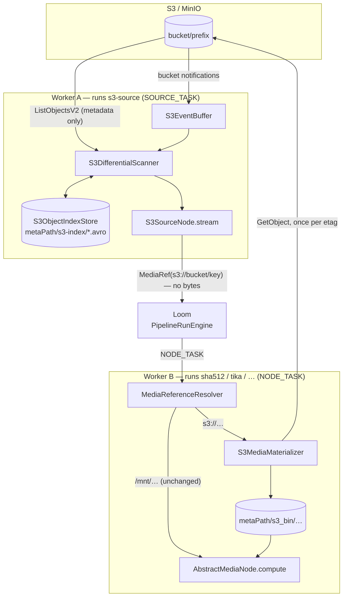

# S3 Source Node — Design & Implementation Plan

> Design document for a new Cortex pipeline source node (`s3-source`) that ingests media
> from **S3-compatible object storage**, picking up only *new or changed* objects on a
> re-run. It comes with two supporting changes: **lazy, per-worker materialization** of
> remote media (so distributing work no longer requires shared storage), and an
> **event-driven** change-detection path so a run need not list the bucket at all.
>
> Read alongside [NODES.md](NODES.md) (the node system) and
> [../pipeline/PIPELINE.md](../pipeline/PIPELINE.md) (the engine that dispatches it).
> The source of truth is the code under `cortex/`; this is a plan, not a record.
>
> **Status: designed, not implemented.** No S3 code exists in the workspace yet.
> §12 is the work checklist.

---

## 1. Motivation

Cortex can only ingest media from a local filesystem.
[`FilesystemSourceNode`](../../../cortex/nodes/filesystem-source) is the only real
`MediaSourceNode`, and every layer beneath it assumes a local path:

- `MediaRef` carries `media.absolutePath()` ([SourceTaskRunner](../../../cortex/node-runtime/src/main/java/io/metaloom/cortex/runtime/SourceTaskRunner.java) `toRef`)
- `NodeTaskRunner` resolves it with `mediaResolver.resolve(Paths.get(task.getMedia().getPath()))`
- `MediaRef`'s own Javadoc states the consequence — *"shared storage is a prerequisite for
  distributing work across more than one Cortex instance"*

Meanwhile Loom already **models** S3 without implementing it:

| Where | What exists |
|---|---|
| `loom/db/flyway/…/V2.20__add_asset_pool.sql` | `asset_pool.s3_bucket` / `s3_region` / `s3_endpoint` + a XOR `CHECK` against `fs_path` |
| `loom-shared/rest-model/…/asset/binary/AssetS3Meta.java` | `{bucket, objectPath}` POJO (duplicated under `asset/location/`) |
| `loom/services/rest/…/AssetBinaryEndpointService.java` | three branches that log *"S3 support has not yet been implemented"* |
| `loom-ui/src/features/assetPools/AssetPoolsView.tsx` | the full S3 asset-pool form; `AssetPoolType = "filesystem" \| "s3"` |
| `bom/pom.xml:250-254` | `software.amazon.awssdk:s3` under `${aws.sdk.version}` = 2.29.70, **consumed by nothing** |

So the schema, the REST model, the UI form and the dependency are all in place, and the
runtime is absent. This node is the first real consumer.

### The two problems it has to solve

1. **Re-runs must not reprocess the bucket.** `filesystem-source` solves the equivalent
   problem with a persisted Avro index and the `differential-filesystem-scanner`; S3 needs
   the same idea keyed on `(key, etag, size)` instead of `(st_dev, st_ino, mtime, size)`.
2. **Objects have to become local files.** Every downstream node reads a `java.nio.file.Path`
   — `LoomMediaImpl.isVideo()` even delegates to `FilterHelper.isVideo(path())`. Somebody has
   to download the bytes, and *where* that happens decides whether multi-worker runs need
   shared storage.

### Non-goals

- **A Loom binary-ingest endpoint.** `AssetBinaryEndpointService`'s S3 stubs stay stubs.
  This node reads *into* the pipeline; writing produced bytes *out* is the `s3-sink` sketch (§11).
- **Asset-pool linkage.** The node takes bucket/prefix from the pipeline definition, not from
  an `asset_pool` row. Wiring the two together is deliberate follow-up work (§13).
- **Watch mode.** Events make a *run* cheap; they do not *start* a run. Loom's scheduler still
  owns that (§5.4).
- **Versioned buckets / delete markers.** `versionId` is reserved in the Avro schema and unused.

---

## 2. Decisions

> **Status: agreed with the user before design.** The rest of the document follows from these.

| # | Decision | Choice | Why |
|---|---|---|---|
| 1 | Scope | `s3-source` in full; `s3-sink` sketched | The sink has an unresolved dependency on whether Loom grows a real ingest endpoint |
| 2 | Change detection | Differential LIST + persisted index **and** S3 event notifications | Index alone is correct but O(N) requests per run; events alone are lossy. Together: fast *and* correct |
| 3 | Materialization | `s3://` URIs in `MediaRef` + a lazy per-worker `MediaResolver` | Removes the shared-storage prerequisite, which is the main architectural win |
| 4 | Credentials | Worker-level `CortexOptions`, never in the pipeline definition | NODES.md §5.1; also avoids secrets in Postgres and in the editor, where `ParameterType` has no `SECRET` value |

---

## 3. Architecture



Three pieces, each separately useful and separately testable:

1. **Media addressing** (§4) — `MediaRef` learns to carry a URI; a composite resolver
   materializes it on whichever worker needs it. *Nothing to do with S3 specifically.*
2. **The node** (§5) — differential listing, index, event fast path.
3. **Configuration** (§6) — worker-level connection settings.

### Does the whole bucket have to be scanned?

**A LIST is metadata-only.** A full pass costs `ceil(N/1000)` requests and zero bandwidth —
negligible for thousands of objects, painful for tens of millions. Three tiers, all designed here:

| Tier | Mechanism | Cost per run | Correct alone? |
|---|---|---|---|
| Baseline | `ListObjectsV2` paginated, diffed against the local index | `N/1000` requests, no bytes | ✅ yes |
| Resume | `ListObjectsV2.startAfter(lastSeenKey)` | only the tail | ❌ misses edits to older keys |
| Push | Bucket notifications → `S3EventBuffer`, then one `HeadObject` per hint | one HEAD per changed object | ❌ notifications can be lost |

The two fast tiers are **accelerators layered over the correct one**. A mandatory periodic
full reconcile (`reconcileIntervalMs`, default 6h) is what makes the combination correct.
AWS S3 Inventory would be a fourth tier for genuinely huge buckets; it is AWS-only (MinIO does
not implement it) and is out of scope.

---

## 4. Media addressing: `s3://` references and lazy materialization

### 4.1 The blocker

`Paths.get("s3://bucket/key")` yields **`s3:/bucket/key`** — the duplicate slash is collapsed —
and `toAbsolutePath()` then prepends the CWD. Verified on this JDK. A `java.nio.file.Path`
therefore **cannot** carry a URI, so `NodeTaskRunner.MediaResolver` must stop taking one.

### 4.2 Changes to existing code

| File | Change |
|---|---|
| `cortex/api/…/media/ProcessableMedia.java` | Add `default String reference() { return absolutePath(); }` — the location-independent identity of the media. Every existing implementation keeps today's behaviour. |
| `cortex/node-runtime/…/NodeTaskRunner.java` (interface at :61, call at :80) | `MediaResolver.resolve(Path)` → `resolve(MediaRef)`. `MediaRef` is already on this module's classpath (`loom-shared/pipeline-model`) and carries `size` + `sha512`, both useful to a materializer. |
| `cortex/node-runtime/…/SegmentTaskRunner.java:74` | same call-site change |
| `cortex/node-runtime/…/SourceTaskRunner.java:168` | `toRef` uses `media.reference()`. **This is what stops enumeration from downloading anything.** |
| `cortex/core/…/PipelineTaskHandler.java:76,79` | inject a `MediaReferenceResolver` instead of `mediaLoader::load` |

`MediaReferenceResolver` (new, `cortex/common`) composes: `S3Uri.isS3(ref)` → the S3
materializer; otherwise `LoomMediaLoader.load(Paths.get(ref))`. **When no S3 config is present
the S3 branch is absent and the resolver is a pure passthrough**, so this step is a no-op
refactor that can land and be verified on its own.

### 4.3 New module `cortex/s3-common` (artifact `cortex-s3-common`)

A module of its own because both `cortex/core` (the resolver — needed on *every* worker) and
`cortex/nodes/s3-source` (the listing) depend on it, and `cortex/core` must not depend on a
node module.

| Class | Responsibility |
|---|---|
| `S3Uri` | Parse/format `s3://bucket/key`; `bucket()`, `key()`, `static boolean isS3(String)` |
| `S3ObjectRef` | `record (bucket, key, etag, size, lastModifiedMillis)` |
| `S3ObjectStore` | Seam: `S3Listing list(prefix, continuationToken, startAfter)`, `S3ObjectRef head(key)`, `void download(key, Path target)` |
| `AwsS3ObjectStore` | Implementation over `software.amazon.awssdk.services.s3.S3Client` |
| `S3ClientOptions` | Worker-level connection + cache config (§6) |
| `S3MediaMaterializer` | URI → local cache file: caching, atomic writes, size guards |
| `S3LoomMedia` | `LoomMedia` whose `reference()` is the URI and whose `path()`/`file()`/`open()`/`absolutePath()` materialize on first use |

`S3ObjectStore` follows the injectable-client convention already used by `TtsClient`,
`SentimentClient`, `SmolVLMClient` and `VlmChatClient` — a narrow seam so unit tests use an
in-memory fake and only the integration test needs MinIO.

`S3LoomMedia` is used at **both** ends: the source node builds it from a listing entry, and the
resolver builds it from a URI. One class, one materialization path.

### 4.4 Cache layout

```
metaPath/s3_bin/<first 4 hex of sha256(bucket + "/" + key)>/<sha256(bucket+"/"+key)>-<etag>.<ext>
```

- **The key's file extension is preserved.** `LoomMediaImpl.isVideo()` delegates to
  `FilterHelper.isVideo(path())` — media-type detection is extension-driven, so an object
  materialized as `.bin` would be invisible to every media node. Non-obvious and load-bearing.
- **ETag is in the filename**, so a modified object lands at a different path and a stale copy
  is never served. Strip the surrounding `"` quotes.
- `HashUtils.segmentPath` (sibling repo `hash-utils`) takes a `SHA512`, which is unknown before
  download, so the 4-hex sharding is reimplemented over the *key* hash. Shape still matches the
  `*_bin` convention in `ThumbnailNode` / `TtsNode` / `ImageGenNode` / `ScriptNode`.
- **Atomic**: download to `<name>.part`, then `Files.move(…, ATOMIC_MOVE)`. Two concurrent node
  tasks on the same object are safe.
- **Cache hit** = file exists at the etag-keyed path → zero network calls.
- Guards: `maxObjectSize` checked against the listed size *before* downloading; `maxCacheBytes`
  with an mtime-ordered LRU sweep after each materialization.
- Side benefit: `AbstractFilesystemMedia` caches SHA-512 in the `loom_sha512` xattr on the local
  file, so a re-materialized object (same etag → same path) keeps its hash for free.

**This is what removes the shared-storage prerequisite** — each worker's `s3_bin` is its own.

---

## 5. The `s3-source` node

New **flat** module `cortex/nodes/s3-source`, artifact `cortex-s3-source-node`, package
`io.metaloom.cortex.node.source.s3`. Flat matches `filesystem-source`; the `core` submodule
split other nodes use is vestigial since the `*-api` modules merged into `loom-shared/node-model`.

### 5.1 Change detection

Index file: `indexBaseDir.resolve(sha256Hex(endpoint + "/" + bucket + "/" + prefix) + ".avro")`
under `metaPath/s3-index` — mirroring `FilesystemSourceNode.indexFileFor(root)`. Including the
endpoint means the same bucket name on two MinIO instances does not collide.

| State | Condition |
|---|---|
| `NEW` | key absent from the index |
| `MODIFIED` | key present, `etag` **or** `size` differs |
| `PRESENT` | key present, identical |
| `DELETED` | in the index but absent from the listing (or an `ObjectRemoved` event) |
| `MOVED` | **never produced** — see below |

**On `MOVED`.** S3 has no inode, so a rename is `DELETED` + `NEW`. It *could* be inferred by
matching a removed key against a new key sharing `(etag, size)`, but ETag collides across
genuinely identical objects — very common in media archives with duplicate uploads — so the
inference produces false renames. The option value is accepted for symmetry with
`filesystem-source` and never emitted.

**Reuse `io.metaloom.fs.FileState`** (`PRESENT, MOVED, DELETED, MODIFIED, NEW, UNKNOWN`) from the
`differential-filesystem-scanner` artifact rather than defining a parallel enum: the `emitStates`
option then has an identical shape, identical validation messages and shared UI `ENUM_SET` values
across both source nodes. Depending on that artifact for one enum is cheaper than a private copy
that drifts.

Default `emitStates`: `[NEW, MODIFIED]`.

### 5.2 `stream()` — cold, three paths

```java
@Override
public Flowable<LoomMedia> stream() {
    return Flowable.defer(() -> {
        lastStates.clear();
        return Flowable.fromIterable(scanner.scan());   // picks its own path, below
    }).map(this::toMedia);                              // S3LoomMedia — no bytes fetched
}
```

`S3DifferentialScanner.scan()` selects:

1. **Event fast path** — `useEvents`, the buffer for this `(bucket, prefix)` is non-empty and
   not degraded, *and* a full scan ran within `reconcileIntervalMs`: drain the buffer,
   `HeadObject` each hinted key, diff, persist. **No LIST at all.**
2. **Resume path** — `startAfter` enabled and the index records a `lastSeenKey`:
   `ListObjectsV2.startAfter(lastSeenKey)`. Opt-in; the reconcile interval still forces
   periodic full passes because this path cannot see edits to older keys.
3. **Full differential list** — paginated `ListObjectsV2`, diff everything, persist, stamp
   `lastFullScanAt`.

Every path persists the updated index and clears only the buffer entries it consumed. A crash
between scan and persist re-emits already-processed objects — at-least-once, which the rest of
the pipeline already assumes (nodes upsert on natural keys).

`process(media, upstream)` returns outputs `uri`, `bucket`, `key`, `source=s3`, `state`.

> ⚠️ **Inherited limitation, not introduced here.** `lastStates` is an in-JVM map, so when the
> source node's own NODE_TASK is dispatched to a different worker than the one that ran the
> SOURCE_TASK, `state` reads `UNKNOWN`. `FilesystemSourceNode` has exactly the same hole. Record
> it in [NODES.md](NODES.md) §10; do not fix it here.

### 5.3 Event-driven change detection

| Class (in `cortex/s3-common`) | Responsibility |
|---|---|
| `S3EventBuffer` | `@Singleton`, worker-scoped. `Map<bucket/prefix, Set<S3ChangeHint>>`, bounded by `maxBufferedKeys` (default 50 000). Overflow sets a `degraded` flag forcing the next run onto the full-list path. |
| `S3EventSource` | `void start()` / `void stop()` — feeds the buffer |
| `WebhookS3EventSource` | A Vert.x route on the **existing** monitoring router |
| `SqsS3EventSource` | Long-polls an SQS queue (AWS: S3 → SQS, or S3 → SNS → SQS) |
| `S3EventParser` | Parses the S3 event envelope — `Records[].eventName`, `s3.bucket.name`, URL-decoded `s3.object.key`, `s3.object.eTag`, `s3.object.size`. **MinIO and AWS emit the same shape.** |

**Webhook path.** `MonitoringService` already runs a Vert.x `Router` on port 8093 and registers
`HealthEndpoint` / `MetricsEndpoint` through `register(router)`. `WebhookS3EventSource` follows
that pattern with `POST /s3-events`, authenticated by a constant-time comparison of an
`X-Cortex-S3-Token` header. The route is not registered at all when events are disabled, so
nothing new is exposed by default.

MinIO side:

```bash
mc admin config set local notify_webhook:cortex \
    endpoint="http://cortex:8093/s3-events" auth_token="<secret>"
mc admin service restart local
mc event add local/media arn:minio:sqs::cortex:webhook --event put,delete
```

**SQS path.** Needs `software.amazon.awssdk:sqs` added to `bom/pom.xml` beside the existing `s3`
entry (same `${aws.sdk.version}`). One daemon thread long-polls with `waitTimeSeconds=20`,
parses, buffers, and deletes each message only after buffering it.

### 5.4 What events do and do not give you

They make a *run* cheap. They do **not** trigger a run — Loom's scheduler still starts pipeline
runs, so the practical result is "scheduled run whose scan is nearly free". A true watch mode
(the worker asking Loom to start a run when objects land) is a Loom scheduling feature and is
explicitly out of scope; §13 records it.

---

## 6. Configuration

Per [NODES.md](NODES.md) §5.1: *options describing the worker's environment are per-worker;
options that **are** the work are per-instance.*

### 6.1 Worker-level — new `S3ClientOptions` on `CortexOptions`, alongside `loom`

| Field | Env | Default |
|---|---|---|
| `endpoint` | `CORTEX_S3_ENDPOINT` | null (real AWS) |
| `region` | `CORTEX_S3_REGION` | `us-east-1` |
| `accessKey` | `CORTEX_S3_ACCESS_KEY` | null → AWS default chain |
| `secretKey` | `CORTEX_S3_SECRET_KEY` | null → AWS default chain |
| `pathStyleAccess` | `CORTEX_S3_PATH_STYLE` | `true` when `endpoint` is set (MinIO needs it) |
| `cachePath` | `CORTEX_S3_CACHE_PATH` | `metaPath/s3_bin` |
| `indexPath` | `CORTEX_S3_INDEX_PATH` | `metaPath/s3-index` |
| `maxCacheBytes` | `CORTEX_S3_MAX_CACHE_BYTES` | 53687091200 (50 GiB) |
| `maxObjectSize` | `CORTEX_S3_MAX_OBJECT_SIZE` | 0 (unbounded) |
| `reconcileIntervalMs` | `CORTEX_S3_RECONCILE_INTERVAL_MS` | 21600000 (6h) |
| `events.enabled` | `CORTEX_S3_EVENTS_ENABLED` | `false` |
| `events.mode` | `CORTEX_S3_EVENTS_MODE` | `WEBHOOK` (or `SQS`) |
| `events.webhookPath` | `CORTEX_S3_EVENTS_WEBHOOK_PATH` | `/s3-events` |
| `events.webhookSecret` | `CORTEX_S3_EVENTS_WEBHOOK_SECRET` | null (required when enabled) |
| `events.queueUrl` | `CORTEX_S3_EVENTS_QUEUE_URL` | null |
| `events.maxBufferedKeys` | `CORTEX_S3_EVENTS_MAX_BUFFERED_KEYS` | 50000 |

Credentials: explicit `accessKey`/`secretKey` → `StaticCredentialsProvider`; otherwise
`DefaultCredentialsProvider` (env, profile, instance role, IRSA). Add the CLI flags to
`CortexCLI` and the loading to `CortexOptionsLoader`, matching the existing
`--node-whitelist` / `CORTEX_NODE_WHITELIST` pattern.

### 6.2 Pipeline-node level (`S3SourceNodeOptions`, `KEY = "s3-source"`)

`bucket`, `prefix`, `suffixes` (e.g. `mp4,mkv,jpg`), `emitStates`, `startAfter` (boolean),
`useEvents` (boolean), `maxObjectSize` (override), `enabled`.

**No credentials in the pipeline definition.** They would be stored in Postgres and rendered in
the pipeline editor, where `ParameterType` has no `SECRET`/`PASSWORD` value
(`STRING, INTEGER, NUMBER, BOOLEAN, ENUM, ENUM_SET, CODE, JSON`). This choice means **no new
`ParameterType` is needed**.

> **Deployment consequence.** Because materialization is lazy, *every* worker running a node
> against S3 media needs S3 credentials — not just the one running `s3-source`. Document this in
> the website docs and in `helm/`.

### 6.3 UI descriptor

Added to `SourceDescriptorProvider` (which already carries `filesystem-source` and `loom-fetch`,
so no new SPI registration): kind `s3-source`, icon `cloud`, category `SOURCE`, no inputs, one
output `new NodeOutput("media", MEDIA_ANY)`, `defaultConcurrency` 1, `defaultMode` SEQUENTIAL.
Parameters: `enabled`, `bucket`, `prefix`, `suffixes`, `emitStates` (`ENUM_SET`), `useEvents`,
`startAfter`.

**Also fix the stale `filesystem-source` descriptor in the same change** — it exposes only
`enabled` and `path`, missing `pathGlobs`, `emitStates` and `indexPath` that the node has
supported for a while. Six lines, and the two source descriptors should be symmetric.

---

## 7. Key Classes Reference

| Class | Package / module | Purpose |
|---|---|---|
| `S3SourceNode` | `io.metaloom.cortex.node.source.s3` (`cortex/nodes/s3-source`) | The `MediaSourceNode`; cold `stream()`, `process()` outputs |
| `S3SourceNodeOptions` | same | `KEY = "s3-source"`, `validate()` |
| `S3SourceNodeModule` | same | Dagger; options + `CortexNodeOptionDeserializerInfo`. **No** `@Binds @IntoSet FilesystemNode` |
| `S3DifferentialScanner` | same | Diff engine: full-list / resume / event fast path / reconcile |
| `S3ObjectIndex`, `S3ObjectIndexStore` | same | In-memory index + Avro persistence (`src/main/avro/s3-object-index.avsc`) |
| `S3Uri`, `S3ObjectRef` | `io.metaloom.cortex.s3` (`cortex/s3-common`) | URI parsing; listing entry record |
| `S3ObjectStore`, `AwsS3ObjectStore` | same | Client seam + AWS SDK v2 implementation |
| `S3MediaMaterializer`, `S3LoomMedia` | same | URI → local cache file; lazily-materializing `LoomMedia` |
| `S3ClientOptions` | same | Worker-level connection/cache config |
| `S3EventBuffer`, `S3EventSource`, `S3EventParser` | same | Push-path plumbing |
| `WebhookS3EventSource`, `SqsS3EventSource` | same | Two event transports |
| `MediaReferenceResolver` | `io.metaloom.cortex.common.media` (`cortex/common`) | Composite: `s3://` → materializer, else `LoomMediaLoader` |
| `MinioContainer` | `io.metaloom.loom.test.container` (`integration-test`, test scope) | Hand-rolled MinIO testcontainer |

Registration points that each need an `s3-source` twin:

| File | What to add |
|---|---|
| `cortex/nodes/pom.xml` | `<module>s3-source</module>` |
| `cortex/cli/…/dagger/NodeCollectionModule.java` | the Dagger module |
| `cortex/cli/…/dagger/RegistryNodeRegistrar.java:78` | `factory.register("s3-source", …)` + a private builder mirroring `filesystemSource(...)` at :99-129 |
| `cortex/cli/…/dagger/PipelineNodeFactoryModule.java` | constructor plumbing |
| `cortex/cli/src/test/…/NodeRegistrarTest.java` | the registered-kind assertion |
| `loom-shared/node-model/…/SourceDescriptorProvider.java` | the descriptor |
| `integration-test/pom.xml` | `cortex-s3-source-node`, `cortex-s3-common` |

---

## 8. Test Setup

### 8.1 Unit (no containers)

Drive `S3SourceNode` through an in-memory `FakeS3ObjectStore`, mirroring the 22 assertions in
`FilesystemSourceNodeTest`:

- first scan emits everything as `NEW`; unchanged re-run emits nothing
- added object → only that one; changed ETag → `MODIFIED`; removed object → `DELETED`, and only
  when `DELETED` is in `emitStates`
- `emitStates` including `PRESENT` keeps everything flowing every run
- the stream is **cold** — an object put after `stream()` but before subscription is still seen
- `startAfter` resume skips history; an expired `reconcileIntervalMs` forces a full pass
- validation rejections: blank bucket, unknown state name, missing index dir
- `process()` reports `uri` / `bucket` / `key` / `source=s3` / `state`

Plus `S3UriTest`, `S3ObjectIndexStoreTest` (round-trip; missing file → empty index, so a first
run sees everything as NEW), `S3MediaMaterializerTest` (cache miss downloads, cache hit does not,
ETag change re-downloads, no `.part` left behind, extension preserved, `maxObjectSize` rejects
before transfer), `S3EventParserTest` (real MinIO **and** AWS payloads, URL-decoded keys),
`S3EventBufferTest` (overflow → degraded), `S3SourceNodeOptionsTest`.

Also: update the `MediaResolver` tests in `cortex/node-runtime` for the new signature, and add
`MediaReferenceResolverTest` (passthrough with no S3 configured; dispatch on `s3://`).

### 8.2 MinIO container

Testcontainers is pinned at **1.17.6** — four inline literals in `bom/pom.xml`, one more in
`loom-test-env/pom.xml` — which predates `MinIOContainer`. **Do not bump it in this change**: the
bump also reaches `e2e-test`, `cortex/core`, `cortex/cli`, `loom-client` and the jOOQ codegen
plugin's own `PostgreSQLContainer`, i.e. unrelated blast radius for a node change. Hand-roll one
instead, exactly as `LoomContainer` and `CortexContainer` already are:

```java
public class MinioContainer extends GenericContainer<MinioContainer> {
    public static final String IMAGE = System.getProperty("minio.image",
        "minio/minio:RELEASE.2025-04-22T22-12-26Z");
    public static final int PORT = 9000;

    public MinioContainer(Network network) {
        super(DockerImageName.parse(IMAGE));
        withNetwork(network).withNetworkAliases("minio")
            .withEnv("MINIO_ROOT_USER", "minioadmin")
            .withEnv("MINIO_ROOT_PASSWORD", "minioadmin")
            .withCommand("server", "/data", "--console-address", ":9001")
            .withExposedPorts(PORT)
            .waitingFor(Wait.forHttp("/minio/health/live").forPort(PORT)
                .withStartupTimeout(Duration.ofMinutes(2)));
    }

    public String endpoint() { return "http://" + getHost() + ":" + getMappedPort(PORT); }
    public String internalEndpoint() { return "http://minio:" + PORT; }
}
```

### 8.3 Integration — `S3SourceNodeIntegrationTest`

In `integration-test/src/test/java/io/metaloom/loom/test/integration/node/`, extending
`AbstractNodeIntegrationTest` (in-process Loom + pooled Postgres, no Loom container) with a
`MinioContainer`. Put real fixture media in a bucket via the SDK, then assert:

1. run 1 emits all objects as `NEW`
2. run 2 emits nothing
3. after one more `putObject`, run 3 emits exactly that one
4. materializing an item and driving a real `SHA512Node` with a real `LoomHttpClient` puts the
   hash on the `asset` row and reads back over REST — the shape every other `*NodeIntegrationTest` uses
5. `isVideo()` is true for the materialized `.mp4`, proving the extension survived

### 8.4 Container E2E — the test that proves the architecture

Extend `MetaLoomTestContext` with an optional MinIO service on the shared `Network`, and add
`S3PipelineContainerExecutionIntegrationTest` modelled on
`PipelineContainerExecutionIntegrationTest`: two workers with **no shared media volume** —
`it-cortex-s3-source` (`Set.of("s3-source")`) and `it-cortex-hash` (`Set.of("sha512")`) — asserting
the run completes with hashes persisted.

Without this test the central claim of decision #3 is unverified, so it is not optional.

### 8.5 Dev convenience

`start-minio.sh` at the repo root, beside `start-postgres.sh`:

```bash
docker run -d --name minio-dev -p 9000:9000 -p 9001:9001 \
  -e MINIO_ROOT_USER=minioadmin -e MINIO_ROOT_PASSWORD=minioadmin \
  minio/minio:RELEASE.2025-04-22T22-12-26Z server /data --console-address ":9001"
```

plus `mc` commands to create a `media` bucket, upload fixtures and optionally wire the webhook.

### 8.6 Commands

```bash
mvn -q -pl cortex/s3-common,cortex/nodes/s3-source,cortex/node-runtime,cortex/core,cortex/cli -am test
mvn -q -pl loom-shared/node-model test

./setup-pool.sh                                   # mandatory before any IT — see ../../../.claude/CLAUDE.md
./it.sh                                           # or: mvn verify -pl integration-test -Dtest='S3*IntegrationTest'
```

Manual smoke test:

```bash
./start-minio.sh
mc alias set dev http://localhost:9000 minioadmin minioadmin
mc mb dev/media && mc cp /path/to/sample.mp4 dev/media/2026/07/

export CORTEX_S3_ENDPOINT=http://localhost:9000 CORTEX_S3_REGION=us-east-1 \
       CORTEX_S3_ACCESS_KEY=minioadmin CORTEX_S3_SECRET_KEY=minioadmin \
       CORTEX_S3_PATH_STYLE=true
./start-server.sh & ./start-cortex.sh &
```

In the pipeline editor build `s3-source(bucket=media, prefix=2026/) → sha512 → tika`, run it, and check:

- run 1 processes the object and the `asset` row carries the SHA-512
- run 2 emits nothing (index hit) — a zero-item source in the run view
- `mc cp another.mp4 dev/media/2026/07/` → run 3 processes exactly one item
- `~/.cache/metaloom/cortex/meta/s3_bin/**` holds the materialized file **with its `.mp4` extension**
- `~/.cache/metaloom/cortex/meta/s3-index/*.avro` holds the persisted index
- with `useEvents=true` and the webhook wired, a fresh `mc cp` makes the next run process it
  without a LIST (visible in the worker log)

---

## 9. Conventions and Gotchas

### 🔴 Shading silently breaks the AWS SDK

`cortex/cli/pom.xml:91-116` shades with a `ManifestResourceTransformer` and **no
`ServicesResourceTransformer`**. AWS SDK v2 picks its HTTP implementation via `ServiceLoader` on
`META-INF/services/software.amazon.awssdk.http.SdkHttpService`; without the services transformer
those files overwrite each other last-wins and the client dies at runtime with
`SdkClientException: Unable to load an HTTP implementation from any provider in the chain`.

This passes every unit test and every in-process integration test — they run on a normal
classpath — and fails **only** in the shaded `metaloom/cortex-server` container, i.e. exactly in
§8.4. Fix it in the first implementation step:

```xml
<transformer implementation="org.apache.maven.plugins.shade.resource.ServicesResourceTransformer"/>
```

and pin one HTTP client rather than relying on the chain: `software.amazon.awssdk:url-connection-client`
with `S3Client.builder().httpClientBuilder(UrlConnectionHttpClient.builder())`. It keeps Netty out
of the shaded jar entirely, and the workload is a few large sequential transfers rather than
high-concurrency small requests. Exclude the SDK's bundled `apache-client` / `netty-nio-client`
transitives to keep the jar honest.

`cli/pom.xml`, `loom/containers/demo/pom.xml` and `loom/containers/server/pom.xml` share the same
missing transformer. Only `cortex/cli` matters here, but the latent defect is worth recording.

### Other gotchas

| Gotcha | Detail |
|---|---|
| `Paths.get("s3://b/k")` → `s3:/b/k` | Duplicate slashes are collapsed. A `Path` cannot carry a URI — this is why `MediaResolver` changes signature (§4.1). |
| Media type is extension-driven | `LoomMediaImpl.isVideo()` → `FilterHelper.isVideo(path())`. The materialized cache file **must** keep the object key's extension. |
| ETag is not a content hash | Multipart ETags are `<md5-of-md5s>-<partcount>`. Use it strictly as an opaque change token — never as MD5, never for dedup. |
| Event keys are URL-encoded | `s3.object.key` in the event envelope must be URL-decoded before use. |
| MinIO needs path-style access | `pathStyleAccess` defaults to `true` whenever `endpoint` is set. |
| Source nodes get no `@Binds @IntoSet FilesystemNode` | They are pipeline-level, not `FilesystemNode`s — matching `FilesystemSourceNodeModule`. |
| The index store is `new`-ed, not injected | `FilesystemSourceNode` does the same with `AvroFileIndexStore`; keep the symmetry. |
| `setup-pool.sh` before any IT | And again after any Flyway change — see [../../../.claude/CLAUDE.md](../../../.claude/CLAUDE.md). |

---

## 10. Where do I find …?

| Concept | Path |
|---|---|
| The template source node | `cortex/nodes/filesystem-source/src/main/java/io/metaloom/cortex/node/source/fs/FilesystemSourceNode.java` |
| Its differential scan | same file, `differentialScan()` / `indexFileFor()` |
| The Avro index precedent | `differential-filesystem-scanner` (sibling repo), `linux/impl/AvroFileIndexStore.java` + `src/main/avro/linux-file-index.avsc` |
| Kind registration | `cortex/cli/src/main/java/io/metaloom/cortex/cli/dagger/RegistryNodeRegistrar.java:78` |
| SOURCE_TASK dispatch | `cortex/core/…/loom/PipelineTaskHandler.java` `resolveSourceStream()` |
| Source batching + ACK | `cortex/node-runtime/…/SourceTaskRunner.java` |
| NODE_TASK media resolution | `cortex/node-runtime/…/NodeTaskRunner.java:80` |
| UI descriptors | `loom-shared/node-model/…/spec/SourceDescriptorProvider.java` |
| Parameter types | `loom-shared/node-model/…/spec/ParameterType.java` |
| Worker options | `cortex/api/…/option/CortexOptions.java`; loading in `cortex/common/…/option/CortexOptionsLoader.java` |
| Monitoring HTTP router (webhook host) | `cortex/core/…/monitoring/MonitoringService.java` |
| Local `*_bin` cache precedent | `cortex/nodes/thumbnail/core/…/ThumbnailNode.java:116-122` |
| Container test harness | `integration-test/src/test/java/io/metaloom/loom/test/container/MetaLoomTestContext.java` |
| Per-node IT base | `integration-test/…/integration/node/AbstractNodeIntegrationTest.java` |
| AWS SDK version | `bom/pom.xml:26` (`aws.sdk.version`), entry at `:250-254` |
| Loom's S3 asset-pool columns | `loom/db/flyway/…/V2.20__add_asset_pool.sql` |

---

## 11. `s3-sink` sketch (follow-up, not part of this change)

[NODES.md](NODES.md) §2 records the gap: `ThumbnailNode`, `TtsNode`, `ImageGenNode` and
`ScriptNode` produce bytes that stay in local `*_bin` caches with a ledger-only
`asset_node_result` row, because *"there is no byte-ingest endpoint for produced media"*.

Shape: a `CortexNodeAdapter`-wrapped `AbstractMediaNode` (kind `s3-sink`, module
`cortex/nodes/s3-sink`) reading upstream path outputs (`thumbnail_path`, `tts_path`,
`imagegen_path`, script image outputs) via `ctx.upstreamOutput(nodeId, key)`, configured as an
ordered `sources` list exactly like `SentimentNodeOptions.textSources`. It uploads each to
`s3://<bucket>/<keyTemplate>` (template over `{sha512}`, `{nodeId}`, `{ext}`), reusing
`S3ObjectStore` and `S3ClientOptions` from `cortex/s3-common`, emits `s3_uri` outputs, and
persists an `asset_json_comp` (`schemaType = s3-artifact`, `variant` = source node id) plus the
ledger.

Open before it can be planned properly: whether Loom should instead grow the real binary-ingest
endpoint `AssetBinaryEndpointService` stubs out, and how the result relates to the existing
`asset_pool.s3_*` columns and the `AssetS3Meta` REST model.

---

## 12. Progress Assessment

- [ ] **`cortex/s3-common` module** — `S3Uri`, `S3ObjectRef`, `S3ObjectStore`, `AwsS3ObjectStore`,
      `S3ClientOptions`, `S3MediaMaterializer`, `S3LoomMedia` + unit tests. Add
      `software.amazon.awssdk:sqs` and `:url-connection-client` to `bom/pom.xml`; register the
      module in `cortex/pom.xml`.
- [ ] **Fix the shade config** — add `ServicesResourceTransformer` to `cortex/cli/pom.xml` and pin
      `url-connection-client`. Do this in the same step; see §9.
- [ ] **Media-addressing seam** — `ProcessableMedia.reference()`,
      `MediaResolver.resolve(MediaRef)`, `NodeTaskRunner`, `SegmentTaskRunner`,
      `SourceTaskRunner.toRef`, `PipelineTaskHandler`, `MediaReferenceResolver` + tests.
      *No behaviour change when S3 is unconfigured.*
- [ ] **`CortexOptions.s3`** + `CortexOptionsLoader` + `CortexCLI` flags and env vars (§6.1)
- [ ] **`cortex/nodes/s3-source`** — Avro schema, `S3ObjectIndexStore`, `S3DifferentialScanner`
      (full-list + `startAfter` only at this stage), `S3SourceNode`, options, Dagger module, unit tests
- [ ] **Kind registration** — `cortex/nodes/pom.xml`, `NodeCollectionModule`,
      `RegistryNodeRegistrar`, `PipelineNodeFactoryModule`, `NodeRegistrarTest`
- [ ] **UI descriptor** — `SourceDescriptorProvider` (+ the stale `filesystem-source` fix),
      i18n keys, `NodeDescriptorServiceLoaderTest`
- [ ] **Event path** — `S3EventBuffer`, `S3EventSource`, `S3EventParser`, `WebhookS3EventSource`
      on the `MonitoringService` router, `SqsS3EventSource`, and the fast-path + reconcile branch
      in `S3DifferentialScanner`
- [ ] **MinIO** — `MinioContainer`, `start-minio.sh`, `S3SourceNodeIntegrationTest`,
      `S3PipelineContainerExecutionIntegrationTest`, `integration-test/pom.xml`
- [ ] **Docs & demo** (per [../../guidelines/CODING.md](../../guidelines/CODING.md)) —
      `website/content/english/docs/nodes/s3-source/` (customer-facing, SVG not ASCII art;
      the `filesystem-source` page is the template), a meaningful `s3-source` pipeline in
      `DemoDatabaseInitializer`, and [NODES.md](NODES.md) updated: §3 pipeline-only-nodes table,
      §4 source-node prose, §5 options table, §12 capability matrix, the §10 note about
      `lastStates` being per-JVM, and the footer revision/date

---

## 13. Risks and Open Questions

| Risk | Assessment |
|---|---|
| **SHA-512 requires the bytes** | Asset identity is SHA-512, so every object is downloaded at least once per worker. Unavoidable; the etag-keyed cache and the `loom_sha512` xattr keep it to exactly once. |
| **Shading breaks the SDK** | §9. Highest-risk item because it fails late and only in the container build. |
| **ETag is not a content hash** | Multipart ETags are `<md5-of-md5s>-<parts>`. Used strictly as an opaque change token. |
| **Event loss / duplicates** | At-least-once with possible loss. The mandatory `reconcileIntervalMs` full scan is the correctness backstop; the buffer's `degraded` flag forces a full scan on overflow. |
| **`startAfter` misses old modifications** | Correct only for append-only, lexicographically-ordered keys. Opt-in, and reconcile still runs. |
| **Credentials needed on every worker** | Consequence of lazy materialization. Document in the website docs and `helm/`. |
| **Worker cache growth** | `maxCacheBytes` + mtime LRU sweep. No cross-process coordination, but bounded. |
| **`lastStates` is per-JVM** | Pre-existing in `filesystem-source`; `state` reads `UNKNOWN` when the source's NODE_TASK lands on another worker. Documented, not fixed here. |
| **Versioned buckets / delete markers** | Out of scope. `versionId` reserved in the Avro schema, unused. |
| **`asset_pool` S3 columns stay unused** | The node reads bucket/prefix from the pipeline definition. Linking to a configured `asset_pool` row is follow-up work. |
| **Watch mode** | Events do not start runs. A worker-initiated run trigger is a Loom scheduling feature; not designed here. |

---

_Git HEAD revision: `29cadb66`_
_Last updated: 2026-07-28 (initial design — `s3-source` node with differential listing + event-driven
change detection, lazy per-worker materialization of `s3://` media references, and worker-level
S3 credentials; `s3-sink` sketched in §11. Not yet implemented.)_
