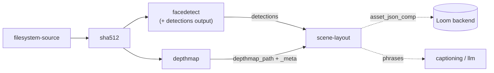

# Scene Layout Node — Design & Implementation Plan

> **Status: implemented.** The node and its wiring are built; 61 unit tests and one integration test
> pass. Prerequisite P2 (the `FacedetectNode` `detections` output) shipped with it. P3
> (`objectdetect`) remains open, so today the node relates faces to faces — see §2.
>
> **Three things landed differently from the design below**, each recorded in place:
>
> 1. **The video coordinate-space caution in §6 is resolved**, not open. `VideoFaceScanner` has its
>    scale-down path hard-disabled and rescales boxes back to native frame coordinates when it is on,
>    so video boxes are native pixels. What is genuinely unavailable is the frame *size* —
>    `VideoFile` exposes none — so the video payload omits `imageWidth`/`imageHeight` rather than
>    reporting a guess.
> 2. **Normalized rows on the REST fallback are refused, not rescaled.** The design said to apply a
>    logged heuristic. Half of it is unimplementable: nothing records the source image dimensions, so
>    normalized boxes cannot be turned into pixels at all. The node logs which branch it took and
>    declines the normalized one.
> 3. **A single detection is a skip**, added during implementation. One object has nothing to relate
>    to, so a component row for it would carry no information.
>
> **Node kind**: `scene-layout` · **Module**: `cortex/nodes/scene-layout` ·
> **Package**: `io.metaloom.cortex.node.scenelayout` · **No model, no sidecar.**
>
> **Naming.** This node was first sketched as "correlation". That name was dropped: *correlation*
> means a statistical relationship between variables, which is not what this does. It computes
> **spatial layout** — where detected things sit relative to one another in the image and in depth.
> Any older reference to `NODE_CORRELATION_PLAN.md` or a `CorrelationNode` means this file.
>
> **Hard prerequisite**: [NODE_DEPTHMAP_PLAN.md](NODE_DEPTHMAP_PLAN.md). This node consumes the
> `depthmap` node's output and cannot run without it.
>
> **Scope**: the Cortex-level `scene-layout` node. The node system as a whole is
> [NODES.md](NODES.md); the persistence model is §2 there and is not duplicated here.
>
> The source of truth is the code under `cortex/`.

---

## 1. Motivation

Cortex knows *what* is in an image and *where its box is*, but nothing about how the things relate.
`FacedetectNode` writes a list of boxes; a future `objectdetect` will write more. Two boxes that
overlap might be a person standing in front of a car or a person visible through its window, and
nothing in the system can tell the difference — because that difference is depth.

`scene-layout` joins detector boxes to a depth map and derives the relations:

```
person-0  IN_FRONT_OF  car-0        (confidence 0.91)
person-0  OCCLUDES     car-0        (overlap 0.34)
person-0  LEFT_OF      person-1
person-1  BEHIND       car-0
```

plus a **depth band** per object — `FOREGROUND` / `MIDGROUND` / `BACKGROUND` — which is the direct
answer to "which detected objects are foreground and which are background".

| Consumer | What it gets |
|---|---|
| Captioning / LLM | Grounded prepositions. `phrases[]` drops straight into a prompt instead of the model guessing |
| Search ([../search/SEARCH.md](../search/SEARCH.md)) | "person in the foreground", "two people side by side" become queryable |
| Editorial / DAM | Subject isolation, auto-crop that keeps the foreground subject, background-blur candidates |
| Review workflows | "the face is behind glass / in the background" as a rejection reason |

### Non-goals

- **Not a detector.** It creates no boxes. It relates boxes that other nodes produced.
- **Not a learned scene-graph model.** No SGG network, no relation classifier. Pure geometry and
  statistics over the boxes and the depth map — deterministic, explainable, and CPU-cheap.
- **Not 3D reconstruction.** Relative ordering and image-plane relations only. No camera pose, no
  world coordinates, no metric distances between objects (even in the depth node's `METRIC` mode,
  which only gives per-pixel range, not inter-object geometry).
- **Not video, in v1.** Images only, matching the `depthmap` node's v1 scope.

---

## 2. 🔴 The prerequisite that limits what this node can do today

> **Status: verified against code at `29cadb66`. This is not a hypothetical.**

**There is still no object detection anywhere in Cortex.** A case-insensitive grep for
`yolo|objectdetect|object_detect|ObjectDetection` across `cortex/` (java/xml/json) returns **zero**
hits, and `yolo4j` is not a dependency of any pom in this repo. The `detection.label` column and the
`type='objectdetection'` value exist in the schema purely in anticipation; nothing writes them.

The consequence, stated plainly so nobody is surprised: **as shipped, this node can only relate faces
to faces.** "Person is behind car" is *not* reachable until an `objectdetect` node exists.

That does not make the node premature — face-to-face layout is genuinely useful (group photos,
who-is-in-front framing, foreground-subject selection), and building it now means the object
detector plugs in with **zero changes here**, because the node is written detector-agnostic: it
consumes boxes, and does not care which node produced them.

### Prerequisites, in order

| # | Prerequisite | Status | Needed for |
|---|---|---|---|
| P1 | [`depthmap` node](NODE_DEPTHMAP_PLAN.md) | **built** | **Everything.** Hard dependency |
| P2 | `FacedetectNode` emits its bounding boxes as a node output | **built** — §6 | The upstream-output path; offline operation |
| P3 | An `objectdetect` node (yolo4j, wired like `InspireFacedetector` in `FacedetectNodeModule`) | **not started, out of scope** | Any non-face object. Deserves its own plan |
| P4 | `DetectionResponse` exposes `nodeKind` / `label` / `detectionIndex` | not started, out of scope | The REST read-back path for *object classes*. Faces work without it (`type="face"`) |

---

## 3. What already exists (verified against code at `29cadb66`)

| Concern | Reference | Notes |
|---|---|---|
| Base node lifecycle + ledger helpers | `cortex/common/…/node/AbstractMediaNode.java` | `process()` L51; `compute(...)` L102; `recordNodeResult(...)` L120; `resultRef(table, uuids…)` L151 |
| Reading configurable upstream outputs | `SentimentNode.resolveText` / `SentimentNodeOptions.textSources`, `TtsNode.resolveText` | The `nodeId:outputKey` source-list pattern this node copies for both its inputs |
| Writing a JSON component + ledger | `cortex/nodes/sentiment/core/…/SentimentNode.persist(...)` | The exact `createAssetJsonComp` + `recordNodeResult(resultRef("asset_json_comp", uuid))` shape |
| `asset_json_comp` | `V2.23__add_asset_json_comp.sql`, rewritten by `V2.40__rework_asset_json_comp.sql` | Natural key `(asset_uuid, node_kind, schema_type, variant)`; `data jsonb` with a GIN index |
| Detections in Loom | `V2.43__rework_detection_embedding.sql`; `DetectionMethods.listAssetDetections(AssetId)` | Read-back path. Key `(asset_uuid, node_kind, frame_number, detection_index)` |
| Face detections produced | `cortex/nodes/facedetect/core/…/FacedetectNode.java` | `persist(...)` → `bulkCreateAssetDetections` with `type="face"`, boxes as **absolute pixels** |
| Image reading without OpenCV | `cortex/nodes/vlm/core/…/VlmImages.java` | `ImageIO`-based; the house pattern for a node that must not pull in the video4j native runtime |
| In-heap skip cache | `cortex/common/…/cache/LocalResultCache.java` | Bounded access-order LRU keyed by `media.absolutePath()` |
| Affinity / segmentation | `loom/pipeline/…/graph/{PipelineGraphNode,PipelineSegmenter,AffinityValidator}.java` | `"affinity"` on the node JSON; `DEFAULT_AFFINITY = "default"` |

### Four constraints that shape the design

1. **`FacedetectNode` does not emit its boxes.**
   [FacedetectNode.java:49-50](../../../cortex/nodes/facedetect/core/src/main/java/io/metaloom/cortex/node/facedetect/FacedetectNode.java)
   declares exactly two output keys — `face_count` and `facedetect_flag`. The `List<Detection>` built
   in `processImage` / `processVideo` goes straight into `persist(...)`; the boxes never reach
   `ctx.output(...)`. Fixing that is §6, and it is in scope for this change.

2. **Node output values are strings after a cache round-trip.** `XAttrNodeCache.serializeOutputMap`
   writes `key=value.toString()` and deserializes every value back as a `String` — an `Integer`
   `face_count` returns as `"3"`. Structured data between nodes must therefore be an explicitly
   JSON-encoded `NodeOutputKey<String>`, re-parsed by the consumer. That is why both the new
   `detections` key and this node's `scene_layout_result` are JSON strings.

3. **The depth map is worker-local.** The `depthmap` node writes a PNG under
   `metaPath/depthmap_bin/…` and records only a ledger row (no byte-ingest endpoint exists). So
   `scene-layout` must run on the same worker, pinned via the node JSON's `"affinity"` field. See
   §10 — this is the failure mode most likely to bite in production.

4. **🔴 The `detection` bbox convention is inconsistent in the existing code.**
   `V2.43__rework_detection_embedding.sql` comments the column as
   *"Bounding box X, normalized 0-1. This is the single geometry convention"*, but
   `FacedetectNode.persist` writes **absolute pixels** (`BoundingBox(int x, int y, …)` cast to
   float), `DetectionModelValidator` is an interface of empty default methods that validates
   nothing, and **no source image dimensions are stored anywhere**, so an absolute box cannot be
   normalized after the fact without re-reading the media.

   This spec **documents rather than silently fixes** this — quietly changing what a shared table
   means would break whatever reads it later. The design works around it instead: §6's payload
   carries an explicit `coordinates` marker plus the dimensions the boxes were measured against, so
   the upstream path is unambiguous; the REST fallback path applies a logged heuristic (§5.1).
   Repairing the convention properly is its own task (§11).

---

## 4. Design decisions

> **Status: agreed.**

| Question | Decision | Rationale |
|---|---|---|
| Learned relation model or geometry? | **Geometry + statistics, in Java** | Deterministic, explainable ("why did it say behind?" → a number), no model to license or serve, runs in microseconds. A learned SGG model would add a third sidecar for a job arithmetic does well |
| Where do boxes come from? | **Upstream output first, Loom read-back as fallback** | The upstream path works offline and carries the coordinate marker; the read-back path works when the detector ran in an earlier run or on another node. Detector-agnostic either way |
| Where does depth come from? | **The `depthmap` node's `depthmap_path` + `depthmap_meta` outputs** | Full-resolution sampling, no precision loss. Costs an affinity constraint (§10) |
| One depth value per object? | **A distribution over the box core** (p25/p50/p75), not a single pixel | A single centre pixel lands on a hand, a hat, or a hole in the object. The spread is also what makes the confidence score meaningful |
| Persistence | **`asset_json_comp`, `schemaType="scene-layout"`** | It is structured, queryable-in-principle output with no dedicated table need — exactly what `asset_json_comp` exists for (its own table comment states the promotion policy) |
| Emit readable phrases? | **Yes, `phrases[]` alongside the structured relations** | The main consumers are LLM prompts and text search. Making them each re-derive English from predicates is duplicated work and duplicated bugs |

---

## 5. Algorithm

> **Status: designed.** The pure-logic parts live in `DepthSampler` and `RelationSolver` so they are
> testable without a node, a file, or a mock (§9).

### 5.1 Gather inputs

**Depth** — from the configured depth node id (default `"depthmap"`):
`ctx.upstreamOutput(depthNodeId, "depthmap_path")` and `"depthmap_meta"`. The PNG is read with
`ImageIO` as `TYPE_USHORT_GRAY`; samples come from `raster.getSample(x, y, 0)` in `0..65535` and are
divided by `65535.0` to give **nearness in `[0,1]`, where 1 is nearest the camera**. If either output
is missing, or the file does not exist, the node returns `ctx.skipped("no depth map")` — a missing
prerequisite is a skip, not a failure.

**Boxes** — in priority order:

1. `ctx.upstreamOutput(detectorNodeId, "detections")` for each configured detector (default
   `["facedetect"]`). The §6 payload, which carries `coordinates` and the reference dimensions.
2. Fallback: `client().listAssetDetections(asset.getUuid())` when the upstream output is absent and
   we are online with a known asset.

On the fallback path the coordinate convention is unknown (constraint 4). The node applies a
heuristic — *if any of `bboxX/Y/Width/Height` exceeds `1.0`, treat all four as absolute pixels
against the source image dimensions; otherwise treat them as normalized* — and **logs at WARN which
branch it took**. A heuristic that runs silently is a bug waiting to be blamed on the depth model.

### 5.2 Project boxes into depth-map space

`depthmap_meta.width/height` are the **map's** dimensions, which are the source image downscaled to
`maxDim` — not the image's own. Boxes are scaled by `mapW / imageW`, `mapH / imageH`. Skipping this
step produces no exception and no warning, only wrong samples: a box in the bottom-right of a 4000px
image would sample near the centre of a 1024px map.

### 5.3 Per-object depth — sample the core, not the box

For each box, sample only its **central core**: inset by `coreInset` (default `0.25`) on each side,
i.e. the middle 50% by width and height. Then take p25 / p50 / p75 of the nearness values there.

The inset is the whole trick. A bounding box is a rectangle around a non-rectangular thing, so its
corners are background. Including them pulls a foreground person's median toward the wall behind
them, and for two people at similar distance that is enough to flip the ordering. Sampling the core
keeps the statistic on the object.

- `near` = p50 — the object's depth
- `spread` = p75 − p25 — how depth-consistent the object is. High spread means a slanted object, a
  bad box, or an unreliable depth region; either way the relations involving it deserve less trust.

Boxes whose core is smaller than `minCorePixels` (default 16 px²) are dropped and logged — a box that
tiny yields a statistic that is noise.

### 5.4 Depth bands

Bands come from quantiles of the **whole scene's** depth histogram, not of the objects' depths:

- `near ≥ scene p66` → `FOREGROUND` (option `foregroundQuantile`)
- `near ≤ scene p33` → `BACKGROUND` (option `backgroundQuantile`)
- otherwise → `MIDGROUND`

Against the whole scene, because banding should describe where an object sits *in the picture*. Using
only the objects' own depths would label the nearer of two equally-distant background faces
"foreground", which is wrong and would read as a bug.

Quantiles rather than k-means: explainable, dependency-free, and stable when there are only two
objects — clustering two points always produces two clusters, which is exactly the wrong answer.

### 5.5 Pairwise relations

For each ordered pair (A, B), separation is scored relative to the objects' own noise:

```
Δ = near(A) − near(B)
s = (spread(A) + spread(B)) / 2 + ε
z = Δ / s
```

`z` rather than raw `Δ` because a 0.05 difference between two flat, confidently-measured objects is
real, while the same 0.05 between two noisy ones is not. Dividing by the pooled spread says so.

| Predicate | Condition | Confidence |
|---|---|---|
| `IN_FRONT_OF` | `z ≥ depthZThreshold` (default `1.0`) | `min(1, z / (2·t))` |
| `BEHIND` | `z ≤ −depthZThreshold` | `min(1, \|z\| / (2·t))` |
| `SAME_DEPTH` | otherwise | `1 − \|z\| / t` |
| `OCCLUDES` / `OCCLUDED_BY` | 2D overlap ÷ smaller box area ≥ `occlusionMinOverlap` (`0.05`) **and** a depth predicate fired | the overlap ratio |
| `CONTAINS` / `INSIDE` | intersection ÷ area(B) ≥ `containmentRatio` (`0.85`) | the containment ratio |
| `LEFT_OF` / `RIGHT_OF` | boxes do not overlap on x; by centre-x | normalized gap |
| `ABOVE` / `BELOW` | boxes do not overlap on y; by centre-y | normalized gap |
| `NEXT_TO` | gap ÷ mean box size ≤ `nextToMaxGap` (`0.5`) **and** `SAME_DEPTH` | `1 − gap ratio` |

Each pair emits **at most one depth predicate and one lateral predicate**, plus optional occlusion
and containment. Emitting every true statement would bury the interesting ones.

`OCCLUDES` is deliberately gated on depth as well as overlap: two overlapping boxes at the same depth
are adjacent, not occluding, and calling that occlusion is the classic 2D-only mistake this node
exists to avoid.

### 5.6 Guards

- `maxObjects` (default `40`) — keep the largest boxes; relations are O(n²).
- `maxRelations` (default `200`) — cap the output.
- **Anything dropped is `log()`-ed with the count.** A silently truncated result reads as "these are
  all the relations", which is worse than a short result you know is short.

### 5.7 Phrases

Readable strings generated from the predicates, using each object's `label` and index:

```
"face-0 is in front of face-1"
"face-0 is left of face-1"
"face-0 is in the foreground"
```

They exist because the primary consumers are LLM prompts and text search, and giving each of them
their own predicate-to-English mapping would mean the same bug written twice.

---

## 6. Prerequisite change — `FacedetectNode` emits its boxes

> **Status: in scope for this change.** One new output key plus the code that fills it.

```java
public static final NodeOutputKey<String> OUTPUT_DETECTIONS = NodeOutputKey.of("detections", String.class);
```

Populated in both `processImage` and `processVideo`, from the same `List<Detection>` already being
handed to `persist(...)`:

```jsonc
{
  "imageWidth": 1920, "imageHeight": 1080,
  "coordinates": "ABSOLUTE_PIXELS",          // explicit — see constraint 4
  "detections": [
    { "index": 0, "type": "face", "label": "face", "frame": 0,
      "bbox": { "x": 100, "y": 50, "w": 80, "h": 80 }, "confidence": 1.0 }
  ]
}
```

Why the marker and the dimensions: they make this payload immune to the normalized-vs-pixels
ambiguity in the `detection` table. A consumer never has to guess, and when the table's convention is
eventually repaired the marker simply changes value.

**No cache change is needed.** `FacedetectNode` already does
`resultCache.put(path, new HashMap<>(ctx.outputs()))` gated on the presence of `facedetect_flag`, so
the new key rides along with the existing snapshot.

⚠️ **Verify the video coordinate space during implementation.** The video path scans frames through
`VideoFaceScanner`, and `FacedetectNodeOptions.videoScaleSize` (default 384) may mean the boxes are
measured against a *rescaled* frame rather than the native resolution. Whatever the boxes are
measured against is what `imageWidth`/`imageHeight` must report — check `VideoFaceScanner` before
assuming native dimensions.

Also update, in the same change: `FacedetectDescriptorProvider` (add the `detections` output with
content type `DATA_FACEDETECTION`), `website/content/english/docs/nodes/facedetect/index.adoc`, and
the facedetect row in [NODES.md](NODES.md) §3.

---

## 7. Persistence

> **Status: designed.**

One `asset_json_comp` row: `nodeKind = "scene-layout"`, `schemaType = "scene-layout"`,
`variant = ""`, `producerVersion` = the depth model id carried through from `depthmap_meta` (the
layout is only as good as the depth that produced it, so that provenance belongs on the row). The
natural key `(asset_uuid, node_kind, schema_type, variant)` makes a re-run an upsert.

Then the ledger:
`recordNodeResult(asset, ctx, SUCCESS, null, producerVersion, resultRef("asset_json_comp", compUuid))`.

`variant` is reserved for future use: per-frame results in video mode would key on the frame number,
and a pipeline with two independent detector sets could key on the detector. v1 writes one row per
asset.

```jsonc
// asset_json_comp.data
{
  "image": { "width": 1920, "height": 1080 },
  "depth": {
    "model": "depth-anything/Depth-Anything-V2-Small-hf",
    "convention": "NEARNESS", "source": "RELATIVE",
    "mapWidth": 1024, "mapHeight": 576,
    "sceneQuantiles": { "p33": 0.21, "p66": 0.54 }
  },
  "objects": [
    { "id": "face-0", "label": "face", "type": "face", "source": "facedetect",
      "bbox": { "x": 100, "y": 50, "w": 80, "h": 80 }, "confidence": 1.0,
      "depth": { "near": 0.82, "p25": 0.79, "p75": 0.85, "spread": 0.06, "band": "FOREGROUND" } },
    { "id": "face-1", "label": "face", "type": "face", "source": "facedetect",
      "bbox": { "x": 400, "y": 60, "w": 60, "h": 60 }, "confidence": 1.0,
      "depth": { "near": 0.44, "p25": 0.41, "p75": 0.49, "spread": 0.08, "band": "MIDGROUND" } }
  ],
  "relations": [
    { "subject": "face-0", "predicate": "IN_FRONT_OF", "object": "face-1",
      "confidence": 0.91, "evidence": { "deltaNear": 0.38, "z": 5.4 } },
    { "subject": "face-0", "predicate": "LEFT_OF", "object": "face-1",
      "confidence": 0.74, "evidence": { "gapRatio": 0.26 } }
  ],
  "phrases": [
    "face-0 is in front of face-1",
    "face-0 is left of face-1",
    "face-0 is in the foreground"
  ],
  "truncated": { "objects": 0, "relations": 0 }
}
```

`truncated` is explicit rather than implied — see §5.6.

---

## 8. Implementation outline — `cortex/nodes/scene-layout/core/`

> **Status: not implemented.**

New Maven module `cortex/nodes/scene-layout/` (aggregator `pom` + `core` jar — copy
`cortex/nodes/sentiment/`, whose `core/pom.xml` carries **zero** `<dependencies>` because everything
is inherited from `cortex/nodes/pom.xml`). Package `io.metaloom.cortex.node.scenelayout`:

| Class | Role |
|---|---|
| `SceneLayoutNode extends AbstractMediaNode<SceneLayoutNodeOptions>` | Lifecycle, input gathering, persistence. Thin |
| `SceneLayoutNodeOptions extends AbstractNodeOptions<…>` | `KEY = "scene-layout"`; §9 fields; `validate()` |
| `SceneLayoutNodeModule extends AbstractNodeModule` | The four Dagger bindings, `@StringKey("scene-layout")` |
| `DepthMap` | Wraps the decoded PNG + meta; `nearnessAt(x, y)`, `coreStats(box)`, `sceneQuantile(q)` |
| `DepthSampler` | Pure: box → core inset → p25/p50/p75. **No I/O** |
| `RelationSolver` | Pure: `List<LayoutObject>` → `List<SpatialRelation>` + bands + phrases. **No I/O** |
| `LayoutObject`, `SpatialRelation`, `BoxF` | Records |
| `RelationPredicate` | `enum { IN_FRONT_OF, BEHIND, SAME_DEPTH, OCCLUDES, OCCLUDED_BY, CONTAINS, INSIDE, LEFT_OF, RIGHT_OF, ABOVE, BELOW, NEXT_TO }` |
| `DepthBand` | `enum { FOREGROUND, MIDGROUND, BACKGROUND }` |

The `DepthSampler` / `RelationSolver` split is not decoration: it is what makes the interesting logic
testable with plain arrays and no filesystem (§9).

Node specifics:

```java
public static final NodeOutputKey<String>  OUTPUT_SCENE_LAYOUT_RESULT   = NodeOutputKey.of("scene_layout_result", String.class);
public static final NodeOutputKey<Integer> OUTPUT_SCENE_LAYOUT_OBJECTS  = NodeOutputKey.of("scene_layout_object_count", Integer.class);
public static final NodeOutputKey<Integer> OUTPUT_SCENE_LAYOUT_RELATIONS= NodeOutputKey.of("scene_layout_relation_count", Integer.class);
```

- `name()` → `"scene-layout"`.
- `isProcessable(ctx)` → `options().isEnabled() && ctx.media().isImage()`. Depth and box availability
  are checked in `compute` and produce a **skip with a reason**, not a failure — a pipeline where the
  detector found nothing is a normal outcome.
- `LocalResultCache<String>` sized `10_000`, keyed on `media.absolutePath()`, holding the result
  JSON. Hit → `metrics.recordAiCacheHit("scene-layout")`, re-emit, `ctx.origin(LOCAL).next()`,
  **no re-persist**.
- `compute` → gather (§5.1) → project (§5.2) → sample (§5.3) → band (§5.4) → relate (§5.5) → emit →
  cache → `persist(...)` → `ctx.origin(COMPUTED).next()`. Exceptions → `FAILED` ledger +
  `ctx.failure(...).next()`.
- `persist(...)` copies `SentimentNode.persist` verbatim in shape, guarded by
  `if (asset == null || client() == null) return;`.

### Wiring that is easy to forget

| # | File | Change |
|---|---|---|
| 1 | `cortex/nodes/pom.xml` | `<module>scene-layout</module>` |
| 2 | `cortex/processor/pom.xml` | `cortex-scene-layout-node` dependency |
| 3 | `integration-test/pom.xml` | same artifact, `${loom.cortex.version}` |
| 4 | `cortex/cli/…/dagger/NodeCollectionModule.java` | import + `SceneLayoutNodeModule.class` in `includes` |
| 5 | `cortex/cli/src/test/…/dagger/NodeRegistrarTest.java` | add `"scene-layout"` to the expected-kinds assertion |
| 6 | `loom-shared/node-model/…/spec/SceneLayoutDescriptorProvider.java` | **new** |
| 7 | `…/META-INF/services/io.metaloom.loom.nodes.spec.NodeDescriptorProvider` | add the FQCN |
| 8 | `loom-shared/node-model/src/test/…/NodeDescriptorServiceLoaderTest.java` | 🔴 bump both hard-coded counts (`19` providers, `32` descriptors at `29cadb66`) and the expected-kind array |
| 9 | `loom-shared/node-model/…/spec/ContentTypes.java` | add `DATA_SCENE_LAYOUT = "data/scene_layout"` constant **and** its `all()` entry |
| 10 | `loom-ui/src/features/pipeline/PipelineEditor.tsx` | add `schema` to `ICON_MAP` (+ the MUI import) |
| 11 | `website/content/english/docs/nodes/scene-layout/index.adoc` + `nodes/_index.adoc` (3 spots) | customer docs |
| 12 | [NODES.md](NODES.md) | §2 persistence, §3 node catalogue, §5 options, §12 capability matrix + IT-coverage prose |
| 13 | `FacedetectNode` + its descriptor + its docs page | §6 |

Descriptor sketch:

```java
new NodeDescriptor()
  .setKind("scene-layout").setName("Scene Layout")
  .setDescription("Relate detected objects to one another using a depth map: foreground/background bands and pairwise spatial relations.")
  .setIcon("schema").setCategory(ANALYSIS)
  .setInputs(List.of(
      new NodeInput("depth", DATA_DEPTHMAP, true),
      new NodeInput("detections", DATA_FACEDETECTION, true)))
  .setOutputs(List.of(
      new NodeOutput("scene_layout_result", DATA_SCENE_LAYOUT),
      new NodeOutput("scene_layout_object_count", DATA_INTEGER),
      new NodeOutput("scene_layout_relation_count", DATA_INTEGER)))
  .setDefaultConcurrency(4).setDefaultMode(PARALLEL).setEvents(STANDARD_EVENTS)
```

`defaultConcurrency = 4`, unlike the model-backed nodes: there is no shared model or device to
contend for, only CPU.

> ⚠️ `imagegen` shipped **without** a descriptor provider and is therefore invisible to the UI
> palette and to pipeline validation. Items 6–9 are not optional.

---

## 9. Configuration

> **Status: designed.**

| Option | Type | Default | Meaning |
|---|---|---|---|
| `enabled` / `processIncomplete` / `retryFailed` | boolean | — | inherited from `AbstractNodeOptions` |
| `depthNodeId` | String | `depthmap` | Upstream node id supplying `depthmap_path` / `depthmap_meta` |
| `detectionSources` | List&lt;String&gt; | `["facedetect"]` | Upstream node ids whose `detections` output is consumed |
| `allowLoomFallback` | boolean | `true` | Fall back to `listAssetDetections` when no upstream `detections` output is present |
| `coreInset` | double | `0.25` | Fraction inset per side before sampling depth (§5.3) |
| `minCorePixels` | int | `16` | Boxes with a smaller core are dropped and logged |
| `depthZThreshold` | double | `1.0` | `\|z\|` above which a depth ordering is asserted (§5.5) |
| `occlusionMinOverlap` | double | `0.05` | Overlap ÷ smaller-box area needed to call occlusion |
| `containmentRatio` | double | `0.85` | Intersection ÷ area(B) needed for `CONTAINS` |
| `nextToMaxGap` | double | `0.5` | Gap ÷ mean box size below which `NEXT_TO` fires |
| `foregroundQuantile` | double | `0.66` | Scene quantile at or above which an object is `FOREGROUND` |
| `backgroundQuantile` | double | `0.33` | Scene quantile at or below which an object is `BACKGROUND` |
| `maxObjects` | int | `40` | Largest-first cap (relations are O(n²)) |
| `maxRelations` | int | `200` | Output cap |
| `emitPhrases` | boolean | `true` | Emit the readable `phrases[]` array |

**No environment variables.** This node has no sidecar and no external service — everything is node
configuration from the pipeline definition. Cortex-wide variables (`LOOM_HOST`, `CORTEX_META_PATH`,
`CORTEX_NODE_WHITELIST`, …) are in [../../cortex/CONFIGURATION.md](../../cortex/CONFIGURATION.md).

---

## 10. Pipeline placement

> **Status: designed.**



🔴 **`depthmap` and `scene-layout` must share an affinity group.** The depth PNG lives only on the
worker that produced it:

```jsonc
{ "id": "facedetect",   "type": "facedetect",   "affinity": "vision" },
{ "id": "depthmap",     "type": "depthmap",     "affinity": "vision" },
{ "id": "scene-layout", "type": "scene-layout", "affinity": "vision" }
```

`AffinityValidator` warns when a segment is *unplaceable* (no single worker is permitted to run all
its kinds) or when a group got *split*, but it cannot warn about a group you forgot to declare —
that failure surfaces as a plain "depth map not found" skip on a different worker, which looks like a
depth-node problem and is not.

---

## 11. Conventions and Gotchas

- 🔴 **Affinity is mandatory** (§10). The most likely production failure, and it does not announce
  itself.

- 🔴 **NEARNESS: larger = closer.** The depth PNG encodes nearness, not distance;
  `65535` is nearest. Invert this and every relation in the output is backwards while the node
  reports `SUCCESS`.

- 🔴 **Scale boxes into map space** (§5.2). `depthmap_meta.width/height` are the *map's* dimensions
  after `maxDim` downscaling, not the image's. No exception is thrown when you forget — the samples
  are just wrong.

- 🔴 **The `detection` table's geometry convention is inconsistent** (constraint 4): the migration
  comment says normalized 0–1, `FacedetectNode` writes pixels, nothing validates, and no source
  dimensions are recorded. Prefer the upstream `detections` output, which carries an explicit
  `coordinates` marker. On the REST fallback, log which branch the heuristic took.

- **`DetectionResponse` omits `nodeKind`, `label` and `detectionIndex`.** The REST fallback can
  therefore distinguish rows only by `type`, and cannot recover an object class. Fine for faces;
  P4 in §2 before object detection is useful.

- **Sample the box core, not the box** (§5.3). Corners are background. This single detail decides
  whether the node is right or plausible-looking.

- **Score with `z`, not raw Δ.** A depth gap only means something relative to how noisy the two
  objects' depths are.

- **Occlusion needs depth as well as overlap.** Overlapping boxes at the same depth are adjacent,
  not occluding.

- **No silent caps.** `maxObjects` / `maxRelations` truncation is logged *and* reported in the
  payload's `truncated` block.

- **A missing input is a skip, not a failure.** No depth map, no boxes, or fewer than two objects →
  `ctx.skipped(reason)`. A `FAILED` result blocks blocking downstream nodes and pollutes the run
  summary for what is a normal outcome.

- **`ImageIO`, not OpenCV.** Follow `VlmImages` — this node must not pull the video4j native runtime
  into workers that only need arithmetic.

- **Registration is three strings and one binding** in `SceneLayoutNodeModule`, then the module goes
  into `NodeCollectionModule.includes`. Adding it to `PipelineNodeFactoryModule` is the **old** way
  and is wrong.

- **Node id vs. kind.** `scene-layout` is unrelated to the existing `scene-detection` node (temporal
  video scene cuts). The similar names are unfortunate; do not wire one expecting the other.

- **No demo data needed.** `DemoDatabaseInitializer` holds no per-node Cortex config.

---

## 12. Test setup

> **Status: not written.**

| Test | What it covers |
|---|---|
| **`RelationSolverTest`** (the important one) | Pure logic on **synthetic depth gradients** — a left-half-near / right-half-far ramp with planted boxes gives exact expected predicates with no model, no GPU, no file I/O. Cases: clear front/behind; equal depth → `SAME_DEPTH` + `NEXT_TO`; overlap + depth gap → `OCCLUDES`; overlap + equal depth → **no** occlusion; containment; left/right and above/below; high spread suppressing a marginal ordering; `maxObjects`/`maxRelations` truncation reported |
| `DepthSamplerTest` | Core inset arithmetic; p25/p50/p75 on a known array; boxes at image edges clamped; sub-`minCorePixels` boxes dropped |
| `SceneLayoutNodeTest` | Happy path with a generated 16-bit PNG on `@TempDir` and a stub upstream `detections` output; missing depth → skip; missing boxes → skip; single object → skip; second run served from `LocalResultCache` |
| `SceneLayoutNodePersistenceTest` | Mockito `LoomHttpClient`; `verify createAssetJsonComp` with `nodeKind`/`schemaType` = `"scene-layout"`, `variant=""`, `producerVersion` = the depth model id; ledger row with `resultRef.table == "asset_json_comp"`. Failure path records `FAILED` and never writes the component |
| `SceneLayoutNodePipelineTest` | `extends AbstractNodeChainTest`; `adapt(node)`, output-key propagation via `PipelineAssertions.hasNodeOutput` + `CapturingNode`; disabled / dry-run |
| `SceneLayoutOptionsValidationTest` (+ `assertj/` helpers) | Option validation |
| `FacedetectNodeTest` (extend) | The new `detections` output: present on the image path, correct box values, `coordinates` marker and dimensions, survives a `LocalResultCache` hit |
| `integration-test/…/node/SceneLayoutNodeIntegrationTest` | Mirrors `SentimentNodeIntegrationTest`: real in-process Loom, real `LoomHttpClient`, a real 16-bit depth PNG on disk and a real `detections` upstream payload. Asserts `SUCCESS`, then reads the `scene-layout` `asset_json_comp` **back over REST** and checks objects, bands and relations |

Building the test fixture — a synthetic depth map, which is what makes this node cheap to test:

```java
// left half near (nearness 0.9), right half far (nearness 0.1)
BufferedImage map = new BufferedImage(200, 100, BufferedImage.TYPE_USHORT_GRAY);
WritableRaster r = map.getRaster();
for (int y = 0; y < 100; y++)
    for (int x = 0; x < 200; x++)
        r.setSample(x, y, 0, x < 100 ? (int) (0.9 * 65535) : (int) (0.1 * 65535));
ImageIO.write(map, "png", pngFile);
```

```bash
mvn -pl cortex/nodes/scene-layout/core -am test
mvn -pl cortex/nodes/facedetect/core test           # the new detections output
mvn -pl loom-shared/node-model test                 # the ServiceLoader count guard
mvn -pl cortex/cli test -Dtest=NodeRegistrarTest    # the kind-registration guard
mvn -pl integration-test -Dtest=SceneLayoutNodeIntegrationTest test
```

🔴 Run `./setup-pool.sh` before the integration test, and clean-rebuild `loom/core` after the
`NodeCollectionModule` change — a stale Dagger component surfaces as `NoSuchMethodError`.

---

## 13. Open decisions & follow-ups

- [ ] **`objectdetect` node** (P3, §2) — yolo4j-backed, wired like `InspireFacedetector` in
      `FacedetectNodeModule`, writing `type="objectdetection"` with a real `label`. Deserves its own
      plan. **This is what makes "person behind car" possible.**
- [ ] **Extend `DetectionResponse`** (P4) with `nodeKind` / `label` / `detectionIndex`, so the REST
      fallback can recover object classes. Carries an endpoint-test obligation per
      [../../guidelines/CODING.md](../../guidelines/CODING.md).
- [ ] **Repair the `detection` geometry convention** — decide normalized vs. pixels, record source
      dimensions, enforce it in `DetectionModelValidator`, migrate existing rows. Its own task; this
      spec only documents the inconsistency (constraint 4).
- [ ] **Video / per-frame layout** — one result per keyframe, keyed by `variant = frameNumber`.
      Blocked on the `depthmap` node's own video support.
- [ ] **Relations as first-class rows.** If the UI ever renders a relation graph or search filters on
      predicates, `asset_json_comp` should graduate to a typed table — the promotion policy stated in
      that table's own comment. Not now: nothing queries it yet.
- [ ] **Feed `phrases[]` into captioning.** `CaptioningNode` could take the layout as prompt context
      for spatially grounded captions. A natural follow-up once both nodes exist.
- [ ] **Depth-aware person clustering.** `FacedetectNode` already clusters faces (DBSCAN); depth
      could disambiguate two same-looking faces at different distances. Speculative.

---

## 14. Key Classes Reference

| Class | Package | Purpose |
|---|---|---|
| `SceneLayoutNode` | `io.metaloom.cortex.node.scenelayout` | The node: gathers inputs, runs the solver, persists |
| `SceneLayoutNodeOptions` | `io.metaloom.cortex.node.scenelayout` | Config incl. thresholds and source ids; `KEY="scene-layout"` |
| `SceneLayoutNodeModule` | `io.metaloom.cortex.node.scenelayout` | Dagger bindings incl. `@StringKey("scene-layout")` |
| `DepthMap` | `io.metaloom.cortex.node.scenelayout` | Decoded 16-bit PNG + meta; nearness lookup, scene quantiles |
| `DepthSampler` | `io.metaloom.cortex.node.scenelayout` | **Pure**: box → core inset → p25/p50/p75 |
| `RelationSolver` | `io.metaloom.cortex.node.scenelayout` | **Pure**: objects → bands, relations, phrases |
| `LayoutObject` / `SpatialRelation` / `BoxF` | `io.metaloom.cortex.node.scenelayout` | Value records |
| `RelationPredicate` / `DepthBand` | `io.metaloom.cortex.node.scenelayout` | Enums |
| `SceneLayoutDescriptorProvider` | `io.metaloom.loom.nodes.spec` | UI palette + pipeline-validation descriptor |
| `DepthmapNode` | `io.metaloom.cortex.node.depthmap` | Upstream producer — [NODE_DEPTHMAP_PLAN.md](NODE_DEPTHMAP_PLAN.md) |
| `FacedetectNode` | `io.metaloom.cortex.node.facedetect` | Upstream producer; gains the `detections` output (§6) |
| `AbstractMediaNode` | `io.metaloom.cortex.common.node` | Lifecycle + `recordNodeResult` / `resultRef` |
| `LocalResultCache` | `io.metaloom.cortex.common.cache` | In-heap worker-lifetime LRU skip cache |
| `NodeCollectionModule` | `io.metaloom.cortex.cli.dagger` | Aggregates node modules (the one central Dagger edit) |
| `DetectionMethods` | `io.metaloom.loom.client.common.method` | `listAssetDetections` — the REST fallback |
| `JsonCompCreateRequest` | `io.metaloom.loom.rest.model.jsoncomp` | `nodeKind`/`schemaType`/`variant`/`producerVersion`/`data` |
| `AffinityValidator` | `io.metaloom.loom.pipeline.graph` | Warns about split / unplaceable affinity groups |

---

## 15. Where do I find …?

| I want to … | Look at |
|---|---|
| The depth map this node consumes | [NODE_DEPTHMAP_PLAN.md](NODE_DEPTHMAP_PLAN.md) |
| The `asset_json_comp` + ledger write shape | `cortex/nodes/sentiment/core/.../SentimentNode.java` (`persist`) |
| The configurable-upstream-source pattern | `SentimentNode.resolveText` / `SentimentNodeOptions.textSources`, `TtsNode.resolveText` |
| How face boxes are produced and persisted | `cortex/nodes/facedetect/core/.../FacedetectNode.java` (`persist`) |
| The detection schema and its bbox comment | `loom/db/flyway/.../V2.43__rework_detection_embedding.sql` |
| The `asset_json_comp` schema and promotion policy | `loom/db/flyway/.../V2.40__rework_asset_json_comp.sql` |
| Reading detections back over REST | `loom-client/common/.../method/DetectionMethods.java` |
| Image reading without OpenCV | `cortex/nodes/vlm/core/.../VlmImages.java` |
| Where a node registers as a runnable kind | its `*NodeModule` (`@StringKey`) + `NodeCollectionModule.includes` |
| Where a node registers for the UI | `loom-shared/node-model/.../spec/` + the `META-INF/services` file |
| The UI icon map | `loom-ui/src/features/pipeline/PipelineEditor.tsx` (`ICON_MAP`, ~L82) |
| Affinity / segmentation | `loom/pipeline/.../graph/{PipelineSegmenter,AffinityValidator,PipelineGraphNode}.java` |
| Test exemplars | `cortex/nodes/sentiment/core/src/test/.../Sentiment*Test`, `integration-test/.../node/SentimentNodeIntegrationTest.java` |
| Customer docs pattern | `website/content/english/docs/nodes/sentiment/index.adoc` + `nodes/_index.adoc` |

---

## 16. Progress Assessment

### Design
- [x] Node renamed from "correlation" to `scene-layout` with the reasoning recorded
- [x] Relation taxonomy, banding and confidence scoring defined (§5)
- [x] Persistence shape (`asset_json_comp`, `schemaType="scene-layout"`) and payload defined (§7)
- [x] Prerequisite chain P1–P4 identified; the object-detection gap stated up front (§2)
- [x] The `detection` bbox-convention inconsistency documented rather than silently patched (§3)

### Prerequisites
- [x] **P1** — [`depthmap` node](NODE_DEPTHMAP_PLAN.md) built (hard blocker)
- [x] **P2** — `FacedetectNode` `detections` output key (§6), incl. the video coordinate-space check
- [ ] P3 — `objectdetect` node (out of scope; own plan)
- [ ] P4 — `DetectionResponse` extended with `nodeKind`/`label`/`detectionIndex` (out of scope)

### Node
- [x] Module `cortex/nodes/scene-layout/` (aggregator + core poms); `cortex/nodes/pom.xml` entry
- [x] `DepthMap`, `DepthSampler`, `RelationSolver`, records and enums
- [x] `SceneLayoutNodeOptions` (+ `validate()`), `SceneLayoutNode`, `SceneLayoutNodeModule`
- [x] `cortex/processor/pom.xml` + `integration-test/pom.xml` dependencies
- [x] `SceneLayoutNodeModule.class` in `NodeCollectionModule.includes`
- [x] `NodeRegistrarTest` expected-kinds assertion updated

### UI / descriptors
- [x] `SceneLayoutDescriptorProvider` + `META-INF/services` entry
- [x] `NodeDescriptorServiceLoaderTest` counts and expected-kind array bumped
- [x] `ContentTypes.DATA_SCENE_LAYOUT` constant **and** `all()` entry
- [x] `ICON_MAP` gains `schema` in `PipelineEditor.tsx`
- [x] `FacedetectDescriptorProvider` gains the `detections` output

### Tests
- [x] `RelationSolverTest` on synthetic depth gradients (the primary correctness test) — 15 tests
- [x] `DepthSamplerTest`
- [x] `SceneLayoutNodeTest`, `SceneLayoutNodePersistenceTest`, `SceneLayoutNodePipelineTest`, `SceneLayoutOptionsValidationTest` (+ assertj helpers) — 61 tests green in total
- [x] `FacedetectNodeDetectionsTest` covers the new output (a new class rather than extending the existing suite — there was no `FacedetectNodeTest`, only options and pipeline tests)
- [x] `integration-test/.../node/SceneLayoutNodeIntegrationTest`

### Docs
- [x] [NODES.md](NODES.md) — §2 persistence, §3 node catalogue (incl. the facedetect output-keys row), §5 options, §12 capability matrix + IT-coverage prose
- [x] `website/content/english/docs/nodes/scene-layout/index.adoc` + `nodes/_index.adoc` (3 spots)
- [x] `website/content/english/docs/nodes/facedetect/index.adoc` updated for the new output
- [x] [../../CONTEXT.md](../../CONTEXT.md) §2 spec-tree entry
- [x] `NODE_CORRELATION_PLAN.md` deleted (superseded by this file)

### Deliberately not built
- [ ] ~~A learned scene-graph (SGG) model~~ — rejected; geometry is explainable and free (§4)
- [ ] ~~3D reconstruction / world coordinates~~ — out of scope (§1)
- [ ] ~~Relations as first-class DB rows~~ — `asset_json_comp` until something queries them (§13)
- [ ] ~~Video / per-frame layout~~ — blocked on depthmap video support (§13)

---

## 17. References

- [NODE_DEPTHMAP_PLAN.md](NODE_DEPTHMAP_PLAN.md) — the required upstream node, designed alongside this one
- [NODES.md](NODES.md) — node system, persistence model (§2), capability matrix (§12)
- [NODE_SENTIMENT_PLAN.md](NODE_SENTIMENT_PLAN.md) — the `asset_json_comp` persistence exemplar and upstream-source pattern
- [../pipeline/PIPELINE.md](../pipeline/PIPELINE.md) — pipeline engine, segmentation, affinity
- [../db/DATABASE_TASKS.md](../db/DATABASE_TASKS.md), [../DB_SCHEMA_FEEDBACK.md](../DB_SCHEMA_FEEDBACK.md) — schema audit context for the detection-geometry issue
- [../search/SEARCH.md](../search/SEARCH.md) — a downstream consumer, not yet implemented
- [../../guidelines/CODING.md](../../guidelines/CODING.md), [../../guidelines/NEW_NODE.md](../../guidelines/NEW_NODE.md), [../../SPEC_RULES.md](../../SPEC_RULES.md)
- [../../cortex/CONFIGURATION.md](../../cortex/CONFIGURATION.md) — Cortex-wide configuration

---

_Git HEAD revision: `29cadb66`_
_Last updated: 2026-07-28 (implemented: node, pure-logic solver and sampler, wiring, descriptors, tests
and docs, plus prerequisite P2 on `FacedetectNode`. 61 unit tests + 1 integration test green. Three
documented deviations from the original design are listed in the header. Open: P3 `objectdetect`,
without which the node relates only faces to faces)_
