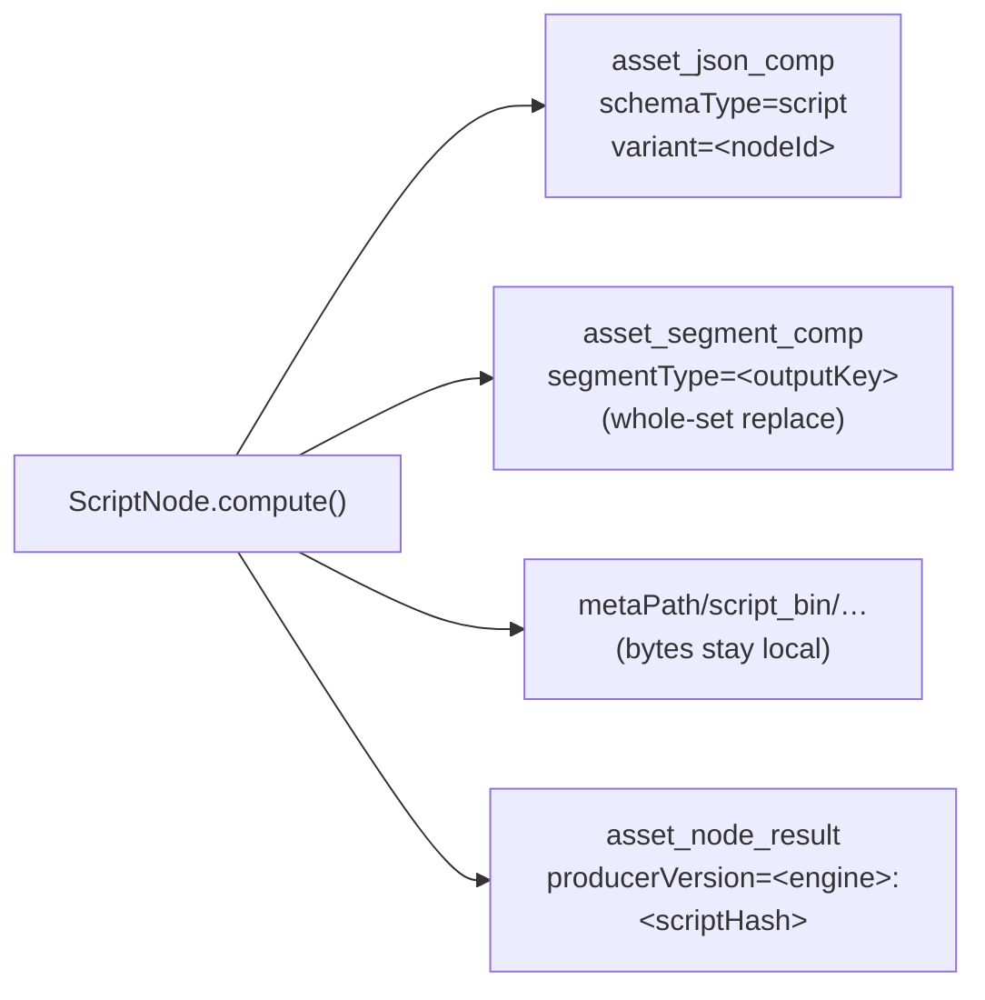

# Script Node — Design & Implementation Plan

> Design document for a new Cortex pipeline node (`script`) that executes
> **user-supplied script code inside a Loom pipeline**. It reads the media handle plus
> any number of upstream node outputs, and emits **many outputs across many data
> types** — a single text in, a list of timeframes / several images / several texts out.
>
> Read alongside [NODES.md](NODES.md) (the node system) and
> [../pipeline/PIPELINE.md](../pipeline/PIPELINE.md) (the engine that dispatches it).
> The source of truth is the code under `cortex/`; this is a plan, not a record.
>
> **Status: implemented and run.** Node kind `script`; code in
> [cortex/nodes/script](../../../cortex/nodes/script). 51 node tests, 4 parser-regression tests,
> 6 configurable-seam tests and 2 integration tests against a real Loom + pooled Postgres all pass.
> The blockers in §4 were real — three of them, one found only during implementation — and are
> fixed. §17 records what landed, what changed against this design once it met the code, and what
> is still open.

---

## 1. Motivation

The Cortex node catalogue ([NODES.md](NODES.md) §3) is a closed set of ~24 compiled
kinds. Everything a pipeline author might want that is not in that list — glue between
two nodes, a custom threshold, deriving chapter marks from a transcript, reshaping an
LLM answer into tags, emitting one image per detected scene — currently requires a new
Maven module, a Dagger binding, a descriptor, and a Cortex release.

There is today **no way to express a small piece of custom logic inside a pipeline.**
`examples/cortex-custom-node/` shows how to write a node in Java and ship your own
worker image; that is the right answer for a heavyweight, reusable capability and the
wrong answer for six lines of mapping code.

The `script` node closes that gap:

| Without a script node | With a script node |
|---|---|
| Map `whisper_result` → chapter timeframes | new Java module + release | inline JS, 8 lines |
| Threshold `blurriness` into a tag | new filter node | inline JS, 2 lines |
| Fan several LLM answers into one JSON blob | new Java module | inline JS |
| Prototype a node before committing to Java | not possible | write it as a script first, port later |

### Non-goals

- **True item fan-out** — one media item producing *N* downstream pipeline items (1 video
  → N frame items each running the rest of the DAG). That is a `PipelineRunEngine` /
  `RunStateStore` / WebSocket-protocol change and is explicitly **out of scope**. §7
  explains what is delivered instead and why it covers the stated use cases.
- **A general plugin system.** The script node runs *logic*, not new I/O backends. A node
  that needs a model, a native library or a GPU is still a Java node with a sidecar.
- **Untrusted multi-tenant script execution.** See §9: the trust boundary is
  "whoever may edit a pipeline may run code on a worker", and the sandbox is
  defence-in-depth, not a security boundary you should bet a tenancy on.

---

## 2. Decisions

> **Status: agreed.** These four choices were settled before the design; the rest of the
> document follows from them.

| Question | Decision | Rationale |
|---|---|---|
| **Engine** | **GraalJS**, behind a pluggable engine SPI | GraalJS is the only candidate with a real in-process isolation story on JDK 25 (§5). It is the only engine planned; the SPI exists so that choice stays reversible rather than to stage a queue of languages |
| **Trust model** | **Trusted by default**, per-node-instance opt-in sandbox | Scripts are authored by pipeline admins. Timeouts and output caps are always on; the sandbox is opt-in hardening (§9) |
| **"Many outputs"** | **Multi-valued outputs inside one `NodeResult`** | Satisfies every stated use case with zero change to the Loom pipeline engine (§7) |
| **Script location** | **Inline in the pipeline node options** | Versioned with the pipeline definition, editable in the pipeline editor, self-contained. A Loom-stored versioned script entity is a possible future, not phase 1 |

---

## 3. What already exists (verified against code at `29cadb66`)

> **Status: verified.** Every row below was read in this checkout.

| Concern | Reference | Notes |
|---|---|---|
| Node base class | [AbstractMediaNode](../../../cortex/common/src/main/java/io/metaloom/cortex/common/node/AbstractMediaNode.java) | `process()` → enabled → exists → `isProcessable()` → `loadAsset(sha512)` → `compute(ctx, asset)`. Supplies `recordNodeResult(...)` and `resultRef(table, uuids...)` |
| **Reading upstream outputs** | [SentimentNode.resolveText()](../../../cortex/nodes/sentiment/core/src/main/java/io/metaloom/cortex/node/sentiment/SentimentNode.java) | `ctx.upstreamOutput(nodeId, outputKey)`; `isProcessable()` false when absent. The exact pattern the script bindings wrap |
| Typed output keys | [NodeOutputKey](../../../cortex/api/src/main/java/io/metaloom/cortex/api/node/NodeOutputKey.java) | `NodeOutputKey.of(key, Class)`. Equality is **key-only**, so dynamically built keys are safe |
| Untyped output escape hatch | [NodeContext.output(String, Object)](../../../cortex/api/src/main/java/io/metaloom/cortex/api/node/context/NodeContext.java) | Already present — a script node does not need a new context API |
| JSON-comp persistence | [OCRNode.persist()](../../../cortex/nodes/ocr/core/src/main/java/io/metaloom/cortex/node/ocr/OCRNode.java) | `JsonCompCreateRequest{nodeKind, schemaType, variant, data}` → upsert on `(asset, node_kind, schema_type, variant)` |
| `variant` as a discriminator | [LLMNode.persist()](../../../cortex/nodes/llm/core/src/main/java/io/metaloom/cortex/node/llm/LLMNode.java) · [SentimentNode.persist()](../../../cortex/nodes/sentiment/core/src/main/java/io/metaloom/cortex/node/sentiment/SentimentNode.java) | One row per prompt / per text source. The script node reuses it as one row per **node id** |
| Timeframe persistence | [SegmentCompCreateRequest](../../../loom-shared/rest-model/src/main/java/io/metaloom/loom/rest/model/segmentcomp/SegmentCompCreateRequest.java) · `createAssetSegmentComps` | `(asset, node_kind, segment_type)` **whole-set replace** — surplus rows from a shorter re-run are deleted. Exactly the semantics a re-run of a script needs |
| Produced-binary precedent | [TtsNode](../../../cortex/nodes/tts/core/src/main/java/io/metaloom/cortex/node/tts/TtsNode.java) · [ImageGenNode](../../../cortex/nodes/image-generation/core/src/main/java/io/metaloom/cortex/node/imagegen/ImageGenNode.java) | Bytes go to `metaPath/<name>_bin/…`, only the ledger reaches Loom — there is no byte-ingest endpoint for produced media yet |
| Ledger | `AbstractMediaNode.recordNodeResult(asset, ctx, state, reason, producerVersion, resultRef)` | Best-effort, no-op offline. Use **this** helper, not the private duplicate in `WhisperNode` |
| In-heap skip cache | [LocalResultCache](../../../cortex/common/src/main/java/io/metaloom/cortex/common/cache/LocalResultCache.java) | Keyed by `media.absolutePath()`. ⚠️ Insufficient for this node — see §11 |
| Kind registration | [SentimentNodeModule](../../../cortex/nodes/sentiment/core/src/main/java/io/metaloom/cortex/node/sentiment/SentimentNodeModule.java) | `@Binds @IntoSet` **and** `@Binds @IntoMap @StringKey("<kind>")` — the map binding is what makes the kind executable |
| Kind → node wiring | [RegistryNodeRegistrar](../../../cortex/cli/src/main/java/io/metaloom/cortex/cli/dagger/RegistryNodeRegistrar.java) | Producers registered at bootstrap; `Provider` keeps nodes lazy |
| Per-task instantiation | [NodeTaskRunner.run()](../../../cortex/node-runtime/src/main/java/io/metaloom/cortex/runtime/NodeTaskRunner.java) | Calls `NodeFactory.createNode(nodeDef)` **per task** and flattens `task.getOptions()` onto the definition |
| UI descriptor SPI | [SentimentDescriptorProvider](../../../loom-shared/node-model/src/main/java/io/metaloom/loom/nodes/spec/SentimentDescriptorProvider.java) + `META-INF/services/…NodeDescriptorProvider` | 21 providers registered — the palette, the edit form and pipeline validation all read this |
| Content-type vocabulary | [ContentTypes](../../../loom-shared/node-model/src/main/java/io/metaloom/loom/nodes/spec/ContentTypes.java) | `data/string`, `data/text`, `data/scene`, `data/thumbnail`, `media/*`, … — already rich enough for the script value types (§7) |
| Integration-test base | `integration-test/.../node/AbstractNodeIntegrationTest.java` | Boots a real in-process Loom + pooled Postgres, hands the test a real `LoomHttpClient` |

### Four constraints that shape the design

1. **No migration needed.** Per the promotion policy in [DATABASE_TASKS.md](../db/DATABASE_TASKS.md),
   a new node kind starts in `asset_json_comp` and graduates to a typed table only when a
   query must filter on a field inside it. Timeframes have an existing typed table.
   **No Flyway change → no jOOQ regen → `./setup-pool.sh` is only the normal pre-test step.**
2. **`SecurityManager` is gone.** The reactor compiles with `<release>25</release>`
   ([pom.xml](../../../pom.xml)). `System.setSecurityManager` throws on JDK 24+, so the
   classic "run scripts under a restrictive policy" approach is unavailable to *every*
   JVM-native engine. This is the single biggest reason GraalJS leads (§5).
3. **`timeoutMs` is parsed but never enforced.** `PipelineNode.timeoutMs()` is read from
   the node definition by `RegistryNodeRegistrar.adapt()` and stored on
   `AbstractPipelineNode` — and nothing calls it. The in-Cortex DAG executor that used to
   apply it no longer exists (only `NodeTaskRunner` remains). The script node must
   therefore enforce **its own** wall clock; it cannot inherit one. This matches the open
   item "No per-node timeout" in [NODES.md](NODES.md) §10.
4. **Per-node-instance options do not currently reach any Cortex node.** This is the
   blocker. See §4.

---

## 4. 🔴 Blockers — the node-options path was broken end to end

> **Status: fixed.** All three were real, and all three were pre-existing bugs affecting every
> node's per-instance configuration, not just this one — no node parameter set in the pipeline
> editor had ever reached a worker, in either direction. B5 surfaced only during implementation.
> Each is covered by a regression test.

```
 pipeline editor            Loom                          Cortex worker
 ─────────────────────────  ────────────────────────────  ───────────────────────────
 getGraphJson()             PipelineGraphParser           RegistryNodeRegistrar.adapt()
   emits  "config": {…}  ──✗──> reads  "options"  ──✓──>    reads only id/mode/blocking/
        (B1)                    PipelineGraphNode           concurrency/syncToLoom/
                                   .getOptions()            timeoutMs  ──✗── (B2)
                                       │                          │
                                 PipelineRunEngine                └─> node options come from
                                   → NodeTask.getOptions()            worker YAML instead
                                       │
                                 NodeTaskRunner
                                   .toNodeDefinition()  ✓ flattens onto the node def
```

### B1 — the editor writes `config`, the parser reads `options`

[`PipelineEditor.getGraphJson()`](../../../loom-ui/src/features/pipeline/PipelineEditor.tsx)
serialises every non-reserved node data key into a nested `config` object:

```ts
...(configEntries.length > 0 ? { config: Object.fromEntries(configEntries) } : {}),
```

[`PipelineGraphParser`](../../../loom/pipeline/src/main/java/io/metaloom/loom/pipeline/graph/PipelineGraphParser.java)
reads `node.getJsonObject("options")`. The string `"config"` appears in **no** Java
parser in the reactor (only in an unrelated test fixture and `LoomEnv`). Parameters
edited in the UI are therefore silently dropped at the Loom boundary.

**Fix**: emit `options` from `getGraphJson()`; have `PipelineGraphParser` accept `config`
as a **legacy alias** (`options` wins if both are present) so pipelines already saved
with `config` keep working.

### B2 — `adapt()` discards per-instance options for Cortex nodes

[`RegistryNodeRegistrar.adapt()`](../../../cortex/cli/src/main/java/io/metaloom/cortex/cli/dagger/RegistryNodeRegistrar.java)
reads `id`, `mode`, `blocking`, `concurrency`, `syncToLoom`, `timeoutMs` off the node
definition and nothing else. The wrapped node's options object comes from worker-level
YAML: `cortexOptions.getNodes().get(wrapped.name())`. Only `filesystem-source` and
`asset-source` — which have hand-written producers — read their own options off the
definition.

**Fix**: a narrow, opt-in seam in `cortex/pipeline-api`:

```java
/**
 * Implemented by nodes whose configuration is per pipeline-node-instance rather than
 * per worker. RegistryNodeRegistrar.adapt() calls configure(nodeDef) before wrapping.
 */
public interface PipelineConfigurable {
    void configure(JsonObject nodeDef);
}
```

`adapt()` calls it only when `wrapped instanceof PipelineConfigurable`, so **no existing
node changes behaviour**. `ScriptNode` implements it and rebuilds its `ScriptNodeOptions`
from the definition, layering over the YAML defaults.

**Safety of mutating a node instance**: `NodeTaskRunner.run()` calls
`NodeFactory.createNode(nodeDef)` per task, the kind map holds
`Provider<FilesystemNode<?,?>>`, and node classes carry no `@Singleton` — so
`provider.get()` yields a fresh instance per task. This must become an **explicit,
tested contract** for `ScriptNode`: adding `@Singleton` to it would make two concurrent
script nodes overwrite each other's script.

### B3 — no multiline/code parameter type

[`ParameterType`](../../../loom-shared/node-model/src/main/java/io/metaloom/loom/nodes/spec/ParameterType.java)
is `STRING, INTEGER, NUMBER, BOOLEAN, ENUM, ENUM_SET`. A script body in a single-line
`TextField` is unusable.

**Fix**: add `CODE` (multiline, monospace, `language` hint) and `JSON` (for the `outputs`
and `params` bags); render both in the editor's parameter loop.

⚠️ While doing so, note the **pre-existing drift**: the UI's TS parameter types use
`FLOAT`, `STRING_LIST` and `allowedValues`; the Java enum has `NUMBER`, `ENUM_SET` and
`values`. Do not widen the drift. Reconciling it is worth a separate task.

### B5 — sidebar parameter edits were discarded on save (found during implementation)

Parameter edits went into `selected.definition`, but `handleSave` serialises `graphJson`, which
`getGraphJson()` builds from the **React Flow canvas** node data — so an edit made in the node
sidebar never reached the saved definition. Fixed with a `nodeParameters` channel mirroring edits
onto the canvas, alongside the existing display-name and affinity channels. The same effect
recomputes a script node's output connectors as its `outputs` declaration is edited.

Reading was broken symmetrically: `toRFNodes` spread `n.data`, so a definition stored with
`options` came back with no parameters at all. All definition-node reads now go through
`pipelineNodeOptions(node)`, which resolves `options ?? config ?? data`.

### B4 — output connectors are static per kind

`descriptorConnectors(desc)` in the editor derives handles from `NodeDescriptor.outputs`.
A script node's outputs are declared per instance, so the editor must prefer the node's
own `outputs` option when present and fall back to the descriptor otherwise.

---

## 5. Execution options — the engine survey

> **Status: survey complete, GraalJS selected — and the only engine planned.** This is the
> "multiple options for executing scripts" the design was asked to lay out. Everything below other
> than GraalJS was considered and **is not planned**; the SPI in §6 keeps any of them reachable
> later without a rewrite, but none is scheduled.

| Option | Language | Isolation on JDK 25 | Cold start | Throughput | Dependency weight | Verdict |
|---|---|---|---|---|---|---|
| **GraalJS (polyglot)** | JavaScript / ECMAScript | **Real**: `HostAccess` allow-list, `allowIO(false)`, `allowCreateThread(false)`, `ResourceLimits.statementLimit`, `Context.close(true)` from a watchdog | ~100–300 ms first context, then cheap per-execution | Interpreted on a stock JDK (no Graal JIT); fine for glue logic, poor for tight numeric loops | Large — `polyglot` + `js-community` add tens of MB to the shaded jar and the container image | ✅ **Phase 1.** The only candidate that can be meaningfully restricted in-process |
| **GraalPy** | Python | Same controls as GraalJS | Very high (seconds) and memory-hungry | Poor for CPython-shaped code | Very large | ❌ Startup cost and memory are wrong for a per-item node |
| **Expression languages** (JEXL, MVEL, CEL) | expression DSL | Good — small surface by construction | Negligible | Excellent | Tiny | ❌ Cannot express the multi-output model. Worth revisiting for a future lightweight `expression` **filter** node |
| **In-memory Java** (`javax.tools`, JShell) | Java | **None** — compiled code is ordinary host code | Slow first compile (~1 s) | Native | None (JDK built-in) | ❌ No isolation whatsoever, and `examples/cortex-custom-node/` already serves "I want Java" |
| **WASM** (GraalWasm, Chicory) | anything compiling to WASM | **Strongest in-process** — memory-sandboxed by construction | Low | Good | Moderate | ❌ Ergonomics are wrong for six lines of glue. Revisit if untrusted execution ever becomes a requirement |

### Why GraalJS

A JVM-native scripting language would be the more natural fit for this codebase, and was the
starting suggestion. It loses on exactly one point: **on JDK 25 there is no way to constrain what
a JVM-native script may do beyond an AST allow-list.** `SecurityManager` was removed in JDK 24, and
AST allow-lists have a long history of bypasses (string-based dispatch, metaclass tricks, dynamic
class loading). GraalJS's `Context.Builder` gives an actual capability model instead: the script
sees only the host objects it is explicitly handed.

That is what makes the sandbox mode in §9 a real control rather than a label — and it is why one
engine is enough. Adding a second whose sandbox does not hold would mean shipping a `trusted`
switch that silently means different things depending on the engine.

### Costs to accept openly

- **Artifact size.** `org.graalvm.polyglot:polyglot` + `js-community` is the largest
  dependency the cortex worker would take on. Measure the shaded `cortex/cli` jar and the
  container image before and after, and record both in the implementation report.
- **Interpreted execution.** Without the Graal JIT, GraalJS runs in Truffle's fallback
  interpreter. Adequate for glue; document it so nobody ships a per-frame image filter as
  a script.
- **Version pinning.** Pin an explicit GraalVM polyglot version and verify it on JDK 25 in
  phase 1 — do not float the version.

---

## 6. Node design

> **Status: built.** Module shape follows `cortex/nodes/sentiment` exactly.

```
cortex/nodes/script/
├── pom.xml                       # artifactId cortex-script, packaging pom, <module>core</module>
└── core/
    ├── pom.xml                   # artifactId cortex-script-node
    └── src/main/java/io/metaloom/cortex/node/script/
        ├── ScriptNode.java            # extends AbstractMediaNode<ScriptNodeOptions>
        │                              #   implements PipelineConfigurable
        ├── ScriptNodeOptions.java
        ├── ScriptNodeModule.java      # @IntoSet + @IntoMap @StringKey("script")
        ├── ScriptOutputSpec.java      # record(key, ScriptValueType)
        ├── ScriptValueType.java       # enum, see §7
        └── engine/
            ├── ScriptEngine.java      # SPI
            ├── CompiledScript.java
            ├── ScriptBindings.java    # the script-facing façade
            ├── ScriptLimits.java
            ├── ScriptException.java
            └── js/GraalJsScriptEngine.java
```

### Engine SPI

```java
public interface ScriptEngine {
    /** Stable id used by ScriptNodeOptions.engine — "js". */
    String id();

    /** Compile once per (script, limits); the result is reused for every media item. */
    CompiledScript compile(String source, ScriptLimits limits) throws ScriptException;
}

public interface CompiledScript extends AutoCloseable {
    void execute(ScriptBindings bindings) throws ScriptException;
}
```

Engines are contributed by Dagger **exactly like node kinds are**:

```java
@Binds @IntoMap @StringKey("js")
abstract ScriptEngine bindJsEngine(GraalJsScriptEngine engine);
```

`ScriptNode` injects `Map<String, Provider<ScriptEngine>>`. Adding an engine is a one-line
binding in its own module — never an edit to `ScriptNode`. An unknown `engine` value fails
in `configure(...)` / `validate()`, not on the first media item.

### The script-facing binding contract

This table is the **public API of the node** — it is what pipeline authors write against,
so it must be documented on the website and changed only additively.

| Binding | Shape | Notes |
|---|---|---|
| `media` | `{ path, absolutePath, size, sha512, isVideo, isImage, isAudio, isDocument, mimeType }` | Read-only façade over [LoomMedia](../../../cortex/api/src/main/java/io/metaloom/cortex/api/media/LoomMedia.java). **Not** the `LoomMedia` object itself — handing out the real handle would leak `file()`/`open()` past the sandbox |
| `upstream` | `upstream["whisper"]["whisper_result"]` | Straight from `ctx.upstreamOutputs()`. Missing node or key → `undefined` (never throws) |
| `params` | free-form JSON object from `ScriptNodeOptions.params` | Lets one script be reused across node instances with different constants |
| `out` | `out.text(k,v)` `out.number(k,v)` `out.integer(k,v)` `out.bool(k,v)` `out.json(k,v)` `out.list(k,[…])` `out.timeframes(k,[…])` `out.image(k, bytes\|path)` `out.set(k,v)` | The **only** way to produce results |
| `log` | `log.info/warn/error(msg)` | Routed to the node logger, prefixed `[<nodeId>]`, capped at `maxLogLines` |
| `ctx` | `ctx.skip(reason)` · `ctx.fail(msg)` | Map to `SKIPPED` / `FAILED` `NodeResult`. Both stop the script |
| `http` | `http.get(url)` / `http.postJson(url, body)` | Present **only** when `allowNetwork` is true |
| `fs` | `fs.readText(path)` / `fs.readBytes(path)` | Present **only** when `allowFilesystem` is true. Read-only by design — a script that needs to write produces an `IMAGE`/`PATH` output instead |

### Node lifecycle

`ScriptNode` slots into the standard `AbstractMediaNode` lifecycle:

- `isProcessable(ctx)` — `enabled`, the engine resolves, the script compiled, and every
  `requiredInput` (an optional `nodeId:outputKey` list, mirroring
  `SentimentNodeOptions.textSources`) is present. Absent required input → `SKIPPED`, not
  `FAILED`: a script downstream of an optional branch must not redden the run.
- `compute(ctx, asset)` — cache lookup (§11) → `bindings.execute()` → coerce and validate
  declared outputs → `ctx.output(...)` per key → persist (§8) → `recordNodeResult(...)`.
- Compilation happens **once** per `(script, limits)` in `configure(...)`, not per media
  item.

### Example — transcript to chapter timeframes

```json
{
  "id": "chapter-marks",
  "type": "script",
  "options": {
    "engine": "js",
    "timeoutMs": 5000,
    "requiredInputs": ["whisper:whisper_result"],
    "params": { "pattern": "chapter|intro|outro" },
    "outputs": [
      { "key": "chapter_frames", "type": "TIMEFRAMES" },
      { "key": "chapter_count",  "type": "INTEGER" },
      { "key": "chapter_titles", "type": "TEXT_LIST" }
    ],
    "script": "…"
  }
}
```

```js
const re = new RegExp(params.pattern, "i");
const transcript = JSON.parse(upstream["whisper"]["whisper_result"]);

const frames = transcript.segments
  .filter(s => re.test(s.text))
  .map(s => ({ startMs: Math.round(s.start * 1000),
               endMs:   Math.round(s.end   * 1000),
               label:   s.text.trim() }));

if (frames.length === 0) {
  ctx.skip("no chapter markers in transcript");
}

out.timeframes("chapter_frames", frames);
out.integer("chapter_count", frames.length);
out.list("chapter_titles", frames.map(f => f.label));
log.info(`derived ${frames.length} chapter marks`);
```

One media item in; three outputs out, two of them multi-valued — a list of timeframes and
a list of texts. `chapter_frames` lands in `asset_segment_comp` as a real timeline;
the rest land in one `asset_json_comp` row.

---

## 7. Outputs — "many outputs, all data types"

> **Status: built.** This is the core of the request and the part that deliberately
> stops short of a pipeline-engine change.

### Declared, not discovered

Output keys and types are **configuration**; their values are **runtime**. This is not a
compromise, it is a requirement: the pipeline editor must draw output handles, and
downstream nodes must be connectable to them, long before the script has ever run. A
fully dynamic output set would make a script node unconnectable in the graph.

So `outputs` is a declared list of `{key, type}`. At the end of execution:

- declared **and** set → coerced, validated, emitted;
- declared **and not** set → omitted (a downstream node sees `undefined` — normal);
- **not** declared but set → **hard failure**. This catches typos and stops the graph from
  quietly diverging from the declaration the editor drew.

### `ScriptValueType`

| Type | `NodeResult` value | `ContentTypes` | Persistence |
|---|---|---|---|
| `STRING` | `String` | `data/string` | JSON-comp field |
| `TEXT` | `String` | `data/text` | JSON-comp field |
| `INTEGER` | `Long` | `data/integer` | JSON-comp field |
| `NUMBER` | `Double` | `data/number` | JSON-comp field |
| `BOOLEAN` | `Boolean` | `data/boolean` | JSON-comp field |
| `JSON` | `JsonObject` | `data/text` | JSON-comp field |
| `TEXT_LIST` | `List<String>` | `data/text` | JSON-comp field |
| `TIMEFRAMES` | `List<JsonObject{startMs,endMs,label,data}>` | `data/scene` | `createAssetSegmentComps`, `segmentType` = the output's **declared** segment type (§17.2) |
| `IMAGE` | `String` (path) | `data/thumbnail` | bytes → `script_bin`, ledger only |
| `IMAGE_LIST` | `List<String>` (paths) | `data/thumbnail` | bytes → `script_bin`, ledger only |
| `PATH` | `String` | `data/path` | JSON-comp field |

The content-type column feeds `NodeDescriptor.outputs`-shaped connector metadata so the
editor can colour and type-check edges using the machinery it already has
(`toConnectorDataType`).

### Why this covers the ask without item fan-out

> "input a single text and output a stream of timeframes or images or multiple texts"

Each of those is a **multi-valued output on one item**, not a multiplication of items:

- *stream of timeframes* → one `TIMEFRAMES` output, `N` entries, persisted as `N` rows in
  `asset_segment_comp` — a genuine timeline on the asset, queryable and rendered by the UI.
- *multiple texts* → one `TEXT_LIST` output. A downstream node reads the list.
- *images* → one `IMAGE_LIST` output; the bytes land in `script_bin` and the paths flow
  downstream, exactly as `ThumbnailNode` / `ImageGenNode` already do.

What this **cannot** do is make the rest of the DAG execute once per emitted element. If
that is ever needed — "one item per detected scene, each running facedetect" — it is a
`PipelineRunEngine` / `RunStateStore` / item-accounting change of its own, and it should be
specified in [../pipeline/PIPELINE.md](../pipeline/PIPELINE.md), not smuggled in behind a
script node. Recorded as an open item in §14.

---

## 8. Persistence

> **Status: built. No migration required** — confirmed by running the integration test against a
> pooled database. See §17.2 for the two details the schema forced.



1. **Scalar / list / JSON outputs** → one `asset_json_comp` row via `createAssetJsonComp`
   with `nodeKind = "script"`, `schemaType = "script"`, and **`variant = nodeId`**. The
   natural key is `(asset, node_kind, schema_type, variant)`, so several script nodes in
   one pipeline coexist on one asset without collision — the same trick `LLMNode` uses per
   prompt and `SentimentNode` per text source.
2. **`TIMEFRAMES` outputs** → one `createAssetSegmentComps` call per output, under the output's
   declared `segmentType` and scoped to `nodeKind = "script:<nodeId>"`. Whole-set replace means a
   re-run producing fewer segments correctly deletes the surplus. ⚠️ Both details are forced by the
   schema rather than chosen — see §17.2.
3. **`IMAGE` / `IMAGE_LIST`** → bytes written to
   `metaPath/script_bin/<nodeId>/<sha512-segment>/<key>-<n>.png`; the output value is the
   path. Ledger only — there is no byte-ingest endpoint for produced media
   ([NODES.md](NODES.md) §2).
4. **Always** `recordNodeResult(asset, ctx, state, reason, producerVersion, resultRef)`
   with

   ```
   producerVersion = "<engineId>:" + sha256(script).substring(0, 12)
   ```

   which gives this node the per-node versioning that [NODES.md](NODES.md) §10 lists as
   missing everywhere else: the ledger records *which script* produced a result, so a
   changed script is visibly a different producer.

All of it is guarded by `asset != null && client() != null`, so offline mode is a clean
no-op, and all of it is best-effort: a persistence failure is logged and recorded in the
ledger, never thrown.

---

## 9. Trust, sandbox and limits

> **Status: built, and the open verification is resolved** — see the note at the end of this
> section. Memory remains unbounded.

### The trust boundary

**Permission to edit a pipeline is permission to execute code on a worker.** That is the
honest statement of the model and it must appear in the website documentation. A script
node in a pipeline definition is arbitrary code that a Cortex worker will run with the
worker's privileges.

Mitigations that already exist and should be pointed at rather than reinvented:

- `MANAGE_PIPELINE` permission gates who can author definitions
  ([../permissions/PERMISSIONS.md](../permissions/PERMISSIONS.md)).
- `CORTEX_NODE_BLACKLIST=script` disables the kind on a worker outright, and blacklist
  beats whitelist ([NODES.md](NODES.md) §11). **This is the operational kill switch** —
  document it prominently.
- Loom rejects a run with **503** when no online worker accepts a kind in the graph, so a
  fleet-wide blacklist produces a clear error rather than a stalled run.

### Two modes

| | `trusted = true` (default) | `trusted = false` |
|---|---|---|
| Host access | `allowAllAccess(true)` | `HostAccess.EXPLICIT`, restricted to the binding façade classes |
| Class lookup | unrestricted | `allowHostClassLookup(c -> false)` |
| I/O | unrestricted | `allowIO(false)`; `fs` binding absent unless `allowFilesystem` |
| Threads | allowed | `allowCreateThread(false)` |
| Network | allowed | `http` binding absent unless `allowNetwork` |

### Always on, in both modes

- **Wall-clock timeout.** `timeoutMs` (default 10 000), enforced by a watchdog that calls
  `Context.close(true)` on the executing context. This must be the node's own watchdog —
  `PipelineNode.timeoutMs()` is parsed and stored but **never enforced** by anything in the
  tree today (§3, constraint 3).
- **Statement limit.** `ResourceLimits.newBuilder().statementLimit(n, null)` bounds
  runaway loops portably, including on the fallback interpreter. ✅ Verified on JDK 25 with the
  stock (non-GraalVM) runtime.
- **Output cap.** `maxOutputBytes` (default 1 MiB) over the encoded output bag; exceeding
  it fails the node rather than shipping an unbounded payload to Loom.
- **Log cap.** `maxLogLines` (default 200).

✅ **Resolved.** The statement limit, the `close(true)` watchdog and the `HostAccess.EXPLICIT` +
`allowHostClassLookup(false)` sandbox were all verified working on GraalJS 25.0.0 running on this
stock JDK 25 — a spinning script is cancelled by either guard, and a sandboxed script cannot reach
`java.lang.System`. **Memory remains unbounded**: heap and CPU-time `ResourceLimits` need the
optimized Truffle runtime, which a stock JDK does not provide. Do not claim a memory bound.

---

## 10. Configuration

### Node options (`ScriptNodeOptions`, config key `script`)

| Field | Type | Default | Purpose |
|---|---|---|---|
| `engine` | String | `js` | Engine id — must exist in the engine map |
| `script` | String | — | The script body. **Required** |
| `outputs` | List&lt;{key,type}&gt; | `[]` | Declared outputs (§7). Keys must match `^[a-z0-9][a-z0-9_]{0,62}$` |
| `params` | JSON object | `{}` | Constants handed to the script as `params` |
| `requiredInputs` | List&lt;String&gt; | `[]` | `nodeId:outputKey` entries; all must be present or the node skips |
| `trusted` | boolean | `true` | Sandbox off/on (§9) |
| `allowNetwork` | boolean | `false` | Expose the `http` binding |
| `allowFilesystem` | boolean | `false` | Expose the read-only `fs` binding |
| `timeoutMs` | long | `10000` | Wall-clock budget per media item |
| `statementLimit` | long | `10_000_000` | Runaway-loop guard |
| `maxOutputBytes` | int | `1048576` | Cap on the encoded output bag |
| `maxLogLines` | int | `200` | Cap on `log.*` calls |
| `enabled` / `processIncomplete` / `retryFailed` | boolean | inherited | From `AbstractNodeOptions` |

`validate()` must reject: blank `script`, unknown `engine`, empty or malformed `outputs`,
duplicate output keys, malformed `requiredInputs` (`nodeId:outputKey` shape — reuse the
check in `SentimentNodeOptions.validate()`), and non-positive `timeoutMs` /
`maxOutputBytes` / `maxLogLines`.

### Environment variables

The script node is configured **per pipeline node instance**, so it introduces no
dedicated environment variables. These existing ones affect it:

| Variable | Default | Relevance to `script` |
|---|---|---|
| `CORTEX_META_PATH` | — | Parent of `script_bin/`, where `IMAGE` outputs are written |
| `CORTEX_NODE_BLACKLIST` | — | Set to `script` to refuse the kind on a worker — **the kill switch** (§9) |
| `CORTEX_NODE_WHITELIST` | all registered kinds | Omit `script` to restrict scripting to dedicated workers |
| `CORTEX_CONF_FILENAME` | — | `cortex.yml`; a `nodes.script` block supplies worker-level defaults that a node instance layers over. ⚠️ See [../../cortex/CONFIGURATION.md](../../cortex/CONFIGURATION.md) — the YAML layer is **not read on the server path** |

### UI descriptor

`ScriptDescriptorProvider` (registered in
`loom-shared/node-model/src/main/resources/META-INF/services/io.metaloom.loom.nodes.spec.NodeDescriptorProvider`):

- `kind = "script"`, `category = TRANSFORM`, `icon = "code"`, `defaultBlocking = true`.
- `inputs`: one optional `media/*` plus one optional `data/*` — the real dependency set is
  whatever edges the author draws.
- `outputs`: **empty** in the descriptor. The editor overrides connectors from the node's
  own `outputs` option (B4).
- `parameters`: `script` as `CODE` (language hint from `engine`), `outputs` and `params` as
  `JSON`, the rest as `STRING`/`BOOLEAN`/`INTEGER`, plus the three common ones.

---

## 11. Conventions and Gotchas

| Area | Gotcha |
|---|---|
| **Cache key must include the script** | Every other node keys `LocalResultCache` by `media.absolutePath()`. `ScriptNode` **must** key by `absolutePath + "\|" + scriptHash` — otherwise editing a script silently re-emits stale results for the worker's lifetime, with no way to invalidate short of a restart |
| **`ScriptNode` must not be `@Singleton`** | Per-instance configuration mutates the node. `NodeTaskRunner` creates one per task via `Provider.get()`; adding `@Singleton` would let two concurrent script nodes overwrite each other's script. Assert this in a test |
| **`timeoutMs` on `PipelineNode` does nothing** | It is parsed by `adapt()` and stored on `AbstractPipelineNode`, and nothing enforces it. Do not rely on it — the node owns its watchdog (§9) |
| **Editor parameters are dropped today** | `config` vs `options` (B1). Any node-parameter work must fix this first, or it will appear to work in the editor and silently do nothing at runtime |
| **Compile once, execute many** | Compile in `configure(...)`, not in `compute(...)`. A per-item compile turns a 2 ms script into a 200 ms one |
| **Undeclared output = failure** | Deliberate. A silently-dropped typo would make the graph lie about what flows down an edge |
| **`out.image` bytes stay local** | There is no byte-ingest endpoint for produced media. Downstream consumers get a **path on that worker** — meaningful only to nodes on the same worker (use an `affinity` group) |
| **Segment outputs are whole-set replace** | Correct for re-runs, but it means two script nodes must not share a `segmentType`: the second would wipe the first. Since `segmentType = outputKey`, keep output keys unique across script nodes in a pipeline |
| **`SecurityManager` is unavailable** | JDK 25. Never propose a policy-file sandbox for any JVM engine (§3) |
| **GraalJS is interpreted here** | No Graal JIT on a stock JDK. Glue logic only; do not ship per-frame processing as a script |
| **Descriptor registry claim in NODES.md is stale** | §10 says "no nodes register descriptors" — 21 providers are registered. Fix it in this change ([CONTEXT.md](../../CONTEXT.md) §0.4: the code wins, and you fix the spec in the same change) |

---

## 12. Implementation phases

> **Status: all three phases built.** Each was independently shippable and independently testable;
> §17 records the outcome.

### Phase 0 — unblock the node-options path (§4)

| Change | File |
|---|---|
| Emit `options` instead of `config` | [PipelineEditor.tsx](../../../loom-ui/src/features/pipeline/PipelineEditor.tsx) `getGraphJson()` |
| Accept `config` as a legacy alias (`options` wins) | [PipelineGraphParser.java](../../../loom/pipeline/src/main/java/io/metaloom/loom/pipeline/graph/PipelineGraphParser.java) |
| Add `PipelineConfigurable` | `cortex/common/.../node/PipelineConfigurable.java` — it takes a `JsonObject` and the nodes that implement it live below `cortex/common`, so `pipeline-api` (which has no Vert.x dependency) was the wrong home |
| Call it from `adapt()` when implemented | [RegistryNodeRegistrar.java](../../../cortex/cli/src/main/java/io/metaloom/cortex/cli/dagger/RegistryNodeRegistrar.java) |
| Add `ParameterType.CODE` and `JSON` | [ParameterType.java](../../../loom-shared/node-model/src/main/java/io/metaloom/loom/nodes/spec/ParameterType.java) |
| Render `CODE` (multiline monospace) and `JSON` | `PipelineEditor.tsx` parameter loop |
| Per-node connector override | `PipelineEditor.tsx` `descriptorConnectors` call sites |

Phase 0 is valuable on its own: it is the difference between "node parameters in the
editor work" and "node parameters in the editor have never worked".

### Phase 1 — the node with GraalJS

Module skeleton, `ScriptNodeOptions` + validation, engine SPI, `GraalJsScriptEngine`,
`ScriptBindings`, declared-output coercion, `asset_json_comp` persistence, ledger with the
script-hash producer version, `ScriptDescriptorProvider`, Dagger bindings, unit +
options + pipeline + persistence tests.

### Phase 2 — the richer output types

`TIMEFRAMES` → `createAssetSegmentComps`; `IMAGE`/`IMAGE_LIST` → `script_bin`; sandbox
mode (`trusted=false`) with the `HostAccess` allow-list and the `http`/`fs` gates;
statement limit and watchdog verification (§9's open item).

### Definition-of-done (from [../../guidelines/CODING.md](../../guidelines/CODING.md) + [../../guidelines/NEW_NODE.md](../../guidelines/NEW_NODE.md))

- [ ] `script` documented in [NODES.md](NODES.md) §3 (node table), §5 (options), §8 (Dagger), §12 (capability matrix)
- [ ] Stale "descriptor registry is not populated" claim in NODES.md §10 corrected
- [ ] Customer-facing page under `website/content/english/docs` — the binding contract (§6), the output types (§7), and the trust statement (§9), written for customers with no spec references
- [ ] A demo script pipeline in `DemoDatabaseInitializer` (`loom/core/.../boot/`)
- [ ] This file updated with what actually landed, per [../../SPEC_RULES.md](../../SPEC_RULES.md)

---

## 13. Test setup

> **Status: built and passing.** Follows the four-test shape the `sentiment` node established.
> **No Flyway change**, so `./setup-pool.sh` is only the normal pre-test step.

| Test | Location | Asserts |
|---|---|---|
| `ScriptNodeTest` | `cortex/nodes/script/core/src/test/…` | Runs the **real** GraalJS engine against a temp file, no Loom: declared outputs emitted with correct types; `TIMEFRAMES` and `TEXT_LIST` round-trip multi-valued; an undeclared key fails the node; `ctx.skip()` → `SKIPPED` and `ctx.fail()` → `FAILED`; an infinite loop is killed by `timeoutMs`; a `trusted=false` script cannot reach `java.lang.System`; `params` and `upstream` arrive intact |
| `ScriptOptionsValidationTest` | same | Blank script, unknown engine, empty/duplicate/malformed `outputs`, malformed `requiredInputs`, non-positive limits |
| `ScriptNodePipelineTest` | same | The node inside a DAG with a mocked upstream, reading via `ctx.upstreamOutput(...)`; missing required input → `SKIPPED` |
| `ScriptNodePersistenceTest` | same | With a `LoomClientMock`: one `asset_json_comp` with `variant = nodeId`, segment comps per `TIMEFRAMES` key, ledger with `producerVersion = "js:<hash>"`. ⚠️ Do **not** pass a null client — that skips all write-back coverage |
| `ScriptNodeIntegrationTest` | `integration-test/.../node/` | Real in-process Loom + pooled Postgres + real `LoomHttpClient`: the JSON comp and the segment comps land and read back over REST |
| **Phase 0 regression** | `loom/pipeline` + `cortex/cli` tests | Node options survive editor JSON → `PipelineGraphParser` → `NodeTask` → `PipelineConfigurable.configure(...)`. Include a `config`-shaped legacy definition to prove the alias |
| **Cache-key test** | `ScriptNodeTest` | Same media, changed script → recomputed, **not** a `LOCAL` cache hit (§11) |
| **Not-a-singleton test** | `ScriptNodeTest` | Two instances from the provider carry independent scripts |
| UI | `loom-ui/e2e/*-mocked.spec.ts` | The `CODE` parameter renders multiline; output handles follow the `outputs` option |

```bash
mvn -T 8 test -pl cortex/nodes/script -am          # node tests
./setup-pool.sh && mvn verify -pl integration-test # integration
cd loom-ui && npm run test:e2e                     # editor
```

**Manual E2E** (the step this design cannot substitute for): `./start-demo.sh`, build a
`filesystem-source` → `whisper` → `script` pipeline in the editor with the §6 example
script, run it, and confirm the chapter timeframes appear on the asset and the JSON
component carries the counts.

---

## 14. Key Classes Reference

Classes marked ✨ are **new**; the rest exist and are reused or modified.

| Class | Package / path | Purpose |
|---|---|---|
| ✨ `ScriptNode` | `io.metaloom.cortex.node.script` | The node. `AbstractMediaNode<ScriptNodeOptions>` + `PipelineConfigurable` |
| ✨ `ScriptNodeOptions` | same | Options + validation (§10) |
| ✨ `ScriptNodeModule` | same | Dagger: `@IntoSet`, `@IntoMap @StringKey("script")`, option deserializer info |
| ✨ `ScriptValueType` / `ScriptOutputSpec` | same | Declared output model (§7) |
| ✨ `ScriptEngine` / `CompiledScript` | `…node.script.engine` | Engine SPI |
| ✨ `ScriptBindings` / `ScriptLimits` | same | The script-facing façade and its caps |
| ✨ `GraalJsScriptEngine` | `…node.script.engine.js` | GraalJS implementation |
| ✨ `PipelineConfigurable` | `io.metaloom.cortex.common.node` | Per-instance configuration seam (B2) |
| ✨ `ScriptDescriptorProvider` | `io.metaloom.loom.nodes.spec` | UI palette + edit form + validation |
| `AbstractMediaNode` | `io.metaloom.cortex.common.node` | Lifecycle, `recordNodeResult`, `resultRef` |
| `NodeContext` | `io.metaloom.cortex.api.node.context` | `output()`, `upstreamOutput()`, `skipped()`, `failure()` |
| `LocalResultCache` | `io.metaloom.cortex.common.cache` | In-heap skip cache — key must be extended (§11) |
| `RegistryNodeRegistrar` | `io.metaloom.cortex.cli.dagger` | `adapt()` — where the config seam is invoked |
| `RegistryNodeFactory` | `io.metaloom.cortex.pipeline.loader` | kind → producer registry |
| `NodeTaskRunner` | `io.metaloom.cortex.runtime` | Per-task node instantiation and execution |
| `PipelineGraphParser` | `io.metaloom.loom.pipeline.graph` | Reads `options` off node definitions (B1) |
| `ParameterType` | `io.metaloom.loom.nodes.spec` | Needs `CODE` and `JSON` (B3) |
| `SegmentCompCreateRequest` | `io.metaloom.loom.rest.model.segmentcomp` | Timeframe persistence |
| `JsonCompCreateRequest` | `io.metaloom.loom.rest.model.jsoncomp` | Scalar/list/JSON persistence |

---

## 15. Where do I find …?

| Need | Path |
|---|---|
| The node system as a whole | [NODES.md](NODES.md) |
| A reference node to copy | `cortex/nodes/sentiment/` (options + upstream text + JSON comp + variant) |
| A node that writes timeframes | `cortex/nodes/scene-detection/` |
| A node that writes produced bytes | `cortex/nodes/tts/`, `cortex/nodes/image-generation/` |
| Where kinds become executable | `cortex/cli/.../dagger/RegistryNodeRegistrar.java` + each node's module |
| Where node options are parsed on the Loom side | `loom/pipeline/.../graph/PipelineGraphParser.java` |
| Where node options are dispatched | `loom/pipeline/.../engine/PipelineRunEngine.java` → `loom-shared/pipeline-model/.../NodeTask.java` |
| Where node options reach the node | `cortex/node-runtime/.../NodeTaskRunner.toNodeDefinition()` |
| UI palette / edit form source | `loom-shared/node-model/.../spec/*DescriptorProvider.java` + the ServiceLoader file |
| The pipeline editor | `loom-ui/src/features/pipeline/PipelineEditor.tsx` |
| Worker kind restriction (kill switch) | [NODES.md](NODES.md) §11, `CORTEX_NODE_BLACKLIST` |
| Per-node integration-test base | `integration-test/.../node/AbstractNodeIntegrationTest.java` |

---

## 16. Progress Assessment

### Blockers (phase 0) ✅

- [x] **B1** — `PipelineEditor.getGraphJson()` emits `config`; `PipelineGraphParser` reads `options`. Editor-set node parameters have never reached a worker
- [x] **B1b** — `PipelineGraphParser` accepts `config` as a legacy alias, `options` wins
- [x] **B2** — `PipelineConfigurable` seam added and invoked from `RegistryNodeRegistrar.adapt()`
- [x] **B3** — `ParameterType.CODE` + `JSON` added and rendered in the editor
- [x] **B4** — per-node dynamic output connectors in the editor
- [x] Regression test proving options survive editor → parser → `NodeTask` → node

### Phase 1 — GraalJS script node ✅

- [x] `cortex/nodes/script` module skeleton (parent pom + `core`)
- [x] GraalVM polyglot version pinned and verified on JDK 25; jar/image size delta measured
- [x] Engine SPI + Dagger `@IntoMap @StringKey` engine registry
- [x] `GraalJsScriptEngine` with compile-once semantics
- [x] `ScriptBindings` — `media`, `upstream`, `params`, `out`, `log`, `ctx`
- [x] Declared-output coercion + undeclared-key failure
- [x] `asset_json_comp` persistence with `variant = nodeId`
- [x] Ledger with `producerVersion = "<engine>:<scriptHash>"`
- [x] `LocalResultCache` keyed by path **+ script hash**
- [x] `ScriptNode` proven non-singleton by test
- [x] `ScriptDescriptorProvider` + ServiceLoader registration
- [x] `ScriptNodeTest`, `ScriptOptionsValidationTest`, `ScriptNodePipelineTest`, `ScriptNodePersistenceTest`
- [x] `ScriptNodeIntegrationTest`

### Phase 2 — richer outputs and sandbox ✅

- [x] `TIMEFRAMES` → `createAssetSegmentComps` per output key
- [x] `IMAGE` / `IMAGE_LIST` → `metaPath/script_bin/…`
- [x] `trusted=false` sandbox: `HostAccess.EXPLICIT`, no class lookup, no IO, no threads
- [ ] `http` / `fs` bindings gated by `allowNetwork` / `allowFilesystem` — **not implemented**;
      the flags are carried and validated but no binding is installed yet (§17.4)
- [x] Watchdog timeout + `statementLimit` verified
- [x] Confirmed: CPU/heap `ResourceLimits` need the optimized Truffle runtime and are **not**
      available on a stock JDK 25. `statementLimit` and the watchdog are; memory stays unbounded (§9)

### Documentation and demo ✅

- [x] [NODES.md](NODES.md) §2/§3/§5/§5.1/§12 updated for the `script` kind
- [x] [NODES.md](NODES.md) §10 stale "descriptor registry is not populated" claim corrected
- [x] [NODES.md](NODES.md) §10 gains two defects found here: unenforced `PipelineNode.timeoutMs()`
      and `ctx.failure(...).next()` reporting SUCCESS in eleven nodes
- [x] Customer-facing page under `website/content/english/docs`
- [x] Demo script pipeline in `DemoDatabaseInitializer`
- [x] This file updated to record what landed

### Deliberately not built

- [ ] ~~True item fan-out~~ — out of scope (§1, §7). If it is ever needed, specify it in [../pipeline/PIPELINE.md](../pipeline/PIPELINE.md) as an engine change, not as a node feature
- [ ] ~~Loom-stored versioned script entity~~ — inline-in-definition was chosen (§2). Revisit if script reuse across pipelines becomes a real need; the `skill` / `skill_version` pair is the model to copy
- [ ] ~~Expression-language engine~~ — cannot express the output model (§5). Possibly a future lightweight `expression` **filter** node instead

---

## 17. Build record — what actually landed

> Everything this document plans is built and tested.

### 17.1 What was built

| Area | Landed |
|---|---|
| Node | `cortex/nodes/script` → `ScriptNode`, `ScriptNodeOptions`, `ScriptNodeModule`, `ScriptValueType`, `ScriptOutputSpec` |
| Engine | `ScriptEngine` / `CompiledScript` SPI + `GraalJsScriptEngine`, GraalVM polyglot **25.0.0** pinned |
| Bindings | `ScriptBindings`, `ScriptOutputCollector`, `ScriptLogger`, `ScriptSignal` — `media`, `upstream`, `params`, `out`, `log`, `ctx` |
| Config seam | `io.metaloom.cortex.common.node.PipelineConfigurable`, invoked from `RegistryNodeRegistrar.adapt()` |
| Loom | `PipelineGraphParser` accepts `config` as a legacy alias for `options` |
| Descriptor | `ScriptDescriptorProvider`; `ParameterType.CODE` + `JSON`; `NodeParameter.language` / `.rows` |
| UI | `getGraphJson()` emits `options`; `pipelineNodeOptions()` helper; `CODE`/`JSON` fields; `nodeConnectors()` derives a script node's handles from its declared outputs; `nodeParameters` channel |
| Docs | [NODES.md](NODES.md) §2/§3/§5/§5.1/§10/§12, `website/content/english/docs/nodes/script/`, a "Reading Time (Script)" demo pipeline in `DemoDatabaseInitializer` |

**Tests** — 51 in the node module, 4 parser-regression, 6 configurable-seam, 2 integration against a
real in-process Loom + pooled Postgres, plus the descriptor ServiceLoader guard (19 providers / 32
kinds). The demo pipeline's seeded script is itself executed by a test, because demo data that does
not run is worse than none.

### 17.2 Where the code changed the design

Three things did not survive contact with the codebase. Each is a case of the design being
plausible and the code disagreeing — which, per [CONTEXT.md](../../CONTEXT.md) §0.4, the code wins.

1. **`segmentType` cannot be the output key.** `asset_segment_comp` CHECK-constrains `segment_type`
   to `SCENE | SILENCE | SHOT | CHAPTER` (migration `V2.42`), so writing timeframes under an
   arbitrary output key is rejected by the database — this surfaced as a 500 in the integration
   test, not at compile time. A `TIMEFRAMES` output therefore declares its own `segmentType`
   (default `CHAPTER`), validated up front. Two timeframe outputs on one node must use different
   segment types, because a segment write replaces the whole set for its type.
2. **Segment rows are scoped `script:<nodeId>`.** The replace-set key is
   `(asset, node_kind, segment_type)`. With a plain `script` kind, a second script node writing
   CHAPTER marks would delete the first node's. The ledger and the JSON component still use the
   plain `script` kind; only the segment rows carry the scoped one.
3. **`timeoutMs` is the inherited option, not a new one.** `AbstractNodeOptions` already has
   `timeoutMs` (defaulting to `0` = "no timeout"). `ScriptNodeOptions` reuses it but defaults it to
   10 s and rejects `0`, because a script node must never run unbounded. Note the inherited setter
   returns `void` and therefore does not chain.

Two further things the design got wrong about the surrounding code:

- **`PipelineNode.timeoutMs()` is enforced by nothing.** The design assumed the node could lean on
  it and only add a watchdog. It is parsed, stored on `AbstractPipelineNode`, and never read back —
  the executor that used to apply it no longer exists. `ScriptNode` owns its wall clock entirely.
- **`ctx.failure(cause).next()` returns SUCCESS.** Only `abort()` yields `FAILED`. Every failure
  test written against `.next()` passed while asserting the wrong thing. `ScriptNode` uses
  `.abort()`. Eleven other nodes still use `.next()` on their failure paths — recorded as a defect
  in [NODES.md](NODES.md) §10, deliberately not fixed here.

### 17.3 Verified by running, not by reading

- GraalJS 25.0.0 runs on this stock JDK 25 (Truffle fallback interpreter, warning suppressed).
- `ResourceLimits.statementLimit` cancels a spinning script on the fallback runtime.
- The `close(true)` watchdog cancels a script the statement counter would not catch.
- `HostAccess.EXPLICIT` + `allowHostClassLookup(false)` blocks `Java.type('java.lang.System')`,
  while the trusted path still reaches it.
- The full round trip — editor-shaped definition JSON → `PipelineGraphParser` → `NodeTask` →
  `PipelineConfigurable.configure` → script → `asset_json_comp` + `asset_segment_comp` + ledger →
  REST read-back — passes against a real Loom and Postgres.

### 17.4 Still open

- The `http` and `fs` bindings are **specified but not implemented**: `allowNetwork` /
  `allowFilesystem` are carried through `ScriptLimits` and validated, and no binding is installed
  yet. A script asking for `http` today gets `undefined`.
- Memory is unbounded (§9).
- The artifact-size cost of the polyglot dependency was not measured.
- No Playwright spec covers the `CODE` parameter field or the dynamic connectors; the UI changes
  are covered only by `tsc`.

---

_Git HEAD revision: `29cadb66`_
_Last updated: 2026-07-28 (Groovy and the `exec` external-process engine removed from the plan —
GraalJS is now the only engine, the SPI stays as insurance rather than a queue of languages. Earlier
the same day: implemented the `script` node on GraalJS 25.0.0, declared multi-valued outputs,
trusted-by-default execution with a verified opt-in sandbox, and fixed the three node-options
defects in §4. §17 records what landed and where the code overruled the design)_
