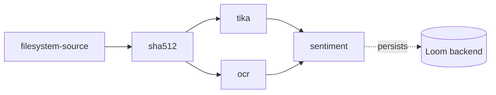

# Sentiment Analysis Node — Design & Implementation Plan

> Companion design document for a new Cortex pipeline node that scores the
> **polarity (positive / neutral / negative) of English and German text** produced
> by upstream nodes. Read alongside [NODES.md](NODES.md) — the source of truth is
> the code under `cortex/`.
>
> Status: **implemented; not yet run against a real model.** Node kind: `sentiment`;
> code in [cortex/nodes/sentiment](../../../cortex/nodes/sentiment), sidecar in
> [sidecars/sentiment](../../../sidecars/sentiment). All 43 automated tests pass,
> including an end-to-end integration test against a real Loom + Postgres — but the
> sidecar's Python dependencies are not installed in this checkout, so **no sentiment
> checkpoint has ever been loaded** and the manual E2E in §8 is outstanding. Each
> section below carries its own status block; §9 lists what still blocks confidence.
> This document is kept as the design rationale and the model survey — see
> [NODES.md](NODES.md) §3/§5/§12 for the current shape.
> Model selection is constrained to checkpoints that are **usable in a commercial
> setup**; that constraint drives §3 and disqualifies the most popular multilingual
> model on the Hub.

---

## 1. Motivation

Cortex already produces a lot of **text** and never looks at its tone:

| Producer | Output key | Landing zone |
|---|---|---|
| [TikaNode](../../../cortex/nodes/tika/core/src/main/java/io/metaloom/cortex/node/tika/TikaNode.java) | `tika_content` | `asset_json_comp` (`schemaType=tika`) |
| [OCRNode](../../../cortex/nodes/ocr/core/src/main/java/io/metaloom/cortex/node/ocr/OCRNode.java) | `ocr_text` | `asset_json_comp` (`schemaType=ocr`) |
| [CaptioningNode](../../../cortex/nodes/captioning/core/src/main/java/io/metaloom/cortex/node/captioning/CaptioningNode.java) | `caption_result` | `asset_json_comp` (`schemaType=caption`) |
| [VlmNode](../../../cortex/nodes/vlm/core/src/main/java/io/metaloom/cortex/node/vlm/VlmNode.java) | `vlm_result_{promptId}` | `asset_json_comp` (`schemaType=vlm`) |
| [LLMNode](../../../cortex/nodes/llm/core/src/main/java/io/metaloom/cortex/node/llm/LLMNode.java) | `llm_result_{promptId}` | `asset_json_comp` (`schemaType=llm`) |

There is **no sentiment, emotion, or text-classification node** in the tree today, and
no spec has ever described one. A `sentiment` node closes that gap: it turns any of the
text streams above into a small, sortable signal (`label` + `score` + signed `polarity`)
that the UI can badge and that later search/filter work can range-query.

The corpus is **German and English**, so the design routes per language rather than
leaning on one mediocre multilingual checkpoint.

---

## 2. What already exists (verified against code)

| Concern | Reference | Notes |
|---|---|---|
| Node base class | [AbstractMediaNode](../../../cortex/common/src/main/java/io/metaloom/cortex/common/node/AbstractMediaNode.java) | `process()` → enabled → exists → `isProcessable()` → `loadAsset(sha512)` → `compute(ctx, asset)`. Supplies `recordNodeResult(...)` and `resultRef(table, uuids...)` |
| **Consuming upstream text** | [TtsNode.resolveText()](../../../cortex/nodes/tts/core/src/main/java/io/metaloom/cortex/node/tts/TtsNode.java) | `ctx.upstreamOutput(sourceNodeId, sourceOutputKey)`; `isProcessable()` returns false when the text is absent or blank. **The exact pattern this node needs** |
| **Python sidecar pattern** | [sidecars/tts/server.py](../../../sidecars/tts/server.py) + [TtsClient](../../../cortex/nodes/tts/core/src/main/java/io/metaloom/cortex/node/tts/TtsClient.java) | FastAPI process owning the model; Java side is a pure `java.net.http.HttpClient`. **Forces `Version.HTTP_1_1`** — FastAPI rejects the JDK client's HTTP/2 upgrade |
| Sidecar placement rule | [sidecars/README.md](../../../sidecars/README.md) · [guidelines/NEW_NODE.md](../../guidelines/NEW_NODE.md) | Each sidecar is a self-contained `sidecars/<name>/` directory |
| JSON-comp persistence | [OCRNode.persist()](../../../cortex/nodes/ocr/core/src/main/java/io/metaloom/cortex/node/ocr/OCRNode.java) | `JsonCompCreateRequest{nodeKind, schemaType, variant, data}` → `createAssetJsonComp` → upsert on `(asset, node_kind, schema_type, variant)` |
| `variant` as a discriminator | [LLMNode.persist()](../../../cortex/nodes/llm/core/src/main/java/io/metaloom/cortex/node/llm/LLMNode.java) | One row per prompt via `variant = promptId` — the same trick this node uses for "one row per text source" |
| Ledger | `AbstractMediaNode.recordNodeResult(asset, ctx, state, reason, producerVersion, resultRef)` | ⚠️ Use **this helper**, not the private duplicate inside [WhisperNode](../../../cortex/nodes/whisper/core/src/main/java/io/metaloom/cortex/node/whisper/WhisperNode.java) — that one predates the helper |
| In-heap skip cache | [LocalResultCache](../../../cortex/common/src/main/java/io/metaloom/cortex/common/cache/LocalResultCache.java) | Keyed by `media.absolutePath()`; on hit re-emit outputs, return `ResultOrigin.LOCAL`, **skip re-persist** |
| Metrics | `metrics.recordAiCall(backend, ok, ms)` / `metrics.recordAiCacheHit(backend)` | Every model-backed node reports these |
| Kind registration | [WhisperNodeModule](../../../cortex/nodes/whisper/core/src/main/java/io/metaloom/cortex/node/whisper/WhisperNodeModule.java) | `@Binds @IntoSet` **and** `@Binds @IntoMap @StringKey("<kind>")` — the map binding is what makes the kind executable |
| UI descriptor | [WhisperDescriptorProvider](../../../loom-shared/node-model/src/main/java/io/metaloom/loom/nodes/spec/WhisperDescriptorProvider.java) | ServiceLoader SPI; `ContentTypes.DATA_TEXT` already exists |
| Integration-test base | `integration-test/src/test/java/io/metaloom/loom/test/integration/node/AbstractNodeIntegrationTest.java` | Boots a real in-process Loom + pooled Postgres and hands the test a real `LoomHttpClient` |

### Three constraints that shape the design

1. **No JVM inference stack.** `grep -riE "onnxruntime|ai\.djl|huggingface"` over every
   `pom.xml` and `*.java` returns nothing. The only in-process model is whisper.cpp via
   JNA. A HuggingFace encoder therefore needs either a new JVM dependency or a **sidecar** —
   the sidecar matches the precedent set by `tts`.
2. **`asset_json_comp` needs no migration.** Sentiment is a small opaque payload, so it
   lands in the generic component per the promotion policy in
   [DATABASE_TASKS.md](../db/DATABASE_TASKS.md): a new node kind starts in
   `asset_json_comp` and graduates to a typed table only when a query must filter/sort on
   a field inside it. **No Flyway change → no `./setup-pool.sh` re-init, no jOOQ regen.**
3. **License is the hard filter, not accuracy.** The highest-download multilingual
   sentiment model on the Hub is **CC-BY-NC-4.0** and cannot be used here (§3).

---

## 3. Model options — commercially usable EN/DE sentiment

> **Status: shipped as recommended.** All three recommended checkpoints are the
> sidecar's defaults (`SENTIMENT_MODEL_DE` / `_EN` / `_FALLBACK`, §6). **None of them
> has been run against real weights in this repo** — every test to date substitutes
> the client or the pipeline, so the accuracy figures below are the model cards'
> claims, not measured results. Validating them on a real German/English corpus is
> the first open follow-up (§9).

Screened against the Hub's [`sentiment-analysis`](https://huggingface.co/models?other=sentiment-analysis)
tag. Selection favours (a) a permissive license, (b) a **3-class** label space so German
and English models normalise to one schema, and (c) small encoders that run on CPU.

### Recommended

| Role | Model | License | Classes | Params | Evidence |
|---|---|---|---|---|---|
| **DE primary** ⭐ | `oliverguhr/german-sentiment-bert` | **MIT** | positive / negative / neutral | ~110M | Trained on 1.834M German samples (Twitter, Facebook, movie/app/hotel reviews). F1 **0.9639** overall — Leipzig .9967, Emotions .9649, Holidaycheck .9568, SCARE .9418, Filmstarts .9021, GermEval .7536, SB10K .7376, PotTS .6780. ~158k downloads/month |
| **EN primary** ⭐ | `cardiffnlp/twitter-roberta-base-sentiment-latest` | **CC-BY-4.0** — commercial use allowed, **attribution required** | negative / neutral / positive | ~125M | RoBERTa-base over ~124M tweets (2018–2021), TweetEval-finetuned. ~2.55M downloads/month. Social-media leaning but the de-facto default 3-class English model |
| **Attribution-free swap + fallback for other languages** | `lxyuan/distilbert-base-multilingual-cased-sentiments-student` | **Apache-2.0** | negative / neutral / positive | ~135M | Distilled from the `MoritzLaurer/mDeBERTa-v3-base-mnli-xnli` zero-shot teacher; 88.29% teacher agreement; 12 languages incl. DE + EN. ~924k downloads/month |

All three are ≤135M-parameter encoders — a few tens of milliseconds per 512-token chunk
on CPU, GPU optional. There is **no quantisation/VRAM chapter** here, unlike
[NODE_VIDEO_CAPTIONING_PLAN.md](NODE_VIDEO_CAPTIONING_PLAN.md); this node is cheap.

### Evaluated and rejected — and why

| Model | License | Why not |
|---|---|---|
| `tabularisai/multilingual-sentiment-analysis` | ⛔ **CC-BY-NC-4.0** | **Non-commercial — disqualified.** This is the trap: 23 languages, 5-class output, ~517k downloads/month, and the top hit for "multilingual sentiment". Do not adopt it, and do not adopt forks that inherit the NC term |
| `siebert/sentiment-roberta-large-english` | ⛔ **no license stated** | Strong (93.2% mean accuracy over 15 English datasets) but the model card declares no license → not usable commercially. Binary only |
| `distilbert/distilbert-base-uncased-finetuned-sst-2-english` | Apache-2.0 | Clean license, 67M params, SST-2 91.3%, ~3.67M downloads/month — but **binary** (no neutral), so it cannot share a label schema with the German model. Viable only if the whole node drops to two classes |
| `clapAI/modernBERT-base|large-multilingual-sentiment` | Apache-2.0 | Clean license, 16+ languages, ModernBERT backbone, F1 80.16 (150M) / 81.4 (396M) — but **binary** labels and only ~2.8k downloads/month. Revisit if a long-context (8k) encoder becomes useful |
| `nlptown/bert-base-multilingual-uncased-sentiment` | MIT | Outputs **1–5 stars**, not polarity; review-domain; German 61% exact / 94% off-by-one. Different output space |
| `cardiffnlp/twitter-xlm-roberta-base-sentiment` | ⚠️ **no license on the model card** | 8 languages incl. DE, 3-class. The TweetNLP GitHub repo is MIT, but the card itself is silent — the ambiguity is the blocker |
| `aari1995/German_Sentiment` | no license stated | gBERT-large, binary, ~28 downloads/month, no published evaluation |
| `scherrmann/GermanFinBert_SC_Sentiment` | — | German **finance** domain only. Note as a future per-deployment override, not the default |

### Recommendation

Route by language: **DE → `oliverguhr/german-sentiment-bert` (MIT)**,
**EN → `cardiffnlp/twitter-roberta-base-sentiment-latest` (CC-BY-4.0)**, everything else
(and any deployment that wants zero attribution obligations) →
**`lxyuan/distilbert-base-multilingual-cased-sentiments-student` (Apache-2.0)**.

All three are 3-class, so they normalise onto one schema. Model ids are **options**
(§7), so switching checkpoints — including to a domain-specific German finance model — is
configuration, not code.

> **Attribution note.** CC-BY-4.0 requires crediting the model in the product. The
> practical shape: name the model in the emitted payload (`model` field, already in the
> schema) and list it on the website node page. If a deployment cannot carry attribution,
> set `modelEn` to the Apache-2.0 student model.

---

## 4. Architecture

> **Status: implemented, with one protocol addition.** The sidecar owns all three
> responsibilities as designed. The endpoint contract below gained an optional
> `models` field that the plan did not have — see *Endpoint contract* — and the
> response gained a `truncated` flag. Persistence landed exactly as specified.

### Why a sidecar

The node needs a HuggingFace encoder, and the JVM has no inference stack in this repo
(§2). `sidecars/tts/` already establishes the pattern — a self-contained FastAPI process
owning the model, with the Java node as a thin HTTP client — and it already does exactly
the thing this node needs: **route by language** (`de` → Orpheus, `en` → Kokoro).

Three responsibilities live in the sidecar, deliberately **not** in Java:

1. **Language routing.** `lang="de"` / `"en"` pick the specialist; anything else falls
   back to the multilingual student model. `lang="auto"` (the default) detects with
   `lingua-language-detector` (Apache-2.0) constrained to `{de, en}`.
2. **Chunking.** Every candidate is a 512-token encoder, and `tika_content` for a PDF is
   routinely far longer. The sidecar splits on sentence boundaries into ≤`MAX_CHUNK_TOKENS`
   word-piece chunks, classifies each, and aggregates **length-weighted** into one document
   label. The chunk count is reported back so the payload is auditable.
3. **Label normalisation.** Each model's native labels map onto
   `POSITIVE | NEUTRAL | NEGATIVE`, plus a signed
   `polarity = p(positive) − p(negative)` in `[-1, 1]` — the sortable numeric that a
   future range filter would use.

Keeping all three in Python means swapping a checkpoint never touches Java.

### Endpoint contract

The shipped contract (`sidecars/sentiment/server.py`):

```jsonc
// POST /v1/sentiment
{ "texts": ["Der Kundenservice war eine Katastrophe."],
  "lang": "auto",
  // ADDED DURING IMPLEMENTATION — optional per-language checkpoint overrides.
  // The plan gave the node modelDe/modelEn options but left the sidecar no way to
  // receive them without giving up lang="auto" routing. Overrides are applied
  // *after* detection, so auto-routing still works.
  "models": { "de": "scherrmann/GermanFinBert_SC_Sentiment" } }
```

```jsonc
// 200 OK
[{ "label": "NEGATIVE",
   "score": 0.87,                                   // confidence of the winning label
   "polarity": -0.81,                               // p(pos) - p(neg), in [-1, 1]
   "scores": { "positive": 0.06, "neutral": 0.07, "negative": 0.87 },
   "lang": "de",
   "model": "oliverguhr/german-sentiment-bert",
   "chunks": 1,
   "truncated": false }]                            // ADDED: true when MAX_CHUNKS clipped the text
```

The request takes a **list** so a future per-segment phase (§9) batches without a protocol
change; Phase A sends a single element.

`GET /health` was added alongside it — it reports the device, the three configured model
ids and which of them are already loaded.

### Persistence shape

One `asset_json_comp` row, `nodeKind="sentiment"`, `schemaType="sentiment"`, and
**`variant` = the source output key** (`tika_content`, `ocr_text`, …). Because the natural
key is `(asset, node_kind, schema_type, variant)`, an asset that has both OCR text and an
LLM summary can carry a sentiment row for each without collision — the same use of
`variant` that `LLMNode` makes for `promptId`.

```jsonc
// asset_json_comp.data
{ "label": "NEGATIVE", "score": 0.87, "polarity": -0.81,
  "scores": { "positive": 0.06, "neutral": 0.07, "negative": 0.87 },
  "lang": "de", "model": "oliverguhr/german-sentiment-bert",
  "source": { "nodeId": "tika", "outputKey": "tika_content" },
  "textChars": 4211, "chunks": 12 }
```

Then the ledger:
`recordNodeResult(asset, ctx, SUCCESS, null, producerVersion, resultRef("asset_json_comp", compUuid))`,
with `producerVersion` = the model id actually used.

---

## 5. Node data flow

> **Status: implemented as drawn.** Both diagrams match
> [SentimentNode.compute()](../../../cortex/nodes/sentiment/core/src/main/java/io/metaloom/cortex/node/sentiment/SentimentNode.java).
> The `tika → sentiment` placement below is the one exercised end-to-end by
> `SentimentNodeIntegrationTest`.

```mermaid
sequenceDiagram
    participant P as Pipeline
    participant N as SentimentNode
    participant S as sentiment sidecar<br/>(FastAPI :9110)
    participant L as LoomClient

    P->>N: process(ctx)
    N->>N: isProcessable → resolveText(ctx) != null
    N->>N: LocalResultCache.get(path) — hit? re-emit LOCAL, skip persist
    N->>S: POST /v1/sentiment {texts:[text], lang}
    S->>S: detect language → pick model → chunk → classify → aggregate
    S-->>N: {label, score, polarity, scores, lang, model, chunks}
    N->>N: ctx.output(SENTIMENT_LABEL / _SCORE / _RESULT); cache.put(path, json)
    N->>L: createAssetJsonComp(schemaType="sentiment", variant=<outputKey>)
    N->>L: recordNodeResult(SUCCESS, resultRef("asset_json_comp", uuid))
```

Pipeline placement — the node sits downstream of whatever produces its text:



---

## 6. Sidecar — `sidecars/sentiment/`

> **Status: implemented; never run with real weights.** All five files exist and the
> pure-Python logic (chunking incl. oversized-sentence hard-split, label
> normalisation across all three checkpoints' native vocabularies, language routing,
> per-request overrides, length-weighted aggregation) was exercised directly with a
> stub tokenizer and a stub pipeline. `transformers`/`torch`/`lingua` are **not
> installed in this checkout**, so `./setup.sh` has not been run and no real model
> has ever been loaded. First real `./run.sh` is unvalidated — see §9.

Same file set as [`sidecars/tts/`](../../../sidecars/tts): `server.py`,
`requirements.txt`, `setup.sh`, `run.sh`, `README.md`.

```bash
cd sidecars/sentiment && ./setup.sh && ./run.sh    # uvicorn server:app --host 0.0.0.0 --port 9110
```

### Environment variables

| Variable | Default | Meaning |
|---|---|---|
| `SENTIMENT_MODEL_DE` | `oliverguhr/german-sentiment-bert` | German checkpoint (MIT) |
| `SENTIMENT_MODEL_EN` | `cardiffnlp/twitter-roberta-base-sentiment-latest` | English checkpoint (CC-BY-4.0) |
| `SENTIMENT_MODEL_FALLBACK` | `lxyuan/distilbert-base-multilingual-cased-sentiments-student` | Used for any other detected language (Apache-2.0) |
| `SENTIMENT_LANGS` | `de,en` | Languages the auto-detector is constrained to |
| `MAX_CHUNK_TOKENS` | `400` | Word-piece budget per chunk (headroom under the 512 limit) |
| `MAX_CHUNKS` | `64` | Upper bound per request; excess text is truncated and reported |
| `DEVICE` | `cuda` if available else `cpu` | torch device |
| `PORT` | `9110` | HTTP port — **9100 is taken by the TTS sidecar** |

Dependencies are `fastapi`, `uvicorn`, `transformers`, `torch`,
`lingua-language-detector`. No gated repos and no `HF_TOKEN` — unlike the TTS sidecar's
Kartoffel default, all three checkpoints here are ungated.

---

## 7. Implementation outline — `cortex/nodes/sentiment/core/`

> **Status: all six items implemented as written**, with two mechanical additions:
> `SentimentClient.analyze(...)` takes a third `modelOverride` argument (§4), and
> `persist(...)` also sets `producerVersion` on the component request (matching
> `LLMNode`), not just on the ledger. One documented deviation is in item 1's failure
> path — see the ⚠️ note there.

New module mirroring `cortex/nodes/tts`.

1. **`SentimentNode extends AbstractMediaNode<SentimentNodeOptions>`**
   - `name() = "sentiment"`.
   - `isProcessable(ctx)` → `options().isEnabled() && resolveText(ctx) != null` — media-type
     agnostic, exactly like `TtsNode`; the node keys off upstream text, not the file.
   - `resolveText(ctx)` walks the **ordered** `textSources` list and takes the first
     non-blank `ctx.upstreamOutput(nodeId, outputKey)`. This generalises `TtsNode`'s single
     `sourceNodeId`/`sourceOutputKey` pair; keep the resolved pair around, it becomes the
     `variant` and the payload's `source` block.
   - `LocalResultCache<String>` (size 10_000) keyed by `media.absolutePath()`; on hit
     `metrics.recordAiCacheHit("sentiment")`, re-emit the outputs, return
     `ctx.origin(LOCAL).next()`, **skip re-persist**.
   - Wrap the client call in `metrics.recordAiCall("sentiment", ok, ms)`.
   - Outputs:
     ```java
     public static final NodeOutputKey<String> OUTPUT_SENTIMENT_LABEL  = NodeOutputKey.of("sentiment_label", String.class);
     public static final NodeOutputKey<Double> OUTPUT_SENTIMENT_SCORE  = NodeOutputKey.of("sentiment_score", Double.class);
     public static final NodeOutputKey<String> OUTPUT_SENTIMENT_RESULT = NodeOutputKey.of("sentiment_result", String.class);
     ```
   - On failure: emit no outputs, `recordNodeResult(..., FAILED, e.getMessage(), model, null)`,
     return `ctx.failure(...)`.

   > ⚠️ **Implemented, but `ctx.failure(msg).next()` does not produce a FAILED result.**
   > `NodeContextImpl.next()` only checks `skipReason` and returns SUCCESS otherwise —
   > the recorded `failureCause` is ignored; **only `abort()` yields
   > `ResultState.FAILED`**. Every node in the tree uses the `failure().next()` idiom
   > (`ThumbnailNode`, `FacedetectNode`, `QualityNode`, `TikaNode`,
   > `TtsNode`, …), so `SentimentNode` follows it for consistency rather than being the
   > lone exception. The observable consequences on a sidecar error are therefore: no
   > outputs emitted, nothing cached, and a FAILED **ledger** row — which is what
   > `SentimentNodeTest` and `SentimentNodePersistenceTest` assert. Fixing `next()` is a
   > repo-wide change affecting ~10 nodes and is out of scope here (§9).

2. **`SentimentClient`** — shape-for-shape copy of
   [TtsClient](../../../cortex/nodes/tts/core/src/main/java/io/metaloom/cortex/node/tts/TtsClient.java):
   `java.net.http.HttpClient` with **`Version.HTTP_1_1` forced**, Vert.x `JsonObject`
   body, `POST http://{host}:{port}/v1/sentiment`, returning the parsed first element.
   This is the seam the tests replace.

3. **`SentimentNodeOptions extends AbstractNodeOptions<SentimentNodeOptions>`** —
   `KEY = "sentiment"`; fields `sentimentHost` (`localhost`), `sentimentPort` (`9110`),
   `language` (`auto`), `modelDe`, `modelEn` (null → sidecar default), `textSources`
   (ordered list, default `tika:tika_content`, `ocr:ocr_text`,
   `captioning:caption_result`, `vlm:vlm_result`, `llm:llm_result`), `maxChars`
   (`200000`). `validate()` starts with `errors.addAll(validateCommon())` and checks
   host/port/non-empty `textSources`.

4. **`SentimentNodeModule extends AbstractNodeModule`** — all four bindings plus the
   client provider:
   ```java
   @Binds @IntoSet abstract FilesystemNode<?, ?> bindNode(SentimentNode node);
   @Binds @IntoMap @StringKey("sentiment") abstract FilesystemNode<?, ?> kindSentiment(SentimentNode node);
   @IntoSet @Provides public static CortexNodeOptionDeserializerInfo optionInfo() {
       return new CortexNodeOptionDeserializerInfo(SentimentNodeOptions.class, SentimentNodeOptions.KEY); }
   @Provides public static SentimentNodeOptions options(CortexOptions o) {
       return nodeOptions(o, SentimentNodeOptions.KEY, new SentimentNodeOptions()); }
   @Provides public static SentimentClient client(SentimentNodeOptions o) { … }
   ```
   ⚠️ The `@IntoMap @StringKey` binding is what makes the kind executable and announced in
   the worker's `nodeWhitelist`. Omit it and the node exists but can never be scheduled.

5. **Persistence** — `JsonCompCreateRequest{nodeKind="sentiment", schemaType="sentiment",
   variant=<resolved output key>, data=<payload of §4>}` →
   `client().createAssetJsonComp(...)`, then `recordNodeResult(...)` with
   `resultRef("asset_json_comp", compUuid)`. Guarded by
   `asset != null && client() != null`. **No Flyway migration.**

6. **`SentimentDescriptorProvider`** in `loom-shared/node-model/.../nodes/spec/` — kind
   `sentiment`, name "Sentiment Analysis", icon `mood`, category `ANALYSIS`, input
   `NodeInput("text", DATA_TEXT, true)`, outputs `sentiment_label` / `sentiment_score` /
   `sentiment_result` (`DATA_TEXT`), parameters mirroring the options, `defaultMode`
   `PARALLEL`, standard events. Register it in the ServiceLoader file.

Representative paths:

```
sidecars/sentiment/server.py
cortex/nodes/sentiment/core/src/main/java/io/metaloom/cortex/node/sentiment/SentimentNode.java
cortex/nodes/sentiment/core/src/main/java/io/metaloom/cortex/node/sentiment/SentimentClient.java
cortex/nodes/sentiment/core/src/main/java/io/metaloom/cortex/node/sentiment/SentimentNodeOptions.java
cortex/nodes/sentiment/core/src/main/java/io/metaloom/cortex/node/sentiment/SentimentNodeModule.java
loom-shared/node-model/src/main/java/io/metaloom/loom/nodes/spec/SentimentDescriptorProvider.java
```

### Wiring that is easy to forget

All done. Two Maven dependency edits the plan had missed are marked ✚ — without them
the module compiles but `NodeCollectionModule` cannot resolve the import and the
integration test cannot see the node.

| Purpose | Path | Status |
|---|---|---|
| Module in the reactor | [cortex/nodes/pom.xml](../../../cortex/nodes/pom.xml) | ✅ |
| ✚ Dependency for the Dagger graph | [cortex/processor/pom.xml](../../../cortex/processor/pom.xml) — reaches `cortex-cli` via `cortex-core` | ✅ |
| Dagger include | [NodeCollectionModule.java](../../../cortex/cli/src/main/java/io/metaloom/cortex/cli/dagger/NodeCollectionModule.java) — **not** `PipelineNodeFactoryModule` | ✅ — see ⚠️ below |
| Descriptor SPI registration | `loom-shared/node-model/src/main/resources/META-INF/services/io.metaloom.loom.nodes.spec.NodeDescriptorProvider` | ✅ |
| ✚ Dependency for the integration test | [integration-test/pom.xml](../../../integration-test/pom.xml) | ✅ |
| ✚ ServiceLoader test counts | `NodeDescriptorServiceLoaderTest` — hard-asserts provider/kind totals; bumped 17→18 and 30→31, and `sentiment` added to the spot-check list | ✅ |
| Node reference spec | [NODES.md](NODES.md) — §2 payload table, §3 node table, §5 options, §12 capability matrix, footer | ✅ |
| Spec index | [spec/CONTEXT.md](../../CONTEXT.md) §2 tree | ✅ |
| Sidecar index | [sidecars/README.md](../../../sidecars/README.md) — sidecar table + deployment note | ✅ |
| Customer docs | `website/content/english/docs/nodes/sentiment/index.adoc` + three entries in `nodes/_index.adoc` | ✅ |

> ⚠️ **This wiring was initially shipped broken and is worth a warning for the next
> node.** The first pass added the `import io.metaloom.cortex.node.sentiment.SentimentNodeModule;`
> line but **not** `SentimentNodeModule.class` inside `@Module(includes = { … })`. That
> compiles cleanly (an unused import is not an error) and the whole test suite stayed
> green, yet the node was absent from the Dagger graph and the kind was never
> executable — precisely the silent failure this section warns about.
>
> Nothing caught it because `NodeRegistrarTest.testRegisterAllAdvertisesFullCollection`
> asserts `contains(...)` over a **hand-maintained** kind list that the new kind had not
> been added to. `sentiment` is now in that list, so the same mistake fails loudly next
> time. **When adding a node, add its kind to that assertion in the same change** — it is
> the only test that can detect a missing map binding.

---

## 8. Testing & verification

> **Status: all automated tests written and green (43 tests). The manual E2E against a
> real sidecar has NOT been run** — see the bottom of this section.

Mirroring the whisper/tts test set under
`cortex/nodes/sentiment/core/src/test/java/io/metaloom/cortex/node/sentiment/`:

| Test | Cases | Result |
|---|---|---|
| `SentimentNodeTest` | 11 | ✅ scoring, ordered source resolution, fall-through to a later source, `maxChars` truncation, model overrides, custom source, cache hit (one sidecar call for two runs), disabled, blank/absent text → skipped, failure emits nothing and leaves the cache cold |
| `SentimentNodePersistenceTest` | 3 | ✅ component-then-ledger on success; FAILED ledger + **no** component when the sidecar throws; FAILED ledger when the component write itself throws |
| `SentimentNodePipelineTest` | 6 | ✅ adapter integration, completion + tracking events, output chaining into `CapturingNode`, disabled, dry-run |
| `SentimentOptionsValidationTest` | 11 | ✅ defaults, custom values, and every `validate()` branch incl. malformed `textSources` entries |
| `SentimentNodeIntegrationTest` | 1 | ✅ real in-process Loom + pooled Postgres; asserts the component reads back with `variant=tika_content`, the right label/polarity/model, the `source` block, and a `sentiment` ledger row |
| `NodeDescriptorServiceLoaderTest` | 5 | ✅ after bumping the hard-coded totals (17→18 providers, 30→31 kinds) |
| `CortexComponentTest`, `NodeRegistrarTest`, `ProcessCommandTest` | 6 | ✅ Dagger graph still compiles with the new module included |

Note the integration test injects a **stub `SentimentClient` subclass**, not a stub HTTP
server as the plan proposed — the client is already the designed seam, and stubbing it
matches how `TtsNodeIntegrationTest` handles the identical situation. Everything else in
that test (file, asset, `LoomHttpClient`, persistence, REST read-back) is real.

**Sidecar logic** was verified separately by loading `server.py` with `fastapi`/`pydantic`
stubbed and calling its internals directly: label normalisation for all three checkpoints'
native vocabularies (including the `LABEL_0..2` form and unmapped-label tolerance),
sentence packing, oversized-sentence hard-split (no token dropped), language routing,
per-request overrides, and length-weighted aggregation. All passed.

**Manual E2E — NOT YET RUN.** This is the outstanding verification gap:

```bash
cd sidecars/sentiment && ./setup.sh && ./run.sh    # :9110
curl -s localhost:9110/v1/sentiment -H 'Content-Type: application/json' \
  -d '{"texts":["Der Kundenservice war eine Katastrophe."],"lang":"auto"}'
# expected: [{"label":"NEGATIVE","lang":"de","model":"oliverguhr/german-sentiment-bert",...}]
```

then run a `filesystem-source → sha512 → tika → sentiment` pipeline over a German and an
English document and confirm both `asset_json_comp` rows are readable through
`GET /api/v1/assets/:uuid/json-comps`. Until this is done, the following are unproven:
real weights download and load, `lingua` actually picks `de`/`en` correctly, the real
word-piece tokenizer's chunk sizes stay under 512, and the wire format matches what
`SentimentClient` parses.

**No database work is required** — `asset_json_comp` already exists, so there is no Flyway
migration, no `./setup-pool.sh` re-init and no jOOQ regeneration for this node. (The pool
was re-initialised only to run the integration test, not because this change needed it.)

---

## 9. Open decisions & follow-ups

> **Status: everything below is still open.** Ordered by what actually blocks
> confidence in the shipped node.

**Blocking — verification gaps in what already shipped**

1. **Run the sidecar with real weights** (`./setup.sh && ./run.sh`) and do the manual E2E
   in §8. No real model has ever been loaded in this checkout. Until then, weight
   download, `lingua` routing accuracy, real word-piece chunk sizes and the on-the-wire
   format are all unproven.
2. **Validate accuracy on a real German/English corpus.** §3's figures are the model
   cards' claims. A small labelled sample from the actual asset mix would confirm the
   language-routed choice beats the single multilingual fallback — the premise the whole
   §3 recommendation rests on.
3. **`ctx.failure(msg).next()` returns SUCCESS** (§7 item 1). Repo-wide, ~10 nodes are
   affected. Worth raising as its own fix; a node that fails is currently reported as
   succeeding with no outputs, and only the ledger records the truth.

**Product follow-ups**

- **Whisper transcripts as a source.** Deliberately left out of the default `textSources`
  list. Adding them is **configuration only** (`whisper:whisper_result`) — but note that
  `whisper_result` is transcript *JSON*, so the node would need to flatten segments to
  plain text first. Treat that as a small follow-up, not a config toggle.
- **Phase B — per-segment sentiment timeline.** One label per Whisper segment gives
  sentiment over time. It needs either a nested array in the JSON payload (cheap) or
  `asset_segment_comp` with a **new `segment_type`** — the same CHECK-constraint migration
  [NODE_VIDEO_CAPTIONING_PLAN.md](NODE_VIDEO_CAPTIONING_PLAN.md) §2 flagged for `CAPTION`,
  plus `./setup-pool.sh` and `loom/db/jooq/generate.sh`. Out of scope for Phase A.
- **Search integration.** Sentiment is a label plus numbers, so like `quality` it stays
  **out** of the `search_extract_json_text` whitelist in [SEARCH.md](../search/SEARCH.md).
  Revisit if range-filtering on `polarity` is wanted — that is also the trigger for
  promoting sentiment out of `asset_json_comp` into a typed table.
- **English model licensing.** CC-BY-4.0 (attribution) vs Apache-2.0 (none). Default to
  the CardiffNLP model and document the attribution; deployments that cannot carry it set
  `modelEn` to the student model.
- **Domain overrides.** `scherrmann/GermanFinBert_SC_Sentiment` for German financial text
  is a per-deployment `modelDe` swap if that corpus ever matters.
- **Aspect-based sentiment** (sentiment *per entity*, e.g. `yangheng/deberta-v3-base-absa`)
  is a different node, not an option on this one.

---

## 10. Key Classes Reference

| Class | Package / module | Purpose |
|---|---|---|
| `SentimentNode` | `io.metaloom.cortex.node.sentiment` (`cortex/nodes/sentiment/core`) | The node: resolves upstream text, calls the sidecar, persists |
| `SentimentClient` | same | HTTP client for `/v1/sentiment`; the seam tests replace |
| `SentimentNodeOptions` | same | Host/port, language, model overrides, ordered text sources |
| `SentimentNodeModule` | same | Dagger bindings incl. the `@StringKey("sentiment")` map binding |
| `SentimentDescriptorProvider` | `io.metaloom.loom.nodes.spec` (`loom-shared/node-model`) | UI/validation descriptor, ServiceLoader SPI |
| `AbstractMediaNode` | `io.metaloom.cortex.common.node` (`cortex/common`) | Lifecycle + `recordNodeResult` / `resultRef` |
| `LocalResultCache` | `io.metaloom.cortex.common.cache` (`cortex/common`) | In-heap, worker-lifetime skip cache |
| `JsonCompCreateRequest` | `io.metaloom.loom.rest.model.jsoncomp` (`loom-shared/rest-model`) | `asset_json_comp` payload |
| `NodeResultCreateRequest` | `io.metaloom.loom.rest.model.noderesult` (`loom-shared/rest-model`) | Ledger payload |

---

## 11. Conventions and Gotchas

- **The `@IntoMap @StringKey` binding is mandatory.** Without it the node is instantiated
  but never schedulable — `RegistryNodeRegistrar` builds the executable-kind registry from
  that map alone.
- **Adding the import is not adding the module.** `@Module(includes = { … })` needs the
  `.class` entry; an import alone compiles fine and silently leaves the node out of the
  graph. This bit this node during implementation (§7). Add the kind to
  `NodeRegistrarTest`'s expected-kinds assertion in the same change so it cannot recur.
- **Building `cortex/cli` needs every included node module installed.** A module listed in
  `@Module(includes = …)` that is not in the local repo surfaces as a Dagger
  `'<error>' could not be resolved` failure that names *other* modules, which sends you
  looking in the wrong place.
- **Force HTTP/1.1 in the client.** FastAPI rejects the JDK `HttpClient`'s default HTTP/2
  upgrade; `TtsClient` and `SmolVLMClient` both carry this workaround.
- **Use `AbstractMediaNode.recordNodeResult(...)`**, not `WhisperNode`'s private copy.
- **On a `LocalResultCache` hit, skip persistence too.** The durable copy already exists
  in Loom; re-writing it on every cache hit is pure REST traffic.
- **`variant` is the multi-source discriminator.** Leaving it `""` means a second text
  source silently overwrites the first — the natural key is
  `(asset, node_kind, schema_type, variant)`.
- **Port 9100 is taken** by the TTS sidecar; this one uses 9110.
- **Never adopt CC-BY-NC checkpoints.** `tabularisai/multilingual-sentiment-analysis` is
  the top search hit and is non-commercial.
- **The code is the source of truth.** Where this document and `cortex/` disagree, the
  code wins — fix this file in the same change.

---

## 12. Where do I find …?

| Concept | Path |
|---|---|
| Node system reference | [NODES.md](NODES.md) |
| Definition of done for a code change | [guidelines/CODING.md](../../guidelines/CODING.md) |
| New-node checklist | [guidelines/NEW_NODE.md](../../guidelines/NEW_NODE.md) |
| Upstream-text consumption pattern | [TtsNode](../../../cortex/nodes/tts/core/src/main/java/io/metaloom/cortex/node/tts/TtsNode.java) |
| Sidecar reference implementation | [sidecars/tts/](../../../sidecars/tts) |
| JSON-comp persistence example | [OCRNode](../../../cortex/nodes/ocr/core/src/main/java/io/metaloom/cortex/node/ocr/OCRNode.java) |
| `variant` discriminator example | [LLMNode](../../../cortex/nodes/llm/core/src/main/java/io/metaloom/cortex/node/llm/LLMNode.java) |
| Component-table promotion policy | [features/db/DATABASE_TASKS.md](../db/DATABASE_TASKS.md) |
| Dagger module registration | [NodeCollectionModule.java](../../../cortex/cli/src/main/java/io/metaloom/cortex/cli/dagger/NodeCollectionModule.java) |
| Node integration-test base | `integration-test/src/test/java/io/metaloom/loom/test/integration/node/AbstractNodeIntegrationTest.java` |
| Customer-facing node docs | `website/content/english/docs/nodes/` |

---

## 13. Progress Assessment

Everything in the plan is built and every automated test is green. The unticked boxes are
real gaps, not paperwork: **no sentiment model has ever been loaded in this checkout.**

**Research**

- [x] Screen the Hub `sentiment-analysis` tag for commercially usable EN/DE models
- [x] Verify licenses on the model cards (MIT / Apache-2.0 / CC-BY / CC-BY-NC)
- [x] Pick a 3-class schema that DE and EN models can share
- [x] Confirm no sentiment capability exists in the repo today

**Sidecar**

- [x] `sidecars/sentiment/` — `server.py`, `requirements.txt`, `setup.sh`, `run.sh`, `README.md`
- [x] Language routing (`de` / `en` / fallback) + `auto` detection
- [x] Sentence-boundary chunking + length-weighted aggregation
- [x] Label normalisation to `POSITIVE|NEUTRAL|NEGATIVE` + `polarity`
- [x] Optional per-request `models` overrides + `GET /health` (added during implementation)
- [x] Logic verified directly with stub tokenizer / stub pipeline
- [ ] **`./setup.sh` run and a real checkpoint loaded** — never done in this checkout
- [ ] **Chunk sizes confirmed under 512 with the real word-piece tokenizer**
- [ ] **`lingua` routing spot-checked on real German and English text**

**Node**

- [x] `cortex/nodes/sentiment/core` module + `pom.xml`, registered in `cortex/nodes/pom.xml`
- [x] `SentimentNode`, `SentimentClient`, `SentimentNodeOptions`, `SentimentNodeModule`
- [x] Ordered multi-source `resolveText(...)`
- [x] `LocalResultCache` + `metrics.recordAiCall` / `recordAiCacheHit`
- [x] `asset_json_comp` persistence (`variant` = source output key) + ledger
- [x] Module included in `NodeCollectionModule` — *shipped broken first (import without
      the `.class` entry); fixed, and `NodeRegistrarTest` now guards it*
- [x] `SentimentDescriptorProvider` + ServiceLoader registration
- [x] `cortex/processor` + `integration-test` Maven dependencies

**Tests** — 43 cases, all green

- [x] `SentimentNodeTest` (11), `SentimentNodePersistenceTest` (3), `SentimentNodePipelineTest` (6)
- [x] `SentimentOptionsValidationTest` (11) + AssertJ helpers
- [x] `SentimentNodeIntegrationTest` (1) against real Loom + pooled Postgres
- [x] `NodeDescriptorServiceLoaderTest` totals bumped (17→18 providers, 30→31 kinds)
- [x] `sentiment` added to `NodeRegistrarTest`'s executable-kind assertion
- [ ] **Manual E2E against a running sidecar** (§8) — the one outstanding test

**Docs**

- [x] `NODES.md` §2 / §3 / §5 / §12 entries + footer
- [x] `website/content/english/docs/nodes/sentiment/index.adoc` + `nodes/_index.adoc` (3 places)
- [x] `sidecars/README.md` sidecar table + deployment note
- [x] `spec/CONTEXT.md` §2 index entry for this document
- [x] This document updated with per-section implementation status

---

## 14. References

- HF `sentiment-analysis` tag — <https://huggingface.co/models?other=sentiment-analysis>
- `oliverguhr/german-sentiment-bert` (MIT) — <https://huggingface.co/oliverguhr/german-sentiment-bert>
- `cardiffnlp/twitter-roberta-base-sentiment-latest` (CC-BY-4.0) — <https://huggingface.co/cardiffnlp/twitter-roberta-base-sentiment-latest>
- `lxyuan/distilbert-base-multilingual-cased-sentiments-student` (Apache-2.0) — <https://huggingface.co/lxyuan/distilbert-base-multilingual-cased-sentiments-student>
- `tabularisai/multilingual-sentiment-analysis` (⛔ CC-BY-NC-4.0) — <https://huggingface.co/tabularisai/multilingual-sentiment-analysis>
- `clapAI/modernBERT-base-multilingual-sentiment` (Apache-2.0) — <https://huggingface.co/clapAI/modernBERT-base-multilingual-sentiment>
- `nlptown/bert-base-multilingual-uncased-sentiment` (MIT) — <https://huggingface.co/nlptown/bert-base-multilingual-uncased-sentiment>
- `distilbert-base-uncased-finetuned-sst-2-english` (Apache-2.0) — <https://huggingface.co/distilbert/distilbert-base-uncased-finetuned-sst-2-english>
- GermEval17 re-evaluation with German BERTs — <https://arxiv.org/pdf/2102.12330>
- XLM-T (multilingual Twitter sentiment) — <https://github.com/cardiffnlp/xlm-t>
- Lingua language detector (Apache-2.0) — <https://github.com/pemistahl/lingua-py>

---

_Git HEAD revision: `ff0b64e2`_
_Last updated: 2026-07-27 (implemented: sidecar, node, wiring, tests and docs; per-section
implementation status added, incl. the `NodeCollectionModule` miss and the outstanding
real-model E2E)_
