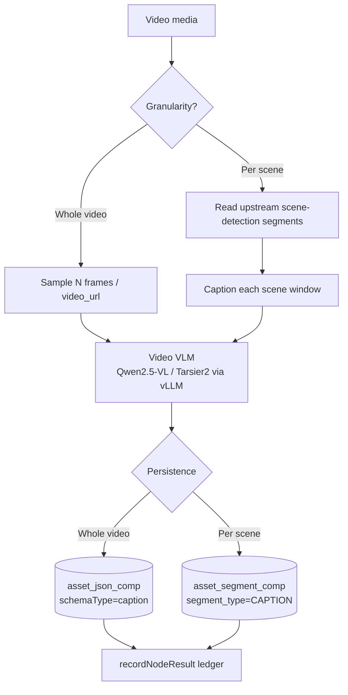
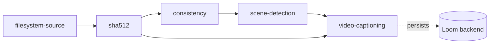

# Video Captioning Node — Design & Implementation Plan

> Companion design document for a new Cortex pipeline node that produces
> natural-language **descriptions of video** (motion / events over time), not
> just a description of a single still frame. Read alongside
> [NODES.md](NODES.md) — the source of truth is the code under `cortex/`.
>
> Status: **design / not yet implemented.** This document presents multiple
> options and a recommended path so the approach can be agreed before code.

---

## 1. Motivation

The existing `CaptioningNode` captions **images** via a small vision model
(SmolVLM) and explicitly bails on video —
[CaptioningNode.java](../../../cortex/nodes/captioning/core/src/main/java/io/metaloom/cortex/node/captioning/CaptioningNode.java)
returns `ctx.skipped("not implemented")` for `media.isVideo()`. NODES.md §10
tracks "CaptioningNode video support" as open work.

We want a node that:

- Understands **temporal dynamics** (what happens across the clip), using a model
  **dedicated to video processing** rather than an image VLM fed hand-sampled
  frames.
- Persists its result into the Loom backend using the same typed-component +
  ledger pattern every other node follows (NODES.md §2).
- Optionally produces a **caption timeline** (per-scene / timestamped captions),
  reusing the existing `scene-detection` node.

---

## 2. What already exists (verified against code)

| Concern | Reference | Notes |
|---|---|---|
| Image captioning node | `CaptioningNode` | `AbstractMediaNode<CaptioningNodeOptions>`; `name()="captioning"`; `isProcessable` already admits video |
| Image model client | `SmolVLMClient` | Custom FastAPI `POST /caption`, body `{image_data:<base64 jpg>}`, HTTP/1.1, **single image only**, not OpenAI-compatible |
| Node base class | `AbstractMediaNode` | `process() → isProcessable() → fetchAsset() → compute()`; helpers `recordNodeResult(...)`, `resultRef(table, uuids)` |
| Frame extraction | video4j `VideoFile` / `Videos` | `Videos.open(path)`, `seekToFrame(long)`, `seekToFrameRatio(double)`, `length()`, `fps()`, `frame().toImage()` |
| Frame → base64 | `video4j` `ImageUtils.toBase64JPG(BufferedImage)` | Already used to ship face crops to a detection server |
| Windowed sampling reference | `VideoFaceScanner` | `seekToFrame(n) → video.frame() → process` loop over windows |
| Per-scene persistence reference | `SceneDetectionNode` | `createAssetSegmentComps` — **whole-set replace** on `(asset, node_kind, segment_type)` |
| Segment payload | `SegmentEntry` | `seq`, `timeFrom`(ms), `timeTo`(ms), **`title`** (free text → caption), `score` |
| JSON payload | `JsonCompCreateRequest` | `nodeKind`, `schemaType`, `variant`, `data`; upsert on `(asset, node_kind, schema_type, variant)` |
| Upstream output access | `ctx.upstreamOutput("scene-detection", …)` | Cortex nodes read upstream node outputs (Thumbnail reads `consistency.is_complete`) |
| UI descriptor | `CaptioningDescriptorProvider` | kind `captioning`, category ANALYSIS, input `MEDIA_IMAGE`, output `DATA_CAPTION`; `ContentTypes` already defines `MEDIA_VIDEO` + `DATA_CAPTION` |
| genai LLM abstraction | `VLLMLLMProvider` / `LLMContext` | **text-only today — no image/vision content parts** |

### Two constraints that shape the design

1. **`asset_segment_comp.segment_type` is a CHECK constraint** limited to
   `SCENE, SILENCE, SHOT, CHAPTER` (migration `V2.42`). Storing per-scene captions
   there needs a **new Flyway migration** adding `CAPTION` (and a test-pool
   re-init — see [.claude/CLAUDE.md](../../../.claude/CLAUDE.md)). Storing in
   `asset_json_comp` needs **no** schema change.
2. **No OpenAI-compatible vision client exists in the codebase.** `SmolVLMClient`
   is single-image + bespoke; the `genai` LLM abstraction is text-only. A dedicated
   video model — which takes a whole video (`video_url`) or a frame list over an
   OpenAI-compatible API — needs a **new client**.

---

## 3. Model options — dedicated video-processing models

Selection favors models that ingest video **natively** (temporal token modeling,
dynamic-FPS, time-aware position encoding) and can be self-hosted behind an
**OpenAI-compatible HTTP endpoint**, so they slot in next to the existing
SmolVLM and Whisper HTTP clients.

| Model | Size | License | Video-native mechanism | Timestamped output | Serving |
|---|---|---|---|---|---|
| **Qwen2.5-VL-7B** ⭐ | 3 / 7 / 32 / 72B | Apache-2.0 (≤32B) | Dynamic-FPS + absolute-time MRoPE → second-level localization | Via prompt | **vLLM native `video_url`** (OpenAI-compatible) |
| **Qwen3-VL-8B** | 2 / 4 / 8 / 32B | Apache-2.0 | Interleaved MRoPE + **timestamp tokens**, dense-caption trained; 256K→1M ctx | **Native** | vLLM `video_url` (needs `vllm ≥ 0.11`) |
| **Tarsier2-7B / -Recap-7B** | 7B | Apache-2.0 (Qwen2-VL) | Purpose-built video **captioner**; DREAM-1K SOTA (> GPT-4o) | No (whole clip) | **vLLM loaded as Qwen2-VL arch** |
| **VideoLLaMA3** | 2B / 7B | Apache-2.0 (research) | Any-resolution tokenization + Differential Frame Pruner; audio-visual lineage | No | HF Transformers + FastAPI (no first-class vLLM yet) |
| **MiniCPM-V 2.6 / -o 2.6** | 8B | Custom (free commercial after registration) | Dense spatio-temporal captions; `-o` adds streaming video+audio | Partial | vLLM / SGLang / **Ollama** / llama.cpp |
| **VideoChat-Flash-7B** | 7B | Check repo | Hierarchical compression → 16 tokens/frame, ~3h video | Partial | HF / lmdeploy |
| **Grounded-VideoLLM / VTG-LLM** | 7B | Research | Discrete temporal tokens — dense-captioning specialists | **Native dense** | Custom FastAPI only |

### Recommendation

- **Primary — Qwen2.5-VL-7B on vLLM.** Apache-2.0, genuinely temporal (dynamic-FPS
  + absolute-time encoding), and first-class OpenAI-compatible `video_url` serving
  — it drops in beside SmolVLM/Whisper with **no custom serving code**. Upgrade to
  **Qwen3-VL-8B** when native per-event **timestamps** are wanted.
- **Max-detail drop-in — Tarsier2-7B.** Best open pure video *captioner*
  (DREAM-1K SOTA). It *is* a Qwen2-VL checkpoint, so it serves through the same
  vLLM path — a **model-id swap**, not new code.
- **Lightweight / portable — MiniCPM-V 2.6** via Ollama/llama.cpp when GPU is scarce.
- **Dedicated dense/timestamped specialist** (only if Qwen3-VL prompting is
  insufficient) — Grounded-VideoLLM or VTG-LLM, wrapped in a custom FastAPI.

Because all recommended models speak the same OpenAI-compatible API, **the node
is written model-agnostic**: `endpointUrl` + `model` are configuration, so
Qwen2.5-VL ↔ Qwen3-VL ↔ Tarsier2 is a config change.

### Example serving recipe (Qwen2.5-VL on vLLM)

```bash
python -m vllm.entrypoints.openai.api_server \
  --model Qwen/Qwen2.5-VL-7B-Instruct \
  --allowed-local-media-path / \
  --media-io-kwargs '{"video": {"num_frames": -1}}'
```

```jsonc
// POST /v1/chat/completions
{ "model": "Qwen/Qwen2.5-VL-7B-Instruct",
  "messages": [{ "role": "user", "content": [
    { "type": "video_url", "video_url": { "url": "file:///clip.mp4" } },
    { "type": "text", "text": "Describe what happens, with timestamps." }
  ]}],
  "mm_processor_kwargs": { "fps": 2, "do_sample_frames": true } }
```

The node may equally send a **multi-image** message (frames it sampled itself
via video4j) — universally supported and keeps frame selection in Java.

---

## 4. Hardware sizing — quantized self-hosting

The node targets an external OpenAI-compatible endpoint, so the serving host is a
deployment concern, not a code concern. This section sizes concrete quantized
setups. Worked example: a workstation with **1× RTX 4090 (24 GB, Ada) + 1× RTX
3060 (12 GB, Ampere) = 36 GB**, which is a *heterogeneous* pair — and that
changes the runtime choice.

### Heterogeneous multi-GPU: which runtime uses both cards

| Runtime | Both cards? | Why |
|---|---|---|
| **llama.cpp** ✅ | Yes — full ~36 GB | `--split-mode layer` assigns whole layers per GPU; different arch + different VRAM are fine (each card runs its own layers/kernels, only layer-boundary activations cross PCIe). Weight the split with `--tensor-split 24,12` (2:1 toward the 4090); vision projector on `--main-gpu 0`. |
| **vLLM** ⚠️ | No — effectively caps at ~24 GB | `--tensor-parallel-size 2` allocates a **uniform per-GPU memory fraction**, so the 12 GB 3060 caps each shard (~12 GB × 2) and half the 4090 is wasted. TP also needs head-count divisibility and discourages mixed Ada+Ampere. **For vLLM, run on the single 4090 and ignore the 3060.** |

> Takeaway: **vLLM → 4090 alone; both cards → llama.cpp.**

### Video-token memory caveat

Video captioning sends many frames → many multimodal tokens → large prefill
activations + KV cache. **Headroom beats parameter count:** a quantized 7B with
~15 GB free for frames out-captions a 32B-AWQ that leaves ~2 GB and forces you
down to 4–8 frames. For Qwen2.5-VL, a moderate 512×384 frame is ~250–350 visual
tokens; sampling 16–32 frames is ~4k–8k tokens of context *before* the prompt, so
budget `--max-model-len`/KV accordingly. Rule of thumb: pick a quant leaving
**≥10 GB free** after weights for 16–32 frames.

### Options that fit — single RTX 4090 (24 GB) via vLLM

| Model | HF repo | Weights | Fits 24 GB + frame headroom? |
|---|---|---|---|
| **Qwen2.5-VL-7B-Instruct AWQ** ⭐ | `Qwen/Qwen2.5-VL-7B-Instruct-AWQ` | ~6–7 GB | **Yes, comfortably** — ~16 GB left for frames/KV. Apache-2.0. Best video headroom. |
| Qwen2.5-VL-7B GPTQ-Int4 | `Qwen/Qwen2.5-VL-7B-Instruct-GPTQ-Int4` | ~6–7 GB | Yes. Apache-2.0. |
| Qwen3-VL-30B-A3B AWQ (MoE) | `QuantTrio/Qwen3-VL-30B-A3B-Instruct-AWQ` | ~17–18 GB | Fits with modest headroom; MoE (~3B active) = fast. Needs recent vLLM. Apache-2.0. |
| MiniCPM-V-2.6 int4 | `openbmb/MiniCPM-V-2_6-int4` | ~7–9 GB | Yes. License: free commercial after registration. |
| Qwen2.5-VL-32B-Instruct AWQ | `Qwen/Qwen2.5-VL-32B-Instruct-AWQ` | ~19–20 GB | Technically yes but **starved for video** (needs fp8 KV, `max_model_len≈4–5k`, OOM-prone). Not recommended here. |
| Tarsier2-7B (SOTA captioner) | `omni-research/Tarsier2-7b-0115` | ~16 GB fp16 (**no official quant**) | Fits fp16 but little frame room; would need self-quantization (llmcompressor). |

### Options that fit — both cards (~36 GB) via llama.cpp

Each needs the LLM GGUF **plus** a separate `mmproj-*.gguf` vision projector.
llama.cpp does **not** decode a video file (except SmolVLM2) — the node samples
frames and sends them as multiple images, which is exactly the design here.

| Model | GGUF repo | Quant (weights) | Fits ~36 GB |
|---|---|---|---|
| **Qwen3-VL-30B-A3B (MoE)** ⭐ | `Qwen/Qwen3-VL-30B-A3B-Instruct-GGUF` | Q4_K_M ~18 GB (Q6 ~24, Q8 ~31) | **Yes** — MoE = fast; best use of both cards. Apache-2.0. |
| Qwen2.5-VL-32B | `unsloth/Qwen2.5-VL-32B-Instruct-GGUF` | Q4_K_M ~19–20 GB | Yes — ~14 GB left for frames. Apache-2.0. |
| Qwen2.5-VL-7B | `ggml-org/Qwen2.5-VL-7B-Instruct-GGUF` | Q4_K_M ~4.7 GB / Q8 ~8 GB | Yes, huge headroom. Apache-2.0. |
| MiniCPM-V-2.6 | `openbmb/MiniCPM-V-2_6-gguf` | Q4_K_M ~5 GB | Yes. |
| SmolVLM2 (native video decode) | `ggml-org/SmolVLM2-2.2B-Instruct-GGUF` | Q4 ~1.5 GB | Yes — only llama.cpp family that decodes video files itself, but caption quality is far below Qwen; lightweight tagging only. |

> Note: **Llama-3.2-Vision is unsupported in llama.cpp** (cross-attention arch not
> implemented) — avoid.

### Recommendation for this box

1. **Primary — Qwen2.5-VL-7B-Instruct-AWQ on the 4090 via vLLM** (Apache-2.0,
   native temporal path, most frame headroom). Ignore the 3060 for this path.
   ```bash
   vllm serve Qwen/Qwen2.5-VL-7B-Instruct-AWQ \
     --quantization awq_marlin \
     --max-model-len 16384 --gpu-memory-utilization 0.92 \
     --limit-mm-per-prompt image=32 \
     --mm-processor-kwargs '{"min_pixels":50176,"max_pixels":200704}'
   ```
2. **Both-cards / more capability — Qwen3-VL-30B-A3B-Instruct Q4_K_M via
   llama.cpp** (MoE, fast, better captions):
   ```bash
   llama-server -hf Qwen/Qwen3-VL-30B-A3B-Instruct-GGUF \
     --mmproj <mmproj-f16.gguf> \
     --split-mode layer --tensor-split 24,12 --main-gpu 0 \
     -c 16384 -ngl 99
   ```

Either endpoint is reached through the same model-agnostic `VideoVLMClient`
(§7), so switching between them is a config change (`endpointUrl` + `model`).

---

## 5. Architecture options

### Option A — Whole-video single caption (simplest, no migration)

Sample N frames across the video (or hand the whole file to the model via
`video_url`), obtain **one description**, persist to `asset_json_comp`
(`schemaType="caption"`, reusing the image path's payload shape). Ships fastest.

### Option B — Per-scene timestamped captions (richest, needs migration) ⭐

Read upstream `scene-detection` `SCENE` segments (fallback: fixed-interval
windows), caption each scene, persist one `SegmentEntry` per scene with
`timeFrom/timeTo` and the caption in `title`, via `createAssetSegmentComps`
(whole-set replace). Requires the `CAPTION` `segment_type` migration. Produces a
searchable caption **timeline**.

### Option C — Both, phased ⭐ (recommended rollout)

Ship **A** first (no migration, fast win), then add **B** as a second phase.

### Node placement

- **Extend `CaptioningNode`** — one node kind, but mixes single-image (SmolVLM)
  and video (vLLM) backends plus two persistence shapes in one class.
- **New `VideoCaptioningNode`** (kind `video-captioning`) ⭐ — clean separation,
  own options / descriptor / backend, independent enable & concurrency; mirrors
  how `facedetect` and `facedescription` are split. **Recommended.**



**Chosen direction:** new `VideoCaptioningNode`, phased A→B, model-agnostic
OpenAI-compatible vLLM client.

---

## 6. Node data flow

```mermaid
sequenceDiagram
    participant P as Pipeline
    participant N as VideoCaptioningNode
    participant V as video4j (VideoFile)
    participant M as vLLM (Qwen2.5-VL)
    participant L as LoomClient

    P->>N: process(ctx[video])
    N->>N: isProcessable → isVideo()
    N->>N: LocalResultCache.get(path) — hit? re-emit LOCAL, skip persist
    N->>V: Videos.open(path); seekToFrame / sample frames
    V-->>N: BufferedImage frames → base64 JPG
    opt Per-scene (Option B)
        N->>N: read ctx.upstreamOutput("scene-detection")
    end
    N->>M: POST /v1/chat/completions (video_url or multi-image)
    M-->>N: caption text (+ per-scene captions)
    N->>N: ctx.output(OUTPUT_CAPTION); cache.put(path, caption)
    alt whole-video
        N->>L: createAssetJsonComp(schemaType=caption)
    else per-scene
        N->>L: createAssetSegmentComps(segment_type=CAPTION)
    end
    N->>L: recordNodeResult(SUCCESS, resultRef)
```

Example pipeline placement (depends on hashing for asset identity, and optionally
on `scene-detection` for per-scene mode):



---

## 7. Implementation outline

New module mirroring `cortex/nodes/captioning`.

1. **`VideoCaptioningNode extends AbstractMediaNode<VideoCaptioningNodeOptions>`**
   - `name() = "video-captioning"`; `initialize() → Video4j.init()`;
     `isProcessable → ctx.media().isVideo()`.
   - `LocalResultCache<String>` keyed by `media.absolutePath()` (mirror
     `CaptioningNode`'s cache: on hit re-emit output + `ResultOrigin.LOCAL`, skip
     re-persist — the durable copy already lives in Loom).
   - `compute()`: cache check → `Videos.open(path)` → sample frames (`seekToFrame`
     loop, reuse the `VideoFaceScanner` idiom) → `ImageUtils.toBase64JPG` → call
     the video VLM client → `ctx.output(OUTPUT_CAPTION, …)` → `persist(...)` →
     `recordNodeResult(...)`.
   - `OUTPUT_CAPTION = NodeOutputKey.of("video_caption_result", String.class)`.

2. **`VideoVLMClient`** — new OpenAI-compatible client:
   `POST {baseUrl}/v1/chat/completions` with either multi-image `image_url` parts
   (data URIs) or a `video_url` part; configurable `model`, `fps`, `maxFrames`,
   `prompt`. (No reusable vision client exists — `genai` is text-only,
   `SmolVLMClient` is single-image bespoke.)

3. **`VideoCaptioningNodeOptions extends AbstractNodeOptions`** — `endpointUrl`,
   `model`, `frameSampleCount` / `fps`, `maxFrames`, `prompt`, `perScene`
   (boolean), `targetFrameSize`; implement `validate()`.

4. **`VideoCaptioningNodeModule extends AbstractNodeModule`** —
   `@Binds @IntoSet FilesystemNode`, `optionInfo()`
   (`CortexNodeOptionDeserializerInfo(..., "video-captioning")`), `options(...)`,
   `@Provides VideoVLMClient`. Register the module in the Cortex Dagger component.

5. **Persistence**
   - **Option A:** `createAssetJsonComp` with `schemaType="caption"`,
     `nodeKind=name()`, `data={caption, frameCount, model}`; ledger
     `resultRef("asset_json_comp", compUuid)`.
   - **Option B:** new migration `V2.xx__add_caption_segment_type.sql` adding
     `CAPTION` to the `asset_segment_comp` CHECK constraint; then
     `createAssetSegmentComps(segmentType="CAPTION", entries[title=caption, timeFrom, timeTo])`.
     After the migration: re-run `./setup-pool.sh` and the jOOQ codegen
     (`loom/db/jooq/generate.sh`).

6. **UI descriptor** — add `VideoCaptioningDescriptorProvider` (kind
   `video-captioning`, category ANALYSIS, input `MEDIA_VIDEO`, output
   `DATA_CAPTION`) and register it in the `NodeDescriptorProvider` ServiceLoader
   file (`loom-shared/node-model/.../META-INF/services/...NodeDescriptorProvider`).

7. **NODES.md** — add the node to the node tables (§3, §12) and tick the
   CaptioningNode video-support item in §10.

Representative paths (the options / module / descriptor siblings follow the same
`captioning` layout):

```
cortex/nodes/video-captioning/core/src/main/java/io/metaloom/cortex/node/videocaptioning/VideoCaptioningNode.java
cortex/nodes/video-captioning/core/src/main/java/io/metaloom/cortex/node/videocaptioning/VideoVLMClient.java
cortex/nodes/video-captioning/core/src/main/java/io/metaloom/cortex/node/videocaptioning/VideoCaptioningNodeOptions.java
cortex/nodes/video-captioning/core/src/main/java/io/metaloom/cortex/node/videocaptioning/VideoCaptioningNodeModule.java
loom-shared/node-model/.../nodes/spec/VideoCaptioningDescriptorProvider.java
loom/db/flyway/src/main/resources/db/migration/V2.xx__add_caption_segment_type.sql   # Option B only
```

---

## 8. Testing & verification

- **Unit test** — mirror `CaptioningNodeTest` / `AbstractBasicNodeTest`; inject a
  stub `VideoVLMClient` returning a canned caption; assert
  `result.hasOutput(OUTPUT_CAPTION)`. Guard native video decode with
  `assumeVideo4j()`.
- **Integration test** in `integration-test` — mirror
  `CaptioningNodeIntegrationTest`: drive against the `genai` `MockLLMServer`
  (OpenAI-compatible), run the real frame-sample + persist path against a real
  short video, then read the caption back via REST (`listAssetJsonComps` for A;
  the segment list for B). Boots a real in-process Loom (REST + pooled DB).
- **DB** — after any migration: `./setup-pool.sh` + jOOQ regen, else tests fail
  with "Pool not found".
- **Manual E2E** — `vllm serve Qwen/Qwen2.5-VL-7B-Instruct --allowed-local-media-path /`,
  point `endpointUrl` at it, run the node on a sample clip, confirm the caption /
  segments land in Loom and are readable via REST.

---

## 9. Open decisions (team)

- **Granularity:** A vs B vs C — recommendation is **C (A first, then B)**.
- **Model tier:** Qwen2.5-VL-7B (default) vs Qwen3-VL-8B (native timestamps) vs
  Tarsier2-7B (max caption detail) — all model-id swaps on the same endpoint.
- **Audio fusion (future):** feed the upstream Whisper transcript into the caption
  prompt for audio-aware descriptions — noted as a follow-up enhancement.

---

## 10. References

- Tarsier2 — <https://github.com/bytedance/tarsier> · <https://arxiv.org/abs/2501.07888>
- Qwen2.5-VL — <https://qwenlm.github.io/blog/qwen2.5-vl/> · Qwen3-VL — <https://github.com/QwenLM/Qwen3-VL>
- VideoLLaMA3 — <https://github.com/DAMO-NLP-SG/VideoLLaMA3>
- InternVideo2.5 — <https://github.com/OpenGVLab/InternVideo/tree/main/InternVideo2.5>
- MiniCPM-V — <https://github.com/OpenBMB/MiniCPM-V>
- VideoChat-Flash — <https://github.com/OpenGVLab/VideoChat-Flash>
- Grounded-VideoLLM — <https://github.com/WHB139426/Grounded-Video-LLM> · VTG-LLM — <https://github.com/gyxxyg/VTG-LLM>
- vLLM multimodal serving — <https://docs.vllm.ai/en/stable/examples/online_serving/openai_chat_completion_client_for_multimodal/>
