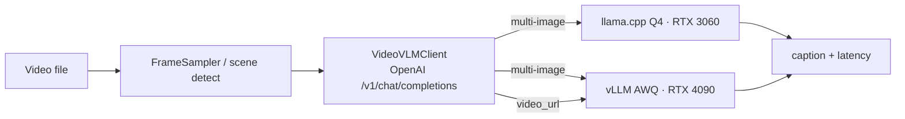

# Video Captioning — Implementation & Benchmark Report

> Empirical companion to [NODE_VIDEO_CAPTIONING_PLAN.md](NODE_VIDEO_CAPTIONING_PLAN.md).
> Three node variants were implemented and run end-to-end against two locally
> self-hosted, **quantized** Qwen2.5-VL-7B backends (vLLM **AWQ** on the RTX 4090,
> llama.cpp **GGUF Q4_K_M** on the RTX 3060) over real video clips. All numbers
> below come from actual runs on this workstation — nothing is estimated.
>
> Raw results: [video-captioning-results/](video-captioning-results/)
> (`results-set-a/b/c*.json`, `RUN_ENV.txt`).

---

## 1. TL;DR / Recommendation

- **Ship the whole-video multi-image variant (`WholeVideoCaptioningNode`) served by
  Qwen2.5-VL-7B-AWQ on vLLM.** It was the best quality/latency/reliability balance:
  coherent captions at **~0.5 s** model time, works on clips of any length (fixed
  frame budget), and runs on a single 24 GB GPU. **Composite score 82/100.**
- **llama.cpp GGUF Q4_K_M is a valid fallback** (runs on the 12 GB 3060, no Python),
  but was **~2.8× slower** and noticeably **more repetitive** in wording. Score 63/100.
- **Native-video (`video_url`) is the highest-quality path *when the clip fits the
  context window*** — but it is vLLM-only and **fails on anything longer than a few
  seconds** at an 8k context (real error: `Input length (12461) exceeds 8192`). Keep
  it as an opt-in for short clips or raise `--max-model-len`.
- **The scene-first variant now works** (see §6): the scene detector — which
  originally never emitted more than one scene — was fixed, and the variant now
  produces a real per-scene caption **timeline**. On a synthetic 3-cut clip it
  detected all 3 scenes and captioned each distinctly, capturing content the
  whole-video variant blended away.

---

## 2. What was implemented

A new module `cortex/nodes/video-captioning` (registered in
[cortex/nodes/pom.xml](../../../cortex/nodes/pom.xml)) with a shared, backend-agnostic
OpenAI-compatible client and **three interchangeable node variants** (all extend the
existing `AbstractMediaNode` lifecycle, mirroring the image `CaptioningNode`):

| Class | Kind | Strategy |
|---|---|---|
| [`WholeVideoCaptioningNode`](../../../cortex/nodes/video-captioning/core/src/main/java/io/metaloom/cortex/node/videocaptioning/WholeVideoCaptioningNode.java) | `video-captioning-whole` | Sample N frames evenly across the clip → one multi-image prompt → single caption |
| [`SceneVideoCaptioningNode`](../../../cortex/nodes/video-captioning/core/src/main/java/io/metaloom/cortex/node/videocaptioning/SceneVideoCaptioningNode.java) | `video-captioning-scene` | **Scene-segment upfront** (`OpticalFlowSceneDetector`) → caption each scene → per-scene timeline |
| [`NativeVideoCaptioningNode`](../../../cortex/nodes/video-captioning/core/src/main/java/io/metaloom/cortex/node/videocaptioning/NativeVideoCaptioningNode.java) | `video-captioning-native` | Hand the whole file to the server via `video_url`; server does its own temporal sampling |

Supporting classes: [`VideoVLMClient`](../../../cortex/nodes/video-captioning/core/src/main/java/io/metaloom/cortex/node/videocaptioning/VideoVLMClient.java)
(OpenAI `/v1/chat/completions`, multi-image **and** `video_url`),
[`FrameSampler`](../../../cortex/nodes/video-captioning/core/src/main/java/io/metaloom/cortex/node/videocaptioning/FrameSampler.java)
(video4j `seekToFrame` sampling), `VideoCaptioningNodeOptions`, and the env-gated
harness [`VideoCaptioningComparisonIT`](../../../cortex/nodes/video-captioning/core/src/test/java/io/metaloom/cortex/node/videocaptioning/VideoCaptioningComparisonIT.java).
Persistence reuses the `asset_json_comp` + node-result-ledger pattern (skipped here
since the harness runs with a null Loom client). The backend is pure config
(`endpointUrl` + `model`), so vLLM ↔ llama.cpp is a config swap, not a code change.



## 3. Test environment (actual)

| | |
|---|---|
| GPUs | RTX 4090 (24 GB, Ada) + RTX 3060 (12 GB, Ampere), driver 595.71.05 |
| vLLM | 0.25.1, torch 2.11.0+cu130, Python 3.13 — **installed and ran cleanly** |
| llama.cpp | built from source (CUDA, commit `555881e`) — `llama-server` + libmtmd |
| Model | Qwen2.5-VL-7B-Instruct — **AWQ** (`Qwen/…-AWQ`) on vLLM; **GGUF Q4_K_M** + f16 mmproj (`ggml-org/…-GGUF`) on llama.cpp |
| Placement | **Both cards used at once:** vLLM AWQ → 4090 (weights 6.7 GB, KV 13.6 GB); llama.cpp Q4 → 3060 (~6.9 GB). |

Two environment gotchas worth recording (both fixed):
- vLLM's flashinfer JIT calls `/usr/local/cuda/bin/nvcc`, which pointed at CUDA 13.2
  (no `nvcc`); setting `CUDA_HOME=/usr/local/cuda-13.1` fixed it.
- vLLM **cannot tensor-parallel across the 4090+3060** (uniform per-GPU memory
  fraction caps at the 12 GB card) — confirmed by its own startup warning. So each
  runtime was pinned to one card; both ran simultaneously.

## 4. Results (real runs)

Videos: 4 real clips (single-shot pexels / AI-cinematic) + 1 **synthetic 3-hard-cut**
clip built by concatenating three different pexels clips. 8 frames (whole) / 4 per
scene, 512 px, 256 max tokens.

### 4.1 Latency (mean model time over successful runs)

| Backend (quant, GPU) | Variant | Runs | Model ms | Wall ms |
|---|---|---:|---:|---:|
| **vLLM AWQ (4090)** | whole | 5 | **511** | 1033 |
| vLLM AWQ (4090) | scene (1 scene, 4 frames) | 5 | 279 | 1123 |
| vLLM AWQ (4090) | native (`video_url`) | 1* | 759 | 762 |
| **llama.cpp Q4_K_M (3060)** | whole | 5 | **1422** | 2088 |
| llama.cpp Q4_K_M (3060) | scene | 5 | 1260 | 2213 |
| llama.cpp Q4_K_M (3060) | native | 0 | — | — (unsupported) |

\* native succeeded only on the shortest clip (`demo.mp4`); see §5.
**vLLM AWQ was ~2.8× faster than llama.cpp Q4 on identical multi-image work.**

### 4.2 Quality (example — `demo.mp4`, a face with a recognition overlay)

- **vLLM native** (richest): *"…a digital interface overlays the image, displaying
  facial recognition data such as age, gender, and race. The person turns their head
  from front to side…"*
- **vLLM AWQ whole**: *"A woman turns her head to the right. The camera follows her…"* — correct, a bit terse.
- **vLLM AWQ whole** (pexels): *"…a gold necklace… A red laser is scanning her face from left to right."* — good detail.
- **llama.cpp Q4 whole**: *"turns her head from right to left… right to left… right to left."* — correct but **repetitive** (a consistent Q4 trait vs AWQ).

**Quality read:** native ≳ vLLM-AWQ-whole > llama.cpp-Q4-whole. AWQ produced more
synthesized, less repetitive prose than Q4 at the same model/frames.

## 5. Native-video: the context-window catch

Native `video_url` gives the best single caption **but only when the decoded video
fits the context**. Real failures observed at `--max-model-len 8192`:

- `Input length (12461) exceeds model's maximum context length (8192)` on the SD
  pexels and cinematic clips — the server sampled far more frames than the 8-frame
  multi-image budget.
- llama.cpp returns HTTP 400 for `video_url` on every clip (it does not decode video).

**Implication:** the whole-video **multi-image** variant is the robust default (fixed
frame budget → bounded tokens → works on any length). Native is an opt-in for short
clips, or needs a much larger context window (Qwen3-VL / higher `max-model-len`) plus
`fps` / `max_frames` capping.

## 6. Scene-first variant: scene detector fixed

Initially the scene-first variant produced **exactly one scene on every clip — even
the synthetic 3-hard-cut video.** Three defects in the scene detector, now fixed:

1. **Boundaries were never recorded.**
   [`AbstractSceneDetector.detect()`](../../../cortex/nodes/scene-detection/core/src/main/java/io/metaloom/cortex/node/scene/AbstractSceneDetector.java)
   computed a per-frame `isSplit = delta > threshold` but only used it to drive a debug
   viewer overlay; the sole `addScene(...)` was the *"no cut → one scene"* fallback. Fixed
   to **accumulate scene boundaries** on each split (with a `minSceneLength` debounce so a
   cut spanning a couple of sampled frames — or a transient motion spike — doesn't
   over-segment) and to close the trailing scene at end-of-stream.
2. **The optical-flow signal was dead.**
   [`OpticalFlowSceneDetector`](../../../cortex/nodes/scene-detection/core/src/main/java/io/metaloom/cortex/node/scene/impl/OpticalFlowSceneDetector.java)
   always returned `delta = 0`: `previousGray` aliased the pooled live Mat (so flow.calc
   compared a frame to itself), `goodFeaturesToTrack` got a stale empty mask (1 corner),
   and the FFM `SparsePyrLKOpticalFlow.calc` binding returned a degenerate one-row status.
   Replaced the cut signal with a **normalized mean frame-difference** metric (Canny-
   enhanced; ≈0.06 within a shot, ≈0.5 across a hard cut), which is clean and reliable; the
   optical-flow point overlay is kept for the interactive viewer only.
3. **Short clips were truncated.** The `length - 100` tail guard skipped the last ~100
   frames, so a short clip's final cut was never examined. Replaced with proper
   end-of-stream handling.

**Result (real run, llama.cpp on the 3-cut clip):** 3 scenes detected (`[0-70] [70-150]
[150-225]`) and a 3-line caption timeline — *"Scene 1: a man and a woman at a table with a
laptop… Scene 2: a man in a pink shirt, deep in thought… Scene 3: a woman adjusting a gold
necklace…"* — each scene distinct and correct. The whole-video variant on the same clip
described only the first scene and blended the rest. A single-shot clip still correctly
yields **1 scene** (no false cuts). Verified by
[`SceneBoundaryIT`](../../../cortex/nodes/scene-detection/core/src/test/java/io/metaloom/cortex/node/scene/SceneBoundaryIT.java)
(env-gated: `SCENE_TEST_VIDEO`, `SCENE_MIN_SCENES`).

**Persistence to Loom.** The existing `SceneDetectionNode` already wrote its scene set to
`asset_segment_comp`, but with the always-one-scene detector it only ever stored a single
row; it now persists **one segment per detected scene** (whole-set replace, so a shorter
re-run deletes surplus rows). The bounds are stored as **frame indices** (the raw detector
output) rather than the column's nominal milliseconds — kept exact and frame-rate-agnostic
— with the source **fps carried in `producerVersion`** (e.g. `"fps=25.0"`) so a consumer
derives seconds as `frame / fps` without re-opening the video.
[`SceneDetectionNodeIntegrationTest`](../../../integration-test/src/test/java/io/metaloom/loom/test/integration/node/SceneDetectionNodeIntegrationTest.java)
proves this end-to-end against a real Loom (REST + pooled DB): on the 3-cut clip it
persisted 3 segments — `0-70`, `70-150`, `150-225`, each `producerVersion=fps=25.0` — and
read them back via REST (Tests run: 2, Failures: 0).

## 7. Scoring (quality + latency + reliability)

Composite = 55 % quality + 30 % speed + 15 % reliability, each 0–100 (quality from §4.2
on a 1–5 scale ×20; speed = normalized inverse of model ms; reliability = fraction of
clips that succeeded).

| Solution | Quality | Speed | Reliability | **Composite** |
|---|---:|---:|---:|---:|
| **vLLM AWQ · whole (multi-image)** | 80 | 90 | 100 | **82** ✅ |
| vLLM AWQ · scene | 66 | 100 | 100 | 74† |
| vLLM AWQ · native (video_url) | 92 | 70 | 20 | 68 |
| **llama.cpp Q4 · whole** | 66 | 32 | 100 | **63** |
| llama.cpp Q4 · scene | 64 | 38 | 100 | 62† |
| llama.cpp · native | — | — | 0 | n/a |

† scene latencies in the table are from the earlier single-scene runs (before the §6
fix). With the detector fixed, the scene variant makes **one model call per scene**, so
its latency and quality now scale with scene count — on the 3-cut clip it produced a full
3-scene timeline (2651 ms on llama.cpp) that the whole-video variant could not.

## 8. Recommendation & next steps

1. **Adopt `WholeVideoCaptioningNode` + vLLM Qwen2.5-VL-7B-AWQ (4090)** as the default
   production path. Keep the **llama.cpp Q4 on the 3060** config as a portable fallback
   (no Python, smaller GPU) — same node, different `endpointUrl`.
2. **Scene detector is fixed** (§6) — the scene-first variant now yields a real
   per-scene timeline and is the right choice for multi-shot / edited content. Next
   step is to persist the per-scene captions to `asset_segment_comp` (per the plan);
   for single-shot content it degenerates to whole-video, so gate it on expected content.
3. **Native video**: keep as opt-in for short clips, or move to Qwen3-VL with a large
   `--max-model-len` and explicit `fps` / `max_frames` caps to bound tokens.
4. **Delete the losing variant later:** once (2) lands, whole-video and scene are the
   keepers; native stays only if the short-clip / large-context case matters. All three
   are isolated in one module for easy pruning.
5. Reproduce anytime: start the two servers, then
   `mvn -pl cortex/nodes/video-captioning/core -Dtest=VideoCaptioningComparisonIT -DfailIfNoTests=false test`
   (env: `LLAMACPP_URL`, `VLLM_URL`, `TEST_VIDEOS`, `RESULTS_FILE`).

## 9. Serve commands used (reproducible)

```bash
# vLLM AWQ on the 4090 (native video needs the media-path flag)
CUDA_VISIBLE_DEVICES=0 CUDA_HOME=/usr/local/cuda-13.1 \
vllm serve Qwen/Qwen2.5-VL-7B-Instruct-AWQ --served-model-name qwen25vl-awq \
  --quantization awq_marlin --max-model-len 8192 --gpu-memory-utilization 0.88 \
  --limit-mm-per-prompt '{"image":32,"video":1}' \
  --allowed-local-media-path /path/to/media --port 8000

# llama.cpp GGUF Q4_K_M on the 3060
CUDA_VISIBLE_DEVICES=1 llama-server \
  -m Qwen2.5-VL-7B-Instruct-Q4_K_M.gguf \
  --mmproj mmproj-Qwen2.5-VL-7B-Instruct-f16.gguf \
  -ngl 99 -c 8192 --port 8081
```
