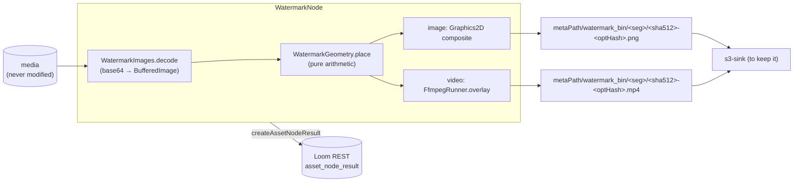

# Watermark Node — Design and Implementation

> The `watermark` node composites a configured overlay image onto the asset's own pixels. Images are
> redrawn with Graphics2D; video is re-encoded through the `ffmpeg` overlay filter with its audio
> stream-copied. The source file is never modified.
>
> **Source of truth**: `cortex/nodes/watermark/`. This document records the design decisions and the
> traps, not the code.

---

## 1. What it does

Cortex had no way to brand or mark media. Every node that touched pixels either *analysed* them
(`quality`, `dominant-color`, `facedetect`) or *generated something new* (`imagegen`, `thumbnail`,
`depthmap`). Nothing composited a supplied overlay onto the asset's own frames.

```
media/*  ──▶  watermark  ──▶  image : artifact/image   (image items)
                          ──▶  video : artifact/video   (video items)
                          ──▶  flag  : scalar/string    (DONE | FAILED)
```

| | |
|---|---|
| Kind | `watermark` |
| Module | `cortex/nodes/watermark` |
| Package | `io.metaloom.cortex.node.watermark` |
| Category | `TRANSFORM` |
| Applies to | Image and video. Audio and documents are skipped |
| Requirements | Images: none. **Video: the `ffmpeg` binary on `PATH`** (the first node in the tree to need an external binary) |
| Persists | `asset_node_result` ledger only — the marked bytes stay in `metaPath/watermark_bin` |



---

## 2. The four decisions that matter

### 2.1 Relative X/Y address the inset box, not the frame

The obvious reading of "relative X" is `x = mediaW * relX`. That places the overlay's **left edge**
at that fraction, so `relX = 1.0` pushes the whole logo outside the picture and `relX = 0.5` centres
its left edge rather than the logo. Both are useless as defaults.

Instead the factors address the box the overlay can slide within:

```
targetW = scale > 0 ? round(mediaW * scale) : sourceW     // scale is relative to MEDIA width
targetH = round(targetW * sourceH / sourceW)              // aspect preserved
x       = round((mediaW - targetW) * relX)
y       = round((mediaH - targetH) * relY)
```

`0.0` is flush left/top, `1.0` flush right/bottom, `0.5` exactly centred, and the overlay can never
leave the frame for any factor in range. Defaults `relX = relY = 0.95` give the conventional
bottom-right placement with a small margin.

**`scale` is relative to the media, not to the overlay.** A logo sized in absolute pixels looks
right on one resolution and wrong on every other, and a media library is never one resolution.
`scale = 0` opts out and keeps the overlay's native size.

A wide-and-short frame can make the aspect-preserved height overflow even when the width fits. The
node then **gives up the requested width rather than the aspect ratio** — a smaller logo is a much
less obvious defect than a squashed one.

This is [WatermarkGeometry](../../../cortex/nodes/watermark/core/src/main/java/io/metaloom/cortex/node/watermark/WatermarkGeometry.java): a pure function, no ImageIO, no ffmpeg, no node. It is the
only piece of logic the two media paths share, therefore the only place a placement bug can live,
and `WatermarkGeometryTest` exercises it directly without either dependency.

### 2.2 ffprobe, not video4j

The video path needs the frame size to turn the relative options into pixels. `video4j`'s
`VideoFile.width()/height()` would answer that, but drags the **OpenCV native runtime** into the
module. Since the node already requires `ffmpeg` for the overlay itself, `ffprobe` ships with it —
so the module stays **pure JDK plus one external binary**, and the same `WatermarkGeometry`
arithmetic drives both paths.

This follows the house rule stated in [DepthImages](../../../cortex/nodes/depthmap/core/src/main/java/io/metaloom/cortex/node/depthmap/DepthImages.java): keep pixel helpers per-module and
OpenCV-free rather than reaching into another node's jar.

Resolving the geometry in Java also keeps the filter graph free of `scale2ref`, which is deprecated
in ffmpeg 7. The graph only ever sees integers.

### 2.3 Video is re-encoded; audio is not

An overlay changes pixels, so the video stream **must** be re-encoded — there is no way around it.
Audio is a different matter, and stream-copying it means a watermarked clip keeps its original sound
bit-for-bit rather than being silently transcoded a second time.

```
ffmpeg -nostdin -hide_banner -loglevel error -y -i <in> -i <overlay.png> \
  -filter_complex "[1:v]scale=W:H,format=rgba,colorchannelmixer=aa=OP[wm];[0:v][wm]overlay=X:Y[v]" \
  -map "[v]" -map "0:a?" \
  -c:v libx264 -crf 23 -preset medium -c:a copy -movflags +faststart <out>
```

- `-map "0:a?"` — the trailing `?` makes the audio stream **optional**, so a silent clip does not
  fail the whole run.
- `colorchannelmixer=aa=` **scales** the overlay's existing alpha rather than replacing it, so a
  fully transparent pixel stays transparent at any opacity setting.
- `%.4f` with `Locale.ROOT` for the opacity. A comma decimal separator would split the filter
  argument and ffmpeg would reject the entire graph — on a German-locale worker only.

### 2.4 Non-destructive, ledger-only

The source file is never touched. The marked copy goes to
`metaPath/watermark_bin/<segment>/<sha512>-<optionsHash>.<ext>` and only an `asset_node_result`
row is recorded — the same contract as `thumbnail`, `imagegen` and `depthmap`, and for the same
reason: **there is still no byte-ingest endpoint for produced media in Loom.** Wire the artifact
port into `s3-sink` to make it durable.

Overwriting in place was considered and rejected: it would invalidate every hash, fingerprint and
consistency result already recorded for the asset, and there is no way back.

---

## 3. Reproducibility and cache correctness

Two mechanisms, and the second is the one that is easy to get wrong.

**`producerVersion = "watermark/1:" + sha256(watermarkBase64)[0..12]`** — the `ScriptNode` shape. A
changed logo is visibly a *different producer* in the ledger, so the record says which mark was
burned in rather than merely that some watermark node ran.

**The options digest is in the artifact file name, not only in the cache key.** This follows
`DominantColorNode` rather than `ImageGenNode`. Two `watermark` nodes in one graph — a logo
bottom-right and a rating badge top-left, say — key on the same media SHA-512, so with a
path-only name each would serve the other's output. The digest covers everything that changes the
output pixels: the watermark **by content** (two different logos of the same size are the commonest
way to get a stale artifact), `relX`, `relY`, `scale`, `opacity`, and the three video encode
settings.

The cache-hit path also **checks the file still exists**. An artifact deleted from the cache
directory between runs would otherwise be handed downstream as a path that no longer resolves, and
`s3-sink` would fail on it rather than the watermark node.

---

## 4. Conventions and Gotchas

🔴 **A `.part` temp file must keep the target's extension last.** ffmpeg chooses its output muxer
from the file name, so writing to `clip.mp4.part` fails with *"Unable to choose an output format"*.
`AtomicFiles.partFor` therefore produces `clip.part.mp4`. This was a real bug, caught by
`WatermarkNodeVideoTest` and pinned by `WatermarkImagesTest.testPartFileKeepsTheTargetsExtensionLast`.

🔴 **`ctx.failure(msg).abort()`, never `.next()`.** `NodeContextImpl.next()` ignores a recorded
failure cause and builds the result as `SUCCESS` — a known defect ([NODES.md](NODES.md) §12). For
this node that would report an *un-watermarked* item as done. `DominantColorNode` works around it
the same way.

⚠️ **A missing ffmpeg fails, it does not skip.** A skip reads as "this clip needed no watermarking",
which would quietly ship unmarked video. The failure message names the `ffmpegPath` option.

⚠️ **The subprocess output must be drained on a separate thread.** Draining after `waitFor` would
deadlock on a full pipe; draining on the *calling* thread would make `readLine` block until the
child closed the pipe, so the wall clock could never fire — which is the one failure mode the
timeout exists to bound. `FfmpegRunner.run` drains on a daemon thread and keeps only the trailing
20 lines, so neither a chatty nor a wedged ffmpeg can hurt the worker.

⚠️ **`ffprobe` reports *coded* dimensions.** A clip carrying rotation side-data or a non-square
sample aspect ratio displays at different dimensions, and the overlay is then placed against coded
rather than displayed geometry. Known and documented; not handled in v1.

⚠️ **The video overlay PNG is written next to the artifact**, not into a shared temp directory, so
two concurrent watermark nodes with different logos cannot overwrite each other's overlay
mid-encode.

⚠️ **`NodeResult` carries no origin.** `ctx.origin(LOCAL)` is set but not observable in the result,
so the tests prove a cache hit by overwriting the artifact with a sentinel and checking it survives,
rather than by asserting `ResultOrigin`.

⚠️ **Concurrency 1 by default.** ffmpeg is already internally threaded; running several items at
once only makes each of them slower.

---

## 5. Key Classes Reference

| Class | Responsibility |
|---|---|
| `WatermarkNode` | Lifecycle, cache key, artifact path, ledger, image/video branch |
| `WatermarkNodeOptions` | The 11 options + `validate()`; `KEY = "watermark"` |
| `WatermarkGeometry` | **Pure** relative→absolute placement; record `Placement(x, y, width, height)` |
| `WatermarkImages` | base64 decode (bare or `data:` URI), Graphics2D composite, atomic PNG write |
| `FfmpegRunner` | The only class that starts a process: `isAvailable()`, `probe()`, `overlay()` |
| `AtomicFiles` | `.part` naming and the replacing/atomic move |
| `WatermarkDescriptorProvider` | The descriptor: 3 ports, 14 form parameters, `TRANSFORM`, icon `branding_watermark` |

---

## 6. Test Setup

```bash
# The node and all its helpers — 51 tests. The video suite self-skips without ffmpeg.
./mvnw -pl cortex/nodes/watermark/core test

# Descriptor + content-type model, SPI discovery (asserts the provider/kind counts)
./mvnw -pl loom-shared/node-model test

# Kind registration: the worker must advertise 'watermark'
./mvnw -pl cortex/cli test -Dtest=NodeRegistrarTest

# Descriptor ports == the node's runtime port constants
./setup-pool.sh && ./mvnw -pl integration-test test -Dtest=NodePortConformanceTest

# End to end against a real in-process Loom + pooled DB
./mvnw -pl integration-test test -Dtest=WatermarkNodeIntegrationTest
```

| Test | What it guards against |
|---|---|
| `WatermarkGeometryTest` | Every placement defect: off-frame at `1.0`, left-edge-not-centre at `0.5`, lost aspect ratio, zero-pixel overlays |
| `WatermarkImagesTest` | Undecodable base64 reaching ImageIO; compositing off by a pixel; the `.part`/muxer trap |
| `WatermarkNodeTest` | Wrong corner; the source file being modified; a stale artifact shared between two differently-configured nodes; a cache hit serving a deleted file |
| `WatermarkNodeVideoTest` | The real ffmpeg contract — dimensions preserved, **audio copied**, temp files cleaned up, a missing binary failing rather than skipping |
| `WatermarkOptionsValidationTest` | A misconfiguration surfacing per-item instead of at pipeline start |
| `WatermarkNodePipelineTest` | The adapter, the events, and the artifact actually chaining into a downstream sink |
| `WatermarkNodeIntegrationTest` | The ledger row not reaching Postgres, or losing the `producerVersion` that identifies the mark |

---

## 7. Progress Assessment

### Done

- [x] **Module, node, options, Dagger module** — `cortex/nodes/watermark`, registered as an
      executable kind in `NodeCollectionModule` and on the `cortex/processor` classpath.
- [x] **Image path** — plain ImageIO/Graphics2D, no OpenCV, atomic PNG write.
- [x] **Video path** — `ffmpeg` overlay filter, audio stream-copied, wall-clocked subprocess with
      bounded output capture and forcible termination.
- [x] **`artifact/video` content type** added to `ContentTypeRegistry`; it satisfies `s3-sink`'s
      `artifact/*` input through the family wildcard.
- [x] **Descriptor + SPI registration**, 14 form parameters, `watermarkBase64` as a `CODE` field so
      a base64 blob is editable.
- [x] **51 unit tests + 2 integration tests**, plus the three cross-tree registrations
      (`NodeDescriptorServiceLoaderTest`, `NodePortConformanceTest`, `NodeRegistrarTest`).
- [x] **UI icon** mapped in `PipelineEditor.tsx`.

### Open

- [ ] **The watermark cannot come from upstream.** An optional `watermark : artifact/image` input
      port would let `imagegen` or `script` supply the overlay, and would follow `imagegen`'s
      wired-port-beats-configured-option idiom. Not built.
- [ ] **No `watermarkPath` option.** A large logo has to be inlined into the pipeline JSON, which is
      stored in Postgres and rendered in the editor. A worker-local path option would avoid that at
      the cost of needing the file on every worker.
- [ ] **PNG output only** for images. A JPEG option with a quality setting is unimplemented; PNG was
      chosen because it is alpha-safe and byte-deterministic, which the pixel assertions rely on.
- [ ] **No tiling, rotation or text watermarks.** One overlay, one position.
- [ ] **Rotation/SAR is not handled** — see §4.
- [ ] 🔴 **The artifact is only durable via `s3-sink`, which must share a worker with this node.**
      The general affinity problem is unsolved tree-wide ([NODES.md](NODES.md) §12); this node
      inherits it exactly as `thumbnail` and `depthmap` do.
- [ ] **No demo data.** `DemoDatabaseInitializer` records no watermark ledger row, so the node does
      not appear in a fresh demo instance.

---

## 8. Where do I find …?

| Need | Path |
|---|---|
| The node | `cortex/nodes/watermark/core/src/main/java/io/metaloom/cortex/node/watermark/WatermarkNode.java` |
| The placement arithmetic | `.../watermark/WatermarkGeometry.java` |
| base64 decode + compositing | `.../watermark/WatermarkImages.java` |
| Every subprocess call | `.../watermark/FfmpegRunner.java` |
| The `.part` naming rule | `.../watermark/AtomicFiles.java` |
| Options + validation | `.../watermark/WatermarkNodeOptions.java` |
| Synthetic image fixtures | `.../src/test/java/io/metaloom/cortex/node/watermark/WatermarkFixtures.java` |
| The descriptor and its 14 form parameters | `loom-shared/node-model/src/main/java/io/metaloom/loom/nodes/spec/WatermarkDescriptorProvider.java` |
| The `artifact/video` content type | `loom-shared/node-model/.../spec/ContentTypeRegistry.java` |
| Kind registration | `cortex/cli/src/main/java/io/metaloom/cortex/cli/dagger/NodeCollectionModule.java` |
| The UI icon mapping | `loom-ui/src/features/pipeline/PipelineEditor.tsx` (`ICON_MAP`, key `branding_watermark`) |
| Customer-facing docs | `website/content/english/docs/nodes/watermark/index.adoc` |

---

_Git HEAD revision: `7d38cfc0`_
_Last updated: 2026-07-30 (new file — records the design of the `watermark` node as built: why the
relative factors address the inset box rather than the frame, why the video path uses ffprobe
instead of video4j, the audio-copy and optional-audio-stream details of the ffmpeg invocation, the
`.part`/muxer trap that the extension ordering exists to avoid, and why the options digest belongs
in the artifact file name and not only in the cache key.)_
