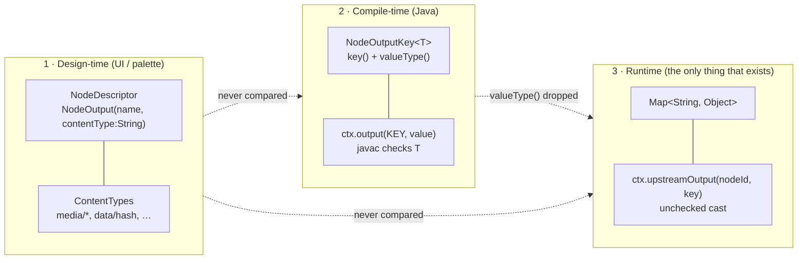

# Node Data Types — Inputs, Outputs, and How They Are Handled

> **Scope.** This file is the reference for **what data flows between pipeline nodes** and **how the
> API layers carry it**. It answers: what does a node consume, what does it emit, what Java/JSON type
> is the value, and what happens to that type at each hop from `ctx.output(...)` to a downstream
> node's `ctx.upstreamOutput(...)`.
>
> **Not in scope** — covered elsewhere, do not duplicate:
> - Node lifecycle, per-node configuration, per-node persistence targets, node capability matrix →
>   [../pipeline-nodes/NODES.md](../pipeline-nodes/NODES.md)
> - Engine, run state, dispatch protocol, segmentation, affinity →
>   [PIPELINE.md](PIPELINE.md)
> - DB schema and DAOs → [../../loom/PERSISTENCE.md](../../loom/PERSISTENCE.md),
>   [../../loom/DOMAIN.md](../../loom/DOMAIN.md)
>
> **Source of truth is the code.** Every table below cites `file:line`. Where a claim here and the
> code disagree, the code wins — fix this file in the same change
> ([../../guidelines/CODING.md](../../guidelines/CODING.md)).

---

## 1. The Headline: Three Type Systems That Never Check Each Other

The same value is described by **three independent type systems**. None of them validates any of the
others. This is the single most important thing to understand before adding a node.

| # | Layer | Where it lives | Vocabulary | Enforced? |
|---|---|---|---|---|
| 1 | **Design-time connector type** | `NodeDescriptor.inputs/outputs` → `NodeInput`/`NodeOutput`, each carrying a **plain `String` `contentType`** | `ContentTypes` constants (`media/*`, `data/hash`, `control/filter_passed`, …) — §4 | ❌ **No.** Served to the UI by `NodeDescriptorEndpoint`; `ContentType.superType` is read by **no Java code**. Nothing validates edge compatibility server-side. |
| 2 | **Compile-time Java type** | `NodeOutputKey<T>` — `key()` + `valueType()` | `String`, `Integer`, `Long`, `Double`, `Boolean` | ⚠️ **Write site only.** `NodeContextImpl.output(NodeOutputKey<T>, T)` type-checks the call, then **discards `valueType()`**. |
| 3 | **Runtime value** | `Map<String, Object>` — context, `NodeResult`, `NodeTask.upstreamOutputs`, `NodeTaskResult.outputs`, `pipeline_node_task.outputs` JSONB | whatever JSON can hold | ❌ **No.** Every read is an unchecked cast. |



**Consequences you must design around:**

- A descriptor may advertise `data/integer` while the node emits a `String`. Nothing complains.
- `NodeOutputKey.equals`/`hashCode` are **key-string only** — two nodes may declare the same string
  key with different `Class` objects and they compare equal.
- The declared `T` is a *documentation contract between the node author and the reader*, not a
  runtime guarantee. **Never trust `result.get(KEY)` to return the declared type** (§9).

**Key definitions:**
[NodeOutputKey.java:14](../../../cortex/api/src/main/java/io/metaloom/cortex/api/node/NodeOutputKey.java#L14)
(interface), [:34](../../../cortex/api/src/main/java/io/metaloom/cortex/api/node/NodeOutputKey.java#L34)
(`of` factory), [:51-63](../../../cortex/api/src/main/java/io/metaloom/cortex/api/node/NodeOutputKey.java#L51-L63)
(key-only `equals`/`hashCode`);
[NodeContextImpl.java:69](../../../cortex/api/src/main/java/io/metaloom/cortex/api/node/context/impl/NodeContextImpl.java#L69)
(where `valueType()` is dropped).

---

## 2. There Is No Input Type

`grep -r NodeInputKey` returns **zero hits**. There is no typed input key, no declared input binding,
and no runtime resolution of a node's inputs. A node reads upstream data through one untyped
accessor:

```java
// NodeContext.java:90-94
@SuppressWarnings("unchecked")
default <T> T upstreamOutput(String nodeId, String key) {
    Map<String, Object> nodeOutputs = upstreamOutputs().get(nodeId);
    return nodeOutputs != null ? (T) nodeOutputs.get(key) : null;
}
```

Three properties of this that bite:

1. **Keyed by pipeline *node id*, not node *kind*.** `ctx.upstreamOutput("facedetect", …)` finds the
   upstream node only if the pipeline author named that instance `facedetect`. Rename it in the
   editor and the lookup silently returns `null`.
2. **`<T>` is erased.** The cast succeeds at the call site and blows up (or silently misbehaves)
   later. There is no `Class` to check against.
3. **Every consumer re-invents coercion** — `Integer.parseInt(obj.toString())`,
   `new JsonObject(obj.toString())`, `value.toString()`, `instanceof Number` with a pass-through
   default. See the "Coercion" column in §6.2.

The `NodeInput` connector list on a descriptor (§6.1) exists **only** for the editor to draw handles
and colour them. It is never consulted at runtime.

---

## 3. The Media Input: `LoomMedia`, `MediaRef`, and the Reference String

Every processing node's real primary input is not an upstream output — it is **the media item**.

| Layer | Type | Notes |
|---|---|---|
| In-node | `LoomMedia` (extends `ProcessableMedia`) | File handle: `isVideo()/isImage()/isAudio()/isDocument()`, `file()`, `path()`, `absolutePath()`, `exists()`, `size()`, `open()`, `getSHA512()` |
| On the wire | `MediaRef { path, sha512, size }` | `NodeTask.media`; `sha512` optional, `size` = `-1` when unknown |
| Loom persistence | `pipeline_run_item.media_path` | The reference string, stored opaquely; re-emitted by `PipelineRunRecovery` |
| Cortex reconstruction | `MediaReferenceResolver.resolve(String)` → `LoomMedia` | Called from `PipelineTaskHandler`; the seam every runner goes through |

`MediaReferenceResolver` exists as a distinct seam from `LoomMediaLoader` for a concrete reason
recorded in its javadoc: `LoomMediaLoader.load` takes a `java.nio.file.Path`, and
`Paths.get("s3://b/k")` collapses to `s3:/b/k`, so a URI cannot round-trip through it.

### 3.1 ⚠️ In flight (uncommitted): object-store references

> **Status: working tree, not committed.** Verify against the code before relying on any detail here.
> `git status` at the time of writing shows `cortex/s3-common/` and `cortex/nodes/s3-source/` as
> untracked/staged additions.

The media input type is being generalised from "a path on a shared mount" to "a location-independent
**reference**":

- **`ProcessableMedia.reference()`** — new default method, purely additive:
  ```java
  default String reference() { return absolutePath(); }
  ```
  Asking for a reference must **not** fetch bytes — that is what keeps bucket enumeration
  metadata-only.
- **`MediaRef.path` keeps its name**; only its *contents* gain a second meaning. It now carries
  whatever `reference()` returned — an absolute path **or** an `s3://bucket/key` URI. `s3://` URIs
  round-trip through the DB as opaque strings.
- **New module `cortex-s3-common`** (`cortex/s3-common/`): `S3Uri`, `S3ObjectRef`, `S3ObjectStore`,
  `AwsS3ObjectStore`, `S3MediaMaterializer` (lazy download + on-disk size-budgeted cache),
  `S3LoomMedia`, `S3MediaReferenceResolver`, `S3Support`.
- **New node module `cortex/nodes/s3-source`** with `S3SourceNode`, registered **conditionally** —
  `RegistryNodeRegistrar.java:100` only registers the `s3-source` kind when `S3Support.isActive()`,
  and logs *"S3 is not configured on this worker; the 's3-source' kind is not advertised"* otherwise.
  This is why `s3-source` does not appear in the `@StringKey` binding set (§6.1 note).
- **`S3LoomMedia` is lazy**: `reference()`, `size()` and the media-type predicates answer with no
  network call; `path()/file()/absolutePath()/exists()/open()/getSHA512()` trigger materialization
  through a double-checked-locked delegate.

**Loose ends recorded here so they are not lost:**

- ~~`NodeTaskRunner.MediaResolver` was widened but `PipelineTaskHandler` narrows back to
  `ref.getPath()`.~~ **Fixed.** The handler passes the whole `MediaRef` through
  (`mediaReferenceResolver::resolve`), and `MediaReferenceResolver.resolve(MediaRef)` is a real
  overload. `S3MediaReferenceResolver` uses the known size to reject an oversized object before any
  network call. The `HEAD` itself remains and is **not** removable: the cache is keyed on the ETag,
  which `MediaRef` does not carry, and serving a cached copy without checking it would risk handing
  a node stale bytes.
- ~~`MediaRef`'s javadoc still claims shared storage is a prerequisite.~~ **Fixed** — it now
  distinguishes an absolute path (shared storage required) from a URI (resolved per worker), and
  records why the field is a `String` rather than a `Path`.
- ~~`S3LoomMedia.exists()` downloads the object to answer.~~ **Fixed.** It answers from the listed
  size, falling back to an already-materialized file, and never materializes. This mattered:
  `AbstractMediaNode` calls it for every item before deciding to do any work.
- ~~`s3-source` emits `uri`/`bucket`/`key` where `filesystem-source` emits `path`.~~ **Fixed.**
  `s3-source` now emits `path` as well, carrying the `s3://` reference, so a downstream node written
  against `filesystem-source` keeps working when the source is swapped.

---

## 4. The Content-Type Vocabulary

Defined as `String` constants in `ContentTypes.java`; `ContentTypes.all()` returns them as
`ContentType(id, label, superType)` records, which is what
`GET /api/v1/node-descriptors` serves alongside the descriptors.

| Content type | Label | Super type | Declared by a provider? |
|---|---|---|---|
| `media/*` | Any Media | — | ✅ |
| `media/image` | Image | `media/*` | ✅ |
| `media/video` | Video | `media/*` | ✅ |
| `media/audio` | Audio | `media/*` | ✅ |
| `media/document` | Document | `media/*` | ❌ **unused** |
| `data/string` | String | — | ✅ |
| `data/integer` | Integer | — | ✅ |
| `data/number` | Number | — | ✅ |
| `data/boolean` | Boolean | — | ✅ |
| `data/hash` | Hash | `data/string` | ✅ |
| `data/path` | File Path | `data/string` | ✅ |
| `data/long` | Long | — | ✅ |
| `data/embedding` | Embedding Vector | — | ❌ **unused** |
| `data/facedetection` | Face Detection | — | ✅ |
| `data/objectdetection` | Object Detection | — | ❌ **unused** |
| `data/imagearea` | Image Region | — | ❌ **unused** |
| `data/text` | Extracted Text | — | ✅ |
| `data/transcript` | Audio Transcript | — | ✅ |
| `data/caption` | Image Caption | — | ✅ |
| `data/scene` | Scene Boundaries | — | ✅ |
| `data/fingerprint` | Media Fingerprint | — | ✅ |
| `data/thumbnail` | Thumbnail Image | — | ✅ (script only) |
| `data/quality` | Quality Metrics | — | ✅ (filter input only) |
| `data/depthmap` | Depth Map | — | ✅ |
| `data/scene_layout` | Scene Layout | — | ✅ |
| `data/color` | Dominant Colour | — | ✅ |
| `control/filter_passed` | Filter Result (bool) | — | ✅ |

🔴 **`superType` is dead weight in Java.** It exists so a `media/image` output can satisfy a `media/*`
input, but no Java code reads it. The **UI** does the collapsing instead, and far more coarsely —
`PipelineEditor.tsx` reduces the whole vocabulary to five connector colours:

```ts
type ConnectorDataType = "media" | "data" | "control" | "text" | "hash"
```
via `toConnectorDataType`: `media/*` → `media`; `data/hash`|`data/fingerprint` → `hash`;
`data/text`|`data/transcript`|`data/caption` → `text`; `control/*` → `control`; everything else →
`data`.

---

## 5. Node Outputs — Complete Reference

### 5.1 Typed keys (`NodeOutputKey`)

39 static constants plus 2 dynamic factories, regenerated from
`grep -rn "NodeOutputKey.of(" cortex/ --include=*.java`.

| Node (kind) | Constant | String key | **Java type** | Declared contentType | Notes |
|---|---|---|---|---|---|
| `MD5Node` (`md5`) | `OUTPUT_MD5` | `md5` | `String` | `data/hash` | |
| `SHA256Node` (`sha256`) | `OUTPUT_SHA256` | `sha256` | `String` | `data/hash` | |
| `SHA512Node` (`sha512`) | `OUTPUT_SHA512` | `sha512` | `String` | `data/hash` | |
| `ChunkHashNode` (`chunk-hash`) | `OUTPUT_CHUNK_HASH` | `chunk_hash` | `String` | `data/hash` | |
| `FingerprintNode` (`fingerprint`) | `OUTPUT_FINGERPRINT` | `fingerprint` | `String` | `data/fingerprint` | literal `"NULL"` when absent |
| `ConsistencyNode` (`consistency`) | `OUTPUT_ZERO_CHUNK_COUNT` | `zero_chunk_count` | **`Long`** | `data/long` | ⚠️ narrows to `Integer` over the wire — §9 |
| `ConsistencyNode` | `OUTPUT_IS_COMPLETE` | `is_complete` | `Boolean` | `data/boolean` | read by thumbnail + fingerprint |
| `ThumbnailNode` (`thumbnail`) | `OUTPUT_THUMBNAIL_FLAG` | `thumbnail_flag` | `String` | `data/string` | `DONE`/`FAILED` |
| `ThumbnailNode` | `OUTPUT_THUMBNAIL_PATH` | `thumbnail_path` | `String` | `data/path` | worker-local path |
| `FacedetectNode` (`facedetect`) | `OUTPUT_FACE_COUNT` | `face_count` | **`Integer`** | `data/integer` | |
| `FacedetectNode` | `OUTPUT_FACEDETECT_FLAG` | `facedetect_flag` | `String` | `data/string` | `SUCCESS`/`NONE` |
| `FacedetectNode` | `OUTPUT_DETECTIONS` | `detections` | `String` (**JSON**) | `data/facedetection` | JSON *string*, deliberately — see §9 |
| `FacedescriptionNode` (`facedescription`) | `OUTPUT_FACE_DESCRIPTION` | `face_description` | `String` (JSON array) | `data/text` | |
| `OCRNode` (`ocr`) | `OUTPUT_OCR_TEXT` | `ocr_text` | `String` | `data/text` | |
| `TikaNode` (`tika`) | `OUTPUT_TIKA_FLAGS` | `tika_flags` | `String` | `data/string` | `DONE`/`FAILED` |
| `TikaNode` | `OUTPUT_TIKA_CONTENT` | `tika_content` | `String` | `data/text` | |
| `WhisperNode` (`whisper`) | `OUTPUT_WHISPER_RESULT` | `whisper_result` | `String` (JSON) | `data/transcript` | |
| `TtsNode` (`tts`) | `OUTPUT_TTS_FLAG` | `tts_flag` | `String` | — (no descriptor) | `DONE`/`FAILED` |
| `TtsNode` | `OUTPUT_TTS_PATH` | `tts_path` | `String` | — (no descriptor) | worker-local WAV |
| `SentimentNode` (`sentiment`) | `OUTPUT_SENTIMENT_LABEL` | `sentiment_label` | `String` | `data/string` | POSITIVE/NEUTRAL/NEGATIVE |
| `SentimentNode` | `OUTPUT_SENTIMENT_SCORE` | `sentiment_score` | **`Double`** | `data/number` | signed polarity |
| `SentimentNode` | `OUTPUT_SENTIMENT_RESULT` | `sentiment_result` | `String` (JSON) | `data/text` | |
| `DepthmapNode` (`depthmap`) | `OUTPUT_DEPTHMAP_FLAG` | `depthmap_flag` | `String` | `data/string` | |
| `DepthmapNode` | `OUTPUT_DEPTHMAP_PATH` | `depthmap_path` | `String` | `data/path` | worker-local 16-bit PNG |
| `DepthmapNode` | `OUTPUT_DEPTHMAP_META` | `depthmap_meta` | `String` (JSON) | `data/depthmap` | embeds the artifact path |
| `SceneLayoutNode` (`scene-layout`) | `OUTPUT_SCENE_LAYOUT_RESULT` | `scene_layout_result` | `String` (JSON) | `data/scene_layout` | |
| `SceneLayoutNode` | `OUTPUT_SCENE_LAYOUT_OBJECTS` | `scene_layout_object_count` | **`Integer`** | `data/integer` | |
| `SceneLayoutNode` | `OUTPUT_SCENE_LAYOUT_RELATIONS` | `scene_layout_relation_count` | **`Integer`** | `data/integer` | |
| `DominantColorNode` (`dominant-color`) | `OUTPUT_DOMINANT_COLOR_RESULT` | `dominant_color_result` | `String` (JSON) | `data/color` | every region + palette |
| `DominantColorNode` | `OUTPUT_DOMINANT_COLOR_HEX` | `dominant_color_hex` | `String` | `data/string` | `#RRGGBB`, uppercase; first region |
| `DominantColorNode` | `OUTPUT_DOMINANT_COLOR_TERM` | `dominant_color_term` | `String` | `data/string` | the facet key (`blue`), stable across a naming retune |
| `DominantColorNode` | `OUTPUT_DOMINANT_COLOR_NAME_EN` | `dominant_color_name_en` | `String` | `data/string` | e.g. `dark greyish blue` |
| `DominantColorNode` | `OUTPUT_DOMINANT_COLOR_NAME_DE` | `dominant_color_name_de` | `String` | `data/string` | e.g. `dunkles graustichiges Blau` — the only non-ASCII output in the system |
| `DominantColorNode` | `OUTPUT_DOMINANT_COLOR_REGIONS` | `dominant_color_region_count` | **`Integer`** | `data/integer` | |
| `LLMNode` (`llm`) | **`resultKey(promptId)`** | `llm_result_<promptId>` | `String` (JSON) | descriptor says `llm_result` | 🔴 name mismatch — §9 |
| `VlmNode` (`vlm`) | **`resultKey(promptId)`** | `vlm_result_<promptId>` | `String` | descriptor says `vlm_result` | 🔴 name mismatch — §9 |
| `QualityNode` (`quality`) | `OUTPUT_BLURRINESS` | `blurriness` | **`Double`** | `data/number` | |
| `QualityNode` | `OUTPUT_IMAGE_WIDTH` | `image_width` | `Integer` | `data/integer` | |
| `QualityNode` | `OUTPUT_IMAGE_HEIGHT` | `image_height` | `Integer` | `data/integer` | |
| `QualityNode` | `OUTPUT_VIDEO_WIDTH` | `video_width` | `Integer` | `data/integer` | |
| `QualityNode` | `OUTPUT_VIDEO_HEIGHT` | `video_height` | `Integer` | `data/integer` | |
| `QualityNode` | `OUTPUT_VIDEO_FPS` | `video_fps` | **`Double`** | `data/number` | |
| `QualityNode` | `OUTPUT_VIDEO_FRAME_COUNT` | `video_frame_count` | **`Long`** | `data/long` | ⚠️ narrows — §9 |
| `QualityNode` | `OUTPUT_QUALITY_FLAG` | `quality_flag` | `String` | `data/string` | |
| `SceneDetectionNode` (`scene-detection`) | `OUTPUT_SCENE_DETECTION` | `scene_detection` | `String` | `data/scene` | |
| `CaptioningNode` (`captioning`) | `OUTPUT_CAPTION` | `caption_result` | `String` | `data/caption` | |
| `ImageGenNode` (`imagegen`) | `OUTPUT_IMAGE_FLAG` | `imagegen_flag` | `String` | — (no descriptor) | `DONE`/`FAILED` |
| `ImageGenNode` | `OUTPUT_IMAGE_PATH` | `imagegen_path` | `String` | — (no descriptor) | worker-local PNG |

**Type census:** 36 × `String`, 6 × `Integer`, 3 × `Double`, 2 × `Long`, 1 × `Boolean`. **No node
emits a POJO, a collection, or a nested map through a `NodeOutputKey`** — structured data is always a
JSON *string*. That is a deliberate convention (§10).

### 5.2 Untyped keys (raw strings, no `NodeOutputKey`)

| Node (kind) | Keys | Java type | Where |
|---|---|---|---|
| `AbstractFilterNode` (all 8 `filter-*`) | `filter_passed`, `filter_reason` | `Boolean`, `String` | `AbstractFilterNode.java:45-47`; constant `PipelineNode.FILTER_PASSED` |
| `FilesystemSourceNode` (`filesystem-source`) | `path`, `source` (`"filesystem"`), `state` | `String` ×3 | `FilesystemSourceNode.java:59-61,193-196` |
| `S3SourceNode` (`s3-source`) | `path` (the `s3://` reference), `uri`, `bucket`, `key`, `source` (`"s3"`), `state` | `String` ×6 | `S3SourceNode.java:44-60,133-145` |
| `AssetSourceNode` (`asset-source`) | `path`, `source` (`"asset"`) | `String` ×2 | `AssetSourceNode.java:26-27,55-57` |
| `ScriptNode` (`script`) | declared per instance | see §7 | `ScriptNode.java:333-339` |

### 5.3 Nodes that emit nothing

`LoomNode` (`loom`), `HashDedupNode` (`sha512-dedup`), `FingerprintDedupNode` (`fingerprint-dedup`,
unregistered stub), `LoomFetchNode` (`loom-fetch`, returns an empty success map). These are sinks or
side-effect nodes.

---

## 6. Node Inputs — Declared vs. Actual

These two tables describe the same thing and **do not agree**. Table 6.1 is what the editor draws;
table 6.2 is what the code executes. Only 6.2 has any runtime effect.

### 6.1 Declared connectors (design-time only)

35 kinds across 21 `NodeDescriptorProvider` implementations, registered in
`loom-shared/node-model/src/main/resources/META-INF/services/io.metaloom.loom.nodes.spec.NodeDescriptorProvider`.

| Kind | Category | Declared inputs (name : contentType : required) | Declared outputs |
|---|---|---|---|
| `filesystem-source` | SOURCE | — | `media : media/*` |
| `s3-source` | SOURCE | — | `media : media/*` |
| `loom-fetch` | SOURCE | — | `media : media/*` |
| `md5` / `sha256` / `sha512` / `chunk-hash` | ANALYSIS | `media : media/* : true` | `<hash> : data/hash` |
| `fingerprint` | ANALYSIS | `media : media/* : true` | `fingerprint : data/fingerprint` |
| `consistency` | ANALYSIS | `media : media/* : true` | `zero_chunk_count : data/long`, `is_complete : data/boolean` |
| `quality` | ANALYSIS | `media : media/* : true` | 8 outputs (see §5.1) |
| `tika` | ANALYSIS | `media : media/* : true` | `tika_flags : data/string`, `tika_content : data/text` |
| `ocr` | ANALYSIS | `media : media/image : true` | `ocr_text : data/text` |
| `captioning` | ANALYSIS | `media : media/image : true` | `caption_result : data/caption` |
| `facedetect` | ANALYSIS | `media : media/image : true`, `media : media/video : true` 🔴 **two inputs, same name** | `face_count`, `facedetect_flag`, `detections : data/facedetection` |
| `facedescription` | ANALYSIS | `facedetection : data/facedetection : true` | `face_description : data/text` |
| `depthmap` | ANALYSIS | `media : media/image : true` | `depthmap_flag`, `depthmap_path : data/path`, `depthmap_meta : data/depthmap` |
| `scene-detection` | ANALYSIS | `media : media/video : true` | `scene_detection : data/scene` |
| `scene-layout` | ANALYSIS | `depth : data/depthmap : true`, `detections : data/facedetection : true` | 3 outputs (see §5.1) |
| `dominant-color` | ANALYSIS | `media : media/image : true`, `detections : data/facedetection : **false**` | 6 outputs (see §5.1) |
| `whisper` | ANALYSIS | `media : media/audio : true`, `media : media/video : true` | `whisper_result : data/transcript` |
| `sentiment` | ANALYSIS | `text : data/text : true` | `sentiment_label`, `sentiment_score`, `sentiment_result` |
| `llm` | ANALYSIS | `media : media/* : true` | `llm_result : data/text` 🔴 |
| `vlm` | ANALYSIS | `media : media/image : true` | `vlm_result : data/text` 🔴 |
| `thumbnail` | TRANSFORM | `media : media/* : true` | `thumbnail_flag`, `thumbnail_path : data/path` |
| `script` | TRANSFORM | `media : media/* : **false**`, `data : data/string : **false**` | **empty** — derived per instance (§7) |
| `filter-mimetype` / `-date` / `-size` / `-duplicate` / `-asset-attribute` | FILTER | `media : media/* : true` | `filter_passed : control/filter_passed` |
| `filter-blacklist` | FILTER | `text : data/text : true` | `filter_passed : control/filter_passed` |
| `filter-quality` | FILTER | `quality : data/quality : true` | `filter_passed : control/filter_passed` |
| `filter-threshold` | FILTER | `value : data/number : true` | `filter_passed : control/filter_passed` |
| `hash-dedup` | OUTPUT | `hash : data/hash : true` | — |
| `fingerprint-dedup` | OUTPUT | `fingerprint : data/fingerprint : true` | — |
| `loom` | OUTPUT | `results : data/string : **false**` | — |

**Descriptor ↔ runtime kind gaps** (a descriptor is not a registration):

| Kind | Descriptor? | Executable? | Note |
|---|---|---|---|
| `tts`, `imagegen` | ❌ | ✅ `@StringKey` | Runnable but **invisible in the UI palette** |
| `hash-dedup` | ✅ | ❌ | Runtime binding is `@StringKey("sha512-dedup")`; the descriptor kind is unreachable |
| `fingerprint-dedup` | ✅ | ❌ | Deliberate — stub |
| `facedescription` | ✅ | ❌ | No `@IntoMap` binding in `FacedetectNodeModule` |
| `filter-*` (8) | ✅ | ❌ | No registration in `RegistryNodeRegistrar` |
| `loom-fetch` | ✅ | ❌ | No producer; see [NODES.md](../pipeline-nodes/NODES.md) §10 |
| `asset-source` | ❌ | ✅ `factory.register` | Programmatic/test use only |
| `s3-source` | ✅ | ✅ **conditionally** | Registered only when `S3Support.isActive()` |

### 6.2 Actual runtime reads (the ones that matter)

| Consumer | `(nodeId, outputKey)` | Binding | Coercion / effect |
|---|---|---|---|
| `FacedescriptionNode` | `("facedetect", "face_count")` | 🔴 **hard-coded** | `Integer.parseInt(obj.toString())`, `-1` when absent; short-circuits when `== 0` |
| `FingerprintNode` | `("consistency", "is_complete")` | 🔴 **hard-coded** | cast to `Boolean`; skips in `isProcessable` when `false` and `!processIncomplete` |
| `ThumbnailNode` | `("consistency", "is_complete")` | 🔴 **hard-coded** | same gate |
| `LoomNode` | `("md5sum", "md5")`, `("sha256sum", "sha256")` | 🔴 **hard-coded; requires an id override** | `MD5.fromString(obj.toString())`. The kinds are `md5`/`sha256`, so the adapter must be built with an overridden id — [PIPELINE.md](PIPELINE.md) §7.3, and §9.2 below |
| `SceneLayoutNode` | `(depthNodeId, "depthmap_meta")`, fallback `(depthNodeId, "depthmap_path")` | configurable, default `"depthmap"` | `new JsonObject(obj.toString())`; patches a null `path` from the sibling key |
| `SceneLayoutNode` | `(nodeId, "detections")` ∀ `detectionSources` | configurable, default `["facedetect"]` | `new JsonObject(...)`; reads `detections[]`, `imageWidth`, `imageHeight`, `coordinates`. Falls back to a Loom REST read-back when empty and `allowLoomFallback` |
| `DominantColorNode` | `(nodeId, "detections")` ∀ `detectionSources` | configurable, default `["facedetect"]` | `new JsonObject(...)`; same four fields. **Differs from `SceneLayoutNode` deliberately**: `NORMALIZED` boxes scale by the *decoded image's* dimensions rather than the payload's (normalised coordinates are resolution-independent by definition, so the payload dims are irrelevant — scene-layout multiplies by them and skips the box when they are absent), and `ABSOLUTE_PIXELS` boxes whose payload dims disagree with the decoded image are rescaled and logged rather than silently mis-cropped. Boxes with a non-zero `frame` are dropped and counted. A malformed payload is warned and ignored |
| `SentimentNode` | first non-blank of `textSources` (`"nodeId:outputKey"`) | configurable | split on first `:`; `toString()`, truncated to `maxChars`. The `outputKey` becomes the persisted component's `variant` |
| `TtsNode` | `(sourceNodeId, sourceOutputKey)` | configurable, defaults `"llm"`/`"llm_result"` | `toString()`, null when blank |
| `ScriptNode` | every `requiredInputs` entry | configurable, default `[]` | **presence-only gate** — skips (does not fail) when any is null/blank |
| `ScriptNode` (script body) | **all** upstream outputs | — | whole `ctx.upstreamOutputs()` map exposed as `upstream["<nodeId>"]["<outputKey>"]` |
| Filter nodes | whole `Map<String, NodeResult>` | per filter | e.g. `ThresholdFilterNode` — `instanceof Number`, **passes everything** when not a `Number` |

---

## 7. `ScriptNode`: Per-Instance Declared Types

`ScriptNode` is the one node whose output *set* is configuration rather than code. Outputs are
declared as `{key, type}` pairs so the editor can draw handles and the author can connect a
downstream node **before the script has ever run** — a node whose outputs only existed after
execution would be unconnectable.

`ScriptValueType` (`ScriptValueType.java:19-56`) — each constant fixes the Java type in the output
map, the connector content type, and where the value is persisted:

| Constant | `contentType()` | `isBinary()` | JSON payload? | Emitted Java type | Script helper |
|---|---|---|---|---|---|
| `STRING` | `data/string` | ❌ | ✅ | `String` | `out.string(k,v)` |
| `TEXT` | `data/text` | ❌ | ✅ | `String` | `out.text(k,v)` |
| `INTEGER` | `data/integer` | ❌ | ✅ | **`Long`** | `out.integer(k,v)` |
| `NUMBER` | `data/number` | ❌ | ✅ | **`Double`** | `out.number(k,v)` |
| `BOOLEAN` | `data/boolean` | ❌ | ✅ | `Boolean` | `out.bool(k,v)` |
| `JSON` | `data/text` | ❌ | ✅ | **`JsonObject`** | `out.json(k,v)` |
| `TEXT_LIST` | `data/text` | ❌ | ✅ | **`List<String>`** | `out.list(k,v)` |
| `TIMEFRAMES` | `data/scene` | ❌ | ❌ | **`List<JsonObject>`** | `out.timeframes(k,v)` |
| `IMAGE` | `data/thumbnail` | ✅ | ❌ | `String` (written path) | `out.image(k,v)` |
| `IMAGE_LIST` | `data/thumbnail` | ✅ | ❌ | `List<String>` (paths) | `out.list(k,v)` |
| `PATH` | `data/path` | ❌ | ✅ | `String` | `out.path(k,v)` |

**This is the only place in the system where a declared type is actually enforced.**
`ScriptOutputCollector.coerce(...)` has one `switch` arm per constant; writing to an undeclared key,
writing `null`, or calling the wrong `out.*()` helper is a hard `ScriptOutputException` naming both
types. `TIMEFRAMES` entries are range-validated (`startMs >= 0`, `endMs >= startMs`).

`ScriptOutputSpec` — record `(key, type, segmentType)`. `KEY_PATTERN = ^[a-z0-9][a-z0-9_]{0,62}$`
deliberately mirrors other nodes' key shape. `SEGMENT_TYPES = [SCENE, SILENCE, SHOT, CHAPTER]`
(default `CHAPTER`), constrained by a DB CHECK on `asset_segment_comp`; `segmentType` is rejected for
non-`TIMEFRAMES` types. `parse(JsonArray)` rejects duplicate keys and two timeframe outputs sharing a
segment type.

**Materialization:** JSON-payload outputs are bundled into one `asset_json_comp` row
(`schemaType="script"`, `variant=<nodeId>`); `TIMEFRAMES` become `asset_segment_comp` rows
(`nodeKind = "script:<nodeId>"`); images are written to
`metaPath/script_bin/<nodeId>/<hash-segment>/<key>-<n>.png` and only the ledger records them. Encoded
payload is capped by `maxOutputBytes` (default 1 MiB).

> The same table is mirrored in TypeScript as `SCRIPT_VALUE_CONTENT_TYPE` in
> `loom-ui/src/features/pipeline/PipelineEditor.tsx` so the editor can draw per-instance handles.
> **Changing the enum means changing both.**

---

## 8. How It Is Handled — The API Walkthrough

```mermaid
sequenceDiagram
    participant N as Node.compute()
    participant C as NodeContext
    participant R as NodeResult
    participant M as NodeResultMapper
    participant W as WebSocket (JSON)
    participant E as PipelineRunEngine
    participant DB as pipeline_node_task.outputs
    participant N2 as Downstream node

    N->>C: ctx.output(KEY, value)
    Note over C: valueType() DISCARDED<br/>HashMap&lt;String,Object&gt;
    C->>R: next() / abort()
    Note over R: SKIPPED/FAILED → emptyMap()
    R->>M: toWire(taskUuid, result)
    M->>W: NodeTaskResult{outputs: Map&lt;String,Object&gt;}
    Note over W: Jackson JSON<br/>Long → Integer if it fits
    W->>E: onNodeTaskResult(itemId, result)
    E->>E: ItemState.results.put(nodeId, result)
    E->>DB: new JsonObject(outputs) → JSONB
    E->>E: collectUpstreamOutputs(state, node)
    E->>W: NodeTask{upstreamOutputs: Map&lt;String,Map&lt;String,Object&gt;&gt;}
    W->>M: toUpstreamResults(...)
    Note over M: upstream state flattened<br/>to COMPLETED
    M->>N2: node.process(media, upstream)
    N2->>N2: ctx.upstreamOutput(nodeId, key) — unchecked cast
```

Hop by hop, with what is lost at each:

| # | Hop | Code | What is lost |
|---|---|---|---|
| 1 | `ctx.output(KEY, v)` | `NodeContextImpl.java:69,74-79` | **`valueType()`** — the typed overload delegates to `output(String, Object)` |
| 2 | `ctx.next()` / `abort()` | `NodeContextImpl.java:93-104` | **All outputs on SKIPPED/FAILED** — both return `Collections.emptyMap()` |
| 3 | `NodeResult` | `NodeResult.java:38-44` | Nothing (defensive copy); but `failed()`/`skipped()` factories also force `emptyMap()` |
| 4 | `NodeResultMapper.toWire` | `NodeResultMapper.java:35-38` | Nothing — `getOutput()` passed straight through |
| 5 | Jackson → WS JSON → Jackson | `ProcessorRegistry.send`, `LoomControlChannel` | **Numeric width** — a `Long` that fits in 32 bits returns as `Integer`. **`ResultOrigin`** never had a field to travel in |
| 6 | `ItemState.record` | `PipelineRunEngine.java:979` | Nothing |
| 7 | JSONB persist | `DaoRunStateStore.java:179` | Non-JSON-encodable values **throw**; the `catch` at `:276` then clears the whole batch (§9) |
| 8 | `collectUpstreamOutputs` | `PipelineRunEngine.java:961-970` | Only *direct dependencies* are forwarded; a grand-parent's outputs are not visible |
| 9 | `toUpstreamResults` | `NodeResultMapper.java:51-58` | **Upstream `state`** — every upstream is rebuilt as a synthetic `success(...)` |
| 10 | `ctx.upstreamOutput` | `NodeContext.java:90-94` | Nothing further — but the cast is unchecked and `<T>` is erased |

**Segments** take a short cut: `SegmentTaskRunner` seeds a `LinkedHashMap<String, NodeResult>` from
the task's upstream outputs and lets in-segment nodes add to it directly. Those additions **never
cross the network** — they stay in the worker for the life of the segment task.

**Filter branching** is the one place the engine *interprets* an output: it reads
`depResult.getFilterPassed()` against `FilterBranch.admits(...)`. That accessor deliberately tolerates
a stringified `"true"` because the Cortex disk caches stringify (§9).

---

## 9. Where Types Are Lost — The Full Audit

Ranked by how likely you are to hit it. Each has a checkbox in §14.

### 🔴 Live defects

1. **`SentimentNode`'s default text sources can never match.**
   `SentimentNodeOptions.DEFAULT_TEXT_SOURCES` lists `vlm:vlm_result` and `llm:llm_result`, but those
   nodes emit `vlm_result_<promptId>` / `llm_result_<promptId>`. Two of the five defaults are dead.
   The same mismatch exists at the descriptor level (`LlmDescriptorProvider` declares `llm_result`).

2. **`LoomNode` requires upstream node ids that differ from the kind names.**
   `ctx.upstreamOutput("md5sum", "md5")` and `("sha256sum", "sha256")` — but `MD5Node.name()` is
   `"md5"` and `SHA256Node.name()` is `"sha256"`. This is a *deliberate id-override contract*
   documented in [PIPELINE.md](PIPELINE.md) §7.3: the MD5 adapter must be constructed as
   `new CortexNodeAdapter("md5sum", md5Node, …)`. It is still a latent trap — nothing enforces the
   override, and a graph authored in the editor (where the node id defaults to the kind) silently
   feeds `LoomNode` nothing.

3. **`Long` narrows to `Integer` across the wire.**
   `OUTPUT_VIDEO_FRAME_COUNT` and `OUTPUT_ZERO_CHUNK_COUNT` are declared `Long`; Jackson and
   `JsonObject.getMap()` return `Integer` when the value fits in 32 bits, so
   `result.get(OUTPUT_VIDEO_FRAME_COUNT)` throws `ClassCastException`. Existing tests already sidestep
   it via `((Number) x).longValue()`.

4. **Outputs are silently discarded on any non-SUCCESS result.** A node that calls `ctx.output(...)`
   and then `ctx.skipped(...)` loses the data with no warning. (Compounded by the known
   `ctx.failure(...).next()` → SUCCESS defect recorded in [NODES.md](../pipeline-nodes/NODES.md) §10.)

5. **A non-JSON-encodable output silently drops a whole batch.** `new JsonObject(outputs)` wraps
   without validating; the failure surfaces at `encode()` inside `JsonObjectConverter`, and the
   `catch (Exception e)` in `DaoRunStateStore` then clears **both** the item and task buffers.

6. **`ResultOrigin` is unrepresentable via the pipeline path.** It is set on the context and read only
   by the legacy `FilesystemProcessorImpl`. `NodeResult`/`NodeTaskResult` have no origin field, yet
   `asset_node_result.origin` exists — so `AbstractMediaNode.recordNodeResult` hardcodes `COMPUTED`
   and the LOCAL/REMOTE distinction never reaches the DB.

7. **`DaoAssetSink` maps only three keys.** `sha512`/`sha256`/`md5`; every other output on the
   `syncToLoom` path is logged as unmapped and dropped.

### ⚠️ Latent / structural

8. **`NodeOutputKey.valueType()` is never enforced anywhere**, and `equals`/`hashCode` ignore it.
   Two nodes may declare the same string key with different types and nothing detects it.

9. **The xattr/sidecar caches stringify everything.** `XAttrNodeCache.serializeOutputMap` writes
   `value.toString()` into `key=value` lines and deserializes every entry back as `String`, so a cache
   hit turns `Integer 2` into `"2"` and `Boolean true` into `"true"`. **Latent, not live** — no
   production code constructs these caches (`grep "new XAttrNodeCache"` finds only tests). It is
   nonetheless *why* `FacedetectNode.OUTPUT_DETECTIONS` is a JSON string and why
   `NodeTaskResult.getFilterPassed()` parses `"true"`. The line format also breaks on values
   containing newlines or `=`.

10. **Hard-coded upstream node ids.** `FacedescriptionNode`, `FingerprintNode`, `ThumbnailNode`,
    `LoomNode` all embed a literal node id. Renaming the node in the editor makes the lookup return
    `null` — and every one of them treats `null` as "absent", so the failure is silent.

11. **Unused vocabulary and duplicate connector names.** `data/embedding`,
    `data/objectdetection`, `data/imagearea` and `media/document` are declared but used by no
    provider. `FacedetectDescriptorProvider` and `WhisperDescriptorProvider` each declare **two inputs
    named `media`**, which the editor cannot disambiguate.

12. **`superType` is dead in Java.** Wildcard compatibility (`media/image` satisfies `media/*`) is
    implemented only in the UI's 5-colour collapse, so no server-side validation can use it.

13. **`FILTER_PASSED` is duplicated in three places** with no shared constant:
    `PipelineNode.FILTER_PASSED` (cortex pipeline-api), `FilterBranch.FILTER_PASSED` (loom-shared),
    and the mirrored cortex `FilterBranch`.

---

## 10. Conventions and Gotchas

| Rule | Why |
|---|---|
| **Emit structured data as a JSON `String`, never a POJO or `Map`** | The map must survive Jackson, JSONB and (latently) a stringifying cache. `FacedetectNode.OUTPUT_DETECTIONS` documents this in-code. A POJO writes fine into the in-memory map and blows up at persist time — taking the whole batch with it (§9.5) |
| **Never cast an upstream value; coerce it** | Use `((Number) v).longValue()`, `String.valueOf(v)`, `new JsonObject(v.toString())`. `result.get(KEY)` is an unchecked cast and the wire does not preserve numeric width |
| **Prefer `Double`/`Integer` over `Long` for new keys** | `Long` is the one type the JSON round trip actively breaks (§9.3) |
| **Never hard-code an upstream node id** | Make it a node option, as `SceneLayoutNode.depthNodeId` and `SentimentNode.textSources` do. Node ids are author-chosen |
| **A failure path must end in `abort()`, never `failure(...).next()`** | `NodeContextImpl.next()` ignores `failureCause` and returns SUCCESS (§9.4) — a node that reports a broken file with `failure(msg).next()` shows green in the run summary. Only `abort()` yields `FAILED`. `DominantColorNode` is the first node written against this; eleven others still have the bug |
| **A cache key must cover every input, not just the media path** | `LocalResultCache` keyed on `absolutePath()` alone hands back the first run's answer when the same file is re-run behind a different upstream node or different options. `ScriptNode` (path + script hash) and `DominantColorNode` (path + upstream payloads + options hash) get this right; `SceneLayoutNode` does not |
| **Write all outputs *before* deciding the result state** | `skipped()`/`abort()` discard the output map entirely (§9.4) |
| **A descriptor is not a registration** | Adding a `NodeDescriptorProvider` makes a kind visible in the palette; running it needs `@Binds @IntoMap @StringKey("<kind>")` in the node's own module. The two sets currently differ in 6 places (§6.1) |
| **Keep the descriptor's output *names* identical to the runtime string keys** | The `llm`/`vlm` prompt-id suffix already breaks this and makes `sentiment`'s defaults dead (§9.1) |
| **New `ScriptValueType` constant → update the UI mirror** | `SCRIPT_VALUE_CONTENT_TYPE` in `PipelineEditor.tsx` |
| **Node id pattern** | `^[a-z0-9]([a-z0-9\-]{0,62}[a-z0-9])?$`; script output keys use `^[a-z0-9][a-z0-9_]{0,62}$` (underscore, not hyphen) |
| **Only direct dependencies' outputs are forwarded** | `collectUpstreamOutputs` walks `node.getDependencies()`. To read a grandparent's output, depend on it explicitly |
| **`reference()` must not fetch bytes** ⚠️ | The whole point of the S3 reference split — enumeration stays metadata-only (§3.1) |

---

## 11. Environment Variables

The only environment variables that change a node's **input type** are the S3 ones — they decide
whether `MediaRef.path` may be an `s3://` URI and whether the `s3-source` kind is advertised at all.

⚠️ **In-flight — uncommitted.** CLI flags come from `CortexCLI`, env mapping from
`EnvDefaultProvider`; precedence is CLI flag → env var → default.

| Variable | CLI flag | Default | Purpose |
|---|---|---|---|
| `CORTEX_S3_ENDPOINT` | `--s3-endpoint` | — (real AWS) | Endpoint override, e.g. `http://minio:9000` |
| `CORTEX_S3_REGION` | `--s3-region` | — | S3 region |
| `CORTEX_S3_ACCESS_KEY` | `--s3-access-key` | AWS default credentials chain | Static access key |
| `CORTEX_S3_SECRET_KEY` | `--s3-secret-key` | — | Static secret key |
| `CORTEX_S3_PATH_STYLE` | `--s3-path-style` | `true` when an endpoint is set | Path-style addressing (MinIO, most gateways) |
| `CORTEX_S3_CACHE_PATH` | `--s3-cache-path` | `<meta-path>/s3_bin` | Where materialized objects land |
| `CORTEX_S3_INDEX_PATH` | `--s3-index-path` | `<meta-path>/s3-index` | Persisted per-bucket object indexes |
| `CORTEX_S3_MAX_CACHE_BYTES` | `--s3-max-cache-bytes` | — | Cache size budget; `0` disables eviction |
| `CORTEX_S3_MAX_OBJECT_SIZE` | `--s3-max-object-size` | — | Largest object to materialize; `0` = unbounded |
| `CORTEX_S3_RECONCILE_INTERVAL_MS` | `--s3-reconcile-interval-ms` | — | How long the event fast path may run before a full reconcile |
| `CORTEX_S3_EVENTS_ENABLED` | `--s3-events-enabled` | — | Accept bucket notifications so a run can skip listing |
| `CORTEX_S3_EVENTS_MODE` | `--s3-events-mode` | — | `WEBHOOK` (MinIO `notify_webhook`) or `SQS` |
| `CORTEX_S3_EVENTS_WEBHOOK_PATH` | `--s3-events-webhook-path` | — | Route on the monitoring server |
| `CORTEX_S3_EVENTS_WEBHOOK_SECRET` | `--s3-events-webhook-secret` | — | Shared secret in `X-Cortex-S3-Token`; required with webhook events |
| `CORTEX_S3_EVENTS_QUEUE_URL` | `--s3-events-queue-url` | — | SQS queue fed by S3 notifications |
| `CORTEX_S3_EVENTS_MAX_BUFFERED_KEYS` | `--s3-events-max-buffered-keys` | — | Ceiling on buffered change hints |

General Cortex/Loom variables: [../../cortex/CONFIGURATION.md](../../cortex/CONFIGURATION.md),
[../../loom/CONFIGURATION.md](../../loom/CONFIGURATION.md).

---

## 12. Key Classes Reference

| Class | Package / module | Purpose |
|---|---|---|
| `NodeOutputKey<T>` | `io.metaloom.cortex.api.node` (cortex/api) | Typed output key — `key()` + `valueType()`. Type is advisory |
| `NodeContext<I>` | `io.metaloom.cortex.api.node.context` | Per-invocation context; `output()`, `outputs()`, `upstreamOutput()` |
| `NodeContextImpl` | `…api.node.context.impl` | Backing `HashMap<String,Object>`; drops `valueType()`; empties outputs on skip/abort |
| `NodeResult` | `io.metaloom.cortex.api.node` | Unified result: `state`, `nodeId`, `durationMs`, `message`, `Map<String,Object> outputs` |
| `ResultState` / `ResultOrigin` | `io.metaloom.cortex.api.node` | `SUCCESS/SKIPPED/FAILED`; `COMPUTED/LOCAL/REMOTE` (origin never reaches the wire) |
| `ProcessableMedia` / `LoomMedia` | `io.metaloom.cortex.api.media` | Media handle; `reference()` ⚠️ in-flight |
| `MediaReferenceResolver` | `io.metaloom.cortex.common.media` (cortex/common) | Reference string → `LoomMedia`. Subclassed by `S3MediaReferenceResolver` |
| `NodeDescriptor` / `NodeInput` / `NodeOutput` | `io.metaloom.loom.nodes.spec` (loom-shared/node-model) | Design-time connector model; `contentType` is a plain `String` |
| `ContentTypes` / `ContentType` | `io.metaloom.loom.nodes.spec` | The connector vocabulary; `superType` unused in Java |
| `NodeDescriptorProvider` / `NodeDescriptorRegistry` | `io.metaloom.loom.nodes.spec` | ServiceLoader SPI (21 providers, 35 kinds) |
| `MediaRef` / `NodeTask` / `NodeTaskResult` | `io.metaloom.loom.pipeline.model` (loom-shared/pipeline-model) | The wire model. `NodeTask.upstreamOutputs` is `Map<String,Map<String,Object>>` |
| `NodeResultMapper` | `io.metaloom.cortex.runtime` (cortex/node-runtime) | `toWire` / `toUpstreamResults` / `toLocal`; flattens upstream state |
| `NodeTaskRunner` / `SegmentTaskRunner` / `SourceTaskRunner` | `io.metaloom.cortex.runtime` | Execute a dispatched task; `MediaResolver` seam |
| `PipelineRunEngine` | `io.metaloom.loom.pipeline.engine` | `collectUpstreamOutputs`, `record`, filter-branch evaluation |
| `ItemState` | `io.metaloom.loom.pipeline.engine` | `LinkedHashMap<String, NodeTaskResult>` per item |
| `DaoRunStateStore` | `io.metaloom.loom.rest.service.impl` | Outputs → `pipeline_node_task.outputs` JSONB |
| `AssetSink` / `DaoAssetSink` | `io.metaloom.loom.pipeline.engine` / `…rest.service.impl` | `syncToLoom` path; maps only the 3 hash keys |
| `ScriptValueType` / `ScriptOutputSpec` | `io.metaloom.cortex.node.script` | The **only** enforced declared-type system |
| `ScriptOutputCollector` | `…node.script.engine` | `coerce(...)` — one arm per `ScriptValueType` |
| `AbstractFilterNode` | `io.metaloom.cortex.pipeline.core.node.filter` | Emits `filter_passed` (`Boolean`) + `filter_reason` |
| `XAttrNodeCache` / `SidecarFileNodeCache` | `io.metaloom.cortex.pipeline.common.cache` | Stringifying caches — latent type hazard |

---

## 13. Where Do I Find…?

| Need | Path |
|---|---|
| The typed output key abstraction | `cortex/api/src/main/java/io/metaloom/cortex/api/node/NodeOutputKey.java` |
| Where `valueType()` is dropped | `cortex/api/.../node/context/impl/NodeContextImpl.java:69` |
| Where outputs are discarded on skip/abort | `cortex/api/.../node/context/impl/NodeContextImpl.java:93-104` |
| All output key declarations | `grep -rn "NodeOutputKey.of(" cortex/ --include=*.java` |
| All upstream reads | `grep -rn "upstreamOutput(" cortex/ --include=*.java` |
| The connector vocabulary | `loom-shared/node-model/.../spec/ContentTypes.java` |
| Descriptor declarations | `loom-shared/node-model/.../spec/*DescriptorProvider.java` |
| The descriptor SPI registration list | `loom-shared/node-model/src/main/resources/META-INF/services/io.metaloom.loom.nodes.spec.NodeDescriptorProvider` |
| Which kinds are actually executable | `grep -rn '@StringKey("' cortex/ --include=*.java` + `factory.register(` in `cortex/cli/.../RegistryNodeRegistrar.java` |
| The wire model | `loom-shared/pipeline-model/.../{MediaRef,NodeTask,NodeTaskResult}.java` |
| Cortex↔wire mapping | `cortex/node-runtime/.../NodeResultMapper.java` |
| Upstream forwarding on the Loom side | `loom/pipeline/.../engine/PipelineRunEngine.java` (`collectUpstreamOutputs`) |
| Outputs → JSONB | `loom/services/rest/.../impl/DaoRunStateStore.java`; column in `V2.31__add_pipeline_execution_state.sql` |
| JSONB converter config | `loom/db/jooq/pom.xml` (`forcedTypes` → `JsonObjectConverter`) |
| Script declared types | `cortex/nodes/script/core/.../script/{ScriptValueType,ScriptOutputSpec}.java` |
| Script type coercion | `cortex/nodes/script/core/.../script/engine/ScriptOutputCollector.java` |
| The UI connector collapse | `loom-ui/src/features/pipeline/PipelineEditor.tsx` (`toConnectorDataType`) |
| Media reference resolution | `cortex/common/.../media/MediaReferenceResolver.java`; S3 in `cortex/s3-common/` |
| Typed payload persistence targets | [../pipeline-nodes/NODES.md](../pipeline-nodes/NODES.md) §2 |

### 13.1 Typed-payload persistence (pointer only)

An output becomes a durable typed row through the `LoomClient`. **[NODES.md](../pipeline-nodes/NODES.md)
§2 owns the detail** — this table exists so you can find the method from a type.

| Payload | Client method | REST path | Request model |
|---|---|---|---|
| Hashes / consistency | `updateAsset` | `assets/{id}` | `AssetUpdateRequest` (`HashInfo`) |
| Face detections | `bulkCreateAssetDetections` | `assets/{uuid}/detections/bulk` | `DetectionBulkCreateRequest` |
| Transcript | `createAssetTranscript` | `assets/{uuid}/transcripts` | `TranscriptCreateRequest` |
| Fingerprint | `createAssetFingerprintComp` | `assets/{uuid}/fingerprints` | `FingerprintCompCreateRequest` |
| Segments / timeframes | `createAssetSegmentComps` | `assets/{uuid}/segments` | `SegmentCompCreateRequest` (whole-set replace) |
| Generic JSON | `createAssetJsonComp` | `assets/{uuid}/json-comps` | `JsonCompCreateRequest` |
| **Ledger (always)** | `createAssetNodeResult` | `assets/{uuid}/node-results` | `NodeResultCreateRequest` |

The ledger row (`asset_node_result`, migration `V2.45`) carries `node_kind`, `node_id`,
`producer_version`, `state`, `origin`, `duration_ms` and an **advisory** `result_ref` JSONB pointer
`{"table": "...", "uuids": [...]}`. Its own migration comment warns: *"NOT a foreign key… Do not build
integrity on it."*

---

## 14. Test Setup

No database is involved in the type behaviour, so **`./setup-pool.sh` is not required** for anything
in this section (it is still required for the integration tests referenced at the end).

```bash
# The only enforced declared-type system — coercion, validation, parse errors
mvn -q test -pl cortex/nodes/script/core

# Wire mapping: toWire / toUpstreamResults / toLocal, runner media resolution
mvn -q test -pl cortex/node-runtime

# Descriptor + content-type model, SPI discovery
mvn -q test -pl loom-shared/node-model

# Media reference resolution (⚠️ in-flight module)
mvn -q test -pl cortex/s3-common

# Kind registration: which kinds a worker advertises, incl. the conditional s3-source
mvn -q test -pl cortex/cli -Dtest=NodeRegistrarTest
```

**What is already pinned by tests:**

- `ScriptValueType` / `ScriptOutputSpec` parsing, coercion, duplicate-key and segment-type rejection.
- `NodeRegistrarTest` asserts `s3-source` is **absent** without S3 config and **present** with it.
- `ConsistencyNodeTest` reads `zero_chunk_count` via `((Number) x).longValue()` — an existing,
  deliberate work-around for the `Long` narrowing in §9.3.
- `PipelineNodeOptionsParsingTest` / `PipelineConfigurableTest` pin per-instance option delivery.

**What is not pinned, and would be the highest-value additions:**

- No test asserts a descriptor's declared output *names* match the node's runtime string keys. Such a
  test would have caught §9.1 and §9.2 immediately, and is the cheapest fix for the whole class of
  defect. It can be written entirely in `loom-shared/node-model` against the SPI plus a table of
  expected keys.
- No test asserts a value survives a full `output → JSON → JSONB → upstreamOutput` round trip with its
  type intact (§9.3).
- No test covers the stringifying caches against typed keys (§9.9).

Per-node end-to-end coverage lives in `integration-test/` — see
[NODES.md](../pipeline-nodes/NODES.md) §12. Those **do** need `./setup-pool.sh`.

---

## 15. Progress Assessment

### Solid

- [x] **One `NodeResult` type** across the Cortex node API and the pipeline level; one `ResultState`.
- [x] **`ScriptValueType` genuinely enforces its declared types** — one coercion arm per constant,
      hard failure on undeclared keys, wrong helper, or `null`. This is the model for doing declared
      types properly.
- [x] **Descriptor SPI is populated** — 21 providers, 35 kinds, driving the editor palette and forms.
- [x] **Outputs are durably persisted** to `pipeline_node_task.outputs` (JSONB) and survive a restart
      via `RunStateStore` / `PipelineRunRecovery`.
- [x] **Wire format is structured JSON**, not stringified — `Map<String,Object>` round-trips through
      Jackson with JSON-native types intact (modulo numeric width, §9.3).
- [x] **Media reference indirection exists** — `ProcessableMedia.reference()` +
      `MediaReferenceResolver` remove the shared-mount assumption. ⚠️ uncommitted.

### Open — naming and contract mismatches

- [ ] 🔴 **`SentimentNode` default `textSources` can never match** — `vlm:vlm_result` /
      `llm:llm_result` vs. the actual `*_result_<promptId>` keys (§9.1).
- [ ] 🔴 **`LoomNode` depends on an unenforced id override** — it reads `md5sum`/`sha256sum` while the
      kinds are `md5`/`sha256`, so an editor-authored graph silently feeds it nothing (§9.2).
- [ ] **`llm` / `vlm` descriptors declare an output name the node never emits** — the prompt-id suffix
      is invisible to the descriptor model, which has no notion of a dynamic output set.
- [ ] **No test asserts descriptor output names match runtime keys** — the single highest-value gap
      (§14).
- [ ] **Four content types are declared but unused**: `data/embedding`, `data/objectdetection`,
      `data/imagearea`, `media/document` (§9.11). `data/imagearea` is the honest type for a generic
      region producer, but the only box producer today is `facedetect`, whose output is typed
      `data/facedetection` — so `dominant-color` declares that on its input rather than making the
      editor's connector labels disagree with reality.
- [ ] **`facedetect` and `whisper` each declare two inputs named `media`** — undisambiguatable in the
      editor (§9.11).

### Open — type safety

- [ ] 🔴 **`Long` narrows to `Integer`** across the JSON/JSONB round trip; the typed accessor throws
      (§9.3).
- [ ] **`NodeOutputKey.valueType()` is enforced nowhere**, and `equals`/`hashCode` ignore it (§9.8).
      Minimum fix: `valueType().cast(value)` in `NodeContextImpl.output(NodeOutputKey<T>, T)`.
- [ ] **Outputs are silently discarded on SKIPPED/FAILED** (§9.4).
- [ ] **A non-JSON-encodable output drops the whole persist batch silently** (§9.5).
- [ ] **`ResultOrigin` never reaches the wire**, so `asset_node_result.origin` is always `COMPUTED`
      (§9.6).
- [ ] **`DaoAssetSink` maps only `sha512`/`sha256`/`md5`**; all other outputs on the `syncToLoom` path
      are dropped (§9.7).
- [ ] **Stringifying xattr/sidecar caches** would corrupt every non-`String` typed key if ever wired
      up; the line format also breaks on `\n` and `=` (§9.9).
- [ ] **`superType` is unused in Java** — no server-side edge-compatibility validation exists (§9.12).
- [ ] **`FILTER_PASSED` duplicated in three places** with no shared constant (§9.13).

### Open — structural

- [ ] **There is no input type system at all.** No `NodeInputKey`, no declared binding, no resolution.
      Every consumer hard-codes or configures a `"nodeId:outputKey"` string and hand-rolls coercion
      (§2, §6.2).
- [ ] **Four nodes hard-code an upstream node id** and treat a rename as "absent" (§9.10).
- [ ] **Descriptor set and executable-kind set differ in 6 places** — `tts`/`imagegen` runnable but
      invisible; `hash-dedup`/`facedescription`/`filter-*`/`loom-fetch` visible but not runnable
      (§6.1).
- [ ] **Only direct dependencies' outputs are forwarded**; `collectUpstreamOutputs`' own javadoc notes
      the Phase-1 approach "is known not to survive large values".

### S3 work — all four findings resolved

- [x] **Widened `MediaResolver` now earns its keep** — `PipelineTaskHandler` passes the whole
      `MediaRef`, and the S3 resolver uses the known size to reject oversized objects before any
      network call. The remaining `HEAD` is required for the ETag that keys the cache (§3.1).
- [x] **`MediaRef`'s javadoc rewritten** — path vs. URI, and why the field is not a `Path`.
- [x] **`S3LoomMedia.exists()` no longer downloads** — answered from the listed size.
- [x] **Shared source output contract** — `s3-source` emits `path` alongside `uri` (§5.2).

---

_Git HEAD revision: `5ac79b6d`_
_Last updated: 2026-07-28 (added the `dominant-color` node: six output keys, the `data/color` content
type, and two new entries in §10 Conventions that its implementation forced out into the open — a
failure path must end in `abort()` because `failure(...).next()` silently reports SUCCESS, and a
`LocalResultCache` key must cover the upstream payloads and options rather than the media path alone.
Its §6.2 row records where its detections parsing deliberately diverges from `SceneLayoutNode`'s.
Previously: new file. Documents the three independent type systems (descriptor
`contentType`, `NodeOutputKey<T>`, runtime `Map<String,Object>`), the complete per-node input/output
reference regenerated from the code, the hop-by-hop API walkthrough with what each hop loses, and a
full type-safety audit. Covers the media-reference work — `ProcessableMedia.reference()`, `MediaReferenceResolver`,
`cortex-s3-common` and the conditionally-registered `s3-source` node. The four defects this file
originally recorded against that in-flight work have all been fixed and pinned by tests; see the
audit section._
