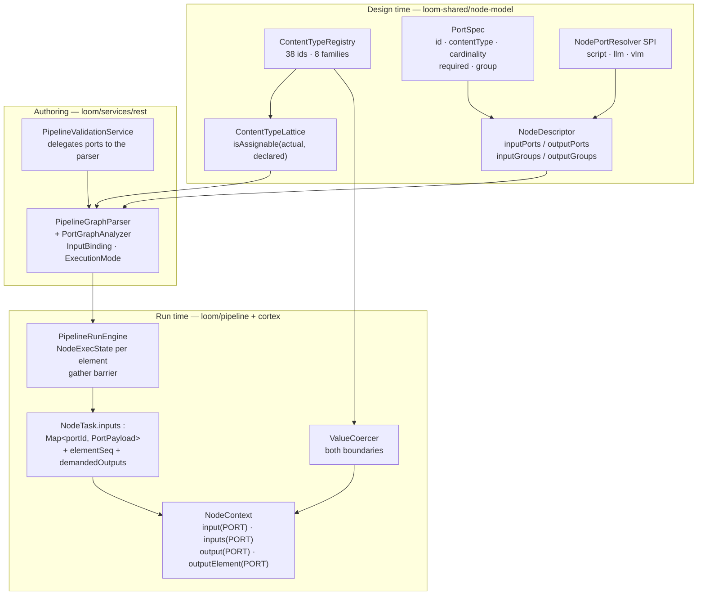
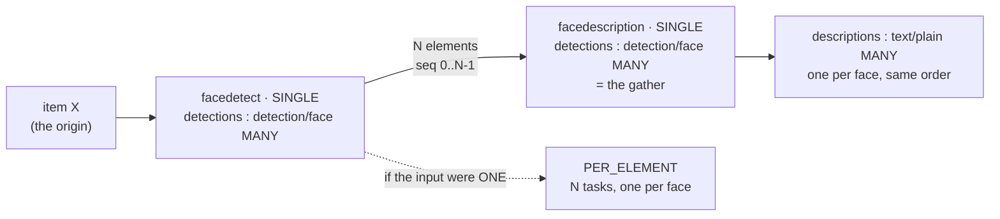

# Node Data Types — Typed Ports, Cardinality, and Origin-Tagged Sequences

> **Scope.** This file is the reference for **what data flows between pipeline nodes** and **how it is
> typed, wired, checked and carried**. It answers: which ports does a node have, what content type
> and cardinality does each carry, how does an edge bind one port to another, what does the engine
> hand a node at dispatch time, and where is a value coerced.
>
> **Not in scope** — covered elsewhere, do not duplicate:
> - Node lifecycle, per-node configuration, per-node persistence targets, node capability matrix →
>   [../pipeline-nodes/NODES.md](../pipeline-nodes/NODES.md)
> - Engine internals, run state, dispatch protocol, segmentation, affinity, DB schema →
>   [PIPELINE.md](PIPELINE.md)
> - The design rationale, the locked decisions and the phase plan →
>   [NODE_DATA_TYPES_PLAN.md](NODE_DATA_TYPES_PLAN.md)
> - DAOs and persistence → [../../loom/PERSISTENCE.md](../../loom/PERSISTENCE.md),
>   [../../loom/DOMAIN.md](../../loom/DOMAIN.md)
>
> **Source of truth is the code.** Every table below cites `file:line`. Where a claim here and the
> code disagree, the code wins — fix this file in the same change
> ([../../guidelines/CODING.md](../../guidelines/CODING.md)).

> ⚠️ **The refactor is in the working tree, not committed, and the Cortex tail is still landing.**
> The contract below is authoritative — it is what the descriptors declare and what the parser and
> engine enforce. §11 is a **dated snapshot** of which modules have caught up, together with the
> commands to re-derive it, because a stale list is worse than none.

---

## 1. The Headline: One Type System, Checked in One Place

A value that travels between two nodes is described **once**, by the **port** it leaves and the port
it arrives at. Three things that used to be independent are now the same statement:

| Concern | Where it is declared | Where it is enforced |
|---|---|---|
| **What kind of thing this is** | `PortSpec.contentType` — an id of the form `family/subtype` from [`ContentTypeRegistry`](../../../loom-shared/node-model/src/main/java/io/metaloom/loom/nodes/spec/ContentTypeRegistry.java) | `ContentTypeLattice.isAssignable(actual, declared)` — one implementation, called by the graph parser at save time **and** at run start ([PortGraphAnalyzer.java:135](../../../loom/pipeline/src/main/java/io/metaloom/loom/pipeline/graph/PortGraphAnalyzer.java#L135)) |
| **One or many** | `PortSpec.cardinality` = `ONE` \| `MANY` | Multi-edge rule ([PortGraphAnalyzer.java:141-146](../../../loom/pipeline/src/main/java/io/metaloom/loom/pipeline/graph/PortGraphAnalyzer.java#L141-L146)) and the execution-mode computation (§6) |
| **What Java type the value is** | `InputPort<T>` / `OutputPort<T>` on the node, plus the content type | `ValueCoercer.coerce(...)` on write and on read, then `port.valueType().cast(...)` ([NodeContextImpl.java:144-149](../../../cortex/api/src/main/java/io/metaloom/cortex/api/node/context/impl/NodeContextImpl.java#L144-L149)) |



**The one sentence to remember:** a node no longer reads *"the output named `face_count` from the
node someone called `facedetect`"*; it reads *"my input port `detections`"*, and the engine resolves
which upstream `(node, port)` fills it from the wired edges
([buildInputs, PipelineRunEngine.java:1144-1203](../../../loom/pipeline/src/main/java/io/metaloom/loom/pipeline/engine/PipelineRunEngine.java#L1144-L1203)).

---

## 2. The Content-Type Vocabulary

`ContentTypeRegistry` replaces the deleted `ContentTypes` holder. A content type id is **always**
`family/subtype`; `family/*` is the family root. There are **8 families and 39 registered ids**,
every family carrying its own wildcard
([ContentTypeRegistry.java:79-132](../../../loom-shared/node-model/src/main/java/io/metaloom/loom/nodes/spec/ContentTypeRegistry.java#L79-L132)).

`ContentType` — the record served to the UI — carries `id`, `label`, `family`, `description` and
`wildcard`. Both `family` and `wildcard` are **derived from the id** in the constructor
([ContentType.java:40-46](../../../loom-shared/node-model/src/main/java/io/metaloom/loom/nodes/spec/ContentType.java#L40-L46)); the old `superType` parent pointer is gone, because the
supertype of `detection/face` is structurally `detection/*`.

| Family (one editor colour) | Ids | Notes |
|---|---|---|
| **media** | `media/*` · `media/image` · `media/video` · `media/audio` · `media/document` | What a source emits and what a processing node consumes. `media/document` is now declared by `tika`-class consumers rather than being dead |
| **text** | `text/*` · `text/plain` · `text/transcript` · `text/caption` | `text/*` is what `sentiment`, `tts`, `filter-blacklist` and `imagegen`'s prompt port accept |
| **detection** | `detection/*` · `detection/face` · `detection/object` · `detection/region` | `detection/*` is what `scene-layout` and `dominant-color` accept, so faces *or* objects can drive them |
| **hash** | `hash/*` · `hash/md5` · `hash/sha256` · `hash/sha512` · `hash/chunk` · `hash/fingerprint` | Split per algorithm. This is what lets `loom` bind by **port type** instead of by node id |
| **scalar** | `scalar/*` · `scalar/string` · `scalar/integer` · `scalar/number` · `scalar/boolean` | `scalar/integer` is **always 64-bit** — it merges the former `data/integer` and `data/long` |
| **artifact** | `artifact/*` · `artifact/image` · `artifact/video` · `artifact/audio` · `artifact/file` | A **worker-local produced file**, distinct from a resolvable media reference. Prevents wiring a thumbnail path into a node that expects to open a media item. `artifact/video` is what `watermark` emits for a video item |
| **struct** | `struct/*` · `struct/embedding` · `struct/segments` · `struct/scene-layout` · `struct/quality` · `struct/depthmap` · `struct/color` · `struct/json` | Structured JSON payloads |
| **control** | `control/*` · `control/filter` | Engine routing signals. `getFilterPassed()` finds a filter verdict by **family**, not by a magic key |

The whole vocabulary is served to the UI by `NodeDescriptorEndpoint` at
`GET /api/v1/pipeline/node-descriptors` (`{nodeDescriptors, contentTypes}`) and separately at
`GET /api/v1/pipeline/content-types`
([NodeDescriptorEndpoint.java:43-71](../../../loom/services/rest/src/main/java/io/metaloom/loom/rest/endpoint/impl/NodeDescriptorEndpoint.java#L43-L71)).
**Never hardcode labels or families in TypeScript** — only the *rule* is mirrored (§10).

### 2.1 The lattice — the whole rule

[ContentTypeLattice.java:79-92](../../../loom-shared/node-model/src/main/java/io/metaloom/loom/nodes/spec/ContentTypeLattice.java#L79-L92):

```
assignable(actual, declared) :=
     actual == declared                       // exact
  || declared == family(actual) + "/*"        // the consumer accepts the whole family
  || actual   == family(declared) + "/*"      // the producer is unspecific (a source emits media/*)
```

Three properties that matter:

- **Assignability never crosses families.** A `hash/md5` does **not** satisfy a `scalar/string`,
  even though both travel as a Java `String`. This is deliberate: wiring a hash into a generic
  string consumer is almost always a mistake, and the absence of cross-family rules is what keeps
  the TypeScript mirror five lines long.
- **Sibling subtypes are not assignable.** `media/image` does not satisfy `media/video`.
- **The producer-wildcard arm is *provisional*.** `ContentTypeLattice.isProvisional(actual,
  declared)` ([:98-100](../../../loom-shared/node-model/src/main/java/io/metaloom/loom/nodes/spec/ContentTypeLattice.java#L98-L100))
  marks the case where a source declares `media/*` and the consumer wants `media/image`: save-time
  accepts it, and the real verdict is only reachable at runtime with the file in hand. `MediaRef`
  carries the answer (§5).

`ContentTypeLatticeTest` pins all of it, including the *absence* of cross-family assignability and
the fact that every family in `FAMILIES` has a registered wildcard.

---

## 3. The Port Model

### 3.1 `PortSpec` — one connector

[PortSpec.java](../../../loom-shared/node-model/src/main/java/io/metaloom/loom/nodes/spec/PortSpec.java)
replaces the deleted `NodeInput` / `NodeOutput` pair.

| Field | Meaning |
|---|---|
| `id` | Stable identity. Edges reference it as `sourcePort`/`targetPort`, the editor uses it as the React Flow handle id, the node addresses its data by it. Pattern `^[a-z0-9][a-z0-9_]{0,62}$` ([:24](../../../loom-shared/node-model/src/main/java/io/metaloom/loom/nodes/spec/PortSpec.java#L24)) — **not positional**, so reordering a node's ports never re-points an edge |
| `label` | Shown by the editor |
| `contentType` | An id from §2 |
| `cardinality` | `ONE` \| `MANY` |
| `required` | Whether an input must be wired. **Ignored for grouped ports — the group owns it** |
| `group` | Id of the `PortGroup` this port belongs to |
| `description` | Shown on hover. `NodeDescriptorPortsTest` asserts every port has one |

Fluent factories: `one`, `many`, `optionalOne`, `optionalMany`
([:60-77](../../../loom-shared/node-model/src/main/java/io/metaloom/loom/nodes/spec/PortSpec.java#L60-L77)), plus `.inGroup(groupId)` and
`.describedAs(label, description)`.

### 3.2 `PortGroup` — alternatives and exclusivity

[PortGroup.java:44-60](../../../loom-shared/node-model/src/main/java/io/metaloom/loom/nodes/spec/PortGroup.java#L44-L60)

| Mode | Applies to | Rule | Factory |
|---|---|---|---|
| *(ungrouped)* | inputs | Independent **AND**. Each port's own `required` applies | — |
| `XOR` | inputs | **Exactly one** member wired when the group is `required`; **at most one** otherwise | `PortGroup.xor(id, label)` / `optionalXor(...)` |
| `EXCLUSIVE` | outputs | **At most one** member may have outgoing edges | `PortGroup.exclusive(id, label)` |

> ⚠️ **No descriptor uses `EXCLUSIVE` today.** The mode, its validation
> ([PortGraphAnalyzer.java:194-214](../../../loom/pipeline/src/main/java/io/metaloom/loom/pipeline/graph/PortGraphAnalyzer.java#L194-L214)) and its factory all exist and are wired, but the only groups
> declared by any provider are the three `XOR` `media_alt` groups on `whisper`, `facedetect` and
> `captioning`. Do not assume the exclusive path has ever run outside its own test.

### 3.3 `NodeDescriptor`

[NodeDescriptor.java:35-47](../../../loom-shared/node-model/src/main/java/io/metaloom/loom/nodes/spec/NodeDescriptor.java#L35-L47) — the `inputs`/`outputs` fields are **deleted**; the descriptor now
carries `inputPorts`, `outputPorts`, `inputGroups`, `outputGroups` and `dynamicPorts`.

**26 providers declaring 41 kinds**, registered in
`loom-shared/node-model/src/main/resources/META-INF/services/io.metaloom.loom.nodes.spec.NodeDescriptorProvider`.
`tts` and `imagegen` gained descriptors in this change — they were runnable but invisible in the
palette before.

### 3.4 Dynamic ports — `NodePortResolver`

Three kinds only know their output ports once configured. The SPI
([NodePortResolver.java:22-45](../../../loom-shared/node-model/src/main/java/io/metaloom/loom/nodes/spec/NodePortResolver.java#L22-L45)) is discovered by `ServiceLoader` and applied only to
descriptors that set `dynamicPorts`;
`NodeDescriptorRegistry.resolvePorts(kind, options)`
([:88-102](../../../loom-shared/node-model/src/main/java/io/metaloom/loom/nodes/spec/NodeDescriptorRegistry.java#L88-L102)) returns a `ResolvedPorts` record either way, so a `script`
node's per-instance outputs are validated exactly like a fixed kind's.

| Kind | Resolver | Resolves to |
|---|---|---|
| `script` | `ScriptPortResolver` | One port per `outputs[]` declaration. **List types stop collapsing** — see the mapping below |
| `llm` | `LlmPortResolver` (extends `PromptPortResolver`) | One `result_<promptId> : text/plain ONE` per configured prompt; a single `result` port when no prompts are configured, so the node stays connectable |
| `vlm` | `VlmPortResolver` (extends `PromptPortResolver`) | Same shape |

`ScriptPortResolver.ScriptOutputType`
([:76-88](../../../loom-shared/node-model/src/main/java/io/metaloom/loom/nodes/spec/ScriptPortResolver.java#L76-L88)) — the `ScriptValueType` vocabulary mapped onto content type
**plus cardinality**:

| Declared type | Content type | Cardinality |
|---|---|---|
| `STRING` | `scalar/string` | ONE |
| `TEXT` | `text/plain` | ONE |
| `INTEGER` | `scalar/integer` | ONE |
| `NUMBER` | `scalar/number` | ONE |
| `BOOLEAN` | `scalar/boolean` | ONE |
| `JSON` | `struct/json` | ONE |
| `TIMEFRAMES` | `struct/segments` | ONE |
| `IMAGE` | `artifact/image` | ONE |
| `PATH` | `artifact/file` | ONE |
| **`TEXT_LIST`** | `text/plain` | **MANY** |
| **`IMAGE_LIST`** | `artifact/image` | **MANY** |

The two `MANY` rows are the point: `TEXT_LIST` used to declare `data/text` exactly like `TEXT`, so
"I emit N of these" was invisible. **A `script` node is the canonical fan-out producer.**

> **Nothing in a resolver throws.** Options come from a definition an author typed, so a malformed
> entry degrades to "this port does not exist" and save-time validation reports the unwired edge. A
> resolver that threw would take out the whole descriptor listing
> ([ScriptPortResolver.java:24-28](../../../loom-shared/node-model/src/main/java/io/metaloom/loom/nodes/spec/ScriptPortResolver.java#L24-L28)).

> 🔴 **`resolvePorts` has exactly one caller: `PortGraphAnalyzer`.** The REST descriptor endpoint
> serves only the *static* descriptor, and there is no endpoint that takes `kind` + `options`. The
> editor therefore cannot ask the server for a `script`/`llm`/`vlm` node's effective ports; it
> mirrors the three resolvers in TypeScript instead (§10).

---

## 4. Per-Node Port Reference

Regenerated from the descriptor providers in `loom-shared/node-model/.../spec/*DescriptorProvider.java`.
Cardinality is `ONE` unless marked **MANY**; `(opt)` marks `required = false`.

### 4.1 Sources

| Kind | Input ports | Output ports |
|---|---|---|
| `filesystem-source` | — | `media : media/*` |
| `s3-source` | — | `media : media/*` |
| `loom-fetch` | — | `media : media/*` |

All three emit the family wildcard: the concrete kind is unknown until the file is opened (§2.1,
§5).

### 4.2 Hash and identity

| Kind | Input ports | Output ports |
|---|---|---|
| `md5` | `media : media/*` | `hash : hash/md5` |
| `sha256` | `media : media/*` | `hash : hash/sha256` |
| `sha512` | `media : media/*` | `hash : hash/sha512` |
| `chunk-hash` | `media : media/*` | `hash : hash/chunk` |
| `fingerprint` | `media : media/video` | `fingerprint : hash/fingerprint` |

Every hash kind names its output port `hash`; the **content type** is what distinguishes them, and
what a consumer binds to.

### 4.3 Analysis

| Kind | Input ports | Output ports |
|---|---|---|
| `consistency` | `media : media/*` | `zero_chunk_count : scalar/integer`, `is_complete : scalar/boolean` |
| `quality` | `media : media/*` | `metrics : struct/quality`, `blurriness : scalar/number`, `width : scalar/integer`, `height : scalar/integer`, `fps : scalar/number`, `frame_count : scalar/integer`, `flag : scalar/string` |
| `tika` | `media : media/*` | `content : text/plain`, `flags : scalar/string` |
| `ocr` | `media : media/image` | `text : text/plain` |
| `captioning` | **XOR `media_alt`**: `image : media/image` \| `video : media/video` | `caption : text/caption` |
| `facedetect` | **XOR `media_alt`**: `image : media/image` \| `video : media/video` | `detections : detection/face` **MANY**, `face_count : scalar/integer`, `flag : scalar/string` |
| `facedescription` | `detections : detection/face` **MANY** | `descriptions : text/plain` **MANY** |
| `depthmap` | `media : media/image` | `meta : struct/depthmap`, `map : artifact/image`, `flag : scalar/string` |
| `scene-detection` | `media : media/video` | `scenes : struct/segments` |
| `scene-layout` | `depth : struct/depthmap`, `detections : detection/*` **MANY** | `result : struct/scene-layout`, `object_count : scalar/integer`, `relation_count : scalar/integer` |
| `dominant-color` | `media : media/image`, `detections : detection/*` **MANY** *(opt)* | `result : struct/color`, `hex : scalar/string`, `term : scalar/string`, `name_en : scalar/string`, `name_de : scalar/string`, `region_count : scalar/integer` |
| `whisper` | **XOR `media_alt`**: `audio : media/audio` \| `video : media/video` | `transcript : text/transcript` |
| `sentiment` | `text : text/*` | `label : scalar/string`, `score : scalar/number`, `result : struct/json` |
| `llm` | `media : media/*` | **dynamic** — `result_<promptId> : text/plain` per prompt |
| `vlm` | `media : media/image` | **dynamic** — same shape |

`facedetect.detections` is the reference fan-out: **one element per detected face**, so
`facedescription` runs once per face rather than once per file.

### 4.4 Transform and generative

| Kind | Input ports | Output ports |
|---|---|---|
| `thumbnail` | `media : media/*` | `thumbnail : artifact/image`, `flag : scalar/string` |
| `tts` | `text : text/*` | `audio : artifact/audio`, `flag : scalar/string` |
| `imagegen` | `prompt : text/*` *(opt)*, `media : media/image` *(opt)* | `image : artifact/image`, `flag : scalar/string` |
| `script` | `media : media/*` *(opt)*, `data : struct/json` *(opt)* | **dynamic** — from the `outputs` option (§3.4) |
| `watermark` | `media : media/*` | `image : artifact/image`, `video : artifact/video`, `flag : scalar/string` |

### 4.5 Filters

Every filter emits a single `passed : control/filter`. They differ only in what they consume:

| Kinds | Input port |
|---|---|
| `filter-mimetype`, `filter-date`, `filter-size`, `filter-duplicate`, `filter-asset-attribute` | `media : media/*` |
| `filter-blacklist` | `text : text/*` |
| `filter-quality` | `quality : struct/quality` |
| `filter-threshold` | `value : scalar/number` |

### 4.6 Sinks

| Kind | Input ports | Output ports |
|---|---|---|
| `hash-dedup` | `hash : hash/*` | — |
| `fingerprint-dedup` | `fingerprint : hash/fingerprint` | — |
| `loom` | `md5 : hash/md5` *(opt)*, `sha256 : hash/sha256` *(opt)*, `sha512 : hash/sha512` *(opt)* | — |
| `s3-sink` | `artifacts : artifact/*` **MANY** | `result : struct/json`, `count : scalar/integer`, `flag : scalar/string` |

`loom`'s three optional hash ports are what kills the `md5sum` id-override trap: the sink binds by
**port type**, so renaming the upstream node cannot silently detach it
([LoomNodeDescriptorProvider.java:28-35](../../../loom-shared/node-model/src/main/java/io/metaloom/loom/nodes/spec/LoomNodeDescriptorProvider.java#L28-L35)).

---

## 5. Media: Ambient **and** a Port

Media stays on the wire as `NodeTask.media : MediaRef` — the legacy `process(LoomMedia, …)`
lifecycle needs a resolvable handle, and per-element dispatch reuses the same reference. **But**
every media-consuming node also declares a real `media/*`-family input port, and every source
declares a `media` output port, so the graph is fully wired and type-checked.

`MediaRef` gained `mediaType` and a derived `contentType()`
([MediaRef.java:42-51, :92-94](../../../loom-shared/pipeline-model/src/main/java/io/metaloom/loom/pipeline/model/MediaRef.java#L42-L51)):

```java
public static final String IMAGE = "image", VIDEO = "video", AUDIO = "audio",
                           DOCUMENT = "document", UNKNOWN = "unknown";

public String contentType() {
    return UNKNOWN.equals(mediaType) ? "media/*" : "media/" + mediaType;
}
```

`mediaType` defaults to `UNKNOWN` in the constructor, so an un-annotated `MediaRef` degrades to the
wildcard rather than lying. The engine stamps the source node's `media` output from it when an item
is discovered ([PipelineRunEngine.java:333](../../../loom/pipeline/src/main/java/io/metaloom/loom/pipeline/engine/PipelineRunEngine.java#L333)):

```java
outputs.put(SOURCE_MEDIA_PORT, PortPayload.one(media.contentType(), origin, media.getPath()));
```

`SOURCE_MEDIA_PORT` is the literal `"media"`
([:95](../../../loom/pipeline/src/main/java/io/metaloom/loom/pipeline/engine/PipelineRunEngine.java#L95)) — **every source descriptor must name its output port `media`**, otherwise the
first hop of every graph is unwired at runtime while still validating at save time.

The rest of the media-reference story (`ProcessableMedia.reference()`, `MediaReferenceResolver`,
`s3://` URIs, the S3 materializer and cache) is unchanged by this refactor and documented in
[../pipeline-nodes/NODES.md](../pipeline-nodes/NODES.md) and
[../../cortex/CONFIGURATION.md](../../cortex/CONFIGURATION.md).

---

## 6. Edges, Bindings, and Execution Mode

### 6.1 Definition JSON — edges carry ports

```json
{
  "nodes": [
    { "id": "pn1", "type": "filesystem-source", "name": "File Source", "x": 60,  "y": 160 },
    { "id": "pn5", "type": "facedetect",        "name": "Face Detect",  "x": 460, "y": 60  },
    { "id": "pn6", "type": "facedescription",   "name": "Describe",     "x": 660, "y": 60  }
  ],
  "edges": [
    { "id": "pe4", "source": "pn1", "sourcePort": "media",
      "target": "pn5", "targetPort": "image", "branch": "ANY" },
    { "id": "pe5", "source": "pn5", "sourcePort": "detections",
      "target": "pn6", "targetPort": "detections" }
  ]
}
```

`sourcePort` and `targetPort` are **required on every edge**; there is no positional fallback and no
legacy alias ([PipelineGraphParser.java:210-216](../../../loom/pipeline/src/main/java/io/metaloom/loom/pipeline/graph/PipelineGraphParser.java#L210-L216)):

> *"Every edge must carry sourcePort and targetPort"*

`branch` stays edge-level (`ANY` | `PASS` | `REJECT`) and is read at
[:218-227](../../../loom/pipeline/src/main/java/io/metaloom/loom/pipeline/graph/PipelineGraphParser.java#L218-L227).

**The dedupe key is now the whole port tuple** ([:232](../../../loom/pipeline/src/main/java/io/metaloom/loom/pipeline/graph/PipelineGraphParser.java#L232)):
`from + "." + sourcePort + "->" + to + "." + targetPort`. Keying it on the node pair alone made two
edges between the same nodes on different ports indistinguishable, so one was silently dropped.

`dependencies` are derived from the same pass: each distinct `(source, target)` pair contributes one
scheduling dependency, however many ports it feeds
([:239-241](../../../loom/pipeline/src/main/java/io/metaloom/loom/pipeline/graph/PipelineGraphParser.java#L239-L241)).

> ⚠️ **The legacy inline `dependencies[]` fallback still exists.** When a definition has no `edges`
> array, `applyInlineDependencies`
> ([:252-289](../../../loom/pipeline/src/main/java/io/metaloom/loom/pipeline/graph/PipelineGraphParser.java#L252-L289)) parses `nodes[].dependencies[]` instead — and produces **no
> `InputBinding`s at all**, so such a graph passes port validation vacuously and every node receives
> empty inputs. `PipelineValidationService` has the same hole: it only calls `validatePorts` when an
> `edges` key is present. Removing this fallback was in the plan and has **not** been done.

### 6.2 `InputBinding`

[InputBinding.java:32-33](../../../loom/pipeline/src/main/java/io/metaloom/loom/pipeline/graph/InputBinding.java#L32-L33):

```java
public record InputBinding(String targetPortId, String sourceNodeId, String sourcePortId,
                           FilterBranch branch, boolean targetIsMany) {}
```

`targetIsMany` is resolved once by `PortGraphAnalyzer` and stamped onto every binding
([PortGraphAnalyzer.java:94-102](../../../loom/pipeline/src/main/java/io/metaloom/loom/pipeline/graph/PortGraphAnalyzer.java#L94-L102)), so the engine can build a task's inputs from the graph
alone and never consults the descriptor registry at dispatch time.

`PipelineGraphNode` carries `inputBindings`, `demandedOutputs`, `executionMode` and `fanOutDriver`
alongside the pre-existing fields.

### 6.3 `PortGraphAnalyzer` — the five rules

`analyze(graphName, nodes, topologicalOrder)`
([:69-105](../../../loom/pipeline/src/main/java/io/metaloom/loom/pipeline/graph/PortGraphAnalyzer.java#L69-L105)) runs when a definition is saved **and** again when a run starts.

| # | Rule | Where |
|---|---|---|
| 1 | `targetPort` exists on the consumer; `sourcePort` exists on the producer | [:117-134](../../../loom/pipeline/src/main/java/io/metaloom/loom/pipeline/graph/PortGraphAnalyzer.java#L117-L134) |
| 2 | `ContentTypeLattice.isAssignable(source.contentType, target.contentType)` | [:135-140](../../../loom/pipeline/src/main/java/io/metaloom/loom/pipeline/graph/PortGraphAnalyzer.java#L135-L140) |
| 3 | Required ungrouped inputs wired; required `XOR` groups get exactly one member, optional ones at most one; `EXCLUSIVE` output groups at most one | [:153-214](../../../loom/pipeline/src/main/java/io/metaloom/loom/pipeline/graph/PortGraphAnalyzer.java#L153-L214) |
| 4 | An input port with more than one incoming edge must be `MANY` | [:141-146](../../../loom/pipeline/src/main/java/io/metaloom/loom/pipeline/graph/PortGraphAnalyzer.java#L141-L146) |
| 5 | Execution modes propagate; nested fan-out and cross-driver zips are rejected | [:234-291](../../../loom/pipeline/src/main/java/io/metaloom/loom/pipeline/graph/PortGraphAnalyzer.java#L234-L291) |

Source nodes are exempt from rule 3 (`node.isSource()` short-circuits satisfaction,
[:154-156](../../../loom/pipeline/src/main/java/io/metaloom/loom/pipeline/graph/PortGraphAnalyzer.java#L154-L156)).

> ⚠️ **A null registry disables all of it.** `analyze` returns immediately when `registry == null`
> ([:70-74](../../../loom/pipeline/src/main/java/io/metaloom/loom/pipeline/graph/PortGraphAnalyzer.java#L70-L74)), leaving every node `SINGLE`. That is the path taken by
> `new PipelineGraphParser()` — used by `PipelineRunRecovery`
> ([PipelineRunRecovery.java:66](../../../loom/services/rest/src/main/java/io/metaloom/loom/rest/service/impl/PipelineRunRecovery.java#L66)) and by most unit tests. **A recovered run therefore
> re-parses without port checking and without fan-out classification.**

### 6.4 Effective multiplicity and `ExecutionMode`

```
eff(output port p of node n) = MANY  if p declares MANY
                             = MANY  if n runs PER_ELEMENT
                             = ONE   otherwise

mode(n) = PER_ELEMENT  iff some ONE-cardinality input of n is bound to an effectively-MANY output
        = SINGLE       otherwise   // a MANY input consuming MANY is the gather, and runs once
```

The propagation runs in topological order, so a node's inputs are always resolved before it is
classified ([:240-290](../../../loom/pipeline/src/main/java/io/metaloom/loom/pipeline/graph/PortGraphAnalyzer.java#L240-L290)). `fanOutDriver(n)` is the node whose `MANY` output made
`n` per-element; a per-element node passes its own driver on rather than naming itself
([`driverOf`, :297-303](../../../loom/pipeline/src/main/java/io/metaloom/loom/pipeline/graph/PortGraphAnalyzer.java#L297-L303)).

**Two v1 restrictions, enforced as validation errors:**

- **No nested fan-out.** A node that runs `PER_ELEMENT` and *also* declares a `MANY` output is
  rejected outright ([:282-288](../../../loom/pipeline/src/main/java/io/metaloom/loom/pipeline/graph/PortGraphAnalyzer.java#L282-L288)) — *"Nested fan-out is not supported - gather with a
  sequence input first"*. Note this fires on the **declaration**, not on the downstream wiring: it
  is stricter than the design, which only rejected such an output when it fed a `ONE` input. A
  single integer `Origin.seq` cannot address a sequence of sequences either way.
- **One origin lineage per zip.** Two `ONE` inputs fed by per-element branches must trace to the
  same `fanOutDriver`, otherwise the elements have no meaningful correspondence
  ([:267-273](../../../loom/pipeline/src/main/java/io/metaloom/loom/pipeline/graph/PortGraphAnalyzer.java#L267-L273)).

---

## 7. The Element Envelope

### 7.1 `PortPayload` / `DataElement` / `Origin`

In `loom-shared/pipeline-model`. A port's value on the wire is always a payload, never a bare
object:

```json
"outputs": {
  "detections": {
    "contentType": "detection/face",
    "cardinality": "MANY",
    "elements": [
      { "origin": { "itemId": "5c1f…", "seq": 0, "total": 3 }, "value": "{…box…}" },
      { "origin": { "itemId": "5c1f…", "seq": 1, "total": 3 }, "value": "{…box…}" },
      { "origin": { "itemId": "5c1f…", "seq": 2, "total": 3 }, "value": "{…box…}" }
    ]
  }
}
```

| Type | Fields | Notes |
|---|---|---|
| `PortPayload` | `contentType`, `cardinality`, `elements` | `cardinality` is a **`String`** (`"ONE"`/`"MANY"`), not the `Cardinality` enum — `PortPayload` lives in `pipeline-model`, which does not depend on `node-model`. Helpers: `one(...)`, `many(...)`, `single()`, `atSeq(seq)`, `values()`, `isMany()`, `size()` |
| `DataElement` | `origin`, `value` | `value` is a JSON-native tree — the "structured data as JSON" convention stays |
| `Origin` | `itemId`, `seq`, `total` | `Origin.single(itemId)` → `seq = 0`. **The item is the origin**: `itemId` is the run item id, which is why fan-out needs no lineage columns |

### 7.2 Wire model changes

| Before | After |
|---|---|
| `NodeTask.upstreamOutputs : Map<nodeId, Map<String,Object>>` | **`NodeTask.inputs : Map<inputPortId, PortPayload>`** ([NodeTask.java:40, :137](../../../loom-shared/pipeline-model/src/main/java/io/metaloom/loom/pipeline/model/NodeTask.java#L40)) |
| — | `NodeTask.elementSeq : int` ([:37, :120](../../../loom-shared/pipeline-model/src/main/java/io/metaloom/loom/pipeline/model/NodeTask.java#L37)) |
| — | `NodeTask.demandedOutputs : Set<String>` + `isDemanded(portId)` ([:41, :152-162](../../../loom-shared/pipeline-model/src/main/java/io/metaloom/loom/pipeline/model/NodeTask.java#L41)) |
| `NodeTaskResult.outputs : Map<String,Object>` | `Map<outputPortId, PortPayload>` + `output(portId)` ([NodeTaskResult.java:36, :124](../../../loom-shared/pipeline-model/src/main/java/io/metaloom/loom/pipeline/model/NodeTaskResult.java#L36)) |
| — | `NodeTaskResult.elementSeq : int`, echoed back from the task |
| `SegmentTask.getUpstreamOutputs()` | `SegmentTask.getInputs() : Map<String, PortPayload>` ([SegmentTask.java:37, :87](../../../loom-shared/pipeline-model/src/main/java/io/metaloom/loom/pipeline/model/SegmentTask.java#L37)) |
| `MediaRef {path, sha512, size}` | `+ mediaType`, `+ contentType()` (§5) |

**`getFilterPassed()` no longer peeks at a magic key.** It scans the outputs for the first payload
whose content type starts with `control/`
([NodeTaskResult.java:140-155](../../../loom-shared/pipeline-model/src/main/java/io/metaloom/loom/pipeline/model/NodeTaskResult.java#L140-L155)), so a filter may name its port whatever it likes and
branch routing still works. It still tolerates a stringified `"true"`, because the Cortex disk
caches stringify every value they hold.

### 7.3 Storage codec — `PortPayloads`

[PortPayloads.java](../../../loom/pipeline/src/main/java/io/metaloom/loom/pipeline/engine/PortPayloads.java) converts payload maps to and from `io.vertx.core.json.JsonObject` for the
`pipeline_node_task.outputs` JSONB column.

- It lives in **`loom/pipeline`, not `pipeline-model`** — deliberately. `pipeline-model` has no
  Vert.x dependency, and the codec needs `JsonObject`.
- **Encoding is total; decoding is deliberately lenient** ([:73-114](../../../loom/pipeline/src/main/java/io/metaloom/loom/pipeline/engine/PortPayloads.java#L73-L114)). A row
  written before this shape existed yields an empty payload map rather than throwing, and one
  unreadable port does not cost the caller the others: *"losing a cached result is an
  inconvenience, failing recovery over it is an outage."*

### 7.4 Coercion — `ValueCoercer`

[ValueCoercer.java](../../../loom-shared/node-model/src/main/java/io/metaloom/loom/nodes/spec/ValueCoercer.java) has one arm per family
([:46-56](../../../loom-shared/node-model/src/main/java/io/metaloom/loom/nodes/spec/ValueCoercer.java#L46-L56)) and throws `ValueCoercionException` naming the port, the content type
and what was wrong.

| Declared family / type | Rule |
|---|---|
| `scalar/integer` | Any `Number` → **`Long`**; a `Double`/`Float` with a fractional part is rejected; a numeric string is parsed |
| `scalar/number` | Any `Number` → `Double`; a numeric string is parsed |
| `scalar/boolean`, `control/*` | `Boolean`, or the strings `"true"`/`"false"` (case-insensitive) |
| `scalar/string`, `media/*`, `text/*`, `hash/*`, `artifact/*` | `CharSequence` → `String` |
| `scalar/*` | Any primitive, passed through (`CharSequence` stringified) |
| `detection/*` | A `Map` or an already-encoded JSON string |
| `struct/*` | `Map`, `Collection` or an encoded string — **validated here, at the boundary**, so a non-encodable value fails *that one task* instead of blowing up at persist time and clearing the whole batch |
| unknown family | Hard failure |

**`scalar/integer` always widens to `Long`** ([:78-96](../../../loom-shared/node-model/src/main/java/io/metaloom/loom/nodes/spec/ValueCoercer.java#L78-L96)). Running the coercer at both
boundaries is not redundant: the JSON round trip in between re-narrows a `Long` that fits in 32 bits
back to an `Integer`, and the read-side pass re-widens it. That is the single reason the historic
`ClassCastException` on `video_frame_count` stops being reachable.

**Where it is applied — both boundaries, twice each:**

| Site | When |
|---|---|
| `NodeContextImpl.coerce(OutputPort, value)` ([:177-178](../../../cortex/api/src/main/java/io/metaloom/cortex/api/node/context/impl/NodeContextImpl.java#L177-L178)) | A node calls `output(...)` or `outputElement(...)` |
| `NodeResultMapper.toPayloads(...)` ([:80-112](../../../cortex/node-runtime/src/main/java/io/metaloom/cortex/runtime/NodeResultMapper.java#L80-L112)) | The result is turned into wire `PortPayload`s, with the origin stamped per element |
| `NodeContextImpl.read(InputPort, raw)` ([:144-149](../../../cortex/api/src/main/java/io/metaloom/cortex/api/node/context/impl/NodeContextImpl.java#L144-L149)) | A node calls `input(...)` / `inputs(...)`; the coerced value is then checked with `port.valueType().isInstance(...)` and cast |

Two arms the design called for are **not** implemented: emitting an **undeclared port id** and
emitting a **non-selected `EXCLUSIVE`-group port** are not hard failures.

---

## 8. Fan-Out and the Implicit Gather

### 8.1 Engine state

`ItemState`'s flat `Map<String, NodeTaskResult>` became `Map<String, NodeExecState>`
([ItemState.java:32](../../../loom/pipeline/src/main/java/io/metaloom/loom/pipeline/engine/ItemState.java#L32)). Each `NodeExecState`
([NodeExecState.java](../../../loom/pipeline/src/main/java/io/metaloom/loom/pipeline/engine/NodeExecState.java)) holds, per element sequence index: the result, the in-flight task
uuid, the attempt count and the retry marker.

```java
boolean isSettled() { return elementCount != null && elementResults.size() >= elementCount; }
```

**That redefinition IS the gather barrier.** `elementCount` is `1` at construction for a `SINGLE`
node and `null` for a `PER_ELEMENT` one, so a fanned-out node is *never* settled until its driver
has told it how many elements there are
([:46-51, :94-96](../../../loom/pipeline/src/main/java/io/metaloom/loom/pipeline/engine/NodeExecState.java#L46-L51)).

`rollup()` folds the elements into one `NodeState` for callers that still think in whole nodes —
any `FAILED` ⇒ `FAILED`, else any `COMPLETED` ⇒ `COMPLETED`, else `SKIPPED`
([:112-123](../../../loom/pipeline/src/main/java/io/metaloom/loom/pipeline/engine/NodeExecState.java#L112-L123)). `representative()` picks a result for branch evaluation and the
asset sink. `ItemState.isComplete(int)` is now *"every node's `NodeExecState.isSettled()`"*
([ItemState.java:222-226](../../../loom/pipeline/src/main/java/io/metaloom/loom/pipeline/engine/ItemState.java#L222-L226)) — the `totalNodes` argument survives only as a signature.

### 8.2 The dispatch loop

`PipelineRunEngine.advance(ItemState)`
([:649-770](../../../loom/pipeline/src/main/java/io/metaloom/loom/pipeline/engine/PipelineRunEngine.java#L649-L770)) walks the topological order and, for each node:

1. `dependenciesSettled(state, node)` ([:784-791](../../../loom/pipeline/src/main/java/io/metaloom/loom/pipeline/engine/PipelineRunEngine.java#L784-L791)) — **this is the gather.** For a
   dependency that fanned out it asks "have *all* of its elements settled?", so a node consuming a
   fanned-out branch automatically waits for the whole branch.
2. If `PER_ELEMENT` and `elementCount == null`, read it off the driver's settled result via
   `fanOutSize` ([:1216-1233](../../../loom/pipeline/src/main/java/io/metaloom/loom/pipeline/engine/PipelineRunEngine.java#L1216-L1233)).
3. `elementCount == 0` — the upstream sequence was empty — settles the node as
   `SKIPPED("Upstream sequence was empty")` rather than leaving the item permanently incomplete
   ([:695-706](../../../loom/pipeline/src/main/java/io/metaloom/loom/pipeline/engine/PipelineRunEngine.java#L695-L706)).
4. For every `seq` in `0 .. elementCount-1`, run the skip check, then the capacity /
   kind-capacity / circuit-breaker / retry gates — all of which now guard `(node, seq)` rather than
   `(node)` — then dispatch.

The `seq` is carried on `NodeTask` and echoed back on `NodeTaskResult` so `record` can route the
result to the right slot ([:1095-1124](../../../loom/pipeline/src/main/java/io/metaloom/loom/pipeline/engine/PipelineRunEngine.java#L1095-L1124)).

> **Segments stay SINGLE-only.** A segment is only considered for `seq == 0` of a `SINGLE` node
> ([:753](../../../loom/pipeline/src/main/java/io/metaloom/loom/pipeline/engine/PipelineRunEngine.java#L753)); a `PER_ELEMENT` node always dispatches per node. This is the fallback the
> design allowed for, taken deliberately.

### 8.3 `buildInputs` — where the gather materialises

[:1144-1203](../../../loom/pipeline/src/main/java/io/metaloom/loom/pipeline/engine/PipelineRunEngine.java#L1144-L1203). For each binding, the producer's elements are collected **in
sequence order** across all of its executions, then:

| Target port | Behaviour |
|---|---|
| `MANY` | Every element of every edge feeding it concatenates — the origin-grouped workunit |
| `ONE`, producer emitted ≤ 1 element | Taken as-is |
| `ONE`, producer fanned out | The element whose `origin.seq` equals **this execution's** `seq` — the zip |

Note the `ONE` arm matches on `origin.seq`, not on list position, so a gap left by a failed sibling
element cannot silently shift the alignment.

### 8.4 Element-level skip, failure and branch semantics

`evaluateSkip(state, node, seq)`
([:798-838](../../../loom/pipeline/src/main/java/io/metaloom/loom/pipeline/engine/PipelineRunEngine.java#L798-L838)) with `elementScopedState`
([:846-854](../../../loom/pipeline/src/main/java/io/metaloom/loom/pipeline/engine/PipelineRunEngine.java#L846-L854)):

| Situation | Behaviour |
|---|---|
| Element `seq` of a dependency FAILED; the consumer is `PER_ELEMENT` and blocking | *That* element is skipped — *"Dependency X failed for element N"*. **Sibling elements are unaffected** |
| A gather node (`SINGLE`, `MANY` input), blocking, any upstream element FAILED | The node is skipped — `rollup()` reports `FAILED`, which is the whole-node rule it replaces |
| Gather node, non-blocking | Runs with the surviving elements; the gaps show as missing `seq` values in the origin tags |
| A filter runs `PER_ELEMENT` | `FilterBranch.admits(...)` is evaluated against **that element's** result when one exists, else the dependency's representative ([:826-829](../../../loom/pipeline/src/main/java/io/metaloom/loom/pipeline/engine/PipelineRunEngine.java#L826-L829)) |

### 8.5 The scenario, walked through

The `Full Processing` demo pipeline is exactly this shape
([DemoDatabaseInitializer.java:295-320](../../../loom/core/src/main/java/io/metaloom/loom/core/boot/DemoDatabaseInitializer.java#L295-L320)):



1. `facedetect` settles with N elements, each tagged `origin { itemId: X, seq: i, total: N }`.
2. `facedescription` declares `detections : detection/face` **MANY**, so it **gathers**: it waits for
   the whole branch and runs **once** with all N elements, seq-ordered, emitting one description per
   face in the same order.
3. Had it declared `detection/face` **ONE**, the analyzer would have classified it `PER_ELEMENT` and
   the engine would have dispatched N tasks, each reusing `NodeTask.media` = X's `MediaRef` and
   carrying only its own element.
4. Nothing in the definition JSON says "gather" or "fan out" — both fall out of the two ports'
   cardinalities, decided when the graph is parsed.

> ⚠️ **No shipped kind declares a `ONE`-cardinality `detection/*` input**, so no seeded pipeline
> actually exercises `PER_ELEMENT` end to end today. The gather path has a demo; the fan-out path is
> covered only by `PipelineRunEngineFanOutTest` and `PortGraphAnalyzerTest`.

---

## 9. Where Types Are Lost — The Audit

### 9.1 Fixed by this change

| # | Was | How it is fixed |
|---|---|---|
| 1 | `SentimentNode`'s default `textSources` (`llm:llm_result`) could never match the emitted `llm_result_<promptId>` | `sentiment` declares `text : text/* ONE` and the *edge* says where the text comes from; `LlmPortResolver` derives the ports from the same `prompts` option the node reads. The `textSources` option is deleted |
| 2 | `LoomNode` read `("md5sum","md5")` while the kinds are `md5`/`sha256`, needing an unenforced adapter id override | `loom` declares `md5 : hash/md5`, `sha256 : hash/sha256`, `sha512 : hash/sha512` and `LoomNode` reads `ctx.input(IN_MD5)` — a node id can no longer affect data delivery |
| 3 | `Long` narrowed to `Integer` across the wire, so the typed accessor threw | `scalar/integer` is always 64-bit and `ValueCoercer.coerceInteger` widens on both boundaries ([ValueCoercer.java:78-96](../../../loom-shared/node-model/src/main/java/io/metaloom/loom/nodes/spec/ValueCoercer.java#L78-L96)) |
| 4 | Outputs were silently discarded on any non-SUCCESS result | `NodeContextImpl.next()` passes `outputs()` on the SKIPPED branch and `abort()` passes it too ([:192-204](../../../cortex/api/src/main/java/io/metaloom/cortex/api/node/context/impl/NodeContextImpl.java#L192-L204)) |
| 5 | A non-JSON-encodable output wrapped without validation and cleared the whole persist batch | `ValueCoercer.coerceStruct` rejects it at the node boundary, failing one task with a typed message |
| 6 | Four nodes hard-coded an upstream node id and treated a rename as "absent" | `InputBinding` inverts the direction; a node names only its own ports. `LoomNode` is ported; `FacedescriptionNode`, `FingerprintNode` and `ThumbnailNode` are still in the sweep queue (§11) |
| 7 | `ContentType.superType` was read by no Java code | The field is deleted; the supertype is structural (`detection/face` → `detection/*`) and `ContentTypeLattice` derives it |
| 8 | `llm`/`vlm` descriptors declared `llm_result` while the nodes emitted `llm_result_<promptId>` | `PromptPortResolver` derives one `result_<promptId>` port per configured prompt from the same option |
| 9 | `facedetect` and `whisper` each declared **two inputs named `media`** | They are one `XOR` group with two distinct member ports (`image`/`video`, `audio`/`video`) |
| 10 | `NodeTaskResult.getFilterPassed()` peeked at the `filter_passed` map key | It finds the first `control/*` payload ([NodeTaskResult.java:140-155](../../../loom-shared/pipeline-model/src/main/java/io/metaloom/loom/pipeline/model/NodeTaskResult.java#L140-L155)) |
| 11 | Two port-distinct edges between the same node pair were indistinguishable and one was dropped | The parser dedupes on the full port 4-tuple ([PipelineGraphParser.java:232](../../../loom/pipeline/src/main/java/io/metaloom/loom/pipeline/graph/PipelineGraphParser.java#L232)) |
| 12 | `NodeOutputKey.valueType()` was advisory | `NodeContextImpl.read` runs the coercer, checks `port.valueType().isInstance(...)` and casts ([:144-149](../../../cortex/api/src/main/java/io/metaloom/cortex/api/node/context/impl/NodeContextImpl.java#L144-L149)) |
| 13 | Nothing validated node *kinds*, so the "complex" demo pipeline used three kinds that never existed (`resize`, `face-detect`, `s3-output`) | The parser rejects an unknown kind ([:136-139](../../../loom/pipeline/src/main/java/io/metaloom/loom/pipeline/graph/PipelineGraphParser.java#L136-L139)); the demo is now a real `facedetect → facedescription` graph |
| 14 | `data/embedding`, `data/objectdetection`, `data/imagearea`, `media/document` were declared but unused | All four have successors in the registry, and `NodeDescriptorPortsTest` asserts every declared port names a **known** content type |

### 9.2 Still open

| # | Defect | Detail |
|---|---|---|
| 1 | 🔴 **`DaoRunStateStore` ignores `elementSeq`** | Its buffer key is `itemUuid + "/" + nodeId` ([:317-319](../../../loom/services/rest/src/main/java/io/metaloom/loom/rest/service/impl/DaoRunStateStore.java#L317-L319)) and the DAO lookup is `loadByItemAndNode(itemUuid, nodeId)`, which takes no element. Two executions of one node collapse onto one buffered row and then collide on the new `UNIQUE (item_uuid, node_id, element_seq)` from `V2.60`. **The DAO signature has to grow the column too** |
| 2 | 🔴 **`PipelineRunRecovery` collapses a fanned-out item** | It reads `task.getElementSeq()` correctly, but keys the `settled` map by `task.getNodeId()` **alone** ([:200](../../../loom/services/rest/src/main/java/io/metaloom/loom/rest/service/impl/PipelineRunRecovery.java#L200)), so N element rows overwrite each other and only the last reaches `engine.restoreItem`. The in-code comment two lines above claims the opposite. The receiving side is already correct — `ItemState.record` keys by `(nodeId, elementSeq)` |
| 3 | 🔴 **`ResultOrigin` never reaches the wire** | `NodeTaskResult` still has no origin field, so `asset_node_result.origin` is always `COMPUTED`. Untouched by this refactor |
| 4 | 🔴 **`DaoAssetSink` maps only three port ids** | `sha512`/`sha256`/`md5`; everything else on the `syncToLoom` path is logged as unmapped and dropped. Note the hash **descriptors** name their output port `hash` and distinguish the algorithms by *content type* (§4.2), so the sink is matching on ids only `loom`'s input side uses — it should be selecting by `hash/*` subtype instead |
| 5 | **The inline `dependencies[]` fallback bypasses port validation entirely** | §6.1 |
| 6 | **Recovery re-parses with a null registry** | So a resumed run gets no port checking and no fan-out classification (§6.3) |
| 7 | **`FILTER_PASSED` still exists as two constants with different values** | `PipelineNode.FILTER_PASSED = "passed"` (cortex/pipeline-api) and `FilterBranch.FILTER_PASSED = "filter_passed"` (loom-shared). The *routing* no longer reads either — `getFilterPassed()` matches on the `control/` family — but the constants have not been reconciled |
| 8 | **The stringifying xattr/sidecar caches** | Still write `value.toString()` and read everything back as `String` — mitigated by the read-side coercer, which tolerates a stringified boolean and re-widens a narrowed integer for exactly this reason. The line format no longer breaks, though: it is `portId⇥contentType⇥cardinality⇥value`, one line per element, with `\`/newline/tab escaped and a single-pass unescape, and it rebuilds a real `PortOutput` rather than a bare map. Still latent — no production code constructs either cache |
| 9 | ~~**No cross-tree conformance test**~~ **Done** | `integration-test/…/node/NodePortConformanceTest.java` reflects over each node's `IN_*`/`OUT_*` constants and asserts port ids, content types and cardinalities match its descriptor, with a guard that fails if too few nodes were on the class path to be meaningful. Currently **green**: no drift. This is what makes the `llm_result` / `md5sum` defect class a build failure |
| 10 | **No `PortPayload` round-trip test** | Nothing asserts `output → JSON → JSONB → input` preserves type *and* origin tags. `PortPayloads`' lenient decode path is entirely untested |
| 11 | **No `ValueCoercerTest`** | The coercer is the only thing standing between a node and a `ClassCastException`, and it has no direct test — only whatever the engine and node suites exercise incidentally |
| 12 | **Undeclared and non-selected-`EXCLUSIVE` ports are not rejected on emit** | The design called for both to fail the task by name (§7.4) |

---

## 10. TypeScript Mirror

The vocabulary is **served**; only the *rule* is mirrored, because round-tripping every drag over
HTTP is not viable.

| File | Contents |
|---|---|
| `loom-ui/src/features/pipeline/contentTypes.ts` | `family`, `isWildcard`, `wildcardOf`, `isAssignable` (the three arms, never crossing families), `isProvisional`, `FAMILY_COLORS` (one colour per family, eight entries), `contentTypeColor`, `findContentType`, `contentTypeLabel` |
| `loom-ui/src/features/pipeline/portResolvers.ts` | Mirrors of `ScriptPortResolver` and `PromptPortResolver`, including the `MANY` cardinality on `TEXT_LIST` / `IMAGE_LIST`, `PORT_ID_PATTERN`, `PROMPT_PORT_PREFIX = "result_"` and the `result` fallback |
| `contentTypes.test.ts` / `portResolvers.test.ts` | Vitest suites pinning both mirrors |

`SCRIPT_VALUE_CONTENT_TYPE` and `toConnectorDataType` — the old hand-maintained map and the
five-bucket colour collapse in `PipelineEditor.tsx` — are gone. React Flow handle ids **are** port
ids, and `getGraphJson` persists them as `sourcePort` / `targetPort` alongside `branch`.

> ⚠️ **The contract test is hand-written, not generated.** `contentTypes.test.ts` carries its own
> 21-case `FIXTURE` transcribed from `ContentTypeLatticeTest`; **no Java-side fixture export
> exists**. The two implementations can still drift; only a reviewer notices.
>
> ⚠️ **The labels come from the server, the rule does not.** `FAMILY_COLORS` is the one thing the UI
> is allowed to own, because a colour is a UI decision. Type ids, labels and descriptions are served
> by `/api/v1/pipeline/content-types` and must never be hardcoded in TypeScript.

---

## 11. Migration Status — Snapshot

The refactor is in the **working tree**, not committed. Everything above is the contract; this
section is only *how far the tree has caught up*, verified **2026-07-29 ~22:40 UTC**.

The sweep is now complete on both sides: `mvn clean test-compile` over the whole reactor (minus
`examples/cortex-custom`, see below) reports **zero errors**, main and test.

**Re-derive it rather than trusting this list:**

```bash
# Everything compiles, main and test
mvn -o -q -Dmaven.test.skip=true -Dskip.unit.tests=true -pl '!examples/cortex-custom' install
mvn -o --fail-never -Dskip.unit.tests=true -pl '!examples/cortex-custom' clean test-compile

# What still speaks the old language
grep -rln "NodeOutputKey" --include=*.java cortex/ | grep -v target
grep -rln "upstreamOutput" --include=*.java cortex/ | grep -v target

# Node-id string options that must not come back
grep -rn "textSources\|sourceNodeId\|sourceOutputKey\|detectionSources\|depthNodeId\|requiredInputs" \
  --include=*.java cortex/ loom-shared/ | grep -v target
```

### ✅ Complete and compiling

| Module | State |
|---|---|
| `loom-shared/node-model` | `ContentTypes`, `NodeInput`, `NodeOutput` deleted. Registry, lattice, ports, groups, resolvers, coercer, all 25 providers. Tests: `ContentTypeLatticeTest`, `NodeDescriptorPortsTest`, `NodePortResolverTest`, `NodeDescriptorServiceLoaderTest` |
| `loom-shared/pipeline-model` | `PortPayload`, `DataElement`, `Origin`; `NodeTask`/`NodeTaskResult`/`SegmentTask`/`MediaRef` migrated |
| `loom/pipeline` | `InputBinding`, `PortGraphAnalyzer`, `ExecutionMode`, `NodeExecState`, `PortPayloads`, per-element `advance`/`buildInputs`. Tests: `PortGraphAnalyzerTest` (20 cases), `PipelineGraphParserTest`, `PipelineRunEngineFanOutTest` (14 cases covering per-element dispatch, the gather, out-of-order arrival, empty sequences, per-element failure and retry, and two items fanning out independently) and `PipelineRunEngineRecoveryTest` (half-fanned item) |
| `loom/db` | `V2.60__pipeline_node_task_element_seq.sql`; jOOQ regenerated — `PipelineNodeTask.getElementSeq()` exists |
| `loom/services/rest` | Compiles. `PipelineValidationService` delegates port checking to the parser; `DaoRunStateStore`, `PipelineRunRecovery` and `LeaseReaper` speak `PortPayloads`; `DaoAssetSink.persist` takes port payloads |
| `loom/core` | `DemoDatabaseInitializer` rewired: six pipelines, all edges port-to-port via a 5-arg `edge(id, source, sourcePort, target, targetPort)` helper. The "Full Processing" pipeline is the `facedetect → facedescription` sequence demo (a gather — §8.5) |
| `cortex/api` | `InputPort`, `OutputPort`, `Element`, `NodeInputs`, `PortOutput`; the new `NodeContext`; `NodeContextImpl` coercing both ways and preserving outputs on skip/abort; `NodeResult` port-keyed; `NodeOutputKey` deleted |
| `cortex/node-runtime` | `NodeResultMapper.toPayloads` builds origin-stamped `PortPayload`s and coerces on emit; `toInputs(NodeTask)` / `toInputs(SegmentTask, …)` build `NodeInputs`. Tests: `NodeTaskRunnerTest` (incl. demanded outputs, per-element origin, `MANY` numbering, and a value that cannot satisfy its port failing only its own task), `SegmentTaskRunnerTest` |
| `cortex/pipeline-core` | `CortexNodeAdapter.process(LoomMedia, NodeInputs)` hands ports straight through. Test harness: `AbstractNodeChainTest` (port-keyed chain), `CapturingNode(id, port)`, the `PipelineResultAssert` / `PipelineNodeResultAssert` port assertions |
| `cortex/pipeline-common` | `XAttrNodeCache` / `SidecarFileNodeCache` serialise `portId⇥contentType⇥cardinality⇥value` per element, so a cache hit rebuilds a real `PortOutput` — including re-emitting a `MANY` port's **whole sequence**, which is what stops a hit from changing the downstream fan-out width |
| `cortex/core` | `LoomBulkSyncWriterImpl.mergeOutputs` binds hashes by the port's **content type** (`hash/md5`, `hash/sha256`, …), because every hash node emits a port called `hash` and the algorithm is the only thing that distinguishes them |
| `cortex/nodes/*` | Every node declares its ports. `filesystem-source` / `s3-source` emit the single declared `media : media/* ONE` port; their former `path`/`source`/`state`/`bucket`/`key`/`uri` outputs were scan bookkeeping no graph could wire, and the diff state is read off the node via `lastState(ref)` instead |
| `examples/cortex-custom-node` | `HelloWorldNode` — the customer-facing node-author example — declares `IN_HASH`/`OUT_FILE_SIZE`/`OUT_WORD_COUNT`, reads `ctx.input(PORT)`, and its README documents port declaration. Its test seeds ports with `NodeInputs.builder()` |
| `integration-test` | `NodePortConformanceTest` reflects over every node's `IN_*`/`OUT_*` constants and holds them against its descriptor — port ids, content types and cardinalities on both sides. **Green**, so there is no drift |
| `website/` nodeviz | See [../../website/WEBSITE.md](../../website/WEBSITE.md) |
| `loom-ui` | `contentTypes.ts` + `portResolvers.ts` + vitest suites; `toConnectorDataType` and `SCRIPT_VALUE_CONTENT_TYPE` deleted; **handle ids are port ids**, drawn one per declared port with family colouring and a doubled square mark for `MANY`; `isValidConnection` calls `isAssignable` and enforces cardinality, duplicate edges, XOR groups and EXCLUSIVE output groups with messages naming the ports; wired XOR/EXCLUSIVE siblings grey out; `getGraphJson` persists `sourcePort`/`targetPort` and **`branch`** (the `edgeType`-vs-`branch` bug is fixed); a client-side validator mirrors the unknown-port, assignability, multi-edge and group rules for a whole saved graph; `pipeline-ports-mocked.spec.ts` covers the round trip |

### 🚧 Still outstanding

| Where | What |
|---|---|
| Node options | All the node-id-string options are **deleted**: `textSources`, `sourceNodeId`/`sourceOutputKey`, `detectionSources`, `depthNodeId`, `ScriptNodeOptions.requiredInputs`, and `S3SinkNodeOptions.artifacts`/`autoDiscover`. They survive only in javadoc explaining what replaced them, and no descriptor advertises them |
| `PipelineValidationService` | Now delegates to the parser and enforces the §6.3 rules — port existence, assignability, satisfaction and multi-edge cardinality. `PipelineValidationServiceTest` was rewritten against them |
| `examples/cortex-custom` | Does not compile, **for an unrelated reason**: its Dagger component omits `S3Module`, so `SqsS3EventSource`/`WebhookS3EventSource` cannot be provided for `MonitoringService`. Pre-dates this refactor (introduced with the S3 source/sink work) and is excluded from the build commands above |
| Missing tests | `PortPayload` round trip; `ValueCoercer`; Playwright coverage of XOR sibling behaviour and `MANY` handle rendering |

### ⚠️ Pre-existing test failures, not caused by this refactor

These fail identically at `HEAD` and are unrelated to ports. Do not read them as sweep fallout.

| Where | Why |
|---|---|
| `AbstractBasicNodeTest.assertProcessed` second-run assertion | It expects `SKIPPED` on a re-run, but every node with a `LocalResultCache` re-emits its cached value and returns `next()`, i.e. `SUCCESS`. Hits `SHA512NodeTest`, `SHA256NodeTest`, `MD5NodeTest`, `ChunkHashNodeTest`, `FingerprintNodeTest` and `SceneDetectionNodeTest`. Either the base class or the cache-hit result state is wrong — a decision worth making deliberately rather than in a test sweep |
| Environment-dependent node tests | Hard-coded developer paths (`/extra/vid/*.mkv`, `/extra/vid/5.mp4`), OpenCV natives not loaded (`ThumbnailNodeTest`), a local Ollama endpoint (`LLMNodeTest`), a local SmolVLM endpoint (`SmolVLMClientTest`), and a whisper model on disk |

---

## 12. Conventions and Gotchas

| Rule | Why |
|---|---|
| **Never reintroduce a node-id-keyed lookup** | Node ids are author-chosen. A node addresses data by **port**, full stop — that is the root cause the whole refactor removes |
| **Cardinality lives on the port, never in the content type** | The `IMAGE_LIST → data/thumbnail` collapse is exactly what this removes. Do not invent `text/plain-list` |
| **Content type ids are always `family/subtype`** | `isAssignable` then has no special cases and stays five lines in two languages |
| **A source's output port must be named `media`** | `PipelineRunEngine.SOURCE_MEDIA_PORT` is the literal `"media"`; any other name validates at save time and delivers nothing at runtime (§5) |
| **`scalar/integer` is always 64-bit** | The single reason the `Long`/`Integer` narrowing stops being a live defect |
| **Coerce at the boundary, never cast in a node** | `ctx.input(PORT)` is only safe because `ValueCoercer` ran on both sides |
| **A `MANY` port's elements are always seq-ordered and origin-tagged** | The gather concatenates in seq order and the zip matches on `origin.seq`. Never emit unordered |
| **A per-element node may not declare a `MANY` output** | Nested fan-out is rejected at validation; a single integer `seq` cannot address a sequence of sequences |
| **A descriptor is still not a registration** | Adding ports does not make a kind runnable; it still needs `@Binds @IntoMap @StringKey("<kind>")` or a `factory.register(...)` |
| **Emit structured data as JSON** | A `struct/*` value must be a `Map`, `Collection` or encoded string — `ValueCoercer.coerceStruct` rejects anything else *at the node*, which is what stops one bad value clearing a persist batch |
| **Adding a script value type means touching the TS mirror** | The obligation moved from `SCRIPT_VALUE_CONTENT_TYPE` to `portResolvers.ts`; it did not go away |
| **Adding a content type means touching three places** | `ContentTypeRegistry.all()`, the `nodeviz` `TYPES` table on the website, and — if it needs a colour — `FAMILY_COLORS` only if you added a *family* |
| **Never hardcode content-type labels in TypeScript** | They are served by `/api/v1/pipeline/content-types`; only the *rule* is mirrored |
| **Re-run `./setup-pool.sh` after `V2.60`** | Pooled test databases go stale against the new schema |
| **Port rules live in the parser, not in a second validator** | `PipelineValidationService.validatePorts` delegates. Validation logic in this feature has historically drifted across three copies — do not add a fourth |
| **A null `NodeDescriptorRegistry` silently disables port checking** | `new PipelineGraphParser()` is the no-checking constructor. Convenient in tests, dangerous in production paths (§6.3) |

---

## 13. Key Classes Reference

| Class | Module / package | Purpose |
|---|---|---|
| `ContentTypeRegistry` | `loom-shared/node-model` · `io.metaloom.loom.nodes.spec` | The `family/subtype` vocabulary — 38 ids, 8 families |
| `ContentTypeLattice` | ″ | `isAssignable(actual, declared)` / `isProvisional` — the single Java implementation |
| `ContentType` | ″ | Served vocabulary entry: `id`, `label`, `family`, `description`, `wildcard` |
| `PortSpec` / `PortGroup` / `PortGroupMode` / `Cardinality` | ″ | The port model |
| `NodeDescriptor` | ″ | `inputPorts` / `outputPorts` / `inputGroups` / `outputGroups` / `dynamicPorts` |
| `NodePortResolver` | ″ | SPI for options-derived ports |
| `ScriptPortResolver` / `PromptPortResolver` / `LlmPortResolver` / `VlmPortResolver` | ″ | The three registered implementations |
| `ResolvedPorts` | ″ | A node instance's effective ports; what validation always works against |
| `NodeDescriptorRegistry` | ″ | `resolvePorts(kind, options)`; loads both SPIs |
| `ValueCoercer` / `ValueCoercionException` | ″ | One arm per family; applied at both boundaries |
| `PortPayload` / `DataElement` / `Origin` | `loom-shared/pipeline-model` · `…pipeline.model` | The typed element envelope |
| `NodeTask` / `NodeTaskResult` / `SegmentTask` / `MediaRef` | ″ | The wire model |
| `InputBinding` | `loom/pipeline` · `…pipeline.graph` | One wired edge, seen from the consumer |
| `PortGraphAnalyzer` | ″ | Port validation + execution-mode computation |
| `ExecutionMode` | ″ | `SINGLE` \| `PER_ELEMENT` |
| `PipelineGraphParser` / `PipelineGraphNode` | ″ | Definition → graph; bindings, dependencies, demanded outputs |
| `NodeExecState` | `loom/pipeline` · `…pipeline.engine` | Per-node, per-element state. `isSettled()` **is** the gather barrier |
| `ItemState` | ″ | `Map<String, NodeExecState>` per item |
| `PortPayloads` | ″ | JSONB codec (lives here, not in `pipeline-model`, because Vert.x) |
| `PipelineRunEngine` | ″ | `advance`, `buildInputs`, `fanOutSize`, per-element gates |
| `AssetSink` | ″ | `persist(MediaRef, nodeId, Map<String, PortPayload>)` |
| `PipelineValidationService` | `loom/services/rest` · `…rest.validation` | Structural rules + delegated port rules |
| `DaoRunStateStore` / `PipelineRunRecovery` / `DaoAssetSink` | `loom/services/rest` · `…rest.service.impl` | Persistence of run state and outputs ⚠️ §11 |
| `NodeDescriptorEndpoint` | `loom/services/rest` · `…rest.endpoint.impl` | Serves descriptors + content types |
| `InputPort<T>` / `OutputPort<T>` / `Element<T>` / `NodeInputs` / `PortOutput` | `cortex/api` · `io.metaloom.cortex.api.node` | The node-author port API |
| `NodeContext` / `NodeContextImpl` | `cortex/api` · `…node.context` | `input`/`inputs`/`origin`/`isWired`/`isDemanded`/`output`/`outputElement` |
| `contentTypes.ts` / `portResolvers.ts` | `loom-ui/src/features/pipeline` | The TS mirrors |
| `nodeviz.js` | `website/themes/meghna-hugo/static/plugins/nodeviz` | Docs renderer; speaks the same vocabulary |

---

## 14. Where Do I Find…?

| Need | Path |
|---|---|
| The content-type vocabulary | `loom-shared/node-model/.../spec/ContentTypeRegistry.java` |
| The assignability rule | `loom-shared/node-model/.../spec/ContentTypeLattice.java` |
| The port model | `loom-shared/node-model/.../spec/{PortSpec,PortGroup,Cardinality,ResolvedPorts}.java` |
| Every kind's ports | `loom-shared/node-model/.../spec/*DescriptorProvider.java` (table in §4) |
| Dynamic ports | `loom-shared/node-model/.../spec/{NodePortResolver,ScriptPortResolver,PromptPortResolver}.java` |
| The descriptor SPI list | `loom-shared/node-model/src/main/resources/META-INF/services/io.metaloom.loom.nodes.spec.NodeDescriptorProvider` |
| The resolver SPI list | `…/META-INF/services/io.metaloom.loom.nodes.spec.NodePortResolver` |
| Boundary coercion | `loom-shared/node-model/.../spec/ValueCoercer.java` |
| The element envelope | `loom-shared/pipeline-model/.../model/{PortPayload,DataElement,Origin}.java` |
| The wire model | `loom-shared/pipeline-model/.../model/{NodeTask,NodeTaskResult,SegmentTask,MediaRef}.java` |
| Edge parsing, port tuple, `branch` | `loom/pipeline/.../graph/PipelineGraphParser.java` (`applyEdges`) |
| Port validation + fan-out classification | `loom/pipeline/.../graph/PortGraphAnalyzer.java` |
| The gather barrier | `loom/pipeline/.../engine/NodeExecState.java` (`isSettled`) and `PipelineRunEngine.dependenciesSettled` |
| How a task's inputs are filled | `loom/pipeline/.../engine/PipelineRunEngine.java` (`buildInputs`) |
| Outputs → JSONB | `loom/pipeline/.../engine/PortPayloads.java`; column in `V2.31`, `element_seq` in `V2.60` |
| Save-time validation | `loom/services/rest/.../validation/PipelineValidationService.java` (`validatePorts`) |
| Demo pipelines | `loom/core/.../boot/DemoDatabaseInitializer.java` |
| The node-author API | `cortex/api/.../node/{InputPort,OutputPort,Element,NodeInputs}.java`, `…/node/context/NodeContext.java` |
| Which kinds are executable | `grep -rn '@StringKey("' cortex/ --include=*.java` + `factory.register(` in `cortex/cli/.../RegistryNodeRegistrar.java` |
| The TS mirrors | `loom-ui/src/features/pipeline/{contentTypes,portResolvers}.ts` |
| Docs diagram vocabulary | `website/themes/meghna-hugo/static/plugins/nodeviz/nodeviz.js` (`TYPES`) |
| Typed payload persistence targets | [../pipeline-nodes/NODES.md](../pipeline-nodes/NODES.md) §2 |

---

## 15. Environment Variables

**This refactor introduces no environment variables.** The type system is a property of a pipeline
definition and of the node descriptors, both of which travel through the database and the descriptor
SPI — deliberately, so behaviour cannot differ between two workers running the same graph.

Variables that decide what a worker can run at all (node whitelist/blacklist, S3 settings) are
unchanged: [../../cortex/CONFIGURATION.md](../../cortex/CONFIGURATION.md),
[../../loom/CONFIGURATION.md](../../loom/CONFIGURATION.md).

---

## 16. Test Setup

The type model itself needs no database. **`./setup-pool.sh` is required** for the engine
persistence, REST-validation and integration tests — and again now, because `V2.60` makes the pooled
databases stale.

```bash
# Vocabulary, lattice, port model, descriptor providers, dynamic-port resolvers
mvn -q test -pl loom-shared/node-model

# Graph parsing, port checking, fan-out classification
mvn -q test -pl loom/pipeline -Dtest='PortGraphAnalyzerTest+PipelineGraphParserTest'

# Engine (needs ./setup-pool.sh for the persistence/recovery suites)
mvn -q test -pl loom/pipeline

# TS mirrors
cd loom-ui && yarn vitest run src/features/pipeline
```

### What is pinned today

| Test | Asserts |
|---|---|
| `ContentTypeLatticeTest` | Every arm of `isAssignable`, both wildcard directions, the *absence* of cross-family and sibling assignability, and that every family has a registered wildcard |
| `NodeDescriptorPortsTest` | Well-formed port ids, no duplicates per side, every port names a **known** content type and has a description, grouped ports reference a group on their own side, every group has ≥ 2 members, dynamic kinds declare no static outputs and have a resolver |
| `NodePortResolverTest` | Script list types become `MANY`; every declared type maps; case-insensitive parsing; graceful degradation on malformed options; one prompt port per prompt; the `result` fallback |
| `PortGraphAnalyzerTest` | The full rule matrix: type mismatch, wildcard-into-subtype, unknown ports, unsatisfied/over-satisfied XOR, multi-edge into `ONE`, `PER_ELEMENT` classification, nested fan-out, cross-driver zip, demanded outputs |
| `PipelineRunEngineFanOutTest` | The driver runs once and each branch runs per element; each element task carries only its own element; the gather waits for every element of both branches and receives them seq-ordered under one origin; results arriving out of order still gather in order; an empty sequence skips the chain and the run still completes; a failed element skips only that element downstream; a blocking gather is skipped when any element failed while a non-blocking one runs with the survivors; a failed element is retried *as that element*; two items fan out independently |
| `PipelineRunEngineRecoveryTest` | A half-fanned item is restored from persisted rows |
| `contentTypes.test.ts` / `portResolvers.test.ts` | The TypeScript mirrors against a hand-transcribed fixture |
| `pipeline-ports-mocked.spec.ts` | Playwright coverage of port-aware editing |

### The highest-value gaps

1. **A cross-tree conformance test** (`integration-test/`, which sees both trees) asserting per kind
   that descriptor port ids, content types and cardinalities equal the node's runtime `InputPort` /
   `OutputPort` constants. This makes the entire §9.1 defect class a build failure, and it is the
   only thing that would have caught the `llm_result` and `md5sum` mismatches.
2. **A `PortPayload` round-trip test**: `output → JSON → JSONB → input` preserving type *and* origin
   tags, plus `PortPayloads`' lenient-decode path.
3. **`ValueCoercerTest`**: one case per family; `Long` survives the round trip; a non-encodable
   `struct` fails one task rather than a batch.
4. **`PipelineValidationServiceTest` against ports**: its edge fixtures still carry no
   `sourcePort`/`targetPort`, so none of the delegated rules are exercised from the REST side.

Per-node end-to-end coverage lives in `integration-test/` — see
[../pipeline-nodes/NODES.md](../pipeline-nodes/NODES.md) §12. Those **do** need `./setup-pool.sh`.

---

## 17. Progress Assessment

### Vocabulary and port model — done

- [x] `ContentTypeRegistry` (38 ids, 8 families, one wildcard each); `ContentTypes` deleted
- [x] `ContentTypeLattice.isAssignable` + `isProvisional`; `ContentType.superType` deleted
- [x] `PortSpec`, `PortGroup`, `PortGroupMode`, `Cardinality`; `NodeInput` / `NodeOutput` deleted
- [x] `NodeDescriptor` carries `inputPorts` / `outputPorts` / `inputGroups` / `outputGroups` / `dynamicPorts`
- [x] All 25 providers / 39 kinds rewritten to ports, incl. the three `XOR` `media_alt` groups
- [x] Descriptors added for `tts` and `imagegen` — previously runnable but invisible in the palette
- [x] `NodePortResolver` SPI + `script` / `llm` / `vlm` implementations; `ResolvedPorts`
- [x] `ValueCoercer` + `ValueCoercionException`
- [ ] Java fixture export for the TS contract test (the TS fixture is hand-transcribed)
- [ ] No descriptor uses `EXCLUSIVE`; that path is untested outside `PortGraphAnalyzerTest`

### Parser, validation and engine — done

- [x] Edges carry `sourcePort` / `targetPort`; `InputBinding` with `targetIsMany`
- [x] Dedupe on the port 4-tuple; `dependencies` derived from the same pass
- [x] `PortGraphAnalyzer`: all five rules, `ExecutionMode`, `fanOutDriver`, the two v1 restrictions
- [x] `PipelineValidationService` delegates port checking to the parser — no fourth copy
- [x] `NodeExecState`; `ItemState` holds one per node; `isSettled` **is** the gather barrier
- [x] Per-element `advance` + `buildInputs`; dynamic `elementCount` from the driver's result
- [x] Element-level skip / failure / branch semantics
- [x] Retry, circuit breaker, capacity and dead-letter re-keyed to `(node, seq)`
- [x] `PortPayloads` JSON codec; `AssetSink.persist` takes port payloads
- [x] Segmenter: `PER_ELEMENT` nodes always dispatch per node (the SINGLE-only fallback)
- [ ] The legacy inline `dependencies[]` fallback still bypasses port validation entirely
- [ ] `PipelineRunRecovery` re-parses with a **null registry**, so a resumed run gets no port checking

### Wire and persistence — mostly done

- [x] `PortPayload` / `DataElement` / `Origin`; `NodeTask.inputs` + `elementSeq` + `demandedOutputs`
- [x] `NodeTaskResult` port outputs + `elementSeq`; `getFilterPassed()` reads the `control/` family
- [x] `MediaRef.mediaType` + `contentType()`; `SegmentTask.getInputs()`
- [x] Migration `V2.60`: `pipeline_node_task.element_seq`, key `(item_uuid, node_id, element_seq)`
- [x] `pipeline_run_item` deliberately unchanged — the item **is** the origin
- [x] jOOQ regenerated — `PipelineNodeTask.getElementSeq()` exists; `loom/services/rest` compiles
- [x] `DaoAssetSink.persist` takes port payloads
- [ ] 🔴 `DaoRunStateStore` keys its buffer and its DAO lookup on `(item, node)` only; two elements
      collapse onto one row and collide on the new unique key. `PipelineNodeTaskDao.loadByItemAndNode`
      has to grow the column too
- [ ] 🔴 `PipelineRunRecovery` keys `settled` by node id alone, so a half-fanned item loses every
      element but the last
- [ ] `PipelineValidationServiceTest`'s edge fixtures carry no ports, so the delegated rules are
      never exercised from the REST side

### Node API and the Cortex sweep — nearly done

- [x] `InputPort` / `OutputPort` / `Element` / `NodeInputs` / `PortOutput`; `NodeOutputKey` deleted
- [x] New `NodeContext` surface; `upstreamOutput(nodeId, key)` deleted
- [x] `NodeContextImpl` coerces on both sides and enforces `valueType()`; `NodeResultMapper` coerces
      on emit and stamps origins
- [x] Outputs preserved on SKIPPED / FAILED
- [x] `CortexNodeAdapter.process(LoomMedia, NodeInputs)` delivers ports
- [x] `LoomNode` binds `md5` / `sha256` / `sha512` by port — the `md5sum` id-override trap is gone
- [x] `textSources`, `sourceNodeId`/`sourceOutputKey`, `detectionSources` and `depthNodeId` deleted,
      including their `NodeParameter` declarations
- [ ] 🔴 `cortex/pipeline-common`'s `XAttrNodeCache` / `SidecarFileNodeCache` still use the old
      `Map<String,Object>` result shape — the Cortex tree does not compile
- [ ] `FacedescriptionNode`, `FingerprintNode`, `ThumbnailNode`, `ScriptNode`, `S3SinkNode` not yet ported
- [ ] `ScriptNodeOptions.requiredInputs` and `S3SinkNodeOptions.artifacts` still to be deleted
- [ ] `CortexNodeAdapter`'s `String id` override constructor and its now-obsolete javadoc remain
- [ ] Test helpers, `examples/cortex-custom-node` and two `integration-test` classes still speak the
      old API
- [ ] `NodePortConformanceTest` does not exist

### Editor — mostly done

- [x] `contentTypes.ts` (`isAssignable` mirror + eight family colours) and `portResolvers.ts`
- [x] `toConnectorDataType` and `SCRIPT_VALUE_CONTENT_TYPE` deleted
- [x] `contentTypes.test.ts` / `portResolvers.test.ts`
- [x] Handle ids **are** port ids
- [x] `isValidConnection` calls `isAssignable`, rejects duplicate edges into a port and enforces
      output-group exclusivity, with messages naming the ports
- [x] Edges persist `sourcePort` / `targetPort` / **`branch`** — the `edgeType`-vs-`branch` bug is
      fixed on the write path
- [x] A client-side port validator mirrors the unknown-port and assignability checks for saved graphs
- [x] XOR input groups and EXCLUSIVE output groups grey out their siblings once one member is wired
- [x] A `MANY` handle renders squared-off and doubled; the port tooltip states `ONE`/`MANY`
- [x] `pipeline-ports-mocked.spec.ts` — one handle per declared port, a valid connection, a refused
      incompatible connection with a reason, XOR sibling disabling, script handles from the `outputs`
      option, and a save → reload → save round trip preserving ports and `branch`
- [ ] No per-node `k/N elements` progress in the run monitor

### Deferred (out of scope by design)

- [ ] Nested fan-out (`Origin.seqPath`)
- [ ] JSON schemas for `struct/*`
- [ ] Partial-gather thresholds
- [ ] Per-element affinity segments
- [ ] Elements by reference for large gathers (a gather task ships all N elements inline)

---

_Git HEAD revision: `3ba0a6ff`_
_Last updated: 2026-07-29 (rewritten for the typed-port model. Replaces the "three type systems that
never check each other" framing and the per-node output-key reference with: the `family/subtype`
vocabulary and the `ContentTypeLattice`, the `PortSpec`/`PortGroup` model with ONE/MANY cardinality
and XOR/EXCLUSIVE groups, dynamic ports via the `NodePortResolver` SPI, a regenerated per-node port
table for all 39 kinds, port-to-port edges and `InputBinding`, `PortGraphAnalyzer`'s five rules and
the `SINGLE`/`PER_ELEMENT` computation, the `PortPayload`/`DataElement`/`Origin` envelope, the
implicit gather barrier in `NodeExecState.isSettled()`, and `ValueCoercer` at both boundaries.
Fourteen defects the previous audit recorded are now fixed and recorded with how; eleven remain.
§11 states plainly which halves of the refactor compile — the Loom side does, the Cortex node sweep
and the React Flow editor are mid-migration and are described as such.)_
