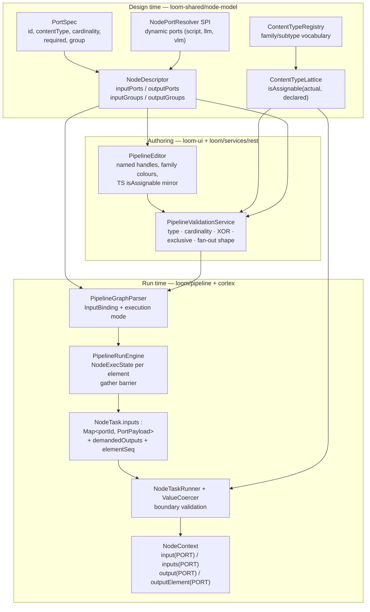
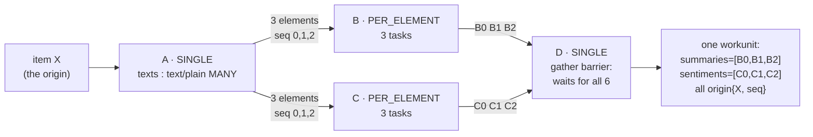

# Node Data Types — Refactor Plan (Typed Ports, Cardinality, Origin-Aware Sequences)

> **Status: phases 1-4 are built; 5 and 6 are nearly done.** See §16 for the item-by-item
> assessment and §0 for where the implementation deliberately diverged from this design.
>
> **This file is the design rationale and the phase plan — not the reference for the built system.**
> That is [NODE_DATA_TYPES.md](NODE_DATA_TYPES.md), which was rewritten around the new model and owns
> the vocabulary, the per-node port table, the wire shapes, the fan-out semantics and the current
> defect audit. Keep this file for *why* a decision was made; keep that file for *what the code does*.
>
> **"Today" in §1 and §2 means "before this refactor".** Those sections are kept as the motivation
> record and are deliberately not rewritten.
>
> **Companion documents:**
> - [NODE_DATA_TYPES.md](NODE_DATA_TYPES.md) — the reference for the built model.
> - [PIPELINE.md](PIPELINE.md) — engine, run state, dispatch protocol, segmentation, affinity.
> - [../pipeline-nodes/NODES.md](../pipeline-nodes/NODES.md) — node lifecycle, per-node
>   configuration and persistence targets.
>
> **Source of truth is the code.** Where this plan and the code disagree, the code wins — fix this
> file in the same change ([../../guidelines/CODING.md](../../guidelines/CODING.md)).

---

## 0. Design vs. implementation — recorded divergences

Everything the implementation did differently from this document. Each is a deliberate choice made
while building, not a defect. Sections below still carry the original design text; this table is what
overrides it.

| # | Design said | Implementation did | Why |
|---|---|---|---|
| 1 | "31 types, 8 families" (§3.2) — over a table that actually lists 35 | **38 types**, counted from `ContentTypeRegistry.all()` | Three family wildcards the design omitted — `scalar/*`, `struct/*`, `control/*` — were added so **every** family has one. `ContentTypeLatticeTest` asserts that invariant, which is what makes the third lattice arm total instead of ad hoc |
| 2 | `PortPayload` / `DataElement` / `Origin` as Java `record`s (§7.1) | Jackson-annotated **classes**, and `PortPayload.cardinality` is a **`String`**, not the `Cardinality` enum | `loom-shared/pipeline-model` does not depend on `node-model`, so the enum is not visible there. The wire values are still exactly `"ONE"` / `"MANY"` |
| 3 | The JSONB encoding lives with the envelope | The `PortPayloads` codec landed in **`loom/pipeline`**, not `pipeline-model` | The codec needs Vert.x `JsonObject`; `pipeline-model` has no Vert.x dependency and should not gain one |
| 4 | `InputBinding = {targetPortId, sourceNodeId, sourcePortId, branch}` (§5.2) | `+ targetIsMany`, stamped once by `PortGraphAnalyzer` | The engine then builds a task's inputs from the graph alone and never resolves a descriptor at dispatch time |
| 5 | Put the §5.3 rule set **in** `PipelineValidationService` | The service **delegates** to `PipelineGraphParser`, mapping `GraphValidationException` onto a `ValidationException` | The plan's own warning was "do not add a fourth copy". Delegating leaves exactly one implementation instead of two that must agree |
| 6 | `NodePortResolver` takes a `JsonObject` (§4.4) | It takes `Map<String, Object>` | Same reason as #3 — `node-model` is Vert.x-free |
| 7 | Separate `llm` and `vlm` resolvers | A shared `PromptPortResolver` base, plus a **`result` fallback port** when no prompts are configured | Without the fallback a freshly dropped `llm` node has no output handle at all and cannot be wired up — the author would have no way back |
| 8 | Reject nested fan-out when a `PER_ELEMENT` node's `MANY` output feeds a `ONE` input (§6.2) | Reject a `PER_ELEMENT` node that **declares** a `MANY` output at all | Stricter, decided during classification without a second pass, and it cannot be worked around by leaving the port unwired and wiring it later |
| 9 | Phase 2: "drop the legacy inline `dependencies[]` fallback" | **Not done.** A definition with no `edges` array still parses through `applyInlineDependencies`, produces no bindings, and therefore skips port validation entirely | Outstanding. Recorded as a live hole in [NODE_DATA_TYPES.md](NODE_DATA_TYPES.md) §6.1 and §9.2 |
| 10 | `getDependencies()` becomes "derived (the distinct source node ids)" | Built in the same pass as the bindings, deduped on `(source, target)` | Same result, one traversal instead of two |
| 11 | Segments: never merge nodes of different execution modes, with a SINGLE-only fallback "if phase 4 runs long" (§6.7) | **The fallback was taken.** A segment is only considered for `seq == 0` of a `SINGLE` node | Costs throughput on fanned-out affinity groups and nothing else |
| 12 | `ValueCoercer` with a hard-`FAILED` arm for an **undeclared port id** and for a **non-selected `EXCLUSIVE`-group port** (§7.2) | Coercion runs at all three boundary points (`NodeContextImpl` on write and on read, `NodeResultMapper.toPayloads` on emit), but **neither hard-failure arm exists** | Outstanding |
| 13 | Demanded outputs = wired ports **plus** any port the `syncToLoom` sink consumes (§4.3) | Wired ports only | The sink-side half was never needed: `syncToLoom` reads whatever the node emitted, and emitting an undemanded port stays legal |
| 14 | `cortex/api` gains `InputPort` / `OutputPort` / `Element` (§8) | Also `NodeInputs` (the inbound bundle: ports + `demandedOutputs` + `origin`) and `PortOutput` (a port plus its accumulated values) | The context needs somewhere to hold the inbound bundle and the outbound accumulator, and `FilesystemNode.process` needs a parameter type |
| 15 | `NodeContext.origin()` returns the execution's origin (§8) | It does — which collided with the existing `origin(ResultOrigin)` **setter**, so the provenance **getter** was renamed `resultOrigin()` | Two unrelated meanings of "origin" now coexist. Every caller that read `ctx.origin()` as a `ResultOrigin` had to change |
| 16 | A vitest contract test pins the TS mirror "against a fixture exported from the Java side" (§3.3, §10) | The TS test carries a **hand-transcribed** fixture; **no Java-side export exists** | The two implementations can still drift, and only a reviewer notices |
| 17 | Media is validated but not transported (§5.4) | Also: the engine **hard-codes the source's output port name** as `PipelineRunEngine.SOURCE_MEDIA_PORT = "media"` | An implicit contract the design never named: a source descriptor that names its port anything else validates at save time and delivers nothing at runtime |
| 18 | — | An **empty** upstream sequence (`elementCount == 0`) settles the downstream node as `SKIPPED("Upstream sequence was empty")` | Not in the design. Without it, a fan-out that found nothing leaves the item permanently incomplete |
| 19 | — | `PortGraphAnalyzer.analyze` **returns silently** when the descriptor registry is null, leaving every node `SINGLE` | Needed for unit tests and the in-memory backend. It also means `PipelineRunRecovery`, which uses the no-arg parser, re-parses a resumed run with no port checking at all |
| 20 | `NodeDescriptorRegistry.resolvePorts` is what save-time validation uses | It is, but it is **not exposed over REST** — `NodeDescriptorEndpoint` serves the static descriptor only | The editor mirrors the three resolvers in TypeScript rather than round-tripping every keystroke. The mirror is contract-tested, but there is no server-side resolve endpoint |

---

## 1. Why

Three type systems describe the same value and none checks another
([NODE_DATA_TYPES.md](NODE_DATA_TYPES.md) §1). Four concrete consequences motivate this refactor:

1. **There is no input type system at all.** `grep -r NodeInputKey` is empty. A node reads upstream
   data through `ctx.upstreamOutput(nodeId, key)` — keyed by an **author-chosen pipeline node id**,
   erased generic, unchecked cast. Renaming a node in the editor silently returns `null`, and every
   consumer treats `null` as "absent". Four nodes hard-code an id; `LoomNode` hard-codes
   `"md5sum"`/`"sha256sum"` while the kinds are `md5`/`sha256`, so an editor-authored graph feeds it
   nothing.
2. **Declared types are decoration.** `NodeDescriptor.getInputs()/getOutputs()` are read by **zero**
   backend classes — they exist only to be serialised to the UI. `NodeOutputKey.valueType()` is
   discarded at
   [NodeContextImpl.java:69](../../../cortex/api/src/main/java/io/metaloom/cortex/api/node/context/impl/NodeContextImpl.java#L69).
   `ContentType.superType` is evaluated nowhere in Java.
3. **There is no cardinality.** "List-ness" is smuggled into content types — `ScriptValueType`
   collapses `IMAGE_LIST` and `IMAGE` both to `data/thumbnail`, `TEXT_LIST` and `TEXT` both to
   `data/text`. A node cannot say "I emit N of these".
4. **There is no fan-out.** `ItemState` hard-wires one result per (node, item):
   `isComplete(int totalNodes) { return results.size() == totalNodes; }`. Nothing lets one asset
   produce N elements, be processed per element, and be recombined later.

### 1.1 What this plan must deliver

| # | Requirement | Section |
|---|---|---|
| R1 | A content-type vocabulary that is the **minimum dominator biased toward editor usability** — more human-meaningful types over the technical minimum | §3 |
| R2 | **Subtypes**, so bounding-box results (face / object / generic region) share a supertype a consumer can declare | §3 |
| R3 | **Input data types** — declared, resolved, and enforced | §4 |
| R4 | **Cardinality** on every input and output: one element vs. a sequence | §4 |
| R5 | **Origin/sequence awareness** — elements carry an origin so a downstream node can recombine the branches belonging to one source asset, **implicitly in the engine, with no user-facing merge node** | §6 |
| R6 | **AND vs. XOR inputs** (accepts several at once vs. exactly one of many alternatives) and **exclusive output groups** (selecting one output renders siblings inoperable) | §4.2 |
| R7 | The node must know **which outputs the pipeline demanded**, so it can compute selectively | §4.3 |
| R8 | Pipelines stay human-authored in the React Flow editor — drawable, colourable, connection-checked | §5, §9 |

### 1.2 Locked design decisions

These were decided before design and are **not open for re-litigation** during implementation.

| Decision | Choice | Consequence |
|---|---|---|
| Backwards compatibility | **Breaking is fine.** No migration of stored `pipeline_version.definition` JSON | Existing pipelines are re-authored / re-seeded. Demo data and fixtures are rewritten. No legacy-alias parsing |
| Join semantics | **Gather per origin, implicit in the engine** | No merge/join node in the palette. The barrier is invisible to the pipeline author |
| Enforcement | **Hard at save time *and* at runtime** | `PipelineValidationService` rejects an invalid graph on create/update; the node boundary coerces and fails the task on mismatch |
| Scope | **Types + sequences only** | The two node hierarchies and `CortexNodeAdapter` stay. The Loom-engine `NODE_TASK` dispatch model stays |

---

## 2. Target architecture at a glance



**The one sentence to remember:** a node no longer reads *"the output named `face_count` from the
node someone named `facedetect`"*; it reads *"my input port `detections`"*, and the engine resolves
which upstream `(node, port)` fills it from the wired edges.

---

## 3. The type model (R1, R2)

### 3.1 Decision: two-level, single-parent `family/subtype` lattice

A content-type id is **exactly `family/subtype`**. The family root is the wildcard `family/*`.
**Assignability never crosses families.**

```
assignable(actual, declared) :=
     actual == declared                       // exact
  || declared == family(actual) + "/*"        // consumer accepts the whole family
  || actual   == family(declared) + "/*"      // producer is unspecific (a source emits media/*)
```

That is the entire lattice logic. Three notes on why it is shaped this way:

- **The third arm exists for sources.** `filesystem-source` / `s3-source` emit `media/*` because the
  concrete mime is unknown when the graph is drawn. Save-time validation treats
  wildcard-into-subtype as **provisionally valid**; the runtime boundary check (§7.2) decides with
  the real file in hand.
- **Cross-family inheritance is dropped deliberately.** Today `data/hash` extends `data/string`.
  Under the new model a hash does **not** satisfy `scalar/string`. Wiring a hash into a generic
  string consumer is almost always a mistake; where it is intentional the port declares a wildcard
  or an XOR group. This buys a lattice with zero special cases and a TS mirror that is five lines.
- **`ContentType.superType` disappears** as a field. The supertype of `detection/face` is
  structurally `detection/*`. No parent pointer to keep consistent.

### 3.2 The vocabulary — 8 families

> **As built: 38 types.** This table lists 35 and the prose said 31; the implementation added the
> three missing family wildcards (`scalar/*`, `struct/*`, `control/*`) so every family has one.
> Count `ContentTypeRegistry.all()` for the current number — see §0 divergence 1.

Replaces the ~27 `String` constants in
the former `ContentTypes` holder (deleted; see [ContentTypeRegistry.java](../../../loom-shared/node-model/src/main/java/io/metaloom/loom/nodes/spec/ContentTypeRegistry.java)).
Every content type in use today maps 1:1; the additions are the supertypes consumers actually need
and the `artifact/*` family that fixes a real category error.

| Family (one editor colour) | Type id | Label | Replaces / rationale |
|---|---|---|---|
| **media** | `media/*` | Any Media | `media/*` — what a source emits when the mime is unknown |
| | `media/image` | Image | `media/image` |
| | `media/video` | Video | `media/video` |
| | `media/audio` | Audio | `media/audio` |
| | `media/document` | Document | `media/document` (declared-but-unused today; tika/ocr want it) |
| **text** | `text/*` | Any Text | **new supertype** — what `sentiment`, `tts`, `filter-blacklist`, `llm` actually accept |
| | `text/plain` | Text | `data/text`, and `data/string` where it carries prose |
| | `text/transcript` | Transcript | `data/transcript` |
| | `text/caption` | Caption | `data/caption` |
| **detection** | `detection/*` | Any Detection | **new supertype (R2)** — `scene-layout` and `dominant-color` declare this and accept faces *or* objects |
| | `detection/face` | Face Detections | `data/facedetection` |
| | `detection/object` | Object Detections | `data/objectdetection` (declared-but-unused today; becomes real) |
| | `detection/region` | Image Region | `data/imagearea` (a generic box producer) |
| **hash** | `hash/*` | Any Hash | **new supertype** — `hash-dedup` accepts any |
| | `hash/md5` | MD5 | `data/hash`, **split per algorithm** — this is what kills the `LoomNode` id-override trap: the sink binds by *port type*, never by node id |
| | `hash/sha256` | SHA-256 | ″ |
| | `hash/sha512` | SHA-512 | ″ |
| | `hash/chunk` | Chunk Hash | ″ |
| | `hash/fingerprint` | Fingerprint | `data/fingerprint` |
| **scalar** | `scalar/string` | String | `data/string` where it carries an identifier or flag |
| | `scalar/integer` | Integer | **merges `data/integer` + `data/long`** — always 64-bit; boundary coercion (§7.2) makes the `Long`→`Integer` narrowing unobservable |
| | `scalar/number` | Number | `data/number` |
| | `scalar/boolean` | Boolean | `data/boolean` |
| **artifact** | `artifact/*` | Any Artifact | **new family**: a **worker-local produced file**, as distinct from a resolvable media reference. Prevents wiring a thumbnail path into a node that expects to open a media item |
| | `artifact/image` | Image Artifact | `data/thumbnail`, the depthmap PNG path, the imagegen PNG, script `IMAGE`/`IMAGE_LIST` |
| | `artifact/audio` | Audio Artifact | the tts WAV path |
| | `artifact/file` | File Artifact | `data/path`, generic |
| **struct** | `struct/embedding` | Embedding Vector | `data/embedding` (declared-but-unused today) |
| | `struct/segments` | Timeframes | `data/scene`, script `TIMEFRAMES` |
| | `struct/scene-layout` | Scene Layout | `data/scene_layout` |
| | `struct/quality` | Quality Metrics | `data/quality` |
| | `struct/depthmap` | Depth Map | `data/depthmap` (the meta JSON; the PNG path is `artifact/image`) |
| | `struct/color` | Dominant Colour | `data/color` |
| | `struct/json` | JSON | script `JSON`, generic structured payloads |
| **control** | `control/filter` | Filter Verdict | `control/filter_passed` |

> **Why this is the right granularity.** The bare technical minimum would be ~6 types
> (media, text, number, boolean, blob, control). That is unusable in a palette: every handle would
> be the same colour and every connection would validate. The types above are exactly the distinctions
> a pipeline author makes when drawing a graph — and each supertype exists because a *real* current
> consumer needs it.

### 3.3 Where it lives, and the TypeScript question

- **Vocabulary and lattice stay in `loom-shared/node-model`.** `ContentTypes` becomes
  `ContentTypeRegistry` (records of `{id, family, label, description}`) plus a static
  `ContentTypeLattice.isAssignable(String actual, String declared)` — the **single** Java
  implementation, used by save-time validation, the graph parser, and the runtime coercer.
- **The vocabulary is served; the rule is mirrored.** `GET /api/v1/node-descriptors` already ships
  the content-type list — keep that as the UI's only source of labels/families (never hardcode them
  in TS). The *rule* is five structural lines: mirror it in
  `loom-ui/src/features/pipeline/contentTypes.ts` rather than round-tripping every drag over HTTP.
  A vitest contract test pins the mirror against a fixture exported from the Java side (§10).
- **Editor colouring**: one colour per **family** (8), replacing the 5-bucket
  `toConnectorDataType` collapse at
  [PipelineEditor.tsx:135](../../../loom-ui/src/features/pipeline/PipelineEditor.tsx#L135), which is
  deleted. A handle tooltip shows the exact type id, label, and cardinality. A wildcard port renders
  in the family colour with a hollow handle.

---

## 4. The port model (R3, R4, R6, R7)

### 4.1 `PortSpec` replaces `NodeInput` / `NodeOutput`

```json
{
  "id": "detections",
  "label": "Face Detections",
  "contentType": "detection/face",
  "cardinality": "ONE",
  "required": true,
  "group": "media_alt",
  "description": "One element per detected face"
}
```

`NodeDescriptor` changes (breaking — the old `inputs`/`outputs` fields are **deleted**):

```json
{
  "kind": "whisper",
  "inputPorts": [
    { "id": "audio", "contentType": "media/audio", "cardinality": "ONE", "group": "media_alt" },
    { "id": "video", "contentType": "media/video", "cardinality": "ONE", "group": "media_alt" }
  ],
  "outputPorts": [
    { "id": "transcript", "contentType": "text/transcript", "cardinality": "ONE" }
  ],
  "inputGroups":  [ { "id": "media_alt", "mode": "XOR", "required": true, "label": "Media" } ],
  "outputGroups": [],
  "dynamicPorts": false
}
```

This is also the fix for the two-inputs-both-named-`media` problem that `whisper` and `facedetect`
have today — they were never two inputs, they were one input with two alternatives.

### 4.2 Groups: AND vs. XOR inputs, exclusive outputs (R6)

| Group mode | Applies to | Rule (enforced at save time, §5.3) |
|---|---|---|
| *(ungrouped)* | inputs | Independent **AND** semantics. Each port's own `required` flag applies |
| `XOR` | inputs | **Exactly one** member port wired when the group is `required`; **at most one** otherwise. Member ports do not carry their own `required` — the group owns it |
| `EXCLUSIVE` | outputs | **At most one** member port may have outgoing edges. Emitting a non-selected member at runtime is a task failure (§7.2) |

### 4.3 Demanded outputs (R7)

`NodeTask` gains `demandedOutputs: Set<String>` (port ids). The engine computes it from the wired
graph — a port is demanded when it has at least one outgoing edge, plus any port the `syncToLoom`
sink consumes for that kind. The node reads `ctx.isDemanded(PORT)` and may skip expensive branches
(no depth map requested → do not run the model).

Emitting an **undemanded** port stays legal — it is persisted to `pipeline_node_task.outputs` as
today, which keeps diagnostics useful. Demand is an optimisation hint *and* the enforcement input
for `EXCLUSIVE` groups.

### 4.4 Dynamic ports

Some kinds only know their ports once configured. Today `ScriptNode` solves this alone
(`ScriptOutputSpec`, mirrored by hand in the editor). Generalise it:

```java
public interface NodePortResolver {
    String kind();
    List<PortSpec> resolveOutputPorts(NodeDescriptor descriptor, JsonObject options);
    default List<PortSpec> resolveInputPorts(NodeDescriptor descriptor, JsonObject options) {
        return descriptor.getInputPorts();
    }
}
```

Registered by `ServiceLoader` alongside `NodeDescriptorProvider`, gated by
`NodeDescriptor.dynamicPorts`. Three implementations:

| Kind | Resolves to |
|---|---|
| `script` | One port per `ScriptOutputSpec`. **List types stop collapsing**: `TEXT_LIST` → `text/plain MANY`, `IMAGE_LIST` → `artifact/image MANY`, `IMAGE` → `artifact/image ONE`, `TIMEFRAMES` → `struct/segments ONE`, `JSON` → `struct/json ONE`, `INTEGER` → `scalar/integer ONE`, … |
| `llm` | One `result_<promptId> : text/plain ONE` per configured prompt — **fixes** the descriptor declaring `llm_result` while the node emits `llm_result_<promptId>` |
| `vlm` | Same shape |

The UI keeps a TS mirror of these three resolvers for instant handle rendering (it already mirrors
script via `SCRIPT_VALUE_CONTENT_TYPE`); the **server resolver is authoritative at save time**.
Contract-test both against shared fixtures.

> Fixing the `llm`/`vlm` port names also revives `SentimentNode`'s dead default `textSources`
> ([NODE_DATA_TYPES.md](NODE_DATA_TYPES.md) §9.1) — but that option disappears entirely anyway,
> because sentiment now declares a `text : text/* ONE` input port and the *edge* says where the text
> comes from.

---

## 5. Edges become port-to-port (R8)

### 5.1 Definition JSON (breaking)

```json
{
  "nodes": [
    { "id": "pn1", "type": "filesystem-source", "name": "File Source", "x": 60, "y": 160 },
    { "id": "pn2", "type": "whisper",           "name": "Whisper",     "x": 260, "y": 160 }
  ],
  "edges": [
    { "id": "pe1", "source": "pn1", "sourcePort": "media",
      "target": "pn2", "targetPort": "audio", "branch": "ANY" }
  ]
}
```

- `sourcePort` / `targetPort` are **required** on every edge. There is no positional fallback and no
  legacy alias — the locked decision permits the break.
- `branch` stays edge-level (`ANY` | `PASS` | `REJECT`).

**Two live editor defects are fixed as part of this**, both of which currently make authored graphs
lie:

1. The editor writes the filter branch as **`edgeType`** while the parser and validator read
   **`branch`** — so UI-authored PASS/REJECT routing reaches the engine as `ANY`. The editor now
   writes `branch`.
2. `sourceHandle`/`targetHandle` are written into the saved JSON but **dropped on reload**
   (`toRFEdges` ignores them) and never read by the parser. Handles become **named** (handle id =
   port id, replacing positional `in_0`/`out_1`) and round-trip through `sourcePort`/`targetPort`.

### 5.2 Parser

`PipelineGraphNode` gains `List<InputBinding>` where
`InputBinding = { targetPortId, sourceNodeId, sourcePortId, branch }`.
`getDependencies()` becomes **derived** (the distinct source node ids), so the engine's existing
scheduling, blocking-skip and branch logic is untouched.

The duplicate-edge dedupe key in `applyEdges`
([PipelineGraphParser.java:168](../../../loom/pipeline/src/main/java/io/metaloom/loom/pipeline/graph/PipelineGraphParser.java#L168))
changes from `(source, target)` — which today makes two port-distinct edges between the same node
pair indistinguishable — to `(source, sourcePort, target, targetPort)`.

The parser additionally computes each node's **execution mode** (§6.2) and stores it on
`PipelineGraphNode`.

### 5.3 Save-time validation — hard reject

New rules in `PipelineValidationService` (the only wired validator, called from create and update),
evaluated against the **resolved** ports (static + dynamic, §4.4):

1. `sourcePort` exists among the source node's output ports; `targetPort` among the target's input
   ports.
2. **Type**: `ContentTypeLattice.isAssignable(sourcePort.contentType, targetPort.contentType)`.
3. **Satisfaction**: every required ungrouped input port is wired; every required `XOR` group has
   exactly one member wired; a non-required `XOR` group has at most one; every `EXCLUSIVE` output
   group has at most one member wired.
4. **Multi-edge**: an input port with more than one incoming edge is legal **only** when its
   cardinality is `MANY` (elements concatenate per origin). `ONE` with >1 edges is an error.
5. **Fan-out shape**: the execution-mode computation (§6.2) must succeed — second-level fan-out and
   cross-origin zips are rejected here with a message naming the offending nodes.
6. `branch != ANY` only on edges leaving a `FILTER`-category node (exists today — keep).

The same rules run inside `PipelineGraphParser` (throwing `GraphValidationException`, which
`dispatchRun` already turns into an HTTP 400 with no `pipeline_run` row), so a run can never start
on a definition that was valid under an older descriptor set.

> ⚠️ Validation logic is **triplicated** today (`PipelineModelValidator`,
> `PipelineValidationService`, and the editor's own copy). Do not add a fourth. Phase 2 puts the
> port rules in `PipelineValidationService` only, and the editor calls the same shapes through its
> own thin mirror for live feedback.

### 5.4 Media: ambient **and** a port

**Decision: both.** Media stays on the wire as `NodeTask.media : MediaRef` — the legacy
`process(LoomMedia, …)` lifecycle needs a resolvable handle, and per-element dispatch reuses the
same reference — **but** every media-consuming node declares a real `media/*`-family input port and
every source declares a `media` output port, so the graph is fully wired and type-checked.

The engine does **not** transport media through `inputs`; when building a task it recognises
media-family bindings and validates them only. The alternative — making media an ordinary payload —
would force every node to resolve an arbitrary upstream media value, which only sources can produce.
The hybrid gets full editor and validator coverage at zero lifecycle cost.

To make `media/image` vs `media/video` checkable, **`MediaRef` gains an optional `mediaType`**
(`image` | `video` | `audio` | `document` | `unknown`) populated by sources from the extension /
listing. `unknown` passes save-time via the wildcard arm (§3.1) and is checked in Cortex, where the
file is inspectable (`isImage()`/`isVideo()` already exist on `LoomMedia`).

---

## 6. Sequences, origin, and the implicit gather (R5)

This is the core of the plan. Everything above is a prerequisite.

### 6.1 Decision: per-element dispatch **inside one `ItemState`** — no sub-items

Three options were evaluated for a `ONE`-cardinality input downstream of a `MANY` output:

| Option | Verdict |
|---|---|
| Reject at validation ("connect a MANY input instead") | ✗ Forbids the required scenario outright |
| Spawn **child run items** with `parentItemId` | ✗ Workable but heavy: `results.size()==totalNodes` completion breaks, children run partial subgraphs, `pipeline_run_item` needs lineage columns, recovery and counters roughly double |
| **Keep one `ItemState` per origin asset; a node's per-item state becomes a set of per-element executions** | ✅ **Chosen** |

**The item *is* the origin.** `Origin.itemId` is simply the run item uuid. The gather then falls out
of machinery that already exists: `dependenciesSettled` already blocks a node until its dependencies
are settled — redefine "settled" for a per-element node as *"**all** of its element executions have
settled"*, and that existing barrier **is** the gather-per-origin join. No `pipeline_run_item`
lineage, no sub-item recovery, no second counters model, and — critically for R5 — no node in the
palette.

### 6.2 Execution mode, computed statically by the parser

Effective multiplicity propagates through the wired graph:

```
eff(source.media)                = ONE

eff(output port p of node n)     = MANY  if p.cardinality == MANY
                                 = MANY  if mode(n) == PER_ELEMENT   // one output element per execution
                                 = ONE   otherwise

mode(n) = PER_ELEMENT  iff some ONE-cardinality input port of n is bound to an
                            effectively-MANY source port
        = SINGLE       otherwise      // includes MANY inputs consuming MANY — that is the gather

fanOutDriver(n) = the producing node whose MANY output makes mode(n) = PER_ELEMENT
```

**v1 restrictions — validation errors, deliberately deferred rather than designed away:**

- **No nested fan-out.** If `mode(n) == PER_ELEMENT` and `n` has a declared-`MANY` output feeding a
  `ONE` input downstream → reject: *"second-level fan-out is not supported; collect with a MANY
  input first"*. This keeps `Origin.seq` a single integer. Lifting it later means `seqPath: int[]`.
- **One origin lineage per zip.** If a node has two `ONE` inputs fed by per-element branches, both
  must trace to the **same** `fanOutDriver` (elements then align by `seq` — a zip join). Different
  drivers → reject; there is no meaningful correspondence between two unrelated sequences.

### 6.3 Engine state

`ItemState`'s `Map<String, NodeTaskResult> results` becomes `Map<String, NodeExecState>`:

```java
NodeExecState {
    Mode mode;                                    // SINGLE | PER_ELEMENT
    Integer elementCount;                         // null until the fan-out driver settles
    Map<Integer, NodeTaskResult> elementResults;  // seq -> result   (SINGLE uses seq 0)
    Map<Integer, UUID>    inFlight;               // seq -> taskUuid
    Map<Integer, Integer> attempts;
    Set<Integer>          awaitingRetry;

    boolean isSettled()  { return elementCount != null && elementResults.size() == elementCount; }
    NodeState rollup()   { any FAILED -> FAILED; else any COMPLETED -> COMPLETED; else SKIPPED; }
}
```

`isComplete(totalNodes)` becomes *"every node's `NodeExecState.isSettled()`"*.

Fan-out size is discovered **dynamically**: when the driver's result arrives, the engine reads the
fanned port's `elements.size()` and sets `elementCount = N` on every downstream `PER_ELEMENT` node.
`SINGLE` nodes get `elementCount = 1` at creation.

A node is not necessarily wired to its own `fanOutDriver`, though — with `A → B → E` where both `B`
and `E` are per-element, `E` consumes `B`. The width is therefore read off the node's own
**single-element input bindings**, not off the driver: a `SINGLE` producer contributes its fanned
port's `elements.size()`, and a `PER_ELEMENT` producer contributes its **own `elementCount`**.
Counting surviving payload elements instead would shrink the sequence whenever an element failed
and silently re-index everything below it.

Two consequences of `elementCount` worth stating, because both are the difference between a run
that ends and a run that hangs:

- **`elementCount = 0`** (the driver emitted an empty sequence) settles the node by the count
  alone. It still records one bookkeeping `SKIPPED` result at `seq 0` — without it the node has no
  terminal result, no persisted task row and nothing in the run detail to say why it did nothing —
  while the count **stays zero**, so a second-level per-element node reads the width as empty and
  skips in turn.
- Everything keyed `(node, seq)` must genuinely use `seq`, including the retry budget, the
  in-flight release and recovery's `NodeExecState` seeding. Reading element 0's state on behalf of
  element *n* releases capacity that was never acquired, or parks a retry on a slot nothing will
  dispatch — leaving the failed element neither retried nor settled.

### 6.4 The algorithm

Replaces the loop in `PipelineRunEngine.advance(ItemState)`
([PipelineRunEngine.java:600](../../../loom/pipeline/src/main/java/io/metaloom/loom/pipeline/engine/PipelineRunEngine.java#L600)).

```
advance(state):
  for nodeId in graph.topologicalOrder():
    exec = state.exec(nodeId)

    if exec.mode == SINGLE:
        if exec.isSettled() or exec.inFlight(0) or exec.awaitingRetry(0): continue

        if not all(state.exec(dep).isSettled() for dep in node.dependencies): continue
        # ^^^ THE IMPLICIT GATHER BARRIER. For a per-element dependency this means
        #     "every sibling element of this origin has settled" — nothing else needed.

        skip = evaluateSkip(state, node)                 # blocking + branch, over rollup() states
        if skip: record(node, 0, skip); continue
        dispatch(node, seq=0, inputs=buildInputs(node, 0))

    else:   # PER_ELEMENT
        if exec.elementCount == null: continue           # driver has not settled yet
        for seq in 0 .. exec.elementCount - 1:
            if exec.settled(seq) or exec.inFlight(seq) or exec.awaitingRetry(seq): continue
            if not perElementDepsSettled(node, seq): continue
                 # driver element `seq` settled, and every SINGLE dependency fully settled
            skip = evaluateElementSkip(state, node, seq)
            if skip: record(node, seq, skip); continue
            dispatch(node, seq, inputs=buildInputs(node, seq))


buildInputs(node, seq):
  payload = {}
  for binding in node.inputBindings:
      src = elementsOf(binding.sourceNode, binding.sourcePort)
            # from elementResults, concatenated across seqs for a per-element producer,
            # always seq-ordered

      if inputPort(binding).cardinality == MANY:
          payload[binding.targetPort] += src            # multi-edge MANY ports concatenate,
                                                        # edge by edge, each seq-ordered
                                                        # -> the origin-grouped workunit
      else:  # ONE
          payload[binding.targetPort] =
              src.single()                              if producer is SINGLE
              src.withOriginSeq(seq)                    if producer is per-element  (zip)
  return payload
```

Capacity, kind-capacity, circuit-breaker, retry and dead-letter gates keep their exact positions —
they now guard `(node, seq)` instead of `(node)`. `NodeTask` gains `elementSeq` (echoed back in
`NodeTaskResult`) so `record` can route a result to the right slot; `markInFlight` / `attempts` /
`awaitingRetry` are keyed `(nodeId, seq)`.

### 6.5 The required scenario, walked through

Asset **X** → node **A** emits `texts : text/plain MANY` (3 elements) → nodes **B** and **C** each
declare `text : text/plain ONE` and emit one result → node **D** declares
`summaries : text/* MANY` and `sentiments : struct/* MANY`.



1. A settles with 3 elements, each tagged `origin { itemId: X, seq: i, total: 3 }`.
2. B and C get `elementCount = 3` and three tasks each, every task carrying its `elementSeq` and
   reusing `NodeTask.media` = X's `MediaRef`.
3. D is `SINGLE`. Its `dependenciesSettled` check waits for **all six** executions.
4. One D task ships `inputs.summaries = [B0, B1, B2]` and `inputs.sentiments = [C0, C1, C2]`, both
   origin-tagged and seq-ordered — **one workunit, grouped by origin, with no merge node and nothing
   for the pipeline author to configure.**

### 6.6 Failure, skip and branch semantics per element

| Situation | Behaviour |
|---|---|
| Element `seq` of B FAILED; downstream per-element node is blocking | That node's element `seq` is SKIPPED (*"element dependency failed"*). **Other seqs are unaffected** |
| Gather node (SINGLE, MANY input), `blocking = true`, any upstream element FAILED | Node SKIPPED — consistent with today's whole-node rule |
| Gather node, `blocking = false` | Runs with the surviving elements. The gaps are visible as missing `seq` values in the origin tags |
| A filter runs `PER_ELEMENT` | `FilterBranch.admits(...)` is evaluated **per element** against that element's `control/filter` result — element-level filtering falls out for free |
| Item outcome | `rollup()` states feed the existing `outcome()` logic: any failed element ⇒ item FAILURE |

Partial-tolerant gathering beyond this (minimum-element thresholds, "proceed with ≥1") is
**deferred** — see §11.

> ⚠️ `NodeTaskResult.getFilterPassed()` currently peeks at a map key. It moves to reading the
> filter's declared `control/filter` output port. Small, but load-bearing for every branch decision.

### 6.7 Store, DB, and accounting

| Concern | Change |
|---|---|
| `pipeline_run_item` | **Unchanged.** This is the payoff of §6.1 |
| `pipeline_node_task` | New column `element_seq INT NOT NULL DEFAULT 0`; lookup/uniqueness key becomes `(item_uuid, node_id, element_seq)`; `outputs` JSONB stores the `PortPayload` shape. **One Flyway migration — next free version is `V2.60`** |
| `RunStateStore` / `DaoRunStateStore` | `taskDispatched` / `taskSettled` carry `elementSeq` |
| `PipelineRunRecovery` | `restoreItem` rebuilds the `NodeExecState` maps; `elementCount` is recovered from the driver's persisted result |
| UI / counters | `nodeProgressSnapshot()` counts **executions**, not nodes. The run-item detail shows per-node `k/N elements` |
| Segments / affinity | v1 rule: `PipelineSegmenter` never merges nodes of **different execution modes**, and a `PER_ELEMENT` segment requires all members to share the `fanOutDriver` (dispatched once per element as a unit). **Fallback if that complicates `SegmentTaskRunner`: segments are SINGLE-mode only and `PER_ELEMENT` nodes always dispatch per node.** Start with the fallback if phase 4 runs long |

---

## 7. Typed values at runtime

### 7.1 The envelope

`Map<String, Object>` outputs are replaced end to end:

```json
"outputs": {
  "texts": {
    "contentType": "text/plain",
    "cardinality": "MANY",
    "elements": [
      { "origin": { "itemId": "5c1f…", "seq": 0, "total": 3 }, "value": "first paragraph" },
      { "origin": { "itemId": "5c1f…", "seq": 1, "total": 3 }, "value": "second paragraph" },
      { "origin": { "itemId": "5c1f…", "seq": 2, "total": 3 }, "value": "third paragraph" }
    ]
  }
}
```

In `loom-shared/pipeline-model`:

```java
record PortPayload(String contentType, Cardinality cardinality, List<DataElement> elements) {}
record DataElement(Origin origin, Object value) {}
record Origin(String itemId, int seq, Integer total) {}
```

A `ONE` payload has exactly one element with `seq = 0, total = 1`. `value` is a JSON-native tree
(`String` / `Long` / `Double` / `Boolean` / `Map` / `List`) — **the "structured data as JSON"
convention stays**; per-type JSON schemas for `struct/*` are deferred (§11).

Wire changes:

| Before | After |
|---|---|
| `NodeTask.upstreamOutputs : Map<nodeId, Map<String,Object>>` | **`NodeTask.inputs : Map<inputPortId, PortPayload>`** |
| — | `NodeTask.demandedOutputs : Set<String>` |
| — | `NodeTask.elementSeq : int` |
| `NodeTaskResult.outputs : Map<String,Object>` | `NodeTaskResult.outputs : Map<outputPortId, PortPayload>` |
| — | `NodeTaskResult.elementSeq : int` |
| `MediaRef {path, sha512, size}` | `+ mediaType` |

**Nodes never see a node id again.** The engine resolves each input port from the bindings.

### 7.2 Boundary coercion — generalising `ScriptOutputCollector.coerce`

A new `ValueCoercer` in `loom-shared/node-model`, one arm per family / scalar type, applied at
**both** boundaries:

**Emit side** (`NodeResultMapper.toWire`, cortex/node-runtime) — coerce each element against the
port's declared type:

| Declared | Rule |
|---|---|
| `scalar/integer` | Any `Number` → `Long`. **This is what makes the `Long`→`Integer` narrowing unobservable**: readers always get `Long` |
| `scalar/number` | Any `Number` → `Double` |
| `scalar/boolean` | `Boolean`, or the strings `"true"`/`"false"` |
| `text/*`, `hash/*`, `artifact/*` | `String` |
| `struct/*` | `Map` / `JsonObject`, **encoded once here** — so a non-encodable value fails *that one task* with a typed message instead of silently clearing the whole persist batch |
| `control/filter` | `Boolean` |
| Undeclared port id | Hard `FAILED` naming the port |
| Non-selected `EXCLUSIVE`-group port | Hard `FAILED` naming the group |

**Receive side** (engine on `onNodeTaskResult`, and again in `NodeContextImpl` when a node reads an
input): the same coercion, defensively. The Jackson round trip re-narrows `Long` → `Integer`, so the
read-side pass re-widens. `ctx.input(PORT)` therefore **never** hands a node the wrong Java type; a
genuine mismatch fails the task with port, expected and actual in the message.

> **Outputs stop being discarded on SKIPPED/FAILED.** `NodeContextImpl` keeps the port map and the
> result carries whatever was emitted, so diagnostics survive a skip. (The separate, known
> `ctx.failure(...).next()` → SUCCESS defect is *not* in scope here — see
> [../pipeline-nodes/NODES.md](../pipeline-nodes/NODES.md) §10; it needs its own review.)

---

## 8. The node-author API (Cortex)

`cortex/api` gains ports. `NodeOutputKey` is **deleted**; `NodeInputKey` finally exists, as
`InputPort`.

```java
public record InputPort<T>(String id, String contentType, Cardinality cardinality, Class<T> valueType) {
    public static <T> InputPort<T> one (String id, String contentType, Class<T> type) { … }
    public static <T> InputPort<T> many(String id, String contentType, Class<T> type) { … }
}
public record OutputPort<T>(String id, String contentType, Cardinality cardinality, Class<T> valueType) {
    public static <T> OutputPort<T> one (String id, String contentType, Class<T> type) { … }
    public static <T> OutputPort<T> many(String id, String contentType, Class<T> type) { … }
}
```

`NodeContext` — `upstreamOutput(nodeId, key)` is **deleted**:

```java
<T> T              input(InputPort<T> port);          // ONE; coerced. null only if optional + unwired
<T> Optional<T>    optionalInput(InputPort<T> port);
<T> List<Element<T>> inputs(InputPort<T> port);       // MANY; Element = {Origin origin, T value}, seq-ordered
Origin             origin();                          // this execution's origin (and seq, if per-element)
boolean            isWired(InputPort<?> port);        // which XOR alternative actually fed me
boolean            isDemanded(OutputPort<?> port);    // R7 — compute selectively
<T> void           output(OutputPort<T> port, T value);        // ONE
<T> void           outputElement(OutputPort<T> port, T value); // MANY: append; engine assigns seq/total
```

**Author sketch — `whisper`, the XOR case:**

```java
public static final InputPort<LoomMedia> IN_AUDIO =
    InputPort.one("audio", "media/audio", LoomMedia.class);
public static final InputPort<LoomMedia> IN_VIDEO =
    InputPort.one("video", "media/video", LoomMedia.class);
public static final OutputPort<String> OUT_TRANSCRIPT =
    OutputPort.one("transcript", "text/transcript", String.class);

// in compute(): media is still the ambient LoomMedia (§5.4);
// ctx.isWired(IN_VIDEO) tells the node which alternative the author connected.
ctx.output(OUT_TRANSCRIPT, transcriptJson);
```

**Author sketch — a fan-out producer:**

```java
public static final OutputPort<String> OUT_TEXTS =
    OutputPort.many("texts", "text/plain", String.class);

for (String paragraph : paragraphs) {
    ctx.outputElement(OUT_TEXTS, paragraph);   // engine stamps origin{itemId, seq, total}
}
```

### 8.1 Existing nodes → ports

The mechanical sweep in phase 5. Highlights (the full table is written as the sweep lands):

| Node | Input ports | Output ports |
|---|---|---|
| `filesystem-source` / `s3-source` | — | `media : media/* ONE` |
| `md5` / `sha256` / `sha512` / `chunk-hash` | `media : media/* ONE` | `hash : hash/md5` \| `hash/sha256` \| `hash/sha512` \| `hash/chunk`, ONE |
| `facedetect` | **XOR** `image : media/image` \| `video : media/video` | `detections : detection/face` **MANY** (one element **per face** — this is what enables per-face downstream work), `face_count : scalar/integer ONE`, `flag : scalar/string ONE` |
| `facedescription` | `detections : detection/face MANY` | `descriptions : text/plain MANY` (seq-aligned with the input) |
| `whisper` | **XOR** `audio` \| `video` | `transcript : text/transcript ONE` |
| `sentiment` | `text : text/* ONE` — **replaces the `textSources` option entirely** | `label : scalar/string`, `score : scalar/number`, `result : struct/json`, all ONE |
| `tts` | `text : text/* ONE` — **replaces `sourceNodeId`/`sourceOutputKey`** | `audio : artifact/audio ONE`, `flag : scalar/string ONE` |
| `llm` / `vlm` | `media : media/* ONE` / `image : media/image ONE` | dynamic `result_<promptId> : text/plain ONE` (§4.4) |
| `script` | `media : media/* ONE` (optional), `data : struct/json ONE` (optional) | dynamic, from `ScriptOutputSpec` — **the canonical fan-out producer** via `TEXT_LIST` / `IMAGE_LIST` |
| `depthmap` | `media : media/image ONE` | `meta : struct/depthmap ONE`, `map : artifact/image ONE`, `flag : scalar/string ONE` |
| `scene-layout` | `depth : struct/depthmap ONE`, `detections : detection/* MANY` — **replaces `depthNodeId` + `detectionSources`** | `result : struct/scene-layout ONE`, two `scalar/integer` counts |
| `dominant-color` | `media : media/image ONE`, `detections : detection/* MANY` (optional) — **replaces `detectionSources`** | `result : struct/color ONE`, four `scalar/string`, one `scalar/integer` |
| `thumbnail` | `media : media/* ONE` | `thumbnail : artifact/image ONE`, `flag : scalar/string ONE` |
| `loom` (sink) | `md5 : hash/md5` (optional), `sha256 : hash/sha256` (optional) — **kills the `md5sum` id-override trap** | — |
| `s3-sink` | `artifacts : artifact/* MANY` | `result : struct/json ONE`, `count : scalar/integer ONE` |
| `filter-*` | per kind: `media : media/*`, `text : text/*`, `quality : struct/quality`, `value : scalar/number` | `passed : control/filter ONE` |

`NodeTaskRunner` and `CortexNodeAdapter` keep their roles: the runner deserialises `inputs` into the
context, and the adapter still drives the legacy `process(LoomMedia, …)` lifecycle. Only the
upstream-view parameter changes from `Map<String, NodeResult>` to the port-keyed context.

### 8.2 The conformance test that pays for itself

Descriptor providers live in `loom-shared/node-model`; port constants live on the nodes in
`cortex/`. Neither module sees the other, which is precisely why the `llm_result` and `md5sum`
mismatches survived.

**A conformance test in `integration-test/` (which sees both trees) asserts, per kind: port ids,
content types, and cardinalities are identical on both sides.** This is the single
highest-value test in the whole plan — it makes the entire §9.1/§9.2 defect class a compile-time-ish
failure.

---

## 9. Editor changes

| Area | Change |
|---|---|
| Handles | **Named** (`handleId` = port id), replacing positional `in_0` / `out_1`. Reordering a script's declared outputs no longer silently re-points edges |
| Colours | One per **family** (8), replacing the 5-bucket `toConnectorDataType` collapse, which is deleted. Wildcard ports render hollow |
| Tooltips | Exact type id + label + cardinality (`MANY` shown as a stacked/double handle) |
| Connection validation | `isValidConnection` calls the TS `isAssignable` mirror + cardinality rules. **It stops failing open**: a connection with no handle information is now invalid, because every port is named |
| XOR groups | Connecting one member visually disables its siblings; a tooltip explains the alternative |
| Exclusive outputs | Same treatment on the output side |
| Persistence | Edges round-trip `sourcePort` / `targetPort` / `branch`. **Fixes** the `edgeType`-vs-`branch` bug and the dropped-handles-on-reload bug (§5.1) |
| Dynamic ports | TS mirrors of the three `NodePortResolver`s (generalising today's `SCRIPT_VALUE_CONTENT_TYPE`), contract-tested against Java fixtures |
| Run monitor | Per-node `k/N elements` progress for `PER_ELEMENT` nodes |

---

## 10. Test setup

No database is needed for the type-model work itself. **`./setup-pool.sh` is required** for the
engine, REST-validation and integration phases — and again after the `V2.60` migration lands,
because the pooled databases go stale against the new schema.

```bash
# Phase 1 — vocabulary, lattice, port model, descriptor providers, dynamic-port resolvers
mvn -q test -pl loom-shared/node-model

# Phase 2 — graph parsing + save-time validation
mvn -q test -pl loom/pipeline -Dtest='PipelineGraph*Test'
mvn -q test -pl loom/services/rest -Dtest=PipelineValidationServiceTest

# Phase 3 — wire DTOs + coercion + result mapping
mvn -q test -pl loom-shared/pipeline-model
mvn -q test -pl cortex/node-runtime

# Phase 4 — engine fan-out / gather        (needs ./setup-pool.sh)
mvn -q test -pl loom/pipeline -Dtest=PipelineRunEngineTest

# Phase 5 — node API + the node sweep
mvn -q test -pl cortex/api,cortex/pipeline-core
mvn -q test -pl cortex/nodes/script/core

# Cross-tree conformance (descriptor ports == runtime ports)  (needs ./setup-pool.sh)
mvn -q test -pl integration-test -Dtest=NodePortConformanceTest

# Phase 6 — editor
cd loom-ui && yarn test          # vitest: the TS lattice mirror against the Java fixture
cd loom-ui && yarn test:e2e      # Playwright: draw → save → reload round-trip, rejected connection
```

### 10.1 The tests that must exist when this is done

| Test | Asserts | Phase |
|---|---|---|
| `ContentTypeLatticeTest` | Every arm of `isAssignable`, including both wildcard directions and the *absence* of cross-family assignability | 1 |
| `NodeDescriptorPortsTest` | Every provider declares well-formed ports; group members exist; no duplicate port ids | 1 |
| `NodePortResolverTest` | script / llm / vlm dynamic ports for representative options | 1 |
| `PipelineValidationServiceTest` (extended) | The full §5.3 matrix: unknown port, type mismatch, unsatisfied XOR, two-wired XOR, multi-edge into ONE, nested fan-out, cross-driver zip | 2 |
| `ValueCoercerTest` | One case per family; `Long` survives; a non-encodable `struct` fails **one** task | 3 |
| `PortPayloadRoundTripTest` | `output → JSON → JSONB → input` preserves type **and** origin tags — the round-trip test [NODE_DATA_TYPES.md](NODE_DATA_TYPES.md) §14 says is missing today | 3 |
| `PipelineRunEngineTest` (extended) | Fan-out spawns N tasks; the gather waits for all siblings; the §6.5 scenario end to end; per-element retry; blocking/non-blocking partial-failure matrix; restart recovery of a half-fanned item | 4 |
| `NodePortConformanceTest` | Descriptor ports == runtime port constants, per kind (§8.2) | 5 |
| `contentTypes.test.ts` | The TS mirror agrees with the Java-exported fixture | 6 |
| Playwright pipeline specs | Named handles persist across save/reload; an incompatible connection is refused; XOR sibling disabling | 6 |

---

## 11. Phases

| Phase | Content | Modules |
|---|---|---|
| **1 · Vocabulary + port model** | `ContentTypeRegistry`, `ContentTypeLattice`, `PortSpec`, groups, `dynamicPorts` + `NodePortResolver` (script/llm/vlm). Rewrite all ~21 descriptor providers. Delete `NodeInput`, `NodeOutput`, the old constants | `loom-shared/node-model` |
| **2 · Validation + parser** | Port edges, `InputBinding`, execution-mode computation, all §5.3 rules. Drop the legacy `dependencies[]` inline fallback | `loom/pipeline` (graph), `loom/services/rest` |
| **3 · Wire + envelope** | `PortPayload` / `DataElement` / `Origin`; `NodeTask.inputs` + `demandedOutputs` + `elementSeq`; `NodeTaskResult` port outputs; `MediaRef.mediaType`; `ValueCoercer`; `NodeResultMapper`; migration `V2.60` (`element_seq` + outputs shape); `DaoRunStateStore` | `loom-shared/pipeline-model`, `cortex/node-runtime`, `loom/db/*`, `loom/services/rest` |
| **4 · Engine fan-out + gather** | `NodeExecState`, per-element `advance`, dynamic `elementCount`, the gather barrier, element failure/skip/branch semantics, recovery, counters, segmenter mode restriction | `loom/pipeline` (engine) |
| **5 · Node API + sweep** | `InputPort` / `OutputPort`, the new `NodeContext`, delete `NodeOutputKey` and `upstreamOutput`; runner/adapter wiring; the mechanical port sweep over every node (§8.1) | `cortex/api`, `cortex/node-runtime`, `cortex/pipeline-core`, `cortex/nodes/*` |
| **6 · Editor** | Named handles, family colours, TS `isAssignable`, connection validation, persistence round-trip (kills the `edgeType` bug), dynamic-port mirrors, element progress | `loom-ui` |

**Ordering constraint**: 1 → 2 → 3 → 4 → 5, then 6. Phase 6 can start against phase 1's descriptor
shape and finish after phase 2.

**Untouched by this plan**: the node lifecycle (`AbstractMediaNode`, the `CortexNodeAdapter` shape),
the `NODE_TASK` WebSocket dispatch model, every per-node persistence-to-Loom path (typed component +
`asset_node_result` ledger), affinity mechanics, the `pipeline_run_item` schema, and the
retry / circuit-breaker / capacity machinery (re-keyed only).

### 11.1 Deferred (phase 7+, deliberately out of scope)

- **Nested fan-out** — `Origin.seq : int` → `seqPath : int[]`.
- **JSON schemas for `struct/*`** — today a `struct/*` value is any JSON object.
- **Partial-gather thresholds** — "proceed when ≥ K elements survived".
- **Per-element affinity segments** — start with the SINGLE-only fallback (§6.7).
- **Element-by-reference for large gathers** — see the wire-size risk below.

### 11.2 Open risks

| # | Risk | Mitigation |
|---|---|---|
| 1 | **Wire size** — a gather task ships all N elements inline. `collectUpstreamOutputs`' own javadoc already flags that the Phase-1 approach "is known not to survive large values" | Deferred to phase 7: elements by reference through the run store. Until then, `MANY` ports should carry scalars/short text, not blobs |
| 2 | **TS ↔ Java drift** — the lattice mirror and the three dynamic-port resolvers exist twice | Contract tests against shared fixtures (§10.1). Accepted consciously; the alternative is an HTTP round trip per drag |
| 3 | **Segments × per-element** — the least certain area of the design | The stricter fallback (SINGLE-only segments) is always available and loses nothing but throughput |
| 4 | **`MediaRef.mediaType` is best-effort** — a source infers it from an extension or a listing | Save-time uses the wildcard arm; the real check happens in Cortex where the file is inspectable |
| 5 | **`control/filter` port migration** touches `getFilterPassed()` and every branch decision | Small surface, high blast radius — cover it first in phase 3's tests |

---

## 12. Conventions and gotchas (for the implementation)

| Rule | Why |
|---|---|
| **Never reintroduce a node-id-keyed lookup.** A node addresses data by *port*, full stop | Node ids are author-chosen; that is the root cause of four current defects |
| **Cardinality lives on the port, never in the content type** | The `IMAGE_LIST → data/thumbnail` collapse is exactly what this plan removes. Do not invent `text/plain-list` |
| **Content type ids are always `family/subtype`** | `isAssignable` has no special cases and stays five lines in two languages |
| **A descriptor is still not a registration** | Adding ports to a descriptor does not make a kind runnable; it still needs `@Binds @IntoMap @StringKey("<kind>")`. The two sets differ in six places today |
| **Coerce at the boundary, never cast in a node** | `ctx.input(PORT)` is only safe because `ValueCoercer` ran on both sides |
| **`scalar/integer` is always 64-bit** | The single reason the `Long`/`Integer` narrowing stops being a live defect |
| **Write outputs before deciding the result state** | Still true, but less punishing: outputs now survive SKIPPED/FAILED (§7.2) |
| **A `MANY` port's elements are always seq-ordered and origin-tagged** | Downstream zip and gather both depend on it; never emit unordered |
| **Adding a `ScriptValueType` still means touching the UI mirror** | The mirror moves from `SCRIPT_VALUE_CONTENT_TYPE` to the TS `NodePortResolver` mirror — the obligation is unchanged |
| **Re-run `./setup-pool.sh` after `V2.60`** | Pooled test databases go stale against the new schema |
| **No fourth copy of validation** | Port rules go in `PipelineValidationService` only; the editor mirrors the *shapes*, not the logic |

---

## 13. Key classes reference

Classes to be created (**new**) or modified (**mod**). Existing purposes come from the code at
HEAD; see [NODE_DATA_TYPES.md](NODE_DATA_TYPES.md) §12 for the untouched remainder.

| Class | Module / package | Purpose |
|---|---|---|
| `ContentTypeRegistry` | **mod** `loom-shared/node-model` · `io.metaloom.loom.nodes.spec` | The `family/subtype` vocabulary (replaces `ContentTypes`) |
| `ContentTypeLattice` | **new** ″ | `isAssignable(actual, declared)` — the single Java implementation |
| `PortSpec` | **new** ″ | `{id, label, contentType, cardinality, required, group, description}` |
| `PortGroup` | **new** ″ | `{id, mode: XOR\|EXCLUSIVE, required, label}` |
| `NodeDescriptor` | **mod** ″ | `inputPorts` / `outputPorts` / `inputGroups` / `outputGroups` / `dynamicPorts`; `inputs`/`outputs` deleted |
| `NodePortResolver` | **new** ″ | SPI for options-derived ports (script, llm, vlm) |
| `ValueCoercer` | **new** ″ | One arm per family; used at both wire boundaries |
| `PortPayload` / `DataElement` / `Origin` | **new** `loom-shared/pipeline-model` · `io.metaloom.loom.pipeline.model` | The typed element envelope |
| `NodeTask` | **mod** ″ | `inputs` (port-keyed) + `demandedOutputs` + `elementSeq`; `upstreamOutputs` deleted |
| `NodeTaskResult` | **mod** ″ | Port-keyed `outputs` + `elementSeq`; `getFilterPassed()` reads the `control/filter` port |
| `MediaRef` | **mod** ″ | `+ mediaType` |
| `PipelineGraphParser` | **mod** `loom/pipeline` · `…pipeline.graph` | Port edges, `InputBinding`, execution-mode computation, port-tuple dedupe |
| `PipelineGraphNode` | **mod** ″ | `+ inputBindings`, `+ mode`, `+ fanOutDriver`; `dependencies` derived |
| `PipelineValidationService` | **mod** `loom/services/rest` · `…rest.validation` | The §5.3 rule set |
| `PipelineRunEngine` | **mod** `loom/pipeline` · `…pipeline.engine` | Per-element `advance`, `buildInputs`, the gather barrier |
| `NodeExecState` | **new** ″ | Per-node, per-element execution state (replaces the flat result map) |
| `ItemState` | **mod** ″ | `Map<String, NodeExecState>`; `isComplete` over `isSettled()` |
| `DaoRunStateStore` | **mod** `loom/services/rest` · `…rest.service.impl` | `elementSeq` on dispatch/settle; `PortPayload` JSONB |
| `InputPort<T>` / `OutputPort<T>` | **new** `cortex/api` · `io.metaloom.cortex.api.node` | Typed port declarations (replace `NodeOutputKey`) |
| `NodeContext` / `NodeContextImpl` | **mod** `cortex/api` · `…node.context` | `input`/`inputs`/`origin`/`isWired`/`isDemanded`/`output`/`outputElement`; `upstreamOutput` deleted |
| `NodeResultMapper` | **mod** `cortex/node-runtime` · `io.metaloom.cortex.runtime` | Emit-side coercion + port validation |
| `NodeTaskRunner` | **mod** ″ | Deserialise port-keyed `inputs` into the context |
| `ScriptOutputSpec` / `ScriptValueType` | **mod** `cortex/nodes/script/core` | Feed the `script` `NodePortResolver`; list types stop collapsing |
| `contentTypes.ts` | **new** `loom-ui/src/features/pipeline` | The TS `isAssignable` mirror + family colours; served labels resolved, never hardcoded |
| `portResolvers.ts` | **new** ″ | TS mirrors of the script / llm / vlm `NodePortResolver`s (replaces `SCRIPT_VALUE_CONTENT_TYPE`) |
| `PipelineEditor.tsx` | **mod** ″ | Named handles, family colours, connection validation, `branch` persistence |

---

## 14. Where do I find …?

| Need | Path |
|---|---|
| What the type system does **today** | [NODE_DATA_TYPES.md](NODE_DATA_TYPES.md) |
| Engine, dispatch, run state, affinity | [PIPELINE.md](PIPELINE.md) |
| Node lifecycle, per-node config and persistence | [../pipeline-nodes/NODES.md](../pipeline-nodes/NODES.md) |
| Definition of done for a code change | [../../guidelines/CODING.md](../../guidelines/CODING.md) |
| The content-type vocabulary | `loom-shared/node-model/.../spec/ContentTypeRegistry.java` (+ `ContentTypeLattice.java`) |
| Descriptor providers (all rewritten in phase 1) | `loom-shared/node-model/.../spec/*DescriptorProvider.java` |
| The port model | `loom-shared/node-model/.../spec/{PortSpec,PortGroup,Cardinality,ResolvedPorts}.java` |
| Port validation + fan-out classification | `loom/pipeline/.../graph/PortGraphAnalyzer.java` |
| Per-element engine state | `loom/pipeline/.../engine/NodeExecState.java` |
| The JSONB codec | `loom/pipeline/.../engine/PortPayloads.java` |
| The SPI registration list | `loom-shared/node-model/src/main/resources/META-INF/services/io.metaloom.loom.nodes.spec.NodeDescriptorProvider` |
| Where the gather barrier goes | `loom/pipeline/.../engine/PipelineRunEngine.java` (`advance`, `dependenciesSettled`, `collectUpstreamOutputs`) |
| The item/element state | `loom/pipeline/.../engine/ItemState.java` |
| Edge parsing (port tuple, `branch`) | `loom/pipeline/.../graph/PipelineGraphParser.java` (`applyEdges`) |
| Save-time validation | `loom/services/rest/.../validation/PipelineValidationService.java` |
| The wire model | `loom-shared/pipeline-model/.../model/{NodeTask,NodeTaskResult,MediaRef}.java` |
| Cortex ↔ wire mapping and coercion | `cortex/node-runtime/.../NodeResultMapper.java`, `NodeTaskRunner.java` |
| Where `valueType()` is dropped today | `cortex/api/.../node/context/impl/NodeContextImpl.java` |
| The only enforced declared types today (the model) | `cortex/nodes/script/core/.../script/{ScriptValueType,ScriptOutputSpec}.java`, `…/engine/ScriptOutputCollector.java` |
| Handles, colours, connection validation | `loom-ui/src/features/pipeline/PipelineEditor.tsx` |
| Migrations (next free version is `V2.60`) | `loom/db/flyway/.../db/migration/` |

---

## 15. Environment variables

**This refactor introduces no new environment variables.** The type system is a property of a
pipeline definition and of the node descriptors, both of which travel through the database and the
descriptor SPI — deliberately, so behaviour cannot differ between two workers running the same
graph.

Existing variables that affect what a worker can run at all (node whitelist/blacklist, S3 settings)
are unchanged and documented in [../../cortex/CONFIGURATION.md](../../cortex/CONFIGURATION.md) and
[NODE_DATA_TYPES.md](NODE_DATA_TYPES.md) §11.

---

## 16. Progress Assessment

Verified against the working tree on **2026-07-29**. The refactor is uncommitted and the Cortex tail
is still landing — [NODE_DATA_TYPES.md](NODE_DATA_TYPES.md) §11 carries the dated snapshot and the
commands to re-derive it.

### Phase 1 — vocabulary and port model ✅
- [x] `ContentTypeRegistry` with the §3.2 vocabulary — **38 types**, 8 families (§0 divergence 1); `ContentTypes` deleted
- [x] `ContentTypeLattice.isAssignable` + `ContentTypeLatticeTest` (both wildcard arms; no cross-family; every family has a wildcard)
- [x] `PortSpec`, `PortGroup`, `PortGroupMode`, `Cardinality`, `ResolvedPorts`; `NodeInput` / `NodeOutput` deleted
- [x] `NodeDescriptor` carries `inputPorts` / `outputPorts` / `inputGroups` / `outputGroups` / `dynamicPorts`
- [x] All **25** descriptor providers / **39** kinds rewritten to ports, incl. the `whisper` / `facedetect` / `captioning` XOR groups, and new descriptors for `tts` and `imagegen`
- [x] `NodePortResolver` SPI + `ScriptPortResolver` / `LlmPortResolver` / `VlmPortResolver` (over a shared `PromptPortResolver`); `NodeDescriptorPortsTest` + `NodePortResolverTest`
- [ ] Java fixture export for the TS contract test — the TS fixture is hand-transcribed (§0 divergence 16)
- [ ] No descriptor uses an `EXCLUSIVE` group; that validation path is exercised only by `PortGraphAnalyzerTest`

### Phase 2 — validation and parser ✅
- [x] Edges carry `sourcePort` / `targetPort` (required); `InputBinding` on `PipelineGraphNode`, with `targetIsMany`
- [x] Dedupe key is the port 4-tuple; `getDependencies()` derived from the same pass
- [x] Execution-mode computation (`SINGLE` / `PER_ELEMENT`, `fanOutDriver`) + both v1 restrictions
- [x] All the §5.3 rules live in `PortGraphAnalyzer`; `PipelineValidationService` **delegates** rather than copying them (§0 divergence 5)
- [ ] 🔴 Legacy inline `dependencies[]` fallback **not** removed — a definition with no `edges` array skips port validation entirely (§0 divergence 9)
- [ ] `PipelineValidationServiceTest` not extended: its edge fixtures carry no ports, so the delegated rules are never exercised from the REST side

### Phase 3 — wire and envelope ✅
- [x] `PortPayload` / `DataElement` / `Origin` (as classes; `cardinality` is a `String` — §0 divergence 2)
- [x] `NodeTask.inputs` + `demandedOutputs` + `elementSeq`; `upstreamOutputs` deleted
- [x] `NodeTaskResult` port outputs + `elementSeq`; `getFilterPassed()` matches the `control/` **family**, not a port id
- [x] `MediaRef.mediaType` + a derived `contentType()`
- [x] `ValueCoercer` applied on write, on emit (`NodeResultMapper.toPayloads`) and on read; `Long` narrowing neutralised
- [x] `PortPayloads` JSONB codec — in `loom/pipeline`, not `pipeline-model` (§0 divergence 3)
- [x] Migration `V2.60` + jOOQ regeneration
- [ ] `PortPayloadRoundTripTest` does not exist; nor does `ValueCoercerTest`
- [ ] The undeclared-port and non-selected-`EXCLUSIVE` hard-failure arms are not implemented (§0 divergence 12)

### Phase 4 — engine fan-out and gather ✅
- [x] `NodeExecState`; `ItemState` holds one per node; `isComplete` over `isSettled()`
- [x] Per-element `advance` + `buildInputs` (§6.4); dynamic `elementCount` from the driver's result
- [x] The gather barrier — `dependenciesSettled` over `NodeExecState.isSettled()`, no new machinery
- [x] Element-level skip / failure / branch semantics (§6.6), plus the empty-sequence case the design did not cover (§0 divergence 18)
- [x] Retry, circuit breaker, capacity and dead-letter re-keyed to `(node, seq)`
- [x] Segmenter: the SINGLE-only fallback was taken (§0 divergence 11)
- [x] `PipelineRunEngineFanOutTest` — 14 cases including the §6.5 scenario, out-of-order arrival, per-element retry and the blocking/non-blocking partial-failure matrix; `PipelineRunEngineRecoveryTest` restores a half-fanned item
- [ ] 🔴 `PipelineRunRecovery` collapses element rows onto the node id, so only the last survives into `restoreItem`
- [ ] 🔴 `DaoRunStateStore` still keys on `(item, node)`; `PipelineNodeTaskDao.loadByItemAndNode` has no element column
- [ ] Counters / `nodeProgressSnapshot()` counting executions rather than nodes

### Phase 5 — node API and sweep 🚧
- [x] `InputPort` / `OutputPort` / `Element` / `NodeInputs` / `PortOutput`; `NodeOutputKey` deleted
- [x] New `NodeContext` surface; `upstreamOutput(nodeId, key)` deleted; the provenance getter renamed `resultOrigin()` (§0 divergence 15)
- [x] Outputs preserved on SKIPPED / FAILED
- [x] `NodeResultMapper` / `NodeTaskRunner` / `SegmentTaskRunner` / `CortexNodeAdapter` deliver port-keyed inputs
- [x] `loom` binds by hash port; `sentiment`, `tts`, `scene-layout` and `dominant-color` have dropped their node-id options entirely
- [x] Every node ported, including `FacedescriptionNode`, `FingerprintNode`, `ThumbnailNode`,
      `ScriptNode` and `S3SinkNode`; `ScriptNodeOptions.requiredInputs` and
      `S3SinkNodeOptions.artifacts`/`autoDiscover` are gone. The only remaining mentions of
      `upstreamOutput` and the old options anywhere in `cortex/**/src/main` are javadoc recording
      what replaced them.
- [x] **Every Cortex main source compiles**, `cortex/pipeline-common` included. (An earlier revision
      of this file said the tree did not compile; that was true at the time it was written and is
      re-checkable with the command below.)
- [x] `NodePortConformanceTest` in `integration-test` — **green**. Reflects over each node's public
      static `InputPort`/`OutputPort` constants and fails the build when they disagree with the
      descriptor's ports in id, content type or cardinality, across 23 mapped kinds. It also asserts
      it actually reached the node classes and compared >40 ports, because a conformance test that
      silently skips everything reads as green and is worse than no test. This is what makes the
      `llm_result` / `md5sum` class of drift impossible rather than merely discouraged.
- [x] `integration-test` compiles and its per-node tests wire by port. Two of them recorded the old
      traps in their own setup and no longer can: `PipelinePersistenceIntegrationTest` had to build
      the MD5 adapter with an overridden id `"md5sum"` for `LoomNode` to see anything, and
      `LoomNodeIntegrationTest` seeded that same fictitious node id by hand.
- [x] `ScriptNode` gained the `text` input its descriptor declares (a transcript is not a struct, and
      deriving something from upstream prose is the most common thing a script is asked to do). Found
      by the conformance test, which is the point of it.
- [ ] 🔴 **Five modules' test sources still do not compile**: `dominant-color` (66), `scene-layout`
      (50), `tts` (36), `script` (18), `s3-sink` (16). Main sources are the contract and are done;
      what remains is the mechanical sweep (`SomeNode.OUTPUT_X` → `SomeNode.OUT_X`, assert through
      `result.get(OUT_X)`, and `NodeInputs.builder().input(PORT, value)` in place of a raw
      `Map<String, Map<String, Object>>`), plus the per-element shape where `detections` became a
      sequence. Until it lands, `mvn test` over the whole of `cortex/` fails at test-compile — the
      other 21 modules pass.

Re-derive the two states above rather than trusting this list:

```bash
# main sources
for m in cortex/api cortex/node-runtime cortex/pipeline-core cortex/pipeline-common cortex/nodes/*/core; do
  printf "%-40s " "$m"
  mvn -q -pl $m -Dmaven.test.skip=true compile 2>&1 | grep -qE "^\[ERROR\].*\.java" && echo BROKEN || echo ok
done

# test sources
for m in cortex/node-runtime cortex/pipeline-core cortex/nodes/*/core integration-test; do
  printf "%-40s %s\n" "$m" "$(mvn -q -pl $m -DskipTests test-compile 2>&1 | grep -cE '^\[ERROR\].*\.java') errors"
done
```

### Phase 6 — editor ✅
- [x] Named handles (port ids) replace `in_0` / `out_1`
- [x] Family colours replace the 5-bucket collapse; `toConnectorDataType` deleted
- [x] TS `isAssignable` + `contentTypes.test.ts` (against a hand-transcribed fixture, not a Java export)
- [x] Connection validation: type, cardinality, XOR sibling disabling, exclusive outputs; stops failing open
- [x] Edges persist `sourcePort` / `targetPort` / `branch` — the `edgeType` bug and the dropped-handle bug fixed
- [x] Dynamic-port TS mirrors for script / llm / vlm (`portResolvers.ts` + `portResolvers.test.ts`)
- [x] `MANY` handles render squared-off and doubled
- [x] Playwright: draw → save → reload round-trip; refused connection; XOR behaviour
      (`loom-ui/e2e/pipeline-ports-mocked.spec.ts`)
- [ ] Per-node `k/N elements` progress in the run monitor

### Not in the original plan, done anyway
- [x] `DemoDatabaseInitializer`'s six pipelines rewired to ports; the "complex" one replaced with the
      `facedetect → facedescription` sequence demo, because it had used three node kinds that never
      existed (`resize`, `face-detect`, `s3-output`) — nothing validated kinds before the parser did
- [ ] ⚠️ **No shipped kind declares a `ONE`-cardinality detection input**, so no seeded or shippable
      graph actually exercises `PER_ELEMENT` end to end. The gather path is demoed; the fan-out path
      is only covered by tests
- [x] The website `nodeviz` renderer speaks the new vocabulary: per-port `c` / `ct` fields, a hover card
      with the type icon, content type and ONE/MANY badge, motion that encodes cardinality, and a legend
      that teaches it — see [../../website/WEBSITE.md](../../website/WEBSITE.md)

### Deferred (not in this plan)
- [ ] Nested fan-out (`Origin.seqPath`)
- [ ] JSON schemas for `struct/*`
- [ ] Partial-gather thresholds
- [ ] Per-element affinity segments
- [ ] Elements by reference for large gathers

---

_Git HEAD revision: `3ba0a6ff`_
_Last updated: 2026-07-29 (the plan was implemented. Added §0 — twenty recorded divergences between
this design and what was built, the load-bearing ones being: the vocabulary ended at **38** types
rather than the stated 31 because every family gained a wildcard; the `PortPayloads` codec landed in
`loom/pipeline` rather than `pipeline-model`, which has no Vert.x; `InputBinding` carries
`targetIsMany` so the engine needs no descriptor registry at dispatch; `PipelineValidationService`
**delegates** the port rules to `PipelineGraphParser` instead of reimplementing them; the
`PromptPortResolver` gained a `result` fallback port so an unconfigured `llm` node stays connectable;
nested fan-out is rejected on declaration rather than on wiring; the SINGLE-only segment fallback was
taken; the legacy inline `dependencies[]` fallback was **not** removed; and the engine hard-codes
`"media"` as the source port name. §3.2's count was corrected and §16 rewritten as an evidence-based
assessment: phases 1-4 and 6 are done, phase 5 is the Cortex tail. Below, the original design record
— replacing descriptor `contentType` strings,
advisory `NodeOutputKey<T>` and the untyped runtime `Map<String,Object>` with one typed port model:
a `family/subtype` content-type lattice with detection subtypes, ONE/MANY cardinality on every port,
XOR input groups and exclusive output groups, demanded-output awareness, port-to-port edges with
hard save-time and runtime enforcement, and origin-tagged element sequences whose recombination is
an implicit engine barrier rather than a merge node the pipeline author has to place. Records the
four locked decisions — breaking changes permitted, gather-per-origin, hard enforcement, types and
sequences only — and the deliberate v1 restrictions: no nested fan-out and no cross-driver zips.)_
