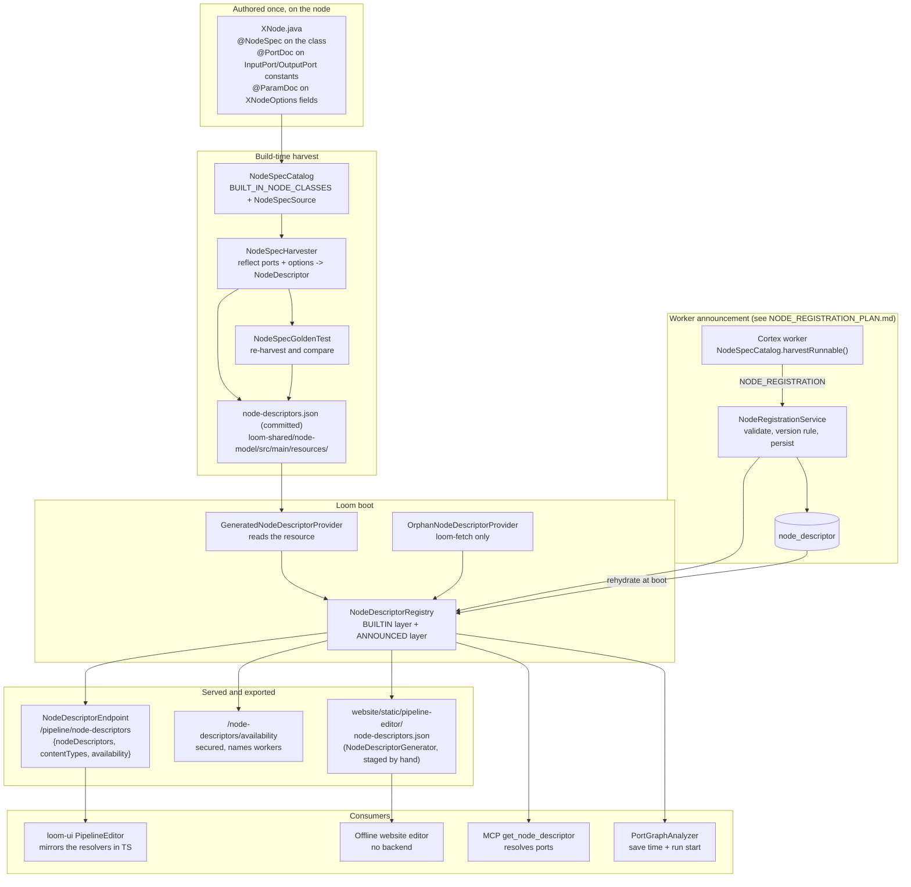

# Node Schema — How a Pipeline Node Declares Its Contract

> **Audience: AI coding agents.** One question: **where does the machine-readable contract of a
> pipeline node come from, and who is allowed to write it?**
>
> **Status: IMPLEMENTED.** A node declares its contract once, on itself, with `@NodeSpec` /
> `@PortDoc` / `@ParamDoc`. A build-time harvest turns those declarations into `NodeDescriptor`
> objects, the result is committed as a resource, and Loom serves it over REST and exports it as a
> static snapshot. There are no hand-written descriptor providers and no per-node schema files.
>
> This file replaces `concept/NODE_SCHEMA_CONCEPT.md`, which proposed four ways of inventing such a
> schema. The outcome of that comparison is recorded in §11; the open work it identified moved to
> [../../tasks/NODE_SCHEMA_TASKS.md](../../tasks/NODE_SCHEMA_TASKS.md).
>
> **Scope split — do not duplicate these here:**
>
> | Topic | Spec |
> |---|---|
> | What the contract *means* — content types, lattice, cardinality, groups, fan-out | [NODE_DATA_TYPES.md](NODE_DATA_TYPES.md) |
> | Rationale and recorded divergences of the port model | [../../concept/NODE_DATA_TYPES_PLAN.md](../../concept/NODE_DATA_TYPES_PLAN.md) |
> | The wire protocol by which a worker announces a contract | [../../plans/NODE_REGISTRATION_PLAN.md](../../plans/NODE_REGISTRATION_PLAN.md) |
> | Engine, definition JSON, dispatch | [PIPELINE.md](PIPELINE.md) · [PIPELINE_VALIDATION.md](PIPELINE_VALIDATION.md) |
> | Node lifecycle, options, persistence targets, side effects | [../nodes/NODES.md](../nodes/NODES.md) |
> | The checklist for adding a node | [../../guidelines/NEW_NODE.md](../../guidelines/NEW_NODE.md) §2 |
> | The editor that consumes all of this | [../../loom/ui/LOOM_UI_PIPELINE_EDITOR.md](../../loom/ui/LOOM_UI_PIPELINE_EDITOR.md) · [../../website/WEBSITE_PIPELINE_EDITOR.md](../../website/WEBSITE_PIPELINE_EDITOR.md) |
>
> **Source of truth is the code.** Where this file and the code disagree, the code wins — fix this
> file in the same change ([../../guidelines/SPEC_RULES.md](../../guidelines/SPEC_RULES.md)).

---

## 1. The Shape of the Answer

There is exactly **one** contract type, `NodeDescriptor`, and exactly **one** place a node's contract
is authored: the node class itself. Everything else in this file is a transport for that one object.

| Concern | Answer |
|---|---|
| What is a node's contract? | A `NodeDescriptor` — node id, name, description, icon, colour, category, input/output ports, port groups, parameters, dynamic-port flag, concurrency/mode/blocking defaults, events, version |
| Where is it authored? | On the node class in `cortex/`: `@NodeSpec` on the type, `@PortDoc` on the `InputPort`/`OutputPort` constants, `@ParamDoc` on the options fields |
| How much of it is authored? | Roughly 20 percent. Ids, content types, cardinalities, parameter keys, Java types, defaults and enum values are **derived by reflection** from the same declarations the node executes against |
| How does Loom get it? | A build-time harvest writes `loom-shared/node-model/src/main/resources/node-descriptors.json`, which is committed; `GeneratedNodeDescriptorProvider` reads it at boot |
| How does anything else get it? | `GET /api/v1/pipeline/node-descriptors`, or the checked-in static snapshot under `website/static/pipeline-editor/` |
| Is there a per-node schema file? | **No.** The "node card" idea was evaluated and not built — see §11 |

The design rule that produced this shape: **a contract that can be computed is never typed twice.**
The predecessor had 29 hand-written `NodeDescriptorProvider` classes restating ports the node had
already declared in Java, plus a conformance test whose only job was to police the drift between
them. Both are deleted. Drift is not detected here; it is unrepresentable.

---

## 2. Architecture



---

## 3. `NodeDescriptor` — the One Contract Type

`loom-shared/node-model/.../nodes/spec/NodeDescriptor.java`. A plain Jackson bean, so the same object
is the REST response, the announcement payload, the committed resource and the validator's input.

| Field | Notes |
|---|---|
| `nodeId` | The node **type** id (`whisper`, `ocr`). Three unrelated things in this system are called `nodeId` — the type, the graph-instance id on `NodeTask`, and the worker id on `ProcessorRegistration`. This is the type |
| `kind` | **Deprecated alias of `nodeId`.** Emitted *and* accepted for one release so the static snapshot, the TypeScript mirror and the offline editor do not all break in one commit. Both names read and write the one field |
| `version` | Contract version as announced by the worker. `null` for built-ins and for workers that declare none — unversioned disables skew detection rather than guessing an order (`NodeVersions`) |
| `name`, `description`, `icon`, `category` | Authored prose and palette placement |
| `color` | `#rgb`/`#rrggbb` literal or `null` (meaning: use the category default). `setColor` drops anything else, **including on the deserialization path**, because both editors write this into a style attribute and an announced third-party descriptor is not trusted with it |
| `inputPorts`, `outputPorts` | `PortSpec` lists. Semantics in [NODE_DATA_TYPES.md §3](NODE_DATA_TYPES.md) |
| `inputGroups`, `outputGroups` | `PortGroup` lists — XOR alternatives and EXCLUSIVE selections |
| `dynamicPorts` | This type derives its real ports from its options through a `NodePortResolver` (§7) |
| `parameters` | `NodeParameter` list — drives the edit form |
| `defaultConcurrency`, `defaultMode`, `defaultBlocking`, `events` | Execution defaults and the event surface the editor can visualise |

**There is no runtime fleet state on the descriptor.** Whether a worker offering the node is online is
served in a sibling block keyed by `nodeId` (§6.2). Spec knowledge is durable; worker presence is
live; merging them would make a contract disappear when a worker restarts.

`NodeDescriptors` (the utility class) provides canonical JSON and a `bodyHash` used to answer "have
two workers announced the same contract?". It excludes `version` (the label on the contract, not part
of it) and `kind` (the deprecated duplicate — hashing both would let a worker emitting only the new
name disagree with one emitting both about an identical contract).

### 3.1 `NodeParameter`

`key`, `type` (`ParameterType`), `defaultValue`, `label`, `description`, `min`, `max`, `step`,
`values`, `language`, `rows`.

**There is no `scope` field, and none is planned.** A parameter that is worker-scoped operational
configuration rather than a pipeline-author knob is kept out of the contract entirely with
`@ParamDoc(hidden = true)` — `timeoutMs` on the shared options base is the canonical case. Hiding is
how scope is expressed; a node that genuinely wants an inherited hidden field back re-documents it
with `@ParamOverride`. See [../nodes/NODES.md](../nodes/NODES.md) §5.1 for where worker-scoped values
actually come from.

---

## 4. Authoring — What Is Derived and What You Write

`cortex/api/.../node/spec/`. Four annotations plus one override record.

### 4.1 `@NodeSpec` (on the node class)

`nodeId`, `name`, `description`, `icon`, `color`, `category`, `version`, `defaultConcurrency`,
`defaultMode`, `defaultBlocking`, `events`, `dynamicPorts`, `optionsClass`, `inputGroups`,
`outputGroups`, `parameters`.

- `optionsClass` is normally inferred from the node's generic superclass. Set it only when the
  hierarchy erases the type — a raw superclass, or a node implementing `CortexNode` directly.
- `version` left empty falls back to the jar manifest's `Implementation-Version`, which Maven fills.
  That is how `1.0.0-SNAPSHOT` appears without anyone writing it anywhere.
- `events` left empty means the standard five: `NODE_STARTED`, `NODE_COMPLETED`, `NODE_FAILED`,
  `NODE_SKIPPED`, `NODE_STATS` (`NodeSpecHarvester.STANDARD_EVENTS`).
- `parameters` takes `@ParamOverride` entries — the escape hatch for documenting an options field the
  node **inherits**, since a subclass cannot re-annotate a superclass field and a `@ParamDoc` on a
  shared base otherwise applies to every node at once.

### 4.2 `@PortDoc` (on an `InputPort`/`OutputPort` constant)

The constant already carries the id, content type, cardinality and value type. The annotation adds
`label`, `description`, and the three behavioural bits the port record has no room for:

| Attribute | Meaning |
|---|---|
| `required` | Whether this input must be wired. **Ignored inside a `group`** — the group owns the requirement, which is the point of an XOR group |
| `selective` | Output side: this port carries data for some items and not others, so the engine skips a consumer wired to it for the items where nothing was emitted. **Opt-in, never inferred** — leaving a declared output unwritten is normal and harmless |
| `group` | Id of a `PortGroup` declared on the same side |
| `hidden` | Keep the port out of the *static* contract. For a `dynamicPorts` node that still declares constants because it executes against them (`FilterNode` writes `OUT_PASSED`) — without this the ports would be advertised twice, once statically and once per resolved bucket |
| `order` | Explicit ordering. Ports are otherwise emitted in field-declaration order, which is what the JVM reports in practice but does not promise |

The annotation is optional: an unannotated port is still harvested, with a label title-cased from its
id and no description.

### 4.3 `@ParamDoc` (on an options field)

The field already carries the key (its name), its type and its default (the value a
default-constructed options instance holds). The annotation adds `label`, `description`, `min`,
`max`, `step`, `values`, `language`, `rows`, plus:

| Attribute | Meaning |
|---|---|
| `type` | Declared as an **array** purely so "unset" is expressible. Set it where the Java type under-describes intent: a `String` holding a script body is `CODE`, one holding an object is `JSON`, a `List<String>` of choices is `ENUM_SET` |
| `min`/`max`/`step` | **Strings**, deliberately: `"1"` must serialize as `1` and `"0.0"` as `0.0`. A numeric annotation attribute would have to pick one and would turn every integer bound in the palette into a float |
| `hidden` | Keep the field out of the contract entirely (see §3.1) |
| `omitDefault` | Advertise no default though the field has one. Worth a second look every time: the editor pre-fills from the default, so omitting one the node *will* apply shows an empty field while the node quietly uses something else |
| `defaultValue` | Advertise a different default, always as a string. For the case where the useful starting point is not a legal field value — `script`'s body defaults to `null` so a node with no script fails validation, while the form should open with a runnable example |
| `order` | Explicit ordering; otherwise inherited common parameters first, then field-declaration order |

### 4.4 Derived versus authored, in one table

| Descriptor content | Source |
|---|---|
| Port id, content type, cardinality, value type | The `InputPort`/`OutputPort` constant — **derived** |
| Parameter key, Java type, default value, enum constants | The options field — **derived** |
| Node id, name, description, icon, colour, category | `@NodeSpec` — authored |
| Port label, description, required, selective, group, hidden | `@PortDoc` — authored |
| Parameter label, description, bounds, type override | `@ParamDoc` — authored |
| Port groups | `@NodeSpec(inputGroups/outputGroups)` with `@PortGroupDoc` — authored |
| Version | `@NodeSpec(version)` or the jar manifest — derived by default |

**Resist restating a port list in an annotation.** A second source of truth for the derivable 80
percent is exactly the problem the hand-written providers had.

---

## 5. The Harvest and the Committed Resource

### 5.1 Why the harvest runs at build time

Every contract is declared on a node class in `cortex/`. Loom cannot read those declarations:
`loom-shared` must not depend on `cortex` — the dependency runs the other way, and inverting it would
drag every node's transitive native libraries into the server. So the harvest runs in
`integration-test`, a module that can see both sides, and its output is committed to
`loom-shared/node-model/src/main/resources/node-descriptors.json`.

Loom's boot did not change: the registry is still populated from
`ServiceLoader<NodeDescriptorProvider>`, so a fresh install validates saved pipelines and serves a
full palette before any worker has connected. Only the source of the data moved — from prose typed
twice to prose typed once and derived.

Two providers are registered, and there will not be a third per node:

```
io.metaloom.loom.nodes.spec.GeneratedNodeDescriptorProvider   # reads /node-descriptors.json
io.metaloom.loom.nodes.spec.OrphanNodeDescriptorProvider      # loom-fetch only
```

`GeneratedNodeDescriptorProvider` throws at boot when the resource is missing. An empty palette is a
catastrophic quiet failure — every saved pipeline stops validating and the editor offers nothing — so
it fails loudly instead.

### 5.2 Class loading is the constraint that shapes discovery

Reflecting a class runs its static initializers, and some nodes load native libraries there
(`FingerprintNode` calls `Video4j.init()`). `NodeSpecCatalog` therefore discovers built-ins from a
**name list** (`BUILT_IN_NODE_CLASSES`) resolved with `Class.forName(name, false, loader)` —
`initialize = false`, so discovering a node does not run its initializer. Reading the port constants
does initialize the class, and on a worker that happens only for nodes it is registered to run, which
it would load on the first task anyway.

This is also why the executable-node registry cannot be the discovery source: it is a
`Map<String, Provider<FilesystemNode>>` multibinding, and the `Provider` is load-bearing — it keeps a
node uninstantiated until a task of its kind arrives. Asking a `Provider` for its class means calling
`get()`, which defeats the laziness it exists to provide, for every node, on every worker start.

**Consequence:** nothing scans for `@NodeSpec`. A node missing from `BUILT_IN_NODE_CLASSES` runs
perfectly and cannot be authored, and every guard test still passes. See
[../../guidelines/NEW_NODE.md](../../guidelines/NEW_NODE.md) §2, touch-point 4.

### 5.3 Regenerating

```bash
mvn -o -pl integration-test test -Dtest=NodeSpecGoldenTest -Dloom.regenerateNodeDescriptors=true
```

Without the flag the test only compares, so a stale resource is a build failure rather than a
silently outdated palette.

**After regenerating:**

- Reinstall `loom-shared/node-model` — the golden test compares against the **class path**, not the
  source tree.
- `mvn clean install` the shaded artifacts that bundle the resource (`cortex/cli`,
  `loom/containers/server`, `cli`). Without `clean` the shade plugin re-shades the previous fat jar
  and the stale copy survives every rebuild, which reads exactly like a regeneration that did not
  work.
- Bump the kind count in `NodeDescriptorServiceLoaderTest` (currently **45**) and add the new kind to
  its `testKindsFromEachFormerModule` list.
- Re-stage the website snapshot (§6.3).

---

## 6. Serving the Contract

### 6.1 The routes

`loom/services/rest/.../endpoint/impl/NodeDescriptorEndpoint.java`.

| Route | Auth | Returns |
|---|---|---|
| `GET /api/v1/pipeline/node-descriptors` | **none** | `{nodeDescriptors, contentTypes, availability}` — the editor's single call |
| `GET /api/v1/pipeline/node-descriptors/availability` | **secured** | `Map<nodeId, NodeAvailability>` only, including `providedBy` when the caller holds `READ_CORTEX_INSTANCE` |
| `GET /api/v1/pipeline/node-descriptors/:nodeId` | none | One descriptor, 404 when unknown |
| `GET /api/v1/pipeline/content-types` | none | The vocabulary alone |

The main route is unauthenticated **by design**: the editor builds its palette, its forms and its
connector validation before any token is in hand.

### 6.2 Why the route split is not cosmetic

`providedBy` names workers, which is fleet topology. It cannot live in the main response, because an
unsecured route never runs the auth handler — so a permission check inside it would resolve no caller
and deny everyone, including an administrator who holds the permission. A gate that is always shut is
not a gate. Hence: contracts and plain availability flags unauthenticated, worker names on the
secured route only, and an editor built to read sensibly without them.

The second reason for the split is size. Presence changes on every worker connect, disconnect,
restart and scale event; the full response is roughly 115 KB. Re-downloading all of it in every open
browser tab to learn that one boolean flipped is the obvious thing to build and the wrong one.

**Availability is a state query, not a timestamp comparison.** A node is available when a worker
offering it is `ONLINE`. Deriving it from "was this contract seen recently" would grey out the entire
palette one heartbeat interval after a healthy fleet connected — a worker announces once, right after
registering, then stays connected for days.

### 6.3 The static snapshot

`NodeDescriptorGenerator` (`loom/doc`, run from `ExampleGenerator`) writes
`src/main/generated/node-descriptors.json` in **exactly** the endpoint's shape, encoded through the
same Vert.x `Json` so field names match byte for byte. It is staged into
`website/static/pipeline-editor/node-descriptors.json` for the offline website editor, which has no
backend.

The snapshot deliberately carries **no `availability` block**. There is no fleet behind a static file,
and the editor reads a missing block as "everything is available" — the right answer for an offline
demo where every node is authorable and none can run.

**The staging is a manual copy and nothing notices when it rots.** See
[../../tasks/NODE_SCHEMA_TASKS.md](../../tasks/NODE_SCHEMA_TASKS.md) Task 2. As of this revision the
staged file is in sync: identical for all 44 shared node ids, plus `loom-fetch`, plus 40 content
types.

### 6.4 The two-layer registry

`NodeDescriptorRegistry` holds **BUILTIN** (compiled in, from `ServiceLoader`, never overwritten) and
**ANNOUNCED** (from a worker over `NODE_REGISTRATION`, persisted in `node_descriptor` and rehydrated
at boot). Lookups resolve BUILTIN first, which is what makes an announced copy of `whisper` inert
rather than dangerous — and why `putAnnounced` returns `false` rather than silently dropping it, so
the ingest path can report the rejection back to the worker.

`registry.contentTypes()` returns the compiled-in vocabulary plus one **synthesized** entry per
`family/subtype` an announced descriptor mentions that Loom has never heard of. There is no
`contentTypes` block on the wire and none is needed: `ContentTypeLattice.isAssignable` parses ids
structurally and never consults a registry, so `struct/nsfw` validates and connects the moment it is
announced. All that is missing is a tooltip label, and that is derived — the cost is a machine-made
label ("Nsfw"), the benefit is that a third party adds a content type by using it.

Full protocol, version rule, persistence and the UI consequences:
[../../plans/NODE_REGISTRATION_PLAN.md](../../plans/NODE_REGISTRATION_PLAN.md).

---

## 7. Dynamic Ports — the One Remaining Machine Gap

Four node types only know their ports once configured. The `NodePortResolver` SPI is discovered by
`ServiceLoader` and applied only to descriptors that set `dynamicPorts`;
`NodeDescriptorRegistry.resolvePorts(nodeId, options)` returns a `ResolvedPorts` record either way,
so a `script` node's per-instance outputs are validated exactly like a fixed type's.

| Node id | Resolver | Resolves to |
|---|---|---|
| `script` | `ScriptPortResolver` | One output port per `outputs[]` declaration; the `ScriptValueType` vocabulary maps onto a content type **plus a cardinality** ([NODE_DATA_TYPES.md §3.4](NODE_DATA_TYPES.md)) |
| `llm` | `LlmPortResolver` (extends `PromptPortResolver`) | One `result_<promptId> : text/plain ONE` per configured prompt; a single `result` port when none are configured, so the node stays connectable |
| `vlm` | `VlmPortResolver` (extends `PromptPortResolver`) | Same shape |
| `filter` | `FilterPortResolver` | One selective `media/*` port per `buckets[]` entry, plus the always-present `other` (selective catch-all), `passed` (`control/filter` boolean) and `bucket` (the decision as a string, not selective) |

**Nothing in a resolver throws.** Options come from a definition an author typed, so a malformed entry
degrades to "this port does not exist" and save-time validation reports the unwired edge. A resolver
that threw would take out the whole descriptor listing.

An **announced** type that declares `dynamicPorts` has no resolver on Loom's side — the resolver class
exists only on the worker — so it falls back to its declared static port lists. It stays authorable;
it simply does not gain per-option ports.

### 7.1 The gap

`resolvePorts` is called by `PortGraphAnalyzer` (save time and run start) and by the MCP tool
`get_node_descriptor`. **It is not served over REST.** The descriptor endpoint serves the static
descriptor only, and no route takes `nodeId` + `options`.

So `loom-ui` re-implements all four resolvers in TypeScript —
`loom-ui/src/features/pipeline/portResolvers.ts`, pinned only by `portResolvers.test.ts` mirroring
`NodePortResolverTest` **by hand**. Two implementations of one rule set, and the TS mirror was already
one resolver behind when `filter` was added.

The fix is to serve the resolver rather than describe it:
[../../tasks/NODE_SCHEMA_TASKS.md](../../tasks/NODE_SCHEMA_TASKS.md) Task 1.

---

## 8. A Descriptor Is Not a Registration

A node id can have a contract without a runtime producer, or a producer without a contract. Both
happen, both are deliberate, and the set difference is small enough to state.

**Descriptor but not runnable — 1:**

| Node id | Why |
|---|---|
| `loom-fetch` | **Executed by Loom, not by a worker.** It is the source of every ad-hoc node run (`POST /api/v1/node-runs`), and `PipelineRunEngine.onItemDiscovered` synthesises its `media` output directly rather than sending a `SOURCE_TASK` to anybody. A `loom-fetch` node reaching a dispatcher is a bug in the graph builder, not a missing worker. This is why `OrphanNodeDescriptorProvider` exists — and it is **not a pattern**: any other entry there would put a node in the palette that nothing can execute |

**Runnable but no descriptor — 2:**

| Node id | Why |
|---|---|
| `sha512-dedup` | A second `@StringKey` binding for the same producer as `hash-dedup`, kept for older definitions. Not authorable, by design |
| `asset-source` | Registered by hand in `RegistryNodeRegistrar`; reaches a worker only via a Loom-injected asset-scoped run, never from the palette |

Everything else lines up, because the descriptor is now harvested from the node class the runtime
binds. Recompute rather than trusting this table:

```bash
# advertised node ids
python3 -c "import json;print(sorted(d['nodeId'] for d in json.load(open('loom-shared/node-model/src/main/resources/node-descriptors.json'))))"
# runtime bindings (literals; constants need resolving through <Node>.KIND)
grep -rho '@StringKey("[^"]*")' cortex/ --include=*.java | sort -u
# the hand-registered sources
grep -n 'factory.register(' cortex/cli/src/main/java/io/metaloom/cortex/cli/dagger/RegistryNodeRegistrar.java
```

Three sources register conditionally — `s3-source`, `gdrive-source` and `onedrive-source` are
advertised by a worker only when that provider is configured, so the runnable set is per-worker, not
global. The palette answers this at runtime through the `availability` block (§6.2), which is what
closed this as a design question: an author does not need a static "is it registered" flag when the
editor can say "no worker currently offers this".

---

## 9. Counts, and How to Recount

**Count, never quote.** These numbers have been wrong in three spec files.

| Count | Value at this revision | Command |
|---|---|---|
| Advertised node ids | **45** (44 generated + `loom-fetch`) | `NodeDescriptorServiceLoaderTest` asserts it; or count the resource plus one |
| Descriptor providers | **2** | `META-INF/services/io.metaloom.loom.nodes.spec.NodeDescriptorProvider` |
| Content types | **40** | `ContentTypeRegistry.all().size()` |
| Dynamic-port node ids | **4** — `filter`, `llm`, `script`, `vlm` | `jq '[.[]|select(.dynamicPorts)|.nodeId]' <resource>` |
| Port resolvers | **4** | `META-INF/services/io.metaloom.loom.nodes.spec.NodePortResolver` |

> **Stale neighbours.** [NODE_DATA_TYPES.md §3.3/§3.4](NODE_DATA_TYPES.md) still says "41 kinds from
> 26 providers" and lists three resolvers; [../nodes/NODES.md](../nodes/NODES.md) §5.2 and
> [../../guidelines/NEW_NODE.md](../../guidelines/NEW_NODE.md) carry their own numbers. Reconciling
> them is [../../tasks/NODE_SCHEMA_TASKS.md](../../tasks/NODE_SCHEMA_TASKS.md) Task 4.

---

## 10. Test Setup

No test database is needed for anything in `loom-shared/node-model` or `cortex/api` — those modules
have no DB dependency, so `./setup-pool.sh` is irrelevant there. The endpoint and registration tests
use the standard `loom/core` / `loom/services/rest` harness and do need the pool.

| Test | Module | Guards |
|---|---|---|
| `NodeSpecHarvesterTest` (15) | `cortex/api` | Reflection rules: port derivation, parameter types, defaults, enum values, hidden/override handling |
| `NodeSpecGoldenTest` (3) | `integration-test` | **The committed resource equals a fresh harvest.** Reports differing node ids rather than a 118 KB text diff. Also spot-checks ids whose absence would mean a whole module stopped being seen |
| `NodeDescriptorServiceLoaderTest` (5) | `node-model` | 2 providers, 45 node ids, one id from each former module |
| `NodeDescriptorPortsTest` (10) | `node-model` | Every `dynamicPorts` id has a registered resolver; port ids match `PortSpec.ID_PATTERN`; content types are registered |
| `NodePortResolverTest` (15) | `node-model` | The four resolvers, including malformed-options degradation |
| `NodeDescriptorDeserializationTest` (11) | `node-model` | `nodeId`/`kind` both directions, `version`, colour rejection on the deserialization path |
| `NodeVersionsTest` (10) | `node-model` | Version ordering, snapshot convention, unparseable rejection |
| `ContentTypeLatticeTest` (11) | `node-model` | The three-arm assignability rule |
| `NodeDescriptorEndpointTest` (11) | `loom/core` | The four routes, the auth split, 404 on an unknown id |
| `NodeRegistrationServiceTest` (24) | `loom/services/rest` | Validation, the version rule, built-in precedence, link/unlink, ack assembly |
| `NodeDescriptorRehydrationTest` (6) | `loom/services/rest` | Restore with no worker; a built-in wins after a node graduates; a corrupt row is skipped rather than failing boot |
| `NodeDescriptorGeneratorTest` (2) | `loom/doc` | The snapshot generates in the endpoint's shape |
| `portResolvers.test.ts` (15) | `loom-ui` | The TypeScript mirror, hand-mirrored from `NodePortResolverTest` |

Run the schema-critical ones:

```bash
mvn -o -pl loom-shared/node-model test
mvn -o -pl cortex/api test -Dtest=NodeSpecHarvesterTest
mvn -o -pl integration-test test -Dtest=NodeSpecGoldenTest
./node_modules/.bin/vitest run src/features/pipeline/portResolvers.test.ts   # from loom-ui/
```

**Nothing guards the staged website snapshot.** That is the one missing test in this area —
[../../tasks/NODE_SCHEMA_TASKS.md](../../tasks/NODE_SCHEMA_TASKS.md) Task 2.

---

## 11. What Was Considered and Not Built

The predecessor of this file compared four ways of inventing a per-node schema file. The record, so
nobody proposes them again:

| Concept | Verdict |
|---|---|
| **YAML is the descriptor** — a per-node YAML file loaded at boot, replacing the provider classes | **Dropped.** Trades `javac`-checked content-type constants for boot-time string checking. The annotation harvest achieves the same zero-drift goal while keeping the declarations on the code that executes |
| **Front-matter node card** — contract block plus prose in one `<kind>.node.md` | **Contract block dropped** (it would be a drifting duplicate of a descriptor already served). The prose half is not built either — see below |
| **Generated JSON bundle** — an exporter emits per-kind JSON, a content-type file and a JSON Schema | **Shipped**, in a better form: the committed resource plus the REST endpoint plus the static snapshot. Only the JSON Schema piece remains unbuilt (Task 3) |
| **Bundle directory** — `contract.json` + `AGENT.md` + `examples/` + `operations.md` + `CHANGELOG.md` per node | **Dropped as disproportionate.** Five files times 45 node ids is roughly 200 files, and a half-populated bundle reads as an oversight rather than a decision |

**The authored "node card" was not built, and its motivation has shrunk.** The gap it addressed was
that a descriptor knows content type and cardinality but not that `hash-dedup` moves files, that
`scene-layout` must share a worker with `depthmap`, or that a parameter is worker-scoped. Two of
those three are now answered elsewhere: parameter scope by `@ParamDoc(hidden)` (§3.1), and node
prose, side effects and persistence targets by [../nodes/NODES.md](../nodes/NODES.md) and the per-node
specs under `features/nodes/`. What remains is worth doing only if an agent authoring a pipeline
actually gets it wrong — Task 5 records the idea and the acceptance test for it, and deliberately
does not schedule the sweep.

The rule that survived all four: **a schema must never express something `PortGraphAnalyzer` cannot
enforce.** Anything else is a lie with good formatting.

---

## 12. Configuration

**This feature adds no environment variables of its own.** The relevant ones decide where a consumer
reads the contract from, and whether a worker announces one.

| Variable | Default | Meaning |
|---|---|---|
| `VITE_API_BASE_URL` | `http://localhost:8092/api/v1` | `loom-ui` API base — which server's `/pipeline/node-descriptors` the editor calls (`loom-ui/src/api/config.ts`) |
| `CORTEX_NODE_SPEC_ANNOUNCE` | see [../../plans/NODE_REGISTRATION_PLAN.md](../../plans/NODE_REGISTRATION_PLAN.md) §10 | Whether a worker announces its harvested specs after `REGISTERED` |
| `CORTEX_NODES_*` | per node | Where **worker-scoped** parameters come from ([../nodes/NODES.md](../nodes/NODES.md) §5.1). Setting these keys in the pipeline JSON has no effect |
| *(none)* | — | The offline website editor has no backend; it reads the checked-in snapshot |

---

## 13. Progress Assessment

**Built**

- [x] `NodeDescriptor` as the single contract type — REST response, announcement payload, committed
      resource and validator input are the same object
- [x] `nodeId` rename with `kind` emitted and accepted as a deprecated alias for one release
- [x] `version` plus `NodeVersions` ordering; `NodeDescriptors.bodyHash` canonicalisation
- [x] `@NodeSpec` / `@PortDoc` / `@ParamDoc` / `@PortGroupDoc` / `@ParamOverride` + `NodeSpecHarvester`
- [x] `NodeSpecCatalog` discovery without running static initializers
- [x] Build-time harvest committed to `loom-shared/node-model/src/main/resources/node-descriptors.json`
- [x] 29 hand-written descriptor providers deleted; replaced by `GeneratedNodeDescriptorProvider`
      plus `OrphanNodeDescriptorProvider`
- [x] `NodePortConformanceTest` deleted — the drift it policed is now unrepresentable
- [x] `NodeSpecGoldenTest` makes a stale resource a build failure
- [x] Two-layer `NodeDescriptorRegistry` (BUILTIN wins) with DB rehydration
- [x] `ContentType` / `ContentTypeRegistry` / `ContentTypeLattice`; synthesized types for announced ports
- [x] `NodeDescriptorEndpoint`: main, `/availability`, `/:nodeId`, `/content-types`, with the auth split
- [x] `NodeAvailabilityService` — presence as a state query, `providedBy` gated on `READ_CORTEX_INSTANCE`
- [x] Static snapshot for the offline website editor, in the endpoint's exact shape
- [x] Four `NodePortResolver`s (`script`, `llm`, `vlm`, `filter`) consumed by `PortGraphAnalyzer`
- [x] MCP `get_node_descriptor` resolves ports from caller-supplied options
- [x] Descriptor-vs-runnable set difference computed and recorded (§8)

**Open — tracked in [../../tasks/NODE_SCHEMA_TASKS.md](../../tasks/NODE_SCHEMA_TASKS.md)**

- [ ] Task 1 — `POST /pipeline/node-descriptors/:nodeId/resolve-ports`, then retire or pin the
      TypeScript mirror. **Highest value, smallest change**
- [ ] Task 2 — a staleness guard for the staged website snapshot
- [ ] Task 3 — generate `pipeline-definition.schema.json` alongside the snapshot (optional)
- [ ] Task 4 — reconcile the stale kind/resolver counts in the neighbouring specs
- [ ] Task 5 — decide whether authored node cards are needed, using the agent-usability check first
- [ ] Task 6 — `NodeDescriptorGenerator` still populates its registry from `ServiceLoader` rather than
      the harvest; equivalent today only because the golden test keeps the resource honest

---

## 14. Key Classes Reference

| Class / file | Package or path | Relevance |
|---|---|---|
| `NodeDescriptor` | `io.metaloom.loom.nodes.spec` ([src](../../../loom-shared/node-model/src/main/java/io/metaloom/loom/nodes/spec/NodeDescriptor.java)) | The one contract type |
| `NodeDescriptors` | same | Canonical JSON, `bodyHash`, deep copy |
| `NodeParameter` / `ParameterType` | same | Form fields; no `scope` field by design |
| `PortSpec` / `PortGroup` / `PortGroupMode` / `Cardinality` | same | Port fields; `PortSpec.ID_PATTERN` is `^[a-z0-9][a-z0-9_]{0,62}$` |
| `ContentType` / `ContentTypeRegistry` / `ContentTypeLattice` | same | 40 ids; the three-arm assignability rule |
| `NodeDescriptorRegistry` | same | BUILTIN + ANNOUNCED, `sourceOf`, `resolvePorts`, `contentTypes` |
| `NodeDescriptorSource` | same | Which layer a node id resolved from |
| `NodeVersions` | same | Announced-version ordering; unparseable is skew, never guessed |
| `GeneratedNodeDescriptorProvider` | same | Reads the committed harvest; throws when it is missing |
| `OrphanNodeDescriptorProvider` | same | `loom-fetch` only — not a pattern |
| `NodePortResolver`, `Script`/`Prompt`/`Llm`/`Vlm`/`FilterPortResolver`, `ResolvedPorts` | same | Dynamic ports |
| `ValueCoercer` | same | Type enforcement at both wire boundaries — see [NODE_DATA_TYPES.md §7.4](NODE_DATA_TYPES.md) |
| `NodeSpec` / `PortDoc` / `ParamDoc` / `PortGroupDoc` / `ParamOverride` | `io.metaloom.cortex.api.node.spec` | The authoring surface |
| `NodeSpecHarvester` | same | Reflection into a `NodeDescriptor`; `STANDARD_EVENTS` |
| `NodeSpecCatalog` | same | `BUILT_IN_NODE_CLASSES`, `harvestRunnable()`, third-party `NodeSpecSource` |
| `NodeDescriptorEndpoint` | `io.metaloom.loom.rest.endpoint.impl` | The four routes and the auth split |
| `NodeAvailabilityService` / `NodeRegistrationService` | `io.metaloom.loom.rest.service.impl` | Presence; announcement ingest and persistence |
| `GetNodeDescriptorTool` | `io.metaloom.loom.mcp.tool.impl` | The only consumer today that resolves ports for a caller |
| `NodeDescriptorGenerator` | `io.metaloom.loom.doc.impl` (`loom/doc`) | Writes the static snapshot; staged by hand |
| `NodeSpecGoldenTest` / `NodeDescriptorResourceGenerator` | `integration-test/.../node/` | The build-time harvest and its guard |
| `PortGraphAnalyzer` | `io.metaloom.loom.pipeline.graph` | The only production caller of `resolvePorts` |
| `portResolvers.ts` / `nodeDescriptors.ts` | `loom-ui/src/features/pipeline/`, `loom-ui/src/api/`, `loom-ui/src/types/` | The TypeScript mirror and how the UI fetches the contract |

---

## 15. Conventions and Gotchas

- **A contract that can be computed is never typed twice.** Do not add a field to an annotation that
  restates something a port constant or an options field already declares.
- **Nothing scans for `@NodeSpec`.** A node absent from `NodeSpecCatalog.BUILT_IN_NODE_CLASSES` runs
  perfectly, cannot be authored, and breaks no test. It is touch-point 4 of five in
  [../../guidelines/NEW_NODE.md](../../guidelines/NEW_NODE.md) §2.
- **The golden test compares against the class path.** After regenerating, reinstall
  `loom-shared/node-model` and `mvn clean install` every shaded artifact that bundles the resource, or
  the stale copy survives and reads like a failed regeneration.
- **`kind` is a deprecated alias of `nodeId`, for one release only.** The static snapshot emits both.
  New code reads `nodeId`; the UI reads it through `nodeIdOf()`.
- **A descriptor is not a registration**, and neither is a registration a descriptor — §8. An agent
  trusting the descriptor list alone can author a pipeline nothing will run; the `availability` block
  is the answer, not a static flag.
- **Never put fleet state on the descriptor.** Contracts are durable, presence is live, and they are
  served side by side for that reason.
- **A built-in id is never shadowed by an announcement**, and the refusal is returned rather than
  swallowed so the worker learns about it.
- **No resolver throws.** A malformed option must degrade to "this port does not exist" and let
  save-time validation report the unwired edge.
- **`PortDoc.selective` is opt-in.** Leaving a declared output unwritten is normal; a node routes only
  if it says it routes.
- **`ParamDoc.min/max/step` are strings** so an integer bound stays an integer in the palette.
- **Reflecting a class runs its static initializers**, and some nodes load native libraries there.
  Discovery uses `Class.forName(name, false, loader)`; never sweep the class path.
- **`PortGraphAnalyzer.analyze` returns immediately when the registry is null**, and
  `new PipelineGraphParser()` supplies null. A test that means to assert validation must pass a real
  registry, or it asserts nothing.
- **Every source node must name its output port `media`** — `PipelineRunEngine.SOURCE_MEDIA_PORT` is
  the literal string ([NODE_DATA_TYPES.md §5](NODE_DATA_TYPES.md)).
- **Changing a port `ONE` to `MANY` is a behaviour change, not documentation** — it converts every
  downstream `ONE` consumer to per-element dispatch.
- **The static snapshot is copied by hand.** After changing any annotation, regenerate and re-stage,
  or the offline editor silently serves an old contract.
- **Count, never quote** (§9).

---

## 16. Where Do I Find …?

| I want … | Look at |
|---|---|
| The live contract for every node | `GET /api/v1/pipeline/node-descriptors` |
| The same contract without a server | `website/static/pipeline-editor/node-descriptors.json` |
| The contract Loom boots with | `loom-shared/node-model/src/main/resources/node-descriptors.json` |
| Where a node's contract is authored | `@NodeSpec` on `cortex/nodes/<module>/.../XNode.java`, `@PortDoc` on its port constants, `@ParamDoc` on `XNodeOptions` |
| The reflection rules | `cortex/api/.../node/spec/NodeSpecHarvester.java` |
| How to regenerate the contracts | §5.3, or [../../guidelines/NEW_NODE.md](../../guidelines/NEW_NODE.md) §2 |
| The five touch-points for a new node | [../../guidelines/NEW_NODE.md](../../guidelines/NEW_NODE.md) §2 |
| Dynamic port resolvers | `loom-shared/node-model/.../spec/{Script,Prompt,Llm,Vlm,Filter}PortResolver.java` |
| The TypeScript mirror to be retired | `loom-ui/src/features/pipeline/portResolvers.ts` |
| What the port model *means* | [NODE_DATA_TYPES.md](NODE_DATA_TYPES.md) §2–§3 |
| The per-node port table | [NODE_DATA_TYPES.md](NODE_DATA_TYPES.md) §4 |
| Fan-out, gather, per-element dispatch | [NODE_DATA_TYPES.md](NODE_DATA_TYPES.md) §8 |
| The five port validation rules | [NODE_DATA_TYPES.md](NODE_DATA_TYPES.md) §6.3 · [PIPELINE_VALIDATION.md](PIPELINE_VALIDATION.md) |
| How a worker announces a contract | [../../plans/NODE_REGISTRATION_PLAN.md](../../plans/NODE_REGISTRATION_PLAN.md) |
| Node lifecycle, options, persistence, side effects | [../nodes/NODES.md](../nodes/NODES.md) §1–§5 |
| The MCP tool an agent uses to place a node | `loom/services/mcp/.../tool/impl/GetNodeDescriptorTool.java` · [../../loom/MCP.md](../../loom/MCP.md) |
| Seeded, port-wired reference pipelines | `loom/core/src/main/java/io/metaloom/loom/core/boot/DemoDatabaseInitializer.java` |
| Open work on this feature | [../../tasks/NODE_SCHEMA_TASKS.md](../../tasks/NODE_SCHEMA_TASKS.md) |
| Spec authoring rules / definition of done | [../../guidelines/SPEC_RULES.md](../../guidelines/SPEC_RULES.md) · [../../guidelines/CODING.md](../../guidelines/CODING.md) |

---
_Git HEAD revision: `8c153347`_
_Last updated: 2026-08-11 (converted from concept/NODE_SCHEMA_CONCEPT.md after a code audit; open work moved to tasks/NODE_SCHEMA_TASKS.md)_
