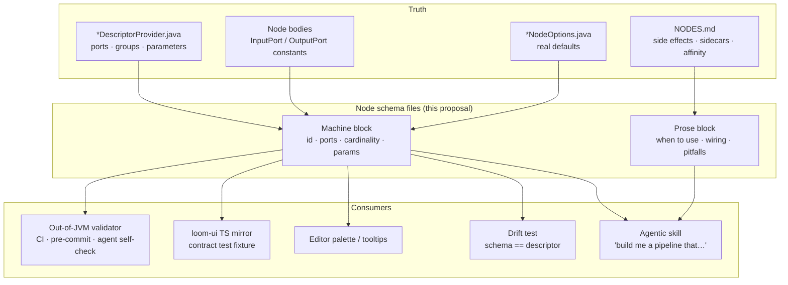

# Node Schemas — Four Concepts for a Per-Node Contract File

> **Status: exploration. Nothing here is built.** This file proposes **four alternative designs** for
> a *node schema* — a per-kind artifact that describes a pipeline node completely enough to (a)
> **validate a pipeline definition** without running Java, and (b) **brief an LLM** on how to use the
> node and where to place it in a graph.
>
> It ends with a **format-independent construction procedure** (§8) that applies to whichever concept
> is chosen, and a **decision checklist** (§10). Processing the nodes — actually writing 41 schema
> files — is deliberately **out of scope**; that is a follow-up task, and §8 is its instruction set.
>
> **Companion documents (read before choosing):**
> - [NODE_DATA_TYPES.md](NODE_DATA_TYPES.md) — the built port model: content-type vocabulary,
>   lattice, cardinality, groups, dynamic ports, the per-kind port table. **The schema must not
>   contradict this file.**
> - [NODE_DATA_TYPES_PLAN.md](NODE_DATA_TYPES_PLAN.md) — why the port model looks the way it does,
>   and the recorded design-vs-implementation divergences.
> - [PIPELINE.md](PIPELINE.md) — engine, definition JSON, validation call sites, REST surface.
> - [../pipeline-nodes/NODES.md](../pipeline-nodes/NODES.md) — node lifecycle, per-node
>   configuration, persistence targets, side effects. **The single richest source of the prose a
>   schema needs.**
> - [../../SPEC_RULES.md](../../SPEC_RULES.md), [../../guidelines/CODING.md](../../guidelines/CODING.md).
>
> **Source of truth is the code.** Where this file and the code disagree, the code wins — fix this
> file in the same change.

---

## 1. The Problem, Stated Precisely

The premise in the brief — *"at the moment it is difficult to validate a pipeline"* — is true, but not
for the reason it first looks like. **Java-side validation already exists and is good.**
`PortGraphAnalyzer` enforces five rules (port existence, type assignability, input satisfaction
including XOR/EXCLUSIVE groups, the multi-edge/MANY rule, and fan-out shape) at save time *and* at run
start ([NODE_DATA_TYPES.md](NODE_DATA_TYPES.md) §6.3).

What is actually missing is everything **around** that one implementation:

| # | Gap | Evidence | A node schema fixes it? |
|---|---|---|---|
| G1 | **The contract is only reachable from a JVM.** The ports live in `*DescriptorProvider.java` and are assembled by a `ServiceLoader` at startup | 26 provider classes in `loom-shared/node-model/.../spec/` | ✅ A file on disk is readable by a script, a CI job, an agent, a TS test |
| G2 | **`resolvePorts` is not served over REST.** `NodeDescriptorEndpoint` serves the *static* descriptor only, so the editor cannot ask the server for a `script`/`llm`/`vlm` node's effective ports | [NODE_DATA_TYPES.md](NODE_DATA_TYPES.md) §3.4 🔴 | ⚠️ Partly — schemas can declare the *resolver rule*, but a configured instance still needs evaluation |
| G3 | **The TypeScript mirror is hand-transcribed.** The vitest contract test carries a hand-written fixture; no Java-side export exists, so the two can drift and only a reviewer notices | [NODE_DATA_TYPES_PLAN.md](NODE_DATA_TYPES_PLAN.md) §0 divergence 16 | ✅ Directly — the schema files *are* the shared fixture |
| G4 | **An agent cannot learn a node from the descriptor.** The descriptor knows `contentType` and `cardinality`. It does **not** know that `hash-dedup` *moves files*, that `scene-layout` **must** share an affinity group with its `depthmap`, or that `tts` needs a sidecar on port 9110 | [../pipeline-nodes/NODES.md](../pipeline-nodes/NODES.md) §3, §5 | ✅ This is the whole point of the `agent` block |
| G5 | **The kind count is not agreed even between two spec files.** [NODE_DATA_TYPES.md](NODE_DATA_TYPES.md) §3.3 says *26 providers / 41 kinds*; [PIPELINE.md](PIPELINE.md) §8 says *25 providers / 39 kinds* | grep the two files | ✅ A directory of schema files is countable with `ls` |
| G6 | **A descriptor is not a registration.** `hash-dedup`, `facedescription`, the `filter-*` kinds and `loom-fetch` have descriptors but no runtime producer — a graph that validates cannot run | [PIPELINE.md](PIPELINE.md) §8, [../pipeline-nodes/NODES.md](../pipeline-nodes/NODES.md) §12 | ✅ A `runtime.registered` field makes it a validation error, not a runtime surprise |
| G7 | **The legacy inline `dependencies[]` fallback still parses.** A definition with no `edges` array produces **no `InputBinding`s** and skips port validation entirely | [NODE_DATA_TYPES.md](NODE_DATA_TYPES.md) §6.1 ⚠️ | ❌ Unrelated — delete the fallback regardless of which concept wins |

**So the honest framing:** a node schema is *not* a new type system. It is an **export format and a
knowledge carrier** for the type system that already exists. Every concept below is judged on how well
it serves G1–G6 without becoming a second, drifting source of truth.

### 1.1 Two consumers, one artifact



The two consumers pull in opposite directions, and that tension **is** the design space:

| | Validator wants | Agent wants |
|---|---|---|
| Format | Strict, typed, machine-parseable, no free text | Prose, examples, caveats, rationale |
| Volume | Minimal — every field is a rule | Generous — context is the product |
| Truth | Generated, zero drift, byte-comparable | Hand-written, reviewed, opinionated |
| Failure mode | A wrong field passes an invalid graph | A missing paragraph makes the agent guess |

**Concept 3 optimises for the left column. Concept 1 optimises for the right. Concepts 2 and 4 split
the file so each half can be optimised separately.**

---

## 2. The Field Inventory (format-independent)

Every concept below encodes **the same information**. Deciding *what* goes in the schema is a separate
decision from *how it is written down*, so it is settled once, here. Serialise this inventory as YAML,
as JSON, or as frontmatter + Markdown — the content does not change.

### 2.1 Identity

| Field | Required | Source of truth | Notes |
|---|---|---|---|
| `schemaVersion` | ✅ | this spec | Integer. Bump when the schema *format* changes, never when a node changes |
| `kind` | ✅ | `NodeDescriptor.kind` | The pipeline `type` value. Must match the `@StringKey` binding when registered |
| `name` | ✅ | `NodeDescriptor.name` | Display name |
| `description` | ✅ | `NodeDescriptor.description` | One or two sentences. Palette tooltip |
| `category` | ✅ | `NodeCategory` | `SOURCE` / `ANALYSIS` / `FILTER` / `TRANSFORM` / `SINK` / … |
| `icon` | — | `NodeDescriptor.icon` | Material-icons key |
| `module` | ✅ | filesystem | e.g. `cortex/nodes/whisper` — where the implementation lives |

### 2.2 Port contract — the validator's payload

| Field | Required | Source of truth |
|---|---|---|
| `ports.inputs[].{id,label,contentType,cardinality,required,group,description}` | ✅ | `PortSpec` in the descriptor provider |
| `ports.outputs[].{…}` | ✅ | same |
| `ports.inputGroups[].{id,mode,required,label}` | when grouped | `PortGroup` |
| `ports.outputGroups[].{…}` | when grouped | `PortGroup` |
| `ports.dynamic` | ✅ | `NodeDescriptor.dynamicPorts` |
| `ports.dynamicRule` | when dynamic | The `NodePortResolver` behaviour, **described declaratively** (§7.3) |

`contentType` must be a registered id from
[ContentTypeRegistry](../../../loom-shared/node-model/src/main/java/io/metaloom/loom/nodes/spec/ContentTypeRegistry.java);
`cardinality` is `ONE` or `MANY`; `id` matches `^[a-z0-9][a-z0-9_]{0,62}$`
([PortSpec.java:24](../../../loom-shared/node-model/src/main/java/io/metaloom/loom/nodes/spec/PortSpec.java#L24)).

### 2.3 Execution defaults

`execution.{defaultMode, defaultConcurrency, defaultBlocking, timeoutMsDefault}` — from the descriptor,
except `timeoutMsDefault`, which several nodes set in their options constructor rather than the
descriptor (`depthmap` defaults `timeoutMs` to 120000).

### 2.4 Parameters

`parameters[].{key,type,label,description,defaultValue,min,max,step,values,language,rows}` — from
`NodeParameter`. ⚠️ **The descriptor's `defaultValue` and the options class can disagree.** Where they
do, the options class is what runs; record the options-class value and open a defect note.

`parameters[].scope` is **new and load-bearing**: `WORKER` (read from `CortexOptions.getNodes()`,
identical for every instance on that worker) vs `INSTANCE` (read through `PipelineConfigurable` from
the node's `options` block in the definition JSON). Only `script` and `s3-sink` implement
`PipelineConfigurable` today ([../pipeline-nodes/NODES.md](../pipeline-nodes/NODES.md) §5.1). An agent
that sets a `WORKER`-scoped parameter in the pipeline JSON is writing a value nothing will read — this
field is the only thing that can warn it.

### 2.5 Runtime requirements — what makes a node *runnable*, not merely *valid*

| Field | Why it matters | Example |
|---|---|---|
| `runtime.registered` | Closes G6. `false` ⇒ a graph using this kind validates but cannot run | `facedescription: false` |
| `runtime.bindingKey` | The `@StringKey` when it differs from `kind` | `hash-dedup` is bound as `sha512-dedup` |
| `runtime.sidecar` | Host/port/endpoint of the FastAPI service the node calls | `sentiment` → `:9110 /v1/sentiment` |
| `runtime.externalBinary` | Native tools that must be on `PATH` | `watermark` → `ffmpeg` |
| `runtime.model` | Model files/weights that must be present | `whisper` → `ggml-large-v3-turbo.bin` |
| `runtime.gpu` | `NONE` / `OPTIONAL` / `REQUIRED` | drives worker placement advice |
| `runtime.mediaTypes` | What `isProcessable()` actually accepts | `ocr` → image only |
| `runtime.affinityWith` | Kinds that **must** share a worker because they exchange local files | `scene-layout` → `depthmap`; `s3-sink` → its artifact producer |

`runtime.affinityWith` is the single highest-value field for an agent. Both known cases are marked 🔴
in [../pipeline-nodes/NODES.md](../pipeline-nodes/NODES.md) §3 and are invisible in the descriptor.

### 2.6 Effects — what happens to the world

| Field | Values |
|---|---|
| `effects.persistence[]` | The Loom write targets: `{client method, REST path, table}` — from the [../pipeline-nodes/NODES.md](../pipeline-nodes/NODES.md) §2 table |
| `effects.localArtifacts[]` | Worker-local caches written (`tts_bin`, `depthmap_bin`, `imagegen_bin`, `script_bin`, `watermark_bin`) |
| `effects.mutatesSource` | 🔴 `true` for `hash-dedup` and `fingerprint-dedup-apply` — **they move files** |
| `effects.idempotent` | Whether a re-run replaces its own row (upsert) or appends |

`effects.mutatesSource` is the field that stops an agent from cheerfully dropping a dedup node into a
demo pipeline.

### 2.7 Flow semantics — how the node behaves in a graph

| Field | Meaning |
|---|---|
| `flow.fansOut` | `true` when any output declares `MANY` (`facedetect.detections`, `script` with a `*_LIST` output). Downstream `ONE` inputs then run **per element** |
| `flow.gathers` | `true` when any input declares `MANY` — the node is an implicit gather barrier (`facedescription`, `s3-sink`) |
| `flow.perElementCapable` | `false` when the analyzer would reject it — a `PER_ELEMENT` node may not declare a `MANY` output at all ([NODE_DATA_TYPES.md](NODE_DATA_TYPES.md) §6.4) |
| `flow.branching` | `true` for `FILTER`-category kinds; only their edges may carry `branch: PASS/REJECT` |
| `flow.isSource` | Exempt from the required-input rule; **must** name its output port `media` (§5 of [NODE_DATA_TYPES.md](NODE_DATA_TYPES.md) — `SOURCE_MEDIA_PORT` is hard-coded) |

These are all *derivable* from the ports, which is exactly why they should be **generated, not
authored** — see §7.2.

### 2.8 Agent guidance — the block no generator can write

| Field | Content |
|---|---|
| `agent.summary` | One line an LLM can scan in a 41-node listing |
| `agent.whenToUse` | 2–4 bullets |
| `agent.whenNotToUse` | 2–4 bullets, including the cheaper alternative |
| `agent.prerequisites` | What must exist upstream, in prose ("a text producer — `llm`, `ocr`, `tika` or `whisper`") |
| `agent.typicalUpstream[]` / `agent.typicalDownstream[]` | Kind ids, for graph completion |
| `agent.cost` | `TRIVIAL` / `CHEAP` / `EXPENSIVE` / `VERY_EXPENSIVE` + a sentence |
| `agent.pitfalls[]` | The 🔴/⚠️ notes from [../pipeline-nodes/NODES.md](../pipeline-nodes/NODES.md), restated as instructions |
| `agent.examples[]` | Named, **valid** definition fragments (nodes + edges) — see §2.9 |

### 2.9 Examples — executable, not illustrative

```json
{
  "name": "transcribe-video",
  "description": "Filesystem source → whisper via the video alternative of the XOR group",
  "nodes": [
    { "id": "src", "type": "filesystem-source" },
    { "id": "w",   "type": "whisper" }
  ],
  "edges": [
    { "id": "e1", "source": "src", "sourcePort": "media", "target": "w", "targetPort": "video" }
  ]
}
```

**Every example must parse and validate.** That is what makes them safe to use as few-shot prompt
material *and* what makes them a regression test — see §9.2.

---

## 3. Concept 1 — Schema-First YAML (one `.yaml` per kind, schema is the source of truth)

**The inversion.** The YAML file becomes authoritative and the Java `NodeDescriptor` is *loaded from
it* at startup instead of being hand-coded in 26 provider classes. `NodeDescriptorProvider` shrinks to
a single `ResourceNodeDescriptorProvider` that reads
`loom-shared/node-model/src/main/resources/nodes/*.yaml`.

**Layout:** `loom-shared/node-model/src/main/resources/nodes/<kind>.yaml`

```yaml
schemaVersion: 1
kind: whisper
name: Whisper (Speech-to-Text)
description: Transcribe audio/video speech to text using Whisper.
category: ANALYSIS
icon: mic
module: cortex/nodes/whisper

ports:
  dynamic: false
  inputGroups:
    - id: media_alt
      mode: XOR
      required: true
      label: Media
  inputs:
    - id: audio
      label: Audio
      contentType: media/audio
      cardinality: ONE
      group: media_alt
      description: An audio file to transcribe
    - id: video
      label: Video
      contentType: media/video
      cardinality: ONE
      group: media_alt
      description: A video whose audio track is demuxed and transcribed
  outputs:
    - id: transcript
      label: Transcript
      contentType: text/transcript
      cardinality: ONE
      description: The recognised speech with per-segment start and end times

execution: { defaultMode: PARALLEL, defaultConcurrency: 1, defaultBlocking: true }

parameters:
  - { key: enabled,     type: BOOLEAN, default: true,  scope: WORKER, label: Enabled }
  - { key: modelPath,   type: STRING,  scope: WORKER,  label: Model Path,
      default: models/ggml-large-v3-turbo.bin,
      description: Path to the Whisper model file, relative to the worker }
  - { key: temperature, type: NUMBER,  default: 0.0, min: 0.0, max: 1.0, step: 0.1, scope: WORKER,
      label: Temperature }
  - { key: language,    type: STRING,  scope: WORKER,  label: Language,
      description: "Target language code ('en', 'de'); auto-detect when unset" }
  - { key: useGpu,      type: BOOLEAN, default: true,  scope: WORKER, label: Use GPU }

runtime:
  registered: true
  gpu: OPTIONAL
  model: ggml-large-v3-turbo.bin (whisper.cpp GGML format)
  mediaTypes: [ video, audio ]
  affinityWith: []

effects:
  persistence:
    - { method: createAssetTranscript, path: "assets/:uuid/transcripts", table: asset_transcript_comp }
  mutatesSource: false
  idempotent: true

flow: { fansOut: false, gathers: false, branching: false, isSource: false }

agent:
  summary: Speech-to-text for audio and video; emits one transcript per item.
  cost: EXPENSIVE
  whenToUse:
    - The pipeline needs the spoken content of a media item as text.
    - Upstream of any text consumer — `sentiment`, `filter-blacklist`, `llm`, `tts`.
  whenNotToUse:
    - For on-screen text in an image. Use `ocr`.
    - For a visual description. Use `captioning` or `vlm`.
  prerequisites: >
    Exactly one of the two XOR alternatives must be wired. Wire `video` for a video source
    and `audio` for an audio source; wiring both is a save-time validation error.
  typicalUpstream:  [ filesystem-source, s3-source, filter-mimetype ]
  typicalDownstream: [ sentiment, filter-blacklist, llm, tts ]
  pitfalls:
    - The `media_alt` group is XOR and required — an unwired whisper node fails validation.
    - `modelPath` is WORKER-scoped; setting it in the pipeline JSON has no effect.
    - Slowest node in most graphs. Give it its own affinity group when other nodes contend for GPU.
  examples:
    - name: transcribe-video
      nodes: [ { id: src, type: filesystem-source }, { id: w, type: whisper } ]
      edges: [ { id: e1, source: src, sourcePort: media, target: w, targetPort: video } ]
```

**Consequences**

| | |
|---|---|
| ✅ | **Zero drift by construction** — there is nothing to drift *from*. G1, G3, G5 solved outright |
| ✅ | Deletes 26 provider classes and ~3 000 lines of builder code; adding a kind stops being a Java change |
| ✅ | One file, one review, one diff per node |
| ⚠️ | **Loses compile-time safety.** `MEDIA_AUDIO` as a Java constant is checked by `javac`; `media/audio` in YAML is checked only when the registry loads. Mitigate with a boot-time validator that fails fast (§9.1) |
| ⚠️ | YAML in a jar resource is awkward for `script`/`llm`/`vlm` — a `NodePortResolver` is *code*. Either keep three Java resolvers alongside the YAML (a hybrid, which weakens the "one source" claim) or express the rule declaratively (§7.3) |
| 🔴 | **Largest blast radius of the four.** Touches the SPI, the registry, every provider, `NodeDescriptorPortsTest`, and the REST endpoint. This is a refactor, not an addition |
| 🔴 | Mixing a strict machine contract and multi-paragraph prose in one YAML file makes both worse: YAML block scalars are a hostile place to write documentation, and prose churn pollutes the diff of the contract |

**Pick this if** the goal is to make node authoring declarative and you accept a refactor. **Do not pick
it** if the goal is primarily agent enablement — it pays the highest cost for the least prose benefit.

---

## 4. Concept 2 — Front-Matter Node Card (`<kind>.node.md`) ⭐ *recommended*

**The brief's own instinct, made concrete.** One file per kind: a strict machine-readable header, a
`---` delimiter, then a Markdown body written for a reader. Java stays the source of truth for the
contract; the header is **generated or drift-tested** against it, and the body is hand-authored.

**Layout:** `loom-shared/node-model/src/main/resources/io/metaloom/loom/nodes/schema/<kind>.node.md`

Placing it under `src/main/resources` (not under `spec/`) is deliberate: the file ships in the jar, so
`NodeDescriptorEndpoint` can serve it, the agent skill can read it from a running system, and it is
versioned with the code it describes.

````markdown
---
schemaVersion: 1
kind: whisper
name: Whisper (Speech-to-Text)
description: Transcribe audio/video speech to text using Whisper.
category: ANALYSIS
icon: mic
module: cortex/nodes/whisper
generated: contract          # this block is checked against NodeDescriptor by WhisperSchemaTest

ports:
  dynamic: false
  inputGroups:
    - { id: media_alt, mode: XOR, required: true, label: Media }
  inputs:
    - { id: audio, label: Audio, contentType: media/audio, cardinality: ONE, group: media_alt }
    - { id: video, label: Video, contentType: media/video, cardinality: ONE, group: media_alt }
  outputs:
    - { id: transcript, label: Transcript, contentType: text/transcript, cardinality: ONE }

execution: { defaultMode: PARALLEL, defaultConcurrency: 1, defaultBlocking: true }

parameters:
  - { key: modelPath, type: STRING, scope: WORKER, default: models/ggml-large-v3-turbo.bin }
  - { key: temperature, type: NUMBER, scope: WORKER, default: 0.0, min: 0.0, max: 1.0 }
  - { key: language, type: STRING, scope: WORKER }
  - { key: useGpu, type: BOOLEAN, scope: WORKER, default: true }

runtime:  { registered: true, gpu: OPTIONAL, mediaTypes: [video, audio], affinityWith: [] }
effects:  { mutatesSource: false, idempotent: true,
            persistence: [ { table: asset_transcript_comp, method: createAssetTranscript } ] }
flow:     { fansOut: false, gathers: false, branching: false, isSource: false }
cost:     EXPENSIVE
---

# Whisper

Speech-to-text over the audio track of a video or a bare audio file. Emits **one** transcript per
item — the JSON carries per-segment start/end times, so a downstream node can align text to time.

## When to use

- The graph needs the *spoken* content of a media item as text.
- Anywhere upstream of a text consumer: `sentiment`, `filter-blacklist`, `llm`, `tts`.

## When not to use

- **On-screen text in an image** → `ocr`.
- **A visual description of what is happening** → `captioning` or `vlm`.
- Video with no audio track: the node still runs and returns an empty transcript. Put a
  `filter-mimetype` upstream if that matters.

## Wiring

`whisper` has **one logical input with two alternatives**, modelled as the XOR group `media_alt`:

| Source is | Wire to |
|---|---|
| a video | `video` (`media/video`) |
| an audio file | `audio` (`media/audio`) |

Wiring **both** is a save-time error; wiring **neither** is a save-time error. A `media/*` source
(every source kind emits the wildcard) satisfies either alternative *provisionally* — the real check
happens at runtime with the file in hand.

```json
{ "id": "e1", "source": "src", "sourcePort": "media",
  "target": "w", "targetPort": "video" }
```

## Pitfalls

- 🔴 `modelPath`, `useGpu` and `language` are **worker-scoped**. Setting them in the pipeline JSON
  changes nothing — they come from `CortexOptions.getNodes().get("whisper")`.
- ⚠️ Slowest node in most graphs, and it competes for the GPU. Give it its own affinity group when
  `facedetect` or `captioning` are in the same pipeline.
- ⚠️ The transcript is persisted with `streamIndex = 0` only — multi-audio-track media loses its
  other tracks. See [../pipeline-nodes/NODES.md](../pipeline-nodes/NODES.md) §2.

## Examples

### Transcribe every video in a folder, then score sentiment

```json
{
  "nodes": [
    { "id": "src", "type": "filesystem-source" },
    { "id": "mt",  "type": "filter-mimetype" },
    { "id": "w",   "type": "whisper" },
    { "id": "s",   "type": "sentiment" }
  ],
  "edges": [
    { "id": "e1", "source": "src", "sourcePort": "media",      "target": "mt", "targetPort": "media" },
    { "id": "e2", "source": "mt",  "sourcePort": "passed",     "target": "w",  "targetPort": "video",
      "branch": "PASS" },
    { "id": "e3", "source": "w",   "sourcePort": "transcript", "target": "s",  "targetPort": "text" }
  ]
}
```
````

**Consequences**

| | |
|---|---|
| ✅ | **Each half is optimised for its consumer.** A YAML parser reads the frontmatter and ignores the body; an LLM reads the whole file and the prose is the point |
| ✅ | **Java keeps compile-time safety.** The header is a projection, guarded by a drift test — the cheapest possible G1/G3/G5 fix |
| ✅ | **This is exactly the shape of an agent skill file**, so the "spec for an agentic loop skill" requirement needs no extra artifact — point the skill at the directory |
| ✅ | Reviewable: a port change shows up in the header diff, a doc change in the body diff, in one PR |
| ⚠️ | **Two sources of truth for the contract** (Java + header) unless the header is generated. The drift test is not optional; it is the concept's load-bearing wall (§9.1) |
| ⚠️ | Needs a frontmatter parser on every consumer. Trivial in Java (SnakeYAML, already a transitive dep in the tree) and TS (`gray-matter` or 15 lines of split-on-`---`), but it is a dependency in each |
| ⚠️ | Markdown fenced blocks inside a Markdown file need `````` fences — an authoring footgun worth putting in the template |
| — | The brief floated **JSON** in the header. YAML is recommended: comments, no trailing-comma traps, block scalars for the odd multi-line description. If JSON is preferred, use a `---json` fence marker so parsers can dispatch on it |

**Pick this if** the primary goal is agent enablement with a validator as the secondary payoff, and a
big refactor is unwelcome. **This is the recommendation** — see §10.

---

## 5. Concept 3 — Generated JSON Contract Bundle (no hand-authored file at all)

**The purist machine-first option.** No new hand-written artifact. A Maven-invoked exporter walks
`NodeDescriptorRegistry` and emits, into `target/` and a checked-in `node-schemas/` mirror:

```
node-schemas/
├── index.json                        # { schemaVersion, generatedFrom, kinds: [...] }
├── content-types.json                # ContentTypeRegistry.all()
├── kinds/whisper.json                # one per kind, exactly the descriptor
└── pipeline-definition.schema.json   # JSON Schema Draft 2020-12 for the definition JSON
```

`kinds/whisper.json` is the `NodeDescriptor` Jackson serialisation with three computed additions
(`flow`, `runtime.registered`, `parameters[].scope`) — nothing an author types.

`pipeline-definition.schema.json` is the interesting piece:

```json
{
  "$schema": "https://json-schema.org/draft/2020-12/schema",
  "type": "object",
  "required": ["nodes", "edges"],
  "properties": {
    "nodes": {
      "type": "array", "minItems": 1,
      "items": {
        "type": "object",
        "required": ["id", "type"],
        "properties": {
          "id":   { "type": "string", "pattern": "^[a-z0-9]([a-z0-9-]{0,62}[a-z0-9])?$" },
          "type": { "enum": ["filesystem-source", "s3-source", "whisper", "facedetect", "…"] }
        },
        "allOf": [
          { "if":   { "properties": { "type": { "const": "whisper" } } },
            "then": { "properties": { "options": { "$ref": "#/$defs/whisperOptions" } } } }
        ]
      }
    },
    "edges": {
      "type": "array",
      "items": {
        "required": ["source", "sourcePort", "target", "targetPort"],
        "properties": { "branch": { "enum": ["ANY", "PASS", "REJECT"] } }
      }
    }
  }
}
```

🔴 **Be clear about the ceiling.** JSON Schema can express *shape*: kind is a known enum, every edge
carries its four port fields, `options` matches the kind's parameter types, ids match the pattern.
It **cannot** express any of the five real rules — `isAssignable(sourcePort.contentType,
targetPort.contentType)` is a cross-document lookup, XOR satisfaction is a cardinality constraint over
a filtered subset, and fan-out shape needs a topological walk. So this concept ships **two** artifacts:
the JSON Schema for shape, and a small rules engine (~200 lines in any language) that loads
`kinds/*.json` and reimplements the five `PortGraphAnalyzer` rules.

**Consequences**

| | |
|---|---|
| ✅ | **Drift is structurally impossible.** The files are build output; CI fails if the checked-in mirror is stale (`git diff --exit-code node-schemas/`) |
| ✅ | Solves G1, G2 (an exporter can also expose `resolvePorts` over REST for free), G3 (the TS test consumes the real export instead of a transcription), G5, G6 |
| ✅ | Editor tooling for free — IDEs validate a definition JSON against `pipeline-definition.schema.json` as you type |
| ✅ | Cheapest to keep correct over years: nobody maintains it |
| 🔴 | **Fails G4 entirely.** A generated file cannot say "this node moves your files" or "share an affinity group with `depthmap`". An agent given `kinds/*.json` knows the type system and nothing about the domain |
| ⚠️ | Descriptions are limited to what fits in a `@JsonPropertyDescription` — one line, and adding prose means editing Java string literals, which is where the current descriptions already are and why they are thin |
| ⚠️ | Two validators to keep in step (Java `PortGraphAnalyzer` and the out-of-JVM rules engine) — a *third* copy of logic the tree has already triplicated once ([PIPELINE.md](PIPELINE.md) §11.2 ⚠️) |

**Pick this if** the only goal is validation and the agent story is served some other way. **Its
exporter is worth building regardless** — Concepts 2 and 4 both need it as their drift guard.

---

## 6. Concept 4 — Node Bundle Directory (contract + guide + fixtures, versioned as a unit)

**The maximal option.** Each kind gets a directory whose contents are separately generated,
separately authored, and separately tested.

```
node-schemas/whisper/
├── contract.json            # GENERATED — the exact NodeDescriptor projection (Concept 3's payload)
├── AGENT.md                 # AUTHORED — prose for the LLM: when/when-not, wiring, pitfalls
├── examples/
│   ├── transcribe-video.pipeline.json      # valid, parsed by the test suite
│   ├── transcribe-audio.pipeline.json
│   └── invalid-both-alternatives.json      # NEGATIVE fixture + expected error message
├── operations.md            # AUTHORED — sidecar/model/GPU setup, troubleshooting
└── CHANGELOG.md             # AUTHORED — "0.3: split hash types; `hash` port replaced `md5`"
```

Two things this buys that no single-file concept can:

1. **Negative fixtures are first-class.** `invalid-both-alternatives.json` plus its expected message
   turns every documented rule into a test case. An agent reading the directory learns the failure
   modes, not just the happy path — and `PortGraphAnalyzerTest` gets a corpus for free.
2. **Per-node versioning.** `CHANGELOG.md` answers "did this node's contract change under me?" — the
   question that made the port refactor painful, since a definition stored in `pipeline_version` is
   frozen while the descriptors move.

The directory is also, almost by accident, a **distributable skill package**: point an agent skill at
`node-schemas/<kind>/` and it has the contract, the guidance, the worked examples and the failure
modes in one place with no assembly.

**Consequences**

| | |
|---|---|
| ✅ | Every consumer gets exactly the file it wants; generated and authored content never share a diff |
| ✅ | Executable examples and negative fixtures — the strongest validation story of the four (§9.2) |
| ✅ | Per-node changelogs make contract evolution auditable |
| 🔴 | **~5 files × 41 kinds ≈ 200 files.** The construction task (§8) becomes a project, and a half-populated bundle directory is worse than no bundle — a missing `AGENT.md` looks like an oversight, not a decision |
| 🔴 | Directory sprawl fights `ls`-level discoverability; finding "everything about whisper" now means opening four files |
| ⚠️ | Needs a completeness test (`every kind has every mandatory file`) or it rots asymmetrically |

**Pick this if** the node set is expected to be published or consumed externally. **Otherwise treat it
as Concept 2's growth path**: start with `<kind>.node.md`, split out `examples/` first when the
fixtures outgrow the file, and add the rest only if a real consumer asks.

---

## 7. Cross-Cutting Decisions (apply to whichever concept wins)

### 7.1 Comparison matrix

| Criterion | 1 · YAML-first | 2 · Front-matter card ⭐ | 3 · Generated JSON | 4 · Bundle |
|---|---|---|---|---|
| Files for 41 kinds | 41 | 41 | ~44 (generated) | ~200 |
| Drift risk | none (is truth) | **medium — needs the test** | none (generated) | none for `contract.json` |
| Compile-time port safety | ✗ lost | ✓ kept | ✓ kept | ✓ kept |
| Agent usefulness (G4) | good | **excellent** | ✗ poor | excellent |
| Out-of-JVM validation (G1) | ✓ | ✓ | ✓✓ | ✓✓ |
| TS mirror fixture (G3) | ✓ | ✓ | ✓✓ | ✓✓ |
| Serves `resolvePorts` gap (G2) | partial | partial | ✓ (exporter) | ✓ |
| Implementation blast radius | 🔴 high | 🟢 low | 🟡 medium | 🔴 high |
| Cost to author 41 nodes | high | high | **zero** | very high |
| Cost to keep correct | low | medium | zero | medium |
| Doubles as a skill package | partly | **yes** | no | yes |

### 7.2 Generated vs. authored — draw the line once

Whichever concept wins, classify every field:

| Class | Fields | Rule |
|---|---|---|
| **Derived** | `flow.*`, `ports.*` (for static kinds), `execution.*`, `parameters[].{type,min,max,values}` | **Never hand-write.** Generate, or drift-test byte-for-byte |
| **Semi-derived** | `parameters[].scope`, `runtime.registered`, `runtime.bindingKey`, `effects.idempotent` | Computable from the code (`PipelineConfigurable` implementors, the `@StringKey` map, upsert vs insert), but needs a one-off classifier. Generate once, then drift-test |
| **Authored** | all of `agent.*`, `runtime.{sidecar,model,gpu,affinityWith}`, `effects.persistence`, `parameters[].description` | Human-written, human-reviewed. No generator can produce these — they live in prose in [../pipeline-nodes/NODES.md](../pipeline-nodes/NODES.md) today |

The failure mode to design against is an authored field that *looks* derived. Someone edits
`cardinality` in the schema, the drift test is skipped in a rush, and the schema now lies to every
consumer while the engine does something else. **Mark derived blocks explicitly** (`generated:
contract` in Concept 2's header) and make the drift test non-skippable in CI.

### 7.3 The dynamic-port kinds — `script`, `llm`, `vlm`

Three kinds derive ports from their options, and no static file can enumerate them
([NODE_DATA_TYPES.md](NODE_DATA_TYPES.md) §3.4). A schema has three honest options:

| Option | Shape | Verdict |
|---|---|---|
| **A. Describe the rule declaratively** | `dynamicRule: { from: options.prompts, portId: "result_{key}", contentType: text/plain, cardinality: ONE, fallback: { id: result } }` | ✅ Recommended for `llm`/`vlm` — the rule genuinely is a template. A generic evaluator covers both, and the TS mirror stops being hand-written |
| **B. Enumerate a mapping table** | `script`'s `ScriptValueType` → `{contentType, cardinality}` (11 rows, [NODE_DATA_TYPES.md](NODE_DATA_TYPES.md) §3.4) | ✅ Recommended for `script` — the table is closed and already documented |
| **C. Point at the Java resolver and stop** | `dynamicResolver: ScriptPortResolver` | ⚠️ Honest but useless out of the JVM; keep only as the escape hatch for a future resolver too complex for A or B |

Whichever is chosen, **also expose `resolvePorts` over REST** (G2). A static rule tells a consumer how
ports *would* be derived; only the server can tell it what a *specific configured instance* has, and
the editor needs that on every keystroke.

### 7.4 Versioning

- `schemaVersion` is the **format** version, one integer for the whole set. Bump on a structural
  change; never per node.
- Node contract changes are **not** versioned by the schema — the definition JSON is already versioned
  through `pipeline_version`, and the port refactor's locked decision was *"breaking is fine"*
  ([NODE_DATA_TYPES_PLAN.md](NODE_DATA_TYPES_PLAN.md) §1.2). Concept 4's per-node `CHANGELOG.md` is a
  documentation aid, not a compatibility mechanism.

### 7.5 Where the files live

| Location | Pros | Cons |
|---|---|---|
| `loom-shared/node-model/src/main/resources/…/schema/` ⭐ | Ships in the jar → servable over REST, readable by a running agent; versioned with the code it describes; the drift test has both sides on the classpath | Prose in `src/main/resources` is unusual |
| `spec/nodes/` | Natural home for documentation; matches the spec tree | Not on the classpath; can't be served; drifts from code far more easily |
| `node-schemas/` at repo root | Neutral, obvious for external consumers | Same classpath problem; a third top-level tree |

**Recommendation: the resources directory**, with a pointer added to
[../../CONTEXT.md](../../CONTEXT.md)'s spec catalogue so the tree stays discoverable.

---

## 8. How to Construct the Schema for All Nodes

> This section is the **instruction set for the follow-up task**. It is format-independent: it says
> where every field's value comes from and how to verify it. Pair it with the chosen concept's
> template.

### 8.1 Before starting

1. **Fix the concept and the field inventory.** Do not begin node 1 until §2 is frozen — a field
   added at node 30 means revisiting 29 files.
2. **Write the template and the validator first.** The boot-time schema validator (§9.1) must exist
   and pass on a hand-written first file before the sweep begins.
3. **Do node 1 alone, end to end, and get it reviewed.** `whisper` is the right pilot: XOR group, one
   clean output, worker-scoped params, a real persistence target, a documented multi-track caveat.
   `md5` is *too* simple to shake out the template.
4. **Enumerate the real kind list** — do not trust either spec file (G5):
   ```bash
   grep -rho 'setKind("[^"]*")' loom-shared/node-model/src/main/java/io/metaloom/loom/nodes/spec/ \
     | sed 's/setKind("//; s/")//' | sort -u | tee /tmp/kinds.txt | wc -l
   ```
   Reconcile that against the executable kinds before writing anything:
   ```bash
   grep -rho '@StringKey("[^"]*")' cortex/ | sed 's/@StringKey("//; s/")//' | sort -u
   ```
   The set difference **is** `runtime.registered: false` (G6). Record it once, reuse it 41 times.

### 8.2 Per-node procedure

Work one kind at a time. For each field, use **only** the listed source — never infer a port from
prose, and never invent a description.

| Step | Field group | Source — in priority order | Verification |
|---|---|---|---|
| 1 | Identity | `<Kind>DescriptorProvider.java` → `setKind/setName/setDescription/setIcon/setCategory` | Copy verbatim. If the description is thin, improve it **in the Java** and copy the improvement — do not let the two diverge at birth |
| 2 | `module` | `find . -path '*/cortex/nodes/*' -name '<Kind>Node.java'` | Path must exist |
| 3 | Ports + groups | The same provider's `setInputPorts/setOutputPorts/setInputGroups/setOutputGroups` | **Cross-check against the node body's `InputPort`/`OutputPort` constants.** Where they disagree the descriptor is the target and the body is debt ([../pipeline-nodes/NODES.md](../pipeline-nodes/NODES.md) §3) — record the descriptor, and note the mismatch in `agent.pitfalls` |
| 4 | Dynamic ports | `ScriptPortResolver` / `LlmPortResolver` / `VlmPortResolver` | Encode per §7.3. Only these three kinds |
| 5 | Execution defaults | provider `setDefaultConcurrency/setDefaultMode/setDefaultBlocking`; `timeoutMs` from the options-class constructor | — |
| 6 | Parameters | provider `setParameters()` for the list; **`<Kind>NodeOptions.java` for the true default** | ⚠️ Where the two disagree, record the options-class value and add a defect line to [PIPELINE_TASKS.md](PIPELINE_TASKS.md) |
| 7 | `parameters[].scope` | `INSTANCE` iff the node implements `PipelineConfigurable` (`script`, `s3-sink` today), else `WORKER` | `grep -l PipelineConfigurable cortex/nodes/*/src/main/java/**/*Node.java` |
| 8 | `runtime.registered` / `bindingKey` | The `@StringKey` set from §8.1 step 4 | Set difference, computed once |
| 9 | `runtime.{sidecar,model,externalBinary,gpu}` | [../pipeline-nodes/NODES.md](../pipeline-nodes/NODES.md) §3 table + the node's options class (host/port defaults) | Port numbers must match the options-class default, not the prose |
| 10 | `runtime.mediaTypes` | The node's `isProcessable(ctx)` implementation | Read the method — the NODES.md "Processable Media" column is a summary of it |
| 11 | `runtime.affinityWith` | The 🔴 markers in [../pipeline-nodes/NODES.md](../pipeline-nodes/NODES.md) §3 | Two known cases: `scene-layout`→`depthmap`, `s3-sink`→its producers. Grep for "affinity" before concluding a node has none |
| 12 | `effects.persistence` | [../pipeline-nodes/NODES.md](../pipeline-nodes/NODES.md) §2 per-node payload table | Confirm the `LoomClient` method name still exists |
| 13 | `effects.mutatesSource` | 🔴 `true` only for `hash-dedup`, `fingerprint-dedup-apply`. Verify by reading the node | Never guess this one |
| 14 | `flow.*` | **Derive** from the ports recorded in step 3 — do not author | `fansOut` = any output MANY; `gathers` = any input MANY; `branching` = category is FILTER; `isSource` = category is SOURCE |
| 15 | `agent.*` | Authored. Mine [../pipeline-nodes/NODES.md](../pipeline-nodes/NODES.md) §3/§5 and the node's own `NODE_*_PLAN.md` if one exists (`script`, `dedup`, `depthmap`, `dominant-color`, `imagegen`, `s3sink`, `s3source`, `scene-layout`, `sentiment`, `watermark` all have one) | Every `pitfall` must trace to a 🔴/⚠️ in a spec file or a code comment. **No invented advice** |
| 16 | `agent.examples[]` | Start from `DemoDatabaseInitializer` (six seeded pipelines, all port-wired) | **Every example must pass the validator** before the file is committed |

### 8.3 Field-writing rules

- **Never invent a port, a content type, or a parameter.** If it is not in the provider, it does not
  exist. Content types must be members of `ContentTypeRegistry`.
- **Never restate the lattice, cardinality semantics or fan-out rules in a node file.** Link to
  [NODE_DATA_TYPES.md](NODE_DATA_TYPES.md) §2/§6/§8. Duplicating them across 41 files guarantees 41
  stale copies.
- **`whenNotToUse` must name the alternative kind.** "Don't use whisper for on-screen text" is
  useless; "use `ocr`" is the entire value of the field.
- **Pitfalls are instructions, not observations.** ❌ *"`modelPath` is worker-scoped."* ✅ *"Do not set
  `modelPath` in the pipeline JSON — it is worker-scoped and will be ignored; set
  `CORTEX_NODES_WHISPER_MODELPATH` on the worker."*
- **Keep the prose under ~150 lines per node.** A schema an agent must summarise before using has
  failed at its job.
- **When code and spec disagree, the code wins** — record the code, and fix the spec in the same
  change ([../../guidelines/CODING.md](../../guidelines/CODING.md)).

### 8.4 Suggested batching

Sweep by module so one module's options classes and plan docs are open at once. Review after each
wave; do not open 41 files in one PR.

| Wave | Kinds | Why this order |
|---|---|---|
| 0 · pilot | `whisper` | Exercises XOR groups, worker-scoped params, a persistence target. Review the **template**, not just the file |
| 1 · trivial | `md5`, `sha256`, `sha512`, `chunk-hash`, `fingerprint`, `consistency` | Nearly identical; shakes out copy-paste ergonomics and the shared-boilerplate question |
| 2 · sources | `filesystem-source`, `s3-source`, `loom-fetch` | The `media` port-name constraint and `isSource` exemption |
| 3 · filters | the eight `filter-*` kinds | All emit `passed : control/filter`; establishes the branch-semantics prose once |
| 4 · analysis | `tika`, `ocr`, `quality`, `captioning`, `scene-detection`, `sentiment` | Sidecar and media-type fields get their first real workout |
| 5 · fan-out | `facedetect`, `facedescription` | The reference fan-out/gather pair — the hardest prose in the set |
| 6 · affinity-coupled | `depthmap`, `scene-layout`, `dominant-color` | 🔴 `affinityWith` and the depth+detections join |
| 7 · generative | `tts`, `imagegen`, `videogen`, `watermark`, `thumbnail` | Local-artifact effects, GPU, external binary (`ffmpeg`) |
| 8 · dynamic | `script`, `llm`, `vlm` | Needs §7.3 settled first — do these last |
| 9 · sinks & dedup | `loom`, `s3-sink`, `hash-dedup`, `fingerprint-dedup`, `fingerprint-dedup-apply` | 🔴 `mutatesSource`, and the unregistered-kind list |

### 8.5 Definition of done for the sweep

- [ ] Every kind from §8.1 step 4 has a schema file; the count matches `ls | wc -l`.
- [ ] The drift test passes for every kind (§9.1).
- [ ] Every `agent.examples[]` entry validates (§9.2).
- [ ] Every port id in every schema appears in the corresponding node's `InputPort`/`OutputPort`
      constants, **or** is listed in a single explicit "known Cortex-sweep debt" table.
- [ ] `runtime.registered: false` set exactly for the descriptor-only kinds — no more, no fewer.
- [ ] [../../CONTEXT.md](../../CONTEXT.md) catalogues the new directory.
- [ ] This file's §10 records which concept was chosen and why.

---

## 9. Test Setup

### 9.1 Drift test — the load-bearing one (Concepts 1, 2, 4)

`loom-shared/node-model/src/test/java/…/NodeSchemaDriftTest.java`:

1. Load `NodeDescriptorRegistry` (both SPIs) — the truth.
2. Load every schema file from the classpath resource directory.
3. Assert **set equality of kinds in both directions** — a schema for a deleted kind fails just as
   loudly as a kind with no schema. Directionality is what catches the deletion case.
4. For each kind, assert the derived block equals the descriptor projection field by field: port ids,
   labels, content types, cardinalities, `required`, groups, group modes, parameter keys and types.
5. Assert every `contentType` is in `ContentTypeRegistry` and every port id matches the `PortSpec`
   pattern.

Run it in the normal `mvn test` path for `loom-shared/node-model`. **It must not be skippable** — with
Concept 2 this test *is* the guarantee that the header is not fiction. No test database is needed;
this module has no DB dependency, so `./setup-pool.sh` is irrelevant here.

### 9.2 Example-validation test

`loom/pipeline/src/test/java/…/NodeSchemaExampleTest.java`: for every `agent.examples[]` entry, build
the definition JSON and run it through `PipelineGraphParser` **with a non-null descriptor registry**
— ⚠️ `new PipelineGraphParser()` passes a null registry and `PortGraphAnalyzer.analyze` then returns
silently, validating nothing ([NODE_DATA_TYPES.md](NODE_DATA_TYPES.md) §6.3 ⚠️). Assert no
`GraphValidationException`. Concept 4's negative fixtures additionally assert the *expected message*.

This is the test that makes examples trustworthy as few-shot material, and it is worth building even
if no other part of this proposal ships.

### 9.3 TypeScript contract test (closes G3)

Replace the hand-transcribed fixture in `loom-ui/src/features/pipeline/__tests__/` with a vitest that
loads the schema files (or the Concept 3 export) and drives the TS `isAssignable` mirror plus the three
mirrored resolvers against them. Per
[../../../loom-ui](../../../loom-ui) conventions this is **pure logic → node-env vitest**, not a
Playwright component test.

### 9.4 Agent-usability check (Concepts 2, 4)

Not automatable, but do it once per wave: hand a fresh agent **only** the schema files for one wave's
kinds and ask it to author a pipeline using them. Anything it gets wrong is a missing field or a weak
`pitfalls` entry — feed the failure back into the template before the next wave.

---

## 10. Progress Assessment

**Decisions (blocking — nothing can be built until these are made):**

- [ ] **D1.** Choose the concept: 1 (YAML-first) · 2 (front-matter card) · 3 (generated JSON) ·
      4 (bundle). *Recommendation: **2**, with **3**'s exporter as its drift guard and **4** as the
      growth path.*
- [ ] **D2.** Freeze the field inventory (§2). No fields added after node 1.
- [ ] **D3.** Choose the location (§7.5). *Recommendation: `loom-shared/node-model/src/main/resources`.*
- [ ] **D4.** Choose the dynamic-port strategy (§7.3). *Recommendation: rule-template for `llm`/`vlm`,
      mapping table for `script`.*
- [ ] **D5.** Decide whether the derived block is **generated** or **hand-written + drift-tested**.
      Generated is safer; hand-written is faster to start. Concept 2 works either way.

**Foundations (before the sweep):**

- [ ] Enumerate the true kind list and the executable-kind set difference (§8.1 step 4); reconcile G5
      and record G6.
- [ ] Write the template and the boot-time schema validator.
- [ ] Write `NodeSchemaDriftTest` (§9.1) — must fail loudly with zero schema files present.
- [ ] Write `NodeSchemaExampleTest` (§9.2).
- [ ] Pilot: `whisper` end to end, reviewed.

**Sweep (out of scope for this file — the follow-up task):**

- [ ] Waves 1–9 per §8.4, one PR per wave.
- [ ] §8.5 definition of done satisfied.

**Follow-ups this concept exposes but does not fix:**

- [ ] **G2** — expose `NodeDescriptorRegistry.resolvePorts(kind, options)` over REST. Independently
      valuable; the editor currently cannot ask the server for a configured `script` node's ports.
- [ ] **G7** — delete the legacy inline `dependencies[]` fallback in `PipelineGraphParser` and the
      matching hole in `PipelineValidationService`. **Unrelated to schemas, and a graph that skips port
      validation entirely undermines every validator built on top of them.**
- [ ] `PipelineRunRecovery` re-parses a resumed run with a null registry and therefore no port checking
      ([NODE_DATA_TYPES.md](NODE_DATA_TYPES.md) §6.3 ⚠️).
- [ ] Reconcile the descriptor/node-body port debt uncovered in §8.2 step 3 into a single tracked table.

---

## 11. Key Classes Reference

| Class / file | Package or path | Relevance to this concept |
|---|---|---|
| `NodeDescriptor` | `io.metaloom.loom.nodes.spec` ([src](../../../loom-shared/node-model/src/main/java/io/metaloom/loom/nodes/spec/NodeDescriptor.java)) | The object a schema serialises. Identity, ports, groups, parameters, execution defaults |
| `NodeDescriptorProvider` | same | The SPI Concept 1 would replace and Concepts 2–4 would read |
| `NodeDescriptorRegistry` | same | Loads both SPIs; `resolvePorts(kind, options)` — the drift test's source of truth |
| `PortSpec` / `PortGroup` / `PortGroupMode` / `Cardinality` | same | The port fields a schema must reproduce exactly |
| `ContentTypeRegistry` / `ContentTypeLattice` | same | The `family/subtype` vocabulary and the three-arm assignability rule any out-of-JVM validator must reimplement |
| `NodeParameter` / `ParameterType` | same | The parameter fields, plus the `scope` gap this proposal adds |
| `NodePortResolver`, `ScriptPortResolver`, `LlmPortResolver`, `VlmPortResolver`, `PromptPortResolver` | same | The three dynamic kinds; §7.3 |
| `PortGraphAnalyzer` | `io.metaloom.loom.pipeline.graph` ([src](../../../loom/pipeline/src/main/java/io/metaloom/loom/pipeline/graph/PortGraphAnalyzer.java)) | The five rules a schema-driven validator must mirror |
| `PipelineGraphParser` | same package | Parses the definition JSON; the example test's entry point. ⚠️ null-registry no-arg constructor |
| `PipelineValidationService` | `io.metaloom.loom.rest.service.validation` | Save-time gate; delegates ports to the parser |
| `NodeDescriptorEndpoint` | `io.metaloom.loom.rest.endpoint.impl` | `GET /api/v1/pipeline/node-descriptors` — where a served schema would land |
| `DemoDatabaseInitializer` | `io.metaloom.loom.core.boot` | Six seeded, port-wired pipelines — the example corpus to mine |
| `PipelineEditor.tsx` | `loom-ui/src/features/pipeline/` | Owns the hand-written TS mirror the schema would replace |

---

## 12. Conventions and Gotchas

- 🔴 **A schema is a projection, not a second type system.** The moment it can express something
  `PortGraphAnalyzer` cannot enforce, it has become a lie with good formatting.
- 🔴 **`runtime.registered: false` kinds validate but cannot run.** `hash-dedup` (bound as
  `sha512-dedup`), `facedescription`, the `filter-*` kinds and `loom-fetch` have descriptors and no
  runtime producer. An agent that trusts the descriptor set alone will author unrunnable pipelines.
- ⚠️ **Every source kind must name its output port `media`.** `PipelineRunEngine.SOURCE_MEDIA_PORT` is
  the literal `"media"`; a source that names it otherwise validates at save time and delivers nothing
  at runtime ([NODE_DATA_TYPES.md](NODE_DATA_TYPES.md) §5).
- ⚠️ **`EXCLUSIVE` output groups are implemented but unused.** No descriptor declares one. A schema may
  express the mode; do not assume that path has ever run outside its own test.
- ⚠️ **Cardinality is where fan-out comes from, and nothing in the definition JSON says so.** Changing
  a port from `ONE` to `MANY` silently converts every downstream `ONE` consumer to per-element
  dispatch. A schema edit that touches `cardinality` is a **behaviour change**, not documentation.
- ⚠️ **Descriptor and node body still disagree for un-swept kinds.** Most `cortex/nodes/` classes still
  carry legacy string keys. The descriptor is the target; record it, and flag the mismatch rather than
  silently recording whichever looks nicer.
- ⚠️ **`parameters[].defaultValue` in a descriptor is not always the running default.** The options
  class wins.
- ⚠️ **Do not add a fourth copy of graph validation.** The tree already had three
  ([PIPELINE.md](PIPELINE.md) §11.2) and the port refactor cut it back by delegating. An out-of-JVM
  validator is a fourth by definition — accept it consciously, keep it thin, and pin it against the
  Java one with shared fixtures.
- ⚠️ **`ContentTypeRegistry` id count is disputed between specs** (38 vs 39). Count
  `ContentTypeRegistry.all()`; do not copy a number out of a spec file.

---

## 13. Where do I find …?

| I want … | Look at |
|---|---|
| The built port model (vocabulary, lattice, cardinality, groups) | [NODE_DATA_TYPES.md](NODE_DATA_TYPES.md) §2–§3 |
| The per-kind port table (41 kinds, inputs and outputs) | [NODE_DATA_TYPES.md](NODE_DATA_TYPES.md) §4 |
| Why the port model looks like this | [NODE_DATA_TYPES_PLAN.md](NODE_DATA_TYPES_PLAN.md) |
| The definition JSON shape and the edge rules | [PIPELINE.md](PIPELINE.md) §9.2 |
| The five validation rules and where they run | [NODE_DATA_TYPES.md](NODE_DATA_TYPES.md) §6.3 |
| Fan-out, gather, per-element dispatch | [NODE_DATA_TYPES.md](NODE_DATA_TYPES.md) §8 |
| Node lifecycle, options, persistence targets, side effects | [../pipeline-nodes/NODES.md](../pipeline-nodes/NODES.md) §1–§5 |
| Per-node deep dives (script, dedup, depthmap, s3, watermark, …) | `../pipeline-nodes/NODE_*_PLAN.md` |
| Descriptor providers (the contract source) | `loom-shared/node-model/src/main/java/io/metaloom/loom/nodes/spec/*DescriptorProvider.java` |
| Dynamic port resolvers | `…/spec/{Script,Llm,Vlm}PortResolver.java`, `PromptPortResolver.java` |
| The graph analyzer | `loom/pipeline/src/main/java/io/metaloom/loom/pipeline/graph/PortGraphAnalyzer.java` |
| Seeded reference pipelines | `loom/core/src/main/java/io/metaloom/loom/core/boot/DemoDatabaseInitializer.java` |
| Spec authoring rules | [../../SPEC_RULES.md](../../SPEC_RULES.md) |
| Definition of done for a code change | [../../guidelines/CODING.md](../../guidelines/CODING.md) |

---

*GIT HEAD: `6971876d` · Written 2026-07-31 · Status: exploration, no implementation. Update §10 with
the chosen concept before starting the sweep.*
