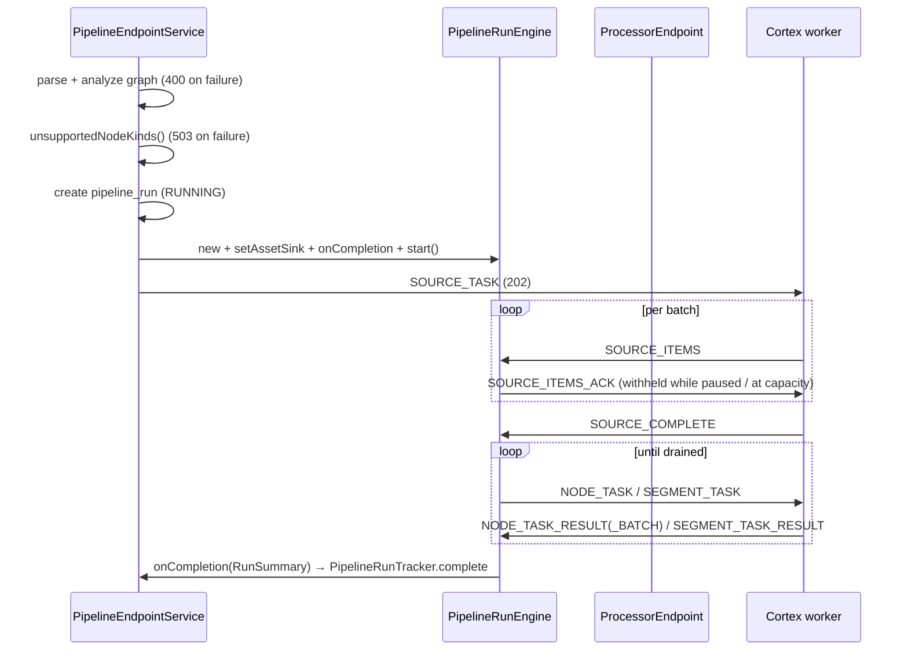

# MetaLoom Pipeline System — Technical Specification

> **Audience: AI coding agents.** This is the reference for how a pipeline is
> **defined, validated, dispatched, executed and recorded**. Source of truth is the
> code; when it disagrees with this file, the code wins — fix this file in the same
> change ([SPEC_RULES.md](../../SPEC_RULES.md)).

**Scope split — do not duplicate these here:**

| Topic | Spec |
|---|---|
| Port model, content types, cardinality, fan-out/gather, coercion, per-kind port tables | [NODE_DATA_TYPES.md](NODE_DATA_TYPES.md) |
| Individual nodes: lifecycle, options, MetaStorage, per-node reference, node restriction | [../pipeline-nodes/NODES.md](../pipeline-nodes/NODES.md) |
| WebSocket framing, auth, reconnect, message-by-message reference | [../../loom/WEBSOCKET.md](../../loom/WEBSOCKET.md) |
| Worker topology, registration, placement, leases, metrics | [../../cortex/METALOOM_ARCHITECTURE.md](../../cortex/METALOOM_ARCHITECTURE.md) |
| Non-technical requirements / actionable tasks | [PIPELINE_REQUIREMENTS.md](PIPELINE_REQUIREMENTS.md) · [PIPELINE_TASKS.md](PIPELINE_TASKS.md) |

---

## 1. TL;DR — the five things to know

1. **Loom owns the graph, Cortex owns one node at a time.** There is no DAG executor
   in Cortex any more. `PipelineRunEngine` (in `loom/pipeline`) decides what runs
   next and dispatches a single `NODE_TASK` (or one `SEGMENT_TASK` per affinity
   group); the worker answers and forgets.
2. **Data is addressed by *port*, never by node id.** Every edge carries
   `sourcePort` + `targetPort`; `PortGraphAnalyzer` type-checks the whole graph at
   save time *and* at run start. See [NODE_DATA_TYPES.md](NODE_DATA_TYPES.md).
3. **`nodes[].dependencies[]` is rejected.** `PipelineGraphParser` throws on it. There
   is no fallback, no positional inference, no legacy alias.
4. **A definition is parsed before a `pipeline_run` row exists.** A graph that cannot
   run as drawn is a `400`; a graph with a kind no online worker accepts is a `503`.
   Neither leaves a row behind.
5. **There is exactly one definition parser** (`PipelineGraphParser`) and exactly one
   result-state mapping (`NodeResultMapper.toWireState`). Both were duplicated once;
   both broke; do not re-fork them.

---

## 2. Architecture

```mermaid
graph TB
    subgraph UI["Loom UI"]
        ED[PipelineEditor.tsx<br/>author · run · versions]
        AR[PipelineArea.tsx<br/>read-only monitor]
    end

    subgraph LOOM["Loom Backend"]
        REST[PipelineEndpoint<br/>/api/v1/pipelines]
        SVC[PipelineEndpointService<br/>CRUD · versions · dispatchRun]
        VAL[PipelineValidationService]
        PAR[PipelineGraphParser<br/>+ PortGraphAnalyzer<br/>+ PipelineSegmenter]
        ENG[PipelineRunEngine<br/>owns the DAG]
        REG[PipelineRunRegistry<br/>live engines]
        STO[DaoRunStateStore<br/>DaoAssetSink]
        TRK[PipelineRunTracker]
        DSP[WebSocketNodeDispatcher]
        PROC[ProcessorEndpoint<br/>/api/v1/processors/ws]
        PREG[ProcessorRegistry]
        AGG[RunStatsAggregator]
        BC[PipelineEventBroadcaster]
        EVW[/api/v1/pipelines/events/ws]
        DB[(pipeline · pipeline_version<br/>pipeline_run · pipeline_run_item<br/>pipeline_node_task)]
    end

    subgraph CORTEX["Cortex Worker"]
        LCC[LoomControlChannel]
        PTH[PipelineTaskHandler]
        NF[RegistryNodeFactory<br/>+ RegistryNodeRegistrar]
        STR[SourceTaskRunner]
        NTR[NodeTaskRunner]
        SGR[SegmentTaskRunner]
        RB[ResultBatcher]
    end

    ED -->|REST CRUD| REST --> SVC --> VAL --> PAR
    SVC --> DB
    SVC --> PAR
    SVC --> ENG
    ENG --> REG
    ENG --> STO --> DB
    ENG --> TRK --> DB
    ENG --> DSP --> PROC
    SVC -->|select worker| PREG --> PROC
    PROC <-->|WebSocket| LCC --> PTH
    PTH --> NF
    PTH --> STR
    PTH --> NTR
    PTH --> SGR
    NTR --> RB --> LCC
    ENG --> AGG --> BC --> EVW --> AR
    EVW --> ED
```

**Two paths back to Loom, do not confuse them:**

| Path | Transport | Carries |
|---|---|---|
| Results | `NODE_TASK_RESULT` / `NODE_TASK_RESULT_BATCH` / `SEGMENT_TASK_RESULT` | Port payloads; persisted to `pipeline_node_task.outputs`, and to the asset when the node is `syncToLoom` |
| Live progress | `RunStatsAggregator` → `PipelineEventBroadcaster` → UI WS | Aggregated per-node counters on a 1 s timer, plus individual failures |

---

## 3. Module map

### Loom

| Module | Role |
|---|---|
| `loom/pipeline` | The whole execution model: `graph/` (parser, analyzer, segmenter, bindings) and `engine/` (`PipelineRunEngine`, `ItemState`, `NodeExecState`, circuit breaker, retry, `PortPayloads`). **No dependency on Loom internals** — dispatch, state and asset persistence are injected as interfaces (`NodeDispatcher`, `RunStateStore`, `AssetSink`), which is what makes the engine testable without a database |
| `loom/services/rest` | `PipelineEndpoint`, `PipelineEndpointService`, `PipelineValidationService`, `PipelineRunTracker`, `PipelineRunRegistry`, `PipelineRunRecovery`, `RunStatsAggregator`, `SourceOptionsResolver`, `DaoRunStateStore`, `DaoAssetSink`, `WebSocketNodeDispatcher`, `ProcessorEndpoint`, `ProcessorRegistry`, `PipelineEventBroadcaster` |
| `loom/db/{api,jooq,flyway}` | `Pipeline`, `PipelineVersion`, `PipelineRun`, `PipelineRunItem`, `PipelineNodeTask` models + DAOs + migrations |
| `loom-shared/pipeline-model` | The wire contract: `NodeTask`, `NodeTaskResult`, `NodeTaskResultBatch`, `SegmentTask(Result)`, `SegmentNode`, `MediaRef`, `PortPayload`, `DataElement`, `Origin`, `NodeState`, `FilterBranch` |
| `loom-shared/node-model` | `NodeDescriptor` + port model + `NodeDescriptorRegistry` (see [NODE_DATA_TYPES.md](NODE_DATA_TYPES.md)) |
| `loom-shared/rest-model` | `PipelineModel` + request/response DTOs, event DTOs, `PipelineModelValidator` |
| `loom-ui/src/features/pipeline` | `PipelineEditor.tsx` (author), `portResolvers.ts`, `contentTypes.ts`, `pipelineDiff.ts` |

⚠️ **`loom/db/memory` has no pipeline DAOs.** Pipelines require the jOOQ backend.

### Cortex

| Module | Role |
|---|---|
| `cortex/node-runtime` | `NodeTaskRunner`, `SegmentTaskRunner`, `SourceTaskRunner`, `ResultBatcher`, `NodeResultMapper`. This is the entire execution surface |
| `cortex/core` | `LoomControlChannel`, `PipelineTaskHandler`, `RegistryNodeFactory`, `LoomBulkSyncWriterImpl`, Dagger wiring |
| `cortex/cli` | `PipelineNodeFactoryModule`, `RegistryNodeRegistrar` — where a kind becomes runnable |
| `cortex/pipeline-api` | `PipelineNode`, `MediaSourceNode`, `NodeMode`, `PipelineResult`, `FilterBranch`, sync/event SPIs |
| `cortex/pipeline-core` | `AbstractPipelineNode`, `AbstractFilterNode` + 8 filters, `AssetSourceNode`, `LoomFetchNode`, `CortexNodeAdapter`; test-jar `AbstractNodeChainTest` |
| `cortex/pipeline-common` | `DefaultPipelineEventBus`, `DefaultLoomBulkSyncCollector` |
| `cortex/api` | `NodeInputs`, `NodeContext`, the typed port API, and the segment-scoped `ArtifactCache` (§7.4) |
| `cortex/nodes/*` | Concrete nodes — see [NODES.md](../pipeline-nodes/NODES.md) |

🔴 **Deleted — every one of these is gone; do not reintroduce or reference them:**
`Pipeline`, `PipelineExecutor`, `ReactivePipelineExecutor`, `DefaultPipeline`,
`DefaultPipelineManager`, `PipelineManager`, `MediaContext`, `PartitionedFlowable`,
`LoomPipelineLoader`, `StubPipelineNode`, `NodeOutputKey`, `PipelineSerializer`,
`PipelineDeserializer`, `PipelineExecutorTest`, `AbstractPipelineNodeTest`.

---

## 4. The definition format

What the UI writes, `PipelineValidationService` validates, `PipelineGraphParser`
parses, and `DemoDatabaseInitializer` seeds:

```json
{
  "version": 1,
  "resultBatchSize": 1,
  "reuseResults": false,
  "nodes": [
    { "id": "pn1", "type": "filesystem-source", "name": "File Source", "x": 60,  "y": 160 },
    { "id": "pn2", "type": "filter",   "name": "Language Filter",  "x": 260, "y": 160 },
    { "id": "pn5", "type": "facedetect",  "blocking": true, "syncToLoom": true,
      "affinity": "video", "options": { "minScore": 0.6 } },
    { "id": "pn6", "type": "facedescription" }
  ],
  "edges": [
    { "id": "pe1", "source": "pn1", "sourcePort": "media",      "target": "pn2", "targetPort": "media" },
    { "id": "pe4", "source": "pn2", "sourcePort": "passed",     "target": "pn5", "targetPort": "image",
      "branch": "PASS" },
    { "id": "pe5", "source": "pn5", "sourcePort": "detections", "target": "pn6", "targetPort": "detections" }
  ]
}
```

- Node `id` is a synthetic graph id (`pn1`); **`type`** is the node kind
  `RegistryNodeFactory` keys on (`kind` is accepted as an alias).
- Node fields: `source` (default: descriptor category is `SOURCE`), `blocking`
  (**default `true`** — failing open would hide errors), `syncToLoom` (default
  `false`), `affinity`, `options`.
- `options` is the documented shape; **`config` is a legacy alias** the editor used
  to write, still read so old definitions keep loading
  ([`readOptions`](../../../loom/pipeline/src/main/java/io/metaloom/loom/pipeline/graph/PipelineGraphParser.java#L255-L269)).
  When both are present `options` wins.
- `x`/`y` are editor-only and ignored.
- `resultBatchSize` (default `1`) and `reuseResults` (default `false`) are
  pipeline-wide.

### 4.1 Edges are port-to-port

🔴 **`sourcePort` and `targetPort` are required on every edge.** The parser throws
`GraphValidationException` without them
([:297-303](../../../loom/pipeline/src/main/java/io/metaloom/loom/pipeline/graph/PipelineGraphParser.java#L297-L303)).

🔴 **`nodes[].dependencies[]` is rejected outright**
([:190-197](../../../loom/pipeline/src/main/java/io/metaloom/loom/pipeline/graph/PipelineGraphParser.java#L190-L197)).
There is no inline fallback and no `applyInlineDependencies` method. A connection
that cannot name its ports cannot be type-checked, so accepting it would mean a
definition that saves clean and starves every node at run time. *A definition with no
`edges` at all is still legal — a single-node pipeline is legitimate.*

- `branch` — optional, `ANY | PASS | REJECT`
  ([:305-314](../../../loom/pipeline/src/main/java/io/metaloom/loom/pipeline/graph/PipelineGraphParser.java#L305-L314)).
  **The key is `branch`**; `edgeType` is not read server-side.
- Dedupe key is the **full port 4-tuple** `(source, sourcePort, target, targetPort)`
  ([:319](../../../loom/pipeline/src/main/java/io/metaloom/loom/pipeline/graph/PipelineGraphParser.java#L319)).
  Keying on the node pair alone silently dropped one of two edges between the same
  nodes on different ports.
- Each edge produces an
  [`InputBinding(targetPort, sourceNodeId, sourcePort, branch)`](../../../loom/pipeline/src/main/java/io/metaloom/loom/pipeline/graph/PipelineGraphParser.java#L322)
  on the **consumer**. Scheduling `dependencies` are derived: one per distinct
  `(source, target)` pair, however many ports it feeds
  ([:326-328](../../../loom/pipeline/src/main/java/io/metaloom/loom/pipeline/graph/PipelineGraphParser.java#L326-L328)).
- `demandedOutputs` is the inverse index: which output ports have at least one
  outgoing edge. Shipped to the worker so a node can skip a branch nobody asked for.

### 4.2 Format version

`version` is a top-level integer.
[`CURRENT_DEFINITION_VERSION = 1`](../../../loom/pipeline/src/main/java/io/metaloom/loom/pipeline/graph/PipelineGraphParser.java#L68)
is what this Loom writes and the highest it reads.

| Case | Behaviour ([`readVersion`](../../../loom/pipeline/src/main/java/io/metaloom/loom/pipeline/graph/PipelineGraphParser.java#L95-L116)) |
|---|---|
| Absent | Treated as **1**. Definitions stored before the field existed run correctly; rejecting them would strand them |
| Non-integer / fractional / `< 1` | `GraphValidationException` |
| `> CURRENT` | Refused **by name**, not half-read — a newer writer may use fields whose absence parses into a valid but *different* graph |

[`stampVersion`](../../../loom/pipeline/src/main/java/io/metaloom/loom/pipeline/graph/PipelineGraphParser.java#L128-L133)
runs on REST create/update and in `DemoDatabaseInitializer`, so the untagged set only
shrinks. An existing `version` is left alone — re-stamping would relabel a definition
an older Loom round-tripped.

**Bump the version** when a change cannot be understood by an older reader (renamed
field, removed field, changed meaning). Purely additive optional fields do not need
one — `syncToLoom`, `affinity`, `options`, `branch`, `resultBatchSize` and
`reuseResults` were all added that way.

### 4.3 Reference definitions

There is **no checked-in definition JSON fixture**. The six pipelines seeded by
`DemoDatabaseInitializer` are the de-facto reference, all port-wired; its
`"Full Processing"` pipeline is the fan-out/gather demo (`facedetect` emits one
element per face, `facedescription` declares a sequence input and runs once).
Nothing in the JSON says so — it follows from the two ports' cardinalities.

---

## 5. Parsing and validation (`loom/pipeline/graph`)

`parse(name, definition, enabled, dryRun, priority)` in three passes: read nodes →
resolve edges into `dependencies` + `conditional` + `bindings` + `demanded` → build
`PipelineGraphNode`s. Then `resolveSourceNode`, then
[`PortGraphAnalyzer.analyze`](../../../loom/pipeline/src/main/java/io/metaloom/loom/pipeline/graph/PipelineGraphParser.java#L246)
over the topological order.

| Class | What it enforces |
|---|---|
| `PipelineGraphParser` | Node ids present + unique; kind present and **known to the registry**; edges reference existing nodes; ports present; edge dedupe; exactly one source |
| `PortGraphAnalyzer` | Port existence, assignability, required-input satisfaction, XOR/EXCLUSIVE groups, multi-edge only into `MANY`, and `SINGLE`/`PER_ELEMENT` classification + `fanOutDriver`. See [NODE_DATA_TYPES.md §6.3](NODE_DATA_TYPES.md) |
| `AffinityValidator` | Produces `AffinityWarning`s for affinity groups that cannot help |
| `PipelineSegmenter` | Splits the graph into maximal **connected** same-affinity segments. The source node is never in one (the engine synthesises its result). A grouping that would create a segment-level cycle is split rather than accepted |

**Source resolution** is deliberately strict: one node with `source: true` wins;
several is an error; none falls back to the single dependency-free node, and *more
than one* candidate is an error. Silently picking the first root is exactly how the
previous loader turned a broken graph into a plausible one-node run.

⚠️ **`new PipelineGraphParser()` disables port checking.** The no-arg constructor
passes a null registry; `PortGraphAnalyzer.analyze` then returns immediately and
every node stays `SINGLE`. Convenient in tests, dangerous in production —
`PipelineRunRecovery` currently uses it.

### 5.1 Validation lives in three places

| Copy | Location | Notes |
|---|---|---|
| `PipelineValidationService` | `loom/services/rest/…/validation/` | **The wired one.** Own structural checks (ids, edge refs, Kahn's cycle detection, reachable-from-source, branch-originates-from-filter) and **delegates all port rules to `PipelineGraphParser`** |
| `PipelineModelValidator` | `loom-shared/rest-model/…/validation/` | Untested, unwired, own copy of Kahn's |
| `validatePipeline()` | `loom-ui/…/PipelineEditor.tsx:2255` | Own TS implementation, plus live `isValidConnection` port checks while drawing |

**Structural** rules are duplicated three ways and will drift. **Port** rules are
not — do not add a second copy of those.

---

## 6. The run engine (`loom/pipeline/engine`)

`PipelineRunEngine` owns one run. It is `synchronized` throughout: a single monitor
over item state, in-flight accounting and dispatch is what makes out-of-order results
and reclaims safe to reason about.

### 6.1 Lifecycle



### 6.2 Key behaviours

| Concern | How |
|---|---|
| Dispatch choke point | `advance(ItemState)` — every path (first dispatch, retry, circuit un-park, capacity release) goes through it, so a single early-return gates them all |
| Fan-out / gather | `ExecutionMode.PER_ELEMENT` nodes are dispatched once per element with `elementSeq`; the gather barrier is `NodeExecState.isSettled()`, not an author-placed merge node ([NODE_DATA_TYPES.md §8](NODE_DATA_TYPES.md)) |
| Input assembly | `buildInputs(state, node, seq)` reads the node's `InputBinding`s; nothing is keyed by node id on the wire |
| Backpressure | `maxInFlight` (default `DEFAULT_MAX_IN_FLIGHT = 256`) plus per-kind bulkheads via `setMaxInFlightForKind`. `whenCapacityAvailable(...)` is how `ProcessorEndpoint` withholds `SOURCE_ITEMS_ACK`, which throttles the **source scan itself** |
| Retry | `RetryScheduler` + exponential backoff from `DEFAULT_RETRY_BASE_DELAY_MS = 1000` capped at `MAX_RETRY_DELAY_MS = 60000` |
| Circuit breaking | `NodeKindCircuitBreaker`, **shared across runs** — a kind broken by a missing model file is broken for everyone |
| Loss / return | `onNodeTaskLost(...)` (lease reclaim) and `onNodeTaskReturned(...)` (worker refused/shed) both unwind the in-flight marker and re-queue |
| Result reuse | `reuseResults` adopts a previous result as **`COMPLETED` carrying its outputs**, never as a skip — a skip carries nothing and downstream would lose the value |
| Source port | `SOURCE_MEDIA_PORT` is the literal `"media"`. A source output port named anything else validates at save time and delivers nothing |

### 6.3 `syncToLoom`

`PipelineRunEngine.syncToLoom(state, result)` hands outputs to the injected
`AssetSink` **only** when the node's result is `COMPLETED`, its outputs are non-empty
*and* the graph node has `syncToLoom: true`. `DaoAssetSink` writes them onto the
asset. Failures are logged, never propagated — losing the write is bad, failing the
run that produced the data is worse.

⚠️ **The Cortex-side `LoomBulkSyncCollector` path is dormant.** It is still wired in
`CortexBindModule` and flushed at shutdown by `CortexImpl`, but **nothing calls
`collect(...)`** in main code. Asset write-back happens on the Loom side now.

### 6.4 Pause / resume / cancel

`PipelineRunEngine.pause()` / `unpause()` (named to avoid a clash with
`resume(boolean)`, which is post-restart recovery). Three gates:

1. `advance(ItemState)` returns early;
2. `releaseCapacityWaiters()` holds waiters while paused;
3. `whenCapacityAvailable(...)` parks a waiter **even when capacity is free**.

Gates 2 and 3 are what make a pause real rather than cosmetic — they stop the source
scan, not just node dispatch. It bites once the in-flight batch drains, so a pause
takes effect within one source batch.

A paused run whose last outstanding work settles **still completes**: `checkComplete()`
clears the flag. Stranding a finished run in `PAUSED` would be worse.

`resumeRun` requires a live engine in `PipelineRunRegistry` and returns **409**
otherwise — flipping a dead row back to `RUNNING` would create a run nothing advances.

### 6.5 Restart recovery

`PipelineRunRegistry` is **in memory** (a Loom restart loses the live engines).
`PipelineRunRecovery` rebuilds them: it loads `RUNNING` **and `PAUSED`** runs,
re-parses the definition, replays settled `pipeline_node_task` rows via
`restoreItem(...)`, and re-applies `engine.pause()` **before** `engine.resume(...)` so
a restart does not silently un-pause a run by dispatching everything that was ready.

### 6.6 Run completion

1. Engine drains → `onCompletion(RunSummary)` → `PipelineRunTracker.complete(...)`.
2. Independently, a worker may send `PIPELINE_RUN_COMPLETED`; `ProcessorEndpoint`
   routes that to the same tracker.
3. `PipelineRunStatusResolver` derives status: no failures → `SUCCESS`;
   `failures >= media` → `FAILED`; otherwise `PARTIAL`. Counters are clamped and
   inconsistent reports fail closed to `FAILED`.

⚠️ **First terminal verdict wins.** The tracker refuses to touch a run already in
`SUCCESS`/`FAILED`/`PARTIAL`/`CANCELLED`. Both paths funnel through it for exactly
this reason — never write run status from anywhere else.

`pause`/`resume` go through a private `transition(...)` that changes **only** the
status, deliberately bypassing `apply(...)` (which stamps `finished` and zeroes all
four counters — right for a verdict, destructive for a suspension).

⚠️ Use `PipelineRunDao.update()`, **not** `store()`, to modify an existing run.
`AbstractJooqDao.store()` is INSERT-only and violates the primary key.

---

## 7. The Cortex runtime (`cortex/node-runtime`)

Five classes; that is the whole thing.

| Class | Contract |
|---|---|
| `NodeTaskRunner` | One `NodeTask` → one `NodeTaskResult`. Knows nothing about dependencies, ordering, filters or run state. A node that throws — including a `ValueCoercionException` on emit — becomes a `FAILED` result rather than propagating |
| `SegmentTaskRunner` | Same work with N > 1, one round trip instead of N. Merges each node's outputs **by port id** into the pool the next node reads. Skips a node whose dependency `FAILED` **only if that node is blocking**, matching the engine exactly. Every node is accounted for — a skip is reported, never omitted |
| `SourceTaskRunner` | Runs a source and streams `MediaRef` batches. **Acks are the backpressure**: send batch → wait for ack (`DEFAULT_ACK_TIMEOUT_MS = 60_000`) → send next. Always terminates with exactly one `sendComplete`. ⚠️ `run(...)` **blocks** — never call it on a Vert.x event loop |
| `ResultBatcher` | Groups results per run. Size comes from the definition's `resultBatchSize`; `batchSize <= 1` sends immediately. `DEFAULT_MAX_HOLD_MS = 500`, and `PipelineTaskHandler` calls `flushExpired()` every **250 ms** (`BATCH_FLUSH_INTERVAL_MS`). The timer is not an optimisation — without it a run's tail never reaches the size threshold and the run never closes |
| `NodeResultMapper` | The single type boundary. Coerces every emitted value against its port's declared content type, stamps each element with an `Origin`, and maps state |

### 7.1 State mapping — one enum each side, mapped explicitly

There is **one** Cortex terminal state, `io.metaloom.cortex.api.node.ResultState`
`{SKIPPED, FAILED, SUCCESS}`, and **one** wire state,
`io.metaloom.loom.pipeline.model.NodeState` `{PENDING, RUNNING, COMPLETED, FAILED,
SKIPPED}`. They are deliberately separate — the internal one may grow implementation
concerns, the wire one is a contract both sides compile against.

`NodeResultMapper.toWireState`:

| `ResultState` | `NodeState` |
|---|---|
| `SUCCESS` | `COMPLETED` |
| `SKIPPED` | `SKIPPED` |
| `FAILED` | `FAILED` |
| `null` | `FAILED` (fail closed) |

`PENDING`/`RUNNING` exist on the wire enum for engine-side bookkeeping; a terminal
result never produces them.

### 7.2 Making a kind runnable

`RegistryNodeRegistrar.registerAll()` populates `RegistryNodeFactory`:

- `filesystem-source` and `asset-source` — always;
- `s3-source` — **only when `S3Support.isActive()`**. Advertising it unconditionally
  would let Loom dispatch a source task the worker cannot serve, surfacing as a dead
  run rather than a missing capability;
- every kind in the `Map<String, Provider<FilesystemNode>>` `@IntoMap @StringKey`
  multibinding, wrapped in a `CortexNodeAdapter`. The `Provider` keeps a node
  uninstantiated until a task of its kind arrives, so booting a worker never
  constructs native detectors and model processors.

**30 multibinding entries + `filesystem-source` + `asset-source` (+ `s3-source` when
S3 is configured) = 33 runnable kinds with S3, 32 without.**

🔴 **`RegistryNodeFactory.createNode()` returns `null` for an unknown kind.** There is
no stub fallback (`StubPipelineNode` is deleted). `NodeTaskRunner` then NPEs on
`node.process(...)`, catches it, and the **task fails** — loudly, which is the point.
Its javadoc still says "falling back to a stub"; that comment is stale.

⚠️ `CortexBootstrapInitializer` holds a `@SuppressWarnings("unused") NodeFactory`
field purely to force Dagger eager instantiation, because
`PipelineNodeFactoryModule.provideNodeFactory` performs the registrar side effect
inside a provider method. Deliberate, but fragile: removing that field silently
disables all real nodes.

### 7.3 The in-process node API — what is still live

`cortex/pipeline-api` + `pipeline-core` survive because a **node** is still a
`PipelineNode` with `process(LoomMedia, NodeInputs)`. Everything about *composing*
them is vestigial:

| Member | Status |
|---|---|
| `process(LoomMedia, NodeInputs)` | **Live** — the only method the runners call |
| `id/name/mode/isBlocking/concurrency/syncToLoom/timeoutMs/options` | Live as metadata |
| `connectTo` / `children` / `dependencies` / `conditionalDependencies` | **Vestigial** — only `AbstractPipelineNode` calls them. Loom owns the graph |
| `cacheProvider()` / all five `NodeCacheProvider` impls | 🔴 **Deleted** (2026-08-02). Never consulted by any runtime path. Result caching that works is `LocalResultCache`; artifact caching is §7.4. Do not reintroduce |
| `initialize()` / `shutdown()` | Never called by the runners |
| `PipelineEventBus`, `PipelineResult` | Wired in Dagger and used by the test harness; no runner publishes to the bus |
| `DefaultLoomBulkSyncCollector` | Wired and flushed at shutdown, but nothing calls `collect(...)` — see §6.3 |
| `apply()` / `isPartitioning()` / `partition()` / `MediaContext` | **Deleted.** Do not reintroduce a reactive-operator node API |

`CortexNodeAdapter` wraps a legacy `FilesystemNode<?,?>` as a `PipelineNode`. It hands
the wrapped node its own **ports** (`NodeInputs`), re-stamps id + measured elapsed via
`NodeResult.withNode(...)`, and preserves state, message and outputs. `syncToLoom` is
**not** a constructor arg — set it after construction.

> The `String id` overload is *not* about data delivery any more. Under the port model
> an edge says where each input comes from, so a node id cannot affect what a node
> receives. `RegistryNodeRegistrar` uses it only to give an adapter a stable pipeline
> id when several instances of one kind appear in a graph.

### 7.4 The artifact scope — sharing an expensive intermediate within a segment

Package `io.metaloom.cortex.api.node.artifact` in **`cortex/api`**.

A node receives its upstream dependencies' **outputs**, and those outputs are serialised
back to Loom. That is the right home for a hash and the wrong home for a 200 MB frame
buffer, so before this existed five nodes needing decoded frames decoded the file five
times — segment dispatch measured **1.01×** per-node dispatch, because the round trips it
saves were never the expensive part.

`NodeInputs.artifacts()` / `NodeContext.artifacts()` is an `ArtifactCache`: somewhere a
node parks a decoded artifact so a later node **in the same segment** reuses it.

| Question | Answer |
|---|---|
| Who owns it | The **segment execution**. Not the node instance (the registry reuses those across items, so it would have to be invalidated by hand) and not the worker (that is the cross-run cache this deliberately is not) |
| Lifecycle | One `ScopedArtifactCache` per `SegmentTaskRunner.run()` / `NodeTaskRunner.run()`, closed on the way out. Item B is handed a different object, so cross-item isolation is structural |
| A node fails | Each node runs inside a `Publication`; the runner commits it only when the node's state is not `FAILED`. What a **failed** node published is discarded and closed — half-built and finished are indistinguishable to the type system. What an **earlier successful** node published is untouched |
| A factory throws | Nothing is published. The next node asking gets a clean attempt, never an inherited verdict |
| A retry after lease expiry | A new `run()` and therefore a new scope. A retry can never repeat a failure by inheriting the state that caused it |
| Memory | Two bounds. *Across* a run: the scope's lifetime — a worker that has done 10 000 items holds what one that has done one holds. *Within* one segment: `Artifact.weightBytes()` against `ScopedArtifactCache.DEFAULT_MAX_BYTES` (512 MiB, a runner constructor arg), LRU eviction |
| `PipelineNode` changes | **None.** It arrives on `NodeInputs`, which every node already gets. Opting in is one call |

```java
private static final ArtifactKey<List<Frame>> KEYFRAMES = ArtifactKey.of("video/keyframes@2fps", List.class);

List<Frame> frames = ctx.artifacts().get(KEYFRAMES, () -> {
    List<Frame> decoded = decode(ctx.media(), 2.0);
    return Artifact.of(decoded, decoded.size() * bytesPerFrame);
});
```

Rules, none of which the mechanism can enforce for you:

- **Treat the artifact as immutable** — the next node gets the same object, not a copy.
- **Do not retain it past `process()`** — after the segment it may be closed underneath you.
  A node that stashes the *scope* itself gets an `IllegalStateException` on the next item.
- **Weigh it honestly**, including memory the heap does not account for. Round up.
- **Encode every parameter in the key id.** `type` is part of key identity, so same-id
  different-type keys are safely two artifacts; same-id *same-type* collisions are yours to avoid.
- **Declare a key both nodes use in one place** — `cortex/common/…/artifact/MediaArtifacts`
  holds the shared ones. Two nodes each declaring their own `"media/image"` is two decodes
  that look like one.

An eviction for capacity drops the reference but does **not** close the artifact: a node
fetched it a moment ago and may still be reading it, and closing a native buffer under a
running node is a segfault where leaving it to the collector is a delay. Closing happens at
scope end, on `invalidate(...)`, and on publication rollback.

**Adopted by:** `QualityNode` and `DominantColorNode`, which both start from
`ImageIO.read` of the same file (`MediaArtifacts.decodedImage(ctx)`). Every other node is
unaffected — outside a segment the scope is `ArtifactCache.noop()`, which computes and
retains nothing, so standalone behaviour is unchanged.

**This is not `LocalResultCache`.** That remembers a node's finished *result* across items
so a second pass skips the work, with the durable copy in Loom. This holds an
*intermediate* that was never a result and is never persisted. Neither replaces the other.

---

## 8. Node descriptors

Package `io.metaloom.loom.nodes.spec` in **`loom-shared/node-model`**. The port model
itself — `PortSpec`, `PortGroup`, `Cardinality`, `ContentTypeRegistry`,
`ContentTypeLattice`, `ValueCoercer`, `NodePortResolver`, per-kind port tables — is
specified in [NODE_DATA_TYPES.md §2-§4](NODE_DATA_TYPES.md). Not repeated here.

**Counts, recounted from code at this HEAD:**

| | Count |
|---|---|
| `NodeDescriptorProvider` implementations (`META-INF/services`) | **26** |
| Kinds declared (`setKind(...)`) | **41** |
| `NodePortResolver` implementations | **3** (`script`, `llm`, `vlm`) |
| Runnable kinds | **33** with S3, **32** without (§7.2) |

⚠️ **A descriptor is not a registration.** Ten descriptor kinds have no runtime
producer: `facedescription`, `loom-fetch`, and the eight `filter-*` kinds. Two
runnable kinds have no descriptor: `asset-source` and `sha512-dedup` (`hash-dedup` has
the descriptor). Enumerated in [NODES.md §12](../pipeline-nodes/NODES.md).

⚠️ Every descriptor advertises a `NODE_STATS` event and a `retryFailed` parameter.
`NODE_STATS` is emitted by `RunStatsAggregator`, not per node; **`retryFailed` is
never read by anything**.

⚠️ **`resolvePorts` is not served over REST.** `NodeDescriptorEndpoint` exposes the
*static* descriptor only, so the editor mirrors the three resolvers in TypeScript
([NODE_DATA_TYPES.md §10](NODE_DATA_TYPES.md)).

⚠️ **Do not confuse** `io.metaloom.loom.nodes.spec.NodeMode` (UI descriptor) with
`io.metaloom.cortex.pipeline.api.NodeMode` (runtime). Same name, distinct types.

---

## 9. Persistence

### 9.1 Migrations

| Migration | Effect |
|---|---|
| `V2.19__add_pipeline.sql` | `pipeline` table + `*_PIPELINE` permissions |
| `V2.29__add_pipeline_run.sql` | `pipeline_run` + `*_PIPELINE_RUN` permissions; documents the status vocabulary as a SQL comment |
| `V2.30__add_pipeline_version.sql` | `pipeline_version` + `CREATE/READ/RESTORE_PIPELINE_VERSION`; **restructures `pipeline`** |
| `V2.31__add_pipeline_execution_state.sql` | `pipeline_run_item` + `pipeline_node_task` (incl. `outputs` JSONB) |
| `V2.32__add_pipeline_run_item_path_index.sql` | Index for per-run item lookup by path |
| `V2.56__pipeline_run_paused_status.sql` | Adds `PAUSED` to the documented status vocabulary |
| `V2.60__pipeline_node_task_element_seq.sql` | `element_seq INTEGER NOT NULL DEFAULT 0`; idempotency key becomes `UNIQUE (item_uuid, node_id, element_seq)` |

**`V2.60` is the fan-out migration.** "One node execution per item" stopped being true
once a node downstream of a `MANY` output runs per element. Existing rows are already
correct under the new key (`element_seq = 0`), so **no backfill is needed**. It also
rewrites the `outputs` column comment: the value is keyed by output **port id**, each
a `PortPayload` ([NODE_DATA_TYPES.md §7](NODE_DATA_TYPES.md)).

🔴 **`pipeline_run_item` is deliberately unchanged.** The fan-out happens *inside* one
item because **the item is the origin** — that is what lets a later node gather the
branches back together per source asset with no lineage columns, no child items and no
second completion model.

**`V2.30` is the disruptive one.** It adds `pipeline.latest_version_uuid`, backfills
every pipeline as version 1, then **drops `name`, `description`, `definition`,
`enabled`, `priority`, `dry_run` from `pipeline`**.

```
pipeline          (uuid, meta, created, creator_uuid, edited, editor_uuid,
                   latest_version_uuid → pipeline_version.uuid)

pipeline_version  (uuid, pipeline_uuid → pipeline, version_number,
                   name, description, definition JSONB, enabled, priority,
                   dry_run, meta, created, creator_uuid)
                   UNIQUE (pipeline_uuid, version_number)
                   -- no edited/editor: versions are immutable by convention

pipeline_run      (uuid, pipeline_uuid → pipeline ON DELETE CASCADE,
                   pipeline_version INT, started, finished, status VARCHAR,
                   media_count, success_count, failure_count, skipped_count,
                   dry_run, error_message, duration_ms, meta, created, …)
```

`pipeline_run.status` — `PENDING, RUNNING, PAUSED, SUCCESS, FAILED, PARTIAL,
CANCELLED` — exists **only as a SQL comment**. There is no enum; the column, the DAO
model and `PipelineRunRecord` all use free-form `String`.

`PAUSED` is **non-terminal** and is deliberately absent from
`PipelineRunStatusResolver.isTerminal`.

### 9.2 Retention — decided, not enforced

A run over 100 000 items across a 10 node graph writes 100 000 `pipeline_run_item`
rows and ~1 M `pipeline_node_task` rows. Nothing deletes any of it today; the sweep is
an open item in
[../../cortex/METALOOM_ARCHITECTURE_TASK.md](../../cortex/METALOOM_ARCHITECTURE_TASK.md) §10.

| State | Kept | Why |
|---|---|---|
| Non-terminal run (`PENDING`/`RUNNING`/`PAUSED`) | Everything, indefinitely | Placement, leases, reclaim and resume all read these rows |
| Terminal, non-failed detail | **7 days** after `finished` | Enough to answer "what did last night's run do?" on Monday |
| Terminal, `FAILED`/`DEAD_LETTER` detail | **30 days** | The rows anyone actually opens, and a small fraction of a healthy run |
| `pipeline_run` row | **Forever** | It already carries all four counters and `duration_ms` |

**The granularity afterwards is the run row** — a swept run still reports how many
items, how many failed and how long; it just cannot name which file. Constraints the
sweep must respect: batch deletes with a `LIMIT` and loop; `pipeline_run_item` cascades
to `pipeline_node_task`, but the failure window means tasks outlive their item, so an
item with retained tasks must not be deleted; **do not touch `asset_node_result`** —
it is per *asset*, catalog state, outliving every run
([../../loom/PERSISTENCE.md](../../loom/PERSISTENCE.md)).

### 9.3 DAOs and versioning

`io.metaloom.loom.db.model.pipeline`: `Pipeline`, `PipelineVersion`, `PipelineRun`,
`PipelineRunItem`, `PipelineNodeTask` + DAOs, all on `DaoCollection`; jOOQ impls in
`loom/db/jooq/…/dao/pipeline/`.

`PipelineEndpointService` semantics:

- **create** — writes `pipeline` + version 1, points `latestVersionUuid` at it.
- **update** — **never mutates a version.** Creates `latest.versionNumber + 1`,
  copying unset fields forward, and repoints the pointer.
- **restore** — copy-forward: creates a *new* version from the old content, **201**.
- **list** — batches latest-version resolution via `loadByUuids` to avoid N+1.
- **delete** — deletes versions in a loop before the pipeline, even though the FK is
  already `ON DELETE CASCADE`.

⚠️ `PipelineDaoImpl.loadWithLatestVersion` **does not load the version** — it is a
plain `selectFrom(PIPELINE)`. Every caller then calls
`pipelineVersionDao.loadLatestByPipeline(...)` separately. The name lies.

⚠️ `PipelineDaoImpl.createPipeline(UUID, String name)` **ignores `name`** — correct
post-refactor, but the parameter is dead weight on the interface.

---

## 10. REST API

`PipelineEndpoint`, base `/api/v1/pipelines`. Full REST conventions:
[../../loom/RESTAPI.md](../../loom/RESTAPI.md).

| Method | Path | Response | Permission |
|---|---|---|---|
| POST | `/` | `PipelineResponse` | `CREATE_PIPELINE` |
| GET | `/` | `PipelineListResponse` | `READ_PIPELINE` |
| GET | `/:uuid` | `PipelineResponse` | `READ_PIPELINE` |
| POST | `/:uuid` | `PipelineResponse` | `UPDATE_PIPELINE` |
| DELETE | `/:uuid` | `GenericMessageResponse` | `DELETE_PIPELINE` |
| POST | `/:uuid/run` | `PipelineRunResponse` (202 / 400 / 503) | `READ_PIPELINE` |
| GET | `/:uuid/runs` | `PipelineRunListResponse` | `READ_PIPELINE` |
| GET | `/runs/stats` | `PipelineRunStatsResponse` | `READ_PIPELINE_RUN` |
| GET | `/:uuid/runs/:runUuid` | `PipelineRunRecord` | `READ_PIPELINE_RUN` |
| GET | `/:uuid/runs/:runUuid/items` | `PipelineRunItemListResponse` | `READ_PIPELINE_RUN` |
| POST | `/:uuid/runs/:runUuid/cancel` | `GenericMessageResponse` | `UPDATE_PIPELINE_RUN` |
| POST | `/:uuid/runs/:runUuid/pause` | `GenericMessageResponse` | `UPDATE_PIPELINE_RUN` |
| POST | `/:uuid/runs/:runUuid/resume` | `GenericMessageResponse` (409 if no live engine) | `UPDATE_PIPELINE_RUN` |
| GET | `/:uuid/versions` | `PipelineVersionListResponse` | `READ_PIPELINE_VERSION` |
| GET | `/:uuid/versions/:version` | `PipelineResponse` | `READ_PIPELINE_VERSION` |
| POST | `/:uuid/versions/:version/restore` | `PipelineResponse` (201) | `RESTORE_PIPELINE_VERSION` |

- Loom uses **POST for both create and update** (not PUT/PATCH).
- `/runs/stats` is a **literal prefix registered before the `:uuid` wildcard** — order
  matters; adding a literal route after it will be shadowed.
- `POST /run` is gated on `READ_PIPELINE`, deliberately — running is not editing.
- Secured paths are enumerated **individually**, specifically so
  `/api/v1/pipelines/events/ws` escapes the auth chain. **A new endpoint is
  unauthenticated until you add it to that list.**
- There is **no `POST /validate`** endpoint.

### 10.1 Dispatch (`dispatchRun`)

1. Load latest version; resolve `dryRun` (request overrides the version).
2. `graphParser.parse(...)` — `GraphValidationException` ⇒ `dispatched=false`, **400**,
   **no `pipeline_run` row**, `metrics.recordRunRejected("invalid_graph")`.
3. `unsupportedNodeKinds(graph, processorRegistry)` — **every** kind in the graph, not
   just the source, must have an online CPU-capable worker whose whitelist/blacklist
   accepts it. Otherwise **503** naming the kinds, and **no row**. (A run whose
   downstream `whisper` node nobody accepts would otherwise start green and stall.)
4. Create `pipeline_run` with status `"RUNNING"`.
5. Build the engine: `DaoRunStateStore`, `DaoAssetSink`, `onCompletion → tracker`,
   `RunStatsAggregator` on a `STATS_INTERVAL_MS = 1000` Vert.x timer, shared circuit
   breaker, Vert.x-timer retry scheduler. Register in `PipelineRunRegistry`, `start()`.
6. Send `SOURCE_TASK` — **202**. If the socket is already gone: unregister and
   `pipelineRunTracker.fail(...)`, **503**.

There is **no ack watchdog**: an unavailable processor is caught synchronously.

**Run-request selection** (`SourceOptionsResolver`, unit-tested free of DB and
transport): precedence **`mediaUuids` > `pathGlobs` > `path`**. `path` applies only
when no globs were given — the two mean different things to a source node
(`pathGlobs` forces a full re-walk; a bare `path` runs the differential scan against
the persisted per-root index). A single resolved asset clears inherited `pathGlobs`,
so running a pipeline for one asset does not re-scan the whole library.
⚠️ Paths are resolved on the **worker**, so a path the chosen processor cannot see
yields an empty run rather than an error.

`runForAsset(...)` is the asset-created auto-trigger; it calls `dispatchRun` directly
with no routing context.

### 10.2 DTOs (`loom-shared/rest-model/…/pipeline/`)

`PipelineModel<T>` is the flattened pipeline+version view (`versionUuid`,
`versionNumber`, `name`, `description`, `definition`, `enabled`, `dryRun`,
`priority`); `PipelineModelBuilder` folds `Pipeline` + `PipelineVersion` into it, and
creator/editor status comes from the **version**.

⚠️ `PipelineRunRecord.started`/`finished` are **ISO-8601 Strings** and `status` is a
`String`.

---

## 11. Loom ↔ Cortex protocol

Framing, auth, reconnect and the per-message reference live in
[../../loom/WEBSOCKET.md](../../loom/WEBSOCKET.md); worker registration, placement and
leases in [../../cortex/METALOOM_ARCHITECTURE.md](../../cortex/METALOOM_ARCHITECTURE.md).
Only the pipeline-specific parts are here.

`ProcessorMessageType`: `REGISTER, HEARTBEAT, STATUS_UPDATE, STATE_CHANGE,
PIPELINE_EVENT, PIPELINE_RUN_COMPLETED, SOURCE_ITEMS, SOURCE_COMPLETE,
NODE_TASK_RESULT, TASK_RETURNED, REGISTERED, HEARTBEAT_ACK, SOURCE_TASK,
SOURCE_ITEMS_ACK, NODE_TASK, SEGMENT_TASK, SEGMENT_TASK_RESULT,
NODE_TASK_RESULT_BATCH, ERROR`

**What a `NODE_TASK` carries** (`NodeTask`, `loom-shared/pipeline-model`):

| Field | Meaning |
|---|---|
| `taskUuid`, `runUuid`, `itemId`, `nodeId`, `nodeKind` | Identity |
| `media : MediaRef` | The item, ambient — a locator, never bytes. Carries `mediaType`, size and known sha512 |
| `inputs : Map<String, PortPayload>` | Keyed by **the receiving node's own input port ids**. Built by `PipelineRunEngine.buildInputs(state, node, seq)` from the wired `InputBinding`s |
| `elementSeq : int` | Which element of a fanned-out sequence; `0` for a once-per-item node. Echoed back so the engine routes the result to the right slot |
| `demandedOutputs : Set<String>` | Output ports with at least one outgoing edge. Read as `ctx.isDemanded(PORT)`. Emitting an undemanded port stays legal — it is still persisted, which keeps diagnostics useful |
| `options`, `resultBatchSize` | Per-instance node options; batch size for `ResultBatcher` |

`NODE_TASK_RESULT` carries `outputs : Map<String, PortPayload>` keyed by output port id
plus the same `elementSeq`. `SEGMENT_TASK` carries `getInputs()` and a list of
`SegmentNode`s.

⚠️ **`SegmentNode` carries no input bindings**, so a segment-internal edge is matched
by **port id alone**: a node reading `text` picks up whatever earlier node in the
segment emitted a port called `text`. Engine-level dispatch has the real bindings and
does not rely on this — until the segment wire model carries them, do not group nodes
whose port ids collide with a different meaning.

**Nodes never see a node id.** Envelope, coercion rules and fan-out semantics:
[NODE_DATA_TYPES.md §7-§8](NODE_DATA_TYPES.md).

### 11.1 UI event socket

`GET /api/v1/pipelines/events/ws` — registered `.order(-1000)` so the upgrade beats the
wildcard auth routes. Read-only; optional `?pipeline=` / `?run=` filters; invalid token
closes with `4401`.

`PipelineEventBroadcaster` keeps a `ConcurrentHashMap<ServerWebSocket, Subscriber>`,
encodes JSON lazily only when a subscriber matches, removes closed sockets inline, and
**drops messages when `ws.writeQueueFull()`**, counting drops and logging every 100th.

⚠️ `Subscriber`'s `queueCapacity` constructor arg is never stored;
`DEFAULT_QUEUE_CAPACITY = 1024` is dead. Backpressure is purely `writeQueueFull()`.

**Progress is aggregated, not streamed.** `RunStatsAggregator` accumulates per-node
`completed`/`failed`/`skipped` counters and flushes them on the 1 s timer; only
**failures** go out immediately, because they are rare, individually actionable, and
the one thing an operator needs promptly. Forwarding every settle would be millions of
frames to move a percentage bar.

---

## 12. Configuration

### Loom

| Setting | Where | Default |
|---|---|---|
| `LOOM_WS_STRICT_AUTH` | env / JVM property, read by `WebSocketAuthenticator` | unset ⇒ lenient (WS upgrade allowed without a token) |
| `PipelineRunEngine.maxInFlight` | `setMaxInFlight(int)` | `256` (`DEFAULT_MAX_IN_FLIGHT`) |
| Per-kind bulkhead | `setMaxInFlightForKind(kind, max)` | unbounded |
| Retry backoff base | `setRetryBaseDelayMs(long)` | `1000`, capped at `MAX_RETRY_DELAY_MS = 60000` |
| Stats flush interval | `PipelineEndpointService.STATS_INTERVAL_MS` | `1000` ms |
| `resultBatchSize`, `reuseResults` | pipeline definition JSON | `1`, `false` |
| Permissions | `*_PIPELINE`, `*_PIPELINE_RUN`, `*_PIPELINE_VERSION` | — |

⚠️ None of the engine tunables is env-configurable — they are code defaults with
setters, wired in `PipelineEndpointService`.

### Cortex

| Setting | Where | Default |
|---|---|---|
| Source ack timeout | `SourceTaskRunner.DEFAULT_ACK_TIMEOUT_MS` | `60_000` ms |
| Result batch hold | `ResultBatcher.DEFAULT_MAX_HOLD_MS` | `500` ms |
| Result flush tick | `PipelineTaskHandler.BATCH_FLUSH_INTERVAL_MS` | `250` ms |
| Node concurrency / mode / blocking / `timeoutMs` | definition JSON, else `CortexOptions.getDefaultTimeoutMs(kind)` | `PARALLEL`, blocking `true`, concurrency `1`, timeout `0` |
| Control-channel endpoint | `LoomControlChannel.resolveEndpoint()` from `LoomClientOptions` | unset ⇒ disabled |
| S3 (gates `s3-source`) | `CORTEX_S3_*` / `--s3-*`; index dir needs `--s3-index-path` or `--meta-path` | inactive |

Config precedence: CLI flags → env (`EnvDefaultProvider`, picocli) → YAML
(`~/.config/metaloom/cortex.yml`) → defaults. Details:
[../../cortex/CONFIGURATION.md](../../cortex/CONFIGURATION.md).

⚠️ **`CortexOptions.maxConcurrentMedia` (default 4) is dead config** — its only caller
was the deleted `ReactivePipelineExecutor`. `CORTEX_PIPELINE_MAX_CONCURRENT`,
`CORTEX_PIPELINE_DRY_RUN` and `LOOM_WS_PATH` never existed.

---

## 13. Test setup

**Prerequisite for anything touching the DB:** the shared `testdatabase-provider`
container must expose a pool named `loom-dev`. Run `./setup-pool.sh` from the repo
root first (and again after any Flyway change), or tests fail at
`ProviderExtension.beforeEach` with `Got error from server {Pool not found
{loom-dev}}`. That is an environment issue, not a code issue.

### 13.1 Where the coverage is

| Area | Tests |
|---|---|
| Parser / graph | `PipelineGraphParserTest`, `PortGraphAnalyzerTest`, `PipelineSegmenterTest`, `PipelineNodeOptionsParsingTest`, `PipelineAffinitySerdeTest` |
| Engine | `PipelineRunEngineTest` + `…FanOutTest`, `…RecoveryTest`, `…PauseTest`, `…CancelTest`, `…RetryTest`, `…ReturnTest`, `…ReuseTest`, `…SegmentTest`, `…CircuitTest`, `…BulkheadTest`, `…BackpressureTest`, `…FlowControlTest`, `…PersistenceTest` |
| Cortex runtime | `NodeTaskRunnerTest`, `SegmentTaskRunnerTest`, `SourceTaskRunnerTest`, `ResultBatcherTest`, `PipelineTaskHandlerDrainTest` |
| Node registration | `RegistryNodeFactoryTest`, `NodeRegistrarTest`, `PipelineConfigurableTest` |
| Loom REST | `PipelineValidationServiceTest`, `PipelineRunStatusResolverTest`, `PipelineRunCapabilityTest`, `PipelineRunEndToEndTest`, `PipelineMatcherTest`, `PipelineEventBroadcasterTest`, `SegmentProtocolSerdeTest`, `ProcessorEndpointTest`, `PipelineEventEndpointTest`, `CombinedEndpointTest` |
| DAO | `PipelineDaoTest`, `PipelineVersionDaoTest`, `PipelineRunDaoTest`, `PipelineNodeTaskDaoTest` |
| Cross-tree ports | `integration-test/…/NodePortConformanceTest` — reflects over every node's `IN_*`/`OUT_*` constants and holds them against its descriptor |

### 13.2 Node tests — use the chain base class

Extend **`AbstractNodeChainTest`** (`cortex/pipeline-core` **test-jar**;
`io.metaloom.cortex.pipeline.test`). It replaced `AbstractPipelineNodeTest`; **19 test
classes extend it**. It builds a linear chain, feeds each node's outputs into the next
**by port id**, and exposes `CapturingNode(id, port)`, `StubLoomMedia`, and the
`PipelineAssertions` / `PipelineResultAssert` / `PipelineNodeResultAssert` AssertJ
helpers.

**Rule:** use the AssertJ helpers rather than raw `assertEquals` on output maps — they
produce failure messages that name the port. Legacy-tree asserts live in
`cortex/core-media/src/test/…/assertj/`.

### 13.3 Known gaps

- `cortex/pipeline-common` has **no test directory at all** — five caches, the event
  bus and the sync collector are uncovered (all currently unreachable at runtime).
- No test for `LoomControlChannel` or `CortexNodeAdapter`'s adapter contract directly.
- `PipelineModelValidator` (the shared-model copy) is untested.
- No Java test for `POST /:uuid/run` dispatch shape or `DELETE /:uuid` cascade;
  versioning REST is covered only by mocked Playwright specs (the Java
  `PipelineMethods` client lacks the version/run methods).
- DAO tests never exercise `loadWithLatestVersion`, `loadByUuids`,
  `loadByPipelineAndVersion`, `loadLatestByPipeline`.
- Missing per [NODE_DATA_TYPES.md §11](NODE_DATA_TYPES.md): `PortPayload` round trip,
  `ValueCoercer`, Playwright coverage of XOR siblings and `MANY` handle rendering.

---

## 14. Key Classes Reference

| Class | Package | Purpose |
|---|---|---|
| `PipelineGraphParser` | `io.metaloom.loom.pipeline.graph` | **The single definition parser.** Version check, port-to-port edges, `InputBinding`, dependency derivation, source resolution |
| `PortGraphAnalyzer` | `…pipeline.graph` | Port validation + `SINGLE`/`PER_ELEMENT` classification + `fanOutDriver` |
| `InputBinding` / `ExecutionMode` | `…pipeline.graph` | One wired edge seen from the consumer; how often a node runs per item |
| `PipelineGraph` / `PipelineGraphNode` | `…pipeline.graph` | Parsed graph + topological order; per-node kind, flags, bindings, demanded outputs |
| `PipelineSegmenter` / `PipelineSegment` | `…pipeline.graph` | Affinity segmentation (connected, acyclic, source excluded) |
| `AffinityValidator` / `AffinityWarning` | `…pipeline.graph` | Warns about affinity groups that cannot help |
| `PipelineRunEngine` | `io.metaloom.loom.pipeline.engine` | Loom-side DAG driver: per-element dispatch, `buildInputs`, gather barrier, capacity, retry, pause |
| `ItemState` / `NodeExecState` | `…pipeline.engine` | Per-item and per-node/per-element state. `isSettled()` **is** the gather barrier |
| `NodeKindCircuitBreaker` / `RetryScheduler` | `…pipeline.engine` | Cross-run breaker; injected backoff timer |
| `RunStateStore` / `AssetSink` / `NodeDispatcher` | `…pipeline.engine` | The three injected seams that keep `loom/pipeline` free of Loom internals |
| `PortPayloads` | `…pipeline.engine` | `PortPayload` ⇄ JSONB codec for `pipeline_node_task.outputs` |
| `PipelineEndpointService` | `io.metaloom.loom.rest.service.impl` | CRUD, versioning, `dispatchRun`, run queries, pause/resume/cancel |
| `PipelineRunTracker` | `…rest.service.impl` | Closes runs; first-terminal-verdict-wins; pause/resume transition |
| `PipelineRunRegistry` | `…rest.service.impl` | In-memory map of live engines; self-cleaning on completion |
| `PipelineRunRecovery` | `…rest.service.impl` | Rebuilds engines for `RUNNING`/`PAUSED` runs after a restart |
| `RunStatsAggregator` | `…rest.service.impl` | Per-node counters on a timer; failures immediate |
| `SourceOptionsResolver` | `…rest.service.impl` | `mediaUuids` > `pathGlobs` > `path` precedence |
| `DaoRunStateStore` / `DaoAssetSink` | `…rest.service.impl` | Postgres-backed run state; `syncToLoom` write-back onto assets |
| `WebSocketNodeDispatcher` | `…rest.service.impl` | Sends `NODE_TASK`/`SEGMENT_TASK` to a worker socket |
| `PipelineValidationService` | `io.metaloom.loom.rest.validation` | Structural checks + delegates port rules to the parser |
| `PipelineEventBroadcaster` | `…rest.service.impl` | Fan-out to UI WS subscribers, drop-on-full |
| `NodeTaskRunner` / `SegmentTaskRunner` / `SourceTaskRunner` / `ResultBatcher` | `io.metaloom.cortex.runtime` | The entire Cortex execution surface |
| `NodeResultMapper` | `io.metaloom.cortex.runtime` | Emit-side type boundary; `ResultState` ⇄ `NodeState` |
| `RegistryNodeFactory` | `io.metaloom.cortex.pipeline.loader` | kind → producer; **returns `null` on unknown** |
| `RegistryNodeRegistrar` | `io.metaloom.cortex.cli.dagger` | Where kinds become runnable (sources + multibinding) |
| `PipelineTaskHandler` / `LoomControlChannel` | `io.metaloom.cortex.impl.loom` | Worker-side task dispatch and the WS client |
| `CortexNodeAdapter` | `io.metaloom.cortex.pipeline.core.node` | Legacy `FilesystemNode` → `PipelineNode` bridge |
| `AbstractNodeChainTest` | `io.metaloom.cortex.pipeline.test` (test-jar) | Port-keyed node chain harness — 19 subclasses |

---

## 15. Where do I find …?

| Need | Path |
|---|---|
| Definition parsing (the only parser) | `loom/pipeline/…/graph/PipelineGraphParser.java` |
| Port validation + fan-out classification | `loom/pipeline/…/graph/PortGraphAnalyzer.java` |
| Affinity segmentation | `loom/pipeline/…/graph/PipelineSegmenter.java` |
| Run engine | `loom/pipeline/…/engine/PipelineRunEngine.java` |
| Per-element state / gather barrier | `loom/pipeline/…/engine/{ItemState,NodeExecState}.java` |
| Run dispatch, versioning, run queries | `loom/services/rest/…/service/impl/PipelineEndpointService.java` |
| Run lifecycle helpers | `loom/services/rest/…/service/impl/PipelineRun{Tracker,Registry,Recovery,StatusResolver}.java` |
| Server-side validation | `loom/services/rest/…/validation/PipelineValidationService.java` |
| REST routes | `loom/services/rest/…/endpoint/impl/PipelineEndpoint.java` |
| Cortex execution | `cortex/node-runtime/…/runtime/` |
| Worker-side task handling / WS client | `cortex/core/…/impl/loom/{PipelineTaskHandler,LoomControlChannel}.java` |
| Node kind registration | `cortex/cli/…/dagger/{RegistryNodeRegistrar,PipelineNodeFactoryModule}.java` |
| Node base classes + filters + adapter | `cortex/pipeline-core/…/node/` |
| Node test harness | `cortex/pipeline-core/src/test/…/test/AbstractNodeChainTest.java` |
| Node descriptors + port model | `loom-shared/node-model/…/nodes/spec/` |
| Wire model | `loom-shared/pipeline-model/…/pipeline/model/` |
| DAO API / impl | `loom/db/api/…/model/pipeline/`, `loom/db/jooq/…/dao/pipeline/` |
| SQL migrations | `loom/db/flyway/…/db/migration/V2.{19,29,30,31,32,56,60}*` |
| Demo definitions (de-facto fixtures) | `loom/core/…/boot/DemoDatabaseInitializer.java` |
| UI editor + port mirrors | `loom-ui/src/features/pipeline/{PipelineEditor,portResolvers,contentTypes}.*` |
| UI live monitor / API clients | `loom-ui/src/Pipeline/PipelineArea.tsx`, `loom-ui/src/api/{pipelines,pipelineEvents}.ts` |
| MCP tools (chat: list / show a pipeline) | `loom/services/mcp/…/tool/impl/{ListPipelinesTool,GetPipelineTool}.java` — [MCP.md §5.6–5.7](../../loom/MCP.md) |
| Compact graph rendering in chat | `loom-ui/src/features/chat/{PipelineGraphCard.tsx,pipelineGraphLayout.ts}` — [ui/CHAT.md §6.1](../../loom/ui/CHAT.md) |

---

## 16. Conventions and Gotchas

| Area | Convention / Gotcha |
|---|---|
| **Loom owns the graph** | Cortex runs one node (or segment) at a time. Never reintroduce a DAG executor on the worker |
| **Every edge carries `sourcePort` + `targetPort`** | The parser rejects the definition otherwise. The branch key is `branch`, not `edgeType` |
| **`nodes[].dependencies[]` throws** | No inline fallback exists. A definition with *no* `edges` is still legal (single-node pipeline) |
| **A node never names another node** | Data is addressed by port; the engine resolves which upstream `(node, port)` fills each input. Never reintroduce a node-id-keyed lookup |
| **Port rules live in the parser** | `PipelineValidationService.validatePorts` delegates. Do not add a second copy. *Structural* rules are still triplicated (§5.1) |
| **`new PipelineGraphParser()` disables port checking** | Null registry ⇒ `PortGraphAnalyzer.analyze` returns immediately, every node stays `SINGLE`. `PipelineRunRecovery` uses it |
| **Exactly one source node** | Declared `source: true` wins; ambiguity is an error, never a guess |
| **A source's output port must be named `media`** | `PipelineRunEngine.SOURCE_MEDIA_PORT` is the literal `"media"` |
| **`blocking` defaults to `true`** | A failed dependency stops downstream work unless the author opts out. Failing open would hide errors |
| **One `ResultState`, one wire `NodeState`, one mapping** | `NodeResultMapper.toWireState`: SUCCESS→COMPLETED, SKIPPED→SKIPPED, FAILED/null→FAILED. Never map states anywhere else |
| **Two `NodeMode` types** | `cortex.pipeline.api.NodeMode` (runtime) vs `loom.nodes.spec.NodeMode` (UI descriptor) |
| **Blocking dependency failure ⇒ skip downstream** | Enforced identically by the engine *and* `SegmentTaskRunner`. If the two diverged, moving a node into an affinity group would change what the pipeline does |
| **`syncToLoom` only fires on `COMPLETED` with non-empty outputs** | And only via `PipelineRunEngine` → `AssetSink`. The Cortex-side collector is dormant |
| **`createNode` returns `null` for an unknown kind** | The task then fails loudly. There is no stub node; its javadoc still claims otherwise |
| **A descriptor is not a registration** | Adding ports makes a kind visible in the palette; running it needs `@Binds @IntoMap @StringKey` or `factory.register(...)` |
| **`SourceTaskRunner.run()` blocks** | Never call it from a Vert.x event loop |
| **The result-batch timer is correctness, not tuning** | Without `flushExpired()` every batched run's tail is stranded and the run never closes |
| **`SegmentNode` has no bindings** | Segment-internal wiring is matched by port id alone — do not group nodes whose port ids collide with a different meaning |
| **Pause must gate capacity, not just dispatch** | Withholding `SOURCE_ITEMS_ACK` is what actually stops the scan |
| **Use `PipelineRunDao.update()`, not `store()`** | `AbstractJooqDao.store()` is INSERT-only |
| **First terminal verdict wins** | Only `PipelineRunTracker` writes run status |
| **Pipeline versions are immutable** | update and restore both copy forward; never mutate a `pipeline_version` row |
| **REST uses POST for update** | Not PUT/PATCH. `/runs/stats` must stay registered before the `:uuid` wildcard |
| **Secured REST paths are enumerated individually** | A new pipeline endpoint is unauthenticated until you add it |
| **`pipeline_run_item` stays per item** | The item *is* the origin. Do not add child items or lineage columns for fan-out |
| **`loom/db/memory` has no pipeline DAOs** | Pipelines require the jOOQ backend |
| **New DB fields** | Flyway migration + `loom/db/jooq/generate.sh` + `db/api` change + jooq/memory impls + `db/api-test` contract test + `./setup-pool.sh` |
| **Dead but present** | `PipelineEventBus`; `DefaultLoomBulkSyncCollector.collect`; `connectTo`/`children`; `CortexOptions.maxConcurrentMedia`; `retryFailed`; `Subscriber.queueCapacity`. Do not build on them without wiring them first |
| **Two caches, two jobs** | `LocalResultCache` = a node's finished *result*, across items, durable copy in Loom. `ArtifactCache` (§7.4) = an *intermediate*, one segment, never persisted. Do not add a third |

---

## 17. Progress Assessment

### Working end-to-end

- [x] One definition parser (`PipelineGraphParser`) with a versioned format, port-to-port
      edges, 4-tuple dedupe and an explicit rejection of `dependencies[]`
- [x] Whole-graph port type-checking at save time and run start (`PortGraphAnalyzer`)
- [x] Loom-side DAG execution: per-element dispatch, implicit gather, capacity,
      per-kind bulkheads, retry with backoff, cross-run circuit breaker
- [x] Affinity segmentation with engine-identical local skip semantics
- [x] Durable run state (`pipeline_run_item` / `pipeline_node_task`) and restart
      recovery, including `PAUSED` runs re-paused before resume
- [x] Pause / resume / cancel that gate the source scan, not just dispatch
- [x] `syncToLoom` write-back onto assets via `DaoAssetSink`
- [x] Run completion with real durations and counters; first-terminal-verdict-wins
- [x] Synchronous rejection of unrunnable runs: 400 (invalid graph) / 503 (no worker
      accepts some kind), neither leaving a `pipeline_run` row
- [x] Cortex reduced to five runtime classes; source ack backpressure; result batching
      with a correctness timer
- [x] Aggregated progress events (per-node counters on a 1 s timer, failures immediate)
- [x] Pipeline CRUD + immutable versioning + restore; run history, single-run and
      run-item queries; cross-pipeline run stats
- [x] Editor writes `sourcePort`/`targetPort`/`branch` and validates connections live
      against the served port model
- [x] jOOQ regenerated for `V2.60`; `loom/services/rest` compiles

### Open

**Serious:**

- [x] ~~Node caching is entirely unreachable~~ — resolved 2026-08-02: `cacheProvider()`
      and the five `NodeCacheProvider` impls are deleted; the segment-scoped
      `ArtifactCache` (§7.4) replaces the part that was actually wanted
- [ ] Structural validation is triplicated (`PipelineValidationService`,
      `PipelineModelValidator`, the editor); no standalone validation endpoint
- [ ] `PipelineRunRecovery` uses the **no-arg** parser, so recovered runs skip port
      checking and every node is classified `SINGLE`
- [ ] Java `PipelineMethods` lacks run/version methods, so those REST surfaces have no
      Java test

**Known debt:**

- [ ] `loadWithLatestVersion` does not load the version; `createPipeline` ignores `name`
- [ ] Run status is an untyped `String` with the vocabulary only in a SQL comment
- [ ] Processor capability is hardcoded to `CPU` in `unsupportedNodeKinds`/dispatch
- [ ] Run-state retention is decided but not enforced (§9.2)
- [ ] `retryFailed` advertised by every descriptor, read by nothing
- [ ] 10 descriptor kinds have no runtime producer; `asset-source` and `sha512-dedup`
      have no descriptor
- [ ] `SegmentNode` carries no input bindings — segment-internal edges match by port id
- [ ] Orphaned SPIs: `PipelineFilter`/`MediaFilter`; dormant `LoomBulkSyncCollector`
- [ ] No pipeline DAOs in `loom/db/memory`; no pipeline gRPC surface
- [ ] `Subscriber.queueCapacity` / `DEFAULT_QUEUE_CAPACITY` are dead

See [PIPELINE_TASKS.md](PIPELINE_TASKS.md) for the actionable breakdown and
[NODE_DATA_TYPES.md §17](NODE_DATA_TYPES.md) for port-model progress.

---

_Git HEAD revision: `499f71f7`_
_Last updated: 2026-08-01 (rewritten against the Loom-owns-the-graph runtime: deleted the Cortex DAG-executor sections, corrected the `dependencies[]` and parser-anchor claims, unified the state-mapping and kind-count numbers, and cut content now owned by NODE_DATA_TYPES.md, NODES.md, WEBSOCKET.md and METALOOM_ARCHITECTURE.md.)_
