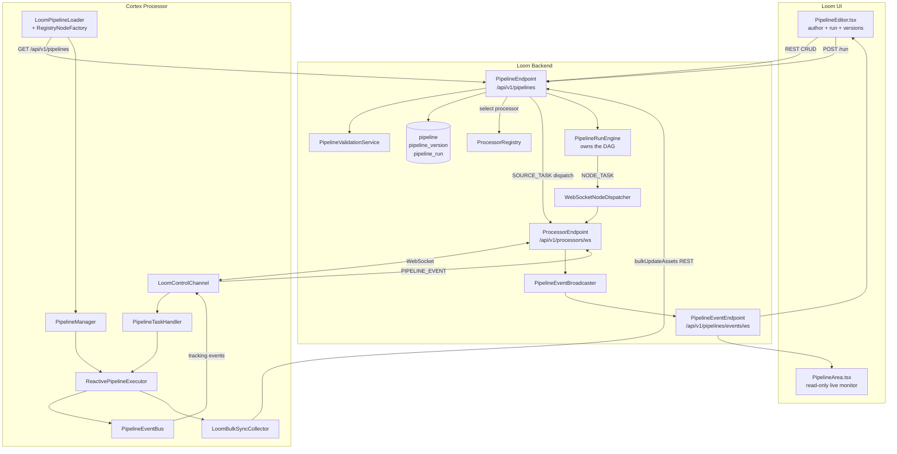

# MetaLoom Pipeline System — Technical Specification

> **Audience: AI coding agents.** This is the single technical reference for
> the MetaLoom pipeline feature. It covers the Cortex execution engine *and*
> the Loom-side persistence, REST, and event bridge.
>
> **Source of truth is the code**, not this document. Everything here was
> verified against the tree on 2026-07-18. If you find a contradiction, the
> code wins — and fix this file in the same change.
>
> **Companions:** [PIPELINE_REQUIREMENTS.md](PIPELINE_REQUIREMENTS.md)
> (non-technical requirements + gap status) and
> [PIPELINE_TASKS.md](PIPELINE_TASKS.md) (actionable work items).
> The Cortex *node* system (lifecycle, MetaStorage, per-node reference) is
> specified separately in [../pipeline-nodes/NODES.md](../pipeline-nodes/NODES.md).

---

## 1. TL;DR

- A **pipeline** is a directed acyclic graph (DAG) of **PipelineNode**s that
  Cortex runs against a stream of `LoomMedia` items.
- Everything is built on **RxJava 3** (`Flowable`, `Single`). Backpressure and
  per-node concurrency are first-class. There is no `CompletableFuture`
  executor — if you find a reference to `DAGPipelineExecutor`, it is stale.
- Each pipeline has **exactly one source node**; other nodes are discovered by
  walking the connection graph.
- Definitions are **authored in the Loom UI**, **stored on Loom** as immutable
  **versions**, **pulled by Cortex**, and **executed on Cortex**.
- Cortex emits **tracking events** back to Loom over the processor WebSocket;
  Loom re-broadcasts them to UI clients.
- Two independent node hierarchies exist and are bridged by
  `CortexNodeAdapter` — see §7. Do not mix them without the adapter.

### The one thing to know before touching this feature

🔴 **Loom and Cortex do not agree on the definition JSON schema.** Loom stores
and validates a graph as `nodes[]` **plus a top-level `edges[]` array**.
`LoomPipelineLoader` on the Cortex side reads `nodes[].dependencies[]` and
**never looks at `edges`**. A pipeline authored in the UI therefore loads on
Cortex as N disconnected, dependency-free nodes; `DefaultPipeline`'s BFS from
the source then discovers **only the source node itself**. Everything
downstream is silently dropped. No test covers the loader, which is why this
survived. See §9.2 and [PIPELINE_TASKS.md](PIPELINE_TASKS.md) Task 1.

This still defeats the feature end-to-end: a run now reports its outcome
correctly (see below), but it reports on a one-node graph. Treat everything
else as secondary.

> **Run completion was fixed on 2026-07-18** (Task 2). Runs now transition out
> of `RUNNING` with real durations and counters — see §12.3.1. Older notes
> claiming `handlePipelineRunCompleted` is a `TODO` are stale.

---

## 2. Architecture



**Two data paths back to Loom, do not confuse them:**

| Path | Transport | Carries |
|---|---|---|
| Live progress | Processor WebSocket → broadcaster → UI WebSocket | `PipelineEventMessage` (scalars only) |
| Result data | REST `bulkUpdateAssets` | Node outputs for `syncToLoom=true` nodes, as asset metadata |

---

## 3. Module Map

### Cortex

| Module | Role |
|---|---|
| `cortex/pipeline-api` | SPI: `Pipeline`, `PipelineNode`, `PipelineExecutor`, `PipelineManager`, `NodeResult`, `NodeState`, `NodeMode`, `MediaContext`, `PartitionedFlowable`, event/cache/sync interfaces |
| `cortex/pipeline-core` | `DefaultPipeline`, `DefaultPipelineManager`, `ReactivePipelineExecutor`, `AbstractPipelineNode`, `AbstractFilterNode` + 8 filters, `AssetSourceNode`, `LoomFetchNode`, `CortexNodeAdapter`, JSON serde |
| `cortex/pipeline-common` | `DefaultPipelineEventBus`, cache impls, `DefaultLoomBulkSyncCollector` |
| `cortex/common/…/node` | Legacy base classes: `AbstractCortexNode`, `AbstractFilesystemNode`, `AbstractMediaNode` |
| `cortex/nodes/` | Concrete processing nodes + `common-api`/`filter-api`/`source-api` descriptor providers |
| `cortex/core` | Runtime wiring, `LoomPipelineLoader`, `RegistryNodeFactory`, `LoomControlChannel`, `PipelineTaskHandler` |
| `cortex/cli` | `PipelineNodeFactoryModule` (node type registration), `NodeCollectionModule` |

### Loom

| Module | Role |
|---|---|
| `loom/db/api` | `Pipeline`, `PipelineVersion`, `PipelineRun` models + DAO interfaces |
| `loom/db/jooq` | jOOQ DAO implementations |
| `loom/db/flyway` | `V2.19__add_pipeline.sql`, `V2.29__add_pipeline_run.sql`, `V2.30__add_pipeline_version.sql` |
| `loom/pipeline` | `PipelineRunEngine` (owns the DAG, drives `NODE_TASK` dispatch), run state store |
| `loom/services/rest` | `PipelineEndpoint`, `PipelineEventEndpoint`, `ProcessorEndpoint`, `PipelineEndpointService`, `PipelineEventBroadcaster`, `PipelineValidationService`, `ProcessorRegistry`, `WebSocketNodeDispatcher`, `PipelineRunTracker` |
| `loom-shared/rest-model` | `PipelineModel` + request/response DTOs, event DTOs, `PipelineModelValidator` |
| `loom-client/rest` | `PipelineMethods` (incomplete — see §12) |
| `loom-ui/src/features/pipeline` | `PipelineEditor.tsx` — the real editor |
| `loom-ui/src/Pipeline` | `PipelineArea.tsx` — read-only live monitor |

⚠️ **`loom/db/memory` has no pipeline DAOs at all.** Anything running on the
in-memory backend cannot serve pipelines.

---

## 4. Cortex Core API (`pipeline-api`)

Package root: `io.metaloom.cortex.pipeline.api`.

### 4.1 `Pipeline`

```java
String name(); String description(); int priority();
boolean isEnabled(); boolean isDryRun();
PipelineNode sourceNode();
List<PipelineNode> nodes();        // topological order, immutable
PipelineNode node(String id);
```

Built via
`DefaultPipeline.builder(name).description(…).priority(…).enabled(…).dryRun(…).source(node).build()`.

- **Node discovery**: BFS from `sourceNode` following `children()`.
- **Node id validation**: `^[a-z0-9]([a-z0-9\-]{0,62}[a-z0-9])?$`, unique per
  pipeline (`DefaultPipeline.NODE_ID_PATTERN`).
- **Cycle detection**: `topologicalSort()` throws `IllegalStateException`
  (`"Pipeline '…' has a dependency cycle"`).

### 4.2 `PipelineNode`

Identity: `id()`, `name()`, `isSource()`
Execution config: `mode()` (`SEQUENTIAL|PARALLEL`), `isBlocking()`,
`concurrency()`, `syncToLoom()`, **`timeoutMs()`** (default method, `0` = no timeout)
Graph: `dependencies()`, `conditionalDependencies()`, `children()`,
`connectTo(downstream[, FilterBranch])`
Work: `process(LoomMedia, Map<String,NodeResult> upstreamResults): NodeResult`
Reactive: `apply(Flowable<MediaContext>)`, `isPartitioning()`, `partition(…)`
Config/lifecycle: `options()`, `cacheProvider()`, `initialize()`, `shutdown()`
Constant: `PipelineNode.FILTER_PASSED = "filter_passed"`

### 4.3 `NodeResult` / `NodeState`

`NodeState` = `PENDING | RUNNING | COMPLETED | FAILED | SKIPPED`

Fields: `nodeId`, `state`, `durationMs`, `message`, `output: Map<String,Object>` (immutable copy).

Factories: `success(nodeId, durationMs[, output])`,
`failed(nodeId, durationMs, message)`, `skipped(nodeId, reason)`.

Accessors: `<T> T getOutput(String key)` (unchecked) and
`<T> T getOutput(NodeOutputKey<T> key)` (type-safe — prefer this).

Common output keys: `sha512`, `md5`, `sha256`, `description`, `transcript`,
`tags`, `embedding`, `image`, `answer`, `filter_passed`, `filter_reason`.

### 4.4 `PipelineResult`

`pipelineName`, `media`, `nodeResults: Map<String,NodeResult>`,
`totalDurationMs`, `dryRun`. `isSuccess()` iff every node is `COMPLETED` or
`SKIPPED`.

### 4.5 `PipelineExecutor`

```java
PipelineResult execute(Pipeline, LoomMedia);                    // blocking convenience
Flowable<PipelineResult> execute(Pipeline, Flowable<LoomMedia>);// reactive
List<PipelineResult> executeBatch(Pipeline, List<LoomMedia>);   // converts + flushSync()
int flushSync();
void shutdown();
```

### 4.6 `PipelineManager`

`register`, `unregister`, `pipelines()` (priority DESC), `pipeline(name)`,
`resolve(LoomMedia)`.

⚠️ `DefaultPipelineManager.resolve(LoomMedia)` **ignores its argument entirely**
and returns the first enabled pipeline by priority — contradicting the
interface javadoc, which promises "the highest-priority enabled pipeline whose
filter matches". It has **zero callers** in the repo. Media-based selection is
expected to happen via filter nodes inside the pipeline; do not add filter logic
back into `resolve`.

### 4.7 `FilterBranch`

`ANY` (always execute — default for regular deps) · `PASS` (only if upstream
`filter_passed == true`) · `REJECT` (only if `false`). Branch mismatch produces
`NodeResult.skipped(...)`.

### 4.8 `MediaContext` / `PartitionedFlowable` — ⚠️ DEAD CODE

`MediaContext` (immutable): `getMedia()`, `getUpstreamResults()`,
`withResult(id, result)`, `merge(other)`.
`PartitionedFlowable<T>`: `pass()` / `reject()`.

🔴 **These types, and the whole reactive-operator node API around them, are
unreachable at runtime.** `ReactivePipelineExecutor` calls **only**
`PipelineNode.process(…)`. It never calls `apply()`, `isPartitioning()`, or
`partition()`. The sole implementation of `partition()` is
`AbstractFilterNode`, whose only caller is itself.

Two parallel execution designs coexist in the codebase — the `Single`-DAG one
(live) and the `Flowable`-operator one (dead). Filter branching at runtime is
done by the executor consulting `conditionalDependencies()` and reading
`filter_passed` from the upstream result map, **not** by stream partitioning.
Do not add logic to `apply()`/`partition()` expecting it to run.

### 4.9 Events

Two channels on `PipelineEventBus`:

1. **Node completion** — `NodeCompletionEvent(nodeId, LoomMedia, NodeResult, timestamp)`.
   Full fidelity, internal. `subscribe(nodeId, …)` / `subscribeAll(…)`.
2. **Tracking** — `PipelineTrackingEvent`, scalar-only, designed for WebSocket
   forwarding: `(type, pipelineName, nodeId, mediaPath, timestamp, durationMs, message)`.
   `subscribeTracking(…)`.

`PipelineTrackingEvent.Type`:
`PIPELINE_STARTED, PIPELINE_COMPLETED, NODE_STARTED, NODE_COMPLETED, NODE_FAILED, NODE_SKIPPED, NODE_BUFFERED, NODE_STATS`

This enum is **name-aligned** with Loom's `PipelineEventType` because
`LoomControlChannel` maps them via `valueOf(name())`. Adding a value on one
side without the other breaks the bridge at runtime, not compile time.

⚠️ The event bus is **synchronous** — listeners run on the publisher thread.
Never block in a listener.

### 4.10 Caching

`NodeCacheProvider`: `get`, `put`, `invalidate`, `clear`, keyed by
`(nodeId, LoomMedia)`. Cache key is
`nodeId + ":" + (sha512 != null ? sha512 : absolutePath)` — so a hash node must
run upstream for content-addressed caching, otherwise it degrades to path-based.

| Impl | Notes |
|---|---|
| `NoOpNodeCache.INSTANCE` | Default when `cacheProvider()` returns `null` |
| `HeapNodeCache` | Caffeine, default maxSize 10 000, TTL 60 min |
| `XAttrNodeCache` | Linux xattr `loom_cache_{nodeId}`. Line-based `key=value` — **fragile** for values containing `=` or newlines, and **every value comes back as a `String`**. `invalidate` writes `""` instead of removing. `clear()` is a warn-only stub |
| `SidecarFileNodeCache` | `{basePath}/node-cache/{nodeId}/…/{sha512}.cache`; requires a non-null SHA-512. Reuses `XAttrNodeCache`'s serializer, so it inherits the same type loss. `clear()` unimplemented; no eviction |
| `LayeredNodeCache` | Chained providers, read-through with back-fill |

⚠️ **Cached results do not round-trip their types.** Both persistent caches
stringify everything, so a cached `filter_passed` comes back as the `String`
`"true"`, not a `boolean`. Any code doing `getOutput(FILTER_PASSED)` on a cache
hit gets a `String`. Treat the persistent caches as unsafe for non-String
outputs until fixed.

⚠️ Nothing wires a cache provider by default. `AbstractPipelineNode.cacheProvider`
is `null` unless `setCacheProvider` is called, and **no production code calls
it** — there is no Dagger provider for any `NodeCacheProvider`. Caching is
currently test-only.

⚠️ `pipeline-common` has **no test directory at all** — zero coverage for every
cache, the event bus, and the sync collector.

### 4.11 Bulk Sync

`LoomBulkSyncCollector`: `collect(media, nodeId, result)`, `flush(): int`, `pending(): int`.

`DefaultLoomBulkSyncCollector` buffers `SyncEntry` tuples, auto-flushes at
`batchSize` (default 100), delegates the write to a `BulkSyncWriter`, and
**re-adds the batch to the buffer on failure** for retry on the next flush.

Only nodes with `syncToLoom() == true` are collected, and only when the node
reports `COMPLETED`.

---

## 5. `AbstractPipelineNode`

`cortex/pipeline-core/…/node/AbstractPipelineNode.java`

Constructor: `(String id, String name, NodeMode mode, boolean blocking, int concurrency, boolean syncToLoom, long timeoutMs)`

Internal state: `children` (via `connectTo`), `parentIds` (set by upstream's
`connectTo`), `conditionalDependencies`.

Setters used by the deserializer / loader when reconstructing a graph:
`setSource`, `setSyncToLoom`, `setCacheProvider`, `setTimeoutMs`,
`addDependency`, `setConditionalDependency`.

Subclasses implement:

```java
NodeResult process(LoomMedia media, Map<String, NodeResult> upstreamResults);
```

### `AbstractFilterNode`

Template method `evaluate(media, upstreamResults): boolean`; optional
`rejectReason(…)`. Always emits `{ filter_passed: bool, filter_reason: String }`.
Overrides `isPartitioning() = true` and `partition(…)` to split a
`Flowable<MediaContext>` via `share()`.

**8 concrete filters** in `…/node/filter/`: `AssetAttributeFilterNode`,
`BlacklistFilterNode`, `DateFilterNode`, `DuplicateFilterNode`,
`MimeTypeFilterNode`, `QualityFilterNode`, `SamplingFilterNode`,
`ThresholdFilterNode`.

> Older spec revisions listed a `SizeFilterNode`. **It does not exist.**

### Other built-in pipeline-core nodes

- `AssetSourceNode` — emits a single pre-configured `LoomMedia` once per run
  (`AtomicBoolean` guard). Outputs `{ path, source: "asset" }`.
- `LoomFetchNode` (id `loom-fetch`) — non-blocking, pluggable
  `LoomMetadataFetcher`; skips silently in offline mode.
- `CortexNodeAdapter` — the legacy bridge, see §7.

---

## 6. `ReactivePipelineExecutor`

`cortex/pipeline-core/…/executor/ReactivePipelineExecutor.java`

```java
new ReactivePipelineExecutor(int maxConcurrentMedia);
new ReactivePipelineExecutor(int maxConcurrentMedia, PipelineEventBus eventBus);
new ReactivePipelineExecutor(int maxConcurrentMedia, PipelineEventBus eventBus,
                             LoomBulkSyncCollector syncCollector);
```

Wired in `CortexBindModule` as
`new ReactivePipelineExecutor(options.getMaxConcurrentMedia(), eventBus, collector)`
— `CortexOptions.maxConcurrentMedia` defaults to **4**.

### 6.1 Execution model

1. `execute(Pipeline, Flowable<LoomMedia>)` composes
   `flatMap(media -> executeSingle(…).toFlowable().subscribeOn(Schedulers.io()), maxConcurrentMedia)`.
2. `executeSingle` builds a per-media DAG of `Single<NodeResult>` in topological
   order. Each node's `Single` is `.cache()`d so multiple downstream subscribers
   reuse one execution.
3. Multi-parent dependencies gather via `Single.zip(depSingles, …)`.
4. Before executing, each node:
   - skips if any **blocking** dependency has `state == FAILED`
     (`"Dependency <id> failed"`);
   - skips if a conditional dependency's `filter_passed` disagrees with the
     required `FilterBranch`.
5. Execution (in `Single.fromCallable`):
   - emit `NODE_BUFFERED` if the per-node semaphore has 0 permits;
   - acquire semaphore → emit `NODE_STARTED`;
   - check cache → return cached result if present;
   - if `pipeline.isDryRun()` → `NodeResult.skipped(id, "dry-run")`;
   - call `node.process(media, upstream)`, bounded by `timeoutMs()` when > 0;
   - on `COMPLETED`: `cache.put(…)`, and `syncCollector.collect(…)` if
     `syncToLoom()`;
   - release semaphore.
6. `.doOnSuccess` publishes `NodeCompletionEvent`, updates counters, and emits
   the matching tracking event.
7. `.onErrorReturn` converts exceptions to `NodeResult.failed(…)` + `NODE_FAILED`.
8. `Single.zip` combines everything into `PipelineResult`.

A periodic **500 ms tick** on a dedicated single daemon thread
(`"pipeline-stats-emitter"`, a plain `ScheduledExecutorService`, not RxJava)
emits `NODE_STATS` per node while a run is active.

### 6.2 Concurrency — read this carefully

| Level | Mechanism | Configured by |
|---|---|---|
| Media | `flatMap(fn, maxConcurrentMedia)` | `CortexOptions.maxConcurrentMedia` (default 4) |
| Per-node | `Semaphore(node.concurrency())` | `PipelineNode.concurrency()` |
| Node mode | `NodeMode.PARALLEL` / `SEQUENTIAL` | `PipelineNode.mode()` |
| Blocking | downstream waits | `PipelineNode.isBlocking()` |

Everything runs on `Schedulers.io()` — both the per-media subscription and each
node's `Single`.

⚠️ **Per-node throttling is not reactive.** It is a blocking
`semaphore.acquire()` inside the callable. A saturated node therefore **parks
`Schedulers.io()` threads** rather than exerting backpressure. The only real
backpressure control is the `flatMap` concurrency argument.

⚠️ **Semaphores are executor-scoped**, lazily created and shared across all
pipelines run on that executor instance, never reset between `execute()` calls.
Create a fresh executor if you need isolation.

⚠️ **The timeout is applied outside the semaphore-holding callable**
(`.compose(s -> s.timeout(timeoutMs, MILLISECONDS))`). A timed-out node keeps
its permit until the blocking body actually returns — so a hung node still
starves its peers.

### 6.3 Special cases and known lifecycle defects

- Disabled pipeline → empty `PipelineResult` (`nodeResults = Map.of()`) per
  media item, no node touched.
- `PIPELINE_STARTED` before subscribing to the source; `PIPELINE_COMPLETED` via
  `.doOnComplete(…)` on the outer `Flowable`.
- `shutdown()` calls `eventBus.clear()`; RxJava schedulers are shared and not
  released.

🔴 **`ReactivePipelineExecutor` instances are effectively single-use.**
`statsScheduler.scheduleAtFixedRate(…)` is called on *every* `execute(…)`, and
`statsScheduler.shutdown()` runs on the first `doOnComplete`. A **second
`execute()` on the same instance throws `RejectedExecutionException`.** Since
Dagger provides the executor as a singleton, this is a live production hazard.

⚠️ `node.initialize()` is called once per `execute()` call, but
`node.shutdown()` is **never called anywhere** — not by the executor, and
`CortexNodeAdapter` does not override it either. Nodes holding native resources
leak.

⚠️ Other precision losses to be aware of:
- `onErrorReturn` produces `NodeResult.failed(id, **0**, msg)` — the failed
  node's actual duration is discarded.
- Timeout classification is a **string check** (`message.contains("timeout")`)
  plus an `instanceof TimeoutException`.
- `NODE_STATS.pending` is **hardcoded to 0** (queue depth is not observable).
- `NodeState.PENDING` and `RUNNING` are declared but **never assigned** by any
  code path.

### 6.4 Skip semantics (non-obvious)

- A **blocking** parent in state `FAILED` skips the child. A parent in state
  `SKIPPED` does **not**.
- Filter-branch skipping is **not transitive**. A grandchild of a filter has no
  conditional dependency on that filter, so it runs even when the filter
  rejected the item — unless it is blocking and a *direct* parent FAILED. Wire
  a conditional dependency on every node that must respect a branch.

---

## 7. Two Node Trees + `CortexNodeAdapter`

**Do not mix them without the adapter. Never make a node extend both bases.**

### 7.1 Pipeline tree

`PipelineNode` → `AbstractPipelineNode` → `AbstractFilterNode` / concrete
pipeline-core nodes. Returns
`io.metaloom.cortex.pipeline.api.NodeResult`.

### 7.2 Legacy Cortex tree

`io.metaloom.cortex.api.node.*` + `cortex/common/…/node/`:

- `CortexNode<I, O>` → `AbstractCortexNode` (holds `LoomClient` — may be null in
  offline mode, `CortexOptions`, node options) → `AbstractFilesystemNode` →
  `AbstractMediaNode`.

`AbstractMediaNode.process(NodeContext<LoomMedia>)` lifecycle:
1. `options().isEnabled()` → else `ctx.skipped("Disabled").next()`
2. `media.exists()` → else `ctx.failure(…).abort()`
3. `isProcessable(ctx)` → else `ctx.skipped("unprocessable").next()`
4. fetch `AssetResponse` from Loom (skipped offline)
5. `compute(ctx, asset)` — write via `ctx.output(key, value)`, return
   `ctx.origin(COMPUTED).next()`

Outputs use typed keys (`NodeOutputKey.of("sha512", String.class)`); downstream
reads via `ctx.upstreamOutput(nodeName, key)`.

All concrete nodes under `cortex/nodes/` are on this tree. See
[../pipeline-nodes/NODES.md](../pipeline-nodes/NODES.md) for the per-node reference.

### 7.3 The adapter

`CortexNodeAdapter` wraps a legacy `FilesystemNode<?,?>` as an
`AbstractPipelineNode`:

```java
new CortexNodeAdapter(FilesystemNode<?,?> node, NodeMode mode, boolean blocking, int concurrency, long timeoutMs);
new CortexNodeAdapter(String id, FilesystemNode<?,?> node, NodeMode mode, boolean blocking, int concurrency, long timeoutMs);
```

| Aspect | Behaviour |
|---|---|
| id / name | Default: `wrappedNode.name()` for both. The `String id` overload overrides the pipeline id while keeping the wrapped node's `name()` as display name |
| `isSource()` | `true` iff the wrapped node implements `SourceNode` |
| Upstream conversion | `Map<String,NodeResult>` → `Map<String,Map<String,Object>>` for `NodeContext.upstreamOutputs()` |
| State mapping | Legacy `SUCCESS`→`COMPLETED`, `SKIPPED`→`SKIPPED`, `FAILED`→`FAILED` |
| Output forwarding | Legacy `getOutputs()` → pipeline `NodeResult` output map |
| `syncToLoom` | **Not** a constructor arg — hardcoded `false`. Call `setSyncToLoom(true)` after construction |
| `cacheProvider` | **Not** propagated from the wrapped node — set externally |

**The id-override case you will hit:** `LoomNode` reads
`ctx.upstreamOutput("md5sum", "md5")` but `MD5Node.name()` is `"md5"`. So the
MD5 adapter must be built as
`new CortexNodeAdapter("md5sum", md5Node, PARALLEL, true, 1, 0)`.

---

## 8. Node Descriptors (UI metadata)

Package `io.metaloom.loom.nodes.spec` in `cortex/nodes/common-api`, with
role-specific providers in `cortex/nodes/*/api/`.

- `NodeDescriptor` — `kind`, `name`, `description`, `icon`, `category`,
  `inputs`, `outputs`, `parameters`, `defaultConcurrency`, `defaultMode`,
  `defaultBlocking`, `events`
- `NodeCategory`, `NodeMode`, `NodeInput`, `NodeOutput`, `NodeParameter`,
  `ParameterType`, `ContentType`, `ContentTypes`
- `NodeDescriptorProvider` — SPI returning `List<NodeDescriptor>`
- `NodeDescriptorRegistry` — LinkedHashMap-backed, populated at startup; feeds
  the UI palette/parameter editor **and** server-side node-type validation

Marker sub-interfaces `FilterDescriptorProvider` / `SourceDescriptorProvider`
let the UI categorise providers.

⚠️ **Do not confuse** `io.metaloom.loom.nodes.spec.NodeMode` (UI descriptor)
with `io.metaloom.cortex.pipeline.api.NodeMode` (runtime). Same name, distinct
types.

⚠️ All 14 descriptor providers advertise a `NODE_STATS` event and a
`retryFailed` parameter. `NODE_STATS` is emitted generically by the executor,
not per node, and **`retryFailed` is never read by anything**.

---

## 9. Pipeline JSON — two incompatible schemas

🔴 **There are two independent definition formats and two independent parsers.**
They do not agree. This is the root cause of the top defect in §1.

| | Cortex serde (`pipeline-core/…/serde/`) | Loom (DB + REST + UI) |
|---|---|---|
| Parser | `PipelineDeserializer` (Jackson) | `LoomPipelineLoader` (Vert.x `JsonObject`) |
| Graph edges | `nodes[].dependencies[]` | top-level **`edges[]`** array |
| Branches | `nodes[].conditionalDependencies` | *not expressible* |
| Used by | round-trip tests only | the actual runtime path |

### 9.1 Cortex serde format

`PipelineSerializer` (`@Singleton`, `@Inject ObjectMapper`) → `ObjectNode` /
JSON string. `PipelineDeserializer` reads it back.

```json
{
  "name": "video-analysis",
  "description": "…",
  "priority": 100,
  "enabled": true,
  "dryRun": false,
  "sourceNode": "filesystem",
  "nodes": [
    {
      "id": "sha512",
      "name": "SHA-512 Hash",
      "type": "source|filter|processor",
      "mode": "PARALLEL|SEQUENTIAL",
      "blocking": true,
      "concurrency": 4,
      "syncToLoom": true,
      "timeoutMs": 0,
      "dependencies": ["filesystem"],
      "conditionalDependencies": { "video-filter": "PASS" },
      "options": {},
      "children": ["tika", "fingerprint"]
    }
  ],
  "tree": { "root": "filesystem", "branches": { "filesystem": ["sha512"] } }
}
```

`type` is **inferred, not stored**: `isSource()` → `source`; else the class
hierarchy is walked and string-matched for `getSimpleName().contains("FilterNode")`
→ `filter`; else `processor`.

On read, `children` and `tree` are **ignored** — the graph is rebuilt purely
from `dependencies` + `conditionalDependencies`.

Round-trip (`serialize → deserialize → serialize`) yields identical JSON and is
enforced by `PipelineSerdeRoundTripTest`. Preserved: ids, names, mode, blocking,
concurrency, syncToLoom, **timeoutMs**, dependencies, conditionalDependencies,
options. **When you change the JSON shape, add a case to that test.**

⚠️ `PipelineDeserializer.setNodeResolver(…)` stores a `NodeResolver` that is
**never read**. Every deserialized node is a `DeserializedNode` whose
`process()` returns success immediately. This class cannot produce an
executable pipeline — it exists for round-trip fidelity only.

⚠️ `PipelineSerializer`/`PipelineDeserializer` carry `@Singleton`/`@Inject`
annotations, but `pipeline-core` declares no `javax.inject` dependency and no
Dagger module provides them. They are constructed manually, in tests only.

### 9.2 Loom format (the one that actually runs)

This is what the UI writes, what `PipelineValidationService` validates, and what
`DemoDatabaseInitializer` seeds:

```json
{
  "nodes": [
    { "id": "pn1", "type": "filesystem-source", "name": "File Source", "x": 60,  "y": 160 },
    { "id": "pn2", "type": "filter-mimetype",   "name": "MIME Filter",  "x": 260, "y": 160 },
    { "id": "pn3", "type": "sha256",            "name": "SHA-256 Hash", "x": 460, "y": 60  }
  ],
  "edges": [
    { "id": "pe1", "source": "pn1", "target": "pn2" },
    { "id": "pe2", "source": "pn2", "target": "pn3" }
  ]
}
```

Note the shape: node **`id`** is a synthetic graph id (`pn1`), and **`type`**
carries the node kind that `RegistryNodeFactory` keys on.

`LoomPipelineLoader.toPipeline` reads `id`, `type`, `source`, `name`, `mode`,
`blocking`, `concurrency`, `syncToLoom`, and `dependencies[]` — **it never reads
`edges`**. With no `dependencies` present, every node is dependency-free, the
loader falls back to picking the first dep-less node as the source, and
`DefaultPipeline`'s BFS discovers only that node. The rest of the graph vanishes
silently.

It also ignores `conditionalDependencies`, so a Loom-authored pipeline cannot
express PASS/REJECT branching at all.

There is **no checked-in pipeline definition JSON resource** anywhere in the
repo to serve as a reference fixture.

---

## 10. Loom Persistence

### 10.1 Schema

Three migrations, applied in order:

| Migration | Effect |
|---|---|
| `V2.19__add_pipeline.sql` | `pipeline` table + `CREATE/READ/UPDATE/DELETE_PIPELINE` permissions |
| `V2.29__add_pipeline_run.sql` | `pipeline_run` table + `*_PIPELINE_RUN` permissions |
| `V2.30__add_pipeline_version.sql` | `pipeline_version` table + `CREATE/READ/RESTORE_PIPELINE_VERSION` permissions; **restructures `pipeline`** |

**`V2.30` is the important one.** It adds `pipeline.latest_version_uuid`,
backfills every existing pipeline as version 1, then **drops `name`,
`description`, `definition`, `enabled`, `priority`, `dry_run` from `pipeline`**.

Post-migration shape:

```
pipeline          (uuid, meta, created, creator_uuid, edited, editor_uuid,
                   latest_version_uuid → pipeline_version.uuid)

pipeline_version  (uuid, pipeline_uuid → pipeline, version_number,
                   name, description, definition JSONB, enabled, priority,
                   dry_run, meta, created, creator_uuid)
                   UNIQUE (pipeline_uuid, version_number)
                   -- no edited/editor: versions are immutable by convention

pipeline_run      (uuid, pipeline_uuid → pipeline ON DELETE CASCADE,
                   pipeline_version INT, started, finished, status VARCHAR,
                   media_count, success_count, failure_count, skipped_count,
                   dry_run, error_message, duration_ms, meta,
                   created, creator_uuid, edited, editor_uuid)
```

`pipeline_run.status` vocabulary — `PENDING, RUNNING, PAUSED, SUCCESS, FAILED,
PARTIAL, CANCELLED` — exists **only as a SQL comment** (`V2.29__add_pipeline_run.sql`,
amended by `V2.56__pipeline_run_paused_status.sql`). There is no enum anywhere; the
column, the DAO model, and `PipelineRunRecord` all use free-form `String`.

`PAUSED` is **non-terminal**: a paused run still holds a live engine and can be
resumed or cancelled. It is deliberately absent from
`PipelineRunStatusResolver.isTerminal`.

### 10.2 DAOs

`io.metaloom.loom.db.model.pipeline`: `Pipeline`/`PipelineDao`,
`PipelineVersion`/`PipelineVersionDao`, `PipelineRun`/`PipelineRunDao`. All
three exposed on `DaoCollection`. jOOQ impls in
`loom/db/jooq/…/dao/pipeline/`.

⚠️ **`PipelineDaoImpl.loadWithLatestVersion` does not load the version.** It is
a plain `selectFrom(PIPELINE).where(uuid)`. Every caller then separately calls
`pipelineVersionDao.loadLatestByPipeline(…)`. The name lies.

⚠️ **`PipelineDaoImpl.createPipeline(UUID userUuid, String name)` ignores
`name`** — correct post-refactor (name lives on the version) but the parameter
is dead weight on the interface.

### 10.3 Versioning semantics (`PipelineEndpointService`)

- **create** — writes `pipeline` + version 1, then points
  `latestVersionUuid` at it.
- **update** — never mutates a version. Computes
  `nextVersion = latest.versionNumber + 1`, creates a new `pipeline_version`
  copying unset fields forward from the latest, repoints the pointer.
- **restore** — copy-forward: creates a *new* version from the old content,
  responds **201**.
- **list** — batches latest-version resolution via
  `pipelineVersionDao.loadByUuids` to avoid N+1.
- **delete** — deletes versions in a loop before the pipeline, even though the
  FK is already `ON DELETE CASCADE`.

`PipelineModelBuilder` folds `Pipeline` + `PipelineVersion` into the single
flat `PipelineResponse`; creator/editor status comes from the **version**.

---

## 11. Loom REST API

`PipelineEndpoint`, base path `/api/v1/pipelines`:

| Method | Path | Request | Response | Permission |
|---|---|---|---|---|
| POST | `/api/v1/pipelines` | `PipelineCreateRequest` | `PipelineResponse` | `CREATE_PIPELINE` |
| GET | `/api/v1/pipelines` | – | `PipelineListResponse` | `READ_PIPELINE` |
| GET | `/api/v1/pipelines/:uuid` | – | `PipelineResponse` | `READ_PIPELINE` |
| POST | `/api/v1/pipelines/:uuid` | `PipelineUpdateRequest` | `PipelineResponse` | `UPDATE_PIPELINE` |
| DELETE | `/api/v1/pipelines/:uuid` | – | `GenericMessageResponse` | `DELETE_PIPELINE` |
| POST | `/api/v1/pipelines/:uuid/run` | `PipelineRunRequest` | `PipelineRunResponse` (202 / 503) | `READ_PIPELINE` |
| GET | `/api/v1/pipelines/:uuid/runs` | – | `PipelineRunListResponse` | `READ_PIPELINE` |
| POST | `/api/v1/pipelines/:uuid/runs/:runUuid/cancel` | – | `GenericMessageResponse` | `UPDATE_PIPELINE_RUN` |
| POST | `/api/v1/pipelines/:uuid/runs/:runUuid/pause` | – | `GenericMessageResponse` | `UPDATE_PIPELINE_RUN` |
| POST | `/api/v1/pipelines/:uuid/runs/:runUuid/resume` | – | `GenericMessageResponse` | `UPDATE_PIPELINE_RUN` |
| GET | `/api/v1/pipelines/:uuid/versions` | – | `PipelineVersionListResponse` | `READ_PIPELINE_VERSION` |
| GET | `/api/v1/pipelines/:uuid/versions/:version` | – | `PipelineResponse` | `READ_PIPELINE_VERSION` |
| POST | `/api/v1/pipelines/:uuid/versions/:version/restore` | `PipelineVersionRestoreRequest` | `PipelineResponse` (201) | `RESTORE_PIPELINE_VERSION` |

Notes:
- Loom uses **POST for both create and update** (not PUT/PATCH).
- Secured paths are enumerated **individually** rather than by wildcard,
  specifically so `/api/v1/pipelines/events/ws` escapes the auth chain. If you
  add an endpoint, add it to that list or it will be unauthenticated.
- `POST /run` is gated on `READ_PIPELINE`, deliberately — running is not editing.
- There is **no `POST /api/v1/pipelines/validate`** endpoint.

### 11.1 DTOs (`loom-shared/rest-model/…/pipeline/`)

`PipelineModel<T>` is the flattened pipeline+version view:
`versionUuid`, `versionNumber`, `name`, `description`, `definition`, `enabled`,
`dryRun`, `priority`.

`PipelineResponse`, `PipelineCreateRequest`, `PipelineUpdateRequest` (all
optional), `PipelineRunRequest` (`mediaUuids`, `path`, `pathGlobs`, `dryRun`),
`PipelineRunResponse` (`runUuid`, `processorNodeId`, `dispatched`,
`message`), `PipelineRunRecord` (⚠️ `started`/`finished` are **ISO-8601
Strings**, `status` is a String), `PipelineVersionRestoreRequest`, and the three
list responses.

### 11.2 Validation

Rules (all copies): non-empty `nodes`; node `id` matches
`^[a-z0-9]([a-z0-9-]{0,62}[a-z0-9])?$`; unique ids; non-blank `type`; edge
`source`/`target` present and referencing existing nodes; no cycles (Kahn's).
Errors → `ValidationException`.

⚠️ **This logic exists in three independent copies:**

| Copy | Location | Extra |
|---|---|---|
| `PipelineModelValidator` | `loom-shared/rest-model/…/validation/` | — (untested) |
| `PipelineValidationService` | `loom/services/rest/…/validation/` | node-type lookup against `NodeDescriptorRegistry` |
| `validatePipeline()` | `loom-ui/src/features/pipeline/PipelineEditor.tsx` | own Kahn's implementation |

Only the middle one is wired (via `RESTModule`, called from create and update)
and only it is tested (`PipelineValidationServiceTest`, 24 cases). The three
will drift.

---

## 12. Loom ↔ Cortex Protocol

### 12.1 Processor WebSocket

`GET /api/v1/processors/ws` — not on the normal handler chain; token arrives as
`?token=<jwt>` and is validated post-upgrade by `WebSocketAuthenticator`.
Strict mode (reject when no token) is opt-in via env `LOOM_WS_STRICT_AUTH=true`.

Envelope: `ProcessorMessage { ProcessorMessageType type; JsonObject body }`.

`ProcessorMessageType`: `REGISTER, HEARTBEAT, STATUS_UPDATE, STATE_CHANGE,
PIPELINE_EVENT, PIPELINE_RUN_COMPLETED, SOURCE_ITEMS, SOURCE_COMPLETE,
NODE_TASK_RESULT, REGISTERED, HEARTBEAT_ACK, SOURCE_TASK, SOURCE_ITEMS_ACK,
NODE_TASK, SEGMENT_TASK, SEGMENT_TASK_RESULT, NODE_TASK_RESULT_BATCH, ERROR`

Cortex side (`LoomControlChannel`): opens the WS, sends
`REGISTER(ProcessorRegistration)`, then periodic `HEARTBEAT` (10 s) and
`STATUS_UPDATE` (20 s); subscribes to the local bus via
`subscribeTracking(this::forwardPipelineTrackingEvent)` and forwards every
tracking event as `PIPELINE_EVENT`; sends `PIPELINE_RUN_COMPLETED` on
`PIPELINE_COMPLETED`.

`ProcessorRegistration` carries the worker's node-kind restriction as
`nodeWhitelist` (kinds it will run) and `nodeBlacklist` (kinds it refuses).
On `REGISTER`, `ProcessorRegistry` persists the worker as a durable
`cortex_instance` row and reconciles this announced restriction against an
administrator-managed override stored there. See the
[Node Restriction & Cortex-Instance Persistence](../pipeline-nodes/NODES.md#11-node-restriction--cortex-instance-persistence)
section in NODES.md for the field rename, the schema, and the
startup-config-vs-DB-override precedence.

### 12.2 Pipeline events WebSocket

`GET /api/v1/pipelines/events/ws` — registered with `.order(-1000)` so the
upgrade beats the wildcard auth routes. Read-only from the client. Optional
`?pipeline=<name>` filter. Invalid token → close code `4401`.

`PipelineEventBroadcaster` (`@Singleton`) keeps a
`ConcurrentHashMap<ServerWebSocket, Subscriber>`, encodes JSON lazily only when
a subscriber matches, removes closed sockets inline, and **drops messages when
`ws.writeQueueFull()`**, counting drops and logging every 100th.

⚠️ `Subscriber` takes a `queueCapacity` constructor arg that is never stored;
`DEFAULT_QUEUE_CAPACITY = 1024` is dead. Backpressure is purely
`writeQueueFull()`.

`PipelineEventMessage` fields: `type, pipelineName, nodeId, mediaPath,
timestamp, durationMs, message, activeCount, pendingCount, processedCount,
failedCount`.

### 12.3 Pipeline run flow (SOURCE_TASK + engine)

1. `POST /:uuid/run` → `PipelineEndpointService.run` → `dispatchRun`. (The asset
   auto-trigger calls `dispatchRun` directly, without a routing context.)
2. `graphParser.parse(...)` turns the latest version's `definition` into an
   executable `PipelineGraph`. A definition that cannot run as drawn is an error
   the caller sees now: `GraphValidationException` → `dispatched=false`,
   HTTP **400**, and **no `pipeline_run` row**.
3. `processorRegistry.selectProcessorForKinds(ProcessorCapability.CPU,
   [sourceKind])` — the highest-priority `ONLINE` processor whose node-kind
   restriction accepts the pipeline's **source-node kind**. ⚠️ Capability is
   still **hardcoded to `CPU`**; the kind list comes from the parsed graph.
4. No such processor → `PipelineRunResponse{dispatched=false}`, HTTP **503**, and
   **no `pipeline_run` row is created**. (This synchronous 503 replaces the old
   ack watchdog — there is no timeout mechanism anymore.)
5. Otherwise a `pipeline_run` row is created with status `"RUNNING"` and the
   response carries the real `runUuid`.
6. A `PipelineRunEngine` is built over the graph with a `DaoRunStateStore` (run
   state is persisted to Postgres, so a run is not lost with the process that
   started it), an asset sink for `syncToLoom` outputs, completion / node-settled
   hooks, and a shared circuit breaker + retry scheduler. It is registered in
   `pipelineRunRegistry` and `start()`ed.
7. The pipeline's **source node** is handed to the chosen worker as a
   `SOURCE_TASK` (`SourceTaskMessage{ runUuid, nodeId, nodeKind, options }`) via
   `processorRegistry.send(...)`. HTTP **202**. If the socket is already gone,
   the run is failed immediately via `pipelineRunTracker.fail(...)` (HTTP 503).

**Streaming, once the source task lands:**

- The worker (cortex `PipelineTaskHandler`) runs the source node and streams
  discovered items back as `SOURCE_ITEMS` batches, each acked by the engine with
  `SOURCE_ITEMS_ACK`, ending with `SOURCE_COMPLETE`.
- For each item the engine (loom-side) owns the DAG and dispatches **individual
  `NODE_TASK` messages** via `WebSocketNodeDispatcher`. The worker runs each node
  (`NodeTaskRunner`) and replies with `NODE_TASK_RESULT` /
  `NODE_TASK_RESULT_BATCH`. Affinity segments go out as `SEGMENT_TASK` and come
  back as `SEGMENT_TASK_RESULT`.
- Cortex only ever sees one node (or segment) at a time; the engine decides what
  runs next.

### 12.3.1 Run completion

Runs close out through `PipelineRunTracker` (this tracker path is **unchanged**
and still valid).

1. When the DAG drains, the engine's `onCompletion` hook calls
   `pipelineRunTracker.complete(runUuid, durationMs, mediaCount, success,
   failure, skipped)`.
2. Independently, the worker sends `PIPELINE_RUN_COMPLETED`;
   `ProcessorEndpoint.handlePipelineRunCompleted` parses it and also routes to
   `PipelineRunTracker.complete(…)`.
3. The tracker derives the status via `PipelineRunStatusResolver` and writes
   `status`, `finished`, `duration_ms` and all four counters.

If the `SOURCE_TASK` cannot be delivered (dead socket), `dispatchRun` fails the
run at once via `pipelineRunTracker.fail(...)`. There is **no 60 s ack
watchdog** — an unavailable processor is caught synchronously at dispatch: a
`503` when `selectProcessorForKinds` returns null, or an immediate `fail(...)`
when the send does not reach the worker.

**Status mapping** (`PipelineRunStatusResolver`, unit-tested in isolation):
no failures → `SUCCESS`; `failures >= media` → `FAILED`; otherwise → `PARTIAL`.
Counters are clamped and inconsistent reports fail closed to `FAILED`.

⚠️ **First terminal verdict wins.** `PipelineRunTracker` refuses to touch a run
already in `SUCCESS`/`FAILED`/`PARTIAL`/`CANCELLED`, so a late `PIPELINE_RUN_COMPLETED`
cannot overwrite the verdict the engine's `onCompletion` already wrote (or vice
versa). Both paths funnel through the tracker for exactly this reason — do not
write run status from anywhere else.

**Pause / resume.** `PipelineRunTracker.pause`/`resume` move a run between
`RUNNING` and `PAUSED` through a private `transition(...)` that changes **only**
the status. They deliberately bypass `apply(...)`, which stamps `finished` and
zeroes all four counters — right for a terminal verdict, destructive for a
suspension.

The engine side is `PipelineRunEngine.pause()`/`unpause()` (named to avoid a
clash with `resume(boolean)`, which is post-restart recovery). Three gates:

1. `advance(ItemState)` returns early — the single choke point for all dispatch,
   so retries and circuit un-parking are covered too.
2. `releaseCapacityWaiters()` holds waiters while paused.
3. `whenCapacityAvailable(...)` parks a waiter **even when capacity is free**.

Gates 2 and 3 are what make a pause real rather than cosmetic:
`ProcessorEndpoint` withholds `SOURCE_ITEMS_ACK` through `whenCapacityAvailable`,
so holding the waiter stops the **source scan itself**, not just node dispatch.
It bites once the batch already in flight drains, so a pause takes effect within
one source batch rather than instantly.

A paused run whose last outstanding work settles **still completes** — pause
suppresses dispatch, not completion, and stranding a finished run in `PAUSED`
would be worse. `checkComplete()` clears the flag in that case.

`resumeRun` requires a live engine in `PipelineRunRegistry` and returns 409
otherwise: flipping a dead row back to `RUNNING` would create a run nothing
advances. `PipelineRunRecovery` loads `PAUSED` alongside `RUNNING` and re-applies
`engine.pause()` **before** `engine.resume(...)`, so a restart does not silently
un-pause a run by dispatching everything that was ready.

⚠️ **Use `PipelineRunDao.update()`, not `store()`,** to modify an existing run.
`AbstractJooqDao.store()` is INSERT-only and will violate the primary key.

⚠️ An untracked execution (offline Cortex, CLI batch) reports completion with a
`null` run id. That is normal — the message is ignored for persistence rather
than treated as an error.

`mediaUuids`, `path` and `pathGlobs` on the run request all feed
`sourceOptions(...)` — see `SourceOptionsResolver`, which holds the merging logic
free of DB and transport concerns so the precedence can be unit-tested.

**Precedence, most specific first: `mediaUuids` > `pathGlobs` > `path`.**
`path` is applied only when no globs were supplied, because the two mean
different things to the source node: `pathGlobs` forces a full re-walk, whereas a
bare `path` runs the differential scan against the persisted per-root index.
A single resolved asset clears any inherited `pathGlobs` (and several clear
`path`), so running a pipeline for one asset does not re-scan the library its
definition points at.

`pathGlobs` is passed through as-is, while `mediaUuids` are
resolved to their stored binary paths (a single asset as `path`/`assetUuid`,
several as `pathGlobs`). ⚠️ Paths are resolved on the **worker**, so a path the
chosen processor cannot see yields an empty run rather than an error.

### 12.4 Pipeline loading (Cortex startup)

`LoomPipelineLoader.loadAndRegister()` GETs all pipelines via
`LoomClient.listPipelines()`, walks each `definition.nodes[]`, and registers the
result on `PipelineManager`. A pluggable `NodeFactory` (`setNodeFactory(…)`)
turns each node definition into a real, adapter-wrapped node.

`RegistryNodeFactory` maps a type string → producer, populated by
`PipelineNodeFactoryModule` and pushed onto the loader by
`CortexBootstrapInitializer`.

🔴 **See §9.2 — the loader reads `dependencies[]` but Loom writes `edges[]`.**
This is the highest-priority defect in the feature.

🔴 **Only 6 of 29 descriptor kinds are registered**: `filesystem-source`,
`sha512`, `sha256`, `md5`, `chunk-hash`, `thumbnail`. Every other type resolves
to a `StubPipelineNode` that **logs and reports success** — a silent no-op that
looks like a passing run. The registry's remaining advertised kinds (`whisper`,
`ocr`, `llm`, `facedetect`, `tika`, all `filter-*`, …) are selectable in the UI
palette but do nothing.

⚠️ `CortexBootstrapInitializer` holds a `@SuppressWarnings("unused") NodeFactory`
field purely to force Dagger eager instantiation, because
`PipelineNodeFactoryModule.provideNodeFactory` performs the
`pipelineLoader.setNodeFactory(factory)` side effect inside a provider method.
Deliberate, but fragile — removing that field silently disables all real nodes.

The loader also reads a `filters` object (`mimeTypes`, `pathGlobs`) that it
**does not use** — filtering moved into filter nodes.

---

## 13. Configuration

### Cortex

| Setting | Where | Default |
|---|---|---|
| `maxConcurrentMedia` | `CortexOptions` → `CortexBindModule.providePipelineExecutor()` | `4` |
| Node concurrency / mode / blocking / `timeoutMs` | `AbstractPipelineNode` constructor or `CortexNodeAdapter` | per node |
| `syncToLoom` | `AbstractPipelineNode.setSyncToLoom()` | `false` |
| Cache provider | `AbstractPipelineNode.setCacheProvider()` | `null` → `NoOpNodeCache` |
| Pipeline `dryRun`/`enabled`/`priority` | JSON definition from Loom, or the builder | from definition |
| Control-channel endpoint | `LoomControlChannel.resolveEndpoint()` from `LoomClientOptions` | disabled if unset — pipelines still run locally |

Per-node options live on the legacy `*NodeOptions` classes, provided by Dagger
via each `*NodeModule`, and are validated at config-load time.

⚠️ Earlier spec revisions documented env vars `CORTEX_PIPELINE_MAX_CONCURRENT`,
`CORTEX_PIPELINE_DRY_RUN`, and `LOOM_WS_PATH`. **None of these exist in the
code.** Cortex config precedence is CLI flags → env (via
`EnvDefaultProvider`, picocli) → YAML (`~/.config/metaloom/cortex.yml`) →
defaults.

### Loom

| Setting | Notes |
|---|---|
| Permissions | `*_PIPELINE`, `*_PIPELINE_RUN`, `*_PIPELINE_VERSION` |
| `LOOM_WS_STRICT_AUTH` | env; `true` rejects WS upgrades without a token |

---

## 14. Testing

### 14.1 Fast executor unit tests

`cortex/pipeline-core/src/test/…/PipelineExecutorTest.java` covers multi-node
DAG ordering, per-node concurrency, cache hit/miss, dry-run, disabled pipeline,
event bus subscription, `syncToLoom` collection, cycle detection, and
`PipelineManager` priority resolution.

Test doubles: `TestNode` (sleeps, appends to `executionLog`), `OutputTestNode`,
`StubLoomMedia` (`ofFile`, `ofBytes`).

### 14.2 Node pipeline tests — use the base class

Extend `cortex/pipeline-core/src/test/…/test/AbstractPipelineNodeTest.java`:

- `execute(media, PipelineNode...)` — builds a linear
  `AssetSourceNode → n1 → n2 → …` and runs it
- `executeWithSync(media, collector, PipelineNode...)` — fresh executor with a
  sync collector, flushes after
- `adapt(FilesystemNode)` / `adapt(node, mode, blocking, concurrency)`
- `assertCompletionEvent(nodeId)` / `assertTrackingEvent(nodeId, Type)`

Use `CapturingNode` to assert a downstream node saw a specific upstream output
instead of hand-rolling an anonymous `AbstractPipelineNode`.

```java
class MyNodePipelineTest extends AbstractPipelineNodeTest {
    @TempDir File tempDir;

    @Test
    void testOutputChaining() {
        LoomMedia media = StubLoomMedia.ofBytes(tempDir, "data.bin", "payload");
        CortexNodeAdapter node = adapt(new SHA512Node(null, opts, new HashNodeOptions()));
        CapturingNode capture = new CapturingNode("consumer", "sha512", "sha512");

        PipelineResult result = execute(media, node, capture);

        assertThat(result).isSuccess().hasCompletedNode("sha512");
        assertThat(capture.capturedValues()).containsExactly(expectedSha512);
        assertCompletionEvent("sha512");
        assertTrackingEvent("sha512", PipelineTrackingEvent.Type.NODE_COMPLETED);
    }
}
```

**Rule**: use the AssertJ helpers (`PipelineResultAssert`,
`PipelineNodeResultAssert`, `PipelineAssertions`) rather than raw `assertEquals`
on maps and states — they produce useful failure messages. Legacy-tree asserts
live in `cortex/core-media/src/test/…/assertj/`.

Canonical examples: `MD5NodePipelineTest`, `SHA512NodePipelineTest`,
`ChunkHashNodePipelineTest`, `FingerprintNodePipelineTest`,
`ThumbnailNodePipelineTest`, `LLMNodePipelineTest`, `FacedetectNodePipelineTest`,
`WhisperNodePipelineTest`.

### 14.3 Loom-side tests

| Test | Covers |
|---|---|
| `PipelineValidationServiceTest` | 24 cases — id regex/length/uniqueness, unknown types, edge refs, cycles |
| `PipelineEventEndpointTest` | 7 cases — connect, forwarding, multi-subscriber, node lifecycle, stats |
| `ProcessorEndpointTest` | 10 cases — register, heartbeat, status/state, invalid messages |
| `CombinedEndpointTest` | pipeline CRUD via `LoomHttpClient`; asserts `versionNumber == 1` on create |
| `PipelineDaoTest` / `PipelineVersionDaoTest` / `PipelineRunDaoTest` | generic CRUD harness only |
| `PipelinePersistenceIntegrationTest` | one test: full pipeline → `LoomNode` → REST → DB |

**Prerequisite for integration tests**: the shared `testdatabase-provider`
container must expose a pool named `loom-dev`. Run `./setup-pool.sh` from the
repo root first, or tests fail at `ProviderExtension.beforeEach` with
`Got error from server {Pool not found {loom-dev}}`. This is an environment
issue, not a code issue.

### 14.4 Known test gaps

**Cortex side — the untested code is exactly where the bugs are:**

- **`pipeline-common` has no test directory at all** — all 5 caches, the event
  bus, and the sync collector are uncovered.
- **`LoomPipelineLoader` has no test.** A single loader test would have caught
  the `edges`/`dependencies` mismatch (§9.2).
- No test for `RegistryNodeFactory` / `PipelineNodeFactoryModule`,
  `PipelineTaskHandler`, `LoomControlChannel`, or `CortexNodeAdapter` directly.
- **None of the 8 concrete filter nodes has a test.**
- No test calls `execute()` twice on one executor — which would immediately
  surface the `statsScheduler` defect (§6.3).
- `PipelineDeserializer` is only exercised via round-trip from a serialized
  `Pipeline`; nothing parses hand-written or foreign JSON.
- `cortex/processor`'s `PipelineIntegrationTest` defines its **own local
  `SizeFilterNode`**, commented *"Kept local because no production
  SizeFilterNode exists yet"* — even though `filter-size` is an advertised
  descriptor kind.

**Loom side:**

- **No Java test touches the versioning REST surface** (`/versions`,
  `/versions/:version`, `/versions/:version/restore`) — only mocked Playwright
  specs. Root cause: `PipelineMethods` on the Java client lacks those methods.
- No test for `POST /:uuid/run` (dispatch, 503-no-processor, payload shape).
- No test for `GET /:uuid/runs` or `PipelineModelValidator`.
- No test that `DELETE /:uuid` removes versions and runs.
- DAO tests never exercise `loadWithLatestVersion`, `loadByUuids`,
  `loadByPipelineAndVersion`, or `loadLatestByPipeline`.

---

## 15. Key Classes Reference

| Class | Package | Purpose |
|---|---|---|
| `DefaultPipeline` | `io.metaloom.cortex.pipeline.core` | DAG builder, topological sort, id validation |
| `DefaultPipelineManager` | `io.metaloom.cortex.pipeline.core` | Registry, priority resolution |
| `ReactivePipelineExecutor` | `…pipeline.core.executor` | RxJava 3 execution engine |
| `AbstractPipelineNode` | `…pipeline.core.node` | Base pipeline node |
| `AbstractFilterNode` | `…pipeline.core.node.filter` | Filter base (PASS/REJECT) |
| `CortexNodeAdapter` | `…pipeline.core.node` | Legacy → pipeline bridge |
| `AssetSourceNode` | `…pipeline.core.node` | Single-asset source |
| `PipelineSerializer` / `PipelineDeserializer` | `…pipeline.core.serde` | JSON round-trip |
| `DefaultPipelineEventBus` | `…pipeline.common.event` | Dual-channel bus |
| `DefaultLoomBulkSyncCollector` | `…pipeline.common.sync` | Batches sync-eligible results |
| `LoomPipelineLoader` | `io.metaloom.cortex.pipeline.loader` | Loads definitions from Loom |
| `RegistryNodeFactory` | `io.metaloom.cortex.pipeline.loader` | Type string → concrete node |
| `LoomControlChannel` | `io.metaloom.cortex.impl.loom` | WS client: register, heartbeat, source/node tasks |
| `PipelineTaskHandler` | `io.metaloom.cortex.impl.loom` | Runs `SOURCE_TASK` / `NODE_TASK` / `SEGMENT_TASK` from Loom |
| `PipelineRunEngine` | `io.metaloom.loom.pipeline.engine` | Loom-side DAG driver; dispatches `NODE_TASK`s |
| `WebSocketNodeDispatcher` | `io.metaloom.loom.rest.service.impl` | Sends `NODE_TASK`s to the worker socket |
| `PipelineRunTracker` | `io.metaloom.loom.rest.service.impl` | Closes runs; derives status, writes counters |
| `PipelineEndpoint` | `io.metaloom.loom.rest.endpoint.impl` | REST routes |
| `PipelineEndpointService` | `io.metaloom.loom.rest.service.impl` | CRUD + versioning + run dispatch |
| `PipelineValidationService` | `io.metaloom.loom.rest.validation` | Server-side definition validation |
| `PipelineEventBroadcaster` | `io.metaloom.loom.rest.service.impl` | Fan-out to UI WS subscribers |
| `ProcessorRegistry` | `io.metaloom.loom.rest.service.impl` | Processor selection + dispatch |
| `PipelineModelBuilder` | `io.metaloom.loom.rest.builder` | `Pipeline` + `PipelineVersion` → `PipelineResponse` |

---

## 16. Where do I find …?

| Need | Path |
|---|---|
| Pipeline / node interfaces | `cortex/pipeline-api/src/main/java/io/metaloom/cortex/pipeline/api/` |
| Executor | `cortex/pipeline-core/…/executor/ReactivePipelineExecutor.java` |
| Node base classes | `cortex/pipeline-core/…/node/` |
| Concrete filters | `cortex/pipeline-core/…/node/filter/` |
| JSON serde | `cortex/pipeline-core/…/serde/` |
| Caches | `cortex/pipeline-common/…/cache/` |
| Event bus | `cortex/pipeline-common/…/event/DefaultPipelineEventBus.java` |
| Bulk sync | `cortex/pipeline-common/…/sync/DefaultLoomBulkSyncCollector.java` |
| Pipeline loader + node factory | `cortex/core/…/pipeline/loader/` |
| Node type registration | `cortex/cli/…/dagger/PipelineNodeFactoryModule.java` |
| Cortex Dagger wiring | `cortex/core/…/cli/dagger/CortexBindModule.java` |
| Control channel / task handler | `cortex/core/…/impl/loom/` |
| Run engine (loom-side DAG driver) | `loom/pipeline/…/engine/PipelineRunEngine.java` |
| Node descriptors | `cortex/nodes/common-api/…/spec/` |
| REST endpoints | `loom/services/rest/…/endpoint/impl/Pipeline*.java`, `ProcessorEndpoint.java` |
| REST services | `loom/services/rest/…/service/impl/` |
| Server-side validation | `loom/services/rest/…/validation/PipelineValidationService.java` |
| DAO API / impl | `loom/db/api/…/model/pipeline/`, `loom/db/jooq/…/dao/pipeline/` |
| SQL migrations | `loom/db/flyway/…/db/migration/V2.19*, V2.29*, V2.30*` |
| REST + event DTOs | `loom-shared/rest-model/…/model/pipeline/` |
| Java client methods | `loom-client/common/…/method/PipelineMethods.java` |
| UI editor | `loom-ui/src/features/pipeline/PipelineEditor.tsx` |
| UI live monitor | `loom-ui/src/Pipeline/PipelineArea.tsx` |
| UI API clients | `loom-ui/src/api/pipelines.ts`, `pipelineEvents.ts` |
| Executor tests | `cortex/pipeline-core/src/test/…/PipelineExecutorTest.java` |
| Node test base | `cortex/pipeline-core/src/test/…/test/AbstractPipelineNodeTest.java` |
| Integration test | `integration-test/…/PipelinePersistenceIntegrationTest.java` |

---

## 17. Conventions and Gotchas

| Area | Convention / Gotcha |
|---|---|
| **RxJava first** | All executor semantics go through `ReactivePipelineExecutor`. `DAGPipelineExecutor` no longer exists |
| **Two `NodeMode` types** | `cortex.pipeline.api.NodeMode` (runtime) vs `loom.nodes.spec.NodeMode` (UI descriptor) |
| **Two `NodeResult` types** | `cortex.pipeline.api.NodeResult` (new) vs `cortex.api.node.NodeResult` (legacy); `CortexNodeAdapter` converts |
| **Two `NodeState` vocabularies** | Pipeline `PENDING/RUNNING/COMPLETED/FAILED/SKIPPED` vs legacy `SUCCESS/SKIPPED/FAILED` — not unified |
| **Node ids** | lowercase alphanumeric + hyphens, 1–64 chars, unique per pipeline |
| **Exactly one source node** | enforced by `DefaultPipeline` |
| **Filter routing needs `filter_passed`** | `AbstractFilterNode` writes it for you — do not overwrite |
| **`syncToLoom` only fires on `COMPLETED`** | failed/skipped results are never synced |
| **Blocking dependency failure ⇒ skip downstream** | non-blocking dependencies do not cascade |
| **Dry-run** | all nodes `SKIPPED` with `"dry-run"`; no cache writes, no sync |
| **Semaphores are executor-scoped** | shared across runs; not reset between `execute()` calls |
| **Legacy nodes need `CortexNodeAdapter`** | never extend both `AbstractMediaNode` and `AbstractPipelineNode` |
| **Adapter drops `syncToLoom` and `cacheProvider`** | set them explicitly after construction |
| **Tracking event enum sync** | adding a `PipelineTrackingEvent.Type` requires the matching `PipelineEventType`; the bridge uses `valueOf(name())` and fails at runtime |
| **Event bus is synchronous** | listeners run on the publisher thread — never block |
| **Cache key prefers SHA-512** | falls back to absolute path; run a hash node upstream for content-addressed caching |
| **Unregistered node types silently succeed** | `StubPipelineNode` logs and returns success — a "green" run may have done nothing |
| **Loom and Cortex disagree on the definition schema** | Loom writes `edges[]`; the Cortex loader reads `dependencies[]`. See §9.2 |
| **The reactive-operator node API is dead** | `apply()`/`partition()`/`MediaContext` are never called by the executor |
| **Executors are single-use** | a second `execute()` on the same instance throws `RejectedExecutionException` |
| **`node.shutdown()` is never called** | nodes holding native resources leak |
| **Persistent caches stringify all values** | a cached `boolean` returns as `String` |
| **Filter skips are not transitive** | only *direct* conditional dependencies are honoured |
| **REST uses POST for update** | not PUT/PATCH |
| **Secured REST paths are enumerated individually** | a new pipeline endpoint is unauthenticated until you add it to that list |
| **Pipeline versions are immutable** | update and restore both copy forward; never mutate a `pipeline_version` row |
| **Validation logic is triplicated** | server, shared model, and UI each have a copy; only the server one checks node types |
| **`loom/db/memory` has no pipeline DAOs** | pipelines require the jOOQ backend |
| **New DB fields** | need Flyway migration + jOOQ regeneration + `db/api` change + jooq/memory impls + `db/api-test` contract test |

---

## 18. Progress Assessment

### Working end-to-end

- [x] Reactive DAG execution with backpressure, per-node semaphores, timeouts
- [x] Filter nodes with PASS/REJECT branching
- [x] JSON serde with enforced round-trip
- [x] Node result caching (heap / xattr / sidecar / layered)
- [x] Bulk sync of `syncToLoom` outputs to Loom as asset metadata
- [x] Pipeline CRUD + immutable versioning + restore (REST + DB + UI)
- [x] Server-side definition validation on create/update
- [x] Live tracking events Cortex → Loom → UI, with per-pipeline filtering and
      drop-on-full backpressure
- [x] WebSocket auth via `?token=<jwt>`, opt-in strict mode
- [x] `NODE_STATS` emission (500 ms tick), per-run and cancellable
- [x] Configurable `maxConcurrentMedia`
- [x] **Run completion tracking** — run id correlated end-to-end, real durations
      and per-media counters persisted, status derived as
      SUCCESS/PARTIAL/FAILED via `PipelineRunTracker`; an unreachable processor is
      caught synchronously at dispatch (503 / immediate fail) (Task 2, done 2026-07-18)

### Broken or missing

**Blocking — the feature does not work end-to-end without this:**

- [ ] **Definition schema mismatch** — Loom writes `edges[]`, Cortex reads
      `dependencies[]`; loaded pipelines collapse to one node (Task 1)
- [ ] **Node type coverage** — only 6 of 29 kinds registered; the rest silently
      stub out as successes (Task 3)

**Serious:**

- [ ] **Executor is single-use** — second `execute()` throws (Task 4)
- [ ] **`node.shutdown()` never called**; resource leak (Task 4)
- [ ] **Persistent caches lose value types**; no cache provider wired in
      production at all (Task 5)
- [ ] **`pipeline-common` and the Cortex loader/handler have no tests** (Task 6)
- [ ] **Java client missing run/version methods**, blocking Java tests (Task 7)
- [ ] **Validation logic triplicated**; no standalone validation endpoint (Task 8)

**Known debt:**

- [ ] `loadWithLatestVersion` does not load the version
- [ ] Run status is an untyped `String`; `PENDING`/`RUNNING` `NodeState` unused
- [ ] UUID-based media selection ignored; processor capability hardcoded to `CPU`
- [ ] No per-node stats/result persistence; `NODE_STATS.pending` hardcoded to 0
- [ ] `retryFailed` advertised by 10 descriptors but never honoured
- [ ] Reactive-operator node API (`apply`/`partition`/`MediaContext`) is dead code
- [ ] `PipelineDeserializer.NodeResolver` is dead; serde classes have DI
      annotations but no DI wiring
- [ ] Orphaned `PipelineFilter`/`MediaFilter` SPI; `PipelineManager.resolve()`
      ignores its argument and has no callers
- [ ] No pipeline DAOs in `loom/db/memory`
- [ ] No pipeline gRPC surface despite a wired gRPC server
- [ ] Timeout applied outside the semaphore; failed-node duration discarded

See [PIPELINE_TASKS.md](PIPELINE_TASKS.md) for the actionable breakdown.
