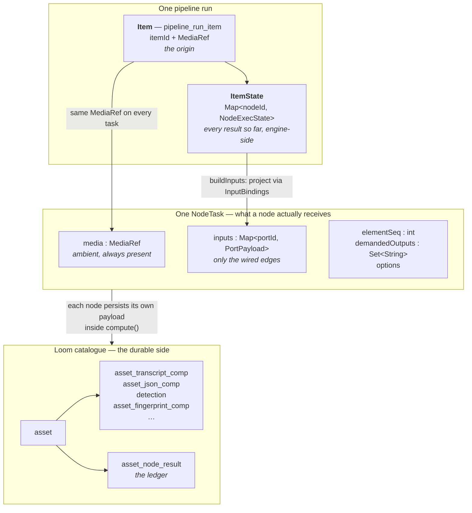
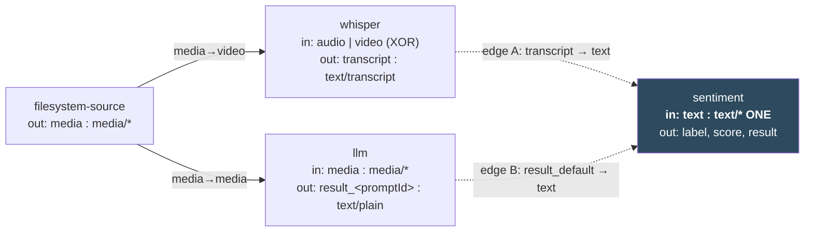

# Pipeline Flow — What Actually Travels Between Nodes

> **Scope.** This file answers one question: **what is the thing that moves through a pipeline?**
> It is the *conceptual* companion to [../nodes/NODE_DATA_TYPES.md](../nodes/NODE_DATA_TYPES.md), which is the
> *mechanical* reference. If you want the port table, the lattice rule, the coercion matrix or the
> engine's five validation rules, go there. If you are trying to build a mental model — or you are
> looking at the editor wondering "which of the three texts on this item does my node get?" — start
> here.
>
> **Not in scope** — covered elsewhere, do not duplicate:
> - Port specs, content types, cardinality, the analyzer rules, `ValueCoercer` →
>   [../nodes/NODE_DATA_TYPES.md](../nodes/NODE_DATA_TYPES.md)
> - Node lifecycle, per-node persistence targets, the node catalogue →
>   [../pipeline-nodes/NODES.md](../nodes/NODES.md)
> - Engine internals, run state, dispatch protocol, DB schema → [PIPELINE.md](PIPELINE.md)
> - Asset components and the query side → [../../loom/DOMAIN.md](../../loom/DOMAIN.md)
>
> **Source of truth is the code.** Where this file and the code disagree, the code wins — fix this
> file in the same change ([../../guidelines/CODING.md](../../guidelines/CODING.md)).

---

## 1. The Short Answer

**Nothing accumulates on the wire.** There is no growing envelope, no
`Asset + Transcript + LLMText` bag being handed from node to node.

What exists instead is three separate things, and conflating them is the whole source of the
confusion:

| # | Thing | Lives | Scope | What it is for |
|---|---|---|---|---|
| 1 | **The run item** | `PipelineRunEngine.items : Map<String, ItemState>` ([ItemState.java:28-36](../../../loom/pipeline/src/main/java/io/metaloom/loom/pipeline/engine/ItemState.java#L28-L36)) | One per discovered media file, for the lifetime of the run | Identity. **The item *is* the origin.** Everything produced while processing one file is tagged with its `itemId` |
| 2 | **The media reference** | `NodeTask.media : MediaRef` ([NodeTask.java:38](../../../loom-shared/pipeline-model/src/main/java/io/metaloom/loom/pipeline/model/NodeTask.java#L38)) | **Ambient on every task**, every node, always | *"Which file am I looking at?"* — `path`, `sha512`, `size`, `mediaType`. This is the asset reference every node needs, and it is **not** a port payload |
| 3 | **Port payloads** | `NodeTask.inputs : Map<portId, PortPayload>` ([NodeTask.java:40](../../../loom-shared/pipeline-model/src/main/java/io/metaloom/loom/pipeline/model/NodeTask.java#L40)) | **One task only**, keyed by *the receiving node's own* port ids | The actual data flow. Filled from the wired edges, and from nothing else |

The accumulating bag you are picturing **does exist** — but it is engine-side state, not a wire
format, and a node never reads from it directly:

```
ItemState (item X)
 ├─ "whisper"    → NodeExecState → { transcript : text/transcript ["…"] }
 ├─ "llm"        → NodeExecState → { result_default : text/plain ["…"] }
 └─ "facedetect" → NodeExecState → { detections : detection/face [f0, f1, f2], face_count : 3 }
```

**The edges are a projection over that bag.** `buildInputs(state, node, seq)`
([PipelineRunEngine.java:1249-1308](../../../loom/pipeline/src/main/java/io/metaloom/loom/pipeline/engine/PipelineRunEngine.java#L1249-L1308))
walks the consumer's `InputBinding`s, pulls exactly the `(sourceNode, sourcePort)` pairs the author
drew, and re-keys them under the consumer's own port ids. A node sees a **hand-picked subset**, not
the accumulated history.

> **The one sentence to remember:** the bag exists, but a node does not read from it — it reads its
> own input ports, and the *pipeline author* decided what fills them by drawing an edge.

---

## 2. The Four Nouns



### 2.1 The item — identity, and the origin

One discovered file → one `pipeline_run_item` row → one `ItemState`. Fan-out happens **inside** one
item: when `facedetect` finds three faces, that is three *elements* of one port, all tagged
`Origin{itemId: X, seq: 0..2, total: 3}` ([Origin.java](../../../loom-shared/pipeline-model/src/main/java/io/metaloom/loom/pipeline/model/Origin.java)). No child items, no lineage columns, no second
completion model — which is exactly why a downstream node can gather two fanned-out branches back
together per source asset with zero bookkeeping.

### 2.2 The media reference — ambient, not a payload

> *"Pipeline nodes commonly/always need the reference to the asset when processing data."*

Correct, and the design already agrees with you: **`MediaRef` rides on every single `NodeTask`,
whether or not a `media` edge was drawn.** It is not something a node has to receive through a port
and it is not something that can be lost by mis-wiring.

Three levels of "the asset", do not confuse them:

| Level | Type | How a node gets it | Contains |
|---|---|---|---|
| The file handle | `MediaRef` → `LoomMedia` | `ctx.media()` — ambient | path, sha512, size, mediaType |
| The **port** value | `media/*` family payload | `ctx.input(IN_MEDIA)` — only if wired | the same path, as a typed, checkable graph edge |
| The **catalogue** row | `AssetResponse` | `client().loadAsset(sha512)` inside `AbstractMediaNode.process` ([AbstractMediaNode.java:64, :81](../../../cortex/common/src/main/java/io/metaloom/cortex/common/node/AbstractMediaNode.java#L64)) | uuid, hashes, existing components — null in offline mode |

The `media/*` **port** exists on top of the ambient reference so the graph is fully wired and
type-checked: a `media/image`-only node cannot be connected to a video source without the analyzer
saying so at save time. See [../nodes/NODE_DATA_TYPES.md](../nodes/NODE_DATA_TYPES.md) §5 for why both exist.

### 2.3 The port payload — the only real data flow

```json
"detections": {
  "contentType": "detection/face",
  "cardinality": "MANY",
  "elements": [
    { "origin": { "itemId": "5c1f…", "seq": 0, "total": 3 }, "value": "{…box…}" },
    { "origin": { "itemId": "5c1f…", "seq": 1, "total": 3 }, "value": "{…box…}" }
  ]
}
```

A payload is **per port, per task**. It is created by the producing node, stored in `ItemState`,
persisted to `pipeline_node_task.outputs`, and *copied* — not accumulated — into whichever
downstream tasks the edges say should receive it.

### 2.4 The asset components — where the bag you imagined actually lives

Your intuition of *"an asset that gets appended a list of comp entries"* is **exactly right about
Loom, and exactly wrong about the wire.** Every persisting node writes its own typed component
inside `compute()` and records a ledger row ([NODES.md](../nodes/NODES.md) §2):

```
asset (uuid, sha512, …)
 ├─ asset_transcript_comp   ← whisper
 ├─ asset_json_comp         ← llm (variant = prompt id), sentiment, ocr, tika, caption, …
 ├─ detection               ← facedetect
 ├─ asset_segment_comp      ← scene-detection, script TIMEFRAMES
 └─ asset_node_result       ← every node: {nodeKind, nodeId, state, origin, durationMs, result_ref}
```

**That is the accumulating record.** It grows over the asset's whole lifetime, across runs, across
pipelines, and it is what search and the UI read. The pipeline wire is deliberately *not* that: it
is short-lived, run-scoped and narrow.

| | Wire (`PortPayload`) | Catalogue (`asset_*_comp`) |
|---|---|---|
| Scope | One task, one run | The asset, forever |
| Shape | Whatever the ports declare | Typed relational components |
| Accumulates? | **No** | **Yes** |
| Addressed by | Port id, resolved from an edge | Asset uuid + component type |
| Survives the run? | Only as `pipeline_node_task.outputs` diagnostics, subject to retention ([PIPELINE.md](PIPELINE.md) §10.1a) | Yes |

Keeping these two apart is deliberate. If the wire accumulated, every node would have to be
defensive about data it never asked for, and re-running one node would mean rebuilding a whole
envelope.

---

## 3. Your Scenario, Walked Through

> *An asset gets processed by the transcribe node, so the output is Asset+Transcription. If that gets
> processed by an LLM node we yield another text component (Asset+Transcription+LLMText). How can a
> third connected node that ingests text decide which component it uses?*

Here is what actually happens, in the model as built.



`sentiment.text` is declared `one("text", TEXT_ANY)`
([SentimentDescriptorProvider.java:29](../../../loom-shared/node-model/src/main/java/io/metaloom/loom/nodes/spec/SentimentDescriptorProvider.java#L29)) — content type `text/*`,
cardinality **ONE**. Both `text/transcript` and `text/plain` are assignable to `text/*`, so **either
edge is legal — but not both.**

**The node never decides. The author already did, when they drew the edge.** And the case where the
question would be ambiguous is not merely discouraged, it is *unrepresentable*:

| Situation | What happens |
|---|---|
| Neither A nor B drawn | Save-time error — `text` is a required, ungrouped input (analyzer rule 3) |
| Only A drawn | `ctx.input(IN_TEXT)` returns the transcript. Nothing else can reach that port |
| Only B drawn | `ctx.input(IN_TEXT)` returns the LLM answer |
| **Both A and B drawn** | **Save-time error.** *"An input port with more than one incoming edge must be `MANY`"* — analyzer rule 4 ([PortGraphAnalyzer.java:141-146](../../../loom/pipeline/src/main/java/io/metaloom/loom/pipeline/graph/PortGraphAnalyzer.java#L141-L146)) |

So the answer to *"how does it decide?"* is: **there is never anything to decide.** A `ONE` port has
at most one source by construction, checked when the graph is saved and again when the run starts.

> ⚠️ **The `whisper → llm` edge in your example cannot be drawn today.** The `llm` node declares a
> single input port `media : media/*` and no text input at all
> ([LlmDescriptorProvider.java:34-36](../../../loom-shared/node-model/src/main/java/io/metaloom/loom/nodes/spec/LlmDescriptorProvider.java#L34-L36)); its prompts are templated with the *filename*
> only (`prompt.set("name", ctx.media().file().getName())`, `LLMNode.compute`). Chaining an LLM onto a
> transcript is a real and obvious use case that the port model fully supports — the node just has
> not declared the port. See §7, item 1.

### 3.1 Two text inputs — yes, two ports, two edges

> *How would a node be modelled which needs two text inputs, Transcription and LLMText? Would we need
> to connect from the llm node and from the transcript node individually? (I assume yes.)*

**Yes, and that is the intended shape.** Two distinct input ports, two edges:

```java
public static final InputPort<String> IN_TRANSCRIPT =
    InputPort.one("transcript", ContentTypeRegistry.TEXT_TRANSCRIPT, String.class);
public static final InputPort<String> IN_SUMMARY =
    InputPort.one("summary", ContentTypeRegistry.TEXT_PLAIN, String.class);
```

The precedent already ships: `scene-layout` takes `depth : struct/depthmap` **and**
`detections : detection/* MANY` from two different upstream nodes, and `dominant-color` takes
`media : media/image` **and** an optional `detections : detection/*`
([../nodes/NODE_DATA_TYPES.md](../nodes/NODE_DATA_TYPES.md) §4.3).

Naming the ports for their *role* (`transcript`, `summary`) rather than their type is what makes the
node readable: the code says `ctx.input(IN_TRANSCRIPT)`, and the editor shows two labelled handles.
Tightening the content type per port (`text/transcript` vs `text/plain`) is optional but worth it —
it stops the two edges being swappable by accident.

### 3.2 The one case where a port *does* receive several values

A `MANY` port legitimately receives many values, and then the node iterates:

```java
for (Element<String> face : ctx.inputs(IN_DETECTIONS)) {
    face.origin().seq();   // which element of the fan-out this is
}
```

That is not ambiguity — it is a declared sequence, seq-ordered, all from one origin item. The
gather/fan-out mechanics are in [../nodes/NODE_DATA_TYPES.md](../nodes/NODE_DATA_TYPES.md) §8.

---

## 4. Your Four Questions, Directly

| Question | Answer |
|---|---|
| *Is the travelling element an asset with appended comp entries?* | **No.** The asset reference travels ambiently (`NodeTask.media`); the *data* travels per-port and does not accumulate. The accumulating structure is the Loom asset + its components (§2.4), which is a **persistence** concern, not a transport one |
| *How does a third node decide which text component to use?* | **It never decides.** A `ONE` port has exactly one incoming edge, enforced at save time and run start. The author decided by drawing the edge |
| *Does the differentiation happen when connecting, or via a flag on the output?* | **When connecting.** The edge carries `sourcePort` + `targetPort` and is type-checked; there is no runtime resolution step and no priority flag (§5) |
| *Two text inputs — connect from both nodes individually?* | **Yes.** Two input ports, two edges. This is the modelled shape, not a workaround (§3.1) |

---

## 5. The Two Proposals, Reviewed

### 5.1 "Asset + a list of components travels through" — rejected, but half of it is already true

The accumulating structure exists (§2.4) and you should keep that picture — just attach it to
**Loom**, not to the wire. Making it the *wire* format was considered and is rejected:

| Problem | Why it is fatal |
|---|---|
| **Reintroduces the lookup-by-name defect** | A node receiving a bag must select from it — by node id, by key, or by type. Node-id selection is exactly the defect class the port refactor removed: ids are author-chosen, so renaming a node in the editor silently starved a downstream lookup (`sentiment`'s `textSources`, `LoomNode`'s `md5sum`, `llm_result` vs `llm_result_<promptId>` — [../nodes/NODE_DATA_TYPES.md](../nodes/NODE_DATA_TYPES.md) §9.1) |
| **Nothing is checkable at save time** | If selection happens at runtime against whatever the bag holds, the editor cannot tell you a pipeline is broken. Today `PortGraphAnalyzer` rejects a bad graph before a single file is touched |
| **Fan-out has no coherent meaning** | Three faces are three elements of one port. In a bag model, what is "the asset with three faces appended" when the next node runs per face? |
| **Unbounded payloads** | A gather already ships all N elements inline. A bag would ship every prior node's output to every downstream node, whether wanted or not |
| **Re-running one node needs the whole envelope rebuilt** | With per-port payloads the engine replays exactly one `(node, seq)` and refills its inputs from `ItemState` |

### 5.2 The `*` "primary output" marker — rejected

> *`Asset+Transcription+LLMText*` — the `*` denotes the current primary output, so connecting another
> node can always pick up LLMText first.*

This is a real design (it is roughly how shell pipes or a Unix "current value" work), and the goal
behind it — *"I should not have to think about which port to grab"* — is legitimate. But as a
resolution rule it is worse than it looks:

| Problem | Detail |
|---|---|
| **It makes wiring order-dependent** | "Primary" means "most recently produced". Insert a node into the middle of a chain, or let two branches complete in a different order, and a downstream node silently reads a different value. Nothing in the graph records what changed |
| **It cannot be validated** | "Primary" is a runtime property. The editor cannot type-check a connection to "whatever will be primary", so you lose the save-time guarantee entirely |
| **It is silently wrong, not loudly wrong** | The failure mode is a sentiment score computed over the wrong text, with a green run. The current model's failure mode is a red error at save time |
| **It does not survive fan-out** | With three faces in flight, "the primary output" is three things |
| **The multi-input case still needs explicit ports** | You conceded this in the question. So `*` would be a *second* mechanism covering only the easy case — two ways to express one thing, which is the thing to avoid |

**What is worth keeping from the idea** is the *ergonomic* goal, which belongs in the **editor**, not
in the data model: when you drag from `whisper` to `sentiment`, the editor already knows there is
exactly one assignable `(sourcePort, targetPort)` pair and should just connect it. That is
auto-selection at authoring time, recorded explicitly in the definition JSON — you get the
convenience *and* the checkable, stable graph. See §7, item 2.

---

## 6. Why It Feels Confusing — Five Real Causes

The model is simpler than it currently reads. Every item below is a genuine defect in how it is
*presented*, not in what it does.

1. **Media is ambient *and* a port.** The single biggest source of "wait, what does a node actually
   receive?". `NodeTask.media` is always there; `media : media/*` must also be wired. Both are
   deliberate ([../nodes/NODE_DATA_TYPES.md](../nodes/NODE_DATA_TYPES.md) §5) but nothing states plainly that
   *"the file handle is context; the port is the type-checked graph statement about it."*

2. **The word "output" means two things.** A node's *output port* (wire) and a node's *persisted
   component* (catalogue) are written by the same `compute()` method and are described in the same
   breath in [NODES.md](../nodes/NODES.md) §2. They have different lifetimes, different
   consumers and different keys.

3. **Node bodies and descriptors still disagree in places.** [NODES.md](../nodes/NODES.md)
   §3 still lists legacy string "Output Keys" (`whisper_result`, `llm_result_{promptId}`) beside a
   port table that says `transcript` and `result_<promptId>`. Reading both leaves you unsure which
   is real. The descriptor is the contract; the node body is the debt.

4. **The lattice is invisible while you are wiring.** `text/*` accepting `text/transcript` *and*
   `text/plain` is obvious once you know the three-line rule, and mysterious before. The editor
   colours handles by family, which helps, but it does not say *why* a connection was refused in
   terms of the rule.

5. **The one demo that exercises the interesting case is the gather, not the fan-out.** No shipped
   kind declares a `ONE`-cardinality `detection/*` input, so nothing in the demo data shows a node
   running once per face ([../nodes/NODE_DATA_TYPES.md](../nodes/NODE_DATA_TYPES.md) §8.5). Fan-out reads as theory.

---

## 7. Recommendations

Ordered by value per unit of work. None of these changes the data model — the model is right; the
gaps are in coverage and ergonomics.

1. 🔴 **Give `llm` a text input port.** `optionalOne("text", TEXT_ANY)` plus a prompt template
   variable for it, so `whisper.transcript → llm.text` is drawable. Today the canonical
   "transcribe, then reason over the transcript" pipeline **cannot be expressed**, which is very
   likely what made the whole flow feel wrong. `sentiment`, `tts` and `filter` already
   accept `text/*`; `llm` is the outlier. Keep `media` optional alongside it so the filename-only
   behaviour still works.

2. **Auto-connect the unambiguous drag in the editor.** When a drag from node A to node B has
   exactly one assignable `(outputPort, inputPort)` pair, bind it without a port picker. This is the
   whole benefit of the `*` idea with none of its cost, because the chosen ports are still written
   into the definition JSON.

3. **Say the refusal reason in lattice terms.** `isValidConnection` already rejects with a message;
   make it read *"`hash/md5` cannot feed `scalar/string` — assignability never crosses families"*.
   Cause 4 above stops being a cause.

4. **Ship one demo pipeline that fans out.** A node with a `ONE`-cardinality `detection/face` input
   (a per-face crop, a per-face `dominant-color`) in `DemoDatabaseInitializer`, so the fan-out path
   is visible in the UI rather than only in `PipelineRunEngineFanOutTest`.

5. **Show `k/N elements` in the run monitor.** A per-element node currently reports as one node, so
   the fan-out is invisible while it runs. Already tracked in
   [../nodes/NODE_DATA_TYPES.md](../nodes/NODE_DATA_TYPES.md) §17.

6. **Finish the descriptor/body reconciliation and drop the legacy "Output Keys" column** from
   [NODES.md](../nodes/NODES.md) §3 once the sweep lands, so there is one answer to "what
   does this node emit?".

7. **Name ports for their role, not their type** — a convention for node authors. `transcript` and
   `summary`, not `text1` and `text2`. Add it to [../../guidelines/CODING.md](../../guidelines/CODING.md)
   when the next node lands.

---

## 8. Mental Model Cheat Sheet

Six sentences that between them answer almost every "what travels?" question:

1. **One file = one item = one origin.** Everything produced while processing it carries `itemId`.
2. **The file handle is ambient.** `ctx.media()` always works; it is never something you wire.
3. **Data moves per port, and only along the edges you drew.** No node sees anything it was not
   explicitly connected to.
4. **The edge decides, not the node.** A `ONE` port has exactly one source, checked before the run
   starts. Ambiguity is unrepresentable.
5. **Cardinality creates the shape.** `MANY → ONE` fans out (once per element); `MANY → MANY`
   gathers (once, with all elements). Neither needs a merge node.
6. **The thing that accumulates is the asset in Loom**, not the payload on the wire.

---

## 9. Key Classes Reference

| Class | Module / package | Role in the flow |
|---|---|---|
| `ItemState` | `loom/pipeline` · `…pipeline.engine` | The per-item bag: `Map<nodeId, NodeExecState>`. The item **is** the origin |
| `NodeExecState` | ″ | One node's state, per element sequence index. `isSettled()` is the gather barrier |
| `PipelineRunEngine` | ″ | `advance` (dispatch), **`buildInputs`** (the projection from the bag onto a node's ports) |
| `InputBinding` | `loom/pipeline` · `…pipeline.graph` | One wired edge seen from the consumer: `(targetPortId, sourceNodeId, sourcePortId, branch, targetIsMany)` |
| `PortGraphAnalyzer` | ″ | Rejects the ambiguous graph — multi-edge into `ONE`, unsatisfied inputs, type mismatch |
| `NodeTask` | `loom-shared/pipeline-model` · `…pipeline.model` | What a node receives: `media` + `inputs` + `elementSeq` + `demandedOutputs` + `options` |
| `NodeTaskResult` | ″ | What it returns: `outputs : Map<portId, PortPayload>` + the echoed `elementSeq` |
| `PortPayload` / `DataElement` / `Origin` | ″ | The element envelope: content type, cardinality, origin-tagged values |
| `MediaRef` | ″ | The ambient file handle: `path`, `sha512`, `size`, `mediaType`, `contentType()` |
| `InputPort<T>` / `OutputPort<T>` / `Element<T>` | `cortex/api` · `…api.node` | How a node names its own connectors |
| `NodeContext` | `cortex/api` · `…api.node.context` | `media()`, `input(PORT)`, `inputs(PORT)`, `origin()`, `isWired`, `isDemanded`, `output`, `outputElement` |
| `AbstractMediaNode` | `cortex/common` · `…common.node` | `fetchAsset(media)` — resolves the Loom `AssetResponse` by sha512; `recordNodeResult(...)` — the ledger |
| `ContentTypeLattice` | `loom-shared/node-model` · `…nodes.spec` | `isAssignable` — why `text/transcript` satisfies `text/*` |

---

## 10. Conventions and Gotchas

| Rule | Why |
|---|---|
| **Do not model "the current value" of an item** | Order-dependent, unvalidatable, silently wrong under fan-out (§5.2) |
| **Do not put the asset reference on a port and call it done** | It is ambient on `NodeTask` because the legacy `process(LoomMedia, …)` lifecycle needs a resolvable handle regardless of wiring (§2.2) |
| **Never select an input by node id, key or "the first text you find"** | The exact defect class the port model removed. A node names only its own ports |
| **Two inputs of the same family = two ports, always** | Not one `MANY` port you index into. A `MANY` port is a *sequence from one origin*, not a tuple of different roles |
| **Wire data ≠ persisted data** | A node's output port is run-scoped; its `asset_*_comp` row is the durable catalogue entry. Do not read one expecting the other |
| **`text/*` is a family, not a type** | It accepts `text/plain`, `text/transcript` and `text/caption` alike. Declare the narrowest type that is actually true |
| **A `ONE` port with two edges is a save-time error, not a merge** | Analyzer rule 4. If you want both, declare two ports |
| **Adding an input port to an existing kind is backwards-compatible only if it is optional** | A new required port invalidates every saved graph using that kind |

---

## 11. Where Do I Find…?

| Need | Path |
|---|---|
| What a node receives | `loom-shared/pipeline-model/.../model/NodeTask.java` |
| The projection from the item bag onto a node's ports | `loom/pipeline/.../engine/PipelineRunEngine.java` → `buildInputs` |
| The per-item bag | `loom/pipeline/.../engine/ItemState.java`, `NodeExecState.java` |
| Why a connection is legal | `loom-shared/node-model/.../spec/ContentTypeLattice.java` |
| Why a graph is rejected | `loom/pipeline/.../graph/PortGraphAnalyzer.java` |
| The element envelope | `loom-shared/pipeline-model/.../model/{PortPayload,DataElement,Origin}.java` |
| A node's own view of all this | `cortex/api/.../node/context/NodeContext.java` |
| How the asset row is resolved | `cortex/common/.../node/AbstractMediaNode.java` → `fetchAsset` |
| Where node output becomes a catalogue component | [../pipeline-nodes/NODES.md](../nodes/NODES.md) §2 |
| The per-kind port table | [../nodes/NODE_DATA_TYPES.md](../nodes/NODE_DATA_TYPES.md) §4 |
| Demo graphs | `loom/core/.../boot/DemoDatabaseInitializer.java` |

---

## 12. Environment Variables

**None.** What flows between nodes is a property of the pipeline definition and the node descriptors,
both of which travel through the database and the descriptor SPI — deliberately, so two workers
running the same graph cannot disagree about it. Worker-level knobs (node whitelist/blacklist, S3,
concurrency) are in [../../cortex/CONFIGURATION.md](../../cortex/CONFIGURATION.md).

---

## 13. Test Setup

This file adds no tests of its own; the behaviour it describes is pinned by existing suites. The
model needs no database; the engine suites do.

```bash
# The graph rules that make ambiguity unrepresentable
mvn -q test -pl loom/pipeline -Dtest='PortGraphAnalyzerTest+PipelineGraphParserTest'

# Fan-out, the gather, per-element dispatch and buildInputs (needs ./setup-pool.sh)
mvn -q test -pl loom/pipeline -Dtest=PipelineRunEngineFanOutTest

# The vocabulary and the lattice
mvn -q test -pl loom-shared/node-model
```

| Claim in this file | Pinned by |
|---|---|
| A `ONE` port cannot have two sources | `PortGraphAnalyzerTest` (multi-edge into `ONE`) |
| A required input must be wired | `PortGraphAnalyzerTest` (unsatisfied inputs, XOR groups) |
| `text/transcript` satisfies `text/*`, `hash/md5` does not satisfy `scalar/string` | `ContentTypeLatticeTest` |
| A gather receives every element, seq-ordered, under one origin | `PipelineRunEngineFanOutTest` |
| A `ONE` input zips by `origin.seq`, not list position | `PipelineRunEngineFanOutTest` (out-of-order arrival) |
| A node's ports match its descriptor | `integration-test/.../node/NodePortConformanceTest` |
| Nothing pins that `whisper → llm` is drawable | 🔴 **nothing — it is not** (§7 item 1) |

---

## 14. Progress Assessment

### The model itself — settled

- [x] The run item is the origin; fan-out stays inside one item
- [x] The media reference is ambient on every task **and** a type-checked port
- [x] Data flows per port, projected from `ItemState` by `buildInputs`
- [x] Disambiguation happens at connect time; a `ONE` port has at most one source, checked twice
- [x] Multi-role inputs are modelled as multiple ports (`scene-layout`, `dominant-color`)
- [x] Fan-out and gather fall out of cardinality — no merge node to place
- [x] The accumulating record lives in Loom as asset components + the `asset_node_result` ledger

### Reviewed and decided here

- [x] "An accumulating Asset+components envelope on the wire" — **rejected**, rationale in §5.1
- [x] "A `*` primary-output marker" — **rejected** as a resolution rule; kept as an *editor*
      ergonomic (§5.2, §7 item 2)
- [x] "Two text inputs need two edges" — **confirmed**, and it is the intended shape (§3.1)

### Open work this review surfaced

- [ ] 🔴 `llm` declares no text input port, so `whisper.transcript → llm` **cannot be drawn**
      ([LlmDescriptorProvider.java:34-36](../../../loom-shared/node-model/src/main/java/io/metaloom/loom/nodes/spec/LlmDescriptorProvider.java#L34-L36)). Same for `vlm`. §7 item 1
- [ ] Auto-connect the unambiguous drag in `PipelineEditor.tsx` (§7 item 2)
- [ ] Connection-refusal messages phrased in lattice terms (§7 item 3)
- [ ] A demo pipeline that actually fans out — no shipped kind declares a `ONE` `detection/*` input
      (§7 item 4)
- [ ] `k/N elements` progress per node in the run monitor (§7 item 5)
- [ ] Drop the legacy "Output Keys" column from [NODES.md](../nodes/NODES.md) §3 once the
      Cortex sweep lands (§7 item 6)
- [ ] Port-naming convention ("name for the role, not the type") into
      [../../guidelines/CODING.md](../../guidelines/CODING.md) (§7 item 7)

### Inherited, tracked elsewhere — not restated here

The open defects in the mechanics ( `DaoRunStateStore` ignoring `elementSeq`, `PipelineRunRecovery`
collapsing a fanned-out item, the inline `dependencies[]` fallback bypassing port validation,
recovery re-parsing with a null registry) are listed in [../nodes/NODE_DATA_TYPES.md](../nodes/NODE_DATA_TYPES.md) §9.2
and §17. They affect whether the flow *works*, not what it *is*.

---
_Git HEAD revision: `742dae2d`_
_Last updated: 2026-08-06 (reference sweep — no content changes)_