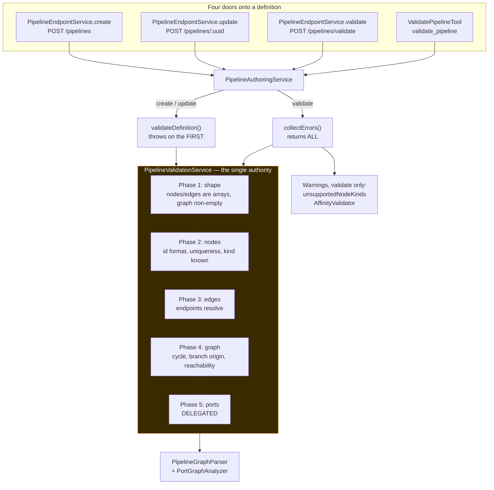

# MetaLoom Pipeline Validation — Technical Specification

> **Audience: AI coding agents.** This file owns the question *"is this pipeline definition
> acceptable, and if not, why?"* — the rules, where they live, the two entry points onto them,
> the REST route that exposes them, and how a client is expected to consume the answer.
> Source of truth is the code; when it disagrees with this file, the code wins — fix this file
> in the same change ([SPEC_RULES.md](../../guidelines/SPEC_RULES.md)).

**The one rule that matters:** `PipelineValidationService` is the **only** validator of a
definition's contents. There is no second copy anywhere — not in `loom-shared/rest-model`, not
in the editor, not in a node. Section 3 explains why that sentence needed writing down.

**Scope split — do not duplicate these here:**

| Topic | Spec |
|---|---|
| What the parser builds, segmentation, source resolution, the engine, persistence, protocol | [PIPELINE.md](PIPELINE.md) |
| The port model itself: content-type lattice, cardinality, XOR/EXCLUSIVE groups, fan-out/gather | [../nodes/NODE_DATA_TYPES.md](../nodes/NODE_DATA_TYPES.md) |
| Which requirement this closes and its conformance status | [PIPELINE_REQUIREMENTS.md](PIPELINE_REQUIREMENTS.md) R11 |
| How the editor renders and debounces the verdict | [../../loom/ui/LOOM_UI_PIPELINE_EDITOR.md](../../loom/ui/LOOM_UI_PIPELINE_EDITOR.md) 7.2 |
| The `validate_pipeline` MCP tool's text rendering and permissions | [../../loom/MCP.md](../../loom/MCP.md) |
| General REST conventions, error envelope, permission enforcement | [../../loom/RESTAPI.md](../../loom/RESTAPI.md) · [../permissions/PERMISSIONS.md](../permissions/PERMISSIONS.md) |

---

## 1. Progress Assessment

- [x] Structural rules single-sourced in `PipelineValidationService`
- [x] Port rules single-sourced in `PipelineGraphParser` / `PortGraphAnalyzer`, delegated to
- [x] `collectErrors(JsonObject)` reports every problem, not just the first
- [x] `validateDefinition(JsonObject)` retained as a thin throwing wrapper for create/update
- [x] `PipelineValidationServiceTest` asserts per case that the two entry points agree
- [x] `POST /api/v1/pipelines/validate`, gated on `CREATE_PIPELINE`, answers 200 with
      `valid: false` rather than 400
- [x] Stable error codes plus `nodeId` / `edgeId` anchoring, so a client can mark the canvas
- [x] `PipelineModelValidator`'s copy of the structural rules deleted; shape checks only
- [x] `validatePipeline()` / `validatePorts()` deleted from `PipelineEditor.tsx`
- [x] Editor calls the route: debounced while editing, blocking on save and clone
- [x] Java client `validatePipeline`, Python client `validate_pipeline`
- [x] `validate_pipeline` MCP tool reports every problem, first one separately
- [x] Endpoint tests: valid, multi-error, permission, route-order, agreement with create
- [x] Playwright spec: a server validation error blocks the save
- [x] Customer-facing documentation under `website/content/english/docs/pipeline/`
- [ ] **Warnings are not surfaced in the editor.** The response carries them and the MCP tool
      prints them; `PipelineEditor.tsx` reads only `errors`. An author is never told that no
      worker is online for a kind they just wired
- [ ] **No `PipelineValidationErrorCode` enum.** The codes are `public static final String`
      constants on the service; nothing stops a typo in a new rule, and no client can
      exhaustively switch on them
- [ ] **`nodeId` is absent on whole-graph errors, including `CYCLE`.** Kahn's counts visited
      nodes and does not retain the participants, so the editor cannot ring the cycle
- [ ] **Node *options* are validated on a different path.** `NodeOptionValidator` runs from
      re-execution and ad-hoc runs, never from `collectErrors`, so a definition whose node
      carries a bogus option validates clean and fails at run time (section 8)
- [ ] **`PipelineRunRecovery` re-parses with the no-arg parser**, so a recovered run gets no
      port checking at all ([PIPELINE.md](PIPELINE.md) 5)

---

## 2. Architecture



Two properties fall out of this shape and are the reason for it:

**A draft that validates is a draft that saves.** `validate` and `create` reach the same
service through the same `PipelineAuthoringService`, so the route is not an approximation of
the save path — it *is* the save path with the write removed.

**Nothing is stored until the definition is sound.** `PipelineAuthoringService.create` runs
validation before its first `store`, so a rejected definition leaves no row behind. An agent
iterating on a draft depends on this.

---

## 3. Why this file exists: the three-copy history

The structural rules used to have **three independent implementations**:

| Copy | Where | What it had |
|---|---|---|
| `PipelineValidationService` | `loom/services/rest` | The wired one; the only caller building a registry-backed parser |
| `PipelineModelValidator` | `loom-shared/rest-model` | Its own Kahn's cycle detection, its own id regex |
| `validatePipeline()` + `validatePorts()` | `loom-ui/.../PipelineEditor.tsx` | Its own TypeScript Kahn's, its own port mirror |

They disagreed. The editor would accept a graph the server refused, and the shared-model copy
had no descriptor registry, so it could not check node kinds at all and silently passed
definitions naming kinds that do not exist. Retired Task 8 collapsed them.

**What remains of the other two:**

- `PipelineModelValidator` now validates request/response **shape** only — a create request
  needs a name and a definition, a response needs its version identity. Its javadoc says so
  and `PipelineModelValidatorTest` has a case asserting a structurally broken definition is
  *not* rejected there, which is the guard against someone restoring the rules.
- `PipelineEditor.tsx` keeps `isValidConnection` (drag time, must answer while the mouse is
  down) and `validateLocally` (empty graph, malformed node id). Nothing else.

**Do not add a fourth.** If a new rule is needed, it goes in `PipelineValidationService`, and
every door gets it for free.

---

## 4. The two entry points

| Method | Returns | On a bad definition | Used by |
|---|---|---|---|
| `collectErrors(JsonObject)` | `List<PipelineValidationError>` | Returns **every** problem | `POST /pipelines/validate`, `validate_pipeline` |
| `validateDefinition(JsonObject)` | `void` | Throws `ValidationException` on the **first** | `create`, `update` |

`validateDefinition` is a four-line wrapper:

```java
List<PipelineValidationError> errors = collectErrors(definition);
if (!errors.isEmpty()) {
    throw new ValidationException(errors.get(0).getMessage());
}
```

**The difference is intentional, not an inconsistency.** Create and update are deciding whether
to write a row, and one reason not to is enough; the caller of `/validate` is fixing a draft and
wants the whole list. Because they are two doors onto one rule set, `PipelineValidationServiceTest`
asserts **per case** that they agree — `rejected(definition)` collects, then asserts
`validateDefinition` throws with the first collected message verbatim.

A `null` definition is an error entry (`DEFINITION_MISSING`), never a `NullPointerException`.
`collectErrors` never throws.

---

## 5. Phase ordering

Collection runs in phases, and **a phase is skipped once an earlier one has made it
meaningless**. Within a phase, everything is collected.

| Phase | Checks | Skips the rest when |
|---|---|---|
| 1. Shape | `definition` non-null; `nodes` is an array and non-empty; `edges` is an array | Always — each of these returns a single error |
| 2. Nodes | id present, matches the regex, unique; kind present and known to the registry | Any node error at all |
| 3. Edges | `source`/`target` present and resolving to a real node id | Any edge error at all |
| 4. Graph | Kahn's cycle detection; branch originates from a `FILTER`; reachable from source | Reachability is skipped when a cycle was found |
| 5. Ports | Delegated to `PipelineGraphParser` | Runs only when phases 1-4 found nothing |

**Why skip rather than collect everything.** Every rule after phase 2 addresses nodes by id, so
a duplicated id would report every edge touching it as dangling — derived noise burying the one
thing the author must fix first. A cycle makes every node off it unreachable *as a consequence*,
so reporting both says the same thing twice. And the parser stops at its own first problem, so
running it over an already-broken graph contributes one restated error.

The result: four independent mistakes on a canvas is **one** round trip; four *consequences* of
one mistake is one error.

---

## 6. Error codes

Constants on `PipelineValidationService`, all `public static final String`. The `code` is the
stable part and the only field a client should branch on; `message` is written for a human and
will be reworded.

| Code | Phase | Anchored to | Meaning |
|---|---|---|---|
| `DEFINITION_MISSING` | 1 | — | The definition was null |
| `NODES_NOT_ARRAY` | 1 | — | `nodes` present but not a JSON array |
| `EDGES_NOT_ARRAY` | 1 | — | `edges` present but not a JSON array |
| `EMPTY_GRAPH` | 1 | — | No `nodes` key, or an empty array |
| `NODE_NULL` | 2 | — | A null entry in `nodes`; the message names the index |
| `NODE_ID_MISSING` | 2 | — | Node has no `id`; the message names the index |
| `NODE_ID_INVALID` | 2 | `nodeId` | Fails `^[a-z0-9]([a-z0-9-]{0,62}[a-z0-9])?$` |
| `NODE_ID_DUPLICATE` | 2 | `nodeId` | Two nodes share an id |
| `NODE_TYPE_MISSING` | 2 | `nodeId` | No `type`, or a blank one |
| `NODE_TYPE_UNKNOWN` | 2 | `nodeId` | `type` not in the `NodeDescriptorRegistry` |
| `EDGE_NULL` | 3 | — | A null entry in `edges`; the message names the index |
| `EDGE_SOURCE_MISSING` | 3 | `edgeId` | Edge has no `source` |
| `EDGE_TARGET_MISSING` | 3 | `edgeId` | Edge has no `target` |
| `EDGE_SOURCE_UNKNOWN` | 3 | `edgeId` | `source` matches no node id |
| `EDGE_TARGET_UNKNOWN` | 3 | `edgeId` | `target` matches no node id |
| `CYCLE` | 4 | — | Kahn's algorithm did not visit every node |
| `BRANCH_UNKNOWN` | 4 | `edgeId` | `branch` is not `ANY`, `PASS` or `REJECT` |
| `BRANCH_NOT_FILTER` | 4 | `edgeId` | A `PASS`/`REJECT` edge whose source is not a `FILTER` node |
| `UNREACHABLE` | 4 | `nodeId` | Node not reachable from the source; **one error per orphan** |
| `PORTS` | 5 | — | Whatever `PipelineGraphParser` refused; at most one |

**Anchoring.** `nodeId` and `edgeId` are what let the editor put an error on the canvas rather
than in a toast. Both are null for a problem with the definition as a whole.

**Definitions carry no edge ids**, so `edgeId` is synthesised as `"source->target"`. An edge
whose `source` is missing therefore gets `"null->target"` — ugly but unambiguous, and the
message names the index.

**`UNREACHABLE` is one error per orphan**, each pinned to its node so all of them can be marked,
but every message names the whole orphan set — because that is what makes an orphan
understandable: the author is looking at a second, disconnected root.

**`PORTS` is a single opaque error.** `PipelineGraphParser` throws on its first problem, so the
port phase can only ever contribute one. `stripGraphName` removes the parser's internal
`Pipeline 'definition' ` prefix so the message reads as advice about the graph on screen. If
per-port anchoring is ever wanted, the parser must collect too — do not reimplement its rules
here to get it.

---

## 7. Warnings

Warnings are produced by `PipelineAuthoringService.validate` **only**, never by
`collectErrors`, and they never make a definition invalid.

| Warning | Source | Why it is not an error |
|---|---|---|
| No online worker accepts these node kinds | `PipelineEndpointService.unsupportedNodeKinds` | A fact about the fleet, not the definition. The definition will still be there when the worker comes back; a *run* started now is the thing refused (503) |
| Affinity group cannot help | `AffinityValidator` | A scheduling hint that will not pay off, not a broken graph |

The affinity **fleet** check is skipped when unsupported kinds were already reported: with
nothing online, "no worker takes sha512" and "no worker takes sha512 and thumbnail together"
are the same news twice. Structural `GROUP_SPLIT` warnings still come through.

This is the first and only production caller of `AffinityValidator`.

---

## 8. What validation does *not* cover

**Node options.** `NodeOptionValidator` checks an options map against the parameters the node
kind declares, and it is reachable through `PipelineValidationService.validateNodeOptions` —
but `collectErrors` never calls it. Its two callers are node re-execution
(`PipelineEndpointService.reExecuteNode`) and ad-hoc runs (`NodeRunService`), both of which
take settings straight from a request. A definition whose node carries `{"maxFaceAngle": "wide"}`
therefore validates clean and fails on the worker. This is a known gap, listed in section 1.

**Whether the pipeline does anything useful.** A valid graph can be pointless.

**Whether a source path exists.** The filesystem is not consulted.

**Recovered runs.** `PipelineRunRecovery` re-parses with the no-arg `PipelineGraphParser`, whose
null registry disables port checking entirely.

**Demo seeding.** `DemoDatabaseInitializer.createPipeline` writes definitions straight through
the DAOs and deliberately skips validation, so demo seeding cannot be broken by a stricter
check. Any *new* writer belongs in `PipelineAuthoringService`.

---

## 9. REST API

`POST /api/v1/pipelines/validate` — see [../../loom/RESTAPI.md](../../loom/RESTAPI.md) for the
shared conventions.

| Property | Value |
|---|---|
| Permission | `CREATE_PIPELINE` |
| Request | `PipelineValidateRequest` = `{ definition }` |
| Response | `PipelineValidationResponse` = `{ valid, errors[], warnings[] }` |
| Status | **200** whether or not the definition is valid |
| 400 | Only when the request itself is malformed — no `definition` at all |
| 403 | Caller lacks `CREATE_PIPELINE` |

```json
{
  "valid": false,
  "errors": [
    { "code": "NODE_TYPE_UNKNOWN", "message": "Unknown node type: \"sha51\" — not found in descriptor registry", "nodeId": "hash" },
    { "code": "NODE_ID_DUPLICATE", "message": "Duplicate node ID: \"thumb\" — node IDs must be unique", "nodeId": "thumb" }
  ],
  "warnings": []
}
```

**A rejected definition is 200, not 400.** The caller asked a question and got an answer;
nothing was stored either way. The 400 belongs to create and update, where the definition was
supposed to be written. A client that treats non-2xx as failure would otherwise have to parse
an error envelope to read a successful answer.

**Gated on `CREATE_PIPELINE`, not `READ_PIPELINE`.** Validating a draft is an authoring action,
and the reply describes the caller's own definition rather than anything stored, so read access
to existing pipelines neither grants it nor is needed for it.
`PipelineValidateEndpointTest.testCreatePipelineIsTheGate` pins both halves.

**The request wraps the definition** rather than posting it bare, so the typed Java and Python
clients have something to build and the route can grow a flag later without a breaking change.

### 9.1 Route registration

Two things in `PipelineEndpoint.register()` are load-bearing and both fail silently:

1. `secure(basePath() + "/validate")` — secured paths are enumerated **individually**,
   specifically so `/api/v1/pipelines/events/ws` escapes the auth chain. A new route is
   **unauthenticated** until it is added to that list.
2. `addRoute(basePath() + "/validate", ...)` must come **before** the `:uuid` wildcard, like
   `/runs/stats`. Registered after, `"validate"` is read as a pipeline uuid and the route never
   fires. `PipelineValidateEndpointTest.testRouteIsNotShadowedByTheUuidWildcard` covers it.

---

## 10. Clients

| Client | Method | Notes |
|---|---|---|
| Java | `LoomHttpClient.validatePipeline(PipelineValidateRequest)` | `loom-client/common/.../PipelineMethods.java` |
| Python | `client.validate_pipeline(PipelineValidateRequest)` | `clients/python/loom_client/methods/pipeline.py` |
| loom-ui | `validatePipelineDefinition(token, definition)` | `loom-ui/src/api/pipelines.ts` |
| MCP | `validate_pipeline` tool | `READ_PIPELINE` + `VALIDATE_MCP_PIPELINE`; see [../../loom/MCP.md](../../loom/MCP.md) |

**The editor never blocks on a failure to *ask*.** `validateWithServer` treats anything other
than an explicit `valid: false` as "no opinion" and returns no errors on a network failure.
"The server is unreachable" and "your graph has a cycle" are different sentences; conflating
them would block saving whenever the server hiccups, or on any deployment predating this route.
The save then proceeds and create/update refuses it if it must — same authority, one step later.

**The MCP tool splits the list.** `INVALID: <first>` then an `Also reported:` block. A model
handed six messages as one blob tends to rewrite six things, and later errors can be
consequences of the first. `ValidationReport.error()` exists for exactly this and is *derived* —
the first entry of `errors()`.

---

## 11. Key Classes Reference

| Class | Package / path | Purpose |
|---|---|---|
| `PipelineValidationService` | `io.metaloom.loom.rest.validation` (`loom/services/rest`) | **The single authority.** Structural rules, error codes, both entry points |
| `PipelineGraphParser` | `io.metaloom.loom.pipeline.graph` (`loom/pipeline`) | Parses a definition into a `PipelineGraph`; owns the port rules the service delegates to |
| `PortGraphAnalyzer` | `io.metaloom.loom.pipeline.graph` | Port existence, assignability, required inputs, XOR/EXCLUSIVE, cardinality classification |
| `AffinityValidator` | `io.metaloom.loom.pipeline.graph` | Produces `AffinityWarning`s; only production caller is `PipelineAuthoringService.validate` |
| `NodeOptionValidator` | `io.metaloom.loom.rest.validation` | Node options against declared parameters. **Not** on the definition path (section 8) |
| `PipelineAuthoringService` | `io.metaloom.loom.rest.service.impl` | The one write path; owns `validate` and the `ValidationReport` record |
| `PipelineEndpointService` | `io.metaloom.loom.rest.service.impl` | `validate(LoomRoutingContext)` — permission gate, request unwrap, response build |
| `PipelineEndpoint` | `io.metaloom.loom.rest.endpoint.impl` | Route registration and `secure(...)` enumeration |
| `PipelineValidateRequest` | `io.metaloom.loom.rest.model.pipeline` (`loom-shared/rest-model`) | `{ definition }` |
| `PipelineValidationResponse` | same | `{ valid, errors[], warnings[] }` |
| `PipelineValidationError` | same | `{ code, message, nodeId?, edgeId? }` |
| `PipelineModelValidator` | `io.metaloom.loom.rest.validation` (`loom-shared/rest-model`) | Request/response **shape** only. Do not put definition rules here |
| `ValidationException` | `io.metaloom.loom.rest.validation` (`loom-shared/rest-model`) | Mapped to **400** by `ServerFailureHandler` |
| `ValidatePipelineTool` | `io.metaloom.loom.mcp.tool.impl` (`loom/services/mcp`) | The MCP door; renders `ValidationReport` as text |

---

## 12. Test Setup

Tests run against a pooled test database. Before running them — and again after any Flyway
change — run `./setup-pool.sh` from the repository root. Validation itself needs no database,
but the endpoint tests boot a full Loom.

```bash
# Unit: the rules themselves, no server
mvn -o -pl loom/services/rest test -Dtest='PipelineValidationServiceTest,PipelineModelValidatorTest,PipelineAuthoringServiceTest'

# Endpoint: a booted Loom over HTTP
mvn -o -pl loom/core test -Dtest='PipelineValidateEndpointTest'

# Editor, mocked backend (loom-ui) — use the local binary, npx stalls
cd loom-ui && ./node_modules/.bin/playwright test e2e/pipeline-crud-mocked.spec.ts

# Python client parity: guards the route against client drift
cd clients/python && ./test.sh
```

| Test | Module | Covers |
|---|---|---|
| `PipelineValidationServiceTest` | `loom/services/rest` | Every rule, every code, phase-skipping, **and that both entry points agree** |
| `PipelineModelValidatorTest` | `loom/services/rest` | Request/response shape, plus that a broken definition is *not* rejected there |
| `PipelineAuthoringServiceTest` | `loom/services/rest` | `ValidationReport`: collection, warnings, derived `error()` |
| `PipelineValidateEndpointTest` | `loom/core` | 200-with-`valid:false`, multi-error, `nodeId`/`edgeId`, no persistence, permissions, route order, agreement with create |
| `pipeline-crud-mocked.spec.ts` | `loom-ui` | A server error blocks the save; the JSON tab lists all of them |
| `test_parity.py` | `clients/python` | The client's path exists in the server's route table |

### 12.1 Writing a new rule

1. Add the constant and the check to `PipelineValidationService`, in the phase it belongs to.
2. Add a case to `PipelineValidationServiceTest` using `rejected(...)` / `accepted(...)` — they
   exercise both entry points, so a rule that only works on one path fails immediately.
3. Add it to the table in section 6 of this file.
4. Only if a client must react to it specifically: surface the code in `loom-ui`.

Do **not** add the rule to `PipelineModelValidator` or to `PipelineEditor.tsx`.

### 12.2 Test fixtures

`PipelineValidationServiceTest` builds its own `NodeDescriptorRegistry` with seven fixture
descriptors. Their input ports are declared **optional** deliberately: the cases are about ids,
cycles, reachability and branches, and a required input would make every one of them fail on
port satisfaction instead — a rule with its own coverage. Each fixture also carries a
`media_seq` MANY port so a converging (diamond) graph can be modelled without tripping the
cardinality rule.

---

## 13. Environment Variables

**None.** Validation has no configuration: no toggle disables it, no property relaxes a rule,
and there is no strict/lenient mode. This is deliberate — a definition that validates on one
deployment must validate on every deployment, or the "a draft that validates is a draft that
saves" property is only true locally.

The one thing that varies by deployment is the **`NodeDescriptorRegistry` contents**, which
decides `NODE_TYPE_UNKNOWN`. A Loom that has never seen a worker offering `whisper` will refuse
a definition naming it. That is a fact about the fleet leaking into a structural rule, and it is
why `unsupportedNodeKinds` is a *warning* while an unknown *kind* is an error: the first is
"nobody can run this right now", the second is "this Loom does not know what this is".

---

## 14. Conventions and Gotchas

| Rule | Why / what breaks |
|---|---|
| **Never add a second validator** | Three copies drifted for months; the editor accepted graphs the server refused. New rules go in `PipelineValidationService` and every door gets them |
| **`collectErrors` never throws** | A null definition is `DEFINITION_MISSING`. Callers rely on this; adding a throw would break `/validate` and the MCP tool at once |
| **Keep the two entry points in agreement** | They are asserted equal per case. If you make `validateDefinition` do anything other than take the first collected error, the test tells you |
| **A rejected definition is 200** | Only a malformed *request* is a 400 on `/validate`. Do not "fix" this to a 400 |
| **`secure(...)` is enumerated individually** | So the events WebSocket escapes the auth chain. A new route ships unauthenticated until you add it |
| **Literal paths before the `:uuid` wildcard** | `/validate` and `/runs/stats` both. Registered after, they are shadowed and never fire |
| **Playwright resolves the LAST registered route first** | The inverse of the server. A `/pipelines/validate` mock must be registered **after** the `/pipelines/:uuid` regex, or that regex swallows it and counts the validation as a save. This silently broke `pipeline-ports-mocked` with a save-count assertion |
| **Port checking is skipped when there is no `edges` key** | A single-node pipeline is legal, so this is deliberate. A graph *with* edges is the checked path |
| **`new PipelineGraphParser()` disables port checking** | The no-arg constructor passes a null registry. Convenient in tests, dangerous in production — `PipelineRunRecovery` uses it |
| **Error codes are strings, not an enum** | Listed as a gap in section 1. Until it changes, a typo in a new code is not a compile error |
| **The editor must not treat "cannot ask" as "invalid"** | `validateWithServer` returns no errors on a network failure or an unrecognised body. Conflating the two blocks saving on any server hiccup |
| **`ValidationReport.error()` is derived** | Not a stored field. It is the first entry of `errors()`, kept for callers that can only show one |
| **Demo seeding bypasses validation on purpose** | `DemoDatabaseInitializer` writes through the DAOs so a stricter rule cannot break container startup |

---

## 15. Where do I find ...?

| I want to ... | File |
|---|---|
| Add or change a rule about a definition's contents | `loom/services/rest/.../validation/PipelineValidationService.java` |
| Change a **port** rule | `loom/pipeline/.../graph/PortGraphAnalyzer.java` (never mirror it) |
| Add an error code | Same service — the `public static final String` block, plus section 6 here |
| Change the route, its permission or its position | `loom/services/rest/.../endpoint/impl/PipelineEndpoint.java` |
| Change the request/response handling | `loom/services/rest/.../service/impl/PipelineEndpointService.java` (`validate`) |
| Change warnings | `loom/services/rest/.../service/impl/PipelineAuthoringService.java` (`validate`) |
| Change the wire models | `loom-shared/rest-model/.../model/pipeline/PipelineValidate*.java`, `PipelineValidationError.java` |
| Change how the editor asks or renders | `loom-ui/src/features/pipeline/PipelineEditor.tsx` (`validateWithServer`, `validateLocally`) |
| Change the editor's HTTP call | `loom-ui/src/api/pipelines.ts` (`validatePipelineDefinition`) |
| Change the MCP text rendering | `loom/services/mcp/.../tool/impl/ValidatePipelineTool.java` (`render`) |
| Change the Java client | `loom-client/common/.../method/PipelineMethods.java` + `loom-client/rest/.../LoomHttpClientImpl.java` |
| Change the Python client | `clients/python/loom_client/methods/pipeline.py` (bump `EXPECTED_JAVA_METHOD_COUNT`) |
| Regenerate `openapi.json` after a route change | `cd loom/doc && mvn -o -q exec:java -Dexec.mainClass=io.metaloom.loom.doc.ExampleGenerator`, then copy to `website/static/docs/examples/` |
| Change the OpenAPI examples | `loom-shared/rest-model/.../model/pipeline/PipelineExamples.java` |
| Read the customer-facing version | `website/content/english/docs/pipeline/index.adoc` ("Checking a Draft Before You Save It") |
| Understand what the parser builds | [PIPELINE.md](PIPELINE.md) 5 |
| Understand the port model being enforced | [../nodes/NODE_DATA_TYPES.md](../nodes/NODE_DATA_TYPES.md) |
| Definition of done for a code change | [../../guidelines/CODING.md](../../guidelines/CODING.md) |

---

_Git HEAD revision: `da6b1760`_
_Last updated: 2026-08-09 (new file — extracted from PIPELINE.md 5.1 when retired Task 8 collapsed the three validators into one and added `POST /pipelines/validate`)_
