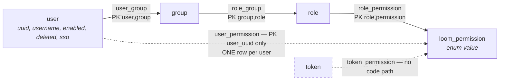

# MetaLoom // RBAC (Role-Based Access Control)

How MetaLoom decides **who may do what**: the identity chain (user → group → role → permission),
where the decision is made on each transport, and the enforcement gaps that are still open.

> **Scope.** This file is the compact operational reference for the *chain and its enforcement*.
> [../permissions/PERMISSIONS.md](../permissions/PERMISSIONS.md) is the deeper reference for the
> **permission taxonomy**, the grant API and the schema defects — this file deliberately does not
> repeat the constant-by-constant inventory. Authentication (JWT, OAuth2 BFF, API tokens) lives in
> [../../loom/RESTAPI.md](../../loom/RESTAPI.md); the transports are described in
> [../../loom/GRAPHQL.md](../../loom/GRAPHQL.md), [../../loom/GRPC.md](../../loom/GRPC.md),
> [../../loom/WEBSOCKET.md](../../loom/WEBSOCKET.md) and [../../loom/MCP.md](../../loom/MCP.md).
> The two authorization specs overlap substantially and are merge candidates (§8).

---

## 1. The chain



Facts that contradict the schema's appearance:

- **There is no `user_role` and no `group_role` table.** The join table is `role_group`
  (`group_uuid`, `role_uuid`). A role can only reach a user through a group.
- **`user_permission`'s primary key is `(user_uuid)` alone** — a user can hold at most **one**
  direct grant, ever. A second `grantUserPermission` for the same user is a PK violation. Grant
  test permissions via **role + group** instead (§5).
- **`token_permission` is dead.** `loadPermissionsForToken` is not on the `PermissionDao`
  interface, has zero call sites and its body is broken. API keys resolve to their owning user and
  therefore inherit that user's **full** authority; tokens cannot be attenuated.
- **The `resource` column is stored but never read** in the decision path (§3), so it was dropped
  from `role_permission` by `V2.64`. `user_permission` and `token_permission` still carry it, and
  `"all"` there is not a wildcard.
- **There is no superuser flag.** `user` has `enabled` / `deleted` / `sso`, no `admin` column, and
  `requirePerm` has no bypass. Admin power is purely the `admin-role` grants.

All seven tables are created in `V2.1__add_acl.sql`. The only later migration that alters their
structure is `V2.64__fix_role_permission_key.sql` (drops `role_permission.resource` and its
redundant unique index); the rest only `ALTER TYPE "loom_permission" ADD VALUE`.

**Effective permissions** = `PermissionDaoImpl.loadPermissionsForUser(userUuid)`, the union of
`ROLE_PERMISSION ⨝ ROLE_GROUP ⨝ USER_GROUP` plus the direct `USER_PERMISSION` rows, returned as a
`ResourcePermissionSet`.

**Caching.** `PermissionCache` is a Caffeine cache (`maximumSize = 10_000`) keyed by user UUID.
It has **no TTL**; `invalidate(userUuid)` / `invalidateAll()` exist and `RoleEndpointService` calls
`invalidateAll()` after every write to `role_permission` — without it a grant would persist and
still change nothing for an already-authenticated session. Any future write that changes who holds
which permission (notably group-membership routes) has the same obligation. `LoomAuthorizationProvider.getAuthorizations`
reads the `uuid` claim, loads the (cached) set and converts each entry into a Vert.x
`PermissionBasedAuthorization` on `user.authorizations()`.

### 1.1 Bootstrap

`DatabaseInitializer.init()` establishes exactly one privileged path, idempotently:

```
user "admin"  →  group "admins" (GROUP_NAME)  →  role "admin-role" (ROLE_NAME)  →  all Permission.values()
```

The initial password comes from `LOOM_INITIAL_PASSWORD`; if unset a random 8-character string is
generated and printed to stdout on first boot. `DemoDatabaseInitializer` additionally seeds
`Editors` / `Viewers` groups with matching roles — the closest thing to a documented standard role
set.

> **Upgrade gotcha:** the "grant all permissions" loop sits **inside** the `if (role == null)`
> branch. On an existing installation a newly added `Permission` constant is therefore **never**
> granted to `admin-role`; the admin silently loses access to the new feature until the grant is
> inserted manually.

### 1.2 Enum sync (summary — details in PERMISSIONS.md §2)

| Layer | Count @ `499f71f7` |
|---|---|
| Java `Permission` (`loom/db/api`) | **129** |
| Postgres `loom_permission` | **134** |
| DB-only (unreachable, harmless) | `CREATE_PIPELINE_VERSION`, `CREATE/READ/UPDATE/DELETE_WEBHOOK` |
| Java-only (would break `valueOf` at grant time) | **none** |

The 4 webhook values are residue: `V2.55__remove_webhook.sql` dropped the feature, and Postgres
cannot drop an enum value. `PermissionDaoImpl` bridges via `JooqLoomPermission.valueOf(perm.name())`,
so a Java constant without a DB value throws at grant time — keep the Java side a subset.

`Permission.java` carries a **per-constant audit comment** (`doc:` i18n text present, `ui:` offered
by the admin ACL matrix, `test:` covering test, `[unused: no code checks it]`). **Five** constants
are currently marked unused: `CREATE/DELETE/UPDATE_ASSET_LOCATION`, `CREATE_PIPELINE_RUN`,
`DELETE_PIPELINE_RUN`. `READ_CORTEX_INSTANCE` was on that list and is not unused —
`NodeDescriptorEndpoint.mayNameWorkers` checks it before naming which workers offer a node. Refresh
those comments when you change a permission.

---

## 2. Enforcement — REST

```
*EndpointService (op → Permission)
  → AbstractCRUDEndpointService.{create,load,list,update,delete}
    → AbstractEndpointService.checkPerm(lrc, permission, action)
      → LoomRoutingContext.requirePerm(Permission...)
        → PermissionBasedAuthorization.create(perm.name()).match(user)   // 403 MISSING_PERM
```

- Missing/invalid JWT → **401** (`LoomAuthenticationHandler`, before authorization runs).
- Missing permission → **403** with error code `MISSING_PERM`.
- **`checkPerm` runs before the DAO loader**, so an unprivileged caller gets `403` even for a
  non-existent UUID — 403 precedes 404. (For a *permitted* caller, foreign element-scoped objects
  surface as `404`, keeping them indistinguishable from missing ones.)
- Two escape hatches beyond the generic CRUD path:
  - **Bespoke `requirePerm`** — e.g. `ProcessorEndpoint` guards `/:uuid/restrictions` and worker
    deletion with `MANAGE_CORTEX_INSTANCE` and throws the 403 itself.
  - **`lrc.permissions()`** returns a non-throwing `Predicate<Permission>` after loading
    authorizations once, for endpoints that must *filter* rather than reject.
    `SearchEndpointService` is the reference: `READ_SEARCH` is the wholesale gate, then the
    `SearchEntityType → READ_*` map in `SearchTypePermissions` (`loom-db-api`) narrows the result set
    per entity type. That map is shared rather than copied, because GraphQL narrows with it too (§3).

## 3. Enforcement — GraphQL

Field level, decoupled from the graphql module via an injected checker:

- `GraphQLPermissionChecker` — `@FunctionalInterface boolean hasPermission(Permission)`,
  `CONTEXT_KEY = "loom.permissionChecker"`.
- `AbstractDomainWiring.requirePermission(env, permission)` runs at the top of every data fetcher:
  no checker in context → `GraphqlErrorException` code **`UNAUTHENTICATED`**; permission absent →
  code **`FORBIDDEN`** plus a `permission` extension.
- `AbstractDomainWiring.requireChecker(env)` hands the fetcher the checker itself, for a field that
  must **filter** rather than reject. It is the GraphQL counterpart of `lrc.permissions()` (§2).
- `GraphQLEndpoint` resolves `lrc.permissionChecker()` once (async) and puts it into
  `ExecutionInput.graphQLContext(...)`.

The checker delegates to the same `PermissionBasedAuthorization…match(user)` call REST uses, so
**both APIs share one decision function**. The GraphQL surface is read-only — every fetcher
requires a `READ_*` permission (`AclWiring`, `AssetWiring`, `MemoryWiring`, `PipelineWiring`,
`SkillWiring`, `SearchWiring`).

✅ **`Query.search` narrows exactly as REST does**, and is the only GraphQL field that filters instead
of rejecting: `READ_SEARCH` gates the field, then the requested `SearchEntityType`s are filtered
through the shared `SearchTypePermissions` map. Dropped types are named in the `warnings` field of
the result; a caller who may read none of them gets `FORBIDDEN` with a `missingPermissions`
extension, never an empty `hits` list. Narrowing is possible here and impossible over MCP for one
structural reason: `GraphQLPermissionChecker` is a **non-throwing** `hasPermission(Permission)`
available to the fetcher, which is precisely what `MCPTool.execute(JsonObject)` lacks (§4).
Row-level ACL remains absent on every transport ([../search/SEARCH.md](../search/SEARCH.md) §6.1).

## 4. Coverage by transport

| Transport | Authenticates | Authorizes | Notes |
|---|---|---|---|
| REST | yes | yes | `checkPerm` / `requirePerm`; 403 `MISSING_PERM` |
| GraphQL | yes | yes | field level, `FORBIDDEN` / `UNAUTHENTICATED`; `search` additionally narrows per entity type (§3) |
| MCP | optional | **partial** | `MCPToolRegistry.dispatch` gates on `user != null && !requiredPermissions.isEmpty()` — a **null user skips the check and dispatches the tool**. `MCPAuthenticationHandler` yields null when `LOOM_MCP_AUTH_ENABLED=false` (default) or in lenient mode. `checkPermissions` itself fails closed (`.recover(err -> false)`), and required permissions are free-form `String`s, so typos are unsatisfiable but silent. |
| gRPC | yes | **no** | `GrpcAuthenticator` calls `authHandler.authenticateToken` only; no `Permission` is referenced anywhere in `loom/services/grpc`. |
| WebSocket | yes (post-upgrade) | **no** | `WebSocketAuthenticator`; lenient by default, `LOOM_WS_STRICT_AUTH=true` / `-Dloom.ws.strictAuth` requires a token. |

Anything reachable **only** over gRPC or WebSocket is effectively unauthorized.

🔴 **MCP authorizes the *dispatch*, never the *result*.** `MCPTool.execute(JsonObject)` receives
arguments and nothing else — no `User`, no `LoomRoutingContext` — so a tool cannot narrow what it
returns to what the caller may see. The visible case is search: `SearchEndpointService` filters the
requested `SearchEntityType`s against the caller's read permissions and 403s when none survive
([../search/SEARCH.md](../search/SEARCH.md) §6) — as does GraphQL's `Query.search` (§3) — and
`search_assets` / `search_transcript` **cannot
do the same** even though they now query the identical `SearchProvider`. `descriptor().permissions()`
is an all-or-nothing gate on the call, not a filter on the answer. This is the existing model, not a
regression — every MCP tool calls DAOs directly — but it means an MCP caller with `READ_ASSET` reads
every asset the index holds. Identity-scoped tools (`requiresIdentity`, [../../loom/MCP.md](../../loom/MCP.md) §3)
are the seam a future fix would use.

Endpoints registered without `secure(...)`: `HealthEndpoint`, `LoginEndpoint`, `OAuth2Endpoint`,
`RESTInfoEndpoint` (intentional), plus `NodeDescriptorEndpoint` (node descriptors **and**
`/api/v1/pipeline/content-types`) and `PipelineEventEndpoint` (WS, own authenticator) — the last
two are unintentional.

---

## 5. Test setup

RBAC is verified end-to-end against a live server plus a **pooled** test database (run
`./setup-pool.sh` first — see [../../CONTEXT.md](../../CONTEXT.md)).

**Granting a non-admin test user a permission set** — always via role + group, never via repeated
direct grants (`user_permission` PK, §1). Pattern from `SkillEndpointTest` / `MemoryEndpointTest` /
`MemoryDenyRuleEndpointTest`:

```java
DaoCollection daos = loom.internal().daos();
User joedoe = daos.userDao().load(USER_UUID);
Role role = daos.roleDao().createRole(ADMIN_UUID, "test-role");
daos.roleDao().store(role);
for (Permission perm : List.of(Permission.CREATE_SKILL, Permission.READ_SKILL /* … */)) {
    daos.permissionDao().grantRolePermission(role.getUuid(), perm);   // idempotent, no resource
}
Group group = daos.groupDao().createGroup(ADMIN_UUID, "test-group");
daos.groupDao().store(group);
daos.groupDao().addRoleToGroup(group, role);
daos.groupDao().addUserToGroup(group, joedoe);
client.setToken(client.login("joedoe", "finger").sync().body().getToken());
```

**Asserting a denial** — `AbstractEndpointTest.loginPermissionlessClient()` provisions a fresh
enabled user `nobody` with no grants: authentication succeeds, every permission check fails.

**Generic contracts.**

- `CRUDEndpointTestcases` declares `testCreateRequiresPermission`, `testReadRequiresPermission`,
  `testListRequiresPermission`, `testDeleteRequiresPermission`. `AbstractCRUDEndpointTest`
  implements all four generically (`expect(403, "Forbidden", …)`); subclasses only supply
  `createRequest` / `loadRequest` / `listRequest` / `deleteRequest`. **There is no generic
  `UPDATE` case** — that is why nearly every `UPDATE_*` constant reads `test:none`.
- `GraphQLSecurityTestcases` declares `testIndividualRetrievalRequiresPermission` and
  `testListRetrievalRequiresPermission`, implemented via `AbstractGraphQLTest.loginPermissionlessClient()`
  + `assertRetrievalForbidden(client, READ_X, query)`.

**Actual coverage @ `499f71f7`:** of the **49** `*EndpointTest` classes, **18** extend
`AbstractCRUDEndpointTest` and inherit the four 403 cases (Annotation, Asset, AssetBinary,
AssetPool, Attachment, Chat, Cluster, Detection, Embedding, Group, Library, Person, Role, Skill,
Space, Tag, Task, User); **10** more assert a 403 bespoke (AssetBinaryData, DedupGroup, Memory,
MemoryDenyRule, PipelineRunCancel/Item/Pause/Stats, Search, SimilarAssets). The remaining ~21 —
including Blacklist/Collection/Comment/Reaction/Token/Transcript/NodeResult/AssetComponent flows —
assert **no** permission behaviour. All **8** domain GraphQL tests (Asset, Group, Memory, Pipeline,
Role, Search, Skill, User) implement the security contract. `SearchGraphQLTest` additionally asserts
the two cases only a *narrowing* field has: a partial grant returns the readable types plus a
`warnings` entry naming what was withheld, and a grant of `READ_SEARCH` alone is `FORBIDDEN` rather
than an empty result.

> `MemoryDenyRuleEndpointTest.testMemoryPermissionsDoNotGrantDenylistAccess` is weaker than its
> name: it builds a `*_MEMORY`-only role but then asserts on an **unauthenticated** request
> (`401 || 403`), so it never proves that `*_MEMORY` fails to grant `*_MEMORY_DENY_RULE`.

---

## 6. Conventions and gotchas

- **Grant via role + group.** One direct `user_permission` row per user, full stop.
- **`grantUserPermission(uuid, perm)` (2-arg) always throws NPE** — it delegates with
  `resource = null` into a `requireNonNull`. Use the 3-arg form. `grantRolePermission` takes no
  resource at all and is idempotent.
- **Role grants have a revoke path; user grants do not.** `RoleDao.setPermissions(roleUuid, set)`
  replaces a role's grants wholesale. Removing a *direct user* grant still means raw SQL, and
  re-granting the same user pair is still a PK violation.
- **`resource` scopes nothing.** Do not build features assuming per-object grants.
- **The permission cache has no TTL.** It is invalidated explicitly on role-permission writes; a
  write that changes effective permissions by any other route (e.g. group membership) still takes
  effect only after eviction or a restart.
- **403 is overloaded.** `checkPerm`'s `onFailure` turns *any* failure (including a DB outage) into
  403 `MISSING_PERM`; an in-place `TODO` acknowledges it. It also `throw`s from inside a
  `Future` callback, which only reaches the router because permission loading is synchronous
  today — making persistence async would silently drop the response.
- **New entity ⇒ three layers.** Add the `CREATE/READ/UPDATE/DELETE_<ENTITY>` constants to
  `Permission.java`, add an `ALTER TYPE "loom_permission" ADD VALUE IF NOT EXISTS …` migration, then
  regenerate jOOQ (`loom/db/jooq/generate.sh`) and re-run `./setup-pool.sh`.
- **Sub-resources inherit the parent's permission** — see PERMISSIONS.md §2.5 before minting new
  constants.
- **Existing installs do not get new admin grants** (§1.1).
- **New endpoint ⇒ new 403 test.** Extending `AbstractCRUDEndpointTest` gives you four for free;
  non-CRUD routes need a bespoke case (`PipelineRunCancelEndpointTest` is the template).

---

## 7. Key Classes Reference

| Class | Package / module | Purpose |
|---|---|---|
| `Permission` | `io.metaloom.loom.db.model.perm` (loom/db/api) | 129-value enum, source of truth for Java; per-constant audit comments |
| `PermissionDao` | `io.metaloom.loom.db.model.perm` (loom/db/api) | Grant + load API (no revoke) |
| `PermissionDaoImpl` | `io.metaloom.loom.db.jooq.dao.perm` (loom/db/jooq) | The user→group→role join; dead `loadPermissionsForToken` |
| `ResourcePermission(Set)` | `io.metaloom.loom.db.model.perm` (loom/db/api) | `(permission, resource)` pair; no `equals`/`hashCode` despite `HashSet` |
| `LoomAuthorizationProvider` | `io.metaloom.loom.auth` (auth-common) | DB perms → Vert.x authorizations; **drops `resource`** |
| `PermissionCache` | `io.metaloom.loom.auth` (auth-common) | Caffeine, 10k entries, no TTL/invalidation |
| `LoomAuthenticationHandler` | `io.metaloom.loom.auth` (auth-common) | Authentication (401) before any permission check |
| `LoomRoutingContext` | `io.metaloom.loom.rest` (loom/services/rest) | `requirePerm(...)`, `permissions()`, `permissionChecker()` — the sole decision point |
| `AbstractEndpointService` | `…rest.service` | `checkPerm(...)`; throws 403 `MISSING_PERM` |
| `AbstractCRUDEndpointService` | `…rest.service` | Generic guarded create/load/list/update/delete |
| `SearchEndpointService` | `…rest.service.impl` | Predicate-based partial filtering (`READ_SEARCH` + per-type `READ_*`) |
| `SearchTypePermissions` | `io.metaloom.loom.db.model.perm` (loom/db/api) | The one `SearchEntityType → READ_*` map, read by REST **and** GraphQL so the two cannot drift |
| `SearchWiring` | `io.metaloom.loom.graphql` (loom/services/graphql) | The same narrowing on the GraphQL side, over `GraphQLPermissionChecker` |
| `SearchIndexEndpointService` | `…rest.service.impl` | Read/act split (`READ_SEARCH_INDEX` vs `MANAGE_SEARCH_INDEX`), plus a capability check the permission cannot express: an action outside the index's `supportedActions` is a 400 even for a holder of `MANAGE_SEARCH_INDEX` |
| `GraphQLPermissionChecker` | `io.metaloom.loom.graphql` (loom/services/graphql) | Injected field-level checker |
| `AbstractDomainWiring` | `io.metaloom.loom.graphql` | `requirePermission(env, perm)`; `UNAUTHENTICATED`/`FORBIDDEN` |
| `MCPToolRegistry` | `io.metaloom.loom.mcp.tool` (loom/services/mcp) | Parallel, string-based MCP permission check |
| `GrpcAuthenticator` | `io.metaloom.loom.server.grpc` | Authenticates only — no authorization |
| `WebSocketAuthenticator` | `…rest.service.impl` | Post-upgrade WS auth; `LOOM_WS_STRICT_AUTH` |
| `DatabaseInitializer` | `io.metaloom.loom.core.boot` (loom/core) | admin user/group/role + all grants |
| `AbstractCRUDEndpointTest` | `io.metaloom.loom.core.endpoint` (test) | The four inherited 403 cases |
| `CRUDEndpointTestcases` / `GraphQLSecurityTestcases` | `io.metaloom.loom.core.endpoint(.graphql)` (test) | Compile-time permission-test contracts |

### 7.1 Configuration

| Environment variable | Default | Effect on authorization |
|---|---|---|
| `LOOM_INITIAL_PASSWORD` | *(random 8 chars, printed to stdout)* | Password of the all-permissions `admin` user |
| `LOOM_TOKEN_EXPIRATION_TIME` | `3600` | JWT lifetime (seconds) |
| `LOOM_MCP_AUTH_ENABLED` | `false` | When false, MCP callers are anonymous → tool permission check is skipped |
| `LOOM_MCP_AUTH_STRICT_MODE` | `false` | When false, credential-less MCP calls stay anonymous |
| `LOOM_WS_STRICT_AUTH` | `false` | When true, WebSocket upgrades require a token |

Permission enforcement itself has no configuration switches.

---

## 8. Where do I find …?

| I want to … | Look at |
|---|---|
| See the RBAC DDL | `loom/db/flyway/src/main/resources/db/migration/V2.1__add_acl.sql` |
| Trace the permission enum history | `grep -l loom_permission loom/db/flyway/src/main/resources/db/migration/*.sql` |
| Add a permission constant | `loom/db/api/src/main/java/io/metaloom/loom/db/model/perm/Permission.java` + a new `ALTER TYPE` migration |
| Understand the user→group→role join | `loom/db/jooq/src/main/java/io/metaloom/loom/db/jooq/dao/perm/PermissionDaoImpl.java` |
| Change how a permission is checked | `loom/services/rest/src/main/java/io/metaloom/loom/rest/LoomRoutingContext.java` (`requirePerm`) |
| Change the denial status code | `loom/services/rest/src/main/java/io/metaloom/loom/rest/service/AbstractEndpointService.java` (`checkPerm`) |
| Find which permission guards an endpoint | `grep -rn "checkPerm\|requirePerm\|Permission\." loom/services/rest/src/main/java/io/metaloom/loom/rest/service/impl/` |
| Add cache invalidation | `loom/services/auth/auth-common/src/main/java/io/metaloom/loom/auth/PermissionCache.java` |
| Change bootstrap roles/grants | `loom/core/src/main/java/io/metaloom/loom/core/boot/DatabaseInitializer.java` |
| Write a 403 endpoint test | `loom/core/src/test/java/io/metaloom/loom/core/endpoint/AbstractCRUDEndpointTest.java` |
| Write a GraphQL security test | `loom/core/src/test/java/io/metaloom/loom/core/endpoint/graphql/GraphQLSecurityTestcases.java` |
| Adjust the test RBAC fixture | `loom/fixture/src/main/java/io/metaloom/loom/test/fixture/TestFixtureProvider.java` |
| See MCP's separate check | `loom/services/mcp/src/main/java/io/metaloom/loom/mcp/tool/MCPToolRegistry.java` |
| Read the permission taxonomy | [../permissions/PERMISSIONS.md](../permissions/PERMISSIONS.md) |

---

## 9. Progress Assessment

### 9.1 Implemented

- [x] `user`/`group`/`role` entities + `user_group` / `role_group` joins with `ON DELETE CASCADE`
- [x] Transitive resolution user → group → role → permission (`loadPermissionsForUser`)
- [x] Direct per-user grants (one row per user — see defects)
- [x] `LoomAuthorizationProvider` bridging DB permissions to Vert.x authorizations
- [x] Caffeine-backed `PermissionCache`
- [x] REST enforcement: `checkPerm` / `requirePerm`, 403 `MISSING_PERM`
- [x] Predicate-based partial filtering (`lrc.permissions()`, `SearchEndpointService`)
- [x] Bespoke `requirePerm` guards (`ProcessorEndpoint` / `MANAGE_CORTEX_INSTANCE`)
- [x] GraphQL field-level enforcement (`UNAUTHENTICATED` / `FORBIDDEN`), incl. per-type narrowing on
      `Query.search` over the same map REST uses
- [x] Bootstrap admin user/group/role with all grants; demo editor/viewer roles
- [x] Compile-time permission-test contracts for CRUD REST and GraphQL
- [x] `RESTAPI.md` now links a real authorization spec (the old dangling `PERMISSION.md` link is gone)

### 9.2 Schema defects

- [ ] `user_permission` PK is `(user_uuid)` — should be `(user_uuid, resource, permission)`
- [ ] `token_permission` PK is `(token_uuid)`, and its FK lacks `ON DELETE CASCADE`
- [x] `role_permission` PK vs `resource` — resolved by `V2.64` (column and index dropped)
- [ ] Redundant unique indexes on `user_permission` and `token_permission`
- [ ] No reverse index on `user_group` / `role_group` for membership-admin queries

### 9.3 Enforcement gaps (re-verified @ `499f71f7`)

- [ ] `resource` is persisted but discarded on `user_permission` / `token_permission` — **no
      object-level enforcement** (`LoomAuthorizationProvider`); `role_permission` no longer has it
- [ ] gRPC authenticates but performs **no** permission check
- [ ] WebSocket authenticates post-upgrade, lenient by default, and performs **no** permission check
- [ ] MCP dispatches tools with **no** permission check when the user is null (default config)
- [ ] MCP required permissions are free-form strings, not the `Permission` enum
- [ ] MCP tools cannot narrow their *results* — `execute(JsonObject)` carries no caller, so the
      per-type narrowing `SearchEndpointService` applies over REST (and `SearchWiring` over GraphQL)
      is unavailable to `search_assets` and `search_transcript` (§4)
- [ ] `NodeDescriptorEndpoint` (incl. `/api/v1/pipeline/content-types`) and `PipelineEventEndpoint` are not `secure(...)`d
- [ ] Permission cache has no TTL; invalidation exists but is only wired to role-permission writes
- [ ] 403 conflates "lacks permission" with "lookup failed"; the throw-from-callback breaks if persistence goes async
- [ ] `user.enabled` / `user.deleted` are never re-checked; JWTs self-renew, no revocation
- [ ] New `Permission` constants are not granted to an existing `admin-role` (§1.1)
- [ ] `token_permission` unwired — API keys inherit the owner's full authority
- [ ] 2-arg `grantUserPermission` always NPEs; user grants have no revoke and are not idempotent
      (role grants have both)

### 9.4 Missing functionality

- [x] Role permissions are administrable over REST — `RoleCreateRequest`/`RoleUpdateRequest.permissions`
      are persisted to `role_permission`, `RoleResponse.permissions` is populated, and the admin ACL
      matrix in `loom-ui/src/features/admin/AdminArea.tsx` drives it. See PERMISSIONS.md §4.4.
- [x] The REST `RolePermission` enum mirrors all 129 domain permissions, guarded by
      `RolePermissionParityTest`
- [ ] No REST/GraphQL/gRPC surface for granting or revoking **user or token** permissions
- [ ] No group-membership routes (`GroupEndpoint` is plain CRUD; `GroupDao.addUserToGroup` /
      `addRoleToGroup` are reachable only from Java)
- [ ] 5 DB-only enum values (4 of them webhook residue) are unreachable vocabulary
- [ ] 6 `Permission` constants are granted but checked nowhere (`[unused]` markers in `Permission.java`)

### 9.5 Test gaps

- [ ] No generic `testUpdateRequiresPermission` — `UPDATE_*` is essentially untested
- [ ] ~21 of 49 `*EndpointTest` classes assert no permission behaviour at all
- [ ] `MemoryDenyRuleEndpointTest`'s permission case asserts unauthenticated access, not permission
      separation
- [ ] No test asserts that removing a user from a group revokes the derived permissions (masked by
      the cache being invalidated only on role-permission writes)
- [ ] `PermissionDaoTest` asserts only non-nullity of the resolved set for the seeded admin

### 9.6 Documentation

- [ ] RBAC.md and [../permissions/PERMISSIONS.md](../permissions/PERMISSIONS.md) cover the same
      subsystem from two angles and drift apart (PERMISSIONS.md still cites 104/109 enum values and
      claims the pipeline-run endpoints are unguarded — both are stale). **Recommendation: merge
      them into `spec/features/permissions/PERMISSIONS.md` and leave RBAC.md as a stub redirect.**

_Git HEAD revision: `5354b65d`_
_Last updated: 2026-08-16 (GraphQL gained its first **narrowing** field: `Query.search` gates on
`READ_SEARCH` and then filters the requested entity types exactly as REST does, over
`AbstractDomainWiring.requireChecker()` — the non-throwing counterpart of `lrc.permissions()`. The
`SearchEntityType → READ_*` map moved out of `SearchEndpointService` into `SearchTypePermissions`
(`loom-db-api`) so a new type cannot be gated on one transport and ungated on the other. §2, §3, §4,
§5, §7, §9.1 and §9.3 updated; 8 domain GraphQL tests now, not 7. Earlier: 2026-08-09 (`READ_DB_INTEGRITY` added by `V2.87` - a read-only operator permission over the database integrity report, deliberately not folded into `READ_METRIC` because the report names individual rows. Earlier the same day: `READ_SEARCH_INDEX` / `MANAGE_SEARCH_INDEX` added by `V2.85`, granted to the existing admin role by `V2.86` — the read/act split over the search indices, replacing the `UPDATE_ASSET` gate the maintenance routes carried. Earlier the same day: `READ_METRIC` added by `V2.84`; the "six unused constants" note corrected to five — `READ_CORTEX_INSTANCE` is checked by `NodeDescriptorEndpoint`). Earlier: 2026-08-02 (role permissions are administrable over REST; `V2.64` dropped `role_permission.resource`; permission cache gained an invalidation API))_
