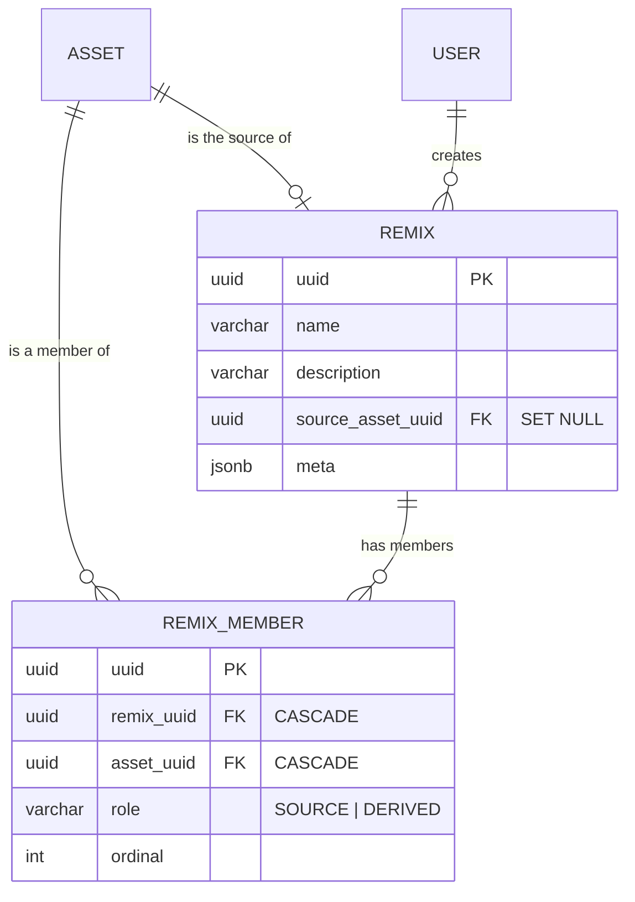

# Remix — Technical Specification

> Named groups of assets that are versions of one another: an original plus the cuts, re-encodes and
> edits made from it.
>
> **Related:** [../../loom/DOMAIN.md](../../loom/DOMAIN.md) §2 (entity) ·
> [../../loom/PERSISTENCE.md](../../loom/PERSISTENCE.md) (DAO layer) ·
> [../../loom/RESTAPI.md](../../loom/RESTAPI.md) (route conventions) ·
> [../../loom/MCP.md](../../loom/MCP.md) (tools) ·
> [../../loom/ui/LOOM_UI.md](../../loom/ui/LOOM_UI.md) (UI conventions) ·
> [../../tasks/ASSET_REMIX_PLAN.md](../../tasks/ASSET_REMIX_PLAN.md) (the implementation plan this
> was built from) · [../../guidelines/CODING.md](../../guidelines/CODING.md) (definition of done)

## 1. What a remix is, and what it is not

A remix is a curation artefact: a person decides that a set of assets are the same work in different
forms, names the group, and marks which member is the original.

| It is not | Because |
|---|---|
| Deduplication | Identical bytes are already one asset — `asset.sha512sum` is UNIQUE. Near-duplicates are `dedup_group` (`V2.61`), whose members are candidates for *removal*. A remix's members are all worth keeping. |
| Similarity search | That is the embedding/cluster path. A remix records a human decision, not a computed distance. |
| A collection | A collection groups by topic; its members have nothing to do with each other beyond the topic. A remix asserts that the members *are* one another. |
| Machine lineage | A node that produces a new asset from an old one still has nowhere to record that. See [../../concept/ASSET_METADATA_WRITE.md](../../concept/ASSET_METADATA_WRITE.md) §G3, which remains open. |

A remix holds assets, never other remixes. Nesting is deliberately not modelled.

## 2. History: why `asset_remix` was dropped

`V2.8` created `asset_remix (asset_a_uuid, asset_b_uuid, meta, created/creator, edited/editor)` — no
primary key, no unique constraint, no relation type, no direction, and no foreign key on
`editor_uuid`. Nothing ever wrote a row to it: outside generated jOOQ code the only references were
the integrity checks that had to special-case its missing uuid, plus a deferral comment in
`AssetCascadeTest`.

A pair table cannot express a group, a name, or which of two assets is the source — and the feature
it was meant to carry is a group. `V2.100` therefore drops it and replaces it with the model below,
which is lossless because the table was empty in every installation.

Dropping it also removed three special cases: the `hasUuid` exception in `AuditedTables`, the
pair-keyed `DanglingUserReferenceCheck.assetRemixEditor()`, and the `DANGLING_ASSET_REMIX_EDITOR`
code. The replacement tables declare foreign keys on both actor columns, so there is nothing left for
that check to find.

## 3. Data model



Migrations: `V2.100__add_remix.sql` (tables), `V2.101__remix_permissions.sql` (enum values only),
`V2.102__grant_remix_permissions.sql` (seed grant for the upgrade path).

Invariants and the reasoning behind them:

* **`ON DELETE SET NULL` on `remix.source_asset_uuid`, `CASCADE` on the member.** Deleting the
  original must not delete the group holding everything derived from it; a member row without its
  asset is meaningless. Same split as `dedup_group.keep_asset_uuid`.
* **At most one SOURCE per remix, enforced by the database.** `remix_member_single_source` is a
  *partial* unique index over `remix_uuid` where `role = 'SOURCE'`. A plain `UNIQUE (remix_uuid,
  role)` would also forbid a second DERIVED member.
* **`source_asset_uuid` is denormalised.** The authoritative source is the member with role SOURCE;
  `RemixDao.setSource` moves both inside one transaction.
* **`role` is `varchar` + named CHECK**, not a Postgres enum, so the vocabulary can grow without an
  `ALTER TYPE` migration.
* **Membership is idempotent.** `remix_member_unique (remix_uuid, asset_uuid)` plus
  `ON CONFLICT DO UPDATE`, so re-submitting an overlapping selection rewrites rather than fails.

## 4. Permissions

`CREATE_REMIX`, `READ_REMIX`, `UPDATE_REMIX`, `DELETE_REMIX` (`V2.101`), granted apart from the asset
permissions: grouping is curation, and a curator may build and rename groups without being allowed to
mutate the assets in them.

Every route that exposes the **members** additionally demands `READ_ASSET`, because the member list
carries filenames and hashes. Without that, a remix would be a side channel around asset visibility.
`RemixEndpointTest.testListingMembersRequiresAssetPermissionToo` is the test that holds this.

## 5. REST surface

| Route | Method | Permissions |
|---|---|---|
| `/remixes` | GET | `READ_REMIX` |
| `/remixes` | POST | `CREATE_REMIX` + `READ_ASSET` |
| `/remixes/:uuid` | GET | `READ_REMIX` |
| `/remixes/:uuid` | POST (update) | `UPDATE_REMIX` |
| `/remixes/:uuid` | DELETE | `DELETE_REMIX` |
| `/remixes/:uuid/assets` | GET | `READ_REMIX` + `READ_ASSET` |
| `/remixes/:uuid/assets` | POST (add N) | `UPDATE_REMIX` + `READ_ASSET` |
| `/remixes/:uuid/assets/:assetUuid` | DELETE | `UPDATE_REMIX` |
| `/remixes/:uuid/source` | POST | `UPDATE_REMIX` |
| `/assets/:uuid/remixes` | GET | `READ_REMIX` + `READ_ASSET` |

`POST /remixes` accepts the members inline. That is not a convenience: the calling gesture is
"combine these into a remix", and splitting it into create-then-add would leave a named but empty
remix behind whenever the second call failed.

## 6. Search

Remixes are indexed in `search_document` like every other searchable entity (`V2.103`). See
[../search/SEARCH.md](../search/SEARCH.md) §4.1b for the document, §4.2 for the triggers.

| Field | Source | Weight |
|---|---|---|
| `title` | `remix.name` | A |
| `subtitle` | `remix.description` | B |
| `keywords` | the filename of every member | D |

Points that are easy to get wrong:

* **Three tables feed one document**, so three triggers reach it: `remix`, `remix_member`, and
  `asset` (for a rename). The last is a fan-out, bounded because an asset sits in few remixes, and
  modelled on `search_tg_tag_fanout`. Dropping it would leave a remix findable under a filename that
  no longer exists - the failure is silent, which is why `RemixSearchTest` covers each path.
* **`/search/assets` can never return a remix.** It forces `types={asset}` server-side, so the UI
  goes to `/search/results?types=remix`. A client that reaches for the asset route because it is
  rendering an asset grid will get an empty band and no error.
* **`READ_REMIX` narrows the results**, via `TYPE_PERMISSIONS` in `SearchEndpointService`. A caller
  without it gets no remix hits and a warning saying so, rather than a silently smaller result.
* **How much of a filename matches.** Postgres' `simple` parser keeps the extension on the last
  segment: `razorbill_ledge.mp4` indexes as `'razorbill'` + `'ledge.mp4'`. So one token matches, and
  so does the whole filename with its extension - but not the filename with the extension stripped,
  which parses to a phrase the index cannot contain. This is a property of the index as a whole, not
  of remixes; `RemixSearchTest.testHowMuchOfAFilenameMatches` records it.

## 7. UI

Decisions, and why:

| Decision | Reasoning |
|---|---|
| Remix cards render in a pinned band at the front of the asset grid, not in their own view | A remix is something you browse alongside your assets. One screen instead of two. |
| Member assets stay visible in the main feed | Hiding them needs an anti-join on the hottest query in the product, and assets that vanish once grouped are a worse surprise than a file appearing twice. |
| Clicking a card opens a dialog, and writes `?remix=<uuid>` into the URL | Keeps the user's scroll position, while staying deep-linkable, shareable and drivable from a test or the screenshot script. |
| Creation via the existing selection mode plus a `...` overflow menu | `AssetBrowser` already had select mode, a `Set<string>` of ids and a bulk bar. The selection stays local component state; a clipboard that survives navigation is a different feature with its own questions. |
| A second path via `Add to remix...` on the asset detail page | Building a group of six from six detail pages would be six round trips; adding one asset you are already looking at should not require the grid. |
| A `Remixes` option in the asset browser's type filter, which hides the asset grid rather than filtering it | The other options narrow assets by mime; this one narrows to a different kind of thing entirely. Filtering the grid would leave it empty, since no asset has the type "remix". |
| Typing a query narrows the band to matching remixes rather than hiding it | The band means the same thing in both modes: the remixes relevant to what you are looking at. Hiding it during a search would make groups unfindable exactly when you are looking for something. |

## 8. Key Classes Reference

| Class | Package / path | Purpose |
|---|---|---|
| `Remix`, `RemixMember`, `RemixRole` | `loom/db/api/.../db/model/remix/` | Model interfaces; `RemixMember` projects the asset fields a card needs |
| `RemixDao` | `loom/db/api/.../db/model/remix/` | CRUD + membership; mirrors `CollectionDao` plus `setSource` |
| `RemixDaoImpl`, `RemixImpl`, `RemixMemberImpl` | `loom/db/jooq/.../db/jooq/dao/remix/` | jOOQ implementation |
| `RemixEndpoint` | `loom/services/rest/.../rest/endpoint/impl/` | Route registration |
| `RemixEndpointService` | `loom/services/rest/.../rest/service/impl/` | Permission checks and request handling |
| `RemixModelBuilder` | `loom/services/rest/.../rest/builder/` | DAO entity to response model |
| `RemixModelValidator` | `loom-shared/rest-model/.../rest/validation/` | Duplicate members, stray source, blank name |
| `RemixMethods` | `loom-client/common/.../method/` | Java client |
| `RemixMethods` (python) | `clients/python/loom_client/methods/remix.py` | Python client |
| `ListRemixesTool`, `GetRemixTool` | `loom/services/mcp/.../mcp/tool/impl/` | MCP tools |
| `RemixCard`, `RemixDialog`, `AddToRemixDialog` | `loom-ui/src/features/remix/` | UI |
| `RemixSearchTest` | `loom/db/jooq/src/test/.../search/` | Index sources, staleness, rebuild equivalence |
| `remixes.ts` | `loom-ui/src/api/` | UI REST client |

## 9. Conventions and Gotchas

* **`loadMembers` pages in insertion order**, `(created, uuid)` ascending — not "source first, then
  ordinal". Those would need a cursor over a computed boolean and a nullable int with mixed sort
  directions, which keyset paging cannot express as one row comparison. Both fields are on every
  member and the source is also on the remix, so a caller orders for display itself.
* **`loadMembers` projects the asset side with aliases.** `uuid`, `created`, `creator_uuid`,
  `edited` and `editor_uuid` exist on both tables, so a whole-table select would hand the mapper two
  candidates per name. The rows are mapped explicitly rather than by `fetchInto`, because `role` is a
  varchar on one side and an enum on the other.
* **`setSource` demotes before it promotes.** The partial unique index would reject a second SOURCE
  inside the same transaction otherwise. A promotion that finds no member throws, which rolls the
  demotion back with it — the endpoint service turns that into a 400.
* **`unlinkAsset` also clears `source_asset_uuid`** when the removed member was the source, so the
  pointer never outlives the membership it mirrors.
* **`RemixDaoTest` and `RemixMemberDaoTest` are split deliberately.** A DAO test class much over
  twenty methods exhausts the pooled-database provider — the same reason `TagPlacementDaoTest` was
  split out of `TagDaoTest`.
* **The UI's auth token is in memory only.** A full page reload logs the session out, so the e2e spec
  exercises `?remix=` through browser history rather than a fresh `page.goto`.
* **`AuditedTables` is not test-guarded.** Its javadoc claimed `DbIntegrityChecksTest` asserted it;
  no test has ever referenced the class, and the `share` tables from `V2.97` are missing from it as a
  result. `remix` and `remix_member` were added by hand.

## 10. Test Setup

```bash
# after any Flyway change, in this order
mvn -o install -pl loom/db/flyway && loom/db/jooq/generate.sh && ./setup-pool.sh

mvn -o test -pl loom/db/jooq -Dtest='RemixDaoTest,RemixMemberDaoTest,RemixSearchTest,AssetCascadeTest,DbIntegrityChecksTest'
mvn -o test -pl loom/core -Dtest='RemixEndpointTest,RemixMemberEndpointTest,SearchEndpointTest'
mvn -o test -pl loom/services/rest -Dtest='RolePermissionParityTest,LoomOpenAPITest'
mvn -o test -pl loom/services/mcp -Dtest=RemixToolTest

cd clients/python && ./test.sh && cd -

cd loom-ui
./node_modules/.bin/vitest run src/api/remixes.test.ts
./node_modules/.bin/playwright test e2e/remix-mocked.spec.ts    # npx hangs here; call the binary
node scripts/capture-remix-screenshots.mjs
```

A clean-rebuild of `loom/core` is required after any change to `DaoCollectionImpl` or an endpoint
constructor, or every dependent test fails with `NoSuchMethodError` on a generated Dagger factory.

## 11. Progress Assessment

- [x] Schema: `V2.100` tables, `V2.101` permissions, `V2.102` grant; jOOQ regenerated
- [x] Integrity checks retargeted; the `asset_remix` special cases removed
- [x] DAO stack + four DI registration points
- [x] DAO, membership and cascade tests; the `AssetCascadeTest` deferral comment discharged
- [x] REST models, validator, model builder, AssertJ assert
- [x] Endpoints, both registries, permissions in all five places, OpenAPI regenerated
- [x] Endpoint tests including per-permission 403 cases
- [x] Java and Python clients; parity tripwire raised to 334
- [x] Demo data (`DemoDatabaseInitializer.seedDemoRemix`) and test fixture (`REMIX_UUID`)
- [x] UI: api module, remix band, remix dialog, selection tray, asset-detail chips and picker
- [x] UI tests: vitest for the api module, mocked Playwright spec for the surfaces
- [x] MCP tools `list_remixes` and `get_remix`, with `RemixToolTest`
- [x] Customer documentation with four generated screenshots
- [ ] No `SearchEntityType.REMIX` — remixes are not in the search index; a remix is found by name
      through its own list route only
- [ ] No machine lineage. [../../concept/ASSET_METADATA_WRITE.md](../../concept/ASSET_METADATA_WRITE.md)
      §G3 stays open: a node producing a new asset from an old one still cannot record that
- [ ] No nesting, no per-member notes, no reordering UI (the `ordinal` column exists and is written,
      but nothing in the UI edits it yet)
- [ ] `RemixModelBuilderTest` snapshot against `src/test/resources/model/remix.response` not written;
      the builder is covered indirectly through the endpoint tests

## 12. Where do I find …?

| Concept | Path |
|---|---|
| Migrations | `loom/db/flyway/src/main/resources/db/migration/V2.10{0,1,2}__*.sql` |
| Model + DAO interfaces | `loom/db/api/src/main/java/io/metaloom/loom/db/model/remix/` |
| jOOQ implementation | `loom/db/jooq/src/main/java/io/metaloom/loom/db/jooq/dao/remix/` |
| DAO tests | `loom/db/jooq/src/test/java/io/metaloom/loom/db/jooq/dao/Remix*Test.java` |
| DI registration | `DaoCollection`, `DaoCollectionImpl`, `DaoProvider`, `JooqLoomDaoBindModule` |
| REST models | `loom-shared/rest-model/src/main/java/io/metaloom/loom/rest/model/remix/` |
| Endpoint + service | `loom/services/rest/.../endpoint/impl/RemixEndpoint.java`, `.../service/impl/RemixEndpointService.java` |
| Route registries | `rest/dagger/EndpointModule.java`, `rest/openapi/LoomOpenAPI.java` |
| Endpoint tests | `loom/core/src/test/java/io/metaloom/loom/core/endpoint/test/Remix*EndpointTest.java` |
| MCP tools | `loom/services/mcp/src/main/java/io/metaloom/loom/mcp/tool/impl/{List,Get}Remix*Tool.java` |
| UI | `loom-ui/src/features/remix/`, `loom-ui/src/api/remixes.ts`, `loom-ui/src/features/assets/AssetBrowser.tsx` |
| UI tests | `loom-ui/src/api/remixes.test.ts`, `loom-ui/e2e/remix-mocked.spec.ts` |
| Screenshots | `loom-ui/scripts/capture-remix-screenshots.mjs` |
| Customer docs | `website/content/english/docs/loom/remixes/index.adoc` |
| Demo data | `loom/core/.../boot/DemoDatabaseInitializer.java` (`seedDemoRemix`) |
| Test fixture | `loom/fixture/.../TestFixtureProvider.java` (`createRemix`), `TestValues.REMIX_UUID` |

_Git HEAD revision: `e42aa8a9`_
_Last updated: 2026-08-12 (search support added: V2.103 indexes remixes in search_document, and the
asset browser gained a Remixes type filter. Created earlier the same day alongside the initial
implementation; supersedes PERSISTENCE_TASKS.md Task 7.)_
