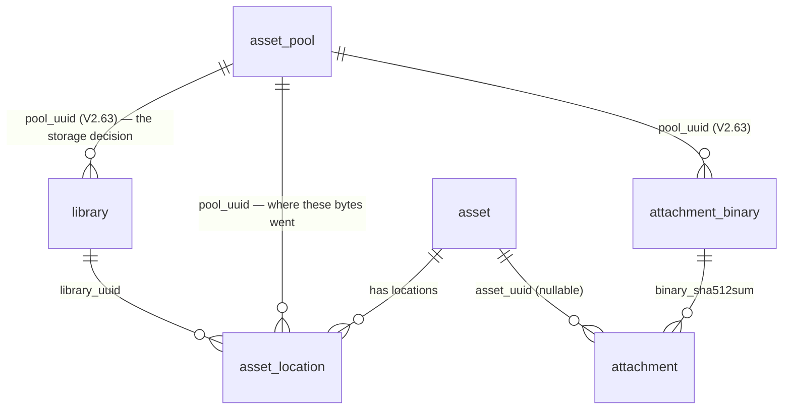
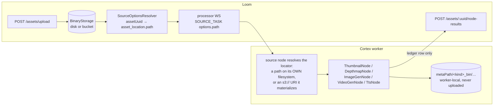

# REST Binary Handling

How raw bytes enter, leave and are stored by Loom's REST API — the asset binary subsystem, the
attachment subsystem, and what Cortex does (and does not) do with binary artefacts.

> **Read first**: [../../CONTEXT.md](../../CONTEXT.md) → [../../guidelines/CODING.md](../../guidelines/CODING.md).
> **Companion specs**: [../../loom/RESTAPI.md](../../loom/RESTAPI.md) (transport, auth, OpenAPI),
> [../../loom/DOMAIN.md](../../loom/DOMAIN.md) (entities), [../permissions/PERMISSIONS.md](../permissions/PERMISSIONS.md)
> (authorization), [../pipeline/PIPELINE.md](../pipeline/PIPELINE.md) (how a run resolves a media path),
> [../pipeline-nodes/NODES.md](../pipeline-nodes/NODES.md) (where node artefacts land),
> [../../CLUSTERING.md](../../CLUSTERING.md) (why the per-process storage cache is only safe single-writer),
> [REST_CORTEX_METADATA_BINARY_HANDLING_PLAN.md](REST_CORTEX_METADATA_BINARY_HANDLING_PLAN.md)
> (the unbuilt Cortex→Loom artefact write-back).

**Delineation.** This file owns *bytes over REST*: multipart upload, raw download, storage layout,
backend selection, the binary metadata record, and the Loom↔Cortex artefact story. REST auth, CORS,
paging and OpenAPI mechanics live in [../../loom/RESTAPI.md](../../loom/RESTAPI.md); entity shapes in
[../../loom/DOMAIN.md](../../loom/DOMAIN.md).

---

## 1. Executive Summary — the answers

| Question | Answer |
|---|---|
| Create the asset first, or upload bytes first? | **Both work.** One-step: `POST /api/v1/assets/upload` (multipart) creates asset + `asset_location` row + stored bytes and auto-triggers a pipeline. Two-step: `POST /api/v1/assets` (JSON, client-computed SHA-512 required) then `POST /api/v1/assets/:uuid/binary/data`. |
| Which endpoints move actual bytes? | **Five**: `POST /assets/upload`, `POST /assets/:uuid/binary/data`, `GET /assets/:uuid/binary/data`, `POST /attachments`, `GET /attachments/:uuid/data`. Everything else under `/binaries` and `/assets/:uuid/binary` is **JSON metadata only**. |
| Is binary handling S3-aware? | **Yes.** A library points at an `asset_pool`; the pool's `fs_path` XOR `s3_bucket` decides the backend. Credentials come from `LOOM_S3_*`, never the database. §5. |
| Does replacing a binary update the S3 object? | **Yes.** `POST /assets/:uuid/binary/data` PUTs the object, rewrites `asset_location.path` to the new `s3://bucket/key` and reclaims the previous object when nothing else references it. |
| Can Cortex upload binary data to Loom? | **The client can express it** — `uploadAsset`, `uploadAssetBinary`, `uploadAttachment(File,…)`, `downloadAssetBinary`, `downloadAttachment`. **No node calls them yet** (§7.2, G2). |
| How is a thumbnail handled today? | Still **never uploaded**. `ThumbnailNode` renders into the worker-local `metaPath/thumbnail_bin/…` cache and records only a ledger row via `POST /assets/:uuid/node-results`. Same for depthmap, imagegen, videogen, TTS. |

---

## 2. Endpoint Inventory

Base path `/api/v1`. Every route sits behind `secure(basePath() + "*")` — JWT bearer header or the
`__Host-loom_token` cookie ([../../loom/RESTAPI.md](../../loom/RESTAPI.md) §2).

### 2.1 Byte-carrying routes

| Method | Path | Body in | Body out | Permission | Handler |
|---|---|---|---|---|---|
| POST | `/assets/upload` | `multipart/form-data`: one file part + `libraryUuid` (required) + `origin` (optional, default `upload`) | `AssetResponse`; **201** new content, **200** when the SHA-512 already exists | `CREATE_ASSET` | `AssetUploadEndpointService.upload` |
| POST | `/assets/:uuid/binary/data` | `multipart/form-data`: one file part + `libraryUuid` (conditional, see below) | `AssetBinaryResponse`, **201** | `CREATE_ASSET_BINARY` | `AssetUploadEndpointService.uploadForAsset` |
| GET | `/assets/:uuid/binary/data` | optional `Range: bytes=` | raw bytes, **200**/**206**/**416**; `Content-Type` from `asset_location.mime_type`, `Content-Disposition: attachment`, `Accept-Ranges: bytes` | `READ_ASSET_BINARY` | `AssetBinaryEndpointService.downloadByAssetUuid` |
| POST | `/attachments` | `multipart/form-data`: one file part + optional `assetUuid`, `embeddingUuid`, `type`, `poolUuid` | `AttachmentResponse` | `CREATE_ATTACHMENT` | `AttachmentEndpointService.create` |
| GET | `/attachments/:uuid/data` | — (**no `Range` support**) | raw bytes, `Content-Type` + `Content-Disposition` from the row | `READ_ATTACHMENT` | `AttachmentEndpointService.download` |

- Exactly **one** file part per request (`singleUpload` → 400 on zero or many).
- `libraryUuid` on `/binary/data` is required when the asset has **no** binary yet, and when it has
  **more than one** (400 rather than silently replacing the wrong library's copy). Optional when the
  asset has exactly one. On `/assets/upload` it is always required.
- `POST /attachments` with no `type` form field defaults to `AttachmentType.EMBEDDING_ATTACHMENT`
  (historic behaviour, kept so pre-existing callers are unaffected).

### 2.2 Binary *metadata* routes (JSON only — no bytes)

| Method | Path | Purpose | Permission |
|---|---|---|---|
| POST | `/binaries` | Register a record (`assetUuid`, `libraryUuid`, optional `poolUuid`, and either `filesystem.path` or `s3.{bucket,objectPath}`) | `CREATE_ASSET_BINARY` |
| GET | `/binaries` · `/binaries/:uuid` | Paged list · load one | `READ_ASSET_BINARY` |
| POST | `/binaries/:uuid` | Update path (fs or s3) / meta | `UPDATE_ASSET_BINARY` |
| DELETE | `/binaries/:uuid` | Delete the **row**, then reclaim the bytes if unreferenced | `DELETE_ASSET_BINARY` |
| POST | `/assets/:uuid/binary` | Register a record for that asset | `CREATE_ASSET_BINARY` |
| GET | `/assets/:uuid/binary` | The asset's **primary** binary (`loadPrimaryByAssetUuid`, oldest row) | `READ_ASSET_BINARY` |
| GET | `/assets/:uuid/binaries` | **All** binaries — one per library the asset was imported into | `READ_ASSET_BINARY` |
| DELETE | `/assets/:uuid/binary` | Delete **all** rows of the asset, reclaiming each | `DELETE_ASSET_BINARY` |

### 2.3 Adjacent subsystems

| Path | Reality |
|---|---|
| `/attachments/:uuid` (GET/POST/DELETE) | JSON CRUD; bytes at `/attachments/:uuid/data`. Attachment **provenance** (`node_kind`, `variant`, `run_uuid`, …) exists in the DB since V2.44 and is still unmapped in REST — plan Phase A. Deleting an attachment does **not** reclaim its bytes (§3.4). |
| `/pools` (GET/POST/DELETE) | `asset_pool` CRUD (fs path **or** S3 bucket/region/endpoint). This is now load-bearing: the pool a library points at decides the backend. |
| `/chat-sessions/:uuid/fs/…` | The chat sandbox's own file streaming (`SessionFsEndpointService.sendFile`) — unrelated to asset binaries. See [../../loom/ui/CHAT.md](../../loom/ui/CHAT.md). |

---

## 3. The Workflows

```mermaid
graph TB
    subgraph A["A · One-step upload"]
        A1["POST /assets/upload<br/>multipart + libraryUuid"] --> A2["hash bytes (SHA-512)"]
        A2 --> A2b["library.pool_uuid → asset_pool<br/>→ BinaryStorage"]
        A2b --> A2c["checkCapacity<br/>(413 / 507)"]
        A2c --> A3["store at &lt;backend&gt;/ab/cd/ef/&lt;sha512&gt;"]
        A3 --> A4{"asset with this<br/>sha512 exists?"}
        A4 -->|no| A4b["INSERT asset"]
        A4 -->|yes| A4c["reuse it, answer 200"]
        A4b --> A5["INSERT/UPDATE asset_location<br/>(locator, mime, pool_uuid)"]
        A4c --> A5
        A5 --> A6["publish loom.asset.created<br/>(new content only)"]
        A6 --> A7["AssetPipelineTrigger → run<br/>(source node gets the locator)"]
    end
    subgraph B["B · Two-step (asset row first)"]
        B1["POST /assets<br/>JSON, sha512 REQUIRED"] --> B2["POST /assets/:uuid/binary/data"]
        B2 --> B3["store content-addressed"]
        B3 --> B4["UPDATE or INSERT asset_location<br/>+ reclaim previous bytes"]
    end
    subgraph C["C · Register bytes that already exist"]
        C1["POST /assets/:uuid/binary<br/>JSON filesystem.path or s3"] --> C2["INSERT asset_location only<br/>(no bytes touched, target NOT verified)"]
    end
```



### 3.1 Which one to use

- **A** is the only path producing a complete, pipeline-ready asset from nothing.
- **B** is what the UI uses when an asset row exists. `POST /assets` requires `hashes.sha512` from the
  caller — `asset.sha512sum` is `NOT NULL` (V2.46), so there is no hash-free asset.
- **C** points a record at a locator Loom neither verifies nor owns (scanner/import flows). The
  download route then 404s with *"Binary file is missing in &lt;backend&gt;."*

### 3.2 Replace / update semantics

`POST /assets/:uuid/binary/data` on an asset that already has a binary in the target library
**updates that row in place** (new locator, new `mimeType`, `editor_uuid` bumped, `pool_uuid`
re-resolved) and preserves `library_uuid`. The previously referenced object is reference-counted and
unlinked when nothing else points at it (§3.4).

Uploading content Loom already holds resolves to the **existing asset** (`asset.sha512sum` is
UNIQUE). `POST /assets/upload` answers 200 rather than 201 and does **not** re-publish
`loom.asset.created` — the asset was processed when it first arrived.

### 3.3 Delete semantics

| Operation | Rows | Bytes |
|---|---|---|
| `DELETE /binaries/:uuid` | one `asset_location` | reclaimed if unreferenced |
| `DELETE /assets/:uuid/binary` | all of the asset's rows | each reclaimed if unreferenced |
| `DELETE /assets/:uuid` | rows via FK `ON DELETE CASCADE` | **leaked** (`AssetEndpointService.delete` does not call the reclaimer) |
| `DELETE /attachments/:uuid` | the attachment row | **leaked** (deliberate — see below) |

### 3.4 Byte reclamation

Storage is content-addressed, so an object is frequently shared: the same file in two libraries, or a
re-upload of something already present. `BinaryReclaimer.reclaim` therefore counts `asset_location`
rows on `(pool_uuid, path)` **after** the row is gone (`countByPoolAndPath`) and only unlinks at
zero. Unconditional deletion would blank the download of every asset that deduplicated onto the same
bytes.

A reclaim failure is logged and swallowed: the row is already deleted, so failing the request would
tell the caller the delete failed when the part they asked for succeeded, and a retry would 404.

**Not reclaimed** (G13): bytes behind `DELETE /assets/:uuid` (the FK cascade bypasses the endpoint),
and `attachment_binary` bytes (a shared content-addressed row keyed by `sha512sum` that outlives any
single attachment; no reference count spans both tables).

---

## 4. Storage Layout

`StorageKeys.contentKey(sha512)` is the **single definition** of the layout and is shared by both
backends, so a filesystem pool can be rsynced into a bucket (or back) without rewriting a row:

```
<backend root>/<hex[0:2]>/<hex[2:4]>/<hex[4:6]>/<hex>
      e.g.  data/storage/9b/71/d2/9b71d224…c7f0
            s3://metaloom-archive-prod/9b/71/d2/9b71d224…c7f0
```

- `hex` is the lowercase SHA-512 of the bytes; the file/object has **no extension**.
- Content-addressed dedupe: `store` is idempotent — if the target already exists nothing is copied
  and the same locator is returned.
- `FilesystemBinaryStorage.store` uses `Files.createDirectories` + `Files.copy` (**not** a move: the
  multipart temp dir is frequently on another device, where an atomic move fails outright). Vert.x
  deletes the multipart temp file at end of request either way.
- The bytes are stored **before** anything is written to the DB, so a storage failure never leaves an
  asset or an attachment pointing at missing content.
- `DemoDatabaseInitializer.createImageAsset(...)` paints synthetic demo images into the same layout so
  the asset browser has real previews.

---

## 5. Storage backends: filesystem and S3

### 5.1 How a backend is chosen

```
upload → libraryUuid → library.pool_uuid → asset_pool
                                              ├─ s3_bucket set   → S3BinaryStorage      (kind "s3")
                                              └─ fs_path set     → FilesystemBinaryStorage
         library.pool_uuid IS NULL            → FilesystemBinaryStorage(LOOM_STORAGE_UPLOAD_DIR)
```

`BinaryStorageResolver` is the only class that knows both halves — the `asset_pool` row (database,
operator-editable) and the process configuration (`LOOM_S3_*`, `LOOM_STORAGE_UPLOAD_DIR`, never in
the database). A pool row declaring neither is a 400; an unknown `poolUuid` is a 404.

The discriminator lives on **`asset_pool`** (V2.20: `fs_path` XOR `s3_bucket`, CHECK-enforced). V2.63
added the missing link `library.pool_uuid` so an upload, which only knows a `libraryUuid`, can reach
it. `pool_uuid` is nullable everywhere and NULL means "the process-wide local upload directory" —
what every pre-pool row holds, so no installation has to create a pool to keep working.
`ON DELETE RESTRICT`, not `SET NULL`: silently re-pointing a library at local disk after its bucket
row was deleted would scatter an asset's bytes across two backends with no record of it.

`storageTypeOfPool` is memoized separately from the backend cache so that listing libraries never
fails on a misconfigured pool — it reports the declared kind instead of building a client.
`LibraryModelBuilder` deliberately does not set `storageType`; `LibraryEndpointService` fills it in
because the builder has no DAO.

### 5.2 Locators

`asset_location.path` holds whatever the backend needs to find the bytes:

| Backend | `asset_location.path` |
|---|---|
| local upload dir / filesystem pool | `baseDir.resolve(contentKey)` — a full path, absolute only if the configured base dir is (the dev default `data/storage` is relative) |
| S3 pool | `s3://<bucket>/ab/cd/ef/<sha512>` |

🔴 **The `s3://` form is a contract with Cortex, not an internal detail.** `io.metaloom.cortex.s3.S3Uri`
parses exactly this and `S3MediaMaterializer` is what lets a worker process an S3-hosted asset at all;
a bare object key would make every asset in an S3-backed library unprocessable. `S3LocatorTest` pins
the grammar on the Loom side. The classes are duplicated rather than shared because a
`loom-service-s3 → cortex-s3-common` dependency would tie the server's build to the worker's.

⚠️ The `COMMENT ON COLUMN "asset_location"."path"` written by V2.63 says *"an object key for S3 pools.
Not a URL"*. That is **wrong** — `S3BinaryStorage.store` and `locatorFor` both return
`S3Locator.toReference()`. Trust the code.

`AssetBinaryModelBuilder` reads the locator (not the pool) to decide the response shape: an
`s3://`-prefixed path yields `storageType: "s3"` + a populated `s3` object, everything else
`storageType: "filesystem"` + `filesystem`. Deriving from the locator means a row still describes
itself correctly after its pool has been edited or deleted.

### 5.3 Credentials

Bucket, region and endpoint are **configuration** and live on the pool row, editable through `/pools`.
Access and secret keys are **secrets** and live on the process (`LOOM_S3_ACCESS_KEY` /
`LOOM_S3_SECRET_KEY`), so they never enter the database, a REST response or a backup. Leaving them
unset is valid on EKS/ECS — the AWS default credential chain applies (IRSA, instance roles, `~/.aws`).
One credential set serves every S3 pool; multi-account setups are not supported.

### 5.4 What is still not S3-aware

| Surface | State |
|---|---|
| Cortex artefact write-back (thumbnails, depth maps) | Not built — [REST_CORTEX_METADATA_BINARY_HANDLING_PLAN.md](REST_CORTEX_METADATA_BINARY_HANDLING_PLAN.md) |
| Presigned URLs | Not built. Every S3 download is proxied through Loom — a hop per thumbnail |
| Per-pool credentials | Not built (§5.3) |
| SHA-512 as S3 object metadata | Not built — plan §C2 |
| Editing a pool's bucket/endpoint at runtime | Requires a restart (§12, G15) |
| Migrating bytes when a library's pool changes | Not built — only new uploads follow the new pool |

---

## 6. Data Model



- The REST "binary" **is the `asset_location` table**. `AssetBinaryDao`/`AssetBinaryDaoImpl` and
  `AssetLocationDao`/`AssetLocationDaoImpl` are two DAOs over the *same* table; only the binary one is
  exposed over REST and there is no `/api/v1/locations` endpoint. ⚠️ Only `AssetLocationDao` has a DAO
  test (`AssetLocationDaoTest`); the REST-facing `AssetBinaryDao` — including
  `loadPrimaryByAssetUuid`, `loadByAssetAndLibrary` and the `countByPoolAndPath` the reclaimer depends
  on — is covered only indirectly through endpoint tests (G16).
- V2.20 added `UNIQUE (asset_uuid)` ("one binary per asset"); **V2.48 dropped it** for
  `UNIQUE (library_uuid, path)`, restoring many-locations-per-asset. The REST layer matches: §2.2.
- **V2.63** added `library.pool_uuid` and `attachment_binary.pool_uuid`, plus index
  `asset_location_pool_path_idx (pool_uuid, path)` serving the reference count.
- `attachment_binary(sha512sum, size, pool_uuid)` is the content table for attachments; the row is
  written by `AttachmentDaoImpl.store`, the bytes by `AttachmentEndpointService.create`. It has **no
  locator column** — the download route re-derives one via `BinaryStorage.locatorFor(sha512)`, which is
  sound only because the layout is content-addressed.

---

## 7. Loom ↔ Cortex: where binary artefacts actually go



### 7.1 Reading the source bytes

`PipelineEndpointService.sourceOptions(...)` → `assetBinaryDao.loadPrimaryByAssetUuid(uuid).getPath()`
→ `SourceOptionsResolver`, which sets `path` for a single asset and `pathGlobs` for several. The
**locator string** crosses the wire — never the bytes.

| Locator | Worker behaviour | Constraint |
|---|---|---|
| a filesystem path | opens it directly on its own filesystem | 🔴 the worker must see Loom's storage at the **identical path** (shared volume / same host) — G12 |
| `s3://bucket/key` | `S3MediaMaterializer` downloads it into the worker's cache | needs `CORTEX_S3_*` on the worker; no shared filesystem required |

Uploading into an S3-backed library therefore also removes the co-location constraint. Assets with no
binary row are logged as *"No stored binary path for asset X; it cannot be included in the run"* and
dropped from the run.

### 7.2 Writing artefacts back

No Cortex node uploads bytes — a `grep` for `uploadAsset|uploadAssetBinary|uploadAttachment` across
`cortex/` returns nothing. `AbstractMediaNode` reaches Loom for exactly two things:
`client().loadAsset(sha512)` and `client().createAssetNodeResult(...)`. `ThumbnailNode` states why in
the source:

> *"The thumbnail bytes live in the local thumbnail_bin cache; record the ledger marker that this node
> produced it for the asset. Uploading the bytes into the asset binary subsystem requires a target
> library the node does not have, so that remains a follow-up."*

`DepthmapNode`, `ImageGenNode`, `VideoGenNode` and `TtsNode` follow the same pattern.
`DaoAssetSink.persist(...)` maps **only** SHA-512/SHA-256/MD5 onto the asset and logs everything else
via `warnAboutUnmapped` as *"has no asset mapping and was not persisted"*.

**Consequence: a pipeline-generated thumbnail is still not retrievable through any Loom API.** The
UI's asset preview is the *original* binary (`GET /assets/:uuid/binary/data`), scaled by the browser.

The wall is now on the node side only — the byte-ingest endpoints, attachment storage and the
multipart client methods all exist. Closing it is
[REST_CORTEX_METADATA_BINARY_HANDLING_PLAN.md](REST_CORTEX_METADATA_BINARY_HANDLING_PLAN.md) Phase B.
The one exception is `s3-sink`, which uploads to a bucket named in the pipeline definition and
registers the artefact as a new asset — see that plan's §7 B5.

---

## 8. Gaps

### 8.1 Closed

| # | Gap | Resolution |
|---|---|---|
| **G1** | REST treated `asset_location` as one-to-one | `loadPrimaryByAssetUuid` (ordered + limited, no `TooManyRowsException`/500) plus `loadAllByAssetUuid`, `loadByAssetAndLibrary`, `GET /assets/:uuid/binaries` |
| **G3** | Attachments accepted bytes and discarded them | Bytes stored via `BinaryStorage` into the parent asset's pool; `GET /attachments/:uuid/data` added |
| **G4** | Stored files were never deleted | `BinaryReclaimer`, reference-counted on `(pool_uuid, path)` — §3.4. Two leaks remain (G13) |
| **G5** | Helm set `LOOM_BINARY_DIR`, the process read `LOOM_STORAGE_UPLOAD_DIR` | Chart emits both; `StorageOptions.overrideWithEnv` honours the alias, canonical name wins |
| **G6** | No `Range` support | Single-range → 206 + `Content-Range`; 416 when unsatisfiable; `Accept-Ranges` always advertised; multi-range answered with the full entity (RFC 9110 permits it) |
| **G7/G9** | No Java test for the byte routes; `UPDATE_ASSET_BINARY` untested | `AssetBinaryDataEndpointTest` (12 cases incl. 403s), `FilesystemBinaryStorageTest`, `S3LocatorTest`, `ByteRangeTest` |
| **G8** | S3 modelled but unimplemented | §5 |
| **G10** | Byte routes undocumented in OpenAPI | `addUploadRoute` sets `consumes: multipart/form-data`, `addDownloadRoute` sets `produces: application/octet-stream` |
| **G11** | Unbounded uploads | `LOOM_STORAGE_MAX_UPLOAD_SIZE` (413) and `LOOM_STORAGE_MIN_FREE_SPACE` (507). Object stores report no capacity, so the free-space check is skipped there |
| — | Re-uploading known content 500'd on the unique `sha512sum` | Upload resolves to the existing asset (§3.2) |
| — | The `s3` field of `AssetBinaryResponse` was never populated | `AssetBinaryModelBuilder.toResponse` derives `storageType` + `s3`/`filesystem` from the locator (§5.2) |

### 8.2 Open

| # | Gap | Consequence |
|---|---|---|
| **G2** | No artefact upload path for Cortex | Thumbnails, generated images, TTS audio and depth maps are computed and stranded on the worker. Endpoints and client methods exist; node-side work is the plan file |
| **G12** | Loom and Cortex must share a filesystem for filesystem-backed libraries | An upload is unprocessable by a worker that cannot see Loom's storage at the identical path. S3-backed libraries do not have this constraint |
| **G13** | Attachment bytes and cascade-deleted asset bytes are not reclaimed | §3.3/§3.4 |
| **G14** | Attachment provenance (V2.44) is invisible to REST | `node_kind`, `variant`, `run_uuid` … exist in the DB and are not mapped. Plan Phase A |
| **G15** | Pool edits need a restart | `BinaryStorageResolver` caches one backend per pool uuid and never evicts |
| **G16** | `AssetBinaryDao` has no DAO test | The REST-facing DAO over `asset_location` — including the reclaimer's `countByPoolAndPath` — is only exercised through endpoint tests. `AssetLocationDaoTest` covers the *other* DAO over the same table ([../../guidelines/CODING.md](../../guidelines/CODING.md) requires DAO + delete-cascade tests) |

### 8.3 Missing use cases (nothing built)

- Retrieve a **generated** thumbnail / poster frame / proxy / waveform — the `attachment_type` values
  exist since V2.44 with no producer (G2/G14).
- Resumable or chunked upload (single-shot multipart only, one file part per request).
- Server-side mime sniffing — the mime type is taken verbatim from the multipart part, or guessed from
  the file extension in `DaoAssetSink.mimeTypeOf`.
- Presigned / time-limited download URLs (every download needs a JWT or the cookie; that is why demo
  screenshots must be taken from the container — [../../website/WEBSITE.md](../../website/WEBSITE.md)).
- Migrating existing binaries when a library's pool changes.
- Multi-account S3 credentials (§5.3).

---

## 9. Test Setup

```bash
./setup-pool.sh                                           # MANDATORY before any Java test, and again after any Flyway change
mvn test -pl loom/services/fs,loom/services/s3            # storage backends, no DB needed
mvn test -pl loom/services/rest -Dtest=ByteRangeTest      # Range header parsing
mvn test -pl loom/core -Dtest=AssetBinaryDataEndpointTest # the byte routes, against a booted server
mvn test -pl loom/core -Dtest=AssetBinaryEndpointTest     # JSON CRUD + 403 permission cases
mvn test -pl loom/core -Dtest=AttachmentEndpointTest
cd loom-ui && npx playwright test e2e/assets-backend.spec.ts   # REAL backend: upload → download → delete
cd loom-ui && npx vitest run src/api/binaries.test.ts          # URL/verb assertions
```

| Test | Module | Covers |
|---|---|---|
| `AssetBinaryDataEndpointTest` | `loom/core` | 12 cases: upload, download round-trip, replace, multi-library cardinality, ambiguous-replace 400, `Range` 206/416, `Accept-Ranges`, repeated content → one asset, shared-byte reclaim, 403 on upload and download |
| `FilesystemBinaryStorageTest` | `loom/services/fs` | Content-addressed layout, `locatorFor`/`store` agreement, dedupe, byte ranges, free space before the dir exists |
| `S3LocatorTest` | `loom/services/s3` | 🔴 The `s3://bucket/key` grammar — a contract with Cortex's `S3Uri`, not a formatting preference |
| `ByteRangeTest` | `loom/services/rest` | The ranges a `<video>` element actually sends |
| `AssetBinaryEndpointTest` | `loom/core` | `/binaries` + `/assets/:uuid/binary` CRUD, paging, 403s. Extends `AbstractCRUDEndpointTest`; fixture UUID is `ASSET_LOCATION_UUID` |
| `AssetLocationDaoTest` | `loom/db/jooq` | The *non*-REST DAO over `asset_location` (see G16) |
| `assets-backend.spec.ts` | `loom-ui/e2e` | End-to-end byte routes against a live server |
| `binaries.test.ts` | `loom-ui` (vitest, node env) | `uploadAssetBinary` / `fetchAssetBinaryBlob` / `createAssetBinaryMeta` build the right URLs and verbs |
| `library-thumbnails-mocked.spec.ts` | `loom-ui/e2e` | The grid points `` at `/binary/data` for images only |

**Writing a new byte-route test.** Use the multipart client methods (`uploadAsset`,
`uploadAssetBinary`, `downloadAssetBinary`); drop to `java.net.http.HttpClient` only for headers the
client cannot set, such as `Range`. Point the test at a temp storage directory by configuring the
**inherited** `loom` extension from the test constructor —
`loom.withOptions(o -> o.getStorage().setUploadDirectory(tmp))` — never by redeclaring
`@RegisterExtension`, which shadows the field the base-class helpers use. Grant permissions via
group+role, never a direct user grant ([../permissions/PERMISSIONS.md](../permissions/PERMISSIONS.md)).

⚠️ A 20+ method endpoint test class exhausts the test database pool: the last few error in
`beforeEach` with a connection failure and pass in isolation. That is capacity, not a regression.

---

## 10. Key Classes Reference

| Class | Package (module) | Purpose |
|---|---|---|
| `BinaryStorage` | `io.metaloom.loom.storage` (`loom-service-fs`) | **The seam.** `kind`, `store`, `locatorFor`, `exists`, `size`, `read(locator, offset, length)`, `localPath`, `delete`, `freeSpace`, `describe` |
| `FilesystemBinaryStorage` | `io.metaloom.loom.storage.fs` | Directory backend (`KIND = "filesystem"`); returns full paths so a Cortex worker can open them |
| `S3BinaryStorage` | `io.metaloom.loom.storage.s3` (`loom-service-s3`) | Bucket backend on AWS SDK v2 (`KIND = "s3"`); returns `s3://bucket/key`; `freeSpace()` is null |
| `S3Locator` | `io.metaloom.loom.storage.s3` | 🔴 The `s3://` grammar shared with Cortex's `S3Uri` (`parse`, `toReference`, `isS3`) |
| `StorageKeys` | `io.metaloom.loom.storage` | The single definition of `ab/cd/ef/<sha512>` |
| `BinaryStorageResolver` | `io.metaloom.loom.rest.service.impl` | library → pool → backend; `forLibrary`, `forPool`, `poolUuidOfLibrary`, `storageTypeOfPool`. Caches per pool uuid, never evicts |
| `BinaryReclaimer` | `io.metaloom.loom.rest.service.impl` | Package-private static; reference-counted unlink **after** a row is deleted or re-pointed |
| `AssetUploadEndpointService` | `io.metaloom.loom.rest.service.impl` | **The only class that writes asset bytes.** `upload`, `uploadForAsset`, `resolveTarget`, `checkCapacity`, `singleUpload` |
| `AssetBinaryEndpointService` | `io.metaloom.loom.rest.service.impl` | Binary metadata CRUD, fs/S3 create+update, `downloadByAssetUuid` (Range + `sendFile` fast path), `listByAssetUuid`, `deleteByAssetUuid`, nested `ByteRange` record |
| `AttachmentEndpointService` | `io.metaloom.loom.rest.service.impl` | Attachment CRUD; stores bytes into the parent asset's pool, `download` re-derives the locator from `sha512sum`; delete does **not** reclaim |
| `AssetPoolEndpointService` / `AssetPoolEndpoint` | `io.metaloom.loom.rest.service.impl` / `…endpoint.impl` | `/api/v1/pools` CRUD — load-bearing since V2.63 |
| `AbstractEndpoint` | `io.metaloom.loom.rest` | `addUploadRoute` / `addDownloadRoute` — the OpenAPI `consumes`/`produces` for byte routes |
| `AssetEndpoint` | `io.metaloom.loom.rest.endpoint.impl` | `/assets/upload` (~L141), `/assets/:uuid/binary[ies]` (~L559-589), `/assets/:uuid/binary/data` upload ~L593 / download ~L602 |
| `AssetBinaryEndpoint` | `io.metaloom.loom.rest.endpoint.impl` | Registers `/api/v1/binaries` |
| `AttachmentEndpoint` | `io.metaloom.loom.rest.endpoint.impl` | `/api/v1/attachments` (upload at the base path, `/:uuid/data` download) |
| `AssetBinaryModelBuilder` | `io.metaloom.loom.rest.builder` | `AssetBinary` → `AssetBinaryResponse`; picks `s3` vs `filesystem` + `storageType` **from the locator** |
| `LibraryModelBuilder` | `io.metaloom.loom.rest.builder` | Deliberately leaves `storageType` null — `LibraryEndpointService` fills it via the resolver |
| `AssetBinaryDao` / `AssetBinaryDaoImpl` | `io.metaloom.loom.db.model.asset` / `…jooq.dao.asset.binary` | Maps to **`asset_location`**; cardinality contract: `loadPrimaryByAssetUuid`, `loadAllByAssetUuid`, `loadByAssetAndLibrary`, `countByPoolAndPath`, `deleteByAssetUuid`. No DAO test (G16) |
| `AssetLocationDao` / `AssetLocationDaoImpl` | `io.metaloom.loom.db.model.asset` / `…jooq.dao.asset.location` | Second DAO over the same table (`findForAsset`), not exposed over REST |
| `AssetEventPublisher` / `AssetPipelineTrigger` | `io.metaloom.loom.rest.service.impl` | `loom.asset.created` → auto-run a mime-matched pipeline after upload |
| `SourceOptionsResolver` | `io.metaloom.loom.rest.service.impl` | `mediaUuids` → `path` (one) or `pathGlobs` (many) source options |
| `DaoAssetSink` | `io.metaloom.loom.rest.service.impl` | Persists node outputs — hashes only; `warnAboutUnmapped` logs the rest |
| `StorageOptions` | `io.metaloom.loom.api.options` (`loom-shared/api`) | `uploadDirectory` (default `data/storage`), `maxUploadSize`, `minFreeSpace`; `overrideWithEnv` applies the `LOOM_BINARY_DIR` alias first |
| `S3Options` | `io.metaloom.loom.api.options` | `LOOM_S3_*` endpoint/region/keys/path-style |
| `AssetBinaryMethods` | `io.metaloom.loom.client.common.method` | JSON CRUD **plus** `uploadAsset(File, libraryUuid, mimeType)`, `uploadAssetBinary(assetUuid, File, libraryUuid, mimeType)`, `downloadAssetBinary(assetUuid)` |
| `AttachmentMethods` | `io.metaloom.loom.client.common.method` | `uploadAttachment(filename, mimeType, InputStream)`, `uploadAttachment(File, mimeType, assetUuid, type)`, `downloadAttachment` |
| `LoomBinaryResponse` | `io.metaloom.loom.client.common` | Client-side streaming response (`InputStream` / `Flowable<byte[]>`); used by `downloadAssetBinary` and `downloadAttachment` |
| `ThumbnailNode` | `io.metaloom.cortex.node.thumbnail` | Reference for the local-artefact pattern (G2) |
| `binaries.ts` | `loom-ui/src/api` | `uploadAssetBinary`, `fetchAssetBinaryBlob`, `downloadAssetBinary`, `loadAssetBinaryMeta`, `createAssetBinaryMeta`, `deleteAssetBinary` |

---

## 11. Environment Variables

| Variable | Default | Notes |
|---|---|---|
| `LOOM_STORAGE_UPLOAD_DIR` | `data/storage` | Destination for libraries with no pool. **The canonical name** |
| `LOOM_BINARY_DIR` | — | Accepted alias, applied first so `LOOM_STORAGE_UPLOAD_DIR` wins when both are set. Exists only because the Helm chart set it for its entire history against a process that never read it |
| `LOOM_STORAGE_MAX_UPLOAD_SIZE` | `-1` (no cap) | Larger uploads → 413. `0` or `< -1` fails startup validation |
| `LOOM_STORAGE_MIN_FREE_SPACE` | `1073741824` (1 GiB) | Refuse an upload that would take the volume below this → 507. Skipped for S3 (`freeSpace()` is null). `0` disables |
| `LOOM_S3_ENDPOINT` | — | Fallback when a pool names no endpoint. Set for MinIO/Ceph, leave empty for real AWS |
| `LOOM_S3_REGION` | `us-east-1` | Fallback when a pool names no region |
| `LOOM_S3_ACCESS_KEY` | — | Sensitive. Unset ⇒ AWS default credential chain (IRSA, instance role, `~/.aws`) |
| `LOOM_S3_SECRET_KEY` | — | Sensitive. Must be set together with the access key, or startup validation fails |
| `LOOM_S3_PATH_STYLE` | on whenever an endpoint is set | MinIO and most gateways need path-style; real AWS does not |
| Cortex `metaPath` | see [../../cortex/CONFIGURATION.md](../../cortex/CONFIGURATION.md) | Where worker-local artefacts (`thumbnail_bin`, `imagegen_bin`, …) are cached |

Helm: `persistence.uploads.*` in `helm/loom/values.yaml` provisions the PVC mounted at `/uploads`;
`templates/deployment.yaml` sets **both** env var names to it.

---

## 12. Conventions and Gotchas

- 🔴 **`/binary` ≠ `/binary/data`.** `/binary` is JSON metadata, `/binary/data` is bytes. The metadata
  routes are registered first so the literal `data` segment is not swallowed; keep that order.
- 🔴 **Route order matters.** `/assets/upload`, `/assets/bulk/*` and `/assets/sha512/*` are literal
  prefixes registered *before* the `/:uuid` wildcard. A new literal `/assets/<word>` route added after
  the wildcard will be shadowed.
- 🔴 **Do not set `Content-Type` on a multipart upload.** The browser/OkHttp must set the boundary.
  `binaries.ts` deliberately sends only `Authorization`.
- 🔴 **`asset_location.path` is a locator, not a path.** For an S3 pool it is `s3://bucket/key` and that
  exact grammar is what Cortex parses. Never store a bare object key; never assume the column can be
  handed to `Paths.get`. The V2.63 column comment claiming otherwise is wrong (§5.2).
- 🔴 **Reclaim after, never before.** `BinaryReclaimer` counts rows to decide whether to unlink; calling
  it while the row still exists always counts ≥ 1 and reclaims nothing.
- 🔴 **`BinaryStorageResolver` is per-process cached state** — fine only while Loom stays single-writer
  ([../../CLUSTERING.md](../../CLUSTERING.md)).
- **The "binary" table is `asset_location`.** Every log line, DAO type name (`"Asset Locations"`) and
  test fixture (`ASSET_LOCATION_UUID`) uses the old name. Expect the mismatch.
- **`libraryUuid` is conditionally required** on `/binary/data` (§2.1) and always required on
  `/assets/upload`.
- **`POST /assets` needs a client-computed SHA-512** (V2.46 identity rule). `POST /assets/upload`
  computes it for you.
- **A binary record does not imply bytes.** `POST /assets/:uuid/binary` never verifies the locator
  resolves, so a 404 from `/binary/data` means either "no row" or "row points at nothing".
- **Changing a library's pool does not move anything.** Each `asset_location` row records the pool it
  used, so old rows keep resolving; only new uploads go to the new pool.
- **Editing a pool needs a restart** — the resolver caches one backend per pool uuid and never evicts
  (G15).
- **`LOOM_S3_*` is Loom's, `CORTEX_S3_*` is the worker's.** They may point at the same bucket and are
  configured independently; setting one says nothing about the other.
- **Downloads need cookie auth in an ``.** `` cannot carry an `Authorization` header, so
  previews rely on `__Host-loom_token`. Behind the Vite dev proxy the cookie is not stored and every
  preview 401s — take thumbnail screenshots from the container
  ([../../website/WEBSITE.md](../../website/WEBSITE.md)).
- **Deleting an asset or an attachment leaks its bytes** (§3.3). Deleting a *binary* does not.
- **Uploads auto-trigger a pipeline**, `/assets/:uuid/binary/data` does **not** — only
  `AssetUploadEndpointService.upload` publishes `loom.asset.created`, and only for new content.
  Replacing an asset's bytes will not reprocess it.
- **A same-SHA-512 upload is a no-op on disk** (content-addressed dedupe) but still rewrites the row
  when the locator changed.
- **Attachment downloads ignore `Range`** — only `/assets/:uuid/binary/data` implements it.

---

## 13. Where do I find …?

| I need … | Look at |
|---|---|
| The multipart upload implementation | `loom/services/rest/src/main/java/io/metaloom/loom/rest/service/impl/AssetUploadEndpointService.java` |
| The raw download implementation, incl. `Range` | `…/service/impl/AssetBinaryEndpointService.java` → `downloadByAssetUuid`, `ByteRange` |
| Attachment bytes in and out | `…/service/impl/AttachmentEndpointService.java` → `create`, `download`, `poolFor` |
| The storage abstraction | `loom/services/fs/src/main/java/io/metaloom/loom/storage/BinaryStorage.java` |
| The content-address layout | `loom/services/fs/…/storage/StorageKeys.java` |
| The S3 backend and its locator grammar | `loom/services/s3/…/storage/s3/S3BinaryStorage.java`, `S3Locator.java` |
| How a library picks its backend | `…/service/impl/BinaryStorageResolver.java` |
| When stored bytes are unlinked | `…/service/impl/BinaryReclaimer.java` |
| Route registration for byte endpoints | `…/endpoint/impl/AssetEndpoint.java` (~L141, ~L593, ~L602), `…/endpoint/impl/AttachmentEndpoint.java` |
| The OpenAPI wiring for byte routes | `loom/services/rest/…/rest/AbstractEndpoint.java` → `addUploadRoute`, `addDownloadRoute` |
| The binary metadata endpoint | `…/endpoint/impl/AssetBinaryEndpoint.java` |
| The storage settings | `loom-shared/api/src/main/java/io/metaloom/loom/api/options/StorageOptions.java`, `S3Options.java` |
| The DB table | `loom/db/flyway/src/main/resources/db/migration/V2.10__add_asset_location.sql` (+ V2.20 pools, V2.46 identity, V2.48 key fix, V2.63 library→pool) |
| Why a library is filesystem- or S3-backed | `V2.63__library_storage_pool.sql` (header comment) |
| Why an asset can have many binaries | `V2.48__fix_asset_location_key_and_annotation_cascade.sql` (header comment) |
| The UI client | `loom-ui/src/api/binaries.ts`, preview URL in `loom-ui/src/api/assets.ts` |
| Where a Cortex thumbnail actually goes | `cortex/nodes/thumbnail/core/…/ThumbnailNode.java` → `resolveThumbnailPath` |
| Why node artefacts are not persisted | `…/service/impl/DaoAssetSink.java` → `warnAboutUnmapped` |
| How a run finds the file | `…/service/impl/SourceOptionsResolver.java` + `PipelineEndpointService.sourceOptions` (~L488) |
| Demo pools / libraries / binaries | `loom/core/src/main/java/io/metaloom/loom/core/boot/DemoDatabaseInitializer.java` (`createAssetPool`, `createLibrary`, `createImageAsset`) |
| Helm storage wiring | `helm/loom/values.yaml` (`persistence.uploads`), `helm/loom/templates/deployment.yaml` (~L81-89) |

---

## 14. Progress Assessment

### Implemented

- [x] `POST /api/v1/assets/upload` — multipart create-asset-from-bytes; 201 new, 200 for known content
- [x] `POST /api/v1/assets/:uuid/binary/data` — multipart upload/replace, 201 + `AssetBinaryResponse`
- [x] `GET /api/v1/assets/:uuid/binary/data` — download with `Range` (206/416), fs `sendFile` fast path
      and S3 streaming path
- [x] `POST /api/v1/attachments` stores bytes; `GET /api/v1/attachments/:uuid/data` serves them
- [x] Content-addressed `ab/cd/ef/<sha512>` layout (`StorageKeys`) with dedupe, shared by both backends
- [x] Bytes stored before the DB write (no dangling rows)
- [x] `/api/v1/binaries` + `/assets/:uuid/binary` JSON metadata CRUD, incl. the S3 branches
- [x] `GET /assets/:uuid/binaries` — every location of an asset
- [x] **S3 storage backend** behind `asset_pool`, selected per library (`library.pool_uuid`, V2.63)
- [x] `asset_location.pool_uuid` written on every upload; `storageType` + `s3`/`filesystem` derived from
      the locator in `AssetBinaryModelBuilder`; `storageType` on the library model
- [x] Credentials from `LOOM_S3_*`, never the database
- [x] Reference-counted byte reclamation on binary delete and on replace
- [x] Upload size cap (413) and free-space guard (507)
- [x] Permission enforcement (`CREATE_/READ_/UPDATE_/DELETE_ASSET_BINARY`, `*_ATTACHMENT`) on every route
- [x] Multipart upload + binary download in `loom-client/rest` (`uploadAsset`, `uploadAssetBinary`,
      `uploadAttachment`, `downloadAssetBinary`, `downloadAttachment`)
- [x] Byte routes documented in OpenAPI (`multipart/form-data` / `application/octet-stream`)
- [x] Auto-trigger of a mime-matched pipeline after `POST /assets/upload` (new content only)
- [x] Asset-scoped runs resolve the primary binary locator for the source node
- [x] UI upload / preview / download / delete (`loom-ui/src/api/binaries.ts`)
- [x] Demo data: two filesystem pools, one S3 pool (`Archive S3`), one S3-backed library
- [x] Java + e2e coverage of the byte routes

### Open — ordered

- [ ] **G2** Cortex artefact write-back — [REST_CORTEX_METADATA_BINARY_HANDLING_PLAN.md](REST_CORTEX_METADATA_BINARY_HANDLING_PLAN.md)
      Phase B. The endpoints and client methods exist; no node calls them
- [ ] **G16** Add an `AssetBinaryDaoTest` covering the cardinality contract, `countByPoolAndPath` and the
      asset delete-cascade, per [../../guidelines/CODING.md](../../guidelines/CODING.md)
- [ ] **G14** Expose attachment provenance (V2.44 columns) through REST — plan Phase A
- [ ] **G13** Reclaim attachment bytes, and bytes behind a cascade-deleted asset (§3.3)
- [ ] **G15** Invalidate the `BinaryStorageResolver` cache when a pool is edited, or surface the restart
      requirement in the UI
- [ ] Presigned S3 URLs, so a thumbnail does not proxy through Loom (§5.4)
- [ ] **G12** Document the shared-filesystem requirement for filesystem pools in
      [../../cortex/METALOOM_ARCHITECTURE.md](../../cortex/METALOOM_ARCHITECTURE.md)
- [ ] UI: let an operator pick a library's pool, and show `storageType` in the library view
      ([../../loom/ui/TASK_UI_ORGANIZATION.md](../../loom/ui/TASK_UI_ORGANIZATION.md))
- [ ] Multi-account S3 credentials (§5.3)
- [ ] Migrate existing binaries when a library's pool changes

---

_Git HEAD revision: `499f71f7`_
_Last updated: 2026-08-01 (re-verified against code; corrected stale Key Classes entries, the reclaim/model-builder gotchas and the storage-layout copy mechanism, and added G16 for the untested `AssetBinaryDao`)_
