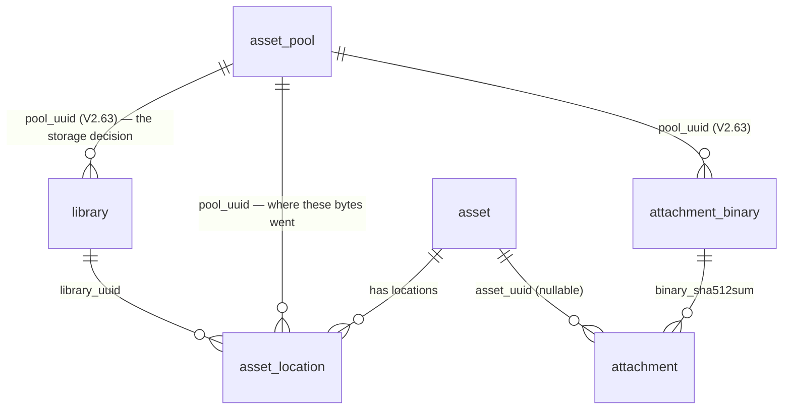
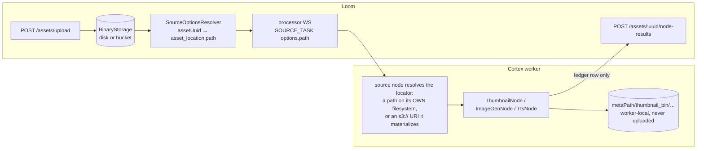

# REST Binary Handling

How raw bytes enter, leave and are stored by Loom's REST API — the asset binary subsystem, the
attachment subsystem, and what Cortex does (and does not) do with binary artefacts.

> **Read first**: [../../CONTEXT.md](../../CONTEXT.md) → [../../guidelines/CODING.md](../../guidelines/CODING.md).
> **Companion specs**: [../../loom/RESTAPI.md](../../loom/RESTAPI.md) (transport, auth, OpenAPI),
> [../../loom/DOMAIN.md](../../loom/DOMAIN.md) (entities), [../permissions/PERMISSIONS.md](../permissions/PERMISSIONS.md)
> (authorization), [../pipeline/PIPELINE.md](../pipeline/PIPELINE.md) (how a run resolves a media path),
> [../pipeline-nodes/NODES.md](../pipeline-nodes/NODES.md) (where node artefacts land).

**Delineation.** This file owns everything about *bytes over REST*: multipart upload, raw download,
on-disk layout, the binary metadata record, and the Loom↔Cortex artefact story. It does **not**
restate REST auth, CORS, paging or OpenAPI mechanics — those live in
[../../loom/RESTAPI.md](../../loom/RESTAPI.md).

---

## 1. Executive Summary — the answers

| Question | Answer |
|---|---|
| Do I create the asset first and upload bytes second? | **Both work.** One-step: `POST /api/v1/assets/upload` (multipart) creates asset + binary row + stored file and auto-triggers a pipeline. Two-step: `POST /api/v1/assets` (JSON, requires a client-computed SHA-512) then `POST /api/v1/assets/:uuid/binary/data` (multipart). |
| Which endpoints move actual bytes? | **Four**: `POST /assets/upload`, `POST /assets/:uuid/binary/data`, `GET /assets/:uuid/binary/data`, and `GET /attachments/:uuid/data` (plus the multipart `POST /attachments`). Everything else under `/binaries` and `/assets/:uuid/binary` is **JSON metadata only**. |
| Is binary handling S3-aware? | **Yes.** A library points at an `asset_pool`, and the pool's `fs_path` XOR `s3_bucket` decides the backend. Uploads into an S3-backed library go to the bucket; downloads stream back out of it. Credentials come from `LOOM_S3_*`, never the database. See §5. |
| Will updating a binary update the object in S3? | **Yes** — for a library whose pool is S3-backed, `POST /assets/:uuid/binary/data` PUTs the object, rewrites `asset_location.path` to the new `s3://bucket/key`, and reclaims the previous object if nothing else references it. |
| Can Cortex upload binary data to Loom? | **Yes, and the client can now express it** — `uploadAsset`, `uploadAssetBinary`, `uploadAttachment(File,…)`, `downloadAssetBinary`. **No node does it yet**; that is [REST_CORTEX_METADATA_BINARY_HANDLING_PLAN.md](REST_CORTEX_METADATA_BINARY_HANDLING_PLAN.md). |
| How is a thumbnail handled today? | Still **never uploaded**. `ThumbnailNode` renders a contact sheet into the worker-local `metaPath/thumbnail_bin/…` cache and records only a ledger row via `POST /assets/:uuid/node-results`. Same for imagegen, videogen, TTS, depthmap. The endpoints and client methods it needs now exist — see the plan. |

---

## 2. Endpoint Inventory

Base path `/api/v1`. Every route below sits behind `secure(basePath() + "*")` — JWT bearer header or
the `__Host-loom_token` cookie ([../../loom/RESTAPI.md](../../loom/RESTAPI.md) §2).

### 2.1 Byte-carrying routes

| Method | Path | Body in | Body out | Permission | Handler |
|---|---|---|---|---|---|
| POST | `/assets/upload` | `multipart/form-data`: one file part + `libraryUuid` (required) + `origin` (optional, default `upload`) | `AssetResponse`, **201** new / **200** when the SHA-512 already exists | `CREATE_ASSET` | `AssetUploadEndpointService.upload` |
| POST | `/assets/:uuid/binary/data` | `multipart/form-data`: one file part + `libraryUuid` (see below) | `AssetBinaryResponse`, **201** | `CREATE_ASSET_BINARY` | `AssetUploadEndpointService.uploadForAsset` |
| GET | `/assets/:uuid/binary/data` | optional `Range: bytes=` | raw bytes, **200** or **206**, `Content-Type` from the stored mime type, `Accept-Ranges: bytes` | `READ_ASSET_BINARY` | `AssetBinaryEndpointService.downloadByAssetUuid` |
| POST | `/attachments` | `multipart/form-data`: one file part + optional `assetUuid`, `embeddingUuid`, `type`, `poolUuid` | `AttachmentResponse` | `CREATE_ATTACHMENT` | `AttachmentEndpointService.create` |
| GET | `/attachments/:uuid/data` | — | raw bytes | `READ_ATTACHMENT` | `AttachmentEndpointService.download` |

`libraryUuid` on `/binary/data` is required when the asset has **no** binary yet, and when it has
**more than one** — an asset holds one binary per library, and replacing the wrong library's copy
silently is worse than a 400. It may be omitted when the asset has exactly one.

### 2.2 Binary *metadata* routes (JSON only — no bytes)

| Method | Path | Purpose | Permission |
|---|---|---|---|
| POST | `/binaries` | Register a binary record (needs `assetUuid`, `libraryUuid`, and either `filesystem.path` or `s3.{bucket,objectPath}`) | `CREATE_ASSET_BINARY` |
| GET | `/assets/:uuid/binaries` | **All** binaries of an asset — one per library it was imported into | `READ_ASSET_BINARY` |
| GET | `/binaries` | Paged list | `READ_ASSET_BINARY` |
| GET | `/binaries/:uuid` | Load one | `READ_ASSET_BINARY` |
| POST | `/binaries/:uuid` | Update (path / meta) | `UPDATE_ASSET_BINARY` |
| DELETE | `/binaries/:uuid` | Delete the **row** (not the file) | `DELETE_ASSET_BINARY` |
| POST | `/assets/:uuid/binary` | Register a binary record for that asset | `CREATE_ASSET_BINARY` |
| GET | `/assets/:uuid/binary` | Load the asset's binary record | `READ_ASSET_BINARY` |
| DELETE | `/assets/:uuid/binary` | Delete the asset's binary **row** (not the file) | `DELETE_ASSET_BINARY` |

### 2.3 Adjacent subsystems

| Method | Path | Reality |
|---|---|---|
| GET/POST/DELETE | `/attachments/:uuid` | JSON CRUD. The bytes are at `/attachments/:uuid/data`; `LoomHttpClient.downloadAttachment` points there. Attachment **provenance** (`node_kind`, `variant`, `run_uuid`, …) exists in the DB since V2.44 and is still invisible to REST — [REST_CORTEX_METADATA_BINARY_HANDLING_PLAN.md](REST_CORTEX_METADATA_BINARY_HANDLING_PLAN.md) Phase A. |
| GET/POST/DELETE | `/pools` | `asset_pool` CRUD (fs path **or** S3 bucket/region/endpoint). A library points at a pool; the pool decides the backend. |
| GET | `/chat-sessions/:uuid/fs/…` | The chat sandbox's own file streaming (`SessionFsEndpointService.sendFile`) — unrelated to the asset binary subsystem, listed so it is not confused with it. See [../../loom/ui/CHAT.md](../../loom/ui/CHAT.md). |

---

## 3. The Workflows

```mermaid
graph TB
    subgraph A["A · One-step upload (browser / CLI)"]
        A1["POST /assets/upload<br/>multipart + libraryUuid"] --> A2["hash bytes (SHA-512)"]
        A2 --> A2b["library → pool → BinaryStorage<br/>(local dir, fs pool or S3 bucket)"]
        A2b --> A3["store at &lt;backend&gt;/ab/cd/ef/&lt;sha512&gt;"]
        A3 --> A4{"asset with this<br/>sha512 exists?"}
        A4 -->|no| A4b["INSERT asset"]
        A4 -->|yes| A4c["reuse it, answer 200"]
        A4b --> A5["INSERT asset_location<br/>(locator, mime, pool_uuid)"]
        A4c --> A5
        A5 --> A6["publish loom.asset.created<br/>(new content only)"]
        A6 --> A7["AssetPipelineTrigger → run<br/>(source node gets the locator)"]
    end
    subgraph B["B · Two-step (asset row first)"]
        B1["POST /assets<br/>JSON, sha512 REQUIRED"] --> B2["POST /assets/:uuid/binary/data<br/>multipart"]
        B2 --> B3["store content-addressed"]
        B3 --> B4["UPDATE or INSERT asset_location"]
    end
    subgraph C["C · Register bytes that already exist"]
        C1["POST /assets/:uuid/binary<br/>JSON filesystem.path"] --> C2["INSERT asset_location only<br/>(no bytes touched, path not validated)"]
    end
```



### 3.1 Which one to use

- **A — `POST /assets/upload`** is the only path that produces a complete, pipeline-ready asset from
  nothing. Use it unless you already have an asset UUID.
- **B — two-step** is the path the UI uses when an asset row already exists. Note that
  `POST /assets` requires `hashes.sha512` from the caller — Loom will not invent an identity
  (`asset.sha512sum` is `NOT NULL`, see V2.46), so there is no such thing as a truly "empty" asset
  created without a hash.
- **C — metadata-only** registration points a binary record at a path Loom does **not** verify and
  bytes it does **not** own. Intended for scanner/import flows; the download route will 404 with
  *"Binary file is missing on disk"* if the path is wrong.

### 3.2 Replace / update semantics

`POST /assets/:uuid/binary/data` on an asset that already has a binary in the target library
**updates that row in place** (new locator, new `mimeType`, `editor_uuid` bumped) and preserves the
`library_uuid`. The previously referenced object is then reference-counted and unlinked if nothing
else points at it (§3.4).

Uploading content Loom already holds resolves to the **existing asset** — `asset.sha512sum` is
UNIQUE, so the same bytes are the same asset by definition. `POST /assets/upload` answers 200 rather
than 201 in that case and does **not** re-publish `asset.created`: the asset was processed when it
first arrived.

### 3.3 Delete semantics

`DELETE /assets/:uuid/binary` (all binaries of the asset), `DELETE /binaries/:uuid` (one) and
deleting the parent asset (FK `ON DELETE CASCADE`) remove the rows. The first two also reclaim the
bytes; the cascade does not (§3.4).

### 3.4 Byte reclamation

Storage is content-addressed, so an object is frequently shared: the same file in two libraries, or
a re-upload of something already present. `BinaryReclaimer` therefore counts `asset_location` rows on
`(pool_uuid, path)` **after** the row is gone and only unlinks at zero. Deleting unconditionally
would blank the download of every asset that deduplicated onto the same bytes.

A reclaim failure is logged and swallowed: the row is already deleted, so failing the request would
tell the caller the delete failed when the part they asked for succeeded, and a retry would 404.

**Not reclaimed** (leaks, deliberately scoped out for now):

- bytes behind an asset deleted via `DELETE /assets/:uuid` — the FK cascade removes `asset_location`
  rows without going through the endpoint;
- `attachment_binary` bytes — shared, content-addressed, and no reference count spans both tables.

---

## 4. Storage Layout

`AssetUploadEndpointService.persist(...)` writes:

```
<StorageOptions.uploadDirectory>/<hex[0:2]>/<hex[2:4]>/<hex[4:6]>/<hex>
                     e.g.  data/storage/9b/71/d2/9b71d224…c7f0
```

- `hex` is the lowercase SHA-512 of the uploaded bytes; the file has **no extension**.
- Content-addressed dedupe: if the target already exists the copy is skipped and the existing path
  returned.
- Vert.x `copyBlocking` (not move) so a temp dir on another device does not fail; Vert.x deletes the
  multipart temp file at end of request.
- The bytes are stored **before** anything is written to the DB, so a storage failure never leaves an
  asset pointing at a missing file.

The same layout is produced by `DemoDatabaseInitializer.createImageAsset(...)`, which paints synthetic
demo images so the asset browser has real previews.

---

## 5. Storage backends: filesystem and S3

### 5.1 How a backend is chosen

```
upload → libraryUuid → library.pool_uuid → asset_pool
                                              ├─ fs_path set     → FilesystemBinaryStorage
                                              └─ s3_bucket set   → S3BinaryStorage
         library.pool_uuid IS NULL            → the local LOOM_STORAGE_UPLOAD_DIR
```

The discriminator lives on **`asset_pool`**, where V2.20 already put it (`fs_path` XOR `s3_bucket`,
enforced by a CHECK constraint). V2.63 added the missing link — `library.pool_uuid` — so an upload,
which only knows a `libraryUuid`, can reach it. Duplicating the discriminator onto `library` would
have left two places to disagree.

`pool_uuid` is nullable everywhere and NULL means "the process-wide local upload directory". That is
what every pre-pool row holds and what a library without a pool keeps producing, so no installation
has to create a pool to keep working.

### 5.2 Locators

`asset_location.path` holds whatever the backend needs to find the bytes:

| Backend | `asset_location.path` |
|---|---|
| local upload dir / filesystem pool | an absolute path, e.g. `/tank/loom/binaries/ab/cd/ef/<sha512>` |
| S3 pool | `s3://<bucket>/ab/cd/ef/<sha512>` |

🔴 **The `s3://` form is a contract with Cortex, not an internal detail.** `io.metaloom.cortex.s3.S3Uri`
parses exactly this, and `S3MediaMaterializer` is what lets a worker process an S3-hosted asset at
all. Storing a bare object key would make every asset uploaded into an S3-backed library
unprocessable by any pipeline. `S3LocatorTest` pins the grammar on the Loom side; the classes are
duplicated rather than shared because a `loom-service-s3 → cortex-s3-common` dependency would tie the
server's build to the worker's.

### 5.3 Credentials

Bucket, region and endpoint are **configuration** and live on the pool row, editable through
`POST /api/v1/pools`. Access and secret keys are **secrets** and live on the process
(`LOOM_S3_ACCESS_KEY` / `LOOM_S3_SECRET_KEY`), so they never enter the database, a REST response or a
backup. Leaving them unset is valid and correct on EKS/ECS: the AWS default credential chain then
applies (IRSA, instance roles, `~/.aws`).

One credential set serves every S3 pool. Multi-account setups are not supported today.

### 5.4 What is still not S3-aware

| Surface | State |
|---|---|
| Cortex artefact write-back (thumbnails, depth maps) | Not built — [REST_CORTEX_METADATA_BINARY_HANDLING_PLAN.md](REST_CORTEX_METADATA_BINARY_HANDLING_PLAN.md) |
| Presigned URLs | Not built. Every S3 download is proxied through Loom, which is a hop per thumbnail |
| Per-pool credentials | Not built (§5.3) |
| SHA-512 as S3 object metadata | Not built — plan §C2 |
| Editing a pool's bucket/endpoint at runtime | Requires a restart: `BinaryStorageResolver` caches one client per pool for the process lifetime |

---

## 6. Data Model



- The REST "binary" is the **`asset_location` table** — `AssetBinaryDao` and `AssetLocationDao` are two
  DAOs over the *same* table. Only the binary one is exposed over REST; there is no
  `/api/v1/locations` endpoint.
- V2.20 added `UNIQUE (asset_uuid)` ("one binary per asset"); **V2.48 dropped it** and replaced it with
  `UNIQUE (library_uuid, path)`, restoring many-locations-per-asset. The REST layer now matches: see
  §3 and `AssetBinaryDao`'s javadoc for the contract.
- **V2.63** added `library.pool_uuid` (the storage decision) and `attachment_binary.pool_uuid`, plus
  an index on `asset_location (pool_uuid, path)` for the reference count.
- `attachment_binary(sha512sum, size, pool_uuid)` is the content table for attachments; the row is
  written by `AttachmentDaoImpl.store` and the bytes by `AttachmentEndpointService.create`. It has no
  locator column — the key is derived from the hash via `BinaryStorage.locatorFor`.

---

## 7. Loom ↔ Cortex: where binary artefacts actually go



### 7.1 Reading the source bytes

A run scoped to an asset resolves its media locator through
`PipelineEndpointService.sourceOptions(...)` → `assetBinaryDao.loadPrimaryByAssetUuid(uuid).getPath()`,
and that **locator string** is what crosses the wire — never the bytes. What the worker does with it
depends on the form:

| Locator | Worker behaviour | Constraint |
|---|---|---|
| a filesystem path | opens it directly on its own filesystem | 🔴 the worker must see Loom's storage at the **identical path** (shared volume / same host) — G12 |
| `s3://bucket/key` | `S3MediaMaterializer` downloads it into the worker's cache | needs `CORTEX_S3_*` on the worker; no shared filesystem required |

That second row is why uploading into an S3-backed library also removes the co-location constraint.

Assets with no binary row are logged as *"No stored binary path for asset X; it cannot be included in
the run"* and silently dropped from the run.

### 7.2 Writing artefacts back

No Cortex node uploads bytes. `AbstractMediaNode` reaches Loom for exactly two things —
`loadAsset(sha512)` and `createAssetNodeResult(...)`. `ThumbnailNode` says so in the source:

> *"The thumbnail bytes live in the local `thumbnail_bin` cache; record the ledger marker that this
> node produced it for the asset. Uploading the bytes into the asset binary subsystem requires a
> target library the node does not have, so that remains a follow-up."*

`ImageGenNode` (`imagegen_bin`), `VideoGenNode`, `TtsNode` and `DepthmapNode` follow the same pattern.
`DaoAssetSink.persist(...)` — the Loom-side sink for node outputs — maps **only** SHA-512/SHA-256/MD5
onto the asset and logs everything else as *"has no asset mapping and was not persisted"*.

**Consequence: a thumbnail generated by a pipeline is still not retrievable through any Loom API.**
The UI's asset preview is the *original* binary (`GET /assets/:uuid/binary/data`), scaled by the
browser — not a generated thumbnail.

What changed is that the wall is now on the node side only: the byte-ingest endpoints, the
attachment storage and the multipart client methods all exist. Closing it is
[REST_CORTEX_METADATA_BINARY_HANDLING_PLAN.md](REST_CORTEX_METADATA_BINARY_HANDLING_PLAN.md) Phase B.
The one exception is `s3-sink`, which uploads to a bucket named in the pipeline definition and
registers the artefact as a new asset — a different question from "make this a first-class Loom
binary"; see that plan's §7 B5.

---

## 8. Gaps

### 8.1 Closed

These were the gaps recorded when this file was first written. Each is now implemented; kept here so
a reader who remembers the old list can see what happened to it.

| # | Gap | Resolution |
|---|---|---|
| **G1** | REST treated `asset_location` as one-to-one; the schema is one-to-many since V2.48 | `loadByAssetUuid` → `loadPrimaryByAssetUuid` (ordered + limited, no more `TooManyRowsException`/500), plus `loadAllByAssetUuid`, `loadByAssetAndLibrary` and `GET /assets/:uuid/binaries`. Contract in §4 of the plan file |
| **G3** | Attachments accepted bytes and discarded them | Bytes stored via `BinaryStorage`; `GET /attachments/:uuid/data` added; `LoomHttpClient.downloadAttachment` repointed from the JSON route |
| **G4** | Stored files were never deleted | `BinaryReclaimer`, reference-counted on `(pool_uuid, path)` — §3.4. Two leaks remain, listed there |
| **G5** | Helm set `LOOM_BINARY_DIR`, the process read `LOOM_STORAGE_UPLOAD_DIR` | Chart emits the canonical name; `StorageOptions` also honours the old one so existing `values.yaml` keeps working |
| **G6** | No `Range` support | Single-range requests answered with 206 + `Content-Range`; 416 when unsatisfiable; `Accept-Ranges` advertised. Multi-range deliberately answered with the full entity |
| **G7/G9** | No Java test for the byte routes; `UPDATE_ASSET_BINARY` untested | `AssetBinaryDataEndpointTest` (12 cases incl. 403s), `FilesystemBinaryStorageTest`, `S3LocatorTest`, `ByteRangeTest` |
| **G8** | S3 modelled but unimplemented | §5 |
| **G10** | Byte routes undocumented in OpenAPI | `addUploadRoute`/`addDownloadRoute` set `consumes`/`produces` |
| **G11** | Unbounded uploads | `LOOM_STORAGE_MAX_UPLOAD_SIZE` (413) and `LOOM_STORAGE_MIN_FREE_SPACE` (507). Object stores report no capacity, so the free-space check is skipped there |
| — | Re-uploading known content 500'd on the unique `sha512sum` | Upload is content-addressed: the same bytes resolve to the existing asset (§3.2). Found by the new endpoint test |

### 8.2 Open

| # | Gap | Consequence |
|---|---|---|
| **G2** | No artefact upload path for Cortex | Thumbnails, generated images, TTS audio and depth maps are computed and stranded on the worker. The endpoints and client methods now exist; the node-side work is [REST_CORTEX_METADATA_BINARY_HANDLING_PLAN.md](REST_CORTEX_METADATA_BINARY_HANDLING_PLAN.md) |
| **G12** | Loom and Cortex must share a filesystem for filesystem-backed libraries | An upload is unprocessable by a worker that cannot see Loom's storage dir at the identical path. S3-backed libraries do not have this constraint — Cortex materializes `s3://` references itself |
| **G13** | Attachment bytes and cascade-deleted asset bytes are not reclaimed | §3.4 |
| **G14** | Attachment provenance (V2.44) is invisible to REST | `node_kind`, `variant`, `run_uuid` … exist in the DB and are not mapped. Plan Phase A |
| **G15** | Pool edits need a restart | `BinaryStorageResolver` caches one backend per pool for the process lifetime |

### 8.3 Missing use cases (nothing built)

- Retrieve a **generated** thumbnail / poster frame / proxy / waveform for an asset — the
  `attachment_type` values exist since V2.44 with no producer (G2/G14).
- Resumable or chunked upload for large media (single-shot multipart only; one file part per request
  is enforced by `singleUpload`).
- Server-side mime sniffing — the mime type is taken verbatim from the client's multipart part, or
  guessed from the file extension in `DaoAssetSink.mimeTypeOf`.
- Presigned / time-limited download URLs (every download needs a JWT or the cookie; that is why
  demo screenshots must be taken from the container — see [../../website/WEBSITE.md](../../website/WEBSITE.md)).
- Migrating existing binaries when a library's pool changes — the new pool only affects new uploads.
- Multi-account S3 credentials (§5.3).

---

## 9. Test Setup

```bash
./setup-pool.sh                                           # MANDATORY before any Java test, and again after any Flyway change
mvn test -pl loom/services/fs,loom/services/s3            # storage backends, no DB needed
mvn test -pl loom/services/rest -Dtest=ByteRangeTest      # Range header parsing
mvn test -pl loom/core -Dtest=AssetBinaryDataEndpointTest # the byte routes, against a booted server
mvn test -pl loom/core -Dtest=AssetBinaryEndpointTest     # JSON CRUD + 403 permission cases
mvn test -pl loom/core -Dtest=AttachmentEndpointTest
cd loom-ui && npx playwright test e2e/assets-backend.spec.ts   # REAL backend: upload → download → delete
cd loom-ui && npx vitest run src/api/binaries.test.ts          # URL/verb assertions
```

| Test | Module | Covers |
|---|---|---|
| `AssetBinaryDataEndpointTest` | `loom/core` | Upload, download, replace, multi-library cardinality, ambiguous-replace 400, `Range` 206/416, `Accept-Ranges`, shared-byte reclaim, 403s on upload and download |
| `FilesystemBinaryStorageTest` | `loom/services/fs` | Content-addressed layout, `locatorFor`/`store` agreement, dedupe, byte ranges, free space before the dir exists |
| `S3LocatorTest` | `loom/services/s3` | 🔴 The `s3://bucket/key` grammar — a contract with Cortex's `S3Uri`, not a formatting preference |
| `ByteRangeTest` | `loom/services/rest` | The ranges a `<video>` element actually sends |
| `AssetBinaryEndpointTest` | `loom/core` | `/binaries` + `/assets/:uuid/binary` CRUD, paging, 403s. Extends `AbstractCRUDEndpointTest`; fixture UUID is `ASSET_LOCATION_UUID` |
| `assets-backend.spec.ts` | `loom-ui/e2e` | End-to-end byte routes against a live server |
| `binaries.test.ts` | `loom-ui` (vitest, node env) | `uploadAssetBinary` / `fetchAssetBinaryBlob` / `createAssetBinaryMeta` build the right URLs and verbs |
| `library-thumbnails-mocked.spec.ts` | `loom-ui/e2e` | The grid points `` at `/binary/data` for images only |

**Writing a new byte-route test.** Use the multipart client methods (`uploadAsset`,
`uploadAssetBinary`, `downloadAssetBinary`); drop to `java.net.http.HttpClient` only for headers the
client cannot set, such as `Range`. Point the test at a temp storage directory by configuring the
**inherited** `loom` extension from the test constructor —
`loom.withOptions(o -> o.getStorage().setUploadDirectory(tmp))` — never by redeclaring
`@RegisterExtension`, which shadows the field the base-class helpers use. Grant permissions via
group+role, never a direct user grant
([../permissions/PERMISSIONS.md](../permissions/PERMISSIONS.md)).

⚠️ A 20+ method endpoint test class exhausts the test database pool: the last few error in
`beforeEach` with a connection failure and pass in isolation. That is capacity, not a regression.

---

## 10. Key Classes Reference

| Class | Package | Purpose |
|---|---|---|
| `BinaryStorage` | `io.metaloom.loom.storage` (`loom-service-fs`) | **The seam.** `store`, `read(locator, offset, length)`, `localPath`, `delete`, `freeSpace`, `locatorFor` |
| `FilesystemBinaryStorage` | `io.metaloom.loom.storage.fs` | Directory backend; returns full paths so a Cortex worker can open them |
| `S3BinaryStorage` | `io.metaloom.loom.storage.s3` (`loom-service-s3`) | Bucket backend over AWS SDK v2; returns `s3://bucket/key` |
| `S3Locator` | `io.metaloom.loom.storage.s3` | 🔴 The `s3://` grammar shared with Cortex's `S3Uri` |
| `StorageKeys` | `io.metaloom.loom.storage` | The single definition of `ab/cd/ef/<sha512>` |
| `BinaryStorageResolver` | `io.metaloom.loom.rest.service.impl` | library → pool → backend, cached per pool |
| `BinaryReclaimer` | `io.metaloom.loom.rest.service.impl` | Reference-counted unlink after a row is deleted or re-pointed |
| `AssetUploadEndpointService` | `io.metaloom.loom.rest.service.impl` | **The only class that writes bytes.** `upload`, `uploadForAsset`, `checkCapacity`, `resolveTarget` |
| `AssetBinaryEndpointService` | `io.metaloom.loom.rest.service.impl` | Binary metadata CRUD, S3/filesystem create+update, `downloadByAssetUuid` (Range), `listByAssetUuid`, `ByteRange` |
| `AssetBinaryEndpoint` | `io.metaloom.loom.rest.endpoint.impl` | Registers `/api/v1/binaries` |
| `AssetEndpoint` | `io.metaloom.loom.rest.endpoint.impl` | Registers `/assets/upload` (line ~141) and the `/assets/:uuid/binary[/data]` sub-resources (lines ~554-592) |
| `AssetBinaryModelBuilder` | `io.metaloom.loom.rest.builder` | `AssetBinary` → `AssetBinaryResponse`; never populates `s3` |
| `AssetBinaryDao` / `AssetBinaryDaoImpl` | `io.metaloom.loom.db.model.asset` / `…jooq.dao.asset.binary` | Maps to **`asset_location`**; carries the cardinality contract (`loadPrimaryByAssetUuid`, `loadAllByAssetUuid`, `loadByAssetAndLibrary`, `countByPoolAndPath`) |
| `AssetLocationDao` | `io.metaloom.loom.db.model.asset` | Second DAO over the same table, not exposed over REST |
| `AssetEventPublisher` / `AssetPipelineTrigger` | `io.metaloom.loom.rest.service.impl` | `loom.asset.created` → auto-run a mime-matched pipeline after upload |
| `SourceOptionsResolver` | `io.metaloom.loom.rest.service.impl` | Turns `mediaUuids` into `path`/`pathGlobs` source options via the binary path |
| `DaoAssetSink` | `io.metaloom.loom.rest.service.impl` | Persists node outputs onto the asset — hashes only; logs every unmapped artefact |
| `AttachmentEndpointService` | `io.metaloom.loom.rest.service.impl` | Attachment CRUD; hashes the upload and drops the bytes (G3) |
| `AssetPoolEndpointService` | `io.metaloom.loom.rest.service.impl` | `/pools` CRUD incl. S3 fields — descriptive only |
| `StorageOptions` | `io.metaloom.loom.api.options` | `uploadDirectory`, default `data/storage` |
| `LoomBinaryResponse` | `io.metaloom.loom.client.common` | Client-side streaming response (`InputStream` / `Flowable<byte[]>`); only wired to `downloadAttachment` |
| `AssetBinaryMethods` | `io.metaloom.loom.client.common.method` | Client binary methods — **JSON only, no upload/download** |
| `ThumbnailNode` | `io.metaloom.cortex.node.thumbnail` | Reference for the local-artefact pattern (G2) |
| `binaries.ts` | `loom-ui/src/api` | `uploadAssetBinary`, `fetchAssetBinaryBlob`, `downloadAssetBinary`, `loadAssetBinaryMeta`, `createAssetBinaryMeta`, `deleteAssetBinary` |

---

## 11. Environment Variables

| Variable | Default | Notes |
|---|---|---|
| `LOOM_STORAGE_UPLOAD_DIR` | `data/storage` | Destination for libraries with no pool. The canonical name |
| `LOOM_BINARY_DIR` | — | Accepted alias for the above. Exists only because the Helm chart set it for its entire history against a process that never read it; `LOOM_STORAGE_UPLOAD_DIR` wins when both are set |
| `LOOM_STORAGE_MAX_UPLOAD_SIZE` | `-1` (no cap) | Larger uploads are rejected with 413 |
| `LOOM_STORAGE_MIN_FREE_SPACE` | `1073741824` (1 GiB) | Refuse an upload that would take the volume below this; 507. Skipped for S3, which reports no capacity. `0` disables |
| `LOOM_S3_ENDPOINT` | — | Fallback when a pool names no endpoint. Set for MinIO/Ceph, leave empty for real AWS |
| `LOOM_S3_REGION` | `us-east-1` | Fallback when a pool names no region |
| `LOOM_S3_ACCESS_KEY` | — | Sensitive. Unset ⇒ AWS default credential chain (IRSA, instance role, `~/.aws`) |
| `LOOM_S3_SECRET_KEY` | — | Sensitive. Must be set together with the access key, or startup validation fails |
| `LOOM_S3_PATH_STYLE` | on whenever an endpoint is set | MinIO and most gateways need path-style; real AWS does not |
| Cortex `metaPath` | see [../../cortex/CONFIGURATION.md](../../cortex/CONFIGURATION.md) | Where worker-local artefacts (`thumbnail_bin`, `imagegen_bin`, …) are cached |

Helm: `persistence.uploads.*` in `helm/loom/values.yaml` provisions the PVC mounted at `/uploads`,
and the deployment sets both env var names to it.

---

## 12. Conventions and Gotchas

- 🔴 **`/binary` ≠ `/binary/data`.** `/binary` is JSON metadata, `/binary/data` is bytes. The routes
  are registered metadata-first so the literal `data` segment is not swallowed; keep that order.
- 🔴 **Route order matters.** `/assets/upload`, `/assets/bulk/*` and `/assets/sha512/*` are literal
  prefixes registered *before* the `/:uuid` wildcard. A new literal `/assets/<word>` route added after
  the wildcard will be shadowed.
- 🔴 **Do not set `Content-Type` on a multipart upload.** The browser/OkHttp must set the boundary.
  `binaries.ts` deliberately sends only `Authorization`.
- **`libraryUuid` is conditionally required** on `/binary/data`: required when creating the row,
  optional (and ignored) when replacing an existing binary. On `/assets/upload` it is always required.
- 🔴 **`asset_location.path` is a locator, not a path.** For an S3 pool it is `s3://bucket/key`, and
  that exact grammar is what Cortex parses. Never store a bare object key, and never assume the
  column can be handed to `Paths.get`.
- 🔴 **Reclaim after, never before.** `BinaryReclaimer` counts rows to decide whether to unlink.
  Calling it while the row still exists always counts ≥ 1 and silently reclaims nothing.
- **The "binary" table is `asset_location`.** Every log line, DAO type name (`"Asset Locations"`) and
  test fixture (`ASSET_LOCATION_UUID`) uses the old name. Expect the mismatch.
- **`POST /assets` needs a client-computed SHA-512.** `asset.sha512sum` is `NOT NULL` by the V2.46
  identity rule; there is no hash-free asset creation. `POST /assets/upload` computes it for you.
- **A binary record does not imply bytes.** `POST /assets/:uuid/binary` never checks the locator
  resolves. A 404 from `/binary/data` therefore means either "no row" or "row points at nothing".
- **Changing a library's pool does not move anything.** Each `asset_location` row records the pool it
  used, so old rows keep resolving; only new uploads go to the new pool.
- **Editing a pool needs a restart** to take effect (`BinaryStorageResolver` caches per pool).
- **`LOOM_S3_*` is Loom's, `CORTEX_S3_*` is the worker's.** They may point at the same bucket and are
  configured independently; setting one says nothing about the other.
- **Downloads need cookie auth in an ``.** `` cannot carry an `Authorization` header, so
  previews rely on `__Host-loom_token`. Behind the Vite dev proxy the cookie is not stored and every
  preview 401s — take thumbnail screenshots from the container
  ([../../website/WEBSITE.md](../../website/WEBSITE.md)).
- **Deleting never frees disk.** Assume the storage directory is append-only until G4 lands.
- **Uploads auto-trigger a pipeline**, `/assets/:uuid/binary/data` does **not** — only
  `AssetUploadEndpointService.upload` publishes `loom.asset.created`. Replacing an asset's bytes will
  not reprocess it.
- **A same-SHA-512 upload is a no-op on disk** (dedupe by content address) but still rewrites the row.

---

## 13. Where do I find …?

| I need … | Look at |
|---|---|
| The multipart upload implementation | `loom/services/rest/src/main/java/io/metaloom/loom/rest/service/impl/AssetUploadEndpointService.java` |
| The raw download implementation, incl. `Range` | `…/service/impl/AssetBinaryEndpointService.java` → `downloadByAssetUuid`, `ByteRange` |
| The storage abstraction | `loom/services/fs/…/storage/BinaryStorage.java` |
| The S3 backend | `loom/services/s3/…/storage/s3/S3BinaryStorage.java` |
| How a library picks its backend | `…/service/impl/BinaryStorageResolver.java` |
| When stored bytes are unlinked | `…/service/impl/BinaryReclaimer.java` |
| Route registration for byte endpoints | `…/endpoint/impl/AssetEndpoint.java` (`/upload` ~line 141, `/binary/data` ~line 582) |
| The binary metadata endpoint | `…/endpoint/impl/AssetBinaryEndpoint.java` |
| The storage directory setting | `loom-shared/api/src/main/java/io/metaloom/loom/api/options/StorageOptions.java` |
| The DB table | `loom/db/flyway/src/main/resources/db/migration/V2.10__add_asset_location.sql` (+ V2.20 pools, V2.46 identity, V2.48 key fix, V2.63 library→pool) |
| Why a library is filesystem- or S3-backed | `V2.63__library_storage_pool.sql` (header comment) |
| Why an asset can have many binaries | `V2.48__fix_asset_location_key_and_annotation_cascade.sql` (header comment) |
| The UI client | `loom-ui/src/api/binaries.ts`, preview URL in `loom-ui/src/api/assets.ts:229` |
| Where a Cortex thumbnail actually goes | `cortex/nodes/thumbnail/core/…/ThumbnailNode.java` → `resolveThumbnailPath` |
| Why node artefacts are not persisted | `…/service/impl/DaoAssetSink.java` → `warnAboutUnmapped` |
| How a run finds the file | `…/service/impl/SourceOptionsResolver.java` + `PipelineEndpointService.sourceOptions` |
| Demo binaries | `loom/core/src/main/java/io/metaloom/loom/core/boot/DemoDatabaseInitializer.java` (`createImageAsset`, `Palette`) |
| Helm storage wiring | `helm/loom/values.yaml` (`persistence.uploads`), `helm/loom/templates/deployment.yaml` |

---

## 14. Progress Assessment

### Implemented

- [x] `POST /api/v1/assets/upload` — multipart create-asset-from-bytes; 201 new, 200 for known content
- [x] `POST /api/v1/assets/:uuid/binary/data` — multipart upload/replace, 201 + `AssetBinaryResponse`
- [x] `GET /api/v1/assets/:uuid/binary/data` — download with `Range` (206/416), from filesystem or S3
- [x] `POST /api/v1/attachments` stores bytes; `GET /api/v1/attachments/:uuid/data` serves them
- [x] Content-addressed `ab/cd/ef/<sha512>` storage layout with dedupe, shared by both backends
- [x] Bytes stored before DB write (no dangling asset rows)
- [x] `/api/v1/binaries` + `/assets/:uuid/binary` JSON metadata CRUD, incl. the S3 branches
- [x] `GET /assets/:uuid/binaries` — every location of an asset
- [x] **S3 storage backend** behind `asset_pool`, selected per library (`library.pool_uuid`, V2.63)
- [x] `asset_location.pool_uuid` written on every upload; `storageType` on the binary and library models
- [x] Credentials from `LOOM_S3_*`, never the database
- [x] Reference-counted byte reclamation on delete and replace
- [x] Upload size cap and free-space guard
- [x] Permission enforcement (`CREATE_/READ_/UPDATE_/DELETE_ASSET_BINARY`) on every route, tested
- [x] Multipart upload + binary download in `loom-client/rest`
- [x] Byte routes documented in OpenAPI (`multipart/form-data` / `application/octet-stream`)
- [x] Auto-trigger of a mime-matched pipeline after `POST /assets/upload` (new content only)
- [x] Asset-scoped runs resolve the primary binary locator for the source node
- [x] UI upload / preview / download / delete (`loom-ui/src/api/binaries.ts`)
- [x] Demo data: two filesystem pools, one S3 pool, one S3-backed library
- [x] Java + e2e coverage of the byte routes

### Open — ordered

- [ ] **G2** Cortex artefact write-back — [REST_CORTEX_METADATA_BINARY_HANDLING_PLAN.md](REST_CORTEX_METADATA_BINARY_HANDLING_PLAN.md)
      Phase B. The endpoints and client methods exist; the nodes do not call them
- [ ] **G14** Expose attachment provenance (V2.44 columns) through REST — plan Phase A
- [ ] **G13** Reclaim attachment bytes, and bytes behind a cascade-deleted asset (§3.4)
- [ ] **G15** Invalidate the `BinaryStorageResolver` cache when a pool is edited, or document the
      restart requirement in the UI
- [ ] Presigned S3 URLs, so a thumbnail does not proxy through Loom (§5.4)
- [ ] **G12** Document the shared-filesystem requirement for filesystem pools in
      [../../cortex/METALOOM_ARCHITECTURE.md](../../cortex/METALOOM_ARCHITECTURE.md)
- [ ] UI: let an operator pick a library's pool, and show `storageType` in the library view
      ([../../loom/ui/TASK_UI_ORGANIZATION.md](../../loom/ui/TASK_UI_ORGANIZATION.md))
- [ ] Multi-account S3 credentials (§5.3)
- [ ] Migrate existing binaries when a library's pool changes

---

*Verified against GIT HEAD `37154702a0bf0c7030969877bb1468600e541573` plus the storage-backend change
described above (migration `V2.63`, modules `loom-service-fs` / `loom-service-s3`) — 2026-08-01.*
