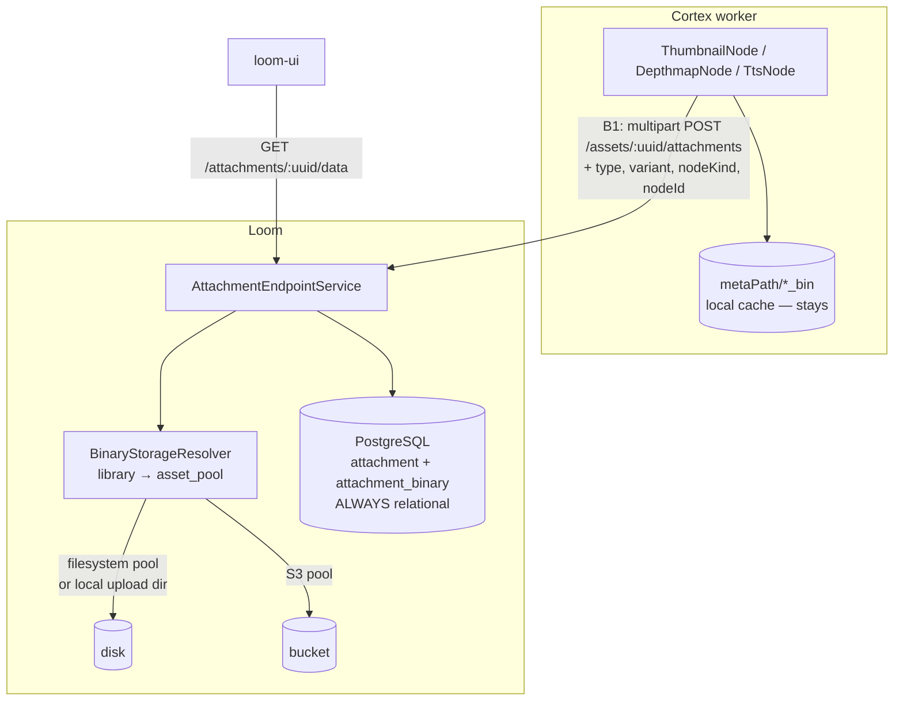

# Cortex → Loom: Binary and Metadata Persistence — Plan

How a Cortex node gets the bytes it produced, and the metadata describing them, into Loom through
the REST API — with S3 as a first-class destination and the filesystem as the default.

> **Status: planning.** Nothing in §5–§8 is built. The prerequisites in §3 *are* built and are what
> make this plan actionable now rather than blocked.
>
> **Read first**: [REST_BINARY_HANDLING.md](REST_BINARY_HANDLING.md) — the byte endpoints, the pool
> model and the storage layout this plan builds on.
> **Read alongside**: [../pipeline-nodes/NODE_S3SINK_PLAN.md](../pipeline-nodes/NODE_S3SINK_PLAN.md)
> — the worker-side half, phase 1 implemented. **This file is the Loom-side counterpart of its
> phases 2 and 3**; where they disagree, this one is newer.
> **Rules**: [../../guidelines/CODING.md](../../guidelines/CODING.md),
> [../../SPEC_RULES.md](../../SPEC_RULES.md).

---

## 1. The problem, stated once

Six Cortex nodes produce bytes. None of them can put those bytes anywhere Loom can serve.

| Node | Local cache | Reaches Loom as |
|---|---|---|
| `ThumbnailNode` | `metaPath/thumbnail_bin` | an `asset_node_result` ledger row saying "this happened" |
| `DepthmapNode` | `metaPath/depthmap_bin` | ledger only |
| `ImageGenNode` | `metaPath/imagegen_bin` | ledger only |
| `VideoGenNode` | `metaPath/videogen_bin` | ledger only |
| `TtsNode` | `metaPath/tts_bin` | ledger only |
| `ScriptNode` | `metaPath/script_bin/<nodeId>` | `asset_json_comp` + ledger |

`ThumbnailNode` states the reason in its own source:

> *"Uploading the bytes into the asset binary subsystem requires a target library the node does not
> have, so that remains a follow-up."*

The consequences compound: a thumbnail exists only on the worker that made it, so the UI cannot show
it; a re-run on another worker recomputes it; `SceneLayoutNode` can consume `depthmap_path` only if
pinned to the same machine; and everything is lost when the worker is replaced.

`s3-sink` (implemented) solves this for deployments that have a bucket, by uploading directly and
registering the artifact as a **new asset** whose `origin` is the `s3://` URI. What is still missing
is the general path: **any node, any deployment, bytes into whichever backend the library uses, and
a metadata record that says what the artifact is and what it was derived from.**

---

## 2. Scope

**In scope**

- A byte-ingest path from a Cortex node to Loom for produced artifacts.
- The metadata record that makes an artifact findable: what kind, which node made it, from which
  asset, in which run.
- S3 as a destination for that ingest, filesystem as the default.
- The client methods a node calls.

**Out of scope**

- Changing how *source* media reaches a worker (still a path or an `s3://` reference on the wire —
  see [REST_BINARY_HANDLING.md](REST_BINARY_HANDLING.md) §7.1).
- Presigned URLs (§9).
- Replacing the local `*_bin` caches. They stay: they are what makes a re-run cheap.

---

## 3. What is already built — the ground this stands on

Everything in this section exists in the code today and was verified while writing this plan. It
matters because the obvious design was blocked on all of it.

| Prerequisite | State | Where |
|---|---|---|
| A byte-ingest endpoint at all | ✅ `POST /assets/upload`, `POST /assets/:uuid/binary/data` | `AssetUploadEndpointService` |
| Attachments actually storing bytes | ✅ was a `// TODO copy / move file into place`; now stores and serves via `GET /attachments/:uuid/data` | `AttachmentEndpointService` |
| A client that can send multipart | ✅ `uploadAsset`, `uploadAssetBinary`, `uploadAttachment(File,…)`, `downloadAssetBinary` | `AssetBinaryMethods`, `AttachmentMethods` |
| S3 as a binary destination | ✅ `asset_pool` with `s3_bucket`/`region`/`endpoint`, resolved per library | `BinaryStorageResolver`, `S3BinaryStorage` |
| `asset_location.pool_uuid` written by anything | ✅ written on every upload | `AssetUploadEndpointService` |
| The location-cardinality question | ✅ **answered** — see §4 | `AssetBinaryDao` |
| An asset can be re-uploaded / shared | ✅ upload is content-addressed; the same SHA-512 resolves to the existing asset | `AssetUploadEndpointService.upload` |
| Loom can serve bytes back | ✅ incl. `Range`, from filesystem or S3 | `AssetBinaryEndpointService.downloadByAssetUuid` |
| `attachment` provenance columns | ⬜ exist in the DB since `V2.44`, **still invisible to REST** | `attachment.node_kind/node_id/producer_version/variant/run_uuid/task_uuid` |
| `AbstractMediaNode.nodeId()` seam | ✅ | `cortex/common` |

> ⚠️ `NODE_S3SINK_PLAN.md` §13 lists "Phase 2 (Loom)" as open. **Phase 2 is done** — `poolUuid`
> reaches `AssetBinary` and the REST models, and the three
> `log.error("S3 support has not yet been implemented")` branches are implemented. Its Phase 3
> (attachment provenance) is §6 here.

---

## 4. The cardinality answer

`NODE_S3SINK_PLAN.md` called this "blocking" and it is now settled, so it is recorded here rather
than left to be rediscovered.

**An asset has zero or more locations, keyed `(library_uuid, path)`.** `V2.20` briefly enforced one
per asset; `V2.48` removed that deliberately, because the same content legitimately lives in several
libraries.

| Question | Answer |
|---|---|
| "The" binary of an asset | `GET /assets/:uuid/binary` → the **primary**: oldest, uuid tie-broken, stable |
| All of them | `GET /assets/:uuid/binaries` |
| Which one an upload replaces | the one in the named `libraryUuid`; unambiguous when the asset has one location; **400** when several exist and no library is named |
| Which one a pipeline run reads | the primary (`SourceOptionsResolver`) |

**What this does *not* answer**: an asset with a thumbnail *and* a depth map *and* a waveform. Those
are not locations of the asset — they are different content. They are `attachment`s (§6), or
separate assets (§5.2). `asset_location` is "where these exact bytes are", never "what was derived
from them".

---

## 5. Design — three shapes, and which to use

An artifact can be recorded three ways. The distinction is not stylistic; picking wrong produces a
catalogue nobody can query.

### 5.1 As an `attachment` on the source asset — **the default**

The sanctioned home for derived binaries, and `V2.44` says so in its own header comment:

> `-- Make attachment the sink for node-produced derived binaries.`
> `-- ThumbnailNode produces contact sheets and had nowhere to record them […]`

It carries `type` (`CONTACT_SHEET`, `POSTER_FRAME`, `WAVEFORM`, `PROXY`, `EXTRACTED_AUDIO`),
provenance (`node_kind`, `node_id`, `producer_version`, `variant`, `run_uuid`, `task_uuid`) and a
partial unique index `(asset_uuid, type, node_kind, variant)` that makes re-runs idempotent.

**Use for**: thumbnails, poster frames, waveforms, proxies, extracted audio, depth maps — anything
whose meaning is "derived from that asset".

### 5.2 As a new asset — for content that stands alone

An `ImageGenNode` output is not a view of its prompt; it is a new image somebody will search for,
tag and run pipelines over. `s3-sink` already does this, and it is right for generated media.

**Use for**: generated images and video, TTS audio.
**Cost**: asset count multiplies. §9 has the filtering consequence.

### 5.3 As a component / node result — for metadata with no bytes

`asset_*_comp` and `asset_node_result` already work and need nothing from this plan. Unchanged.

### 5.4 Decision table

| Producer | Shape | `attachment.type` |
|---|---|---|
| `ThumbnailNode` | attachment | `CONTACT_SHEET` |
| `DepthmapNode` | attachment | `PROXY` (or a new `DEPTH_MAP` — §9) |
| `TtsNode` | new asset + attachment edge | `EXTRACTED_AUDIO` |
| `ImageGenNode`, `VideoGenNode` | new asset | — |
| `ScriptNode` declared file outputs | attachment | per instance |

---

## 6. Phase A — make `attachment` a usable REST resource

Nothing here needs a migration; the columns exist and are invisible.

**A1. Expose provenance on the model.** Add to `AttachmentModel`/`AttachmentResponse`/
`AttachmentCreateRequest`: `assetUuid`, `embeddingUuid`, `type`, `nodeKind`, `nodeId`,
`producerVersion`, `variant`, `runUuid`, `taskUuid`, `poolUuid`, `storageType`. `AttachmentDaoImpl`
currently maps none of the `V2.44` columns onto `AttachmentImpl` — that is the bulk of the work.

**A2. Sub-resource routes on the asset**, matching the plural convention:

| Method | Path | Purpose |
|---|---|---|
| GET | `/assets/:uuid/attachments` | list, filterable by `type` |
| POST | `/assets/:uuid/attachments` | multipart upload bound to the asset |
| GET | `/attachments/:uuid/data` | ✅ already built |

**A3. Idempotent upsert.** `POST /assets/:uuid/attachments` must honour the
`(asset_uuid, type, node_kind, variant)` partial unique index: a re-run replaces its own row instead
of failing. Without this, every pipeline re-run 500s on the second pass.

**A4. Pool selection.** Already implemented: an attachment lands in the pool of the parent asset's
primary binary, and `poolUuid`/`assetUuid`/`type` are accepted as form fields. Phase A only has to
surface it on the response.

**A5. Reclaim.** `attachment` delete does **not** currently free bytes — `attachment_binary` is
shared and content-addressed, and no reference count spans it and `asset_location`. Either add a
count over `attachment_binary` and reclaim on the last reference, or state the leak. Do not leave it
undecided.

---

## 7. Phase B — the Cortex-side write-back

**B1. A node-facing helper on `AbstractMediaNode`**, so six nodes do not each hand-roll this:

```java
/**
 * Publish a file this node produced as an attachment of the asset it was computed from.
 * No-op when the client is null (offline mode) - the local cache is still written.
 */
protected void publishArtifact(AssetResponse asset, Path file, AttachmentType type, String variant);
```

It computes the SHA-512, calls `client().uploadAttachment(...)` with `assetUuid`, `type`, `variant`,
`nodeKind`, `nodeId()` and `producerVersion`, and records the returned uuid in the ledger row it
already writes.

**B2. Migrate the nodes**, one per change, each with its own test. Order by value: `ThumbnailNode`
(the UI wants it most), `DepthmapNode`, `TtsNode`, `ImageGenNode`, `VideoGenNode`.

**B3. Keep the local cache.** `publishArtifact` uploads *in addition to* writing
`metaPath/<node>_bin`. The cache is what makes a re-run cheap and what `SceneLayoutNode` reads today.

**B4. Failure policy.** An upload failure must **not** fail the node: the artifact is computed and
cached, and losing a whole video's pipeline run because a bucket returned 503 is the wrong trade.
Log, record `state = PARTIAL` on the ledger row, continue. This differs from `s3-sink`, whose entire
job is the upload — there, failing is correct.

**B5. 🔴 Do not route this through `s3-sink`.** That node uploads to a bucket named in the *pipeline
definition*, using worker-level credentials. This path uploads to whichever backend the *library*
uses, using Loom's credentials, and Loom records the location. Both should exist; they answer
different questions ("put a copy in this bucket for downstream systems" vs. "make this a first-class
Loom binary").

---

## 8. Phase C — metadata persistence, S3-aware

The requirement is that binary **metadata** persistence can also use S3, with filesystem as the
logical default. That is already how it works, and it is worth being explicit about what is and is
not in S3, because conflating them is the easy mistake:

| Thing | Lives in | Why |
|---|---|---|
| The bytes | filesystem pool, S3 pool, or the local upload dir | operator's choice, per library |
| The **metadata record** (`asset_location`, `attachment`, comps, ledger) | **always PostgreSQL** | it is relational, queried, joined and transactional. Putting it in S3 would mean no joins, no constraints, eventual consistency |
| The *pointer* to the bytes | `asset_location.path` — a filesystem path or an `s3://bucket/key` URI | one column, self-describing |

So "S3 for metadata persistence" is satisfied by **S3-backed binaries whose metadata is in Postgres**,
which is what is built. If instead a future requirement is a metadata *sidecar* in the bucket (a
JSON document next to each object, so the bucket is self-describing and survives losing Loom), that
is a genuinely separate feature:

**C1. Optional sidecar (not built, not recommended yet).** On store, also PUT `<key>.loom.json`
carrying the asset uuid, hashes, mime type, provenance and comps. Cost: a second PUT per upload, a
consistency problem the moment metadata is edited, and no reader. Build it only when a concrete
requirement names the reader — an external system, or disaster recovery.

**C2. What to build instead, if the goal is "the bucket is not a black box".** Write the SHA-512 and
the asset uuid as S3 **object metadata** on PUT (`x-amz-meta-*`). Free, no second request, no
consistency problem, and it upgrades `s3-sink`'s `IF_DIFFERENT` check from "key + size" to a real
content comparison — which its own §16 lists as the clean fix.

---

## 9. Open questions

| Question | Notes |
|---|---|
| A `DEPTH_MAP` attachment type? | `PROXY` is a poor fit. Adding an enum value is a migration; `ALTER TYPE … ADD VALUE` cannot be used in the same transaction that added it, so it needs its own migration file (see `V2.44`, `V2.62`) |
| Do derived assets pollute list/search? | §5.2 multiplies asset count. Probably needs an `is_derived` filter before the UI shows generated media at scale |
| Presigned URLs | The UI renders ``, which streams through Loom. For S3 that is a proxy hop per thumbnail. A presigned redirect would remove it, at the cost of a URL that escapes Loom's permission check for its lifetime |
| Attachment byte reclaim | §6 A5 |
| Should a node be able to choose the pool? | Today it inherits the asset's. A `poolUuid` node option would allow "thumbnails to the cheap bucket, masters to the fast one" — real, but no requirement yet |

---

## 10. Test Setup

```bash
./setup-pool.sh                                           # mandatory before any Java test
mvn test -pl loom/core -Dtest=AssetBinaryDataEndpointTest # the byte routes this plan builds on
mvn test -pl loom/core -Dtest=AttachmentEndpointTest
mvn test -pl loom/services/fs,loom/services/s3            # storage backends
./it.sh                                                   # incl. S3SinkNodeIntegrationTest (MinIO)
```

Per phase:

- **Phase A** — an `AttachmentEndpointTest` case per new route plus 403 cases
  ([../permissions/PERMISSIONS.md](../permissions/PERMISSIONS.md): grant via group+role, never a
  direct user grant); a DAO test proving the `V2.44` columns round-trip; an upsert test proving a
  second POST with the same `(asset, type, nodeKind, variant)` replaces rather than fails.
- **Phase B** — per-node tests with a mocked `LoomClient` asserting the upload call and its
  arguments; one integration test per node against a live Loom
  ([../../cortex/METALOOM_ARCHITECTURE.md](../../cortex/METALOOM_ARCHITECTURE.md)). ⚠️ Rebuild the
  shaded `cortex/cli` jar first — node integration tests run against the packaged artifact.
- **Phase C** — a MinIO-backed test asserting object metadata is present after `store`.

**MinIO for local S3**: `start-minio.sh` (added with `s3-sink`). Point a pool at it with
`s3Endpoint=http://localhost:9000` and set `LOOM_S3_ACCESS_KEY`/`LOOM_S3_SECRET_KEY`; path-style
addressing turns itself on whenever a custom endpoint is set.

---

## 11. Key Classes Reference

| Class | Package | Role in this plan |
|---|---|---|
| `AbstractMediaNode` | `io.metaloom.cortex.common.node` | Gains `publishArtifact` (B1); already has `nodeId()` and `recordNodeResult` |
| `ThumbnailNode` | `io.metaloom.cortex.node.thumbnail` | First migration target (B2) |
| `S3SinkNode` | `io.metaloom.cortex.node.sink.s3` | The other, deliberately separate path (B5) |
| `LoomClient` / `AttachmentMethods` | `io.metaloom.loom.client.common` | `uploadAttachment(File, …)` is the call B1 makes |
| `AttachmentEndpointService` | `io.metaloom.loom.rest.service.impl` | Stores bytes; gains the asset sub-resource routes (A2) |
| `AttachmentDaoImpl` | `io.metaloom.loom.db.jooq.dao.attachment` | Must map the `V2.44` provenance columns (A1) |
| `BinaryStorageResolver` | `io.metaloom.loom.rest.service.impl` | pool → backend; already used by attachments |
| `S3BinaryStorage` | `io.metaloom.loom.storage.s3` | Gains object metadata on PUT (C2) |
| `AssetBinaryDao` | `io.metaloom.loom.db.model.asset` | Carries the §4 cardinality contract |

---

## 12. Architecture



---

## 13. Environment Variables

No new settings. The ones this plan depends on are already documented in
[REST_BINARY_HANDLING.md](REST_BINARY_HANDLING.md) §11:

| Variable | Default | Role here |
|---|---|---|
| `LOOM_STORAGE_UPLOAD_DIR` | `data/storage` | Where artefacts land for libraries with no pool — the default case |
| `LOOM_S3_ENDPOINT` / `LOOM_S3_REGION` | — / `us-east-1` | Fallbacks when a pool does not name its own |
| `LOOM_S3_ACCESS_KEY` / `LOOM_S3_SECRET_KEY` | — | Loom's bucket credentials; unset uses the AWS default chain |
| `LOOM_S3_PATH_STYLE` | on when an endpoint is set | MinIO/Ceph addressing |
| `CORTEX_S3_*` | — | The **worker's** own S3 access, used by `s3-source`/`s3-sink`. Deliberately separate from Loom's: different process, different credentials |

---

## 14. Conventions and Gotchas

- 🔴 **`attachment` is not `asset_location`.** One is "what was derived from this asset", the other
  is "where these exact bytes are". Recording a thumbnail as a second location of its source video
  makes the video's own download ambiguous.
- 🔴 **Never fail a node on an upload failure** (B4) — except in `s3-sink`, where uploading *is* the
  job.
- **The metadata always stays in Postgres** (§8). "S3 metadata persistence" means S3-backed bytes,
  not a document store.
- **Attachment idempotency is a partial index**, `WHERE asset_uuid IS NOT NULL AND node_kind IS NOT
  NULL`. An attachment created without a `node_kind` is not covered and will duplicate on re-run.
- **`ScriptNode` still writes `node_id = ''`** and has persistence tests asserting that shape.
  Migrating it onto `nodeId()` is a separate change with a data question attached.
- **Two `s3-sink` instances in one graph** used to overwrite each other's ledger row; the `nodeId()`
  seam fixed it. Any new multi-instance node must override `nodeId()`.
- **Rebuild the shaded cortex jar** before running node integration tests, or they run against a
  stale artifact and the failure looks like a logic bug.
- **Loom and Cortex do not share S3 credentials.** `LOOM_S3_*` is the server's, `CORTEX_S3_*` is the
  worker's. They may point at the same bucket; they are configured independently and one being set
  says nothing about the other.

---

## 15. Where do I find …?

| I need … | Look at |
|---|---|
| The endpoints this plan builds on | [REST_BINARY_HANDLING.md](REST_BINARY_HANDLING.md) §2 |
| The worker-side S3 upload that already works | `cortex/nodes/s3-sink/`, [../pipeline-nodes/NODE_S3SINK_PLAN.md](../pipeline-nodes/NODE_S3SINK_PLAN.md) |
| Why `attachment` is the sanctioned sink | `loom/db/flyway/…/V2.44__attachment_provenance.sql` header |
| The pool/library storage decision | `loom/db/flyway/…/V2.63__library_storage_pool.sql` |
| Node artefact caches | `cortex/nodes/*/core/…/*Node.java` → `resolve*Path` |
| The node result ledger | `AbstractMediaNode.recordNodeResult`, `POST /assets/:uuid/node-results` |
| MinIO for local testing | `start-minio.sh` |

---

## 16. Progress Assessment

### Prerequisites — done (see §3)

- [x] Byte-ingest endpoints and a multipart client
- [x] Attachments store and serve their bytes
- [x] S3 as a binary destination, selected per library via `asset_pool`
- [x] `asset_location.pool_uuid` written; the S3 branches implemented
- [x] Location cardinality answered (§4)
- [x] Content-addressed upload (re-upload resolves to the existing asset)
- [x] `AbstractMediaNode.nodeId()` seam

### Phase A — attachment as a REST resource

- [ ] **A1** map the `V2.44` provenance columns in `AttachmentDaoImpl` and expose them on the model
- [ ] **A2** `GET`/`POST /assets/:uuid/attachments`, filterable by `type`
- [ ] **A3** idempotent upsert on `(asset_uuid, type, node_kind, variant)`
- [ ] **A4** surface `poolUuid`/`storageType` on `AttachmentResponse`
- [ ] **A5** decide attachment byte reclaim — implement or document the leak
- [ ] Endpoint tests incl. 403 cases; DAO round-trip test

### Phase B — Cortex write-back

- [ ] **B1** `AbstractMediaNode.publishArtifact(...)`
- [ ] **B2** migrate `ThumbnailNode`, then `DepthmapNode`, `TtsNode`, `ImageGenNode`, `VideoGenNode`
- [ ] **B3** keep the local caches
- [ ] **B4** upload failure → `PARTIAL`, never a failed node
- [ ] Per-node unit tests with a mocked client + one integration test each

### Phase C — S3 metadata richness

- [ ] **C2** SHA-512 + asset uuid as S3 object metadata on PUT
- [ ] Upgrade `s3-sink`'s `IF_DIFFERENT` to compare content hashes
- [ ] **C1** sidecar documents — **only** with a named reader

### Follow-ups inherited

- [ ] Migrate `ScriptNode` onto `nodeId()` and decide what to do with its `node_id = ''` rows
- [ ] UI: render attachments (thumbnails) once Phase A lands — see
      [../../loom/ui/TASK_UI_ASSETS_MEDIA.md](../../loom/ui/TASK_UI_ASSETS_MEDIA.md)
- [ ] Customer-facing docs once Phase B lands ([../../website/WEBSITE.md](../../website/WEBSITE.md))

---

*Verified against GIT HEAD `37154702a0bf0c7030969877bb1468600e541573` plus the uncommitted binary
handling change described in §3 — 2026-08-01.*
