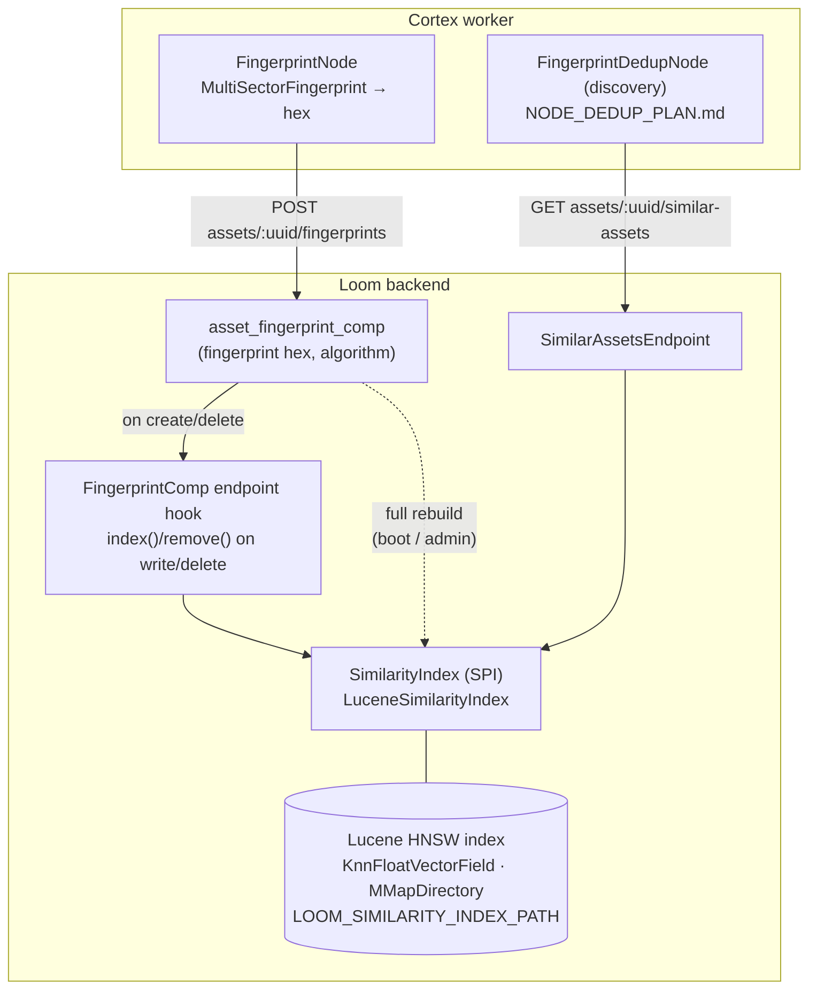

# Fingerprint Similarity Index (Lucene) — Technical Specification

> **Audience: AI coding agents.** This document specifies a **perceptual video-fingerprint
> similarity index** owned by the Loom backend: a Lucene HNSW k-NN index over the 256-dim float
> vectors behind the `MultiSectorFingerprint`, exposed as a `SimilarityIndex` SPI and a REST
> "similar assets" query. It is the prerequisite for the fingerprint deduplication nodes in
> [../pipeline-nodes/NODE_DEDUP_PLAN.md](../pipeline-nodes/NODE_DEDUP_PLAN.md).
>
> **Status: NOT built.** Nothing in this document exists yet. The design reuses the *already
> working* Lucene fingerprint indexer from the `video4j` `fingerprint-indexer` module (the same
> engine `xdb-clean` uses).
>
> **Scope boundary — read this first.** This is **not** lexical search and **not** embedding
> search. Three similarity/search subsystems are deliberately kept separate:
>
> | Subsystem | Query | Backend | Spec |
> |---|---|---|---|
> | **Lexical search** | text `q` → documents | Postgres `tsvector` / Elasticsearch | [SEARCH.md](SEARCH.md) |
> | **Semantic / embedding search** | text `q` or vector → assets | pgvector (`embedding_vec_*`) | [SEMANTIC_SEARCH.md](SEMANTIC_SEARCH.md) |
> | **Fingerprint similarity (this doc)** | a video fingerprint → near-duplicate videos | Lucene HNSW over `MultiSectorFingerprint.vector()` | **LUCENE_PLAN.md** |

---

## 1. Why this exists, and why Lucene here

### 1.1 The gap

`FingerprintNode` computes a whole-video `MultiSectorFingerprint` (v2, 256-dim = 16×16) and
persists it as a **hex string** to `asset_fingerprint_comp` (algorithm `metaloom-multisector-v1`,
sector 0). The only lookup Loom offers today is
`AssetComponentDaoImpl.findByFingerprint(algorithm, fingerprint)` — **exact byte-equality** on the
hex string, served by the `(algorithm, fingerprint)` btree index. That finds *identical*
fingerprints, never *perceptually similar* ones, so it cannot drive near-duplicate detection.

Perceptual similarity requires a **k-nearest-neighbour search over the fingerprint vector**. That
engine already exists in `video4j` and is proven in `xdb-clean` — it has simply never been wired
into Loom.

### 1.2 The reconciliation with [SEARCH.md](SEARCH.md) §2 and [SEMANTIC_SEARCH.md](SEMANTIC_SEARCH.md) §3

🔴 [SEARCH.md](SEARCH.md) §2 **rejects Lucene by name** and files task **P1-25** in
[SEARCH_PLAN.md](SEARCH_PLAN.md) to *delete* `loom/services/lucene`.
[SEMANTIC_SEARCH.md](SEMANTIC_SEARCH.md) §3 chose **pgvector** for embeddings. This document
adopts Lucene anyway, for **this workload only**, and the reasoning must be understood before
touching the module:

1. **The SEARCH.md rejection is about lexical search.** Its objection is that an embedded full-text
   index becomes *per-replica local state that must be identical across replicas and is a
   system-of-record*. A fingerprint k-NN index is **none of those things**: it is a **bounded,
   derived, rebuildable** cache of one float vector per asset, reconstructable in full from
   `asset_fingerprint_comp` at any time. Losing it costs a rebuild, never data. The distributed-state
   argument does not transfer.
2. **Lucene sidesteps the single hardest constraint in [SEMANTIC_SEARCH.md](SEMANTIC_SEARCH.md) §3.2.**
   pgvector is *not in the stock Postgres image*; an unguarded `CREATE EXTENSION vector` breaks
   `generate.sh`, `setup-pool.sh`, every developer's local Postgres and the Helm DB — "nobody can
   build". Lucene is pure-JVM and needs no database extension. The original Lucene rejection never
   weighed this axis.
3. **The fingerprint vector is only 256-dim and the corpus is one-vector-per-asset.** This is a small,
   well-behaved HNSW workload; standing up pgvector *or* an external vector DB for it is disproportionate.
4. **The SPI keeps the door open.** `SimilarityIndex` mirrors the `VectorIndex` SPI proposed in
   [SEMANTIC_SEARCH.md](SEMANTIC_SEARCH.md) §11, so a later pgvector/Qdrant implementation — or a
   unification of fingerprint similarity with embedding search — is a module swap, not a rewrite.

🔴 **Required companion edits** (do them in the same change):
- [SEARCH.md](SEARCH.md) §2 — add a note that Lucene is rejected *for lexical search* but **adopted for
  fingerprint similarity** here; link this file.
- [SEARCH_PLAN.md](SEARCH_PLAN.md) P1-25 — change "delete `loom/services/lucene`" to **"repurpose
  `loom/services/lucene` for the fingerprint similarity index (LUCENE_PLAN.md); do not delete"**.
- [SEMANTIC_SEARCH.md](SEMANTIC_SEARCH.md) — one cross-reference noting fingerprint similarity is a
  separate subsystem sharing the SPI shape.

### 1.3 What already exists to build on

| Thing | Location | Note |
|---|---|---|
| `MultiSectorFingerprint` | `video4j` `fingerprint` module, `io.metaloom.video4j.fingerprint.v2` | v2, 256-dim; `of(String hex)`, `float[] vector()` / `quadVector()` |
| `HashFingerprintIndexer` | `video4j` `fingerprint-indexer`, `…index.query.impl` | Lucene HNSW `KnnFloatVectorField` writer/reader with a score threshold |
| `AbstractFingerprintIndexer` | `video4j` `fingerprint-indexer` | `KnnFloatVectorQuery`; `MMapDirectory`; `Lucene99HnswVectorsFormat(maxConn=200, beamWidth=100)` |
| `HashQueryResult` / `HashQueryResultEntry` | `video4j` `fingerprint-indexer`, `…index.query` | entry exposes `hash()` (stored payload) + score |
| `QueryResultFactory.DEFAULT_SCORE_THRESHOLD` | `video4j` `fingerprint-indexer` | `0.10f` |
| `asset_fingerprint_comp` table + `findByFingerprint` | `loom/db/flyway/.../V2.41__add_asset_fingerprint_comp.sql`, `loom/db/jooq/.../AssetComponentDaoImpl.java` | source of truth for the vectors; exact-match only today |
| `createAssetFingerprintComp` | `loom-client/common/.../method/FingerprintCompMethods.java` | how nodes write a fingerprint comp (upsert) |
| Empty stub module | `loom/services/lucene/` (pom-only, Lucene 9.0.0) | repurpose this |
| `SearchProvider` / `NoopSearchProvider` / `SearchModule` | `loom-shared/api`, `loom/db/jooq/.../search/`, `loom/core/.../dagger/SearchModule.java` | the SPI + Dagger pattern to mirror |

> ⚠️ The stub `loom/services/lucene/pom.xml` pins **Lucene 9.0.0** (Nov 2021). video4j's
> `fingerprint-indexer` uses `Lucene103Codec` / `Lucene99HnswVectorsFormat` — a **much newer**
> Lucene. Depend on the video4j module and let it bring its Lucene version; do not resurrect 9.0.0.

---

## 2. Architecture



**System-of-record vs. index.** `asset_fingerprint_comp` is the system-of-record. The Lucene index
is a **derived cache**: it can be dropped and rebuilt from the comp table at any time. Every write
path therefore updates the comp table first (existing behaviour) and the index second (new hook);
a failed index update is logged and never fails the comp write.

**Query path.** The fingerprint hex → `MultiSectorFingerprint.of(hex).vector()` → `SimilarityIndex.query(vector, topK, threshold)` → `List<SimilarityHit>`; the endpoint maps hits (asset uuid + sha512 + score) to a response, excluding the query asset itself.

---

## 3. The `SimilarityIndex` SPI

New package `io.metaloom.loom.api.search` in `loom-shared/api` (alongside `SearchProvider`):

```java
public interface SimilarityIndex {

    /** Upsert one asset's fingerprint vector. Idempotent on (assetUuid, algorithm). */
    void index(UUID assetUuid, String sha512, String algorithm, float[] vector);

    /** Remove all vectors for an asset (called on asset/comp delete). */
    void remove(UUID assetUuid);

    /** k-NN query; hits below scoreThreshold are dropped. Never returns null. */
    List<SimilarityHit> query(String algorithm, float[] vector, int limit, float scoreThreshold);

    /** Rebuild the whole index from the supplied vectors (boot / admin). */
    void rebuild(Stream<IndexedFingerprint> all);

    /** Flush pending writes to disk. */
    void commit();

    /** False when disabled or the index dir is unavailable — callers degrade gracefully. */
    boolean isAvailable();
}

public record SimilarityHit(UUID assetUuid, String sha512, float score) {}
public record IndexedFingerprint(UUID assetUuid, String sha512, String algorithm, float[] vector) {}
```

- `LuceneSimilarityIndex` — the production impl (module `loom/services/lucene`). Wraps video4j's
  `HashFingerprintIndexer` / `AbstractFingerprintIndexer`. Lucene doc per asset: a
  `KnnFloatVectorField("fingerprint", vector)` + `StoredField`s for `asset_uuid` and `sha512sum`
  (video4j already stores `sha512sum`; add `asset_uuid`). `algorithm` is a filter field so multiple
  algorithms can coexist. Guards all methods behind `isAvailable()`.
- `NoopSimilarityIndex` — bound when `LOOM_SIMILARITY_ENABLED=false`; `query` returns empty,
  `isAvailable()` false. Mirrors `NoopSearchProvider`.
- **Dagger**: `SimilarityModule` in `loom/core` picks the impl from `SimilarityOptions` — exactly the
  shape of `SearchModule`.

> ⚠️ **Concurrency.** Lucene `IndexWriter` is single-writer. Serialize `index()`/`remove()`/`rebuild()`
> through one writer (a single-thread executor or a lock); readers use a periodically-refreshed
> `SearcherManager`. video4j's indexer is not written for concurrent Loom-style access — wrap it.

---

## 4. Index lifecycle & consistency

| Trigger | Action |
|---|---|
| **Boot** | If `LOOM_SIMILARITY_ENABLED` and the index dir is empty/absent, `rebuild(...)` by streaming every `asset_fingerprint_comp` row for the configured algorithm. If present, open as-is. |
| **Fingerprint comp created** | Hook in the fingerprint-comp endpoint service (where `createAssetFingerprintComp` lands) calls `index(assetUuid, sha512, algorithm, vector)` after the DB upsert commits. |
| **Fingerprint comp / asset deleted** | Same hook (and the asset delete path) calls `remove(assetUuid)`. `asset_fingerprint_comp` already cascades on asset delete; the index removal is the extra step. |
| **Admin rebuild** | `POST /api/v1/similarity-index/rebuild` triggers a full `rebuild(...)`. |

🔴 **Rebuildability is the whole safety story.** Because the index is derived, drift is always
recoverable: if the hook is ever missed (crash between DB commit and index write), a rebuild restores
correctness. Do **not** treat the index as authoritative anywhere.

---

## 5. REST surface

Per [../../guidelines/CODING.md](../../guidelines/CODING.md) (plural paths, endpoint + permission tests):

| Method & path | Purpose | Permission |
|---|---|---|
| `GET /api/v1/assets/:assetUuid/similar-assets?algorithm=&limit=&threshold=` | Near-duplicates of one asset (looks up its stored fingerprint, queries the index, excludes self) | `READ_ASSET` |
| `POST /api/v1/similarity-index/rebuild` | Admin full rebuild | new `MANAGE_SIMILARITY_INDEX` (or reuse an existing admin permission) |

Response `SimilarAssetListResponse` — a list of `{ assetUuid, sha512, score }`, score-desc. Empty
list (not 404) when the asset has no fingerprint or nothing is above threshold. When the index is
disabled, the endpoint returns **400/409 naming the reason** rather than silently returning empty
(the [SEMANTIC_SEARCH.md](SEMANTIC_SEARCH.md) §6 "no silent degradation" rule).

Client: new `SimilarityMethods` in `loom-client/common` aggregated into `ClientMethods`; impl in
`loom-client/rest`:
```java
LoomClientRequest<SimilarAssetListResponse> listSimilarAssets(UUID assetUuid, SimilarAssetQueryParameters params);
LoomClientRequest<NoResponse> rebuildSimilarityIndex();
```

---

## 6. Configuration

| Env var | Default | Meaning |
|---|---|---|
| `LOOM_SIMILARITY_ENABLED` | `false` | Master switch. Boot-forced to `false` (with a warning) if the index dir is not writable. |
| `LOOM_SIMILARITY_INDEX_PATH` | `${LOOM_STORAGE_...}/similarity-index` | On-disk Lucene index directory (`MMapDirectory`). |
| `LOOM_SIMILARITY_ALGORITHM` | `metaloom-multisector-v1` | Which `asset_fingerprint_comp.algorithm` participates. |
| `LOOM_SIMILARITY_SCORE_THRESHOLD` | `0.10` | Default k-NN score floor (video4j `DEFAULT_SCORE_THRESHOLD`); overridable per request. |
| `LOOM_SIMILARITY_TOPK` | `10` | Default neighbours per query; overridable per request. |

`SimilarityOptions` lives on `LoomOptions` (see [../../loom/CONFIGURATION.md](../../loom/CONFIGURATION.md)), validated at boot.

---

## 7. Key Classes Reference

> Nothing below exists yet; paths are the intended homes.

| Class | Package / module | Purpose |
|---|---|---|
| `SimilarityIndex` | `io.metaloom.loom.api.search` (`loom-shared/api`) | SPI — sibling of `SearchProvider` |
| `SimilarityHit` / `IndexedFingerprint` | `io.metaloom.loom.api.search` | query result / rebuild input records |
| `LuceneSimilarityIndex` | `io.metaloom.loom.similarity.lucene` (`loom/services/lucene`) | Lucene HNSW impl wrapping video4j |
| `NoopSimilarityIndex` | `io.metaloom.loom.similarity` | disabled fallback |
| `SimilarityModule` | `io.metaloom.loom.core.dagger` (`loom/core`) | Dagger binding (mirrors `SearchModule`) |
| `SimilarAssetsEndpoint(Service)` | `io.metaloom.loom.rest.endpoint...` (`loom/services/rest`) | REST query endpoint |
| `SimilarityIndexRebuildEndpoint` | `loom/services/rest` | admin rebuild |
| `SimilarityMethods` | `io.metaloom.loom.client.common.method` (`loom-client/common`) | client interface |
| `SimilarAssetListResponse` / `SimilarAssetQueryParameters` | `loom-shared/rest-model` | REST DTOs |
| `HashFingerprintIndexer` / `AbstractFingerprintIndexer` | `io.metaloom.video4j.fingerprint.index...` (video4j `fingerprint-indexer`) | **reused** engine |
| `MultiSectorFingerprint` | `io.metaloom.video4j.fingerprint.v2` (video4j) | `of(hex).vector()` |

---

## 8. Test Setup

- **`LuceneSimilarityIndexTest`** (`loom/services/lucene/src/test/...`): index a handful of known
  vectors in a temp dir; assert a planted near-neighbour is returned above threshold and a dissimilar
  vector is not; `remove()` drops it; `rebuild()` from a stream reproduces the same results;
  `isAvailable()` false on an unwritable path.
- **`SimilarAssetsEndpointTest`** + **permission test** (`READ_ASSET` required; a token without it is
  rejected) — per [../../guidelines/CODING.md](../../guidelines/CODING.md). Assert self-exclusion and
  the disabled-index rejection (no silent empty).
- **Consistency test**: create two fingerprint comps via the client → they become queryable; delete
  one asset → it disappears from results and nothing else does (cascade + index removal).
- **Client test**: `listSimilarAssets` round-trips against the endpoint.
- **Demo data**: `DemoDatabaseInitializer` seeds two near-identical demo videos with fingerprints so
  `similar-assets` returns a non-empty result out of the box (shared with NODE_DEDUP_PLAN.md's demo).
- 🔴 Run `./setup-pool.sh` (no migration here, but the dedup companion adds one) and confirm the build
  is unaffected — this feature adds **no** Postgres extension, which is the point.

---

## 9. Conventions and Gotchas

| Area | Gotcha |
|---|---|
| **Not lexical/embedding search** | 🔴 Keep this subsystem separate from [SEARCH.md](SEARCH.md) and [SEMANTIC_SEARCH.md](SEMANTIC_SEARCH.md). Same word "similarity", different index, different data. |
| **Derived index** | 🔴 The Lucene index is a rebuildable cache of `asset_fingerprint_comp`, never a system-of-record. Any drift is fixed by a rebuild. |
| **Lucene version** | ⚠️ Ignore the stub's Lucene 9.0.0 pin; take Lucene transitively from video4j's `fingerprint-indexer` (Lucene103Codec / HNSW). |
| **Single writer** | ⚠️ Lucene `IndexWriter` is single-writer; serialize all mutations. video4j's indexer isn't built for concurrent Loom access — wrap it. |
| **No silent degradation** | 🔴 A disabled index must make the endpoint *reject* the request, not return an empty list that looks like "no duplicates". |
| **Score semantics** | ⚠️ The score is Lucene's k-NN vector similarity, not a probability. The `0.10` default comes from video4j/xdb-clean; tune per corpus, expose per request. |
| **Overturns a filed decision** | 🔴 This adopts Lucene against [SEARCH.md](SEARCH.md) §2 / [SEARCH_PLAN.md](SEARCH_PLAN.md) P1-25. Do the companion edits in §1.2 or the specs contradict the code. |

---

## 10. Where do I find …?

| Need | Look here |
|---|---|
| The fingerprint vector engine (reused) | video4j `fingerprint-indexer`: `…/index/query/impl/HashFingerprintIndexer.java`, `…/index/AbstractFingerprintIndexer.java` |
| Fingerprint format | video4j `…/fingerprint/v2/MultiSectorFingerprint.java` (`of`, `vector()`) |
| Where fingerprints are stored | `loom/db/flyway/.../V2.41__add_asset_fingerprint_comp.sql`; `loom/db/jooq/.../AssetComponentDaoImpl.java` |
| How a node writes a fingerprint | `cortex/nodes/fingerprint/core/.../FingerprintNode.java`; `loom-client/common/.../method/FingerprintCompMethods.java` |
| SPI + Dagger pattern to mirror | `loom-shared/api/.../search/SearchProvider.java`; `loom/db/jooq/.../search/NoopSearchProvider.java`; `loom/core/.../dagger/SearchModule.java` |
| The module to repurpose | `loom/services/lucene/pom.xml` |
| The consumer of this index | [../pipeline-nodes/NODE_DEDUP_PLAN.md](../pipeline-nodes/NODE_DEDUP_PLAN.md) |
| Decisions this overturns | [SEARCH.md](SEARCH.md) §2, [SEARCH_PLAN.md](SEARCH_PLAN.md) P1-25, [SEMANTIC_SEARCH.md](SEMANTIC_SEARCH.md) §3 |

---

## 11. Progress Assessment

Nothing is implemented.

**Design decisions closed**
- [x] Lucene (reusing video4j) chosen over pgvector for the *fingerprint* similarity index, behind a `SimilarityIndex` SPI (§1.2, §3)
- [x] Index is a derived, rebuildable cache of `asset_fingerprint_comp` (§4)
- [x] Query surface is `GET assets/:uuid/similar-assets` (§5)

**Implementation**
- [ ] `SimilarityIndex` SPI + records in `loom-shared/api` (§3)
- [ ] `LuceneSimilarityIndex` in `loom/services/lucene` (revive the module; depend on video4j `fingerprint-indexer`) (§3)
- [ ] `NoopSimilarityIndex` + `SimilarityModule` Dagger binding driven by `SimilarityOptions` (§3, §6)
- [ ] Boot rebuild + comp-write/comp-delete hooks (§4)
- [ ] `GET assets/:uuid/similar-assets` + `POST similarity-index/rebuild` endpoints (§5)
- [ ] `SimilarityMethods` client + impl + REST DTOs (§5)
- [ ] `SimilarityOptions` on `LoomOptions` + env wiring + boot guard (§6)
- [ ] Tests per §8 (index unit, endpoint, permission, consistency, client, demo data)
- [ ] Companion spec edits: [SEARCH.md](SEARCH.md) §2, [SEARCH_PLAN.md](SEARCH_PLAN.md) P1-25, [SEMANTIC_SEARCH.md](SEMANTIC_SEARCH.md) cross-ref (§1.2)
- [ ] Customer-facing docs under `website/content/english/docs` (only if surfaced to users directly; otherwise covered by the dedup workflow doc)

**Known gaps / open items**
- [ ] Whether `algorithm` needs to be a Lucene filter field from day one or a single-algorithm index suffices
- [ ] Multi-sector fingerprints (this index uses sector 0 / whole-asset only, matching `FingerprintNode` today)
- [ ] Concurrency wrapper design for the single Lucene writer (§3)

---

_Git HEAD: `3ba0a6ffb92e31cf68fb6ed20744e0066b30a209` (branch `master`)_
_Last updated: 2026-07-29_
