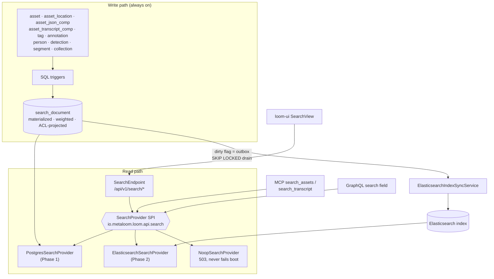

# Search — Technical Specification

> **Audience: AI coding agents.** Lexical (text) search across Loom entities: the backend decision,
> the architecture, and what is built. Vector / semantic search lives in
> [SEMANTIC_SEARCH.md](SEMANTIC_SEARCH.md). The phased build order and task list live in
> [SEARCH_PLAN.md](SEARCH_PLAN.md).
>
> **Status: Phase 1 is implemented** (Postgres provider, `search_document`, REST routes, client, 49
> tests). Phase 2 (Elasticsearch) and Phase 3 (semantic) are not. §1 describes the state *before* this
> feature landed and is kept because it is the rationale for the design; §14 records what is actually
> built.

Loom stores a lot of searchable text — transcripts, OCR output, extracted documents, captions, model
answers, tags, annotations — and until this feature had no way to find any of it. This spec closes the
two standing TODOs in [../../loom/LOOM.md](../../loom/LOOM.md) §10.5 and
[../../CONTEXT.md](../../CONTEXT.md) §7.

---

## 1. The starting point

⚠️ **This section describes the state *before* Phase 1 landed.** It is retained because it is the
argument for every decision that follows — in particular why the pre-existing `tsvector` columns could
not simply be queried (§1.2). For what exists now, read §14.

🔴 **There was no search feature of any kind.** Not a partial one, not a slow one. Every row below was
verified against the tree at the time.

| Capability | Status | Evidence |
|---|---|---|
| REST search endpoint | **absent** | No `/search`, `/query` or `/find` route in `loom/services/rest/.../endpoint/impl/` |
| Free-text `q=` parameter | **absent** | [`QueryParameterKey`](../../../loom-shared/rest-model/src/main/java/io/metaloom/loom/rest/parameter/QueryParameterKey.java) has exactly `limit`, `from`, `filter`, `sort`, `dir` |
| `LIKE` / `ILIKE` / prefix match | **absent** | Zero occurrences across all of `loom/db/` |
| LHS filtering | 5 keys, 4 entities, equality/range only | [`LoomFilterKey`](../../../loom-shared/api/src/main/java/io/metaloom/loom/api/filter/LoomFilterKey.java); 11 `applyFilter` overrides |
| Postgres FTS (`tsvector` + GIN) | indexes exist, **queried by zero Java** | `V2.38` (`asset_doc_comp`), `V2.39` (`asset_transcript_comp`); excluded from codegen at `loom/db/jooq/pom.xml:247` |
| `pg_trgm` | **not installed** | Only `uuid-ossp`, from `V1__db_setup.sql:6` |
| jsonb GIN on `asset_json_comp.data` | index exists, unused, **cannot do text search** | `V2.40`; `jsonb_path_ops` supports containment only |
| Fingerprint lookup | works — exact equality, not similarity | `AssetComponentDaoImpl.findByFingerprint(algorithm, fingerprint)` |
| Vector / ANN / kNN search | **absent** | See [SEMANTIC_SEARCH.md](SEMANTIC_SEARCH.md) |
| Lucene | **in use for fingerprint k-NN only** — the module now holds `LuceneSimilarityIndex` ([LUCENE_PLAN.md](LUCENE_PLAN.md)); it is **not** used for lexical search | `loom/services/lucene/` |
| Fingerprint **similarity** (near-duplicate) | works — Lucene HNSW k-NN over the fingerprint vector | [LUCENE_PLAN.md](LUCENE_PLAN.md); `GET /api/v1/assets/:uuid/similar-assets` |
| Elasticsearch | **empty module** — `pom.xml` + 2-line README, no `src/` | `loom/services/elasticsearch/` |
| Qdrant | **empty module** — pom with zero dependencies | `loom/services/qdrant/` |
| OpenSearch / Solr | absent entirely | repo-wide grep |
| MCP `search_assets` | **stub** — ignores `query` and `mimeType` | `SearchAssetsTool.execute()` calls `loadPage(null, limit, null, null, null)` |
| MCP `search_transcript` | **stub** — returns a hardcoded string | `SearchTranscriptTool` |
| GraphQL search / filter / paging | **absent** | `loom/services/graphql/src/main/resources/loom.graphqls` |
| UI search bar | **cosmetic, and unreachable** | See §1.4 |
| Row-level ACL on any list | **absent** — global permission gate only | See §8 |

### 1.1 🔴 `?filter=` can never carry a search term

The external `io.metaloom.filter:lhs-filter` library's `Operation` enum contains exactly
`EQUALS`, `NOT_EQUALS`, `AFTER`, `BEFORE`, `RANGE`, `GREATER`, `LESSER`. There is **no** `LIKE`,
`CONTAINS` or `MATCH`. This is not a gap that a new `LoomFilterKey` could close — the operator
vocabulary is fixed by a third-party jar.

**Consequence, and it is load-bearing for the whole design:** `q` must be a first-class query
parameter. The LHS filter infrastructure is reused for **facets** (mime type, size, date, library),
never for the query term.

Note also that `LoomLHSFilterParser` registers only `FILE_SIZE`, `USERNAME` and `STATUS` — so
`name[eq]=…`, the example in `QueryParameterKey.FILTER`'s own Javadoc, is not parseable at runtime.

### 1.2 The text that actually exists, and where it hides

| Table | Text | Indexed? | Written by |
|---|---|---|---|
| `asset_transcript_comp.transcript_text` | full ASR transcripts | ✅ `tsvector` GIN (`'simple'`) | `WhisperNode` |
| `asset_json_comp.data` (jsonb) | OCR text, Tika content, captions, LLM/VLM answers, face descriptions | ❌ containment only | `OCRNode`, `TikaNode`, `CaptioningNode`, `LLMNode`, `VlmNode`, `FacedescriptionNode` |
| `asset.filename`, `asset.initial_origin` | — | ❌ | hash nodes, scanner |
| `asset_location.path` | — | btree (exact) | scanner |
| `tag.name` / `tag.collection` | — | unique constraint only | users |
| `annotation.title` / `description` | — | ❌ | users |
| `person.alias`/`firstname`/`lastname`, `cluster.name`, `collection.name`, `library.name` | — | ❌ | users |
| `detection.label` | promoted out of `meta` *specifically so it could be indexed* | btree | `FacedetectNode` (only ever `'face'`) |
| `asset_segment_comp.title` | LLM chapter titles | ❌ | `SceneDetectionNode` (unused) |
| `asset_doc_comp.doc_plain_text` | — | ✅ `tsvector` GIN | 🔴 **nobody — dead table** |

🔴 **`asset_doc_comp` is a dead table.** It has the full-text index but no producer: `OCRNode` writes
`asset_json_comp` with `schema_type='ocr'` and `TikaNode` writes `schema_type='tika'`. So **the only
live full-text-indexed column in the database is `asset_transcript_comp.transcript_text`**, and the
richest text corpus (OCR + Tika + captions + model answers) sits in a jsonb column with an index that
cannot search it. Any design that "just uses the existing tsvector columns" indexes almost nothing.

### 1.3 🔴 Cross-asset component queries are structurally impossible

[`AssetComponentDao`](../../../loom/db/api/src/main/java/io/metaloom/loom/db/model/asset/AssetComponentDao.java)
extends bare `Dao`, **not** `CRUDDao`. It offers `loadDocComps(assetUuid)`,
`loadTranscriptComps(assetUuid)` … — all keyed by a single asset — plus `findByFingerprint`. There is
no `loadPage`, no filter, no way to ask a question across all components. The transcript and OCR text
is reachable only if you already know which asset you want, which is the opposite of search.

### 1.4 🔴 The UI search bar is not merely unwired — it is unreachable

`MainSearchBar` exists twice (`loom-ui/src/Dashboard/TopBar.tsx:120`, `loom-ui/src/User/UserArea.tsx:151`)
with no `onChange`, no state and no API call. But the deeper problem is that `main.tsx` → `AuthGate` →
[`AppShell.tsx`](../../../loom-ui/src/layout/AppShell.tsx) is the only live route table, and nothing
reachable from it imports `Dashboard.tsx`. **`loom-ui/src/Dashboard/` and `loom-ui/src/User/` are an
orphaned tree.** "Wire up the existing search bar" is not a possible task; the live shell has no top
bar at all, so a shell-layout change is required. See [SEARCH_PLAN.md](SEARCH_PLAN.md) P0-5.

All 14 filterable views run `array.filter()` over fully-loaded lists.
[`listAssets(token)`](../../../loom-ui/src/api/assets.ts) takes **no parameters** — the browser fetches
the entire asset catalog and filters client-side. That is a scaling bug independent of search.

### 1.5 🔴 `totalCount` is wrong on every list response today

[`ModelBuilder`](../../../loom/services/rest/src/main/java/io/metaloom/loom/rest/builder/ModelBuilder.java)
line 29 does `metainfo.setTotalCount(page.size())`, and
[`Page.size()`](../../../loom/db/api/src/main/java/io/metaloom/loom/db/page/Page.java) line 24 returns
`list.size()` — the number of items **in the current page**. So `totalCount` and `perPage` report
nearly the same number on every list endpoint in the API. A search UI needs a real total, so fixing
this is a prerequisite, not a nice-to-have ([SEARCH_PLAN.md](SEARCH_PLAN.md) P0-1).

---

## 2. Backend decision

| | **Postgres** (FTS + `pg_trgm`) | **Lucene** (embedded) | **Elasticsearch / OpenSearch** |
|---|---|---|---|
| New service to operate | none | none | 🔴 yes (JVM, heap, disk, upgrades) |
| Works in every existing env (compose, Helm, Testcontainers, CI) | ✅ | ✅ | needs adding everywhere |
| Transactional consistency with the data | ✅ same transaction | ❌ separate index on local disk | ❌ eventual |
| Horizontal scale-out | ❌ shares the DB | 🔴 **index is per-replica local state** | ✅ |
| Relevance quality | good (`ts_rank_cd` + weights) | very good | very good |
| Fuzzy / typo tolerance | trigram similarity | ✅ | ✅ |
| Faceting / aggregations | `GROUP BY` (adequate) | manual | ✅ native |
| Deep paging | ❌ `OFFSET` degrades | limited | ✅ `search_after` |
| Highlighting | `ts_headline` (expensive, §7.4) | ✅ | ✅ fast (offsets) |
| Vector / hybrid | via pgvector ([SEMANTIC_SEARCH.md](SEMANTIC_SEARCH.md)) | `KnnVectorQuery` | ✅ native |

**Decision: Postgres first, Elasticsearch/OpenSearch second, behind one SPI. Lucene is rejected.**

- **Postgres first** because everything needed is already installed and every environment already has
  it. It reaches useful search with zero new operational surface, which is the difference between a
  feature that ships and a feature that waits on an infra decision.
- **Elasticsearch/OpenSearch second** for deep paging, native faceting, fast highlighting and
  horizontal scale — behind the same `SearchProvider` SPI, so it is a binding change rather than a
  rewrite.
- 🔴 **Lucene rejected — for lexical search.** An embedded index is **per-replica local state**: two Loom
  pods would answer the same query differently, and a restart on ephemeral storage loses the index. It
  buys ES-class relevance while giving up Postgres's zero-ops advantage — the worst of both.
  ⚠️ **Scope of this rejection.** It applies to the lexical search index specified in this document, which
  is a queryable system of record spanning many entities. It does **not** apply to the **perceptual
  fingerprint k-NN index** in [LUCENE_PLAN.md](LUCENE_PLAN.md), which *is* built on Lucene: that index
  holds one float vector per asset, is derived entirely from `asset_fingerprint_comp`, and is rebuilt
  with one REST call — so "per-replica local state" costs a rebuild, never data or divergent answers.
  See [LUCENE_PLAN.md](LUCENE_PLAN.md) §1.2 for the full reconciliation.
  `loom/services/lucene` is therefore **repurposed for fingerprint similarity, not deleted**; the stale
  Lucene 9.0.0 pin has been dropped (the version now comes from video4j's `fingerprint-indexer`).
- **OpenSearch** is served by the same implementation: target the ES 7.10-compatible REST subset and
  gate ES-8-only features (`rrf` retriever, `knn` DSL) behind `SearchCapability` flags.

---

## 3. Architecture



The load-bearing idea: **`search_document` is simultaneously the Postgres index, the assembled
Elasticsearch document, and the outbox that feeds it.** The ES indexer reads one table instead of
re-joining nine at index time, so Phase 2 changes the provider binding and nothing else. That is what
makes this plan genuinely phased rather than two consecutive rewrites.

---

## 4. The SPI

**Location: `loom-shared/api`, package `io.metaloom.loom.api.search`.** This module already owns
exactly this class of cross-cutting contract (`io.metaloom.loom.api.filter.LoomFilterKey`,
`io.metaloom.loom.api.sort.SortKey`), every consumer already depends on it, and putting it here avoids
creating a `loom/db/jooq` → `loom/services/*` edge that would invert the existing layering.

```java
package io.metaloom.loom.api.search;

/** Read side. Exactly one implementation is bound at runtime. */
public interface SearchProvider {
    String name();                       // "postgres" | "elasticsearch" | "none"
    boolean isAvailable();
    Set<SearchCapability> capabilities();
    SearchResult search(SearchRequest request);
    List<SearchSuggestion> suggest(String prefix, Set<SearchEntityType> types, int limit);
    SearchProviderInfo info();            // backs GET /search/status
}

/** Write side. Postgres binds a no-op (triggers do the work); ES binds the real thing. */
public interface SearchIndexer {
    void ensureSchema();
    void index(SearchDocument doc);
    void indexBulk(List<SearchDocument> docs);
    void delete(SearchEntityType type, UUID entityUuid);
    void deleteByAsset(UUID assetUuid);
    IndexStatus status();
}

public enum SearchCapability {
    LEXICAL, PHRASE, FUZZY, HIGHLIGHT, FACETS, EXACT_TOTAL, DEEP_PAGING, SEMANTIC, HYBRID, SUGGEST
}
```

`SearchCapability` is what lets the REST layer **degrade honestly**: the Postgres provider does not
advertise `DEEP_PAGING`, so `/search/results?offset=5000` returns a 400 that names the provider and the
cap, instead of timing out.

Value types (same package): `SearchRequest`, `SearchResult`, `SearchHit`, `SearchEntityType`,
`SearchSuggestion`, `SearchDocument`, `FacetBucket`, `SearchMode`, `SearchSortMode`.

```java
SearchRequest {
    String query;                     // required, 1..512 chars
    Set<SearchEntityType> types;      // empty = everything the caller may see
    SearchMode mode;                  // LEXICAL (P1) | SEMANTIC | HYBRID (P3)
    List<Filter> filters;             // facets only — never the term (§1.1)
    String mimeTypePrefix; UUID libraryUuid, spaceUuid, collectionUuid, clusterUuid;
    List<String> tags; Instant createdFrom, createdTo; String lang;
    int limit, offset; String cursor; // cursor wins over offset when present
    SearchSortMode sort;              // RELEVANCE | NEWEST | OLDEST | NAME | SIZE
    boolean highlight; Set<String> facets; String profile;
    UUID userUuid;                    // carried from day 1
    Set<UUID> allowedLibraryUuids;    // reserved for row-level ACL — null in P1 (§8.3)
    Set<UUID> allowedSpaceUuids;      // reserved
}

SearchResult { List<SearchHit> hits; long totalHits; boolean totalExact; long tookMs;
               String nextCursor; Map<String,List<FacetBucket>> facets;
               String providerName; List<String> warnings; }

SearchHit  { SearchEntityType type; UUID uuid; UUID assetUuid; double score;
             String title; String subtitle; String matchedIn; List<String> highlights;
             Long timeFromMs;              // deep-link into a video
             String mimeType; Long size; Instant sortDate; }

SearchEntityType { ASSET, TRANSCRIPT, TAG, ANNOTATION, PERSON,
                   COLLECTION, LIBRARY, DETECTION, SEGMENT, CLUSTER }
```

`SearchDocument` mirrors the `search_document` table column-for-column (§5). That 1:1 correspondence
is deliberate — it is what lets the ES indexer be a dumb row-to-JSON mapper.

### 4.1 Provider selection

`SearchModule` (Dagger, `loom/core/src/main/java/io/metaloom/loom/core/dagger/SearchModule.java` —
`loom/core` is the only module that already depends on both `loom-db-jooq` and, after a one-line pom
addition, `loom-service-elasticsearch`). Registered in `LoomCoreComponent`'s `@Component(modules=…)`.

🔴 **Search must never fail server boot.** If a provider throws during construction, `SearchModule`
logs an error and binds `NoopSearchProvider`. Every `search()` on it throws
`LoomRestException(503, SEARCH_UNAVAILABLE, reason)`, but `GET /search/status` still answers **200**
with `available: false`, so the UI hides the search bar rather than showing a broken one.

---

## 5. The `search_document` table

### 5.1 Why a materialized table

| Option | Verdict |
|---|---|
| 9-way `UNION ALL` at query time | ❌ `asset_json_comp.data` has only a `jsonb_path_ops` index ⇒ sequential scan over every OCR/Tika payload; cross-source rank normalization is ad-hoc; `count(*)` is a second 9-way union |
| A `VIEW` over the same | ❌ identical plan, cosmetic difference |
| A `MATERIALIZED VIEW` | ❌ `REFRESH` is all-or-nothing; even `CONCURRENTLY` rewrites the whole relation — unusable for a live catalog |
| **A real table maintained by triggers** | ✅ **recommended** |

Why it wins, in order of weight:

1. **It is the Phase 2 Elasticsearch document, already assembled.** The SPI, the REST models and the
   UI do not change when ES lands. This is the argument that makes the phasing real.
2. One GIN scan, one ranking expression, a cheap `count(*) OVER ()`, facets via `GROUP BY`.
3. The reserved ACL arrays live on it with GIN indexes from day 1 (§8.3).
4. `dirty` + `synced_at` on it **are** the ES outbox, so Phase 2 needs no second table.

**Why triggers rather than DAO write hooks**, in a codebase that is otherwise DAO-centric:
`asset_location`, `library_asset`, `tag_asset` and `collection_asset` are written from many call sites;
`AbstractJooqDao.storeBatch` uses `ctx().batchInsert(records)` which bypasses per-element hooks; and
`DemoDatabaseInitializer` plus future Flyway backfills bypass the DAO layer entirely. **Triggers are
the only layer that cannot be bypassed.**

The honest cost: SQL triggers are a maintenance surface, ingest gets write amplification, and a trigger
bug means *silently* stale results. Three mitigations, all mandatory: (a) each trigger writes only its
own source's contribution, never a broad join; (b) `dirty`/`synced_at` plus a periodic sweep repairs
drift; (c) an idempotent `search_document_rebuild()` **and** a test asserting a full rebuild produces
byte-identical rows to the incremental trigger path (§10.2).

### 5.2 Schema

```sql
CREATE EXTENSION IF NOT EXISTS "pg_trgm";

CREATE TABLE "search_document" (
    "entity_type"      varchar NOT NULL,
    "entity_uuid"      uuid    NOT NULL,
    "asset_uuid"       uuid,                                   -- NULL for library/collection/person
    "title"            text    NOT NULL DEFAULT '',            -- weight A
    "subtitle"         text    NOT NULL DEFAULT '',            -- weight B
    "body"             text    NOT NULL DEFAULT '',            -- weight C
    "keywords"         text    NOT NULL DEFAULT '',            -- weight D
    "body_truncated"   boolean NOT NULL DEFAULT false,
    "lang"             varchar NOT NULL DEFAULT '',
    "mime_type"        varchar,
    "size"             bigint,
    "time_from"        bigint,
    "sort_date"        timestamp WITHOUT TIME ZONE,
    -- Reserved ACL projection. Written from day 1; read by nothing until row-level ACL lands (§8.3).
    "library_uuids"    uuid[]  NOT NULL DEFAULT '{}',
    "space_uuids"      uuid[]  NOT NULL DEFAULT '{}',
    "collection_uuids" uuid[]  NOT NULL DEFAULT '{}',
    "tag_names"        text[]  NOT NULL DEFAULT '{}',
    "text_search"      tsvector GENERATED ALWAYS AS (
           setweight(to_tsvector('simple',  coalesce("title",'')),    'A')
        || setweight(to_tsvector('simple',  coalesce("subtitle",'')), 'B')
        || setweight(to_tsvector('simple',  coalesce("body",'')),     'C')
        || setweight(to_tsvector('simple',  coalesce("keywords",'')), 'D')) STORED,
    "text_search_en"   tsvector GENERATED ALWAYS AS (
           setweight(to_tsvector('english', coalesce("title",'')),    'A')
        || setweight(to_tsvector('english', coalesce("subtitle",'')), 'B')
        || setweight(to_tsvector('english', coalesce("body",'')),     'C')
        || setweight(to_tsvector('english', coalesce("keywords",'')), 'D')) STORED,
    "trgm_text"        text GENERATED ALWAYS AS (
        left(coalesce("title",'') || ' ' || coalesce("subtitle",''), 2048)) STORED,
    "index_version"    int     NOT NULL DEFAULT 1,
    "synced_at"        timestamp WITHOUT TIME ZONE NOT NULL DEFAULT now(),
    "dirty"            boolean NOT NULL DEFAULT true,
    "es_synced_at"     timestamp WITHOUT TIME ZONE,
    "error"            text,
    CONSTRAINT "search_document_pkey" PRIMARY KEY ("entity_type", "entity_uuid"),
    CONSTRAINT "search_document_asset_uuid_fkey"
        FOREIGN KEY ("asset_uuid") REFERENCES "asset" ("uuid") ON DELETE CASCADE
);

CREATE INDEX "idx_search_document_text_search"    ON "search_document" USING GIN ("text_search");
CREATE INDEX "idx_search_document_text_search_en" ON "search_document" USING GIN ("text_search_en");
CREATE INDEX "idx_search_document_trgm"           ON "search_document" USING GIN ("trgm_text" gin_trgm_ops);
CREATE INDEX "idx_search_document_asset_uuid"     ON "search_document" ("asset_uuid");
CREATE INDEX "idx_search_document_entity_type"    ON "search_document" ("entity_type");
CREATE INDEX "idx_search_document_mime_type"      ON "search_document" ("mime_type");
CREATE INDEX "idx_search_document_sort_date"      ON "search_document" ("sort_date" DESC NULLS LAST);
CREATE INDEX "idx_search_document_libraries"      ON "search_document" USING GIN ("library_uuids");
CREATE INDEX "idx_search_document_spaces"         ON "search_document" USING GIN ("space_uuids");
CREATE INDEX "idx_search_document_collections"    ON "search_document" USING GIN ("collection_uuids");
CREATE INDEX "idx_search_document_tag_names"      ON "search_document" USING GIN ("tag_names");
CREATE INDEX "idx_search_document_dirty"          ON "search_document" ("synced_at") WHERE "dirty";
```

The `ON DELETE CASCADE` on `asset_uuid` is doing real work: deleting an asset removes its own document
**and** every derived transcript/segment/detection/annotation document, with no delete trigger at all.
Only non-asset entities (tag, person, collection, library) need explicit `DELETE` triggers. This is
exactly the cascade discipline [../../guidelines/CODING.md](../../guidelines/CODING.md)'s
cascade-test rule exists to protect — see §10.2.

### 5.3 `'simple'` vs `'english'` — both

`V2.39`'s comment justifies `'simple'` as "immutable, language-neutral". Half right. The immutability
constraint is real (single-argument `to_tsvector(text)` is only STABLE, since it reads
`default_text_search_config`), but **`to_tsvector('english', x)` is also IMMUTABLE** — pinning the
regconfig literal is enough. So `'english'` was never actually excluded.

Both columns are indexed and both are queried; the higher of the two ranks wins.

- `'simple'` preserves exact tokens — filenames, IDs, codes and non-English words survive intact.
- `'english'` adds stemming. Without it, indexed "running" does not match a search for "run", which is
  the first thing a user will report as a bug.
- Cost: roughly 2× the GIN index size on text. Acceptable; the base tables are far larger.

⚠️ **The limitation, stated so nobody discovers it the hard way:** a *data-dependent* configuration
(`to_tsvector(doc.lang::regconfig, body)`) is **not** immutable and therefore cannot be a generated
column. True multilingual support requires a plain `tsvector` column maintained by the trigger. Design
the trigger so it *could* write such a column later; `LOOM_SEARCH_TS_CONFIG` plus a `lang → regconfig`
map is the documented upgrade path.

---

## 6. What feeds each document

`asset` documents — the ones that matter:

| Field | Source | Weight |
|---|---|---|
| `title` | `asset.filename` | A |
| `subtitle` | every `asset_location.path` for the asset, deduped, newline-joined | B |
| `body` | JSON-comp text extraction (below) + `asset_transcript_comp.transcript_text` | C |
| `keywords` | `asset.mime_type`, `asset.initial_origin`, distinct `detection.label`, `asset_segment_comp.title`, `tag.name`/`tag.collection` via `tag_asset` | D |
| `tag_names[]` | `tag.name` via `tag_asset` | — |
| `library_uuids[]` | via `library_asset` | — |
| `space_uuids[]` | via `library_asset` → `project_library` | — |
| `collection_uuids[]` | via `collection_asset` | — |

**`asset_json_comp.data` extraction** — this is where the live text actually is (§1.2).
`search_extract_json_text(schema_type varchar, data jsonb) RETURNS text`, whitelist-driven from the
verified node payloads:

| `schema_type` | producer | extraction |
|---|---|---|
| `ocr` | `OCRNode` | `data->>'text'` |
| `tika` | `TikaNode` | `data->>'content'` |
| `caption` | `CaptioningNode` | `data->>'caption'` |
| `video-caption` | `CaptioningNode` | `data->>'caption'` ‖ `jsonb_path_query_array(data,'$.scenes[*].caption')` |
| `vlm` | `VlmNode` | `data->>'text'` + generic walker |
| `llm` | `LLMNode` | `coalesce(data->>'text', data->>'answer', data->>'summary', data->>'description')` + generic walker |
| `face-description` | `FacedescriptionNode` | `jsonb_path_query_array(data,'$.faces[*].description')` |
| `quality` | `QualityNode` | **skip** — numeric only |
| anything else | — | skip |

`search_jsonb_all_text(data jsonb)` — a recursive walker concatenating every string leaf longer than
two characters — is applied **only** to `llm` and `vlm`, whose payloads are prompt-shaped and therefore
unknowable in advance. 🔴 Applying it universally would index model names, UUIDs and enum values as
searchable text and wreck ranking.

🔴 **Body size cap — mandatory.** A `tsvector` is limited to 1 MB and lexeme positions to 16383. A Tika
extraction of a book blows through both and the `INSERT` fails. The trigger must
`left(body, <cap>)` (default 512 KB) and set `body_truncated = true`. **This is the single most likely
production incident in the whole feature.**

**Transcripts get two documents.** The text is appended (truncated) to the asset's `body`, so a
transcript match surfaces the asset in a normal search; *and* a separate `entity_type='transcript'`
document carries the full text plus `time_from`, so a hit can deep-link to a timestamp in the player.

### 6.1 `asset_doc_comp` — deliberately not a source

Leave the table and its GIN index in place (zero rows, zero cost, and `V2.40` documents it as the
graduation path for OCR/Tika). **The search design does not read it**, because it is empty (§1.2).
`V2.58` carries a comment recording this. If the nodes later graduate to writing it, the change is one
more trigger — the document schema is unaffected.

---

## 7. REST surface

### 7.1 Paths

[../../guidelines/CODING.md](../../guidelines/CODING.md) requires plural paths for anything with
methods. `search` is therefore a **namespace with no handler mounted on it**:

| Path | Method | Phase | Purpose |
|---|---|---|---|
| `/api/v1/search/results` | GET | 1 | Global cross-entity ranked search |
| `/api/v1/search/results` | POST | 2 | Same, body-encoded (long queries, many filters) |
| `/api/v1/search/assets` | GET | 1 | Asset-only; returns full `AssetResponse` objects so the UI grid renders unchanged |
| `/api/v1/search/suggestions` | GET | 1 | Typeahead (trigram over titles) |
| `/api/v1/search/status` | GET | 1 | Provider name / availability / capabilities / lag |
| `/api/v1/search/facets` | GET | 2 | Facet counts for a query |
| `/api/v1/search/reindexes` | POST | 2 | Admin: mark dirty / force drain |

`/search/status` is a singleton status resource; `HealthEndpoint` at `/api/v1/health` sets the
precedent.

### 7.2 Two different features, deliberately not conflated

- **`/search/*`** — relevance-ranked, cross-entity, offset/cursor paged, highlighted.
- **`?q=` on existing list routes** (Phase 2) — substring narrowing only (trigram/`ILIKE`), ordered by
  uuid, keyset paging fully intact, no ranking, no highlighting.

Rationale: `AbstractCRUDEndpointService.list()` is shared by ~20 services and ends in
`AbstractJooqDao.loadPage(...)` → `query2.seek(fromId)`. A keyset seek on a `Field<UUID>` is
structurally incompatible with a relevance ordering; pretending otherwise across 20 endpoints is how
you get silently wrong paging. Adding a `WHERE` clause leaves the seek contract untouched, which is
why the substring variant is safe and the ranked variant is not.

⚠️ **Pre-existing bug worth recording here:** `AbstractJooqDao.getField(SortKey)` casts any column to
`Field<UUID>` and `seek(fromId)` then compares it against a UUID. `?sort=name` therefore emits
`ORDER BY name` + `WHERE name > '<uuid>'::uuid` — a runtime type error. **`?sort=` is already broken
for every non-UUID column.** Out of scope here, but it blocks "sort search results by name".

### 7.3 Parameters and models

🔴 **Do not extend `QueryParameterKey`.** `AbstractEndpoint.addListRoute` iterates
`QueryParameterKey.values()` and documents every one on every list route — adding `q` there injects a
`q` parameter into the OpenAPI spec of ~40 routes that ignore it.

New instead: `SearchQueryParameterKey` in `loom-shared/rest-model`, package
`io.metaloom.loom.rest.parameter` — the same package and module as `QueryParameterKey`, mirroring its
shape. ⚠️ Note the split: the *key enum* lives in `loom-shared/rest-model` while the
`*Parameters` classes (`AbstractQueryParameters`, `PagingParameters`, `FilterParameters`,
`SortParameters`) live in `loom/services/rest` under the **same package name**. So
`SearchParameters extends AbstractQueryParameters` goes in `loom/services/rest`, not beside its enum.
Then `LoomRoutingContext.searchParams()` alongside the existing
`pagingParams()`/`filterParams()`/`sortParams()`, and an `addSearchRoute(...)` helper next to
`addListRoute`.

Params: `q, types, mode, limit, offset, cursor, sort, highlight, mime, library, space, collection,
tag (repeatable), from, to, lang, profile, facets` — plus `filter`, reused from `FilterParameters` for
facets.

Response models in a new package `io.metaloom.loom.rest.model.search` (`loom-shared/rest-model`):
`SearchResultResponse`, `SearchHitResponse`, `SearchMetaInfo`, `SearchAssetHitResponse`,
`SearchAssetListResponse`, `SearchSuggestionResponse`/`…ListResponse`, `SearchStatusResponse`,
`SearchRequestModel` (POST body, P2), plus `SearchExamples` and the matching `ModelExamples` methods
that `addRoute`'s example machinery requires.

### 7.4 Paging and totals

**Keyset seek is dropped for `/search/*`.** Phase 1 uses `LIMIT/OFFSET` with `offset` capped at
`LOOM_SEARCH_MAX_OFFSET` (default 1000); exceeding it returns 400 naming the cap and the provider.
Search is a top-N problem — nobody pages to result 5,000 — and the cap is what stops `OFFSET` from
degrading into a table scan.

`nextCursor` is present in the response envelope from day 1 but is `null` under Postgres. Phase 2
populates it with the ES `search_after` sort tuple. **Clients are instructed from day 1 to prefer
`nextCursor` when present and fall back to `offset`** — so switching to ES yields unbounded deep paging
with zero API change.

Totals come from `count(*) OVER ()` as an extra select field: exact, one query, no second round trip.
`Page<T extends Element<T>>` is *not* reused for search — a hit can be a transcript span or a
heterogeneous cross-entity row that is not an `Element`. `SearchResult.totalHits` is the search-side
answer; `Page.totalCount` is fixed separately for the `?q=` list routes (§1.5).

### 7.5 Highlighting

🔴 `ts_headline` re-parses the **original text**, is O(document size) and cannot use an index. Compute
it **only for the rows on the returned page** — a second query or a `LATERAL` keyed on the page's
`(entity_type, entity_uuid)` pairs — never inside the ranking query. Getting this wrong turns a 20 ms
search into a 20 s one. Gate it behind `LOOM_SEARCH_HIGHLIGHT_ENABLED`.

---

## 8. Permissions

Read [../permissions/PERMISSIONS.md](../permissions/PERMISSIONS.md) for the model; only the
search-specific decisions are here.

### 8.1 What exists today

🔴 **Nothing in Loom is row-level permission aware.** `AbstractCRUDEndpointService.list()` does one
global `checkPerm(READ_X)` and then calls `dao().loadPage(...)` with **no user context** — `loadPage`
has no `userUuid` parameter and there is no post-filter in Java. The `resource` column on
`role_permission`/`user_permission`/`token_permission` is written as the literal `"all"` and **never
read**; a grant with `resource='test'` confers exactly the same authority.

**So Phase 1 search reaching parity requires only a global gate.** An index built with a single global
read gate is exactly as correct as the rest of the API. That is not an endorsement of the model — it is
the reason search does not need to solve it first.

### 8.2 Phase 1 model

One new permission `READ_SEARCH` as the wholesale gate, plus **per-type narrowing** against existing
constants (all verified present in the 124-value `Permission` enum):

| `SearchEntityType` | requires |
|---|---|
| `ASSET`, `TRANSCRIPT`, `SEGMENT` | `READ_ASSET` |
| `TAG` | `READ_TAG` |
| `ANNOTATION` | `READ_ANNOTATION` |
| `PERSON` | `READ_PERSON` |
| `COLLECTION` | `READ_COLLECTION` |
| `LIBRARY` | `READ_LIBRARY` |
| `DETECTION` | `READ_DETECTION` |
| `CLUSTER` | `READ_CLUSTER` |

Types the caller lacks are **dropped** and reported in `_metainfo.warnings`; an empty resulting type
set returns 403. Narrowing exists because search is cross-entity by construction: a role that may read
tags but not assets would otherwise either see assets it must not, or see nothing at all.

⚠️ **A new primitive is required.** `AbstractEndpointService.checkPerm` is throw-only and
`LoomRoutingContext.requirePerm` returns a `Future`. Narrowing needs a *non-throwing boolean* check —
add `LoomRoutingContext.permissions(): ResourcePermissionSet`, cached per request. This is real work,
not a one-liner ([SEARCH_PLAN.md](SEARCH_PLAN.md) P0-3).

🔴 **Flyway consequence.** `role_permission.permission` is typed `loom_permission`, a Postgres enum.
Adding `READ_SEARCH` needs `ALTER TYPE "loom_permission" ADD VALUE IF NOT EXISTS 'READ_SEARCH';`.
Because Flyway wraps each migration in one transaction, **the new value cannot be *used* in the same
migration that adds it** — a migration that adds the value *and* inserts a `role_permission` row using
it fails. Other DDL in the same migration is fine (`V2.37` and `V2.52` both add enum values and create
tables). `V2.57` is kept standalone anyway, so any later seed grant has a committed value to reference.

### 8.3 Forward-compatibility with row-level ACL

Phase 1 populates `SearchRequest.userUuid` and leaves `allowedLibraryUuids`/`allowedSpaceUuids` null.
The document reserves `library_uuids[]`/`space_uuids[]`/`collection_uuids[]` from day 1, so when
row-level ACL lands the change is a `WHERE library_uuids && :allowed` (or an ES `terms` filter) — **no
reshaping and no reindex**.

The reindex triggers that row-level ACL *will* require:

| Change | Reindex scope |
|---|---|
| `library_asset` insert/delete | that asset's document family |
| `project_library` insert/delete | 🔴 **every asset in that library** — fan-out; needs a batched job, not a trigger |
| `collection_asset` insert/delete | that asset |
| group / role / space **membership** change | **none** — it is a query-time set, not a document field |

That last row is the non-obvious half and the reason the fan-out is bounded.

Note also that assets have **no** `library_uuid` or `space_uuid` column — membership is many-to-many via
`library_asset` / `project_library` — which is precisely why the index fields are arrays.

---

## 9. Configuration

| Env var | Default | Meaning |
|---|---|---|
| `LOOM_SEARCH_ENABLED` | `true` | Master switch; `false` ⇒ routes return 503 |
| `LOOM_SEARCH_PROVIDER` | `postgres` | `postgres` \| `elasticsearch` \| `none` |
| `LOOM_SEARCH_DEFAULT_LIMIT` | `25` | |
| `LOOM_SEARCH_MAX_LIMIT` | `100` | |
| `LOOM_SEARCH_MAX_OFFSET` | `1000` | Deep-paging guard for the Postgres provider (§7.4) |
| `LOOM_SEARCH_HIGHLIGHT_ENABLED` | `true` | `ts_headline` is expensive (§7.5) |
| `LOOM_SEARCH_TRIGRAM_THRESHOLD` | `0.3` | `pg_trgm` `%` operator threshold |
| `LOOM_SEARCH_TRIGRAM_WEIGHT` | `0.35` | Contribution of `similarity()` to the blended score |
| `LOOM_SEARCH_BODY_MAX_BYTES` | `524288` | Body truncation before tsvector (§6) |
| `LOOM_SEARCH_SWEEP_INTERVAL_MS` | `60000` | Self-heal sweep for `dirty` documents |
| `LOOM_SEARCH_TS_CONFIG` | `english` | Regconfig for the stemmed column (§5.3) |
| `LOOM_SEARCH_ES_URL` | `""` | Phase 2 |
| `LOOM_SEARCH_ES_INDEX_PREFIX` | `loom-search` | |
| `LOOM_SEARCH_ES_USERNAME` / `_PASSWORD` | `""` | |
| `LOOM_SEARCH_ES_BULK_SIZE` | `500` | |
| `LOOM_SEARCH_ES_SYNC_INTERVAL_MS` | `2000` | |
| `LOOM_SEARCH_ES_REFRESH_POLICY` | `false` | `wait_for` in tests |
| `LOOM_SEARCH_SEMANTIC_ENABLED` | `false` | Phase 3 — see [SEMANTIC_SEARCH.md](SEMANTIC_SEARCH.md) |
| `LOOM_SEARCH_RRF_K` | `60` | Hybrid fusion constant |

Implemented as `io.metaloom.loom.api.options.SearchOptions`, following `MemoryOptions` exactly
(`@EnvironmentVariable`, `validate(OptionErrors)`), registered in `LoomOptions` with a field, getter,
setter, `overrideWithEnv()` entry and `errors.nested("search", search)`.

---

## 10. Test Setup

🔴 **Run `./setup-pool.sh` after every new Flyway migration.** It runs
`io.metaloom.loom.test.PoolSetupRunner` in `loom/fixture` and rebuilds the testdatabase-provider
template DBs. Skip it and every DAO and endpoint test fails against the old schema, confusingly.

🔴 **Widen the jOOQ codegen exclusion before regenerating.** `loom/db/jooq/pom.xml:247` currently reads
`<excludes>.*\.text_search</excludes>`, which would catch `search_document.text_search` but **not**
`text_search_en` or `trgm_text`. Change it to `.*\.text_search.*|.*\.trgm_text`, *then* run
`loom/db/jooq/generate.sh`. Do **not** re-include the generated columns: jOOQ has no `tsvector`
binding, so they would generate as `Object` and could then appear in an `INSERT`/`UPDATE`, which is
exactly what the exclusion exists to prevent.

### 10.1 Querying codegen-excluded columns

Address them by name, exactly as `AssetComponentDaoImpl` already does for its raw-SQL lookups:

```java
private static final Table<?>     DOC     = DSL.table("search_document");
private static final Field<Object> F_TS    = DSL.field("text_search");
private static final Field<Object> F_TS_EN = DSL.field("text_search_en");
private static final Field<String> F_TRGM  = DSL.field("trgm_text", String.class);

Field<Object> q   = DSL.field("websearch_to_tsquery('simple',  {0})", Object.class, DSL.val(term));
Field<Object> qEn = DSL.field("websearch_to_tsquery('english', {0})", Object.class, DSL.val(term));

Condition match = DSL.condition("{0} @@ {1}", F_TS, q)
    .or(DSL.condition("{0} @@ {1}", F_TS_EN, qEn))
    .or(DSL.condition("{0} % {1}", F_TRGM, DSL.val(term)));

Field<Double> rank = DSL.field(
    "greatest(ts_rank_cd({0}, {1}, 32), ts_rank_cd({2}, {3}, 32)) + {4} * similarity({5}, {6})",
    Double.class, F_TS, q, F_TS_EN, qEn, DSL.val(trigramWeight), F_TRGM, DSL.val(term));
```

🔴 **`websearch_to_tsquery`, not `to_tsquery` or `plainto_tsquery`.** It is the only variant that
parses a user-facing search box (`"quoted phrase"`, `or`, `-negation`) *without throwing on malformed
input*. `to_tsquery` raises a syntax error on a stray `&`; `plainto_tsquery` cannot express phrases.
This one choice eliminates an entire class of 500s.

The `32` normalization flag on `ts_rank_cd` is `rank/(rank+1)`, bounding the score into `[0,1)` so it
is comparable to `similarity()`. Without it the linear blend is meaningless.

### 10.2 Required tests

Per [../../guidelines/CODING.md](../../guidelines/CODING.md):

- **`PostgresSearchProviderTest`** (`loom/db/jooq/src/test/java/.../search/`, following the existing
  `dao/*Test.java` + `TestComponent` pattern):
  - query grammar: exact token, `"quoted phrase"`, `-negation`, `or`
  - **stemming** — index "running", find "run" (proves `text_search_en` is wired)
  - **typo** — index "Mercedes", find "Merceds" (proves trigram is wired)
  - **one test method per source** — filename, `asset_location.path`, transcript, and each
    `search_extract_json_text` branch (`ocr`, `tika`, `caption`, `video-caption`, `llm`, `vlm`,
    `face-description`), tag name, `detection.label`, segment title, annotation title/description,
    person names, collection name, library name. Each is a separate trigger and a separate SQL branch;
    a table-driven test hides which one broke.
  - trigger lifecycle: insert ⇒ document appears; update ⇒ document updates; delete ⇒ document gone
  - 🔴 **delete-cascade test** (CODING.md requires it): deleting an asset removes its own document
    *and* all its transcript/segment/detection/annotation documents — **and nothing else**
  - 🔴 **rebuild-equals-incremental**: run the trigger path, snapshot `search_document`, run
    `search_document_rebuild()`, assert byte-identical rows. The strongest available guard against
    trigger drift.
  - truncation: a >512 KB body indexes without error, sets `body_truncated`, stays under the tsvector
    limit
  - ranking: a title match outranks a body match (weight A > C)
  - robustness: empty / blank / `'` / `&&&` / a 10 KB query ⇒ no SQL error, 400 or empty result
- **`SearchEndpointTest`** (`loom/core/src/test/java/.../endpoint/test/`) — extends
  `AbstractEndpointTest`, **not** `AbstractCRUDEndpointTest`, since search is not a CRUD resource:
  - `testSearchRequiresPermission()` — `loginPermissionlessClient()` ⇒ 403
  - 🔴 `testSearchNarrowsByTypePermission()` — a user with `READ_TAG` but not `READ_ASSET` gets tag
    hits only, plus a warning, and never an asset hit. Grant via **role → group → user**, never a
    direct `user_permission` grant (its PK is `user_uuid`, so a user can hold exactly one).
  - missing / oversized query ⇒ 400; offset over the cap ⇒ 400
  - paging: `totalHits` stable across pages
  - `testProviderUnavailable()` — `LOOM_SEARCH_PROVIDER=none` ⇒ 503 with a machine-readable code,
    while `/search/status` still returns 200 with `available:false`
- **`SearchDocumentCodegenTest`** — asserts `JooqSearchDocument` has **no** `TEXT_SEARCH` /
  `TEXT_SEARCH_EN` / `TRGM_TEXT` field, so a future regen cannot silently reintroduce them.
- ⚠️ **`SearchMethods` is a hard dependency of the endpoint tests**, not an optional client
  convenience: they drive everything through `LoomHttpClient`. Add
  `loom-client/common/.../method/SearchMethods.java`, implement it in `LoomHttpClientImpl`, register it
  in `ClientMethods`.
- **loom-ui**: vitest `src/api/search.test.ts` (URL/param encoding, error mapping) following
  `src/api/tags.test.ts`; Playwright `e2e/search-mocked.spec.ts` (grouped results, empty state, error
  state, provider-unavailable state, transcript hit deep-links to `/assets/:id?t=…`).
- **Demo data** (CODING.md): `DemoDatabaseInitializer` already writes `vlm`/`caption`/`video-caption`
  json comps. Add a transcript with distinctive text, an `ocr` comp, a `tika` comp, searchable tag
  names and an annotation title. Use one documented magic string shared by the website docs page and
  the backend e2e test.

---

## 11. Key Classes Reference

Nothing below exists yet; this is the target layout.

| Class | Package / module | Purpose |
|---|---|---|
| `SearchProvider` | `io.metaloom.loom.api.search` (`loom-shared/api`) | Read-side SPI |
| `SearchIndexer` | same | Write-side SPI (no-op for Postgres) |
| `SearchCapability` | same | Honest degradation per provider |
| `SearchRequest` / `SearchResult` / `SearchHit` | same | Value types |
| `SearchDocument` | same | 1:1 mirror of the `search_document` row |
| `SearchEntityType` | same | ASSET, TRANSCRIPT, TAG, … |
| `SearchOptions` | `io.metaloom.loom.api.options` | `LOOM_SEARCH_*` env binding |
| `PostgresSearchProvider` | `io.metaloom.loom.db.jooq.search` (`loom/db/jooq`) | Phase 1 implementation |
| `NoopSearchProvider` | same | 503 fallback; never fails boot |
| `ElasticsearchSearchProvider` | `io.metaloom.loom.search.es` (`loom/services/elasticsearch`) | Phase 2 |
| `ElasticsearchIndexSyncService` | same | `SKIP LOCKED` outbox drain |
| `SearchEndpoint` / `SearchEndpointService` | `io.metaloom.loom.rest.endpoint.impl` / `…rest.service` | REST routes |
| `SearchQueryParameterKey` | `io.metaloom.loom.rest.parameter` (`loom-shared/rest-model`) | `q` and friends — **separate from `QueryParameterKey`** (§7.3) |
| `SearchParameters` | `io.metaloom.loom.rest.parameter` (`loom/services/rest`) | ⚠️ same package name, different module — matches where `AbstractQueryParameters` lives |
| `SearchResultResponse` etc. | `io.metaloom.loom.rest.model.search` (`loom-shared/rest-model`) | Response DTOs |
| `SearchMethods` | `io.metaloom.loom.client.common.method` | Client — required by endpoint tests |
| `SearchModule` | `io.metaloom.loom.core.dagger` | Provider binding |

## 12. Conventions and Gotchas

| Area | Gotcha |
|---|---|
| **Filter operators** | 🔴 The LHS library has no `LIKE`/`CONTAINS`. `?filter=` can never carry the query term — `q` is a separate parameter (§1.1). |
| **Paths tokenize as one token** | 🔴 Postgres classifies `/archive/expedition7/clip.mp4` as a single `file` token, so **no path segment is searchable on its own**. `search_tokenize_path()` replaces `/\_-.` with spaces into `keywords`; the raw path stays in `subtitle` for exact match. Without it, searching a folder name — the first thing a user tries — returns nothing. |
| **Duplicate `LoomRestErrorCode`** | 🔴 Two classes with this name exist in the same package `io.metaloom.loom.api.error`, one in `loom-shared/api` and one in `loom/common` (which has the extra `BAD_FILTER_KEY`/`CONFLICT`). `loom/db/jooq` resolves the `loom/common` copy. **Add any new code to both** or you get a compile error whose cause is invisible from the import. |
| **jOOQ plain SQL and `%`** | 🔴 jOOQ does not treat `%` specially in plain SQL — writing `%%` (C-style escaping) reaches Postgres literally and fails with *operator does not exist: text %% ...*. Use a single `%`, and cast the bind (`? ::text`) so the trigram operator resolves. |
| **`SET LOCAL` needs a transaction** | 🔴 `pg_trgm.similarity_threshold` is a session GUC read by the `%` operator. `SET LOCAL` outside a transaction is discarded, so the SET and the query must run inside one `transactionResult` — which also guarantees the same pooled connection. |
| **Bind order is textual** | ⚠️ With `ctx.fetch(sql, binds)` the binds are positional in the order the `?` appear **in the SQL string**, so a placeholder in the SELECT list precedes every one in the WHERE clause. |
| **Body size** | 🔴 `tsvector` caps at 1 MB / 16383 positions. Truncate to `LOOM_SEARCH_BODY_MAX_BYTES` or a Tika-extracted book breaks the insert (§6). |
| **`ts_headline`** | 🔴 O(document size), unindexable. Only ever for the returned page (§7.5). |
| **Query parsing** | 🔴 `websearch_to_tsquery` only. `to_tsquery` 500s on a stray `&` (§10.1). |
| **Enum migration** | 🔴 `ALTER TYPE loom_permission ADD VALUE` must be alone in its migration — Flyway wraps each in one transaction (§8.2). |
| **jOOQ codegen** | 🔴 Widen `<excludes>` to `.*\.text_search.*\|.*\.trgm_text` *before* `generate.sh`, or `tsvector` fields land in generated code (§10). |
| **Codegen environment** | 🔴 `generate.sh` re-runs all migrations in a `postgres:latest` Testcontainer. A migration needing a non-stock extension breaks codegen for everyone (relevant to pgvector — see [SEMANTIC_SEARCH.md](SEMANTIC_SEARCH.md)). |
| **Test pool** | 🔴 `./setup-pool.sh` after every migration, or every test fails against the old schema. |
| **`asset_doc_comp`** | ⚠️ Has the FTS index but zero rows — no node writes it. Do not treat it as a source (§6.1). |
| **`QueryParameterKey`** | ⚠️ Adding `q` there documents it on ~40 routes that ignore it. Use `SearchQueryParameterKey` (§7.3). |
| **Keyset vs. relevance** | ⚠️ `seek(UUID)` cannot express a relevance ordering. `/search/*` uses capped offset; list routes keep keyset (§7.2). |
| **`?sort=`** | ⚠️ Already broken for non-UUID columns (`Field<UUID>` cast + UUID seek). Blocks "sort by name" (§7.2). |
| **`totalCount`** | ⚠️ Currently reports the page size on every list endpoint. Fix before the UI relies on it (§1.5). |
| **Permission grants in tests** | ⚠️ `user_permission`'s PK is `user_uuid` — one direct grant per user. Grant via group + role (§10.2). |
| **Orphaned UI tree** | ⚠️ `loom-ui/src/Dashboard/`, `src/User/` are unreachable from `AppShell`. The search bar there cannot be "wired up" (§1.4). |
| **MCP has no auth** | ⚠️ The MCP server bypasses REST auth and calls DAOs directly. `descriptor().permissions()` is advisory only — per-type narrowing cannot apply there. |

## 13. Where do I find …?

| Need | Look here |
|---|---|
| The build order and task list | [SEARCH_PLAN.md](SEARCH_PLAN.md) |
| Vector / embedding / hybrid search | [SEMANTIC_SEARCH.md](SEMANTIC_SEARCH.md) |
| Why `?filter=` can't search | §1.1, and `io.metaloom.filter.Operation` in the lhs-filter jar |
| Where indexable text lives | §1.2, §6 |
| Existing list/filter/paging code | `loom/db/jooq/.../AbstractJooqDao.java`; `loom-shared/rest-model/.../rest/parameter/QueryParameterKey.java` (the enum) and `loom/services/rest/.../rest/parameter/` (the `*Parameters` classes) |
| Raw-SQL-by-name precedent | `loom/db/jooq/.../dao/asset/comp/AssetComponentDaoImpl.java` |
| The permission model | [../permissions/PERMISSIONS.md](../permissions/PERMISSIONS.md), [../rbac/RBAC.md](../rbac/RBAC.md) |
| Migrations | `loom/db/flyway/src/main/resources/db/migration/` (highest is `V2.56`) |
| Node → text mapping | [../pipeline-nodes/NODES.md](../pipeline-nodes/NODES.md) |
| Schema audit incl. the embedding open decision | [../DB_SCHEMA_FEEDBACK.md](../DB_SCHEMA_FEEDBACK.md) §4.2 |
| REST conventions | [../../loom/RESTAPI.md](../../loom/RESTAPI.md), [../../guidelines/CODING.md](../../guidelines/CODING.md) |
| UI routing / shell | `loom-ui/src/layout/AppShell.tsx` |

## 14. Progress Assessment

**Phase 0 — prerequisites** ✅
- [x] `Page.totalCount` + `AbstractJooqDao` count + `ModelBuilder` fix (§1.5). `Page` gained a
      3-arg constructor and `TOTAL_COUNT_UNKNOWN`; the count uses `ctx.fetchCount(query)` (which wraps
      the select) rather than extending the projection, so `fetchStreamInto` keeps working for every DAO
- [x] Regression sweep of the ~20 list endpoints. 10 `testReadPage` tests asserted the *old, buggy*
      meaning; `ListResponseModelAssert.hasSize()` now asserts the page size only and a new
      `hasTotalCount()` asserts the total. `AnnotationEndpointTest` and `UserEndpointTest` assert the
      real total so the fix cannot silently regress
- [x] `LoomRoutingContext.permissions()` — request-scoped, non-throwing `Predicate<Permission>` (§8.2)
- [x] `LoomRestErrorCode.SEARCH_UNAVAILABLE` / `SEARCH_UNSUPPORTED`, added to **both** copies of the
      split-package enum (§12)
- [ ] The orphaned `loom-ui/src/{Dashboard,User,Content}` trees are still present — not touched, since
      no UI work landed

**Phase 1 — Postgres lexical search** ✅ backend complete
- [x] `io.metaloom.loom.api.search` SPI + value types (§4)
- [x] `SearchOptions` + `LoomOptions` wiring + validation (§9)
- [x] `V2.57` `READ_SEARCH` · `V2.58` `pg_trgm` + `search_document` + extraction/refresh functions ·
      `V2.59` triggers + tombstones + backfill (§5, §6)
- [x] jOOQ `<excludes>` widened to `.*\.text_search.*|.*\.trgm_text`, codegen regenerated;
      `JooqSearchDocument` verified to carry none of the three generated columns
- [x] `PostgresSearchProvider`, `NoopSearchProvider`, `NoopSearchIndexer` (+ `rebuild()`)
- [x] `SearchEndpoint` + `SearchEndpointService` + `SearchModule` (Dagger) + `addSearchRoute`
- [x] `SearchQueryParameterKey`, `SearchParameters`, `io.metaloom.loom.rest.model.search.*`,
      `SearchExamples`
- [x] `SearchMethods` + `LoomHttpClientImpl` implementation + `ClientMethods` registration
- [x] **49 tests, all green**: 33 provider/trigger tests across `SearchDocumentSourceTest`,
      `SearchQueryBehaviourTest`, `SearchDocumentLifecycleTest`; 16 in `SearchEndpointTest` including
      the type-narrowing permission case
- [x] Delete-cascade test and rebuild-equals-incremental test (§10.2)
- [ ] `/search/suggestions` is implemented and tested, but ranks by trigram similarity only — no
      dedicated prefix index yet
- [ ] Demo data (`DemoDatabaseInitializer`) not seeded with search fixtures
- [ ] Customer-facing docs under `website/content/english/docs/` not written
- [ ] MCP `SearchAssetsTool` / `SearchTranscriptTool` still stubs — not yet moved onto the SPI
- [ ] GraphQL `search` field not added
- [ ] No loom-ui work: `api/search.ts`, `GlobalSearchBar`, `SearchView`, `AssetBrowser` migration
- [ ] `DETECTION` and `SEGMENT` documents are **not emitted**. Detection labels and segment titles are
      folded into the owning asset's `keywords` instead, so they are searchable but do not surface as
      hits of their own. The enum values and the permission mapping exist for when they do
- [ ] `asset_doc_comp` remains deliberately unread (§6.1)

**Phase 2 — Elasticsearch / OpenSearch** — not started
- [x] `search_document` carries `dirty`/`synced_at`/`es_synced_at` and the `search_document_deleted`
      tombstone table, so the outbox Phase 2 needs already exists and is maintained
- [ ] Everything else — see [SEARCH_PLAN.md](SEARCH_PLAN.md) Phase 2, still gated on the P2-1 spike
- [ ] `loom/services/lucene` not yet deleted from `loom/services/pom.xml`

**Phase 3 — semantic / hybrid** — not started, see [SEMANTIC_SEARCH.md](SEMANTIC_SEARCH.md)

**Known gaps that are not search's to fix, but which search exposes**
- [ ] `?sort=` is broken for non-UUID columns (§7.2)
- [ ] `asset_doc_comp` has an FTS index and no producer (§6.1)
- [ ] MCP bypasses REST authorization entirely (§12)
- [ ] `user_permission` allows only one direct grant per user
- [ ] Two `LoomRestErrorCode` classes share a package (§12) — a real trap for the next contributor
- [ ] `tag_asset.asset_uuid` has no `ON DELETE CASCADE`, so an asset cannot be deleted while tagged.
      Unrelated to search, but it shapes the delete-cascade test

---

_Git HEAD: `65e6c4649c639303932384942d4c68d8e9e8360d` (branch `master`)_
_Last updated: 2026-07-27 (Phase 1 backend implemented: provider, migrations, REST routes, client, 49 tests)_
